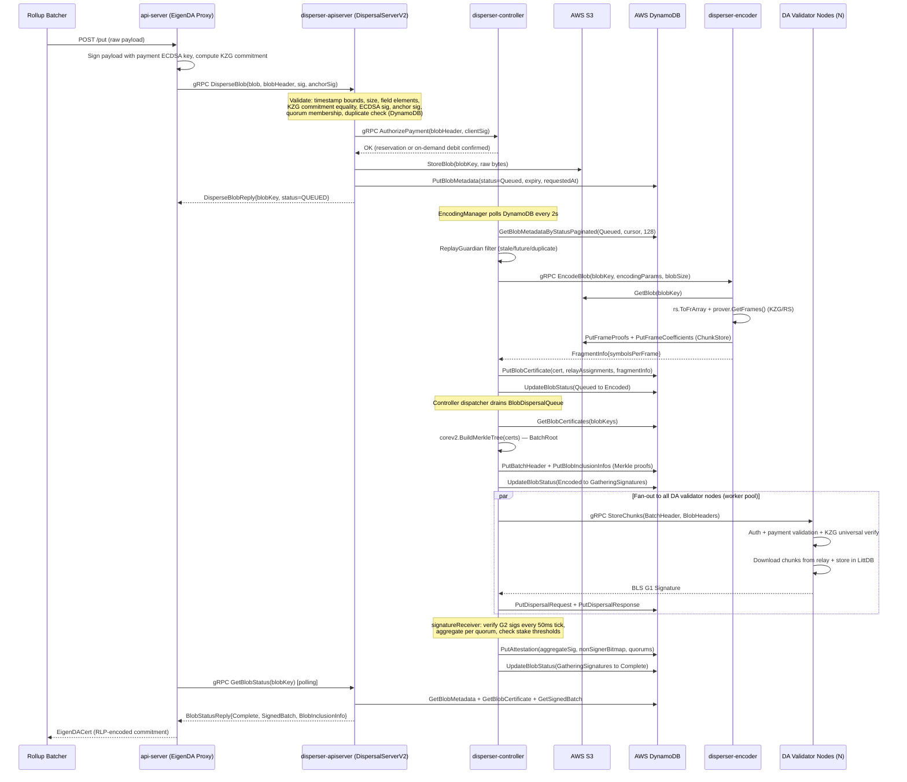
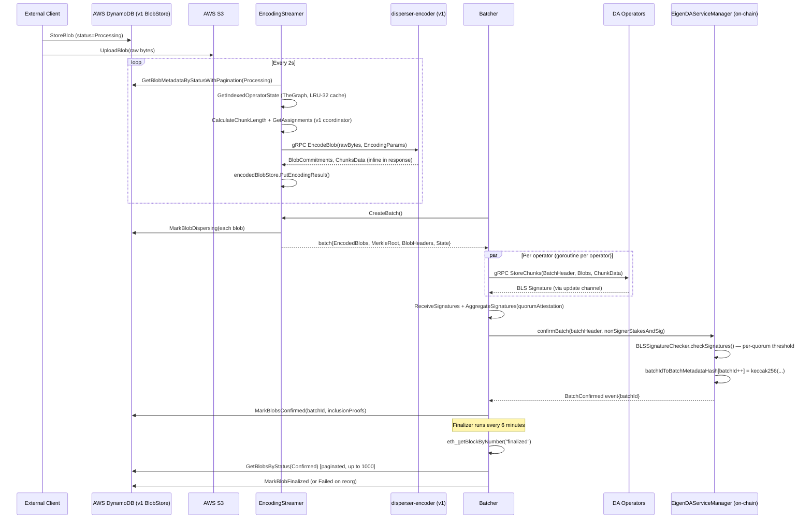
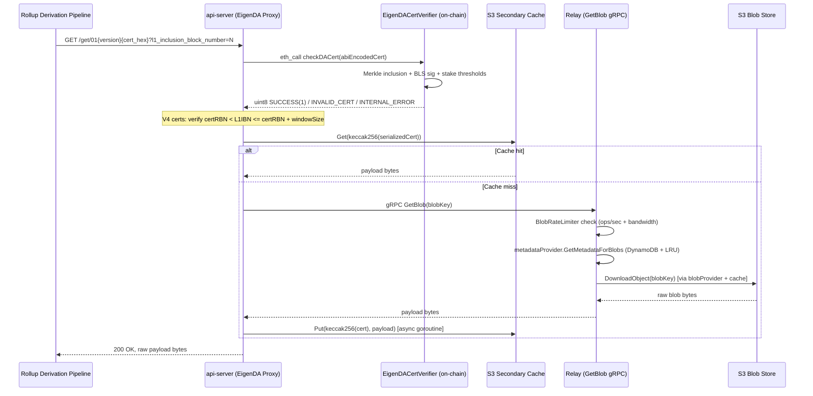
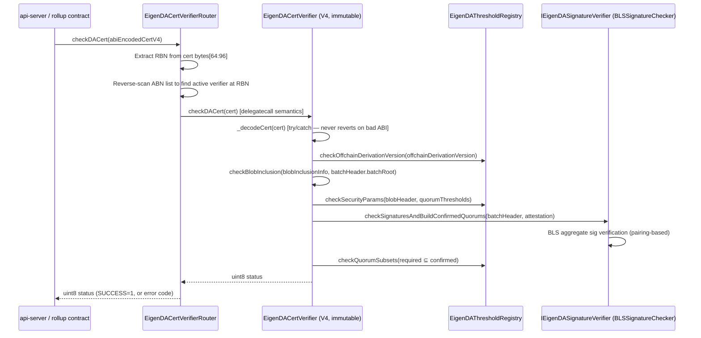
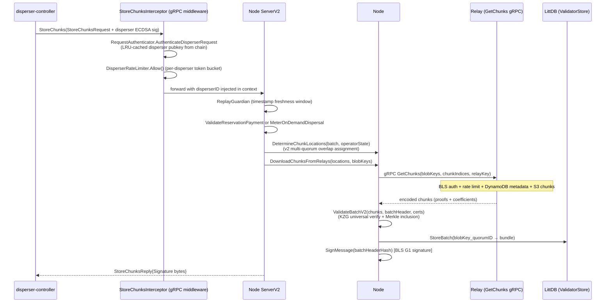

# EigenDA Architecture Documentation

**Generated**: 2026-04-10  
**Source**: https://github.com/Layr-Labs/eigenda  
**Commit**: 61019b4e9f91cbbb3dc05ed758674e4bdfeee20e

---

## Table of Contents

1. [System Overview](#1-system-overview)
2. [Architecture Overview](#2-architecture-overview)
3. [Component Catalog](#3-component-catalog)
   - [Go Libraries](#31-go-libraries)
   - [Go Services](#32-go-services)
   - [Solidity Contract Groups](#33-solidity-contract-groups)
   - [Rust Crates](#34-rust-crates)
   - [TypeScript Subgraphs](#35-typescript-subgraphs)
4. [Dependency Graphs](#4-dependency-graphs)
   - [Library Dependency Graph](#41-library-dependency-graph)
   - [Application Interaction Graph](#42-application-interaction-graph)
5. [Major Data Flows](#5-major-data-flows)
   - [V2 Blob Dispersal Pipeline](#51-v2-blob-dispersal-pipeline)
   - [V1 Blob Dispersal Pipeline (Legacy Batcher)](#52-v1-blob-dispersal-pipeline-legacy-batcher)
   - [Blob Retrieval via Proxy](#53-blob-retrieval-via-proxy)
   - [Certificate Verification](#54-certificate-verification)
   - [DA Node StoreChunks Flow](#55-da-node-storechunks-flow)
6. [Technology Stack](#6-technology-stack)
7. [External Integrations](#7-external-integrations)
8. [Security Architecture](#8-security-architecture)
9. [Multi-Version Protocol](#9-multi-version-protocol)
10. [On-Chain Contract Architecture](#10-on-chain-contract-architecture)
11. [Rust SDK](#11-rust-sdk)
12. [Development Guidance](#12-development-guidance)
13. [Recommendations](#13-recommendations)

---

## 1. System Overview

EigenDA is a decentralized **data availability (DA) layer** built on top of EigenLayer. It enables rollups (Optimism, Arbitrum, and others) to post blob data to EigenDA instead of Ethereum calldata, significantly reducing costs while preserving security guarantees backed by restaked ETH through EigenLayer's cryptoeconomic model.

**Core purpose**: Allow rollup batchers to cheaply publish transaction data ("blobs") that can be retrieved by any party during the rollup's challenge window. The DA guarantee is enforced through:

1. **Erasure coding** — KZG polynomial commitments + Reed-Solomon, so any sufficient subset of encoded chunks can reconstruct the original blob
2. **BLS multi-signatures** — A threshold of registered EigenLayer DA node operators sign to attest they have stored their assigned chunks
3. **On-chain verification** — Smart contracts verify BLS aggregate signatures meet quorum stake thresholds

**Who uses EigenDA:**
- **Rollup sequencers/batchers** — POST blobs via EigenDA Proxy (the `api-server`)
- **Rollup derivation pipelines** — GET blobs by cert commitment, verify on-chain cert validity
- **DA node operators** — Receive chunks, store them in LittDB, sign to attest
- **Relay nodes** — Serve chunks to validators and retrievers from S3-backed LRU caches
- **ZK-VMs and proof systems** — Verify EigenDA certs inside RISC0 and similar using the Rust `eigenda-verification` crate

---

## 2. Architecture Overview

EigenDA is organized as a Go monorepo (`go.mod` at root) with additional Rust (`rust/crates/`), Solidity (`contracts/`), and TypeScript (`subgraphs/`) components.

**Component taxonomy**:

| Kind | Count | Description |
|------|-------|-------------|
| Go Libraries | 14 | Shared domain logic and infrastructure packages |
| Go Services | 7 | Deployable binaries (disperser pipeline, proxy, observability) |
| Solidity Contract Groups | 3 | Core protocol contracts, cert verifiers, ejection manager |
| Rust Crates | 5 | Verification pipeline (SRS data, verification, Ethereum bridge, HTTP client, tests) |
| TypeScript Subgraphs | 4 | The Graph indexers for operator state, batch metadata, payments |

**High-level topology:**

```
Rollup Batcher/Derivation
        |
   [api-server] (EigenDA Proxy)
   HTTP/REST + Arbitrum JSON-RPC
        |
   [disperser-apiserver] or [disperser-blobapi]
   gRPC v2 ingest ──────────────────────────► [disperser-controller]
                                                      |
                                         [disperser-encoder] (KZG/RS)
                                                      |
                                          DA Node Operators (gRPC StoreChunks)
                                                      |
                                              BLS Signature Aggregation
                                                      |
                                             DynamoDB Attestation Write
                                          (no on-chain tx in v2)
        |
   [relay] ◄────────────────────────────── DA Node Operators
   Blob/Chunk Serving (GetBlob/GetChunks)
        |
   S3 Chunk Store
```

**Two dispersal pipelines exist side-by-side:**
- **v2 (modern)**: `disperser-apiserver` → DynamoDB state machine → `disperser-encoder` → `disperser-controller` → DA nodes → BLS aggregation → DynamoDB certificate (no per-batch Ethereum transaction)
- **v1 (legacy)**: `disperser-batcher` → `disperser-encoder` → DA nodes → BLS aggregation → `confirmBatch` on-chain to `EigenDAServiceManager`

---

## 3. Component Catalog

### 3.1 Go Libraries

#### `common` (`common/`)
**Phase**: Foundation (no internal dependencies on other EigenDA modules)

Foundational shared utility library used by nearly every other component. Provides:
- **EthClient** with multi-homing round-robin failover across multiple RPC endpoints (linear-backoff retry, fault counting via `FailoverController`)
- **AWS DynamoDB client** — batched reads/writes (25 items/batch write, 100/batch read), conditional puts with preconditions, paginated GSI queries, atomic increments
- **AWS S3 client** — multipart upload/download (10 MiB parts, 3 concurrency), partial range downloads (`DownloadPartialObject`), OCI-compatible variant
- **AWS KMS** — secp256k1 Ethereum transaction signing with hardware-managed keys
- **Rate limiter** — leaky bucket with DynamoDB or in-memory backend, configurable time-scale buckets
- **Replay attack guard** — time-windowed hash set with priority-queue-based expiration
- **Config parser** — reflection-based environment variable binding (SCREAMING_SNAKE_CASE) with multi-source TOML/YAML/JSON via Viper
- **Structured logger** — wraps eigensdk-go/logging with gRPC interceptor adapter
- **Self-documenting Prometheus metrics factory** — auto-generates documentation entries alongside every metric registration

#### `core` (`core/`)
**Phase**: Foundation (depends on `api`, `common`, `encoding`, `indexer`)

Central domain model and business logic. Defines the authoritative type vocabulary and all key interfaces:
- **Domain types**: `Blob`, `BlobHeader`, `BlobQuorumInfo`, `BatchHeader`, `OperatorState`, `SecurityParam`, `PaymentMetadata`, `VersionedBlobParameters`
- **BN254 BLS cryptography** (`core/bn254/`) — pairing-based signature verification, hash-to-curve, rogue-key-attack-resistant proof of possession via `MakePubkeyRegistrationData`
- **BLS attestation types** (`core/attestation.go`) — `G1Point`, `G2Point`, `Signature`, `KeyPair` wrapping gnark-crypto with domain-relevant methods
- **Signature aggregation** (`core/aggregation.go`) — `StdSignatureAggregator`: collects operator BLS signatures, verifies per-operator G2 pubkeys, accumulates stake-weighted totals per quorum, verifies aggregate public key equals quorumAPK minus non-signer keys, verifies aggregate signature
- **Chunk assignment v1** — stake-proportional chunk assignment with multiplicative binary search for chunk length (`StdAssignmentCoordinator`)
- **Chunk assignment v2** (`core/v2/`) — multi-quorum overlap maximization with `AddAssignmentsForQuorum`, `MergeAssignmentsAndCap`
- **Shard validators** (v1 + v2) — KZG universal verification + Merkle inclusion checks; parallelized via `WorkerPool`
- **Ethereum chain I/O** (`core/eth/`) — `Reader`/`Writer` interfaces with generated Go contract bindings (registry coordinator, stake registry, payment vault, relay registry, cert verifier, etc.)
- **Payment subsystem** (`core/payments/`) — reservation ledger, on-demand ledger, server-side validators, `PaymentVault` interface
- **Signing rate tracker** (`core/signingrate/`) — per-validator time-bucketed signing history with DynamoDB-backed persistence and in-memory mirroring
- **TheGraph state** (`core/thegraph/`) — `IndexedChainState` implementation querying EigenDA subgraphs via GraphQL with exponential backoff retry
- **Meterer** (`core/meterer/`) — validates payment modes (reservation or on-demand), DynamoDB-backed accounting, periodic on-chain state refresh

#### `encoding` (`encoding/`)
**Phase**: Foundation (depends on `api`, `common`, `core`, `crypto`)

Full KZG + Reed-Solomon encoding engine:
- **Codec** — BN254 field-element padding: inserts 0x00 MSB per 31-byte chunk to ensure each 32-byte symbol fits within the BN254 scalar field
- **FFT engine** (`encoding/v2/fft/`) — BN254 scalar field FFT; roots of unity, NTT on G1 points (FFTG1), polynomial shift/unshift, erasure recovery from samples
- **RS encoder/decoder** — pluggable backend interface; RS extension and polynomial interpolation via FFT; `Decoder` reconstructs blob from any sufficient subset of frames
- **KZG committer** — G1 commitment, G2 length commitment, G2 length proof via multi-scalar multiplication (MSM)
- **KZG prover** — FK20 amortized multi-proof generation; `ParametrizedProver` holds pre-computed Toeplitz FFT SRS tables per `(ChunkLength, BlobLength)` pair
- **KZG verifier** — universal batch verification: single pairing check via random linear combinations over all frames; also verifies length proofs via G1/G2 pairing
- **Backends**: GnarkBackend (CPU, always available) and IcicleBackend (GPU/CUDA, enabled via `icicle` build tag); selected at runtime via `encoding.Config.BackendType`
- SRS up to 2^28 G1 points; precomputed Toeplitz sub-tables cached to disk to amortize setup cost across restarts

#### `disperser` (`disperser/`)
**Phase**: Phase 2 (depends on `api`, `common`, `core`, `encoding`, `indexer`, `operators`, `relay`)

Core dispersal subsystem library implementing both pipeline generations:
- **v2 DispersalServerV2** — gRPC handler for blob ingest (validate request, store S3+DynamoDB, call Controller for payment authorization)
- **v2 EncodingManager** — polls DynamoDB for Queued blobs (128 per iteration via paginated cursor), submits to encoder gRPC (worker pool, 250 workers default), writes BlobCertificate + FragmentInfo, advances to Encoded
- **v2 Controller** — assembles Merkle-tree batches from BlobDispersalQueue (DynamoDB-backed buffered channel, 1024 cap), fans out StoreChunks to DA validators (LRU-cached NodeClientManager, 400 entries), drives BLS aggregation via `signatureReceiver`
- **v2 BlobMetadataStore** — DynamoDB-backed with 5 GSIs; conditional writes with state-transition preconditions prevent invalid transitions
- **v1 Batcher** — `EncodingStreamer` + `Dispatcher` + `TransactionManager` + `Finalizer` legacy pipeline
- **DataAPI Server** (v1 + v2) — Gin HTTP REST with multi-layer LRU/FeedCache caching for blob/batch/operator/account/metrics endpoints
- **Payment metering** — `PaymentAuthorizationHandler` for on-demand (DynamoDB debit) and reservation (bandwidth ledger) validation

#### `relay` (`relay/`)
**Phase**: Phase 2 (depends on `api`, `common`, `core`, `crypto`, `disperser`, `encoding`)

gRPC server that caches and serves encoded blob data:
- **Server** — composes metadataProvider, blobProvider, chunkProvider; enforces authentication and rate limits on every request
- **metadataProvider** — DynamoDB metadata with atomic FIFO LRU cache; validates relay shard key ownership per blob
- **blobProvider** — S3 raw blob bytes with byte-weighted FIFO LRU cache
- **chunkProvider** — S3 frame proofs + RS coefficients; fetches proofs and coefficients concurrently via parallel goroutines, merges into `core.ChunksData`
- **CacheAccessor** — generic deduplication of in-flight requests via weighted semaphores; prevents thundering-herd when multiple goroutines miss cache simultaneously
- **ChunkReader/ChunkWriter** — S3-backed with range-aware partial-object downloads (`DownloadPartialObject`) for efficient chunk serving
- **Two-level rate limiter** — global + per-client token-bucket for both ops/sec and bandwidth/sec; per-client limiters lazily initialized
- **BLS request auth** — verifies `GetChunks` request signatures against operator G2 pubkeys looked up from TheGraph, cached in LRU

#### `node` (`node/`)
**Phase**: Phase 2 (depends on `api`, `common`, `core`, `encoding`, `litt`, `operators`)

DA validator node logic:
- **ServerV2** — `StoreChunks` gRPC handler: auth interceptor → replay guard → payment validation → chunk location determination → relay download (worker pool) → KZG+Merkle validation → LittDB storage → BLS sign → return signature
- **ValidatorStore** — LittDB-backed chunk storage keyed by `blobKey||quorumID`; per-blob deduplication locks, hot/cold read rate limiting via `golang.org/x/time/rate`
- **RequestAuthenticator** — LRU-cached disperser ECDSA pubkey verification with configurable TTL; enforces which dispersers are authorized for on-demand payments
- **StoreChunksInterceptor** — gRPC unary interceptor: authenticates request, checks per-disperser token-bucket rate limit, injects disperserID into context
- **EjectionSentinel** — background goroutine polling `IEigenDAEjectionManager` for pending ejections; submits cancellation transaction if ejection defense configured
- **Operator registration** — churner gRPC client for quorum capacity negotiation; BLS+ECDSA signing for registration

#### `litt` (`litt/`)
**Phase**: Phase 2 (depends on `common`, `core`)

LittDB — EigenDA's custom-built low-latency blob storage engine for DA nodes:
- **Architecture**: append-only segment files (key file + N sharded value files), write-cache, LevelDB or in-memory keymap, horizontal sharding across physical drives, per-table TTL, named tables
- **Concurrency**: channel-based `controlLoop` serializes mutations; reference-counting on segments prevents GC-during-read races; `flushCoordinator` batches rapid flush requests
- **Storage tiers**: `DiskTable` (durable), `cachedTable` (LRU/FIFO write+read cache decorator), `memTable` (in-memory for tests)
- **ErrorMonitor** — non-panic background goroutine error escalation with configurable `FatalErrorCallback`
- **GC**: `controlLoop` drives segment GC on configurable period; segments deleted when all keys have expired TTL

#### `operators` (`operators/`)
**Phase**: Phase 2 (depends on `api`, `common`, `core`, `indexer`, `node`)

Operator state management: indexed operator set queries via TheGraph with chain fallback, quorum scanning, socket resolution, LRU-cached lookups keyed by `(blockNumber, quorumIDs)`.

#### `indexer` (`indexer/`)
**Phase**: Phase 2 (depends on `common`)

Ethereum event log subscriber for operator BLS key registrations and socket updates; populates in-memory indexed operator state as an alternative to TheGraph (though TheGraph is now preferred/mandatory in batcher).

#### `ejector` (`ejector/`)
**Phase**: Phase 2 (depends on `api`, `common`, `core`, `disperser`)

Operator ejection tooling: builds and submits ejection transactions against `EigenDAEjectionManager`; monitors pending ejection states.

#### `api` (`api/`)
**Phase**: Phase 2 (depends on `common`, `core`, `encoding`, `indexer`, `node`)

Protobuf/gRPC generated code and typed client/server wrappers for all EigenDA gRPC protocols: disperser v1/v2, node dispersal/retrieval, relay, encoder v1/v2, controller service, and churner.

#### `clients` (`api/proxy/clients/`)
**Phase**: Foundation (no internal EigenDA dependencies)

EigenDA V2 gRPC client implementations for relay (`GetBlob`/`GetChunks`) and validator node (`StoreChunks`/`GetChunks`) communication; used by `api-server` for payload retrieval.

#### `retriever` (`retriever/`)
**Phase**: Phase 2 (depends on `api`, `common`, `core`, `encoding`)

Blob retrieval client library supporting both relay and direct validator retrieval paths; used for legacy v1 blob reconstruction.

#### `crypto` (`crypto/`)
**Phase**: Foundation (no internal dependencies)

Low-level BN254 elliptic curve utilities and field arithmetic wrappers around gnark-crypto; used by `encoding` and `relay`.

---

### 3.2 Go Services

#### `api-server` (`api/proxy/cmd/server/`)
**Role**: Rollup-facing DA adapter (EigenDA Proxy)

HTTP sidecar translating rollup DA protocols into EigenDA v2 calls:
- **OP-stack ALT-DA** — REST PUT/GET under `/put` and `/get/{commitment}`; maps OP generic commitment mode to EigenDA certs; 40-minute `WriteTimeout` for blob finalization latencies
- **Arbitrum Nitro Custom DA** — JSON-RPC server under `daprovider` namespace; `Store`/`RecoverPayload`/`CollectPreimages` methods; optional HS256 JWT auth
- **Blob PUT**: signs payload with operator ECDSA payment key → gRPC `DisperseBlobAuthenticated` to disperser → awaits EigenDACert → optional S3 secondary backup (sync with 5x exponential retry, or async via goroutine)
- **Blob GET**: verifies cert via `eth_call` to `EigenDACertVerifier` → tries S3 cache → falls back to relay/validator retrieval; writes-on-cache-miss
- **V4 cert recency check**: verifies `certRBN < L1InclusionBlockNumber <= certRBN + windowSize`
- **Error mapping**: 429 (rate limited), 503 (failover signal to Ethereum DA), 418 (invalid cert — instructs derivation to discard)
- **Prometheus metrics**: request counts/durations by method, status, commitment mode, cert version

#### `disperser-apiserver` (`disperser/cmd/apiserver/`)
**Role**: External-facing v2 gRPC ingest

Primary entry point for client blob dispersal in the v2 protocol:
- Stateless per-request; on-chain state refreshed in background goroutine (atomic pointer, zero locking on hot path)
- Validates: 65-byte ECDSA sig, blob size, BN254 field element compliance, KZG commitment match, quorum membership, dispersal timestamp freshness (`[now - MaxDispersalAge, now + MaxFutureDispersalTime]`)
- Optionally validates anchor signature binding request to specific disperser ID and chain ID (prevents cross-disperser replay)
- Delegates payment logic entirely to controller via `AuthorizePayment` gRPC
- Stores blob in S3, writes DynamoDB metadata with status `Queued`; async `UpdateAccount` goroutine records last-seen timestamp
- Mirrors signing rate data from controller at startup (blocking) and periodically (goroutine) for low-latency `GetValidatorSigningRate` responses
- gRPC keepalive parameters (max connection age, idle age, grace period) prevent resource exhaustion

#### `disperser-controller` (`disperser/cmd/controller/`)
**Role**: v2 pipeline orchestrator

Control-plane for the v2 dispersal lifecycle:
- **EncodingManager**: polls DynamoDB for Queued blobs (128/iteration), filters stale/duplicate via `ReplayGuardian`, submits to encoder gRPC (worker pool, 250 workers default), writes BlobCertificate + FragmentInfo (random relay subset from `AvailableRelays`), advances to Encoded
- **Controller (dispatcher)**: drains `BlobDispersalQueue` (DynamoDB-backed buffered channel, 1024 capacity), assembles up to 32 blobs/batch, builds Merkle tree over certs (`corev2.BuildMerkleTree`), writes `BatchHeader` + `BlobInclusionInfos`, fans out `StoreChunks` to all DA validators (LRU-cached `NodeClientManager`, 400 entries)
- **signatureReceiver**: collects `SigningMessage`s, verifies individual G2 BLS sigs, aggregates per quorum, yields `QuorumAttestation` on 50ms tick, times out after `BatchAttestationTimeout`
- **BatchMetadataManager**: background goroutine fetching reference block (75 blocks behind head via `FinalizationBlockDelay`) + TheGraph indexed operator state; atomic snapshot for non-blocking `GetMetadata()`
- **PaymentAuthorizationHandler**: routes to `OnDemandMeterer` (DynamoDB debit ledger) or `ReservationPaymentValidator` (per-account bandwidth ledger)
- **RecoverState**: on startup, marks blobs stuck in `GatheringSignatures` as `Failed` (crash recovery idempotency)
- Exposes gRPC APIs to apiserver: `AuthorizePayment`, `GetValidatorSigningRate`, `GetValidatorSigningRateDump`

#### `disperser-batcher` (`disperser/cmd/batcher/`)
**Role**: v1 legacy pipeline orchestrator

Four cooperating goroutine groups:
1. **EncodingStreamer** — polls DynamoDB for `Processing` blobs every 2s, calculates stake-proportional chunk assignments (TheGraph mandatory, LRU-32 cache), dispatches gRPC `EncodeBlob` to worker pool (256 connections), stores results in in-memory `encodedBlobStore`; fires `EncodedSizeNotifier` when total size crosses `BatchSizeMBLimit`
2. **Batcher main loop** — fires on timer or size threshold; `CreateBatch` drains `encodedBlobStore`, marks blobs `Dispersing` in DynamoDB, builds Merkle tree; `DisperseBatch` fans out StoreChunks per operator (Gnark or Gob serialization, 60 GiB max send); `AggregateSignatures` over non-empty quorums
3. **TxnManager** — submits `confirmBatch` Ethereum transaction; monitors receipt with polling; re-submits with +10% gas if not mined within timeout; supports AWS KMS or plaintext private key signing; optional Fireblocks broadcast cancellation
4. **Finalizer** — every 6 min, queries `eth_getBlockByNumber("finalized")`, iterates `Confirmed` blobs, marks `Finalized` or `Failed` on reorg

**Note**: `UseGraph=false` is a startup error; LevelDB indexer is deprecated.

#### `disperser-blobapi` (`disperser/cmd/blobapi/`)
**Role**: Combined DispersalServerV2 + Relay in one process

Co-hosts two gRPC services with independent flag namespaces, listeners, and Prometheus registries but shared AWS credentials and Ethereum connectivity. The process terminates if either subsystem exits (select on both error channels).

#### `disperser-encoder` (`disperser/cmd/encoder/`)
**Role**: Encoding-as-a-service gRPC

Two protocol modes:
- **v1 (EncoderServer)**: caller sends raw bytes → dual-channel flow control (backlog queue + concurrency semaphore) → `Prover.EncodeAndProve()` → serialize commitments + chunks (Gnark or Gob) → return inline; 300 MiB max gRPC receive message size
- **v2 (EncoderServerV2)**: caller sends only BlobKey → fetch from S3 → convert to BN254 field elements via `rs.ToFrArray` → `prover.GetFrames()` → write proofs+coefficients to ChunkStore (S3) → return `FragmentInfo{SymbolsPerFrame}`; validates chunk length is power-of-2 and blob size fits encoding grid

GPU acceleration via Icicle (`nvidia/cuda:12.2.2` Docker build, `icicle` Go build tag). `MaxConcurrentRequestsDangerous` also serves as CUDA memory safety semaphore weight. Prometheus metrics per stage.

#### `disperser-dataapi` (`disperser/cmd/dataapi/`)
**Role**: Read-only observability API

Gin HTTP server (v1 under `/api/v1`, v2 under `/api/v2`) with multi-layer caching:
- **FeedCache[T]** — time-range-aware segment cache over `CircularQueue`; supports bidirectional cursor-based pagination; async extension for out-of-cache time ranges
- **hashicorp LRU** — per-key blob metadata, blob certificates, attestation info, batch responses
- **expirable.LRU** — 1-minute TTL for account feeds

HTTP `Cache-Control: max-age=N` headers propagated to clients and reverse proxies. Signal-based graceful shutdown (`SIGINT`/`SIGTERM`). Swagger 2.0 auto-generated via swaggo.

Data sources: DynamoDB (blob/batch/operator/account), TheGraph (operator state, payments via GraphQL), Prometheus server (PromQL range queries for throughput/signing rate timeseries), Ethereum RPC (stake data, operator liveness TCP checks).

---

### 3.3 Solidity Contract Groups

#### `core` (`contracts/src/core/`)
**37 declarations** (9 contracts, 11 interfaces, 11 libraries, 6 abstract contracts)

Key contracts:
- **EigenDAServiceManager** — v1 batch confirmation: inherits `ServiceManagerBase` (EigenLayer AVS) and `BLSSignatureChecker` (inherited aggregate BLS verification); `confirmBatch()` callable only by whitelisted `batchConfirmer` addresses; validates per-quorum signed stake meets threshold; stores `batchIdToBatchMetadataHash[batchId]`; emits `BatchConfirmed`. `BLOCK_STALE_MEASURE=300` blocks window.
- **PaymentVault** — two payment modes: timed reservations (`symbolsPerSecond` budget for date range) and on-demand ETH deposits (cumulative `uint80` accounting). Price-update cooldown mechanism. Owner can set reservations and withdraw ETH/ERC-20.
- **EigenDADirectory** — V3 service discovery: `IEigenDAAddressDirectory` (name → address, add/replace/remove) + `IEigenDAConfigRegistry` (name → versioned bytes checkpoints, block-number or timestamp keyed). Single source of truth for all protocol contract addresses.
- **EigenDAThresholdRegistry** — quorum security parameters: adversary threshold %, confirmation threshold %, required quorum bytes, versioned `BlobVersionParameters` (maxNumOperators, numChunks, codingRate)
- **EigenDARegistryCoordinator** — V3 AVS registry coordinator managing `StakeRegistry`, `BLSApkRegistry`, `IndexRegistry`; EIP-712 signature-based registration; resolves dependencies at runtime via `AddressDirectoryLib`
- **EigenDAAccessControl** — V3 role-based access: `OWNER_ROLE`, `EJECTOR_ROLE`, `QUORUM_OWNER_ROLE` via OZ `AccessControlEnumerable`; intended behind a timelock in production
- **EigenDARelayRegistry** — append-only `uint32` relay key → `RelayInfo` (address + URL) mapping; owner appends via `addRelayInfo()`
- **EigenDADisperserRegistry** — `uint32` disperser key → `DisperserInfo` (address) mapping

**Storage pattern**: `*Storage` abstract contracts with 46-47 slot `__GAP` arrays for upgrade safety behind transparent proxies.

**Access control evolution**: V1/V2 era uses `OwnableUpgradeable`; V3 era uses `EigenDAAccessControl` with runtime address resolution via `AddressDirectoryLib` (EIP-7201-inspired namespaced storage slot pattern).

#### `integrations` (`contracts/src/integrations/`)
**15 declarations** (5 contracts, 4 libraries, 6 interfaces)

Versioned cert verifier adapter layer:
- **EigenDACertVerifier** (V4, current) — immutable; constructor locks threshold registry, signature verifier, security thresholds, required quorum bytes, and `offchainDerivationVersion`; `checkDACert(bytes)` never reverts (two-level try/catch handles `Error(string)`, `Panic(uint256)`, and raw bytes reverts separately); returns `uint8` status (SUCCESS=1, INVALID_CERT, INTERNAL_ERROR) for ZK-VM compatibility
- **EigenDACertVerificationLib** — V4 verification chain: `checkOffchainDerivationVersion` → `checkBlobInclusion` (Merkle path vs `batchRoot`) → `checkSecurityParams` (coding rate inequality) → `checkSignaturesAndBuildConfirmedQuorums` → `checkQuorumSubsets`
- **EigenDACertVerifierRouter** — upgradeable (OwnableUpgradeable proxy); dispatches `checkDACert` to cert verifier active at certificate's RBN via reverse-linear scan of registered ABNs; ABNs must be strictly increasing and in the future at time of registration
- **CertVerifierRouterFactory** — atomic deploy-and-initialize to prevent frontrun initialization attacks
- **EigenDACertVerifierV1/V2** — legacy verifiers (batch hash map lookup and BLS sig verification) kept for backwards compatibility

#### `periphery` (`contracts/src/periphery/`)
**6 declarations** (1 contract, 1 interface, 3 libraries, 1 abstract contract)

Operator ejection lifecycle:
- **EigenDAEjectionManager** — three-phase optimistic challenge protocol: `startEjection` (ejector role grants, sets `proceedingTime = now + delay`), `cancelEjection` (operator or ejector cancels during delay window), `completeEjection` (permissionless after delay). Cooldown enforced between consecutive ejections per operator. `cancelEjectionWithSig` accepts BLS signature for operator self-cancel without on-chain transaction from ejector.
- Uses EIP-7201-style namespaced storage (`keccak256(keccak256("eigen.da.ejection") - 1) & ~0xff`). Immutable constructor-injected dependencies baked into bytecode (no storage reads for critical callees).
- Semver: `(3, 0, 0)`.

---

### 3.4 Rust Crates

#### `eigenda-srs-data` (`rust/crates/eigenda-srs-data/`)
**Phase**: Foundation (no internal Rust workspace dependencies)

Compile-time KZG SRS embedding:
- Build script (`build.rs`) reads `resources/srs/g1.point`, parses 524,288 BN254 G1Affine points via `rust-kzg-bn254-prover`, serializes raw bytes to `$OUT_DIR/srs_points.bin` (~16 MiB), generates `constants.rs` (`POINTS_TO_LOAD=524288`, `BYTE_SIZE=POINTS_TO_LOAD * size_of::<G1Affine>()`)
- `include_bytes!` physically embeds the data in the binary's read-only segment at compile time
- Public API: single `pub static SRS: LazyLock<SRS<'static>>` — zero-copy `unsafe transmute` on first access, thread-safe via `LazyLock`, zero heap allocation
- 524,288 points corresponds to a 16 MiB maximum blob polynomial degree

#### `eigenda-verification` (`rust/crates/eigenda-verification/`)
**Phase**: Phase 2 (depends on `eigenda-srs-data`)

Pure synchronous Rust cert verification library for rollup derivation pipelines and ZK-VMs:
- **`StandardCommitment`** — version-agnostic wrapper; parses RLP-encoded certs via `from_rlp_bytes`, dispatches to `EigenDACertV2` (version byte `0x01`) or `EigenDACertV3` (`0x02`)
- **State extraction** — `CertStateData` holds 8 `AccountProof` values (one per contract: threshold registry, registry coordinator, service manager, BLS APK registry, stake registry, delegation manager, cert verifier router, cert verifier); `verify(state_root)` validates all proofs against Ethereum block state root; `extract(cert, block)` decodes storage slots into `CertVerificationInputs`
- **`DataDecoder`/`StorageKeyProvider` traits** — extractor pattern for per-contract storage slot decoding (10 extractor types: quorum counts, operator bitmap history, total stake history, APK history, versioned blob params, next blob version, stale stakes forbidden, security thresholds V2, required quorum numbers V2, cert verifier ABNs + addresses)
- **Certificate verification** — 9-stage pipeline: Merkle blob inclusion → blob version validation → security assumption checks → input array length validation → reference block ordering → non-signer bitmap reconstruction (hash-sorted) → per-quorum stake calculation and confirmation threshold validation → APK aggregation (`∑Q_i − ∑(c_j × PK_j)`) → BLS pairing check
- **BLS verification** — Fiat-Shamir challenge `γ = keccak256(msg || apk_g1 || apk_g2 || sigma)`, randomised pairing `e(σ + γG₁, -G₂) · e(H(m) + γG₁, APK_G₂) = 1` via arkworks `Bn254::multi_miller_loop` + `final_exponentiation`
- **KZG blob verification** — recomputes G1 commitment from blob data using embedded SRS, compares against claimed commitment
- **Codec** — decodes EigenDA field-element encoding: verifies 32-byte header `[0x00, version, len_u32_be, 0x00*26]`, strips guard bytes (31 bytes payload per 32-byte symbol), validates zero-padding

#### `eigenda-ethereum` (`rust/crates/eigenda-ethereum/`)
**Phase**: Phase 2 (depends on `eigenda-verification`)

Async Ethereum RPC bridge for the verification pipeline:
- **EigenDaProvider** — wraps Alloy `DynProvider` with `RetryBackoffLayer` (configurable `max_retries`, `backoff_ms`, `cu_per_second`); resolves all 7 contract addresses from `EigenDADirectory` at initialization via sequential `getAddress(name)` `eth_call`s
- **`fetch_cert_state`** — fans out 8 parallel `eth_getProof` calls via `try_join!`, assembles `CertStateData`; annotated with `#[instrument(skip_all)]`
- **Network enum** — `Mainnet`/`Hoodi`/`Sepolia`/`Inabox` with hardcoded `EigenDADirectory` addresses
- **`get_cert_verifier_at_rbn`** — calls `EigenDACertVerifierRouter.getCertVerifierAt(rbn)` to resolve active verifier at certificate's reference block
- TLS via `rustls` + `aws-lc-rs` crypto backend, installed as global default at construction

#### `eigenda-proxy` (`rust/crates/eigenda-proxy/`)
**Phase**: Phase 2 (depends on `eigenda-verification` for `StandardCommitment` type)

Rust HTTP client for the EigenDA proxy server:
- **`ProxyClient`** — `store_payload` (`POST /put?commitment_mode=standard`) and `get_encoded_payload` (`GET /get/0x{cert_hex}?commitment_mode=standard&return_encoded_payload=true`)
- Exponential backoff retries via `backon`; only retries connection and timeout errors
- Optional `ManagedProxy` (`managed-proxy` feature flag) — downloads platform-specific Go `eigenda-proxy` binary at compile time with SHA-256 verification; spawns as subprocess via `tokio::process::Command` with `kill_on_drop(true)`

#### `eigenda-tests` (`rust/crates/eigenda-tests/`)
**Phase**: Foundation (no internal workspace dependencies)

E2E integration test harness; `AnvilNode` testcontainers image launches Foundry Anvil local Ethereum (supports `Interval`, `EachTransaction`, `Manual` mining modes).

---

### 3.5 TypeScript Subgraphs

| Name | Path | Purpose |
|------|------|---------|
| `eigenda-operator-state` | `subgraphs/eigenda-operator-state/` | Indexes operator BLS public keys, quorum registrations, socket addresses, stake changes from EigenDARegistryCoordinator events |
| `eigenda-batch-metadata` | `subgraphs/eigenda-batch-metadata/` | Indexes v1 BatchConfirmed events and batch header hashes from EigenDAServiceManager |
| `eigenda-payments` | `subgraphs/eigenda-payments/` | Indexes reservation and on-demand payment events from PaymentVault (uses @graphprotocol/graph-ts 0.37.0) |
| `eigenda-subgraphs` | `subgraphs/` | Monorepo root with shared deployment tooling |

AssemblyScript handlers compile to WASM and run in The Graph's hosted indexing infrastructure. All three subgraphs are queried via GraphQL from `core/thegraph/`, `disperser/dataapi/`, `relay/`, and `operators/`.

---

## 4. Dependency Graphs

### 4.1 Library Dependency Graph

**Phase 1 — Foundation (no internal EigenDA dependencies):**
```
clients     crypto     @eigenda/contracts
eigenda-srs-data       eigenda-tests
eigenda-batch-metadata eigenda-operator-state
eigenda-payments       eigenda-subgraphs
```

**Phase 2 — Depends on Phase 1 libraries:**

Go module internal dependencies (edge = "from depends on to"):
```
api        ──► common, core, encoding, indexer, node
common     ──► core, disperser, ejector, encoding, litt
core       ──► api, common, encoding, indexer
disperser  ──► api, common, core, encoding, indexer, operators, relay
ejector    ──► api, common, core, disperser
encoding   ──► api, common, core, crypto
indexer    ──► common
litt       ──► common, core
node       ──► api, common, core, encoding, litt, operators
operators  ──► api, common, core, indexer, node
relay      ──► api, common, core, crypto, disperser, encoding
retriever  ──► api, common, core, encoding
```

Rust crate internal dependencies:
```
eigenda-srs-data     (Phase 1)
eigenda-verification ──► eigenda-srs-data
eigenda-ethereum     ──► eigenda-verification
eigenda-proxy        ──► eigenda-verification
```

**Important**: The Go modules share a single root `go.mod`. Cross-library cycles (e.g., `api ↔ core`) are permitted within a single module but would prevent future extraction into separate modules. The Rust crates are properly acyclic.

### 4.2 Application Interaction Graph

**Services and their primary interactions:**

```
External Clients (Rollup Batchers / Derivation Pipelines)
          |
    [api-server]  ──eth_call──► [contracts/integrations] (checkDACert)
    |                                    |
    |                          [contracts/core] (BLS verify, threshold registry)
    |
    |──gRPC DisperseBlob──► [disperser-apiserver]
    |                               |──gRPC AuthorizePayment──► [disperser-controller]
    |                                                                   |
    |                                                         [disperser-encoder]
    |                                                         (gRPC EncodeBlob v2)
    |                                                                   |
    |                                                       DA Validator Nodes
    |                                                       (gRPC StoreChunks)
    |                                                                   |
    |                                                         BLS Sig Collection
    |                                                                   |
    |                                                           DynamoDB (Complete)
    |
    |──gRPC GetBlob──► [relay] ──► S3 Chunk Store

[disperser-blobapi] = [disperser-apiserver] + [relay] co-hosted

[disperser-batcher] ──► [disperser-encoder] (v1)
                    ──► DA Validator Nodes (gRPC StoreChunks v1)
                    ──eth-tx──► [contracts/core] (confirmBatch)

[disperser-dataapi] (read-only: DynamoDB, TheGraph, Prometheus, Ethereum RPC)
```

**Edge legend:**
- `gRPC` — internal gRPC call
- `eth-call` — Ethereum read-only contract call (`eth_call`)
- `eth-tx` — Ethereum state-mutating transaction
- `contract-call` — Solidity inter-contract call

---

## 5. Major Data Flows

### 5.1 V2 Blob Dispersal Pipeline

The complete path from rollup batcher to attested DA certificate:



**DynamoDB state machine (v2)**:
```
Queued → Encoded → GatheringSignatures → Complete
                                       → Failed
```

**RecoverState on startup** resets any `GatheringSignatures` blobs to `Failed` to prevent zombie blobs from surviving a controller crash.

### 5.2 V1 Blob Dispersal Pipeline (Legacy Batcher)



**DynamoDB state machine (v1)**:
```
Processing → Dispersing → Confirmed → Finalized
                        → Failed
                        → InsufficientSignatures
```

### 5.3 Blob Retrieval via Proxy



**Error HTTP codes from api-server**:
- `418 Teapot` — invalid cert or failed RBN recency check; signals derivation pipeline to discard blob (not retry)
- `429 Too Many Requests` — disperser rate limited
- `503 Service Unavailable` — failover signal; batcher should switch to Ethereum DA

### 5.4 Certificate Verification

**On-chain path** (Solidity, called by `api-server` via `eth_call`):



**Rust off-chain path** (for op-reth, RISC0, and similar derivation pipelines):

```
verify_and_extract_payload(tx, cert, cert_state, state_root, heights, recency_window, payload)
  1. verify_cert_recency → None if stale (discard)
  2. cert_state.verify(state_root) → validate 8 Ethereum storage proofs
  3. cert_state.extract(cert, block) → decode storage slots to CertVerificationInputs
  4. cert::verify(inputs) → 9-stage BLS + stake verification
  5. blob::verify(commitment, payload) → KZG recomputation vs claimed commitment
  6. codec::decode_encoded_payload(payload) → strip field-element encoding
  → Some(Ok(raw_payload)) | Some(Err(_)) | None
```

### 5.5 DA Node StoreChunks Flow



---

## 6. Technology Stack

| Layer | Technology | Usage |
|-------|-----------|-------|
| Primary language | Go 1.21+ | All services and Go library packages |
| Systems language | Rust 2021 edition | Verification pipeline (5 crates) |
| Smart contracts | Solidity ^0.8.x | Protocol contracts (Foundry build + tests) |
| Subgraphs | TypeScript + AssemblyScript | The Graph indexing handlers |
| BLS cryptography | gnark-crypto (Go), arkworks/ark-bn254 (Rust) | BN254 elliptic curve, pairing-based multi-sigs |
| KZG commitments | gnark-crypto FK20 (Go), rust-kzg-bn254 (Rust) | Polynomial commitments on BN254 |
| Reed-Solomon | Custom encoding/ package | Erasure coding for chunk dispersal |
| GPU acceleration | Icicle (nvidia/cuda 12.2.2) | Optional GPU KZG/RS for encoder |
| Inter-service comms | google.golang.org/grpc | All service-to-service communication |
| HTTP frameworks | net/http + gorilla/mux, Gin | REST servers (proxy, data API) |
| Ethereum client (Go) | go-ethereum + eigensdk-go | Contract calls, event subscriptions, tx management |
| Ethereum client (Rust) | Alloy (alloy-provider, alloy-contract, etc.) | Async Ethereum RPC in verification crate |
| Metadata store | AWS DynamoDB (aws-sdk-go-v2) | All blob lifecycle and payment metadata |
| Object store | AWS S3 (via aws-sdk-go-v2 s3/manager) | Blob bytes and encoded chunk frames |
| Local chunk store | LittDB (custom, litt/) | DA node chunk persistence |
| Contract upgrades | OpenZeppelin transparent proxy | Upgradeable contract pattern |
| Indexing | The Graph (3 subgraphs) | Indexed Ethereum event data |
| Observability | Prometheus + promauto | Metrics (self-documenting factory) |
| Logging | eigensdk-go SLogger (zap-based) | Structured JSON logging |
| Configuration | urfave/cli v2 + spf13/viper | CLI flags and config files |
| Testing (Go) | Go testing + testify + gomock | Unit, integration |
| Testing (Rust) | proptest + testcontainers (AnvilNode) | Property-based + E2E |
| Testing (Solidity) | Foundry forge | Contract unit + fuzz tests |

---

## 7. External Integrations

### AWS DynamoDB
**Primary metadata store** for the entire dispersal pipeline.

Key tables and access patterns:
- **Blob metadata table** — blob lifecycle state machine, blob certificates, batch headers, dispersal requests/responses, attestations, inclusion proofs, account records. 5 GSIs: StatusIndex, OperatorDispersalIndex, AccountBlobIndex, RequestedAtIndex, AttestedAtIndex.
- **Payment tables** — on-demand cumulative payment ledger (per-account), reservation period records, global rate state
- **Signing rate table** — per-validator signing success/failure history flushed from controller memory

Operational patterns:
- Conditional writes with state-transition preconditions prevent invalid state machine transitions (e.g., `Encoded → Queued` impossible)
- Batched reads (100 items) and writes (25 items) respect DynamoDB API limits
- `RecoverState` on controller startup scans and resets stuck-in-flight blobs

### AWS S3
**Blob object storage** for raw data and encoded frames.

Key prefixes:
- `blobs/<blobKey>` — raw blob bytes (written by apiserver, read by encoder v2)
- `<blobKey>/proofs` — KZG frame proofs (written by encoder v2, read by relay via partial-range download)
- `<blobKey>/coefficients` — RS polynomial coefficients (same lifecycle as proofs)
- `keccak256(serializedCert)` — payload secondary cache in api-server S3 backend

Features: multipart upload (10 MiB parts, 3 concurrency), range download (`DownloadPartialObject`) for efficient chunk subset fetching by relay, OCI-compatible variant (`common/s3/oci/`).

### AWS KMS
**Ethereum transaction signing** for production disperser-batcher deployments. secp256k1 ECDSA keys managed entirely in KMS; used by `TxnManager` for `confirmBatch` transaction signing. Plaintext hex private key is available for dev/test only.

### Ethereum RPC
**On-chain state and transaction submission** via JSON-RPC.

Operations by service:
- **disperser-apiserver**: reads quorum parameters, blob version params, payment state (background refresh)
- **disperser-controller**: reads reference block numbers, operator state (BatchMetadataManager background loop)
- **disperser-batcher**: `confirmBatch` transactions, finalized block queries, operator registration
- **api-server**: `eth_call checkDACert()` for cert verification, block number for V4 recency check
- **eigenda-ethereum** (Rust): 8 parallel `eth_getProof` calls per blob cert verification

Multi-homing: `MultiHomingClient` in `common/geth/` provides round-robin failover across multiple RPC endpoints.

### The Graph
**Indexed Ethereum event data** via GraphQL, bypassing raw event log scanning:

| Subgraph | Content | Query consumers |
|----------|---------|-----------------|
| eigenda-operator-state | BLS pubkeys, quorum membership, socket addresses per operator, per-block snapshots | disperser-controller (BatchMetadataManager), disperser-batcher (EncodingStreamer), relay (BLS auth cache), disperser-dataapi, operators library |
| eigenda-batch-metadata | v1 BatchConfirmed events, batch header hashes | disperser-dataapi v1 |
| eigenda-payments | Reservation and on-demand payment events from PaymentVault | disperser-dataapi (payment/reservation endpoints) |

All queries via `shurcooL/graphql` client with exponential backoff retry. TheGraph is now **mandatory** for disperser-batcher (LevelDB indexer deprecated).

### EigenLayer Middleware
Foundation contracts and SDK:
- `ServiceManagerBase` — inherited by EigenDAServiceManager for AVS registration with EigenLayer
- `BLSSignatureChecker` — inherited by EigenDAServiceManager; performs BLS aggregate signature verification in `confirmBatch`
- `RegistryCoordinator` — extended by EigenDARegistryCoordinator for operator registration with EIP-712 signature
- `StakeRegistry`, `BLSApkRegistry`, `IndexRegistry` — operator stake and key management sub-registries
- `eigensdk-go` — Go SDK for wallet management, chain interactions, Fireblocks integration

---

## 8. Security Architecture

### BLS Signatures (BN254)

**Operator attestation flow:**
1. Each DA validator signs `batchHeaderHash` with their BLS G1 private key: `sig = sk × H(batchHeaderHash)`
2. `disperser-controller` collects signatures via `signatureReceiver`, verifying each individual G2 signature against the operator's registered G2 public key
3. `StdSignatureAggregator.AggregateSignatures()` computes per-quorum aggregate: `aggPubKey = quorumAPK − ∑(nonSignerPubKeys)`, then verifies `e(aggSig, G2) == e(H(msg), aggPubKey)`
4. On-chain, `BLSSignatureChecker.checkSignatures()` in EigenDAServiceManager performs the same verification with stake-weighted threshold checks

**Rogue-key attack prevention:**
- During operator registration, BLSApkRegistry requires a proof of possession: `e(pk_g1, H(pubkey || msg)) == e(G1, pk_g2)` — proves the registrant knows the private key corresponding to the claimed public key
- In the Rust off-chain verifier, Fiat-Shamir challenge `γ = keccak256(msg || apk_g1 || apk_g2 || sigma)` randomizes the pairing check: `e(σ + γG₁, -G₂) · e(H(m) + γG₁, APK_G₂) = 1`

### KZG Polynomial Commitments

- **Trusted setup**: SRS from KZG ceremony; 524,288 G1 points (max polynomial degree = 16 MiB blob)
- **Commitment binding**: KZG G1 commitment `C = ∑(f_i × G1[i])` binds blob polynomial coefficients; computed by apiserver and recomputed by `eigenda-verification` for integrity
- **Length proof**: G2 length commitment + length proof ensures blob degree is exactly as committed; verified via `e([tau^shift]_G1, lengthCommit_G2) == e(G1, lengthProof_G2)`
- **Universal batch frame verification**: `UniversalVerifySubBatch()` — random linear combination over all frames reduces to a single pairing check; O(n) MSM instead of O(n) pairings

### Request Authentication

| Component | Auth method | Details |
|-----------|------------|---------|
| disperser-apiserver | ECDSA over blobKey | 65-byte signature proves account ownership; `codes.AlreadyExists` if duplicate |
| disperser-apiserver | Anchor ECDSA sig | `keccak256(domain \|\| chainID \|\| disperserID \|\| blobKey)` — prevents cross-disperser replay attacks |
| relay GetChunks | BLS G2 sig | Operator signs request; pubkey looked up from TheGraph, LRU-cached, timestamp freshness enforced |
| node StoreChunks | ECDSA | Disperser signs request; pubkey fetched from chain via `DisperserRegistry`, LRU-cached with TTL |
| controller gRPC | ECDSA + ReplayGuardian | Payment state requests require timestamped signature within freshness window |

### Replay Attack Protection
`common/replay.ReplayGuardian` — time-windowed hash set with priority-queue-based expiration. Used by:
- disperser-apiserver (payment state requests, ECDSA signature nonces)
- relay (GetChunks BLS-signed requests, `ReplayGuardian` timestamp window)
- disperser-controller server (AuthorizePayment requests, prevents double-debit)

### Payment Metering and Rate Limiting

**On-chain payment modes** (enforced by PaymentAuthorizationHandler in disperser-controller):
- **Reservations**: pre-paid `symbolsPerSecond` budget for a date range; validated against on-chain `PaymentVault` state and off-chain DynamoDB period records
- **On-demand**: pay-as-you-go ETH deposits; cumulative total tracked in DynamoDB per-account ledger; validated against on-chain `PaymentVault.onDemandPayments(accountId)`

**Application-level rate limiting:**
- **api-server**: per-user and total throughput limits (bytes/sec + blobs/sec) per quorum for unauthenticated requests; JSON allowlist for per-account overrides
- **relay**: two-level token-bucket — global (ops/sec + bandwidth/sec + concurrency) and per-client (keyed by operator ID)
- **DA node**: per-disperser token-bucket gRPC interceptor (`DisperserRateLimiter`)
- **disperser-encoder**: dual-channel flow control (backlog queue drops when full; concurrency semaphore blocks until slot available)

### On-Chain Security Properties
- `EigenDAServiceManager.confirmBatch` requires `tx.origin == msg.sender` (no meta-transaction calls); validates `referenceBlockNumber` is within `[current - 300, current)`; per-quorum signed stake must meet threshold percentage
- `EigenDACertVerifier.checkDACert` never reverts — two-level try/catch handles `Error(string)`, `Panic(uint256)`, and raw revert bytes separately; returns status code for ZK-VM and optimistic rollup one-step-prover compatibility
- V3 contracts use `EigenDAAccessControl` (OWNER/EJECTOR/QUORUM_OWNER roles); intended behind a governance timelock in production
- Operator ejection has a mandatory delay window during which operators can self-cancel with a BLS signature (no on-chain ECDSA tx required)

---

## 9. Multi-Version Protocol

EigenDA operates two protocol generations simultaneously, with a multi-version certificate dispatch layer:

### V1 (Legacy — Batcher-Based)
**Status**: In production, maintained for backwards compatibility

| Aspect | V1 |
|--------|-----|
| Entry point | `disperser-batcher` |
| Encoder interaction | Raw bytes inline in gRPC request |
| Confirmation | On-chain `EigenDAServiceManager.confirmBatch` transaction |
| Blob status states | `Processing → Dispersing → Confirmed → Finalized` |
| Chunk assignment | `StdAssignmentCoordinator` (multiplicative binary search) |
| Operator state | TheGraph (mandatory; LevelDB indexer deprecated) |
| Cert verification | `EigenDACertVerifierV1` (batch hash map + Merkle inclusion) |
| Storage | DynamoDB (metadata) + S3 (blobs) |

### V2 (Modern — Controller-Based)
**Status**: Current production pipeline

| Aspect | V2 |
|--------|-----|
| Entry point | `disperser-apiserver` (or `disperser-blobapi`) |
| Encoder interaction | BlobKey reference only; encoder fetches from S3 |
| Confirmation | No per-batch Ethereum transaction; DynamoDB attestation only |
| Blob status states | `Queued → Encoded → GatheringSignatures → Complete` |
| Chunk assignment | `core/v2` multi-quorum overlap maximization |
| Operator state | TheGraph (BatchMetadataManager background refresh) |
| Cert verification | `EigenDACertVerifier` (V4) + `EigenDACertVerifierRouter` (ABN dispatch) |
| Storage | DynamoDB (metadata) + S3 (blobs + chunks) |
| Payment | Controller `AuthorizePayment` gRPC; reservation + on-demand |

### Certificate Version Dispatch
The `EigenDACertVerifierRouter` selects the correct `EigenDACertVerifier` based on the cert's Reference Block Number (RBN) and a list of Activation Block Numbers (ABNs):

```
certRBN → reverse-scan ABNs → EigenDACertVerifier (V1/V2/V4) → uint8 status
```

New cert formats are activated by deploying a new immutable `EigenDACertVerifier` and registering it in the router with a future ABN — no upgrades to existing contracts required.

### Multi-Version in api-server
The proxy maps cert versions to version bytes for OP-stack compatibility:
- V3 cert (gRPC) → `V2VersionByte` in HTTP response commitment
- V4 cert (gRPC) → `V3VersionByte` in HTTP response commitment
- V4 certs require additional RBN recency window check (`certRBN < L1IBN <= certRBN + windowSize`)

---

## 10. On-Chain Contract Architecture

### Upgrade Strategy

| Contract group | Upgrade mechanism | Access control |
|---------------|-------------------|----------------|
| EigenDAServiceManager, PaymentVault, ThresholdRegistry | Transparent proxy + `__GAP` | OwnableUpgradeable (V1/V2 era) |
| EigenDADirectory, RegistryCoordinator, AccessControl | Transparent proxy + `__GAP` | EigenDAAccessControl roles (V3 era) |
| EigenDACertVerifier (V1/V2/V4) | Immutable (never upgraded) | None (deploy-and-forget) |
| EigenDACertVerifierRouter | Transparent proxy | OwnableUpgradeable |
| EigenDAEjectionManager | Transparent proxy (EIP-7201 storage) | EigenDAAccessControl roles (V3 era) |

### EigenDADirectory as Service Registry
The V3 `EigenDADirectory` contract is the single on-chain source of truth for all protocol contract addresses. At startup, `eigenda-ethereum` Rust crate calls `getAddress(name)` for each of 7 required contracts. V3 Go contracts resolve their dependencies at runtime via `AddressDirectoryLib` using the same pattern — no hard-coded addresses in contract bytecode.

Off-chain services can call `getActiveAndFutureBlockNumberConfigs(name)` and `getActiveAndFutureTimestampConfigs(name)` to discover current and upcoming configuration changes before they activate.

### Solidity Library Pattern
All heavy verification and business logic lives in dedicated Solidity libraries (not contracts), keeping contract storage and bytecode small:
- `EigenDACertVerificationLib` — V4 cert verification (4 chained checks)
- `EigenDACertVerificationV1Lib`, `EigenDACertVerificationV2Lib` — legacy cert verification
- `EigenDAEjectionLib` — ejection lifecycle state mutations and validation
- `AddressDirectoryLib` — namespaced address registry with diamond-storage pattern
- `ConfigRegistryLib` — versioned configuration checkpoint management
- `EigenDATypesV1`, `EigenDATypesV2` — protocol data type definitions (also used as ABI-generation workarounds via dummy function signatures)

---

## 11. Rust SDK

The Rust SDK (`rust/crates/`) provides a fully self-contained, no-async-in-core verification pipeline for rollup derivation and ZK proof systems:

### Dependency Chain
```
eigenda-srs-data        (compile-time embedded SRS, no internal deps)
        ↓
eigenda-verification    (synchronous cert + blob verification, depends on SRS)
        ↓
eigenda-ethereum        (async Ethereum state fetching, depends on verification types)
eigenda-proxy           (HTTP client for Go api-server, depends on verification types)
eigenda-tests           (E2E test harness, depends on all above)
```

### Integration Pattern for Rollup Derivation

```rust
// 1. Initialize provider once at startup
//    (resolves all contract addresses from EigenDADirectory)
let provider = EigenDaProvider::new(EigenDaProviderConfig {
    network: Network::Mainnet,
    rpc_url: "wss://mainnet.infura.io/ws/v3/...".parse()?,
    ..Default::default()
}, signer).await?;

// 2. For each DA transaction in an L1 block:
let cert = StandardCommitment::from_rlp_bytes(&tx_input)?;
let cert_state = provider.fetch_cert_state(l1_block_height, &cert).await?;

// 3. Verify everything and extract raw payload
match verify_and_extract_payload(
    &tx, &cert, &cert_state, &state_root,
    &block_heights, recency_window, &encoded_payload
) {
    Some(Ok(raw_payload)) => { /* use payload in derivation */ }
    None => { /* cert too old for recency window — discard, not an error */ }
    Some(Err(e)) => { /* cryptographic verification failed — handle as DA failure */ }
}
```

### Design Properties
- **No async runtime dependency** in `eigenda-verification` — synchronous, embeddable in ZK-VMs
- **Zero-copy SRS access** — 16 MiB baked into binary read-only segment, `LazyLock` single initialization
- **Auditable against Solidity** — `CertStateData` extraction and BLS verification mirror `EigenDACertVerifier.checkDACert` exactly
- **`test-utils` feature flag** — exposes `success_inputs()` for benchmarking without contaminating production builds

---

## 12. Development Guidance

### Repository Layout
```
/
├── go.mod                    # Single root Go module for all Go code
├── api/                      # Protobuf definitions + generated Go code
│   └── proxy/cmd/server/     # api-server binary
├── common/                   # Shared utilities
├── core/                     # Domain model and business logic
├── disperser/                # Dispersal library + all disperser binaries
│   └── cmd/{apiserver,batcher,blobapi,controller,dataapi,encoder}/
├── encoding/                 # KZG + Reed-Solomon
├── node/                     # DA validator node library
├── relay/                    # Relay server library
├── litt/                     # LittDB custom storage
├── operators/                # Operator state management
├── contracts/                # Solidity contracts (Foundry project)
│   └── src/{core,integrations,periphery}/
├── subgraphs/                # The Graph subgraphs
│   └── {eigenda-batch-metadata,eigenda-operator-state,eigenda-payments}/
└── rust/                     # Rust workspace
    └── crates/{eigenda-srs-data,eigenda-verification,eigenda-ethereum,eigenda-proxy,eigenda-tests}/
```

### Building

```bash
# Go — all services share root go.mod
go build ./...
go test ./...

# Solidity contracts (requires Foundry)
cd contracts && forge build
forge test

# Rust SDK
cd rust && cargo build --workspace
cargo test --workspace

# GPU encoder (requires NVIDIA Docker runtime + CUDA 12.2.2)
docker build -f icicle.Dockerfile .
```

### Key Configuration

**disperser-apiserver / disperser-blobapi:**
- `--disperser-id` — identifies this disperser instance for anchor signature validation (required when anchor sigs enabled)
- `--controller-address` — gRPC address of `disperser-controller` for `AuthorizePayment` calls
- `--kzg-srs-g1-path`, `--kzg-srs-g2-path` — paths to SRS files for KZG commitment verification
- S3 bucket, DynamoDB table, AWS credentials via `DISPERSER_*` env vars

**disperser-controller:**
- `--max-batch-size` — max blobs per batch assembled by Controller (default 32)
- `--encoding-pull-interval`, `--dispatch-pull-interval` — polling intervals for EncodingManager and Controller
- `--finalization-block-delay` — blocks behind head for reference block number (default 75)
- `--batch-attestation-timeout` — max wait duration for BLS signatures before timeout
- `--num-connections` — encoder gRPC worker pool size (default 250)

**disperser-batcher (v1):**
- `--use-graph true` — **required**; LevelDB indexer is deprecated and not allowed
- `--batch-size-limit` — total MB of encoded data before forcing a batch flush
- `--enable-gnark-bundle-encoding` — use Gnark BN254-compressed G1 instead of Gob for chunk serialization

**disperser-encoder:**
- `--encoder-version` — `1` or `2` (v2 is preferred; fetches from S3 instead of inline bytes)
- `--max-concurrent-requests-dangerous` — GPU concurrency limit (also CUDA memory safety semaphore)
- `--backend` — `gnark` (CPU, always available) or `icicle` (GPU, requires `icicle` build tag)
- `--request-pool-size` — backlog queue depth before rejecting new requests with 429

**api-server (EigenDA Proxy):**
- `--eigenda-disperser-rpc` — gRPC address of disperser entry point (apiserver or blobapi)
- `--eigenda-cert-verifier-addr` — `EigenDACertVerifier` (or Router) contract address
- `--eigenda-relay-urls` — comma-separated relay gRPC addresses for retrieval
- `--s3-bucket`, `--s3-endpoint` — secondary payload cache configuration

### Adding a New Protocol Version

1. Add new protobuf message types in `api/` and regenerate Go bindings
2. Add new `BlobStatus` states in `disperser/common/v2/blob.go` — **iota ordering must never change** (stored as integers in DynamoDB)
3. Add new DynamoDB state-transition preconditions in `BlobMetadataStore.statusUpdatePrecondition`
4. Deploy a new immutable `EigenDACertVerifier` contract pointing at updated registries
5. Register the new verifier in `EigenDACertVerifierRouter` with a future ABN
6. Update `eigenda-verification` Rust crate to handle the new cert version byte in `StandardCommitment::from_rlp_bytes`

### LittDB Tuning for DA Nodes
- **Sharding factor**: default 8; increase if spreading across more physical disks
- **Keymap type**: `LevelDBKeymapType` for production durability; `MemKeymapType` for test speed
- **TTL**: set to `STORE_DURATION_BLOCKS * 12s` (approximately 2 weeks); GC runs every 5 min by default
- **Cache sizes**: controlled by available system memory; `SetWriteCacheSize` and `SetReadCacheSize` at runtime
- **fsync mode**: configurable; enable for crash durability guarantees at the cost of write latency

### Testing Patterns
- **Unit tests**: Each package has `*_test.go` files; use `common/mock/` and sub-package `mock/` directories for interface mocks; `node` and `disperser` have comprehensive mock implementations
- **Integration tests (Go)**: `testcontainers` or local Docker for AWS service emulation
- **Integration tests (Rust)**: `eigenda-tests` uses `AnvilNode` (testcontainers Anvil image) for local Ethereum
- **Contract tests**: Foundry forge tests in `contracts/test/`; fuzz tests for batch confirmation and cert verification
- **Property-based tests**: `proptest` in `eigenda-verification` for cert parsing and verification edge cases

---

## 13. Recommendations

### Architecture Strengths

1. **Interface-driven design throughout**: All major subsystems (BlobStore, Dispatcher, EncoderClient, ChainState, SignatureAggregator, etc.) depend on interfaces. This enables clean dependency injection, easy test doubles, and independent replacement of implementations.

2. **Multi-version forward compatibility**: V1 and V2 pipelines coexist with clean state machine separation. New cert versions activate via immutable contract deployment + router ABN registration — no upgrades to existing contracts or services required.

3. **Crash recovery built-in**: V2 controller's `RecoverState` sweep + DynamoDB conditional writes with state-transition preconditions ensure blobs never get stuck in inconsistent states across restarts.

4. **Comprehensive observability**: Self-documenting Prometheus metrics factory in `common/metrics/` auto-generates documentation. Every service exposes per-stage latency summaries and request counters. Structured logging throughout with context propagation.

5. **Flexible encoding backends**: The CPU (Gnark) and GPU (Icicle) backends implement the same `RSEncoderBackend` and `KzgMultiProofsBackendV2` interfaces. Backend selection is a runtime config flag, enabling graceful degradation without code changes.

### Areas to Watch

1. **Circular library dependencies in the Go module**: The `api ↔ core ↔ encoding ↔ api` cross-dependencies within the single root `go.mod` would block any future attempt to extract modules independently. Consider auditing which of these are truly necessary vs. convenience imports.

2. **TheGraph as a critical dependency**: Both v1 and v2 pipelines now require TheGraph for indexed operator state. A TheGraph outage would prevent batch assembly in both pipelines. The `indexer` library provides a raw event log alternative but is deprecated in the batcher. Consider a documented fallback strategy or persistent local cache for operator state snapshots.

3. **DynamoDB hot partitions under high throughput**: StatusIndex GSI scans for `Queued` blobs at high blob submission rates could create hot partitions. Monitor consumed capacity units and consider implementing scatter-gather key strategies if StatusIndex becomes a bottleneck.

4. **SRS binary embedding in Rust**: The 16 MiB SRS baked into `eigenda-srs-data` means any trusted setup ceremony update requires a full recompile of all Rust consumers. The Go encoder loads from disk at startup (`--kzg-srs-g1-path`), which is more operationally flexible. Consider whether the compile-time embedding trade-off (zero I/O, zero-copy) is worth the ceremony update friction for long-term maintenance.

5. **v1 Batcher sunset planning**: The v1 batcher represents significant maintenance surface (TxnManager, Finalizer, EncodingStreamer with its own state machine, on-chain confirmation flow). Once v2 is confirmed stable for all customers, a documented deprecation and removal timeline would reduce long-term maintenance burden.

6. **GPU encoder operational complexity**: The Icicle/GPU encoder path requires NVIDIA Docker runtime, CUDA 12.2.2, and the `icicle` build tag. Keep the Gnark CPU fallback well-tested and ensure CI runs encoder tests against both backends to prevent GPU-only regressions.

7. **Blob TTL management**: The LittDB GC relies on TTL set at write time (`STORE_DURATION_BLOCKS * 12s ≈ 2 weeks`). If the Ethereum block time changes significantly or blobs need to be retained longer for specific quorums, TTL changes require coordinated node operator updates. Consider a configurable TTL override mechanism.
