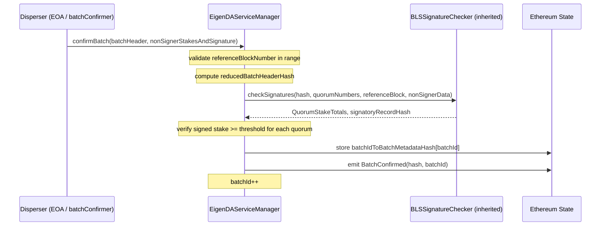
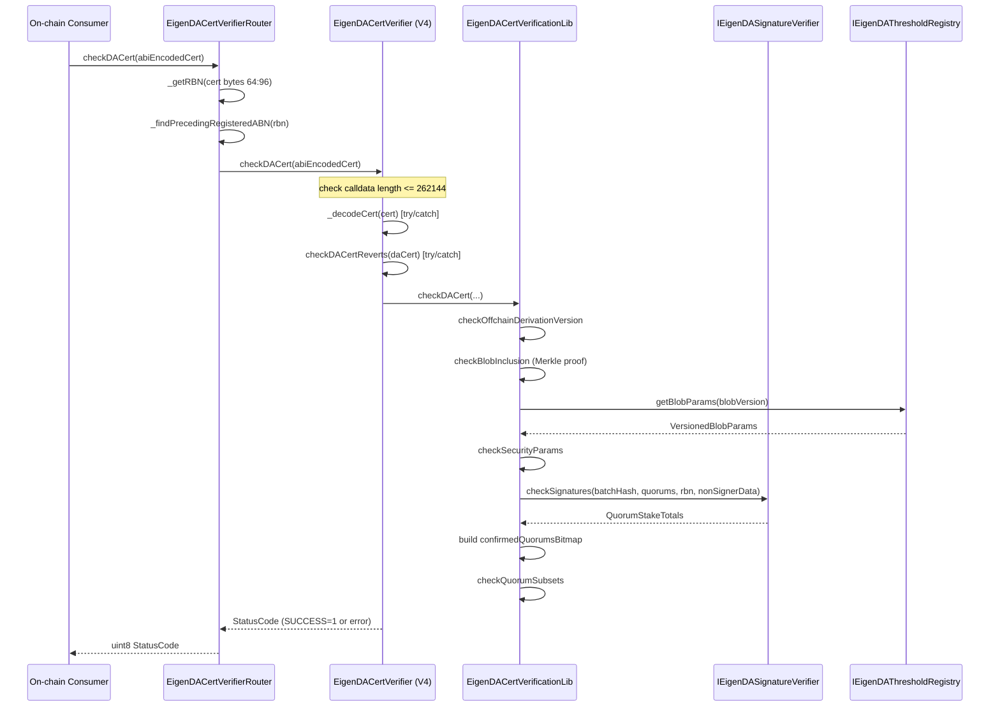
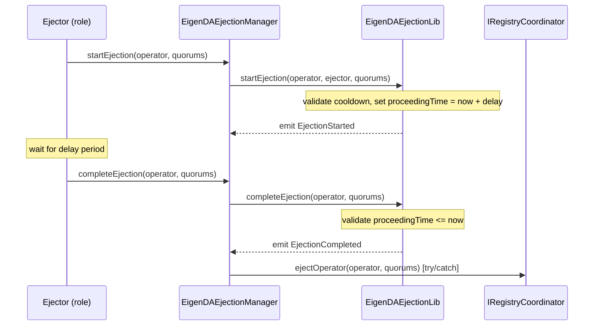
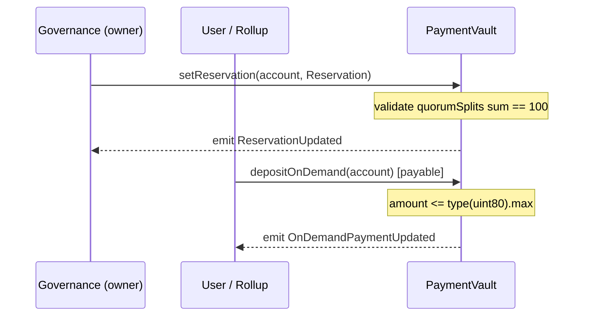
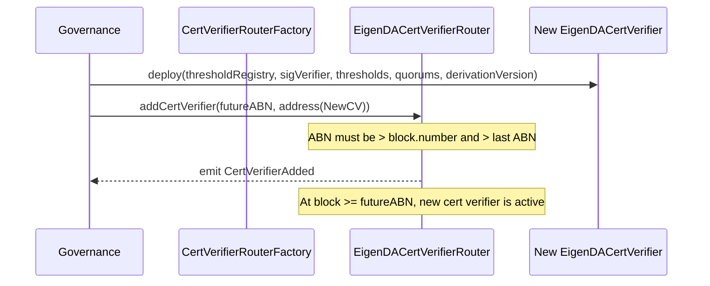

# @eigenda/contracts Analysis

**Analyzed by**: code-analyzer-contracts
**Timestamp**: 2026-04-10T00:00:00Z
**Application Type**: javascript-package (Solidity smart contract library)
**Classification**: library
**Location**: contracts

## Architecture

The `@eigenda/contracts` package is a Solidity smart contract library that defines the complete on-chain infrastructure for the EigenDA data availability layer. It is compiled with Solidity `0.8.29` using the Foundry/Forge toolchain and exported as an npm package so that Go services and other consumers can reference the compiled ABIs and artifacts (via the `out/` directory) or the raw Solidity source (via `src/` and `lib/`).

The library follows a layered, versioned architecture. Contracts are organized into three broad layers:

1. **Core layer** (`src/core/`): Contains the primary protocol contracts — `EigenDAServiceManager` (AVS entry point), `EigenDAThresholdRegistry` (security parameter storage), `EigenDARelayRegistry`, `EigenDADisperserRegistry`, `PaymentVault`, `EigenDADirectory`, `EigenDAAccessControl`, and `EigenDARegistryCoordinator`. Core contracts lean on OpenZeppelin's upgradeable patterns (`OwnableUpgradeable`, `AccessControlEnumerable`, `Initializable`) and EigenLayer middleware (`ServiceManagerBase`, `BLSSignatureChecker`, `RegistryCoordinator`).

2. **Integrations / cert layer** (`src/integrations/cert/`): Contains the certificate verifier family — `EigenDACertVerifier` (current, version 4), legacy verifiers `EigenDACertVerifierV1` and `EigenDACertVerifierV2`, the `EigenDACertVerifierRouter` (version-routing proxy), the `CertVerifierRouterFactory`, and supporting libraries `EigenDACertVerificationLib`, `EigenDACertVerificationV1Lib`, `EigenDACertVerificationV2Lib`. This layer exposes the `checkDACert(bytes)` interface used by rollups and other on-chain consumers.

3. **Periphery layer** (`src/periphery/`): Contains `EigenDAEjectionManager` and its storage/library helpers. This contract manages the delayed ejection of non-performing operators from quorums.

Cross-cutting concerns are handled through several shared library modules under `src/core/libraries/`:
- **v1 / v2 type libraries** define the versioned data structures used by the protocol (batch headers, blob headers, certificates, etc.).
- **v3 libraries** (`address-directory`, `config-registry`, `initializable`, `access-control`) implement EIP-2535 Diamond-style namespaced storage patterns for the newest generation of contracts.

Go bindings for all exported contracts are pre-generated under `contracts/bindings/`, enabling Go services to interact with the on-chain contracts without maintaining their own ABI files.

The upgrade strategy is storage-gap based: every upgradeable contract appends a `uint256[N] private __GAP` array to its storage layout to leave room for future variables without colliding with derived contract storage.

## Key Components

- **EigenDAServiceManager** (`src/core/EigenDAServiceManager.sol`): The primary AVS entry point for EigenDA V1. Inherits from EigenLayer's `ServiceManagerBase` and `BLSSignatureChecker`. Exposes `confirmBatch()`, which validates BLS aggregate signatures from operators, enforces quorum thresholds, and persists `batchIdToBatchMetadataHash` for later V1 certificate verification. Access to `confirmBatch` is gated by the `onlyBatchConfirmer` modifier. Constants `STORE_DURATION_BLOCKS` (two weeks / 12s) and `BLOCK_STALE_MEASURE` (300 blocks) define the data availability window.

- **EigenDAServiceManagerStorage** (`src/core/EigenDAServiceManagerStorage.sol`): Abstract storage base for `EigenDAServiceManager`. Stores `batchId` (auto-incrementing batch counter), `batchIdToBatchMetadataHash` mapping, `isBatchConfirmer` mapping, and immutable references to `eigenDAThresholdRegistry`, `eigenDARelayRegistry`, `paymentVault`, and `eigenDADisperserRegistry`. Includes a 47-slot `__GAP` for upgrade safety.

- **EigenDAThresholdRegistry** (`src/core/EigenDAThresholdRegistry.sol`): Upgradeable registry that stores per-quorum security parameters (adversary and confirmation threshold percentages), required quorum numbers, and versioned blob parameters (`VersionedBlobParams`). Governance can add new blob versions via `addVersionedBlobParams()`. Also has an immutable variant `EigenDAThresholdRegistryImmutableV1` for rollup-custom thresholds.

- **EigenDACertVerifier** (`src/integrations/cert/EigenDACertVerifier.sol`): Current (V4) certificate verifier. Immutable contract that accepts ABI-encoded `EigenDACertV4` certificates and returns a `StatusCode` (SUCCESS=1, INVALID_CERT=5, INTERNAL_ERROR=6). Uses `try/catch` to classify all revert types. Delegates actual verification logic to `EigenDACertVerificationLib.checkDACert()`. Key constants: `MAX_CALLDATA_BYTES_LENGTH` = 262,144; `MAX_QUORUM_COUNT` = 5; `MAX_NONSIGNER_COUNT_ALL_QUORUM` = 415.

- **EigenDACertVerificationLib** (`src/integrations/cert/libraries/EigenDACertVerificationLib.sol`): Core verification logic library shared by the current cert verifier. Performs four checks in sequence: (1) `checkOffchainDerivationVersion` — ensures cert uses the expected derivation version; (2) `checkBlobInclusion` — Merkle-proof validates the blob certificate exists within the signed batch; (3) `checkSecurityParams` — validates that coding parameters meet the security condition; (4) `checkSignaturesAndBuildConfirmedQuorums` — calls `IEigenDASignatureVerifier.checkSignatures()` and builds a bitmap of quorums that met the confirmation threshold; then calls `checkQuorumSubsets` to enforce `requiredQuorums ⊆ blobQuorums ⊆ confirmedQuorums`.

- **EigenDACertVerifierRouter** (`src/integrations/cert/router/EigenDACertVerifierRouter.sol`): Upgradeable routing contract that maps Activation Block Numbers (ABNs) to `IEigenDACertVerifierBase` implementations. Routes any `checkDACert(bytes)` call to the cert verifier whose ABN most closely precedes the certificate's reference block number. New verifiers must have strictly increasing ABNs and must be in the future. Enables seamless upgrades to the verifier logic without requiring rollup code changes.

- **EigenDADirectory** (`src/core/EigenDADirectory.sol`): V3 on-chain address book and configuration registry. Implements `IEigenDAAddressDirectory` (add/replace/remove/get named addresses) and `IEigenDAConfigRegistry` (versioned byte configurations keyed by block number or timestamp). Uses Diamond-style namespaced storage via `AddressDirectoryLib` and `ConfigRegistryLib`. Access control is delegated to a separately deployed `EigenDAAccessControl` contract looked up by name in the directory itself.

- **PaymentVault** (`src/core/PaymentVault.sol`): Upgradeable contract that manages two payment modes: (a) **reservations** — time-bounded symbol-rate allocations per account set by governance; (b) **on-demand payments** — ETH deposits accumulated per account. Governance controls `pricePerSymbol`, `minNumSymbols`, and rate-limiting parameters. Funds are withdrawable only by the owner.

- **EigenDARelayRegistry** (`src/core/EigenDARelayRegistry.sol`): Simple upgradeable registry mapping relay keys (`uint32`) to `RelayInfo` structs (address + URL). Governance adds relays via `addRelayInfo()`. Used by the cert verifier and off-chain services to locate relay endpoints.

- **EigenDADisperserRegistry** (`src/core/EigenDADisperserRegistry.sol`): Upgradeable registry mapping disperser keys to `DisperserInfo` structs (disperser address). Governance manages entries via `setDisperserInfo()`.

- **EigenDAEjectionManager** (`src/periphery/ejection/EigenDAEjectionManager.sol`): Manages operator ejection with a configurable delay and cooldown. Ejectors (role-gated by `EigenDAAccessControl`) can start, cancel, and complete ejections. Operators can self-cancel by signing a BLS cancel-ejection message. On completion, calls `registryCoordinator.ejectOperator()` in a try/catch. Uses V3 namespaced storage patterns.

- **EigenDAAccessControl** (`src/core/EigenDAAccessControl.sol`): Thin contract extending OpenZeppelin `AccessControlEnumerable`. Defines the `OWNER_ROLE` and `EJECTOR_ROLE` roles (constants in `AccessControlConstants`). Deployed as the single source of truth for permissions across all V3-pattern contracts.

- **EigenDACertTypes** (`src/integrations/cert/EigenDACertTypes.sol`): Library defining the `EigenDACertV3` and `EigenDACertV4` structs. `EigenDACertV4` adds `offchainDerivationVersion` to `EigenDACertV3` fields. The structs are ABI-encoded as the `bytes` argument to `checkDACert`. The layout is designed so that `referenceBlockNumber` always sits at bytes 64–96 in the encoded representation, allowing the router to extract it cheaply.

## Data Flows

### 1. V1 Batch Confirmation (EigenDAServiceManager)

**Flow Description**: The disperser confirms a batch of blobs on-chain by submitting an aggregated BLS signature from the operator quorum.



**Detailed Steps**:

1. **Batch header validation** (Disperser → SM): `confirmBatch` checks that `referenceBlockNumber < block.number` and `referenceBlockNumber + BLOCK_STALE_MEASURE >= block.number`, ensuring the batch is neither in the future nor too old.

2. **Reduced hash computation** (SM internal): A `ReducedBatchHeader` struct (containing only `blobHeadersRoot` and `referenceBlockNumber`) is hashed via `keccak256(abi.encode(...))` to produce the message that operators signed.

3. **Signature check** (SM → BLSSignatureChecker): `checkSignatures()` is called with the hash, quorum numbers, and non-signer data. The BLS signature checker aggregates public keys, subtracts non-signers, and verifies the aggregate signature on the BN254 curve.

4. **Threshold enforcement** (SM internal): For each quorum, `signedStake * 100 >= totalStake * signedStakeForQuorums[i]` must hold.

5. **Metadata storage** (SM → chain): `batchHeaderHash` is combined with `signatoryRecordHash` and `block.number` to form the metadata hash stored at `batchIdToBatchMetadataHash[batchId]`.

**Error Paths**:
- `referenceBlockNumber >= block.number` → revert "specified referenceBlockNumber is in future"
- `referenceBlockNumber + BLOCK_STALE_MEASURE < block.number` → revert "specified referenceBlockNumber is too far in past"
- BLS signature invalid → revert from BLSSignatureChecker
- Quorum threshold not met → revert "signatories do not own threshold percentage of a quorum"

---

### 2. V2/V4 Certificate Verification (EigenDACertVerifier)

**Flow Description**: A rollup or on-chain consumer verifies a DA certificate to confirm blob availability was attested by sufficient operator stake.



**Detailed Steps**:

1. **Router dispatch** (Consumer → Router): Router extracts the 32-bit reference block number from bytes 64–96 of the encoded cert, finds the cert verifier with the highest ABN ≤ RBN, and forwards the call.

2. **Calldata bounds check** (Router → CV): If `cert.length > 262144`, immediately return `INVALID_CERT`.

3. **ABI decode with gas limit** (CV internal): `_decodeCert` is called with `MAX_ABI_DECODE_GAS` (2,097,152 gas) in a try/catch to prevent malicious certs from causing OOG panics that propagate as internal errors.

4. **Verification delegation** (CV → CL): `checkDACertReverts` delegates to `EigenDACertVerificationLib.checkDACert` which runs the four ordered checks.

5. **Merkle inclusion** (CL): `hashBlobCertificate()` produces the leaf hash; `Merkle.verifyInclusionKeccak()` validates the blob is in the signed batch root.

6. **Security parameters** (CL → TR): Retrieves `VersionedBlobParams` and verifies `codingRate * (numChunks - maxNumOperators) * (confirmThreshold - adversaryThreshold) >= 100 * numChunks`.

7. **Quorum signature check** (CL → SV): BLS signature verified; confirmed quorums bitmap built from quorums meeting the `confirmationThreshold`.

8. **Quorum subset check** (CL): Enforces `requiredQuorums ⊆ blobQuorums ⊆ confirmedQuorums`.

**Error Paths**:
- Any `require(...)` failure → `INVALID_CERT` (status 5)
- Solidity `Panic` or low-level EVM revert → `INTERNAL_ERROR` (status 6)
- Successful execution → `SUCCESS` (status 1)

---

### 3. Operator Ejection Flow (EigenDAEjectionManager)

**Flow Description**: A permissioned ejector initiates a time-delayed removal of a non-performing operator from one or more quorums.



---

### 4. Payment Registration Flow (PaymentVault)

**Flow Description**: Users pre-pay for EigenDA blob dispersal via either reservations or on-demand ETH deposits.



---

### 5. Certificate Verifier Version Upgrade

**Flow Description**: EigenDA governance upgrades the cert verification logic by deploying a new `EigenDACertVerifier` and registering it in the router.



## Dependencies

### External Libraries (npm / Solidity)

- **@openzeppelin/contracts** (4.7.0) [blockchain]: Provides `AccessControlEnumerable`, `IAccessControl`, `IERC20`, `EIP712`, and `Merkle` utilities from OpenZeppelin's battle-tested contract library. Used directly in `EigenDAAccessControl.sol` for role-based access control and in `EigenDARegistryCoordinator.sol` for EIP-712 signature support. Imported in: `src/core/EigenDAAccessControl.sol`, `src/core/EigenDARegistryCoordinator.sol`, `src/core/PaymentVault.sol`, and via `src/integrations/` for `IAccessControl`.

- **@openzeppelin/contracts-upgradeable** (4.7.0) [blockchain]: Provides `OwnableUpgradeable`, `Initializable`, and related upgradeable variants. Used by all proxy-upgradeable contracts to implement owner-gated admin functions and the `initializer` modifier pattern with storage isolation. Imported in: `src/core/EigenDAThresholdRegistry.sol`, `src/core/EigenDARelayRegistry.sol`, `src/core/EigenDADisperserRegistry.sol`, `src/core/PaymentVault.sol`, `src/integrations/cert/router/EigenDACertVerifierRouter.sol`.

### Foundry / Forge (build-tool, lib submodule)

- **forge-std** (lib/forge-std) [testing]: Foundry's standard library providing cheat codes, `Test`, `Script` base contracts, and `console.log` for use in tests and deployment scripts. Referenced extensively in `test/` and `script/`. Not included in the packaged `out/` or `src/` exports.

- **eigenlayer-middleware** (lib/eigenlayer-middleware) [blockchain]: EigenLayer's AVS middleware library. Provides `ServiceManagerBase`, `BLSSignatureChecker`, `RegistryCoordinator`, `BLSApkRegistry`, `StakeRegistry`, `IndexRegistry`, `SocketRegistry`, `OperatorStateRetriever`, `BitmapUtils`, and the `BN254` curve library. These are core dependencies for integrating EigenDA into the EigenLayer restaking framework. Imported throughout `src/core/` and `src/integrations/cert/`.

- **openzeppelin-contracts** (lib/openzeppelin-contracts, inside eigenlayer-middleware) [blockchain]: Vendored OpenZeppelin non-upgradeable contracts consumed transitively by `eigenlayer-middleware`. Provides `Merkle`, `Pausable`, and other utilities.

- **openzeppelin-contracts-upgradeable** (lib/openzeppelin-contracts-upgradeable) [blockchain]: Vendored upgradeable OpenZeppelin contracts consumed by `EigenDARegistryCoordinator` (referenced as `@openzeppelin-upgrades/`).

### Internal Libraries

This component has no internal npm library dependencies declared (it is the leaf library). All Solidity imports reference either `lib/` submodule dependencies, `@openzeppelin/` npm packages, or sibling contracts within `src/`.

## API Surface

### Contract Public Interfaces

The package exports the following primary Solidity interfaces and contracts:

#### IEigenDAServiceManager / EigenDAServiceManager

Entry point for EigenDA V1 batch confirmation.

| Function | Mutability | Description |
|---|---|---|
| `confirmBatch(BatchHeader, NonSignerStakesAndSignature)` | external | Submit and validate a V1 batch; stores metadata hash |
| `batchIdToBatchMetadataHash(uint32)` | view | Retrieve stored batch metadata hash by batchId |
| `taskNumber()` | view | Returns current batchId |
| `latestServeUntilBlock(uint32)` | view | Computes the last block operators must serve for a batch |
| `quorumAdversaryThresholdPercentages()` | view | Proxy to threshold registry |
| `quorumConfirmationThresholdPercentages()` | view | Proxy to threshold registry |
| `quorumNumbersRequired()` | view | Proxy to threshold registry |
| `setBatchConfirmer(address)` | external (owner) | Toggle batch confirmer status |

#### IEigenDACertVerifierBase / EigenDACertVerifier

Core certificate verification interface used by rollups.

| Function | Mutability | Description |
|---|---|---|
| `checkDACert(bytes)` | view | Verify ABI-encoded EigenDACertV4; returns uint8 StatusCode |
| `checkDACertReverts(EigenDACertV4)` | view | Reverting variant for internal use / testing |
| `eigenDAThresholdRegistry()` | view | Returns threshold registry address |
| `eigenDASignatureVerifier()` | view | Returns signature verifier address |
| `securityThresholds()` | view | Returns configured SecurityThresholds |
| `quorumNumbersRequired()` | view | Returns required quorum bytes |
| `offchainDerivationVersion()` | view | Returns derivation version |
| `certVersion()` | pure | Returns `4` |
| `semver()` | pure | Returns (4, 0, 0) |

**StatusCode enum**: NULL_ERROR=0, SUCCESS=1, (2-4 historical unused), INVALID_CERT=5, INTERNAL_ERROR=6

#### EigenDACertVerifierRouter

| Function | Mutability | Description |
|---|---|---|
| `checkDACert(bytes)` | view | Routes cert to correct verifier by RBN |
| `getCertVerifierAt(uint32)` | view | Returns cert verifier address for a given block number |
| `addCertVerifier(uint32, address)` | external (owner) | Registers a new cert verifier at a future ABN |
| `certVerifierABNs()` | view | Array of all registered ABNs |
| `certVerifiers(uint32)` | view | Mapping ABN to verifier address |

#### IEigenDAThresholdRegistry / EigenDAThresholdRegistry

| Function | Mutability | Description |
|---|---|---|
| `quorumAdversaryThresholdPercentages()` | view | Per-quorum adversary threshold bytes |
| `quorumConfirmationThresholdPercentages()` | view | Per-quorum confirmation threshold bytes |
| `quorumNumbersRequired()` | view | Required quorum numbers bytes |
| `getQuorumAdversaryThresholdPercentage(uint8)` | view | Threshold for a specific quorum |
| `getQuorumConfirmationThresholdPercentage(uint8)` | view | Confirmation threshold for a specific quorum |
| `getIsQuorumRequired(uint8)` | view | Whether a quorum is required |
| `nextBlobVersion()` | view | Next available blob version |
| `getBlobParams(uint16)` | view | VersionedBlobParams for a blob version |
| `addVersionedBlobParams(VersionedBlobParams)` | external (owner) | Add a new blob version |

#### IPaymentVault / PaymentVault

| Function | Mutability | Description |
|---|---|---|
| `setReservation(address, Reservation)` | external (owner) | Create/update a symbol-rate reservation |
| `depositOnDemand(address)` | payable | Deposit ETH for on-demand payments |
| `getReservation(address)` | view | Get current reservation |
| `getReservations(address[])` | view | Batch reservation fetch |
| `getOnDemandTotalDeposit(address)` | view | Total ETH deposited by account |
| `getOnDemandTotalDeposits(address[])` | view | Batch deposit fetch |
| `setPriceParams(uint64, uint64, uint64)` | external (owner) | Update pricing (cooldown enforced) |
| `withdraw(uint256)` | external (owner) | Withdraw ETH to owner |
| `withdrawERC20(IERC20, uint256)` | external (owner) | Withdraw ERC20 tokens to owner |

#### IEigenDADirectory / EigenDADirectory

| Function | Mutability | Description |
|---|---|---|
| `addAddress(string, address)` | external (owner) | Register a named contract address |
| `replaceAddress(string, address)` | external (owner) | Update an existing named address |
| `removeAddress(string)` | external (owner) | Remove a named address |
| `getAddress(string)` | view | Look up address by name |
| `getAddress(bytes32)` | view | Look up address by name digest (cheaper) |
| `getAllNames()` | view | List all registered names |
| `addConfigBlockNumber(string, uint256, bytes)` | external (owner) | Add block-activated config checkpoint |
| `addConfigTimeStamp(string, uint256, bytes)` | external (owner) | Add timestamp-activated config checkpoint |
| `getActiveAndFutureBlockNumberConfigs(string, uint256)` | view | Get current + future config checkpoints by block |
| `getActiveAndFutureTimestampConfigs(string, uint256)` | view | Get current + future config checkpoints by timestamp |

#### EigenDAEjectionManager

| Function | Mutability | Description |
|---|---|---|
| `startEjection(address, bytes)` | external (ejector) | Begin delayed ejection of operator from quorums |
| `completeEjection(address, bytes)` | external (ejector) | Finalize ejection after delay |
| `cancelEjectionByEjector(address)` | external (ejector) | Ejector cancels a pending ejection |
| `cancelEjection()` | external (operator) | Operator self-cancels ejection |
| `cancelEjectionWithSig(address, G2Point, G1Point, address)` | external | Cancel ejection via BLS signature |
| `setDelay(uint64)` | external (owner) | Update ejection delay |
| `setCooldown(uint64)` | external (owner) | Update ejection cooldown |
| `ejectionTime(address)` | view | When ejection is due for an operator |
| `ejectionQuorums(address)` | view | Quorums pending ejection |

### Go Bindings

Pre-generated Go ABIgen bindings are published under `contracts/bindings/` for all major contracts:
`EigenDAServiceManager`, `EigenDACertVerifier`, `EigenDACertVerifierRouter`, `EigenDACertVerifierV1`, `EigenDACertVerifierV2`, `EigenDAThresholdRegistry`, `EigenDARelayRegistry`, `EigenDADisperserRegistry`, `PaymentVault`, `EigenDARegistryCoordinator`, `EjectionManager`, `BLSApkRegistry`, `StakeRegistry`, `OperatorStateRetriever`, `BN254`, `BitmapUtils`, `IEigenDADirectory`, `IEigenDARelayRegistry`, `IEigenDAServiceManager`, `IEigenDAEjectionManager`.

Go services import these bindings via the `contracts/bindings/<ContractName>/binding.go` path.

## Code Examples

### Example 1: EigenDACertV4 Structure

```solidity
// src/integrations/cert/EigenDACertTypes.sol
library EigenDACertTypes {
    // EigenDACertV4 extends V3 by adding offchainDerivationVersion
    struct EigenDACertV4 {
        DATypesV2.BatchHeaderV2 batchHeader;
        DATypesV2.BlobInclusionInfo blobInclusionInfo;
        DATypesV1.NonSignerStakesAndSignature nonSignerStakesAndSignature;
        bytes signedQuorumNumbers;
        // Used to version the offchain logic that is used to verify this code.
        // Its main usage is for versioning the recency_window
        uint16 offchainDerivationVersion;
    }
}
```

### Example 2: checkDACert try/catch classification pattern

```solidity
// src/integrations/cert/EigenDACertVerifier.sol
function checkDACert(bytes calldata abiEncodedCert) external view returns (uint8) {
    if (abiEncodedCert.length > MAX_CALLDATA_BYTES_LENGTH) {
        return uint8(StatusCode.INVALID_CERT);
    }
    CT.EigenDACertV4 memory daCert;
    try this._decodeCert{gas: MAX_ABI_DECODE_GAS}(abiEncodedCert) returns (CT.EigenDACertV4 memory _daCert) {
        daCert = _daCert;
    } catch {
        return uint8(StatusCode.INVALID_CERT);
    }
    try this.checkDACertReverts(daCert) {
        return uint8(StatusCode.SUCCESS);
    } catch Error(string memory) {
        return uint8(StatusCode.INVALID_CERT);
    } catch Panic(uint256) {
        return uint8(StatusCode.INTERNAL_ERROR);
    } catch (bytes memory reason) {
        if (reason.length < 4) {
            return uint8(StatusCode.INTERNAL_ERROR);
        }
        return uint8(StatusCode.INVALID_CERT);
    }
}
```

### Example 3: V1 Batch Confirmation with Quorum Threshold Enforcement

```solidity
// src/core/EigenDAServiceManager.sol (lines 104-126)
(QuorumStakeTotals memory quorumStakeTotals, bytes32 signatoryRecordHash) = checkSignatures(
    reducedBatchHeaderHash,
    batchHeader.quorumNumbers,
    batchHeader.referenceBlockNumber,
    nonSignerStakesAndSignature
);

for (uint256 i = 0; i < batchHeader.signedStakeForQuorums.length; i++) {
    require(
        quorumStakeTotals.signedStakeForQuorum[i] * THRESHOLD_DENOMINATOR
            >= quorumStakeTotals.totalStakeForQuorum[i] * uint8(batchHeader.signedStakeForQuorums[i]),
        "signatories do not own threshold percentage of a quorum"
    );
}

bytes32 batchHeaderHash = keccak256(abi.encode(batchHeader));
batchIdToBatchMetadataHash[batchIdMemory] =
    keccak256(abi.encodePacked(batchHeaderHash, signatoryRecordHash, uint32(block.number)));
```

### Example 4: Router ABN-based dispatch

```solidity
// src/integrations/cert/router/EigenDACertVerifierRouter.sol (lines 87-117)
function _getRBN(bytes calldata certBytes) internal pure returns (uint32) {
    // 0:32 is the pointer to the start of the byte array.
    // 32:64 is the batch header root
    // 64:96 is the RBN
    if (certBytes.length < 96) {
        revert InvalidCertLength();
    }
    return abi.decode(certBytes[64:96], (uint32));
}

function _findPrecedingRegisteredABN(uint32 referenceBlockNumber)
    internal view returns (uint32 activationBlockNumber) {
    // It is assumed that the latest ABN are the most likely to be used.
    uint256 abnMaxIndex = certVerifierABNs.length - 1;
    for (uint256 i; i < certVerifierABNs.length; i++) {
        activationBlockNumber = certVerifierABNs[abnMaxIndex - i];
        if (activationBlockNumber <= referenceBlockNumber) {
            return activationBlockNumber;
        }
    }
}
```

### Example 5: V3 EigenDADirectory namespaced storage initialization

```solidity
// src/core/EigenDADirectory.sol (lines 37-43)
function initialize(address accessControl) external initializer {
    require(accessControl != address(0), "Access control address cannot be zero");
    bytes32 key = AddressDirectoryConstants.ACCESS_CONTROL_NAME.getKey();
    key.setAddress(accessControl);
    AddressDirectoryLib.registerKey(AddressDirectoryConstants.ACCESS_CONTROL_NAME);
    emit AddressAdded(AddressDirectoryConstants.ACCESS_CONTROL_NAME, key, accessControl);
}
```

## Files Analyzed

- `contracts/package.json` — Package manifest, version, dependencies
- `contracts/foundry.toml` — Compiler settings (solc 0.8.29, optimizer 200 runs)
- `contracts/remappings.txt` — Solidity import remappings
- `contracts/src/core/EigenDAServiceManager.sol` (193 lines) — AVS entry point for V1 batch confirmation
- `contracts/src/core/EigenDAServiceManagerStorage.sol` (67 lines) — Storage layout for service manager
- `contracts/src/core/EigenDAThresholdRegistry.sol` (89 lines) — Security threshold parameter registry
- `contracts/src/core/EigenDAThresholdRegistryImmutableV1.sol` (74 lines) — Immutable variant for custom rollup thresholds
- `contracts/src/core/EigenDARelayRegistry.sol` (33 lines) — Relay key to address/URL registry
- `contracts/src/core/EigenDADisperserRegistry.sol` (31 lines) — Disperser key to address registry
- `contracts/src/core/EigenDADirectory.sol` (230 lines) — V3 on-chain address book + config registry
- `contracts/src/core/EigenDAAccessControl.sol` (16 lines) — Centralized role-based access control
- `contracts/src/core/PaymentVault.sol` (147 lines) — Reservation and on-demand payment management
- `contracts/src/core/PaymentVaultStorage.sol` (29 lines) — Storage layout for PaymentVault
- `contracts/src/core/EigenDARegistryCoordinator.sol` (781 lines, first 60 read) — EigenLayer registry coordinator for EigenDA quorums
- `contracts/src/core/interfaces/IEigenDAServiceManager.sol` (42 lines) — Service manager interface
- `contracts/src/core/interfaces/IEigenDAThresholdRegistry.sol` (52 lines) — Threshold registry interface
- `contracts/src/core/interfaces/IEigenDASignatureVerifier.sol` (13 lines) — Signature verifier interface
- `contracts/src/core/interfaces/IPaymentVault.sol` (57 lines) — PaymentVault interface
- `contracts/src/core/interfaces/IEigenDADirectory.sol` (160 lines) — Directory interface (address + config)
- `contracts/src/core/libraries/v1/EigenDATypesV1.sol` (79 lines) — V1 data types
- `contracts/src/core/libraries/v2/EigenDATypesV2.sol` (59 lines) — V2 data types
- `contracts/src/core/libraries/v3/address-directory/AddressDirectoryLib.sol` (53 lines) — Namespaced address storage library
- `contracts/src/core/libraries/v3/access-control/AccessControlConstants.sol` (19 lines) — Role constants
- `contracts/src/core/libraries/v3/config-registry/ConfigRegistryLib.sol` (330 lines) — Checkpointed config storage library
- `contracts/src/integrations/cert/EigenDACertVerifier.sol` (222 lines) — V4 cert verifier
- `contracts/src/integrations/cert/EigenDACertTypes.sol` (30 lines) — V3/V4 cert struct definitions
- `contracts/src/integrations/cert/libraries/EigenDACertVerificationLib.sol` (353 lines) — Core cert verification logic
- `contracts/src/integrations/cert/router/EigenDACertVerifierRouter.sol` (118 lines) — ABN-based verifier router
- `contracts/src/integrations/cert/router/CertVerifierRouterFactory.sol` (17 lines) — Atomic deploy+init factory
- `contracts/src/integrations/cert/interfaces/IEigenDACertVerifier.sol` (29 lines) — Current cert verifier interface
- `contracts/src/integrations/cert/legacy/v1/EigenDACertVerifierV1.sol` (100 lines) — Legacy V1 cert verifier
- `contracts/src/integrations/cert/legacy/v1/EigenDACertVerificationV1Lib.sol` (80 lines, partial) — V1 cert lib
- `contracts/src/integrations/cert/legacy/v2/EigenDACertVerifierV2.sol` (184 lines) — Legacy V2 cert verifier
- `contracts/src/periphery/ejection/EigenDAEjectionManager.sol` (202 lines) — Delayed operator ejection manager
- `contracts/src/periphery/ejection/libraries/EigenDAEjectionLib.sol` (80 lines, partial) — Ejection logic library

## Analysis Data

```json
{
  "summary": "@eigenda/contracts is the Solidity smart contract library for the EigenDA data availability network. It defines the complete on-chain protocol across three layers: (1) core contracts for batch confirmation, quorum threshold management, relay/disperser registries, payment handling, and the on-chain address/config directory; (2) the certificate verifier family (V1 through V4) that rollup consumers call to verify blob availability attestations; and (3) the periphery ejection manager for disciplining non-performing operators. The package ships pre-compiled Go bindings under contracts/bindings/ for consumption by Go services throughout the EigenDA system.",
  "architecture_pattern": "layered, versioned Solidity library with upgradeable proxy pattern (OpenZeppelin upgradeable), namespaced Diamond-style storage for V3 contracts, and explicit version routing via ABN-based cert verifier router",
  "key_modules": [
    {"name": "EigenDAServiceManager", "path": "contracts/src/core/EigenDAServiceManager.sol", "description": "AVS entry point for V1 batch confirmation; validates BLS signatures and stores batch metadata hashes"},
    {"name": "EigenDAThresholdRegistry", "path": "contracts/src/core/EigenDAThresholdRegistry.sol", "description": "Upgradeable registry for quorum adversary/confirmation thresholds and versioned blob parameters"},
    {"name": "EigenDACertVerifier", "path": "contracts/src/integrations/cert/EigenDACertVerifier.sol", "description": "Immutable V4 cert verifier with try/catch classification of SUCCESS/INVALID_CERT/INTERNAL_ERROR"},
    {"name": "EigenDACertVerificationLib", "path": "contracts/src/integrations/cert/libraries/EigenDACertVerificationLib.sol", "description": "Core verification logic: Merkle inclusion, security params, signature check, quorum subset validation"},
    {"name": "EigenDACertVerifierRouter", "path": "contracts/src/integrations/cert/router/EigenDACertVerifierRouter.sol", "description": "ABN-based router that dispatches checkDACert calls to the correct versioned cert verifier"},
    {"name": "PaymentVault", "path": "contracts/src/core/PaymentVault.sol", "description": "Manages reservations (symbol-rate limits) and on-demand ETH deposits for blob dispersal payment"},
    {"name": "EigenDADirectory", "path": "contracts/src/core/EigenDADirectory.sol", "description": "V3 on-chain address book and checkpointed configuration registry for EigenDA contracts"},
    {"name": "EigenDAAccessControl", "path": "contracts/src/core/EigenDAAccessControl.sol", "description": "Centralized OpenZeppelin AccessControlEnumerable-based role registry for all V3 EigenDA contracts"},
    {"name": "EigenDAEjectionManager", "path": "contracts/src/periphery/ejection/EigenDAEjectionManager.sol", "description": "Time-delayed operator ejection manager with delay/cooldown parameters and BLS-signature cancel support"},
    {"name": "EigenDARelayRegistry", "path": "contracts/src/core/EigenDARelayRegistry.sol", "description": "Registry mapping relay keys to relay address and URL for blob retrieval routing"},
    {"name": "EigenDATypesV1 / EigenDATypesV2", "path": "contracts/src/core/libraries/", "description": "Versioned struct definitions for batch headers, blob headers, certificates, and signature data"},
    {"name": "ConfigRegistryLib", "path": "contracts/src/core/libraries/v3/config-registry/ConfigRegistryLib.sol", "description": "Library for checkpointed configuration storage by block number or timestamp, used by EigenDADirectory"}
  ],
  "api_endpoints": [],
  "data_flows": [
    {"name": "V1 Batch Confirmation", "steps": ["Disperser calls confirmBatch(batchHeader, nonSignerStakesAndSignature)", "EigenDAServiceManager validates block staleness window", "BLSSignatureChecker.checkSignatures verifies aggregate BLS signature", "Per-quorum threshold check on signed stake", "Store keccak(batchHeader, signatoryRecordHash, block.number) at batchId", "Emit BatchConfirmed, increment batchId"]},
    {"name": "V4 Certificate Verification", "steps": ["Consumer calls EigenDACertVerifierRouter.checkDACert(bytes)", "Router extracts RBN from bytes[64:96], finds cert verifier by preceding ABN", "EigenDACertVerifier checks calldata length <= 262144", "Decode EigenDACertV4 via _decodeCert with gas cap (try/catch)", "Call checkDACertReverts -> EigenDACertVerificationLib.checkDACert (try/catch)", "checkOffchainDerivationVersion, checkBlobInclusion (Merkle), checkSecurityParams, checkSignaturesAndBuildConfirmedQuorums, checkQuorumSubsets", "Return uint8 StatusCode: SUCCESS=1, INVALID_CERT=5, INTERNAL_ERROR=6"]},
    {"name": "Operator Ejection", "steps": ["Ejector calls startEjection(operator, quorums)", "EigenDAEjectionLib validates cooldown, sets proceedingTime = now + delay", "After delay, ejector calls completeEjection(operator, quorums)", "EigenDAEjectionLib validates proceedingTime <= now", "EigenDAEjectionManager calls registryCoordinator.ejectOperator (try/catch)"]},
    {"name": "Payment Registration", "steps": ["Governance calls setReservation(account, Reservation) with quorum splits summing to 100", "Users call depositOnDemand(account) payable to accumulate ETH credit", "Disperser reads balances off-chain via getReservation / getOnDemandTotalDeposit"]},
    {"name": "Cert Verifier Upgrade", "steps": ["Deploy new EigenDACertVerifier with updated thresholds/derivation version", "Governance calls EigenDACertVerifierRouter.addCertVerifier(futureABN, newAddress)", "From futureABN onward, router dispatches certs with RBN >= futureABN to the new verifier"]}
  ],
  "tech_stack": ["solidity 0.8.29", "foundry/forge", "openzeppelin-contracts 4.7.0", "openzeppelin-contracts-upgradeable 4.7.0", "eigenlayer-middleware", "bn254 elliptic curve (BLS signatures)", "yarn 1.22.22", "go (via ABIgen bindings)"],
  "external_integrations": [],
  "component_interactions": []
}
```

## Citations

```json
[
  {
    "file_path": "contracts/package.json",
    "start_line": 1,
    "end_line": 31,
    "claim": "Package is named @eigenda/contracts version 0.1.0 with runtime npm dependencies on @openzeppelin/contracts and @openzeppelin/contracts-upgradeable both at 4.7.0",
    "section": "Dependencies"
  },
  {
    "file_path": "contracts/foundry.toml",
    "start_line": 22,
    "end_line": 24,
    "claim": "Contracts are compiled with Solidity 0.8.29 and optimizer enabled with 200 runs; deny_warnings=true enforces zero-warning compilation",
    "section": "Architecture"
  },
  {
    "file_path": "contracts/src/core/EigenDAServiceManager.sol",
    "start_line": 27,
    "end_line": 53,
    "claim": "EigenDAServiceManager inherits from EigenDAServiceManagerStorage, ServiceManagerBase, BLSSignatureChecker, and Pausable; its constructor initializes all dependencies and disables initializers",
    "section": "Key Components"
  },
  {
    "file_path": "contracts/src/core/EigenDAServiceManager.sol",
    "start_line": 74,
    "end_line": 132,
    "claim": "confirmBatch validates block range, computes reducedBatchHeaderHash, calls checkSignatures for BLS validation, enforces per-quorum stake thresholds, and stores batchIdToBatchMetadataHash",
    "section": "Data Flows"
  },
  {
    "file_path": "contracts/src/core/EigenDAServiceManagerStorage.sol",
    "start_line": 15,
    "end_line": 36,
    "claim": "THRESHOLD_DENOMINATOR=100, STORE_DURATION_BLOCKS=2 weeks/12s, BLOCK_STALE_MEASURE=300 are the key timing and threshold constants",
    "section": "Key Components"
  },
  {
    "file_path": "contracts/src/core/EigenDAServiceManagerStorage.sol",
    "start_line": 56,
    "end_line": 66,
    "claim": "EigenDAServiceManagerStorage stores batchId, batchIdToBatchMetadataHash, isBatchConfirmer, and a 47-slot __GAP for upgrade safety",
    "section": "Key Components"
  },
  {
    "file_path": "contracts/src/core/EigenDAThresholdRegistry.sol",
    "start_line": 11,
    "end_line": 49,
    "claim": "EigenDAThresholdRegistry is upgradeable via OwnableUpgradeable and stores per-quorum thresholds plus versioned blob params; addVersionedBlobParams is owner-gated",
    "section": "Key Components"
  },
  {
    "file_path": "contracts/src/integrations/cert/EigenDACertVerifier.sol",
    "start_line": 27,
    "end_line": 77,
    "claim": "EigenDACertVerifier defines MAX_CALLDATA_BYTES_LENGTH=262144, MAX_ABI_DECODE_GAS=2097152, MAX_QUORUM_COUNT=5, MAX_NONSIGNER_COUNT_ALL_QUORUM=415 as safety bounds for cert verification",
    "section": "Key Components"
  },
  {
    "file_path": "contracts/src/integrations/cert/EigenDACertVerifier.sol",
    "start_line": 115,
    "end_line": 168,
    "claim": "checkDACert uses nested try/catch to classify results into SUCCESS, INVALID_CERT (require failures / custom errors), and INTERNAL_ERROR (panics or low-level reverts)",
    "section": "Data Flows"
  },
  {
    "file_path": "contracts/src/integrations/cert/EigenDACertVerifier.sol",
    "start_line": 57,
    "end_line": 77,
    "claim": "StatusCode enum defines NULL_ERROR=0, SUCCESS=1, (2-4 historical unused), INVALID_CERT=5, INTERNAL_ERROR=6",
    "section": "API Surface"
  },
  {
    "file_path": "contracts/src/integrations/cert/libraries/EigenDACertVerificationLib.sol",
    "start_line": 82,
    "end_line": 122,
    "claim": "checkDACert performs four sequential checks: offchain derivation version, blob Merkle inclusion, security parameters, and signature/quorum subset validation",
    "section": "Data Flows"
  },
  {
    "file_path": "contracts/src/integrations/cert/libraries/EigenDACertVerificationLib.sol",
    "start_line": 152,
    "end_line": 194,
    "claim": "checkSecurityParams verifies the security inequality: codingRate*(numChunks-maxNumOperators)*(confirmThreshold-adversaryThreshold) >= 100*numChunks",
    "section": "Data Flows"
  },
  {
    "file_path": "contracts/src/integrations/cert/libraries/EigenDACertVerificationLib.sol",
    "start_line": 255,
    "end_line": 268,
    "claim": "checkQuorumSubsets enforces the three-level quorum hierarchy: requiredQuorums is a subset of blobQuorums which is a subset of confirmedQuorums",
    "section": "Data Flows"
  },
  {
    "file_path": "contracts/src/integrations/cert/EigenDACertTypes.sol",
    "start_line": 11,
    "end_line": 30,
    "claim": "EigenDACertV4 extends V3 by adding offchainDerivationVersion; both structs must have RBN at ABI encoded bytes 64:96 for router dispatch",
    "section": "Key Components"
  },
  {
    "file_path": "contracts/src/integrations/cert/router/EigenDACertVerifierRouter.sol",
    "start_line": 87,
    "end_line": 117,
    "claim": "Router extracts RBN from bytes 64:96 of the encoded cert and reverse-iterates the ABN list (latest first) to find the most recent cert verifier",
    "section": "Data Flows"
  },
  {
    "file_path": "contracts/src/integrations/cert/router/EigenDACertVerifierRouter.sol",
    "start_line": 62,
    "end_line": 77,
    "claim": "addCertVerifier enforces ABN must be > block.number and > the last registered ABN to prevent race conditions",
    "section": "API Surface"
  },
  {
    "file_path": "contracts/src/integrations/cert/router/CertVerifierRouterFactory.sol",
    "start_line": 8,
    "end_line": 17,
    "claim": "CertVerifierRouterFactory atomically deploys and initializes EigenDACertVerifierRouter to prevent frontrunning the initialize transaction",
    "section": "Key Components"
  },
  {
    "file_path": "contracts/src/core/PaymentVault.sol",
    "start_line": 11,
    "end_line": 56,
    "claim": "PaymentVault supports both reservations (time-bounded symbol-rate limits set by governance) and on-demand ETH payments deposited by users",
    "section": "Key Components"
  },
  {
    "file_path": "contracts/src/core/PaymentVault.sol",
    "start_line": 116,
    "end_line": 119,
    "claim": "On-demand deposits are capped at uint80.max and stored as uint80 totalDeposit per account",
    "section": "Key Components"
  },
  {
    "file_path": "contracts/src/core/interfaces/IPaymentVault.sol",
    "start_line": 4,
    "end_line": 16,
    "claim": "Reservation struct contains symbolsPerSecond, startTimestamp, endTimestamp, quorumNumbers, and quorumSplits (must sum to 100)",
    "section": "API Surface"
  },
  {
    "file_path": "contracts/src/core/EigenDADirectory.sol",
    "start_line": 18,
    "end_line": 43,
    "claim": "EigenDADirectory implements IEigenDADirectory (address directory + config registry); uses AddressDirectoryLib for keccak256-keyed Diamond-style storage; access control is resolved dynamically via the directory itself",
    "section": "Key Components"
  },
  {
    "file_path": "contracts/src/core/EigenDADirectory.sol",
    "start_line": 122,
    "end_line": 136,
    "claim": "addConfigBlockNumber and addConfigTimeStamp store checkpointed configuration bytes with strictly increasing activation keys",
    "section": "API Surface"
  },
  {
    "file_path": "contracts/src/core/EigenDAAccessControl.sol",
    "start_line": 9,
    "end_line": 16,
    "claim": "EigenDAAccessControl extends AccessControlEnumerable and grants DEFAULT_ADMIN_ROLE and OWNER_ROLE to the deployer; intended as the single on-chain role authority for all V3 contracts",
    "section": "Key Components"
  },
  {
    "file_path": "contracts/src/core/libraries/v3/access-control/AccessControlConstants.sol",
    "start_line": 7,
    "end_line": 18,
    "claim": "Role constants: OWNER_ROLE=keccak256('OWNER'), EJECTOR_ROLE=keccak256('EJECTOR'); QUORUM_OWNER_ROLE derived per quorum by adding quorumId to QUORUM_OWNER_SEED",
    "section": "Key Components"
  },
  {
    "file_path": "contracts/src/periphery/ejection/EigenDAEjectionManager.sol",
    "start_line": 86,
    "end_line": 99,
    "claim": "startEjection, completeEjection, and cancelEjectionByEjector are all gated by the onlyEjector modifier; completeEjection calls registryCoordinator.ejectOperator in a try/catch",
    "section": "Key Components"
  },
  {
    "file_path": "contracts/src/periphery/ejection/EigenDAEjectionManager.sol",
    "start_line": 104,
    "end_line": 114,
    "claim": "Operators can cancel their own ejection by providing a BLS signature over a structured cancel-ejection message that includes the ejection record and a recipient address",
    "section": "Key Components"
  },
  {
    "file_path": "contracts/src/core/libraries/v3/address-directory/AddressDirectoryLib.sol",
    "start_line": 9,
    "end_line": 28,
    "claim": "AddressDirectoryLib uses keccak256(abi.encodePacked(name)) as the storage key for addresses, implementing Diamond-style namespaced storage via AddressDirectoryStorage.layout()",
    "section": "Architecture"
  },
  {
    "file_path": "contracts/src/core/libraries/v3/config-registry/ConfigRegistryLib.sol",
    "start_line": 118,
    "end_line": 157,
    "claim": "Config checkpoints enforce strictly increasing activation block/timestamp; first checkpoint must be at or after current block/timestamp; subsequent checkpoints must be strictly greater",
    "section": "Key Components"
  },
  {
    "file_path": "contracts/src/core/EigenDAThresholdRegistryImmutableV1.sol",
    "start_line": 13,
    "end_line": 74,
    "claim": "EigenDAThresholdRegistryImmutableV1 is a non-upgradeable variant storing only V1 threshold params; nextBlobVersion() and getBlobParams() revert since V2 blob versioning is not supported",
    "section": "Key Components"
  },
  {
    "file_path": "contracts/src/integrations/cert/legacy/v2/EigenDACertVerifierV2.sol",
    "start_line": 17,
    "end_line": 60,
    "claim": "EigenDACertVerifierV2 is an immutable contract that stores thresholds as constructor args; security thresholds must have confirmationThreshold > adversaryThreshold",
    "section": "Key Components"
  },
  {
    "file_path": "contracts/src/core/EigenDARelayRegistry.sol",
    "start_line": 20,
    "end_line": 27,
    "claim": "EigenDARelayRegistry stores RelayInfo (address + URL) keyed by auto-incrementing uint32 relay key; addRelayInfo is owner-only",
    "section": "Key Components"
  },
  {
    "file_path": "contracts/src/core/EigenDADisperserRegistry.sol",
    "start_line": 20,
    "end_line": 30,
    "claim": "EigenDADisperserRegistry maps disperser keys to DisperserInfo (address); setDisperserInfo is owner-only",
    "section": "Key Components"
  }
]
```

## Analysis Notes

### Security Considerations

1. **Try/catch cert verification safety**: `EigenDACertVerifier.checkDACert` wraps the entire verification path in try/catch, explicitly separating validation failures (`INVALID_CERT`) from bugs (`INTERNAL_ERROR`). This prevents malicious inputs from causing panics that propagate as opaque reverts, which is especially important for ZK proof contexts (Steel/risc0) that cannot prove reverting calls.

2. **Calldata size limit as DoS protection**: The `MAX_CALLDATA_BYTES_LENGTH = 262144` bound in `EigenDACertVerifier` prevents large-calldata attacks where a malicious cert with excessive data could cause ABI decode to consume all available gas. Additionally, `MAX_ABI_DECODE_GAS = 2,097,152` caps gas used in the decode step.

3. **Batch confirmer is not decentralized in V1**: `confirmBatch` is gated by `onlyBatchConfirmer`, meaning a permissioned EOA can confirm batches. This is an acknowledged centralization point for the legacy V1 protocol path; V2+ moves to more permissionless verification.

4. **ABN frontrunning protection in router**: `addCertVerifier` requires the ABN to be strictly greater than `block.number`, giving time for other parties to react. The documentation recommends using a timelock or multisig for additional protection, though this is advisory rather than enforced.

5. **Ejection delay and cooldown prevent griefing**: The two-phase ejection process (start, wait, complete) with cooldown prevents an ejector from repeatedly initiating ejections against an operator without completing them. The BLS-signed cancel mechanism lets operators protect themselves.

6. **Storage upgrade gaps**: All upgradeable contracts use `uint256[N] private __GAP` (e.g., 47 slots in ServiceManagerStorage, 46 slots in PaymentVaultStorage) to prevent storage collisions during upgrades.

### Performance Characteristics

- **BN254 signature verification**: The most expensive operation is BLS signature checking via `BLSSignatureChecker.checkSignatures`, which involves elliptic curve pairing operations. This is bounded by `MAX_NONSIGNER_COUNT_ALL_QUORUM = 415` non-signers across all quorums to cap worst-case gas.
- **Merkle proof verification**: Bounded to a maximum depth of 256, with each level costing approximately 300 gas for KECCAK256 and CALLDATALOAD (approximately 80K gas worst case).
- **Config registry lookups**: `getActiveAndFutureBlockNumberConfigs` does a linear scan from the end of the checkpoint list, which is efficient given that the latest checkpoint is most likely queried.

### Scalability Notes

- **Immutable cert verifiers**: Each `EigenDACertVerifier` deployment is immutable (no proxy), which makes audit and verification easier but requires governance action and a new deployment for any parameter change.
- **Router as compatibility layer**: `EigenDACertVerifierRouter` decouples rollup code from cert verifier versions, allowing EigenDA to upgrade verification logic without requiring rollup upgrades. This is critical for long-term protocol scalability.
- **V3 contracts use namespaced storage**: `EigenDADirectory` and `EigenDAEjectionManager` use EIP-2535-inspired `Storage.layout()` patterns, enabling more flexible upgrade paths than simple gap-based storage.
- **Go bindings pre-generated**: Having ABIgen-generated Go bindings checked in under `contracts/bindings/` removes the Go build pipeline dependency on running `forge build` and simplifies integration for Go services consuming this library.
