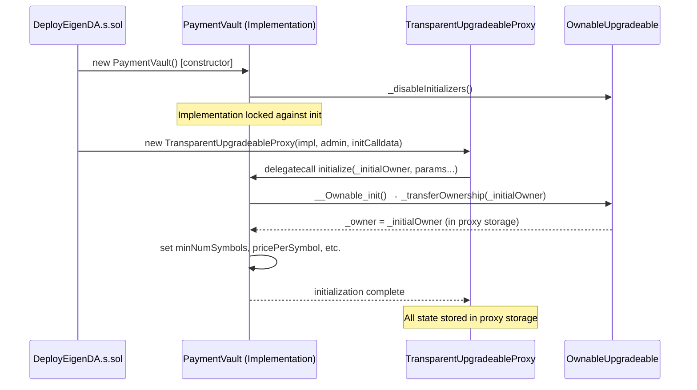
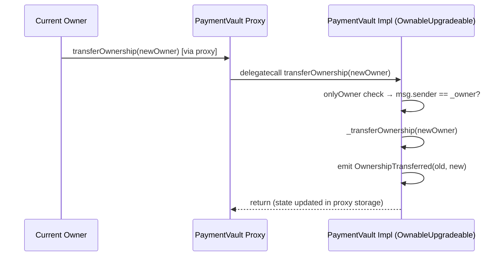
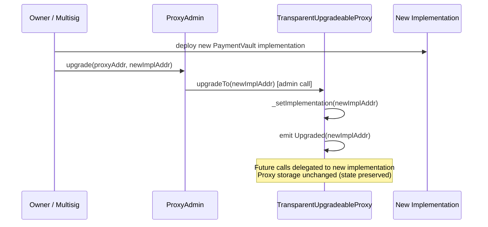

# @openzeppelin/contracts-upgradeable Analysis

**Analyzed by**: code-library-analyzer
**Timestamp**: 2026-04-08T09:44:02Z
**Application Type**: javascript-package (Solidity library)
**Classification**: library
**Location**: `contracts/lib/eigenlayer-middleware/lib/eigenlayer-contracts/lib/openzeppelin-contracts-upgradeable/contracts`

Primary package.json:
`contracts/lib/eigenlayer-middleware/lib/eigenlayer-contracts/lib/openzeppelin-contracts-upgradeable/contracts/package.json`

Additional copies at:
- `contracts/lib/eigenlayer-middleware/lib/openzeppelin-contracts-upgradeable/contracts`
- `contracts/lib/eigenlayer-middleware/lib/eigenlayer-contracts/lib/openzeppelin-contracts-upgradeable-v4.9.0/contracts`
- `contracts/lib/openzeppelin-contracts-upgradeable/contracts`

EigenDA's `contracts/package.json` declares `"@openzeppelin/contracts-upgradeable": "4.7.0"`.
The `lib/` copies are accessed via path-based imports (e.g., `lib/openzeppelin-contracts-upgradeable/contracts/access/OwnableUpgradeable.sol`). The npm-resolved copy is mapped through `node_modules/@openzeppelin/contracts-upgradeable/`.

**Version**: 4.7.0 (pinned in EigenDA `contracts/package.json`)

## Architecture

`@openzeppelin/contracts-upgradeable` is the upgradeable variant of OpenZeppelin's contracts library. It contains the same functionality as `@openzeppelin/contracts` but refactored to be compatible with proxy-based upgradeability patterns, specifically the Transparent Proxy and UUPS patterns.

The critical architectural difference from the non-upgradeable library is constructor behavior. In an upgradeable pattern, constructors cannot be used to set initial state because the proxy's storage is separate from the implementation's constructor. The upgradeable library addresses this by:

1. **Removing constructors**: All state initialization is moved from `constructor()` to `initialize()` functions marked with the `initializer` modifier from `Initializable`.
2. **Adding `_disableInitializers()`**: Implementations call this in their constructor to prevent the implementation contract itself from being initialized (only the proxy should be initialized).
3. **Storage gap pattern**: All contracts reserve storage slots via `uint256[N] private __gap` arrays at the end of their storage layout. This allows future versions of a contract to add new storage variables without corrupting the storage layout of contracts that inherit from them.
4. **Initializable as the root**: Every upgradeable contract ultimately inherits from `Initializable` (from `proxy/utils/Initializable.sol`), which provides `initializer` and `reinitializer` modifiers.

In EigenDA, the upgradeable library is the foundation for all proxy-deployed contracts: `PaymentVault`, `EigenDARelayRegistry`, `EigenDADisperserRegistry`, `EigenDAThresholdRegistry`, and the cert verifier router—all inherit `OwnableUpgradeable`.

## Key Components

- **`proxy/utils/Initializable.sol`**: The root upgradeable contract. Provides:
  - `initializer` modifier: ensures `initialize()` runs exactly once
  - `reinitializer(uint8 version)` modifier: enables controlled re-initialization for upgrades
  - `_disableInitializers()`: locks the implementation contract against initialization
  - `_getInitializedVersion()` and `_isInitializing()`: introspection helpers
  
  Used directly in `EigenDARegistryCoordinator.sol` as `import {Initializable} from "@openzeppelin-upgrades/contracts/proxy/utils/Initializable.sol"`.

- **`access/OwnableUpgradeable.sol`**: Upgradeable version of the standard `Ownable` ownership pattern. Key differences from `Ownable`:
  - No constructor; uses `__Ownable_init()` in `initialize()`
  - Includes `__gap[49]` storage reservation
  - Provides `onlyOwner` modifier, `transferOwnership()`, `renounceOwnership()`
  
  Used by `PaymentVault`, `EigenDARelayRegistry`, `EigenDADisperserRegistry`, `EigenDAThresholdRegistry`, `EigenDACertVerifierRouter`.

- **`utils/structs/EnumerableSet.sol` (upgradeable)**: Same functionality as the non-upgradeable version but included in the upgradeable package for completeness. Used internally by `AccessControlEnumerableUpgradeable`.

- **`access/AccessControlUpgradeable.sol`**: Upgradeable RBAC. Replaces constructor-based role initialization with `__AccessControl_init()`. Used by EigenLayer middleware contracts that EigenDA inherits from.

- **`token/ERC20/ERC20Upgradeable.sol`**: Upgradeable ERC-20. Provides `__ERC20_init(name, symbol)` initializer. Not directly used in EigenDA source contracts, but present in the dependency tree via EigenLayer middleware.

- **Storage Gap Pattern** (cross-cutting concern): Every upgradeable base contract ends with a storage gap:
  ```solidity
  uint256[49] private __gap; // OwnableUpgradeable
  uint256[48] private __gap; // AccessControlUpgradeable
  ```
  This reserves slots so future storage additions in base contracts don't shift derived contract storage.

## Data Flows

### 1. Upgradeable Contract Initialization Flow



**Detailed Steps**:

1. **Implementation Deployment**: `new PaymentVault()` runs the constructor which calls `_disableInitializers()`. This stores a high version number in the Initializable state, preventing any future `initializer`-gated calls on the implementation directly.

2. **Proxy + Init**: The deployer constructs `initData = abi.encodeCall(PaymentVault.initialize, (owner, params...))`. The `TransparentUpgradeableProxy` constructor executes this via `delegatecall` against the implementation. All state changes go into the proxy's storage, not the implementation's.

3. **OwnableUpgradeable Init**: Inside `initialize()`, `__Ownable_init()` is called, which calls `_transferOwnership(initialOwner)`, setting `_owner` in storage slot 0 of the proxy.

4. **State Invariants**: After initialization, the proxy's storage contains all contract state. The implementation contract's own storage remains empty and locked.

### 2. Ownership Transfer Flow



### 3. Contract Upgrade Flow (via ProxyAdmin)



## Dependencies

### External Libraries

None. `@openzeppelin/contracts-upgradeable` is self-contained. It does not declare npm dependencies on other packages (its `package.json` may declare `@openzeppelin/contracts` as a peer dependency for documentation purposes, but the Solidity code is standalone).

### Internal Libraries

None. This is a depth-0 library.

## API Surface

### Core Initializable (import foundation for all upgradeable contracts)

```solidity
// contracts/proxy/utils/Initializable.sol
abstract contract Initializable {
    modifier initializer();
    modifier reinitializer(uint8 version);
    modifier onlyInitializing();
    function _disableInitializers() internal virtual;
    function _getInitializedVersion() internal view returns (uint8);
    function _isInitializing() internal view returns (bool);
}
```

### OwnableUpgradeable

```solidity
// contracts/access/OwnableUpgradeable.sol
abstract contract OwnableUpgradeable is Initializable, ContextUpgradeable {
    // Initializer (replaces constructor)
    function __Ownable_init() internal onlyInitializing;
    function __Ownable_init_unchained() internal onlyInitializing;

    // Public API (same interface as Ownable)
    function owner() public view virtual returns (address);
    function renounceOwnership() public virtual onlyOwner;
    function transferOwnership(address newOwner) public virtual onlyOwner;

    // Modifier
    modifier onlyOwner();

    // Internal helpers
    function _checkOwner() internal view virtual;
    function _transferOwnership(address newOwner) internal virtual;

    // Storage gap for upgrade safety
    uint256[49] private __gap;
}
```

### Usage Pattern in EigenDA

```solidity
// Example: PaymentVault
contract PaymentVault is OwnableUpgradeable, PaymentVaultStorage {
    constructor() {
        _disableInitializers();  // Lock implementation
    }

    function initialize(
        address _initialOwner,
        uint64 _minNumSymbols,
        // ... other params
    ) public initializer {
        __Ownable_init();             // Initialize OwnableUpgradeable
        _transferOwnership(_initialOwner);
        minNumSymbols = _minNumSymbols;
        // ...
    }

    function setMinNumSymbols(uint64 _minNumSymbols) external onlyOwner {
        minNumSymbols = _minNumSymbols;
    }
}
```

### AccessControlUpgradeable

```solidity
// contracts/access/AccessControlUpgradeable.sol
abstract contract AccessControlUpgradeable is Initializable, ContextUpgradeable, IAccessControl, ERC165Upgradeable {
    function __AccessControl_init() internal onlyInitializing;
    function hasRole(bytes32 role, address account) public view virtual returns (bool);
    function getRoleAdmin(bytes32 role) public view virtual returns (bytes32);
    function grantRole(bytes32 role, address account) public virtual;
    function revokeRole(bytes32 role, address account) public virtual;
    function renounceRole(bytes32 role, address account) public virtual;
    function _grantRole(bytes32 role, address account) internal virtual;
    function _revokeRole(bytes32 role, address account) internal virtual;
    function _setRoleAdmin(bytes32 role, bytes32 adminRole) internal virtual;
    uint256[49] private __gap;
}
```

## Files Analyzed

- `/tmp/eigenda/project/contracts/src/core/PaymentVault.sol` - Primary `OwnableUpgradeable` consumer
- `/tmp/eigenda/project/contracts/src/core/EigenDARelayRegistry.sol` - `OwnableUpgradeable` consumer
- `/tmp/eigenda/project/contracts/src/core/EigenDADisperserRegistry.sol` - `OwnableUpgradeable` consumer
- `/tmp/eigenda/project/contracts/src/core/EigenDAThresholdRegistry.sol` - `OwnableUpgradeable` consumer
- `/tmp/eigenda/project/contracts/src/core/EigenDARegistryCoordinator.sol` - `Initializable` consumer
- `/tmp/eigenda/project/contracts/src/integrations/cert/router/EigenDACertVerifierRouter.sol` - `OwnableUpgradeable` consumer
- `/tmp/eigenda/project/contracts/package.json` - Version pin (`4.7.0`)
- `/tmp/eigenda/service_discovery/libraries.json` - Discovery metadata

## Analysis Notes

### Security Considerations

1. **Storage Gap Discipline**: The `__gap` arrays are critical for upgrade safety. If a developer modifies a base contract by adding storage variables without shrinking the corresponding gap, storage slots will collide across an upgrade boundary, causing silent data corruption. The project must maintain strict storage gap accounting during any upgrades to EigenLayer middleware or OpenZeppelin versions.

2. **`_disableInitializers()` in All Implementations**: All EigenDA upgradeable contracts correctly call `_disableInitializers()` in their constructors (e.g., `PaymentVault`). Without this, an implementation contract could be directly initialized by a malicious actor, potentially enabling griefing attacks that claim the implementation's storage.

3. **Initializer Guard**: The `initializer` modifier uses a storage flag. If a proxy is deployed but `initialize()` is never called (e.g., due to a deployment bug), the proxy is in an uninitialized state where all access control is absent. Deployment scripts must verify `initialize()` completes successfully.

4. **Version 4.7.0 vs 4.9.x**: Multiple copies of `openzeppelin-contracts-upgradeable` exist in the dependency tree at versions 4.7.0 and 4.9.0. The EigenDA contracts explicitly use the 4.7.0 versions. The 4.9.x copies are used by EigenLayer middleware contracts. These versions are compatible but must not be mixed within a single inheritance chain.

### Performance Characteristics

- **Storage Gap Overhead**: Each base contract with `uint256[N] __gap` wastes `N * 32` bytes of storage per contract instance. For `OwnableUpgradeable` with `__gap[49]`, this is 1,568 bytes of reserved but unused storage slots. This is purely a logical reservation—no gas is spent reading or writing these slots during normal operation.
- **Initializer Flag**: The `initializer` modifier reads and writes a storage slot on every initialization call. Since `initialize()` is called once per proxy deployment, this overhead is negligible.

### Scalability Notes

- **Upgrade Path Preserved**: All EigenDA core contracts are deployed behind `TransparentUpgradeableProxy`, meaning the protocol can be upgraded without redeploying proxies. This is essential for a live blockchain system where proxy addresses are registered in `EigenDADirectory` and external systems.
- **`OwnableUpgradeable` as Ownership Standard**: Using `OwnableUpgradeable` (with a single owner key) for production contracts should be paired with a multisig or timelock as the actual owner. A single EOA owner creates a centralization and key-loss risk.
