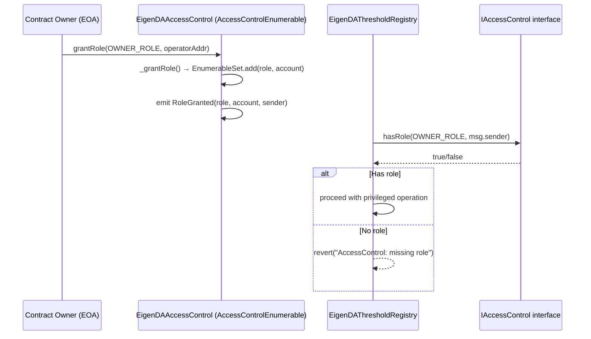
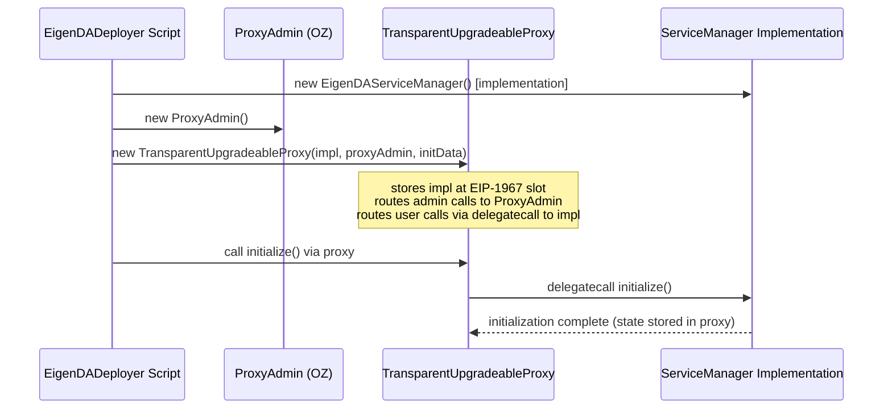
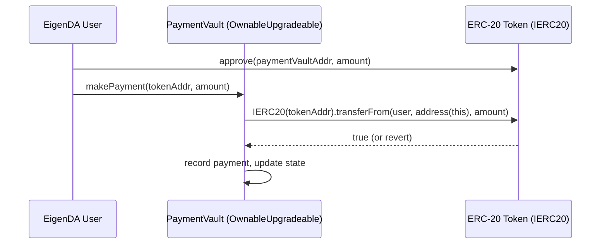

# @openzeppelin/contracts Analysis

**Analyzed by**: code-library-analyzer
**Timestamp**: 2026-04-08T09:44:02Z
**Application Type**: javascript-package (Solidity library)
**Classification**: library
**Location**: `contracts/lib/eigenlayer-middleware/lib/eigenlayer-contracts/lib/openzeppelin-contracts/contracts`

Primary package.json:
`contracts/lib/eigenlayer-middleware/lib/eigenlayer-contracts/lib/openzeppelin-contracts/contracts/package.json`

Additional copies at:
- `contracts/lib/eigenlayer-middleware/lib/openzeppelin-contracts/contracts`
- `contracts/lib/eigenlayer-middleware/lib/eigenlayer-contracts/lib/openzeppelin-contracts-v4.9.0/contracts`
- `contracts/lib/openzeppelin-contracts/contracts`

EigenDA's `package.json` declares `"@openzeppelin/contracts": "4.7.0"` for npm-based import resolution (remapped to `node_modules/@openzeppelin/` via `remappings.txt`). The `lib/` copies are used via path-based imports (`lib/openzeppelin-contracts/contracts/...`).

**Version**: 4.7.0 (pinned in EigenDA `contracts/package.json`)

## Architecture

OpenZeppelin Contracts is the de-facto standard security-audited Solidity library for the Ethereum ecosystem. It provides battle-tested implementations of token standards, access control patterns, proxy patterns, cryptographic utilities, and mathematical helpers. The library is designed for inheritance—consumers import and extend specific contracts rather than calling them as external libraries (with some exceptions like `SafeERC20` and `Address`).

The library is organized into functional modules under a flat directory hierarchy:
- `access/` — Role-based and ownership-based access control
- `token/` — ERC-20, ERC-721, ERC-1155, ERC-777 implementations and extensions
- `proxy/` — Transparent, UUPS, Beacon, and minimal proxy (EIP-1167 clone) patterns
- `utils/` — Cryptographic primitives (ECDSA, MerkleProof, EIP712), data structures (EnumerableSet, EnumerableMap, BitMaps), math (Math, SafeCast, SignedMath), and introspection (ERC165)
- `governance/` — On-chain governance (Governor, TimelockController)
- `finance/` — PaymentSplitter, VestingWallet
- `security/` — ReentrancyGuard, Pausable, PullPayment
- `interfaces/` — IERC-standard interfaces

The library follows Solidity's inheritance-based composition model. Base contracts are abstract, providing `internal` and `virtual` functions that derived contracts can override. Storage layout is carefully managed to avoid collisions, a critical concern for upgradeable patterns. Version 4.7.x is a mature, audited release targeting Solidity ^0.8.0.

In EigenDA, OpenZeppelin contracts serve as the foundation for the core contract infrastructure: `EigenDAAccessControl` inherits `AccessControlEnumerable`, `PaymentVault` and several registry contracts inherit `OwnableUpgradeable`, and the proxy deployment pattern uses `TransparentUpgradeableProxy`.

## Key Components

- **`access/AccessControlEnumerable.sol`**: Extends `AccessControl` with `EnumerableSet` storage to allow iteration over all members of a role. Used directly by EigenDA's `EigenDAAccessControl.sol` as the single inheritance base for the project's central access control contract. Provides `grantRole`, `revokeRole`, `hasRole`, and role-member enumeration.

- **`access/AccessControl.sol`**: Core RBAC (Role-Based Access Control) implementation. Roles are `bytes32` identifiers (typically `keccak256` of a role name). A `DEFAULT_ADMIN_ROLE` can assign admins for each role. Provides `_grantRole`, `_revokeRole` internal functions and `onlyRole(bytes32)` modifier.

- **`access/IAccessControl.sol`**: Interface for AccessControl. Imported in `EigenDADirectory.sol`, `EigenDAEjectionManager.sol`, and test files to type-check access control interactions without needing the full implementation.

- **`token/ERC20/IERC20.sol`**: Standard ERC-20 token interface. Imported in `PaymentVault.sol` to accept ERC-20 token payments. Provides `transfer`, `transferFrom`, `approve`, `allowance`, `balanceOf` interface.

- **`token/ERC20/ERC20.sol`**: Concrete ERC-20 implementation. Used in test infrastructure (`MockEigenDADeployer.sol`) via `import "lib/openzeppelin-contracts/contracts/token/ERC20/ERC20.sol"` to deploy a `mockToken` for payment testing.

- **`proxy/transparent/TransparentUpgradeableProxy.sol`**: Implements the Transparent Proxy pattern (EIP-1967). Separates admin calls (upgrade operations via `ProxyAdmin`) from user calls (forwarded to implementation via `delegatecall`). Used in `MockEigenDADeployer.sol` and `EigenDADeployer.s.sol` to deploy upgradeable instances of all EigenDA core contracts (`EigenDAServiceManager`, `EigenDAThresholdRegistry`, `EigenDARelayRegistry`, etc.).

- **`utils/cryptography/draft-EIP712.sol`**: EIP-712 typed structured data hashing. Provides the `_hashTypedDataV4(bytes32 structHash)` function and domain separator construction. Used in `EigenDARegistryCoordinator.sol` for signing operator registration messages.

- **`utils/structs/EnumerableSet.sol`**: Library for sets of `address`, `bytes32`, and `uint256` that can be enumerated. Used internally by `AccessControlEnumerable` to store role members. Not imported directly in EigenDA source.

- **`utils/math/Math.sol`**: Standard math utilities including `max`, `min`, `average`, `ceilDiv`, `mulDiv` (with overflow protection). Commonly used by downstream middleware contracts.

- **`utils/Address.sol`**: Address utility library. Provides `isContract()`, `sendValue()`, and `functionCall()` / `functionDelegateCall()` helpers. Used internally by proxy implementations.

- **`security/ReentrancyGuard.sol`**: Reentrancy protection mutex. Provides `nonReentrant` modifier. Used by various downstream EigenLayer contracts to protect state-mutating functions.

## Data Flows

### 1. Role-Based Access Control Flow (AccessControlEnumerable)



**Detailed Steps**:

1. **Initialization**: `EigenDAAccessControl` constructor grants `DEFAULT_ADMIN_ROLE` and `OWNER_ROLE` to the deployer address.
2. **Role Grant**: Owner calls `grantRole(roleId, account)`. AccessControl verifies caller has `getRoleAdmin(roleId)`. EnumerableSet tracks all accounts with the role.
3. **Access Check**: Protected contracts call `IAccessControl(accessControlAddress).hasRole(role, msg.sender)` to validate permissions before executing privileged operations.

### 2. Transparent Proxy Deployment Flow



**Detailed Steps**:

1. **Implementation Deployment**: A bare (non-initialized) implementation contract is deployed. Its constructor calls `_disableInitializers()` (from OpenZeppelin Upgradeable) to prevent direct initialization.
2. **ProxyAdmin Deployment**: A `ProxyAdmin` contract is deployed to control upgrades.
3. **Proxy Deployment**: `TransparentUpgradeableProxy` is deployed with the implementation address, proxy admin address, and encoded `initialize()` calldata.
4. **Initialization**: The proxy's constructor executes the provided `initData` via `delegatecall`, running `initialize()` in the proxy's storage context.
5. **Upgrade Path**: Future upgrades call `proxyAdmin.upgrade(proxy, newImpl)`, changing the stored implementation address.

### 3. ERC-20 Payment Flow



## Dependencies

### External Libraries

None declared as npm dependencies in the contracts/package.json for `@openzeppelin/contracts` itself. The OZ contracts library is self-contained Solidity with no third-party Solidity dependencies. It also depends on no JavaScript runtime dependencies for its Solidity functionality.

The `contracts/package.json` of the EigenDA project pins:
- `"@openzeppelin/contracts": "4.7.0"` — this package

### Internal Libraries

None. `@openzeppelin/contracts` is a depth-0 library.

## API Surface

The library exports all contracts under `contracts/` as importable Solidity files. Key contracts used by EigenDA:

### Access Control

```solidity
// contracts/access/AccessControlEnumerable.sol
abstract contract AccessControlEnumerable is IAccessControlEnumerable, AccessControl {
    function supportsInterface(bytes4 interfaceId) public view virtual override returns (bool);
    function getRoleMember(bytes32 role, uint256 index) public view virtual returns (address);
    function getRoleMemberCount(bytes32 role) public view virtual returns (uint256);
}

// contracts/access/IAccessControl.sol
interface IAccessControl {
    function hasRole(bytes32 role, address account) external view returns (bool);
    function getRoleAdmin(bytes32 role) external view returns (bytes32);
    function grantRole(bytes32 role, address account) external;
    function revokeRole(bytes32 role, address account) external;
    function renounceRole(bytes32 role, address callerConfirmation) external;
}
```

### Proxy Patterns

```solidity
// contracts/proxy/transparent/TransparentUpgradeableProxy.sol
contract TransparentUpgradeableProxy is ERC1967Proxy {
    constructor(address _logic, address admin_, bytes memory _data) payable;
    // Admin-only functions proxied to ProxyAdmin
}

// contracts/proxy/transparent/ProxyAdmin.sol
contract ProxyAdmin is Ownable {
    function getProxyImplementation(TransparentUpgradeableProxy proxy) public view returns (address);
    function getProxyAdmin(TransparentUpgradeableProxy proxy) public view returns (address);
    function changeProxyAdmin(TransparentUpgradeableProxy proxy, address newAdmin) public;
    function upgrade(TransparentUpgradeableProxy proxy, address implementation) public;
    function upgradeAndCall(TransparentUpgradeableProxy proxy, address implementation, bytes memory data) public payable;
}
```

### Token Standards

```solidity
// contracts/token/ERC20/IERC20.sol
interface IERC20 {
    function totalSupply() external view returns (uint256);
    function balanceOf(address account) external view returns (uint256);
    function transfer(address to, uint256 amount) external returns (bool);
    function allowance(address owner, address spender) external view returns (uint256);
    function approve(address spender, uint256 amount) external returns (bool);
    function transferFrom(address from, address to, uint256 amount) external returns (bool);
}
```

### Cryptography

```solidity
// contracts/utils/cryptography/draft-EIP712.sol
abstract contract EIP712 {
    constructor(string memory name, string memory version);
    function _domainSeparatorV4() internal view returns (bytes32);
    function _hashTypedDataV4(bytes32 structHash) internal view returns (bytes32);
}
```

## Files Analyzed

- `/tmp/eigenda/project/contracts/src/core/EigenDAAccessControl.sol` - Primary consumer of `AccessControlEnumerable`
- `/tmp/eigenda/project/contracts/src/core/PaymentVault.sol` - Consumer of `IERC20`
- `/tmp/eigenda/project/contracts/src/core/EigenDARegistryCoordinator.sol` - Consumer of `EIP712`
- `/tmp/eigenda/project/contracts/src/core/EigenDADirectory.sol` - Consumer of `IAccessControl`
- `/tmp/eigenda/project/contracts/src/periphery/ejection/EigenDAEjectionManager.sol` - Consumer of `IAccessControl`
- `/tmp/eigenda/project/contracts/test/MockEigenDADeployer.sol` - Consumer of `TransparentUpgradeableProxy`, `ERC20`, `IAccessControl`
- `/tmp/eigenda/project/contracts/package.json` - Version pin (`4.7.0`)
- `/tmp/eigenda/project/contracts/remappings.txt` - Import path remapping
- `/tmp/eigenda/project/contracts/foundry.toml` - Foundry configuration with `@openzeppelin/=node_modules/@openzeppelin/` remapping
- `/tmp/eigenda/service_discovery/libraries.json` - Discovery metadata

## Analysis Notes

### Security Considerations

1. **Version 4.7.0 Maturity**: Version 4.7.0 was released in July 2022 and has been extensively audited. However, several security patches have been released since (through 4.9.x and then the 5.x rewrite). Projects using EigenDA should track OZ security advisories for the 4.x branch.

2. **Transparent Proxy Admin Key Management**: The `TransparentUpgradeableProxy` pattern used for all EigenDA core contracts requires secure management of the `ProxyAdmin` owner key. If compromised, an attacker could upgrade any EigenDA contract to a malicious implementation. The EigenDA deployment configuration should place `ProxyAdmin` ownership behind a timelock or multisig.

3. **AccessControl DEFAULT_ADMIN_ROLE**: The `EigenDAAccessControl` constructor grants `DEFAULT_ADMIN_ROLE` to the owner. This role can arbitrarily reassign all other role admins. It should be transferred to a timelock or multisig in production deployments.

4. **Draft EIP-712**: The import path `utils/cryptography/draft-EIP712.sol` reflects that in OZ 4.x, EIP-712 was still considered draft. The implementation is stable and well-audited, but the "draft" prefix indicates the ABI may have changed in 5.x.

### Performance Characteristics

- **AccessControlEnumerable Storage Cost**: The enumerable set for role members costs additional storage writes compared to plain `AccessControl`. Each `grantRole` requires writing to the EnumerableSet's array and index map. This is acceptable for infrequent admin operations.
- **Proxy Delegatecall Overhead**: Every call to an upgradeable contract goes through a `delegatecall`, adding approximately 2,600 gas overhead (cold slot read for the implementation address). This is the standard tradeoff for upgradeability.

### Scalability Notes

- **Dual Import Path**: EigenDA imports OZ contracts via both `lib/openzeppelin-contracts/` (direct path) and `@openzeppelin/contracts` (npm-remapped). The `foundry.toml` remapping resolves `@openzeppelin/` to `node_modules/@openzeppelin/`, ensuring both paths resolve to the same 4.7.0 codebase. This dual-path approach exists because some contracts were inherited from EigenLayer middleware (which uses the `lib/` path) while EigenDA-native contracts use the npm path.
