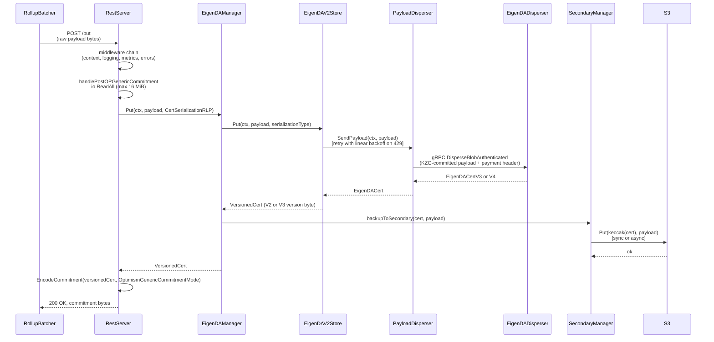
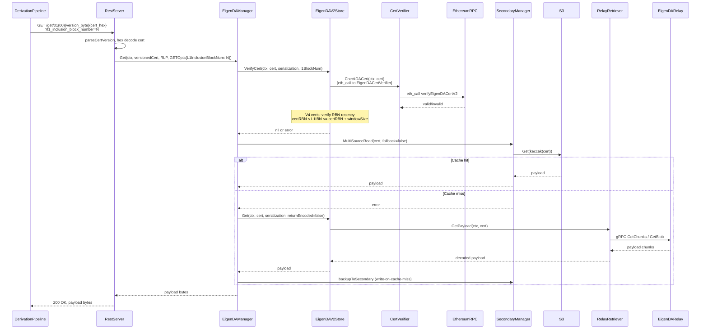
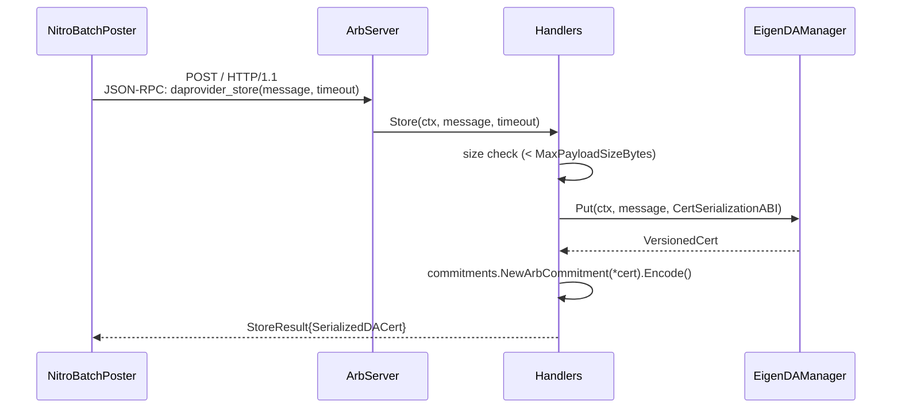
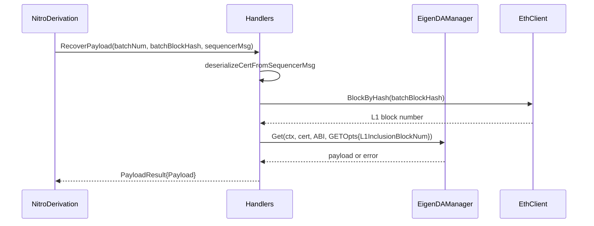
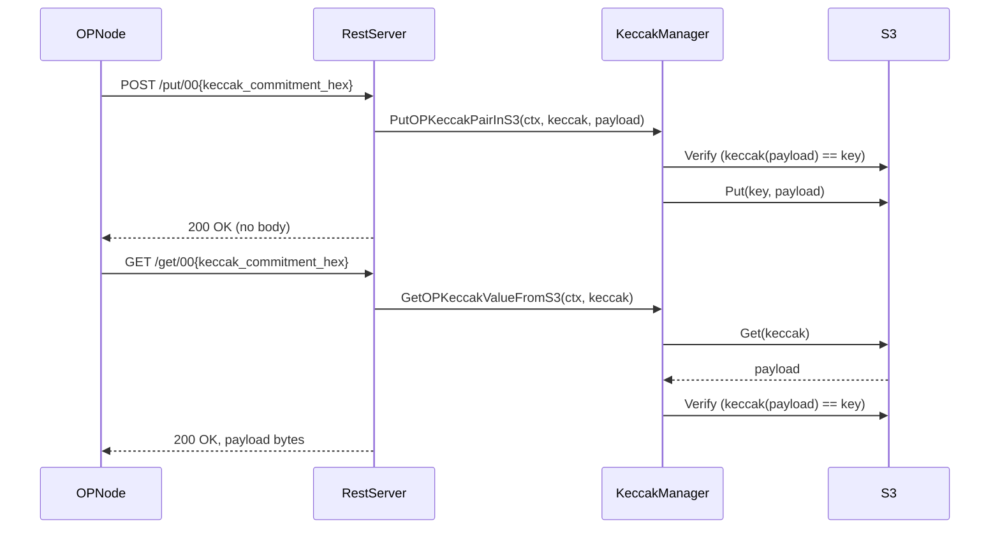

# api-server Analysis

**Analyzed by**: code-analyzer
**Timestamp**: 2026-04-10T00:00:00Z
**Application Type**: go-module
**Classification**: service
**Location**: api/proxy/cmd/server

## Architecture

The EigenDA Proxy is a multi-server HTTP/RPC sidecar service that acts as the DA (data availability) layer adapter between rollup clients (Optimism, Arbitrum) and the EigenDA network. It exposes two distinct server types — a REST HTTP server for OP-stack integrations and a JSON-RPC server for Arbitrum Nitro Custom DA integrations — along with a Prometheus metrics server, all started from a single `StartProxyService` entrypoint.

The proxy is structured in distinct layers. The entrypoint (`cmd/server`) handles CLI flag parsing, logger initialization, Ethereum client construction, and server lifecycle management. Beneath that sits the storage layer: a primary `EigenDAManager` that talks to EigenDA V2 relays and validators via gRPC (using `api/clients/v2`), plus an optional `SecondaryManager` for S3-backed caching and fallback. A `KeccakManager` handles OP keccak256 commitments stored directly in S3.

For dispersal (PUT path), the proxy builds a `PayloadDisperser` that signs payloads with the operator's payment key, submits them over gRPC to the EigenDA disperser, and waits for a DA certificate. For retrieval (GET path), it first verifies the certificate via an Ethereum `eth_call` to the `EigenDACertVerifier` contract, then fetches the payload from EigenDA relay nodes or validator nodes depending on configuration.

Error handling is highly structured: the middleware stack maps internal typed errors to specific HTTP status codes (400 for parsing errors, 418 for invalid cert derivation errors, 429 for rate limiting, 503 for EigenDA failover signals). The Arbitrum JSON-RPC server translates the same error signals into Arbitrum-specific protocol error types.

## Key Components

- **`StartProxyService`** (`api/proxy/cmd/server/entrypoint.go`): Top-level entrypoint function. Reads all CLI config, constructs the Ethereum client and Prometheus registry, builds storage managers via `builder.BuildManagers`, then conditionally starts the REST server, Arbitrum RPC server, and metrics server based on `EnabledServersConfig`. Handles graceful shutdown with deferred `Stop()` calls.

- **`rest.Server`** (`api/proxy/servers/rest/server.go`): Standard `net/http` server wrapping a `gorilla/mux` router. Exposes PUT and GET routes for three commitment modes: OP generic (EigenDA), OP keccak256 (S3), and standard commitment (Nitro). Has a 40-minute `WriteTimeout` to accommodate blob finalization latencies. Delegates to `IEigenDAManager` and `IKeccakManager`.

- **`rest.RegisterRoutes`** (`api/proxy/servers/rest/routing.go`): Registers all HTTP routes using gorilla mux path patterns with hex-encoded commitment bytes embedded in the URL path. Wraps cert handlers in a four-layer middleware chain (request context → logging → metrics → error handling). Admin endpoints (`/admin/eigenda-dispersal-backend`) are conditionally registered.

- **`arbitrum_altda.Server`** (`api/proxy/servers/arbitrum_altda/server.go`): Go-ethereum `rpc.Server`-based JSON-RPC server registered under the `daprovider` namespace. Optionally authenticated with HS256 JWT. Implements Arbitrum Nitro's Custom DA provider interface.

- **`arbitrum_altda.Handlers`** (`api/proxy/servers/arbitrum_altda/handlers.go`): JSON-RPC method implementations for Arbitrum. `Store` disperses blobs; `RecoverPayload` retrieves them with L1 inclusion block recency check; `CollectPreimages` returns cert→payload preimage maps for the arbitrator. `GenerateReadPreimageProof` and `GenerateCertificateValidityProof` are stubs (unimplemented or no-op).

- **`store.EigenDAManager`** (`api/proxy/store/eigenda_manager.go`): Central coordinator for EigenDA V2 certificate operations. `Put` disperses to EigenDA V2 and optionally backs up to secondary storage. `Get` verifies the cert on-chain, then tries secondary cache, EigenDA, and secondary fallback in sequence. Tracks dispersal backend version atomically.

- **`store.KeccakManager`** (`api/proxy/store/keccak_manager.go`): Handles Optimism keccak256 commitments, storing `(keccak(payload) → payload)` pairs exclusively in S3. Used only for legacy OP keccak commitments or temporary failover.

- **`eigenda_v2.Store`** (`api/proxy/store/generated_key/v2/eigenda.go`): Implements `EigenDAV2Store` interface. `Put` uses `retry-go` with linear backoff for rate-limit errors to call `PayloadDisperser.SendPayload`. `Get` calls payload retrievers in sequence until one succeeds. `VerifyCert` calls `CertVerifier.CheckDACert` via eth_call, and for V4 certs performs an additional RBN recency window check.

- **`store.SecondaryManager`** (`api/proxy/store/secondary/secondary.go`): Routes writes to S3-backed cache and fallback stores, supporting both synchronous (with exponential retry) and async (goroutine subscription) write modes. `MultiSourceRead` attempts each configured backend in order.

- **`store.secondary.s3.Store`** (`api/proxy/store/secondary/s3/s3.go`): S3/GCS blob store using the `minio-go` client. Supports static, IAM, and public credential types. GCS support via special-casing `DisableContentSha256` for Google endpoints.

- **`builder.BuildManagers`** (`api/proxy/store/builder/storage_manager_builder.go`): Factory function that assembles the entire storage stack: initializes S3 store, builds the EigenDA V2 backend (KZG committer, cert verifier, relay and/or validator retrievers, payment disperser), constructs secondary manager with async worker goroutines, and returns `EigenDAManager` and `KeccakManager`.

- **`middleware.WithCertMiddlewares`** (`api/proxy/servers/rest/middleware/middleware.go`): Composes the four HTTP middleware layers for cert routes in order: request context enrichment → structured logging → Prometheus metrics → error-to-HTTP-status translation.

- **`metrics.Metrics`** (`api/proxy/metrics/metrics.go`): Prometheus metrics tracking HTTP server request counts/durations (labelled by method, status, commitment mode, cert version) and secondary storage request counts/durations.

## Data Flows

### 1. Blob Dispersal (PUT) — Optimism Generic Commitment

**Flow Description**: Rollup batcher POSTs a raw payload; proxy disperses it to EigenDA and returns an altda commitment.



**Detailed Steps**:

1. **HTTP request receipt** (RollupBatcher → RestServer): `POST /put` with raw blob payload in body. `io.ReadAll` with a 16 MiB `MaxBytesReader` limit enforced.
2. **Middleware wrapping**: Context → Logging → Metrics (timer started) → Error handler.
3. **Payload dispersal** (EigenDAManager → EigenDAV2Store → PayloadDisperser): Payload encoded with KZG commitment and signed with the operator's ECDSA payment key. Retried up to `putTries` times with linear backoff on `ResourceExhausted` and non-gRPC errors.
4. **Cert return**: `PayloadDisperser.SendPayload` returns a typed `EigenDACert`. V3 certs are mapped to `V2VersionByte`; V4 to `V3VersionByte`.
5. **Secondary backup**: If S3 cache/fallback configured, payload written with key `keccak(serializedCert)` — either synchronously (5x exponential retry) or via goroutine subscription channel.
6. **Commitment encoding**: The versioned cert is wrapped with OP altda prefix bytes before being written as the HTTP response body.

**Error Paths**:
- `ResourceExhausted` gRPC error → 429 Too Many Requests
- `ErrorFailover` → 503 Service Unavailable (signals batcher to failover to Ethereum DA)
- `InvalidArgument` gRPC error → 500 (treated as proxy bug)
- Oversized blob → 400 Bad Request

---

### 2. Blob Retrieval (GET) — Optimism Generic Commitment

**Flow Description**: Rollup derivation pipeline GETs a payload by its cert commitment; proxy verifies the cert on-chain then fetches the payload.



**Error Paths**:
- Invalid cert (contract returns invalid) → 418 Teapot (instructs derivation pipeline to discard this blob)
- RBN recency check fails → 418 Teapot
- All retrievers exhausted → 500 Internal Server Error
- `ErrorFailover` during retrieval → 503

---

### 3. Arbitrum Blob Storage (Store)

**Flow Description**: Arbitrum Nitro batch poster calls `daprovider_store` JSON-RPC to persist a batch payload.



---

### 4. Arbitrum Payload Recovery (RecoverPayload)

**Flow Description**: Arbitrum derivation node calls `daprovider_recoverPayload` to retrieve a batch from its sequencer message.



---

### 5. OP Keccak256 Commitment (S3-only path)

**Flow Description**: OP rollup clients storing/retrieving data via legacy keccak256 commitments that go directly to S3.



## Dependencies

### External Libraries

- **gorilla/mux** (v1.8.0) [web-framework]: HTTP router for the REST server. Used in `servers/rest/server.go` and `routing.go` to define path-parameterized routes with hex regex patterns and method-based subrouters. Also used in `entrypoint.go` to build the router and attach memstore config handlers.
  Imported in: `api/proxy/cmd/server/entrypoint.go`, `api/proxy/servers/rest/server.go`, `api/proxy/servers/rest/routing.go`, `api/proxy/servers/rest/handlers_cert.go`.

- **prometheus/client_golang** (v1.21.1) [monitoring]: Prometheus metrics client. Used to create a private registry in `entrypoint.go`, define counter/histogram metrics in `metrics/metrics.go`, and expose them via `promhttp` in `metrics/server.go`. Labels include method, status, commitment mode, cert version.
  Imported in: `api/proxy/cmd/server/entrypoint.go`, `api/proxy/metrics/metrics.go`, `api/proxy/metrics/server.go`, `api/proxy/store/builder/storage_manager_builder.go`.

- **joho/godotenv** (v1.5.1) [other]: `.env` file loader. Used in `main.go` to optionally load environment variable files specified via `ENV_PATH` env var.
  Imported in: `api/proxy/cmd/server/main.go`.

- **urfave/cli/v2** (v2.27.5) [cli]: CLI framework for flag definition and parsing. All configuration flags are registered in `config/flags.go` and read via `ReadAppConfig`. Used pervasively across all `cli.go` files.
  Imported in: `api/proxy/cmd/server/main.go`, `api/proxy/config/flags.go`, `api/proxy/config/app_config.go`, and all per-package `cli.go` files.

- **ethereum-optimism/optimism** (Layr-Labs fork v1.13.1) [other]: Fork of Optimism's op-service, used for `cliapp.ProtectFlags`, `ctxinterrupt.WithSignalWaiterMain`, `oplog.SetupDefaults`, `ophttp.HTTPServer` (metrics server), and `retry.Do` / `retry.Exponential` in `secondary.go`.
  Imported in: `api/proxy/cmd/server/main.go`, `api/proxy/cmd/server/entrypoint.go`, `api/proxy/metrics/server.go`, `api/proxy/store/secondary/secondary.go`.

- **minio/minio-go/v7** (v7.0.85) [cloud-sdk]: S3/GCS object storage client. Used in `store/secondary/s3/s3.go` to implement `Get`/`Put` operations against S3-compatible endpoints. Supports static, IAM, and public credential types. Special-cases GCS endpoints to disable chunked SHA256.
  Imported in: `api/proxy/store/secondary/s3/s3.go`.

- **avast/retry-go/v4** (v4.6.0) [other]: Retry library with configurable strategies. Used in `store/generated_key/v2/eigenda.go` (`Put`) with custom `RetryIf` logic distinguishing between immediate retry (failover/gRPC errors) and linear-backoff retry (rate limit errors).
  Imported in: `api/proxy/store/generated_key/v2/eigenda.go`.

- **ethereum/go-ethereum** (op-geth v1.101511.1 fork) [blockchain]: Go-ethereum/op-geth library. Used for `rpc.Server` (Arbitrum JSON-RPC), JWT authentication (`node.NewHTTPHandlerStack`), `geth_common.HexToAddress`, `crypto.Keccak256Hash`, `bind.CallOpts` for contract interactions, and `geth.EthClientConfig`.
  Imported in: `api/proxy/servers/arbitrum_altda/server.go`, `api/proxy/store/builder/storage_manager_builder.go`, `api/proxy/store/secondary/secondary.go`, `api/proxy/store/secondary/s3/s3.go`.

- **Layr-Labs/eigensdk-go** (v0.2.0-beta) [other]: EigenLayer SDK. Provides the `logging.Logger` interface used throughout the proxy for structured logging.
  Imported in: `api/proxy/servers/rest/server.go`, `api/proxy/servers/arbitrum_altda/handlers.go`, `api/proxy/store/eigenda_manager.go`, and most other packages.

- **google.golang.org/grpc** (v1.72.2) [networking]: gRPC runtime library. Used in `store/generated_key/v2/eigenda.go` for gRPC status code checks (`codes.InvalidArgument`, `codes.ResourceExhausted`) during dispersal retry logic.
  Imported in: `api/proxy/store/generated_key/v2/eigenda.go`, `api/proxy/common/proxyerrors/4xx.go`.

- **consensys/gnark-crypto** [crypto]: BN254 elliptic curve cryptography. Used in `store/builder/storage_manager_builder.go` for KZG SRS points (`bn254.G1Affine`) passed to relay/validator retrievers and the KZG committer.
  Imported in: `api/proxy/store/builder/storage_manager_builder.go`.

### Internal Libraries

- **api** (`api/`): The `api/clients/v2` sub-packages provide the primary EigenDA network client stack. `dispersal.PayloadDisperser` handles blob submission; `verification.CertVerifier` wraps `eth_call` to the cert verifier contract; `payloadretrieval.RelayPayloadRetriever` and `ValidatorPayloadRetriever` handle blob retrieval; `clients_v2.CertBuilder` constructs cert metadata. `api.ErrorFailover` is a sentinel error for dispersal failover detection.
  Used in: `api/proxy/store/builder/storage_manager_builder.go`, `api/proxy/store/generated_key/v2/eigenda.go`, `api/proxy/servers/rest/handlers_cert.go`, `api/proxy/servers/arbitrum_altda/handlers.go`.

- **common** (`common/`): `common_eigenda.EthClient` interface is the runtime Ethereum connection abstraction. `geth.EthClientConfig` is used in `entrypoint.go` to configure the Ethereum client. `common/ratelimit.OverfillOncePermitted` and `common/disperser.NewLegacyDisperserRegistry` are used in the builder. `common/metrics` provides `Documentor` for metric self-documentation.
  Used in: `api/proxy/cmd/server/entrypoint.go`, `api/proxy/store/builder/storage_manager_builder.go`.

## API Surface

The proxy exposes three server interfaces:

### REST HTTP Server (OP-Stack ALT-DA Interface)

**1. POST /put** (Optimism Generic Commitment — EigenDA)

Disperses a blob to EigenDA V2 and returns an altda commitment. Primary write path for OP-stack rollup batchers.

Example Request:
```http
POST /put HTTP/1.1
Host: localhost:3100
Content-Type: application/octet-stream

<raw rollup payload bytes, max 16 MiB>
```

Example Response (200 OK):
```http
HTTP/1.1 200 OK
Content-Type: application/octet-stream

<binary: [0x01][0x00][version_byte][serialized_cert_bytes]>
```

Error Responses:
- 400 Bad Request: Body exceeds 16 MiB, or malformed request
- 403 Forbidden: `op-generic` API not enabled
- 429 Too Many Requests: Rate limited by EigenDA disperser
- 503 Service Unavailable: EigenDA temporarily unavailable (failover signal)

---

**2. GET /get/01{00}{version_byte_hex}{cert_hex}** (Optimism Generic Commitment — EigenDA)

Retrieves a blob from EigenDA given its serialized cert in the URL path.

Example Request:
```http
GET /get/0100013abc...def HTTP/1.1
Host: localhost:3100
```

Optional query parameters:
- `?l1_inclusion_block_number=12345678` — enables RBN recency check
- `?return_encoded_payload=true` — returns raw encoded payload (for proof systems)

Example Response (200 OK):
```http
HTTP/1.1 200 OK
Content-Type: application/octet-stream

<raw rollup payload bytes>
```

Error Responses:
- 400 Bad Request: Malformed cert hex, invalid version byte, bad query param
- 403 Forbidden: `op-generic` API not enabled
- 418 Teapot: Invalid cert (derivation pipeline should discard this blob), RBN recency check failed
- 500 Internal Server Error: All retrievers failed

---

**3. POST /put/00{keccak_commitment_hex}** (Optimism Keccak256 Commitment — S3)

Stores a `(keccak(payload) → payload)` pair in S3. For legacy OP integrations.

Example Request:
```http
POST /put/00aabbcc...ff HTTP/1.1
Host: localhost:3100
Content-Type: application/octet-stream

<raw payload bytes>
```

Example Response (200 OK): empty body.

---

**4. GET /get/00{keccak_commitment_hex}** (Optimism Keccak256 Commitment — S3)

Retrieves a payload from S3 using a keccak256 commitment.

Example Request:
```http
GET /get/00aabbcc...ff HTTP/1.1
Host: localhost:3100
```

Example Response (200 OK):
```http
HTTP/1.1 200 OK
Content-Type: application/octet-stream

<raw payload bytes>
```

---

**5. POST /put?commitment_mode=standard** / **GET /get/{version_byte_hex}{cert_hex}?commitment_mode=standard** (Standard Commitment — Nitro)

Standard commitment mode for Arbitrum Nitro integration. Same dispersal/retrieval flow as OP generic but commitment encoded without OP prefix bytes.

---

**6. GET /health**

Liveness probe. Returns 200 OK with empty body.

---

**7. GET /config**

Returns proxy compatibility configuration as JSON.

Example Response (200 OK):
```json
{
  "version": "2.4.0-43-g3b4f9f40",
  "chain_id": "1",
  "directory_address": "0xabc...",
  "cert_verifier_address": "0xdef...",
  "max_payload_size_bytes": 4063232,
  "apis_enabled": ["op-generic", "standard"],
  "read_only_mode": false
}
```

---

**8. GET /admin/eigenda-dispersal-backend** (Admin — optional)

Returns current EigenDA backend version used for dispersal.

Example Response (200 OK):
```json
{"eigenDADispersalBackend": "V2"}
```

---

**9. PUT /admin/eigenda-dispersal-backend** (Admin — optional)

Hot-switches the EigenDA dispersal backend version at runtime.

Example Request:
```http
PUT /admin/eigenda-dispersal-backend HTTP/1.1
Content-Type: application/json

{"eigenDADispersalBackend": "V2"}
```

### Arbitrum Custom DA JSON-RPC Server

Exposed as a go-ethereum JSON-RPC server on a separate port, registered under the `daprovider` namespace. Optionally JWT-authenticated (HS256, 32-byte key).

**Methods**:
- `daprovider_compatibilityConfig()` → `{CompatibilityConfig}`
- `daprovider_getSupportedHeaderBytes()` → `{headerBytes: ["0xed"]}`
- `daprovider_getMaxMessageSize()` → `{maxSize: N}`
- `daprovider_store(message, timeout)` → `{serializedDACert: bytes}` — disperses blob to EigenDA
- `daprovider_recoverPayload(batchNum, batchBlockHash, sequencerMsg)` → `{payload: bytes}` — retrieves blob
- `daprovider_collectPreimages(batchNum, batchBlockHash, sequencerMsg)` → `{preimages: map}` — for arbitrator
- `daprovider_generateReadPreimageProof(certHash, offset, certificate)` → *panic (unimplemented)*
- `daprovider_generateCertificateValidityProof(certificate)` → `{proof: []}` (no-op)

### Prometheus Metrics Server

Exposed on a separate port (`/metrics`). Standard Prometheus text format. Namespace: `eigenda_proxy`.

Key metrics:
- `eigenda_proxy_http_server_requests_total` (counter, labels: method, status, commitment_mode, cert_version)
- `eigenda_proxy_http_server_request_duration_seconds` (histogram, label: method)
- `eigenda_proxy_secondary_requests_total` (counter, labels: backend_type, method, status)
- `eigenda_proxy_secondary_request_duration_seconds` (histogram, label: backend_type)
- `eigenda_proxy_default_up` (gauge)

## Code Examples

### Example 1: Dispersal retry logic with linear backoff on rate-limit errors

```go
// api/proxy/store/generated_key/v2/eigenda.go
var rateLimitRetries int
cert, err := retry.DoWithData(
    func() (coretypes.EigenDACert, error) {
        return e.disperser.SendPayload(ctx, payload)
    },
    retry.RetryIf(func(err error) bool {
        grpcStatus, isGRPCError := status.FromError(err)
        if !isGRPCError {
            rateLimitRetries++
            sleepDuration := time.Duration(rateLimitRetries) * e.retryDelay
            time.Sleep(sleepDuration)
            return true
        }
        switch grpcStatus.Code() {
        case codes.InvalidArgument:
            return false  // don't retry 400s
        case codes.ResourceExhausted:
            rateLimitRetries++
            time.Sleep(time.Duration(rateLimitRetries) * e.retryDelay)
            return true
        default:
            return true
        }
    }),
    retry.LastErrorOnly(true),
    retry.Attempts(utils.ConvertToRetryGoAttempts(e.putTries)),
)
```

### Example 2: Four-layer middleware chain composition

```go
// api/proxy/servers/rest/middleware/middleware.go
// Innermost to outermost: error -> metrics -> logging -> request context
func WithCertMiddlewares(
    handler func(http.ResponseWriter, *http.Request) error,
    log logging.Logger,
    m metrics.Metricer,
    mode commitments.CommitmentMode,
) http.HandlerFunc {
    return withRequestContext(
        withLogging(
            withMetrics(
                withErrorHandling(handler),
                m,
                mode,
            ),
            log,
            mode,
        ),
    )
}
```

### Example 3: Error-to-HTTP-status mapping in error middleware

```go
// api/proxy/servers/rest/middleware/error.go
var derivationErr coretypes.DerivationError
switch {
case proxyerrors.Is400(err):
    http.Error(w, err.Error(), http.StatusBadRequest)
case errors.As(err, &derivationErr):
    http.Error(w, derivationErr.MarshalToTeapotBody(), http.StatusTeapot)
case proxyerrors.Is429(err):
    http.Error(w, err.Error(), http.StatusTooManyRequests)
case proxyerrors.Is503(err):
    http.Error(w, err.Error(), http.StatusServiceUnavailable)
default:
    http.Error(w, err.Error(), http.StatusInternalServerError)
}
```

### Example 4: On-chain cert verification with RBN recency check

```go
// api/proxy/store/generated_key/v2/eigenda.go
err := e.certVerifier.CheckDACert(timeoutCtx, sumDACert)
if err != nil {
    var certVerifierInvalidCertErr *verification.CertVerifierInvalidCertError
    if errors.As(err, &certVerifierInvalidCertErr) {
        return coretypes.ErrInvalidCertDerivationError.WithMessage(certVerifierInvalidCertErr.Error())
    }
    return fmt.Errorf("eth-call to CertVerifier.checkDACert: %w", err)
}
// V4 certs additionally check RBN recency window
if certVersion >= coretypes.VersionFourCert {
    certV4 := sumDACert.(*coretypes.EigenDACertV4)
    err = verifyCertRBNRecencyCheck(
        certV4.ReferenceBlockNumber(), l1InclusionBlockNum, params.RBNRecencyWindowSize)
}
```

### Example 5: Cache-then-EigenDA-then-fallback read chain

```go
// api/proxy/store/eigenda_manager.go
// 1 - try secondary cache first
if m.secondary.CachingEnabled() && !opts.ReturnEncodedPayload {
    payload, err := m.secondary.MultiSourceRead(ctx, versionedCert.SerializedCert, false, verifyFn)
    if err == nil {
        return payload, nil
    }
}
// 2 - read from EigenDA
payloadOrEncodedPayload, err := m.eigendaV2.Get(ctx, versionedCert, serializationType, opts.ReturnEncodedPayload)
if err == nil {
    if m.secondary.WriteOnCacheMissEnabled() && !opts.ReturnEncodedPayload {
        m.backupToSecondary(ctx, versionedCert.SerializedCert, payloadOrEncodedPayload)
    }
    return payloadOrEncodedPayload, nil
}
// 3 - fallback
if m.secondary.FallbackEnabled() && !opts.ReturnEncodedPayload {
    payloadOrEncodedPayload, err = m.secondary.MultiSourceRead(ctx, versionedCert.SerializedCert, true, verifyFn)
    if err == nil {
        return payloadOrEncodedPayload, nil
    }
}
```

## Files Analyzed

- `api/proxy/cmd/server/main.go` (56 lines) — Binary entry point, CLI setup, env file loading
- `api/proxy/cmd/server/entrypoint.go` (194 lines) — `StartProxyService`: full server initialization and lifecycle
- `api/proxy/servers/rest/server.go` (147 lines) — REST HTTP server struct, start/stop
- `api/proxy/servers/rest/routing.go` (179 lines) — Route registration, query param parsing
- `api/proxy/servers/rest/handlers_cert.go` (230 lines) — Core PUT/GET handlers for cert routes
- `api/proxy/servers/rest/handlers_misc.go` (130 lines) — Health, admin, config endpoints
- `api/proxy/servers/rest/middleware/middleware.go` (36 lines) — Middleware chain composition
- `api/proxy/servers/rest/middleware/error.go` (53 lines) — Error-to-HTTP-status mapping
- `api/proxy/servers/arbitrum_altda/server.go` (144 lines) — Arbitrum JSON-RPC server
- `api/proxy/servers/arbitrum_altda/handlers.go` (458 lines) — Arbitrum RPC method implementations
- `api/proxy/store/eigenda_manager.go` (274 lines) — EigenDA cert manager (Put/Get with secondary)
- `api/proxy/store/keccak_manager.go` (84 lines) — S3-backed keccak commitment manager
- `api/proxy/store/generated_key/v2/eigenda.go` (393 lines) — EigenDA V2 store (dispersal + verification + retrieval)
- `api/proxy/store/builder/storage_manager_builder.go` (761 lines) — Storage stack factory
- `api/proxy/store/secondary/secondary.go` (238 lines) — Secondary storage manager (cache + fallback)
- `api/proxy/store/secondary/s3/s3.go` (165 lines) — S3/GCS blob store via minio-go
- `api/proxy/config/app_config.go` (71 lines) — Top-level config struct and reader
- `api/proxy/config/flags.go` (59 lines) — All CLI flag registrations
- `api/proxy/common/common.go` (121 lines) — EigenDABackend enum, constants, utilities
- `api/proxy/common/store.go` (123 lines) — Store interface definitions
- `api/proxy/common/compatibility_config.go` (70 lines) — CompatibilityConfig struct
- `api/proxy/common/proxyerrors/4xx.go` (136 lines) — 4xx error types and classification
- `api/proxy/common/proxyerrors/5xx.go` (13 lines) — 5xx (503 failover) classification
- `api/proxy/metrics/metrics.go` (179 lines) — Prometheus metric definitions
- `api/proxy/metrics/server.go` (26 lines) — Prometheus HTTP server
- `api/proxy/common/types/commitments/mode.go` (45 lines) — CommitmentMode encoding
- `api/proxy/common/types/commitments/op.go` (53 lines) — OP commitment encoding

## Analysis Data

```json
{
  "summary": "The EigenDA Proxy is a multi-server HTTP/RPC sidecar service that acts as a DA layer adapter for rollup clients. It exposes a REST server for Optimism ALT-DA integrations and a JSON-RPC server for Arbitrum Nitro Custom DA, plus a Prometheus metrics server. On the write path, it accepts raw blob payloads, disperses them to EigenDA V2 via gRPC (with retry/backoff), and returns commitment bytes. On the read path, it verifies DA certificates via eth_call to the EigenDACertVerifier contract, then fetches payloads from EigenDA relay nodes, validators, or S3 cache/fallback. Commitment encoding is mode-aware: Optimism generic (altda prefix bytes), Optimism keccak256 (S3-only), standard (Nitro), and Arbitrum Custom DA (ABI-encoded cert).",
  "architecture_pattern": "proxy/middleware",
  "key_modules": [
    "cmd/server — entrypoint and server lifecycle",
    "servers/rest — OP-stack HTTP ALT-DA server",
    "servers/arbitrum_altda — Arbitrum Nitro Custom DA JSON-RPC server",
    "store/eigenda_manager — EigenDA V2 cert manager with secondary storage",
    "store/keccak_manager — S3-backed keccak commitment manager",
    "store/generated_key/v2 — EigenDA V2 dispersal, verification, retrieval",
    "store/builder — storage stack factory",
    "store/secondary — S3 cache/fallback secondary manager",
    "store/secondary/s3 — minio-go S3 store",
    "metrics — Prometheus metrics",
    "common — shared types, interfaces, error taxonomy"
  ],
  "api_endpoints": [
    {"path": "/put", "method": "POST", "description": "Disperse blob to EigenDA V2, return OP generic altda commitment"},
    {"path": "/put/", "method": "POST", "description": "Disperse blob to EigenDA V2 (trailing slash variant), return OP generic altda commitment"},
    {"path": "/put?commitment_mode=standard", "method": "POST", "description": "Disperse blob to EigenDA V2, return standard commitment (Nitro)"},
    {"path": "/put/00{keccak_commitment_hex}", "method": "POST", "description": "Store keccak(payload)→payload pair in S3 (OP keccak256 commitment)"},
    {"path": "/get/01{00}{version_byte_hex}{cert_hex}", "method": "GET", "description": "Retrieve blob by OP generic altda commitment"},
    {"path": "/get/{version_byte_hex}{payload_hex}?commitment_mode=standard", "method": "GET", "description": "Retrieve blob by standard commitment"},
    {"path": "/get/00{keccak_commitment_hex}", "method": "GET", "description": "Retrieve payload from S3 by keccak256 commitment"},
    {"path": "/health", "method": "GET", "description": "Liveness probe, returns 200 OK"},
    {"path": "/config", "method": "GET", "description": "Return proxy compatibility config JSON (version, chainID, cert verifier address, max payload size, enabled APIs)"},
    {"path": "/admin/eigenda-dispersal-backend", "method": "GET", "description": "Return current EigenDA dispersal backend version (admin, optional)"},
    {"path": "/admin/eigenda-dispersal-backend", "method": "PUT", "description": "Hot-switch EigenDA dispersal backend version (admin, optional)"},
    {"path": "/metrics", "method": "GET", "description": "Prometheus metrics endpoint (separate server port)"}
  ],
  "data_flows": [
    "PUT (OP generic): HTTP POST /put → handlePostOPGenericCommitment → EigenDAManager.Put → EigenDAV2Store.Put → PayloadDisperser.SendPayload (gRPC, with retry) → VersionedCert → secondary backup (S3) → EncodeCommitment → response bytes",
    "GET (OP generic): HTTP GET /get/01... → handleGetOPGenericCommitment → EigenDAManager.Get → EigenDAV2Store.VerifyCert (eth_call) → secondary cache read → EigenDAV2Store.Get (relay/validator gRPC) → secondary fallback → payload bytes",
    "Arbitrum Store: JSON-RPC daprovider_store → Handlers.Store → EigenDAManager.Put (ABI serialization) → NewArbCommitment.Encode → StoreResult",
    "Arbitrum RecoverPayload: JSON-RPC daprovider_recoverPayload → deserializeCertFromSequencerMsg → BlockByHash (L1 inclusion) → EigenDAManager.Get → PayloadResult",
    "OP Keccak: POST /put/00{keccak} → KeccakManager.PutOPKeccakPairInS3 → S3.Put; GET /get/00{keccak} → KeccakManager.GetOPKeccakValueFromS3 → S3.Get + Verify"
  ],
  "tech_stack": ["go", "grpc", "http", "json-rpc", "prometheus", "s3", "ethereum", "kzg", "minio"],
  "external_integrations": [
    {"service": "EigenDA Disperser", "type": "grpc", "description": "Blob dispersal via DisperseBlobAuthenticated gRPC. Payment-authenticated with operator ECDSA key. Receives DA certificates (V3/V4) upon batch confirmation."},
    {"service": "EigenDA Relay Nodes", "type": "grpc", "description": "Blob chunk retrieval via GetChunks/GetBlob gRPC. URL discovered dynamically from RelayRegistry contract. Used as primary retrieval path."},
    {"service": "EigenDA Validator Nodes", "type": "grpc", "description": "Fallback blob retrieval directly from validators when relay retrieval fails."},
    {"service": "Ethereum RPC", "type": "http/json-rpc", "description": "eth_call to EigenDACertVerifier/Router contracts for cert verification. Also used to fetch chain ID, block info (L1 inclusion block for Arbitrum), and contract directory lookups."},
    {"service": "AWS S3 / GCS", "type": "s3-api", "description": "Payload caching and fallback storage via minio-go client. Also used for OP keccak256 commitments. Supports static, IAM, and public credential modes. GCS supported via storage.googleapis.com endpoint detection."}
  ],
  "component_interactions": [
    {"target": "api (clients/v2)", "type": "calls", "protocol": "grpc", "description": "Uses PayloadDisperser, RelayPayloadRetriever, ValidatorPayloadRetriever, CertVerifier, and CertBuilder from api/clients/v2 for all EigenDA network interactions"},
    {"target": "common (geth)", "type": "calls", "protocol": "ethereum-rpc", "description": "Uses common.EthClient (geth implementation with multi-homing) for Ethereum RPC connectivity; geth.EthClientConfig for retry/failover configuration"}
  ]
}
```

## Citations

```json
[
  {
    "file_path": "api/proxy/cmd/server/main.go",
    "start_line": 27,
    "end_line": 56,
    "claim": "Entry point sets up CLI app with urfave/cli/v2, loads optional .env file via godotenv, and uses ctxinterrupt for signal-based shutdown",
    "section": "Architecture",
    "snippet": "app := cli.NewApp()\napp.Flags = cliapp.ProtectFlags(config.Flags)\napp.Action = StartProxyService"
  },
  {
    "file_path": "api/proxy/cmd/server/entrypoint.go",
    "start_line": 28,
    "end_line": 60,
    "claim": "StartProxyService reads config, builds Prometheus registry and storage managers before conditionally starting each server",
    "section": "Architecture",
    "snippet": "func StartProxyService(cliCtx *cli.Context) error {"
  },
  {
    "file_path": "api/proxy/cmd/server/entrypoint.go",
    "start_line": 62,
    "end_line": 84,
    "claim": "Ethereum client is only constructed when memstore is not enabled; read-only mode is set when no signer payment key is provided",
    "section": "Key Components",
    "snippet": "if !cfg.StoreBuilderConfig.MemstoreEnabled {\n\tethClient, chainID, err = common.BuildEthClient(...)\n\treadOnlyMode = cfg.SecretConfig.SignerPaymentKey == \"\"\n}"
  },
  {
    "file_path": "api/proxy/cmd/server/entrypoint.go",
    "start_line": 112,
    "end_line": 140,
    "claim": "REST server is conditionally started only if DAEndpointEnabled; memstore config HTTP handlers are conditionally registered on the same router",
    "section": "Key Components",
    "snippet": "if cfg.EnabledServersConfig.RestAPIConfig.DAEndpointEnabled() {\n\trestServer := rest.NewServer(...)\n\trouter := mux.NewRouter()"
  },
  {
    "file_path": "api/proxy/cmd/server/entrypoint.go",
    "start_line": 142,
    "end_line": 173,
    "claim": "Arbitrum Custom DA JSON-RPC server is conditionally started with JWT authentication support",
    "section": "Key Components",
    "snippet": "if cfg.EnabledServersConfig.ArbCustomDA {\n\tarbitrumRpcServer, err := arbitrum_altda.NewServer(ctx, &cfg.ArbCustomDASvrCfg, h)"
  },
  {
    "file_path": "api/proxy/servers/rest/server.go",
    "start_line": 55,
    "end_line": 60,
    "claim": "WriteTimeout is set to 40 minutes to accommodate worst-case EigenDA blob finalization times",
    "section": "Key Components",
    "snippet": "WriteTimeout: 40 * time.Minute,"
  },
  {
    "file_path": "api/proxy/servers/rest/routing.go",
    "start_line": 24,
    "end_line": 112,
    "claim": "Routes registered using gorilla mux with hex regex path segments for commitment bytes; cert routes use WithCertMiddlewares wrapper",
    "section": "API Surface",
    "snippet": "subrouterGET.HandleFunc(\"/\"+\n\t\"{optional_prefix:(?:0x)?}\"+\n\t\"{version_byte_hex:[0-9a-fA-F]{2}}\"+\n\t\"{payload_hex:[0-9a-fA-F]*}\","
  },
  {
    "file_path": "api/proxy/servers/rest/routing.go",
    "start_line": 125,
    "end_line": 133,
    "claim": "Admin endpoints for dispersal backend switching are only registered when explicitly enabled; no authentication is applied",
    "section": "API Surface",
    "snippet": "if svr.config.APIsEnabled.Admin {\n\tsvr.log.Warn(\"Admin API endpoints are enabled\")\n\tr.HandleFunc(\"/admin/eigenda-dispersal-backend\", ...)"
  },
  {
    "file_path": "api/proxy/servers/rest/handlers_cert.go",
    "start_line": 198,
    "end_line": 229,
    "claim": "POST handlers read body with MaxBytesReader, call certMgr.Put, then encode the cert as a mode-specific commitment before writing the response",
    "section": "Data Flows",
    "snippet": "payload, err := io.ReadAll(http.MaxBytesReader(w, r.Body, common.MaxServerPOSTRequestBodySize))\nversionedCert, err := svr.certMgr.Put(r.Context(), payload, coretypes.CertSerializationRLP)\nresponseCommit, err := commitments.EncodeCommitment(versionedCert, mode)"
  },
  {
    "file_path": "api/proxy/servers/rest/handlers_cert.go",
    "start_line": 78,
    "end_line": 116,
    "claim": "GET handlers parse cert version from path, optionally accept l1_inclusion_block_number and return_encoded_payload query params, then call certMgr.Get",
    "section": "Data Flows",
    "snippet": "l1InclusionBlockNum, err := parseCommitmentInclusionL1BlockNumQueryParam(r)\nreturnEncodedPayload := parseReturnEncodedPayloadQueryParam(r)\npayloadOrEncodedPayload, err := svr.certMgr.Get(r.Context(), versionedCert, ...)"
  },
  {
    "file_path": "api/proxy/servers/rest/middleware/middleware.go",
    "start_line": 19,
    "end_line": 36,
    "claim": "Middleware chain is composed innermost-first: error handling -> metrics -> logging -> request context",
    "section": "Key Components",
    "snippet": "return withRequestContext(\n\twithLogging(\n\t\twithMetrics(\n\t\t\twithErrorHandling(handler), m, mode,\n\t\t), log, mode,\n\t),\n)"
  },
  {
    "file_path": "api/proxy/servers/rest/middleware/error.go",
    "start_line": 26,
    "end_line": 48,
    "claim": "Error middleware maps typed errors to HTTP status codes: 400 parsing, 418 derivation/cert, 429 rate-limiting, 503 failover, 500 default",
    "section": "Architecture",
    "snippet": "case errors.As(err, &derivationErr):\n\thttp.Error(w, derivationErr.MarshalToTeapotBody(), http.StatusTeapot)\ncase proxyerrors.Is429(err):\n\thttp.Error(w, err.Error(), http.StatusTooManyRequests)\ncase proxyerrors.Is503(err):\n\thttp.Error(w, err.Error(), http.StatusServiceUnavailable)"
  },
  {
    "file_path": "api/proxy/store/eigenda_manager.go",
    "start_line": 103,
    "end_line": 193,
    "claim": "EigenDAManager.Get implements a three-tier read strategy: secondary cache -> EigenDA V2 -> secondary fallback, with write-on-cache-miss promotion",
    "section": "Data Flows",
    "snippet": "// 1 - read payload from cache\n// 2 - read payloadOrEncodedPayload from EigenDA\n// 3 - read blob from fallbacks"
  },
  {
    "file_path": "api/proxy/store/eigenda_manager.go",
    "start_line": 196,
    "end_line": 214,
    "claim": "EigenDAManager.Put disperses to EigenDA V2 backend then backs up to secondary storage (async or sync)",
    "section": "Data Flows",
    "snippet": "versionedCert, err := m.putToCorrectEigenDABackend(ctx, value, serializationType)\nif m.secondary.Enabled() {\n\terr = m.backupToSecondary(ctx, versionedCert.SerializedCert, value)\n}"
  },
  {
    "file_path": "api/proxy/store/generated_key/v2/eigenda.go",
    "start_line": 156,
    "end_line": 222,
    "claim": "Dispersal retries with linear backoff on rate-limit (ResourceExhausted) and non-gRPC errors; does not retry on InvalidArgument",
    "section": "Data Flows",
    "snippet": "case codes.ResourceExhausted:\n\trateLimitRetries++\n\tsleepDuration := time.Duration(rateLimitRetries) * e.retryDelay\n\ttime.Sleep(sleepDuration)\n\treturn true"
  },
  {
    "file_path": "api/proxy/store/generated_key/v2/eigenda.go",
    "start_line": 263,
    "end_line": 354,
    "claim": "VerifyCert calls CertVerifier.CheckDACert via eth_call; V4 certs additionally perform RBN recency window check",
    "section": "Data Flows",
    "snippet": "err := e.certVerifier.CheckDACert(timeoutCtx, sumDACert)\nif certVersion >= coretypes.VersionFourCert {\n\terr = verifyCertRBNRecencyCheck(certV4.ReferenceBlockNumber(), l1InclusionBlockNum, ...)\n}"
  },
  {
    "file_path": "api/proxy/store/generated_key/v2/eigenda.go",
    "start_line": 94,
    "end_line": 143,
    "claim": "Get tries each configured retriever (relay, then validator) in sequence, returning first success or all-failed error",
    "section": "Data Flows",
    "snippet": "for _, retriever := range e.retrievers {\n\tpayload, err := retriever.GetPayload(ctx, cert)\n\tif err == nil {\n\t\treturn payload, nil\n\t}\n}"
  },
  {
    "file_path": "api/proxy/store/generated_key/v2/eigenda.go",
    "start_line": 229,
    "end_line": 246,
    "claim": "EigenDACertV2 is no longer supported; V3 certs map to V2VersionByte and V4 certs map to V3VersionByte in the proxy's versioning scheme",
    "section": "Architecture",
    "snippet": "case *coretypes.EigenDACertV3:\n\treturn certs.NewVersionedCert(serializedCert, certs.V2VersionByte), nil\ncase *coretypes.EigenDACertV4:\n\treturn certs.NewVersionedCert(serializedCert, certs.V3VersionByte), nil"
  },
  {
    "file_path": "api/proxy/store/builder/storage_manager_builder.go",
    "start_line": 54,
    "end_line": 151,
    "claim": "BuildManagers is the factory function wiring S3 store, EigenDA V2 backend, secondary manager, EigenDAManager and KeccakManager",
    "section": "Key Components",
    "snippet": "certMgr, err := store.NewEigenDAManager(eigenDAV2Store, log, secondary, config.StoreConfig.DispersalBackend)\nkeccakMgr, err := store.NewKeccakManager(s3Store, log)"
  },
  {
    "file_path": "api/proxy/store/builder/storage_manager_builder.go",
    "start_line": 305,
    "end_line": 340,
    "claim": "Builder configures relay and/or validator retrievers based on ClientConfigV2.RetrieversToEnable; at least one must be configured",
    "section": "Key Components",
    "snippet": "for _, retrieverType := range config.ClientConfigV2.RetrieversToEnable {\n\tswitch retrieverType {\n\tcase common.RelayRetrieverType:\n\tcase common.ValidatorRetrieverType:"
  },
  {
    "file_path": "api/proxy/store/builder/storage_manager_builder.go",
    "start_line": 341,
    "end_line": 363,
    "claim": "PayloadDisperser is only built if a signer payment key is provided; without it the backend is read-only",
    "section": "Architecture",
    "snippet": "if secrets.SignerPaymentKey == \"\" {\n\tlog.Warn(\"No SignerPaymentKey provided: EigenDA V2 backend configured in read-only mode\")\n} else {\n\tpayloadDisperser, err = buildPayloadDisperser(...)"
  },
  {
    "file_path": "api/proxy/store/secondary/s3/s3.go",
    "start_line": 79,
    "end_line": 98,
    "claim": "S3 store uses minio-go client with optional TLS; GCS endpoints disable content SHA256 to avoid chunked signature issues",
    "section": "Dependencies",
    "snippet": "if isGoogleEndpoint(cfg.Endpoint) {\n\tputObjectOptions.DisableContentSha256 = true\n}\nclient, err := minio.New(cfg.Endpoint, ...)"
  },
  {
    "file_path": "api/proxy/store/secondary/secondary.go",
    "start_line": 120,
    "end_line": 165,
    "claim": "Secondary HandleRedundantWrites retries each backend 5x with exponential backoff; errorOnInsertFailure controls fail-fast vs best-effort",
    "section": "Key Components",
    "snippet": "_, err := retry.Do[any](ctx, 5, retry.Exponential(),\n\tfunc() (any, error) { return 0, src.Put(ctx, key, value) })"
  },
  {
    "file_path": "api/proxy/servers/arbitrum_altda/server.go",
    "start_line": 39,
    "end_line": 75,
    "claim": "Arbitrum server uses go-ethereum rpc.Server under daprovider namespace; JWT authentication uses HS256 with 32-byte key read from file",
    "section": "Key Components",
    "snippet": "rpcServer := rpc.NewServer()\nrpcServer.RegisterName(\"daprovider\", h)\nif cfg.JWTSecret != \"\" {\n\thandler = node.NewHTTPHandlerStack(rpcServer, nil, nil, jwt)\n}"
  },
  {
    "file_path": "api/proxy/servers/arbitrum_altda/handlers.go",
    "start_line": 278,
    "end_line": 317,
    "claim": "Arbitrum Store disperses using ABI serialization and translates ErrorFailover to ErrFallbackRequested for Nitro",
    "section": "Data Flows",
    "snippet": "versionedCert, err := h.eigenDAManager.Put(ctx, message, coretypes.CertSerializationABI)\nif errors.Is(err, &api.ErrorFailover{}) {\n\treturn nil, errors.Join(err, ErrFallbackRequested)\n}"
  },
  {
    "file_path": "api/proxy/servers/arbitrum_altda/handlers.go",
    "start_line": 222,
    "end_line": 262,
    "claim": "RecoverPayload fetches L1 inclusion block number from Ethereum and passes it to EigenDAManager.Get for RBN recency check",
    "section": "Data Flows",
    "snippet": "l1InclusionBlockNum, err := h.getL1InclusionBlockNumber(ctx, batchBlockHash)\npayload, err := h.eigenDAManager.Get(ctx, daCert, coretypes.CertSerializationABI,\n\tproxy_common.GETOpts{L1InclusionBlockNum: l1InclusionBlockNum})"
  },
  {
    "file_path": "api/proxy/common/common.go",
    "start_line": 12,
    "end_line": 12,
    "claim": "POST request body is limited to 16 MiB (max EigenDA blob size) to mitigate DoS attacks",
    "section": "Architecture",
    "snippet": "MaxServerPOSTRequestBodySize int64 = 1024 * 1024 * 16"
  },
  {
    "file_path": "api/proxy/metrics/metrics.go",
    "start_line": 70,
    "end_line": 116,
    "claim": "HTTP metrics labelled by method, status, commitment_mode, and cert_version; secondary storage metrics by backend_type and method",
    "section": "Key Components",
    "snippet": "HTTPServerRequestsTotal: factory.NewCounterVec(..., []string{\"method\", \"status\", \"commitment_mode\", \"cert_version\"})"
  },
  {
    "file_path": "api/proxy/common/compatibility_config.go",
    "start_line": 13,
    "end_line": 32,
    "claim": "CompatibilityConfig exposes version, chainID, directory address, cert verifier address, max payload size, enabled APIs, read-only mode",
    "section": "API Surface",
    "snippet": "type CompatibilityConfig struct {\n\tVersion string `json:\"version\"`\n\tChainID string `json:\"chain_id\"`\n\tMaxPayloadSizeBytes uint32 `json:\"max_payload_size_bytes\"`\n}"
  },
  {
    "file_path": "api/proxy/store/eigenda_manager.go",
    "start_line": 108,
    "end_line": 118,
    "claim": "V0 certs (EigenDA V1 era) are explicitly rejected; the V1 backend has been fully removed",
    "section": "Architecture",
    "snippet": "case certs.V0VersionByte:\n\treturn nil, errors.New(\"V1 backend has been removed, V0 certs are no longer supported\")"
  }
]
```

## Analysis Notes

### Security Considerations

1. **Admin endpoints lack authentication**: The `/admin/eigenda-dispersal-backend` PUT endpoint can hot-switch the dispersal backend at runtime. The code explicitly notes authentication is not implemented. A warning is logged when admin APIs are enabled, but any client with network access can call it.

2. **Arbitrum JWT is optional**: If `JWTSecret` is empty, the Arbitrum JSON-RPC server runs without authentication, relying on network-level access control.

3. **Read-only mode when no payment key**: If `SignerPaymentKey` is empty, the proxy operates in read-only mode — PUT routes return 500 errors with an informative message.

4. **Cert verification enforces on-chain validity**: All GET requests verify the DA certificate via `eth_call` before fetching the payload, preventing replay of revoked or invalid certs. The 418 Teapot status code is a well-defined signal for the derivation pipeline to discard a blob.

5. **Request body size limit**: POST handlers enforce a 16 MiB `MaxBytesReader` limit matching maximum EigenDA blob size, preventing DoS via oversized bodies.

### Performance Characteristics

- **Write latency**: Blob dispersal is the bottleneck; the 40-minute `WriteTimeout` reflects worst-case EigenDA batch confirmation time. Linear retry backoff on rate-limit errors adds additional delay.
- **Read latency**: A single GET involves: (1) an Ethereum `eth_call` for cert verification, (2) a gRPC call to EigenDA relay nodes. Secondary cache hits skip step 2 entirely. The `contractCallTimeout` flag bounds the eth_call duration.
- **Secondary writes**: Async write goroutines (configurable count) decouple secondary backup from the primary dispersal latency. Sync mode adds 5x exponential-retry overhead to PUT responses.
- **Prometheus metrics** bucket range is 0.05s–1200s (20 buckets), reflecting the wide latency spectrum from memstore to production EigenDA.

### Scalability Notes

- **Stateless HTTP layer**: The REST and Arbitrum servers hold no per-request state; multiple proxy instances can be deployed behind a load balancer.
- **Atomic dispersal backend switching**: `atomic.Value` is used for the dispersal backend field, making it safe for concurrent reads/writes during admin hot-switches.
- **Secondary write worker pool**: Configurable `AsyncPutWorkers` controls parallelism for secondary writes, allowing throughput tuning independent of primary dispersal.
- **Single S3 client instance**: The `minio.Client` is documented as concurrency-safe for multiple concurrent requests.
- **No cross-instance coordination**: Each proxy instance maintains its own in-process secondary manager; there is no cross-instance coordination for secondary storage.
