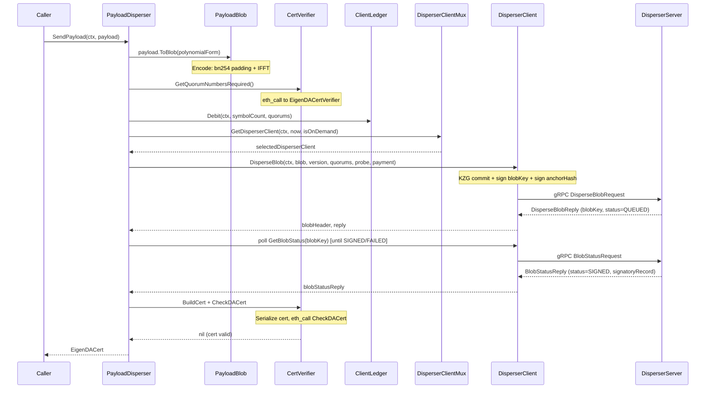
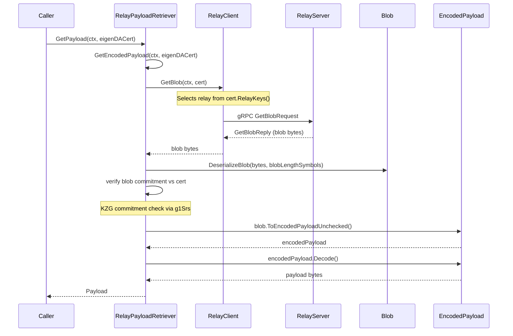
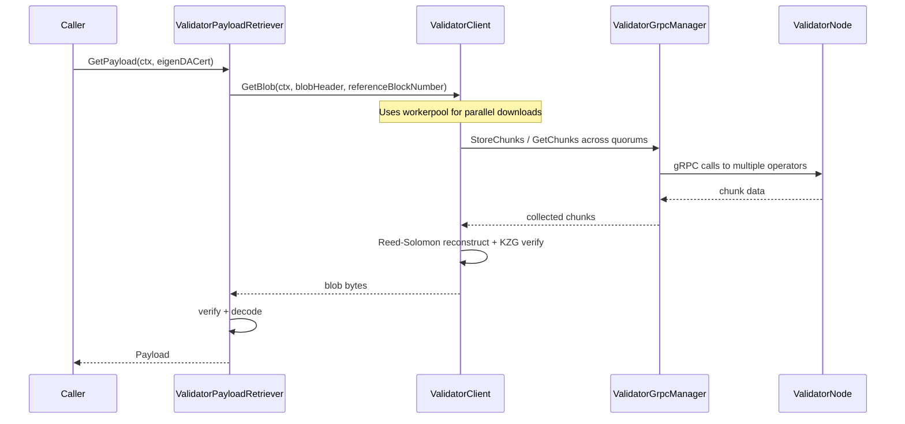
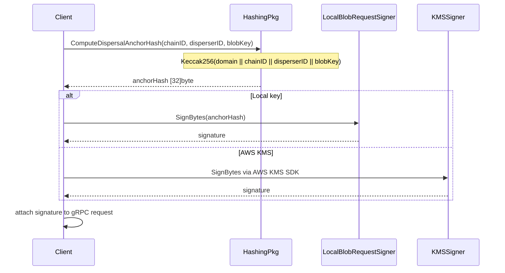
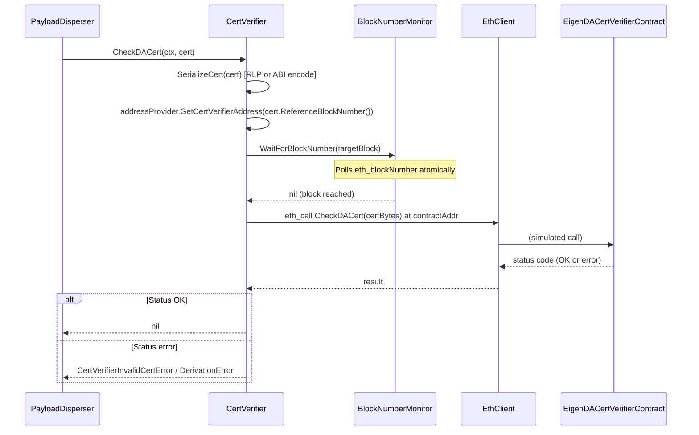

# api Analysis

**Analyzed by**: code-analyzer-api
**Timestamp**: 2026-04-10T00:00:00Z
**Application Type**: go-module
**Classification**: library
**Location**: api

## Architecture

The `api` package is EigenDA's central communications layer — a library that defines, generates, and implements the full gRPC/Protobuf contract for all inter-component communication in the system. It is structured in two major layers: the `api/grpc/` subtree contains generated Go bindings from `.proto` source files (under `api/proto/`), and the `api/clients/` subtree contains hand-written higher-level client logic that consumes those bindings.

The proto/grpc layer is code-generated (using `protoc` v4.23.4 and `protoc-gen-go-grpc` v1.3.0) and covers every EigenDA service: the Disperser (v1 and v2), DA Node, Validator Node (v2), Relay, Retriever, Churner, Encoder, and Controller. Each service has both a client interface and a server interface, allowing this single library to be consumed by both service implementors (who embed `Unimplemented*Server` types) and clients (who call `New*Client(conn)`).

The client layer (`api/clients/v2/`) provides a complete blob lifecycle stack: `PayloadDisperser` submits payloads to the disperser, `RelayPayloadRetriever` and `ValidatorPayloadRetriever` retrieve them back, `CertBuilder` constructs multi-version EigenDA certificates, and `CertVerifier` validates certificates via on-chain `eth_call` to `EigenDACertVerifier` contracts. Authentication is handled through a `DispersalRequestSigner` interface supporting both local private-key signing and AWS KMS signing.

The `api/hashing/` package provides deterministic Keccak256 hashing of gRPC messages (using domain-separation strings) to ensure replay-attack resistance for dispersal, relay, and node requests. The `api/errors.go` file defines canonical gRPC-mapped error types (`NewErrorInvalidArg`, `NewErrorNotFound`, `ErrorFailover`, etc.) and the `api/clients/v2/coretypes/derivation_errors.go` file defines rollup derivation pipeline error types (`DerivationError`, `MaliciousOperatorsError`) that rollup sequencers use to decide whether to discard or crash on bad DA certificates.

The architecture supports both a legacy v1 disperser protocol (using authenticated bidirectional-streaming RPC) and a modern v2 protocol (with payment state management, reputation-scored multiplexing across multiple dispersers, and multi-version certificate support). Both are fully exposed as a composable library.

## Key Components

- **`api/grpc/disperser/disperser_grpc.pb.go`** (`api/grpc/disperser/disperser_grpc.pb.go`): Generated Go bindings for the v1 Disperser gRPC service. Exposes `DisperserClient` (methods: `DisperseBlob`, `DisperseBlobAuthenticated` (bidirectional stream), `GetBlobStatus`, `RetrieveBlob`) and `DisperserServer` interfaces. Used by legacy clients and the disperser server implementation.

- **`api/grpc/disperser/v2/disperser_v2_grpc.pb.go`** (`api/grpc/disperser/v2/disperser_v2_grpc.pb.go`): Generated bindings for the v2 Disperser. Adds `GetBlobCommitment` (deprecated), `GetPaymentState`, and `GetValidatorSigningRate` on top of `DisperseBlob`/`GetBlobStatus`. Payment state synchronization is a key new feature in v2.

- **`api/grpc/validator/node_v2_grpc.pb.go`** (`api/grpc/validator/node_v2_grpc.pb.go`): Generated bindings for the v2 Validator (DA node) `Dispersal` service. Methods: `StoreChunks` (instructs validator to retrieve chunks from relays and attest), `GetNodeInfo`. Notably, the v2 validator does NOT receive chunk data directly from the controller — it fetches it from relays based on instructions.

- **`api/grpc/relay/relay_grpc.pb.go`** (`api/grpc/relay/relay_grpc.pb.go`): Generated bindings for the Relay service. Exposes `GetBlob` (full blob retrieval), `GetChunks` (chunk retrieval by index or range), and `GetValidatorChunks` (deterministic chunk allocation for a validator). Used by both payload retrievers and validator nodes.

- **`api/grpc/controller/controller_service_grpc.pb.go`** (`api/grpc/controller/controller_service_grpc.pb.go`): Generated bindings for the internal Controller service. Methods: `AuthorizePayment` (metering/accounting for blob dispersal), `GetValidatorSigningRate`, `GetValidatorSigningRateDump`. This is an internal API protected by firewall rules, intended for use by API server instances.

- **`api/clients/v2/dispersal/payload_disperser.go`** (`api/clients/v2/dispersal/payload_disperser.go`): High-level entry point for dispersing data. `PayloadDisperser.SendPayload` orchestrates the full lifecycle: converts payload to blob, obtains required quorums from the cert verifier, debits payment via `ClientLedger`, selects a disperser via `DisperserClientMultiplexer`, calls `DisperseBlob`, polls `GetBlobStatus` until confirmed, builds an `EigenDACert`, verifies it on-chain, and returns it. 419 lines.

- **`api/clients/v2/dispersal/disperser_client_multiplexer.go`** (`api/clients/v2/dispersal/disperser_client_multiplexer.go`): Manages a pool of `DisperserClient` instances selected by a reputation-based scoring algorithm. Dynamically discovers dispersers from a `DisperserRegistry`, maintains per-disperser reputation scores, and tracks whether `Close()` has been called. Implements graceful failover across dispersers.

- **`api/clients/v2/dispersal/disperser_client.go`** (`api/clients/v2/dispersal/disperser_client.go`): Low-level gRPC client for a single disperser. Uses a `GRPCClientPool` for connection pooling (up to 32 connections), computes KZG blob commitments, signs blob keys and anchor hashes (chain-ID + disperser-ID binding), and submits `DisperseBlobRequest` messages. Wraps network errors as `api.ErrorFailover`.

- **`api/clients/v2/verification/cert_verifier.go`** (`api/clients/v2/verification/cert_verifier.go`): Validates EigenDA certificates against on-chain `EigenDACertVerifier` contract via `eth_call`. Caches required quorums, confirmation thresholds, cert versions, and offchain derivation versions per contract address using `sync.Map`. Supports multi-version cert verification (V3 and V4). 381 lines.

- **`api/clients/v2/relay/relay_client.go`** (`api/clients/v2/relay/relay_client.go`): Client for the relay subsystem. Manages per-relay connection pools (up to 32 connections per relay), lazy initialization, and key-locked concurrent access per relay. Supports `GetBlob`, `GetChunksByRange`, and `GetChunksByIndex`. Aggregates multi-relay errors using `hashicorp/go-multierror`.

- **`api/clients/v2/coretypes/`** (`api/clients/v2/coretypes/`): Core data types for the v2 client pipeline. `Payload` is raw user bytes; `EncodedPayload` is bn254-field-element-aligned payload with a versioned 32-byte header; `Blob` is the KZG-committed polynomial representation; `EigenDACert` is the interface for V2/V3/V4 certificates. Also defines `DerivationError` (status codes 1-4, HTTP 418 body) and `MaliciousOperatorsError` for the rollup derivation pipeline.

- **`api/hashing/`** (`api/hashing/`): Deterministic Keccak256-based hashing of gRPC request messages using domain-separation strings (`disperser.DisperseBlobRequest`, `relay.GetChunksRequest`, `validator.StoreChunksRequest`, etc.). Ensures request integrity for signature verification and replay-attack prevention across all EigenDA services.

- **`api/errors.go`** (`api/errors.go`): Canonical gRPC-mapped error constructors (`NewErrorInvalidArg`, `NewErrorNotFound`, `NewErrorResourceExhausted`, `NewErrorUnauthenticated`, `NewErrorPermissionDenied`, `NewErrorInternal`, `NewErrorDeadlineExceeded`, etc.) plus the custom `ErrorFailover` type that tells rollup batchers to switch to Ethereum DA. 142 lines.

## Data Flows

### 1. Payload Dispersal (v2 PayloadDisperser.SendPayload)

**Flow Description**: A rollup sequencer submits raw payload bytes; the API library encodes, disperses, and returns a verified EigenDA certificate.



**Detailed Steps**:

1. **Payload to Blob encoding** (`Payload.ToBlob` → `EncodedPayload.ToBlob`)
   - Pads payload to 31-bytes-per-symbol bn254 field elements
   - Prepends 32-byte header (version byte, uint32 payload length)
   - Sizes to power-of-2 symbol count
   - If `PayloadPolynomialForm == Evaluation`, performs IFFT to produce coefficient form

2. **Quorum and payment setup** (`CertVerifier.GetQuorumNumbersRequired`, `ClientLedger.Debit`)
   - `eth_call` determines required quorums from the on-chain verifier contract
   - `ClientLedger.Debit` charges either reservation or on-demand payment for symbolCount symbols

3. **Disperser selection** (`DisperserClientMultiplexer.GetDisperserClient`)
   - Consults `DisperserRegistry` for available dispersers
   - Uses reputation-based selection (`ReputationSelector`)
   - On-demand vs. reserved affects which dispersers are eligible

4. **Blob construction and submission** (`DisperserClient.DisperseBlob`)
   - `committer.GetCommitmentsFromFieldElements` produces KZG commitments
   - Signs `blobKey` bytes with `LocalBlobRequestSigner`
   - Computes and signs `anchorHash = Keccak256(domain || chainID || disperserID || blobKey)`
   - Sends `DisperseBlobRequest` over gRPC, receives status `QUEUED`

5. **Polling and cert construction** (`buildEigenDACert`)
   - Polls `GetBlobStatus` until `SIGNED`, `FAILED`, or timeout
   - `CertBuilder.BuildCert` constructs V3 or V4 cert from `BlobStatusReply`
   - `CertVerifier.CheckDACert` does final on-chain `eth_call` validation

---

### 2. Payload Retrieval via Relay (RelayPayloadRetriever.GetPayload)

**Flow Description**: A rollup node retrieves a blob from the relay network using an EigenDACert, verifies it, and decodes the original payload.



---

### 3. Payload Retrieval via Validator Nodes (ValidatorPayloadRetriever.GetPayload)

**Flow Description**: A rollup node retrieves a blob by fanning out to validator (operator) nodes directly, for censorship-resistance when relay is unavailable.



---

### 4. Request Authentication and Signing (hashing + DispersalRequestSigner)

**Flow Description**: Ensures all gRPC requests sent to EigenDA services carry unforgeable, domain-separated cryptographic signatures.



---

### 5. Certificate Verification Flow (CertVerifier.CheckDACert)

**Flow Description**: On-chain eth_call verifies that an EigenDA certificate is valid (operator signatures, quorum thresholds, recency).



## Dependencies

### External Libraries

- **google.golang.org/grpc** (v1.72.2) [networking]: Core gRPC framework for Go. All generated `.pb.go` files depend on it; client/server connection lifecycle (`grpc.NewClient`, `grpc.ClientConn`, `grpc.ServerStream`) is managed throughout `api/clients/` and `api/grpc/`. Imported in: `api/grpc/*/`, `api/clients/v2/utils.go`, `api/clients/v2/node_client.go`, `api/clients/v2/validator/internal/validator_grpc_manager.go`.

- **google.golang.org/protobuf** (via go.sum) [serialization]: Protobuf runtime for generated `.pb.go` files. Provides `protoimpl`, `protoreflect`, and message lifecycle. Imported in: all `api/grpc/**/*.pb.go` files.

- **github.com/consensys/gnark-crypto** (v0.18.0) [crypto]: BN254 elliptic curve arithmetic, FFT, field elements (`fr.Element`, `bn254.G1Affine`). Used in `api/clients/codecs/fft.go` for IFFT/FFT, in `api/clients/v2/coretypes/blob.go` and `encoded_payload.go` for polynomial representation, and in `api/clients/v2/payloadretrieval/` for KZG commitment verification via g1 SRS points. Imported in: `api/clients/codecs/fft.go`, `api/clients/v2/coretypes/blob.go`, `api/clients/v2/coretypes/encoded_payload.go`, `api/clients/v2/coretypes/conversion_utils.go`, `api/clients/v2/payloadretrieval/relay_payload_retriever.go`, `api/clients/v2/payloadretrieval/validator_payload_retriever.go`, `api/clients/v2/verification/commitment_utils.go`.

- **github.com/ethereum/go-ethereum** (v1.15.3, via op-geth replace) [blockchain]: Ethereum ABI encoding/decoding, RLP serialization, Keccak256, and `eth_call` bindings. Used in `api/clients/v2/coretypes/eigenda_cert.go` for ABI encoding EigenDA certs (V3/V4) and in `api/clients/v2/verification/cert_verifier.go` for `bind.ContractCaller`. Imported in: `api/clients/v2/coretypes/eigenda_cert.go`, `api/clients/v2/verification/cert_verifier.go`, `api/clients/v2/cert_builder.go`, `api/clients/v2/dispersal_request_signer.go`.

- **github.com/prometheus/client_golang** (v1.21.1) [monitoring]: Prometheus metrics library. Used throughout `api/clients/v2/metrics/` to define `DispersalMetrics` (blob size histogram, disperser reputation gauge), `RetrievalMetrics` (payload size histogram), and `AccountantMetrics` (payment gauges). Imported in: `api/clients/v2/metrics/dispersal.go`, `api/clients/v2/metrics/retrieval.go`, `api/clients/v2/metrics/accountant.go`, `api/clients/v2/dispersal/payload_disperser.go`.

- **github.com/gammazero/workerpool** (v1.1.3) [other]: Worker pool for bounded goroutine parallelism. Used in `api/clients/retrieval_client.go` and `api/clients/v2/validator/validator_client.go` for parallel chunk downloads across validator nodes. Imported in: `api/clients/retrieval_client.go`, `api/clients/v2/validator/validator_client.go`, `api/clients/v2/validator/retrieval_worker.go`.

- **github.com/hashicorp/go-multierror** (v1.1.1) [other]: Multi-error aggregation. Used in `api/clients/v2/relay/relay_client.go` to accumulate errors from parallel relay connection attempts before returning. Imported in: `api/clients/v2/relay/relay_client.go`.

- **github.com/aws/aws-sdk-go-v2/service/kms** (v1.31.0) [cloud-sdk]: AWS Key Management Service SDK. Used in `api/clients/v2/dispersal_request_signer.go` by `kmsRequestSigner` to sign blob keys and anchor hashes via AWS KMS instead of local private keys. Imported in: `api/clients/v2/dispersal_request_signer.go`.

- **github.com/avast/retry-go/v4** (v4.6.0) [other]: Retry-with-backoff library. Used in `api/proxy/store/generated_key/v2/eigenda.go` for retrying EigenDA dispersal operations in the proxy store. Imported in: `api/proxy/store/generated_key/v2/eigenda.go`.

- **github.com/docker/go-units** (v0.5.0) [other]: Human-readable unit formatting and byte-size constants. Used as `4*units.MiB` for gRPC max message size configuration. Imported in: `api/clients/v2/dispersal/disperser_client.go`, `api/clients/v2/node_client.go`.

- **github.com/Layr-Labs/eigensdk-go** (v0.2.0-beta.1...) [other]: EigenLayer SDK providing the `logging.Logger` interface used throughout all `api/clients/` code for structured logging. Imported in: `api/clients/v2/dispersal/disperser_client.go`, `api/clients/v2/dispersal/disperser_client_multiplexer.go`, `api/clients/v2/relay/relay_client.go`, `api/clients/v2/verification/cert_verifier.go`, and many others.

- **golang.org/x/crypto** (via go.sum) [crypto]: `sha3.NewLegacyKeccak256()` for domain-separated request hashing. Imported in: `api/hashing/disperser_hashing.go`, `api/hashing/relay_hashing.go`, `api/hashing/node_hashing.go`, `api/hashing/payment_state_hashing.go`.

### Internal Libraries

- **common** (`common/`): Provides `common.EthClient` (used by `CertVerifier` and `CertBuilder`), `common.GRPCClientPool` (used by `DisperserClient` and `RelayClient`), `common.StageTimer` (used by `PayloadDisperser` for latency measurement), `common.ChainIdToBytes` (used in hashing and dispersal), and logging utilities.

- **core** (`core/`): Provides core domain types: `core.Signature`, `core.OperatorID`, `core.QuorumID`, `core.PaymentMetadata`, `core.ChainState`, `core.BlobVersionParameters`; and v2 types via `core/v2`: `corev2.BlobKey`, `corev2.BlobHeader`, `corev2.RelayKey`, `corev2.Batch`, `corev2.MaxQuorumID`. Also provides `core/auth/v2.LocalBlobRequestSigner` and `core/payments/clientledger.ClientLedger`. Used extensively in `api/clients/v2/`.

- **encoding** (`encoding/`): Provides `encoding.BlobCommitments`, `encoding.BYTES_PER_SYMBOL`, KZG committer and verifier types (`encoding/v2/kzg/committer`, `encoding/v2/kzg/verifier`), RS encoding (`encoding/v2/rs`), and FFT settings (`encoding/v1/fft`). Used in `api/clients/v2/coretypes/` for blob/payload serialization and in `api/clients/codecs/fft.go` for FFT/IFFT operations.

- **indexer** (indirect, via relay URL provider): The relay URL provider looks up relay metadata from the indexer/registry component.

- **node** (indirect): The v2 node client speaks to node gRPC services defined by this `api` package via `api/grpc/validator/` bindings.

## API Surface

### gRPC Service Definitions

This library defines and exposes the following gRPC service interfaces (both client and server sides):

#### Disperser v1 (`api/grpc/disperser/`)
- `DisperseBlob(DisperseBlobRequest) → DisperseBlobReply` — async blob submission
- `DisperseBlobAuthenticated` — bidirectional streaming with ECDSA challenge/response auth
- `GetBlobStatus(BlobStatusRequest) → BlobStatusReply` — poll dispersal status
- `RetrieveBlob(RetrieveBlobRequest) → RetrieveBlobReply` — direct retrieval from disperser backend

#### Disperser v2 (`api/grpc/disperser/v2/`)
- `DisperseBlob(DisperseBlobRequest) → DisperseBlobReply` — with payment metadata, anchor signatures, chain/disperser ID binding
- `GetBlobStatus(BlobStatusRequest) → BlobStatusReply`
- `GetBlobCommitment(BlobCommitmentRequest) → BlobCommitmentReply` (deprecated)
- `GetPaymentState(GetPaymentStateRequest) → GetPaymentStateReply` — per-disperser payment accounting sync
- `GetValidatorSigningRate(GetValidatorSigningRateRequest) → GetValidatorSigningRateReply`

#### Validator/Node v1 (`api/grpc/node/`)
- `StoreChunks(StoreChunksRequest) → StoreChunksReply` — store encoded chunks with attestation
- `StoreBlobs` (deprecated) / `AttestBatch` (deprecated)
- `NodeInfo(NodeInfoRequest) → NodeInfoReply`

#### Validator/Node v2 (`api/grpc/validator/`)
- `StoreChunks(StoreChunksRequest) → StoreChunksReply` — instruction to pull chunks from relay
- `GetNodeInfo(GetNodeInfoRequest) → GetNodeInfoReply`

#### Relay (`api/grpc/relay/`)
- `GetBlob(GetBlobRequest) → GetBlobReply`
- `GetChunks(GetChunksRequest) → GetChunksReply`
- `GetValidatorChunks(GetValidatorChunksRequest) → GetChunksReply`

#### Encoder v1/v2 (`api/grpc/encoder/`, `api/grpc/encoder/v2/`)
- `EncodeBlob(EncodeBlobRequest) → EncodeBlobReply` — internal encoding service

#### Retriever v1/v2 (`api/grpc/retriever/`, `api/grpc/retriever/v2/`)
- `RetrieveBlob(BlobRequest) → BlobReply` — fan-out retrieval from DA nodes

#### Churner (`api/grpc/churner/`)
- `Churn(ChurnRequest) → ChurnReply` — operator registration/ejection

#### Controller (`api/grpc/controller/`)
- `AuthorizePayment(AuthorizePaymentRequest) → AuthorizePaymentResponse`
- `GetValidatorSigningRate(...)`, `GetValidatorSigningRateDump(...)`

### Exported Go Types and Interfaces (v2 clients)

- **`PayloadDisperser`** — primary dispersal entry point; `SendPayload(ctx, Payload) (EigenDACert, error)`
- **`PayloadRetriever`** (interface) — `GetPayload(ctx, EigenDACert) (Payload, error)` and `GetEncodedPayload`
- **`RelayPayloadRetriever`** — implements `PayloadRetriever` via relay network
- **`ValidatorPayloadRetriever`** — implements `PayloadRetriever` via validator nodes
- **`RelayClient`** (interface) — `GetBlob`, `GetChunksByRange`, `GetChunksByIndex`
- **`ValidatorClient`** (interface) — `GetBlob(ctx, blobHeader, referenceBlockNumber) ([]byte, error)`
- **`CertVerifier`** — `CheckDACert(ctx, EigenDACert) error`, `GetQuorumNumbersRequired(ctx) ([]byte, error)`
- **`CertBuilder`** — `BuildCert(ctx, certVersion, blobStatusReply, offchainDerivationVersion) (EigenDACert, error)`
- **`DispersalRequestSigner`** (interface) — `SignStoreChunksRequest(ctx, *StoreChunksRequest) ([]byte, error)`
- **`EigenDACert`** (interface) — `RelayKeys()`, `QuorumNumbers()`, `ReferenceBlockNumber()`, `ComputeBlobKey()`, `BlobHeader()`, `Commitments()`
- **`DerivationError`** — status codes 1-4, `MarshalToTeapotBody() string`, used for HTTP 418 responses
- **`MaliciousOperatorsError`** — indicates colluding validators, intended to crash rollup software
- **`ErrorFailover`** — wraps dispersal failures, signals rollup batchers to switch to Ethereum DA
- **`BlobCodec`** (interface) — `EncodeBlob`, `DecodeBlob`; `PayloadEncodingVersion0` constant

### Canonical gRPC Error Constructors (package `api`)

```go
func NewErrorInvalidArg(msg string) error       // HTTP 400
func NewErrorNotFound(msg string) error          // HTTP 404
func NewErrorResourceExhausted(msg string) error // HTTP 429
func NewErrorUnauthenticated(msg string) error   // HTTP 401
func NewErrorPermissionDenied(msg string) error  // HTTP 403
func NewErrorInternal(msg string) error          // HTTP 500
func NewErrorUnknown(msg string) error           // HTTP 500
func NewErrorUnimplemented() error               // HTTP 501
func NewErrorDeadlineExceeded(msg string) error  // HTTP 504
func NewErrorCanceled(msg string) error
func NewErrorAlreadyExists(msg string) error
func NewErrorFailover(err error) *ErrorFailover
func LogResponseStatus(logger, *status.Status)
```

### Hashing Utilities (package `api/hashing`)

```go
func ComputeDispersalAnchorHash(chainId *big.Int, disperserId uint32, blobKey [32]byte) ([]byte, error)
func HashGetChunksRequest(request *relay.GetChunksRequest) ([]byte, error)
func HashGetValidatorChunksRequest(request *relay.GetValidatorChunksRequest) ([]byte, error)
func HashStoreChunksRequest(request *validator.StoreChunksRequest) ([]byte, error)
func HashBlobHeadersAndTimestamps(request *validator.StoreChunksRequest) ([]BlobHeaderHashWithTimestamp, error)
```

## Code Examples

### Example 1: Creating a v2 DisperserClient and dispersing a blob

```go
// api/clients/v2/dispersal/disperser_client.go (lines 68-117)
client, err := NewDisperserClient(
    logger,
    &DisperserClientConfig{
        GrpcUri:                  "disperser.eigenda.xyz:443",
        UseSecureGrpcFlag:        true,
        DisperserConnectionCount: 4,
        DisperserID:              1,
        ChainID:                  big.NewInt(1),
    },
    signer,
    committer,
    metrics,
)
defer client.Close()

blobHeader, reply, err := client.DisperseBlob(ctx, blob, blobVersion, quorums, probe, paymentMetadata)
```

### Example 2: Building and checking a versioned EigenDA certificate

```go
// api/clients/v2/cert_builder.go (lines 66-79)
cert, err := certBuilder.BuildCert(ctx, coretypes.VersionFourCert, blobStatusReply, offchainDerivationVersion)
if err != nil { ... }

// api/clients/v2/verification/cert_verifier.go (lines 56-80)
err = certVerifier.CheckDACert(ctx, cert)
// err == nil means cert is valid
// err is *CertVerifierInvalidCertError means invalid cert (can be a DerivationError)
```

### Example 3: Canonical gRPC error handling in EigenDA servers

```go
// api/errors.go (lines 22-73)
func handleRequest(req *DisperseBlobRequest) error {
    if req.Blob == nil {
        return api.NewErrorInvalidArg("blob must not be nil")
    }
    if !authorized {
        return api.NewErrorUnauthenticated("signature verification failed")
    }
    if rateLimited {
        return api.NewErrorResourceExhausted("quorum 0 rate limit exceeded")
    }
    return api.NewErrorInternal("database write failed")
}
```

### Example 4: Domain-separated request hashing for replay-attack prevention

```go
// api/hashing/disperser_hashing.go (lines 14-31)
anchorHash, err := hashing.ComputeDispersalAnchorHash(
    big.NewInt(1),   // Ethereum mainnet
    uint32(1),       // Disperser ID 1
    blobKey,         // [32]byte
)
// anchorHash = Keccak256("disperser.DisperseBlobRequest" || chainIDBytes || disperserIDLE || blobKey)
```

### Example 5: Payload encoding pipeline (Payload to EncodedPayload to Blob)

```go
// api/clients/v2/coretypes/payload.go (lines 15-43)
payload := coretypes.Payload(myRawBytes)
encodedPayload := payload.ToEncodedPayload()
// Header: [0x00, 0x00 (version), uint32 len (4 bytes), 0x00...] (32 bytes)
// Body: [0x00, 31 data bytes, 0x00, 31 data bytes, ...]

blob, err := payload.ToBlob(codecs.PolynomialFormEvaluation)
// If Evaluation form: IFFT is applied to produce coefficient blob
```

### Example 6: ErrorFailover semantics for rollup failover signaling

```go
// api/errors.go (lines 105-142)
reply, err := client.DisperseBlob(ctx, request)
if err != nil {
    return nil, api.NewErrorFailover(fmt.Errorf("DisperseBlob rpc: %w", err))
}

// Caller checks:
var failoverErr *api.ErrorFailover
if errors.Is(err, failoverErr) {
    // Switch to Ethereum DA (ethDA) for this batch
}
```

## Files Analyzed

- `api/errors.go` (142 lines) — canonical gRPC error constructors and ErrorFailover type
- `api/logging.go` (36 lines) — LogResponseStatus helper for gRPC status logging
- `api/grpc/disperser/disperser_grpc.pb.go` — generated v1 Disperser client/server bindings
- `api/grpc/disperser/v2/disperser_v2_grpc.pb.go` — generated v2 Disperser bindings
- `api/grpc/node/node_grpc.pb.go` — generated v1 node Dispersal service bindings
- `api/grpc/validator/node_v2_grpc.pb.go` — generated v2 Validator/node bindings
- `api/grpc/relay/relay_grpc.pb.go` — generated Relay service bindings
- `api/grpc/churner/churner_grpc.pb.go` — generated Churner service bindings
- `api/grpc/encoder/v2/encoder_v2_grpc.pb.go` — generated v2 Encoder service bindings
- `api/grpc/controller/controller_service_grpc.pb.go` — generated Controller service bindings
- `api/grpc/retriever/v2/retriever_v2_grpc.pb.go` — generated v2 Retriever service bindings
- `api/grpc/common/common.pb.go` — generated common types (G1Commitment, BlobCommitment)
- `api/proto/disperser/v2/disperser_v2.proto` — v2 Disperser protobuf source
- `api/clients/codecs/blob_codec.go` — BlobCodec interface and versioned codec registry
- `api/clients/codecs/fft.go` — FFT/IFFT operations using gnark-crypto
- `api/clients/v2/utils.go` — GetGrpcDialOptions helper for TLS/insecure connections
- `api/clients/v2/cert_builder.go` — multi-version EigenDA cert construction (V3, V4)
- `api/clients/v2/node_client.go` — v2 NodeClient wrapping validator gRPC
- `api/clients/v2/payload_retriever.go` — PayloadRetriever interface definition
- `api/clients/v2/dispersal_request_signer.go` — DispersalRequestSigner (local key + AWS KMS)
- `api/clients/v2/dispersal/disperser_client.go` (290 lines) — low-level gRPC disperser client
- `api/clients/v2/dispersal/disperser_client_multiplexer.go` (286 lines) — reputation-based multi-disperser client manager
- `api/clients/v2/dispersal/payload_disperser.go` (419 lines) — high-level payload dispersal orchestrator
- `api/clients/v2/relay/relay_client.go` (365 lines) — multi-relay gRPC client with connection pooling
- `api/clients/v2/validator/validator_client.go` (187 lines) — validator node retrieval client
- `api/clients/v2/verification/cert_verifier.go` (381 lines) — on-chain EigenDA cert verifier
- `api/clients/v2/verification/block_number_monitor.go` — atomic Ethereum block number polling
- `api/clients/v2/coretypes/payload.go` — Payload type and encoding
- `api/clients/v2/coretypes/encoded_payload.go` — EncodedPayload type (bn254-aligned)
- `api/clients/v2/coretypes/blob.go` — Blob type (coefficient polynomial representation)
- `api/clients/v2/coretypes/eigenda_cert.go` — EigenDACert interface and certificate versioning
- `api/clients/v2/coretypes/derivation_errors.go` — DerivationError, MaliciousOperatorsError
- `api/clients/v2/payloadretrieval/relay_payload_retriever.go` — relay-based payload retrieval
- `api/clients/v2/payloadretrieval/validator_payload_retriever.go` — validator-based payload retrieval
- `api/clients/v2/metrics/dispersal.go` — dispersal Prometheus metrics
- `api/clients/v2/metrics/retrieval.go` — retrieval Prometheus metrics
- `api/clients/v2/metrics/accountant.go` — payment accountant Prometheus metrics
- `api/hashing/disperser_hashing.go` — dispersal anchor hash construction
- `api/hashing/relay_hashing.go` — relay request hashing
- `api/hashing/node_hashing.go` — node/validator request hashing (StoreChunksRequest)

## Analysis Data

```json
{
  "summary": "The api package is EigenDA's central communications library, providing generated gRPC/Protobuf bindings for all inter-component services (Disperser v1/v2, Validator Node v1/v2, Relay, Retriever, Encoder, Churner, Controller) alongside hand-written higher-level client logic for the full blob lifecycle: payload encoding, dispersal with KZG commitments and payment metadata, status polling, certificate construction and on-chain verification, and relay/validator retrieval. It also defines canonical gRPC error types, rollup derivation error types (DerivationError, MaliciousOperatorsError, ErrorFailover), and domain-separated Keccak256 request hashing for replay-attack prevention.",
  "architecture_pattern": "protobuf/grpc with higher-level client library",
  "key_modules": [
    "api/grpc/ — generated gRPC/Protobuf bindings for all EigenDA services",
    "api/proto/ — protobuf source definitions",
    "api/clients/v2/dispersal/ — PayloadDisperser, DisperserClient, DisperserClientMultiplexer",
    "api/clients/v2/verification/ — CertVerifier, BlockNumberMonitor",
    "api/clients/v2/coretypes/ — Payload, EncodedPayload, Blob, EigenDACert, DerivationError",
    "api/clients/v2/relay/ — RelayClient",
    "api/clients/v2/validator/ — ValidatorClient",
    "api/clients/v2/payloadretrieval/ — RelayPayloadRetriever, ValidatorPayloadRetriever",
    "api/hashing/ — domain-separated request hashing",
    "api/errors.go — canonical gRPC error constructors + ErrorFailover",
    "api/clients/codecs/ — BlobCodec interface, FFT/IFFT, PayloadEncodingVersion0"
  ],
  "api_endpoints": [
    "/disperser.Disperser/DisperseBlob",
    "/disperser.Disperser/DisperseBlobAuthenticated",
    "/disperser.Disperser/GetBlobStatus",
    "/disperser.Disperser/RetrieveBlob",
    "/disperser.v2.Disperser/DisperseBlob",
    "/disperser.v2.Disperser/GetBlobStatus",
    "/disperser.v2.Disperser/GetBlobCommitment",
    "/disperser.v2.Disperser/GetPaymentState",
    "/disperser.v2.Disperser/GetValidatorSigningRate",
    "/node.Dispersal/StoreChunks",
    "/node.Dispersal/NodeInfo",
    "/validator.Dispersal/StoreChunks",
    "/validator.Dispersal/GetNodeInfo",
    "/relay.Relay/GetBlob",
    "/relay.Relay/GetChunks",
    "/relay.Relay/GetValidatorChunks",
    "/encoder.v2.Encoder/EncodeBlob",
    "/retriever.v2.Retriever/RetrieveBlob",
    "/churner.Churner/Churn",
    "/controller.ControllerService/AuthorizePayment",
    "/controller.ControllerService/GetValidatorSigningRate",
    "/controller.ControllerService/GetValidatorSigningRateDump"
  ],
  "data_flows": [
    "Payload → EncodedPayload (bn254 padding + version header) → Blob (IFFT for evaluation form) → DisperseBlobRequest (with KZG commitments, signed blobKey, anchorHash) → DisperserServer → poll GetBlobStatus → BlobStatusReply (SIGNED) → CertBuilder → EigenDACert → CertVerifier (eth_call) → valid cert returned",
    "EigenDACert → RelayPayloadRetriever.GetPayload → RelayClient.GetBlob (gRPC to relay) → Blob bytes → DeserializeBlob → KZG commitment verify → Blob.ToEncodedPayloadUnchecked → EncodedPayload.Decode → Payload",
    "EigenDACert → ValidatorPayloadRetriever.GetPayload → ValidatorClient.GetBlob (fan-out to operator nodes via workerpool) → RS reconstruct + KZG verify → Payload",
    "Domain string + message fields → sha3.Keccak256 → domain-separated hash → ECDSA/KMS signature → attached to gRPC request"
  ],
  "tech_stack": ["go", "grpc", "protobuf", "bn254", "kzg", "ethereum", "prometheus", "aws-kms"],
  "external_integrations": [
    "EigenDACertVerifier smart contract (on-chain eth_call for certificate validation)",
    "AWS KMS (optional: for signing dispersal requests without local private keys)",
    "Ethereum RPC node (eth_call for cert verification, block number monitoring)"
  ],
  "component_interactions": [
    "common: GRPCClientPool, EthClient, StageTimer, ChainIdToBytes",
    "core: BlobKey, BlobHeader, RelayKey, QuorumID, PaymentMetadata, ChainState, LocalBlobRequestSigner, ClientLedger",
    "encoding: BlobCommitments, BYTES_PER_SYMBOL, KZG committer/verifier, RS encoder, FFT settings",
    "indexer: relay URL provider (relay metadata lookup)",
    "node: validator gRPC server implementations consume api/grpc/validator/ bindings"
  ]
}
```

## Citations

```json
[
  {
    "file_path": "api/errors.go",
    "start_line": 10,
    "end_line": 24,
    "claim": "The api package defines canonical gRPC error constructors that map to HTTP status codes, intended to be the only user-facing errors from EigenDA gRPC endpoints",
    "section": "Architecture",
    "snippet": "// The canonical errors from the EigenDA gRPC API endpoints.\nfunc newErrorGRPC(code codes.Code, msg string) error {\n    return status.Error(code, msg)\n}"
  },
  {
    "file_path": "api/errors.go",
    "start_line": 105,
    "end_line": 142,
    "claim": "ErrorFailover is a custom error type (not a gRPC status code) used to signal rollup batchers to switch to Ethereum DA, wrapping the underlying failure with Is() checking only the type",
    "section": "API Surface",
    "snippet": "type ErrorFailover struct { Err error }\nfunc (e *ErrorFailover) Is(target error) bool { _, ok := target.(*ErrorFailover); return ok }"
  },
  {
    "file_path": "api/grpc/disperser/disperser_grpc.pb.go",
    "start_line": 22,
    "end_line": 26,
    "claim": "The v1 Disperser gRPC service exposes four methods: DisperseBlob, DisperseBlobAuthenticated (bidirectional stream), GetBlobStatus, and RetrieveBlob",
    "section": "API Surface",
    "snippet": "const (\n    Disperser_DisperseBlob_FullMethodName = \"/disperser.Disperser/DisperseBlob\"\n    Disperser_DisperseBlobAuthenticated_FullMethodName = \"/disperser.Disperser/DisperseBlobAuthenticated\"\n    Disperser_GetBlobStatus_FullMethodName = ...\n    Disperser_RetrieveBlob_FullMethodName = ...\n)"
  },
  {
    "file_path": "api/grpc/disperser/v2/disperser_v2_grpc.pb.go",
    "start_line": 22,
    "end_line": 27,
    "claim": "The v2 Disperser adds GetBlobCommitment (deprecated), GetPaymentState, and GetValidatorSigningRate over v1",
    "section": "API Surface",
    "snippet": "Disperser_DisperseBlob_FullMethodName = \"/disperser.v2.Disperser/DisperseBlob\"\nDisperser_GetPaymentState_FullMethodName = \"/disperser.v2.Disperser/GetPaymentState\"\nDisperser_GetValidatorSigningRate_FullMethodName = \"/disperser.v2.Disperser/GetValidatorSigningRate\""
  },
  {
    "file_path": "api/grpc/relay/relay_grpc.pb.go",
    "start_line": 22,
    "end_line": 25,
    "claim": "The Relay gRPC service exposes GetBlob, GetChunks (by index or range), and GetValidatorChunks (deterministic chunk allocation)",
    "section": "API Surface",
    "snippet": "Relay_GetBlob_FullMethodName = \"/relay.Relay/GetBlob\"\nRelay_GetChunks_FullMethodName = \"/relay.Relay/GetChunks\"\nRelay_GetValidatorChunks_FullMethodName = \"/relay.Relay/GetValidatorChunks\""
  },
  {
    "file_path": "api/grpc/validator/node_v2_grpc.pb.go",
    "start_line": 22,
    "end_line": 24,
    "claim": "The v2 Validator Dispersal service has StoreChunks (instruction to pull from relay) and GetNodeInfo",
    "section": "Key Components",
    "snippet": "Dispersal_StoreChunks_FullMethodName = \"/validator.Dispersal/StoreChunks\"\nDispersal_GetNodeInfo_FullMethodName = \"/validator.Dispersal/GetNodeInfo\""
  },
  {
    "file_path": "api/grpc/validator/node_v2_grpc.pb.go",
    "start_line": 30,
    "end_line": 36,
    "claim": "In v2, StoreChunks is an instruction-only RPC: the validator fetches chunk data from relays rather than receiving it directly from the controller",
    "section": "Key Components",
    "snippet": "// This RPC describes which chunks the validator should store but does not contain that chunk data. The validator\n// is expected to fetch the chunk data from one of the relays that is in possession of the chunk."
  },
  {
    "file_path": "api/grpc/controller/controller_service_grpc.pb.go",
    "start_line": 22,
    "end_line": 25,
    "claim": "The Controller service exposes AuthorizePayment (metering), GetValidatorSigningRate, and GetValidatorSigningRateDump as internal gRPC APIs",
    "section": "API Surface",
    "snippet": "ControllerService_AuthorizePayment_FullMethodName = \"/controller.ControllerService/AuthorizePayment\"\nControllerService_GetValidatorSigningRate_FullMethodName = ...\nControllerService_GetValidatorSigningRateDump_FullMethodName = ..."
  },
  {
    "file_path": "api/grpc/controller/controller_service_grpc.pb.go",
    "start_line": 31,
    "end_line": 44,
    "claim": "AuthorizePayment is an internal API protected by firewall rules only; client signatures are checked but there is no API-server-to-controller auth",
    "section": "Analysis Notes",
    "snippet": "// While this endpoint *does* verify the client signature for each dispersal, it *does not* have any type of auth\n// implemented between the API Server and Controller:\n// - This is an internal API protected by firewall rules"
  },
  {
    "file_path": "api/clients/v2/dispersal/payload_disperser.go",
    "start_line": 70,
    "end_line": 82,
    "claim": "PayloadDisperser.SendPayload orchestrates the full dispersal lifecycle in six steps: encode, get quorums, debit, select disperser, disperse, build+verify cert",
    "section": "Data Flows",
    "snippet": "// SendPayload executes the dispersal of a payload, with these steps:\n//  1. Encode payload into a blob\n//  2. Disperse the blob\n//  3. Poll the disperser with GetBlobStatus until a terminal status is reached\n//  4. Construct an EigenDACert if dispersal is successful\n//  5. Verify the constructed cert via an eth_call to the EigenDACertVerifier contract\n//  6. Return the valid cert"
  },
  {
    "file_path": "api/clients/v2/dispersal/disperser_client.go",
    "start_line": 27,
    "end_line": 45,
    "claim": "DisperserClient uses a pool of gRPC connections (up to 32) to a single disperser, with auth signer, KZG committer, and metrics",
    "section": "Key Components",
    "snippet": "type DisperserClient struct {\n    signer     *authv2.LocalBlobRequestSigner\n    clientPool *common.GRPCClientPool[disperser_rpc.DisperserClient]\n    committer  *committer.Committer\n    metrics    metrics.DispersalMetricer\n}"
  },
  {
    "file_path": "api/clients/v2/dispersal/disperser_client.go",
    "start_line": 194,
    "end_line": 201,
    "claim": "Dispersal requests are bound to a specific chain and disperser via a Keccak256 anchor signature over (domain || chainID || disperserID || blobKey)",
    "section": "Data Flows",
    "snippet": "anchorHash, err := hashing.ComputeDispersalAnchorHash(c.config.ChainID, c.config.DisperserID, blobKey)\n...\nanchorSignature, err := c.signer.SignBytes(anchorHash)"
  },
  {
    "file_path": "api/clients/v2/dispersal/disperser_client.go",
    "start_line": 229,
    "end_line": 232,
    "claim": "Network-level errors from DisperseBlob gRPC call are wrapped as api.ErrorFailover to signal rollup failover semantics",
    "section": "Data Flows",
    "snippet": "reply, err := client.DisperseBlob(ctx, request)\nif err != nil {\n    return nil, nil, api.NewErrorFailover(fmt.Errorf(\"DisperseBlob rpc: %w\", err))\n}"
  },
  {
    "file_path": "api/clients/v2/dispersal/disperser_client_multiplexer.go",
    "start_line": 30,
    "end_line": 46,
    "claim": "DisperserClientMultiplexer manages reputation-scored selection across multiple dispersers using a ReputationSelector",
    "section": "Key Components",
    "snippet": "type DisperserClientMultiplexer struct {\n    ...disperserRegistry disperser.DisperserRegistry\n    clients map[uint32]*DisperserClient\n    reputations map[uint32]*reputation.Reputation\n    reputationSelector *reputation.ReputationSelector[*disperserInfo]\n    ...}"
  },
  {
    "file_path": "api/clients/v2/relay/relay_client.go",
    "start_line": 47,
    "end_line": 58,
    "claim": "RelayClient interface exposes GetBlob (using EigenDACert), GetChunksByRange, and GetChunksByIndex",
    "section": "API Surface",
    "snippet": "type RelayClient interface {\n    GetBlob(ctx context.Context, cert coretypes.EigenDACert) (*coretypes.Blob, error)\n    GetChunksByRange(ctx context.Context, relayKey corev2.RelayKey, ...) ([][]byte, error)\n    GetChunksByIndex(ctx context.Context, relayKey corev2.RelayKey, ...) ([][]byte, error)\n    Close() error\n}"
  },
  {
    "file_path": "api/clients/v2/relay/relay_client.go",
    "start_line": 62,
    "end_line": 79,
    "claim": "relayClient maintains a sync.Map of per-relay connection pools and lazy initialization status, with a KeyLock for per-relay concurrency control",
    "section": "Key Components",
    "snippet": "type relayClient struct {\n    relayLockProvider *KeyLock[corev2.RelayKey]\n    connectionPoolSize uint\n    relayInitializationStatus sync.Map\n    relayClientPools sync.Map\n    relayUrlProvider RelayUrlProvider\n}"
  },
  {
    "file_path": "api/clients/v2/verification/cert_verifier.go",
    "start_line": 24,
    "end_line": 40,
    "claim": "CertVerifier caches contract state (required quorums, thresholds, cert versions, offchain derivation versions) per contract address using sync.Map",
    "section": "Key Components",
    "snippet": "type CertVerifier struct {\n    ...verifierCallers sync.Map\n    requiredQuorums sync.Map\n    confirmationThresholds sync.Map\n    versions sync.Map\n    offchainDerivationVersions sync.Map\n}"
  },
  {
    "file_path": "api/clients/v2/verification/cert_verifier.go",
    "start_line": 56,
    "end_line": 80,
    "claim": "CheckDACert serializes the cert then calls the EigenDACertVerifier on-chain contract via eth_call to validate operator signatures and quorum thresholds",
    "section": "Data Flows",
    "snippet": "func (cv *CertVerifier) CheckDACert(ctx context.Context, cert coretypes.EigenDACert) error {\n    certBytes, err := SerializeCert(cert)\n    ...\n    // 2 - Call the contract method CheckDACert to verify the certificate"
  },
  {
    "file_path": "api/clients/v2/coretypes/eigenda_cert.go",
    "start_line": 56,
    "end_line": 62,
    "claim": "Three certificate versions are defined: VersionTwoCert (0x2), VersionThreeCert (0x3), VersionFourCert (0x4); there is no V1 in the core codebase",
    "section": "Key Components",
    "snippet": "const (\n    VersionTwoCert   = 0x2\n    VersionThreeCert = 0x3\n    VersionFourCert  = 0x4\n)"
  },
  {
    "file_path": "api/clients/v2/coretypes/derivation_errors.go",
    "start_line": 17,
    "end_line": 32,
    "claim": "DerivationError defines four status codes used by rollup derivation pipelines to classify cert/blob failures; they are marshalled to HTTP 418 bodies",
    "section": "Key Components",
    "snippet": "var (\n    ErrCertParsingFailedDerivationError = DerivationError{StatusCode: 1}\n    ErrRecencyCheckFailedDerivationError = DerivationError{StatusCode: 2}\n    ErrInvalidCertDerivationError = DerivationError{StatusCode: 3}\n    ErrBlobDecodingFailedDerivationError = DerivationError{StatusCode: 4}\n)"
  },
  {
    "file_path": "api/clients/v2/coretypes/derivation_errors.go",
    "start_line": 66,
    "end_line": 77,
    "claim": "DerivationError is marshalled to a JSON HTTP 418 body to instruct rollup derivation pipelines (e.g. OP Stack) to discard the cert",
    "section": "API Surface",
    "snippet": "// Marshalled to JSON and returned as an HTTP 418 body\n// to indicate that the cert should be discarded from rollups' derivation pipelines.\nfunc (e DerivationError) MarshalToTeapotBody() string {\n    e.Validate()\n    bodyJSON, err := json.Marshal(e)\n    ...\n    return string(bodyJSON)\n}"
  },
  {
    "file_path": "api/clients/v2/coretypes/payload.go",
    "start_line": 16,
    "end_line": 43,
    "claim": "Payload.ToEncodedPayload pads to bn254 field elements, sizes to power-of-2 symbols, and prepends a 32-byte header with version and payload length",
    "section": "Key Components",
    "snippet": "encodedPayloadHeader[1] = byte(codecs.PayloadEncodingVersion0) // encode version byte\nbinary.BigEndian.PutUint32(encodedPayloadHeader[2:6], uint32(len(p)))"
  },
  {
    "file_path": "api/clients/v2/coretypes/blob.go",
    "start_line": 14,
    "end_line": 22,
    "claim": "Blob is represented as an array of BN254 field elements (fr.Element) in coefficient form, and must have power-of-2 length",
    "section": "Key Components",
    "snippet": "// A Blob is represented under the hood by an array of field elements (symbols),\n// which represent a polynomial in coefficient form.\n// A Blob must have a length (in symbols) that is a power of two."
  },
  {
    "file_path": "api/clients/v2/dispersal_request_signer.go",
    "start_line": 19,
    "end_line": 24,
    "claim": "DispersalRequestSigner interface supports both local ECDSA key signing and AWS KMS signing for StoreChunksRequest authentication",
    "section": "Key Components",
    "snippet": "type DispersalRequestSigner interface {\n    SignStoreChunksRequest(ctx context.Context, request *grpc.StoreChunksRequest) ([]byte, error)\n}"
  },
  {
    "file_path": "api/clients/v2/utils.go",
    "start_line": 12,
    "end_line": 23,
    "claim": "GetGrpcDialOptions creates gRPC dial options supporting both TLS (secure) and insecure transports, with configurable max message size",
    "section": "Key Components",
    "snippet": "func GetGrpcDialOptions(useSecureGrpcFlag bool, maxMessageSize uint) []grpc.DialOption {\n    if useSecureGrpcFlag {\n        options = append(options, grpc.WithTransportCredentials(credentials.NewTLS(&tls.Config{})))\n    } else {\n        options = append(options, grpc.WithTransportCredentials(insecure.NewCredentials()))\n    }\n}"
  },
  {
    "file_path": "api/hashing/disperser_hashing.go",
    "start_line": 11,
    "end_line": 31,
    "claim": "Dispersal anchor hash uses domain separation: Keccak256(domain_string || chainID || disperserID || blobKey) to prevent cross-chain and cross-disperser replay attacks",
    "section": "Key Components",
    "snippet": "const DisperseBlobRequestDomain = \"disperser.DisperseBlobRequest\"\nfunc ComputeDispersalAnchorHash(...) ([]byte, error) {\n    hasher := sha3.NewLegacyKeccak256()\n    hasher.Write([]byte(DisperseBlobRequestDomain))\n    hasher.Write(common.ChainIdToBytes(chainId))\n    hashUint32(hasher, disperserId)\n    hasher.Write(blobKey[:])\n    return hasher.Sum(nil), nil\n}"
  },
  {
    "file_path": "api/clients/codecs/blob_codec.go",
    "start_line": 9,
    "end_line": 15,
    "claim": "PayloadEncodingVersion0 is the only defined encoding version; each 32-byte group starts with 0x00 so all elements are valid BN254 field elements",
    "section": "Key Components",
    "snippet": "// PayloadEncodingVersion0 entails a 32 byte header = [0x00, version byte, big-endian uint32 len of payload, 0x00, 0x00,...]\n// followed by the encoded data [0x00, 31 bytes of data, 0x00, 31 bytes of data,...]\nPayloadEncodingVersion0 PayloadEncodingVersion = 0x0"
  },
  {
    "file_path": "api/grpc/common/common.pb.go",
    "start_line": 26,
    "end_line": 37,
    "claim": "G1Commitment is the common protobuf representation of a KZG commitment, using gnark-crypto big-endian serialization of BN254 G1 points",
    "section": "Key Components",
    "snippet": "// G1Commitment represents the serialized coordinates of a G1 KZG commitment.\n// We use gnark-crypto so adopt its serialization, which is big-endian.\ntype G1Commitment struct {\n    X []byte // 32 bytes, big-endian field element\n    Y []byte // 32 bytes, big-endian field element\n}"
  },
  {
    "file_path": "api/clients/v2/payloadretrieval/relay_payload_retriever.go",
    "start_line": 17,
    "end_line": 28,
    "claim": "RelayPayloadRetriever implements PayloadRetriever and uses g1Srs (Structured Reference String) for KZG commitment verification after blob retrieval",
    "section": "Key Components",
    "snippet": "type RelayPayloadRetriever struct {\n    relayClient relay.RelayClient\n    g1Srs       []bn254.G1Affine\n    metrics     metrics.RetrievalMetricer\n}\nvar _ clients.PayloadRetriever = &RelayPayloadRetriever{}"
  },
  {
    "file_path": "api/clients/v2/payloadretrieval/relay_payload_retriever.go",
    "start_line": 56,
    "end_line": 60,
    "claim": "GetPayload does NOT verify the EigenDACert on-chain; it assumes the cert has already been verified by the caller before calling this method",
    "section": "Data Flows",
    "snippet": "// This method does NOT verify the eigenDACert on chain: it is assumed that the input eigenDACert has already been\n// verified prior to calling this method."
  },
  {
    "file_path": "api/clients/v2/verification/block_number_monitor.go",
    "start_line": 55,
    "end_line": 60,
    "claim": "BlockNumberMonitor.WaitForBlockNumber uses atomic synchronization so only one goroutine polls eth_blockNumber at a time, reducing RPC load",
    "section": "Key Components",
    "snippet": "// This method is synchronized in a way that, if called by multiple goroutines, only a single goroutine will actually\n// poll the internal eth client for the most recent block number."
  },
  {
    "file_path": "api/clients/v2/cert_builder.go",
    "start_line": 23,
    "end_line": 28,
    "claim": "CertBuilder requires both an OperatorStateRetriever contract address and RegistryCoordinator contract address to construct operator stake snapshots for V3/V4 certs",
    "section": "Key Components",
    "snippet": "type CertBuilder struct {\n    opsrCaller              *opsrbinding.ContractOperatorStateRetrieverCaller\n    opsrAddr                gethcommon.Address\n    registryCoordinatorAddr gethcommon.Address\n}"
  },
  {
    "file_path": "api/clients/v2/metrics/dispersal.go",
    "start_line": 14,
    "end_line": 19,
    "claim": "DispersalMetricer interface provides RecordBlobSizeBytes and RecordDisperserReputationScore for Prometheus monitoring of dispersal activity",
    "section": "Dependencies",
    "snippet": "type DispersalMetricer interface {\n    RecordBlobSizeBytes(size int)\n    RecordDisperserReputationScore(disperserID uint32, score float64)\n    Document() []metrics.DocumentedMetric\n}"
  },
  {
    "file_path": "api/proto/disperser/v2/disperser_v2.proto",
    "start_line": 44,
    "end_line": 56,
    "claim": "v2 DisperseBlobRequest blobs must be 16MiB maximum; each 32-byte chunk must be a valid BN254 field element (less than the curve order)",
    "section": "API Surface",
    "snippet": "// The size of this byte array may be any size as long as it does not exceed the maximum length of 16MiB.\n// Every 32 bytes of data is interpreted as an integer in big endian format\n// The valid range is 0 <= x < 21888242871839275222246405745257275088548364400416034343698204186575808495617."
  }
]
```

## Analysis Notes

### Security Considerations

1. **Replay Attack Prevention via Domain-Separated Hashing**: The `api/hashing/` package uses domain-separation strings (e.g., `"disperser.DisperseBlobRequest"`, `"relay.GetChunksRequest"`) prepended before all Keccak256 message hashes. The dispersal anchor hash additionally binds requests to a specific `chainID` and `disperserID`, preventing cross-chain and cross-disperser replay. This is a well-designed security measure.

2. **Controller AuthorizePayment Lacks API-Server Authentication**: The controller service comment explicitly notes that no authentication exists between the API server and the controller — it relies entirely on firewall rules. If an attacker bypasses the firewall, they can call `AuthorizePayment` freely (though client signatures are still checked, limiting fund-theft risk). This is a known accepted risk documented in the code.

3. **MaliciousOperatorsError is a Crash Signal**: `MaliciousOperatorsError` is explicitly designed to crash rollup software if triggered, since it indicates EigenDA validators may be colluding. This is a strong security property for rollup integrations — better to halt than to accept fraudulent data.

4. **Certificate Serialization Versions**: Supporting three active cert versions (V2, V3, V4) simultaneously increases attack surface. The `CertBuilder` and `CertVerifier` must handle all versions correctly, and any version-routing bug could lead to certificate bypass.

5. **AWS KMS Integration for Production Key Management**: The `DispersalRequestSigner` properly supports HSM-backed signing via AWS KMS, which is important for production operators who should not expose private keys in plaintext. The config enforces mutual exclusion between `KeyID` and `PrivateKey`.

### Performance Characteristics

- **Connection Pooling**: `DisperserClient` and `relayClient` both use configurable connection pools (up to 32 connections each), allowing high-throughput concurrent requests without per-request dial overhead.
- **Atomic Block Number Monitoring**: `BlockNumberMonitor` uses a single atomic goroutine for Ethereum block polling, preventing thundering-herd RPC load when many goroutines wait for cert verification block confirmation.
- **Reputation-Based Disperser Selection**: `DisperserClientMultiplexer` maintains per-disperser reputation scores to route dispersals to healthy dispersers and penalize failing ones, improving overall throughput under partial failure.
- **Prometheus Metrics Coverage**: Blob size histograms, disperser reputation gauges, and payment metrics are instrumented, enabling observability without significant runtime overhead.

### Scalability Notes

- **Multi-Disperser Support**: The `DisperserClientMultiplexer` is designed for a future where multiple competing dispersers exist, each with independent reputation scores and connection pools. This horizontally scales dispersal capacity.
- **Stateless Certificate Types**: `EigenDACert` is stateless (an interface returning computed values), making it safe to pass across goroutine boundaries and cache freely.
- **Workerpool-Bounded Parallelism**: `ValidatorClient` uses `gammazero/workerpool` to limit concurrent validator connections, preventing resource exhaustion during large blob retrievals from many operator nodes.
- **Dual-Path Retrieval**: Having both relay (fast, centralized) and validator (slow, decentralized) retrieval paths allows applications to trade off latency vs. censorship resistance based on their needs.
