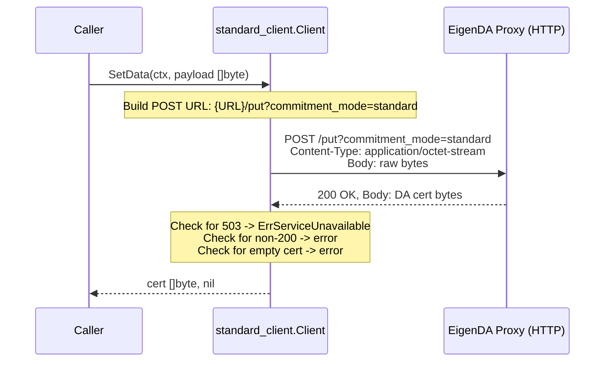
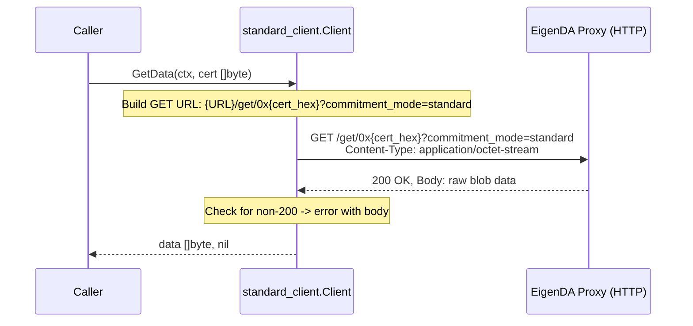
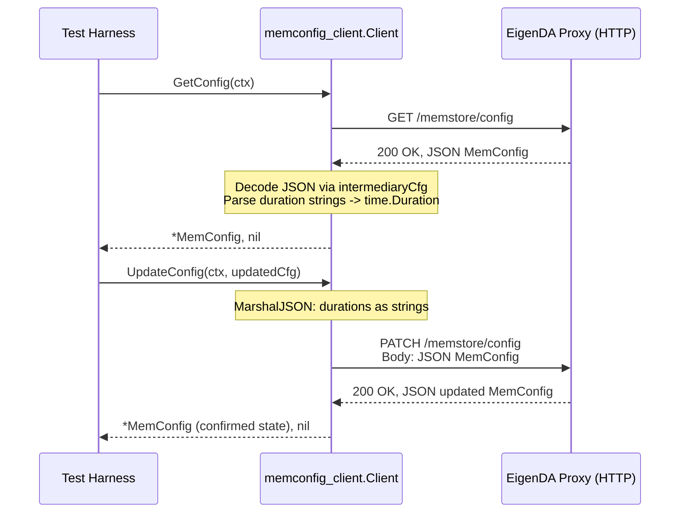
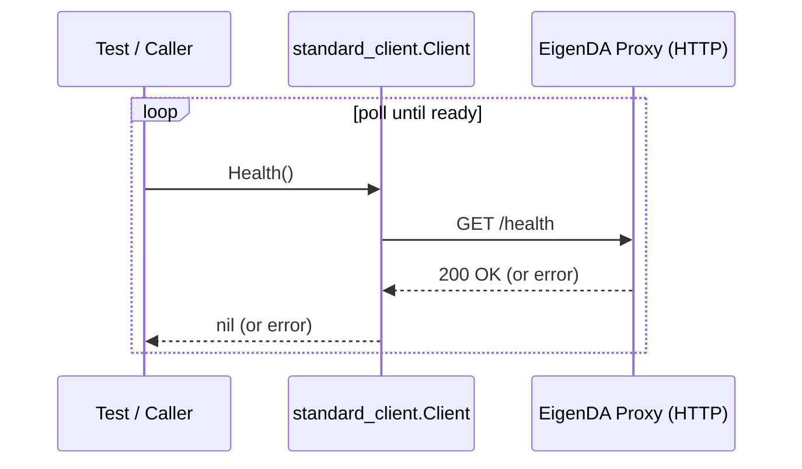

# clients Analysis

**Analyzed by**: code-analyzer-clients
**Timestamp**: 2026-04-10T00:00:00Z
**Application Type**: go-module
**Classification**: library
**Location**: api/proxy/clients

## Architecture

The `clients` library is a deliberately minimal Go module that provides HTTP client implementations for interacting with the EigenDA proxy REST server. It is intentionally isolated into its own `go.mod` (module path `github.com/Layr-Labs/eigenda/api/proxy/clients`) so that downstream consumers — such as rollup sequencers (Arbitrum Nitro) or test harnesses — can import only the thin client layer without pulling in the full EigenDA proxy dependency tree.

The module is organized into two sub-packages, each corresponding to a distinct proxy API surface:

1. **`standard_client`** — the primary client for rollup integrations that use EigenDA's *standard commitment mode* (used by Arbitrum Nitro and others that are not Optimism). It exposes three operations: `Health`, `GetData`, and `SetData`.
2. **`memconfig_client`** — a secondary, test-oriented client for dynamically reconfiguring the proxy's in-memory store (`memstore`) at runtime via HTTP PATCH/GET to the `/memstore/config` endpoint.

Both clients follow the same thin-wrapper pattern: they hold a `Config` struct containing the proxy base URL, an underlying `*http.Client` (or interface), and expose simple, idiomatic Go methods. There is no concurrency management, caching, or retry logic within the library itself — those concerns belong to the caller or to the proxy server.

The `standard_client` package introduces an `HTTPClient` interface and a `WithHTTPClient` functional option, enabling test doubles or custom transport layers to be injected. The `memconfig_client` uses a concrete `*http.Client` with no injection point.

A notable design choice is that `memconfig_client` contains a local copy of the `MemConfig` struct that mirrors the server-side type at `store/generated_key/memstore/memconfig/config.go`. This copy-by-duplication approach is explicitly documented in comments as a workaround to avoid a cyclic Go module dependency.

## Key Components

- **`standard_client.Client`** (`standard_client/client.go`): The core struct for standard-commitment-mode proxy interaction. Holds a `*Config` (URL) and an `HTTPClient`. Created via `New(cfg *Config, opts ...ClientOption)` with functional options support. Used widely in e2e tests and production by the `ProxyWrapper` in `test/v2/client/proxy_wrapper.go`.

- **`standard_client.Config`** (`standard_client/client.go`): A minimal configuration struct with a single `URL string` field representing the base URL of the proxy REST API.

- **`standard_client.HTTPClient`** (`standard_client/client.go`): A minimal interface (`Do(req *http.Request) (*http.Response, error)`) wrapping `http.Client`. Enables mock injection for unit testing.

- **`standard_client.WithHTTPClient`** (`standard_client/client.go`): A `ClientOption` functional option for injecting a custom HTTP client, following the idiomatic Go functional-options pattern.

- **`standard_client.ErrServiceUnavailable`** (`standard_client/client.go`): A sentinel error value returned when the proxy responds with HTTP 503, signaling rollups to failover to an alternate DA location.

- **`memconfig_client.Client`** (`memconfig_client/client.go`): A test-utility HTTP client that communicates with the proxy's `/memstore/config` endpoint to read or patch the in-memory store configuration. Internally appends the endpoint path to the URL once at construction time.

- **`memconfig_client.MemConfig`** (`memconfig_client/client.go`): A local copy of the server-side `memconfig.Config` struct, with fields for `MaxBlobSizeBytes`, `BlobExpiration`, `PutLatency`, `GetLatency`, `PutReturnsFailoverError`, and `NullableDerivationError`. Uses a custom `MarshalJSON` to serialize `time.Duration` as human-readable strings.

- **`memconfig_client.DerivationError` / `NullableDerivationError`** (`memconfig_client/client.go`): Copied derivation-error types, included to avoid cyclic imports. `NullableDerivationError` includes a `Reset bool` field to signal the server to nil-out the derivation error override.

- **`memconfig_client.intermediaryCfg`** (`memconfig_client/client.go`): A private intermediate struct used during JSON decoding where `time.Duration` fields arrive as strings. Converted to `MemConfig` via `IntoMemConfig()`.

## Data Flows

### 1. Standard Client Write (SetData)

**Flow Description**: A caller submits raw bytes to the EigenDA proxy via HTTP POST and receives a DA certificate (commitment) in return.



**Detailed Steps**:

1. **Build request** (`standard_client.Client.SetData`)
   - Method: `SetData(ctx context.Context, b []byte) ([]byte, error)`
   - Constructs `POST {URL}/put?commitment_mode=standard` with the payload as the request body.
   - Sets `Content-Type: application/octet-stream`.

2. **HTTP dispatch**
   - Uses `http.DefaultClient.Do(req)` (note: does not use the injected `c.httpClient` — this is a minor inconsistency in the code at line 131).

3. **Response handling**
   - HTTP 503 returns `ErrServiceUnavailable` (signals caller to failover).
   - Non-200 returns an error with status code and body.
   - Empty body with 200 returns `"received an empty certificate"` error.
   - Success returns raw cert bytes.

**Error Paths**:
- **503 Service Unavailable** — `ErrServiceUnavailable` sentinel, callers should failover.
- **Non-200 status** — descriptive error including code and server message.
- **Empty certificate** — error on zero-length cert bytes even on HTTP 200.

---

### 2. Standard Client Read (GetData)

**Flow Description**: A caller submits a DA certificate to retrieve the associated blob payload from the proxy.



**Detailed Steps**:

1. **URL construction**: cert bytes are hex-encoded and appended as `0x{hex}` in the path.
2. **HTTP GET** via the injected/default HTTP client.
3. **Response**: on 200, returns body bytes; on non-200, returns error with status code and message.

---

### 3. Memconfig Client Read/Patch (GetConfig / UpdateConfig)

**Flow Description**: A test harness reads and modifies the proxy's in-memory store configuration at runtime.



**Detailed Steps**:

1. **GetConfig**: GET `/memstore/config`, decode JSON via `intermediaryCfg.IntoMemConfig()` which parses duration strings into `time.Duration`.
2. **UpdateConfig**: marshal `MemConfig` to JSON (durations as human-readable strings), PATCH `/memstore/config`, decode response.

**Error Paths**:
- Non-200 from either endpoint returns a descriptive error.
- JSON decode failure returns a wrapped error from `json.NewDecoder`.
- Duration parse failure in `IntoMemConfig` returns a wrapped `fmt.Errorf`.

---

### 4. Health Check

**Flow Description**: Used in integration tests to poll for proxy readiness before sending data.



## Dependencies

### External Libraries

- **github.com/testcontainers/testcontainers-go** (v0.35.0) [testing]: Provides Go-native Docker container lifecycle management. Used exclusively in `standard_client/example_memstore_test.go` to spin up a real `ghcr.io/layr-labs/eigenda-proxy` Docker container so the example runnable test can demonstrate a full SetData/GetData round-trip against a live proxy with a memstore backend. Not used in any production code path.
  Imported in: `api/proxy/clients/standard_client/example_memstore_test.go`.

All remaining entries in `go.mod` (dario.cat/mergo, github.com/Azure/go-ansiterm, github.com/docker/docker, go.opentelemetry.io/*, etc.) are transitive indirect dependencies pulled in by `testcontainers-go`. None are directly imported by the library's production code.

**Runtime dependencies**: The library's production code (`standard_client/client.go`, `memconfig_client/client.go`) has zero third-party dependencies. It relies exclusively on the Go standard library: `bytes`, `context`, `encoding/json`, `fmt`, `io`, `net/http`, `time`.

### Internal Libraries

This component has no internal library dependencies. It is a leaf module with its own isolated `go.mod`, intentionally designed to avoid importing the main EigenDA proxy module or any other internal module.

## API Surface

### Exported Types and Functions — `standard_client` package

#### `Config`
```go
type Config struct {
    URL string // EigenDA proxy REST API URL
}
```
Base configuration. `URL` is the full base URL (e.g., `http://localhost:3100`).

#### `HTTPClient` interface
```go
type HTTPClient interface {
    Do(req *http.Request) (*http.Response, error)
}
```
Abstraction over `*http.Client` for test injection via `WithHTTPClient`.

#### `ClientOption` and `WithHTTPClient`
```go
type ClientOption func(c *Client)
func WithHTTPClient(client HTTPClient) ClientOption
```
Functional option to inject a custom HTTP client. Note: due to a bug in `SetData`, the injected client is not used for the POST operation (only for `Health` and `GetData`).

#### `Client`
```go
type Client struct { ... }
func New(cfg *Config, opts ...ClientOption) *Client
func (c *Client) Health() error
func (c *Client) GetData(ctx context.Context, comm []byte) ([]byte, error)
func (c *Client) SetData(ctx context.Context, b []byte) ([]byte, error)
```
Primary client. `Health` checks liveness; `SetData` submits data and returns a DA cert; `GetData` retrieves data by cert.

#### `ErrServiceUnavailable`
```go
var ErrServiceUnavailable = fmt.Errorf("eigenda service is temporarily unavailable")
```
Sentinel error for 503 responses. Consumers should use `errors.Is(err, standard_client.ErrServiceUnavailable)` to detect the failover signal.

---

### Exported Types and Functions — `memconfig_client` package

#### `Config`
```go
type Config struct {
    URL string
}
```

#### `DerivationError`
```go
type DerivationError struct {
    StatusCode uint8
    Msg        string
}
```
Local copy of the server-side derivation error type (copied to avoid cyclic dependency).

#### `NullableDerivationError`
```go
type NullableDerivationError struct {
    DerivationError
    Reset bool `json:"Reset"`
}
```
Wraps `DerivationError` with a `Reset` flag to signal nil-ing on the server side.

#### `MemConfig`
```go
type MemConfig struct {
    MaxBlobSizeBytes        uint64
    BlobExpiration          time.Duration
    PutLatency              time.Duration
    GetLatency              time.Duration
    PutReturnsFailoverError bool
    NullableDerivationError *NullableDerivationError
}
func (c MemConfig) MarshalJSON() ([]byte, error)
```
Mirrors the server-side `memconfig.Config`. Custom JSON marshal serializes `time.Duration` as human-readable strings (e.g., `"1h30m"`).

#### `Client`
```go
type Client struct { ... }
func New(cfg *Config) *Client
func (c *Client) GetConfig(ctx context.Context) (*MemConfig, error)
func (c *Client) UpdateConfig(ctx context.Context, update *MemConfig) (*MemConfig, error)
```
Test utility client. `GetConfig` reads current proxy memstore config; `UpdateConfig` patches it and returns the server-confirmed updated state.

---

### HTTP Endpoints Consumed

| Method | Path | Query Params | Package |
|--------|------|-------------|---------|
| GET | `/health` | — | `standard_client` |
| GET | `/get/0x{cert_hex}` | `commitment_mode=standard` | `standard_client` |
| POST | `/put` | `commitment_mode=standard` | `standard_client` |
| GET | `/memstore/config` | — | `memconfig_client` |
| PATCH | `/memstore/config` | — | `memconfig_client` |

## Code Examples

### Example 1: Creating and using the standard client

```go
// standard_client/client.go — New + SetData + GetData
client := standard_client.New(&standard_client.Config{URL: "http://localhost:3100"})

ctx := context.Background()
certBytes, err := client.SetData(ctx, []byte("my-eigenda-payload"))
if err != nil {
    if errors.Is(err, standard_client.ErrServiceUnavailable) {
        // handle failover to alternate DA location
    }
    panic(err)
}

data, err := client.GetData(ctx, certBytes)
```

### Example 2: Functional option for custom HTTP client injection

```go
// standard_client/client.go lines 35-42
type ClientOption func(c *Client)

func WithHTTPClient(client HTTPClient) ClientOption {
    return func(c *Client) {
        c.httpClient = client
    }
}

// Usage in tests:
mockHTTP := &MockHTTPClient{}
c := standard_client.New(cfg, standard_client.WithHTTPClient(mockHTTP))
```

### Example 3: Memconfig client update workflow

```go
// memconfig_client/client.go — GetConfig + UpdateConfig round-trip
memClient := memconfig_client.New(&memconfig_client.Config{URL: "http://localhost:3100"})
cfg, _ := memClient.GetConfig(ctx)
cfg.PutLatency = 420 * time.Second  // inject artificial latency
updatedCfg, _ := memClient.UpdateConfig(ctx, cfg)
// updatedCfg reflects server-confirmed new state
```

### Example 4: SetData 503 failover handling

```go
// standard_client/client.go lines 144-146
if resp.StatusCode == http.StatusServiceUnavailable {
    return nil, ErrServiceUnavailable
}
```

### Example 5: MemConfig JSON marshaling for human-readable durations

```go
// memconfig_client/client.go lines 59-68
func (c MemConfig) MarshalJSON() ([]byte, error) {
    return json.Marshal(intermediaryCfg{
        MaxBlobSizeBytes:        c.MaxBlobSizeBytes,
        BlobExpiration:          c.BlobExpiration.String(), // e.g. "1h30m"
        PutLatency:              c.PutLatency.String(),
        GetLatency:              c.GetLatency.String(),
        PutReturnsFailoverError: c.PutReturnsFailoverError,
        NullableDerivationError: c.NullableDerivationError,
    })
}
```

### Example 6: testcontainers-based example test (runnable Go example)

```go
// standard_client/example_memstore_test.go lines 55-75
func startProxyMemstoreV1(ctx context.Context) (testcontainers.Container, string) {
    req := testcontainers.ContainerRequest{
        Image:        "ghcr.io/layr-labs/eigenda-proxy:latest",
        ExposedPorts: []string{"3100/tcp"},
        WaitingFor:   wait.ForHTTP("/health").WithPort("3100/tcp"),
        Cmd:          []string{"--memstore.enabled", "--port", "3100"},
    }
    proxyContainer, _ := testcontainers.GenericContainer(ctx, testcontainers.GenericContainerRequest{
        ContainerRequest: req,
        Started:          true,
    })
    proxyEndpoint, _ := proxyContainer.PortEndpoint(ctx, "3100", "http")
    return proxyContainer, proxyEndpoint
}
```

## Files Analyzed

- `api/proxy/clients/doc.go` (4 lines) — Package-level doc comment declaring the `clients` package.
- `api/proxy/clients/go.mod` (65 lines) — Module definition; single direct dependency on `testcontainers-go`.
- `api/proxy/clients/standard_client/client.go` (161 lines) — Standard commitment mode HTTP client implementation.
- `api/proxy/clients/standard_client/example_memstore_test.go` (75 lines) — Runnable example test using testcontainers.
- `api/proxy/clients/memconfig_client/client.go` (185 lines) — Memstore configuration HTTP client implementation.
- `api/proxy/clients/memconfig_client/memstore_example_test.go` (5 lines) — Empty example stub (marked TODO).
- `api/proxy/test/e2e/server_rest_test.go` (645 lines) — Primary consumer illustrating both clients in full e2e test scenarios.
- `test/v2/client/proxy_wrapper.go` (116 lines) — Production-adjacent use of `standard_client` as part of a `ProxyWrapper` test utility.

## Analysis Data

```json
{
  "summary": "The clients library is a deliberately minimal, independently versioned Go module providing two HTTP client sub-packages for interacting with the EigenDA proxy REST server. The standard_client package is intended for rollup integration (Arbitrum Nitro and similar) supporting standard-commitment-mode blob dispersal and retrieval, with a failover-signaling sentinel error for HTTP 503. The memconfig_client package is a test-utility client for dynamically reconfiguring the proxy's in-memory mock store at runtime. The module is isolated in its own go.mod to allow lightweight import without pulling in the full proxy dependency tree. Both clients have zero production third-party dependencies, relying entirely on the Go standard library.",
  "architecture_pattern": "thin HTTP client wrapper (functional options pattern, interface injection, copy-of-struct for cyclic-dependency avoidance)",
  "key_modules": [
    {
      "name": "standard_client.Client",
      "path": "api/proxy/clients/standard_client/client.go",
      "description": "Primary client for standard-commitment-mode proxy interaction: Health, SetData, GetData"
    },
    {
      "name": "standard_client.HTTPClient",
      "path": "api/proxy/clients/standard_client/client.go",
      "description": "Interface abstracting http.Client for testability via WithHTTPClient functional option"
    },
    {
      "name": "standard_client.ErrServiceUnavailable",
      "path": "api/proxy/clients/standard_client/client.go",
      "description": "Sentinel error for HTTP 503, indicating rollup should failover to an alternate DA location"
    },
    {
      "name": "memconfig_client.Client",
      "path": "api/proxy/clients/memconfig_client/client.go",
      "description": "Test-utility client for GET/PATCH /memstore/config to read and control proxy memstore behavior"
    },
    {
      "name": "memconfig_client.MemConfig",
      "path": "api/proxy/clients/memconfig_client/client.go",
      "description": "Local copy of server-side MemConfig struct with custom JSON marshaling for time.Duration fields as human-readable strings"
    },
    {
      "name": "memconfig_client.intermediaryCfg",
      "path": "api/proxy/clients/memconfig_client/client.go",
      "description": "Private struct bridging JSON decode of string durations to typed time.Duration values"
    }
  ],
  "api_endpoints": [
    {"method": "GET", "path": "/health", "package": "standard_client", "description": "Liveness check"},
    {"method": "GET", "path": "/get/0x{cert_hex}", "package": "standard_client", "query": "commitment_mode=standard", "description": "Retrieve blob by DA cert"},
    {"method": "POST", "path": "/put", "package": "standard_client", "query": "commitment_mode=standard", "description": "Disperse blob, receive DA cert"},
    {"method": "GET", "path": "/memstore/config", "package": "memconfig_client", "description": "Read proxy memstore config"},
    {"method": "PATCH", "path": "/memstore/config", "package": "memconfig_client", "description": "Update proxy memstore config"}
  ],
  "data_flows": [
    {
      "name": "SetData (blob dispersal)",
      "steps": [
        "Caller invokes SetData(ctx, payload []byte)",
        "Client constructs POST to {URL}/put?commitment_mode=standard with binary body",
        "HTTP 503 response returns ErrServiceUnavailable for failover signaling",
        "HTTP 200 response with non-empty body returns DA cert bytes to caller"
      ]
    },
    {
      "name": "GetData (blob retrieval)",
      "steps": [
        "Caller invokes GetData(ctx, cert []byte)",
        "Client hex-encodes cert and constructs GET to {URL}/get/0x{hex}?commitment_mode=standard",
        "HTTP 200 response body returned as raw blob bytes"
      ]
    },
    {
      "name": "Memconfig update (test)",
      "steps": [
        "Test harness calls GetConfig(ctx) to read current state via GET /memstore/config",
        "Modifies desired fields on returned *MemConfig",
        "Calls UpdateConfig(ctx, updated) which marshals to JSON and PATCHes /memstore/config",
        "Returns server-confirmed *MemConfig"
      ]
    },
    {
      "name": "Health check",
      "steps": [
        "Caller invokes Health()",
        "Client sends GET {URL}/health",
        "Returns nil on HTTP 200, error otherwise"
      ]
    }
  ],
  "tech_stack": ["go", "net/http", "encoding/json"],
  "external_integrations": [],
  "component_interactions": [
    {
      "target": "eigenda-proxy REST server",
      "type": "http_api",
      "description": "standard_client interacts with /health, /put?commitment_mode=standard, /get/{cert}?commitment_mode=standard. memconfig_client interacts with /memstore/config via GET and PATCH."
    }
  ]
}
```

## Citations

```json
[
  {
    "file_path": "api/proxy/clients/doc.go",
    "start_line": 1,
    "end_line": 4,
    "claim": "The clients package provides HTTP clients for interacting with the EigenDA Proxy",
    "section": "Architecture"
  },
  {
    "file_path": "api/proxy/clients/go.mod",
    "start_line": 1,
    "end_line": 8,
    "claim": "The clients library is isolated as its own go.mod module (github.com/Layr-Labs/eigenda/api/proxy/clients) to allow import without pulling in the full proxy dependency tree",
    "section": "Architecture",
    "snippet": "module github.com/Layr-Labs/eigenda/api/proxy/clients"
  },
  {
    "file_path": "api/proxy/clients/go.mod",
    "start_line": 14,
    "end_line": 14,
    "claim": "The only direct third-party dependency is testcontainers-go v0.35.0, used exclusively in test example files",
    "section": "Dependencies",
    "snippet": "require github.com/testcontainers/testcontainers-go v0.35.0"
  },
  {
    "file_path": "api/proxy/clients/standard_client/client.go",
    "start_line": 22,
    "end_line": 25,
    "claim": "ErrServiceUnavailable is a sentinel error returned on HTTP 503, signaling rollup to failover to another DA location",
    "section": "Key Components",
    "snippet": "ErrServiceUnavailable = fmt.Errorf(\"eigenda service is temporarily unavailable\")"
  },
  {
    "file_path": "api/proxy/clients/standard_client/client.go",
    "start_line": 27,
    "end_line": 29,
    "claim": "Config is a minimal struct holding only the proxy base URL",
    "section": "Key Components",
    "snippet": "type Config struct {\n\tURL string // EigenDA proxy REST API URL\n}"
  },
  {
    "file_path": "api/proxy/clients/standard_client/client.go",
    "start_line": 31,
    "end_line": 33,
    "claim": "HTTPClient is a one-method interface abstracting http.Client to enable test injection",
    "section": "Key Components",
    "snippet": "type HTTPClient interface {\n\tDo(req *http.Request) (*http.Response, error)\n}"
  },
  {
    "file_path": "api/proxy/clients/standard_client/client.go",
    "start_line": 35,
    "end_line": 42,
    "claim": "WithHTTPClient is a ClientOption functional option for injecting a custom HTTP client",
    "section": "Key Components",
    "snippet": "func WithHTTPClient(client HTTPClient) ClientOption {\n\treturn func(c *Client) {\n\t\tc.httpClient = client\n\t}\n}"
  },
  {
    "file_path": "api/proxy/clients/standard_client/client.go",
    "start_line": 44,
    "end_line": 52,
    "claim": "Client struct is intended for Arbitrum Nitro integrations; Optimism uses a different client",
    "section": "Key Components"
  },
  {
    "file_path": "api/proxy/clients/standard_client/client.go",
    "start_line": 55,
    "end_line": 66,
    "claim": "New constructor applies functional options over a default http.DefaultClient",
    "section": "Key Components"
  },
  {
    "file_path": "api/proxy/clients/standard_client/client.go",
    "start_line": 70,
    "end_line": 88,
    "claim": "Health() sends GET /health and returns an error if response status is not HTTP 200",
    "section": "Data Flows",
    "snippet": "url := c.cfg.URL + \"/health\""
  },
  {
    "file_path": "api/proxy/clients/standard_client/client.go",
    "start_line": 91,
    "end_line": 121,
    "claim": "GetData hex-encodes the cert in the path and sends GET /get/0x{hex}?commitment_mode=standard; returns raw blob bytes on 200",
    "section": "Data Flows",
    "snippet": "url := fmt.Sprintf(\"%s/get/0x%x?commitment_mode=standard\", c.cfg.URL, comm)"
  },
  {
    "file_path": "api/proxy/clients/standard_client/client.go",
    "start_line": 124,
    "end_line": 135,
    "claim": "SetData constructs POST /put?commitment_mode=standard and sends the binary payload as body",
    "section": "Data Flows",
    "snippet": "url := fmt.Sprintf(\"%s/put?commitment_mode=standard\", c.cfg.URL)"
  },
  {
    "file_path": "api/proxy/clients/standard_client/client.go",
    "start_line": 131,
    "end_line": 135,
    "claim": "SetData uses http.DefaultClient directly instead of the injected c.httpClient — a bug making WithHTTPClient ineffective for SetData",
    "section": "Analysis Notes",
    "snippet": "resp, err := http.DefaultClient.Do(req)"
  },
  {
    "file_path": "api/proxy/clients/standard_client/client.go",
    "start_line": 144,
    "end_line": 146,
    "claim": "HTTP 503 in SetData returns ErrServiceUnavailable sentinel for failover signaling",
    "section": "Data Flows",
    "snippet": "if resp.StatusCode == http.StatusServiceUnavailable {\n\treturn nil, ErrServiceUnavailable\n}"
  },
  {
    "file_path": "api/proxy/clients/standard_client/client.go",
    "start_line": 156,
    "end_line": 159,
    "claim": "SetData returns an error if the returned certificate body is empty even when HTTP status is 200",
    "section": "Data Flows",
    "snippet": "if len(b) == 0 {\n\treturn nil, fmt.Errorf(\"received an empty certificate\")\n}"
  },
  {
    "file_path": "api/proxy/clients/memconfig_client/client.go",
    "start_line": 14,
    "end_line": 16,
    "claim": "The memconfig endpoint constant is /memstore/config",
    "section": "API Surface",
    "snippet": "const (\n\tmemConfigEndpoint = \"/memstore/config\"\n)"
  },
  {
    "file_path": "api/proxy/clients/memconfig_client/client.go",
    "start_line": 22,
    "end_line": 41,
    "claim": "DerivationError and NullableDerivationError are locally copied types to avoid cyclic module dependency with the proxy server",
    "section": "Key Components"
  },
  {
    "file_path": "api/proxy/clients/memconfig_client/client.go",
    "start_line": 43,
    "end_line": 54,
    "claim": "MemConfig is a local copy of the server-side memconfig.Config struct; comment explicitly documents the cyclic-import motivation",
    "section": "Key Components"
  },
  {
    "file_path": "api/proxy/clients/memconfig_client/client.go",
    "start_line": 56,
    "end_line": 68,
    "claim": "MemConfig.MarshalJSON uses an intermediary struct to serialize time.Duration fields as human-readable strings",
    "section": "Key Components"
  },
  {
    "file_path": "api/proxy/clients/memconfig_client/client.go",
    "start_line": 81,
    "end_line": 107,
    "claim": "intermediaryCfg.IntoMemConfig parses string duration fields back into time.Duration values when decoding server JSON responses",
    "section": "Data Flows"
  },
  {
    "file_path": "api/proxy/clients/memconfig_client/client.go",
    "start_line": 119,
    "end_line": 121,
    "claim": "memconfig_client.Client appends the endpoint path to the URL at construction time once, to avoid repeated concatenation on each call",
    "section": "Key Components",
    "snippet": "cfg.URL = cfg.URL + memConfigEndpoint // initialize once to avoid unnecessary ops"
  },
  {
    "file_path": "api/proxy/clients/memconfig_client/client.go",
    "start_line": 139,
    "end_line": 157,
    "claim": "GetConfig sends GET /memstore/config and decodes the JSON response into *MemConfig via the intermediary decode path",
    "section": "Data Flows"
  },
  {
    "file_path": "api/proxy/clients/memconfig_client/client.go",
    "start_line": 163,
    "end_line": 185,
    "claim": "UpdateConfig marshals MemConfig to JSON and sends PATCH /memstore/config; comment notes this is a full-field update despite the PATCH HTTP method",
    "section": "Data Flows"
  },
  {
    "file_path": "api/proxy/clients/standard_client/example_memstore_test.go",
    "start_line": 16,
    "end_line": 50,
    "claim": "The runnable Example_proxyMemstoreV1 demonstrates a full SetData/GetData round-trip against a real proxy started via testcontainers",
    "section": "Dependencies"
  },
  {
    "file_path": "api/proxy/clients/standard_client/example_memstore_test.go",
    "start_line": 55,
    "end_line": 75,
    "claim": "testcontainers-go is used to start ghcr.io/layr-labs/eigenda-proxy:latest with --memstore.enabled flag, waiting on HTTP /health readiness",
    "section": "Dependencies",
    "snippet": "Image: \"ghcr.io/layr-labs/eigenda-proxy:latest\",\nCmd: []string{\"--memstore.enabled\", \"--port\", \"3100\"},"
  },
  {
    "file_path": "test/v2/client/proxy_wrapper.go",
    "start_line": 22,
    "end_line": 26,
    "claim": "ProxyWrapper in the main module wraps standard_client.Client as a production-adjacent usage pattern for test infrastructure",
    "section": "API Surface"
  },
  {
    "file_path": "test/v2/client/proxy_wrapper.go",
    "start_line": 78,
    "end_line": 82,
    "claim": "standard_client.New is instantiated with the proxy's localhost URL in ProxyWrapper, demonstrating production-style client construction",
    "section": "API Surface"
  },
  {
    "file_path": "api/proxy/test/e2e/server_rest_test.go",
    "start_line": 484,
    "end_line": 507,
    "claim": "memconfig_client is used in e2e tests to verify that PATCH /memstore/config changes are reflected in subsequent GET calls",
    "section": "API Surface"
  },
  {
    "file_path": "api/proxy/clients/go.mod",
    "start_line": 1,
    "end_line": 7,
    "claim": "The go.mod comment explains that a separate module is used so that dependencies can import the client API without importing all of the proxy main module's dependencies",
    "section": "Architecture",
    "snippet": "// We use a separate module for the client to allow dependencies to import it without importing all of proxy's main module's dependencies."
  }
]
```

## Analysis Notes

### Security Considerations

1. **No authentication or authorization**: Both clients send unauthenticated HTTP requests. The proxy REST API has no authentication layer in its standard configuration. Any consumer with network access to the proxy endpoint can read or write blobs. The `memconfig_client` additionally exposes configuration control — this surface must not be reachable in production deployments, as it can inject artificial errors and latency.

2. **memconfig endpoint must be production-gated**: The `/memstore/config` endpoint targeted by `memconfig_client` allows arbitrary reconfiguration of the proxy's in-memory store. The package documentation marks it as test-only, but there is no runtime guard in the client code to prevent misuse.

3. **No TLS enforcement**: The `Config.URL` field accepts any scheme. In all test examples, plain `http://` is used. Production callers must supply a TLS-enabled URL; there is no enforcement in the library.

4. **Bug: SetData ignores injected HTTPClient**: In `standard_client/client.go` line 131, `http.DefaultClient.Do(req)` is called instead of `c.httpClient.Do(req)`. This means any `WithHTTPClient` option is silently ignored for `SetData`, which could be a correctness or security issue if callers inject a client with custom TLS or proxy configuration expecting it to apply uniformly.

### Performance Characteristics

- **No connection pooling customization**: Clients use `http.DefaultClient`, which uses Go's default transport with built-in connection pooling. High-throughput callers should inject a custom `HTTPClient` with a tuned transport (noting the `SetData` bug limits this to `GetData` and `Health` only).
- **No retry logic**: Neither client implements retries. Callers must implement their own retry strategy on top, potentially using the `ErrServiceUnavailable` sentinel as a failover trigger.
- **Minimal processing overhead**: The library adds negligible overhead beyond the HTTP round-trip — no serialization for `standard_client` (binary pass-through), and a single JSON encode/decode for `memconfig_client`.

### Scalability Notes

- **Stateless clients**: Both clients are fully stateless with no shared mutable state or internal caches. Multiple goroutines can safely share the same `Client` instance concurrently.
- **Module isolation as a dependency graph strategy**: The separate `go.mod` is a deliberate scalability choice — it keeps the blast radius of proxy dependency updates isolated from consumers that only need the client API, aligning with the Go module recommendation linked in `go.mod`.
- **Intentionally limited scope**: The library does not include retry logic, circuit-breakers, or metrics instrumentation. These cross-cutting concerns are expected to be handled at a higher layer (e.g., by the Arbitrum Nitro integration layer or the `ProxyWrapper` test utility).
