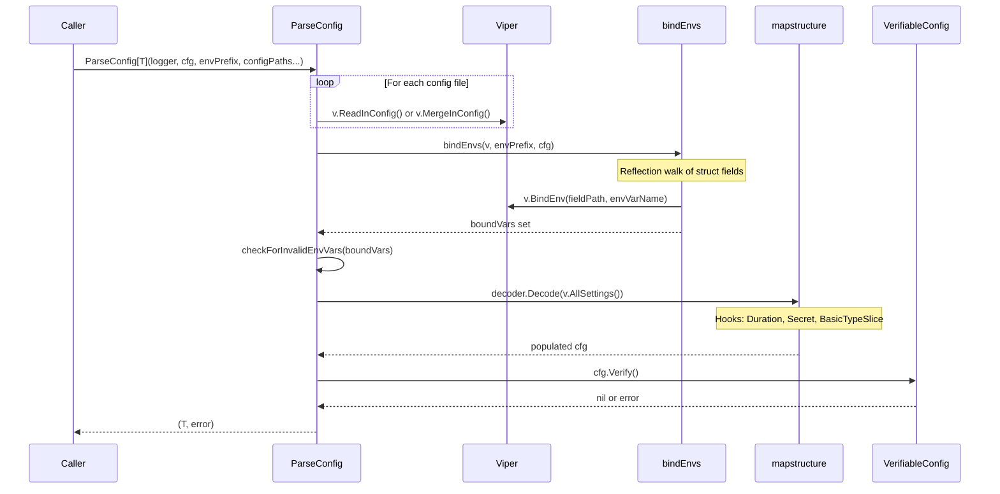
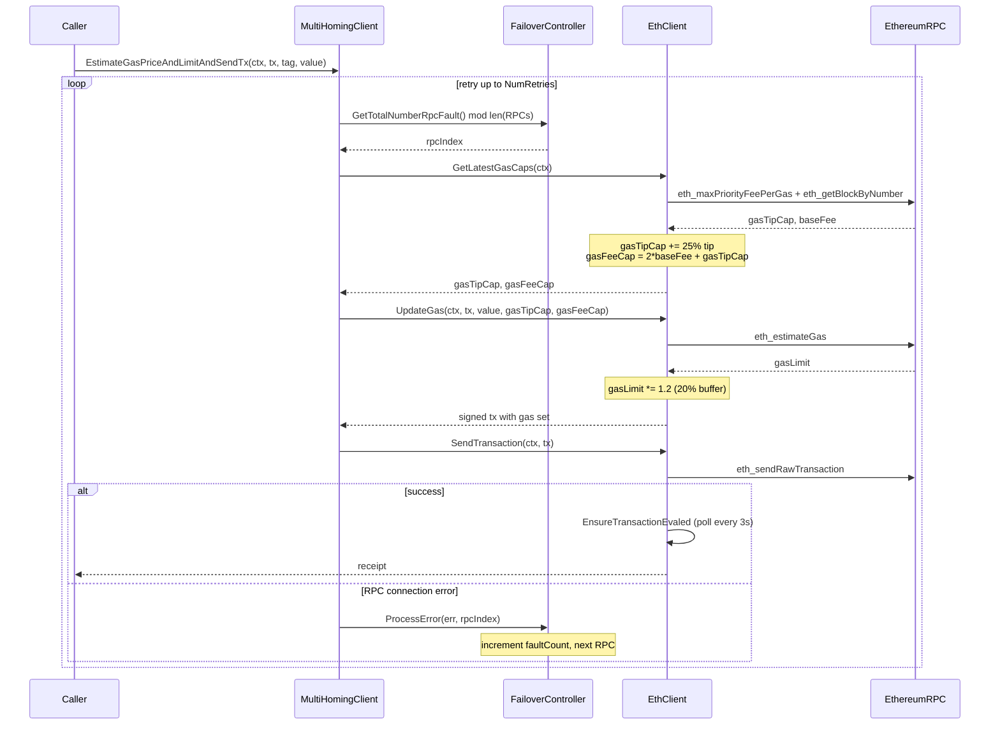
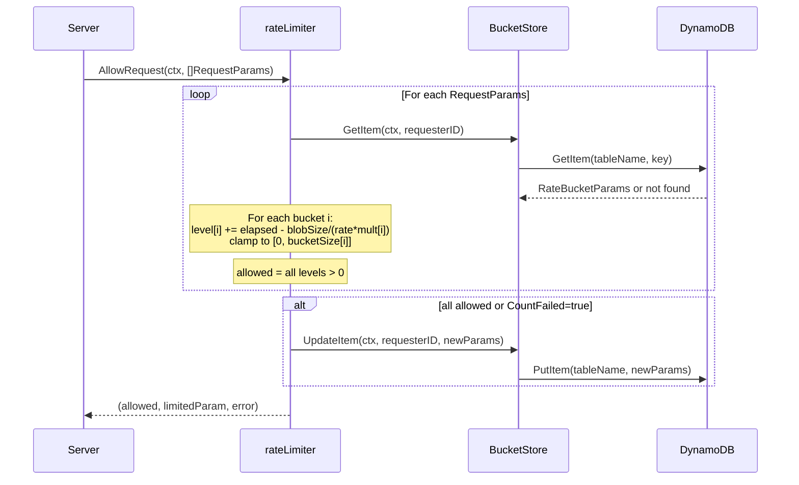
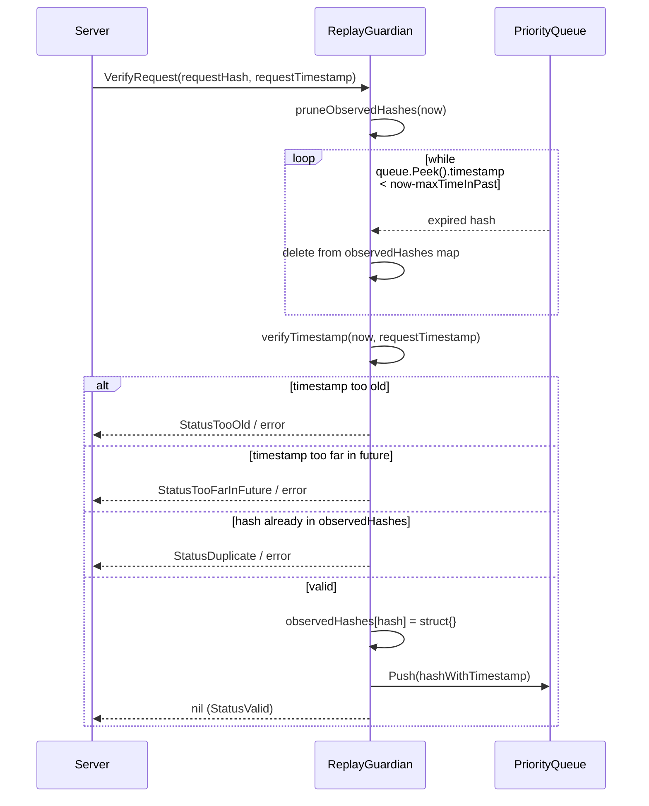
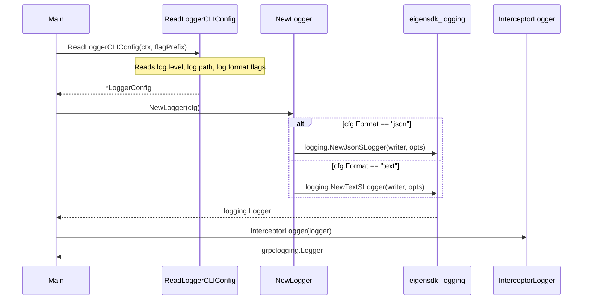

# common Analysis

**Analyzed by**: code-analyzer-common
**Timestamp**: 2026-04-10T00:00:00Z
**Application Type**: go-module
**Classification**: library
**Location**: common/

## Architecture

The `common` package is EigenDA's foundational shared utility library — a broad, horizontally organized collection of reusable primitives that nearly every other component in the monorepo depends on. Rather than a single coherent domain layer, it is best understood as a toolkit composed of around 20 independent sub-packages, each solving a specific infrastructure concern: configuration, logging, Ethereum client management, AWS cloud abstractions, rate limiting, caching, key-value storage, security primitives, and observability.

The design philosophy is interface-first: every major abstraction (`EthClient`, `S3Client`, `KVStore`, `RateLimiter`, `ReplayGuardian`, `DisperserRegistry`, `WorkerPool`, etc.) is defined as a Go interface in the `common` package root or in a dedicated sub-package. Concrete implementations live alongside — either directly or in named sub-packages (e.g., `common/geth`, `common/aws/dynamodb`, `common/kvstore/leveldb`). This enables consuming code to depend on abstractions and allows test doubles to be substituted cleanly. Mock implementations are placed in `common/mock/` and sub-package-level `mock/` directories.

The Ethereum client layer (`geth` sub-package) follows a decorator pattern. The base `EthClient` struct wraps `go-ethereum`'s `ethclient.Client` and adds transaction lifecycle helpers. `MultiHomingClient` then decorates `EthClient` with round-robin failover across multiple RPC endpoints and linear-backoff retries, while `FailoverController` tracks fault counts and routing decisions. This provides resilient blockchain connectivity without requiring callers to know about redundancy.

Configuration management (`config` sub-package) uses reflection-based struct walking to bind environment variables to Go structs, layering multiple configuration file sources (TOML, YAML, JSON via `spf13/viper`) with environment overrides. All config structs must implement the `VerifiableConfig` interface, ensuring invariant checking at parse time rather than at usage time.

The rate limiter (`ratelimit` sub-package) implements a leaky bucket algorithm with configurable time-scale buckets, where each requester's state is persisted to a pluggable `KVStore`. The rate limit state store can be backed by DynamoDB for distributed operation or by an in-memory local store for testing.

Security features include a replay attack guardian (`replay` sub-package) using a time-windowed hash set with priority-queue-based expiration, and AWS KMS integration (`aws` sub-package) for signing Ethereum transactions with hardware-managed keys using the secp256k1 curve.

## Key Components

- **`EthClient` interface** (`common/ethclient.go`): Comprehensive Ethereum JSON-RPC interface extending the standard go-ethereum surface with additional helpers: `GetLatestGasCaps()`, `EstimateGasPriceAndLimitAndSendTx()`, `UpdateGas()`, `EnsureTransactionEvaled()`, and `EnsureAnyTransactionEvaled()`. These additions encapsulate the common transaction submission, gas estimation, and receipt-waiting patterns needed across disperser and node code.

- **`geth.EthClient` struct** (`common/geth/client.go`): Concrete implementation of `common.EthClient` wrapping `ethclient.Client`. Manages ECDSA private key signing, tracks `numConfirmations` before considering a transaction confirmed, implements a polling loop (`waitMined`) that sleeps 3 seconds between receipt queries, and computes EIP-1559 gas caps with a 25% tip surplus and 2x base fee multiplier.

- **`geth.MultiHomingClient`** (`common/geth/multihoming_client.go`): A decorator over a pool of `EthClient` instances that provides transparent round-robin failover. On any connection-level error, `FailoverController.ProcessError()` increments a fault counter; subsequent `GetRPCInstance()` calls use `faultCount % len(RPCs)` to select the next endpoint. Supports linear backoff retries via `RetryDelay * attemptIndex`.

- **`config.ParseConfig[T VerifiableConfig]`** (`common/config/config_parser.go`): Generic function for parsing configuration from one or more files plus environment variables. Uses `spf13/viper` for file loading and merging, and reflection (`bindEnvs()`) to walk struct fields and generate environment variable names in SCREAMING_SNAKE_CASE. Validates unused environment variable detection, alias mapping for deprecated variables, and calls `cfg.Verify()` for semantic validation.

- **`LoggerConfig` + `NewLogger()`** (`common/logger_config.go`): Thin wrapper around `eigensdk-go/logging`'s `SLogger`. Offers four preset configs (default JSON for production, text for humans, silent for tests, console for interactive use). `InterceptorLogger()` adapts the logger to the `go-grpc-middleware` logging interceptor interface, bridging gRPC middleware logging with EigenDA's structured logger.

- **`metrics.Documentor`** (`common/metrics/metrics.go`): A self-documenting Prometheus metric factory that wraps `promauto.Factory`. Every metric registration (counter, gauge, histogram, summary, and their Vec variants) also appends a `DocumentedMetric` entry to an internal list. Callers can call `Document()` to retrieve the full set of declared metrics for automated documentation generation.

- **`dynamodb.Client` interface + implementation** (`common/aws/dynamodb/client.go`): Rich DynamoDB client abstraction supporting single/batch reads and writes (respecting DynamoDB's limits of 25 writes / 100 reads per batch), conditional puts and updates, paginated index queries, and atomic increments. Uses a singleton pattern via `sync.Once`. Integrates `aws-sdk-go-v2` with static or IAM credential loading.

- **`s3.S3Client` interface + `awsS3Client`** (`common/s3/s3_client.go`, `common/s3/aws/aws_s3_client.go`): Generic blob storage interface with `HeadObject`, `UploadObject`, `DownloadObject`, `DownloadPartialObject`, `DeleteObject`, `ListObjects`, `CreateBucket`. The AWS implementation uses the `feature/s3/manager` multipart downloader and uploader (10 MiB parts, 3 concurrency), plus a parallelism-limited concurrency channel. An OCI (Oracle Cloud) S3-compatible implementation exists in `common/s3/oci/`.

- **`kvstore.Store[K]` + LevelDB implementation** (`common/kvstore/store.go`, `common/kvstore/leveldb/leveldb_store.go`): Generic key-value store interface with `Put`, `Get`, `Delete`, `NewBatch`, `NewIterator`, `Shutdown`, `Destroy`. The LevelDB backend (`syndtr/goleveldb`) supports configurable sync writes, optional seeks compaction, and Prometheus metrics collection via `MetricsCollector`.

- **`RateLimiter` + leaky bucket implementation** (`common/ratelimit.go`, `common/ratelimit/limiter.go`): Interface and implementation for bandwidth-based rate limiting. Each requester has a set of leaky buckets (one per configured time scale). On each request, buckets are refilled by the elapsed time and then drained by `blobSize / (rate * multiplier)`. State is persisted to a `KVStore[RateBucketParams]` (either DynamoDB or local). Prometheus `GaugeVec` tracks bucket levels per requester.

- **`ReplayGuardian` interface + implementation** (`common/replay/replay_gaurdian.go`, `common/replay/replay_guardian_impl.go`): Interface and thread-safe implementation for replay attack detection. Maintains an in-memory `map[string]struct{}` of seen request hashes plus a `PriorityQueue` ordered by request timestamp for O(log n) expiration. Rejects requests outside a configurable past/future time window and any request whose hash has been previously seen within the window.

- **`reputation.Reputation`** (`common/reputation/reputation.go`): Exponential moving average (EMA) based reliability tracker, not goroutine-safe. `ReportSuccess()` moves score toward 1.0 at `SuccessUpdateRate`; `ReportFailure()` moves toward 0.0 at `FailureUpdateRate`. A time-based "forgiveness" mechanism increases scores below `ForgivenessTarget` toward that target exponentially, parameterized by `ForgivenessHalfLife`.

- **`GRPCClientPool[T]`** (`common/grpc_client_pool.go`): Generic round-robin pool of gRPC client connections of any generated stub type. Creates all connections eagerly at construction, uses an `atomic.Uint64` call counter for lock-free client selection, and provides `Close()` for resource cleanup.

- **`cache.Cache[K, V]` + `FIFOCache`** (`common/cache/cache.go`, `common/cache/fifo_cache.go`): Weight-based generic cache interface. `FIFOCache` evicts the oldest-inserted items when total weight exceeds `maxWeight`, using an internal `structures.Queue` as the eviction order. Supports custom weight calculators (e.g., byte size of values), default weight of 1 per entry.

- **`structures` sub-package** (`common/structures/`): Generic data structures — `PriorityQueue[T]` using `container/heap`, `Queue[T]` as a circular buffer deque, `RandomAccessDeque[T]`, and `IndexLock` for key-based mutual exclusion. These are used internally by `ReplayGuardian`, `FIFOCache`, and other components.

- **`memory.GetMaximumAvailableMemory()` + `SetGCMemorySafetyBuffer()`** (`common/memory/memory.go`): Detects the effective memory ceiling, checking both system RAM (via `gopsutil`) and cgroup limits from multiple cgroup v1/v2 paths for container awareness. `SetGCMemorySafetyBuffer()` calls `debug.SetMemoryLimit()` to trigger aggressive GC before the process hits the container limit.

- **`version.Semver`** (`common/version/semver.go`): Semantic version struct parsing and comparison. Supports X.Y.Z and X.Y.Z-errata formats, with comparison methods `LessThan`, `GreaterThan`, `Equals`, `StrictEquals`, and a comparator function compatible with sort APIs. Errata is ignored in non-strict comparisons.

- **`enforce` sub-package** (`common/enforce/assertions.go`): Panic-on-failure assertion library using generics. Functions include `True`, `False`, `Equals[T comparable]`, `NotEquals`, `GreaterThan[T constraints.Ordered]`, `LessThan`, `NotNil[T]`, `Nil`, `NotEmptyList`, `NotEmptyString`, `NotEmptyMap`, `MapContainsKey`, `NilError`.

- **`pubip` sub-package** (`common/pubip/pubip.go`): Public IP resolution with a `Provider` interface. Concrete providers hit `https://api.seeip.org` and `https://api.ipify.org`. `MultiProvider` tries providers in order. `ProviderOrDefault()` builds the appropriate provider from string names, used by node components to self-register their external address.

- **`aws.KMS` utilities** (`common/aws/kms.go`): Functions for using AWS KMS (key ID references only, no raw keys in memory) to sign Ethereum transactions: `LoadPublicKeyKMS()` fetches and parses the DER-encoded EC public key; `SignKMS()` calls `kms:Sign` with ECDSA-SHA256, then `ParseSignatureKMS()` converts the DER-encoded ASN.1 signature into the 65-byte Ethereum recovery format (handling low-S normalization and recovery bit computation).

- **`nameremapping` sub-package** (`common/nameremapping/name_remapping.go`): Loads a YAML file mapping Ethereum addresses to human-readable names. `GetAccountLabel()` formats labels as `"Name (0x123456)"` with address truncation. Used by metrics/logging components to reduce label cardinality.

## Data Flows

### 1. Configuration Parsing Flow

**Flow Description**: Configuration files and environment variables are merged and decoded into a typed struct, with invariant validation.



**Detailed Steps**:

1. **File Loading** (Caller -> Viper): For each provided path, viper loads the first as primary via `ReadInConfig`, subsequent ones are merged with `MergeInConfig`. Supports TOML, YAML, and JSON.
2. **Env Var Binding** (ParseConfig -> bindEnvs): Reflection walks exported struct fields recursively. Each field generates an env var name: `PREFIX_NESTED_FIELD`. Slices of basic types and `secret.Secret` types are handled as leaf values.
3. **Invalid Env Detection** (ParseConfig internal): All OS environment variables with the configured prefix are checked against the bound set. Any unrecognized variable causes a hard error, preventing silent misconfigurations.
4. **Decoding** (ParseConfig -> mapstructure): `mapstructure.Decoder` with `WeaklyTypedInput=true` converts viper's merged settings to the struct with custom hooks for `time.Duration`, `secret.Secret`, and comma-separated slices.
5. **Validation** (ParseConfig -> VerifiableConfig.Verify()): The typed struct's `Verify()` method runs semantic checks.

**Error Paths**:
- File not found: `fmt.Errorf("config path %q does not exist")`
- Unknown env var: `fmt.Errorf("environment variable %q is not bound to any configuration field")`
- mapstructure decode failure: wrapped error with field path

---

### 2. Ethereum Transaction Submission Flow

**Flow Description**: A caller submits a smart contract transaction through `EthClient`, which handles gas estimation, signing, sending, and confirmation polling.



**Error Paths**:
- All RPCs exhausted after `NumRetries`: last error returned
- `receipt.Status != 1`: `ErrTransactionFailed`
- `ctx.Done()` before confirmation: receipt (if available) + ctx.Err()

---

### 3. Rate Limiting Flow

**Flow Description**: An incoming request is checked against per-requester leaky buckets; state is persisted to DynamoDB.



---

### 4. Replay Attack Detection Flow

**Flow Description**: An incoming request hash and timestamp are verified to not be a replay, with in-memory state and time-based expiration.



---

### 5. Logger Construction Flow

**Flow Description**: A logger is created from CLI flags and used directly as well as for gRPC interceptors.



## Dependencies

### External Libraries

- **github.com/Layr-Labs/eigensdk-go** (v0.2.0-beta.1.0.20250118004418-2a25f31b3b28) [other]: EigenLayer SDK providing the `logging.Logger` interface (`NewJsonSLogger`, `NewTextSLogger`, `SLoggerOptions`) used throughout all common sub-packages. Also provides the `signer` sub-module for wallet signing.
  Imported in: `common/logger_config.go`, `common/geth/client.go`, `common/geth/multihoming_client.go`, `common/aws/dynamodb/client.go`, `common/kvstore/leveldb/leveldb_store.go`, and many others.

- **github.com/aws/aws-sdk-go-v2** (v1.26.1) [cloud-sdk]: Core AWS SDK v2 foundation providing AWS configuration types (`aws.Config`, `aws.Endpoint`). Used for region/credential setup in DynamoDB, S3, KMS, and Secrets Manager clients.
  Imported in: `common/aws/dynamodb/client.go`, `common/s3/aws/aws_s3_client.go`, `common/aws/kms.go`.

- **github.com/aws/aws-sdk-go-v2/service/dynamodb** (v1.31.0) [database]: DynamoDB service client providing operations like `PutItem`, `GetItem`, `BatchWriteItem`, `BatchGetItem`, `Query`, `UpdateItem`, `DeleteItem`. Used by `common/aws/dynamodb/client.go` to implement the `Client` interface.
  Imported in: `common/aws/dynamodb/client.go`, `common/store/dynamo_store.go`.

- **github.com/aws/aws-sdk-go-v2/service/s3** (v1.53.0) [cloud-sdk]: AWS S3 service client providing `HeadObject`, `GetObject`, `PutObject`, `DeleteObject`, `ListObjectsV2`, `CreateBucket`. Used by `common/s3/aws/aws_s3_client.go` for blob storage operations with multipart transfer via `feature/s3/manager`.
  Imported in: `common/s3/aws/aws_s3_client.go`.

- **github.com/aws/aws-sdk-go-v2/service/kms** (v1.31.0) [crypto]: AWS KMS service client for cryptographic signing without exposing raw keys. Used in `common/aws/kms.go` to call `GetPublicKey` and `Sign` with `EcdsaSha256` on the secp256k1 curve.
  Imported in: `common/aws/kms.go`.

- **github.com/aws/aws-sdk-go-v2/service/secretsmanager** (v1.28.6) [cloud-sdk]: AWS Secrets Manager client. Used in `common/aws/secretmanager/secretmanager.go` to retrieve secret strings by name (e.g., private keys, API keys).
  Imported in: `common/aws/secretmanager/secretmanager.go`.

- **github.com/aws/aws-sdk-go-v2/feature/dynamodb/attributevalue** (v1.13.12) [database]: DynamoDB attribute marshaling/unmarshaling. Used in `common/store/dynamo_store.go` to convert between Go structs and DynamoDB `AttributeValue` maps via `MarshalMap`/`UnmarshalMap`.
  Imported in: `common/store/dynamo_store.go`, `common/aws/dynamodb/client.go`.

- **github.com/aws/aws-sdk-go-v2/feature/s3/manager** (v1.16.13) [cloud-sdk]: S3 transfer manager providing multipart upload/download with configurable part size and concurrency. Used in `common/s3/aws/aws_s3_client.go` with 10 MiB parts and 3 concurrent goroutines.
  Imported in: `common/s3/aws/aws_s3_client.go`.

- **github.com/ethereum/go-ethereum** (v1.15.3, via op-geth replace directive) [blockchain]: Core Ethereum library. Provides `ethclient.Client`, ABI binding types (`bind.BoundContract`, `bind.TransactOpts`), cryptographic primitives (`crypto.HexToECDSA`, `crypto.Ecrecover`), and transaction types. Central dependency for all Ethereum interaction.
  Imported in: `common/ethclient.go`, `common/geth/client.go`, `common/geth/multihoming_client.go`, `common/aws/kms.go`.

- **github.com/spf13/viper** (v1.21.0) [other]: Configuration file loader supporting TOML, YAML, JSON with automatic environment variable binding. Used in `common/config/config_parser.go` as the underlying config file reader with `ReadInConfig` and `MergeInConfig`.
  Imported in: `common/config/config_parser.go`.

- **github.com/go-viper/mapstructure/v2** (v2.4.0) [other]: Struct decoding from maps with custom decode hooks. Used in `common/config/config_parser.go` to decode viper's `AllSettings()` into typed structs, supporting `time.Duration`, `secret.Secret`, and comma-separated slice parsing.
  Imported in: `common/config/config_parser.go`.

- **github.com/prometheus/client_golang** (v1.21.1) [monitoring]: Prometheus Go client library for metric registration and exposition. Used in `common/metrics/metrics.go` (self-documenting factory), `common/kvstore/leveldb/metrics.go`, `common/ratelimit/limiter.go`, and `common/cache/cache_metrics.go`.
  Imported in: `common/metrics/metrics.go`, `common/ratelimit/limiter.go`, `common/kvstore/leveldb/leveldb_store.go`.

- **github.com/syndtr/goleveldb** (v1.0.1-0.20220614013038-64ee5596c38a) [database]: LevelDB key-value store implementation. Used in `common/kvstore/leveldb/leveldb_store.go` as the concrete backend for the `kvstore.Store[[]byte]` interface with support for batch writes, prefix iteration, and configurable sync modes.
  Imported in: `common/kvstore/leveldb/leveldb_store.go`.

- **github.com/fxamacker/cbor/v2** (v2.5.0) [serialization]: CBOR encoding/decoding library. Used in `common/common.go` for `EncodeToBytes[T]` and `DecodeFromBytes[T]` generic functions, which underpin the `Hash[T]()` utility.
  Imported in: `common/common.go`.

- **github.com/shirou/gopsutil** (v3.21.11) [monitoring]: System metrics library. Used in `common/memory/memory.go` via `mem.VirtualMemory()` to read total physical RAM as the baseline memory ceiling.
  Imported in: `common/memory/memory.go`.

- **github.com/docker/go-units** (v0.5.0) [other]: Unit conversion library (bytes, SI/IEC prefixes). Used in `common/memory/memory.go` to parse memory limit strings like "4GB" from `/proc/self/status`.
  Imported in: `common/memory/memory.go`.

- **github.com/grpc-ecosystem/go-grpc-middleware/v2** (v2.1.0) [networking]: gRPC middleware utilities. Used in `common/logger_config.go` to expose `grpclogging.Logger` via `InterceptorLogger()`, bridging the EigenDA logger with the gRPC middleware logging interceptor interface.
  Imported in: `common/logger_config.go`.

- **github.com/oracle/oci-go-sdk/v65** (v65.78.0) [cloud-sdk]: Oracle Cloud Infrastructure Go SDK. Used in `common/s3/oci/oci_s3_client.go` for an OCI Object Storage implementation of the `s3.S3Client` interface, providing S3-compatible access to OCI buckets.
  Imported in: `common/s3/oci/oci_s3_client.go`.

- **github.com/gammazero/workerpool** (v1.1.3) [other]: Worker pool library. `common/workerpool.go` defines a `WorkerPool` interface mirroring this library's API, allowing the concrete `workerpool.WorkerPool` from this library to be substituted by mocks in `common/mock/workerpool.go`.
  Imported in: mock implementations and consuming packages.

- **github.com/urfave/cli** (v1.22.14) [cli]: CLI flag framework (v1). Used in `common/logger_config.go` (`LoggerCLIFlags`, `ReadLoggerCLIConfig`), `common/geth/cli.go`, and `common/aws/cli.go` to define and parse command-line flags for logger, geth, and AWS configuration.
  Imported in: `common/logger_config.go`, `common/geth/cli.go`, `common/aws/cli.go`.

- **golang.org/x/exp** (v0.0.0-20241009180824-f66d83c29e7c) [other]: Extended Go stdlib experiments. Used in `common/enforce/assertions.go` for `constraints.Ordered` constraint type enabling generic ordered comparisons (`GreaterThan`, `LessThan`, etc.).
  Imported in: `common/enforce/assertions.go`.

- **golang.org/x/sync** (v0.16.0) [other]: Extended sync utilities. Used in `common/s3/aws/aws_s3_client.go` via `errgroup.Group` for concurrent S3 fragment operations with error propagation.
  Imported in: `common/s3/aws/aws_s3_client.go`.

- **gopkg.in/yaml.v3** (v3.0.1) [serialization]: YAML parser. Used in `common/nameremapping/name_remapping.go` to parse YAML files mapping Ethereum addresses to human-readable names.
  Imported in: `common/nameremapping/name_remapping.go`.

- **github.com/stretchr/testify** (v1.11.1) [testing]: Test assertion library. `TestLogger(t require.TestingT)` in `common/logger_config.go` uses `require.NoError` to create loggers in tests.
  Imported in: `common/logger_config.go` (test helper), `common/aws/dynamodb/client_test.go`, and other test files.

- **google.golang.org/grpc** (v1.72.2) [networking]: gRPC framework. Used in `common/grpc_client_pool.go` (`grpc.NewClient`, `grpc.ClientConn`, `grpc.DialOption`) and `common/ratelimit.go` (`peer.FromContext`, `metadata.FromIncomingContext`) for gRPC connection pooling and client IP extraction.
  Imported in: `common/grpc_client_pool.go`, `common/ratelimit.go`.

### Internal Dependencies

- **litt** (`litt/`): The `litt/util` sub-package is imported by `common/config/config_parser.go` for `util.SanitizePath()` and `util.Exists()` — path sanitization and existence checking when loading configuration files. This is the only internal dependency within the `common` module itself.

## API Surface

### Exported Interfaces

**`EthClient`** (`common/ethclient.go`): Full Ethereum JSON-RPC client interface with 40+ methods. Extends the standard go-ethereum interface with transaction lifecycle helpers.

```go
type EthClient interface {
    GetAccountAddress() common.Address
    GetNoSendTransactOpts() (*bind.TransactOpts, error)
    ChainID(ctx context.Context) (*big.Int, error)
    EstimateGasPriceAndLimitAndSendTx(ctx context.Context, tx *types.Transaction, tag string, value *big.Int) (*types.Receipt, error)
    EnsureTransactionEvaled(ctx context.Context, tx *types.Transaction, tag string) (*types.Receipt, error)
    EnsureAnyTransactionEvaled(ctx context.Context, txs []*types.Transaction, tag string) (*types.Receipt, error)
    GetLatestGasCaps(ctx context.Context) (gasTipCap, gasFeeCap *big.Int, err error)
    UpdateGas(ctx context.Context, tx *types.Transaction, value, gasTipCap, gasFeeCap *big.Int) (*types.Transaction, error)
    // ... plus all standard go-ethereum ethclient methods
}
```

**`RateLimiter`** (`common/ratelimit.go`): Rate limiting interface for bandwidth-based request throttling.

```go
type RateLimiter interface {
    AllowRequest(ctx context.Context, params []RequestParams) (bool, *RequestParams, error)
}
```

**`KVStore[T any]`** (`common/param_store.go`): Simple key-value store interface for persisting typed values by string key.

```go
type KVStore[T any] interface {
    GetItem(ctx context.Context, key string) (*T, error)
    UpdateItem(ctx context.Context, key string, value *T) error
}
```

**`WorkerPool`** (`common/workerpool.go`): Worker pool interface mirroring `gammazero/workerpool`.

```go
type WorkerPool interface {
    Size() int; Stop(); StopWait(); Stopped() bool
    Submit(task func()); SubmitWait(task func())
    WaitingQueueSize() int; Pause(ctx context.Context)
}
```

**`s3.S3Client`** (`common/s3/s3_client.go`): Generic object storage interface.

```go
type S3Client interface {
    HeadObject(ctx context.Context, bucket, key string) (*int64, error)
    UploadObject(ctx context.Context, bucket, key string, data []byte) error
    DownloadObject(ctx context.Context, bucket, key string) ([]byte, bool, error)
    DownloadPartialObject(ctx context.Context, bucket, key string, startIndex, endIndex int64) ([]byte, bool, error)
    DeleteObject(ctx context.Context, bucket, key string) error
    ListObjects(ctx context.Context, bucket, prefix string) ([]ListedObject, error)
    CreateBucket(ctx context.Context, bucket string) error
}
```

**`kvstore.Store[K any]`** (`common/kvstore/store.go`): Typed key-value store with batch and iterator support.

```go
type Store[K any] interface {
    Put(k K, value []byte) error
    Get(k K) ([]byte, error)
    Delete(k K) error
    NewBatch() Batch[K]
    NewIterator(prefix K) (iterator.Iterator, error)
    Shutdown() error
    Destroy() error
}
```

**`replay.ReplayGuardian`** (`common/replay/replay_gaurdian.go`): Replay attack detection interface.

```go
type ReplayGuardian interface {
    VerifyRequest(requestHash []byte, requestTimestamp time.Time) error
    DetailedVerifyRequest(requestHash []byte, requestTimestamp time.Time) ReplayGuardianStatus
}
```

**`cache.Cache[K comparable, V any]`** (`common/cache/cache.go`): Generic in-memory cache with weight-based capacity.

```go
type Cache[K comparable, V any] interface {
    Get(key K) (V, bool)
    Put(key K, value V)
    Size() int; Weight() uint64
    SetMaxWeight(capacity uint64)
}
```

**`disperser.DisperserRegistry`** (`common/disperser/disperser_registry.go`): Interface for querying disperser registry contract.

```go
type DisperserRegistry interface {
    GetDefaultDispersers(ctx context.Context) ([]uint32, error)
    IsOnDemandDisperser(ctx context.Context, disperserID uint32) (bool, error)
    GetDisperserGrpcUri(ctx context.Context, disperserID uint32) (string, error)
}
```

**`dynamodb.Client`** (`common/aws/dynamodb/client.go`): Rich DynamoDB operations interface with conditional writes, paginated queries, batch operations, and atomic increments.

**`pubip.Provider`** (`common/pubip/pubip.go`): Public IP resolution interface with `Name()` and `PublicIPAddress(ctx)` methods.

**`config.VerifiableConfig`** (`common/config/verifiable_config.go`): Configuration validation interface.

```go
type VerifiableConfig interface {
    Verify() error
}
```

### Exported Functions (root package)

- `PrefixEnvVar(prefix, suffix string) string` — builds env var names like `MYAPP_FIELD`
- `PrefixFlag(prefix, suffix string) string` — builds CLI flag names like `myapp.field`
- `Hash[T any](t T) ([]byte, error)` — CBOR-serializes then SHA-256 hashes a value
- `EncodeToBytes[T any](t T) ([]byte, error)` — CBOR serialization
- `DecodeFromBytes[T any](b []byte) (T, error)` — CBOR deserialization
- `ToMilliseconds(duration time.Duration) float64` — nanosecond-precision ms conversion
- `GetClientAddress(ctx, header string, numProxies int, allowFallback bool) (string, error)` — extracts client IP from gRPC context, with proxy header support
- `PrettyPrintBytes(bytes uint64) string` — human-readable byte count
- `PrettyPrintTime(nanoseconds uint64) string` — human-readable duration
- `CommaOMatic(value uint64) string` — comma-formatted large integers

### Exported Structs / Types

- `LoggerConfig`, `DefaultLoggerConfig()`, `DefaultTextLoggerConfig()`, `DefaultSilentLoggerConfig()`, `DefaultConsoleLoggerConfig()`, `NewLogger()`, `TestLogger()`, `SilentLogger()`, `InterceptorLogger()`
- `GRPCServerConfig`, `DefaultGRPCServerConfig()`, `NewGRPCServerConfig()`
- `GRPCClientPool[T]`, `NewGRPCClientPool[T]()`
- `GlobalRateParams`, `RateBucketParams`, `RequestParams`, `RateParam`
- `reputation.Reputation`, `reputation.NewReputation()`
- `version.Semver`, `version.NewSemver()`, `version.SemverFromString()`, `version.SemverComparator()`
- `structures.PriorityQueue[T]`, `structures.Queue[T]`, `structures.RandomAccessDeque[T]`
- `cache.FIFOCache`, `cache.ThreadSafeCache`, `cache.CacheMetrics`
- `healthcheck.HeartbeatMonitorConfig`, `healthcheck.NewHeartbeatMonitor()`, `healthcheck.SignalHeartbeat()`
- `memory.GetMaximumAvailableMemory()`, `memory.SetGCMemorySafetyBuffer()`
- `enforce.True/False/Equals/NotEquals/GreaterThan/LessThan/NotNil/Nil/NilError/...`
- `nameremapping.LoadNameRemapping()`, `nameremapping.GetAccountLabel()`

## Code Examples

### Example 1: Generic Configuration Parsing

```go
// common/config/config_parser.go — ParseConfig usage pattern
type MyConfig struct {
    GrpcPort   uint16        `mapstructure:"grpc_port"`
    LogLevel   string        `mapstructure:"log_level"`
    MaxRetries int           `mapstructure:"max_retries"`
    Timeout    time.Duration `mapstructure:"timeout"`
}

func (c *MyConfig) Verify() error {
    if c.GrpcPort == 0 {
        return fmt.Errorf("grpc_port is required")
    }
    return nil
}

cfg, err := config.ParseConfig[*MyConfig](
    logger,
    &MyConfig{MaxRetries: 3}, // default values
    "MYAPP",                  // env prefix: MYAPP_GRPC_PORT, MYAPP_LOG_LEVEL, etc.
    nil,                       // no aliased env vars
    nil,                       // no ignored env vars
    "/etc/myapp/config.toml",
    "/etc/myapp/override.toml",
)
```

### Example 2: Multi-homing Ethereum Client Construction

```go
// common/geth/multihoming_client.go
config := geth.EthClientConfig{
    RPCURLs:          []string{"https://rpc1.example.com", "https://rpc2.example.com"},
    NumRetries:       3,
    RetryDelay:       500 * time.Millisecond,
    NumConfirmations: 2,
}
client, err := geth.NewMultiHomingClient(config, senderAddress, logger)
// client automatically fails over between RPC endpoints on connection errors
receipt, err := client.EstimateGasPriceAndLimitAndSendTx(ctx, tx, "my-op", value)
```

### Example 3: Rate Limiter with DynamoDB Backend

```go
// common/ratelimit/limiter.go + common/store/dynamo_store.go
dynamoClient, _ := dynamodb.NewClient(awsCfg, logger)
bucketStore := store.NewDynamoParamStore[common.RateBucketParams](dynamoClient, "rate-limit-table")

rateLimiter := ratelimit.NewRateLimiter(
    prometheusRegistry,
    common.GlobalRateParams{
        BucketSizes: []time.Duration{5 * time.Second, 1 * time.Minute},
        Multipliers: []float32{1.0, 2.0}, // 2x burst allowance at 1-minute scale
        CountFailed: false,
    },
    bucketStore,
    logger,
)

allowed, limitedParam, err := rateLimiter.AllowRequest(ctx, []common.RequestParams{
    {RequesterID: "0xabc...", RequesterName: "RollupA", BlobSize: 128 * 1024, Rate: 1024 * 1024},
})
```

### Example 4: Replay Guardian for gRPC Security

```go
// common/replay/replay_guardian_impl.go
guardian, err := replay.NewReplayGuardian(
    time.Now,
    5*time.Minute,  // reject requests older than 5 min
    3*time.Minute,  // reject requests more than 3 min in the future
)

// In gRPC handler:
requestHash := computeRequestHash(req)
if err := guardian.VerifyRequest(requestHash, req.Timestamp); err != nil {
    return nil, status.Errorf(codes.InvalidArgument, "replay detected: %v", err)
}
```

### Example 5: AWS KMS Signing for Ethereum

```go
// common/aws/kms.go
kmsClient := kms.NewFromConfig(awsConfig)
publicKey, err := aws.LoadPublicKeyKMS(ctx, kmsClient, "arn:aws:kms:us-east-1:...")
signature, err := aws.SignKMS(ctx, kmsClient, keyId, publicKey, txHash[:])
// signature is in 65-byte Ethereum format (r||s||v)
```

### Example 6: Self-Documenting Prometheus Metrics

```go
// common/metrics/metrics.go
documentor := metrics.With(prometheusRegistry)
disperseBlobCounter := documentor.NewCounterVec(prometheus.CounterOpts{
    Namespace: "eigenda",
    Subsystem: "disperser",
    Name:      "blobs_total",
    Help:      "Total number of blobs dispersed, labeled by status",
}, []string{"status"})

// Later, for automated documentation:
allMetrics := documentor.Document()
for _, m := range allMetrics {
    fmt.Printf("%-12s %s\n", m.Type, m.Name)
}
```

## Files Analyzed

- `common/common.go` (72 lines) — Root package utilities: CBOR encode/decode, SHA-256 hash, duration conversion
- `common/ethclient.go` (61 lines) — `EthClient` interface definition
- `common/logger_config.go` (189 lines) — Logger configuration, factory functions, CLI flag helpers
- `common/ratelimit.go` (114 lines) — `RateLimiter` interface, `RequestParams`, `GlobalRateParams`, `RateBucketParams`, client IP extraction
- `common/param_store.go` (11 lines) — `KVStore[T]` interface
- `common/workerpool.go` (16 lines) — `WorkerPool` interface
- `common/grpc_server_config.go` (84 lines) — `GRPCServerConfig` struct and defaults
- `common/grpc_client_pool.go` (112 lines) — `GRPCClientPool[T]` round-robin pool
- `common/units.go` (89 lines) — `PrettyPrintBytes`, `PrettyPrintTime`, `CommaOMatic`
- `common/geth/client.go` (306 lines) — `EthClient` concrete implementation
- `common/geth/multihoming_client.go` (898 lines) — `MultiHomingClient` failover decorator
- `common/geth/failover.go` (64 lines) — `FailoverController` fault tracking
- `common/config/config_parser.go` (463 lines) — `ParseConfig` generic function, reflection-based env binding
- `common/config/verifiable_config.go` (24 lines) — `VerifiableConfig`, `DocumentedConfig` interfaces
- `common/metrics/metrics.go` (122 lines) — Self-documenting Prometheus metric factory
- `common/aws/dynamodb/client.go` (548 lines) — Full DynamoDB client implementation
- `common/aws/kms.go` (168 lines) — AWS KMS signing utilities for Ethereum
- `common/aws/secretmanager/secretmanager.go` (38 lines) — Secrets Manager string retrieval
- `common/s3/s3_client.go` (51 lines) — `S3Client` interface
- `common/s3/aws/aws_s3_client.go` (284 lines) — AWS S3 client implementation
- `common/store/dynamo_store.go` (87 lines) — `NewDynamoParamStore[T]` implementing `KVStore` over DynamoDB
- `common/kvstore/store.go` (49 lines) — `kvstore.Store[K]` interface
- `common/kvstore/leveldb/leveldb_store.go` (205 lines) — LevelDB implementation of `kvstore.Store`
- `common/ratelimit/limiter.go` (158 lines) — Leaky bucket rate limiter implementation
- `common/replay/replay_gaurdian.go` (41 lines) — `ReplayGuardian` interface
- `common/replay/replay_guardian_impl.go` (173 lines) — Thread-safe replay guardian with PriorityQueue expiration
- `common/reputation/reputation.go` (89 lines) — EMA-based reputation tracker
- `common/cache/cache.go` (29 lines) — `Cache[K, V]` interface
- `common/cache/fifo_cache.go` (109 lines) — FIFO weight-based cache implementation
- `common/structures/priority_queue.go` (154 lines) — Generic `PriorityQueue[T]` using `container/heap`
- `common/memory/memory.go` (152 lines) — Container memory detection and GC tuning
- `common/version/semver.go` (151 lines) — Semantic version parsing and comparison
- `common/enforce/assertions.go` (135 lines) — Generic panic-on-failure assertion library
- `common/pubip/pubip.go` (81 lines) — Public IP resolution with multi-provider fallback
- `common/nameremapping/name_remapping.go` (63 lines) — YAML address-to-name mapping
- `common/healthcheck/heartbeat.go` (125 lines) — Heartbeat monitoring for stall detection
- `common/disperser/disperser_registry.go` (14 lines) — `DisperserRegistry` interface
- `common/CLAUDE.md` (30 lines) — Sub-package documentation
- `go.mod` (280 lines) — Module dependencies

## Analysis Data

```json
{
  "summary": "The common package is EigenDA's shared infrastructure library providing ~20 independent sub-packages covering: a comprehensive Ethereum client interface with multi-endpoint failover and transaction lifecycle management; AWS cloud abstractions (DynamoDB, S3, KMS, Secrets Manager); a reflection-based configuration parser with env var binding and invariant validation; structured logging via eigensdk-go; a Prometheus metric factory with self-documentation; bandwidth-based rate limiting backed by a pluggable KV store; replay attack protection via time-windowed hash deduplication; a generic LevelDB-backed key-value store; FIFO and thread-safe in-memory caches; container-aware memory management and GC tuning; generic data structures (priority queue, deque, queue); semantic version parsing; generic assertion utilities; and public IP resolution with fallback providers.",
  "architecture_pattern": "toolkit / facade — horizontally organized collection of independent sub-packages each solving a specific infrastructure concern, with interface-first design enabling dependency injection and testability",
  "key_modules": [
    "common (root) — EthClient interface, KVStore interface, WorkerPool interface, RateLimiter interface, CBOR serialization, unit formatting, gRPC utilities",
    "common/geth — Concrete EthClient, MultiHomingClient failover decorator, FailoverController",
    "common/config — Generic ParseConfig[T VerifiableConfig] with Viper + reflection-based env binding",
    "common/logger_config — LoggerConfig factory, NewLogger, InterceptorLogger for gRPC middleware",
    "common/metrics — Self-documenting Prometheus metric factory (Documentor)",
    "common/aws/dynamodb — Full DynamoDB client with batch operations, conditional writes, paginated queries",
    "common/aws/kms — AWS KMS secp256k1 signing for Ethereum transactions",
    "common/aws/secretmanager — AWS Secrets Manager string retrieval",
    "common/s3 — S3Client interface with AWS and OCI implementations",
    "common/kvstore + common/kvstore/leveldb — Generic KV store interface backed by LevelDB",
    "common/store — KVStore[T] implementation backed by DynamoDB (NewDynamoParamStore)",
    "common/ratelimit — Leaky bucket rate limiter with configurable time-scale buckets",
    "common/replay — Thread-safe replay attack guardian with PriorityQueue-based expiration",
    "common/reputation — EMA-based entity reliability tracker with forgiveness",
    "common/cache — Generic weight-based FIFO cache and thread-safe wrapper",
    "common/structures — PriorityQueue, Queue, RandomAccessDeque, IndexLock",
    "common/memory — Container-aware memory limit detection, GC tuning via SetMemoryLimit",
    "common/version — Semantic version parsing and comparison",
    "common/enforce — Generic panic-based assertion library",
    "common/pubip — Public IP resolution with seeip.org and ipify.org providers",
    "common/healthcheck — Channel-based heartbeat monitoring for stall detection",
    "common/nameremapping — YAML-based Ethereum address to human name mapping",
    "common/disperser — DisperserRegistry interface for contract lookups"
  ],
  "api_endpoints": [],
  "data_flows": [
    "Configuration parsing: files (TOML/YAML/JSON) + environment variables -> viper merge -> reflection-based env binding -> mapstructure decode -> VerifiableConfig.Verify()",
    "Ethereum transaction: caller -> MultiHomingClient (retry/failover) -> EthClient (gas estimation + signing) -> Ethereum RPC -> EnsureTransactionEvaled (confirmation polling)",
    "Rate limiting: request params -> leaky bucket state from KVStore (DynamoDB or local) -> bucket level update -> allowed/denied -> state persisted back",
    "Replay detection: request hash + timestamp -> time window check -> in-memory hash set lookup -> PriorityQueue expiration pruning -> accept/reject",
    "Logger construction: CLI flags (log.level/log.path/log.format) -> LoggerConfig -> eigensdk-go SLogger -> optional InterceptorLogger wrapper for gRPC"
  ],
  "tech_stack": ["go", "aws", "ethereum", "prometheus", "leveldb", "grpc"],
  "external_integrations": ["aws-dynamodb", "aws-s3", "aws-kms", "aws-secrets-manager", "oci-object-storage", "ethereum-rpc", "prometheus", "seeip.org", "ipify.org"],
  "component_interactions": [
    "Consumed by: core, disperser, ejector, encoding, litt, node, relay, retriever, indexer — virtually all EigenDA components depend on common",
    "Depends on: litt/util (path sanitization in config parser)"
  ]
}
```

## Citations

```json
[
  {
    "file_path": "common/common.go",
    "start_line": 35,
    "end_line": 54,
    "claim": "common.Hash[T] and EncodeToBytes[T] use CBOR (fxamacker/cbor/v2) for serialization followed by SHA-256 hashing",
    "section": "Key Components",
    "snippet": "func Hash[T any](t T) ([]byte, error) { bytes, err := EncodeToBytes(t); hasher := sha256.New(); hasher.Write(bytes); return hasher.Sum(nil), nil }"
  },
  {
    "file_path": "common/ethclient.go",
    "start_line": 13,
    "end_line": 60,
    "claim": "EthClient interface defines 40+ methods extending the standard go-ethereum ethclient surface with transaction lifecycle helpers",
    "section": "Key Components",
    "snippet": "type EthClient interface { GetAccountAddress() common.Address; GetNoSendTransactOpts() (*bind.TransactOpts, error); EnsureTransactionEvaled(...) (*types.Receipt, error); ... }"
  },
  {
    "file_path": "common/logger_config.go",
    "start_line": 31,
    "end_line": 35,
    "claim": "LoggerConfig wraps eigensdk-go logging.SLoggerOptions with format selection (json/text) and an io.Writer for output routing",
    "section": "Key Components",
    "snippet": "type LoggerConfig struct { Format LogFormat; OutputWriter io.Writer; HandlerOpts logging.SLoggerOptions }"
  },
  {
    "file_path": "common/logger_config.go",
    "start_line": 173,
    "end_line": 188,
    "claim": "InterceptorLogger adapts the EigenDA logger to the go-grpc-middleware grpclogging.Logger interface via a LoggerFunc closure",
    "section": "Key Components",
    "snippet": "func InterceptorLogger(logger logging.Logger) grpclogging.Logger { return grpclogging.LoggerFunc(func(ctx context.Context, lvl grpclogging.Level, msg string, fields ...any) { switch lvl { ... } }) }"
  },
  {
    "file_path": "common/ratelimit.go",
    "start_line": 30,
    "end_line": 41,
    "claim": "RateLimiter.AllowRequest accepts a slice of RequestParams enabling multiple rate-limit contexts (e.g., account-level and global) to be checked atomically in one call",
    "section": "Key Components",
    "snippet": "type RateLimiter interface { AllowRequest(ctx context.Context, params []RequestParams) (bool, *RequestParams, error) }"
  },
  {
    "file_path": "common/param_store.go",
    "start_line": 6,
    "end_line": 11,
    "claim": "KVStore[T] is a generic interface for persisting typed values by string key, used as the backing store for the rate limiter",
    "section": "Key Components",
    "snippet": "type KVStore[T any] interface { GetItem(ctx context.Context, key string) (*T, error); UpdateItem(ctx context.Context, key string, value *T) error }"
  },
  {
    "file_path": "common/geth/client.go",
    "start_line": 28,
    "end_line": 37,
    "claim": "geth.EthClient struct embeds go-ethereum's ethclient.Client and adds private key, chainID, numConfirmations, and a contracts cache for bound ABI contracts",
    "section": "Key Components",
    "snippet": "type EthClient struct { *ethclient.Client; RPCURL string; privateKey *ecdsa.PrivateKey; chainID *big.Int; AccountAddress gethcommon.Address; Contracts map[gethcommon.Address]*bind.BoundContract; numConfirmations int }"
  },
  {
    "file_path": "common/geth/client.go",
    "start_line": 124,
    "end_line": 151,
    "claim": "GetLatestGasCaps adds a 25% tip surplus to the suggested gas tip cap and computes gasFeeCap as 2*baseFee + gasTipCap per EIP-1559 recommendations, with a FallbackGasTipCap of 15 gwei if the RPC does not support eth_maxPriorityFeePerGas",
    "section": "Data Flows",
    "snippet": "extraTip := big.NewInt(0).Quo(gasTipCap, big.NewInt(4)); gasTipCap.Add(gasTipCap, extraTip); gasFeeCap = getGasFeeCap(gasTipCap, header.BaseFee)"
  },
  {
    "file_path": "common/geth/client.go",
    "start_line": 259,
    "end_line": 293,
    "claim": "waitMined polls for transaction receipts every 3 seconds and requires numConfirmations blocks above the receipt's block number before returning",
    "section": "Data Flows",
    "snippet": "queryTicker := time.NewTicker(3 * time.Second); for { for _, tx := range txs { receipt, err = c.TransactionReceipt(ctx, tx.Hash()); if err == nil { if receipt.BlockNumber.Uint64()+uint64(c.numConfirmations) > chainTip { break } else { return receipt, nil } } } }"
  },
  {
    "file_path": "common/geth/multihoming_client.go",
    "start_line": 18,
    "end_line": 27,
    "claim": "MultiHomingClient maintains a pool of EthClient instances and a FailoverController that tracks total fault count for round-robin endpoint selection",
    "section": "Key Components",
    "snippet": "type MultiHomingClient struct { RPCs []dacommon.EthClient; NumRetries int; RetryDelay time.Duration; lastRPCIndex uint64; *FailoverController; mu sync.Mutex }"
  },
  {
    "file_path": "common/geth/multihoming_client.go",
    "start_line": 73,
    "end_line": 86,
    "claim": "GetRPCInstance selects the active RPC endpoint using faultCount % len(RPCs), switching endpoints after connection errors",
    "section": "Key Components",
    "snippet": "index := m.GetTotalNumberRpcFault() % uint64(len(m.RPCs)); if index != m.lastRPCIndex { m.Logger.Info(\"[MultiHomingClient] Switch RPC\", ...) }"
  },
  {
    "file_path": "common/geth/multihoming_client.go",
    "start_line": 93,
    "end_line": 99,
    "claim": "MultiHomingClient uses linear backoff: sleeps attemptIndex * RetryDelay before each retry attempt, skipping sleep on first attempt",
    "section": "Key Components",
    "snippet": "func (m *MultiHomingClient) sleepBeforeRetry(attemptIndex int) { if attemptIndex > 0 && m.RetryDelay > 0 { time.Sleep(time.Duration(attemptIndex) * m.RetryDelay) } }"
  },
  {
    "file_path": "common/config/config_parser.go",
    "start_line": 20,
    "end_line": 44,
    "claim": "ParseConfig is a generic function that layers config files (merged in order) with environment variable overrides, then calls cfg.Verify() for semantic validation",
    "section": "Key Components"
  },
  {
    "file_path": "common/config/config_parser.go",
    "start_line": 191,
    "end_line": 210,
    "claim": "bindEnvs uses reflection to recursively walk exported struct fields, generating SCREAMING_SNAKE_CASE environment variable names and binding them to viper",
    "section": "Key Components"
  },
  {
    "file_path": "common/config/config_parser.go",
    "start_line": 395,
    "end_line": 460,
    "claim": "checkForInvalidEnvVars returns an error if any environment variable with the configured prefix is set but not bound to any struct field, preventing silent misconfigurations",
    "section": "Key Components"
  },
  {
    "file_path": "common/metrics/metrics.go",
    "start_line": 15,
    "end_line": 24,
    "claim": "Documentor wraps promauto.Factory and records a DocumentedMetric entry for every metric registration, enabling automatic metric documentation via Document()",
    "section": "Key Components",
    "snippet": "type Documentor struct { metrics []DocumentedMetric; factory promauto.Factory }"
  },
  {
    "file_path": "common/aws/dynamodb/client.go",
    "start_line": 79,
    "end_line": 115,
    "claim": "DynamoDB client uses sync.Once singleton pattern, supporting both static credentials and IAM default credential provider based on whether AccessKey/SecretAccessKey are non-empty",
    "section": "Dependencies",
    "snippet": "once.Do(func() { ...; if len(cfg.AccessKey) > 0 && len(cfg.SecretAccessKey) > 0 { options = append(options, config.WithCredentialsProvider(...)) } })"
  },
  {
    "file_path": "common/aws/dynamodb/client.go",
    "start_line": 449,
    "end_line": 492,
    "claim": "DynamoDB batch writes chunk requests into groups of 25 (the DynamoDB limit) and collect unprocessed items for return to the caller",
    "section": "Key Components",
    "snippet": "const dynamoBatchWriteLimit = 25; batchSize := int(math.Min(float64(dynamoBatchWriteLimit), remainingNumKeys))"
  },
  {
    "file_path": "common/aws/kms.go",
    "start_line": 91,
    "end_line": 116,
    "claim": "SignKMS calls AWS KMS Sign with EcdsaSha256 algorithm on a digest, then ParseSignatureKMS converts the DER ASN.1 response to the 65-byte Ethereum recovery format",
    "section": "Key Components",
    "snippet": "signOutput, err := client.Sign(ctx, &kms.SignInput{ KeyId: aws.String(keyId), SigningAlgorithm: types.SigningAlgorithmSpecEcdsaSha256, MessageType: types.MessageTypeDigest, Message: hash })"
  },
  {
    "file_path": "common/aws/kms.go",
    "start_line": 140,
    "end_line": 162,
    "claim": "ParseSignatureKMS normalizes the S value to low-S per Ethereum convention, then tries recovery bits v=0 and v=1 to determine the correct recovery byte",
    "section": "Key Components",
    "snippet": "sBigInt := new(big.Int).SetBytes(s); if sBigInt.Cmp(secp256k1HalfN) > 0 { s = new(big.Int).Sub(secp256k1N, sBigInt).Bytes() }; recoveredPublicKeyBytes, err := crypto.Ecrecover(hash, signature)"
  },
  {
    "file_path": "common/s3/s3_client.go",
    "start_line": 13,
    "end_line": 45,
    "claim": "S3Client interface abstracts over AWS S3 and S3-compatible services, with DownloadPartialObject supporting HTTP range requests for efficient partial retrieval",
    "section": "Key Components"
  },
  {
    "file_path": "common/s3/aws/aws_s3_client.go",
    "start_line": 123,
    "end_line": 157,
    "claim": "DownloadObject uses the S3 transfer manager with 10 MiB parts and 3 concurrent goroutines, pre-sizing the write buffer from HeadObject to avoid reallocations",
    "section": "Dependencies",
    "snippet": "var partMiBs int64 = 10; downloader := manager.NewDownloader(s.s3Client, func(d *manager.Downloader) { d.PartSize = partMiBs * 1024 * 1024; d.Concurrency = 3 })"
  },
  {
    "file_path": "common/kvstore/store.go",
    "start_line": 15,
    "end_line": 48,
    "claim": "kvstore.Store[K] is a generic typed key interface; the LevelDB implementation uses []byte keys and supports prefix-scanned iterators over a consistent snapshot",
    "section": "Key Components"
  },
  {
    "file_path": "common/kvstore/leveldb/leveldb_store.go",
    "start_line": 34,
    "end_line": 68,
    "claim": "LevelDB store is created with configurable DisableSeeksCompaction, optional sync writes, and optional Prometheus metrics collection; returns nil metrics if reg is nil",
    "section": "Dependencies"
  },
  {
    "file_path": "common/ratelimit/limiter.go",
    "start_line": 112,
    "end_line": 121,
    "claim": "The leaky bucket computes deduction as blobSize/(rate*multiplier[i]) in microseconds, clamps bucket levels to [0, bucketSize], and allows the request only if all buckets remain above 0",
    "section": "Key Components",
    "snippet": "deduction := time.Microsecond * time.Duration(1e6*float32(params.BlobSize)/float32(params.Rate)/d.globalRateParams.Multipliers[i]); bucketLevels[i] = getBucketLevel(bucketParams.BucketLevels[i], size, interval, deduction)"
  },
  {
    "file_path": "common/replay/replay_guardian_impl.go",
    "start_line": 27,
    "end_line": 32,
    "claim": "replayGuardian uses an in-memory map for O(1) hash lookup and a PriorityQueue ordered by request timestamp for O(log n) expiration pruning",
    "section": "Key Components",
    "snippet": "observedHashes map[string]struct{}; expirationQueue *structures.PriorityQueue[*hashWithTimestamp]"
  },
  {
    "file_path": "common/replay/replay_guardian_impl.go",
    "start_line": 150,
    "end_line": 172,
    "claim": "pruneObservedHashes removes expired entries by peeking at the oldest-timestamp entry in the priority queue and deleting it from both queue and map if older than maxTimeInPast",
    "section": "Data Flows",
    "snippet": "oldestNonExpiredTimestamp := now.Add(-r.maxTimeInPast); for { next, ok := r.expirationQueue.TryPeek(); if !timestamp.Before(oldestNonExpiredTimestamp) { return }; r.expirationQueue.Pop(); delete(r.observedHashes, next.hash) }"
  },
  {
    "file_path": "common/reputation/reputation.go",
    "start_line": 19,
    "end_line": 23,
    "claim": "Reputation is explicitly NOT goroutine-safe, tracking score as a float64 with EMA update rates and a forgiveness timer",
    "section": "Key Components",
    "snippet": "// This structure is NOT goroutine safe.\ntype Reputation struct { config ReputationConfig; score float64; previousForgivenessTime time.Time }"
  },
  {
    "file_path": "common/reputation/reputation.go",
    "start_line": 64,
    "end_line": 88,
    "claim": "The forgiveness mechanism uses exponential decay toward ForgivenessTarget parameterized by ForgivenessHalfLife, only applying when score is below the target",
    "section": "Key Components",
    "snippet": "forgivenessRate := math.Log(2) / r.config.ForgivenessHalfLife.Seconds(); forgivenessFraction := 1 - math.Exp(-forgivenessRate*elapsed); r.score = (1-forgivenessFraction)*r.score + forgivenessFraction*r.config.ForgivenessTarget"
  },
  {
    "file_path": "common/grpc_client_pool.go",
    "start_line": 16,
    "end_line": 30,
    "claim": "GRPCClientPool manages a pool of typed gRPC stub clients with atomic round-robin selection; the lock is only held during Close()",
    "section": "Key Components",
    "snippet": "type GRPCClientPool[T any] struct { clients []T; connections []*grpc.ClientConn; callCount atomic.Uint64; closed bool; lock sync.Mutex }"
  },
  {
    "file_path": "common/cache/fifo_cache.go",
    "start_line": 13,
    "end_line": 21,
    "claim": "FIFOCache maintains an internal structures.Queue for eviction ordering and records insertion timestamps in insertionRecord for eviction age metrics",
    "section": "Key Components",
    "snippet": "type FIFOCache[K comparable, V any] struct { weightCalculator WeightCalculator[K, V]; currentWeight uint64; maxWeight uint64; data map[K]V; evictionQueue *structures.Queue[*insertionRecord] }"
  },
  {
    "file_path": "common/memory/memory.go",
    "start_line": 18,
    "end_line": 22,
    "claim": "GetMaximumAvailableMemory checks cgroup v1 and v2 memory limit paths to detect container memory constraints before falling back to physical RAM reported by gopsutil",
    "section": "Key Components",
    "snippet": "var cgroupPaths = []string{ \"/sys/fs/cgroup/memory.max\", \"/sys/fs/cgroup/memory/memory.limit_in_bytes\", \"/sys/fs/cgroup/memory/docker/memory.limit_in_bytes\" }"
  },
  {
    "file_path": "common/structures/priority_queue.go",
    "start_line": 16,
    "end_line": 33,
    "claim": "PriorityQueue[T] wraps container/heap with a generic lessThan comparator, intentionally not shrinking the backing slice on pop for performance in steady-state workloads",
    "section": "Key Components",
    "snippet": "type PriorityQueue[T any] struct { heap *heapImpl[T] }; func NewPriorityQueue[T any](lessThan func(a T, b T) bool) *PriorityQueue[T]"
  },
  {
    "file_path": "common/nameremapping/name_remapping.go",
    "start_line": 38,
    "end_line": 52,
    "claim": "GetAccountLabel formats metric labels as 'Name (0x123456)' with address truncated to 8 chars, reducing Prometheus label cardinality when highCardinalityNames=false",
    "section": "Key Components",
    "snippet": "if remappedName, found := remappedNames[accountId]; found && remappedName != \"\" { truncatedId := accountId[:8]; return fmt.Sprintf(\"%s (%s)\", remappedName, truncatedId) }"
  },
  {
    "file_path": "common/disperser/disperser_registry.go",
    "start_line": 6,
    "end_line": 13,
    "claim": "DisperserRegistry interface abstracts the on-chain DisperserRegistry contract, providing methods to enumerate dispersers and resolve their gRPC URIs",
    "section": "API Surface",
    "snippet": "type DisperserRegistry interface { GetDefaultDispersers(ctx context.Context) ([]uint32, error); IsOnDemandDisperser(ctx context.Context, disperserID uint32) (bool, error); GetDisperserGrpcUri(ctx context.Context, disperserID uint32) (string, error) }"
  },
  {
    "file_path": "common/store/dynamo_store.go",
    "start_line": 20,
    "end_line": 24,
    "claim": "NewDynamoParamStore creates a generic KVStore[T] backed by DynamoDB using RequesterID as the hash key, providing distributed rate-limiter state persistence",
    "section": "Key Components",
    "snippet": "func NewDynamoParamStore[T any](client commondynamodb.Client, tableName string) common.KVStore[T] { return &dynamodbBucketStore[T]{ client: client, tableName: tableName } }"
  },
  {
    "file_path": "common/config/verifiable_config.go",
    "start_line": 4,
    "end_line": 23,
    "claim": "VerifiableConfig is the base validation interface; DocumentedConfig extends it with GetName(), GetEnvVarPrefix(), and GetPackagePaths() for documentation generation tooling",
    "section": "API Surface",
    "snippet": "type VerifiableConfig interface { Verify() error }; type DocumentedConfig interface { VerifiableConfig; GetName() string; GetEnvVarPrefix() string; GetPackagePaths() []string }"
  },
  {
    "file_path": "common/geth/failover.go",
    "start_line": 36,
    "end_line": 57,
    "claim": "FailoverController.ProcessError increments the total RPC fault count on connection-level errors, driving the MultiHomingClient's round-robin endpoint selection",
    "section": "Key Components",
    "snippet": "func (f *FailoverController) ProcessError(err error, rpcIndex int, funcName string) bool { ...; if nextEndpoint == NewRPC { f.numberRpcFault += 1 }; return action == Return }"
  },
  {
    "file_path": "common/healthcheck/heartbeat.go",
    "start_line": 42,
    "end_line": 46,
    "claim": "HeartbeatMessage carries a Component name and Timestamp, sent on a channel to HeartbeatMonitor which tracks last-seen times and writes status to a file",
    "section": "Key Components",
    "snippet": "type HeartbeatMessage struct { Component string; Timestamp time.Time }"
  },
  {
    "file_path": "common/pubip/pubip.go",
    "start_line": 9,
    "end_line": 17,
    "claim": "pubip defaults to seeip.org and ipify.org as public IP providers, with MultiProvider trying them in order and falling back gracefully",
    "section": "Key Components",
    "snippet": "const ( SeepIPProvider = \"seeip\"; SeeIPURL = \"https://api.seeip.org\"; IpifyProvider = \"ipify\"; IpifyURL = \"https://api.ipify.org\" )"
  }
]
```

## Analysis Notes

### Security Considerations

1. **AWS KMS Key Management**: The KMS integration in `common/aws/kms.go` is well-designed — private keys never leave the HSM. However, `ParseSignatureKMS` performs brute-force recovery bit determination (try v=0, then v=1), which is correct but relies on `crypto.Ecrecover` behavior that is specific to the op-geth fork. Any change to the underlying geth fork could silently affect this.

2. **Replay Guardian Thread Safety**: `replayGuardian` in `common/replay/replay_guardian_impl.go` uses a `sync.Mutex` correctly protecting both the hash map and the priority queue. However, the `observedHashes` map grows unboundedly within the time window — an adversary submitting many unique requests could cause memory pressure before expiration pruning catches up.

3. **DynamoDB Singleton Pattern**: `common/aws/dynamodb/client.go` uses `sync.Once` to create a singleton client stored in a package-level `clientRef`. All calls to `NewClient` with different configurations after the first silently return the original client — a potential source of hard-to-diagnose configuration bugs in tests or multi-tenant scenarios.

4. **Rate Limiter Fail-Open**: When `BucketStore.GetItem()` fails (e.g., DynamoDB unreachable), the rate limiter treats the requester as new with full buckets, effectively allowing the request. This fail-open behavior may be intentional for availability but could be exploited during backend outages.

5. **Configuration Validation at Parse Time**: `ParseConfig` calls `cfg.Verify()` before returning, ensuring semantic validation during startup rather than at usage time. The strength of this guarantee depends on the quality of each config struct's `Verify()` implementation.

### Performance Characteristics

- **MultiHomingClient**: Each method call acquires a `sync.Mutex` to read the current RPC index. Under very high throughput this could become a minor bottleneck; switching to an atomic index would avoid the lock.
- **GRPCClientPool**: Uses `atomic.Uint64` for lock-free round-robin selection — the mutex is only held during `Close()`. Good performance under concurrent access.
- **FIFOCache**: O(1) Get/Put (hash map + queue enqueue). Eviction is amortized O(1) per Put. Not thread-safe — callers must wrap with `ThreadSafeCache` if concurrent access is needed.
- **ReplayGuardian**: O(log n) per request due to `PriorityQueue` push, where n is the number of tracked hashes within the time window. Acceptable for moderate request rates; high-throughput services may benefit from a ring-buffer-based alternative.
- **LevelDB**: Single-process embedded database. Suitable for per-node local state but not for shared distributed state (which uses DynamoDB).

### Scalability Notes

- **Stateless utilities**: Logger, enforce, memory, version, structures, cache (local), math utils — all are stateless or process-local and scale horizontally without coordination.
- **Distributed rate limiting**: Leaky bucket state persists to DynamoDB (`NewDynamoParamStore`), enabling distributed rate limiting across multiple disperser instances. DynamoDB's eventual consistency may allow brief burst overruns across replicas.
- **KVStore abstraction**: The `common/kvstore/leveldb` store is single-process (LevelDB file). The `common/store/dynamo_store.go` provides a distributed alternative. Code depending on `KVStore[T]` can swap between the two without changing business logic.
- **S3 concurrency**: The AWS S3 client controls parallel operations via a channel-based `concurrencyLimiter` sized by `fragmentParallelismFactor * runtime.NumCPU()` or a constant, preventing goroutine explosion under bursty load.
