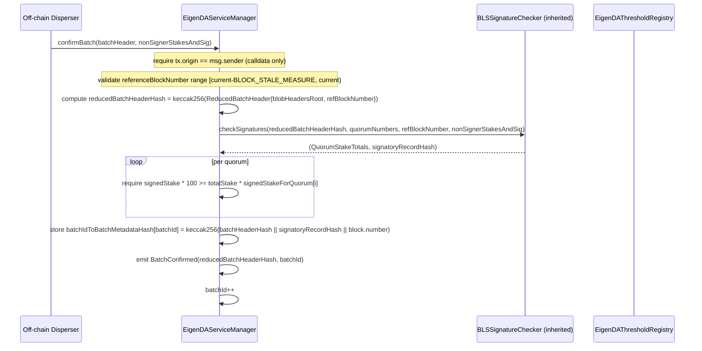
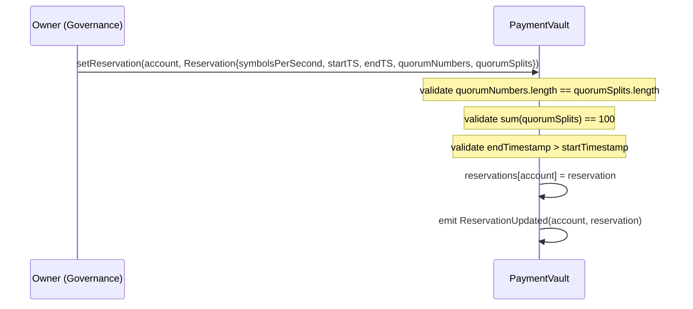
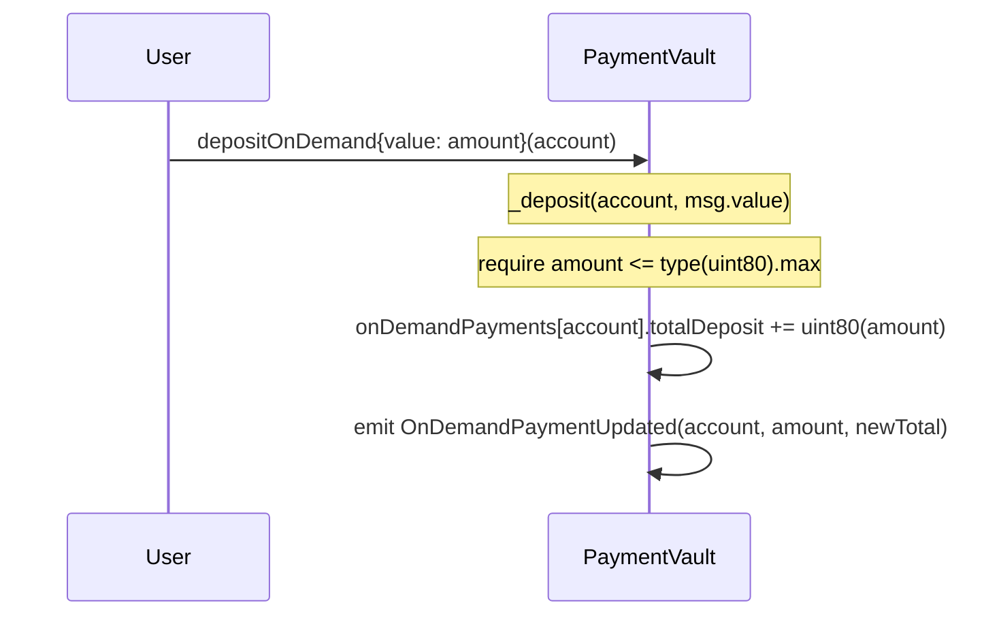
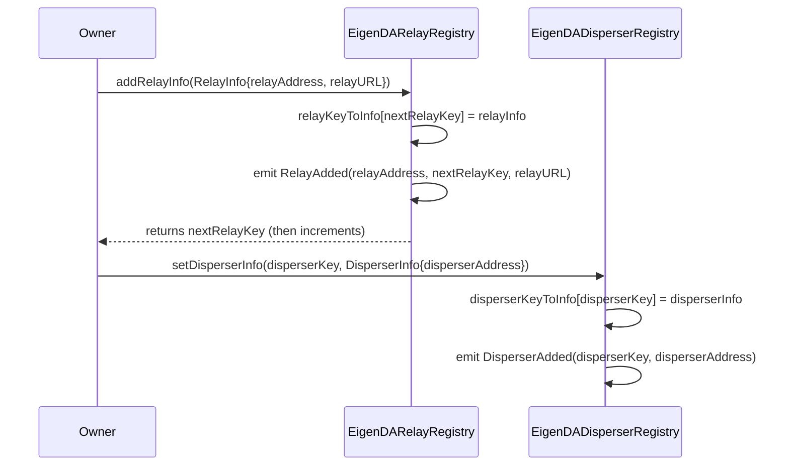
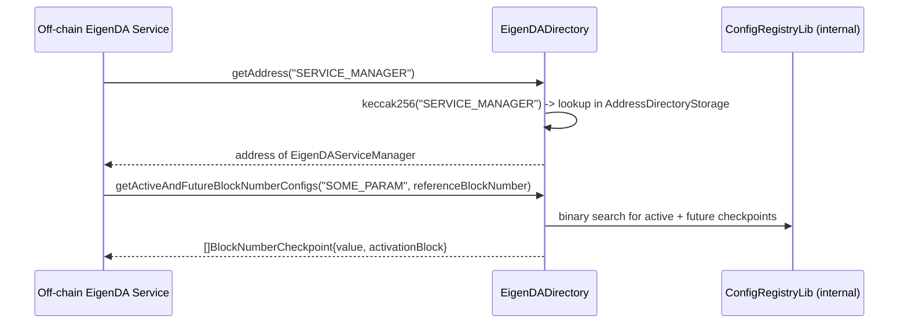

# contracts-core Analysis

**Analyzed by**: code-analyzer-solidity
**Timestamp**: 2026-04-08T00:00:00Z
**Application Type**: solidity-contract
**Classification**: service
**Location**: contracts/src/core

## Architecture

The core EigenDA contracts form the foundational protocol layer for a decentralized data availability service built on top of EigenLayer. The system follows a modular multi-contract architecture: each major protocol concern (batch confirmation, payment accounting, relay discovery, disperser registry, quorum thresholds, operator registration, and service discovery) is encapsulated in a dedicated upgradeable contract. Contracts are deployed behind transparent proxies and use the storage-separation pattern, with all mutable state defined in `*Storage` abstract contracts that are inherited by the logic contracts. This enables upgrade-safe logic swaps without storage collisions.

Access control follows two distinct patterns depending on contract generation. Older contracts (V1/V2 era: `EigenDAServiceManager`, `PaymentVault`, `EigenDARelayRegistry`, `EigenDADisperserRegistry`, `EigenDAThresholdRegistry`) use `OwnableUpgradeable` from OpenZeppelin, where a single owner address can administer the contract. Newer contracts (V3 era: `EigenDADirectory`, `EigenDARegistryCoordinator`, `EigenDAEjectionManager`) use `EigenDAAccessControl`, which extends OpenZeppelin's `AccessControlEnumerable` with well-defined roles (`OWNER_ROLE`, `EJECTOR_ROLE`, `QUORUM_OWNER_ROLE`). The V3 contracts resolve the access control contract address dynamically at runtime using a diamond-storage-inspired pattern: `AddressDirectoryLib` stores a mapping from `keccak256(name) -> address` in a dedicated namespaced storage slot, allowing any V3 contract to look up the canonical `ACCESS_CONTROL` contract without hard-coding its address.

The V3 `EigenDADirectory` contract acts as both an address directory (name-to-address mapping) and a versioned config registry (name-to-bytes checkpoints keyed by block number or timestamp). This enables off-chain EigenDA services to query the current canonical addresses of all protocol contracts from a single on-chain source of truth, and to look ahead to planned configuration changes before they activate.

The primary data flows are: (1) a disperser builds a batch of blobs, collects BLS signatures from EigenLayer operators, and calls `confirmBatch` on `EigenDAServiceManager`; (2) users (rollups) pre-pay for data access either via timed reservations or pay-as-you-go ETH deposits in `PaymentVault`; (3) relay nodes are registered in `EigenDARelayRegistry` mapping numeric relay keys to on-chain addresses and off-chain URLs; (4) disperser identities are registered in `EigenDADisperserRegistry`; and (5) quorum security parameters (adversary/confirmation threshold percentages and versioned blob encoding parameters) are managed in `EigenDAThresholdRegistry`.

## Key Components

- **EigenDAServiceManager** (`contracts/src/core/EigenDAServiceManager.sol`): Primary protocol entry point and AVS service manager. Inherits `ServiceManagerBase` (EigenLayer middleware), `BLSSignatureChecker` (BLS aggregate signature verification), and `Pausable`. Exposes `confirmBatch()`, which is callable only by whitelisted `batchConfirmer` addresses. Validates that the BLS aggregate signature over a `ReducedBatchHeader` meets per-quorum stake thresholds, then stores a compact `batchIdToBatchMetadataHash` mapping indexed by an auto-incrementing `batchId`. Stores four immutable registry references (`eigenDAThresholdRegistry`, `eigenDARelayRegistry`, `paymentVault`, `eigenDADisperserRegistry`).

- **EigenDAServiceManagerStorage** (`contracts/src/core/EigenDAServiceManagerStorage.sol`): Storage layout for `EigenDAServiceManager`. Defines protocol constants (`THRESHOLD_DENOMINATOR=100`, `STORE_DURATION_BLOCKS` = 2 weeks / 12s, `BLOCK_STALE_MEASURE=300`), the `batchId` counter, `batchIdToBatchMetadataHash` mapping, and `isBatchConfirmer` permission mapping. Includes a 47-slot `__GAP` for upgrade safety.

- **PaymentVault** (`contracts/src/core/PaymentVault.sol`): Manages two payment modes — timed reservations (symbolsPerSecond budget for a date range) and on-demand ETH deposits (cumulative total-deposit accounting). Governance (owner) sets reservations via `setReservation()`; users deposit ETH directly via `receive()`/`depositOnDemand()`. Amounts are stored as `uint80` (capped at 80 bits). Owner can also withdraw ETH or ERC-20 tokens. Uses `OwnableUpgradeable` with a price-update cooldown mechanism.

- **PaymentVaultStorage** (`contracts/src/core/PaymentVaultStorage.sol`): Holds payment parameters (`minNumSymbols`, `pricePerSymbol`, `priceUpdateCooldown`, `lastPriceUpdateTime`, `globalSymbolsPerPeriod`, `reservationPeriodInterval`, `globalRatePeriodInterval`) and the `reservations` and `onDemandPayments` mappings. Uses a 46-slot `__GAP`.

- **EigenDADirectory** (`contracts/src/core/EigenDADirectory.sol`): V3 on-chain service discovery contract combining two registries: an `IEigenDAAddressDirectory` (name-string → address, with add/replace/remove operations) and an `IEigenDAConfigRegistry` (name-string → versioned `bytes` checkpoints, indexed by either block number or timestamp). Resolves its own owner via the `ACCESS_CONTROL` entry it stores. Implements `IEigenDASemVer` (v2.0.0). Deployed fresh before any other V3 contract, as they depend on it.

- **EigenDAAccessControl** (`contracts/src/core/EigenDAAccessControl.sol`): Thin wrapper around OZ `AccessControlEnumerable`. Constructor grants `DEFAULT_ADMIN_ROLE` and `OWNER_ROLE` to a single address. Intended to sit behind a timelock in production. Defines roles: `OWNER_ROLE`, `EJECTOR_ROLE`, and per-quorum `QUORUM_OWNER_ROLE`.

- **EigenDARegistryCoordinator** (`contracts/src/core/EigenDARegistryCoordinator.sol`): EigenLayer AVS registry coordinator managing three sub-registries: `StakeRegistry` (operator stake tracking), `BLSApkRegistry` (individual and aggregate BLS public keys per quorum), and `IndexRegistry` (ordered operator list per quorum). Extends the upstream EigenLayer middleware `RegistryCoordinator` with EigenDA-specific storage. Uses `EIP712` for signature-based registration, `Pausable` for circuit-breaking, and resolves its dependencies via `AddressDirectoryLib` at runtime.

- **EigenDARegistryCoordinatorStorage** (`contracts/src/core/EigenDARegistryCoordinatorStorage.sol`): Storage for `EigenDARegistryCoordinator`. Holds the `_directory` address (EigenDADirectory) and uses `AddressDirectoryLib` to resolve sub-registry addresses at runtime.

- **EigenDAThresholdRegistry** (`contracts/src/core/EigenDAThresholdRegistry.sol`): Upgradeable registry for EigenDA quorum security parameters. Stores per-quorum adversary threshold percentages, confirmation threshold percentages, required quorum sets (as packed `bytes` arrays), and a versioned table of `VersionedBlobParams` (maxNumOperators, numChunks, codingRate per blob version). Parameters are owner-controlled post-deployment.

- **EigenDAThresholdRegistryImmutableV1** (`contracts/src/core/EigenDAThresholdRegistryImmutableV1.sol`): Non-upgradeable variant intended for rollups using EigenDA V1 that need custom quorum thresholds. Disables V2-only functions (`nextBlobVersion`, `getBlobParams`) by reverting. All three threshold arrays are set once in the constructor.

- **EigenDARelayRegistry** (`contracts/src/core/EigenDARelayRegistry.sol`): Upgradeable append-only registry mapping uint32 relay keys to `RelayInfo` structs (relay on-chain address + off-chain URL). Owner appends new relays via `addRelayInfo()`, which returns the assigned key. Callers look up relays by numeric key.

- **EigenDADisperserRegistry** (`contracts/src/core/EigenDADisperserRegistry.sol`): Upgradeable registry mapping uint32 disperser keys to `DisperserInfo` structs (disperser address). Owner sets entries via `setDisperserInfo()`.

- **AddressDirectoryLib** (`contracts/src/core/libraries/v3/address-directory/AddressDirectoryLib.sol`): Library for managing a namespaced mapping from `keccak256(name) -> address`. Uses diamond-style namespaced storage (`AddressDirectoryStorage`) to avoid slot collisions. Provides `getKey()`, `getAddress()`, `setAddress()`, `registerKey()`, and `deregisterKey()` used by `EigenDADirectory` and V3 contracts that resolve dependencies at runtime.

- **ConfigRegistryLib** (`contracts/src/core/libraries/v3/config-registry/ConfigRegistryLib.sol`): Library for managing two independent time-ordered checkpoint stores (one keyed by block number, one by timestamp). Each checkpoint holds an arbitrary `bytes` value and an activation time. The library enforces strictly-increasing activation keys and rejects past activations. Used by `EigenDADirectory` to provide `getActiveAndFutureBlockNumberConfigs()` and `getActiveAndFutureTimestampConfigs()` for off-chain services to discover current + upcoming configurations.

- **EigenDATypesV1** (`contracts/src/core/libraries/v1/EigenDATypesV1.sol`): Data type library for V1 protocol structures: `BatchHeader`, `ReducedBatchHeader`, `BatchMetadata`, `BlobHeader`, `BlobVerificationProof`, `NonSignerStakesAndSignature`, `QuorumStakeTotals`, `VersionedBlobParams`, `SecurityThresholds`, `QuorumBlobParam`. Uses `BN254.G1Point` / `G2Point` for BLS operations.

- **EigenDATypesV2** (`contracts/src/core/libraries/v2/EigenDATypesV2.sol`): Data type library for V2 protocol structures: `RelayInfo`, `DisperserInfo`, `BlobHeaderV2`, `BlobCommitment` (G1+G2 KZG commitments), `BlobCertificate`, `BlobInclusionInfo`, `SignedBatch`, `BatchHeaderV2`, `Attestation`. Extends V1 types to add relay key arrays, KZG length proofs, and payment header hashes.

## Data Flows

### 1. Batch Confirmation (V1)

**Flow Description**: A permissioned disperser collects BLS attestations from EigenLayer operators and submits a batch to the chain, recording an unforgeable metadata hash.



**Detailed Steps**:

1. **Access and Staleness Checks** (Disperser → SM): Caller must be a registered batch confirmer. `referenceBlockNumber` must be `< block.number` and `>= block.number - BLOCK_STALE_MEASURE (300 blocks)`.

2. **Hash Reduction**: SM computes `reducedBatchHeaderHash` over only `{blobHeadersRoot, referenceBlockNumber}` — the minimal data that was signed by operators.

3. **BLS Signature Verification** (SM → BLSSignatureChecker): `checkSignatures()` verifies the aggregate BLS signature against the non-signer public keys and stake indices recorded at `referenceBlockNumber`.

4. **Quorum Threshold Enforcement**: For each quorum, `signedStake * THRESHOLD_DENOMINATOR >= totalStake * requiredThresholdPercent`. A quorum failing this check causes the entire `confirmBatch` to revert.

5. **Metadata Storage**: The batch metadata hash is computed as `keccak256(batchHeaderHash || signatoryRecordHash || confirmationBlockNumber)` and stored at `batchId`.

**Error Paths**:
- Non-batch-confirmer caller → `require(isBatchConfirmer[msg.sender])` reverts.
- Future or stale `referenceBlockNumber` → explicit requires revert with message.
- Threshold not met for any quorum → "signatories do not own threshold percentage" revert.
- Contract paused → `onlyWhenNotPaused(PAUSED_CONFIRM_BATCH)` reverts.

---

### 2. Payment Registration — Reservation

**Flow Description**: EigenDA governance grants a disperser account a reserved throughput budget for a time window.



**Detailed Steps**:

1. **Quorum Split Validation**: `_checkQuorumSplit()` verifies that `quorumNumbers` and `quorumSplits` arrays are the same length and that all split percentages sum to exactly 100.

2. **Storage Write**: The `Reservation` struct is stored in `reservations[account]`, overwriting any existing entry.

---

### 3. Payment Registration — On-Demand Deposit

**Flow Description**: A user deposits ETH to fund pay-as-you-go data availability.



**Detailed Steps**:

1. **ETH Deposit**: Can be triggered via `depositOnDemand()`, `receive()`, or `fallback()`. All routes call `_deposit()`.
2. **Amount Cap**: Amounts exceeding `uint80.max` (~1.2M ETH) are rejected.
3. **Cumulative Accounting**: Only the cumulative total deposit is stored on-chain. The off-chain disperser tracks actual consumption and deducts from this balance.

---

### 4. Relay/Disperser Registration

**Flow Description**: Protocol governance registers relay nodes and dispersers by assigning them numeric keys.



---

### 5. Service Discovery via EigenDADirectory

**Flow Description**: Off-chain services or contracts discover canonical protocol addresses and configurations.



## Dependencies

### External Libraries

- **OpenZeppelin Contracts** (openzeppelin-contracts) [access-control, utility]: Provides `AccessControlEnumerable` (used by `EigenDAAccessControl`), `IAccessControl` interface, and `IERC20`. Imported from `lib/openzeppelin-contracts/`.
  Imported in: `EigenDAAccessControl.sol`, `PaymentVault.sol`, `EigenDAEjectionStorage.sol`.

- **OpenZeppelin Contracts Upgradeable** (openzeppelin-contracts-upgradeable) [access-control, upgradeability]: Provides `OwnableUpgradeable` (used by `PaymentVault`, `EigenDARelayRegistry`, `EigenDADisperserRegistry`, `EigenDAThresholdRegistry`, `EigenDACertVerifierRouter`) and `Initializable`. Also provides `EIP712` for typed structured data hashing in `EigenDARegistryCoordinator`.
  Imported in: `PaymentVault.sol`, `EigenDARelayRegistry.sol`, `EigenDADisperserRegistry.sol`, `EigenDAThresholdRegistry.sol`.

- **eigenlayer-middleware** (eigenlayer-middleware) [avs-framework]: The EigenLayer AVS middleware library. Provides `ServiceManagerBase`, `BLSSignatureChecker`, `IRegistryCoordinator`, `IStakeRegistry`, `IBLSApkRegistry`, `IIndexRegistry`, `ISocketRegistry`, `OperatorStateRetriever`, `BitmapUtils`, `BN254`, and `Merkle`. Forms the core AVS registration, staking, and BLS verification infrastructure that EigenDA builds on top of.
  Imported in: `EigenDAServiceManager.sol`, `EigenDARegistryCoordinator.sol`, `EigenDAThresholdRegistry.sol`, and all cert verification contracts.

- **eigenlayer-contracts** (via eigenlayer-middleware transitive) [avs-framework]: Provides `Pausable`, `IPauserRegistry`, `IAVSDirectory`, `IRewardsCoordinator`, `ISignatureUtils`, `Merkle`. Core EigenLayer restaking protocol contracts.
  Imported in: `EigenDAServiceManager.sol`, `EigenDARegistryCoordinator.sol`.

### Internal Libraries

No internal library dependencies (this is the foundational layer). All other components depend on `contracts-core`.

## API Surface

### EigenDAServiceManager

**`confirmBatch(BatchHeader calldata batchHeader, NonSignerStakesAndSignature memory nonSignerStakesAndSignature) external`**
Callable only by `batchConfirmer` addresses. Validates BLS threshold signatures for a data availability batch and stores the batch metadata hash. Emits `BatchConfirmed(reducedBatchHeaderHash, batchId)`.

**`setBatchConfirmer(address _batchConfirmer) external onlyOwner`**
Toggles batch confirmer permission. Emits `BatchConfirmerStatusChanged(address, bool)`.

**`batchIdToBatchMetadataHash(uint32 batchId) external view returns (bytes32)`**
Returns the stored metadata hash for a confirmed batch. Used by V1 cert verifiers.

**`taskNumber() external view returns (uint32)`** — Returns current `batchId`.

**`latestServeUntilBlock(uint32 referenceBlockNumber) external view returns (uint32)`** — `referenceBlockNumber + STORE_DURATION_BLOCKS + BLOCK_STALE_MEASURE`.

**Events**: `BatchConfirmed(bytes32 indexed batchHeaderHash, uint32 batchId)`, `BatchConfirmerStatusChanged(address batchConfirmer, bool status)`.

---

### PaymentVault

**`setReservation(address _account, Reservation memory _reservation) external onlyOwner`**
Sets a disperser's reserved throughput. Validates quorum splits sum to 100. Emits `ReservationUpdated`.

**`depositOnDemand(address _account) external payable`**
Deposits ETH for on-demand payment. Also callable via `receive()` / `fallback()`.

**`getReservation(address _account) external view returns (Reservation memory)`**

**`getReservations(address[] memory _accounts) external view returns (Reservation[] memory)`**

**`getOnDemandTotalDeposit(address _account) external view returns (uint80)`**

**`getOnDemandTotalDeposits(address[] memory _accounts) external view returns (uint80[] memory)`**

**`setPriceParams(uint64 _minNumSymbols, uint64 _pricePerSymbol, uint64 _priceUpdateCooldown) external onlyOwner`** — Subject to cooldown.

**`setGlobalSymbolsPerPeriod / setReservationPeriodInterval / setGlobalRatePeriodInterval`** — Owner-only rate parameter setters.

**`withdraw(uint256 _amount) / withdrawERC20(IERC20 _token, uint256 _amount)`** — Owner ETH/token withdrawal.

**Events**: `ReservationUpdated`, `OnDemandPaymentUpdated`, `PriceParamsUpdated`, `GlobalSymbolsPerPeriodUpdated`, `ReservationPeriodIntervalUpdated`, `GlobalRatePeriodIntervalUpdated`.

---

### EigenDADirectory

**`addAddress(string memory name, address value) external onlyOwner`** — Registers a new named address. Reverts if key already exists or value is zero.

**`replaceAddress(string memory name, address value) external onlyOwner`** — Updates an existing named address.

**`removeAddress(string memory name) external onlyOwner`** — Removes a named address entry.

**`getAddress(string memory name) / getAddress(bytes32 nameDigest) external view returns (address)`** — Lookup by name string or precomputed hash.

**`getAllNames() external view returns (string[] memory)`** — Full directory enumeration.

**`addConfigBlockNumber(string memory name, uint256 abn, bytes memory value) external onlyOwner`** — Appends a block-number-keyed config checkpoint. Activation block must be in the future and strictly greater than previous.

**`addConfigTimeStamp(string memory name, uint256 activationTS, bytes memory value) external onlyOwner`** — Appends a timestamp-keyed config checkpoint.

**`getActiveAndFutureBlockNumberConfigs(string memory name, uint256 referenceBlockNumber) external view returns (BlockNumberCheckpoint[] memory)`** — Returns currently active checkpoint plus all future checkpoints. Primary read path for off-chain services.

**`getActiveAndFutureTimestampConfigs(string memory name, uint256 referenceTimestamp) external view returns (TimeStampCheckpoint[] memory)`** — Same for timestamp-indexed configs.

**Events**: `AddressAdded`, `AddressReplaced`, `AddressRemoved` (from `IEigenDAAddressDirectory`).

---

### EigenDARelayRegistry

**`addRelayInfo(RelayInfo memory relayInfo) external onlyOwner returns (uint32)`** — Appends relay entry, returns assigned key. Emits `RelayAdded(relayAddress, key, relayURL)`.

**`relayKeyToAddress(uint32 key) external view returns (address)`**

**`relayKeyToUrl(uint32 key) external view returns (string memory)`**

---

### EigenDADisperserRegistry

**`setDisperserInfo(uint32 _disperserKey, DisperserInfo memory _disperserInfo) external onlyOwner`** — Sets disperser entry. Emits `DisperserAdded(disperserKey, disperserAddress)`.

**`disperserKeyToAddress(uint32 _key) external view returns (address)`**

---

### EigenDAThresholdRegistry

**`addVersionedBlobParams(VersionedBlobParams memory) external onlyOwner returns (uint16)`** — Appends a new blob version entry. Emits `VersionedBlobParamsAdded(version, params)`.

**`getQuorumAdversaryThresholdPercentage(uint8 quorumNumber) external view returns (uint8)`**

**`getQuorumConfirmationThresholdPercentage(uint8 quorumNumber) external view returns (uint8)`**

**`getIsQuorumRequired(uint8 quorumNumber) external view returns (bool)`**

**`getBlobParams(uint16 version) external view returns (VersionedBlobParams memory)`**

**`nextBlobVersion() external view returns (uint16)`**

---

### EigenDAAccessControl

**Constructor**: `constructor(address owner)` — Grants `DEFAULT_ADMIN_ROLE` and `OWNER_ROLE` to `owner`.
Inherits full `AccessControlEnumerable` API: `grantRole`, `revokeRole`, `renounceRole`, `hasRole`, `getRoleMember`, `getRoleMemberCount`.

## Code Examples

### Example 1: Batch Confirmation — Quorum Threshold Check

```solidity
// contracts/src/core/EigenDAServiceManager.sol

// After BLS checkSignatures returns stake totals...
for (uint256 i = 0; i < batchHeader.signedStakeForQuorums.length; i++) {
    require(
        quorumStakeTotals.signedStakeForQuorum[i] * THRESHOLD_DENOMINATOR
            >= quorumStakeTotals.totalStakeForQuorum[i] * uint8(batchHeader.signedStakeForQuorums[i]),
        "signatories do not own threshold percentage of a quorum"
    );
}
// THRESHOLD_DENOMINATOR = 100; signedStakeForQuorums encodes required % as a byte.
// e.g., if signedStakeForQuorums[0] = 66, then require signedStake * 100 >= totalStake * 66.
```

### Example 2: On-Demand Payment Deposit Cap

```solidity
// contracts/src/core/PaymentVault.sol

function _deposit(address _account, uint256 _amount) internal {
    require(_amount <= type(uint80).max, "amount must be less than or equal to 80 bits");
    onDemandPayments[_account].totalDeposit += uint80(_amount);
    emit OnDemandPaymentUpdated(_account, uint80(_amount), onDemandPayments[_account].totalDeposit);
}
// Only cumulative deposits are tracked on-chain; actual consumption is tracked off-chain by the disperser.
```

### Example 3: AddressDirectory Diamond Storage Pattern

```solidity
// contracts/src/core/libraries/v3/address-directory/AddressDirectoryLib.sol

function getKey(string memory name) internal pure returns (bytes32) {
    return keccak256(abi.encodePacked(name));
}

// V3 contracts resolve dependencies at runtime rather than storing addresses in upgradeability-sensitive slots:
function onlyOwner() modifier {
    require(
        IAccessControl(AddressDirectoryConstants.ACCESS_CONTROL_NAME.getKey().getAddress())
            .hasRole(AccessControlConstants.OWNER_ROLE, msg.sender),
        "Caller is not the owner"
    );
    _;
}
```

### Example 4: Config Registry — Strictly Increasing Activation Enforcement

```solidity
// contracts/src/core/libraries/v3/config-registry/ConfigRegistryLib.sol

function addConfigBlockNumber(bytes32 nameDigest, uint256 abn, bytes memory value) internal {
    T.BlockNumberConfig storage cfg = S.layout().blockNumberCfg;
    if (cfg.values[nameDigest].length > 0) {
        uint256 lastABN = cfg.values[nameDigest][cfg.values[nameDigest].length - 1].activationBlock;
        if (abn <= lastABN) {
            revert NotIncreasingBlockNumber(lastABN, abn);
        }
    }
    if (abn < block.number) {
        revert BlockNumberActivationInPast(block.number, abn);
    }
    cfg.values[nameDigest].push(T.BlockNumberCheckpoint({value: value, activationBlock: abn}));
}
```

### Example 5: Batch Metadata Hash Construction

```solidity
// contracts/src/core/EigenDAServiceManager.sol

bytes32 batchHeaderHash = keccak256(abi.encode(batchHeader));
batchIdToBatchMetadataHash[batchIdMemory] =
    keccak256(abi.encodePacked(batchHeaderHash, signatoryRecordHash, uint32(block.number)));
// The hash binds: full batch header, the quorum signatory record, and the confirmation block number.
// V1 cert verifiers reproduce this hash from a BlobVerificationProof and compare to stored value.
```

## Files Analyzed

- `contracts/src/core/EigenDAServiceManager.sol` (193 lines) - Primary batch confirmation entry point
- `contracts/src/core/EigenDAServiceManagerStorage.sol` (67 lines) - Storage and constants for service manager
- `contracts/src/core/PaymentVault.sol` (147 lines) - Reservation and on-demand payment logic
- `contracts/src/core/PaymentVaultStorage.sol` (29 lines) - Payment storage layout
- `contracts/src/core/EigenDADirectory.sol` (230 lines) - V3 service discovery and config registry
- `contracts/src/core/EigenDAAccessControl.sol` (16 lines) - Centralized access control
- `contracts/src/core/EigenDARelayRegistry.sol` (33 lines) - Relay key-to-info registry
- `contracts/src/core/EigenDARelayRegistryStorage.sol` - Relay registry storage
- `contracts/src/core/EigenDADisperserRegistry.sol` (31 lines) - Disperser registry
- `contracts/src/core/EigenDADisperserRegistryStorage.sol` - Disperser registry storage
- `contracts/src/core/EigenDAThresholdRegistry.sol` (89 lines) - Quorum and blob version parameters
- `contracts/src/core/EigenDAThresholdRegistryImmutableV1.sol` (74 lines) - Immutable V1 threshold variant
- `contracts/src/core/EigenDAThresholdRegistryStorage.sol` - Threshold registry storage
- `contracts/src/core/EigenDARegistryCoordinator.sol` (partial, 60 lines read) - Operator registration coordinator
- `contracts/src/core/EigenDARegistryCoordinatorStorage.sol` - Registry coordinator storage
- `contracts/src/core/libraries/v1/EigenDATypesV1.sol` (79 lines) - V1 protocol data types
- `contracts/src/core/libraries/v2/EigenDATypesV2.sol` (59 lines) - V2 protocol data types
- `contracts/src/core/libraries/v3/address-directory/AddressDirectoryLib.sol` (53 lines) - Diamond-storage address directory
- `contracts/src/core/libraries/v3/address-directory/AddressDirectoryConstants.sol` (39 lines) - Well-known directory key names
- `contracts/src/core/libraries/v3/address-directory/AddressDirectoryStorage.sol` - Directory namespaced storage
- `contracts/src/core/libraries/v3/config-registry/ConfigRegistryLib.sol` (330 lines) - Checkpointed configuration registry
- `contracts/src/core/libraries/v3/config-registry/ConfigRegistryStorage.sol` - Config registry storage
- `contracts/src/core/libraries/v3/config-registry/ConfigRegistryTypes.sol` - Config registry types
- `contracts/src/core/libraries/v3/access-control/AccessControlConstants.sol` (19 lines) - Role constants
- `contracts/src/core/libraries/v3/initializable/InitializableLib.sol` (35 lines) - Namespaced initializer pattern
- `contracts/src/core/libraries/v3/initializable/InitializableStorage.sol` - Initializer storage
- `contracts/src/core/interfaces/IEigenDAServiceManager.sol` (42 lines) - Service manager interface
- `contracts/src/core/interfaces/IPaymentVault.sol` (57 lines) - Payment vault interface
- `contracts/src/core/interfaces/IEigenDADirectory.sol` (160 lines) - Directory interfaces
- `contracts/src/core/interfaces/IEigenDAThresholdRegistry.sol` (52 lines) - Threshold registry interface
- `contracts/src/core/interfaces/IEigenDARelayRegistry.sol` - Relay registry interface
- `contracts/src/core/interfaces/IEigenDADisperserRegistry.sol` - Disperser registry interface
- `contracts/src/core/interfaces/IEigenDABatchMetadataStorage.sol` (6 lines) - Batch metadata storage interface
- `contracts/src/core/interfaces/IEigenDASignatureVerifier.sol` (13 lines) - Signature verifier interface
- `contracts/src/core/interfaces/IEigenDASemVer.sol` - Semantic versioning interface

## Analysis Notes

### Security Considerations

1. **Batch Confirmer Whitelist**: The `confirmBatch` function is gated by the `isBatchConfirmer` mapping. Compromising a batch confirmer key allows an attacker to record fraudulent batch metadata. The `tx.origin == msg.sender` guard prevents relay contracts from wrapping calls, but EOA batch confirmers are still a centralization risk. Governance should ensure batch confirmers are behind multi-sig or hardware security modules.

2. **Storage Gap Adequacy**: Both `EigenDAServiceManagerStorage` (47-slot gap) and `PaymentVaultStorage` (46-slot gap) define explicit `__GAP` arrays for upgrade safety. The V3 contracts (`EigenDADirectory`, `EigenDAEjectionManager`) use namespaced diamond storage instead of gaps, which is more robust as it eliminates slot collision risk during upgrades.

3. **`BLOCK_STALE_MEASURE` Window**: The 300-block (~60-minute) staleness window is a protocol security parameter. Operators can be active up to 300 blocks after deregistering, which bounds how long their stake attestations are accepted. This window must accommodate `FinalizationBlockDelay` (75 blocks) + `BatchInterval` (50 blocks) with margin.

4. **Payment Vault — Off-chain Trust**: The `PaymentVault` only records total ETH deposits; actual deduction of consumed bandwidth is handled entirely off-chain by the disperser. There is no on-chain enforcement that a disperser correctly accounts for consumed payments. This is an explicit design choice but means users must trust the disperser's accounting.

5. **Price Update Cooldown**: The `priceUpdateCooldown` mechanism prevents rapid price changes that could disadvantage users mid-reservation. However, the owner can lower the cooldown itself without restriction, so this is governance-dependent protection.

6. **EigenDADirectory Initialization Order**: The `EigenDADirectory.initialize()` function must be called after an `EigenDAAccessControl` contract is deployed, and V3 contracts look up their access control instance through the directory. A mis-ordered deployment would leave `addAddress()` calls ungated until the access control entry is set.

### Performance Characteristics

- **`confirmBatch` Gas Cost**: Dominated by `BLSSignatureChecker.checkSignatures()`, which performs BN254 pairing operations. Gas cost scales with the number of non-signers and quorums, bounded by `BLOCK_STALE_MEASURE=300` and the number of registered operators.
- **`getActiveAndFutureBlockNumberConfigs` Linear Scan**: The `ConfigRegistryLib` search is an O(n) reverse linear scan over checkpoints. For typical protocol parameter update cadences (very infrequent), n is small (single digits), so this is acceptable. Large n would degrade read performance.
- **On-Demand Payment Lookup**: O(1) mapping reads. Batch lookup functions (`getReservations`, `getOnDemandTotalDeposits`) are O(n) in the account count — suitable for off-chain eth_call batch queries.

### Scalability Notes

- **Protocol Versioning**: The dual `EigenDATypesV1`/`V2` type libraries and the `EigenDAThresholdRegistry.nextBlobVersion` counter enable protocol evolution without replacing the service manager contract. New blob encoding parameters can be registered without breaking existing V1 verification paths.
- **V3 Runtime Resolution**: V3 contracts use `AddressDirectoryLib` to resolve dependencies at runtime, meaning contract addresses can be updated in the directory without redeploying dependent contracts. This is a significant operational scalability improvement over hard-coded immutable references.
- **Single Batch Confirmer Bottleneck**: The `batchId` counter is a sequential uint32 stored in a single slot. While this supports up to ~4 billion batches, high-throughput operation depends on the off-chain disperser and BLS aggregation pipeline rather than on-chain throughput.
