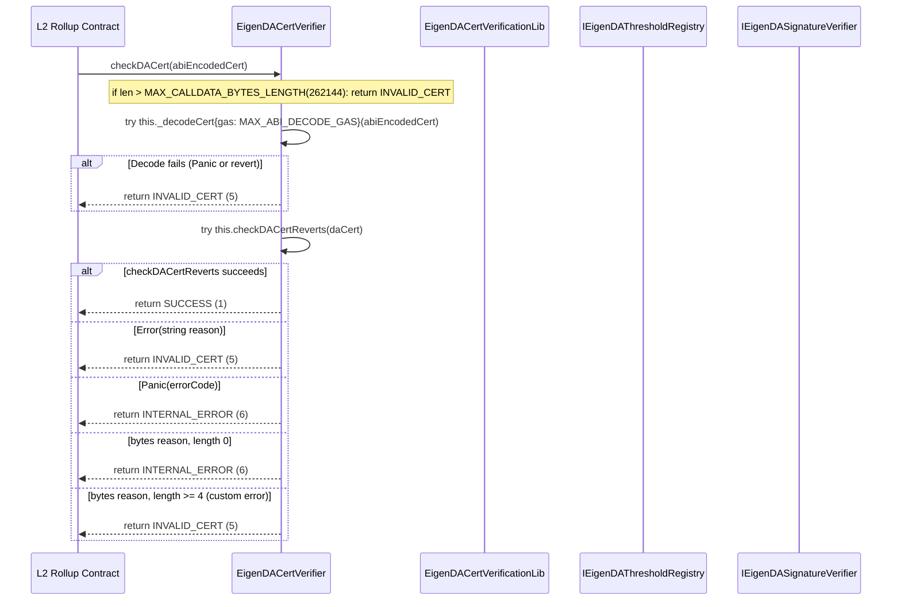
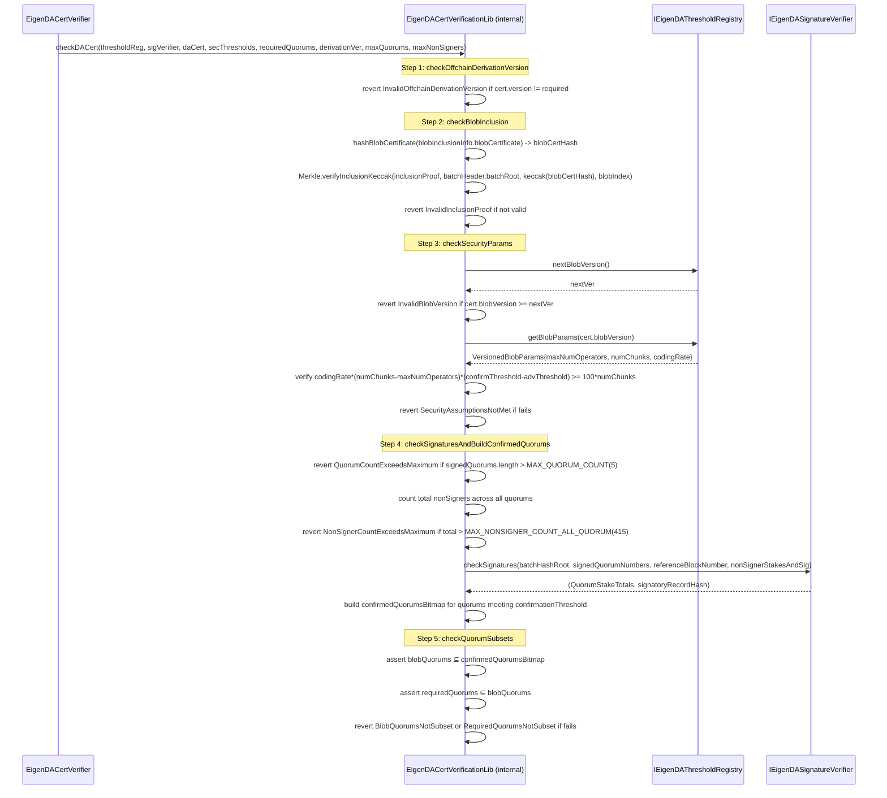
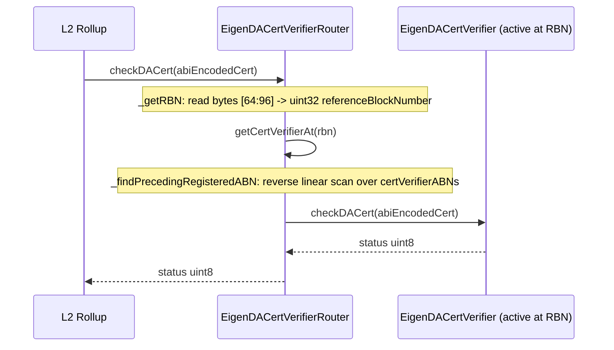
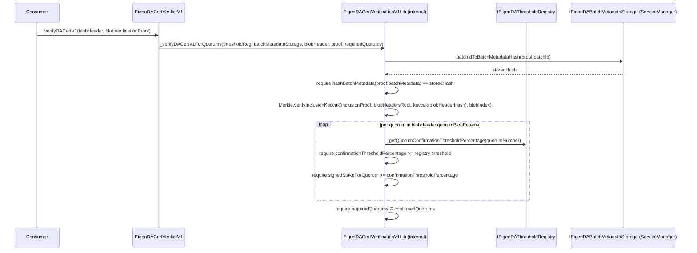
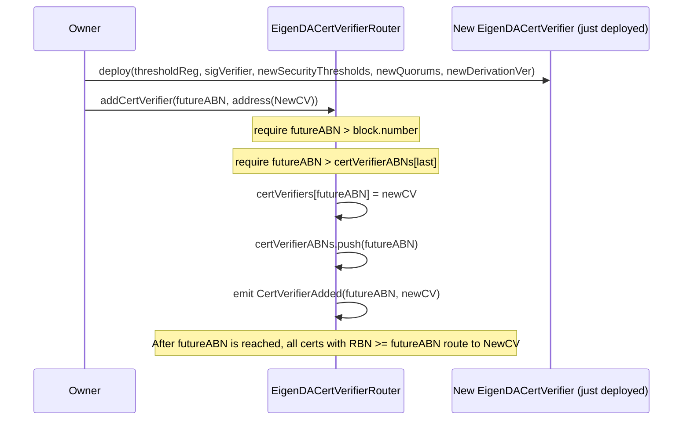

# contracts-integrations Analysis

**Analyzed by**: code-analyzer-solidity
**Timestamp**: 2026-04-08T00:00:00Z
**Application Type**: solidity-contract
**Classification**: library
**Location**: contracts/src/integrations

## Architecture

The integrations layer provides the certificate verification contracts that L2 rollups and other consumers embed or call to confirm that a blob was correctly dispersed and attested by the EigenDA operator network. The layer is organized around a single concern: given an EigenDA certificate (an ABI-encoded struct containing a batch header, blob inclusion proof, BLS non-signer data, and signed quorum numbers), verify that the certificate is valid against the current protocol security configuration.

The architecture is explicitly multi-version and upgrade-safe. Three distinct certificate format generations are supported in the same codebase: V1 (uses `batchIdToBatchMetadataHash` on the service manager), V2 (uses direct BLS signature verification against `BatchHeaderV2` with Merkle inclusion proofs), and V4 (the current generation, which adds an `offchainDerivationVersion` field for versioning off-chain derivation logic). V3 is not represented by a standalone verifier contract, only as a type in `EigenDACertTypes`.

The central design principle for V4 is **non-reverting verification**: `EigenDACertVerifier.checkDACert()` is designed to never revert on invalid input, instead returning a typed `StatusCode` integer. This is a deliberate choice to support: (a) ZK proving via Risc0's Steel library, which cannot handle reverting view calls; and (b) optimistic rollup one-step fraud provers. Invalid certs return `INVALID_CERT (5)`, bugs or panics return `INTERNAL_ERROR (6)`, and success returns `SUCCESS (1)`. The non-reverting contract wraps the reverting `checkDACertReverts()` in a multi-layered `try/catch` that distinguishes between `Error(string)` (legacy require strings), `Panic(uint256)` (bugs), zero-length reverts (low-level EVM failures), and custom errors (ABI-encoded custom revert types from the cert verification library).

The `EigenDACertVerifierRouter` introduces a time-indexed upgrade path: it maintains an ordered list of Activation Block Numbers (ABNs), each mapped to a specific `certVerifier` contract address. On each `checkDACert()` call, the router reads the Reference Block Number (RBN) from the certificate bytes (at offset 64:96), looks up the preceding registered ABN, and delegates to the corresponding verifier. This allows protocol operators to deploy a new `EigenDACertVerifier` with updated security parameters and schedule its activation in advance, without requiring rollup integrators to update their contract addresses. The `CertVerifierRouterFactory` provides atomic deploy-plus-initialize to prevent frontrun attacks on the `initialize()` transaction.

All V4 verifier contracts are **immutable** (no proxy, no upgradeable inheritance). Security parameters — `securityThresholds`, `quorumNumbersRequired`, and `offchainDerivationVersion` — are baked into constructor arguments. This is a deliberate choice: changing verification parameters requires deploying a new verifier and routing to it via the `EigenDACertVerifierRouter`.

## Key Components

- **EigenDACertVerifier** (`contracts/src/integrations/cert/EigenDACertVerifier.sol`): The current-generation (V4) immutable cert verifier. Holds `_eigenDAThresholdRegistry` and `_eigenDASignatureVerifier` as immutable references, along with `_securityThresholds`, `_quorumNumbersRequired`, and `_offchainDerivationVersion`. Exposes `checkDACert(bytes calldata abiEncodedCert)` (non-reverting, returns `StatusCode`) and `checkDACertReverts(EigenDACertV4 calldata)` (reverting, used internally). Implements `IEigenDACertVerifier`, `IEigenDACertVerifierBase`, `IVersionedEigenDACertVerifier`, and `IEigenDASemVer` (v4.0.0). Enforces hard caps: `MAX_CALLDATA_BYTES_LENGTH = 262144`, `MAX_ABI_DECODE_GAS = 2097152`, `MAX_QUORUM_COUNT = 5`, `MAX_NONSIGNER_COUNT_ALL_QUORUM = 415`.

- **EigenDACertVerificationLib** (`contracts/src/integrations/cert/libraries/EigenDACertVerificationLib.sol`): The stateless verification logic library for V4 certs. Implements the full four-step verification pipeline: `checkOffchainDerivationVersion`, `checkBlobInclusion` (Merkle proof via `Merkle.verifyInclusionKeccak`), `checkSecurityParams` (validates blob version and security threshold math), and `checkSignaturesAndBuildConfirmedQuorums` (delegates to `IEigenDASignatureVerifier.checkSignatures`, then enforces `confirmationThreshold` per quorum). Also provides `checkQuorumSubsets` which enforces `requiredQuorums ⊆ blobQuorums ⊆ confirmedQuorums`. Contains a helper `getNonSignerStakesAndSignature()` for constructing the non-signer data from a `SignedBatch` using `OperatorStateRetriever`.

- **EigenDACertVerifierRouter** (`contracts/src/integrations/cert/router/EigenDACertVerifierRouter.sol`): Upgradeable (OwnableUpgradeable) router that delegates `checkDACert()` to the appropriate immutable `EigenDACertVerifier` based on the certificate's Reference Block Number. Maintains `certVerifiers: mapping(uint32 => address)` and `certVerifierABNs: uint32[]` (ascending). Reads RBN from raw cert bytes at offset 64:96. New verifiers can only be added with a future ABN greater than all existing ABNs, preventing retroactive routing changes.

- **CertVerifierRouterFactory** (`contracts/src/integrations/cert/router/CertVerifierRouterFactory.sol`): Atomic factory for deploying and initializing an `EigenDACertVerifierRouter` in a single transaction. Prevents frontrunning the `initialize()` call on a bare router.

- **EigenDACertTypes** (`contracts/src/integrations/cert/EigenDACertTypes.sol`): Defines the `EigenDACertV3` and `EigenDACertV4` certificate structs. Both contain: `BatchHeaderV2 batchHeader`, `BlobInclusionInfo blobInclusionInfo`, `NonSignerStakesAndSignature nonSignerStakesAndSignature`, `bytes signedQuorumNumbers`. V4 additionally carries `uint16 offchainDerivationVersion`. Documents that RBN must be located at ABI offset 32:64 (padded) for the router's raw-bytes extraction to work.

- **EigenDACertVerifierV1** (`contracts/src/integrations/cert/legacy/v1/EigenDACertVerifierV1.sol`): Legacy verifier for V1 protocol certificates. Immutable, holds `eigenDAThresholdRegistryV1` and `eigenDABatchMetadataStorageV1` (the `EigenDAServiceManager` acting as batch metadata storage). Exposes `verifyDACertV1()` and `verifyDACertsV1()` (batch variant), which revert on invalid certs. Verification uses `EigenDACertVerificationV1Lib`, which checks the stored `batchIdToBatchMetadataHash` entry, validates the Merkle inclusion proof, and validates per-quorum confirmation thresholds.

- **EigenDACertVerificationV1Lib** (`contracts/src/integrations/cert/legacy/v1/EigenDACertVerificationV1Lib.sol`): V1 certificate verification logic. Verifies: (1) `hashBatchMetadata(blobVerificationProof.batchMetadata) == serviceManager.batchIdToBatchMetadataHash(batchId)`; (2) Merkle inclusion of blob header hash in `blobHeadersRoot`; (3) confirmation threshold per quorum; (4) required quorums are a subset of confirmed quorums.

- **EigenDACertVerifierV2** (`contracts/src/integrations/cert/legacy/v2/EigenDACertVerifierV2.sol`): Legacy verifier for V2 protocol certificates. Immutable, holds `eigenDAThresholdRegistryV2`, `eigenDASignatureVerifierV2`, `operatorStateRetrieverV2`, `registryCoordinatorV2`. Exposes three entry points: `verifyDACertV2()` (reverting), `verifyDACertV2FromSignedBatch()` (accepts a `SignedBatch` directly), and `verifyDACertV2ForZKProof()` (non-reverting bool return for ZK proofs). Internal protected virtual accessors allow derived contracts to override dependency resolution.

- **EigenDACertVerificationV2Lib** (`contracts/src/integrations/cert/legacy/v2/EigenDACertVerificationV2Lib.sol`): V2 certificate verification logic. Similar to V4 but for `EigenDACertV3`-era cert format. Provides `verifyDACertV2`, `verifyDACertV2FromSignedBatch`, `checkDACertV2` (non-reverting, returns `StatusCode`), and `getNonSignerStakesAndSignature` (derives stakes from `SignedBatch` via `OperatorStateRetriever`).

- **IEigenDACertVerifierBase** (`contracts/src/integrations/cert/interfaces/IEigenDACertVerifierBase.sol`): Root verification interface. Single function: `checkDACert(bytes calldata abiEncodedCert) external view returns (uint8 status)`. Explicitly documents that this function must never revert.

- **IEigenDACertVerifier** (`contracts/src/integrations/cert/interfaces/IEigenDACertVerifier.sol`): Extends `IEigenDACertVerifierBase` with getter accessors: `eigenDAThresholdRegistry()`, `eigenDASignatureVerifier()`, `securityThresholds()`, `quorumNumbersRequired()`, `offchainDerivationVersion()`.

- **IEigenDACertVerifierRouter** (`contracts/src/integrations/cert/interfaces/IEigenDACertVerifierRouter.sol`): Extends `IEigenDACertVerifierBase` with `getCertVerifierAt(uint32 referenceBlockNumber) external view returns (address)`.

- **IVersionedEigenDACertVerifier** (`contracts/src/integrations/cert/interfaces/IVersionedEigenDACertVerifier.sol`): Adds `certVersion() external pure returns (uint8)` to identify cert format versions.

- **IEigenDACertTypeBindings** (`contracts/src/integrations/cert/interfaces/IEigenDACertTypeBindings.sol`): Marks a contract as binding a specific EigenDA certificate type, for type-safe integrations.

- **IEigenDACertVerifierLegacy** (`contracts/src/integrations/cert/legacy/IEigenDACertVerifierLegacy.sol`): Legacy verifier interface combining V1 and V2 function signatures for backward-compatible consumers.

## Data Flows

### 1. V4 Certificate Verification — Non-Reverting Path

**Flow Description**: A rollup contract calls `checkDACert()` to verify a V4 EigenDA certificate, receiving a status code without the call reverting regardless of cert validity.



---

### 2. V4 Certificate Verification — Reverting Inner Path

**Flow Description**: The detailed four-step cert verification pipeline, called internally by `checkDACert` via `checkDACertReverts`. Reverts on any invalid condition.



---

### 3. Router-Based Certificate Verification

**Flow Description**: A rollup integrated with the `EigenDACertVerifierRouter` submits a cert; the router dispatches to the correct versioned verifier based on the cert's Reference Block Number.



---

### 4. V1 Certificate Verification (Legacy)

**Flow Description**: A consumer verifying a legacy V1 EigenDA blob cert against the service manager's stored batch metadata hash.



---

### 5. New Cert Verifier Activation via Router

**Flow Description**: Protocol governance deploys a new `EigenDACertVerifier` with updated parameters and schedules its activation in the router.



## Dependencies

### External Libraries

- **OpenZeppelin Contracts Upgradeable** (openzeppelin-contracts-upgradeable) [access-control, upgradeability]: Provides `OwnableUpgradeable` used by `EigenDACertVerifierRouter`.
  Imported in: `EigenDACertVerifierRouter.sol`.

- **eigenlayer-middleware** (eigenlayer-middleware) [avs-framework]: Provides `BN254` (BLS G1/G2 point types and hashing), `Merkle` (Keccak Merkle inclusion proof verification), `BitmapUtils` (quorum bitmap set operations), `OperatorStateRetriever` (for building `NonSignerStakesAndSignature` from `SignedBatch`), `IRegistryCoordinator`.
  Imported in: `EigenDACertVerificationLib.sol`, `EigenDACertVerificationV1Lib.sol`, `EigenDACertVerifierV2.sol`, `EigenDACertVerificationV2Lib.sol`.

### Internal Libraries (from contracts-core)

- **EigenDATypesV1** (`contracts/src/core/libraries/v1/EigenDATypesV1.sol`): `BlobHeader`, `BatchHeader`, `BatchMetadata`, `BlobVerificationProof`, `NonSignerStakesAndSignature`, `QuorumStakeTotals`, `SecurityThresholds`, `VersionedBlobParams`. Used pervasively across all cert verifiers.

- **EigenDATypesV2** (`contracts/src/core/libraries/v2/EigenDATypesV2.sol`): `BatchHeaderV2`, `BlobHeaderV2`, `BlobCertificate`, `BlobInclusionInfo`, `BlobCommitment`, `SignedBatch`, `Attestation`. Used by V2/V4 verifiers for the current certificate format.

- **IEigenDAThresholdRegistry** (`contracts/src/core/interfaces/IEigenDAThresholdRegistry.sol`): Called by `EigenDACertVerificationLib.checkSecurityParams()` for `nextBlobVersion()` and `getBlobParams()`, and by V1 verifiers for threshold percentage lookups.

- **IEigenDASignatureVerifier** (`contracts/src/core/interfaces/IEigenDASignatureVerifier.sol`): Called by `EigenDACertVerificationLib.checkSignaturesAndBuildConfirmedQuorums()` for `checkSignatures()`.

- **IEigenDABatchMetadataStorage** (`contracts/src/core/interfaces/IEigenDABatchMetadataStorage.sol`): Called by `EigenDACertVerificationV1Lib` for `batchIdToBatchMetadataHash()`. Implemented by `EigenDAServiceManager`.

- **IEigenDASemVer** (`contracts/src/core/interfaces/IEigenDASemVer.sol`): Implemented by `EigenDACertVerifier` (v4.0.0).

## API Surface

### EigenDACertVerifier (V4, Current)

**`checkDACert(bytes calldata abiEncodedCert) external view returns (uint8)`**
Non-reverting. ABI-decodes the cert, calls `checkDACertReverts` internally via try/catch. Returns `StatusCode`:
- `1 = SUCCESS`
- `5 = INVALID_CERT` (bad cert data, failed requires, custom error reverts)
- `6 = INTERNAL_ERROR` (Solidity panics, low-level EVM reverts — indicates a bug)

**`checkDACertReverts(EigenDACertV4 calldata daCert) external view`**
Reverting variant. Calls `EigenDACertVerificationLib.checkDACert()` directly. Useful for contracts that prefer reverting behavior.

**`eigenDAThresholdRegistry() external view returns (IEigenDAThresholdRegistry)`**

**`eigenDASignatureVerifier() external view returns (IEigenDASignatureVerifier)`**

**`securityThresholds() external view returns (DATypesV1.SecurityThresholds memory)`**

**`quorumNumbersRequired() external view returns (bytes memory)`**

**`offchainDerivationVersion() external view returns (uint16)`**

**`certVersion() external pure returns (uint8)`** — Returns `4`.

**`semver() external pure returns (uint8 major, uint8 minor, uint8 patch)`** — Returns `(4, 0, 0)`.

---

### EigenDACertVerifierRouter

**`checkDACert(bytes calldata abiEncodedCert) external view returns (uint8)`**
Dispatches to the cert verifier active at the cert's RBN. Returns the status from that verifier.

**`getCertVerifierAt(uint32 referenceBlockNumber) public view returns (address)`**
Returns the verifier address active at a given block number.

**`addCertVerifier(uint32 activationBlockNumber, address certVerifier) external onlyOwner`**
Schedules a new cert verifier. `activationBlockNumber` must be strictly greater than the current block and all previously registered ABNs. Emits `CertVerifierAdded(activationBlockNumber, certVerifier)`.

**`initialize(address initialOwner, uint32[] memory initABNs, address[] memory initCertVerifiers) external initializer`**

**`certVerifiers(uint32) public view returns (address)`** — Direct ABN-to-verifier mapping accessor.

**`certVerifierABNs(uint256) public view returns (uint32)`** — Ordered ABN list accessor.

---

### CertVerifierRouterFactory

**`deploy(address initialOwner, uint32[] memory initABNs, address[] memory initialCertVerifiers) external returns (EigenDACertVerifierRouter)`**
Atomically deploys and initializes a new router.

---

### EigenDACertVerifierV1 (Legacy)

**`verifyDACertV1(BlobHeader calldata blobHeader, BlobVerificationProof calldata blobVerificationProof) external view`**
Reverting. Validates V1 cert against stored batch metadata hash.

**`verifyDACertsV1(BlobHeader[] calldata blobHeaders, BlobVerificationProof[] calldata blobVerificationProofs) external view`**
Batch variant.

---

### EigenDACertVerifierV2 (Legacy)

**`verifyDACertV2(BatchHeaderV2 calldata, BlobInclusionInfo calldata, NonSignerStakesAndSignature calldata, bytes memory signedQuorumNumbers) external view`**
Reverting V2 verification.

**`verifyDACertV2FromSignedBatch(SignedBatch calldata, BlobInclusionInfo calldata) external view`**
Accepts a `SignedBatch` struct directly; derives `NonSignerStakesAndSignature` from `OperatorStateRetriever`.

**`verifyDACertV2ForZKProof(BatchHeaderV2 calldata, BlobInclusionInfo calldata, NonSignerStakesAndSignature calldata, bytes memory) external view returns (bool)`**
Non-reverting bool variant for ZK proof systems.

**`getNonSignerStakesAndSignature(SignedBatch calldata) external view returns (NonSignerStakesAndSignature memory)`**

## Code Examples

### Example 1: V4 Non-Reverting Try/Catch Pattern

```solidity
// contracts/src/integrations/cert/EigenDACertVerifier.sol

function checkDACert(bytes calldata abiEncodedCert) external view returns (uint8) {
    if (abiEncodedCert.length > MAX_CALLDATA_BYTES_LENGTH) {
        return uint8(StatusCode.INVALID_CERT);
    }

    CT.EigenDACertV4 memory daCert;
    try this._decodeCert{gas: MAX_ABI_DECODE_GAS}(abiEncodedCert) returns (CT.EigenDACertV4 memory _daCert) {
        daCert = _daCert;
    } catch {
        return uint8(StatusCode.INVALID_CERT);
    }

    try this.checkDACertReverts(daCert) {
        return uint8(StatusCode.SUCCESS);
    } catch Error(string memory) {
        return uint8(StatusCode.INVALID_CERT);    // legacy require string reverts
    } catch Panic(uint256) {
        return uint8(StatusCode.INTERNAL_ERROR);  // arithmetic overflows, panics = bugs
    } catch (bytes memory reason) {
        if (reason.length == 0) {
            return uint8(StatusCode.INTERNAL_ERROR);  // low-level EVM revert (OOG, etc.)
        } else if (reason.length < 4) {
            return uint8(StatusCode.INTERNAL_ERROR);
        }
        return uint8(StatusCode.INVALID_CERT);    // custom error reverts = invalid cert
    }
}
```

### Example 2: Security Threshold Math in EigenDACertVerificationLib

```solidity
// contracts/src/integrations/cert/libraries/EigenDACertVerificationLib.sol

// Security condition: the system is secure iff:
// codingRate * (numChunks - maxNumOperators) * (confirmThreshold - adversaryThreshold) >= 100 * numChunks
// This ensures sufficient erasure-coded chunks remain retrievable even if adversaryThreshold% of operators are byzantine.

uint256 lhs = blobParams.codingRate * (blobParams.numChunks - blobParams.maxNumOperators)
    * (securityThresholds.confirmationThreshold - securityThresholds.adversaryThreshold);
uint256 rhs = 100 * blobParams.numChunks;

if (!(lhs >= rhs)) {
    revert SecurityAssumptionsNotMet(
        securityThresholds.confirmationThreshold,
        securityThresholds.adversaryThreshold,
        blobParams.codingRate,
        blobParams.numChunks,
        blobParams.maxNumOperators
    );
}
```

### Example 3: Router RBN Extraction from Raw Cert Bytes

```solidity
// contracts/src/integrations/cert/router/EigenDACertVerifierRouter.sol

function _getRBN(bytes calldata certBytes) internal pure returns (uint32) {
    // EigenDACertV4 ABI encoding layout:
    //   0:32   = pointer to struct (offset 32)
    //   32:64  = batchRoot (first field of BatchHeaderV2)
    //   64:96  = referenceBlockNumber (second field of BatchHeaderV2, padded to 32 bytes)
    if (certBytes.length < 96) {
        revert InvalidCertLength();
    }
    return abi.decode(certBytes[64:96], (uint32));
}
```

### Example 4: Quorum Subset Enforcement

```solidity
// contracts/src/integrations/cert/libraries/EigenDACertVerificationLib.sol

// The invariant enforced: requiredQuorums ⊆ blobQuorums ⊆ confirmedQuorums ⊆ signedQuorums
// confirmedQuorums = quorums that met the confirmationThreshold from the signature check.

function checkQuorumSubsets(
    bytes memory requiredQuorumNumbers,
    bytes memory blobQuorumNumbers,
    uint256 confirmedQuorumsBitmap
) internal pure {
    uint256 blobQuorumsBitmap = BitmapUtils.orderedBytesArrayToBitmap(blobQuorumNumbers);
    if (!BitmapUtils.isSubsetOf(blobQuorumsBitmap, confirmedQuorumsBitmap)) {
        revert BlobQuorumsNotSubset(blobQuorumsBitmap, confirmedQuorumsBitmap);
    }
    uint256 requiredQuorumsBitmap = BitmapUtils.orderedBytesArrayToBitmap(requiredQuorumNumbers);
    if (!BitmapUtils.isSubsetOf(requiredQuorumsBitmap, blobQuorumsBitmap)) {
        revert RequiredQuorumsNotSubset(requiredQuorumsBitmap, blobQuorumsBitmap);
    }
}
```

### Example 5: Blob Inclusion Merkle Verification

```solidity
// contracts/src/integrations/cert/libraries/EigenDACertVerificationLib.sol

function checkBlobInclusion(
    DATypesV2.BatchHeaderV2 memory batchHeader,
    DATypesV2.BlobInclusionInfo memory blobInclusionInfo
) internal pure {
    bytes32 blobCertHash = hashBlobCertificate(blobInclusionInfo.blobCertificate);
    bytes32 encodedBlobHash = keccak256(abi.encodePacked(blobCertHash));
    bytes32 rootHash = batchHeader.batchRoot;

    bool isValid = Merkle.verifyInclusionKeccak(
        blobInclusionInfo.inclusionProof, rootHash, encodedBlobHash, blobInclusionInfo.blobIndex
    );

    if (!isValid) {
        revert InvalidInclusionProof(blobInclusionInfo.blobIndex, encodedBlobHash, rootHash);
    }
}
// The double-hash (keccak of keccak) prevents second-preimage attacks on Merkle leaf nodes.
```

## Files Analyzed

- `contracts/src/integrations/cert/EigenDACertVerifier.sol` (222 lines) - V4 immutable cert verifier
- `contracts/src/integrations/cert/EigenDACertTypes.sol` (30 lines) - V3/V4 cert struct definitions
- `contracts/src/integrations/cert/libraries/EigenDACertVerificationLib.sol` (353 lines) - V4 cert verification logic library
- `contracts/src/integrations/cert/router/EigenDACertVerifierRouter.sol` (118 lines) - ABN-indexed routing
- `contracts/src/integrations/cert/router/CertVerifierRouterFactory.sol` (17 lines) - Atomic factory
- `contracts/src/integrations/cert/interfaces/IEigenDACertVerifierBase.sol` (12 lines) - Base non-reverting interface
- `contracts/src/integrations/cert/interfaces/IEigenDACertVerifier.sol` (29 lines) - Full V4 verifier interface
- `contracts/src/integrations/cert/interfaces/IEigenDACertVerifierRouter.sol` (10 lines) - Router interface
- `contracts/src/integrations/cert/interfaces/IVersionedEigenDACertVerifier.sol` - Version interface
- `contracts/src/integrations/cert/interfaces/IEigenDACertTypeBindings.sol` - Type binding marker interface
- `contracts/src/integrations/cert/legacy/IEigenDACertVerifierLegacy.sol` - Legacy combined interface
- `contracts/src/integrations/cert/legacy/v1/EigenDACertVerifierV1.sol` (100 lines) - V1 legacy verifier
- `contracts/src/integrations/cert/legacy/v1/EigenDACertVerificationV1Lib.sol` (244 lines) - V1 verification library
- `contracts/src/integrations/cert/legacy/v2/EigenDACertVerifierV2.sol` (184 lines) - V2 legacy verifier
- `contracts/src/integrations/cert/legacy/v2/EigenDACertVerificationV2Lib.sol` - V2 verification library

## Analysis Notes

### Security Considerations

1. **Non-Reverting Contract Design**: The `checkDACert` function is carefully designed never to revert, which is critical for ZK proving pipelines. The multi-layered try/catch distinguishes bugs (`INTERNAL_ERROR`) from invalid inputs (`INVALID_CERT`). However, this means callers **must** check the return value — a rollup that ignores the return status and assumes success would accept invalid certs. Rollup derivation pipelines should treat any non-`SUCCESS` status as cert rejection.

2. **Calldata Size and Gas Caps**: `MAX_CALLDATA_BYTES_LENGTH = 262144` (256 KB) and `MAX_ABI_DECODE_GAS = 2097152` (~2M gas) are hard caps that prevent a malicious party from submitting a cert that causes an out-of-gas condition during ABI decode, which would otherwise appear as an `INTERNAL_ERROR` rather than `INVALID_CERT`. This protects honest parties from being unable to prove cert invalidity.

3. **ABN Frontrunning Prevention**: The `EigenDACertVerifierRouter` requires new ABNs to be strictly in the future and strictly greater than the last registered ABN. This prevents a malicious owner from inserting a verifier that retroactively routes past certs to a different (weaker) verifier. The `CertVerifierRouterFactory` prevents frontrunning on initialization. The documentation recommends additional protections (timelock, multisig) to prevent a compromised owner from adding a cert verifier with an ABN so close to the current block that integrators cannot react.

4. **Immutable Verifier Parameters**: All V4 verifier parameters (`securityThresholds`, `quorumNumbersRequired`, `offchainDerivationVersion`) are set at construction and cannot change. This is intentional — it provides strong guarantees to rollup operators that the verifier they deployed against will not change behavior. Upgrading parameters requires a new deployment and ABN registration in the router.

5. **`tx.origin` Not Used**: Unlike `EigenDAServiceManager`, the cert verifiers do not use `tx.origin` checks. They are designed to be called from smart contracts (L2 rollup contracts, bridge contracts, etc.), which is the primary integration pattern.

6. **Quorum Subset Invariant**: The enforced chain `requiredQuorums ⊆ blobQuorums ⊆ confirmedQuorums ⊆ signedQuorums` is the core security invariant. An attacker cannot fabricate a cert for a quorum they didn't sign if the bitmap arithmetic is correct. The BN254 BLS signature verification is the cryptographic root of trust.

### Performance Characteristics

- **`checkDACert` Gas Profile**: The dominant cost is the BLS signature verification call to `IEigenDASignatureVerifier.checkSignatures()` which performs BN254 pairing operations. The Merkle inclusion proof verification is O(depth) with keccak hashes. Security parameter math is O(1). Total gas will be in the hundreds of thousands, dominated by BLS pairing.
- **Router ABN Lookup**: `_findPrecedingRegisteredABN` is an O(n) reverse linear scan over `certVerifierABNs`. Since ABN entries accumulate only when the protocol deploys new verifier versions (expected to be infrequent — perhaps annually), n will remain very small (single digits to low tens).
- **`MAX_NONSIGNER_COUNT_ALL_QUORUM = 415`**: This cap limits the BLS key aggregation work and is a fixed upper bound on non-signer count across all quorums. It bounds the `checkSignatures` gas cost.

### Scalability Notes

- **Version Evolution Path**: The cert format versioning (`EigenDACertV3`, `EigenDACertV4`, potentially future `EigenDACertV5`) combined with router-based routing makes the protocol forward-compatible. New cert versions can be deployed without breaking rollups that integrated the router address.
- **ZK Proof Compatibility**: The `checkDACert` non-reverting design was explicitly architected for Risc0's Steel ZK proving library. This opens a path for rollups to prove cert validity (or invalidity) in a ZK circuit, which could be used for ZK-rollup settlement or fraud proofs.
- **Legacy Verifier Maintenance**: The V1 and V2 verifiers are flagged as legacy. V1 is explicitly noted as "soon-to-be deprecated". Rollup operators on V1/V2 should plan migration to `EigenDACertVerifierRouter` pointing to V4 verifiers.
