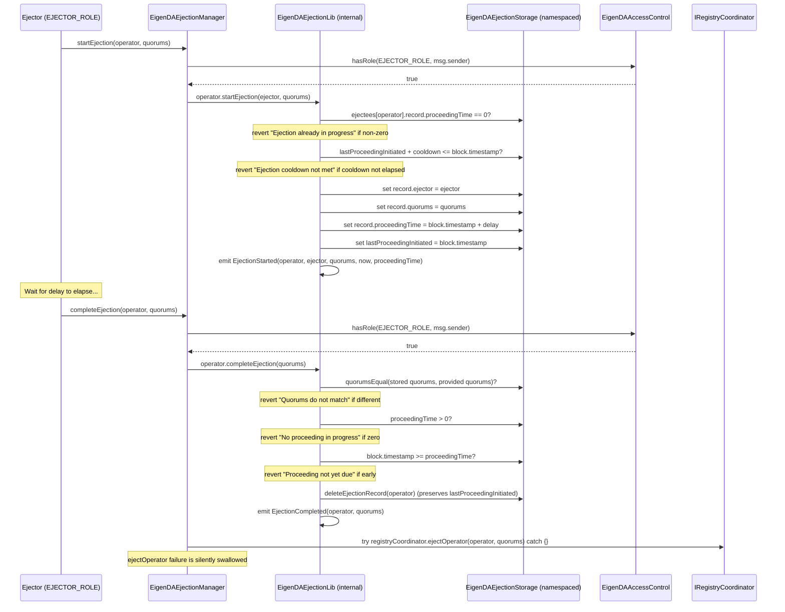
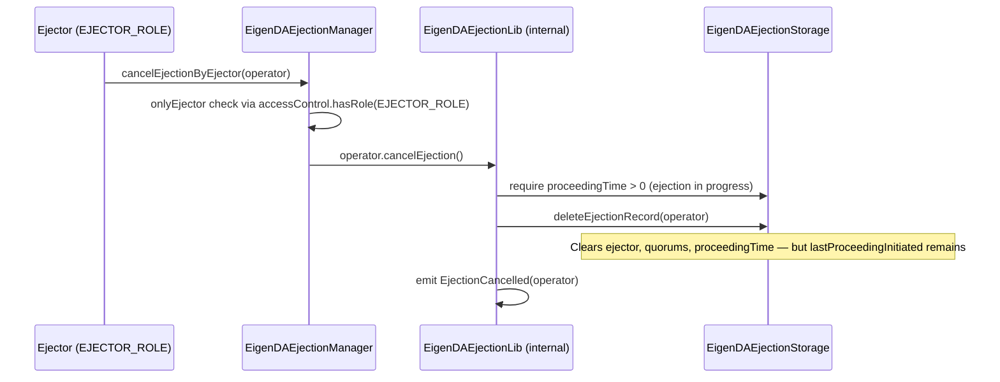
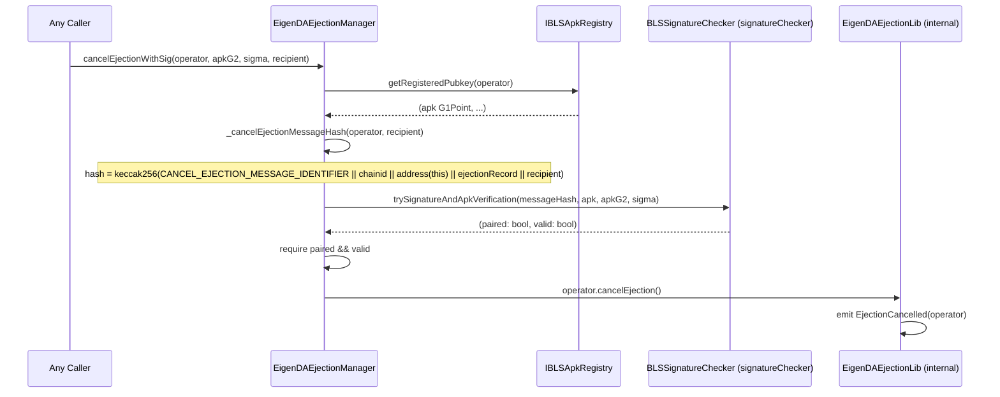
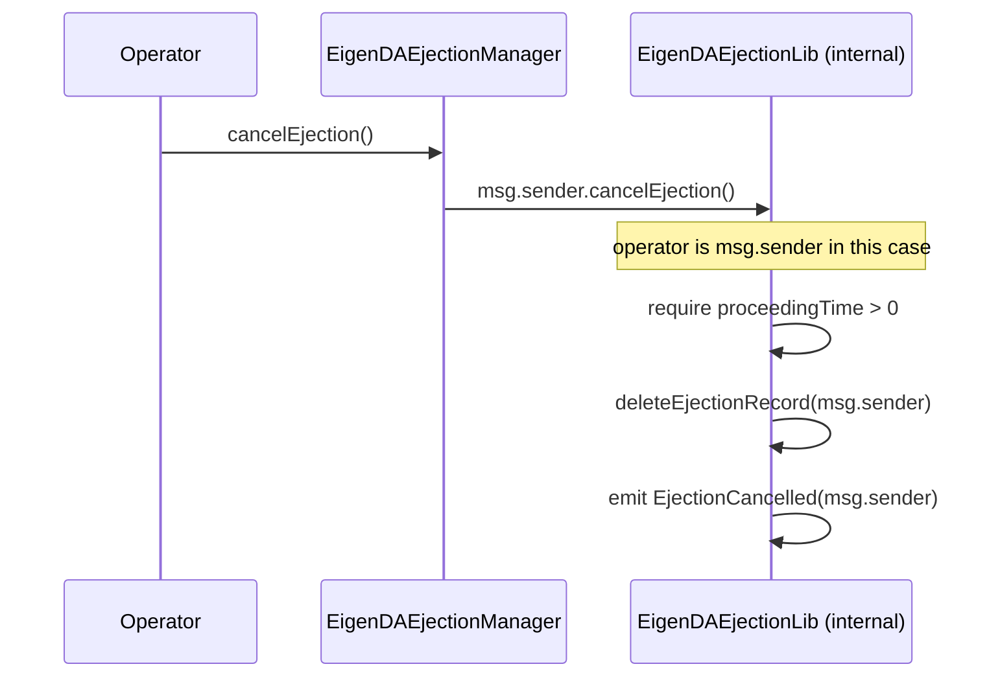
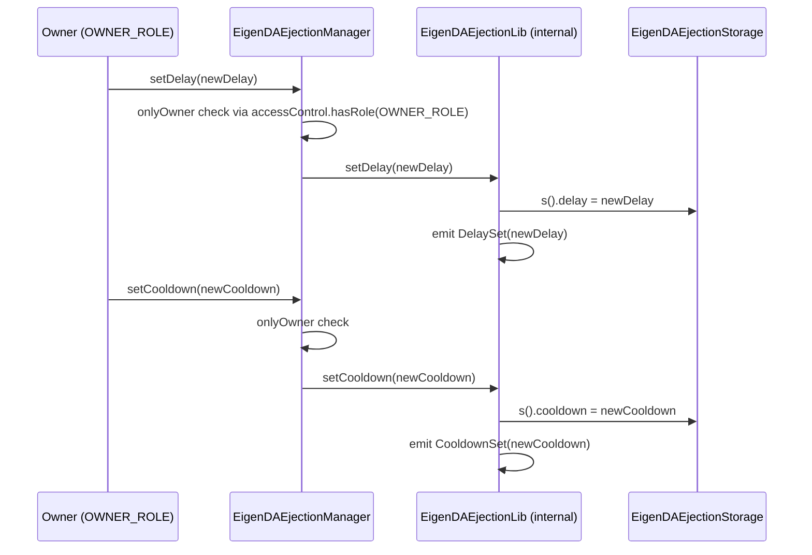

# contracts-periphery Analysis

**Analyzed by**: code-analyzer-solidity
**Timestamp**: 2026-04-08T00:00:00Z
**Application Type**: solidity-contract
**Classification**: service
**Location**: contracts/src/periphery

## Architecture

The periphery layer contains a single contract family: the `EigenDAEjectionManager`, which manages the lifecycle of operator ejections from EigenDA quorums. This is a governance and operator management subsystem — it does not participate in the data availability hot path (blob submission, confirmation, or cert verification) but instead provides a controlled mechanism to remove misbehaving or underperforming operators from the operator set.

The architecture of the ejection manager is distinguished from the core V1/V2 contracts by its use of the V3 contract patterns: it uses namespaced diamond-storage (via `EigenDAEjectionStorage`), a custom `InitializableLib` (no OpenZeppelin `Initializable` inheritance, avoiding storage representation conflicts), and resolves its access control and dependency addresses at runtime via immutable constructor arguments rather than via `AddressDirectoryLib`. This reflects a deliberate design choice: callee dependencies (access control, BLS APK registry, signature checker, registry coordinator) are baked in as immutable constructor arguments and stored in `ImmutableEigenDAEjectionsStorage`, while mutable protocol parameters (delay, cooldown) are stored in the namespaced storage slot.

The ejection lifecycle follows a three-phase delayed dispute pattern: **start → wait → complete**, with a cancellation path available throughout. This design gives challenged operators time to respond and lets any party prove bad ejections. The delay between `startEjection` and `completeEjection` is configurable (`ejectionDelay`) and provides a grace window in which either an ejector can cancel (via `cancelEjectionByEjector`), or the operator themselves can cancel (via self-call `cancelEjection()` or BLS-signature-authorized `cancelEjectionWithSig()`). A cooldown (`ejectionCooldown`) prevents spam by enforcing a minimum interval between ejection initiations for the same operator.

Access control uses the `EigenDAAccessControl` contract from core, checking `OWNER_ROLE` for administrative functions and `EJECTOR_ROLE` for ejector functions at runtime via `IAccessControl.hasRole()`.

## Key Components

- **EigenDAEjectionManager** (`contracts/src/periphery/ejection/EigenDAEjectionManager.sol`): Main contract implementing the ejection lifecycle. Inherits `ImmutableEigenDAEjectionsStorage` (which holds the four immutable callee references) and implements `IEigenDASemVer` (v3.0.0). The constructor bakes in dependencies (`accessControl`, `blsApkKeyRegistry`, `signatureChecker`, `registryCoordinator`) and calls `InitializableLib.setInitializedVersion(1)` to pre-initialize the implementation contract (preventing direct initialization attacks). An `initialize(delay_, cooldown_)` function sets the mutable protocol parameters in namespaced storage via `EigenDAEjectionStorage.layout()`.

- **ImmutableEigenDAEjectionsStorage** (`contracts/src/periphery/ejection/libraries/EigenDAEjectionStorage.sol`): Abstract base contract storing the four immutable callee dependencies: `IAccessControl accessControl`, `IBLSApkRegistry blsApkKeyRegistry`, `BLSSignatureChecker signatureChecker`, `IRegistryCoordinator registryCoordinator`. These cannot change after deployment.

- **EigenDAEjectionStorage** (`contracts/src/periphery/ejection/libraries/EigenDAEjectionStorage.sol`): Diamond-storage library defining the namespaced storage slot (`keccak256(keccak256("eigen.da.ejection") - 1) & ~0xff`). Stores the `Layout` struct: `mapping(address => EjecteeState) ejectees`, `uint64 delay`, `uint64 cooldown`. The slot derivation pattern ensures no collision with any other library's storage regardless of inheritance order.

- **EigenDAEjectionLib** (`contracts/src/periphery/ejection/libraries/EigenDAEjectionLib.sol`): Stateless library (relative to contract, operates on storage via `EigenDAEjectionStorage.layout()`) implementing the ejection state machine: `startEjection`, `cancelEjection`, `completeEjection`, `deleteEjectionRecord`, plus getters. Emits all ejection events. Enforces business rules: no parallel ejection for one operator (`proceedingTime == 0` check), cooldown since last ejection initiation, quorum match on completion, time delay before completion.

- **EigenDAEjectionTypes** (`contracts/src/periphery/ejection/libraries/EigenDAEjectionTypes.sol`): Data types: `EjectionRecord { ejector: address, proceedingTime: uint64, quorums: bytes }` and `EjecteeState { record: EjectionRecord, lastProceedingInitiated: uint64 }`. The separation of `record` from `lastProceedingInitiated` is deliberate: the record is fully deleted on cancellation or completion, but `lastProceedingInitiated` is preserved to enforce the cooldown even after a cancelled ejection.

- **IEigenDAEjectionManager** (`contracts/src/periphery/ejection/IEigenDAEjectionManager.sol`): Interface defining all public functions. Documents the full ejection lifecycle: `startEjection`, `cancelEjectionByEjector`, `completeEjection`, `cancelEjectionWithSig`, `cancelEjection`, plus getters: `getEjector`, `ejectionTime`, `lastEjectionInitiated`, `ejectionQuorums`, `ejectionDelay`, `ejectionCooldown`.

## Data Flows

### 1. Normal Ejection Lifecycle (Start → Complete)

**Flow Description**: An ejector initiates delayed removal of a misbehaving operator from specified quorums, waits the delay period, then completes the ejection to trigger actual deregistration.



---

### 2. Ejection Cancelled by Ejector

**Flow Description**: An ejector cancels an in-progress ejection (e.g., operator dispute resolved, false positive, or ejector error).



---

### 3. Ejection Cancelled by Operator via BLS Signature

**Flow Description**: An operator demonstrates liveness and intent by signing a cancellation message with their BLS key, allowing anyone to submit the cancellation on their behalf.



---

### 4. Operator Self-Cancellation

**Flow Description**: An operator directly cancels their own pending ejection by calling `cancelEjection()` directly.



---

### 5. Administrative Parameter Updates

**Flow Description**: Owner updates the ejection delay or cooldown parameters.



## Dependencies

### External Libraries

- **eigenlayer-middleware** (eigenlayer-middleware) [avs-framework]: Provides `IRegistryCoordinator` (for `ejectOperator()`), `IStakeRegistry`, `IBLSApkRegistry` (for `getRegisteredPubkey()`), `BLSSignatureChecker` (for `trySignatureAndApkVerification()`), and `BN254` (G1/G2 point types for BLS signatures).
  Imported in: `EigenDAEjectionManager.sol`, `EigenDAEjectionStorage.sol`.

- **OpenZeppelin Contracts** (openzeppelin-contracts) [access-control]: Provides `IAccessControl` interface used for role-based access checks at runtime.
  Imported in: `EigenDAEjectionManager.sol`, `EigenDAEjectionStorage.sol`.

### Internal Libraries (from contracts-core)

- **AddressDirectoryLib** (`contracts/src/core/libraries/v3/address-directory/AddressDirectoryLib.sol`): Imported but used via `using AddressDirectoryLib for string` — primarily for the `getKey()` extension method on string names. Used in the `using` declarations for library-based dispatch patterns.

- **AddressDirectoryConstants** (`contracts/src/core/libraries/v3/address-directory/AddressDirectoryConstants.sol`): Imported for the well-known name strings (e.g., `ACCESS_CONTROL_NAME`, `EJECTION_MANAGER_NAME`). Referenced in the ejection manager's module context.

- **AccessControlConstants** (`contracts/src/core/libraries/v3/access-control/AccessControlConstants.sol`): Provides the `OWNER_ROLE` (`keccak256("OWNER")`) and `EJECTOR_ROLE` (`keccak256("EJECTOR")`) role constants used in `_onlyOwner()` and `_onlyEjector()` checks.
  Imported in: `EigenDAEjectionManager.sol`.

- **InitializableLib** (`contracts/src/core/libraries/v3/initializable/InitializableLib.sol`): Custom initializer library using namespaced storage. Used in `EigenDAEjectionManager`'s `initializer` modifier and constructor (`setInitializedVersion(1)` to block direct initialization of the implementation contract).
  Imported in: `EigenDAEjectionManager.sol`.

- **IEigenDASemVer** (`contracts/src/core/interfaces/IEigenDASemVer.sol`): Implemented by `EigenDAEjectionManager`; `semver()` returns `(3, 0, 0)`.
  Imported in: `EigenDAEjectionManager.sol`.

## API Surface

### EigenDAEjectionManager

**Owner Functions (require `OWNER_ROLE`):**

**`setDelay(uint64 delay) external`**
Sets the number of seconds between `startEjection` and the earliest `completeEjection` call. Also defines the window an operator has to cancel. Emits `DelaySet(delay)`.

**`setCooldown(uint64 cooldown) external`**
Sets the minimum seconds between successive ejection initiations for the same operator. Prevents spam ejections. Emits `CooldownSet(cooldown)`.

---

**Ejector Functions (require `EJECTOR_ROLE`):**

**`startEjection(address operator, bytes memory quorums) external`**
Initiates a delayed ejection for `operator` from the specified `quorums`. Records `ejector`, `quorums`, and `proceedingTime = block.timestamp + delay`. Emits `EjectionStarted(operator, ejector, quorums, timestampStarted, ejectionTime)`.
Reverts if: ejection already in progress, cooldown not elapsed.

**`cancelEjectionByEjector(address operator) external`**
Cancels an in-progress ejection. Any ejector (not just the initiating ejector) may cancel. Clears ejection record but preserves `lastProceedingInitiated` for cooldown tracking. Emits `EjectionCancelled(operator)`.

**`completeEjection(address operator, bytes memory quorums) external`**
Completes an expired ejection. Requires: quorums match recorded quorums, `block.timestamp >= proceedingTime`. Clears ejection record and calls `registryCoordinator.ejectOperator(operator, quorums)` (failure silently swallowed via try/catch). Emits `EjectionCompleted(operator, quorums)`.

---

**Operator Functions (no role required):**

**`cancelEjectionWithSig(address operator, BN254.G2Point memory apkG2, BN254.G1Point memory sigma, address recipient) external`**
Allows any party to cancel an ejection on behalf of an operator who provides a valid BLS signature over the canonical cancellation message hash. The message hash binds: `CANCEL_EJECTION_MESSAGE_IDENTIFIER`, `block.chainid`, `address(this)`, current `EjectionRecord`, and `recipient`. Verifies BLS signature via `signatureChecker.trySignatureAndApkVerification()`.

**`cancelEjection() external`**
Allows an operator to cancel their own pending ejection by calling directly (no signature needed).

---

**View Functions (no access restriction):**

**`getEjector(address operator) external view returns (address)`**
Returns the ejector address for a pending ejection. Returns `address(0)` if no ejection is in progress.

**`ejectionTime(address operator) external view returns (uint64)`**
Returns the `proceedingTime` timestamp (earliest completion time) for a pending ejection.

**`lastEjectionInitiated(address operator) external view returns (uint64)`**
Returns the timestamp of the last ejection initiation. Persists after ejection is completed or cancelled, for cooldown enforcement.

**`ejectionQuorums(address operator) external view returns (bytes memory)`**
Returns the quorums bytes for a pending ejection.

**`ejectionDelay() external view returns (uint64)`**
Returns the current delay parameter.

**`ejectionCooldown() external view returns (uint64)`**
Returns the current cooldown parameter.

**`semver() external pure returns (uint8 major, uint8 minor, uint8 patch)`** — Returns `(3, 0, 0)`.

---

**Events (emitted by EigenDAEjectionLib):**

- `EjectionStarted(address indexed operator, address indexed ejector, bytes quorums, uint64 timestampStarted, uint64 ejectionTime)`
- `EjectionCancelled(address operator)`
- `EjectionCompleted(address operator, bytes quorums)`
- `DelaySet(uint64 delay)`
- `CooldownSet(uint64 cooldown)`

## Code Examples

### Example 1: Ejection State Machine — Start Enforcements

```solidity
// contracts/src/periphery/ejection/libraries/EigenDAEjectionLib.sol

function startEjection(address operator, address ejector, bytes memory quorums) internal {
    EigenDAEjectionTypes.EjecteeState storage ejectee = getEjectee(operator);

    // Prevents parallel ejections for the same operator
    require(ejectee.record.proceedingTime == 0, "Ejection already in progress");
    // Prevents spam: cooldown must have elapsed since last ejection initiation
    require(ejectee.lastProceedingInitiated + s().cooldown <= block.timestamp, "Ejection cooldown not met");

    ejectee.record.ejector = ejector;
    ejectee.record.quorums = quorums;
    ejectee.record.proceedingTime = uint64(block.timestamp) + s().delay;
    // Record initiation time NOW (before record is potentially cleared) for cooldown enforcement
    ejectee.lastProceedingInitiated = uint64(block.timestamp);
    emit EjectionStarted(operator, ejector, quorums, ejectee.lastProceedingInitiated, ejectee.record.proceedingTime);
}
```

### Example 2: Silent Failure on Actual Ejection

```solidity
// contracts/src/periphery/ejection/EigenDAEjectionManager.sol

function _tryEjectOperator(address operator, bytes memory quorums) internal {
    try registryCoordinator.ejectOperator(operator, quorums) {} catch {}
}
// The try/catch swallows all errors from the actual registry ejection.
// This is intentional: the ejection record is cleared before the try/catch,
// so the on-chain state is always consistent regardless of registry outcome.
// Off-chain systems can observe EjectionCompleted events to know the ejection
// proceeded and separately monitor operator status in the registry.
```

### Example 3: BLS Signature Cancellation Message Hash

```solidity
// contracts/src/periphery/ejection/EigenDAEjectionManager.sol

bytes32 internal constant CANCEL_EJECTION_MESSAGE_IDENTIFIER = keccak256(
    "CancelEjection(address operator,uint64 proceedingTime,uint64 lastProceedingInitiated,bytes quorums,address recipient)"
);

function _cancelEjectionMessageHash(address operator, address recipient) internal view returns (bytes32) {
    return keccak256(
        abi.encode(
            CANCEL_EJECTION_MESSAGE_IDENTIFIER,
            block.chainid,        // replay protection across chains
            address(this),        // replay protection across contract versions
            EigenDAEjectionLib.getEjectionRecord(operator), // binds to current ejection state
            recipient             // identifies who the refund goes to
        )
    );
}
// The message hash binds the signature to:
// 1. A specific ejection (via ejectionRecord — different ejections = different hashes)
// 2. This contract on this chain (replay protection)
// 3. A specific recipient (who receives the gas refund)
```

### Example 4: Diamond Storage Slot Derivation

```solidity
// contracts/src/periphery/ejection/libraries/EigenDAEjectionStorage.sol

string internal constant STORAGE_ID = "eigen.da.ejection";

// EIP-7201 compliant namespaced storage slot:
// slot = keccak256(keccak256("eigen.da.ejection") - 1) & ~bytes32(uint256(0xff))
// The -1 prevents the slot from being a keccak256 preimage of zero.
// The &~0xff alignment ensures the first 32-byte slot is at a clean boundary.
bytes32 internal constant STORAGE_POSITION =
    keccak256(abi.encode(uint256(keccak256(abi.encodePacked(STORAGE_ID))) - 1)) & ~bytes32(uint256(0xff));

function layout() internal pure returns (Layout storage s) {
    bytes32 position = STORAGE_POSITION;
    assembly {
        s.slot := position
    }
}
```

### Example 5: deleteEjectionRecord Preserves Cooldown State

```solidity
// contracts/src/periphery/ejection/libraries/EigenDAEjectionLib.sol

function deleteEjectionRecord(address operator) internal {
    EigenDAEjectionTypes.EjecteeState storage ejectee = s().ejectees[operator];
    // Only clear the record fields — NOT lastProceedingInitiated
    ejectee.record.ejector = address(0);
    ejectee.record.quorums = hex"";
    ejectee.record.proceedingTime = 0;
    // lastProceedingInitiated is intentionally NOT cleared here.
    // It persists to enforce the cooldown period even after cancellation or completion,
    // preventing a malicious ejector from rapidly re-ejecting the same operator.
}
```

## Files Analyzed

- `contracts/src/periphery/ejection/EigenDAEjectionManager.sol` (202 lines) - Ejection lifecycle contract
- `contracts/src/periphery/ejection/IEigenDAEjectionManager.sol` (61 lines) - Ejection manager interface
- `contracts/src/periphery/ejection/libraries/EigenDAEjectionLib.sol` (113 lines) - Ejection state machine logic
- `contracts/src/periphery/ejection/libraries/EigenDAEjectionStorage.sol` (51 lines) - Namespaced storage + immutable base
- `contracts/src/periphery/ejection/libraries/EigenDAEjectionTypes.sol` (26 lines) - Ejection data types

## Analysis Notes

### Security Considerations

1. **Silent `ejectOperator` Failure**: The `try/catch` around `registryCoordinator.ejectOperator()` in `_tryEjectOperator()` swallows all errors silently. This is a pragmatic choice — the ejection manager's on-chain state is cleaned up before the call, ensuring consistency. However, if the `registryCoordinator.ejectOperator()` call consistently fails (e.g., the operator is already deregistered, or the registry coordinator reverts for some protocol reason), the `EjectionCompleted` event will be emitted but no actual operator removal occurs. Off-chain operators should monitor both `EjectionCompleted` events and the operator's actual registry status independently.

2. **Any Ejector Can Complete Another Ejector's Ejection**: `completeEjection()` requires only `EJECTOR_ROLE`, not that the caller be the same ejector who started the process. This is by design (mentioned in the interface comments), but means a different ejector can complete an ejection started by a colleague. The ejector address in the record is informational.

3. **BLS Signature Message Binding**: The `cancelEjectionWithSig` message hash binds to `block.chainid`, `address(this)`, and the full `EjectionRecord`. This prevents: cross-chain replay (chainid), cross-contract replay (address), and replay of a cancelled-then-restarted ejection (record contains `proceedingTime` and `quorums` which differ between ejection instances). The `recipient` parameter binds gas refund destination to the signature, preventing a griever from redirecting the refund.

4. **Cooldown Bypass Risk**: The `cooldown` check uses `block.timestamp`. On some L2 chains, `block.timestamp` can be manipulated by sequencers within certain bounds. If EigenDAEjectionManager is deployed on a chain with a malleable `block.timestamp`, the cooldown enforcement could potentially be bypassed. For L1 Ethereum deployment, this risk is negligible.

5. **Role-Based Access via External Contract**: Both `_onlyOwner` and `_onlyEjector` resolve the `OWNER_ROLE` and `EJECTOR_ROLE` via an external `IAccessControl` call to `accessControl` (the `EigenDAAccessControl` contract). This is one additional CALL per guarded function compared to storage-based role checks, but provides the operational benefit that roles can be updated without redeploying the ejection manager.

6. **`InitializableLib` Implementation Blocking**: The constructor calls `InitializableLib.setInitializedVersion(1)` directly, which sets `initialized = 1` in the namespaced storage of the implementation contract. Any attempted `initialize()` call on the implementation would revert with `AlreadyInitialized`. This is the V3 pattern equivalent of OpenZeppelin's `_disableInitializers()` pattern, adapted for namespaced storage.

### Performance Characteristics

- **`startEjection` and `completeEjection` Gas**: Both are simple storage operations (reads and writes to the namespaced ejection mapping) plus one external `IAccessControl.hasRole()` call. `completeEjection` additionally calls `registryCoordinator.ejectOperator()` which may involve more complex state changes in the registry layer.
- **`cancelEjectionWithSig` Gas**: Requires `IBLSApkRegistry.getRegisteredPubkey()` (external call) plus `BLSSignatureChecker.trySignatureAndApkVerification()` which performs BN254 pairing operations — the most gas-intensive operation in this contract.
- **State Writes**: All mutable state is in the `ejectees` mapping within the namespaced storage slot. Each operator's ejection state occupies a small struct. Gas costs for ejection lifecycle operations scale with calldata size for quorum bytes but are otherwise O(1).

### Scalability Notes

- **Single Ejection Per Operator**: The design enforces at most one active ejection per operator at any time. This simplifies state management and prevents race conditions but means that if multiple quorum memberships need to be ejected at different times, separate ejection rounds are required (with cooldown enforcement between them).
- **Cooldown Anti-Spam**: The `ejectionCooldown` parameter directly controls how quickly the same operator can be repeatedly targeted. This bounds the state write rate to the `ejectees` mapping per operator, making DoS against a specific operator via spam ejections infeasible once the cooldown is set appropriately.
- **Separation from Core Hot Path**: The ejection manager is deliberately peripheral — it does not participate in `confirmBatch` or cert verification. This means its gas cost and state transitions do not affect the throughput of the core data availability path. Ejections are governance operations expected to be infrequent relative to the high-frequency batch confirmation flow.
- **V3 Contract Patterns for Future-Proofing**: The use of diamond storage, custom `InitializableLib`, and role-based access via an external `EigenDAAccessControl` makes this contract compatible with future upgrades of the access control scheme and with deployment via proxy without storage layout conflicts.
