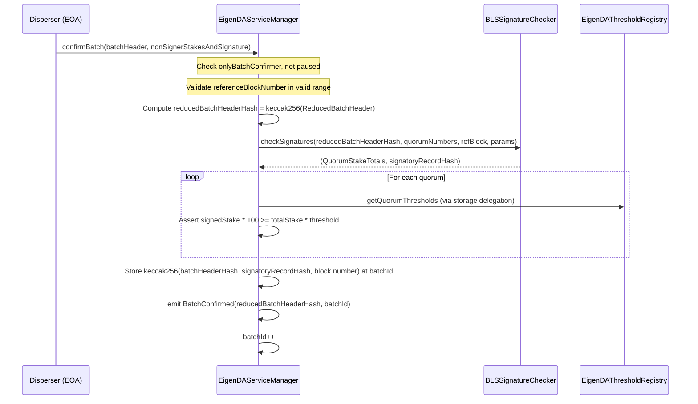
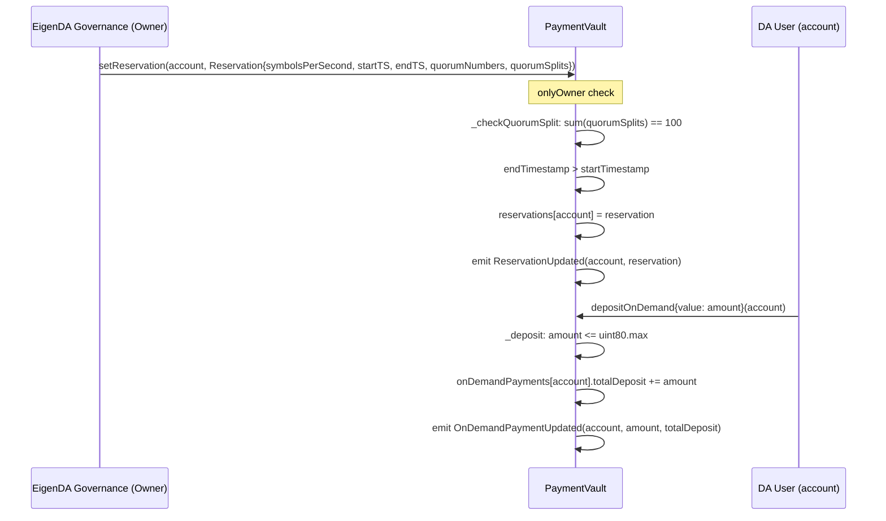
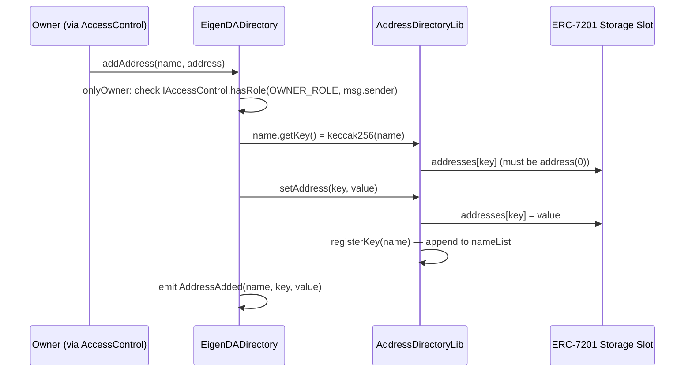
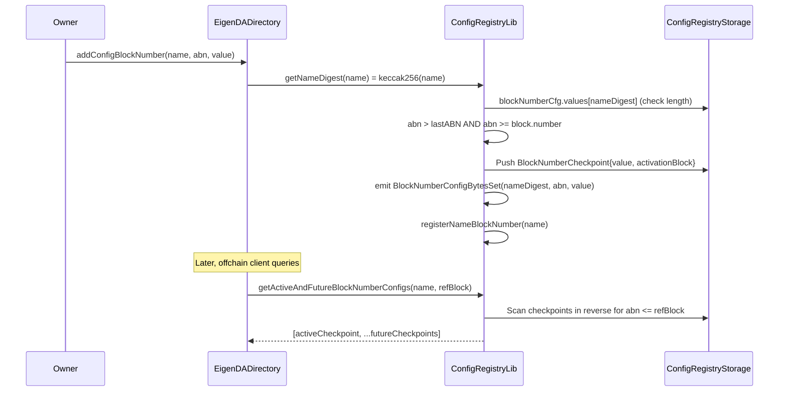
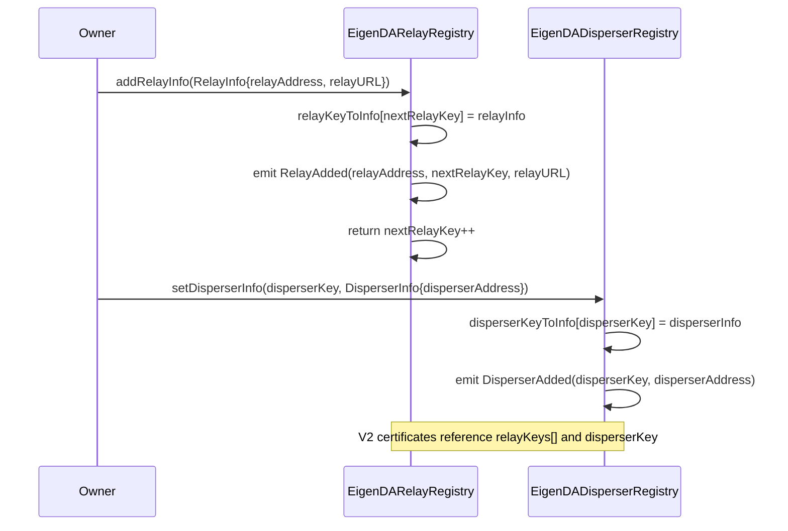

# core Analysis

**Analyzed by**: code-analyzer-core
**Timestamp**: 2026-04-10T00:00:00Z
**Application Type**: solidity-contract
**Classification**: contract
**Location**: contracts/src/core

## Architecture

The EigenDA core contracts form the on-chain protocol layer for the EigenDA data availability network built on top of EigenLayer. The system is organized into two major protocol generations (V1 and V2) that coexist, and a V3 infrastructure layer providing shared services. The architecture follows the **upgradeable proxy pattern** using OpenZeppelin's `TransparentUpgradeableProxy` and `ProxyAdmin`, with a strict separation between logic contracts and their storage contracts (e.g., `EigenDAServiceManager` + `EigenDAServiceManagerStorage`). This storage separation pattern ensures that proxy upgrades do not corrupt storage slots, using explicit `__GAP` arrays (e.g., 47 slots in `EigenDAServiceManagerStorage`) to preserve future upgradeability.

The V3 layer introduces a **diamond-storage pattern** via ERC-7201 namespaced storage positions for libraries like `AddressDirectoryStorage` and `ConfigRegistryStorage`. This allows libraries to safely share storage across proxies without slot collisions. Access control is centralized through `EigenDAAccessControl` (wrapping OpenZeppelin's `AccessControlEnumerable`) and queried at runtime via the `EigenDADirectory` contract, which acts as a name-to-address registry and checkpointed configuration store for the entire protocol.

The contracts integrate deeply with the EigenLayer middleware stack: `EigenDAServiceManager` inherits from `ServiceManagerBase` and `BLSSignatureChecker` (from `eigenlayer-middleware`), connecting EigenDA to EigenLayer's staking and delegation infrastructure. Operator registration flows through `EigenDARegistryCoordinator` which overrides the eigenlayer-middleware `RegistryCoordinator` to support the three registries (stake, BLS APK, index). Payment for DA services is handled by a separate `PaymentVault` contract supporting both reservation-based and on-demand models.

## Key Components

- **EigenDAServiceManager** (`contracts/src/core/EigenDAServiceManager.sol`): The primary protocol entrypoint for EigenDA V1. Inherits `ServiceManagerBase`, `BLSSignatureChecker`, and `Pausable`. Exposes `confirmBatch()` which validates BLS aggregate signatures against operator quorum thresholds and commits a hash of the batch metadata to storage, keyed by an auto-incrementing `batchId`. Only permissioned `batchConfirmer` addresses may call `confirmBatch()`, enforced by the `onlyBatchConfirmer` modifier.

- **EigenDAServiceManagerStorage** (`contracts/src/core/EigenDAServiceManagerStorage.sol`): Abstract storage contract for `EigenDAServiceManager`. Defines constants (`STORE_DURATION_BLOCKS = 2 weeks / 12 seconds`, `BLOCK_STALE_MEASURE = 300`), immutable registry references, the `batchId` counter, and mappings from `batchId` to batch metadata hash and from address to batch confirmer status. Contains a 47-slot `__GAP` for future upgrade space.

- **EigenDAThresholdRegistry** (`contracts/src/core/EigenDAThresholdRegistry.sol`): Upgradeable registry for quorum security parameters. Stores per-quorum adversary and confirmation threshold percentages as packed byte arrays indexed by quorum number. Also maintains a versioned blob parameter registry (`versionedBlobParams`) mapping `uint16` version IDs to `VersionedBlobParams` structs (max operators, number of chunks, coding rate).

- **EigenDAThresholdRegistryImmutableV1** (`contracts/src/core/EigenDAThresholdRegistryImmutableV1.sol`): A non-upgradeable variant of `EigenDAThresholdRegistry` intended for rollups using EigenDA V1 with custom quorum/threshold configurations. Disables V2 functions (`nextBlobVersion`, `getBlobParams`) by reverting. Explicitly marked as for a deprecated protocol version.

- **EigenDARegistryCoordinator** (`contracts/src/core/EigenDARegistryCoordinator.sol`): EigenDA's customized operator registry coordinator, extending the EigenLayer middleware `RegistryCoordinator`. Manages three sub-registries (stake, BLS APK, index) and operator lifecycle (registration, deregistration, ejection). Integrates with the V3 `EigenDADirectory` via an `IEigenDAAddressDirectory` immutable reference for looking up ejector addresses at runtime.

- **EigenDARelayRegistry** (`contracts/src/core/EigenDARelayRegistry.sol`): Upgradeable registry mapping auto-incrementing `uint32` relay keys to `RelayInfo` structs (address + URL). Used in V2 to allow blob certificates to specify which relay nodes hold their data. Only the owner can add relay entries.

- **EigenDADisperserRegistry** (`contracts/src/core/EigenDADisperserRegistry.sol`): Upgradeable registry mapping owner-assigned `uint32` disperser keys to `DisperserInfo` structs (address). Enables the protocol to identify authorized dispersers for V2 certificate verification.

- **PaymentVault** (`contracts/src/core/PaymentVault.sol`): Upgradeable payment contract supporting two payment models: (1) governance-set `Reservation` structs with time-bounded symbols-per-second allocations across quorums, and (2) on-demand ETH deposits tracked per account in `OnDemandPayment` structs. Validates quorum split percentages sum to 100. Accepts ETH via `receive()` and `fallback()`. Owner can withdraw ETH or ERC-20 tokens.

- **EigenDADirectory** (`contracts/src/core/EigenDADirectory.sol`): The V3 protocol hub contract. Combines `IEigenDAAddressDirectory` (name → address lookup using keccak256 keys stored in ERC-7201 namespaced storage) and `IEigenDAConfigRegistry` (checkpointed configuration values indexed by either block number or timestamp). Also implements `IEigenDASemVer` returning version `(2, 0, 0)`. Access-controlled by querying an `IAccessControl` contract stored in the directory itself.

- **EigenDAAccessControl** (`contracts/src/core/EigenDAAccessControl.sol`): Thin wrapper around OpenZeppelin's `AccessControlEnumerable`. On construction grants `DEFAULT_ADMIN_ROLE` and `OWNER_ROLE` to the deployer. Intended to be put behind a timelock in production.

- **AddressDirectoryLib** (`contracts/src/core/libraries/v3/address-directory/AddressDirectoryLib.sol`): Library implementing ERC-7201 namespaced storage for the address directory. Key derivation uses `keccak256(abi.encodePacked(name))`. Deregistration uses a swap-and-pop array pattern (no ordering guarantee).

- **ConfigRegistryLib** (`contracts/src/core/libraries/v3/config-registry/ConfigRegistryLib.sol`): Library for the checkpointed configuration registry. Enforces strictly increasing activation keys (block numbers or timestamps must exceed the previous checkpoint). For the first checkpoint, the activation key must be `>= block.number` or `>= block.timestamp`. Stores `BlockNumberCheckpoint[]` or `TimeStampCheckpoint[]` arrays per `nameDigest`. Provides `getActiveAndFutureBlockNumberConfigs` / `getActiveAndFutureTimestampConfigs` for offchain clients to fetch current + upcoming configs.

## Data Flows

### 1. V1 Batch Confirmation Flow

**Flow Description**: A permissioned batch confirmer submits a batch of DA blob headers and aggregate BLS signature data to finalize data availability on-chain.



**Detailed Steps**:

1. **Access and staleness checks** (Disperser → EigenDAServiceManager)
   - Modifier: `onlyBatchConfirmer`, `onlyWhenNotPaused(PAUSED_CONFIRM_BATCH)`
   - Asserts `tx.origin == msg.sender` (calldata requirement)
   - Checks `referenceBlockNumber < block.number` and `>= block.number - BLOCK_STALE_MEASURE (300)`

2. **Hash computation** (EigenDAServiceManager internal)
   - Computes `reducedBatchHeaderHash = keccak256(abi.encode(ReducedBatchHeader{blobHeadersRoot, referenceBlockNumber}))`
   - This is the message hash that operators BLS-signed

3. **BLS aggregate signature verification** (EigenDAServiceManager → BLSSignatureChecker)
   - Calls `checkSignatures()` from inherited `BLSSignatureChecker`
   - Returns stake totals per quorum and the signatory record hash

4. **Quorum threshold enforcement** (EigenDAServiceManager internal)
   - For each quorum: `signedStake * THRESHOLD_DENOMINATOR(100) >= totalStake * signedStakeForQuorums[i]`

5. **Metadata storage** (EigenDAServiceManager state write)
   - `batchIdToBatchMetadataHash[batchId] = keccak256(batchHeaderHash, signatoryRecordHash, block.number)`
   - Emits `BatchConfirmed`, increments `batchId`

**Error Paths**:
- `"header and nonsigner data must be in calldata"` — tx.origin != msg.sender (contract relay not allowed)
- `"specified referenceBlockNumber is in future"` — stale reference block check fails
- `"signatories do not own threshold percentage of a quorum"` — quorum threshold not met

---

### 2. Payment Reservation Flow

**Flow Description**: Governance sets a symbols-per-second reservation for an account, which offchain systems use to determine payment eligibility for blob dispersal.



**Detailed Steps**:

1. **Reservation creation** (Owner → PaymentVault)
   - Validates `quorumNumbers.length == quorumSplits.length`
   - Validates sum of `quorumSplits` equals exactly 100
   - Validates `endTimestamp > startTimestamp`
   - Writes `Reservation` struct to `reservations[account]`

2. **On-demand deposit** (User → PaymentVault)
   - Any caller can deposit ETH for any `account`
   - Validates `msg.value <= type(uint80).max`
   - Accumulates into `onDemandPayments[account].totalDeposit`

**Error Paths**:
- `"sum of quorumSplits must be 100"` — incorrect split allocation
- `"end timestamp must be greater than start timestamp"` — invalid reservation window
- `"price update cooldown not surpassed"` — governance calls `setPriceParams` too frequently

---

### 3. EigenDADirectory Address Registration Flow (V3)

**Flow Description**: Protocol governance registers or updates named contract addresses in the central directory for runtime lookup by other contracts.



**Detailed Steps**:

1. **Ownership check**: Queries the `IAccessControl` contract whose address is resolved from the directory itself using `ACCESS_CONTROL_NAME.getKey()`, forming a circular self-reference resolved at deploy time.

2. **Key derivation**: `key = keccak256(abi.encodePacked(name))` — a string-to-bytes32 digest.

3. **Conflict check**: Reverts with `AddressAlreadyExists(name)` if `key` already maps to a non-zero address. Use `replaceAddress()` for updates.

4. **ERC-7201 storage write**: `AddressDirectoryLib.setAddress()` writes to `AddressDirectoryStorage.layout().addresses[key]` at the deterministic `STORAGE_POSITION` slot.

---

### 4. ConfigRegistry Checkpointed Configuration Flow

**Flow Description**: Governance sets future-activated protocol parameters (e.g., EigenDA parameters) that offchain services can query to know the current and upcoming config.



---

### 5. Relay/Disperser Registry Flow (V2)

**Flow Description**: Governance registers relay and disperser participants so that V2 blob certificates can reference them by integer key.



## Dependencies

### External Libraries

- **@openzeppelin/contracts** (4.7.0) [security/access-control]: OpenZeppelin's standard contract library. Used for `AccessControlEnumerable` in `EigenDAAccessControl`, `IAccessControl` interface in `EigenDADirectory`, and `IERC20` + `ProxyAdmin`/`TransparentUpgradeableProxy` in deployment scripts and `PaymentVault`.
  Imported in: `EigenDAAccessControl.sol`, `EigenDADirectory.sol`, `PaymentVault.sol`, deployment scripts.

- **@openzeppelin/contracts-upgradeable** (4.7.0) [security/access-control]: OpenZeppelin's upgradeable contract variants. Used for `OwnableUpgradeable` in `PaymentVault`, `EigenDAThresholdRegistry`, `EigenDARelayRegistry`, `EigenDADisperserRegistry`; and `Initializable` in `EigenDARegistryCoordinator`.
  Imported in: `PaymentVault.sol`, `EigenDAThresholdRegistry.sol`, `EigenDARelayRegistry.sol`, `EigenDADisperserRegistry.sol`, `EigenDARegistryCoordinator.sol`.

- **eigenlayer-middleware** (git submodule, lib/) [blockchain/middleware]: EigenLayer AVS middleware framework. Provides `ServiceManagerBase`, `BLSSignatureChecker`, `RegistryCoordinator` (base for `EigenDARegistryCoordinator`), `BitmapUtils`, `BN254` elliptic curve library, `EjectionManager`, `IndexRegistry`, `StakeRegistry`, `BLSApkRegistry`, `SocketRegistry`, `OperatorStateRetriever`, `PauserRegistry`, `Pausable`, `IAVSDirectory`, `IRewardsCoordinator`.
  Imported in: `EigenDAServiceManager.sol`, `EigenDARegistryCoordinator.sol`, `EigenDAThresholdRegistry.sol`, deployment scripts.

- **forge-std** (git submodule, lib/) [testing]: Foundry's standard testing library. Used in deployment scripts (`Script`, `console2`). Not in production contracts.
  Imported in: `script/**/*.sol`.

- **openzeppelin-contracts** (git submodule, lib/) [security]: Forge submodule mirror of OpenZeppelin contracts, used by eigenlayer-middleware and for `EIP712` in `EigenDARegistryCoordinator`.
  Imported in: `EigenDARegistryCoordinator.sol`.

- **openzeppelin-contracts-upgradeable** (git submodule, lib/) [security]: Forge submodule mirror of OpenZeppelin upgradeable contracts, used by middleware dependencies.
  Imported in: `EigenDARegistryCoordinator.sol` (via `@openzeppelin-upgrades` remapping).

### Internal Libraries

This component has no internal library dependencies on other EigenDA Go/Rust components. All dependencies are within the Solidity contract layer itself or from the external libraries listed above.

## API Surface

### Public/External Functions

#### EigenDAServiceManager

**`confirmBatch(BatchHeader calldata batchHeader, NonSignerStakesAndSignature memory nonSignerStakesAndSignature) external`**
- Caller must be a `batchConfirmer`, contract must not be paused on bit 0
- Validates BLS aggregate signature against quorum thresholds
- Commits `keccak256(batchHeaderHash || signatoryRecordHash || block.number)` at `batchIdToBatchMetadataHash[batchId]`
- Emits `BatchConfirmed(reducedBatchHeaderHash, batchId)`

**`setBatchConfirmer(address) external onlyOwner`** — Toggle a batch confirmer address (idempotent toggle).

**`taskNumber() external view returns (uint32)`** — Returns current `batchId`.

**`latestServeUntilBlock(uint32 referenceBlockNumber) external pure returns (uint32)`** — Returns `referenceBlockNumber + STORE_DURATION_BLOCKS + BLOCK_STALE_MEASURE`.

**`quorumAdversaryThresholdPercentages() / quorumConfirmationThresholdPercentages() / quorumNumbersRequired()`** — Delegate to `eigenDAThresholdRegistry`.

**`batchIdToBatchMetadataHash(uint32 batchId) external view returns (bytes32)`** — Lookup committed batch metadata hash.

#### PaymentVault

**`setReservation(address _account, Reservation memory _reservation) external onlyOwner`** — Creates or replaces a symbols-per-second reservation for an account.

**`depositOnDemand(address _account) external payable`** — Deposits ETH into an account's on-demand payment balance.

**`setPriceParams(uint64 minNumSymbols, uint64 pricePerSymbol, uint64 priceUpdateCooldown) external onlyOwner`** — Updates pricing; enforces cooldown between updates.

**`setGlobalSymbolsPerPeriod(uint64) / setReservationPeriodInterval(uint64) / setGlobalRatePeriodInterval(uint64) external onlyOwner`** — Update global rate parameters.

**`withdraw(uint256 _amount) external onlyOwner`** — Withdraw ETH to owner.

**`withdrawERC20(IERC20 _token, uint256 _amount) external onlyOwner`** — Withdraw ERC-20 tokens to owner.

**`getReservation(address) / getReservations(address[]) external view`** — Fetch reservation(s).

**`getOnDemandTotalDeposit(address) / getOnDemandTotalDeposits(address[]) external view`** — Fetch on-demand balance(s).

#### EigenDAThresholdRegistry

**`addVersionedBlobParams(VersionedBlobParams memory) external onlyOwner returns (uint16)`** — Appends new blob parameters and returns the assigned version ID.

**`getQuorumAdversaryThresholdPercentage(uint8 quorumNumber) / getQuorumConfirmationThresholdPercentage(uint8) external view`** — Per-quorum threshold lookups.

**`getIsQuorumRequired(uint8) external view returns (bool)`** — Bitmap check for required quorums.

**`getBlobParams(uint16 version) external view returns (VersionedBlobParams)`** — Versioned blob parameter lookup.

#### EigenDADirectory

**`addAddress(string memory name, address value) / replaceAddress(string, address) / removeAddress(string) external onlyOwner`** — Address directory management.

**`getAddress(string memory name) / getAddress(bytes32 nameDigest) external view returns (address)`** — Name-to-address lookup.

**`getAllNames() external view returns (string[] memory)`** — Full directory enumeration.

**`addConfigBlockNumber(string name, uint256 abn, bytes value) / addConfigTimeStamp(string, uint256, bytes) external onlyOwner`** — Add future-activated configuration checkpoints.

**`getActiveAndFutureBlockNumberConfigs(string name, uint256 refBlock) / getActiveAndFutureTimestampConfigs(string, uint256) external view`** — Efficient query for current + future config checkpoints.

**`semver() external pure returns (uint8 major, uint8 minor, uint8 patch)`** — Returns `(2, 0, 0)`.

#### EigenDARelayRegistry

**`addRelayInfo(RelayInfo memory) external onlyOwner returns (uint32)`** — Register a relay node, returns its assigned key.

**`relayKeyToAddress(uint32 key) / relayKeyToUrl(uint32 key) external view`** — Relay key lookups.

#### EigenDADisperserRegistry

**`setDisperserInfo(uint32 disperserKey, DisperserInfo memory) external onlyOwner`** — Register or update a disperser by key.

**`disperserKeyToAddress(uint32 key) external view returns (address)`** — Disperser key lookup.

### Events

- `BatchConfirmed(bytes32 indexed batchHeaderHash, uint32 batchId)` — EigenDAServiceManager, V1 batch submission
- `BatchConfirmerStatusChanged(address batchConfirmer, bool status)` — EigenDAServiceManager
- `ReservationUpdated(address indexed account, Reservation reservation)` — PaymentVault
- `OnDemandPaymentUpdated(address indexed account, uint80 amount, uint80 totalDeposit)` — PaymentVault
- `PriceParamsUpdated(...)` / `GlobalSymbolsPerPeriodUpdated(...)` / etc. — PaymentVault pricing events
- `VersionedBlobParamsAdded(uint16 indexed version, VersionedBlobParams)` — EigenDAThresholdRegistry
- `RelayAdded(address indexed relay, uint32 indexed key, string relayURL)` — EigenDARelayRegistry
- `DisperserAdded(uint32 indexed key, address indexed disperser)` — EigenDADisperserRegistry
- `AddressAdded/AddressReplaced/AddressRemoved` — EigenDADirectory
- `TimestampConfigBytesSet/BlockNumberConfigBytesSet` — ConfigRegistryLib (via EigenDADirectory)

### Key Type Definitions (Libraries)

**EigenDATypesV1**: `BatchHeader`, `ReducedBatchHeader`, `BatchMetadata`, `BlobHeader`, `BlobVerificationProof`, `QuorumBlobParam`, `VersionedBlobParams`, `SecurityThresholds`, `NonSignerStakesAndSignature`, `QuorumStakeTotals`

**EigenDATypesV2**: `BlobCertificate`, `BlobHeaderV2`, `BlobCommitment`, `SignedBatch`, `BatchHeaderV2`, `Attestation`, `RelayInfo`, `DisperserInfo`, `BlobInclusionInfo`

**ConfigRegistryTypes**: `BlockNumberCheckpoint`, `TimeStampCheckpoint`, `BlockNumberConfig`, `TimestampConfig`, `NameSet`

## Code Examples

### Example 1: Batch Confirmation with Quorum Threshold Check

```solidity
// contracts/src/core/EigenDAServiceManager.sol, lines 74-131
function confirmBatch(
    DATypesV1.BatchHeader calldata batchHeader,
    NonSignerStakesAndSignature memory nonSignerStakesAndSignature
) external onlyWhenNotPaused(PAUSED_CONFIRM_BATCH) onlyBatchConfirmer {
    require(tx.origin == msg.sender, "header and nonsigner data must be in calldata");
    require(batchHeader.referenceBlockNumber < block.number, "...");
    require(
        (batchHeader.referenceBlockNumber + BLOCK_STALE_MEASURE) >= uint32(block.number),
        "specified referenceBlockNumber is too far in past"
    );

    bytes32 reducedBatchHeaderHash = keccak256(
        abi.encode(DATypesV1.ReducedBatchHeader({
            blobHeadersRoot: batchHeader.blobHeadersRoot,
            referenceBlockNumber: batchHeader.referenceBlockNumber
        }))
    );

    (QuorumStakeTotals memory quorumStakeTotals, bytes32 signatoryRecordHash) = checkSignatures(
        reducedBatchHeaderHash, batchHeader.quorumNumbers,
        batchHeader.referenceBlockNumber, nonSignerStakesAndSignature
    );

    for (uint256 i = 0; i < batchHeader.signedStakeForQuorums.length; i++) {
        require(
            quorumStakeTotals.signedStakeForQuorum[i] * THRESHOLD_DENOMINATOR
                >= quorumStakeTotals.totalStakeForQuorum[i] * uint8(batchHeader.signedStakeForQuorums[i]),
            "signatories do not own threshold percentage of a quorum"
        );
    }

    uint32 batchIdMemory = batchId;
    bytes32 batchHeaderHash = keccak256(abi.encode(batchHeader));
    batchIdToBatchMetadataHash[batchIdMemory] =
        keccak256(abi.encodePacked(batchHeaderHash, signatoryRecordHash, uint32(block.number)));
    emit BatchConfirmed(reducedBatchHeaderHash, batchIdMemory);
    batchId = batchIdMemory + 1;
}
```

### Example 2: ERC-7201 Namespaced Storage Pattern

```solidity
// contracts/src/core/libraries/v3/address-directory/AddressDirectoryStorage.sol
library AddressDirectoryStorage {
    /// @custom: storage-location erc7201:address.directory.storage
    struct Layout {
        mapping(bytes32 => address) addresses;
        mapping(bytes32 => string) names;
        string[] nameList;
    }

    string internal constant STORAGE_ID = "address.directory.storage";
    bytes32 internal constant STORAGE_POSITION =
        keccak256(abi.encode(uint256(keccak256(abi.encodePacked(STORAGE_ID))) - 1)) & ~bytes32(uint256(0xff));

    function layout() internal pure returns (Layout storage s) {
        bytes32 position = STORAGE_POSITION;
        assembly {
            s.slot := position
        }
    }
}
```

### Example 3: ConfigRegistry Strictly-Increasing Checkpoint Enforcement

```solidity
// contracts/src/core/libraries/v3/config-registry/ConfigRegistryLib.sol, lines 118-133
function addConfigTimeStamp(bytes32 nameDigest, uint256 activationTS, bytes memory value) internal {
    T.TimestampConfig storage cfg = S.layout().timestampCfg;
    if (cfg.values[nameDigest].length > 0) {
        uint256 lastActivationTS = cfg.values[nameDigest][cfg.values[nameDigest].length - 1].activationTime;
        if (activationTS <= lastActivationTS) {
            revert NotIncreasingTimestamp(lastActivationTS, activationTS);
        }
    }
    if (activationTS < block.timestamp) {
        revert TimeStampActivationInPast(block.timestamp, activationTS);
    }
    cfg.values[nameDigest].push(T.TimeStampCheckpoint({value: value, activationTime: activationTS}));
    emit TimestampConfigBytesSet(nameDigest, activationTS, value);
}
```

### Example 4: PaymentVault Quorum Split Validation

```solidity
// contracts/src/core/PaymentVault.sol, lines 106-113
function _checkQuorumSplit(bytes memory _quorumNumbers, bytes memory _quorumSplits) internal pure {
    require(_quorumNumbers.length == _quorumSplits.length, "arrays must have the same length");
    uint8 total;
    for (uint256 i; i < _quorumSplits.length; ++i) {
        total += uint8(_quorumSplits[i]);
    }
    require(total == 100, "sum of quorumSplits must be 100");
}
```

### Example 5: AccessControl via Directory Self-Reference

```solidity
// contracts/src/core/EigenDADirectory.sol, lines 27-34
modifier onlyOwner() {
    require(
        IAccessControl(AddressDirectoryConstants.ACCESS_CONTROL_NAME.getKey().getAddress())
            .hasRole(AccessControlConstants.OWNER_ROLE, msg.sender),
        "Caller is not the owner"
    );
    _;
}
```

## Files Analyzed

- `contracts/src/core/EigenDAServiceManager.sol` (193 lines) — V1 primary protocol entrypoint, batch confirmation
- `contracts/src/core/EigenDAServiceManagerStorage.sol` (67 lines) — Storage layout + constants for EigenDAServiceManager
- `contracts/src/core/EigenDAThresholdRegistry.sol` (89 lines) — Upgradeable quorum threshold + blob param registry
- `contracts/src/core/EigenDAThresholdRegistryStorage.sol` (29 lines) — Storage layout for EigenDAThresholdRegistry
- `contracts/src/core/EigenDAThresholdRegistryImmutableV1.sol` (74 lines) — Immutable threshold registry for custom rollup quorums
- `contracts/src/core/EigenDARegistryCoordinator.sol` (400+ lines) — Operator registry coordinator (partial read)
- `contracts/src/core/EigenDARegistryCoordinatorStorage.sol` (65 lines) — Storage layout + constants for registry coordinator
- `contracts/src/core/EigenDARelayRegistry.sol` (33 lines) — Relay node registry for V2
- `contracts/src/core/EigenDARelayRegistryStorage.sol` (17 lines) — Storage for relay registry
- `contracts/src/core/EigenDADisperserRegistry.sol` (31 lines) — Disperser node registry for V2
- `contracts/src/core/EigenDADisperserRegistryStorage.sol` (15 lines) — Storage for disperser registry
- `contracts/src/core/PaymentVault.sol` (147 lines) — Payment entrypoint (reservations + on-demand)
- `contracts/src/core/PaymentVaultStorage.sol` (29 lines) — Storage layout for PaymentVault
- `contracts/src/core/EigenDADirectory.sol` (230 lines) — V3 address directory + config registry hub
- `contracts/src/core/EigenDAAccessControl.sol` (16 lines) — Centralized access control contract
- `contracts/src/core/interfaces/IEigenDAServiceManager.sol` (42 lines) — Service manager interface
- `contracts/src/core/interfaces/IPaymentVault.sol` (57 lines) — Payment vault interface
- `contracts/src/core/interfaces/IEigenDAThresholdRegistry.sol` (52 lines) — Threshold registry interface
- `contracts/src/core/interfaces/IEigenDADirectory.sol` (160 lines) — Directory + config registry interface
- `contracts/src/core/interfaces/IEigenDARelayRegistry.sol` (14 lines) — Relay registry interface
- `contracts/src/core/interfaces/IEigenDADisperserRegistry.sol` (12 lines) — Disperser registry interface
- `contracts/src/core/interfaces/IEigenDABatchMetadataStorage.sol` (6 lines) — Batch metadata lookup interface
- `contracts/src/core/interfaces/IEigenDASignatureVerifier.sol` (13 lines) — Signature verifier interface
- `contracts/src/core/interfaces/IEigenDASemVer.sol` (7 lines) — Semantic version interface
- `contracts/src/core/libraries/v1/EigenDATypesV1.sol` (79 lines) — V1 data type definitions
- `contracts/src/core/libraries/v2/EigenDATypesV2.sol` (59 lines) — V2 data type definitions
- `contracts/src/core/libraries/v3/address-directory/AddressDirectoryLib.sol` (53 lines) — Address directory library
- `contracts/src/core/libraries/v3/address-directory/AddressDirectoryStorage.sol` (24 lines) — ERC-7201 storage for address directory
- `contracts/src/core/libraries/v3/address-directory/AddressDirectoryConstants.sol` (39 lines) — Well-known contract name strings
- `contracts/src/core/libraries/v3/config-registry/ConfigRegistryLib.sol` (330 lines) — Config checkpoint library
- `contracts/src/core/libraries/v3/config-registry/ConfigRegistryStorage.sol` (27 lines) — ERC-7201 storage for config registry
- `contracts/src/core/libraries/v3/config-registry/ConfigRegistryTypes.sol` (44 lines) — Config registry type definitions
- `contracts/src/core/libraries/v3/access-control/AccessControlConstants.sol` (19 lines) — Role constants
- `contracts/src/core/libraries/v3/initializable/InitializableLib.sol` (35 lines) — ERC-7201 initializer library
- `contracts/src/core/libraries/v3/initializable/InitializableStorage.sol` (22 lines) — ERC-7201 storage for initializable
- `contracts/package.json` — NPM dependencies declaration
- `contracts/foundry.toml` — Foundry/Solidity compiler configuration
- `contracts/script/deploy/eigenda/DeployEigenDA.s.sol` (100 lines) — Deployment script (partial read)

## Analysis Data

```json
{
  "summary": "The EigenDA core Solidity contracts form the on-chain protocol layer for the EigenDA data availability network built atop EigenLayer. The system spans two protocol versions: V1 (EigenDAServiceManager for batch confirmation via BLS aggregate signatures and quorum threshold enforcement) and V2 (relay/disperser registries for certificate-based DA), plus a V3 infrastructure layer (EigenDADirectory for named address lookups and checkpointed protocol configuration, EigenDAAccessControl for centralized role management, PaymentVault for reservation and on-demand payment models). All stateful contracts use OpenZeppelin upgradeable proxies with explicit storage-gap arrays, while V3 libraries use ERC-7201 namespaced storage slots for collision-safe library-level state.",
  "architecture_pattern": "upgradeable-proxy with storage-separation pattern; ERC-7201 namespaced storage for V3 libraries; eigenlayer-middleware inheritance for AVS integration",
  "key_modules": [
    "EigenDAServiceManager — V1 batch confirmation entrypoint with BLS signature verification",
    "EigenDAThresholdRegistry — Quorum security thresholds and versioned blob parameters",
    "EigenDAThresholdRegistryImmutableV1 — Non-upgradeable threshold registry for legacy rollup quorums",
    "EigenDARegistryCoordinator — Operator registration/deregistration across stake/BLS-APK/index registries",
    "EigenDARelayRegistry — V2 relay node key-to-address registry",
    "EigenDADisperserRegistry — V2 disperser key-to-address registry",
    "PaymentVault — Reservation and on-demand ETH payment management",
    "EigenDADirectory — V3 name→address directory and checkpointed config registry hub",
    "EigenDAAccessControl — Centralized OpenZeppelin role-based access control",
    "EigenDATypesV1 / EigenDATypesV2 — Protocol data structure libraries",
    "AddressDirectoryLib / ConfigRegistryLib — ERC-7201 storage libraries for V3 infrastructure"
  ],
  "api_endpoints": [
    "confirmBatch(BatchHeader, NonSignerStakesAndSignature) — V1 batch confirmation",
    "setBatchConfirmer(address) — Toggle batch confirmer permission",
    "setReservation(address, Reservation) — Governance reservation management",
    "depositOnDemand(address) payable — On-demand ETH deposit",
    "setPriceParams(uint64, uint64, uint64) — Governance pricing update",
    "addVersionedBlobParams(VersionedBlobParams) — Add blob version",
    "addRelayInfo(RelayInfo) — Register relay node",
    "setDisperserInfo(uint32, DisperserInfo) — Register disperser",
    "addAddress(string, address) — Directory address registration",
    "replaceAddress(string, address) — Directory address update",
    "addConfigBlockNumber(string, uint256, bytes) — Block-number-activated config",
    "addConfigTimeStamp(string, uint256, bytes) — Timestamp-activated config",
    "getActiveAndFutureBlockNumberConfigs(string, uint256) — Config checkpoint query"
  ],
  "data_flows": [
    "V1 Batch Confirmation: disperser → EigenDAServiceManager.confirmBatch → BLSSignatureChecker.checkSignatures → quorum threshold loop → batchIdToBatchMetadataHash write → BatchConfirmed event",
    "Payment Reservation: owner → PaymentVault.setReservation → quorum split validation → reservations mapping write",
    "On-Demand Deposit: user → PaymentVault.depositOnDemand (or receive/fallback) → _deposit → onDemandPayments accumulation",
    "Directory Registration: owner → EigenDADirectory.addAddress → AddressDirectoryLib.setAddress → ERC-7201 storage write",
    "Config Checkpoint: owner → EigenDADirectory.addConfigBlockNumber → ConfigRegistryLib.addConfigBlockNumber → strictly-increasing enforcement → BlockNumberCheckpoint push",
    "V2 Relay Lookup: certificate consumer → EigenDARelayRegistry.relayKeyToAddress → relayKeyToInfo mapping read"
  ],
  "tech_stack": [
    "solidity ^0.8.9 / ^0.8.12",
    "foundry",
    "openzeppelin-contracts 4.7.0",
    "openzeppelin-contracts-upgradeable 4.7.0",
    "eigenlayer-middleware (git submodule)",
    "forge-std (git submodule)",
    "ERC-7201 namespaced storage",
    "BN254 elliptic curve (BLS signatures)",
    "EIP-712 typed data signing"
  ],
  "external_integrations": [
    "ethereum",
    "eigenlayer-avs-directory",
    "eigenlayer-rewards-coordinator",
    "eigenlayer-delegation-manager"
  ],
  "component_interactions": [
    "EigenDAServiceManager → EigenDAThresholdRegistry (quorum threshold delegation)",
    "EigenDAServiceManager → BLSSignatureChecker/ServiceManagerBase (eigenlayer-middleware)",
    "EigenDARegistryCoordinator → EigenDADirectory (ejector role lookup at runtime)",
    "EigenDADirectory → EigenDAAccessControl (OWNER_ROLE authorization)",
    "PaymentVault.setReservation validates quorumSplits sum == 100",
    "EigenDARelayRegistry / EigenDADisperserRegistry referenced by V2 cert verifier (in integrations/cert)"
  ]
}
```

## Citations

```json
[
  {
    "file_path": "contracts/src/core/EigenDAServiceManager.sol",
    "start_line": 27,
    "end_line": 34,
    "claim": "EigenDAServiceManager inherits ServiceManagerBase, BLSSignatureChecker, and Pausable from eigenlayer-middleware; uses onlyBatchConfirmer access control modifier",
    "section": "Architecture",
    "snippet": "contract EigenDAServiceManager is EigenDAServiceManagerStorage, ServiceManagerBase, BLSSignatureChecker, Pausable {\n    uint8 internal constant PAUSED_CONFIRM_BATCH = 0;\n    modifier onlyBatchConfirmer() {\n        require(isBatchConfirmer[msg.sender]);\n        _;\n    }"
  },
  {
    "file_path": "contracts/src/core/EigenDAServiceManagerStorage.sol",
    "start_line": 15,
    "end_line": 36,
    "claim": "STORE_DURATION_BLOCKS is set to 2 weeks / 12 seconds and BLOCK_STALE_MEASURE is 300 blocks; immutable registry references are set in constructor",
    "section": "Key Components",
    "snippet": "uint32 public constant STORE_DURATION_BLOCKS = 2 weeks / 12 seconds;\nuint32 public constant BLOCK_STALE_MEASURE = 300;"
  },
  {
    "file_path": "contracts/src/core/EigenDAServiceManagerStorage.sol",
    "start_line": 56,
    "end_line": 66,
    "claim": "EigenDAServiceManagerStorage uses a 47-slot __GAP array for future upgrade space; batchId and batchIdToBatchMetadataHash are the core state variables",
    "section": "Key Components",
    "snippet": "uint32 public batchId;\nmapping(uint32 => bytes32) public batchIdToBatchMetadataHash;\nmapping(address => bool) public isBatchConfirmer;\nuint256[47] private __GAP;"
  },
  {
    "file_path": "contracts/src/core/EigenDAServiceManager.sol",
    "start_line": 79,
    "end_line": 82,
    "claim": "confirmBatch requires tx.origin == msg.sender, enforcing that batch data must be in calldata and not relayed through a contract intermediary",
    "section": "Data Flows",
    "snippet": "require(tx.origin == msg.sender, \"header and nonsigner data must be in calldata\");\nrequire(batchHeader.referenceBlockNumber < block.number, \"specified referenceBlockNumber is in future\");"
  },
  {
    "file_path": "contracts/src/core/EigenDAServiceManager.sol",
    "start_line": 112,
    "end_line": 120,
    "claim": "Quorum threshold check: signedStake * 100 must be >= totalStake * threshold percentage, enforced per quorum",
    "section": "Data Flows",
    "snippet": "require(\n    quorumStakeTotals.signedStakeForQuorum[i] * THRESHOLD_DENOMINATOR\n        >= quorumStakeTotals.totalStakeForQuorum[i] * uint8(batchHeader.signedStakeForQuorums[i]),\n    \"signatories do not own threshold percentage of a quorum\"\n);"
  },
  {
    "file_path": "contracts/src/core/EigenDAServiceManager.sol",
    "start_line": 122,
    "end_line": 132,
    "claim": "Batch metadata stored as keccak256(batchHeaderHash || signatoryRecordHash || block.number); BatchConfirmed event emitted; batchId auto-increments",
    "section": "Data Flows",
    "snippet": "batchIdToBatchMetadataHash[batchIdMemory] =\n    keccak256(abi.encodePacked(batchHeaderHash, signatoryRecordHash, uint32(block.number)));\nemit BatchConfirmed(reducedBatchHeaderHash, batchIdMemory);\nbatchId = batchIdMemory + 1;"
  },
  {
    "file_path": "contracts/src/core/PaymentVault.sol",
    "start_line": 48,
    "end_line": 56,
    "claim": "setReservation is owner-only; validates quorum split and timestamp ordering before storing reservation",
    "section": "Data Flows",
    "snippet": "function setReservation(address _account, Reservation memory _reservation) external onlyOwner {\n    _checkQuorumSplit(_reservation.quorumNumbers, _reservation.quorumSplits);\n    require(_reservation.endTimestamp > _reservation.startTimestamp, ...);\n    reservations[_account] = _reservation;"
  },
  {
    "file_path": "contracts/src/core/PaymentVault.sol",
    "start_line": 106,
    "end_line": 113,
    "claim": "Quorum splits validation: array lengths must match and splits must sum exactly to 100",
    "section": "Key Components",
    "snippet": "function _checkQuorumSplit(bytes memory _quorumNumbers, bytes memory _quorumSplits) internal pure {\n    require(_quorumNumbers.length == _quorumSplits.length, ...);\n    uint8 total;\n    for (uint256 i; i < _quorumSplits.length; ++i) { total += uint8(_quorumSplits[i]); }\n    require(total == 100, \"sum of quorumSplits must be 100\");\n}"
  },
  {
    "file_path": "contracts/src/core/PaymentVault.sol",
    "start_line": 116,
    "end_line": 120,
    "claim": "_deposit truncates ETH amount to uint80; accumulates into onDemandPayments totalDeposit",
    "section": "Key Components",
    "snippet": "require(_amount <= type(uint80).max, \"amount must be less than or equal to 80 bits\");\nonDemandPayments[_account].totalDeposit += uint80(_amount);\nemit OnDemandPaymentUpdated(_account, uint80(_amount), onDemandPayments[_account].totalDeposit);"
  },
  {
    "file_path": "contracts/src/core/EigenDAThresholdRegistry.sol",
    "start_line": 11,
    "end_line": 32,
    "claim": "EigenDAThresholdRegistry is upgradeable (inherits OwnableUpgradeable), uses _disableInitializers() in constructor, initialized with quorum threshold byte arrays and initial blob params",
    "section": "Key Components",
    "snippet": "contract EigenDAThresholdRegistry is EigenDAThresholdRegistryStorage, OwnableUpgradeable {\n    constructor() { _disableInitializers(); }\n    function initialize(...) external initializer { ... }"
  },
  {
    "file_path": "contracts/src/core/EigenDAThresholdRegistry.sol",
    "start_line": 78,
    "end_line": 81,
    "claim": "getIsQuorumRequired uses BitmapUtils from eigenlayer-middleware to check quorum membership in the required quorums bitmap",
    "section": "Key Components",
    "snippet": "function getIsQuorumRequired(uint8 quorumNumber) public view virtual returns (bool) {\n    uint256 quorumBitmap = BitmapUtils.setBit(0, quorumNumber);\n    return (quorumBitmap & BitmapUtils.orderedBytesArrayToBitmap(quorumNumbersRequired) == quorumBitmap);\n}"
  },
  {
    "file_path": "contracts/src/core/EigenDAThresholdRegistryImmutableV1.sol",
    "start_line": 14,
    "end_line": 14,
    "claim": "EigenDAThresholdRegistryImmutableV1 is non-upgradeable and intended only for legacy rollup custom quorums; V2 functions (nextBlobVersion, getBlobParams) revert",
    "section": "Key Components",
    "snippet": "contract EigenDAThresholdRegistryImmutableV1 is IEigenDAThresholdRegistry {"
  },
  {
    "file_path": "contracts/src/core/EigenDARelayRegistry.sol",
    "start_line": 20,
    "end_line": 23,
    "claim": "addRelayInfo stores RelayInfo by auto-incrementing nextRelayKey and emits RelayAdded event",
    "section": "Key Components",
    "snippet": "function addRelayInfo(EigenDATypesV2.RelayInfo memory relayInfo) external onlyOwner returns (uint32) {\n    relayKeyToInfo[nextRelayKey] = relayInfo;\n    emit RelayAdded(relayInfo.relayAddress, nextRelayKey, relayInfo.relayURL);\n    return nextRelayKey++;\n}"
  },
  {
    "file_path": "contracts/src/core/EigenDADirectory.sol",
    "start_line": 18,
    "end_line": 18,
    "claim": "EigenDADirectory combines IEigenDADirectory (address + config registry) and IEigenDASemVer interfaces; uses AddressDirectoryLib and ConfigRegistryLib for storage",
    "section": "Architecture",
    "snippet": "contract EigenDADirectory is IEigenDADirectory, IEigenDASemVer {"
  },
  {
    "file_path": "contracts/src/core/EigenDADirectory.sol",
    "start_line": 27,
    "end_line": 34,
    "claim": "onlyOwner in EigenDADirectory delegates authorization to the AccessControl contract stored in the directory itself via keccak256 key lookup",
    "section": "Key Components",
    "snippet": "modifier onlyOwner() {\n    require(\n        IAccessControl(AddressDirectoryConstants.ACCESS_CONTROL_NAME.getKey().getAddress())\n            .hasRole(AccessControlConstants.OWNER_ROLE, msg.sender), ...\n    );\n}"
  },
  {
    "file_path": "contracts/src/core/EigenDADirectory.sol",
    "start_line": 224,
    "end_line": 229,
    "claim": "EigenDADirectory.semver() returns (2, 0, 0), identifying this as the V3 directory contract",
    "section": "API Surface",
    "snippet": "function semver() external pure returns (uint8 major, uint8 minor, uint8 patch) {\n    major = 2;\n    minor = 0;\n    patch = 0;\n}"
  },
  {
    "file_path": "contracts/src/core/EigenDAAccessControl.sol",
    "start_line": 9,
    "end_line": 16,
    "claim": "EigenDAAccessControl wraps OpenZeppelin AccessControlEnumerable; grants both DEFAULT_ADMIN_ROLE and OWNER_ROLE to deployer on construction",
    "section": "Key Components",
    "snippet": "contract EigenDAAccessControl is AccessControlEnumerable {\n    constructor(address owner) {\n        _grantRole(DEFAULT_ADMIN_ROLE, owner);\n        _grantRole(AccessControlConstants.OWNER_ROLE, owner);\n    }\n}"
  },
  {
    "file_path": "contracts/src/core/libraries/v3/address-directory/AddressDirectoryStorage.sol",
    "start_line": 7,
    "end_line": 23,
    "claim": "AddressDirectoryStorage uses ERC-7201 namespaced storage with STORAGE_ID 'address.directory.storage'; storage position computed via keccak256 formula per EIP-7201",
    "section": "Architecture",
    "snippet": "/// @custom: storage-location erc7201:address.directory.storage\nstring internal constant STORAGE_ID = \"address.directory.storage\";\nbytes32 internal constant STORAGE_POSITION =\n    keccak256(abi.encode(uint256(keccak256(abi.encodePacked(STORAGE_ID))) - 1)) & ~bytes32(uint256(0xff));"
  },
  {
    "file_path": "contracts/src/core/libraries/v3/address-directory/AddressDirectoryLib.sol",
    "start_line": 30,
    "end_line": 43,
    "claim": "deregisterKey uses swap-and-pop pattern to remove a name from the nameList; does not preserve ordering",
    "section": "Key Components",
    "snippet": "for (uint256 i; i < s.nameList.length; i++) {\n    if (getKey(s.nameList[i]) == key) {\n        s.nameList[i] = s.nameList[s.nameList.length - 1];\n        s.nameList.pop();\n        break;\n    }\n}"
  },
  {
    "file_path": "contracts/src/core/libraries/v3/config-registry/ConfigRegistryLib.sol",
    "start_line": 118,
    "end_line": 134,
    "claim": "addConfigTimeStamp enforces strictly increasing activation timestamps and rejects past activation times",
    "section": "Data Flows",
    "snippet": "if (activationTS <= lastActivationTS) { revert NotIncreasingTimestamp(lastActivationTS, activationTS); }\nif (activationTS < block.timestamp) { revert TimeStampActivationInPast(block.timestamp, activationTS); }"
  },
  {
    "file_path": "contracts/src/core/libraries/v3/config-registry/ConfigRegistryLib.sol",
    "start_line": 271,
    "end_line": 299,
    "claim": "getActiveAndFutureBlockNumberConfigs scans checkpoints in reverse to find the currently active one and returns it plus all future checkpoints; intended for offchain use via eth_call",
    "section": "Data Flows",
    "snippet": "uint256 startIndex = numCheckpoints;\nfor (uint256 i = 0; i < numCheckpoints; ++i) {\n    uint256 checkpointActivationBlock = getActivationBlockNumber(nameDigest, numCheckpoints - 1 - i);\n    if (checkpointActivationBlock <= referenceBlockNumber) {\n        startIndex = numCheckpoints - 1 - i;\n        break;\n    }\n}"
  },
  {
    "file_path": "contracts/src/core/libraries/v3/access-control/AccessControlConstants.sol",
    "start_line": 7,
    "end_line": 19,
    "claim": "OWNER_ROLE, EJECTOR_ROLE, and per-quorum QUORUM_OWNER_ROLE (derived from seed + quorumId) are the main access control roles",
    "section": "Architecture",
    "snippet": "bytes32 internal constant OWNER_ROLE = keccak256(\"OWNER\");\nbytes32 internal constant QUORUM_OWNER_SEED = keccak256(\"QUORUM_OWNER\");\nbytes32 internal constant EJECTOR_ROLE = keccak256(\"EJECTOR\");"
  },
  {
    "file_path": "contracts/src/core/libraries/v3/address-directory/AddressDirectoryConstants.sol",
    "start_line": 6,
    "end_line": 38,
    "claim": "AddressDirectoryConstants defines well-known names for all protocol contracts: PROXY_ADMIN, ACCESS_CONTROL, DISPERSER_REGISTRY, RELAY_REGISTRY, SERVICE_MANAGER, THRESHOLD_REGISTRY, PAYMENT_VAULT, REGISTRY_COORDINATOR, etc.",
    "section": "Architecture",
    "snippet": "string internal constant ACCESS_CONTROL_NAME = \"ACCESS_CONTROL\";\nstring internal constant SERVICE_MANAGER_NAME = \"SERVICE_MANAGER\";\nstring internal constant PAYMENT_VAULT_NAME = \"PAYMENT_VAULT\";"
  },
  {
    "file_path": "contracts/src/core/libraries/v1/EigenDATypesV1.sol",
    "start_line": 6,
    "end_line": 79,
    "claim": "EigenDATypesV1 defines all V1 protocol data structures: VersionedBlobParams, BatchHeader, ReducedBatchHeader, BlobHeader, BlobVerificationProof, NonSignerStakesAndSignature, QuorumStakeTotals",
    "section": "API Surface",
    "snippet": "struct BatchHeader { bytes32 blobHeadersRoot; bytes quorumNumbers; bytes signedStakeForQuorums; uint32 referenceBlockNumber; }"
  },
  {
    "file_path": "contracts/src/core/libraries/v2/EigenDATypesV2.sol",
    "start_line": 6,
    "end_line": 59,
    "claim": "EigenDATypesV2 defines V2 data structures: BlobCertificate, BlobHeaderV2, BlobCommitment (with G2 length commitment and proof), SignedBatch, BatchHeaderV2, Attestation, RelayInfo, DisperserInfo",
    "section": "API Surface",
    "snippet": "struct BlobHeaderV2 { uint16 version; bytes quorumNumbers; BlobCommitment commitment; bytes32 paymentHeaderHash; }"
  },
  {
    "file_path": "contracts/src/core/EigenDARegistryCoordinatorStorage.sol",
    "start_line": 30,
    "end_line": 60,
    "claim": "EigenDARegistryCoordinatorStorage holds an immutable IEigenDAAddressDirectory reference (directory), quorum state mappings, ejector address, and ejection cooldown; 39-slot __GAP for upgradeability",
    "section": "Key Components",
    "snippet": "IEigenDAAddressDirectory public immutable directory;\nuint8 public quorumCount;\naddress public ejector;\nuint256 public ejectionCooldown;\nuint256[39] private __GAP;"
  },
  {
    "file_path": "contracts/src/core/EigenDARegistryCoordinator.sol",
    "start_line": 32,
    "end_line": 61,
    "claim": "EigenDARegistryCoordinator extends EIP712, Initializable, Pausable, OwnableUpgradeable, and IRegistryCoordinator; uses the directory via AddressDirectoryLib for runtime lookups",
    "section": "Key Components",
    "snippet": "contract EigenDARegistryCoordinator is EIP712, Initializable, Pausable, OwnableUpgradeable, EigenDARegistryCoordinatorStorage, ISignatureUtils {\n    using AddressDirectoryLib for string;"
  },
  {
    "file_path": "contracts/src/core/interfaces/IPaymentVault.sol",
    "start_line": 5,
    "end_line": 16,
    "claim": "Reservation struct has symbolsPerSecond, startTimestamp, endTimestamp (all uint64), and quorumNumbers/quorumSplits byte arrays for multi-quorum allocation",
    "section": "API Surface",
    "snippet": "struct Reservation {\n    uint64 symbolsPerSecond;\n    uint64 startTimestamp;\n    uint64 endTimestamp;\n    bytes quorumNumbers;\n    bytes quorumSplits;\n}"
  },
  {
    "file_path": "contracts/src/core/interfaces/IEigenDAServiceManager.sol",
    "start_line": 9,
    "end_line": 16,
    "claim": "IEigenDAServiceManager extends both IServiceManager and IEigenDAThresholdRegistry; BatchConfirmed and BatchConfirmerStatusChanged are the primary events",
    "section": "API Surface",
    "snippet": "interface IEigenDAServiceManager is IServiceManager, IEigenDAThresholdRegistry {\n    event BatchConfirmed(bytes32 indexed batchHeaderHash, uint32 batchId);\n    event BatchConfirmerStatusChanged(address batchConfirmer, bool status);"
  },
  {
    "file_path": "contracts/src/core/libraries/v3/config-registry/ConfigRegistryStorage.sol",
    "start_line": 17,
    "end_line": 18,
    "claim": "ConfigRegistryStorage uses 'config.registry.storage-v2' STORAGE_ID (v2 suffix to migrate from legacy layout using bytes32/bytes mapping types)",
    "section": "Architecture",
    "snippet": "string internal constant STORAGE_ID = \"config.registry.storage-v2\";"
  },
  {
    "file_path": "contracts/foundry.toml",
    "start_line": 22,
    "end_line": 22,
    "claim": "All contracts compiled with Solidity 0.8.29, optimizer enabled with 200 runs, warnings treated as errors (deny_warnings = true)",
    "section": "Architecture",
    "snippet": "solc_version = '0.8.29'\ndeny_warnings = true\noptimizer = true\noptimizer_runs = 200"
  },
  {
    "file_path": "contracts/package.json",
    "start_line": 27,
    "end_line": 29,
    "claim": "NPM dependencies: @openzeppelin/contracts 4.7.0 and @openzeppelin/contracts-upgradeable 4.7.0",
    "section": "Dependencies",
    "snippet": "\"@openzeppelin/contracts\": \"4.7.0\",\n\"@openzeppelin/contracts-upgradeable\": \"4.7.0\""
  }
]
```

## Analysis Notes

### Security Considerations

1. **tx.origin == msg.sender requirement in confirmBatch**: The check at line 79 of `EigenDAServiceManager.sol` ensures that the batch header and non-signer data are in calldata (not memory from a delegating contract). This prevents a relay contract from reconstructing data in memory, but it also means only EOAs can be batch confirmers. This is a deliberate design decision for data availability proofs but restricts smart-contract-based confirmation.

2. **batchConfirmer as a toggleable mapping**: The `_setBatchConfirmer` function toggles the value (`isBatchConfirmer[addr] = !isBatchConfirmer[addr]`), which means calling it twice on the same address re-enables a previously removed confirmer. This is a gotcha for governance scripts managing confirmer rotations.

3. **PaymentVault withdrawal**: `withdraw()` calls `payable(owner()).call{value: _amount}("")` without checking for reentrancy. Since the caller is `onlyOwner` (trusted), this is an acceptable risk but could be improved with a reentrancy guard or pull pattern. The ERC-20 `withdrawERC20` uses `transfer()` which has a 2300 gas stipend limitation.

4. **uint80 on-demand deposit cap**: The `_deposit` function enforces `_amount <= type(uint80).max` before casting. This bounds the maximum per-transaction deposit at ~1.2M ETH (far above practical values). The accumulation into `totalDeposit` (also uint80) can theoretically overflow if total deposits per account exceed this bound over time, though in practice this is not a concern.

5. **ConfigRegistry past-activation enforcement**: ConfigRegistryLib enforces that new checkpoints must have activation keys strictly in the future (>= current block/timestamp). This prevents backdating configuration changes, which is important for dispute resolution and audit trails. However, the first checkpoint for a name can be set for the current block, providing zero notice period.

6. **Access control self-reference in EigenDADirectory**: The `onlyOwner` modifier in `EigenDADirectory` resolves the access control contract address from the directory itself. If the access control entry is removed or corrupted, the modifier would call `address(0).hasRole()`, resulting in a revert — effectively locking directory management until repaired via the proxy admin.

7. **Storage gap discipline**: All upgradeable contracts use explicit `__GAP` arrays (47, 48, 45, 46, 49, 39 slots for the various storage contracts). This is correctly sized to maintain 50-slot storage pages, though different contracts have different gap sizes based on their existing variable count.

### Performance Characteristics

- **confirmBatch gas cost**: The BLS signature aggregation check (`checkSignatures` from eigenlayer-middleware) involves elliptic curve pairing operations on BN254, which are the dominant gas cost. The on-chain loop over quorums is O(number of quorums) which is small (typically 2-3 quorums).
- **ConfigRegistry scan**: `getActiveAndFutureBlockNumberConfigs` scans checkpoints in reverse O(n) to find the active checkpoint. With typical governance cadences, n is small, but unbounded growth is possible over a very long protocol lifetime.
- **AddressDirectoryLib.deregisterKey**: O(n) scan of `nameList` for swap-and-pop; manageable since the number of registered contracts is small and bounded.
- **getReservations / getOnDemandTotalDeposits**: Unbounded array iterations over caller-provided account lists — callers should be mindful of gas limits for large arrays.

### Scalability Notes

- **Protocol versioning**: The V1/V2/V3 coexistence pattern (different type libraries, immutable vs. upgradeable registries) is well-structured for protocol evolution. The `EigenDAThresholdRegistryImmutableV1` pattern allows rollups to pin to a specific parameter set without being subject to governance changes.
- **Quorum scalability**: `EigenDARegistryCoordinatorStorage` sets `MAX_QUORUM_COUNT = 192` and `MAX_QUORUM_BITMAP = type(uint192).max`, providing room for many quorums while keeping bitmap operations efficient.
- **Single service manager**: EigenDAServiceManager is a single contract (no sharding) so all V1 batch confirmations serialize through one contract. Throughput is bounded by Ethereum block gas limits and the cost of BLS verification per batch.
- **Directory as coordination hub**: The EigenDADirectory pattern centralizes all contract address management and configuration, reducing the need to hardcode addresses across contracts. This enables clean upgrades but introduces a single point of dependency — all contracts that look up addresses at runtime depend on the directory being correct and available.
