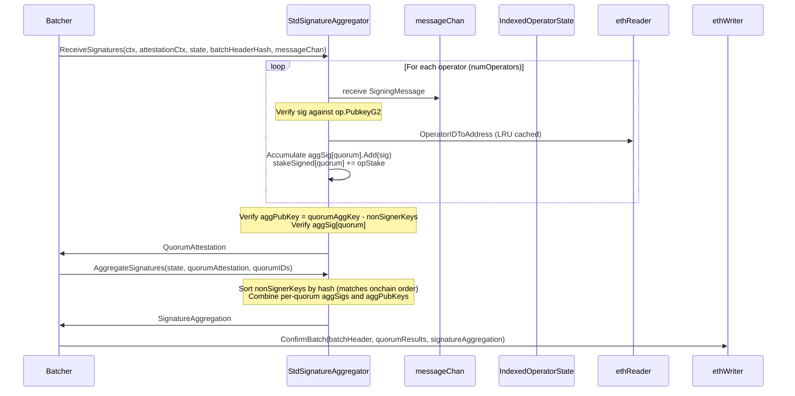
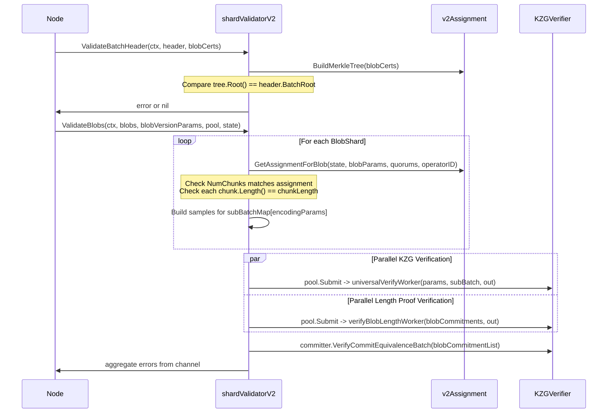
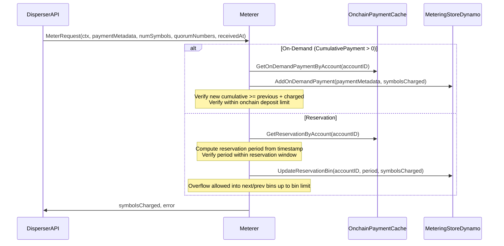
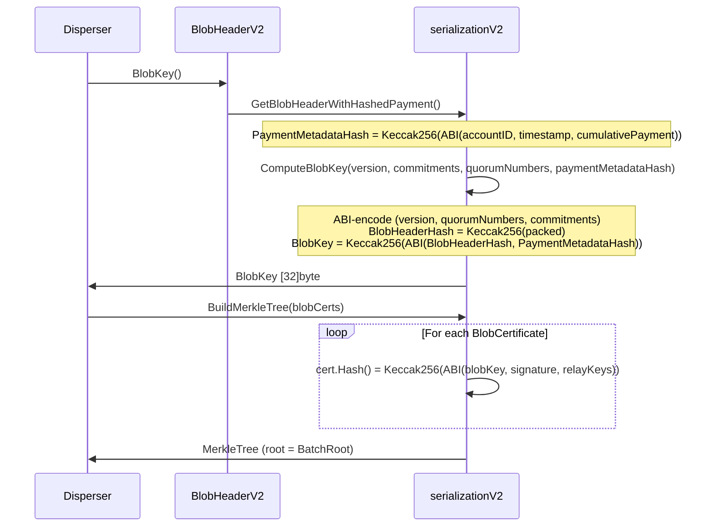
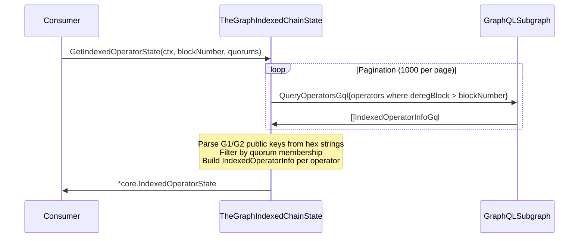

# core Analysis

**Analyzed by**: code-analyzer-core
**Timestamp**: 2026-04-10T00:00:00Z
**Application Type**: go-module
**Classification**: library
**Location**: core

## Architecture

The `core` package is the central domain model and business logic library for EigenDA. It defines the authoritative type system, interfaces, and algorithms that all other EigenDA components depend upon. The architecture follows a layered, interface-driven design: top-level domain types (blobs, batches, quorums, operators) are declared in the root package, while sub-packages implement concrete strategies against those abstractions.

The package is structured around several distinct concerns. At the root level (`core/`), domain types and interfaces are defined: `Blob`, `BlobHeader`, `BatchHeader`, `OperatorState`, `SecurityParam`, `PaymentMetadata`, plus the `Reader`, `Writer`, `ChainState`, `IndexedChainState`, `SignatureAggregator`, `AssignmentCoordinator`, and `ShardValidator` interfaces. These interfaces form a clean seam between pure domain logic and infrastructure. Concrete Ethereum-backed implementations live in `core/eth/`, while blockchain-event indexing lives in `core/indexer/`, and The Graph-based state retrieval lives in `core/thegraph/`.

BLS cryptography on the BN254 elliptic curve is isolated in `core/bn254/`, exposing pairing-based signature verification and hash-to-curve primitives. Wrapping these, `core/attestation.go` defines the `G1Point`, `G2Point`, `Signature`, and `KeyPair` types, which form the basis for the BLS multi-signature aggregation implemented in `core/aggregation.go` (`StdSignatureAggregator`).

The package has an explicit versioning split: the root `core/` package implements the original v1 dispersal protocol, and `core/v2/` implements the revised v2 protocol with `BlobKey`, `BlobCertificate`, `Attestation`, and stake-proportional chunk assignment with multi-quorum overlap maximization. Payment accounting is further structured under `core/payments/`, with sub-packages for reservation-based payments (`core/payments/reservation/`) and on-demand payments (`core/payments/ondemand/`), both supporting server-side and client-side ledger views.

Error handling throughout the package follows Go idioms: errors are returned as values and wrapped with context using `fmt.Errorf("%w", ...)`. Validation functions (`ValidateSecurityParam`, `ValidateChunkLength`) return typed sentinel errors (`ErrChunkLengthTooSmall`, `ErrAggSigNotValid`) for programmatic branching. Heavy computation (KZG proof verification, sub-batch universally verified samples) is parallelized via a `common.WorkerPool` channel pattern.

## Key Components

- **Domain Types — data.go, state.go** (`core/data.go`, `core/state.go`): Defines the canonical EigenDA type vocabulary used everywhere in the system: `Blob`, `BlobHeader`, `BlobQuorumInfo`, `BatchHeader`, `EncodedBlob`, `Bundle`, `ChunksData`, `QuorumID`, `SecurityParam`, `OperatorID`, `OperatorState`, `IndexedOperatorState`, `PaymentMetadata`, `ReservedPayment`, `OnDemandPayment`, and `BlobVersionParameters`. Also contains `ChainState` and `IndexedChainState` interfaces that decouple business logic from Ethereum node access.

- **BN254 Cryptography — bn254/attestation.go** (`core/bn254/attestation.go`): Implements the BN254 elliptic curve primitives: `VerifySig` (pairing-based BLS signature verification), `MapToCurve` (deterministic hash-to-G1-point), `CheckG1AndG2DiscreteLogEquality`, generator point accessors, and `MakePubkeyRegistrationData` (rogue-key-attack-resistant proof of possession). All BLS math is delegated to `gnark-crypto`.

- **BLS Attestation Types — attestation.go** (`core/attestation.go`): Wraps gnark-crypto BN254 types in EigenDA-specific `G1Point`, `G2Point`, `Signature`, and `KeyPair` types with domain-relevant methods: `Add`, `Sub`, `Clone`, `Verify`, `SignMessage`, `GetOperatorID`, `MakePubkeyRegistrationData`. Provides the Go type layer that the rest of the system uses without importing gnark-crypto directly.

- **Signature Aggregation — aggregation.go** (`core/aggregation.go`): Implements `SignatureAggregator` via `StdSignatureAggregator`. `ReceiveSignatures` collects operator signing messages from a channel, verifies each individual BLS signature against the operator's G2 public key, accumulates stake-weighted totals per quorum, verifies the aggregate public key matches the on-chain aggregate minus non-signers, and verifies the aggregate signature. `AggregateSignatures` merges per-quorum attestation results into a cross-quorum `SignatureAggregation` compatible with the EigenDA service manager contract.

- **Chunk Assignment (v1) — assignment.go** (`core/assignment.go`): Implements `AssignmentCoordinator` via `StdAssignmentCoordinator`. Computes stake-proportional chunk assignments using `m_i = ceil(B * S_i / (C * gamma * sum(S_j)))`. Validates chunk length constraints. `CalculateChunkLength` performs a multiplicative binary search to find the largest valid chunk length satisfying both protocol constraints and an optional target total chunk count.

- **Chunk Assignment (v2) — v2/assignment.go** (`core/v2/assignment.go`): Implements the v2 assignment algorithm with multi-quorum overlap maximization. `GetAssignmentsForQuorum` distributes chunks proportionally by stake. `AddAssignmentsForQuorum` maximizes overlap between quorums by re-using existing indices. `MergeAssignmentsAndCap` unions per-quorum assignments and caps at the reconstruction threshold. `GetAssignmentsForBlob` orchestrates the full multi-quorum process.

- **Shard Validator (v1) — validator.go** (`core/validator.go`): Implements `ShardValidator` for v1 protocol. `ValidateBatch` checks the Merkle root then calls `ValidateBlobs`. `ValidateBlobs` assembles sub-batches by encoding params and uses a `WorkerPool` to parallelize KZG universal verification and length proof verification across goroutines.

- **Shard Validator (v2) — v2/validator.go** (`core/v2/validator.go`): Implements `ShardValidator` for v2 protocol. `ValidateBatchHeader` rebuilds the Merkle tree from blob certificates and compares the root. `ValidateBlobs` looks up blob version params, computes assignments, builds encoding sample sub-batches, and parallelizes KZG verification using the v2 committer/verifier.

- **Serialization — serialization.go, v2/serialization.go** (`core/serialization.go`, `core/v2/serialization.go`): Provides ABI-encoding (matching Solidity struct layouts) and Keccak256 hashing for on-chain verifiable hashes of `BatchHeader`, `BlobHeader`, `PaymentMetadata`, `BlobCertificate`, and `BlobKey`. Also implements Merkle tree construction (`SetBatchRoot`, `BuildMerkleTree`) using `wealdtech/go-merkletree`. Uses `gob` encoding for internal serialization of headers.

- **Ethereum Chain I/O — chainio.go, eth/reader.go, eth/writer.go** (`core/chainio.go`, `core/eth/reader.go`, `core/eth/writer.go`): `Reader` and `Writer` interfaces abstract all Ethereum contract interactions. `eth.Reader` implements `core.Reader` by calling auto-generated Go bindings for EigenDA smart contracts (registry coordinator, stake registry, payment vault, relay registry, etc.). `eth.Writer` adds operator registration/deregistration and batch confirmation transactions.

- **Meterer — meterer/meterer.go** (`core/meterer/meterer.go`): Validates and accounts for blob dispersal payments. Supports both reservation-based and on-demand payment modes. Periodically refreshes on-chain payment state. Uses `MeteringStore` (backed by DynamoDB) for persistent accounting of per-period reservation usage and cumulative on-demand payments.

- **Payment Subsystem — payments/** (`core/payments/`): Hierarchically organized under `core/payments/`. `payments.PaymentVault` interface abstracts the on-chain payment vault. `clientledger.ClientLedger` manages client-side payment state combining reservation and on-demand ledgers. `reservation.ReservationLedger` tracks reservation allocation locally. `ondemand.OnDemandLedger` tracks cumulative on-demand payment flow. Server-side validators (`reservationvalidation`, `ondemandvalidation`) cache and validate payment state at the disperser.

- **Signing Rate Tracker — signingrate/** (`core/signingrate/`): Defines `SigningRateTracker` interface and implementation for monitoring per-validator, per-quorum signing success/failure rates over time-bucketed windows. Backed by an in-memory bucket store with optional DynamoDB persistence (`DynamoSigningRateStorage`) and a no-op implementation for testing.

- **TheGraph State — thegraph/state.go** (`core/thegraph/state.go`): Implements `IndexedChainState` by querying EigenDA subgraphs via GraphQL using `shurcooL/graphql`. Retrieves operator public keys and sockets with exponential backoff retry. Bridges blockchain event data with `core.IndexedOperatorState`.

- **Indexer — indexer/indexer.go** (`core/indexer/indexer.go`): Creates an `indexer.Indexer` that subscribes to Ethereum event logs for operator public key registrations and socket updates, and accumulates this state for in-memory access.

- **Auth (v1) — auth/authenticator.go** (`core/auth/authenticator.go`): Implements `core.BlobRequestAuthenticator`, verifying ECDSA signatures over `Keccak256(nonce)` against the caller's public key in the `BlobAuthHeader`.

- **Auth (v2) — auth/v2/authenticator.go** (`core/auth/v2/authenticator.go`): Implements `core/v2.BlobRequestAuthenticator`, verifying ECDSA signatures over the `BlobKey` for blob requests, and signed timestamps with replay protection (via `common/replay.ReplayGuardian`) for payment state requests.

## Data Flows

### 1. BLS Signature Aggregation (v1)

**Flow Description**: The disperser's batcher collects signatures from all DA operators after sending out chunk data, then aggregates them for on-chain confirmation.



**Detailed Steps**:

1. **Collect Signatures** (Batcher -> StdSignatureAggregator)
   - Method: `ReceiveSignatures(ctx, attestationCtx, state *IndexedOperatorState, message [32]byte, messageChan chan SigningMessage)`
   - Blocks on `messageChan` until all operators reply or `attestationCtx` is cancelled.
   - For each valid signature: verifies `sig.Verify(op.PubkeyG2, message)`, adds stake to `stakeSigned[quorum]`, adds sig to `aggSigs[quorum]`, adds pubkey to `aggPubKeys[quorum]`.

2. **Verify Per-Quorum Aggregate** (StdSignatureAggregator internal)
   - Computes `signersAggKey = quorumAggKey - sum(nonSignerKeys in quorum)`
   - Verifies `signersAggKey equivalent to aggPubKeys[quorum]` via pairing equivalence check.
   - Verifies `aggSigs[quorum].Verify(aggPubKeys[quorum], message)`.

3. **Cross-Quorum Aggregation** (Batcher -> StdSignatureAggregator)
   - Method: `AggregateSignatures(indexedOperatorState, quorumAttestation, quorumIDs)`
   - Accumulates final `AggSignature` and `AggPubKey` across quorums.
   - Sorts `NonSigners` by `G1Point.Hash()` to match Solidity `BLSSignatureChecker` ordering.

**Error Paths**:
- `ErrAggPubKeyNotValid` — no signers in a quorum
- `ErrPubKeysNotEqual` — aggregate key mismatch (indicates state inconsistency)
- `ErrAggSigNotValid` — BLS pairing check fails

---

### 2. Shard Validation (v2)

**Flow Description**: A DA node validates the encoded blob chunks it receives, verifying Merkle inclusion, chunk count, chunk lengths, and KZG polynomial proofs.



**Detailed Steps**:

1. **Batch Header Validation** (`ValidateBatchHeader`)
   - Rebuilds Merkle tree from `BlobCertificate.Hash()` leaves.
   - Compares `tree.Root()` bytes to `header.BatchRoot`.

2. **Chunk Assignment Verification** (per blob)
   - Looks up `BlobVersionParameters` for the blob version.
   - Calls `GetAssignmentForBlob(state, blobParams, quorumNumbers, operatorID)`.
   - Validates `assignment.NumChunks() == len(blob.Bundle)`.
   - Validates all chunks have expected `ChunkLength` from `blobParams.GetChunkLength(blobLength)`.

3. **KZG Proof Verification** (parallelized)
   - Groups samples into `subBatchMap[EncodingParams]`.
   - Submits `universalVerifyWorker` and `verifyBlobLengthWorker` tasks to the worker pool.
   - Drains result channel and returns first error.

---

### 3. Payment Metering (disperser-side)

**Flow Description**: The disperser API server validates incoming dispersal payment metadata before accepting a blob.



---

### 4. BlobKey Computation and Merkle Batch Root (v2)

**Flow Description**: Before dispatching a batch, the disperser computes `BlobKey` and builds a Merkle tree over `BlobCertificate` hashes for the `BatchHeader.BatchRoot`.



---

### 5. Operator State Retrieval via TheGraph

**Flow Description**: The disperser and nodes retrieve `IndexedOperatorState` (including BLS public keys and sockets) from The Graph subgraph.



## Dependencies

### External Libraries

- **github.com/consensys/gnark-crypto** (v0.18.0) [crypto]: Pure-Go BN254 elliptic curve library providing pairing operations, field arithmetic (`fp.Element`, `fr.Element`), and G1/G2 affine point types. Used for all BLS signature operations: `PairingCheck` (signature verification), `MapToCurve`, `ScalarMultiplication`, G1/G2 serialization/deserialization. Imported in: `core/bn254/attestation.go`, `core/attestation.go`, `core/serialization.go`, `core/data.go`, `core/thegraph/state.go`, `core/v2/types.go`.

- **github.com/ethereum/go-ethereum** (v1.15.3, pinned via op-geth replace directive) [blockchain]: Ethereum Go client library. Used for: ABI encoding (`accounts/abi`), ECDSA key operations (`crypto.SigToPub`, `crypto.Keccak256Hash`, `crypto.PubkeyToAddress`), Ethereum address types (`common.Address`), transaction types, and all auto-generated contract bindings. Imported in: nearly all files under `core/`, `core/eth/`, `core/auth/`, `core/v2/`, `core/payments/`.

- **github.com/Layr-Labs/eigensdk-go** (v0.2.0-beta.1.0.20250118004418-2a25f31b3b28) [blockchain]: EigenLayer Go SDK providing structured logging (`logging.Logger`) and BLS signer abstraction (`blssigner.Signer`). Used in: `core/aggregation.go` (logger), `core/chainio.go` (blssigner), `core/eth/reader.go` (logger), `core/utils.go` (logger), `core/meterer/meterer.go` (logger), and most sub-packages.

- **github.com/Layr-Labs/eigensdk-go/signer** (v0.0.0-20250118004418-2a25f31b3b28) [crypto]: BLS signer sub-module from EigenSDK, used in `core/chainio.go` `Writer.RegisterOperator` for the BLS signing step during operator registration. Imported in: `core/chainio.go`, `core/eth/reader.go`.

- **github.com/aws/aws-sdk-go-v2** (v1.26.1) [cloud-sdk]: AWS SDK v2 core, used via sub-packages. DynamoDB attribute value types (`service/dynamodb/types`) support `PaymentMetadata.MarshalDynamoDBAttributeValue`/`UnmarshalDynamoDBAttributeValue`. DynamoDB client is used in metering and signing rate storage for persistent payment accounting. Imported in: `core/data.go`, `core/meterer/dynamodb_metering_store.go`, `core/meterer/util.go`, `core/signingrate/dynamo_signing_rate_storage.go`, `core/payments/ondemand/cumulative_payment_store.go`, `core/payments/ondemand/ondemandvalidation/`.

- **github.com/wealdtech/go-merkletree/v2** (v2.6.0) [crypto]: Merkle tree implementation using pluggable hash functions. Used with Keccak256 in `core/serialization.go` (`BatchHeader.SetBatchRoot`) and `core/v2/serialization.go` (`BuildMerkleTree`) to build Merkle trees over blob headers/certificates. Imported in: `core/serialization.go`, `core/v2/serialization.go`.

- **github.com/hashicorp/golang-lru/v2** (indirect) [other]: Thread-safe LRU cache. Used in `core/aggregation.go` `StdSignatureAggregator.OperatorAddresses` to cache `OperatorID -> gethcommon.Address` lookups (capacity 300) and in `core/eth/` for operator state caching. Imported in: `core/aggregation.go`, `core/eth/validator_id_to_address.go`, `core/eth/operatorstate/operator_state_cache.go`, `core/payments/reservation/reservationvalidation/`, `core/payments/ondemand/ondemandvalidation/`.

- **github.com/shurcooL/graphql** (v0.0.0-20230722043721-ed46e5a46466) [networking]: GraphQL client library. Used in `core/thegraph/state.go` and `core/thegraph/querier.go` to query EigenDA's The Graph subgraph for operator public keys and socket addresses with pagination. Imported in: `core/thegraph/state.go`, `core/thegraph/querier.go`.

- **github.com/pingcap/errors** (v0.11.4) [other]: Extended error handling with stack traces. Used in `core/eth/reader.go` for error wrapping in Ethereum contract call paths. Imported in: `core/eth/reader.go`.

- **golang.org/x/exp** (v0.0.0-20241009180824-f66d83c29e7c) [other]: Go experimental packages. `constraints.Integer` generic type constraint is used in `core/utils.go` for the generic `RoundUpDivide` and `NextPowerOf2` functions. Imported in: `core/utils.go`.

- **golang.org/x/crypto/sha3** (indirect) [crypto]: SHA3/Keccak256 implementation. Used directly for `sha3.NewLegacyKeccak256()` in `core/serialization.go`, `core/v2/serialization.go`, and `core/data.go` to compute hashes matching Solidity's `keccak256()`. Imported in: `core/serialization.go`, `core/v2/serialization.go`, `core/data.go`.

- **github.com/stretchr/testify** (v1.11.1) [testing]: Assertion library. Used exclusively in `*_test.go` files throughout the `core/` tree for test assertions.

- **go.uber.org/mock** (v0.4.0) [testing]: Mock generation for Go interfaces. Used to generate mock implementations in `core/mock/` and related test packages.

### Internal Libraries

- **api** (`api/`): gRPC protobuf generated types consumed throughout `core/`. `core/serialization.go` uses `api/grpc/node` pb types for `BatchHeaderFromProtobuf`/`BlobHeaderFromProtobuf`. `core/v2/types.go` uses `api/grpc/common/v2` and `api/grpc/disperser/v2` for `BlobHeader.ToProtobuf()`, `Attestation.ToProtobuf()`, `BlobInclusionInfo.ToProtobuf()`. `core/auth/v2/authenticator.go` uses `api/grpc/disperser/v2` for `GetPaymentStateRequest` and `api/hashing` for request hashing. `core/payments/clientledger/client_ledger.go` uses `api/clients/v2/metrics`.

- **common** (`common/`): Shared EigenDA utilities. `core/utils.go` imports `eigensdk-go/logging` (re-exported via `common`). `core/validator.go` uses `common.WorkerPool` for parallel KZG verification. `core/v2/blob_params.go` uses `common.ReadOnlyMap`. Multiple payment sub-packages use `common/enforce`, `common/ratelimit`, `common/replay` (for replay protection in auth).

- **encoding** (`encoding/`): KZG polynomial encoding types and logic. `core/data.go` imports `encoding.Frame`, `encoding.BlobCommitments`, `encoding.BYTES_PER_SYMBOL`. `core/validator.go` uses `encoding.EncodingParams`, `encoding.SubBatch`, `encoding.Sample` and delegates to `encoding/v1/kzg/verifier.Verifier`. `core/v2/validator.go` uses `encoding/v2/kzg/verifier` and `encoding/v2/kzg/committer`.

- **indexer** (`indexer/`): Event indexing framework. `core/indexer/indexer.go` calls `indexer.New(...)` and uses `indexer/eth.NewHeaderService` and `indexer/inmem.NewHeaderStore` to wire up the EigenDA-specific Ethereum event accumulator for operator public keys and sockets.

## API Surface

The `core` package exposes its API entirely through Go interfaces, types, and functions. There are no HTTP endpoints.

### Exported Interfaces

**ChainState** (`core/state.go:176`): Blockchain state reader.
```go
type ChainState interface {
    GetCurrentBlockNumber(ctx context.Context) (uint, error)
    GetOperatorState(ctx context.Context, blockNumber uint, quorums []QuorumID) (*OperatorState, error)
    GetOperatorStateWithSocket(ctx context.Context, blockNumber uint, quorums []QuorumID) (*OperatorState, error)
    GetOperatorStateByOperator(ctx context.Context, blockNumber uint, operator OperatorID) (*OperatorState, error)
    GetOperatorSocket(ctx context.Context, blockNumber uint, operator OperatorID) (string, error)
}
```

**IndexedChainState** (`core/state.go:185`): Extends `ChainState` with event-indexed operator data (BLS keys, sockets).
```go
type IndexedChainState interface {
    ChainState
    GetIndexedOperatorState(ctx context.Context, blockNumber uint, quorums []QuorumID) (*IndexedOperatorState, error)
    GetIndexedOperators(ctx context.Context, blockNumber uint) (map[OperatorID]*IndexedOperatorInfo, error)
    Start(context context.Context) error
}
```

**Reader** (`core/chainio.go:40`): Read-only Ethereum contract interactions. Includes operator registration queries, stake retrieval, payment state queries, quorum parameters, blob version parameters, and disperser/relay registry lookups. Over 20 methods.

**Writer** (`core/chainio.go:146`): Extends `Reader` with write operations: `RegisterOperator`, `RegisterOperatorWithChurn`, `DeregisterOperator`, `UpdateOperatorSocket`, `BuildEjectOperatorsTxn`, `BuildConfirmBatchTxn`, `ConfirmBatch`.

**SignatureAggregator** (`core/aggregation.go:80`):
```go
type SignatureAggregator interface {
    ReceiveSignatures(ctx, attestationCtx context.Context, state *IndexedOperatorState,
        message [32]byte, messageChan chan SigningMessage) (*QuorumAttestation, error)
    AggregateSignatures(indexedOperatorState *IndexedOperatorState,
        quorumAttestation *QuorumAttestation, quorumIDs []QuorumID) (*SignatureAggregation, error)
}
```

**AssignmentCoordinator** (`core/assignment.go:83`):
```go
type AssignmentCoordinator interface {
    GetAssignments(state *OperatorState, blobLength uint, info *BlobQuorumInfo) (map[OperatorID]Assignment, AssignmentInfo, error)
    GetOperatorAssignment(state *OperatorState, header *BlobHeader, quorum QuorumID, id OperatorID) (Assignment, AssignmentInfo, error)
    ValidateChunkLength(state *OperatorState, blobLength uint, info *BlobQuorumInfo) (bool, error)
    CalculateChunkLength(state *OperatorState, blobLength uint, targetNumChunks ChunkNumber, param *SecurityParam) (uint, error)
}
```

**ShardValidator** (`core/validator.go:17`, `core/v2/validator.go:22`): v1 and v2 DA node blob validation.

**BlobRequestAuthenticator** (`core/auth.go:3`, `core/v2/auth.go:8`): ECDSA-based blob request authentication. v2 additionally covers payment state request authentication with replay protection.

**BlobRequestSigner** (`core/auth.go:7`, `core/v2/auth.go:13`): Signs blob requests with ECDSA. v2 additionally signs payment state requests.

**SigningRateTracker** (`core/signingrate/signing_rate_tracker.go:12`): Tracks per-validator signing rates over time-bucketed windows with flush-to-DynamoDB support.

**MeteringStore** (`core/meterer/metering_store.go:16`): Storage backend interface for payment accounting (reservation bins, on-demand cumulative payments).

**PaymentVault** (`core/payments/payment_vault.go:12`): On-chain payment vault contract abstraction providing deposit queries, rate limits, and reservation retrieval.

### Exported Types and Functions

Key exported types: `Blob`, `BlobHeader`, `BlobQuorumInfo`, `BatchHeader`, `EncodedBlob`, `Bundle`, `EncodedBundles`, `ChunksData`, `SecurityParam`, `QuorumResult`, `QuorumID`, `OperatorID`, `OperatorIndex`, `OperatorState`, `IndexedOperatorState`, `OperatorInfo`, `IndexedOperatorInfo`, `OperatorSocket`, `Assignment`, `AssignmentInfo`, `PaymentMetadata`, `ReservedPayment`, `OnDemandPayment`, `BlobVersionParameters`, `G1Point`, `G2Point`, `Signature`, `KeyPair`, `SigningMessage`, `QuorumAttestation`, `SignatureAggregation`.

Key exported functions: `NewStdSignatureAggregator`, `NewShardValidator` (v1 and v2), `ValidateSecurityParam`, `GetStakeThreshold`, `GetSignedPercentage`, `BatchHeaderFromProtobuf`, `BlobHeaderFromProtobuf`, `ComputeSignatoryRecordHash`, `MakeKeyPair`, `MakeKeyPairFromString`, `GenRandomBlsKeys`, `ParseOperatorSocket`, `MakeOperatorSocket`, `RoundUpDivide`, `RoundUpDivideBig`, `NextPowerOf2`.

Key v2 exported functions: `ComputeBlobKey`, `BuildMerkleTree`, `GetAssignmentsForBlob`, `GetAssignmentForBlob`, `GetAssignmentsForQuorum`, `AddAssignmentsForQuorum`, `MergeAssignmentsAndCap`.

## Code Examples

### Example 1: BLS Key Generation and Signing

```go
// core/attestation.go
func GenRandomBlsKeys() (*KeyPair, error) {
    max := new(big.Int)
    max.SetString(fr.Modulus().String(), 10)
    n, err := rand.Int(rand.Reader, max)
    if err != nil {
        return nil, err
    }
    sk := new(PrivateKey).SetBigInt(n)
    return MakeKeyPair(sk), nil
}

func (k *KeyPair) SignMessage(message [32]byte) *Signature {
    H := bn254utils.MapToCurve(message)
    sig := new(bn254.G1Affine).ScalarMultiplication(H, k.PrivKey.BigInt(new(big.Int)))
    return &Signature{&G1Point{sig}}
}
```

### Example 2: Stake-Proportional Chunk Assignment (v1)

```go
// core/assignment.go — GetAssignments
// m_i = ceil( B * S_i / (C * gamma * sum(S_j)) )
num := new(big.Int).Mul(big.NewInt(int64(blobLength*PercentMultiplier)), r.Stake)
gammaChunkLength := big.NewInt(int64(info.ChunkLength) * int64(info.ConfirmationThreshold - info.AdversaryThreshold))
denom := new(big.Int).Mul(gammaChunkLength, totalStakes)
m := RoundUpDivideBig(num, denom)
```

### Example 3: ABI-Compatible BlobKey Hashing (v2)

```go
// core/v2/serialization.go — ComputeBlobKey
// Step 1: hash blob header fields (must match EigenDAHasher.sol)
hasher := sha3.NewLegacyKeccak256()
hasher.Write(packedBytes) // ABI(version, quorumNumbers, commitments)
copy(headerHash[:], hasher.Sum(nil)[:32])

// Step 2: combine with payment metadata hash
s2 := struct {
    BlobHeaderHash      [32]byte
    PaymentMetadataHash [32]byte
}{headerHash, paymentMetadataHash}
packedBytes, _ = arguments.Pack(s2)
hasher = sha3.NewLegacyKeccak256()
hasher.Write(packedBytes)
copy(blobKey[:], hasher.Sum(nil)[:32])
```

### Example 4: Bundle Binary Format

```go
// core/data.go — Bundle.Serialize
// Format: <8-byte header><gnark-encoded chunks...>
// Header: [0:8] = (encodingFormat << 56) | chunkLen (little-endian uint64)
metadata := BinaryBundleHeader(uint64(len(b[0].Coeffs)))
binary.LittleEndian.PutUint64(buf, metadata)
buf = buf[8:]
for _, f := range b {
    chunk, _ := f.SerializeGnark()
    copy(buf, chunk)
    buf = buf[len(chunk):]
}
```

### Example 5: Parallel Shard Verification

```go
// core/v2/validator.go — ValidateBlobs
numResult := len(subBatchMap) + len(blobCommitmentList)
out := make(chan error, numResult)

for params, subBatch := range subBatchMap {
    pool.Submit(func() {
        v.universalVerifyWorker(params, subBatch, out)
    })
}
for _, blobCommitments := range blobCommitmentList {
    pool.Submit(func() {
        v.verifyBlobLengthWorker(blobCommitments, out)
    })
}
// Blocks until all verification tasks complete
for i := 0; i < numResult; i++ {
    if err := <-out; err != nil {
        return err
    }
}
```

## Files Analyzed

- `core/data.go` (745 lines) — Primary domain type definitions: blobs, chunks, payments, quorums
- `core/state.go` (193 lines) — Operator state types and ChainState/IndexedChainState interfaces
- `core/chainio.go` (197 lines) — Reader and Writer interface definitions for Ethereum I/O
- `core/attestation.go` (209 lines) — G1Point, G2Point, Signature, KeyPair types with BLS operations
- `core/aggregation.go` (453 lines) — StdSignatureAggregator: BLS signature collection and aggregation
- `core/assignment.go` (266 lines) — StdAssignmentCoordinator: v1 stake-proportional chunk assignment
- `core/validator.go` (233 lines) — v1 ShardValidator: parallel KZG verification
- `core/auth.go` (11 lines) — v1 auth interfaces
- `core/serialization.go` (561 lines) — ABI encoding, Keccak256 hashing, Merkle tree, protobuf conversions
- `core/utils.go` (54 lines) — Generic math utilities (RoundUpDivide, NextPowerOf2, ValidatePort)
- `core/bn254/attestation.go` (111 lines) — Raw BN254 primitives: pairing verification, map-to-curve
- `core/v2/types.go` (445 lines) — v2 domain types: BlobKey, BlobHeader, BlobCertificate, Attestation
- `core/v2/assignment.go` (295 lines) — v2 multi-quorum overlap-maximizing chunk assignment
- `core/v2/validator.go` (231 lines) — v2 ShardValidator with BlobVersionParameterMap
- `core/v2/serialization.go` (405 lines) — v2 BlobKey computation, Merkle tree, ABI encoding
- `core/v2/auth.go` (18 lines) — v2 auth interfaces
- `core/v2/blob_params.go` (13 lines) — BlobVersionParameterMap type alias
- `core/auth/authenticator.go` (59 lines) — v1 ECDSA blob request authenticator
- `core/auth/v2/authenticator.go` (109 lines) — v2 ECDSA authenticator with replay protection
- `core/eth/reader.go` (80+ lines sampled) — Ethereum contract reader implementation
- `core/eth/state.go` (133 lines) — ChainState adapter over Reader
- `core/meterer/meterer.go` (80+ lines sampled) — Disperser-side payment metering
- `core/meterer/metering_store.go` (35 lines) — MeteringStore interface for DynamoDB backend
- `core/payments/payment_vault.go` (46 lines) — PaymentVault interface
- `core/payments/clientledger/client_ledger.go` (60+ lines sampled) — Client-side payment ledger
- `core/indexer/indexer.go` (60 lines) — EigenDA indexer factory using event accumulators
- `core/thegraph/state.go` (60+ lines sampled) — GraphQL-based indexed operator state retrieval
- `core/signingrate/signing_rate_tracker.go` (77 lines) — SigningRateTracker interface
- `go.mod` (80+ lines sampled) — Module dependency manifest

## Analysis Data

```json
{
  "summary": "The core package is EigenDA's central domain library, defining canonical types (Blob, BlobHeader, BatchHeader, OperatorState, PaymentMetadata), BLS cryptographic primitives on BN254, multi-quorum BLS signature aggregation, stake-proportional chunk assignment algorithms (v1 and v2), KZG shard validation, Ethereum contract I/O interfaces and implementations, payment metering and accounting logic, and operator state retrieval from both Ethereum nodes and The Graph subgraph. It exposes Go interfaces for all major system behaviors and provides concrete standard implementations, with v1 and v2 protocol variants maintained in parallel.",
  "architecture_pattern": "layered interface-driven with protocol versioning",
  "key_modules": [
    "core (root) — domain types and interfaces: Blob, BlobHeader, BatchHeader, OperatorState, ChainState, IndexedChainState, Reader, Writer, SignatureAggregator, AssignmentCoordinator, ShardValidator",
    "core/bn254 — BN254 elliptic curve primitives: VerifySig, MapToCurve, PairingCheck",
    "core/attestation.go — G1Point, G2Point, Signature, KeyPair BLS type wrappers",
    "core/aggregation.go — StdSignatureAggregator: BLS multi-quorum signature collection and aggregation",
    "core/assignment.go — StdAssignmentCoordinator: v1 stake-proportional chunk assignment",
    "core/validator.go — v1 ShardValidator with parallel KZG verification",
    "core/serialization.go — ABI-compatible hashing, Merkle tree, protobuf conversions",
    "core/v2 — v2 protocol: BlobKey, BlobCertificate, Attestation, multi-quorum chunk assignment, v2 ShardValidator",
    "core/eth — Ethereum contract reader/writer implementations",
    "core/meterer — disperser-side payment metering (reservation + on-demand)",
    "core/payments — payment vault interface, client ledger, reservation/on-demand ledgers and validators",
    "core/signingrate — validator signing rate tracking with DynamoDB persistence",
    "core/thegraph — GraphQL-based indexed operator state retrieval",
    "core/indexer — Ethereum event-based operator pubkey/socket indexer",
    "core/auth — v1 and v2 ECDSA blob request authentication"
  ],
  "api_endpoints": [],
  "data_flows": [
    "BLS Signature Aggregation: messageChan -> ReceiveSignatures (verify individual sigs, accumulate stake per quorum, verify aggregate key) -> QuorumAttestation -> AggregateSignatures (sort non-signers, merge quorums) -> SignatureAggregation -> ConfirmBatch on-chain",
    "v2 Shard Validation: ValidateBatchHeader (rebuild Merkle tree, compare root) -> ValidateBlobs (per-blob: assignment lookup, chunk count/length checks, sample grouping) -> parallel KZG universalVerify + lengthProof workers",
    "Payment Metering: MeterRequest -> on-demand path (check onchain deposit, AddOnDemandPayment to DynamoDB) or reservation path (compute period, UpdateReservationBin in DynamoDB with overflow support)",
    "BlobKey Computation: BlobHeader -> hash PaymentMetadata -> ABI-encode (version, quorums, commitments) -> Keccak256(header fields) -> Keccak256(ABI(headerHash, paymentMetadataHash)) = BlobKey",
    "Operator State Retrieval: GetIndexedOperatorState -> GraphQL paginated query (1000/page) -> parse G1/G2 pubkeys -> filter by quorum -> IndexedOperatorState"
  ],
  "tech_stack": ["go", "bn254-elliptic-curve", "kzg-polynomial-commitments", "ethereum-abi", "dynamodb", "graphql"],
  "external_integrations": [
    "AWS DynamoDB — payment metering store (reservation bins, on-demand payments) and signing rate storage",
    "The Graph (GraphQL subgraph) — indexed operator public keys and socket addresses",
    "Ethereum RPC — smart contract read/write via go-ethereum bindings (EigenDARegistryCoordinator, StakeRegistry, PaymentVault, EigenDAServiceManager, etc.)"
  ],
  "component_interactions": [
    "api — imports gRPC protobuf types for conversion functions (BlobHeaderFromProtobuf, BlobCertificate.ToProtobuf, Attestation.ToProtobuf)",
    "common — imports WorkerPool, ReadOnlyMap, enforce, ratelimit, replay, EthClient interfaces",
    "encoding — imports Frame, BlobCommitments, EncodingParams, SubBatch, Sample; delegates KZG verification to encoding/v1/kzg/verifier and encoding/v2/kzg/verifier",
    "indexer — imports indexer.Indexer, indexer/eth.HeaderService, indexer/inmem.HeaderStore for event accumulation"
  ]
}
```

## Citations

```json
[
  {
    "file_path": "core/data.go",
    "start_line": 22,
    "end_line": 39,
    "claim": "QuorumID is defined as uint8 supporting up to 192 quorums (MaxQuorumID=191); SecurityParam encodes adversary and confirmation thresholds per quorum",
    "section": "Key Components",
    "snippet": "type QuorumID = uint8\ntype SecurityParam struct {\n    QuorumID QuorumID\n    AdversaryThreshold uint8\n    ConfirmationThreshold uint8\n    QuorumRate common.RateParam\n}"
  },
  {
    "file_path": "core/data.go",
    "start_line": 226,
    "end_line": 237,
    "claim": "Blob is the fundamental unit of data with a BlobRequestHeader containing ECDSA-based authentication and security parameters",
    "section": "Key Components",
    "snippet": "type Blob struct {\n    RequestHeader BlobRequestHeader\n    Data          []byte\n}"
  },
  {
    "file_path": "core/data.go",
    "start_line": 502,
    "end_line": 547,
    "claim": "PaymentMetadata is the core payment type distinguishing reservation (CumulativePayment=0) from on-demand (CumulativePayment>0) payments, with DynamoDB and protobuf serialization support",
    "section": "Key Components",
    "snippet": "func (pm *PaymentMetadata) IsOnDemand() bool {\n    return pm.CumulativePayment != nil && pm.CumulativePayment.Cmp(big.NewInt(0)) != 0\n}"
  },
  {
    "file_path": "core/data.go",
    "start_line": 696,
    "end_line": 728,
    "claim": "BlobVersionParameters defines coding rate, max operators, and num chunks per blob version; GetChunkLength validates blob length is a power of 2",
    "section": "Key Components",
    "snippet": "func (bvp *BlobVersionParameters) GetChunkLength(blobLengthSymbols uint32) (uint32, error) {\n    if blobLengthSymbols&(blobLengthSymbols-1) != 0 {\n        return 0, fmt.Errorf(\"blob length %d is not a power of 2\", blobLengthSymbols)\n    }\n    chunkLength := blobLengthSymbols * bvp.CodingRate / bvp.NumChunks\n}"
  },
  {
    "file_path": "core/state.go",
    "start_line": 105,
    "end_line": 113,
    "claim": "OperatorState maps quorum IDs to operators and their stakes, with per-quorum totals, anchored at a specific block number",
    "section": "Key Components",
    "snippet": "type OperatorState struct {\n    Operators map[QuorumID]map[OperatorID]*OperatorInfo\n    Totals map[QuorumID]*OperatorInfo\n    BlockNumber uint\n}"
  },
  {
    "file_path": "core/state.go",
    "start_line": 176,
    "end_line": 192,
    "claim": "ChainState and IndexedChainState interfaces decouple business logic from Ethereum node and event indexer implementations",
    "section": "API Surface",
    "snippet": "type ChainState interface {\n    GetCurrentBlockNumber(ctx context.Context) (uint, error)\n    GetOperatorState(ctx context.Context, blockNumber uint, quorums []QuorumID) (*OperatorState, error)\n}"
  },
  {
    "file_path": "core/attestation.go",
    "start_line": 16,
    "end_line": 18,
    "claim": "G1Point wraps gnark-crypto BN254 G1Affine with EigenDA-specific methods for BLS operations",
    "section": "Key Components",
    "snippet": "type G1Point struct {\n    *bn254.G1Affine\n}"
  },
  {
    "file_path": "core/attestation.go",
    "start_line": 128,
    "end_line": 135,
    "claim": "BLS signature verification uses pairing check via bn254utils.VerifySig delegating to gnark-crypto PairingCheck",
    "section": "Key Components",
    "snippet": "func (s *Signature) Verify(pubkey *G2Point, message [32]byte) bool {\n    ok, err := bn254utils.VerifySig(s.G1Affine, pubkey.G2Affine, message)\n    if err != nil {\n        return false\n    }\n    return ok\n}"
  },
  {
    "file_path": "core/attestation.go",
    "start_line": 138,
    "end_line": 144,
    "claim": "OperatorID is derived as keccak256(abi.encodePacked(pk.X, pk.Y)) matching the on-chain BN254 library",
    "section": "Key Components",
    "snippet": "func (p *G1Point) GetOperatorID() OperatorID {\n    x := p.X.BigInt(new(big.Int))\n    y := p.Y.BigInt(new(big.Int))\n    return OperatorID(crypto.Keccak256Hash(append(math.U256Bytes(x), math.U256Bytes(y)...)))\n}"
  },
  {
    "file_path": "core/aggregation.go",
    "start_line": 80,
    "end_line": 101,
    "claim": "SignatureAggregator interface defines ReceiveSignatures (collects from channel with dual-context deadline) and AggregateSignatures (cross-quorum merge)",
    "section": "API Surface",
    "snippet": "type SignatureAggregator interface {\n    ReceiveSignatures(ctx context.Context, attestationCtx context.Context, ...) (*QuorumAttestation, error)\n    AggregateSignatures(indexedOperatorState *IndexedOperatorState, ...) (*SignatureAggregation, error)\n}"
  },
  {
    "file_path": "core/aggregation.go",
    "start_line": 160,
    "end_line": 175,
    "claim": "ReceiveSignatures blocks on messageChan selecting between signature arrival and attestationCtx cancellation; logs uncollected count on timeout",
    "section": "Data Flows",
    "snippet": "select {\ncase r = <-messageChan:\ncase <-attestationCtx.Done():\n    remainingReplies := numOperators - numReply\n    a.Logger.Warnf(\"global batch attestation time exceeded...\")\n    contextExpired = true\n}"
  },
  {
    "file_path": "core/aggregation.go",
    "start_line": 310,
    "end_line": 330,
    "claim": "Per-quorum aggregate public key is verified by subtracting non-signer keys from the on-chain quorum aggregate key and checking pairing equivalence",
    "section": "Data Flows",
    "snippet": "signersAggKey := quorumAggKey.Clone()\nfor opInd, nsk := range nonSignerKeys {\n    if _, ok := ops[nonSignerOperatorIds[opInd]]; ok {\n        signersAggKey.Sub(nsk)\n    }\n}\nok, err := signersAggKey.VerifyEquivalence(aggPubKeys[quorumID])"
  },
  {
    "file_path": "core/aggregation.go",
    "start_line": 394,
    "end_line": 403,
    "claim": "Non-signer G1 keys are sorted by Keccak256 hash to match the on-chain BLSSignatureChecker ordering",
    "section": "Data Flows",
    "snippet": "sort.Slice(nonSignerKeys, func(i, j int) bool {\n    hash1 := nonSignerKeys[i].Hash()\n    hash2 := nonSignerKeys[j].Hash()\n    return bytes.Compare(hash1[:], hash2[:]) == -1\n})"
  },
  {
    "file_path": "core/assignment.go",
    "start_line": 115,
    "end_line": 135,
    "claim": "v1 chunk assignment formula: m_i = ceil(B * S_i / (ChunkLen * gamma * sum(S_j))) where gamma = confirmationThreshold - adversaryThreshold",
    "section": "Key Components",
    "snippet": "num := new(big.Int).Mul(big.NewInt(int64(blobLength*PercentMultiplier)), r.Stake)\ngammaChunkLength := big.NewInt(int64(info.ChunkLength) * int64(info.ConfirmationThreshold - info.AdversaryThreshold))\ndenom := new(big.Int).Mul(gammaChunkLength, totalStakes)\nm := RoundUpDivideBig(num, denom)"
  },
  {
    "file_path": "core/validator.go",
    "start_line": 158,
    "end_line": 192,
    "claim": "ValidateBlobs parallelizes KZG universal verification and length proof verification using a WorkerPool with a shared error channel",
    "section": "Data Flows",
    "snippet": "numResult := len(subBatchMap) + len(blobCommitmentList)\nout := make(chan error, numResult)\nfor params, subBatch := range subBatchMap {\n    pool.Submit(func() { v.universalVerifyWorker(params, subBatch, out) })\n}"
  },
  {
    "file_path": "core/serialization.go",
    "start_line": 44,
    "end_line": 61,
    "claim": "BatchHeader.SetBatchRoot builds a Keccak256 Merkle tree over blob header hashes and stores the root in BatchRoot",
    "section": "Key Components",
    "snippet": "tree, _ := merkletree.NewTree(merkletree.WithData(leafs), merkletree.WithHashType(keccak256.New()))\ncopy(h.BatchRoot[:], tree.Root())"
  },
  {
    "file_path": "core/serialization.go",
    "start_line": 77,
    "end_line": 114,
    "claim": "BatchHeader.Encode uses Ethereum ABI encoding to match IEigenDAServiceManager.sol ReducedBatchHeader struct layout for on-chain verification",
    "section": "Key Components",
    "snippet": "batchHeaderType, _ := abi.NewType(\"tuple\", \"\", []abi.ArgumentMarshaling{\n    {Name: \"blobHeadersRoot\", Type: \"bytes32\"},\n    {Name: \"referenceBlockNumber\", Type: \"uint32\"},\n})"
  },
  {
    "file_path": "core/bn254/attestation.go",
    "start_line": 13,
    "end_line": 31,
    "claim": "BLS signature verification uses pairing check: e(sig, G2gen) == e(H(msg), pubkey) implemented via PairingCheck with negated signature",
    "section": "Key Components",
    "snippet": "var negSig bn254.G1Affine\nnegSig.Neg((*bn254.G1Affine)(sig))\nP := [2]bn254.G1Affine{*msgPoint, negSig}\nQ := [2]bn254.G2Affine{*pubkey, *g2Gen}\nok, err := bn254.PairingCheck(P[:], Q[:])"
  },
  {
    "file_path": "core/bn254/attestation.go",
    "start_line": 33,
    "end_line": 57,
    "claim": "MapToCurve implements a try-and-increment hash-to-G1 algorithm: find x such that x^3 + 3 is a quadratic residue mod p",
    "section": "Key Components",
    "snippet": "x.SetBytes(digest[:])\nfor {\n    y := new(big.Int).Add(new(big.Int).Exp(x, big.NewInt(3), fp.Modulus()), three)\n    if y.ModSqrt(y, fp.Modulus()) == nil {\n        x.Add(x, one).Mod(x, fp.Modulus())\n    } else { return &bn254.G1Affine{...} }\n}"
  },
  {
    "file_path": "core/v2/types.go",
    "start_line": 35,
    "end_line": 58,
    "claim": "BlobKey is a 32-byte Keccak256 hash of serialized BlobHeader (with payment metadata hashed) matching on-chain EigenDAHasher.sol computation",
    "section": "Key Components",
    "snippet": "// BlobKey is the unique identifier for a blob dispersal.\n// computed as the Keccak256 hash of some serialization of the blob header\n// where the PaymentHeader has been replaced with Hash(PaymentHeader)\ntype BlobKey [32]byte"
  },
  {
    "file_path": "core/v2/types.go",
    "start_line": 336,
    "end_line": 353,
    "claim": "v2 Attestation carries non-signer G1 public keys, aggregate G2 public key (APKG2), per-quorum G1 aggregate keys, aggregate BLS signature, and per-quorum signing percentages",
    "section": "Key Components",
    "snippet": "type Attestation struct {\n    *BatchHeader\n    AttestedAt uint64\n    NonSignerPubKeys []*core.G1Point\n    APKG2 *core.G2Point\n    QuorumAPKs map[core.QuorumID]*core.G1Point\n    Sigma *core.Signature\n    QuorumNumbers []core.QuorumID\n    QuorumResults map[core.QuorumID]uint8\n}"
  },
  {
    "file_path": "core/v2/assignment.go",
    "start_line": 40,
    "end_line": 90,
    "claim": "v2 GetAssignmentsForQuorum uses effectiveNumChunks = NumChunks - MaxNumOperators and distributes proportionally by stake with lexicographic operator ordering",
    "section": "Key Components",
    "snippet": "effectiveNumChunks := blobParams.NumChunks - blobParams.MaxNumOperators\nchunksForOperator := uint32(core.RoundUpDivideBig(\n    new(big.Int).Mul(big.NewInt(int64(effectiveNumChunks)), operator.Stake), total.Stake).Uint64())"
  },
  {
    "file_path": "core/v2/assignment.go",
    "start_line": 99,
    "end_line": 161,
    "claim": "AddAssignmentsForQuorum maximizes cross-quorum chunk overlap by first re-using existing indices, then filling gaps from available indices",
    "section": "Key Components",
    "snippet": "// For each validator, as many chunks as possible are taken from the existing\n// assignments for the first quorum, any unused chunks are then distributed\n// among validators who still need additional chunks."
  },
  {
    "file_path": "core/v2/serialization.go",
    "start_line": 42,
    "end_line": 209,
    "claim": "ComputeBlobKey uses two-phase ABI-Keccak256 hashing matching EigenDAHasher.sol line 119: first hash blob header fields, then hash (headerHash, paymentMetadataHash)",
    "section": "Data Flows",
    "snippet": "// The hashing structure here must ALWAYS match the hashing structure that we perform onchain:\n// https://github.com/Layr-Labs/eigenda/.../EigenDAHasher.sol#L119"
  },
  {
    "file_path": "core/v2/serialization.go",
    "start_line": 368,
    "end_line": 384,
    "claim": "BuildMerkleTree constructs a Keccak256 Merkle tree over BlobCertificate hashes for the v2 BatchRoot",
    "section": "Key Components",
    "snippet": "func BuildMerkleTree(certs []*BlobCertificate) (*merkletree.MerkleTree, error) {\n    for i, cert := range certs {\n        leaf, _ := cert.Hash()\n        leafs[i] = leaf[:]\n    }\n    tree, _ := merkletree.NewTree(merkletree.WithData(leafs), merkletree.WithHashType(keccak256.New()))\n    return tree, nil\n}"
  },
  {
    "file_path": "core/chainio.go",
    "start_line": 40,
    "end_line": 144,
    "claim": "Reader interface abstracts all read-only Ethereum contract calls: operator stakes, quorum bitmaps, security params, payment state, blob version parameters, disperser/relay addresses",
    "section": "API Surface",
    "snippet": "type Reader interface {\n    GetRegisteredQuorumIdsForOperator(ctx context.Context, operatorID OperatorID) ([]QuorumID, error)\n    GetOperatorStakes(...) (OperatorStakes, []QuorumID, error)\n    GetAllVersionedBlobParams(ctx context.Context) (map[uint16]*BlobVersionParameters, error)\n    // ... 20+ methods\n}"
  },
  {
    "file_path": "core/chainio.go",
    "start_line": 146,
    "end_line": 196,
    "claim": "Writer extends Reader with operator lifecycle operations and batch confirmation on-chain",
    "section": "API Surface",
    "snippet": "type Writer interface {\n    Reader\n    RegisterOperator(...) error\n    ConfirmBatch(ctx context.Context, batchHeader *BatchHeader, quorums map[QuorumID]*QuorumResult, signatureAggregation *SignatureAggregation) (*types.Receipt, error)\n}"
  },
  {
    "file_path": "core/eth/reader.go",
    "start_line": 38,
    "end_line": 56,
    "claim": "ContractBindings aggregates all EigenDA smart contract Go binding instances used by the Ethereum Reader implementation",
    "section": "Key Components",
    "snippet": "type ContractBindings struct {\n    OpStateRetriever      *opstateretriever.ContractOperatorStateRetriever\n    EigenDAServiceManager *eigendasrvmg.ContractEigenDAServiceManager\n    PaymentVault          *paymentvault.ContractPaymentVault\n    RelayRegistry         *relayreg.ContractEigenDARelayRegistry\n}"
  },
  {
    "file_path": "core/meterer/meterer.go",
    "start_line": 28,
    "end_line": 52,
    "claim": "Meterer combines periodic on-chain state refresh with a DynamoDB-backed MeteringStore to validate and account for both reservation and on-demand payment types",
    "section": "Key Components",
    "snippet": "type Meterer struct {\n    Config\n    ChainPaymentState OnchainPayment\n    MeteringStore MeteringStore\n    logger logging.Logger\n}"
  },
  {
    "file_path": "core/meterer/metering_store.go",
    "start_line": 16,
    "end_line": 34,
    "claim": "MeteringStore interface defines atomic DynamoDB operations for reservation bin usage and on-demand cumulative payment tracking",
    "section": "API Surface",
    "snippet": "type MeteringStore interface {\n    UpdateReservationBin(ctx context.Context, accountID gethcommon.Address, reservationPeriod uint64, size uint64) (uint64, error)\n    AddOnDemandPayment(ctx context.Context, paymentMetadata core.PaymentMetadata, paymentCharged *big.Int) (*big.Int, error)\n    GetLargestCumulativePayment(ctx context.Context, accountID gethcommon.Address) (*big.Int, error)\n}"
  },
  {
    "file_path": "core/thegraph/state.go",
    "start_line": 1,
    "end_line": 14,
    "claim": "TheGraph state implementation uses shurcooL/graphql to query EigenDA subgraph for operator BLS public keys and socket addresses",
    "section": "Dependencies",
    "snippet": "import (\n    \"github.com/Layr-Labs/eigenda/core\"\n    \"github.com/consensys/gnark-crypto/ecc/bn254\"\n    \"github.com/shurcooL/graphql\"\n)"
  },
  {
    "file_path": "core/auth/v2/authenticator.go",
    "start_line": 43,
    "end_line": 68,
    "claim": "v2 blob request authentication recovers ECDSA public key from signature over BlobKey and compares to header.PaymentMetadata.AccountID",
    "section": "Key Components",
    "snippet": "func (*authenticator) AuthenticateBlobRequest(header *core.BlobHeader, signature []byte) error {\n    blobKey, _ := header.BlobKey()\n    sigPublicKeyECDSA, _ := crypto.SigToPub(blobKey[:], signature)\n    accountAddr := header.PaymentMetadata.AccountID\n    pubKeyAddr := crypto.PubkeyToAddress(*sigPublicKeyECDSA)\n    if accountAddr.Cmp(pubKeyAddr) != 0 { return errors.New(\"signature doesn't match...\") }\n}"
  },
  {
    "file_path": "core/auth/v2/authenticator.go",
    "start_line": 70,
    "end_line": 108,
    "claim": "Payment state request authentication includes replay protection via ReplayGuardian with configurable past/future time windows",
    "section": "Key Components",
    "snippet": "if a.ReplayGuardian == nil {\n    return errors.New(\"replay guardian is not configured for payment state requests\")\n}\ntimestamp := request.GetTimestamp()\nif err := a.ReplayGuardian.VerifyRequest(requestHash, time.Unix(0, int64(timestamp))); err != nil {\n    return fmt.Errorf(\"failed to verify request: %v\", err)\n}"
  },
  {
    "file_path": "core/signingrate/signing_rate_tracker.go",
    "start_line": 15,
    "end_line": 76,
    "claim": "SigningRateTracker interface tracks per-validator per-quorum signing rates in time-bucketed windows with DynamoDB flush support and mirroring capability",
    "section": "API Surface",
    "snippet": "type SigningRateTracker interface {\n    GetValidatorSigningRate(quorum core.QuorumID, validatorID core.OperatorID, startTime, endTime time.Time) (*validator.ValidatorSigningRate, error)\n    ReportSuccess(quorum core.QuorumID, validatorID core.OperatorID, batchSize uint64, signingLatency time.Duration)\n    ReportFailure(quorum core.QuorumID, id core.OperatorID, batchSize uint64)\n    Flush() error\n}"
  },
  {
    "file_path": "core/data.go",
    "start_line": 72,
    "end_line": 96,
    "claim": "ChunksData supports two encoding formats (Gob and Gnark) and computes size differently: Gnark chunks are equal-sized (fast path), Gob chunks are variable-sized",
    "section": "Key Components",
    "snippet": "func (cd *ChunksData) Size() uint64 {\n    if cd.Format == GnarkChunkEncodingFormat {\n        return uint64(len(cd.Chunks)) * uint64(len(cd.Chunks[0]))\n    }\n    for _, c := range cd.Chunks { size += uint64(len(c)) }\n    return size\n}"
  },
  {
    "file_path": "core/data.go",
    "start_line": 386,
    "end_line": 414,
    "claim": "Bundle.Serialize produces a binary format with 8-byte header (encoding format | chunk length) followed by Gnark-encoded chunk bytes",
    "section": "Key Components",
    "snippet": "metadata := BinaryBundleHeader(uint64(len(b[0].Coeffs)))\nbinary.LittleEndian.PutUint64(buf, metadata)\nbuf = buf[8:]\nfor _, f := range b {\n    chunk, _ := f.SerializeGnark()\n    copy(buf, chunk)\n    buf = buf[len(chunk):]\n}"
  }
]
```

## Analysis Notes

### Security Considerations

1. **BLS Rogue-Key Attack Prevention**: `MakePubkeyRegistrationData` generates a proof of possession by signing `Keccak256(domainSep || operatorAddress)` before registration, preventing rogue-key attacks where an adversary submits a crafted public key derived from honest operators' keys. See `core/bn254/attestation.go:96`.

2. **Replay Protection for Payment State Requests**: `auth/v2/authenticator.go` uses `common/replay.ReplayGuardian` to reject replayed payment state requests. The replay guardian enforces a configurable time window (`maxTimeInPast`, `maxTimeInFuture`) and tracks seen request hashes, preventing an adversary from replaying a stolen payment state signature.

3. **On-Chain Hash Consistency**: `ComputeBlobKey` and `BatchHeader.Encode` are carefully documented to match Solidity ABI layouts in `EigenDAHasher.sol` and `IEigenDAServiceManager.sol`. Any deviation between Go and Solidity hash computation would allow invalid batches to pass on-chain verification. The G2 point ordering (A1 before A0) is explicitly noted to match Ethereum precompile conventions.

4. **Payment Accounting Integrity**: The `MeteringStore.AddOnDemandPayment` is designed as an atomic compare-and-swap to prevent double-spend. The meterer validates that `newCumulativePayment >= previousPayment + symbolsCharged` before accepting a dispersal, with rollback support if downstream processing fails.

5. **Operator State Integrity**: `OperatorState.Hash()` computes a per-quorum MD5 fingerprint (using sorted operator IDs for determinism) to detect state staleness. This is used for caching consistency, not cryptographic integrity.

### Performance Characteristics

- **Parallel KZG Verification**: `ValidateBlobs` (both v1 and v2) batches KZG verification across all blobs by grouping samples by `EncodingParams`. This amortizes pairing cost across multiple blobs using universal verification, parallelized via `WorkerPool`. This is the most computationally expensive operation in the validation path.
- **LRU Caching**: Operator address lookups in `StdSignatureAggregator` are cached in a 300-entry LRU cache to avoid repeated on-chain RPC calls during batch attestation, which processes one signature per operator.
- **DynamoDB Atomicity**: `UpdateReservationBin` uses DynamoDB's atomic increment (`ADD`) to avoid race conditions under concurrent dispersal requests without application-level locking.

### Scalability Notes

- **Quorum Scalability**: The system supports up to 192 quorums (`MaxQuorumID = 191`), but aggregation cost scales linearly with quorum count since signatures and public keys must be processed per quorum.
- **Operator Count Bounding**: v2 assignment enforces `MaxNumOperators` per quorum via `BlobVersionParameters`, bounding the number of unique chunk assignments and thus the dispersal fan-out. The `effectiveNumChunks = NumChunks - MaxNumOperators` formula ensures reconstruction is always possible below the operator cap.
- **Stateless Validation**: `ShardValidator` is stateless (except for `operatorID`) and can be called concurrently. The `WorkerPool` pattern allows the validation load to scale with available CPU cores.
- **TheGraph Pagination**: Operator state retrieval paginates at 1000 entries per query with exponential backoff, allowing scaling to large operator sets without hitting GraphQL response limits.
