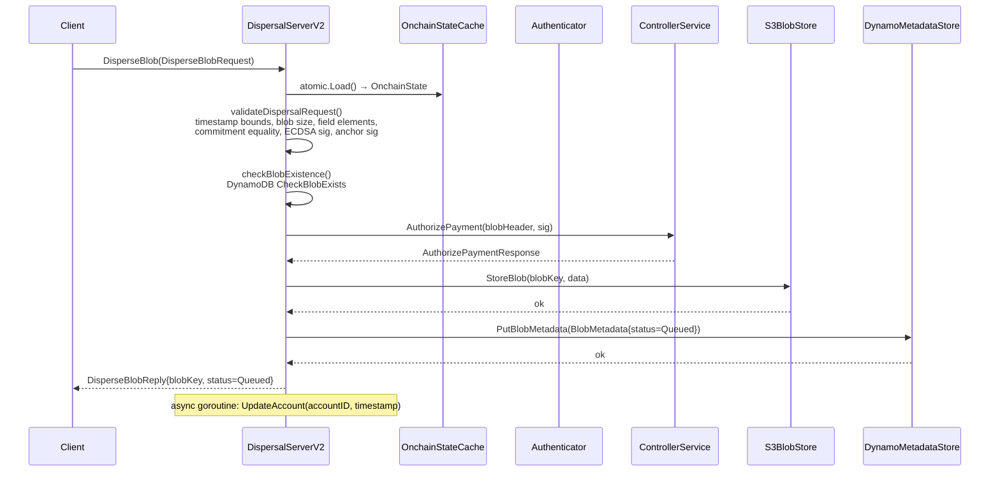
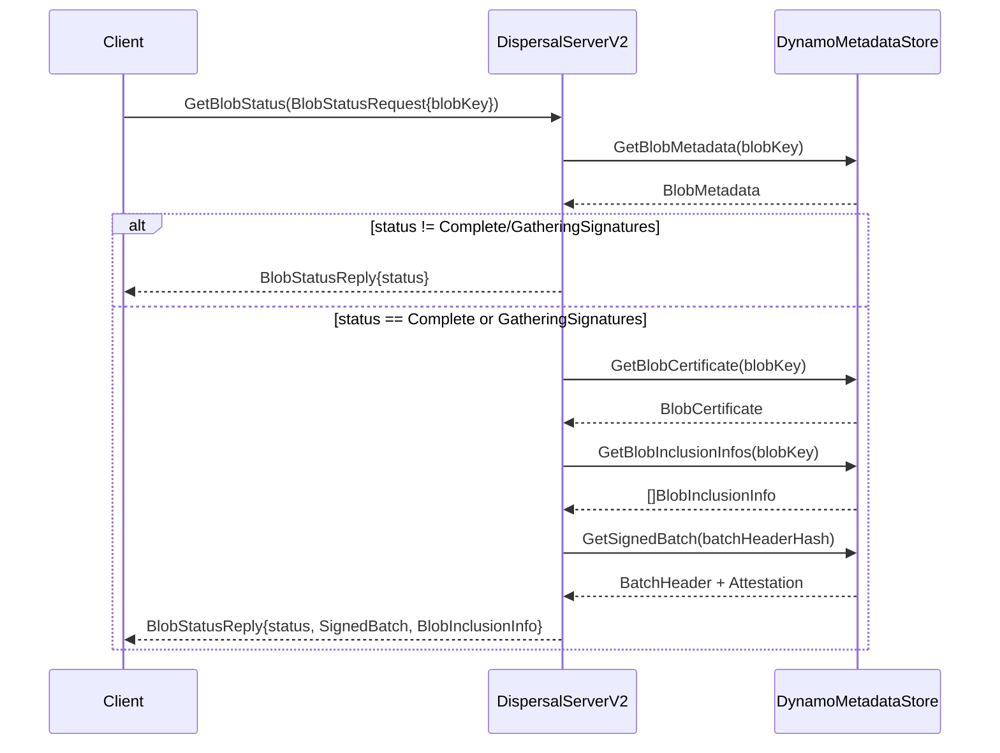
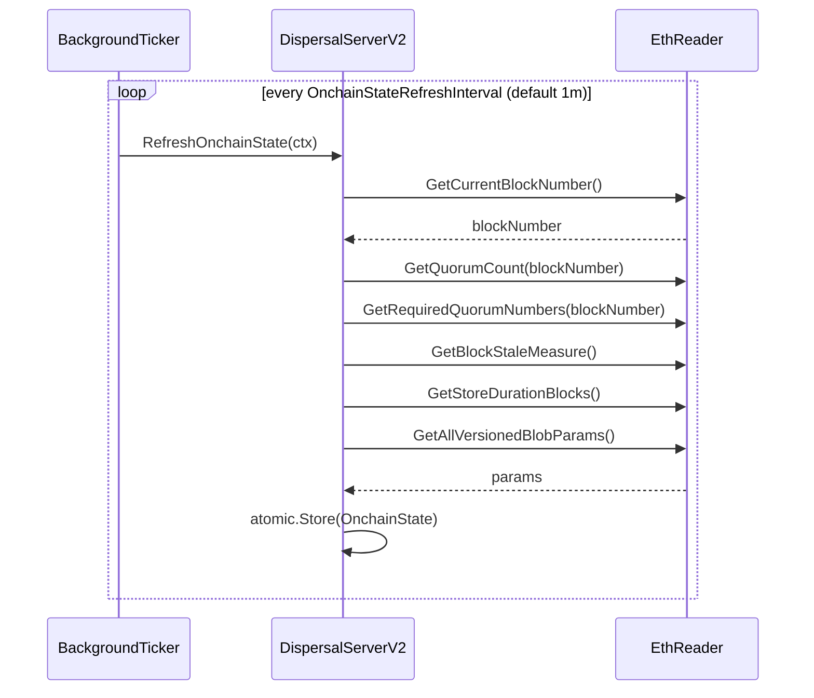
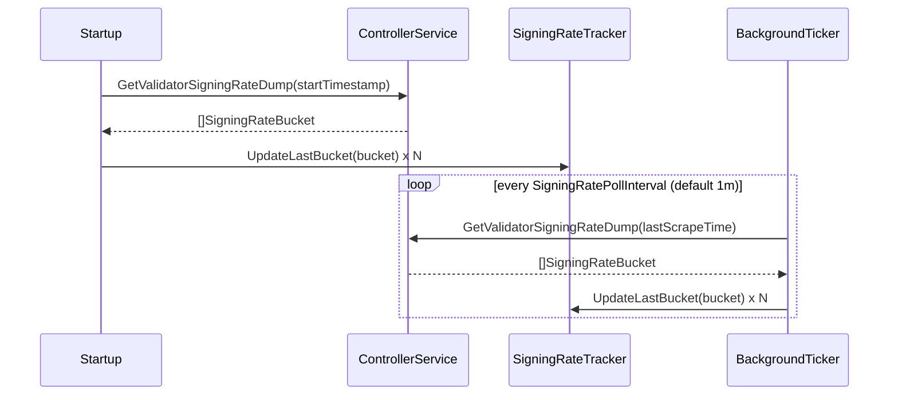
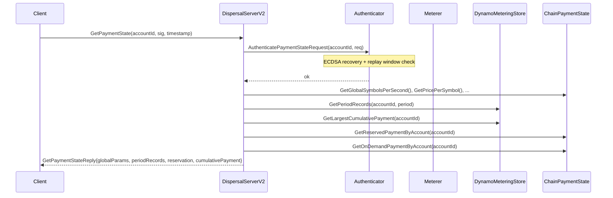

# disperser-apiserver Analysis

**Analyzed by**: code-analyzer-disperser-apiserver
**Timestamp**: 2026-04-10T00:00:00Z
**Application Type**: go-module
**Classification**: service
**Location**: disperser/cmd/apiserver

## Architecture

The disperser-apiserver is the primary external-facing gRPC entry point for EigenDA blob dispersal. It is a v2-only service — the legacy v1 disperser server (`DispersalServerV1`) is only registered in skeleton form to support `grpcurl` reflection of v1 APIs, but every live handler belongs to the v2 path. The binary is wired together in `disperser/cmd/apiserver/lib/apiserver.go` using the `urfave/cli` framework, which reads all configuration from environment variables and CLI flags before constructing service instances and starting the gRPC server.

The runtime architecture follows a layered, stateless-first design. The gRPC server itself is stateless per-request: it reads from an atomic-pointer snapshot of on-chain state (quorum counts, blob-version parameters, TTL) that is refreshed in a background goroutine at a configurable interval. The only durable I/O at request time goes through two storage backends — AWS S3 for raw blob bytes and AWS DynamoDB for blob metadata and payment metering — and a single outbound gRPC call to the controller service for payment authorization.

Authentication is two-layer. Each `DisperseBlob` request must carry an ECDSA signature over the blob key (proving account ownership) and, when enabled, an "anchor signature" that additionally binds the request to a specific disperser ID and chain ID to prevent cross-disperser replay. Payment state queries (`GetPaymentState`) are protected by a separate `ReplayGuardian` that enforces request-timestamp freshness windows to prevent replay attacks.

Observability is first-class: a Prometheus registry is passed through every layer and a dedicated HTTP metrics server exposes per-operation latency summaries, blob-size counters, and timestamp-drift histograms. Connection lifecycle is managed via gRPC keepalive parameters (max connection age, idle age, grace period) to prevent resource exhaustion under long-lived client connections.

## Key Components

- **`main` entrypoint** (`disperser/cmd/apiserver/main.go`): Bootstrap only. Creates a `urfave/cli` app, wires `flags.Flags` and `lib.RunDisperserServer` as the action, then calls `app.Run(os.Args)`. Embeds build version metadata via linker flags.

- **`RunDisperserServer`** (`disperser/cmd/apiserver/lib/apiserver.go`): The composition root. Reads `Config`, constructs all dependencies (Ethereum reader, DynamoDB client, S3 client, Prometheus registry, payment meterer, KZG committer, blob stores, controller gRPC client, signing-rate tracker, payment authenticator), calls `signingrate.DoInitialScrape` to pre-populate the signing rate cache synchronously, then starts a background `MirrorSigningRate` goroutine and finally calls `server.Start(ctx)`.

- **`Config`** (`disperser/cmd/apiserver/lib/config.go`): Flat Go struct holding all runtime configuration: AWS credentials, S3/DynamoDB table names, gRPC port and timeouts, KZG SRS paths, payment metering flags and DynamoDB table names, on-chain contract addresses, dispersal timestamp windows, and the controller gRPC address.

- **`flags.Flags`** (`disperser/cmd/apiserver/flags/flags.go`): Full declaration of all CLI flags and environment-variable bindings, grouped into `requiredFlags` (S3 bucket, DynamoDB table, gRPC port, disperser ID) and `optionalFlags` (metrics, rate limiter, payment metering, anchor signature behaviour, signing-rate retention, etc.). KZG committer flags (G1/G2 SRS paths, SRS loading number) are appended separately.

- **`DispersalServerV2`** (`disperser/apiserver/server_v2.go`): Core gRPC server struct. Implements the `disperser.v2.Disperser` protobuf service. Holds references to all injected dependencies. Manages an `atomic.Pointer[OnchainState]` for lock-free reads of on-chain data. Exposes `Start`, `Stop`, and `RefreshOnchainState`. Registers both v2 and v1 (stub) servers on the same gRPC instance along with gRPC health check and server reflection.

- **`disperseBlob` / `DisperseBlob`** (`disperser/apiserver/disperse_blob_v2.go`): Implements the hot path for blob ingest. Steps: (1) validate dispersal timestamp bounds; (2) validate blob size, commitment, field elements, quorum membership, ECDSA signature, and anchor signature; (3) call `AuthorizePayment` on the controller; (4) write raw bytes to S3 via `blobStore.StoreBlob`; (5) write metadata record to DynamoDB via `blobMetadataStore.PutBlobMetadata`; (6) asynchronously call `UpdateAccount` to update the account's last-seen timestamp. Returns a `DisperseBlobReply` with the blob key and `Queued` status.

- **`getBlobStatus` / `GetBlobStatus`** (`disperser/apiserver/get_blob_status_v2.go`): Status polling endpoint. Fetches blob metadata from DynamoDB; if status is `Complete` or `GatheringSignatures`, also fetches the blob certificate, per-batch inclusion info, and signed-batch attestation, and assembles the full `BlobStatusReply` with inclusion proof.

- **`GetPaymentState`** (`disperser/apiserver/server_v2.go`): Returns global payment parameters (symbols/second, min symbols, price per symbol, reservation window), per-account reservation and on-demand cumulative payment from chain, and off-chain period records from DynamoDB. Protected by ECDSA signature + replay guard.

- **`GetBlobCommitment`** (`disperser/apiserver/server_v2.go`): Deprecated helper that computes KZG commitments (G1 commitment, length commitment, length proof) on behalf of clients lacking SRS access. Returns a deprecation gRPC error when `DisableGetBlobCommitment` is set.

- **`GetValidatorSigningRate`** (`disperser/apiserver/server_v2.go`): Returns signing rate data for a given validator and quorum over a time range, served from the locally mirrored `signingRateTracker` (populated by the background scraper).

- **`metricsV2`** (`disperser/apiserver/metrics_v2.go`): Prometheus instrumentation. Registers gRPC server metrics (via `grpc-ecosystem/go-grpc-middleware`), per-method latency summaries (get blob commitment, get payment state, disperse blob, validate dispersal, store blob, get blob status), blob-size counter, timestamp-rejection counter (labelled by reason: `stale` or `future`), and a timestamp-drift histogram (16 configurable buckets, labelled by `status` and `account_id`).

- **`RateConfig` / `CLIFlags`** (`disperser/apiserver/config.go`): Rate limiting configuration for unauthenticated requests per quorum (total and per-user throughput in bytes/sec and blobs/sec). Includes allowlist loading from a JSON file (account address → per-quorum rate overrides) and retrieval rate limits.

## Data Flows

### 1. Blob Dispersal (Happy Path)

**Flow Description**: Client submits a blob via `DisperseBlob`; the server validates, authorizes, stores, and returns a queued key.



**Detailed Steps**:

1. **Request Receipt and Onchain State Load** (Client → DispersalServerV2)
   - Method: `DisperseBlob(ctx, *pb.DisperseBlobRequest)`
   - The handler immediately loads the atomic `OnchainState` pointer (quorum count, required quorums, blob version params, TTL).

2. **Request Validation** (DispersalServerV2 internal)
   - Method: `validateDispersalRequest(req, onchainState)`
   - Checks: signature length (65 bytes), blob size > 0 and <= `maxNumSymbolsPerBlob`, commitment length is power-of-2, payment metadata non-zero, timestamp within `[now - MaxDispersalAge, now + MaxFutureDispersalTime]`, quorum numbers valid, all 32-byte chunks are BN254 field elements, blob version exists, ECDSA signature matches account ID, anchor signature valid (if enabled).

3. **Duplicate Check** (DispersalServerV2 → DynamoDB)
   - Method: `checkBlobExistence(ctx, blobHeader)`
   - Returns `codes.AlreadyExists` if blob key already has metadata in DynamoDB.

4. **Payment Authorization** (DispersalServerV2 → ControllerService)
   - Method: `controllerClient.AuthorizePayment(ctx, authorizePaymentRequest)`
   - Delegates all payment logic to the controller; returns `codes.PermissionDenied` on failure.

5. **Blob Storage** (DispersalServerV2 → S3)
   - Method: `blobStore.StoreBlob(ctx, blobKey, data)`
   - Writes raw bytes to S3 under `blobs/<blobKey>`. Fails with `codes.AlreadyExists` if already present.

6. **Metadata Storage** (DispersalServerV2 → DynamoDB)
   - Method: `blobMetadataStore.PutBlobMetadata(ctx, blobMetadata)`
   - Writes `BlobMetadata{BlobHeader, Signature, BlobStatus=Queued, Expiry, RequestedAt}` to DynamoDB.

7. **Async Account Update** (goroutine)
   - Method: `blobMetadataStore.UpdateAccount(ctx, accountID, timestamp)` with 5-second timeout.

**Error Paths**:
- Stale or future timestamp → `codes.InvalidArgument` + `dispersal_timestamp_rejections_total{reason="stale"|"future"}` incremented
- Invalid field element → `codes.InvalidArgument`
- Anchor signature mismatch → `codes.InvalidArgument`
- Controller rejects payment → `codes.PermissionDenied` (converted from controller's status code)
- S3 write failure → `codes.Internal`
- DynamoDB write failure → `codes.Internal`

---

### 2. Blob Status Polling

**Flow Description**: Client polls `GetBlobStatus` to track a previously dispersed blob through `Queued → Processing → GatheringSignatures → Complete`.



**Detailed Steps**:

1. Validate blob key is exactly 32 bytes.
2. Fetch `BlobMetadata` from DynamoDB; return `codes.NotFound` if absent.
3. For early statuses (Queued, Processing) return status only.
4. For `GatheringSignatures`/`Complete`: fetch certificate, inclusion infos (may be multiple batches), and signed batch with attestation. Returns the first complete signed batch found.

---

### 3. On-Chain State Refresh (Background)

**Flow Description**: A background ticker periodically queries Ethereum to refresh cached state.



---

### 4. Signing Rate Mirroring (Background)

**Flow Description**: Signing rate data is scraped from the controller at startup (blocking) and then periodically refreshed, so that `GetValidatorSigningRate` can be served locally.



---

### 5. Payment State Query

**Flow Description**: Client requests its payment state (reserved and on-demand balances, global params, period records) after authenticating with an ECDSA signature + replay guard.



## Dependencies

### External Libraries

- **github.com/urfave/cli** (v1.22.14) [cli]: CLI framework used to declare and parse all configuration flags and environment variable bindings. Used throughout `disperser/cmd/apiserver/flags/flags.go` and `lib/config.go` to build the `Flags` slice and `NewConfig`.
  Imported in: `disperser/cmd/apiserver/main.go`, `disperser/cmd/apiserver/flags/flags.go`, `disperser/cmd/apiserver/lib/config.go`, `disperser/apiserver/config.go`.

- **google.golang.org/grpc** (v1.72.2) [networking]: gRPC framework; provides server creation, keepalive configuration, interceptors, credentials, reflection, and the client stub for the controller connection. Used as the core transport for both inbound client requests and outbound controller calls.
  Imported in: `disperser/cmd/apiserver/lib/apiserver.go`, `disperser/apiserver/server_v2.go`, `disperser/apiserver/disperse_blob_v2.go`, `disperser/apiserver/get_blob_status_v2.go`.

- **github.com/aws/aws-sdk-go-v2** (v1.26.1) [cloud-sdk]: AWS SDK v2 base. Used indirectly through the DynamoDB client (`common/aws/dynamodb`) and the S3 object-storage client. Provides credential resolution and HTTP transport.
  Imported in: `disperser/cmd/apiserver/lib/apiserver.go` (via `common/aws/dynamodb`).

- **github.com/aws/aws-sdk-go-v2/service/dynamodb** (v1.31.0) [database]: AWS DynamoDB service client. Accessed through `common/aws/dynamodb.NewClient`. Used by the `BlobMetadataStore` (blob metadata, batch attestations, inclusion infos, account records) and by the `DynamoDBMeteringStore` (reservations, on-demand payments, global rate state).
  Imported in: `disperser/cmd/apiserver/lib/apiserver.go`.

- **github.com/aws/aws-sdk-go-v2/service/s3** (v1.53.0) [cloud-sdk]: AWS S3 service client. Accessed through `blobstore.CreateObjectStorageClient`. Provides `UploadObject` and `HeadObject` operations for storing raw blob bytes.
  Imported in: `disperser/cmd/apiserver/lib/apiserver.go` (via `disperser/common/blobstore`).

- **github.com/prometheus/client_golang** (v1.21.1) [monitoring]: Prometheus metrics client. Used to create a dedicated `prometheus.Registry`, register gRPC interceptor metrics, and expose an HTTP `/metrics` endpoint. All per-operation latency, size, and timestamp-drift metrics are registered here.
  Imported in: `disperser/cmd/apiserver/lib/apiserver.go`, `disperser/apiserver/metrics_v2.go`.

- **github.com/grpc-ecosystem/go-grpc-middleware/providers/prometheus** (v1.0.1) [monitoring]: gRPC Prometheus middleware that instruments all unary RPCs with request counters and latency histograms. Registered as a `ChainUnaryInterceptor` on the gRPC server.
  Imported in: `disperser/apiserver/metrics_v2.go`.

- **github.com/ethereum/go-ethereum** (v1.15.3, via op-geth replace) [blockchain]: Ethereum library. Used for `common.Address` types, ECDSA public-key recovery (`crypto.SigToPub`, `crypto.PubkeyToAddress`), and chain ID comparison (`big.Int`). Core to both blob-request authentication and anchor-signature verification.
  Imported in: `disperser/cmd/apiserver/lib/apiserver.go`, `disperser/apiserver/disperse_blob_v2.go`, `disperser/apiserver/server_v2.go`.

- **github.com/Layr-Labs/eigensdk-go** (v0.2.0-beta.1) [other]: EigenLayer SDK; provides the `logging.Logger` interface used throughout the service for structured logging.
  Imported in: `disperser/apiserver/server_v2.go`, `disperser/apiserver/metrics_v2.go`.

### Internal Libraries

- **api** (`api/`): Provides the generated gRPC/Protobuf bindings consumed by this service. The `api/grpc/disperser/v2` package supplies `pb.RegisterDisperserServer`, all request/reply message types, and `pb.Disperser_ServiceDesc`. The `api/grpc/controller` package supplies `controller.ControllerServiceClient` (used for `AuthorizePayment` and `GetValidatorSigningRateDump`). The `api/hashing` package provides `ComputeDispersalAnchorHash` and `HashGetPaymentStateRequest`. The `api` package's `LogResponseStatus` helper is called at every public RPC handler boundary.

- **common** (`common/`): Provides the structured logger factory (`common.NewLogger`), AWS client config (`common/aws`), DynamoDB client (`common/aws/dynamodb`), Ethereum multi-homing client (`common/geth`), rate-limit config (`common/ratelimit`), health-check gRPC registration (`common/healthcheck`), and arithmetic helpers (`common/math.IsPowerOfTwo`, `common.ToMilliseconds`).

- **core** (`core/`): Provides the `core.Reader` interface (implemented by `core/eth.Reader`) for on-chain state queries (quorum count, block staleness, blob version params). Also supplies the `core.meterer` package (Meterer, OnchainPaymentState, DynamoDBMeteringStore), `core/auth/v2` (PaymentStateAuthenticator, BlobRequestAuthenticator), `core/signingrate` (SigningRateTracker, MirrorSigningRate, DoInitialScrape), `core/v2` types (BlobHeader, BlobKey, BlobVersion, BlobVersionParameterMap), and `core.QuorumID`/`core.PaymentMetadata`.

- **disperser** (`disperser/`): Provides the `disperser.ServerConfig` and `disperser.MetricsConfig` types (gRPC port, keepalive settings, pprof flags, disperser ID, anchor signature behaviour). Also provides `disperser.apiserver` package (DispersalServerV2 implementation, RateConfig) and `disperser/common/blobstore` (S3 client factory, BlobStore). The `disperser/common/v2/blobstore` package supplies `BlobMetadataStore`, `InstrumentedMetadataStore`, `BlobStore`, and all associated errors.

- **encoding** (`encoding/`): Provides the `encoding.GetBlobLengthPowerOf2`, `encoding.BYTES_PER_SYMBOL`, and `encoding/v2/rs.ToFrArray` utilities for blob size calculations and BN254 field-element validation. The `encoding/v2/kzg/committer` package (KZG Committer) is used for `GetBlobCommitment` and for verifying commitment equality during blob validation.

## API Surface

### gRPC Endpoints (disperser.v2.Disperser service)

The service exposes a gRPC API defined in `api/proto/disperser/v2/disperser_v2.proto`. All endpoints are unary. The server also registers the gRPC health check protocol and server reflection.

#### POST DisperseBlob

**Summary**: Submit a blob for dispersal. Returns a `blobKey` immediately; clients must poll `GetBlobStatus` for completion.

Example Request:
```protobuf
DisperseBlobRequest {
  blob: <bytes, 1 B to 16 MiB, every 32-byte chunk is a valid BN254 field element>
  blob_header: BlobHeader {
    version: 0,
    quorum_numbers: [0, 1],
    commitment: BlobCommitment { ... },
    payment_header: PaymentMetadata {
      account_id: "0xabc...",
      timestamp: <int64 unix nanos>,
      cumulative_payment: <big-endian bytes or 0>
    }
  }
  signature: <65-byte ECDSA sig over blobKey>
  anchor_signature: <65-byte ECDSA sig over Keccak(domain||chainId||disperserId||blobKey)>
  disperser_id: 1
  chain_id: <32-byte big-endian>
}
```

Example Response (200 OK):
```json
{
  "result": "QUEUED",
  "blob_key": "<32 bytes hex>"
}
```

Error Responses:
- `INVALID_ARGUMENT`: timestamp out of bounds, invalid field element, bad commitment, missing quorum
- `ALREADY_EXISTS`: blob with this key already stored
- `PERMISSION_DENIED`: payment authorization rejected by controller
- `INTERNAL`: storage failure

---

#### GET GetBlobStatus

**Summary**: Poll for the processing status of a previously dispersed blob.

Example Request:
```protobuf
BlobStatusRequest { blob_key: <32 bytes> }
```

Example Response (200 OK, blob complete):
```json
{
  "status": "COMPLETE",
  "signed_batch": {
    "header": { "batch_root": "...", "reference_block_number": 1234 },
    "attestation": { "nonsigner_stakes_and_quorums": [...], "quorum_signed_percentages": [...] }
  },
  "blob_inclusion_info": {
    "blob_certificate": { ... },
    "blob_index": 3,
    "inclusion_proof": "<bytes>"
  }
}
```

Error Responses:
- `INVALID_ARGUMENT`: blob key not 32 bytes
- `NOT_FOUND`: no blob with that key exists

---

#### GET GetPaymentState

**Summary**: Returns the current payment state for an account (on-chain reservations, on-demand cumulative payment, off-chain period records, global params). ECDSA authenticated with replay protection.

Example Request:
```protobuf
GetPaymentStateRequest {
  account_id: "0xabc...",
  signature: <65 bytes>,
  timestamp: <uint64 unix nanos>
}
```

Example Response (200 OK):
```json
{
  "payment_global_params": {
    "global_symbols_per_second": 10000,
    "min_num_symbols": 32,
    "price_per_symbol": 1,
    "reservation_window": 300
  },
  "period_records": [...],
  "reservation": {
    "symbols_per_second": 500,
    "start_timestamp": 1700000000,
    "end_timestamp": 1800000000
  },
  "cumulative_payment": "<big-endian bytes>",
  "onchain_cumulative_payment": "<big-endian bytes>"
}
```

---

#### GET GetBlobCommitment (deprecated)

**Summary**: Computes KZG commitment, length commitment, and length proof for a raw blob. Deprecated; clients should compute locally.

Example Request:
```protobuf
BlobCommitmentRequest { blob: <bytes> }
```

Example Response (200 OK):
```json
{
  "blob_commitment": {
    "commitment": "<G1 point bytes>",
    "length_commitment": "<G2 point bytes>",
    "length_proof": "<G2 point bytes>",
    "length": 128
  }
}
```

Error Responses:
- `UNIMPLEMENTED`: when `DisableGetBlobCommitment` flag is set
- `INVALID_ARGUMENT`: empty blob or blob too large

---

#### GET GetValidatorSigningRate

**Summary**: Returns signing rate data for a validator over a time range, served from locally mirrored controller data.

Example Request:
```protobuf
GetValidatorSigningRateRequest {
  validator_id: <32 bytes>,
  quorum: 0,
  start_timestamp: 1700000000,
  end_timestamp:   1700003600
}
```

Example Response (200 OK):
```json
{
  "validator_signing_rate": 0.987
}
```

## Code Examples

### Example 1: Anchor Signature Validation

```go
// disperser/apiserver/disperse_blob_v2.go, lines 279-341
func (s *DispersalServerV2) validateAnchorSignature(
    req *pb.DisperseBlobRequest,
    blobHeader *corev2.BlobHeader,
) error {
    if s.serverConfig.DisableAnchorSignatureVerification {
        return nil
    }
    if req.GetDisperserId() != s.serverConfig.DisperserId {
        return fmt.Errorf("disperser ID mismatch: ...")
    }
    reqChainId, _ := common.ChainIdFromBytes(req.GetChainId())
    anchorHash, _ := hashing.ComputeDispersalAnchorHash(reqChainId, req.GetDisperserId(), blobKey)
    anchorSigPubKey, _ := crypto.SigToPub(anchorHash, anchorSignature)
    if blobHeader.PaymentMetadata.AccountID.Cmp(crypto.PubkeyToAddress(*anchorSigPubKey)) != 0 {
        return errors.New("anchor signature doesn't match account ID")
    }
    return nil
}
```

### Example 2: Atomic On-Chain State Cache

```go
// disperser/apiserver/server_v2.go, lines 36-41, 63, 374
type OnchainState struct {
    QuorumCount           uint8
    RequiredQuorums       []core.QuorumID
    BlobVersionParameters *corev2.BlobVersionParameterMap
    TTL                   time.Duration
}

// In DispersalServerV2 struct:
onchainState atomic.Pointer[OnchainState]

// Stored atomically after each refresh:
s.onchainState.Store(onchainState)

// Read without lock in disperseBlob:
onchainState := s.onchainState.Load()
```

### Example 3: Controller Payment Authorization

```go
// disperser/apiserver/disperse_blob_v2.go, lines 63-69
authorizePaymentRequest := &controller.AuthorizePaymentRequest{
    BlobHeader:      req.GetBlobHeader(),
    ClientSignature: req.GetSignature(),
}
_, err = s.controllerClient.AuthorizePayment(ctx, authorizePaymentRequest)
if err != nil {
    return nil, status.Convert(err)
}
```

### Example 4: Prometheus Timestamp Drift Histogram

```go
// disperser/apiserver/metrics_v2.go, lines 131-139
dispersalTimestampDrift := promauto.With(registry).NewHistogramVec(
    prometheus.HistogramOpts{
        Namespace: namespace,
        Name:      "dispersal_timestamp_drift_seconds",
        Help:      "Distribution of timestamp drift for dispersal requests.",
        Buckets:   []float64{-60, -30, -10, -5, -1, -0.5, 0, 0.5, 1, 2, 5, 10, 30, 60, 120, 300},
    },
    []string{"status", "account_id"},
)
```

### Example 5: Signing Rate Mirroring at Startup

```go
// disperser/cmd/apiserver/lib/apiserver.go, lines 166-200
scraper := func(ctx context.Context, startTime time.Time) ([]*validator.SigningRateBucket, error) {
    data, err := controllerClient.GetValidatorSigningRateDump(
        ctx,
        &controller.GetValidatorSigningRateDumpRequest{StartTimestamp: uint64(startTime.Unix())},
        grpc.MaxCallRecvMsgSize(32*1024*1024),
    )
    return data.GetSigningRateBuckets(), nil
}
err = signingrate.DoInitialScrape(ctx, logger, scraper, signingRateTracker, ...)
go signingrate.MirrorSigningRate(ctx, logger, scraper, signingRateTracker, ...)
```

## Files Analyzed

- `disperser/cmd/apiserver/main.go` (35 lines) - Binary entrypoint; wires CLI app and invokes RunDisperserServer
- `disperser/cmd/apiserver/lib/apiserver.go` (236 lines) - Composition root; constructs all dependencies and starts the server
- `disperser/cmd/apiserver/lib/config.go` (131 lines) - Config struct and CLI-flag-to-config mapping
- `disperser/cmd/apiserver/flags/flags.go` (384 lines) - All CLI flag and env-var declarations
- `disperser/apiserver/server_v2.go` (525 lines) - DispersalServerV2 core struct, Start, Stop, GetPaymentState, GetBlobCommitment, GetValidatorSigningRate, RefreshOnchainState
- `disperser/apiserver/disperse_blob_v2.go` (397 lines) - DisperseBlob handler, validation pipeline, StoreBlob, anchor signature
- `disperser/apiserver/get_blob_status_v2.go` (136 lines) - GetBlobStatus handler
- `disperser/apiserver/config.go` (246 lines) - RateConfig, CLIFlags, allowlist loading
- `disperser/apiserver/metrics_v2.go` (238 lines) - Prometheus metrics registration and reporting helpers
- `disperser/common/v2/blobstore/s3_blob_store.go` (52 lines) - S3-backed blob byte store
- `core/signingrate/signing_rate_mirroring.go` (86 lines) - Background signing-rate polling from controller
- `core/auth/v2/authenticator.go` (108 lines) - ECDSA request authentication and replay guard
- `api/proto/disperser/v2/disperser_v2.proto` (proto source) - gRPC service definition
- `disperser/server_config.go` (59 lines) - ServerConfig type (gRPC timeouts, disperser ID, anchor sig flags)
- `go.mod` (module manifest) - External dependency versions

## Analysis Data

```json
{
  "summary": "disperser-apiserver is the primary external-facing gRPC entry point for EigenDA v2 blob dispersal. It accepts DisperseBlob requests from external clients, validates them (ECDSA auth, KZG commitment equality, BN254 field element checks, anchor signatures, timestamp bounds), delegates payment authorization to the controller service, stores raw blob bytes in AWS S3, writes metadata to AWS DynamoDB, and immediately returns a Queued status with a blob key. It also serves GetBlobStatus (polls DynamoDB for dispersal lifecycle), GetPaymentState (aggregates on-chain and off-chain payment data), GetBlobCommitment (deprecated KZG helper), and GetValidatorSigningRate (served from locally mirrored controller data). On-chain state is cached atomically and refreshed in background; signing rate data is mirrored from the controller at startup and periodically thereafter.",
  "architecture_pattern": "grpc-service",
  "key_modules": [
    "disperser/cmd/apiserver/main.go",
    "disperser/cmd/apiserver/lib/apiserver.go",
    "disperser/cmd/apiserver/lib/config.go",
    "disperser/cmd/apiserver/flags/flags.go",
    "disperser/apiserver/server_v2.go",
    "disperser/apiserver/disperse_blob_v2.go",
    "disperser/apiserver/get_blob_status_v2.go",
    "disperser/apiserver/config.go",
    "disperser/apiserver/metrics_v2.go"
  ],
  "api_endpoints": [
    "DisperseBlob (disperser.v2.Disperser/DisperseBlob)",
    "GetBlobStatus (disperser.v2.Disperser/GetBlobStatus)",
    "GetBlobCommitment (disperser.v2.Disperser/GetBlobCommitment) [deprecated]",
    "GetPaymentState (disperser.v2.Disperser/GetPaymentState)",
    "GetValidatorSigningRate (disperser.v2.Disperser/GetValidatorSigningRate)"
  ],
  "data_flows": [
    "Blob dispersal: validate then authorize (controller) then S3 store then DynamoDB metadata write then return Queued",
    "Blob status polling: DynamoDB metadata lookup then optionally fetch certificate, inclusion info, signed batch",
    "On-chain state refresh: background ticker then Ethereum RPC then atomic cache update",
    "Signing rate mirroring: startup scrape plus background poll then controller gRPC then local tracker",
    "Payment state query: authenticate (ECDSA + replay guard) then chain + DynamoDB aggregation then reply"
  ],
  "tech_stack": ["go", "grpc", "protobuf", "prometheus", "aws-dynamodb", "aws-s3"],
  "external_integrations": ["aws-dynamodb", "aws-s3", "ethereum-rpc"],
  "component_interactions": [
    {
      "target": "controller",
      "type": "grpc",
      "description": "Calls AuthorizePayment on every DisperseBlob to delegate payment authorization; calls GetValidatorSigningRateDump periodically to mirror signing rate data locally"
    },
    {
      "target": "aws-dynamodb",
      "type": "shared_database",
      "description": "Reads and writes blob metadata, batch attestations, inclusion infos, account records, and payment metering tables (reservations, on-demand, global rate) via BlobMetadataStore and DynamoDBMeteringStore"
    },
    {
      "target": "aws-s3",
      "type": "object_storage",
      "description": "Writes raw blob bytes to a configured S3 bucket under keys scoped by blob hash via BlobStore.StoreBlob"
    },
    {
      "target": "ethereum-rpc",
      "type": "http_api",
      "description": "Periodically reads on-chain state (quorum count, required quorums, blob version parameters, block stale measure, store duration) via core/eth.Reader calling EigenDA service manager contracts"
    }
  ]
}
```

## Citations

```json
[
  {
    "file_path": "disperser/cmd/apiserver/main.go",
    "start_line": 21,
    "end_line": 29,
    "claim": "Binary entrypoint uses urfave/cli framework with flags.Flags and lib.RunDisperserServer as the action",
    "section": "Architecture",
    "snippet": "app := cli.NewApp()\napp.Flags = flags.Flags\napp.Action = lib.RunDisperserServer\nerr := app.Run(os.Args)"
  },
  {
    "file_path": "disperser/cmd/apiserver/lib/apiserver.go",
    "start_line": 30,
    "end_line": 68,
    "claim": "RunDisperserServer constructs the Ethereum reader, DynamoDB client, and S3 object storage client in order before building the server",
    "section": "Architecture",
    "snippet": "client, err := geth.NewMultiHomingClient(...)\ntransactor, err := eth.NewReader(...)\nobjectStorageClient, err := blobstore.CreateObjectStorageClient(...)\ndynamoClient, err := dynamodb.NewClient(...)"
  },
  {
    "file_path": "disperser/cmd/apiserver/lib/apiserver.go",
    "start_line": 71,
    "end_line": 105,
    "claim": "Payment meterer is conditionally created when EnablePaymentMeterer is true, using DynamoDB tables for reservations, on-demand, and global rate",
    "section": "Key Components",
    "snippet": "if config.EnablePaymentMeterer {\n    meteringStore, err := mt.NewDynamoDBMeteringStore(...)\n    meterer = mt.NewMeterer(mtConfig, paymentChainState, meteringStore, logger)\n    meterer.Start(context.Background())\n}"
  },
  {
    "file_path": "disperser/cmd/apiserver/lib/apiserver.go",
    "start_line": 138,
    "end_line": 145,
    "claim": "Outbound gRPC connection to the controller service uses insecure credentials and is stored for lifecycle management",
    "section": "Component Interactions",
    "snippet": "controllerConnection, err := grpc.NewClient(\n    config.ControllerAddress,\n    grpc.WithTransportCredentials(insecure.NewCredentials()),\n)\ncontrollerClient := controller.NewControllerServiceClient(controllerConnection)"
  },
  {
    "file_path": "disperser/cmd/apiserver/lib/apiserver.go",
    "start_line": 166,
    "end_line": 201,
    "claim": "Signing rate data is scraped from controller at startup (blocking) via GetValidatorSigningRateDump and then mirrored in background goroutine",
    "section": "Data Flows",
    "snippet": "scraper := func(...) { data, err := controllerClient.GetValidatorSigningRateDump(...) }\nerr = signingrate.DoInitialScrape(...)\ngo signingrate.MirrorSigningRate(...)"
  },
  {
    "file_path": "disperser/apiserver/server_v2.go",
    "start_line": 36,
    "end_line": 41,
    "claim": "OnchainState struct holds quorum count, required quorums, blob version parameter map, and TTL derived from on-chain parameters",
    "section": "Key Components",
    "snippet": "type OnchainState struct {\n    QuorumCount           uint8\n    RequiredQuorums       []core.QuorumID\n    BlobVersionParameters *corev2.BlobVersionParameterMap\n    TTL                   time.Duration\n}"
  },
  {
    "file_path": "disperser/apiserver/server_v2.go",
    "start_line": 63,
    "end_line": 63,
    "claim": "DispersalServerV2 uses atomic.Pointer[OnchainState] for lock-free concurrent reads of on-chain state by request handlers",
    "section": "Architecture",
    "snippet": "onchainState atomic.Pointer[OnchainState]"
  },
  {
    "file_path": "disperser/apiserver/server_v2.go",
    "start_line": 222,
    "end_line": 234,
    "claim": "gRPC server uses ChainUnaryInterceptor with Prometheus metrics, 300 MiB max recv message size, and keepalive parameters from config",
    "section": "Architecture",
    "snippet": "opt := grpc.MaxRecvMsgSize(1024 * 1024 * 300)\ns.grpcServer = grpc.NewServer(\n    grpc.ChainUnaryInterceptor(s.metrics.grpcMetrics.UnaryServerInterceptor()),\n    opt, keepAliveConfig)"
  },
  {
    "file_path": "disperser/apiserver/server_v2.go",
    "start_line": 234,
    "end_line": 241,
    "claim": "Both v2 and v1 (stub) disperser servers are registered on the same gRPC instance to support grpcurl reflection of v1 APIs",
    "section": "API Surface",
    "snippet": "pb.RegisterDisperserServer(s.grpcServer, s)\npbv1.RegisterDisperserServer(s.grpcServer, &DispersalServerV1{})"
  },
  {
    "file_path": "disperser/apiserver/server_v2.go",
    "start_line": 338,
    "end_line": 377,
    "claim": "RefreshOnchainState queries Ethereum for current block number, quorum count, required quorums, block stale measure, store duration blocks, and all versioned blob params",
    "section": "Data Flows",
    "snippet": "currentBlock, err := s.chainReader.GetCurrentBlockNumber(ctx)\nquorumCount, err := s.chainReader.GetQuorumCount(ctx, currentBlock)\nblobParams, err := s.chainReader.GetAllVersionedBlobParams(ctx)"
  },
  {
    "file_path": "disperser/apiserver/disperse_blob_v2.go",
    "start_line": 40,
    "end_line": 111,
    "claim": "disperseBlob validates request, checks existence, delegates payment authorization to controller, stores blob in S3, writes metadata to DynamoDB, and asynchronously updates account",
    "section": "Data Flows",
    "snippet": "blobHeader, err := s.validateDispersalRequest(req, onchainState)\n_, err = s.controllerClient.AuthorizePayment(ctx, authorizePaymentRequest)\nblobKey, st := s.StoreBlob(ctx, blob, blobHeader, ...)\ngo func() { s.blobMetadataStore.UpdateAccount(...) }()"
  },
  {
    "file_path": "disperser/apiserver/disperse_blob_v2.go",
    "start_line": 113,
    "end_line": 156,
    "claim": "StoreBlob writes raw bytes to S3 then writes BlobMetadata with Queued status to DynamoDB",
    "section": "Data Flows",
    "snippet": "if err := s.blobStore.StoreBlob(ctx, blobKey, data); err != nil { ... }\nerr = s.blobMetadataStore.PutBlobMetadata(ctx, blobMetadata)"
  },
  {
    "file_path": "disperser/apiserver/disperse_blob_v2.go",
    "start_line": 158,
    "end_line": 267,
    "claim": "validateDispersalRequest enforces signature length, blob size, commitment power-of-2, payment metadata validity, timestamp bounds, quorum membership, field element validity, blob version existence, and ECDSA signature match",
    "section": "Data Flows",
    "snippet": "if len(signature) != 65 { ... }\n_, err = rs.ToFrArray(blob)\nif err = s.blobRequestAuthenticator.AuthenticateBlobRequest(blobHeader, signature); err != nil { ... }"
  },
  {
    "file_path": "disperser/apiserver/disperse_blob_v2.go",
    "start_line": 279,
    "end_line": 341,
    "claim": "Anchor signature validation computes Keccak hash of (domain, chainId, disperserId, blobKey) and recovers the signing address, comparing it against the account ID in the payment metadata",
    "section": "Architecture",
    "snippet": "anchorHash, err := hashing.ComputeDispersalAnchorHash(reqChainId, req.GetDisperserId(), blobKey)\nanchorSigPubKey, err := crypto.SigToPub(anchorHash, anchorSignature)\nif blobHeader.PaymentMetadata.AccountID.Cmp(crypto.PubkeyToAddress(*anchorSigPubKey)) != 0 { ... }"
  },
  {
    "file_path": "disperser/apiserver/disperse_blob_v2.go",
    "start_line": 343,
    "end_line": 378,
    "claim": "Dispersal timestamp validation rejects requests older than MaxDispersalAge (default 45s) or further than MaxFutureDispersalTime (default 45s) into the future",
    "section": "Architecture",
    "snippet": "if dispersalAge > s.MaxDispersalAge {\n    s.metrics.reportDispersalTimestampRejected(\"stale\")\n    return fmt.Errorf(\"potential clock drift detected: dispersal timestamp is too old...\")\n}"
  },
  {
    "file_path": "disperser/apiserver/get_blob_status_v2.go",
    "start_line": 59,
    "end_line": 136,
    "claim": "GetBlobStatus only fetches the certificate, inclusion info, and signed batch attestation for blobs in GatheringSignatures or Complete status",
    "section": "Data Flows",
    "snippet": "if metadata.BlobStatus != dispv2.Complete && metadata.BlobStatus != dispv2.GatheringSignatures {\n    return &pb.BlobStatusReply{Status: metadata.BlobStatus.ToProfobuf()}, ...\n}"
  },
  {
    "file_path": "disperser/apiserver/server_v2.go",
    "start_line": 379,
    "end_line": 484,
    "claim": "GetPaymentState aggregates global payment params from ChainPaymentState, off-chain period records and cumulative payment from DynamoDB, and on-chain reservation and on-demand payment from chain",
    "section": "Data Flows",
    "snippet": "globalSymbolsPerSecond := s.meterer.ChainPaymentState.GetGlobalSymbolsPerSecond()\nperiodRecords, err := s.meterer.MeteringStore.GetPeriodRecords(ctx, accountID, currentReservationPeriod)\nreservation, err := s.meterer.ChainPaymentState.GetReservedPaymentByAccount(ctx, accountID)"
  },
  {
    "file_path": "disperser/apiserver/server_v2.go",
    "start_line": 410,
    "end_line": 413,
    "claim": "GetPaymentState validates the request's ECDSA signature using blobRequestAuthenticator (PaymentStateAuthenticator with replay protection)",
    "section": "Architecture",
    "snippet": "if err := s.blobRequestAuthenticator.AuthenticatePaymentStateRequest(accountID, req); err != nil {\n    return nil, status.Newf(codes.Unauthenticated, \"failed to validate signature: %s\", err.Error())\n}"
  },
  {
    "file_path": "disperser/apiserver/server_v2.go",
    "start_line": 486,
    "end_line": 510,
    "claim": "GetValidatorSigningRate serves signing rate data for a validator from the locally mirrored signingRateTracker without contacting the controller",
    "section": "API Surface",
    "snippet": "signingRate, err := s.signingRateTracker.GetValidatorSigningRate(\n    core.QuorumID(request.GetQuorum()),\n    validatorId,\n    time.Unix(int64(request.GetStartTimestamp()), 0), ...)"
  },
  {
    "file_path": "disperser/apiserver/metrics_v2.go",
    "start_line": 19,
    "end_line": 42,
    "claim": "Metrics namespace is eigenda_disperser_api; tracked metrics include per-method latency summaries, blob size counter, timestamp rejection counter, and timestamp drift histogram",
    "section": "Key Components",
    "snippet": "const namespace = \"eigenda_disperser_api\""
  },
  {
    "file_path": "disperser/apiserver/metrics_v2.go",
    "start_line": 131,
    "end_line": 139,
    "claim": "Timestamp drift histogram uses 16 buckets spanning -60s to +300s, labelled by status (accepted/rejected) and account_id",
    "section": "Key Components",
    "snippet": "Buckets: []float64{-60, -30, -10, -5, -1, -0.5, 0, 0.5, 1, 2, 5, 10, 30, 60, 120, 300}"
  },
  {
    "file_path": "disperser/cmd/apiserver/flags/flags.go",
    "start_line": 23,
    "end_line": 60,
    "claim": "S3 bucket name and DynamoDB table name are required flags; object storage backend (s3 or oci) and OCI credentials are optional",
    "section": "Key Components",
    "snippet": "S3BucketNameFlag = cli.StringFlag{Required: true, ...}\nObjectStorageBackendFlag = cli.StringFlag{Required: false, Value: \"s3\", ...}"
  },
  {
    "file_path": "disperser/cmd/apiserver/flags/flags.go",
    "start_line": 224,
    "end_line": 237,
    "claim": "Default MaxDispersalAge and MaxFutureDispersalTime are both 45 seconds",
    "section": "Architecture",
    "snippet": "MaxDispersalAgeFlag = cli.DurationFlag{Value: 45 * time.Second, ...}\nMaxFutureDispersalTimeFlag = cli.DurationFlag{Value: 45 * time.Second, ...}"
  },
  {
    "file_path": "disperser/cmd/apiserver/flags/flags.go",
    "start_line": 263,
    "end_line": 277,
    "claim": "Signing rate retention period defaults to 2 weeks (14 days) and poll interval to 1 minute",
    "section": "Key Components",
    "snippet": "SigningRateRetentionPeriodFlag = cli.DurationFlag{Value: 14 * 24 * time.Hour, ...}\nSigningRatePollIntervalFlag = cli.DurationFlag{Value: time.Minute, ...}"
  },
  {
    "file_path": "disperser/server_config.go",
    "start_line": 42,
    "end_line": 59,
    "claim": "TolerateMissingAnchorSignature defaults to true for backwards compatibility; DisableAnchorSignatureVerification is a temporary flag for multi-disperser scenarios",
    "section": "Architecture",
    "snippet": "TolerateMissingAnchorSignature bool\nDisableAnchorSignatureVerification bool"
  },
  {
    "file_path": "disperser/cmd/apiserver/lib/apiserver.go",
    "start_line": 107,
    "end_line": 113,
    "claim": "MaxBlobSize validation enforces both a 32 MiB hard ceiling and a power-of-two constraint before the server starts",
    "section": "Architecture",
    "snippet": "if config.MaxBlobSize <= 0 || config.MaxBlobSize > 32*1024*1024 { ... }\nif !math.IsPowerOfTwo(uint64(config.MaxBlobSize)) { ... }"
  },
  {
    "file_path": "disperser/apiserver/disperse_blob_v2.go",
    "start_line": 92,
    "end_line": 103,
    "claim": "Account update is performed asynchronously in a goroutine with a 5-second timeout context to avoid blocking the response path",
    "section": "Data Flows",
    "snippet": "go func() {\n    ctx, cancel := context.WithTimeout(context.Background(), 5*time.Second)\n    defer cancel()\n    if err := s.blobMetadataStore.UpdateAccount(ctx, accountID, timestamp); err != nil { ... }\n}()"
  },
  {
    "file_path": "api/proto/disperser/v2/disperser_v2.proto",
    "start_line": 11,
    "end_line": 40,
    "claim": "The disperser.v2.Disperser service defines 5 RPC methods: DisperseBlob, GetBlobStatus, GetBlobCommitment (deprecated), GetPaymentState, GetValidatorSigningRate",
    "section": "API Surface",
    "snippet": "service Disperser {\n  rpc DisperseBlob(DisperseBlobRequest) returns (DisperseBlobReply) {}\n  rpc GetBlobStatus(BlobStatusRequest) returns (BlobStatusReply) {}\n  rpc GetBlobCommitment(BlobCommitmentRequest) returns (BlobCommitmentReply) {}\n  rpc GetPaymentState(GetPaymentStateRequest) returns (GetPaymentStateReply) {}\n  rpc GetValidatorSigningRate(GetValidatorSigningRateRequest) returns (GetValidatorSigningRateReply) {}\n}"
  },
  {
    "file_path": "disperser/cmd/apiserver/lib/apiserver.go",
    "start_line": 118,
    "end_line": 133,
    "claim": "Instrumented DynamoDB metadata store wraps the base store with Prometheus metrics under the 'apiserver' service name",
    "section": "Key Components",
    "snippet": "blobMetadataStore := blobstorev2.NewInstrumentedMetadataStore(\n    baseBlobMetadataStore,\n    blobstorev2.InstrumentedMetadataStoreConfig{\n        ServiceName: \"apiserver\",\n        Registry:    reg,\n        Backend:     blobstorev2.BackendDynamoDB,\n    })"
  }
]
```

## Analysis Notes

### Security Considerations

1. **Multi-layer ECDSA Authentication**: Every `DisperseBlob` request requires two ECDSA signatures: (a) a blob-key signature proving account ownership, and (b) an optional anchor signature binding the request to a specific disperser ID and chain ID. The anchor signature prevents a signed request intended for one disperser from being replayed at another. The `TolerateMissingAnchorSignature` flag (default true) and `DisableAnchorSignatureVerification` flag are temporary migration affordances that reduce this protection; both carry code comments indicating they should eventually be removed.

2. **Replay Protection for Payment State**: `GetPaymentState` uses a `ReplayGuardian` that enforces a time window (default +-5 minutes) on the request timestamp and tracks seen request hashes to prevent replay attacks on payment state queries. Blob dispersal requests do not use a replay guardian — the idempotency check (DynamoDB `CheckBlobExists`) and the timestamp bounds serve as a weaker form of replay prevention.

3. **Payment Authorization Centralized at Controller**: All payment logic (reserved bandwidth accounting, on-demand cumulative payment validation) is delegated to the controller via gRPC. The API server does not enforce payment limits independently, which means it is fully dependent on the controller's availability for any dispersal. Network partitions between apiserver and controller will cause all `DisperseBlob` requests to fail.

4. **Insecure gRPC to Controller**: The connection to the controller uses `insecure.NewCredentials()` (no TLS). This assumes the apiserver and controller are deployed in a trusted network environment (e.g., same VPC). If exposed more broadly, this channel should use mTLS.

5. **Field Element Validation**: Before storing, the server validates that every 32-byte chunk of the blob is a valid BN254 field element (less than the BN254 field prime). This prevents malicious blobs from causing encoding failures downstream in the encoding pipeline.

### Performance Characteristics

- **Lock-free Onchain State Reads**: Using `atomic.Pointer[OnchainState]` for the cached on-chain state avoids mutex contention on every `DisperseBlob` request. The refresh background goroutine only needs to call `Store` once per interval.
- **Synchronous KZG Commitment Verification**: The `disperse_blob` validation path calls `committer.GetCommitmentsForPaddedLength(blob)` synchronously to verify the client-supplied commitment. This is CPU-intensive (requires loading SRS points) and runs on the gRPC handler goroutine, creating a potential latency spike for large blobs.
- **Async Account Update**: The `UpdateAccount` DynamoDB write is performed asynchronously with a 5-second timeout, so it does not add to the client-observable latency of `DisperseBlob`. However, failures are only logged as warnings, meaning account-level tracking may be silently stale.
- **Signing Rate Initial Scrape is Blocking**: `DoInitialScrape` runs synchronously before the gRPC server starts listening, which adds startup latency proportional to the `SigningRateRetentionPeriod` (default 2 weeks of data must be fetched from the controller).

### Scalability Notes

- **Stateless per Request**: Each request reads only from the atomic cache (no locking), an outbound gRPC call (controller), and two AWS managed services (S3, DynamoDB). The server can be horizontally scaled without coordination between instances.
- **Payment Metering is Per-Disperser**: Each disperser instance runs its own `Meterer` with independent DynamoDB metering tables. The comment in the code acknowledges this will be addressed by "decentralized ratelimiting".
- **Controller as Single Point of Contention**: All `DisperseBlob` requests make one synchronous outbound gRPC call to the controller for `AuthorizePayment`. There is no retry, circuit breaker, or local fallback for this call.
- **DynamoDB Read Amplification on Status Queries**: `GetBlobStatus` for completed blobs performs up to 4 DynamoDB reads (metadata, certificate, inclusion infos, signed batch). At high polling rates from many clients this creates significant DynamoDB read capacity pressure.
