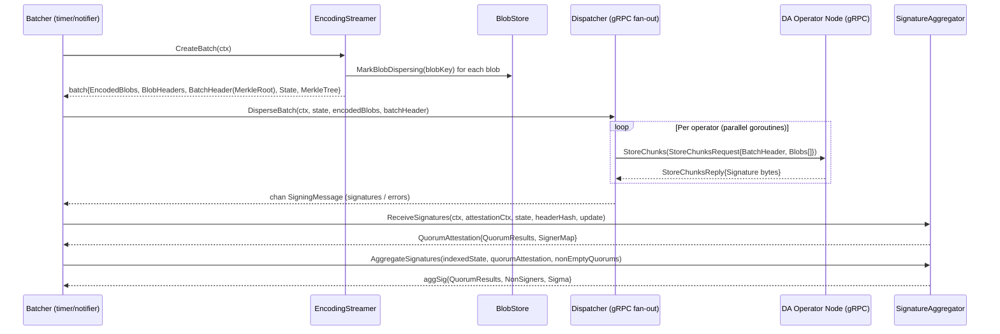
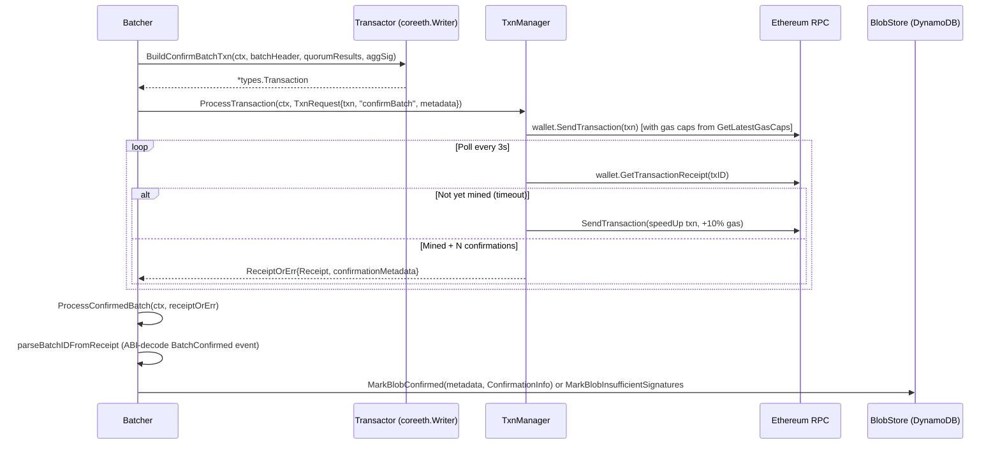
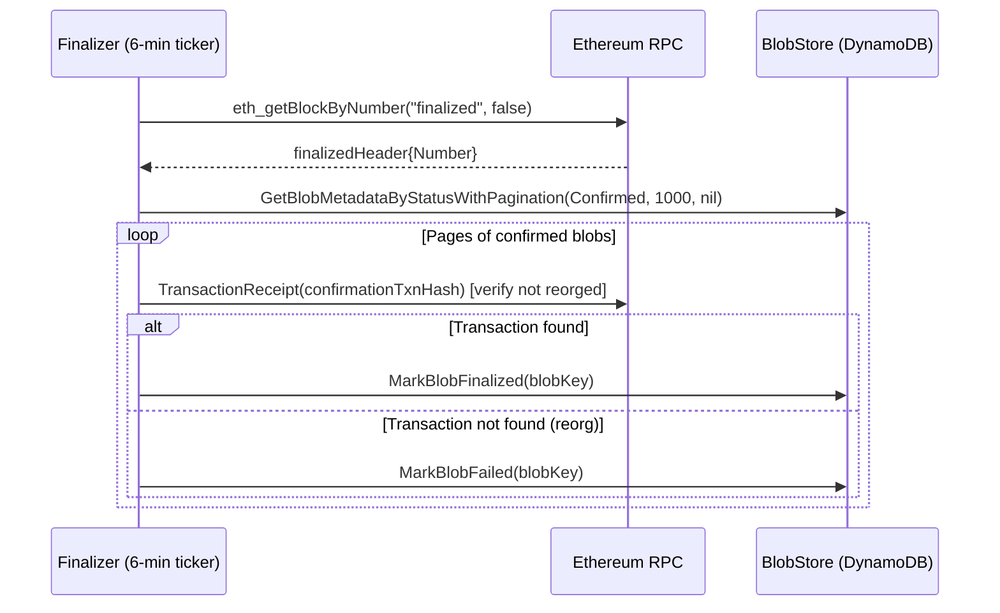

# disperser-batcher Analysis

**Analyzed by**: code-analyzer
**Timestamp**: 2026-04-10T00:00:00Z
**Application Type**: go-module
**Classification**: service
**Location**: disperser/cmd/batcher

## Architecture

The disperser-batcher is the v1 EigenDA pipeline orchestrator responsible for assembling encoded blob chunks into cryptographically-committed batches, distributing those chunks to DA operator nodes over gRPC, aggregating BLS attestation signatures, and confirming batches on-chain via the EigenDA Service Manager contract. It is a long-running background process launched from a single `main()` entry point using the `urfave/cli` flag framework.

The service is structured around a producer/consumer pipeline with explicit state machine semantics. Blob lifecycle states (`Processing → Dispersing → Confirmed → Finalized`) are persisted in DynamoDB; raw blob bytes are stored in AWS S3 (or an OCI-compatible object store). Four cooperating goroutine-groups provide the core loop: (1) `EncodingStreamer` polls DynamoDB for `Processing` blobs on a 2-second tick and dispatches encoding requests to a remote gRPC Encoder service via a configurable worker pool; (2) the main `HandleSingleBatch` loop fires on a configurable `PullInterval` timer or when the encoded-size threshold is crossed, consuming results from the in-memory `encodedBlobStore`, building a `batch`, dispersing chunks to all operators, and collecting BLS signatures; (3) `TxnManager` sends the resulting `confirmBatch` Ethereum transaction and manages gas price escalation; (4) `Finalizer` runs on its own timer, checking confirmed batches against the latest finalized Ethereum block and marking them `Finalized`.

Key design patterns include: interface-driven dependency injection for every external collaborator (`BlobStore`, `Dispatcher`, `EncoderClient`, `TxnManager`, `Finalizer`, `SignatureAggregator`); an LRU cache of size 32 for operator state lookups to avoid repeated TheGraph / RPC calls; a channel-based heartbeat (`HeartbeatChan`) written to a filesystem file so Kubernetes liveness probes can detect goroutine stalls; and a Prometheus metrics registry (namespace `eigenda_batcher`) served on a dedicated HTTP port.

Wallet signing supports two modes: AWS KMS (ECDSA key retrieved from KMS) and a plain hex private key. The built-in LevelDB indexer is deprecated in favor of The Graph subgraph for indexed operator state. The `UseGraph` flag is now mandatory; attempting to start with `UseGraph=false` returns an immediate error.

## Key Components

- **main / RunBatcher** (`disperser/cmd/batcher/main.go`): Entry point. Reads CLI flags, constructs all collaborators (S3 client, DynamoDB client, Ethereum multi-homing client, wallet, encoder client, finalizer, transaction manager, batcher), calls `batcher.Start(ctx)`, writes the `/tmp/ready` probe file, and launches `heartbeatMonitor` in a separate goroutine. The `heartbeatMonitor` function polls `handleBatchLivenessChan`; if no heartbeat arrives within `maxStallDuration` (240 s), it logs a warning (does not panic/exit, continues monitoring).

- **Config** (`disperser/cmd/batcher/config.go`): Aggregates all sub-configs: `batcher.Config`, `batcher.TimeoutConfig`, `blobstore.Config`, `geth.EthClientConfig`, `aws.ClientConfig`, `kzg.KzgConfig`, `common.LoggerConfig`, `batcher.MetricsConfig`, `indexer.Config`, `common.KMSKeyConfig`, `thegraph.Config`, plus scalar fields for contract addresses, data directory, and gnark bundle encoding toggle. Constructed by `NewConfig()` from parsed CLI context.

- **Batcher** (`disperser/batcher/batcher.go`): The central coordinator struct. Holds references to all major subsystems. `Start()` triggers state recovery, starts the chain state, encoding streamer, transaction manager and finalizer, then runs the main batch loop as a goroutine (ticker + size-threshold channel). `HandleSingleBatch()` orchestrates one full round-trip: CreateBatch → DisperseBatch → ReceiveSignatures → AggregateSignatures → BuildConfirmBatchTxn → ProcessTransaction. `ProcessConfirmedBatch()` is called from the receipt goroutine upon on-chain confirmation to update DynamoDB and emit metrics. `handleFailure()` decrements retry counts and marks blobs as permanently failed when `MaxNumRetriesPerBlob` is exhausted.

- **EncodingStreamer** (`disperser/batcher/encoding_streamer.go`): Polls `BlobStore.GetBlobMetadataByStatusWithPagination` for `Processing` blobs every 2 s. For each blob×quorum pair not yet requested, calculates chunk length and assignments via `AssignmentCoordinator`, validates encoding params, then submits a `encoderClient.EncodeBlob()` call to the worker pool. Successful results are stored in the in-memory `encodedBlobStore`. Triggers `EncodedSizeNotifier` when total encoded size crosses `BatchSizeMBLimit`. `CreateBatch()` atomically drains the encoded store, constructs a `batch` struct with Merkle root, and resets the reference block number.

- **encodedBlobStore** (`disperser/batcher/encoded_blob_store.go`): Thread-safe in-memory store (two maps: `requested` and `encoded`, both keyed on `blobKey-quorumID`). Tracks total encoded chunk bytes. `GetNewAndDeleteStaleEncodingResults()` evicts any results whose reference block number is older than the current batch's reference block, preventing stale dispersals.

- **Dispatcher** (`disperser/batcher/grpc/dispatcher.go`): Implements `disperser.Dispatcher`. `DisperseBatch()` fans out one goroutine per indexed operator. Each goroutine dials the operator's v1 dispersal socket (plain TCP, insecure TLS), calls `StoreChunks` RPC, and sends the operator's BLS signature (or an error) on the update channel. Supports Gnark bundle encoding (flat binary) or Gob-serialized chunks per operator.

- **TxnManager** (`disperser/batcher/txn_manager.go`): Manages the Ethereum transaction lifecycle end-to-end. Accepts `TxnRequest` structs via `ProcessTransaction()`, which sends the transaction through the configured wallet (KMS or private key). `monitorTransaction()` polls for a receipt; if the chain-write timeout elapses without confirmation, it resends with +10% gas (speed-up). Supports optional Fireblocks broadcast cancellation on timeout. Delivers `ReceiptOrErr` to `Batcher` through a channel.

- **Finalizer** (`disperser/batcher/finalizer.go`): Runs on `FinalizerInterval` (default 6 min). Queries the Ethereum RPC for the latest finalized block (`eth_getBlockByNumber "finalized"`). Paginates over `Confirmed` blobs in DynamoDB (up to 1000 per page). For each, verifies the confirmation transaction is still on-chain (reorg check), updates the block number if it changed, and calls `MarkBlobFinalized`. Handles reorg-induced transaction eviction by marking affected blobs `Failed`.

- **Metrics** (`disperser/batcher/metrics.go`): Prometheus registry (namespace `eigenda_batcher`) served over HTTP on `MetricsHTTPPort` (default 9100). Exposes: blob/batch counters by state, batch process latency summaries and histograms with Fibonacci-sequence buckets (1 min–89 min), blob age at each lifecycle stage, attestation signer/non-signer counts per quorum, gas used, gas speed-up count, transaction queue depth, and per-operator attestation latency gauge.

- **Flags** (`disperser/cmd/batcher/flags/flags.go`): Defines and registers all CLI flags for the process. Required flags: `S3BucketNameFlag`, `DynamoDBTableNameFlag`, `PullIntervalFlag`, `EncoderSocket`, `EnableMetrics`, `BatchSizeLimitFlag`, `UseGraphFlag`, `SRSOrderFlag`. Notable optional flags include `FinalizationBlockDelayFlag` (default 75 blocks) and `EnableGnarkBundleEncodingFlag`.

## Data Flows

### 1. Encoding Pipeline: Processing → Encoded

**Flow Description**: The EncodingStreamer continuously dequeues blobs from DynamoDB and dispatches KZG encoding requests to the remote encoder service.

```mermaid
sequenceDiagram
    participant ES as EncodingStreamer
    participant BS as BlobStore (DynamoDB/S3)
    participant CS as ChainState (TheGraph)
    participant AC as AssignmentCoordinator
    participant EC as EncoderClient (gRPC)
    participant EBS as encodedBlobStore

    loop Every 2s (encodingInterval)
        ES->>BS: GetBlobMetadataByStatusWithPagination(Processing, limit, cursor)
        BS-->>ES: []BlobMetadata, nextCursor
        ES->>CS: GetCurrentBlockNumber()
        CS-->>ES: blockNumber - FinalizationBlockDelay
        ES->>CS: GetIndexedOperatorState(blockNumber, quorumIDs)
        CS-->>ES: IndexedOperatorState (cached LRU-32)
        ES->>AC: CalculateChunkLength(state, blobLength, targetNumChunks, quorum)
        AC-->>ES: chunkLength
        ES->>AC: GetAssignments(state, blobLength, blobQuorumInfo)
        AC-->>ES: assignments, info
        Note over ES: ValidateEncodingParams; submit to worker pool
        ES->>EC: EncodeBlob(ctx+gRPC metadata, blobData, EncodingParams)
        EC-->>ES: BlobCommitments, ChunksData (via encoderChan)
        ES->>EBS: PutEncodingResult(EncodingResult)
        Note over EBS: If total size >= BatchSizeMBLimit notify
    end
```

**Detailed Steps**:

1. **Poll DynamoDB for processing blobs** (EncodingStreamer → BlobStore)
   - Method: `blobStore.GetBlobMetadataByStatusWithPagination(ctx, disperser.Processing, maxBlobsToFetch, exclusiveStartKey)`
   - Uses cursor-based DynamoDB pagination; cursor reset each time `CreateBatch` is called (reference block reset to 0)

2. **Determine reference block** (EncodingStreamer → ChainState)
   - Calls `chainState.GetCurrentBlockNumber()` when `ReferenceBlockNumber == 0`
   - Subtracts `FinalizationBlockDelay` (default 75) to ensure operator state is finalized

3. **Resolve operator state** (EncodingStreamer → TheGraph)
   - `getOperatorState()` checks LRU cache keyed on `(blockNumber, sortedQuorumIDs)`; on miss, calls `chainState.GetIndexedOperatorState()`

4. **Submit to worker pool** (EncodingStreamer → gRPC encoder)
   - `e.Pool.Submit(func() { encoderClient.EncodeBlob(...) })` — pool size controlled by `NumConnections` flag (default 256)
   - gRPC metadata headers: `content-type: application/grpc`, `x-payload-size: <N>`

5. **Store result** (encoderChan → encodedBlobStore)
   - `ProcessEncodedBlobs()` calls `EBS.PutEncodingResult()`, updates total size gauge, fires `EncodedSizeNotifier` if threshold crossed

**Error Paths**:
- Encoding error → `DeleteEncodingRequest`; blob remains `Processing` for retry on next tick
- Invalid encoding params → `blobStore.MarkBlobFailed()` immediately; no retry
- Worker pool full → skip round, log warning

---

### 2. Batch Assembly and Dispersal

**Flow Description**: The main batch loop assembles ready encoded blobs into a batch, disperses chunks to operators, and collects BLS attestation signatures.



**Detailed Steps**:

1. **CreateBatch** — EncodingStreamer drains `encodedBlobStore`, transitions each blob to `Dispersing` state in DynamoDB, constructs Merkle tree from blob headers (`batchHeader.SetBatchRoot`), resets `ReferenceBlockNumber = 0`

2. **DisperseBatch** — Dispatcher spawns a goroutine per operator; each goroutine serializes the blob chunks (Gnark or Gob format) and calls `gc.StoreChunks()` with a 60 GiB max send size limit. The `attestationCtx` carries the `BatchAttestationTimeout` (default 25 s)

3. **Signature collection** — `Aggregator.ReceiveSignatures()` drains the update channel within `attestationCtx`. `AggregateSignatures()` produces BLS aggregate over non-empty quorums to minimize on-chain gas

4. **Attestation check** — `numBlobsAttestedByQuorum` validates each blob meets its `ConfirmationThreshold`. If zero blobs pass, all are failed via `handleFailure`

**Error Paths**:
- `CreateBatch` returns `errNoEncodedResults` → warn and skip tick; no blob state change
- `DisperseBatch` operator unreachable → `SigningMessage{Err: ...}` sent; counted as non-signer
- Aggregate signatures error → `handleFailure(FailAggregateSignatures)`; blobs re-queued or marked failed

---

### 3. On-Chain Confirmation

**Flow Description**: After signature aggregation, the batcher submits a `confirmBatch` transaction through TxnManager and processes the resulting receipt.



**Detailed Steps**:

1. **Build transaction** — `Transactor.BuildConfirmBatchTxn` encodes the EigenDA Service Manager ABI call with batch header, quorum results, and aggregated BLS signature

2. **Send and monitor** — `TxnManager.ProcessTransaction()` sends via wallet (KMS or private key). `monitorTransaction()` loops with `txnRefreshInterval` timeout per iteration, resending with +10% gas on deadline exceeded until confirmed or permanently failed

3. **Parse receipt** — `parseBatchIDFromReceipt` ABI-decodes the `BatchConfirmed(uint32 batchId)` event log from the Service Manager contract

4. **Update metadata** — `updateConfirmationInfo()` stores `ConfirmationInfo` (batch header hash, blob index, Merkle proof, confirmation tx hash, block number) in DynamoDB for each blob

**Error Paths**:
- Transaction failure → `handleFailure(FailConfirmBatch)`; blobs re-queued
- `parseBatchIDFromReceipt` fails → exponential backoff retry (max 4, 1-2-4-8 s), then re-fetches receipt

---

### 4. Blob Finalization

**Flow Description**: The Finalizer periodically scans confirmed blobs and advances them to `Finalized` state once their confirmation block is below the Ethereum finalized checkpoint.



**Key Technical Details**:
- Uses `eth_getBlockByNumber "finalized"` (EIP-4844 finality tag) rather than block count heuristics
- Handles reorg: if `confirmationBlockNumber` changed, calls `UpdateConfirmationBlockNumber`; if tx not found at all, marks blob `Failed`
- Worker pool of `FinalizerPoolSize` (default 4) goroutines processes batches of confirmed blobs in parallel

---

### 5. State Recovery on Startup

**Flow Description**: On startup, `RecoverState()` fixes blobs that were left in `Dispersing` state by a previous crashed instance.

**Detailed Steps**:
1. `Queue.GetBlobMetadataByStatus(ctx, disperser.Dispersing)` — fetches all blobs stuck mid-dispersal
2. For each blob: if expired (`Expiry < now`) → `MarkBlobFailed`; otherwise → `MarkBlobProcessing` to re-queue for encoding
3. Logs summary (total, expired, re-queued)

## Dependencies

### External Libraries

- **github.com/urfave/cli** (v1.22.14) [cli]: Command-line framework for flag parsing and application lifecycle. Used in `main.go` and `flags/flags.go` to define and parse all required/optional flags; `app.Action` dispatches to `RunBatcher`. Imported in: `disperser/cmd/batcher/main.go`, `disperser/cmd/batcher/flags/flags.go`.

- **github.com/ethereum/go-ethereum** (v1.15.3, replaced by ethereum-optimism/op-geth v1.101511.1) [blockchain]: Core Ethereum library providing `types.Transaction`, `types.Receipt`, `abi.JSON`, `crypto.HexToECDSA`, `crypto.PubkeyToAddress`, and ETH RPC client interfaces. Used extensively across all files that interact with the chain. Imported in: `main.go`, `batcher.go`, `txn_manager.go`, `finalizer.go`.

- **github.com/Layr-Labs/eigensdk-go** (v0.2.0-beta.1) [blockchain]: EigenLayer SDK providing wallet abstractions (`walletsdk.Wallet`, `walletsdk.PrivateKeyWallet`), KMS signer (`signerv2.NewKMSSigner`), and Fireblocks integration. Used in `main.go` for wallet construction and in `txn_manager.go` for transaction broadcast. Imported in: `main.go`, `txn_manager.go`.

- **github.com/Layr-Labs/eigensdk-go/aws/kms** (part of eigensdk-go v0.2.0-beta.1) [cloud-sdk]: Provides `kms.NewKMSClient` and `kms.GetECDSAPublicKey` for AWS KMS-backed signing. Used in `main.go` when `KMSKeyConfig.Disable == false`. Imported in: `main.go`.

- **github.com/gammazero/workerpool** (v1.1.3) [async-runtime]: Bounded goroutine worker pool. Used by `EncodingStreamer` to submit parallel encoding requests (pool size = `NumConnections`, default 256) and by `Finalizer` to process confirmed blobs in parallel (`FinalizerPoolSize`, default 4). Imported in: `encoding_streamer.go`, `finalizer.go`.

- **github.com/hashicorp/golang-lru/v2** (v2.0.7) [other]: Generic LRU cache (size 32) used in `EncodingStreamer` to cache `IndexedOperatorState` objects keyed on `(blockNumber, quorumIDs)` to avoid redundant TheGraph queries. Imported in: `encoding_streamer.go`.

- **github.com/hashicorp/go-multierror** (v1.1.1) [other]: Accumulates multiple errors into a single return value. Used in `handleFailure()` to collect errors from iterating over multiple blob metadata updates. Imported in: `batcher.go`.

- **github.com/wealdtech/go-merkletree/v2** (v2.6.0) [crypto]: Merkle tree construction. Used in `encoding_streamer.go` via `batchHeader.SetBatchRoot(blobHeaders)` to build the batch Merkle root; in `batcher.go` for `GenerateProofWithIndex` to produce per-blob inclusion proofs stored in `ConfirmationInfo`. Imported in: `encoding_streamer.go`, `batcher.go`.

- **github.com/prometheus/client_golang** (v1.21.1) [monitoring]: Prometheus metrics library. Provides `prometheus.Registry`, `promauto`, `promhttp`, summary/histogram/gauge/counter vector types. The `Metrics` struct in `metrics.go` registers all batcher metrics under namespace `eigenda_batcher`. Imported in: `metrics.go`, `batcher.go`.

- **github.com/google/uuid** (transitive) [other]: UUID type used in `confirmationMetadata.batchID` field. Imported in: `batcher.go`.

- **google.golang.org/grpc** (v1.72.2) [networking]: gRPC client framework. Dispatcher uses `grpc.NewClient` with insecure credentials to connect to DA operator dispersal sockets, calling `node.NewDispersalClient(conn).StoreChunks(...)` with a 60 GiB max send size. EncodingStreamer adds gRPC metadata headers to encoding requests. Imported in: `disperser/batcher/grpc/dispatcher.go`, `encoding_streamer.go`.

- **google.golang.org/protobuf** (v1.36.6) [serialization]: Protobuf runtime for marshaling `node.StoreChunksRequest`, `node.StoreChunksReply`, and related gRPC messages. Used via `proto.Size()` for logging. Imported in: `disperser/batcher/grpc/dispatcher.go`.

### Internal Libraries

- **disperser** (`disperser/`): Core disperser library providing the `BlobStore` interface (DynamoDB+S3 backed), `BlobMetadata`, `ConfirmationInfo`, `Dispatcher` and `EncoderClient` interfaces, blob status constants (`Processing`, `Dispersing`, `Confirmed`, `Finalized`, `Failed`, `InsufficientSignatures`), and `blobstore.NewBlobMetadataStore`/`NewSharedStorage`. The batcher depends on this library for all persistent state access.

- **core** (`core/`): Provides `IndexedChainState`, `AssignmentCoordinator`, `SignatureAggregator`, `Writer` (Transactor), `BatchHeader`, `BlobHeader`, `BlobCommitments`, `ChunksData`, `EncodedBlob`, `QuorumResult`, `SigningMessage`, `Signature`, and Merkle proof serialization. The batcher uses `core.StdAssignmentCoordinator` and `core.NewStdSignatureAggregator`.

- **encoding** (`encoding/`): Supplies `EncodingParams`, `BlobCommitments`, `GetBlobLength`, `ParamsFromMins`, and `ValidateEncodingParamsAndBlobLength`. Used by `EncodingStreamer` to compute and validate encoding parameters before dispatching to the remote encoder.

- **common** (`common/`): Provides `common.EthClient`, `common.RPCEthClient`, `common.WorkerPool`, `common.Logger`, `common.KMSKeyConfig`, `ServiceManagerAbi`, `BatchConfirmedEventSigHash`, and AWS DynamoDB client constructor. Used throughout `main.go` and batcher internals.

- **indexer** (`indexer/`): Provides `indexer.Config` and `indexer.ReadIndexerConfig`/`CLIFlags` — used only during config construction for completeness, as the live code path exclusively uses `UseGraph=true` (the built-in indexer is deprecated).

## API Surface

The disperser-batcher exposes no inbound HTTP or gRPC API. It is a pure consumer/producer service with two outward-facing interfaces:

### Prometheus Metrics HTTP Endpoint

**GET /metrics**

Prometheus scrape endpoint served on `MetricsHTTPPort` (default `:9100`). Returns all `eigenda_batcher_*` metrics in Prometheus text format.

Key metric families:
- `eigenda_batcher_blobs_total` (counter vec, labels: `state`, `data`) — blob count/size by status
- `eigenda_batcher_batches_total` (counter vec, labels: `data`) — batch count/size
- `eigenda_batcher_batch_process_latency_ms` (summary vec, labels: `stage`) — latency at stages: `total`, `AggregateSignatures`, `UpdateConfirmationInfo`
- `eigenda_batcher_batch_process_latency_histogram_ms` (histogram vec) — Fibonacci-bucket histograms (1–89 min)
- `eigenda_batcher_blob_age_ms` (summary vec, labels: `stage`) — age at `encoding_requested`, `encoded`, `batched`, `attestation_requested`, `attested`, `confirmed`
- `eigenda_batcher_attestation` (gauge vec, labels: `type`, `quorum`) — `signers`, `non_signers`, `percent_signed` per quorum
- `eigenda_batcher_gas_used` (gauge) — last batch gas
- `eigenda_batcher_speed_ups` (gauge) — gas price speed-up count
- `eigenda_batcher_tx_queue` (gauge) — pending transactions
- `eigenda_batcher_attestation_latency_ms` (summary vec, per operator)

### Kubernetes Probe Files

- `/tmp/ready` — created after `batcher.Start()` returns successfully; deleted at process start. Kubernetes readiness probe.
- `/tmp/health` — written with the last `HandleSingleBatch` heartbeat timestamp. Written every `PullInterval` (or size-threshold trigger). Kubernetes liveness probe.

### Outbound gRPC (Dispatcher → DA Nodes)

Calls `node.DispersalClient.StoreChunks(StoreChunksRequest)` on each operator's v1 dispersal socket. The request contains the batch header and encoded blob chunks (Gnark or Gob format). Expects `StoreChunksReply` with a BLS signature.

### Outbound gRPC (EncodingStreamer → Encoder Service)

Calls `disperser.EncoderClient.EncodeBlob(ctx, blobData, EncodingParams)` on the configured `EncoderSocket`. Returns `BlobCommitments` and `ChunksData`.

## Code Examples

### Example 1: Batch Size Threshold Trigger

```go
// disperser/batcher/encoding_streamer.go:449-458
if e.EncodedSizeNotifier.threshold > 0 && encodedSize >= e.EncodedSizeNotifier.threshold {
    e.EncodedSizeNotifier.mu.Lock()
    if e.EncodedSizeNotifier.active {
        e.logger.Info("encoded size threshold reached", "size", encodedSize)
        e.EncodedSizeNotifier.Notify <- struct{}{}
        // make sure this doesn't keep triggering before encoded blob store is reset
        e.EncodedSizeNotifier.active = false
    }
    e.EncodedSizeNotifier.mu.Unlock()
}
```

### Example 2: Gas Price Speed-Up Logic

```go
// disperser/batcher/txn_manager.go:382-407
func (t *txnManager) speedUpTxn(ctx context.Context, tx *types.Transaction, tag string) (*types.Transaction, error) {
    prevGasTipCap := tx.GasTipCap()
    prevGasFeeCap := tx.GasFeeCap()
    currentGasTipCap, currentGasFeeCap, err := t.ethClient.GetLatestGasCaps(ctx)
    // Increase by 10%, but never go below current market price
    increasedGasTipCap := increaseGasPrice(prevGasTipCap)
    if currentGasTipCap.Cmp(increasedGasTipCap) > 0 {
        newGasTipCap = currentGasTipCap
    } else {
        newGasTipCap = increasedGasTipCap
    }
    return t.ethClient.UpdateGas(ctx, tx, tx.Value(), newGasTipCap, newGasFeeCap)
}
```

### Example 3: Reorg-Aware Finalization

```go
// disperser/batcher/finalizer.go:179-209
confirmationBlockNumber, err := f.getTransactionBlockNumber(ctx, confirmationMetadata.ConfirmationInfo.ConfirmationTxnHash)
if errors.Is(err, ethereum.NotFound) {
    // Transaction reorged out — mark blob failed
    err := f.blobStore.MarkBlobFailed(ctx, m.GetBlobKey())
}
if confirmationBlockNumber != uint64(confirmationMetadata.ConfirmationInfo.ConfirmationBlockNumber) {
    // Block number changed due to reorg — update stored metadata
    err := f.blobStore.UpdateConfirmationBlockNumber(ctx, m, uint32(confirmationBlockNumber))
}
```

### Example 4: Operator State LRU Cache

```go
// disperser/batcher/encoding_streamer.go:684-695
cacheKey := computeCacheKey(blockNumber, quorumIds)
if val, ok := e.operatorStateCache.Get(cacheKey); ok {
    return val, nil
}
state, err := e.chainState.GetIndexedOperatorState(ctx, blockNumber, quorumIds)
if err != nil {
    return nil, fmt.Errorf("error getting operator state at block number %d: %w", blockNumber, err)
}
e.operatorStateCache.Add(cacheKey, state)
return state, nil
```

### Example 5: Heartbeat / Liveness Signal

```go
// disperser/batcher/batcher.go:765-774
func (b *Batcher) signalLiveness() {
    select {
    case b.HeartbeatChan <- time.Now():
        b.logger.Info("Heartbeat signal sent")
    default:
        // Non-blocking: if no receiver, skip; prevents goroutine blocking
        b.logger.Warn("Heartbeat signal skipped, no receiver on the channel")
    }
}
```

## Files Analyzed

- `disperser/cmd/batcher/main.go` (279 lines) — Entry point, dependency wiring, heartbeat monitor
- `disperser/cmd/batcher/config.go` (101 lines) — Config struct and CLI config reader
- `disperser/cmd/batcher/flags/flags.go` (309 lines) — All CLI flag definitions
- `disperser/batcher/batcher.go` (775 lines) — Core batch orchestration loop
- `disperser/batcher/encoding_streamer.go` (727 lines) — Encoding pipeline, batch assembly
- `disperser/batcher/encoded_blob_store.go` (205 lines) — In-memory encoded result store
- `disperser/batcher/grpc/dispatcher.go` (348 lines) — gRPC fan-out to DA operators
- `disperser/batcher/txn_manager.go` (429 lines) — Ethereum transaction lifecycle management
- `disperser/batcher/finalizer.go` (288 lines) — Blob finalization with reorg handling
- `disperser/batcher/metrics.go` (412 lines) — Prometheus metrics definitions and update methods

## Analysis Data

```json
{
  "summary": "The disperser-batcher is the v1 EigenDA pipeline service that assembles KZG-committed blob chunks into batches, fans out chunks to DA operator nodes via gRPC, aggregates BLS attestation signatures, submits confirmBatch transactions to Ethereum, and finalizes confirmed blobs against the chain's finalized checkpoint. It is driven by a configurable pull-interval timer and a size-based notifier, with DynamoDB for blob state persistence, S3 for raw blob storage, TheGraph for indexed operator state, and AWS KMS or raw private key for transaction signing.",
  "architecture_pattern": "batch-processing-pipeline",
  "key_modules": [
    "disperser/cmd/batcher/main.go",
    "disperser/cmd/batcher/config.go",
    "disperser/cmd/batcher/flags/flags.go",
    "disperser/batcher/batcher.go",
    "disperser/batcher/encoding_streamer.go",
    "disperser/batcher/encoded_blob_store.go",
    "disperser/batcher/grpc/dispatcher.go",
    "disperser/batcher/txn_manager.go",
    "disperser/batcher/finalizer.go",
    "disperser/batcher/metrics.go"
  ],
  "api_endpoints": [
    "GET /metrics (Prometheus, :9100)"
  ],
  "data_flows": [
    "Processing blobs polled from DynamoDB every 2s, encoded via remote gRPC encoder, stored in-memory encodedBlobStore",
    "encodedBlobStore drained on timer/size-trigger, batch assembled with Merkle root, chunks fanned out to DA operators via gRPC StoreChunks",
    "BLS signatures collected from operators, aggregated over non-empty quorums, confirmBatch Ethereum transaction built and submitted",
    "TxnManager monitors transaction with 3s poll, resends with +10% gas on timeout, delivers receipt to Batcher via channel",
    "Finalizer polls confirmed blobs every 6 min, checks eth_getBlockByNumber(finalized), handles reorgs, marks blobs Finalized or Failed"
  ],
  "tech_stack": [
    "go",
    "ethereum",
    "grpc",
    "prometheus",
    "aws-dynamodb",
    "aws-s3",
    "bls-signatures",
    "kzg-commitments",
    "merkle-tree"
  ],
  "external_integrations": [
    "aws-dynamodb",
    "aws-s3",
    "ethereum-rpc",
    "thegraph-subgraph",
    "aws-kms",
    "da-operator-nodes-grpc",
    "encoder-service-grpc"
  ],
  "component_interactions": [
    {
      "target": "disperser-encoder",
      "type": "grpc",
      "description": "EncodingStreamer calls EncodeBlob() on the encoder service socket (configured via --encoder-socket flag) to obtain KZG polynomial commitments and chunk data for each blob x quorum pair."
    },
    {
      "target": "eigenda-operator-node",
      "type": "grpc",
      "description": "Dispatcher fans out StoreChunks() calls to every indexed DA operator's v1 dispersal socket. Each operator returns a BLS signature over the batch header hash."
    },
    {
      "target": "thegraph-subgraph",
      "type": "http_api",
      "description": "ChainState (thegraph.MakeIndexedChainState) queries The Graph subgraph endpoint for indexed operator state (operator sockets, BLS public keys, stake amounts) at a given reference block number."
    },
    {
      "target": "aws-dynamodb",
      "type": "shared_database",
      "description": "BlobMetadataStore reads and writes blob lifecycle state (Processing, Dispersing, Confirmed, Finalized, Failed) and ConfirmationInfo to the configured DynamoDB table. TTL is set to (storeDurationBlocks + blockStaleMeasure) * 12 seconds."
    },
    {
      "target": "aws-s3",
      "type": "shared_database",
      "description": "SharedStorage retrieves raw blob bytes from the configured S3 bucket (or OCI object store) when the EncodingStreamer needs blob data to send to the encoder."
    },
    {
      "target": "ethereum-rpc",
      "type": "http_api",
      "description": "TxnManager sends confirmBatch transactions via the multi-homing Ethereum client. Finalizer calls eth_getBlockByNumber('finalized') and TransactionReceipt for reorg detection. Batcher reads BLOCK_STALE_MEASURE and STORE_DURATION_BLOCKS from the Service Manager contract on startup."
    }
  ]
}
```

## Citations

```json
[
  {
    "file_path": "disperser/cmd/batcher/main.go",
    "start_line": 43,
    "end_line": 55,
    "claim": "The service is a CLI application launched via urfave/cli with app.Action = RunBatcher",
    "section": "Architecture",
    "snippet": "app := cli.NewApp()\napp.Flags = flags.Flags\napp.Name = \"batcher\"\napp.Action = RunBatcher"
  },
  {
    "file_path": "disperser/cmd/batcher/main.go",
    "start_line": 37,
    "end_line": 41,
    "claim": "Liveness probe uses /tmp/health file written with heartbeat timestamps; readiness probe uses /tmp/ready; maxStallDuration is 240s",
    "section": "Architecture",
    "snippet": "readinessProbePath string = \"/tmp/ready\"\nhealthProbePath string = \"/tmp/health\"\nmaxStallDuration time.Duration = 240 * time.Second"
  },
  {
    "file_path": "disperser/cmd/batcher/main.go",
    "start_line": 85,
    "end_line": 99,
    "claim": "S3 and DynamoDB clients are initialized from config at startup before constructing the batcher",
    "section": "Architecture",
    "snippet": "s3Client, err := blobstore.CreateObjectStorageClient(...)\ndynamoClient, err := dynamodb.NewClient(config.AwsClientConfig, logger)"
  },
  {
    "file_path": "disperser/cmd/batcher/main.go",
    "start_line": 207,
    "end_line": 214,
    "claim": "The built-in indexer is deprecated; UseGraph must be true or the service returns an immediate error",
    "section": "Architecture",
    "snippet": "return fmt.Errorf(\"built-in indexer is deprecated and will be removed soon, please use UseGraph=true\")"
  },
  {
    "file_path": "disperser/cmd/batcher/main.go",
    "start_line": 113,
    "end_line": 144,
    "claim": "AWS KMS signing is supported via kms.NewKMSClient and kms.GetECDSAPublicKey",
    "section": "Key Components",
    "snippet": "kmsClient, err := kms.NewKMSClient(context.Background(), config.KMSKeyConfig.Region)\npubKey, err := kms.GetECDSAPublicKey(context.Background(), kmsClient, config.KMSKeyConfig.KeyID)"
  },
  {
    "file_path": "disperser/batcher/batcher.go",
    "start_line": 72,
    "end_line": 92,
    "claim": "Batcher struct holds interface references for all collaborators enabling dependency injection",
    "section": "Key Components",
    "snippet": "type Batcher struct {\n    Queue disperser.BlobStore\n    Dispatcher disperser.Dispatcher\n    EncoderClient disperser.EncoderClient\n    ChainState core.IndexedChainState\n    AssignmentCoordinator core.AssignmentCoordinator\n    Aggregator core.SignatureAggregator\n    TransactionManager TxnManager\n}"
  },
  {
    "file_path": "disperser/batcher/batcher.go",
    "start_line": 164,
    "end_line": 194,
    "claim": "RecoverState() on startup transitions Dispersing blobs back to Processing or marks them Failed if expired",
    "section": "Key Components",
    "snippet": "metas, err := b.Queue.GetBlobMetadataByStatus(ctx, disperser.Dispersing)\nfor _, meta := range metas {\n    if meta.Expiry == 0 || meta.Expiry < uint64(time.Now().Unix()) {\n        err = b.Queue.MarkBlobFailed(...)\n    } else {\n        err = b.Queue.MarkBlobProcessing(...)\n    }\n}"
  },
  {
    "file_path": "disperser/batcher/batcher.go",
    "start_line": 236,
    "end_line": 265,
    "claim": "Main batch loop fires on a ticker (PullInterval) or on encoded-size threshold notification",
    "section": "Data Flows",
    "snippet": "case <-ticker.C:\n    if err := b.HandleSingleBatch(ctx); ...\ncase <-batchTrigger.Notify:\n    ticker.Stop()\n    if err := b.HandleSingleBatch(ctx); ...\n    ticker.Reset(b.PullInterval)"
  },
  {
    "file_path": "disperser/batcher/batcher.go",
    "start_line": 519,
    "end_line": 639,
    "claim": "HandleSingleBatch orchestrates the full round-trip: CreateBatch → DisperseBatch → ReceiveSignatures → AggregateSignatures → BuildConfirmBatchTxn → ProcessTransaction",
    "section": "Data Flows",
    "snippet": "batch, err := b.EncodingStreamer.CreateBatch(ctx)\nupdate := b.Dispatcher.DisperseBatch(attestationCtx, batch.State, batch.EncodedBlobs, batch.BatchHeader)\nquorumAttestation, err := b.Aggregator.ReceiveSignatures(...)\naggSig, err := b.Aggregator.AggregateSignatures(...)\ntxn, err := b.Transactor.BuildConfirmBatchTxn(...)\nerr = b.TransactionManager.ProcessTransaction(ctx, NewTxnRequest(...))"
  },
  {
    "file_path": "disperser/batcher/batcher.go",
    "start_line": 577,
    "end_line": 590,
    "claim": "Signatures from empty quorums are excluded before aggregation to reduce on-chain gas cost",
    "section": "Data Flows",
    "snippet": "numPassed, passedQuorums := numBlobsAttestedByQuorum(quorumAttestation.QuorumResults, batch.BlobHeaders)\nnonEmptyQuorums := []core.QuorumID{}\nfor quorumID := range passedQuorums {\n    nonEmptyQuorums = append(nonEmptyQuorums, quorumID)\n}"
  },
  {
    "file_path": "disperser/batcher/encoding_streamer.go",
    "start_line": 61,
    "end_line": 86,
    "claim": "EncodingStreamer holds an LRU cache of size 32 for operator state to avoid redundant TheGraph queries",
    "section": "Key Components",
    "snippet": "const operatorStateCacheSize = 32\ntype EncodingStreamer struct {\n    operatorStateCache *lru.Cache[string, *core.IndexedOperatorState]\n}"
  },
  {
    "file_path": "disperser/batcher/encoding_streamer.go",
    "start_line": 175,
    "end_line": 193,
    "claim": "EncodingStreamer runs two goroutines: one processes encoding responses, one dispatches requests on a 2s ticker",
    "section": "Data Flows",
    "snippet": "go func() { // response handler\n    for { select { case response := <-encoderChan: e.ProcessEncodedBlobs(ctx, response) }}\n}()\ngo func() { // request dispatcher\n    ticker := time.NewTicker(encodingInterval)\n    for { select { case <-ticker.C: e.RequestEncoding(ctx, encoderChan) }}\n}()"
  },
  {
    "file_path": "disperser/batcher/encoding_streamer.go",
    "start_line": 395,
    "end_line": 400,
    "claim": "gRPC metadata headers x-payload-size and content-type are added to each encoding request for routing",
    "section": "Data Flows",
    "snippet": "md := grpc_metadata.New(map[string]string{\n    \"content-type\":   \"application/grpc\",\n    \"x-payload-size\": fmt.Sprintf(\"%d\", len(blob.Data)),\n})"
  },
  {
    "file_path": "disperser/batcher/encoding_streamer.go",
    "start_line": 449,
    "end_line": 458,
    "claim": "EncodedSizeNotifier fires when total encoded size crosses BatchSizeMBLimit; it is deactivated until next CreateBatch to prevent repeated triggers",
    "section": "Key Components",
    "snippet": "if e.EncodedSizeNotifier.threshold > 0 && encodedSize >= e.EncodedSizeNotifier.threshold {\n    if e.EncodedSizeNotifier.active {\n        e.EncodedSizeNotifier.Notify <- struct{}{}\n        e.EncodedSizeNotifier.active = false\n    }\n}"
  },
  {
    "file_path": "disperser/batcher/grpc/dispatcher.go",
    "start_line": 144,
    "end_line": 172,
    "claim": "Dispatcher connects to operator v1 dispersal socket with insecure gRPC credentials, max send size 60 GiB",
    "section": "Key Components",
    "snippet": "conn, err := grpc.NewClient(\n    core.OperatorSocket(op.Socket).GetV1DispersalSocket(),\n    grpc.WithTransportCredentials(insecure.NewCredentials()),\n)\nopt := grpc.MaxCallSendMsgSize(60 * 1024 * 1024 * 1024)\nreply, err := gc.StoreChunks(ctx, request, opt)"
  },
  {
    "file_path": "disperser/batcher/grpc/dispatcher.go",
    "start_line": 68,
    "end_line": 103,
    "claim": "DisperseBatch fans out one goroutine per indexed operator; operators not in any quorum receive an error SigningMessage without an RPC call",
    "section": "Data Flows",
    "snippet": "for id, op := range state.IndexedOperators {\n    go func(op core.IndexedOperatorInfo, id core.OperatorID) {\n        if !hasAnyBundles {\n            update <- core.SigningMessage{Err: errors.New(\"operator is not part of any quorum\")}\n            return\n        }\n        sig, err := c.sendChunks(ctx, blobMessages, batchHeader, &op)\n    }(op, id)\n}"
  },
  {
    "file_path": "disperser/batcher/txn_manager.go",
    "start_line": 20,
    "end_line": 27,
    "claim": "TxnManager retries failed sends up to 3 times and polls for receipts every 3 seconds",
    "section": "Key Components",
    "snippet": "var gasPricePercentageMultiplier = big.NewInt(10)\nvar maxSendTransactionRetry = 3\nvar queryTickerDuration = 3 * time.Second"
  },
  {
    "file_path": "disperser/batcher/txn_manager.go",
    "start_line": 390,
    "end_line": 407,
    "claim": "Gas speed-up takes the maximum of a 10% increase and current market price to ensure the replacement tx is accepted",
    "section": "Data Flows",
    "snippet": "increasedGasTipCap := increaseGasPrice(prevGasTipCap)\nif currentGasTipCap.Cmp(increasedGasTipCap) > 0 {\n    newGasTipCap = currentGasTipCap\n} else {\n    newGasTipCap = increasedGasTipCap\n}"
  },
  {
    "file_path": "disperser/batcher/finalizer.go",
    "start_line": 265,
    "end_line": 269,
    "claim": "Finalizer queries the Ethereum 'finalized' tag rather than a fixed block count heuristic",
    "section": "Data Flows",
    "snippet": "err = f.rpcClient.CallContext(ctxWithTimeout, &header, \"eth_getBlockByNumber\", \"finalized\", false)"
  },
  {
    "file_path": "disperser/batcher/finalizer.go",
    "start_line": 178,
    "end_line": 210,
    "claim": "Finalizer handles chain reorgs: if confirmationTxnHash is NotFound the blob is marked Failed; if block number changed it is updated before re-checking finality",
    "section": "Data Flows",
    "snippet": "if errors.Is(err, ethereum.NotFound) {\n    err := f.blobStore.MarkBlobFailed(ctx, m.GetBlobKey())\n}\nif confirmationBlockNumber != uint64(confirmationMetadata.ConfirmationInfo.ConfirmationBlockNumber) {\n    err := f.blobStore.UpdateConfirmationBlockNumber(ctx, m, uint32(confirmationBlockNumber))\n}"
  },
  {
    "file_path": "disperser/batcher/batcher.go",
    "start_line": 682,
    "end_line": 724,
    "claim": "getBatchID parses the BatchConfirmed event from the Service Manager ABI with exponential backoff retry up to 4 attempts",
    "section": "Data Flows",
    "snippet": "batchID, err = b.parseBatchIDFromReceipt(txReceipt)\nfor i := 0; i < maxRetries; i++ {\n    retrySec := math.Pow(2, float64(i))\n    time.Sleep(time.Duration(retrySec) * baseDelay)\n    txReceipt, err = b.ethClient.TransactionReceipt(ctx, txHash)\n}"
  },
  {
    "file_path": "disperser/batcher/metrics.go",
    "start_line": 59,
    "end_line": 78,
    "claim": "Metrics struct aggregates four sub-metric groups: EncodingStreamer, TxnManager, Finalizer, Dispatcher under namespace eigenda_batcher",
    "section": "API Surface",
    "snippet": "type Metrics struct {\n    *EncodingStreamerMetrics\n    *TxnManagerMetrics\n    *FinalizerMetrics\n    *DispatcherMetrics\n    Blob *prometheus.CounterVec\n    Batch *prometheus.CounterVec\n    BatchProcLatency *prometheus.SummaryVec\n}"
  },
  {
    "file_path": "disperser/batcher/metrics.go",
    "start_line": 354,
    "end_line": 366,
    "claim": "Prometheus HTTP server serves /metrics endpoint on configured HTTPPort (default 9100)",
    "section": "API Surface",
    "snippet": "mux.Handle(\"/metrics\", promhttp.HandlerFor(g.registry, promhttp.HandlerOpts{}))\nerr := http.ListenAndServe(addr, mux)"
  },
  {
    "file_path": "disperser/cmd/batcher/flags/flags.go",
    "start_line": 257,
    "end_line": 266,
    "claim": "Required flags include S3BucketName, DynamoDBTableName, PullInterval, EncoderSocket, EnableMetrics, BatchSizeLimit, UseGraph, SRSOrder",
    "section": "Key Components",
    "snippet": "var requiredFlags = []cli.Flag{\n    S3BucketNameFlag, DynamoDBTableNameFlag, PullIntervalFlag,\n    EncoderSocket, EnableMetrics, BatchSizeLimitFlag, UseGraphFlag, SRSOrderFlag,\n}"
  },
  {
    "file_path": "disperser/cmd/batcher/flags/flags.go",
    "start_line": 228,
    "end_line": 234,
    "claim": "FinalizationBlockDelay defaults to 75 blocks to ensure operator state used for encoding is finalized before use",
    "section": "Key Components",
    "snippet": "FinalizationBlockDelayFlag = cli.UintFlag{\n    Usage: \"The block delay to use for pulling operator state in order to ensure the state is finalized\",\n    Value: 75,\n}"
  },
  {
    "file_path": "disperser/batcher/batcher.go",
    "start_line": 765,
    "end_line": 774,
    "claim": "Heartbeat signal is sent non-blocking via a select/default to avoid goroutine stalls if no receiver is ready",
    "section": "Architecture",
    "snippet": "select {\ncase b.HeartbeatChan <- time.Now():\n    b.logger.Info(\"Heartbeat signal sent\")\ndefault:\n    b.logger.Warn(\"Heartbeat signal skipped, no receiver on the channel\")\n}"
  },
  {
    "file_path": "disperser/cmd/batcher/main.go",
    "start_line": 250,
    "end_line": 278,
    "claim": "heartbeatMonitor resets a 240-second stall timer on each heartbeat; logs warning (does not exit) on stall",
    "section": "Architecture",
    "snippet": "case heartbeat, ok := <-handleBatchLivenessChan:\n    ...\n    stallTimer.Reset(maxStallDuration)\ncase <-stallTimer.C:\n    log.Println(\"Warning: No heartbeat received within max stall duration.\")\n    stallTimer.Reset(maxStallDuration)"
  },
  {
    "file_path": "disperser/batcher/encoded_blob_store.go",
    "start_line": 162,
    "end_line": 183,
    "claim": "GetNewAndDeleteStaleEncodingResults evicts encoded results with an older reference block number, preventing stale dispersals",
    "section": "Key Components",
    "snippet": "for k, encodedResult := range e.encoded {\n    if encodedResult.ReferenceBlockNumber == blockNumber {\n        fetched = append(fetched, encodedResult)\n    } else if encodedResult.ReferenceBlockNumber < blockNumber {\n        delete(e.encoded, k)\n        staleCount++\n    }\n}"
  },
  {
    "file_path": "disperser/cmd/batcher/main.go",
    "start_line": 201,
    "end_line": 202,
    "claim": "BlobMetadataStore DynamoDB TTL is computed as (storeDurationBlocks + blockStaleMeasure) * 12 seconds",
    "section": "Architecture",
    "snippet": "blobMetadataStore := blobstore.NewBlobMetadataStore(dynamoClient, logger, config.BlobstoreConfig.TableName, time.Duration((storeDurationBlocks+blockStaleMeasure)*12)*time.Second)"
  }
]
```

## Analysis Notes

### Security Considerations

1. **Insecure gRPC to DA Operators**: The Dispatcher connects to all DA operator dispersal sockets using `grpc.WithTransportCredentials(insecure.NewCredentials())`. There is an explicit `TODO Add secure Grpc` comment in `disperser/batcher/grpc/dispatcher.go:142`. Chunk data and batch headers are transmitted without TLS, exposing dispersal traffic to interception on the network path between the batcher and operator nodes.

2. **KMS Key Protection vs. Plain Private Key**: AWS KMS is supported as the primary wallet signing mechanism, which is significantly more secure than the plain-hex private key fallback. However, the fallback path (`EthClientConfig.PrivateKeyString`) stores the ECDSA private key as a plaintext CLI flag or environment variable (`BATCHER_PRIVATE_KEY`). In production, only the KMS path should be used.

3. **Fireblocks Broadcast Cancellation Error Handling**: The TxnManager contains logic to detect a `fireblocksWallet` interface and cancel unbroadcasted transactions on timeout. The cancellation result is logged but errors are non-fatal, meaning a stuck Fireblocks transaction could block subsequent transaction processing without alerting operators.

4. **Blob Expiry at Recovery**: The `RecoverState()` function marks blobs with `Expiry < now` as `Failed` on startup. This check depends on the `Expiry` field being correctly set in DynamoDB. If the TTL logic and expiry field are out of sync, blobs could be incorrectly failed or left in limbo.

### Performance Characteristics

- **Encoding Parallelism**: The worker pool defaults to 256 connections to the encoder service. A queue limit (default 500 via `EncodingRequestQueueSize`) prevents unbounded memory growth if encoding is slower than blob ingestion.
- **Operator Dispersal**: Fan-out to all operators in parallel (one goroutine per operator per batch) means dispersal latency is bounded by the slowest responding operator within `AttestationTimeout` (default 20 s), not by the count of operators.
- **DynamoDB Pagination**: Both `EncodingStreamer` and `Finalizer` use cursor-based pagination (default 100 and 1000 blobs per page respectively), preventing large DynamoDB scans from causing memory spikes.
- **Merkle Tree Latency**: Building the batch Merkle tree inside `CreateBatch` occurs under a mutex lock, potentially blocking encoding request submissions momentarily for very large batches.

### Scalability Notes

- **Stateless Per Batch**: Each batch is self-contained — reference block number, assignments, and encoded results are derived fresh per batch. No global mutable state accumulates beyond the LRU operator state cache (capacity 32).
- **Single Batcher Constraint**: The service is designed to run as a single instance. The DynamoDB blob state machine provides crash-recovery semantics, but there is no distributed locking or sharding for multi-instance operation.
- **The Graph Dependency**: Replacing the built-in indexer with The Graph subgraph introduces an external availability dependency. If the subgraph endpoint is unreachable, `GetIndexedOperatorState` calls fail and batches cannot be assembled.
- **Gas Price Volatility**: The TxnManager's 10% gas bump strategy may be insufficient during Ethereum fee spikes. The `TransactionBroadcastTimeout` (default 10 min) provides a ceiling, but high fee markets could cause many speed-up cycles before confirmation.
