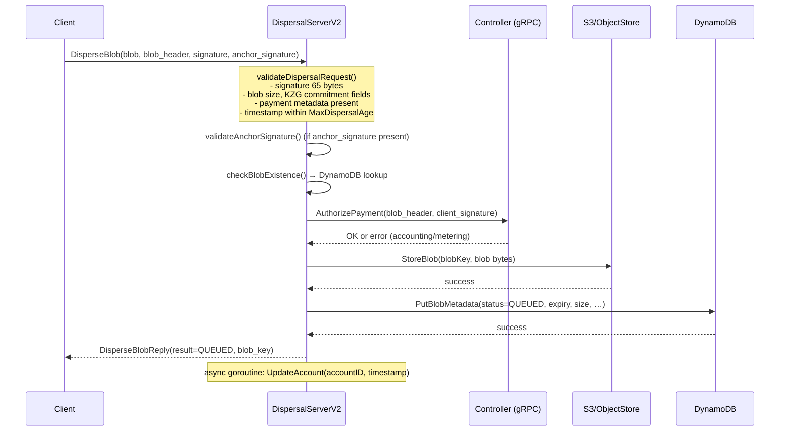
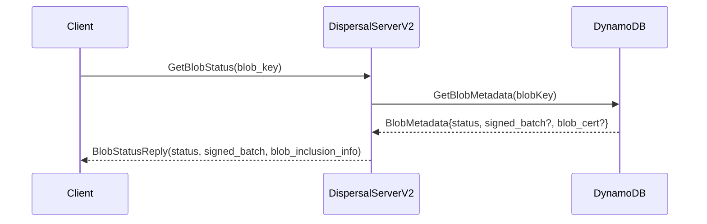
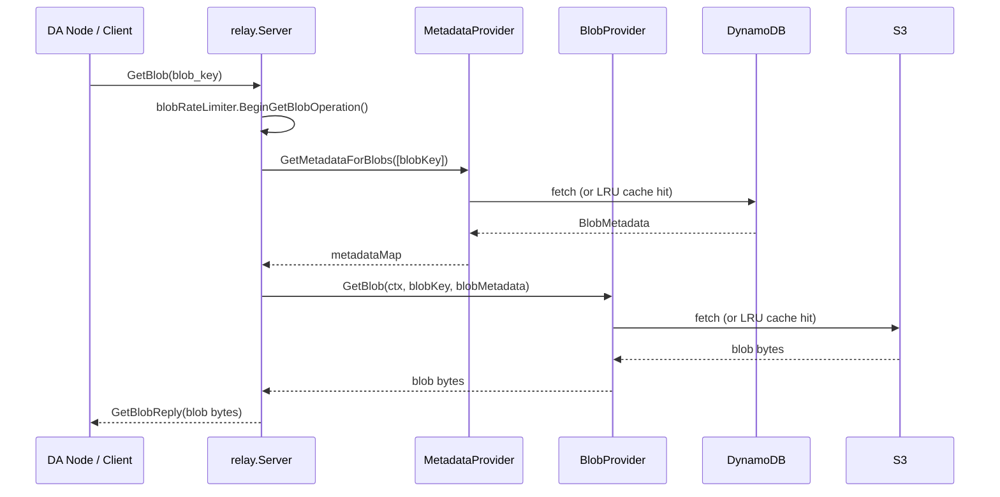
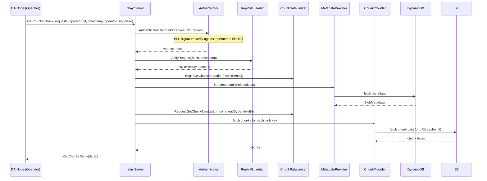
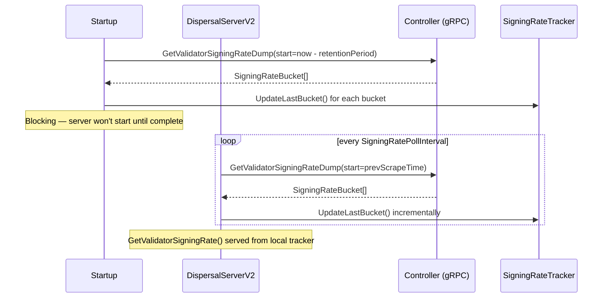

# disperser-blobapi Analysis

**Analyzed by**: code-analyzer-disperser-blobapi
**Timestamp**: 2026-04-10T00:00:00Z
**Application Type**: go-module
**Classification**: service
**Location**: disperser/cmd/blobapi

## Architecture

`disperser-blobapi` is a composite Go binary that co-hosts two distinct EigenDA subsystems within a single OS process: the **Disperser API Server** (accepting and persisting client blob dispersal requests) and the **Relay** (serving already-dispersed blobs and encoded chunks to downstream consumers such as DA operator nodes). Both subsystems are launched as goroutines from `main()`; a `select` on both error channels means the process terminates the moment either subsystem exits. This co-location simplifies cloud deployment (a single pod hosts both responsibilities) while keeping the two logical roles cleanly separated through independent flag namespaces (`disperser-server.*` and `relay.*`), independent gRPC listeners, independent Prometheus registries, and entirely separate gRPC server instances.

The Disperser API Server exposes the V2 `disperser.v2.Disperser` gRPC service (`DispersalServerV2`). On blob ingestion it validates the client-supplied ECDSA signature and optional anchor signature (binding the request to a specific chain ID and disperser ID), performs KZG polynomial commitment verification inline using SRS points, persists raw blob bytes to an S3-compatible object store, records blob metadata as a DynamoDB item in the QUEUED state, and then delegates payment authorization (accounting and metering) to the Controller service over a gRPC back-channel. The API server also mirrors signing-rate data from the Controller at startup (blocking, so data is immediately available) and periodically thereafter, making that data available through the `GetValidatorSigningRate` RPC without involving the Controller on each call.

The Relay exposes the `relay.Relay` gRPC service (`relay.Server`) providing read-only access to blob data and encoded chunks. It maintains three independent LRU byte-weighted caches (metadata, blob, chunk), enforces dual-dimension (ops/s + bandwidth) token-bucket rate limits both globally and per-client, and verifies BLS authentication on `GetChunks` requests using an operator key cache backed by the indexed chain state.

Both subsystems share Ethereum connectivity (read-only `eth.Reader`) to verify on-chain payment state, blob version parameters, and operator registry information. Both connect to the same DynamoDB table and S3 bucket.

## Key Components

- **`main()` / `mergeFlags()`** (`disperser/cmd/blobapi/main.go`): Entry point. Constructs a urfave/cli application, merges flag slices from both subsystems (deduplicating by primary name so shared flags such as AWS credentials only appear once), then spawns `RunDisperserServer` and `RunRelay` as goroutines and waits on the first error channel to fire.

- **`RunDisperserServer()`** (`disperser/cmd/apiserver/lib/apiserver.go`): Bootstraps the full Disperser API server. Creates AWS DynamoDB and S3 clients, instantiates the KZG committer from SRS files, constructs `BlobMetadataStore` (wrapped in instrumentation), sets up the `Meterer` if payment metering is enabled, establishes a gRPC client connection to the Controller, creates a `SigningRateTracker` and performs an initial blocking scrape of signing-rate data from the Controller, and finally calls `apiserver.NewDispersalServerV2` before calling `server.Start()`.

- **`DispersalServerV2`** (`disperser/apiserver/server_v2.go`): The V2 disperser gRPC server struct. Manages on-chain state refresh (quorum count, blob version parameters, TTL) on a configurable timer. Exposes five RPCs: `DisperseBlob`, `GetBlobStatus`, `GetBlobCommitment` (deprecated), `GetPaymentState`, and `GetValidatorSigningRate`. Registers both the V2 proto and an unimplemented V1 stub for grpcurl/reflection compatibility.

- **`DisperseBlob` / `disperseBlob` / `StoreBlob`** (`disperser/apiserver/disperse_blob_v2.go`): The critical blob-ingestion path. Validates the request (signature length, blob size, KZG commitment fields, payment metadata, timestamp freshness within `MaxDispersalAge`/`MaxFutureDispersalTime`), calls the Controller's `AuthorizePayment` gRPC, stores blob bytes to S3 via `blobStore.StoreBlob()`, writes DynamoDB metadata in QUEUED state via `blobMetadataStore.PutBlobMetadata()`, and asynchronously calls `UpdateAccount` to record the account's last-active timestamp.

- **`GetBlobStatus`** (`disperser/apiserver/get_blob_status_v2.go`): Polls DynamoDB for blob metadata by blob key, maps the internal `BlobStatus` enum to the protobuf enum, and returns signed batch and blob inclusion information when the status is GATHERING_SIGNATURES or COMPLETE.

- **`GetPaymentState`** (`disperser/apiserver/server_v2.go`): Authenticates the request via ECDSA signature over the account ID, then assembles a snapshot of on-chain global payment parameters (from `ChainPaymentState`) and off-chain per-account usage records (period records and cumulative payment from DynamoDB metering store) into the reply.

- **`GetValidatorSigningRate`** (`disperser/apiserver/server_v2.go`): Queries the local `SigningRateTracker` (which mirrors data from the Controller) for per-quorum, per-validator signing rate data within a caller-specified time range.

- **Signing Rate Mirror** (`core/signingrate/signing_rate_mirroring.go`): `DoInitialScrape` performs a blocking initial population of the `SigningRateTracker` from the Controller's `GetValidatorSigningRateDump` RPC. `MirrorSigningRate` then runs a goroutine that periodically re-scrapes incremental data.

- **`RunRelay()`** (`relay/cmd/lib/relay.go`): Bootstraps the Relay server. Creates DynamoDB client, object storage client (S3 or OCI), `BlobMetadataStore`, `BlobStore`, `ChunkReader`, `eth.Writer` + `ChainState`, indexed chain state via The Graph, and finally calls `relay.NewServer` before serving.

- **`relay.Server`** (`relay/server.go`): The Relay gRPC server struct. Implements `GetBlob`, `GetChunks`, and `GetValidatorChunks` (stub, not yet implemented). Manages three providers: `metadataProvider` (DynamoDB + LRU cache), `blobProvider` (S3 + LRU cache), `legacyChunkProvider` (S3 chunks + LRU cache). Enforces rate limits via `BlobRateLimiter` and `ChunkRateLimiter`. Validates BLS authentication on `GetChunks` and guards against replay attacks via `ReplayGuardian`.

- **`Meterer`** (`core/meterer`): Optional payment metering component. Enforces on-chain reservation periods and on-demand payment limits. Backed by DynamoDB tables for reservations, on-demand usage, and global rate state.

- **apiserver `Config`** (`disperser/cmd/apiserver/lib/config.go`): Typed configuration struct covering AWS credentials, S3/DynamoDB table names, gRPC port, timeout parameters, KZG SRS paths, Ethereum client config, contract addresses, payment metering flags, signing rate parameters, and Controller address.

- **relay `Config`** (`relay/cmd/lib/config.go`): Typed configuration struct covering AWS credentials, S3 bucket name, DynamoDB metadata table name, relay keys (for shard assignment), gRPC settings, rate limit parameters (operations/s + bandwidth/s, with burstiness, both global and per-client), cache sizes, timeout values, and Ethereum chain state settings.

## Data Flows

### 1. Blob Dispersal (Client → Disperser API Server)



**Detailed Steps**:

1. **Request Validation** (DispersalServerV2 internal)
   - Method: `validateDispersalRequest(req, onchainState)`
   - Checks: signature 65 bytes, blob non-empty, blob length ≤ `maxNumSymbolsPerBlob`, commitment fields non-nil, power-of-2 committed length, payment metadata non-empty, request timestamp within `[now - MaxDispersalAge, now + MaxFutureDispersalTime]`.

2. **Anchor Signature Validation** (DispersalServerV2 internal)
   - Method: `validateAnchorSignature(req, blobHeader)`
   - Verifies ECDSA signature over `Keccak256(domain || chainID || disperserID || blobKey)`.

3. **Payment Authorization** (DispersalServerV2 → Controller)
   - gRPC call: `controllerClient.AuthorizePayment(ctx, &controller.AuthorizePaymentRequest{…})`
   - Controller performs accounting and metering; returns gRPC error codes on failure.

4. **Blob Storage** (DispersalServerV2 → S3)
   - Call: `blobStore.StoreBlob(ctx, blobKey, data)`
   - Returns `ErrAlreadyExists` if the key is a duplicate.

5. **Metadata Storage** (DispersalServerV2 → DynamoDB)
   - Call: `blobMetadataStore.PutBlobMetadata(ctx, blobMetadata)`
   - Sets `BlobStatus=QUEUED`, `Expiry=requestedAt + TTL`.

6. **Async Account Update**
   - Goroutine calls `blobMetadataStore.UpdateAccount(ctx, accountID, timestamp)` with a 5-second timeout.

**Error Paths**:
- Validation failure → `codes.InvalidArgument`
- Controller rejection → forwarded gRPC status code (Unauthenticated, PermissionDenied, ResourceExhausted)
- S3 duplicate key → `codes.AlreadyExists`
- DynamoDB write failure → `codes.Internal`

---

### 2. Blob Status Polling (Client → Disperser API Server)



**Status Lifecycle**: QUEUED → ENCODED → GATHERING_SIGNATURES → COMPLETE (or FAILED)

---

### 3. Blob Retrieval (DA Node → Relay)



---

### 4. Chunk Retrieval with BLS Authentication (DA Node → Relay)



---

### 5. Signing Rate Mirror (Disperser API Server ← Controller)



## Dependencies

### External Libraries

- **github.com/urfave/cli** (v1.22.14) [cli]: Command-line interface framework. Provides the `cli.App`, flag definitions, and argument parsing. Used in `main.go` to compose the merged application and in both `flags/flags.go` packages to define all configuration flags.
  Imported in: `disperser/cmd/blobapi/main.go`, `disperser/cmd/apiserver/flags/flags.go`, `relay/cmd/flags/flags.go`, `disperser/cmd/apiserver/lib/config.go`, `relay/cmd/lib/config.go`.

- **google.golang.org/grpc** (v1.x, transitive from eigensdk-go) [networking]: gRPC framework. Provides server/client construction, interceptors, keepalive, status codes, reflection, and credentials. Used to build the Disperser gRPC server, Relay gRPC server, and the outbound Controller gRPC client.
  Imported in: `disperser/apiserver/server_v2.go`, `relay/server.go`, `disperser/cmd/apiserver/lib/apiserver.go`, `relay/cmd/lib/relay.go`.

- **github.com/prometheus/client_golang** (v1.21.1) [monitoring]: Prometheus metrics client. Each subsystem creates its own `prometheus.Registry` and exposes a metrics HTTP server. Used for gRPC method latency, blob size histograms, cache hit rates, rate limiter metrics, and connection counts.
  Imported in: `disperser/cmd/apiserver/lib/apiserver.go`, `relay/cmd/lib/relay.go`.

- **github.com/aws/aws-sdk-go-v2/service/dynamodb** (v1.31.0) [database]: AWS DynamoDB SDK. Used by `common/aws/dynamodb` wrapper to read/write blob metadata, reservation usage records, on-demand payment records, and global rate state.
  Imported transitively through internal `common/aws/dynamodb` package.

- **github.com/aws/aws-sdk-go-v2/feature/s3/manager** (v1.16.13) [cloud-sdk]: AWS S3 SDK with multipart upload manager. Used by the internal blobstore to store and retrieve raw blob bytes.
  Imported transitively through internal `disperser/common/blobstore`.

- **github.com/aws/aws-sdk-go-v2** (v1.26.1) [cloud-sdk]: AWS SDK core. Provides credential chain, config loading, and HTTP transport shared across DynamoDB and S3 clients.

- **github.com/ethereum/go-ethereum** (v1.15.3, via op-geth fork) [blockchain]: Ethereum client library. Used by `common/geth` to provide an RPC-only multi-homing Ethereum client for reading chain state (chain ID, on-chain quorum state, payment vault parameters, operator registry). Also used for ECDSA signature verification (`crypto.Ecrecover`, `crypto.SigToPub`).
  Imported in: `disperser/cmd/apiserver/lib/apiserver.go`, `relay/cmd/lib/relay.go`, `disperser/apiserver/disperse_blob_v2.go`.

- **github.com/Layr-Labs/eigensdk-go** (v0.2.0-beta.1.0) [other]: EigenLayer SDK. Provides the `logging.Logger` interface used throughout. Also provides the `eth.Reader` and `eth.Writer` for interacting with EigenDA smart contracts.
  Imported in: `disperser/apiserver/server_v2.go`, `relay/server.go`.

- **github.com/docker/go-units** (indirect, relay flags) [other]: Unit constants (MiB, GiB) for default values in relay rate limit and cache size flags.
  Imported in: `relay/cmd/flags/flags.go`.

### Internal Libraries

- **`disperser`** (`disperser/`): Core disperser library. Provides `DispersalServerV2` (gRPC server implementation), `BlobMetadataStore` (DynamoDB-backed), `BlobStore` (S3-backed), `Meterer` (payment accounting), `metricsV2`, `ServerConfig`, `MetricsConfig`, and `RateConfig`. The blobapi binary is the deployment entry point for this library's production server.

- **`relay`** (`relay/`): Core relay library. Provides `relay.Server` (gRPC server), `metadataProvider`, `blobProvider`, `chunkProvider`, `BlobRateLimiter`, `ChunkRateLimiter`, `requestAuthenticator`, `ReplayGuardian`, and `RelayMetrics`. The blobapi binary co-deploys this relay as a goroutine alongside the disperser.

- **`common/aws/dynamodb`** (`common/aws/dynamodb`): Internal DynamoDB client wrapper. `dynamodb.NewClient(config, logger)` constructs an instrumented DynamoDB client used by both the disperser metadata store and the relay metadata store.

- **`common/geth`** (`common/geth`): Ethereum client wrapper. `geth.NewMultiHomingClient` returns an `ethclient.Client` that can fail over across multiple RPC endpoints. Used by both subsystems to connect to Ethereum.

- **`core/eth`** (`core/eth`): EigenDA smart contract readers/writers. `eth.NewReader` constructs a chain reader for operator state retriever and service manager contracts. `eth.NewWriter` and `eth.NewChainState` support the relay's indexed chain state.

- **`core/meterer`** (`core/meterer`): Payment metering. `Meterer` struct enforces on-chain reservation and on-demand payment accounting against DynamoDB tables.

- **`core/signingrate`** (`core/signingrate`): Signing rate tracking. `SigningRateTracker`, `DoInitialScrape`, and `MirrorSigningRate` are used to mirror signing-rate data from the Controller into the API server's local in-memory tracker.

- **`encoding/v2/kzg/committer`** (`encoding/v2/kzg/committer`): KZG polynomial commitment computation. `committer.NewFromConfig` loads SRS points from disk and constructs the `Committer` used in `DispersalServerV2` to verify blob commitments provided by clients.

- **`relay/chunkstore`** (`relay/chunkstore`): Chunk storage abstraction. `ChunkReader` wraps the object storage client to read serialized frame bundles (proofs + field element coefficients) from S3.

- **`core/thegraph`** (`core/thegraph`): The Graph indexed chain state client. Used by the Relay to resolve operator public keys for BLS authentication.

- **`disperser/common/blobstore`** (`disperser/common/blobstore`): Object storage client factory. `CreateObjectStorageClient` supports both AWS S3 and OCI object storage backends, configured via the `ObjectStorageBackend` flag.

## API Surface

### Disperser API Server — `disperser.v2.Disperser` gRPC Service

The Disperser API Server exposes the V2 Disperser gRPC service on the port specified by `--disperser-server-grpc-port`. An unimplemented V1 `disperser.Disperser` stub is also registered to support grpcurl/reflection of V1 APIs. gRPC server reflection is enabled.

**1. DisperseBlob** — `rpc DisperseBlob(DisperseBlobRequest) returns (DisperseBlobReply)`

Accepts a blob for asynchronous dispersal. Returns immediately after successful validation, payment authorization, and storage with status QUEUED.

Example Request:
```http
POST /disperser.v2.Disperser/DisperseBlob HTTP/2
Content-Type: application/grpc
```
```json
{
  "blob": "<raw blob bytes up to 16 MiB>",
  "blob_header": {
    "quorum_numbers": [0, 1],
    "payment_header": {
      "account_id": "0xAbCd...",
      "reservation_period": 12345,
      "cumulative_payment": "<big-endian uint256>"
    },
    "commitment": {
      "length_commitment": "<G2 point bytes>",
      "length_proof": "<G2 point bytes>",
      "length": 1024,
      "commitment": "<G1 point bytes>"
    }
  },
  "signature": "<65 byte ECDSA signature over blob_key>",
  "anchor_signature": "<65 byte ECDSA signature over domain||chainID||disperserID||blobKey>",
  "disperser_id": 1,
  "chain_id": "<32 byte big-endian chain ID>"
}
```

Example Response (OK):
```json
{
  "result": "QUEUED",
  "blob_key": "<32 byte keccak hash of serialized BlobHeader>"
}
```

Error Codes: `INVALID_ARGUMENT` (validation), `UNAUTHENTICATED` (bad signature), `PERMISSION_DENIED` (insufficient payment), `RESOURCE_EXHAUSTED` (throughput limit), `ALREADY_EXISTS` (duplicate blob key), `INTERNAL`.

---

**2. GetBlobStatus** — `rpc GetBlobStatus(BlobStatusRequest) returns (BlobStatusReply)`

Polls the dispersal status of a previously submitted blob by its blob key.

Example Request:
```json
{ "blob_key": "<32 bytes>" }
```

Example Response (COMPLETE):
```json
{
  "status": "COMPLETE",
  "signed_batch": {
    "header": { "batch_root": "...", "reference_block_number": 12345678 },
    "attestation": {
      "non_signer_pubkeys": ["<G1 bytes>"],
      "apk_g2": "<G2 bytes>",
      "quorum_apks": ["<G1 bytes>"],
      "sigma": "<G1 bytes>",
      "quorum_numbers": [0, 1],
      "quorum_signed_percentages": "<byte array>"
    }
  },
  "blob_inclusion_info": {
    "blob_certificate": { "blob_header": {...}, "relay_keys": [1, 2] },
    "blob_index": 5,
    "inclusion_proof": "<merkle proof bytes>"
  }
}
```

---

**3. GetBlobCommitment** — `rpc GetBlobCommitment(BlobCommitmentRequest) returns (BlobCommitmentReply)` *(DEPRECATED)*

Computes a KZG commitment for provided blob bytes. Deprecated; returns a deprecation error if `--disperser-server-disable-get-blob-commitment` is set.

---

**4. GetPaymentState** — `rpc GetPaymentState(GetPaymentStateRequest) returns (GetPaymentStateReply)`

Returns the current payment state (on-chain global params, on-chain reservation, off-chain usage records) for an account. Requires ECDSA signature over the account ID to authenticate.

Example Request:
```json
{
  "account_id": "0xAbCd...",
  "signature": "<65 byte ECDSA signature over account_id>",
  "timestamp": 1712500000000000000
}
```

Example Response:
```json
{
  "payment_global_params": {
    "global_symbols_per_second": 10000,
    "min_num_symbols": 1,
    "price_per_symbol": 100,
    "reservation_window": 300,
    "on_demand_quorum_numbers": [0]
  },
  "period_records": [
    { "index": 4000, "usage": 512 },
    { "index": 4001, "usage": 0 }
  ],
  "reservation": {
    "symbols_per_second": 1000,
    "start_timestamp": 1700000000,
    "end_timestamp": 1800000000,
    "quorum_numbers": [0, 1],
    "quorum_splits": [50, 50]
  },
  "cumulative_payment": "<big-endian uint256 bytes>",
  "onchain_cumulative_payment": "<big-endian uint256 bytes>"
}
```

---

**5. GetValidatorSigningRate** — `rpc GetValidatorSigningRate(GetValidatorSigningRateRequest) returns (GetValidatorSigningRateReply)`

Returns the signing rate of a specific validator for a quorum within a time range. Served from local in-memory tracker (data mirrored from Controller).

Example Request:
```json
{
  "validator_id": "<32 byte operator ID>",
  "quorum": 0,
  "start_timestamp": 1712400000,
  "end_timestamp": 1712500000
}
```

Example Response:
```json
{
  "validator_signing_rate": {
    "buckets": [
      { "start_time": 1712400000, "end_time": 1712460000, "num_signed": 95, "num_total": 100 }
    ]
  }
}
```

---

### Relay — `relay.Relay` gRPC Service

The Relay server exposes the Relay gRPC service on the port specified by `--relay-grpc-port`. gRPC server reflection is enabled.

**1. GetBlob** — `rpc GetBlob(GetBlobRequest) returns (GetBlobReply)`

Retrieves raw blob bytes by blob key. Subject to global rate limits (ops/s + bandwidth/s). No authentication required.

Example Request:
```json
{ "blob_key": "<32 bytes>" }
```

Example Response:
```json
{ "blob": "<raw blob bytes>" }
```

Error Codes: `INVALID_ARGUMENT` (bad key), `NOT_FOUND` (blob not assigned to this relay), `RESOURCE_EXHAUSTED` (rate limit).

---

**2. GetChunks** — `rpc GetChunks(GetChunksRequest) returns (GetChunksReply)`

Retrieves encoded chunk data for one or more blobs. Requires BLS authentication from DA operator nodes. Subject to per-client rate limits.

Example Request:
```json
{
  "chunk_requests": [
    { "by_index": { "blob_key": "<32 bytes>", "chunk_indices": [0, 1, 2] } },
    { "by_range": { "blob_key": "<32 bytes>", "start_index": 0, "end_index": 4 } }
  ],
  "operator_id": "<32 byte operator ID>",
  "timestamp": 1712500000,
  "operator_signature": "<BLS signature bytes>"
}
```

Example Response:
```json
{
  "data": [
    "<serialized chunk bundle for request[0]>",
    "<serialized chunk bundle for request[1]>"
  ]
}
```

Error Codes: `INVALID_ARGUMENT` (bad request or auth failure), `NOT_FOUND`, `RESOURCE_EXHAUSTED` (rate limit).

---

**3. GetValidatorChunks** — `rpc GetValidatorChunks(GetValidatorChunksRequest) returns (GetChunksReply)`

Retrieves all chunks allocated to a specific validator based on deterministic chunk allocation. Currently returns `UNIMPLEMENTED`.

## Code Examples

### Example 1: Binary Startup — Concurrent Subsystem Launch

```go
// disperser/cmd/blobapi/main.go:30-44
app.Action = func(ctx *cli.Context) error {
    apiserverDone := make(chan error, 1)
    relayDone := make(chan error, 1)

    go func() { apiserverDone <- apiserverLib.RunDisperserServer(ctx) }()
    go func() { relayDone <- relayLib.RunRelay(ctx) }()

    select {
    case err := <-apiserverDone:
        return fmt.Errorf("apiserver exited: %w", err)
    case err := <-relayDone:
        return fmt.Errorf("relay exited: %w", err)
    }
}
```

### Example 2: Flag Merging — Deduplication of Shared Flags

```go
// disperser/cmd/blobapi/main.go:54-72
func mergeFlags(a, b []cli.Flag) []cli.Flag {
    seen := make(map[string]bool, len(a)+len(b))
    out := make([]cli.Flag, 0, len(a)+len(b))
    for _, f := range a {
        name := f.GetName()
        seen[name] = true
        out = append(out, f)
    }
    for _, f := range b {
        if !seen[f.GetName()] {
            seen[f.GetName()] = true
            out = append(out, f)
        }
    }
    return out
}
```

### Example 3: Blob Dispersal — Payment Authorization via Controller gRPC

```go
// disperser/apiserver/disperse_blob_v2.go:63-69
authorizePaymentRequest := &controller.AuthorizePaymentRequest{
    BlobHeader:      req.GetBlobHeader(),
    ClientSignature: req.GetSignature(),
}
_, err = s.controllerClient.AuthorizePayment(ctx, authorizePaymentRequest)
if err != nil {
    return nil, status.Convert(err)
}
```

### Example 4: Async Account Update After Blob Store

```go
// disperser/apiserver/disperse_blob_v2.go:92-103
go func() {
    accountID := blobHeader.PaymentMetadata.AccountID
    timestamp := uint64(time.Now().Unix())
    ctx, cancel := context.WithTimeout(context.Background(), 5*time.Second)
    defer cancel()
    if err := s.blobMetadataStore.UpdateAccount(ctx, accountID, timestamp); err != nil {
        s.logger.Warn("failed to update account", "accountID", accountID.Hex(), "error", err)
    }
}()
```

### Example 5: Signing Rate Mirror — Blocking Initial Scrape

```go
// disperser/cmd/apiserver/lib/apiserver.go:182-200
err = signingrate.DoInitialScrape(
    context.Background(), logger, scraper,
    signingRateTracker,
    config.ServerConfig.SigningRateRetentionPeriod)
// ...
go signingrate.MirrorSigningRate(
    context.Background(), logger, scraper,
    signingRateTracker,
    config.ServerConfig.SigningRatePollInterval,
    config.ServerConfig.SigningRateRetentionPeriod,
)
```

### Example 6: Relay GetChunks — BLS Auth + Replay Guard + Rate Limit

```go
// relay/server.go:308-342 (condensed)
hash, err := s.authenticator.AuthenticateGetChunksRequest(ctx, request)
// ...
err = s.replayGuardian.VerifyRequest(hash, timestamp)
// ...
err = s.chunkRateLimiter.BeginGetChunkOperation(time.Now(), clientID)
defer s.chunkRateLimiter.FinishGetChunkOperation(clientID)
// ... fetch metadata, compute required bandwidth, check bandwidth rate limit
```

## Files Analyzed

- `disperser/cmd/blobapi/main.go` (73 lines) — Binary entry point; flag merging; goroutine launch
- `disperser/cmd/apiserver/lib/apiserver.go` (236 lines) — Disperser server bootstrap: AWS, KZG, meterer, controller client, signing rate mirror
- `disperser/cmd/apiserver/lib/config.go` (131 lines) — Disperser `Config` struct and `NewConfig` from CLI
- `disperser/cmd/apiserver/flags/flags.go` (384 lines) — All disperser server CLI flag definitions
- `disperser/cmd/apiserver/main.go` (35 lines) — Standalone apiserver binary (reference)
- `relay/cmd/lib/relay.go` (145 lines) — Relay bootstrap: AWS, object storage, DynamoDB, eth, The Graph
- `relay/cmd/lib/config.go` (130 lines) — Relay `Config` struct and `NewConfig` from CLI
- `relay/cmd/flags/flags.go` (449 lines) — All relay CLI flag definitions
- `disperser/apiserver/server_v2.go` (526 lines) — DispersalServerV2 struct, Start, GetPaymentState, GetValidatorSigningRate, Stop
- `disperser/apiserver/disperse_blob_v2.go` (400 lines) — DisperseBlob, StoreBlob, validateDispersalRequest, validateAnchorSignature
- `disperser/apiserver/get_blob_status_v2.go` (partial) — GetBlobStatus handler
- `relay/server.go` (919 lines) — relay.Server struct, NewServer, GetBlob, GetChunks, GetValidatorChunks, Start, Stop
- `api/proto/disperser/v2/disperser_v2.proto` (303 lines) — V2 Disperser proto definition
- `api/proto/relay/relay.proto` (133 lines) — Relay proto definition
- `api/proto/controller/controller_service.proto` (98 lines) — Controller service proto (AuthorizePayment, GetValidatorSigningRateDump)
- `core/signingrate/signing_rate_mirroring.go` (87 lines) — DoInitialScrape, MirrorSigningRate
- `go.mod` (partial) — Module dependencies and AWS/gRPC/Ethereum library versions

## Analysis Data

```json
{
  "summary": "disperser-blobapi is a composite Go binary that co-hosts two EigenDA subsystems: the V2 Disperser API Server (DispersalServerV2 gRPC — accepts client blobs, validates ECDSA/KZG, persists to S3+DynamoDB, delegates payment authorization to the Controller) and the Relay server (relay.Server gRPC — serves blobs and encoded chunks to DA operator nodes with BLS auth, LRU caching, and token-bucket rate limiting). Both goroutines share the same flag namespace and terminate the process if either exits. The binary serves as the public-facing DA ingestion and shard-retrieval endpoint.",
  "architecture_pattern": "composite-grpc-service",
  "key_modules": [
    "disperser/cmd/blobapi/main.go",
    "disperser/cmd/apiserver/lib/apiserver.go",
    "disperser/cmd/apiserver/lib/config.go",
    "relay/cmd/lib/relay.go",
    "relay/cmd/lib/config.go",
    "disperser/apiserver/server_v2.go",
    "disperser/apiserver/disperse_blob_v2.go",
    "disperser/apiserver/get_blob_status_v2.go",
    "relay/server.go",
    "core/signingrate/signing_rate_mirroring.go"
  ],
  "api_endpoints": [
    "gRPC disperser.v2.Disperser/DisperseBlob",
    "gRPC disperser.v2.Disperser/GetBlobStatus",
    "gRPC disperser.v2.Disperser/GetBlobCommitment (deprecated)",
    "gRPC disperser.v2.Disperser/GetPaymentState",
    "gRPC disperser.v2.Disperser/GetValidatorSigningRate",
    "gRPC relay.Relay/GetBlob",
    "gRPC relay.Relay/GetChunks",
    "gRPC relay.Relay/GetValidatorChunks (unimplemented)"
  ],
  "data_flows": [
    "Blob dispersal: Client → DispersalServerV2 → Controller(AuthorizePayment) → S3(StoreBlob) → DynamoDB(PutBlobMetadata) → reply QUEUED",
    "Blob status poll: Client → DispersalServerV2 → DynamoDB(GetBlobMetadata) → reply with status + attestation",
    "Blob retrieval: DA Node → relay.Server → MetadataProvider(DynamoDB LRU) → BlobProvider(S3 LRU) → reply blob bytes",
    "Chunk retrieval: DA Node → relay.Server → BLS auth → ReplayGuardian → rate limit → MetadataProvider → ChunkProvider(S3 LRU) → reply chunk bundles",
    "Signing rate mirror: Startup DoInitialScrape(Controller) + periodic MirrorSigningRate goroutine → local SigningRateTracker"
  ],
  "tech_stack": [
    "go",
    "grpc",
    "protobuf",
    "aws-dynamodb",
    "aws-s3",
    "ethereum",
    "kzg-polynomial-commitments",
    "bls-signatures",
    "ecdsa",
    "prometheus",
    "urfave-cli",
    "thegraph"
  ],
  "external_integrations": [
    "aws-dynamodb",
    "aws-s3",
    "ethereum-rpc",
    "thegraph-indexer"
  ],
  "component_interactions": [
    {
      "target": "disperser-controller",
      "type": "grpc",
      "description": "Disperser API Server calls Controller's AuthorizePayment RPC for every DisperseBlob request to perform payment accounting and metering. Also periodically calls GetValidatorSigningRateDump to mirror signing rate data into local SigningRateTracker."
    },
    {
      "target": "aws-dynamodb",
      "type": "shared_database",
      "description": "Both Disperser API Server and Relay read blob metadata from the same DynamoDB table. Disperser writes QUEUED records; downstream pipeline (controller/encoder/batcher) updates statuses. Relay reads metadata to validate chunk requests."
    },
    {
      "target": "aws-s3",
      "type": "shared_database",
      "description": "Disperser API Server writes raw blob bytes to S3 on ingestion. Relay reads blob bytes and chunk data from the same S3 bucket on GetBlob/GetChunks requests."
    },
    {
      "target": "ethereum-rpc",
      "type": "http_api",
      "description": "Both subsystems connect to Ethereum RPC to read on-chain state: quorum parameters, blob version parameters, payment vault state, operator registry, and chain ID."
    },
    {
      "target": "thegraph-indexer",
      "type": "http_api",
      "description": "Relay uses The Graph's indexed chain state to resolve operator BLS public keys for authentication of GetChunks requests."
    }
  ]
}
```

## Citations

```json
[
  {
    "file_path": "disperser/cmd/blobapi/main.go",
    "start_line": 22,
    "end_line": 44,
    "claim": "Binary entry point launches both RunDisperserServer and RunRelay as goroutines and terminates on the first error",
    "section": "Architecture",
    "snippet": "go func() { apiserverDone <- apiserverLib.RunDisperserServer(ctx) }()\ngo func() { relayDone <- relayLib.RunRelay(ctx) }()\nselect {\ncase err := <-apiserverDone: return fmt.Errorf(\"apiserver exited: %w\", err)\ncase err := <-relayDone: return fmt.Errorf(\"relay exited: %w\", err)\n}"
  },
  {
    "file_path": "disperser/cmd/blobapi/main.go",
    "start_line": 24,
    "end_line": 24,
    "claim": "App description confirms the combined role: Disperser API Server and Relay",
    "section": "Architecture",
    "snippet": "app.Description = \"EigenDA Disperser API Server (accepts blobs for dispersal) and Relay (serves blobs and chunks data)\""
  },
  {
    "file_path": "disperser/cmd/blobapi/main.go",
    "start_line": 54,
    "end_line": 72,
    "claim": "mergeFlags deduplicates CLI flags by primary name to prevent conflicts between apiserver and relay flag sets",
    "section": "Key Components",
    "snippet": "seen := make(map[string]bool, len(a)+len(b))\nfor _, f := range b {\n    if !seen[f.GetName()] { out = append(out, f) }\n}"
  },
  {
    "file_path": "disperser/cmd/apiserver/lib/apiserver.go",
    "start_line": 58,
    "end_line": 67,
    "claim": "RunDisperserServer creates both S3 object storage and DynamoDB clients at startup",
    "section": "Key Components",
    "snippet": "objectStorageClient, err := blobstore.CreateObjectStorageClient(...)\ndynamoClient, err := dynamodb.NewClient(config.AwsClientConfig, logger)"
  },
  {
    "file_path": "disperser/cmd/apiserver/lib/apiserver.go",
    "start_line": 138,
    "end_line": 145,
    "claim": "Disperser API Server establishes an outbound gRPC client connection to the Controller service",
    "section": "Key Components",
    "snippet": "controllerConnection, err := grpc.NewClient(\n    config.ControllerAddress,\n    grpc.WithTransportCredentials(insecure.NewCredentials()),\n)\ncontrollerClient := controller.NewControllerServiceClient(controllerConnection)"
  },
  {
    "file_path": "disperser/cmd/apiserver/lib/apiserver.go",
    "start_line": 166,
    "end_line": 200,
    "claim": "Signing rate data is scraped from the Controller at startup (blocking) and then mirrored periodically in a background goroutine",
    "section": "Data Flows",
    "snippet": "scraper := func(ctx context.Context, startTime time.Time) ([]*validator.SigningRateBucket, error) {\n    data, err := controllerClient.GetValidatorSigningRateDump(...)\n}\nerr = signingrate.DoInitialScrape(...)\ngo signingrate.MirrorSigningRate(...)"
  },
  {
    "file_path": "disperser/cmd/apiserver/lib/apiserver.go",
    "start_line": 122,
    "end_line": 133,
    "claim": "BlobMetadataStore is wrapped in instrumentation with service name 'apiserver' and DynamoDB backend label",
    "section": "Key Components",
    "snippet": "blobMetadataStore := blobstorev2.NewInstrumentedMetadataStore(\n    baseBlobMetadataStore,\n    blobstorev2.InstrumentedMetadataStoreConfig{\n        ServiceName: \"apiserver\",\n        Registry:    reg,\n        Backend:     blobstorev2.BackendDynamoDB,\n    })"
  },
  {
    "file_path": "disperser/cmd/apiserver/lib/config.go",
    "start_line": 19,
    "end_line": 50,
    "claim": "Config struct covers AWS, S3/DynamoDB, gRPC, KZG, Ethereum, metering, signing rate, and Controller address settings",
    "section": "Key Components",
    "snippet": "type Config struct {\n    AwsClientConfig aws.ClientConfig\n    BlobstoreConfig blobstore.Config\n    ServerConfig disperser.ServerConfig\n    ControllerAddress string\n    // ...\n}"
  },
  {
    "file_path": "disperser/apiserver/server_v2.go",
    "start_line": 48,
    "end_line": 106,
    "claim": "DispersalServerV2 holds blobStore, blobMetadataStore, meterer, chainReader, committer, signingRateTracker, and controller client as dependencies",
    "section": "Key Components",
    "snippet": "type DispersalServerV2 struct {\n    pb.UnimplementedDisperserServer\n    blobStore blobstore.BlobStore\n    blobMetadataStore blobstore.MetadataStore\n    meterer *meterer.Meterer\n    controllerClient controller.ControllerServiceClient\n    signingRateTracker signingrate.SigningRateTracker\n}"
  },
  {
    "file_path": "disperser/apiserver/server_v2.go",
    "start_line": 229,
    "end_line": 238,
    "claim": "gRPC server registers both V2 Disperser and an unimplemented V1 stub to support grpcurl reflection",
    "section": "API Surface",
    "snippet": "pb.RegisterDisperserServer(s.grpcServer, s)\npbv1.RegisterDisperserServer(s.grpcServer, &DispersalServerV1{})"
  },
  {
    "file_path": "disperser/apiserver/disperse_blob_v2.go",
    "start_line": 27,
    "end_line": 38,
    "claim": "DisperseBlob is the public gRPC handler; it delegates to disperseBlob and logs the response status",
    "section": "API Surface",
    "snippet": "func (s *DispersalServerV2) DisperseBlob(\n    ctx context.Context, req *pb.DisperseBlobRequest,\n) (*pb.DisperseBlobReply, error) {\n    reply, st := s.disperseBlob(ctx, req)\n    api.LogResponseStatus(s.logger, st)\n    return reply, st.Err()\n}"
  },
  {
    "file_path": "disperser/apiserver/disperse_blob_v2.go",
    "start_line": 63,
    "end_line": 70,
    "claim": "Payment authorization is delegated to the Controller via AuthorizePayment gRPC before blob storage",
    "section": "Data Flows",
    "snippet": "authorizePaymentRequest := &controller.AuthorizePaymentRequest{\n    BlobHeader: req.GetBlobHeader(),\n    ClientSignature: req.GetSignature(),\n}\n_, err = s.controllerClient.AuthorizePayment(ctx, authorizePaymentRequest)"
  },
  {
    "file_path": "disperser/apiserver/disperse_blob_v2.go",
    "start_line": 85,
    "end_line": 110,
    "claim": "StoreBlob is called to persist blob bytes to S3, then PutBlobMetadata to DynamoDB, then async UpdateAccount",
    "section": "Data Flows",
    "snippet": "blobKey, st := s.StoreBlob(ctx, blob, blobHeader, req.GetSignature(), time.Now(), onchainState.TTL)\ngo func() {\n    s.blobMetadataStore.UpdateAccount(ctx, accountID, timestamp)\n}()"
  },
  {
    "file_path": "disperser/apiserver/disperse_blob_v2.go",
    "start_line": 113,
    "end_line": 156,
    "claim": "StoreBlob writes raw bytes to S3, then writes QUEUED metadata to DynamoDB including expiry, size, and timestamps",
    "section": "Data Flows",
    "snippet": "if err := s.blobStore.StoreBlob(ctx, blobKey, data); err != nil { ... }\nblobMetadata := &dispv2.BlobMetadata{\n    BlobStatus: dispv2.Queued,\n    Expiry: uint64(requestedAt.Add(ttl).Unix()),\n}\nerr = s.blobMetadataStore.PutBlobMetadata(ctx, blobMetadata)"
  },
  {
    "file_path": "disperser/apiserver/disperse_blob_v2.go",
    "start_line": 158,
    "end_line": 198,
    "claim": "validateDispersalRequest checks signature length, blob size, power-of-2 commitment length, payment metadata, and timestamp freshness",
    "section": "Data Flows",
    "snippet": "if len(signature) != 65 { return nil, fmt.Errorf(...) }\nif blobSize == 0 { return nil, errors.New(\"blob size must be greater than 0\") }\nif blobLength > s.maxNumSymbolsPerBlob { return nil, errors.New(\"blob size too big\") }"
  },
  {
    "file_path": "disperser/apiserver/server_v2.go",
    "start_line": 379,
    "end_line": 458,
    "claim": "GetPaymentState authenticates with ECDSA, then reads global on-chain params, per-account period records, reservation, and cumulative payment from DynamoDB meterer store",
    "section": "API Surface",
    "snippet": "if err := s.blobRequestAuthenticator.AuthenticatePaymentStateRequest(accountID, req); err != nil { ... }\nglobalSymbolsPerSecond := s.meterer.ChainPaymentState.GetGlobalSymbolsPerSecond()\nperiodRecords, err := s.meterer.MeteringStore.GetPeriodRecords(ctx, accountID, currentReservationPeriod)"
  },
  {
    "file_path": "disperser/apiserver/server_v2.go",
    "start_line": 486,
    "end_line": 510,
    "claim": "GetValidatorSigningRate queries the local SigningRateTracker without contacting the Controller",
    "section": "API Surface",
    "snippet": "signingRate, err := s.signingRateTracker.GetValidatorSigningRate(\n    core.QuorumID(request.GetQuorum()), validatorId,\n    time.Unix(int64(request.GetStartTimestamp()), 0),\n    time.Unix(int64(request.GetEndTimestamp()), 0))"
  },
  {
    "file_path": "relay/cmd/lib/relay.go",
    "start_line": 71,
    "end_line": 81,
    "claim": "Relay creates an instrumented BlobMetadataStore with service name 'relay' over DynamoDB",
    "section": "Key Components",
    "snippet": "baseMetadataStore := blobstore.NewBlobMetadataStore(dynamoClient, logger, config.MetadataTableName)\nmetadataStore := blobstore.NewInstrumentedMetadataStore(baseMetadataStore, blobstore.InstrumentedMetadataStoreConfig{\n    ServiceName: \"relay\", Backend: blobstore.BackendDynamoDB,\n})"
  },
  {
    "file_path": "relay/cmd/lib/relay.go",
    "start_line": 83,
    "end_line": 90,
    "claim": "Relay creates eth.Writer and ChainState for indexed chain state lookup (operator key resolution)",
    "section": "Key Components",
    "snippet": "tx, err := eth.NewWriter(logger, ethClient, config.OperatorStateRetrieverAddr, config.EigenDAServiceManagerAddr)\ncs := eth.NewChainState(tx, ethClient)\nics := thegraph.MakeIndexedChainState(config.ChainStateConfig, cs, logger)"
  },
  {
    "file_path": "relay/server.go",
    "start_line": 35,
    "end_line": 82,
    "claim": "relay.Server implements the Relay gRPC service with three providers (metadata, blob, chunk), two rate limiters, BLS authenticator, and replay guardian",
    "section": "Key Components",
    "snippet": "var _ pb.RelayServer = &Server{}\ntype Server struct {\n    metadataProvider *metadataProvider\n    blobProvider *blobProvider\n    legacyChunkProvider *chunkProvider\n    blobRateLimiter *limiter.BlobRateLimiter\n    chunkRateLimiter *limiter.ChunkRateLimiter\n    authenticator auth.RequestAuthenticator\n    replayGuardian replay.ReplayGuardian\n}"
  },
  {
    "file_path": "relay/server.go",
    "start_line": 191,
    "end_line": 198,
    "claim": "Relay gRPC server registers the Relay proto service and health check; reflection is enabled",
    "section": "API Surface",
    "snippet": "server.grpcServer = grpc.NewServer(opt, relayMetrics.GetGRPCServerOption(), keepAliveConfig)\nreflection.Register(server.grpcServer)\npb.RegisterRelayServer(server.grpcServer, server)\nhealthcheck.RegisterHealthServer(name, server.grpcServer)"
  },
  {
    "file_path": "relay/server.go",
    "start_line": 203,
    "end_line": 250,
    "claim": "GetBlob validates blob key, checks global rate limits, fetches metadata from DynamoDB (LRU cache), then fetches blob bytes from S3 (LRU cache)",
    "section": "Data Flows",
    "snippet": "err = s.blobRateLimiter.BeginGetBlobOperation(time.Now())\nkeys := []v2.BlobKey{key}\nmMap, err := s.metadataProvider.GetMetadataForBlobs(ctx, keys)"
  },
  {
    "file_path": "relay/server.go",
    "start_line": 308,
    "end_line": 342,
    "claim": "GetChunks performs BLS authentication via authenticator.AuthenticateGetChunksRequest, then replay guard check, then per-client rate limit check",
    "section": "Data Flows",
    "snippet": "hash, err := s.authenticator.AuthenticateGetChunksRequest(ctx, request)\nerr = s.replayGuardian.VerifyRequest(hash, timestamp)\nerr = s.chunkRateLimiter.BeginGetChunkOperation(time.Now(), clientID)"
  },
  {
    "file_path": "relay/server.go",
    "start_line": 845,
    "end_line": 851,
    "claim": "GetValidatorChunks is declared but not yet implemented — returns UNIMPLEMENTED gRPC error",
    "section": "API Surface",
    "snippet": "func (s *Server) GetValidatorChunks(...) (*pb.GetChunksReply, error) {\n    return nil, status.Errorf(codes.Unimplemented, \"method GetValidatorChunks not implemented\")\n}"
  },
  {
    "file_path": "relay/server.go",
    "start_line": 884,
    "end_line": 902,
    "claim": "Relay periodically refreshes on-chain blob version parameters from Ethereum via RefreshOnchainState loop",
    "section": "Architecture",
    "snippet": "func (s *Server) RefreshOnchainState(ctx context.Context) error {\n    ticker := time.NewTicker(s.config.OnchainStateRefreshInterval)\n    for { case <-ticker.C:\n        blobParams, err := s.chainReader.GetAllVersionedBlobParams(ctx)\n        s.metadataProvider.UpdateBlobVersionParameters(...)\n    }\n}"
  },
  {
    "file_path": "relay/cmd/lib/config.go",
    "start_line": 17,
    "end_line": 50,
    "claim": "Relay Config covers AWS, S3/OCI object storage, DynamoDB, relay keys, LRU cache sizes, rate limit dimensions, timeout values, and Ethereum config",
    "section": "Key Components",
    "snippet": "type Config struct {\n    BucketName string\n    MetadataTableName string\n    RelayConfig relay.Config  // GRPCPort, cache sizes, rate limits, timeouts\n    EthClientConfig geth.EthClientConfig\n}"
  },
  {
    "file_path": "api/proto/disperser/v2/disperser_v2.proto",
    "start_line": 11,
    "end_line": 40,
    "claim": "V2 Disperser service defines 5 RPCs: DisperseBlob, GetBlobStatus, GetBlobCommitment (deprecated), GetPaymentState, GetValidatorSigningRate",
    "section": "API Surface",
    "snippet": "service Disperser {\n  rpc DisperseBlob(...)\n  rpc GetBlobStatus(...)\n  rpc GetBlobCommitment(...) // DEPRECATED\n  rpc GetPaymentState(...)\n  rpc GetValidatorSigningRate(...)\n}"
  },
  {
    "file_path": "api/proto/relay/relay.proto",
    "start_line": 6,
    "end_line": 17,
    "claim": "Relay service defines 3 RPCs: GetBlob, GetChunks, GetValidatorChunks",
    "section": "API Surface",
    "snippet": "service Relay {\n  rpc GetBlob(GetBlobRequest) returns (GetBlobReply) {}\n  rpc GetChunks(GetChunksRequest) returns (GetChunksReply) {}\n  rpc GetValidatorChunks(GetValidatorChunksRequest) returns (GetChunksReply) {}\n}"
  },
  {
    "file_path": "api/proto/controller/controller_service.proto",
    "start_line": 13,
    "end_line": 34,
    "claim": "Controller service exposes AuthorizePayment (called per blob dispersal) and GetValidatorSigningRateDump (called by signing rate mirror)",
    "section": "Component Interactions",
    "snippet": "service ControllerService {\n  rpc AuthorizePayment(AuthorizePaymentRequest) returns (AuthorizePaymentResponse) {}\n  rpc GetValidatorSigningRateDump(GetValidatorSigningRateDumpRequest) returns (GetValidatorSigningRateDumpReply) {}\n}"
  },
  {
    "file_path": "disperser/cmd/apiserver/flags/flags.go",
    "start_line": 245,
    "end_line": 250,
    "claim": "ControllerAddressFlag is the gRPC address of the controller service — required for payment authorization",
    "section": "Key Components",
    "snippet": "ControllerAddressFlag = cli.StringFlag{\n    Name: common.PrefixFlag(FlagPrefix, \"controller-address\"),\n    Usage: \"gRPC address of the controller service\",\n    EnvVar: common.PrefixEnvVar(envVarPrefix, \"CONTROLLER_ADDRESS\"),\n}"
  },
  {
    "file_path": "disperser/cmd/apiserver/flags/flags.go",
    "start_line": 238,
    "end_line": 244,
    "claim": "ReservedOnly flag causes the disperser to reject on-demand payment requests, only serving reserved dispersals",
    "section": "Architecture",
    "snippet": "ReservedOnly = cli.BoolTFlag{\n    Name: common.PrefixFlag(FlagPrefix, \"reserved-only\"),\n    Usage: \"if true, only reserved dispersal requests are served; on-demand requests are rejected (default: true)\",\n}"
  },
  {
    "file_path": "relay/cmd/flags/flags.go",
    "start_line": 63,
    "end_line": 68,
    "claim": "RelayKeys flag is required — specifies which shard keys this relay instance serves",
    "section": "Key Components",
    "snippet": "RelayKeysFlag = cli.IntSliceFlag{\n    Name: common.PrefixFlag(FlagPrefix, \"relay-keys\"),\n    Usage: \"Relay keys to use\",\n    Required: true,\n}"
  },
  {
    "file_path": "core/signingrate/signing_rate_mirroring.go",
    "start_line": 17,
    "end_line": 43,
    "claim": "DoInitialScrape blocks until signing rate history for the full retention period is fetched from the Controller and stored in the local tracker",
    "section": "Data Flows",
    "snippet": "startTime := time.Now().Add(-timePeriod)\nbuckets, err := scraper(ctx, startTime)\nfor _, bucket := range buckets {\n    tracker.UpdateLastBucket(bucket)\n}"
  },
  {
    "file_path": "disperser/apiserver/server_v2.go",
    "start_line": 211,
    "end_line": 235,
    "claim": "DispersalServerV2.Start() enables metrics, sets up gRPC keepalive, creates gRPC server with 300 MiB max recv size, refreshes on-chain state, and starts ticker for periodic refresh",
    "section": "Architecture",
    "snippet": "opt := grpc.MaxRecvMsgSize(1024 * 1024 * 300) // 300 MiB\ns.grpcServer = grpc.NewServer(\n    grpc.ChainUnaryInterceptor(s.metrics.grpcMetrics.UnaryServerInterceptor()),\n    opt, keepAliveConfig)"
  }
]
```

## Analysis Notes

### Security Considerations

1. **ECDSA Anchor Signature**: The optional `anchor_signature` binds a dispersal request to a specific chain ID, disperser ID, and blob key. When present, it prevents cross-chain replay of valid dispersal requests. The `DisableAnchorSignatureVerification` flag can bypass this check, and `TolerateMissingAnchorSignature` allows omission of the anchor signature — both flags weaken this protection.

2. **Payment Authorization via Internal gRPC (no mTLS)**: The Controller's `AuthorizePayment` endpoint is called over a plain insecure gRPC connection (`insecure.NewCredentials()`). The proto comment notes this is protected by firewall rules in production. If network isolation were to fail, an attacker could call `AuthorizePayment` with arbitrary blob headers (but still cannot impersonate users, since client ECDSA signatures are verified by the Controller).

3. **BLS Authentication on GetChunks**: The Relay requires DA operators to BLS-sign their chunk requests. The `AuthenticationDisabled` flag can bypass this, which would allow unauthenticated parties to retrieve all chunks (significant data exposure).

4. **Replay Protection on GetChunks**: `ReplayGuardian` prevents replay of previously seen `GetChunks` requests using a time-bounded hash window (`GetChunksRequestMaxPastAge` / `GetChunksRequestMaxFutureAge`). This limits timestamp-based replay attacks.

5. **Rate Limiting**: Token-bucket rate limiting on both GetBlob (global) and GetChunks (global + per-client) limits denial-of-service via resource exhaustion. Default values are generous (1024 ops/s global for GetBlob, 8 ops/s per-client for GetChunks).

### Performance Characteristics

- **Max Blob Size**: Default 2 MiB, configurable up to 32 MiB, must be a power of two. Validated at startup.
- **gRPC Max Recv Size**: 300 MiB on the Disperser API Server, configurable on the Relay (default 4 MiB).
- **LRU Caches**: Relay uses byte-weighted LRU caches for metadata (count-based, default 1M entries), blob data (default 1 GiB), and chunk data (default 1 GiB). Cache misses fall through to DynamoDB/S3.
- **Signing Rate Mirror**: Blocking initial scrape at startup may delay readiness if the Controller is slow to respond. The `SigningRateRetentionPeriod` (default 2 weeks) determines how much data is fetched.
- **Async Account Update**: UpdateAccount after dispersal is fire-and-forget with a 5-second timeout. Failures are logged as warnings, not returned to the client.

### Scalability Notes

- **Stateless Design**: The Disperser API Server is largely stateless (on-chain state is periodically refreshed); multiple instances can run behind a load balancer sharing the same DynamoDB and S3 backend.
- **Relay Shard Assignment**: Each Relay instance is configured with specific `relay-keys` that determine which blob shards it is responsible for, enabling horizontal scaling by shard assignment.
- **Controller Bottleneck**: Every `DisperseBlob` request synchronously calls the Controller's `AuthorizePayment`. At high throughput, the Controller becomes a synchronous bottleneck for blob ingestion.
- **DynamoDB Consistency**: `GetBlobStatus` reads from DynamoDB which may return slightly stale data depending on the consistency model configured in the DynamoDB client.
