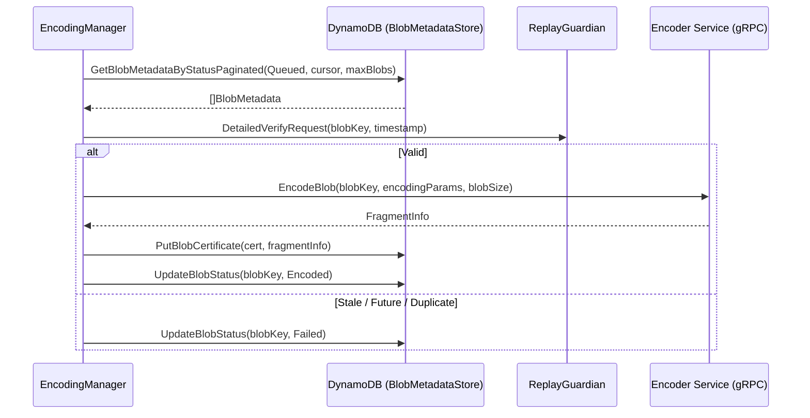
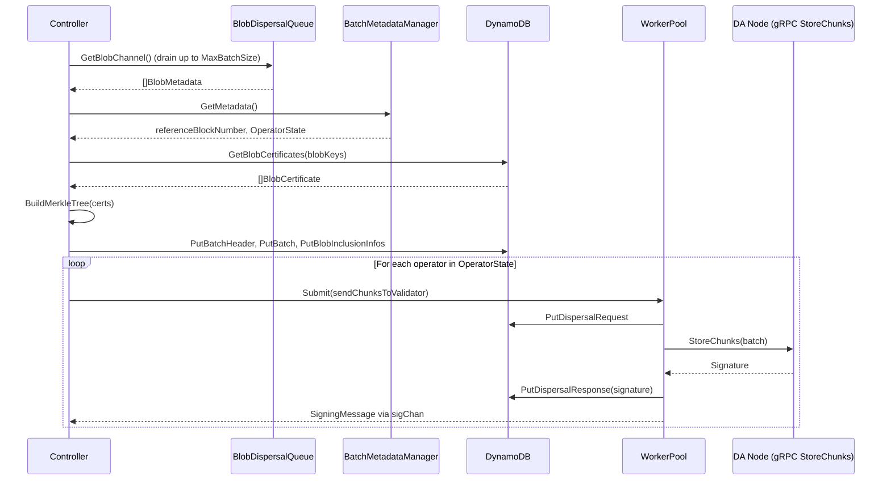
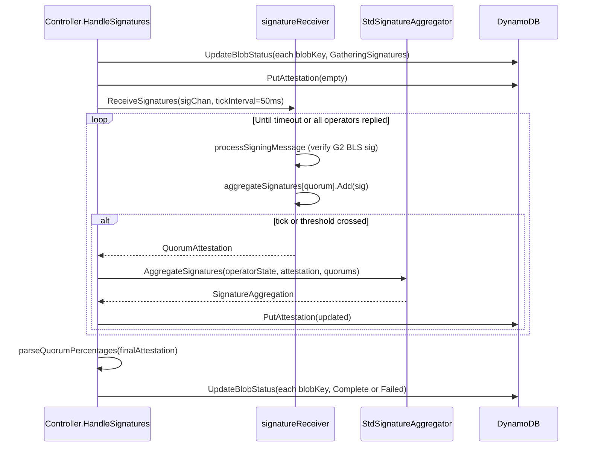
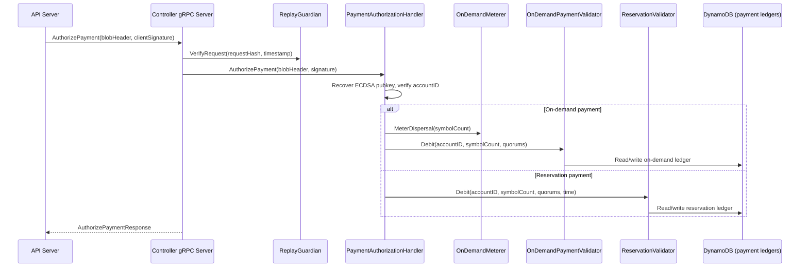
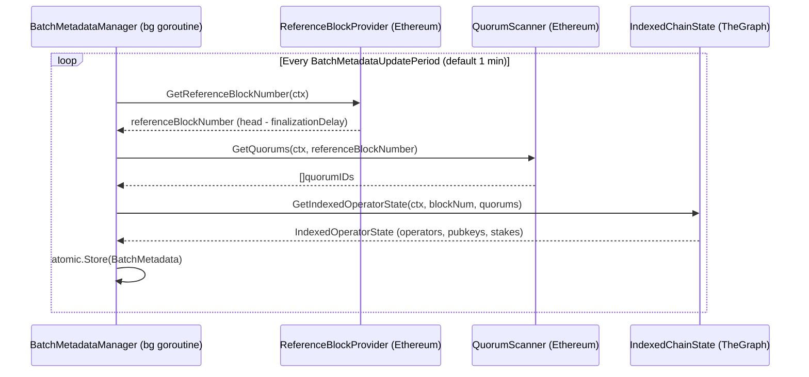

# disperser-controller Analysis

**Analyzed by**: code-analyzer-disperser-controller
**Timestamp**: 2026-04-10T00:00:00Z
**Application Type**: go-module
**Classification**: service
**Location**: disperser/cmd/controller

## Architecture

The disperser-controller is the EigenDA v2 control-plane service that orchestrates the complete blob dispersal lifecycle from encoding through finalized BLS attestation. It is a Go binary (`cmd/controller/main.go`) that wires together several concurrent subsystems and exposes a gRPC API server (`disperser/controller/server`). The service follows a pipeline-stage pattern: blobs advance through discrete status states (Queued → Encoded → GatheringSignatures → Complete/Failed) stored in AWS DynamoDB, and each stage is driven by an independent polling loop.

The two core processing loops — `EncodingManager` and `Controller` (the dispatcher) — run as goroutines started in sequence during `RunController`. The `EncodingManager` polls DynamoDB for `Queued` blobs, fans out encoding requests to the encoder service via gRPC, writes `BlobCertificate` records, and advances blobs to `Encoded`. The `Controller` then drains the `BlobDispersalQueue` (a DynamoDB-backed channel), assembles Merkle-tree batches, fans out `StoreChunks` gRPC calls in parallel to every DA validator node via a LRU-cached `NodeClientManager`, and then drives the BLS signature aggregation phase via `ReceiveSignatures` / `HandleSignatures`.

Operational concerns are carefully handled: a `BatchMetadataManager` maintains a non-blocking atomic snapshot of current on-chain operator state (reference block number + indexed operator set) refreshed in the background, a `SigningRateTracker` records per-validator signing history flushed to a second DynamoDB table, a file-based heartbeat monitor provides liveness probes, and a Prometheus metrics server runs on a dedicated port. A `RecoverState` call at startup fails any blobs stuck in `GatheringSignatures` from a previous crash, providing crash-recovery idempotency.

The service also exposes an outward-facing gRPC API consumed by the disperser-api-server: `AuthorizePayment` (validates on-demand and reservation payments against on-chain `PaymentVault` state) and `GetValidatorSigningRate` / `GetValidatorSigningRateDump` (exposes per-validator signing statistics).

## Key Components

- **`main.go::RunController`** (`disperser/cmd/controller/main.go`): Top-level wiring function. Constructs and starts every subsystem in order: DynamoDB + Ethereum clients → `BlobMetadataStore` → `EncodingManager` → `Controller` (dispatcher) → `PaymentAuthorizationHandler` → gRPC server → Prometheus HTTP server → heartbeat monitor. Creates the file-based readiness probe on success.

- **`Controller`** (`disperser/controller/controller.go`): The main dispatching engine. Polls `BlobDispersalQueue` on a ticker (`PullInterval`, default 1 s), assembles batches (up to `MaxBatchSize` blobs), builds a Merkle tree over blob certificates, writes batch/inclusion data to DynamoDB, then concurrently sends `StoreChunks` to all operators in the current indexed operator state. Returns a `sigChan` that `HandleSignatures` consumes.

- **`EncodingManager`** (`disperser/controller/encoding_manager.go`): Polls DynamoDB for `Queued` blobs every `PullInterval` (default 2 s), submits encoding requests to the remote encoder service via `EncoderClientV2`, writes `BlobCertificate` + `FragmentInfo`, and updates blob status to `Encoded`. Uses a worker pool (`gammazero/workerpool`) for concurrency (default 250 workers) and a replay guardian to filter stale/duplicate blobs.

- **`BlobDispersalQueue` / `dynamodbBlobDispersalQueue`** (`disperser/controller/blob_dispersal_queue.go`, `dynamodb_blob_dispersal_queue.go`): Interface + DynamoDB-backed implementation that polls for `Encoded` blobs and feeds them into a buffered Go channel (default capacity 1024). Acts as the hand-off pipeline between `EncodingManager` and `Controller`.

- **`NodeClientManager`** (`disperser/controller/node_client_manager.go`): Maintains an LRU cache (default 400 entries) of `clients.NodeClient` gRPC connections to DA validator nodes, keyed by `host:port`. Creates new connections on cache miss, closes evicted connections. Attaches a `DispersalRequestSigner` (AWS KMS or private key) to authenticate requests.

- **`signatureReceiver` / `ReceiveSignatures`** (`disperser/controller/signature_receiver.go`): Driven by the `sigChan` from `HandleBatch`. Receives `SigningMessage` structs from each validator, verifies individual BLS signatures against the operator's G2 public key, accumulates aggregate G1/G2 keys and signatures per quorum, and periodically yields `QuorumAttestation` structs on a tick interval (default 50 ms). Closes the attestation channel when all operators have responded or the `BatchAttestationTimeout` fires.

- **`BatchMetadataManager`** (`disperser/controller/metadata/batch_metadata_manager.go`): Runs a background loop that fetches the finalized reference block number (`FinalizationBlockDelay` behind head, default 75 blocks), queries registered quorums via `QuorumScanner`, and calls `GetIndexedOperatorState` against TheGraph subgraph. Stores result atomically so `GetMetadata()` never blocks.

- **`Server`** (`disperser/controller/server/server.go`): gRPC server implementing `ControllerService`. Exposes three RPCs: `AuthorizePayment`, `GetValidatorSigningRate`, `GetValidatorSigningRateDump`. Includes replay-protection via a `ReplayGuardian` on payment requests. Registers gRPC health checks and gRPC reflection.

- **`PaymentAuthorizationHandler`** (`disperser/controller/payments/payment_authorization_handler.go`): Validates dispersal requests by checking ECDSA client signatures, then routing to either `OnDemandMeterer` + `OnDemandPaymentValidator` (debit from global rate meter + per-account DynamoDB ledger) or `ReservationPaymentValidator` (per-account reservation bandwidth ledger).

- **`SigningRateTracker`** (`core/signingrate`): In-memory time-bucketed tracker of per-validator signing success/failure. Flushed periodically to a dedicated DynamoDB table (`SigningRateDynamoDbTableName`). Loaded back on startup.

- **`RecoverState`** (`disperser/controller/recover_state.go`): One-shot startup helper that scans DynamoDB for blobs stuck in `GatheringSignatures` and marks them `Failed`, preventing zombie blobs after a crash.

## Data Flows

### 1. Blob Encoding Pipeline (Queued → Encoded)

**Flow Description**: `EncodingManager` polls DynamoDB for queued blobs, encodes them via the remote encoder service, and writes certificates back.



**Detailed Steps**:

1. **Poll DynamoDB** (EncodingManager → DynamoDB): `GetBlobMetadataByStatusPaginated(Queued, cursor, maxBlobs)` using a paginated cursor. Up to 128 blobs per iteration.
2. **Replay / stale filter** (EncodingManager → ReplayGuardian): Blobs older than `MaxDispersalAge` (45 s) or too far in the future are marked `Failed` immediately.
3. **Encode** (EncodingManager → Encoder gRPC): `EncodeBlob(blobKey, encodingParams, blobSize)` with retry up to `NumEncodingRetries` (default 3). Encoding params derived from on-chain `BlobVersionParameters` cached in atomic pointer.
4. **Write certificate** (EncodingManager → DynamoDB): `PutBlobCertificate(cert, fragmentInfo)` assigns relay keys (random subset of `AvailableRelays`).
5. **Advance status** (EncodingManager → DynamoDB): `UpdateBlobStatus(blobKey, Encoded)`.

**Error Paths**:
- Encoding failure after all retries → `UpdateBlobStatus(Failed)`.
- DynamoDB write failure on certificate → retry loop, then `Failed`.

---

### 2. Batch Assembly and StoreChunks Fan-out (Encoded → GatheringSignatures)

**Flow Description**: The `Controller` dispatcher assembles a batch from encoded blobs, builds a Merkle tree, and fans out `StoreChunks` to all registered DA nodes in parallel.



**Detailed Steps**:

1. **Drain dispersal queue** (Controller → BlobDispersalQueue): Non-blocking reads from buffered channel, up to `MaxBatchSize` (default 32) blobs.
2. **Get operator state** (Controller → BatchMetadataManager): Atomic load of pre-fetched `referenceBlockNumber` + `IndexedOperatorState`.
3. **Fetch certificates** (Controller → DynamoDB): `GetBlobCertificates(blobKeys)` to retrieve relay assignments and blob headers.
4. **Build Merkle tree** (Controller → local): `corev2.BuildMerkleTree(certs)` to compute `BatchRoot`.
5. **Persist batch artifacts** (Controller → DynamoDB): `PutBatchHeader`, `PutBatch`, `PutBlobInclusionInfos` (Merkle proofs per blob).
6. **Fan-out StoreChunks** (Controller → WorkerPool × N operators): Each worker resolves the node's address via `NodeClientManager.GetClient`, calls `client.StoreChunks(batch)`, stores `DispersalRequest`/`DispersalResponse`, and pushes a `SigningMessage` onto `sigChan`.

**Error Paths**:
- Batch assembly failure → `markBatchAsFailed` (all blobs → `Failed`).
- Stale blob in batch (age > `MaxDispersalAge`) → discarded individually with `Failed`.
- `StoreChunks` failure → zero-signature `DispersalResponse` stored; error propagated via `SigningMessage.Err`.

---

### 3. BLS Signature Aggregation (GatheringSignatures → Complete/Failed)

**Flow Description**: `HandleSignatures` drives the `signatureReceiver` to collect, verify, and incrementally aggregate BLS signatures from operators, then finalizes the attestation in DynamoDB.



**Detailed Steps**:

1. **Mark blobs** (Controller → DynamoDB): `UpdateBlobStatus(GatheringSignatures)` for all blobs in batch.
2. **Write empty attestation** (Controller → DynamoDB): `PutAttestation` with nil signature data so downstream queries can begin immediately.
3. **Run `ReceiveSignatures`** (Controller → signatureReceiver goroutine): Spawns goroutine consuming `sigChan`; each message verified against operator G2 pubkey; per-quorum BLS aggregation maintained.
4. **Periodic attestation flush** (signatureReceiver → Controller): Every 50 ms tick (or on threshold crossing), yields `QuorumAttestation` to outer `HandleSignatures` loop.
5. **Aggregate and persist** (Controller → StdSignatureAggregator → DynamoDB): `AggregateSignatures` combines partial aggregates into a canonical `Attestation`; `PutAttestation` updates the DynamoDB record.
6. **Finalize blobs** (Controller → DynamoDB): Blobs whose quorums all have `PercentSigned > 0` → `Complete`; others → `Failed`.

**Error Paths**:
- `ReceiveSignatures` error → `failBatch` (all blobs → `Failed`).
- `BatchAttestationTimeout` fires → closes `attestationChan`; final partial attestation is used.

---

### 4. Payment Authorization (gRPC: AuthorizePayment)

**Flow Description**: The API server calls `AuthorizePayment` before accepting a blob; the controller validates the ECDSA client signature and debits the appropriate payment ledger.



---

### 5. Operator State Refresh (Background: BatchMetadataManager)

**Flow Description**: A background loop maintains current operator state for batch assembly, querying both the Ethereum chain and TheGraph subgraph.



## Dependencies

### External Libraries

- **`github.com/gammazero/workerpool`** (v1.1.3) [concurrency]: Fixed-size worker pool used for both encoding requests (up to 250 concurrent) and dispersal fan-out (up to 600 concurrent). Imported in `disperser/controller/encoding_manager.go` and `disperser/cmd/controller/main.go`.

- **`github.com/hashicorp/golang-lru/v2`** (v2.0.7) [caching]: LRU cache backing `NodeClientManager` to reuse gRPC connections to DA nodes; supports eviction callback to close stale connections. Imported in `disperser/controller/node_client_manager.go`.

- **`github.com/hashicorp/go-multierror`** (v1.1.1) [error-handling]: Accumulates multiple per-blob errors during batch status updates into a single returned error. Imported in `disperser/controller/controller.go`.

- **`github.com/prometheus/client_golang`** (v1.21.1) [monitoring]: Prometheus metrics registry, process/Go collectors, and HTTP handler for `/metrics` endpoint on `MetricsPort` (default 9101). Imported widely across metrics files and `main.go`.

- **`github.com/urfave/cli`** (v1.22.14) [cli]: CLI framework used for flag parsing in `flags/flags.go` and the top-level `app.Action`. Imported in `disperser/cmd/controller/main.go` and `flags/flags.go`.

- **`github.com/aws/aws-sdk-go-v2/service/dynamodb`** (v1.31.0) [database]: AWS DynamoDB client used for both blob metadata storage and signing-rate storage. Imported via `common/aws/dynamodb` wrapper in `main.go`.

- **`google.golang.org/grpc`** (v1.72.2) [networking]: gRPC server for the controller's `ControllerService` API and gRPC client connections to encoder service and DA nodes. Imported in `server/server.go` and `encoding_manager.go`.

- **`github.com/ethereum/go-ethereum`** (v1.15.3, replaced by op-geth) [blockchain]: Ethereum client used by `geth.NewMultiHomingClient` for reading on-chain state (operator registry, payment vault, contract directory). Imported in `main.go`.

- **`github.com/Layr-Labs/eigensdk-go`** (v0.2.0-beta) [other]: EigenLayer SDK providing structured logging (`eigensdk-go/logging`) used throughout the controller package.

### Internal Libraries

- **`disperser`** (`disperser/`): `BlobMetadataStore` (DynamoDB state machine), `EncoderClientV2` (gRPC client to the encoder), blob status types (`v2.Queued`, `v2.Encoded`, `v2.GatheringSignatures`, `v2.Complete`, `v2.Failed`), `blobstore.MetadataStore` interface. Used by every component in the controller.

- **`core`** (`core/`): `IndexedChainState`, `SignatureAggregator` (`StdSignatureAggregator`), BLS types (`Signature`, `G1Point`, `G2Point`, `QuorumAttestation`), `OperatorID`, operator-socket parsing, Merkle tree construction (`corev2.BuildMerkleTree`). Central to batch assembly and signature aggregation.

- **`api`** (`api/`): `clients/v2.NodeClient` (gRPC client interface for `StoreChunks`), `clients/v2.DispersalRequestSigner`, gRPC proto-generated `controller` service stubs, `hashing.HashAuthorizePaymentRequest`, error constructors (`api.NewErrorInternal`, etc.).

- **`common`** (`common/`): `geth.NewMultiHomingClient`, `aws/dynamodb.NewClient`, `healthcheck` (heartbeat monitor + health server), `replay.ReplayGuardian`, `WorkerPool` interface, `GRPCServerConfig`, `nameremapping`.

- **`indexer`** (`indexer/`): `indexer.Config` and `indexer.ReadIndexerConfig` referenced in `ControllerConfig`; the built-in indexer path is deprecated in favour of TheGraph (`UseGraph=true`).

## API Surface

### gRPC Endpoints (ControllerService on port 32010)

**1. AuthorizePayment**

Validates a payment authorization request from an API server before a blob is accepted for dispersal. Checks replay protection, verifies the ECDSA client signature against `accountID`, then debits the appropriate payment type.

Example Request (proto):
```protobuf
AuthorizePaymentRequest {
  blob_header: BlobHeader {
    payment_header: PaymentHeader {
      account_id: "0xABCD...",
      reservation_period: 0,
      cumulative_payment: "1000",
      timestamp: 1712700000000000000
    }
    blob_version: 0
    quorum_numbers: [0, 1]
    commitment: BlobCommitment { length: 4096, ... }
  }
  client_signature: <65-byte ECDSA signature over blobKey>
}
```

Example Response (200 OK):
```protobuf
AuthorizePaymentResponse {}
```

Error Responses:
- `INVALID_ARGUMENT` — replay protection failure, invalid signature length, invalid blob header.
- `UNAUTHENTICATED` — signer address does not match `accountID`.
- `PERMISSION_DENIED` — insufficient on-demand funds or reservation bandwidth.
- `RESOURCE_EXHAUSTED` — global on-demand rate limit exceeded.
- `INTERNAL` — DynamoDB or internal processing error.

---

**2. GetValidatorSigningRate**

Returns the signing rate for a specific validator and quorum over a time range, sourced from the in-memory `SigningRateTracker`.

Example Request:
```protobuf
GetValidatorSigningRateRequest {
  validator_id: <32-byte operator ID>
  quorum: 0
  start_timestamp: 1712600000
  end_timestamp: 1712700000
}
```

Example Response:
```protobuf
GetValidatorSigningRateReply {
  validator_signing_rate: 0.97
}
```

---

**3. GetValidatorSigningRateDump**

Returns a full dump of per-validator signing-rate bucket data for all validators since a given start timestamp, intended for bulk analytics and ejection tooling.

Example Request:
```protobuf
GetValidatorSigningRateDumpRequest {
  start_timestamp: 1712600000
}
```

Example Response:
```protobuf
GetValidatorSigningRateDumpReply {
  signing_rate_buckets: [ ... ]
}
```

### HTTP Endpoints (Prometheus, port 9101)

**GET /metrics** — Prometheus scrape endpoint exposing process metrics, Go runtime metrics, and all controller-specific Prometheus metrics (encoding latency, dispersal latency, signing rates, attestation update counts, per-account blob status, etc.).

### File-Based Probes

- **Readiness probe**: `ControllerReadinessProbePath` (default `/tmp/controller-ready`) — created on successful startup, deleted on restart.
- **Liveness probe**: `ControllerHealthProbePathFlag` (default `/tmp/controller-health`) — updated by `HeartbeatMonitor` to detect stalls.

## Code Examples

### Example 1: Batch Assembly with Merkle Tree (controller.go)

```go
// disperser/controller/controller.go:572-595
batchHeader := &corev2.BatchHeader{
    BatchRoot:            [32]byte{},
    ReferenceBlockNumber: referenceBlockNumber,
}

tree, err := corev2.BuildMerkleTree(certs)
if err != nil {
    return nil, fmt.Errorf("failed to build merkle tree: %w", err)
}
copy(batchHeader.BatchRoot[:], tree.Root())

batchHeaderHash, err := batchHeader.Hash()
if err != nil {
    return nil, fmt.Errorf("failed to hash batch header: %w", err)
}
err = c.blobMetadataStore.PutBatchHeader(ctx, batchHeader)
```

### Example 2: Concurrent StoreChunks Fan-out (controller.go)

```go
// disperser/controller/controller.go:182-211
signingResponseChan := make(chan core.SigningMessage, len(batchData.OperatorState.IndexedOperators))
for validatorId, validatorInfo := range batchData.OperatorState.IndexedOperators {
    c.pool.Submit(func() {
        signature, latency, err := c.sendChunksToValidator(
            ctx, batchData, validatorId, validatorInfo, validatorProbe)
        signingResponseChan <- core.SigningMessage{
            ValidatorId:     validatorId,
            Signature:       signature,
            BatchHeaderHash: batchData.BatchHeaderHash,
            Latency:         latency,
            Err:             err,
        }
    })
}
```

### Example 3: BLS Signature Accumulation per Quorum (signature_receiver.go)

```go
// disperser/controller/signature_receiver.go:300-313
for _, quorumID := range sr.quorumIDs {
    quorumOperators := sr.indexedOperatorState.Operators[quorumID]
    quorumOperatorInfo, isOperatorInQuorum := quorumOperators[signingMessage.ValidatorId]
    if !isOperatorInQuorum {
        continue
    }
    sr.stakeSigned[quorumID].Add(sr.stakeSigned[quorumID], quorumOperatorInfo.Stake)
    if sr.aggregateSignatures[quorumID] == nil {
        sr.aggregateSignatures[quorumID] = &core.Signature{G1Point: signingMessage.Signature.Clone()}
        sr.aggregateSignersG2PubKeys[quorumID] = indexedOperatorInfo.PubkeyG2.Clone()
    } else {
        sr.aggregateSignatures[quorumID].Add(signingMessage.Signature.G1Point)
        sr.aggregateSignersG2PubKeys[quorumID].Add(indexedOperatorInfo.PubkeyG2)
    }
}
```

### Example 4: Payment Authorization — On-demand Global Metering (payment_authorization_handler.go)

```go
// disperser/controller/payments/payment_authorization_handler.go:138-149
reservation, err := h.onDemandMeterer.MeterDispersal(symbolCount)
if err != nil {
    return api.NewErrorResourceExhausted(fmt.Sprintf("global rate limit exceeded: %v", err))
}
err = h.onDemandValidator.Debit(ctx, accountID, symbolCount, quorumNumbers)
if err == nil {
    return nil
}
h.onDemandMeterer.CancelDispersal(reservation)
```

### Example 5: NodeClient LRU Cache with Eviction (node_client_manager.go)

```go
// disperser/controller/node_client_manager.go:30-44
closeClient := func(socket string, value clients.NodeClient) {
    if err := value.Close(); err != nil {
        logger.Error("failed to close node client", "err", err)
    }
}
nodeClients, err := lru.NewWithEvict(cacheSize, closeClient)
```

## Files Analyzed

- `disperser/cmd/controller/main.go` (401 lines) — Top-level `RunController` wiring function and `main()`.
- `disperser/cmd/controller/config.go` (161 lines) — `NewConfig` CLI flag to `ControllerConfig` mapping.
- `disperser/cmd/controller/flags/flags.go` (468 lines) — All CLI flags with defaults and env-var bindings.
- `disperser/controller/controller.go` (832 lines) — Core `Controller` struct, `NewBatch`, `HandleBatch`, `HandleSignatures`, `updateAttestation`.
- `disperser/controller/encoding_manager.go` (491 lines) — `EncodingManager`, `HandleBatch`, `encodeBlob`, blob version param refresh.
- `disperser/controller/controller_config.go` (357 lines) — `ControllerConfig` struct, `Verify()`, `DefaultControllerConfig()`.
- `disperser/controller/node_client_manager.go` (70 lines) — `NodeClientManager` interface, LRU cache implementation.
- `disperser/controller/signature_receiver.go` (692 lines) — `ReceiveSignatures`, `signatureReceiver`, BLS accumulation, attestation building.
- `disperser/controller/blob_dispersal_queue.go` (17 lines) — `BlobDispersalQueue` interface.
- `disperser/controller/dynamodb_blob_dispersal_queue.go` (192 lines) — DynamoDB-backed queue implementation.
- `disperser/controller/payment_authorization.go` (161 lines) — `BuildPaymentAuthorizationHandler`, `PaymentAuthorizationConfig`.
- `disperser/controller/payments/payment_authorization_handler.go` (206 lines) — `PaymentAuthorizationHandler`, on-demand/reservation validation.
- `disperser/controller/metadata/batch_metadata_manager.go` (168 lines) — `BatchMetadataManager`, background operator state refresh.
- `disperser/controller/recover_state.go` (47 lines) — Startup crash-recovery for stuck `GatheringSignatures` blobs.
- `disperser/controller/server/server.go` (196 lines) — gRPC `Server`, `AuthorizePayment`, `GetValidatorSigningRate`, `GetValidatorSigningRateDump`.
- `api/grpc/controller/controller_service_grpc.pb.go` — Generated gRPC service stubs.

## Analysis Data

```json
{
  "summary": "disperser-controller is the EigenDA v2 control-plane Go service that drives the complete blob dispersal pipeline. It runs two concurrent polling loops (EncodingManager for Queued→Encoded; Controller for Encoded→Complete) backed by DynamoDB state, fans out StoreChunks gRPC calls to all registered DA validator nodes in parallel, aggregates per-quorum BLS signatures incrementally via a tick-driven receiver, and exposes a gRPC API (AuthorizePayment, GetValidatorSigningRate) for downstream consumption by the API server.",
  "architecture_pattern": "pipeline-stages / multi-loop orchestrator",
  "key_modules": [
    "disperser/cmd/controller/main.go",
    "disperser/controller/controller.go",
    "disperser/controller/encoding_manager.go",
    "disperser/controller/signature_receiver.go",
    "disperser/controller/node_client_manager.go",
    "disperser/controller/dynamodb_blob_dispersal_queue.go",
    "disperser/controller/metadata/batch_metadata_manager.go",
    "disperser/controller/server/server.go",
    "disperser/controller/payments/payment_authorization_handler.go",
    "disperser/controller/recover_state.go"
  ],
  "api_endpoints": [
    "gRPC AuthorizePayment — validates client ECDSA sig and debits on-demand or reservation payment ledger",
    "gRPC GetValidatorSigningRate — returns per-validator/quorum signing rate over a time window",
    "gRPC GetValidatorSigningRateDump — dumps all signing-rate bucket data since a timestamp",
    "HTTP GET /metrics — Prometheus scrape endpoint on configurable MetricsPort (default 9101)"
  ],
  "data_flows": [
    "Blob encoding: DynamoDB Queued → EncodingManager → Encoder gRPC → BlobCertificate → DynamoDB Encoded",
    "Batch dispatch: BlobDispersalQueue → NewBatch (Merkle tree) → DynamoDB batch artifacts → parallel StoreChunks fan-out → sigChan",
    "BLS aggregation: sigChan → signatureReceiver → incremental quorum aggregation → periodic PutAttestation → final UpdateBlobStatus Complete/Failed",
    "Payment authorization: API server gRPC → replay check → ECDSA verify → OnDemandMeterer/ReservationValidator → DynamoDB ledger debit",
    "Operator state refresh: background BatchMetadataManager → ReferenceBlockProvider (Ethereum) → QuorumScanner → TheGraph IndexedChainState → atomic BatchMetadata store"
  ],
  "tech_stack": [
    "go",
    "grpc",
    "aws-dynamodb",
    "prometheus",
    "ethereum",
    "bls-cryptography"
  ],
  "external_integrations": [
    "aws-dynamodb",
    "ethereum-rpc",
    "thegraph-subgraph",
    "aws-kms"
  ],
  "component_interactions": [
    {
      "target": "encoder-service",
      "type": "calls",
      "protocol": "grpc",
      "description": "EncodingManager calls EncoderClientV2.EncodeBlob() to encode each queued blob; address configured via --encoder-address flag"
    },
    {
      "target": "da-node (validator)",
      "type": "calls",
      "protocol": "grpc",
      "description": "Controller fans out NodeClient.StoreChunks(batch) to every registered DA node; connections cached in LRU NodeClientManager keyed by host:v2DispersalPort"
    },
    {
      "target": "disperser-api-server",
      "type": "serves",
      "protocol": "grpc",
      "description": "Controller gRPC server serves AuthorizePayment and GetValidatorSigningRate(Dump) RPCs consumed by the API server before accepting blob dispersal requests"
    },
    {
      "target": "aws-dynamodb",
      "type": "calls",
      "protocol": "aws-sdk",
      "description": "All blob state (status, certificates, batch headers, dispersal requests/responses, attestations) stored in a primary DynamoDB table; signing rate history stored in a second table"
    },
    {
      "target": "ethereum-rpc",
      "type": "calls",
      "protocol": "json-rpc",
      "description": "geth MultiHomingClient used for ContractDirectory resolution (OperatorStateRetriever, ServiceManager, PaymentVault addresses) and reference block number fetching"
    },
    {
      "target": "thegraph-subgraph",
      "type": "calls",
      "protocol": "http/graphql",
      "description": "IndexedChainState (thegraph) used by BatchMetadataManager to fetch indexed operator state (pubkeys, stakes, quorum membership) at a given reference block number"
    },
    {
      "target": "aws-kms",
      "type": "calls",
      "protocol": "aws-sdk",
      "description": "Optional DispersalRequestSigner uses AWS KMS to sign StoreChunks requests (alternatively a raw hex private key may be used)"
    }
  ]
}
```

## Citations

```json
[
  {
    "file_path": "disperser/cmd/controller/main.go",
    "start_line": 44,
    "end_line": 58,
    "claim": "Entry point is a urfave/cli application with RunController as the app.Action",
    "section": "Architecture",
    "snippet": "app.Action = RunController\nerr := app.Run(os.Args)"
  },
  {
    "file_path": "disperser/cmd/controller/main.go",
    "start_line": 76,
    "end_line": 84,
    "claim": "Service creates an AWS DynamoDB client and a multi-homing Ethereum geth client at startup",
    "section": "Architecture",
    "snippet": "dynamoClient, err := dynamodb.NewClient(config.AwsClient, logger)\ngethClient, err := geth.NewMultiHomingClient(config.EthClient, gethcommon.Address{}, logger)"
  },
  {
    "file_path": "disperser/cmd/controller/main.go",
    "start_line": 187,
    "end_line": 209,
    "claim": "EncodingManager is constructed with a workerpool (default 250 workers) and an EncoderClientV2 gRPC client",
    "section": "Key Components",
    "snippet": "encodingPool := workerpool.New(config.Encoder.NumConcurrentRequests)\nencodingManager, err := controller.NewEncodingManager(...encodingPool, encoderClient,...)"
  },
  {
    "file_path": "disperser/cmd/controller/main.go",
    "start_line": 218,
    "end_line": 225,
    "claim": "The service uses TheGraph subgraph for IndexedChainState; the built-in indexer path is deprecated",
    "section": "Architecture",
    "snippet": "if config.UseGraph {\n    ics = thegraph.MakeIndexedChainState(config.ChainState, chainState, logger)\n} else {\n    return fmt.Errorf(\"built-in indexer is deprecated...\")\n}"
  },
  {
    "file_path": "disperser/cmd/controller/main.go",
    "start_line": 240,
    "end_line": 247,
    "claim": "NodeClientManager is constructed with a configurable LRU cache size and optional DispersalRequestSigner",
    "section": "Key Components",
    "snippet": "nodeClientManager, err := controller.NewNodeClientManager(\n    config.NodeClientCacheSize,\n    requestSigner,\n    config.DisperserID,\n    logger)"
  },
  {
    "file_path": "disperser/cmd/controller/main.go",
    "start_line": 351,
    "end_line": 367,
    "claim": "gRPC server is created on a configurable port and serves ControllerService",
    "section": "API Surface",
    "snippet": "listener, err := net.Listen(\"tcp\", fmt.Sprintf(\"0.0.0.0:%d\", config.Server.GrpcPort))\ngrpcServer, err := server.NewServer(ctx, config.Server, logger, metricsRegistry, paymentAuthorizationHandler, listener, signingRateTracker)"
  },
  {
    "file_path": "disperser/cmd/controller/main.go",
    "start_line": 322,
    "end_line": 327,
    "claim": "RecoverState is called at startup to fail blobs stuck in GatheringSignatures state from a previous crash",
    "section": "Key Components",
    "snippet": "err = controller.RecoverState(ctx, blobMetadataStore, logger)\nif err != nil {\n    return fmt.Errorf(\"failed to recover state: %v\", err)\n}"
  },
  {
    "file_path": "disperser/controller/controller.go",
    "start_line": 29,
    "end_line": 51,
    "claim": "Controller struct holds blobMetadataStore, worker pool, chainState, BLS aggregator, nodeClientManager, batchMetadataManager, signingRateTracker, and blobDispersalQueue",
    "section": "Key Components",
    "snippet": "type Controller struct {\n    *ControllerConfig\n    blobMetadataStore blobstore.MetadataStore\n    pool              common.WorkerPool\n    chainState        core.IndexedChainState\n    aggregator        core.SignatureAggregator\n    nodeClientManager NodeClientManager\n    batchMetadataManager metadata.BatchMetadataManager\n    signingRateTracker signingrate.SigningRateTracker\n    blobDispersalQueue BlobDispersalQueue\n}"
  },
  {
    "file_path": "disperser/controller/controller.go",
    "start_line": 125,
    "end_line": 162,
    "claim": "Controller.Start() starts the chain state and a ticker loop that calls HandleBatch then HandleSignatures as a goroutine",
    "section": "Data Flows",
    "snippet": "ticker := time.NewTicker(c.PullInterval)\ncase <-ticker.C:\n    sigChan, batchData, err := c.HandleBatch(attestationCtx, probe)\n    go func() { err := c.HandleSignatures(ctx, attestationCtx, batchData, sigChan) }()"
  },
  {
    "file_path": "disperser/controller/controller.go",
    "start_line": 182,
    "end_line": 215,
    "claim": "HandleBatch fans out StoreChunks to every operator in the IndexedOperatorState concurrently via a worker pool",
    "section": "Data Flows",
    "snippet": "signingResponseChan := make(chan core.SigningMessage, len(batchData.OperatorState.IndexedOperators))\nfor validatorId, validatorInfo := range batchData.OperatorState.IndexedOperators {\n    c.pool.Submit(func() {\n        signature, latency, err := c.sendChunksToValidator(...)\n        signingResponseChan <- core.SigningMessage{...}\n    })\n}"
  },
  {
    "file_path": "disperser/controller/controller.go",
    "start_line": 571,
    "end_line": 603,
    "claim": "NewBatch builds a Merkle tree over BlobCertificates, writes batch header and inclusion proofs to DynamoDB",
    "section": "Data Flows",
    "snippet": "tree, err := corev2.BuildMerkleTree(certs)\ncopy(batchHeader.BatchRoot[:], tree.Root())\nerr = c.blobMetadataStore.PutBatchHeader(ctx, batchHeader)\nbatch := &corev2.Batch{...}\nerr = c.blobMetadataStore.PutBatch(ctx, batch)"
  },
  {
    "file_path": "disperser/controller/controller.go",
    "start_line": 722,
    "end_line": 738,
    "claim": "sendChunks calls client.StoreChunks with the batch under AttestationTimeout and returns the BLS signature",
    "section": "Data Flows",
    "snippet": "ctxWithTimeout, cancel := context.WithTimeout(ctx, c.AttestationTimeout)\nsig, err := client.StoreChunks(ctxWithTimeout, batch)"
  },
  {
    "file_path": "disperser/controller/controller.go",
    "start_line": 294,
    "end_line": 384,
    "claim": "HandleSignatures drives ReceiveSignatures, periodically calls AggregateSignatures and PutAttestation, then finalizes blob statuses",
    "section": "Data Flows",
    "snippet": "attestationChan, err := ReceiveSignatures(...sigChan, c.ControllerConfig.SignatureTickInterval,...)\nfor receivedQuorumAttestation := range attestationChan {\n    err := c.updateAttestation(ctx, batchData, receivedQuorumAttestation)\n}"
  },
  {
    "file_path": "disperser/controller/encoding_manager.go",
    "start_line": 131,
    "end_line": 155,
    "claim": "EncodingManager holds a worker pool, encodingClient (gRPC), chainReader, ReplayGuardian, and a DynamoDB blobMetadataStore",
    "section": "Key Components",
    "snippet": "type EncodingManager struct {\n    *EncodingManagerConfig\n    blobMetadataStore blobstore.MetadataStore\n    pool              common.WorkerPool\n    encodingClient    disperser.EncoderClientV2\n    chainReader       core.Reader\n    replayGuardian    replay.ReplayGuardian\n}"
  },
  {
    "file_path": "disperser/controller/encoding_manager.go",
    "start_line": 308,
    "end_line": 314,
    "claim": "EncodingManager polls DynamoDB for Queued blobs using a paginated cursor",
    "section": "Data Flows",
    "snippet": "blobMetadatas, cursor, err := e.blobMetadataStore.GetBlobMetadataByStatusPaginated(\n    ctx, v2.Queued, e.cursor, e.MaxNumBlobsPerIteration)"
  },
  {
    "file_path": "disperser/controller/encoding_manager.go",
    "start_line": 379,
    "end_line": 407,
    "claim": "After encoding, EncodingManager writes BlobCertificate and updates status to Encoded with exponential-backoff retry",
    "section": "Data Flows",
    "snippet": "err = e.blobMetadataStore.PutBlobCertificate(storeCtx, cert, fragmentInfo)\nerr = e.blobMetadataStore.UpdateBlobStatus(storeCtx, blobKey, v2.Encoded)"
  },
  {
    "file_path": "disperser/controller/node_client_manager.go",
    "start_line": 11,
    "end_line": 22,
    "claim": "NodeClientManager is an interface backed by an LRU cache of NodeClient gRPC connections",
    "section": "Key Components",
    "snippet": "type NodeClientManager interface {\n    GetClient(host, port string) (clients.NodeClient, error)\n}\ntype nodeClientManager struct {\n    nodeClients   *lru.Cache[string, clients.NodeClient]\n    requestSigner clients.DispersalRequestSigner\n}"
  },
  {
    "file_path": "disperser/controller/node_client_manager.go",
    "start_line": 30,
    "end_line": 40,
    "claim": "LRU eviction callback closes the evicted gRPC NodeClient connection",
    "section": "Key Components",
    "snippet": "closeClient := func(socket string, value clients.NodeClient) {\n    if err := value.Close(); err != nil {\n        logger.Error(\"failed to close node client\", \"err\", err)\n    }\n}"
  },
  {
    "file_path": "disperser/controller/signature_receiver.go",
    "start_line": 100,
    "end_line": 155,
    "claim": "ReceiveSignatures creates a signatureReceiver and spawns a goroutine to consume sigChan, returning a QuorumAttestation channel",
    "section": "Data Flows",
    "snippet": "attestationChan := make(chan *core.QuorumAttestation, len(indexedOperatorState.IndexedOperators))\ngo receiver.receiveSigningMessages(ctx, attestationChan)\nreturn attestationChan, nil"
  },
  {
    "file_path": "disperser/controller/signature_receiver.go",
    "start_line": 285,
    "end_line": 314,
    "claim": "processSigningMessage verifies the BLS G2 signature and accumulates stake and aggregate keys per quorum",
    "section": "Data Flows",
    "snippet": "if !signingMessage.Signature.Verify(operatorPubkey, sr.batchHeaderHash) {\n    return false, fmt.Errorf(\"signature verification with pubkey %s\"...)\n}\nsr.stakeSigned[quorumID].Add(sr.stakeSigned[quorumID], quorumOperatorInfo.Stake)\nsr.aggregateSignatures[quorumID].Add(signingMessage.Signature.G1Point)"
  },
  {
    "file_path": "disperser/controller/signature_receiver.go",
    "start_line": 457,
    "end_line": 468,
    "claim": "computeQuorumResult verifies equivalence between aggregate G1 and G2 pubkeys before accepting the quorum result",
    "section": "Data Flows",
    "snippet": "ok, err := aggregateSignersG1PubKey.VerifyEquivalence(sr.aggregateSignersG2PubKeys[quorumID])\nif !ok {\n    return nil, fmt.Errorf(\"aggregate signers G1 pubkey is not equivalent to aggregate signers G2 pubkey\")\n}\nok = sr.aggregateSignatures[quorumID].Verify(sr.aggregateSignersG2PubKeys[quorumID], sr.batchHeaderHash)"
  },
  {
    "file_path": "disperser/controller/metadata/batch_metadata_manager.go",
    "start_line": 64,
    "end_line": 101,
    "claim": "BatchMetadataManager does an initial blocking metadata fetch in constructor so GetMetadata() always returns valid data after construction",
    "section": "Key Components",
    "snippet": "err = manager.updateMetadata()\nif err != nil {\n    return nil, fmt.Errorf(\"failed to update initial metadata: %w\", err)\n}\ngo manager.updateLoop()"
  },
  {
    "file_path": "disperser/controller/metadata/batch_metadata_manager.go",
    "start_line": 115,
    "end_line": 151,
    "claim": "updateMetadata fetches referenceBlockNumber, registered quorums, and IndexedOperatorState from TheGraph, then atomically stores BatchMetadata",
    "section": "Data Flows",
    "snippet": "referenceBlockNumber, err := m.referenceBlockProvider.GetReferenceBlockNumber(m.ctx)\nquorums, err := m.quorumScanner.GetQuorums(m.ctx, referenceBlockNumber)\noperatorState, err := m.indexedChainState.GetIndexedOperatorState(m.ctx, uint(referenceBlockNumber), quorums)\nm.metadata.Store(metadata)"
  },
  {
    "file_path": "disperser/controller/server/server.go",
    "start_line": 28,
    "end_line": 39,
    "claim": "gRPC Server embeds ControllerServiceServer and holds a paymentAuthorizationHandler, ReplayGuardian, and signingRateTracker",
    "section": "Key Components",
    "snippet": "type Server struct {\n    controller.UnimplementedControllerServiceServer\n    paymentAuthorizationHandler *payments.PaymentAuthorizationHandler\n    replayGuardian              replay.ReplayGuardian\n    signingRateTracker          signingrate.SigningRateTracker\n}"
  },
  {
    "file_path": "disperser/controller/server/server.go",
    "start_line": 85,
    "end_line": 96,
    "claim": "gRPC server registers ControllerServiceServer and gRPC health checks with reflection enabled",
    "section": "API Surface",
    "snippet": "s.server = grpc.NewServer(opts...)\nreflection.Register(s.server)\ncontroller.RegisterControllerServiceServer(s.server, s)\nhealthcheck.RegisterHealthServer(controller.ControllerService_ServiceDesc.ServiceName, s.server)"
  },
  {
    "file_path": "disperser/controller/server/server.go",
    "start_line": 113,
    "end_line": 156,
    "claim": "AuthorizePayment applies replay protection and delegates to PaymentAuthorizationHandler",
    "section": "API Surface",
    "snippet": "err = s.replayGuardian.VerifyRequest(requestHash, timestamp)\nresponse, err := s.paymentAuthorizationHandler.AuthorizePayment(\n    ctx, request.GetBlobHeader(), request.GetClientSignature(), probe)"
  },
  {
    "file_path": "disperser/controller/server/server.go",
    "start_line": 159,
    "end_line": 179,
    "claim": "GetValidatorSigningRate delegates to signingRateTracker.GetValidatorSigningRate for the requested quorum and time range",
    "section": "API Surface",
    "snippet": "signingRate, err := s.signingRateTracker.GetValidatorSigningRate(\n    core.QuorumID(request.GetQuorum()),\n    validatorId,\n    time.Unix(int64(request.GetStartTimestamp()), 0),\n    time.Unix(int64(request.GetEndTimestamp()), 0))"
  },
  {
    "file_path": "disperser/controller/payments/payment_authorization_handler.go",
    "start_line": 62,
    "end_line": 122,
    "claim": "AuthorizePayment recovers the ECDSA signer pubkey from the blob key and signature, verifies accountID, then routes to on-demand or reservation path",
    "section": "Data Flows",
    "snippet": "signerPubkey, err := crypto.SigToPub(blobKey[:], clientSignature)\naccountID := coreHeader.PaymentMetadata.AccountID\nsignerAddress := crypto.PubkeyToAddress(*signerPubkey)\nif accountID.Cmp(signerAddress) != 0 {\n    return nil, api.NewErrorUnauthenticated(...)\n}"
  },
  {
    "file_path": "disperser/controller/payments/payment_authorization_handler.go",
    "start_line": 131,
    "end_line": 163,
    "claim": "On-demand authorization checks the global throughput meter first, then debits the per-account ledger; if debit fails the global reservation is cancelled",
    "section": "Data Flows",
    "snippet": "reservation, err := h.onDemandMeterer.MeterDispersal(symbolCount)\nerr = h.onDemandValidator.Debit(ctx, accountID, symbolCount, quorumNumbers)\nif err == nil { return nil }\nh.onDemandMeterer.CancelDispersal(reservation)"
  },
  {
    "file_path": "disperser/controller/recover_state.go",
    "start_line": 13,
    "end_line": 47,
    "claim": "RecoverState scans all GatheringSignatures blobs at startup and marks them Failed for crash recovery idempotency",
    "section": "Key Components",
    "snippet": "metadata, err := blobStore.GetBlobMetadataByStatus(ctx, v2.GatheringSignatures, 0)\nfor len(metadata) > 0 {\n    for _, blob := range metadata {\n        blobStore.UpdateBlobStatus(ctx, key, v2.Failed)\n    }\n}"
  },
  {
    "file_path": "disperser/controller/dynamodb_blob_dispersal_queue.go",
    "start_line": 20,
    "end_line": 43,
    "claim": "dynamodbBlobDispersalQueue is the DynamoDB-backed pipeline between EncodingManager and Controller, using a buffered channel and a ReplayGuardian to deduplicate",
    "section": "Key Components",
    "snippet": "type dynamodbBlobDispersalQueue struct {\n    dynamoClient blobstore.MetadataStore\n    queue chan *v2.BlobMetadata\n    replayGuardian replay.ReplayGuardian\n}"
  },
  {
    "file_path": "disperser/controller/dynamodb_blob_dispersal_queue.go",
    "start_line": 131,
    "end_line": 138,
    "claim": "fetchBlobs polls DynamoDB for Encoded blobs using a paginated cursor to fill the dispersal queue",
    "section": "Data Flows",
    "snippet": "blobMetadatas, cursor, err := bdq.dynamoClient.GetBlobMetadataByStatusPaginated(\n    bdq.ctx, v2.Encoded, bdq.cursor, int32(bdq.requestBatchSize))"
  },
  {
    "file_path": "disperser/cmd/controller/flags/flags.go",
    "start_line": 272,
    "end_line": 278,
    "claim": "Default gRPC port for the controller server is 32010",
    "section": "API Surface",
    "snippet": "GrpcPortFlag = cli.StringFlag{\n    Name:  common.PrefixFlag(FlagPrefix, \"grpc-port\"),\n    Value: \"32010\",\n}"
  },
  {
    "file_path": "disperser/cmd/controller/flags/flags.go",
    "start_line": 217,
    "end_line": 225,
    "claim": "Default metrics port is 9101",
    "section": "API Surface",
    "snippet": "MetricsPortFlag = cli.IntFlag{\n    Name:  common.PrefixFlag(FlagPrefix, \"metrics-port\"),\n    Value: 9101,\n}"
  },
  {
    "file_path": "disperser/controller/controller_config.go",
    "start_line": 197,
    "end_line": 215,
    "claim": "Default configuration: PullInterval=1s, AttestationTimeout=45s, BatchAttestationTimeout=55s, SignatureTickInterval=50ms, MaxBatchSize=32, NumConcurrentRequests=600, NodeClientCacheSize=400",
    "section": "Architecture",
    "snippet": "PullInterval: 1 * time.Second,\nAttestationTimeout: 45 * time.Second,\nBatchAttestationTimeout: 55 * time.Second,\nSignatureTickInterval: 50 * time.Millisecond,\nMaxBatchSize: 32,\nNumConcurrentRequests: 600,\nNodeClientCacheSize: 400,"
  }
]
```

## Analysis Notes

### Security Considerations

1. **Request signing for StoreChunks**: The controller signs outbound `StoreChunks` requests to DA nodes using either AWS KMS or a raw private key (`DisperserStoreChunksSigningDisabled=false` by default). KMS is the production-safe option; raw private key in config is a risk if the config file or environment is exposed.

2. **Replay protection on AuthorizePayment**: The gRPC `Server` applies a `ReplayGuardian` (timestamp window check + hash deduplication) before delegating to the payment handler. This prevents replayed payment authorizations within the configured window (`GrpcAuthorizationRequestMaxPastAge` / `GrpcAuthorizationRequestMaxFutureAge`).

3. **ECDSA client signature verification**: `PaymentAuthorizationHandler` recovers the signer's Ethereum address from the blob key hash and client signature using `crypto.SigToPub`, then compares it to `accountID`. This prevents a client from claiming another account's identity.

4. **Global on-demand throughput metering**: `OnDemandMeterer.MeterDispersal` enforces a system-wide symbol-rate cap before individual account debits, protecting against a single account exhausting system throughput.

5. **BLS aggregate pubkey equivalence check**: Before accepting any quorum result, `computeQuorumResult` calls `VerifyEquivalence(G1, G2)` on the aggregate signer keys. This guards against a subtle attack where a partial signer set's G1 and G2 keys diverge.

### Performance Characteristics

- **Dispersal concurrency**: Default 600 concurrent worker-pool slots for the dispersal fan-out and 250 for encoding. At 400 DA nodes, the 600-slot pool allows roughly 1.5 batches in-flight simultaneously.
- **Signature tick interval**: 50 ms periodic `QuorumAttestation` flush during the aggregation window (max 55 s). This means up to ~1100 DynamoDB `PutAttestation` calls per batch in the worst case; in practice the count is bounded by operator response times.
- **LRU node client cache**: 400 cached gRPC connections avoid per-batch connection setup overhead for large operator sets. Eviction closes connections cleanly.
- **BlobDispersalQueue**: Buffered channel of 1024 entries decouples `EncodingManager` from `Controller` so encoding can proceed ahead of dispatch.
- **Atomic BatchMetadata**: Background state refresh means batch assembly never blocks on network I/O to fetch operator state.

### Scalability Notes

- **Stateless dispersal loop**: The `Controller` is single-writer for batch assembly (`NewBatch` is explicitly not thread-safe) but parallel for dispersal. Scaling requires sharding by batch or deploying multiple independent controller instances with disjoint blob key ranges.
- **DynamoDB as coordination layer**: All state transitions go through DynamoDB with conditional writes. This is the primary throughput bottleneck; the service is designed around DynamoDB capacity limits.
- **TheGraph dependency**: Operator state is sourced from TheGraph subgraph. If the subgraph lags or becomes unavailable, the controller will use stale operator state until `BatchMetadataUpdatePeriod` fires a successful refresh. This is mitigated by `FinalizationBlockDelay` which ensures the reference block is always somewhat behind head.
- **Signing rate storage**: Signing rate data is retained for 14 days in 10-minute buckets. At large operator counts, the memory footprint of the in-memory tracker can become significant.
