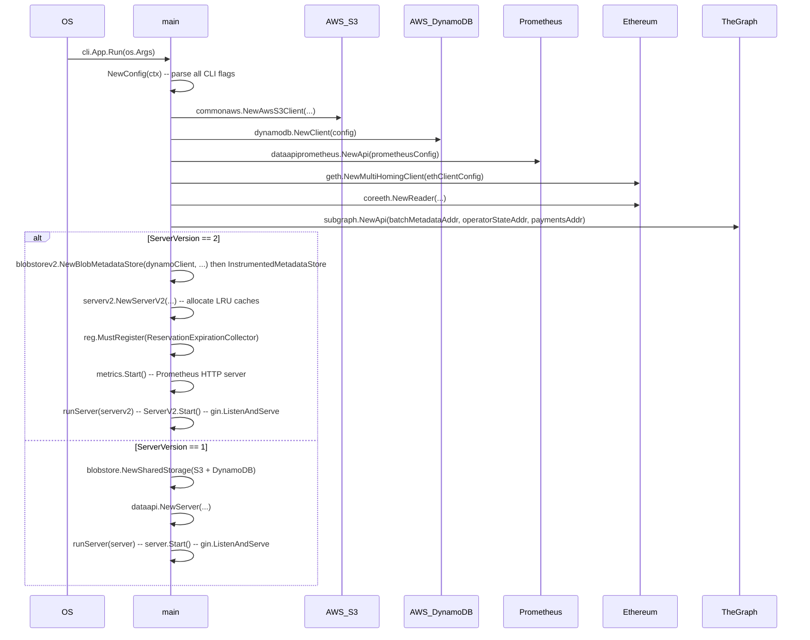

# disperser-dataapi Analysis

**Analyzed by**: code-analyzer-disperser-dataapi
**Timestamp**: 2026-04-10T00:00:00Z
**Application Type**: go-module
**Classification**: service
**Location**: disperser/cmd/dataapi

## Architecture

The disperser-dataapi is a read-only HTTP observability service for the EigenDA network. It exposes operational metrics, blob status, operator signing data, and batch information to external consumers such as dashboards, explorers, and monitoring tools. The service is entirely GET-only (no write paths) and acts as a data aggregation layer over multiple backend stores.

The binary supports two versioned server modes, selected at startup via the `--dataapi-version` flag (default: v1). **V1** (`disperser/dataapi/server.go`) is a legacy Gin-based server backed by the v1 `BlobMetadataStore` (DynamoDB) and an S3 `SharedStorage`. **V2** (`disperser/dataapi/v2/server_v2.go`) is a more capable Gin server using the v2 `BlobMetadataStore` (DynamoDB) with several layers of in-process LRU caching for performance. Both versions share common supporting packages: Prometheus query client, TheGraph subgraph client, Ethereum chain reader, and indexed chain state (TheGraph).

Architecturally the service follows a layered pattern: (1) CLI entrypoint wires up all dependencies; (2) Gin HTTP router dispatches to handler functions grouped by resource (blobs, batches, operators, metrics, accounts, swagger); (3) handler functions read from caches or backend clients and serialize JSON responses with HTTP cache-control headers; (4) a separate Prometheus metrics HTTP server (default port 9100) exposes operational self-metrics.

Multi-layer caching is a defining feature of v2. A `FeedCache[T]` (time-range-aware segment cache backed by a `CircularQueue`) is used for the batch feed. Multiple `hashicorp/golang-lru` LRU caches are used for per-key blob metadata, blob certificates, attestation info, and batch responses. An `expirable.LRU` with 1-minute TTL serves the account feed. HTTP `Cache-Control: max-age=N` headers propagate cache hints to clients and reverse proxies. Signal-based graceful shutdown (`SIGINT`/`SIGTERM`) is implemented in `runServer`.

## Key Components

- **`main` / `RunDataApi`** (`disperser/cmd/dataapi/main.go`): Binary entrypoint. Constructs all backend clients (AWS S3, DynamoDB, Prometheus, geth, TheGraph), creates the Prometheus registry, then conditionally instantiates either a v1 `server` or a v2 `ServerV2`. Starts the Prometheus metrics server and delegates lifecycle to `runServer`.

- **`Config` / `NewConfig`** (`disperser/cmd/dataapi/config.go`): Aggregates all runtime configuration fields from CLI flags: AWS DynamoDB/S3 coords, Ethereum RPC, subgraph URLs, Prometheus credentials, CORS origins, socket address, server mode and version, disperser/churner/batcher health hostnames.

- **`flags.Flags`** (`disperser/cmd/dataapi/flags/flags.go`): Declares all `urfave/cli` flags with matching environment variable names (`DATA_ACCESS_API_*`). Also composes flag sets from `common`, `geth`, `aws`, and `thegraph` packages. Required flags include DynamoDB table, S3 bucket, socket address, all Prometheus credentials, all subgraph addresses, CORS origins, disperser/churner hostnames, and batcher health endpoint.

- **`ServerV2`** (`disperser/dataapi/v2/server_v2.go`): Core v2 HTTP server struct. Holds references to `blobMetadataStore`, `promClient`, `subgraphClient`, `chainReader`, `chainState`, `indexedChainState`, `operatorHandler`, `metricsHandler`, plus all LRU/feed caches. The `Start()` method registers Gin routes under `/api/v2` and sets HTTP server timeouts (read: 5s, write: 20s, idle: 120s).

- **`server`** (`disperser/dataapi/server.go`): V1 equivalent of `ServerV2`. Uses a `disperser.BlobStore` (S3+DynamoDB), adds `EigenDAGRPCServiceChecker` and `EigenDAHttpServiceChecker` for service-availability endpoints. Routes are under `/api/v1`.

- **Blob Handlers** (`disperser/dataapi/v2/blobs.go`): Implements `FetchBlobFeed`, `FetchBlob`, `FetchBlobCertificate`, `FetchBlobAttestationInfo`. `FetchBlobFeed` supports bidirectional cursor-based pagination over a 14-day window. `FetchBlobAttestationInfo` resolves signers and nonsigners per quorum by joining blob metadata, attestation info, and on-chain operator stakes.

- **Batch Handlers** (`disperser/dataapi/v2/batches.go`): Implements `FetchBatchFeed` (uses `FeedCache[Attestation]`) and `FetchBatch` (keyed LRU). Shares `FeedParams` / `ParseFeedParams` helper for time-range and direction parsing.

- **Operator Handlers** (`disperser/dataapi/v2/operators.go`): Implements `FetchOperatorDispersalFeed`, `FetchOperatorDispersalResponse`, `FetchOperatorSigningInfo`, `FetchOperatorsStake`, `FetchOperatorsNodeInfo`, `CheckOperatorsLiveness`. Signing info crosses DynamoDB (attestation data) with on-chain operator stakes.

- **Account Handlers** (`disperser/dataapi/v2/accounts.go`): Implements `FetchAccountBlobFeed` (blobs per Ethereum address in a time window) and `FetchAccountFeed` (active accounts sorted by latest activity, backed by `expirable.LRU`).

- **Metrics Handlers** (`disperser/dataapi/v2/metrics.go`): Implements `FetchMetricsSummary`, `FetchMetricsThroughputTimeseries`, `FetchNetworkSigningRate`. All three delegate to `MetricsHandler` which queries the external Prometheus server via `PrometheusClient`.

- **`FeedCache[T]`** (`disperser/dataapi/v2/feed_cache.go`): Generic time-range segment cache wrapping a `CircularQueue[T]`. Supports ascending/descending queries, async cache extension for time ranges beyond current segment, and eviction of oldest items when capacity is exceeded.

- **`ReservationExpirationCollector`** (`disperser/dataapi/v2/reservation_collector.go`): Custom `prometheus.Collector` that queries active reservations via the subgraph client on every Prometheus scrape and exposes `eigenda_reservations_active` gauge and per-account `eigenda_reservation_time_until_expiry_seconds` gauge-vector.

- **`MetricsHandler`** (`disperser/dataapi/metrics_handler.go`): Thin wrapper over `PrometheusClient` that issues PromQL range queries for blob size throughput and quorum signing rates. Applies different rate window (4m vs 11m) depending on whether the query window spans less or more than 7 days.

- **`SubgraphClient` / `subgraph.Api`** (`disperser/dataapi/subgraph_client.go`, `disperser/dataapi/subgraph/api.go`): Two-layer abstraction. `subgraph.Api` issues GraphQL queries against up to three separate TheGraph endpoints (UI monitoring, operator state, payments). `SubgraphClient` adds caching and result mapping on top.

- **`OperatorHandler`** (`disperser/dataapi/operator_handler.go`): Handles cross-cutting operator operations: liveness checks (parallel TCP port checks via `gammazero/workerpool`), stake retrieval, semver scanning (uses gRPC reflection), ejection history. Uses `grpc` directly for reflection-based node-info queries.

- **Prometheus API Client** (`disperser/dataapi/prometheus/api.go`): Wraps `prometheus/client_golang/api/v1` with basic-auth round-tripper. Singleton via `sync.Once`. Exposes `QueryRange` for PromQL range queries.

- **`docs/docs.go`** (`disperser/cmd/dataapi/docs/docs.go`): Auto-generated Swagger 2.0 spec stub registered with `swaggo/swag`.

## Data Flows

### 1. Blob Feed Request (v2)

**Flow Description**: Client requests a paginated, time-ranged list of blobs; server reads from DynamoDB (via `blobMetadataStore`) with cursor-based pagination.

```mermaid
sequenceDiagram
    participant Client
    participant ServerV2
    participant BlobMetadataStore
    participant DynamoDB

    Client->>ServerV2: GET /api/v2/blobs/feed?direction=backward&before=T&limit=20
    Note over ServerV2: Parse & validate direction, before, after, cursor, limit params
    ServerV2->>BlobMetadataStore: GetBlobMetadataByRequestedAtBackward(ctx, endCursor, afterCursor, 20)
    BlobMetadataStore->>DynamoDB: DynamoDB Query (GSI, sort key = requested_at)
    DynamoDB--->>BlobMetadataStore: []BlobMetadata + nextCursor
    BlobMetadataStore--->>ServerV2: blobs, nextCursor
    Note over ServerV2: Serialize blobs to []BlobInfo{BlobKey, BlobMetadata}
    ServerV2--->>Client: 200 JSON BlobFeedResponse{blobs, cursor} + Cache-Control: max-age=5
```

**Detailed Steps**:

1. **Parameter validation** (ServerV2.FetchBlobFeed): direction, before/after timestamps (ISO 8601), cursor (opaque base64 struct), limit (default 20, max 1000). Time window bounded to 14-day max lookback.
2. **Cursor conversion**: timestamps converted to `BlobFeedCursor{RequestedAt: uint64(nanoseconds)}`. Presence of `cursor` param overrides `before`/`after`.
3. **DynamoDB query**: `GetBlobMetadataByRequestedAtForward` or `Backward` depending on direction; returns up to `limit` items and a next-page cursor.
4. **Response assembly**: each `BlobMetadata` mapped to `BlobInfo{BlobKey, BlobMetadata}`, cursor serialized to opaque string.
5. **HTTP response**: `Cache-Control: max-age=5` set; metrics incremented.

---

### 2. Blob Attestation Info Request (v2, LRU cache path)

**Flow Description**: Resolves full attestation info for a blob including which operators signed/did not sign, with multi-level LRU caching.

```mermaid
sequenceDiagram
    participant Client
    participant ServerV2
    participant LRU_Caches
    participant BlobMetadataStore
    participant ChainReader

    Client->>ServerV2: GET /api/v2/blobs/{blob_key}/attestation-info
    ServerV2->>LRU_Caches: blobAttestationInfoResponseCache.Get(blob_key)
    alt Cache Hit
        LRU_Caches--->>ServerV2: BlobAttestationInfoResponse
    else Cache Miss
        ServerV2->>BlobMetadataStore: GetBlobAttestationInfo(ctx, blobKey)
        BlobMetadataStore--->>ServerV2: BlobAttestationInfo
        ServerV2->>ChainReader: GetOperatorStakesForQuorums(ctx, quorumNumbers, referenceBlock)
        ChainReader--->>ServerV2: OperatorStakes per quorum
        ServerV2->>ChainReader: BatchOperatorIDToAddress(ctx, operatorIDs)
        ChainReader--->>ServerV2: []Address
        Note over ServerV2: Partition operators into signers/nonsigners per quorum
        ServerV2->>LRU_Caches: blobAttestationInfoResponseCache.Add(blob_key, response)
    end
    ServerV2--->>Client: 200 JSON BlobAttestationInfoResponse + Cache-Control: max-age=300
```

---

### 3. Metrics Summary Request (Prometheus query path)

**Flow Description**: Client fetches aggregate throughput metrics; server relays PromQL range query to external Prometheus.

```mermaid
sequenceDiagram
    participant Client
    participant ServerV2
    participant MetricsHandler
    participant PrometheusClient
    participant PrometheusServer

    Client->>ServerV2: GET /api/v2/metrics/summary?start=T1&end=T2
    ServerV2->>MetricsHandler: GetThroughputTimeseries(ctx, start, end)
    MetricsHandler->>PrometheusClient: QueryDisperserBlobSizeBytesPerSecondV2(ctx, T1, T2)
    PrometheusClient->>PrometheusServer: HTTP GET /api/v1/query_range (PromQL, BasicAuth)
    PrometheusServer--->>PrometheusClient: model.Value (matrix)
    PrometheusClient--->>MetricsHandler: []Throughput{Throughput, Timestamp}
    Note over ServerV2: Compute avg = sum(th)/N; total = avg * duration
    ServerV2--->>Client: 200 JSON MetricSummary + Cache-Control: max-age=5
```

---

### 4. Operator Signing Info Request

**Flow Description**: Returns per-operator signing rates for a quorum over a time interval by joining DynamoDB attestation data with on-chain operator stakes.

```mermaid
sequenceDiagram
    participant Client
    participant ServerV2
    participant OperatorHandler
    participant BlobMetadataStore
    participant IndexedChainState

    Client->>ServerV2: GET /api/v2/operators/signing-info?end=T&interval=3600&quorums=0,1
    ServerV2->>OperatorHandler: ComputeOperatorsSigningInfo(ctx, startBlock, endBlock, quorumIds)
    OperatorHandler->>IndexedChainState: GetIndexedOperators(ctx, blockNumber)
    IndexedChainState--->>OperatorHandler: map[OperatorID]IndexedOperatorInfo
    OperatorHandler->>BlobMetadataStore: GetAttestationByAttestedAtForward / GetDispersalsByRespondedAt
    BlobMetadataStore--->>OperatorHandler: []Attestation + []DispersalResponse
    Note over OperatorHandler: Compute signing % per operator per quorum
    OperatorHandler--->>ServerV2: []OperatorSigningInfo
    ServerV2--->>Client: 200 JSON OperatorsSigningInfoResponse + Cache-Control: max-age=5
```

---

### 5. Startup / Initialization Flow

**Flow Description**: Binary entry wires all clients and selects the server version.



## Dependencies

### External Libraries

- **github.com/gin-gonic/gin** (v1.9.1) [web-framework]: Gin HTTP web framework. Used as the primary HTTP router for both v1 and v2 servers. All endpoint handlers are `gin.HandlerFunc` closures; route groups organize endpoints by resource category. Imported in: `disperser/dataapi/server.go`, `disperser/dataapi/v2/server_v2.go`, all v2 handler files.

- **github.com/gin-contrib/cors** (v1.4.0) [web-framework]: CORS middleware for Gin. Applied to both v1 and v2 routers. In release mode, `AllowOrigins` is set from the configured list; in non-release mode it defaults to `["*"]`. Imported in: `disperser/dataapi/server.go`, `disperser/dataapi/v2/server_v2.go`.

- **github.com/gin-contrib/logger** (v0.2.6) [logging]: Gin request-logging middleware. Attached with `SkipPath` for the root health endpoint `/`. Imported in: `disperser/dataapi/server.go`, `disperser/dataapi/v2/server_v2.go`.

- **github.com/hashicorp/golang-lru/v2** (v2.0.7) [other]: Generic LRU cache with TTL-expirable variant. Used in v2 to cache `BlobMetadata`, `BlobAttestationInfo`, `BlobCertificate`, `BlobAttestationInfoResponse`, and `BatchResponse` keyed by hex strings. `expirable.LRU` used for account feed with 1-minute TTL. Imported in: `disperser/dataapi/v2/server_v2.go`.

- **github.com/prometheus/client_golang** (v1.21.1) [monitoring]: Prometheus Go client library. Used for self-instrumentation: counter vectors for request status/method, summary for latency, gauges for operator stake and cache metrics. Also used by `ReservationExpirationCollector` as a custom `prometheus.Collector`. Prometheus HTTP handler served on the metrics port. Imported in: `disperser/dataapi/metrics.go`, `disperser/dataapi/v2/reservation_collector.go`, `disperser/cmd/dataapi/main.go`.

- **github.com/prometheus/client_golang/api/v1** (bundled with client_golang) [monitoring]: Prometheus HTTP API v1 client. Used by `prometheus/api.go` to issue `QueryRange` PromQL calls to an external Prometheus server for throughput and signing-rate metrics. Imported in: `disperser/dataapi/prometheus/api.go`.

- **github.com/shurcooL/graphql** (v0.0.0-20230722043721-ed46e5a46466) [networking]: GraphQL client for Go. Used by `subgraph/api.go` to issue typed GraphQL queries against three separate TheGraph indexer endpoints (batch metadata, operator state, payments). Imported in: `disperser/dataapi/subgraph/api.go`.

- **github.com/swaggo/gin-swagger** (v1.6.0) + **github.com/swaggo/files** (v1.0.1) + **github.com/swaggo/swag** (v1.16.2) [other]: Swagger/OpenAPI documentation toolchain. `swaggo/swag` generates the spec; `gin-swagger` serves the Swagger UI under `/api/v1/swagger/*any` and `/api/v2/swagger/*any`. Imported in: `disperser/dataapi/server.go`, `disperser/dataapi/v2/server_v2.go`, `disperser/cmd/dataapi/docs/docs.go`.

- **github.com/urfave/cli** (v1.22.14) [cli]: CLI flag parsing. Drives `cli.App` in `main.go`, defines all application flags in `flags/flags.go`. Imported in: `disperser/cmd/dataapi/main.go`, `disperser/cmd/dataapi/flags/flags.go`, `disperser/cmd/dataapi/config.go`.

- **github.com/ethereum/go-ethereum** (v1.15.3, replaced by op-geth) [networking]: Ethereum client library. Used for `common.Address` type (account ID validation in account handlers) and indirectly via `common/geth` for the multi-homing Ethereum RPC client. Imported in: `disperser/dataapi/v2/accounts.go`, `disperser/dataapi/v2/operators.go`, `disperser/cmd/dataapi/main.go`.

- **github.com/Layr-Labs/eigensdk-go** (v0.2.0-beta) [other]: EigenLayer SDK. Provides the `logging.Logger` interface used throughout all packages. Imported in: all server and handler files.

- **github.com/gammazero/workerpool** (indirect) [other]: Worker pool for concurrent operator liveness checks in `OperatorHandler`. Limits parallelism to `livenessCheckPoolSize = 64`. Imported in: `disperser/dataapi/operator_handler.go`.

- **google.golang.org/grpc** (indirect) [networking]: gRPC client. Used by `OperatorHandler` for gRPC reflection-based node info (semver) queries against live operator nodes. Imported in: `disperser/dataapi/operator_handler.go`.

### Internal Libraries

- **github.com/Layr-Labs/eigenda/common** (`common/`): Provides `common.Logger` factory, AWS DynamoDB client (`common/aws/dynamodb`), AWS S3 client (`common/s3/aws`), geth multi-homing Ethereum client (`common/geth`), and shared CLI flag helpers. Imported in `main.go` and `config.go` for all infrastructure bootstrapping.

- **github.com/Layr-Labs/eigenda/core** (`core/`): Central domain types. `core.Reader` (Ethereum contract reader for operator stakes), `core.ChainState`, `core.IndexedChainState`, `core.OperatorID`, `core.QuorumID`, `core.SecurityParam`, `core.Signature`. Used throughout all handler files for signing-info computation and operator resolution.

- **github.com/Layr-Labs/eigenda/core/v2** (`core/v2/`): V2 domain types. `corev2.BlobKey`, `corev2.BlobHeader`, `corev2.BlobCertificate`, `corev2.Attestation`, `corev2.DispersalResponse`. Primary data types returned by v2 API endpoints.

- **github.com/Layr-Labs/eigenda/core/eth** (`core/eth/`): Concrete Ethereum reader (`coreeth.NewReader`), chain state (`coreeth.NewChainState`). Wired in `main.go` and used by `OperatorHandler` for on-chain operator data.

- **github.com/Layr-Labs/eigenda/core/thegraph** (`core/thegraph/`): `thegraph.MakeIndexedChainState` builds an indexed chain state backed by TheGraph GraphQL queries. Its `Config` is read from CLI flags. Used throughout operator handling.

- **github.com/Layr-Labs/eigenda/disperser** (`disperser/`): Top-level disperser package. Provides `disperser.BlobStore` interface and `disperser.BlobStatus` type (used in v1 response types). Also provides `disperser/common/blobstore` (v1 DynamoDB+S3 metadata store and shared storage) and `disperser/common/semver`.

- **github.com/Layr-Labs/eigenda/disperser/common/v2/blobstore** (`disperser/common/v2/blobstore/`): V2 DynamoDB blob metadata store (`blobstorev2.NewBlobMetadataStore`, `NewInstrumentedMetadataStore`). Primary read backend for all v2 blob, batch, operator, and account queries.

## API Surface

### HTTP Endpoints — V1 (`/api/v1`)

**GET /api/v1/feed/blobs** - Returns paginated blob metadata list.

**GET /api/v1/feed/blobs/:blob_key** - Returns metadata for a single blob by key.

**GET /api/v1/feed/batches/:batch_header_hash/blobs** - Returns blobs belonging to a specific batch.

**GET /api/v1/operators-info/deregistered-operators** - Returns operators that deregistered after a given block timestamp.

**GET /api/v1/operators-info/registered-operators** - Returns operators that registered after a given block timestamp.

**GET /api/v1/operators-info/operator-ejections** - Returns operator ejection events.

**GET /api/v1/operators-info/port-check** - Checks dispersal/retrieval socket reachability for an operator.

**GET /api/v1/operators-info/semver-scan** - Returns semver distribution across live operators (gRPC reflection).

**GET /api/v1/operators-info/operators-stake** - Returns stake-ranked operator list per quorum.

**GET /api/v1/metrics/** - Returns Prometheus-derived throughput/cost metrics summary.

**GET /api/v1/metrics/throughput** - Returns throughput timeseries.

**GET /api/v1/metrics/non-signers** - Returns non-signer operator list for a time window.

**GET /api/v1/metrics/operator-nonsigning-percentage** - Returns per-operator non-signing percentages.

**GET /api/v1/metrics/disperser-service-availability** - Returns disperser gRPC service health check result.

**GET /api/v1/metrics/churner-service-availability** - Returns churner gRPC service health check result.

**GET /api/v1/metrics/batcher-service-availability** - Returns batcher HTTP sidecar health check result.

**GET /api/v1/swagger/*** - Swagger UI for v1.

---

### HTTP Endpoints — V2 (`/api/v2`)

**GET /api/v2/blobs/feed**
Paginated blob feed with cursor-based pagination.
Query params: `direction` (forward/backward), `before` (ISO 8601), `after` (ISO 8601), `cursor` (opaque), `limit` (default 20, max 1000).

Example Response (200 OK):
```json
{
  "blobs": [
    {
      "blob_key": "0xabc123...",
      "blob_metadata": {
        "blob_header": {},
        "signature": "deadbeef...",
        "blob_status": "COMPLETE",
        "blob_size_bytes": 131072,
        "requested_at": 1712345678000000000,
        "expiry_unix_sec": 1713555278
      }
    }
  ],
  "cursor": "eyJyZXF1ZXN0ZWRfYXQiOjE3..."
}
```

**GET /api/v2/blobs/:blob_key**
Returns full blob metadata for a single blob by hex key.
Response: `BlobResponse{blob_key, blob_header, status, dispersed_at, blob_size_bytes}`.
Cache-Control: max-age=300.

**GET /api/v2/blobs/:blob_key/certificate**
Returns blob certificate (quorum commitment proofs).
Response: `BlobCertificateResponse{blob_certificate}`.

**GET /api/v2/blobs/:blob_key/attestation-info**
Returns full attestation info including per-quorum signer/nonsigner lists.
Response: `BlobAttestationInfoResponse{blob_key, batch_header_hash, blob_inclusion_info, attestation_info{attestation, signers, nonsigners}}`.
Cache-Control: max-age=300.

**GET /api/v2/batches/feed**
Paginated batch attestation feed.
Query params: `direction`, `before`, `after`, `limit`.
Response: `BatchFeedResponse{batches: [{batch_header_hash, batch_header, attested_at, aggregated_signature, quorum_numbers, quorum_signed_percentages}]}`.

**GET /api/v2/batches/:batch_header_hash**
Returns full batch details including blob keys and inclusion proofs.
Response: `BatchResponse{batch_header_hash, signed_batch, blob_key[], blob_inclusion_infos[], blob_certificates[]}`.

**GET /api/v2/accounts/:account_id/blobs**
Returns blobs posted by a specific Ethereum address.
Path param: `account_id` (hex Ethereum address).
Query params: `direction`, `before`, `after`, `limit`.
Response: `AccountBlobFeedResponse{account_id, blobs[]}`.

**GET /api/v2/accounts**
Returns active accounts within a lookback window sorted by latest activity.
Query param: `lookback_hours` (default 24, max 24000).
Response: `AccountFeedResponse{accounts: [{address, dispersed_at}]}`.
Cache-Control: max-age=5.

**GET /api/v2/operators/:operator_id/dispersals**
Returns dispersal batches sent to an operator in a time window.
Response: `OperatorDispersalFeedResponse{operator_identity, operator_socket, dispersals[]}`.

**GET /api/v2/operators/:operator_id/dispersals/:batch_header_hash/response**
Returns an operator's specific dispersal response for a batch.

**GET /api/v2/operators/signing-info**
Returns per-operator signing rates for specified quorums.
Query params: `end` (ISO 8601), `interval` (seconds, default 3600), `quorums` (comma-sep, default "0,1"), `nonsigner_only` (bool).
Response: `OperatorsSigningInfoResponse{start_block, end_block, start_time_unix_sec, end_time_unix_sec, operator_signing_info[{operator_id, operator_address, quorum_id, total_unsigned_batches, total_responsible_batches, total_batches, signing_percentage, stake_percentage}]}`.

**GET /api/v2/operators/stake**
Returns stake-ranked operator list per quorum.
Response: `OperatorsStakeResponse{current_block, stake_ranked_operators}`.

**GET /api/v2/operators/node-info**
Returns semver distribution and stake percentages across live nodes.

**GET /api/v2/operators/liveness**
Checks dispersal/retrieval socket reachability for all registered operators.
Response: `OperatorLivenessResponse{operators[{operator_id, dispersal_socket, dispersal_online, dispersal_status, retrieval_socket, retrieval_online, retrieval_status}]}`.

**GET /api/v2/metrics/summary**
Returns average and total throughput over a time window.
Query params: `start` (unix), `end` (unix).
Response: `MetricSummary{total_bytes_posted, average_bytes_per_second, start_timestamp_sec, end_timestamp_sec}`.

**GET /api/v2/metrics/timeseries/throughput**
Returns throughput timeseries from Prometheus.
Response: `[]Throughput{throughput, timestamp}`.

**GET /api/v2/metrics/timeseries/network-signing-rate**
Returns per-quorum signing rate timeseries.
Query params: `end` (ISO 8601), `interval` (seconds, default 3600), `quorums` (comma-sep, default "0,1").
Response: `NetworkSigningRateResponse{quorum_signing_rates[{quorum_id, data_points[{signing_rate, timestamp}]}]}`.

**GET /api/v2/swagger/*** - Swagger UI for v2.

**GET /** - Root health check. Returns `{"status": "OK"}` with HTTP 202.

## Code Examples

### Example 1: V2 Server Initialization with LRU Caches

```go
// disperser/dataapi/v2/server_v2.go:117-201
func NewServerV2(config dataapi.Config, blobMetadataStore blobstore.MetadataStore, ...) (*ServerV2, error) {
    // FeedCache for batch attestations -- 2-day rolling window at ~1 batch/s
    batchFeedCache := NewFeedCache(
        maxNumBatchesToCache, // 3600*24*2 = 172800
        fetchBatchFn,
        getBatchTimestampFn,
        metrics.BatchFeedCacheMetrics,
    )
    // Per-key LRU caches
    blobMetadataCache, _ := lru.New[string, *commonv2.BlobMetadata](maxNumKVBlobsToCache)  // 60000
    batchResponseCache, _ := lru.New[string, *BatchResponse](maxNumKVBatchesToCache)        // 3600
    // Account feed with 1-minute TTL expiry
    accountCache := expirable.NewLRU[string, *AccountFeedResponse](100, nil, accountCacheTTL)
    // ...
}
```

### Example 2: Cursor-based Blob Feed Pagination

```go
// disperser/dataapi/v2/blobs.go:109-166
afterCursor := blobstore.BlobFeedCursor{RequestedAt: uint64(afterTime.UnixNano())}
beforeCursor := blobstore.BlobFeedCursor{RequestedAt: uint64(beforeTime.UnixNano())}

if direction == "forward" {
    startCursor := afterCursor
    if current.RequestedAt > 0 { // cursor overrides after param
        startCursor = current
    }
    blobs, nextCursor, err = s.blobMetadataStore.GetBlobMetadataByRequestedAtForward(
        c.Request.Context(), startCursor, beforeCursor, limit,
    )
}
```

### Example 3: ReservationExpirationCollector as Custom Prometheus Collector

```go
// disperser/dataapi/v2/reservation_collector.go:46-56
func (c *ReservationExpirationCollector) Collect(ch chan<- prometheus.Metric) {
    ctx, cancel := context.WithTimeout(context.Background(), 8*time.Second)
    defer cancel()
    c.updateMetrics(ctx) // queries TheGraph, updates gauges
    c.reservationsActive.Collect(ch)
    c.reservationTimeUntilExpiry.Collect(ch)
}
```

### Example 4: Subgraph GraphQL Query with Pagination

```go
// disperser/dataapi/subgraph/api.go:78-104
func (a *api) QueryBatchesByBlockTimestampRange(ctx context.Context, start, end uint64) ([]*Batches, error) {
    skip := 0
    for {
        variables["first"] = graphql.Int(maxEntriesPerQuery) // 1000
        variables["skip"]  = graphql.Int(skip)
        err := a.uiMonitoringGql.Query(ctx, &query, variables)
        if len(query.Batches) == 0 { break }
        result = append(result, query.Batches...)
        skip += maxEntriesPerQuery
    }
    return result, nil
}
```

### Example 5: HTTP Cache-Control Header Strategy

```go
// disperser/dataapi/v2/server_v2.go (constants):
// maxBlobDataAge = 300  -- static content: 5 minutes
// maxBlobFeedAge = 5    -- live feed: 5 seconds
// maxMetricAge   = 5    -- live metrics: 5 seconds

// disperser/dataapi/v2/blobs.go:215-216
c.Writer.Header().Set(cacheControlParam, fmt.Sprintf("max-age=%d", maxBlobDataAge))
c.JSON(http.StatusOK, response)
```

## Files Analyzed

- `disperser/cmd/dataapi/main.go` (220 lines) - Binary entrypoint, dependency wiring, server selection
- `disperser/cmd/dataapi/config.go` (91 lines) - Config struct and CLI flag parsing
- `disperser/cmd/dataapi/flags/flags.go` (194 lines) - All CLI flag declarations with env var names
- `disperser/cmd/dataapi/docs/docs.go` (36 lines) - Auto-generated Swagger spec registration
- `disperser/dataapi/server.go` (1201 lines) - V1 Gin server, routes, response types, v1 handler implementations
- `disperser/dataapi/v2/server_v2.go` (370 lines) - V2 Gin server struct, constructor, routes, HTTP config
- `disperser/dataapi/v2/blobs.go` (459 lines) - V2 blob handler functions
- `disperser/dataapi/v2/batches.go` (262 lines) - V2 batch handler functions, FeedParams helper
- `disperser/dataapi/v2/operators.go` (726 lines) - V2 operator handler functions
- `disperser/dataapi/v2/metrics.go` (217 lines) - V2 metrics handler functions
- `disperser/dataapi/v2/accounts.go` (188 lines) - V2 account handler functions
- `disperser/dataapi/v2/types.go` (249 lines) - All v2 API request/response type definitions
- `disperser/dataapi/v2/feed_cache.go` (354 lines) - Generic time-range segment cache with CircularQueue
- `disperser/dataapi/v2/reservation_collector.go` (109 lines) - Custom Prometheus collector for reservation metrics
- `disperser/dataapi/config.go` (17 lines) - Shared Config struct
- `disperser/dataapi/metrics.go` (partial) - Prometheus self-metrics setup
- `disperser/dataapi/metrics_handler.go` (partial) - MetricsHandler wrapping PrometheusClient
- `disperser/dataapi/operator_handler.go` (partial) - OperatorHandler with liveness/stake/semver logic
- `disperser/dataapi/subgraph/api.go` (321 lines) - GraphQL subgraph client (three endpoints)
- `disperser/dataapi/prometheus/api.go` (66 lines) - Prometheus HTTP API v1 client

## Analysis Data

```json
{
  "summary": "disperser-dataapi is a read-only HTTP observability service for EigenDA. It exposes blob status, batch attestations, operator signing rates, throughput metrics, and account activity via a versioned Gin REST API (v1 at /api/v1, v2 at /api/v2). V2 is the active development target and uses multi-level LRU caching (FeedCache for batch feed, per-key LRU for blobs/batches, expirable LRU for accounts) over a DynamoDB v2 BlobMetadataStore backend. Metrics are sourced from an external Prometheus server via PromQL queries. Operator state and subgraph data are sourced from TheGraph GraphQL endpoints. Self-instrumentation is served on a separate Prometheus metrics HTTP port. The binary selects v1 or v2 at startup via a CLI flag.",
  "architecture_pattern": "rest-api/read-only",
  "key_modules": [
    "disperser/cmd/dataapi/main.go",
    "disperser/cmd/dataapi/config.go",
    "disperser/cmd/dataapi/flags/flags.go",
    "disperser/dataapi/server.go",
    "disperser/dataapi/v2/server_v2.go",
    "disperser/dataapi/v2/blobs.go",
    "disperser/dataapi/v2/batches.go",
    "disperser/dataapi/v2/operators.go",
    "disperser/dataapi/v2/metrics.go",
    "disperser/dataapi/v2/accounts.go",
    "disperser/dataapi/v2/types.go",
    "disperser/dataapi/v2/feed_cache.go",
    "disperser/dataapi/v2/reservation_collector.go",
    "disperser/dataapi/subgraph/api.go",
    "disperser/dataapi/prometheus/api.go"
  ],
  "api_endpoints": [
    "GET /api/v2/blobs/feed",
    "GET /api/v2/blobs/:blob_key",
    "GET /api/v2/blobs/:blob_key/certificate",
    "GET /api/v2/blobs/:blob_key/attestation-info",
    "GET /api/v2/batches/feed",
    "GET /api/v2/batches/:batch_header_hash",
    "GET /api/v2/accounts/:account_id/blobs",
    "GET /api/v2/accounts",
    "GET /api/v2/operators/:operator_id/dispersals",
    "GET /api/v2/operators/:operator_id/dispersals/:batch_header_hash/response",
    "GET /api/v2/operators/signing-info",
    "GET /api/v2/operators/stake",
    "GET /api/v2/operators/node-info",
    "GET /api/v2/operators/liveness",
    "GET /api/v2/metrics/summary",
    "GET /api/v2/metrics/timeseries/throughput",
    "GET /api/v2/metrics/timeseries/network-signing-rate",
    "GET /api/v2/swagger/*any",
    "GET /api/v1/feed/blobs",
    "GET /api/v1/feed/blobs/:blob_key",
    "GET /api/v1/feed/batches/:batch_header_hash/blobs",
    "GET /api/v1/operators-info/*",
    "GET /api/v1/metrics/*",
    "GET /"
  ],
  "data_flows": [
    "blob-feed: Client -> ServerV2.FetchBlobFeed -> BlobMetadataStore.GetBlobMetadataByRequestedAt{Forward,Backward} -> DynamoDB",
    "blob-attestation: Client -> ServerV2.FetchBlobAttestationInfo -> LRU caches -> BlobMetadataStore -> ChainReader.GetOperatorStakes",
    "metrics-summary: Client -> ServerV2.FetchMetricsSummary -> MetricsHandler -> PrometheusClient.QueryRange -> external Prometheus",
    "operator-signing: Client -> ServerV2.FetchOperatorSigningInfo -> OperatorHandler -> BlobMetadataStore + IndexedChainState",
    "reservation-metrics: Prometheus scrape -> ReservationExpirationCollector.Collect -> SubgraphClient.QueryReservations -> TheGraph"
  ],
  "tech_stack": ["go", "gin", "dynamodb", "prometheus", "graphql", "ethereum", "lru-cache", "swagger"],
  "external_integrations": [
    "aws-dynamodb",
    "aws-s3",
    "prometheus-remote",
    "thegraph-graphql",
    "ethereum-rpc"
  ],
  "component_interactions": [
    {
      "target": "disperser (BlobMetadataStore v1/v2)",
      "type": "library",
      "description": "Uses disperser/common/blobstore (v1) and disperser/common/v2/blobstore (v2) to read blob metadata, attestations, dispersals, and accounts from DynamoDB."
    },
    {
      "target": "core (ChainReader, ChainState, IndexedChainState)",
      "type": "library",
      "description": "Uses core.Reader for on-chain operator stake queries; core.IndexedChainState for indexed operator info from TheGraph."
    },
    {
      "target": "common (AWS clients, geth, logging)",
      "type": "library",
      "description": "Uses common/aws/dynamodb, common/s3/aws, common/geth, and common.Logger for all infrastructure bootstrapping."
    },
    {
      "target": "external Prometheus server",
      "type": "http_api",
      "description": "Issues PromQL range queries (basic auth) to an operator-configured Prometheus endpoint for throughput and signing-rate timeseries data."
    },
    {
      "target": "TheGraph indexer (3 endpoints)",
      "type": "http_api",
      "description": "Issues GraphQL queries to three separate TheGraph endpoints: batch metadata (uiMonitoringGql), operator state (operatorStateGql), and payments/reservations (paymentsGql)."
    },
    {
      "target": "Ethereum RPC (geth multi-homing)",
      "type": "http_api",
      "description": "Issues eth_call and eth_getLogs to Ethereum nodes to read operator stakes, batch operator IDs to addresses, and chain state for signing info."
    }
  ]
}
```

## Citations

```json
[
  {
    "file_path": "disperser/cmd/dataapi/main.go",
    "start_line": 42,
    "end_line": 56,
    "claim": "Binary entry point uses urfave/cli and delegates to RunDataApi action",
    "section": "Architecture",
    "snippet": "app := cli.NewApp()\napp.Flags = flags.Flags\napp.Action = RunDataApi\nerr := app.Run(os.Args)"
  },
  {
    "file_path": "disperser/cmd/dataapi/main.go",
    "start_line": 113,
    "end_line": 156,
    "claim": "ServerVersion flag selects between v1 and v2 server instantiation at startup",
    "section": "Architecture",
    "snippet": "if config.ServerVersion == 2 { ... serverv2.NewServerV2(...) ... } else { ... dataapi.NewServer(...) ... }"
  },
  {
    "file_path": "disperser/cmd/dataapi/main.go",
    "start_line": 70,
    "end_line": 88,
    "claim": "AWS S3 and DynamoDB clients are constructed in main before server creation",
    "section": "Key Components",
    "snippet": "s3Client, err := commonaws.NewAwsS3Client(...)\ndynamoClient, err := dynamodb.NewClient(config.AwsClientConfig, logger)"
  },
  {
    "file_path": "disperser/cmd/dataapi/main.go",
    "start_line": 89,
    "end_line": 111,
    "claim": "Prometheus API client, Ethereum client, TheGraph subgraph API, and chain state are all wired in main",
    "section": "Key Components",
    "snippet": "promApi, err := dataapiprometheus.NewApi(config.PrometheusConfig)\nclient, err := geth.NewMultiHomingClient(...)\nsubgraphApi = subgraph.NewApi(batchMetadataAddr, operatorStateAddr, paymentsAddr)"
  },
  {
    "file_path": "disperser/cmd/dataapi/flags/flags.go",
    "start_line": 11,
    "end_line": 14,
    "claim": "All CLI flags are namespaced under 'data-access-api' prefix and DATA_ACCESS_API env vars",
    "section": "Key Components",
    "snippet": "const (\n\tFlagPrefix   = \"data-access-api\"\n\tenvVarPrefix = \"DATA_ACCESS_API\"\n)"
  },
  {
    "file_path": "disperser/cmd/dataapi/flags/flags.go",
    "start_line": 158,
    "end_line": 174,
    "claim": "Required flags include DynamoDB table, S3 bucket, socket, all Prometheus credentials, all subgraph URLs, CORS origins, disperser/churner/batcher hostnames",
    "section": "Key Components",
    "snippet": "var requiredFlags = []cli.Flag{\n\tDynamoTableNameFlag, SocketAddrFlag, S3BucketNameFlag,\n\tSubgraphApiBatchMetadataAddrFlag, ..., PrometheusServerURLFlag, ...\n}"
  },
  {
    "file_path": "disperser/dataapi/v2/server_v2.go",
    "start_line": 31,
    "end_line": 75,
    "claim": "V2 server defines cache-control constants: maxBlobAge=14 days, maxBlobFeedAge=5s (live), maxBlobDataAge=300s (static)",
    "section": "Architecture",
    "snippet": "maxBlobAge = 14 * 24 * time.Hour\nmaxNumBlobsPerBlobFeedResponse = 1000\nmaxBlobDataAge = 300\nmaxBlobFeedAge = 5"
  },
  {
    "file_path": "disperser/dataapi/v2/server_v2.go",
    "start_line": 84,
    "end_line": 115,
    "claim": "ServerV2 struct holds blobMetadataStore and multiple LRU caches: blobMetadataCache, blobAttestationInfoCache, blobCertificateCache, blobAttestationInfoResponseCache, batchResponseCache, accountCache",
    "section": "Key Components",
    "snippet": "blobMetadataCache *lru.Cache[string, *commonv2.BlobMetadata]\nbatchResponseCache *lru.Cache[string, *BatchResponse]\naccountCache *expirable.LRU[string, *AccountFeedResponse]"
  },
  {
    "file_path": "disperser/dataapi/v2/server_v2.go",
    "start_line": 209,
    "end_line": 277,
    "claim": "V2 Gin router is organized under /api/v2 with groups: blobs, batches, accounts, operators, metrics, swagger",
    "section": "API Surface",
    "snippet": "basePath := \"/api/v2\"\nblobs := v2.Group(\"/blobs\")\nbatches := v2.Group(\"/batches\")\naccounts := v2.Group(\"/accounts\")\noperators := v2.Group(\"/operators\")\nmetrics := v2.Group(\"/metrics\")"
  },
  {
    "file_path": "disperser/dataapi/v2/server_v2.go",
    "start_line": 239,
    "end_line": 276,
    "claim": "All v2 endpoints are read-only GET handlers; OPTIONS wildcard for CORS preflight",
    "section": "API Surface",
    "snippet": "blobs.GET(\"/feed\", s.FetchBlobFeed)\nblobs.GET(\"/:blob_key\", s.FetchBlob)\noperators.GET(\"/signing-info\", s.FetchOperatorSigningInfo)\nrouter.OPTIONS(\"/*path\", func(c *gin.Context) { c.Status(http.StatusOK) })"
  },
  {
    "file_path": "disperser/dataapi/v2/server_v2.go",
    "start_line": 286,
    "end_line": 297,
    "claim": "HTTP server timeouts: ReadTimeout=5s, WriteTimeout=20s, IdleTimeout=120s",
    "section": "Architecture",
    "snippet": "srv := &http.Server{\n\tAddr: s.socketAddr,\n\tReadTimeout: 5 * time.Second,\n\tWriteTimeout: 20 * time.Second,\n\tIdleTimeout: 120 * time.Second,\n}"
  },
  {
    "file_path": "disperser/dataapi/v2/server_v2.go",
    "start_line": 219,
    "end_line": 231,
    "claim": "CORS is configured: AllowOrigins from config in release mode, wildcard '*' in non-release mode",
    "section": "Architecture",
    "snippet": "config.AllowOrigins = s.allowOrigins\nif s.serverMode != gin.ReleaseMode {\n\tconfig.AllowOrigins = []string{\"*\"}\n}"
  },
  {
    "file_path": "disperser/dataapi/v2/blobs.go",
    "start_line": 34,
    "end_line": 96,
    "claim": "FetchBlobFeed validates direction, before/after timestamps with 14-day lookback window, cursor, and limit (max 1000)",
    "section": "Data Flows",
    "snippet": "direction := \"forward\"\noldestTime := now.Add(-maxBlobAge)\nlimit = maxNumBlobsPerBlobFeedResponse // if <= 0 or > 1000"
  },
  {
    "file_path": "disperser/dataapi/v2/blobs.go",
    "start_line": 109,
    "end_line": 165,
    "claim": "Cursor-based pagination: cursor overrides after/before param; direction determines forward or backward DynamoDB scan",
    "section": "Data Flows",
    "snippet": "if current.RequestedAt > 0 { startCursor = current }\nblobs, nextCursor, err = s.blobMetadataStore.GetBlobMetadataByRequestedAtForward(\n\tc.Request.Context(), startCursor, beforeCursor, limit,\n)"
  },
  {
    "file_path": "disperser/dataapi/v2/blobs.go",
    "start_line": 179,
    "end_line": 216,
    "claim": "FetchBlob checks blobMetadataCache LRU before hitting DynamoDB; sets Cache-Control: max-age=300",
    "section": "Data Flows",
    "snippet": "metadata, found := s.blobMetadataCache.Get(blobKey.Hex())\nif !found {\n\tmetadata, err = s.blobMetadataStore.GetBlobMetadata(c.Request.Context(), blobKey)\n\ts.blobMetadataCache.Add(blobKey.Hex(), metadata)\n}"
  },
  {
    "file_path": "disperser/dataapi/v2/blobs.go",
    "start_line": 301,
    "end_line": 346,
    "claim": "getBlobAttestationInfoResponse joins attestation info from DynamoDB with on-chain operator stakes to produce signer/nonsigner lists per quorum",
    "section": "Data Flows",
    "snippet": "blobSigners, blobNonsigners, err := s.getSignersAndNonSigners(ctx, blobQuorums, attestationInfo.Attestation)"
  },
  {
    "file_path": "disperser/dataapi/v2/metrics.go",
    "start_line": 14,
    "end_line": 65,
    "claim": "FetchMetricsSummary delegates to MetricsHandler.GetThroughputTimeseries which issues PromQL queries to external Prometheus",
    "section": "Data Flows",
    "snippet": "ths, err := s.metricsHandler.GetThroughputTimeseries(c.Request.Context(), start, end)\navg = avg / float64(len(ths))\ntotalBytes := avg * float64(timeDuration)"
  },
  {
    "file_path": "disperser/dataapi/v2/reservation_collector.go",
    "start_line": 14,
    "end_line": 37,
    "claim": "ReservationExpirationCollector is a custom prometheus.Collector exposing eigenda_reservations_active and per-account eigenda_reservation_time_until_expiry_seconds gauges",
    "section": "Key Components",
    "snippet": "reservationsActive prometheus.Gauge\nreservationTimeUntilExpiry *prometheus.GaugeVec\n// Name: \"eigenda_reservations_active\"\n// Name: \"eigenda_reservation_time_until_expiry_seconds\""
  },
  {
    "file_path": "disperser/dataapi/v2/reservation_collector.go",
    "start_line": 46,
    "end_line": 56,
    "claim": "ReservationExpirationCollector queries TheGraph for active reservations with 8-second timeout on every Prometheus scrape",
    "section": "Key Components",
    "snippet": "ctx, cancel := context.WithTimeout(context.Background(), 8*time.Second)\nc.updateMetrics(ctx)\nc.reservationsActive.Collect(ch)"
  },
  {
    "file_path": "disperser/dataapi/subgraph/api.go",
    "start_line": 35,
    "end_line": 56,
    "claim": "Subgraph API uses three separate graphql.Client instances: uiMonitoringGql (batch metadata), operatorStateGql (operator events), paymentsGql (reservations)",
    "section": "Key Components",
    "snippet": "api struct {\n\tuiMonitoringGql  *graphql.Client\n\toperatorStateGql *graphql.Client\n\tpaymentsGql      *graphql.Client\n}"
  },
  {
    "file_path": "disperser/dataapi/subgraph/api.go",
    "start_line": 78,
    "end_line": 104,
    "claim": "TheGraph queries use client-side pagination with skip/first up to 1000 entries per page",
    "section": "Key Components",
    "snippet": "maxEntriesPerQuery = 1000\nskip := 0\nfor {\n\tvariables[\"first\"] = graphql.Int(maxEntriesPerQuery)\n\tvariables[\"skip\"] = graphql.Int(skip)\n\tif len(query.Batches) == 0 { break }\n\tskip += maxEntriesPerQuery\n}"
  },
  {
    "file_path": "disperser/dataapi/prometheus/api.go",
    "start_line": 29,
    "end_line": 48,
    "claim": "Prometheus API client is a singleton (sync.Once) using basic auth round tripper configured from username/secret",
    "section": "Key Components",
    "snippet": "clientOnce.Do(func() {\n\troundTripper := promconfig.NewBasicAuthRoundTripper(...)\n\tclient, _ := api.NewClient(api.Config{Address: config.ServerURL, RoundTripper: roundTripper})\n})"
  },
  {
    "file_path": "disperser/dataapi/v2/accounts.go",
    "start_line": 118,
    "end_line": 188,
    "claim": "FetchAccountFeed uses expirable LRU cache keyed by lookback_hours; falls back to DynamoDB GetAccounts query on miss",
    "section": "Key Components",
    "snippet": "cacheKey := fmt.Sprintf(\"account_feed:%d\", lookbackHours)\nif cached, ok := s.accountCache.Get(cacheKey); ok {\n\tc.JSON(http.StatusOK, cached)\n\treturn\n}\naccounts, err := s.blobMetadataStore.GetAccounts(c.Request.Context(), lookbackSeconds)"
  },
  {
    "file_path": "disperser/dataapi/v2/feed_cache.go",
    "start_line": 22,
    "end_line": 50,
    "claim": "FeedCache is a generic time-range segment cache backed by CircularQueue with async DB extension and configurable max capacity",
    "section": "Key Components",
    "snippet": "type FeedCache[T any] struct {\n\tmu      sync.RWMutex\n\tsegment *CircularQueue[T]\n\tupdateWg *sync.WaitGroup\n\tfetchFromDB  func(ctx, start, end time.Time, order FetchOrder, limit int) ([]*T, error)\n}"
  },
  {
    "file_path": "disperser/dataapi/server.go",
    "start_line": 230,
    "end_line": 233,
    "claim": "ServerInterface is the common abstraction implemented by both v1 server and v2 ServerV2",
    "section": "Architecture",
    "snippet": "type ServerInterface interface {\n\tStart() error\n\tShutdown() error\n}"
  },
  {
    "file_path": "disperser/dataapi/server.go",
    "start_line": 298,
    "end_line": 333,
    "claim": "V1 server routes are grouped under /api/v1 with feed, operators-info, and metrics sub-groups",
    "section": "API Surface",
    "snippet": "basePath := \"/api/v1\"\nfeed.GET(\"/blobs\", s.FetchBlobsHandler)\noperatorsInfo.GET(\"/port-check\", s.OperatorPortCheck)\nmetrics.GET(\"/disperser-service-availability\", s.FetchDisperserServiceAvailability)"
  },
  {
    "file_path": "disperser/cmd/dataapi/main.go",
    "start_line": 197,
    "end_line": 220,
    "claim": "runServer is a generic function (type parameter T ServerInterface) that starts the server in a goroutine and blocks on SIGINT/SIGTERM",
    "section": "Architecture",
    "snippet": "func runServer[T dataapi.ServerInterface](server T, logger logging.Logger) error {\n\tsignal.Notify(quit, syscall.SIGINT, syscall.SIGTERM)\n\tgo func() { server.Start() }()\n\t<-quit\n\treturn server.Shutdown()\n}"
  },
  {
    "file_path": "disperser/dataapi/v2/operators.go",
    "start_line": 38,
    "end_line": 80,
    "claim": "FetchOperatorDispersalFeed queries DynamoDB GetDispersalsByRespondedAt with ascending or descending flag",
    "section": "Data Flows",
    "snippet": "dispersals, err = s.blobMetadataStore.GetDispersalsByRespondedAt(\n\tc.Request.Context(), operatorId,\n\tuint64(params.afterTime.UnixNano()), uint64(params.beforeTime.UnixNano()),\n\tparams.limit, true,\n)"
  },
  {
    "file_path": "disperser/dataapi/operator_handler.go",
    "start_line": 20,
    "end_line": 22,
    "claim": "OperatorHandler uses a worker pool of size 64 for concurrent liveness checks",
    "section": "Key Components",
    "snippet": "const (\n\tlivenessCheckPoolSize = 64\n)"
  },
  {
    "file_path": "disperser/dataapi/metrics_handler.go",
    "start_line": 9,
    "end_line": 11,
    "claim": "MetricsHandler uses different Prometheus rate intervals: 4m for <7 day windows, 11m for >=7 day windows",
    "section": "Key Components",
    "snippet": "defaultThroughputRateSecs  = 240 // 4m\nsevenDayThroughputRateSecs = 660 // 11m"
  }
]
```

## Analysis Notes

### Security Considerations

1. **No authentication on HTTP endpoints**: All API endpoints are unauthenticated GET requests. The service is designed for public observability dashboards. Operators should ensure the service is not directly exposed on the internet without a reverse proxy or network-level access control.

2. **Prometheus basic auth credentials in configuration**: Prometheus credentials (username, secret) are passed as CLI flags and read into the process environment (`DATA_ACCESS_API_PROMETHEUS_SERVER_USERNAME`, etc.). These should be injected via secrets management rather than plain environment variables in production.

3. **CORS in debug/test mode allows all origins**: When `server-mode` is not `release`, `AllowOrigins` is forced to `["*"]`. This is appropriate for development but must be explicitly set to release mode in production deployments.

4. **TheGraph GraphQL requests are unauthenticated**: All three subgraph clients connect to TheGraph endpoints without authentication. This is typical for public TheGraph subgraphs but means the data source is inherently a third-party public service.

5. **gRPC operator liveness checks without TLS**: `operator_handler.go` connects to operator gRPC endpoints using `grpc/credentials/insecure`. This is expected for node-info scanning but means traffic to operator nodes is unencrypted.

### Performance Characteristics

- **Multi-layer LRU caching in v2**: Blob metadata, certificates, attestation info, and batch responses are all cached in-process LRU caches (60,000 blobs, 3,600 batches). The `FeedCache` batch segment cache holds up to 172,800 entries (~2 days). This should reduce DynamoDB read units significantly for repeated or hot queries.
- **Cache-Control headers propagate hints**: HTTP `max-age` values differentiate live data (5s) from static data (300s), enabling CDN/reverse-proxy caching to further reduce load.
- **Operator liveness checks are concurrent**: Worker pool of 64 goroutines parallelizes TCP port checks across all registered operators.
- **Prometheus scrape has 8-second timeout**: `ReservationExpirationCollector` uses a hard 8-second context timeout per scrape cycle to avoid blocking Prometheus collectors.

### Scalability Notes

- **Stateless service**: All state is in DynamoDB, Prometheus, and TheGraph. Multiple instances can run behind a load balancer without coordination.
- **Single-process LRU caches are not shared**: In a multi-replica deployment, each instance maintains independent in-process caches, meaning cache warm-up is per-instance. This is acceptable given the DynamoDB backend handles concurrent reads well.
- **DynamoDB read capacity**: The service is read-only and relies entirely on DynamoDB provisioned/on-demand capacity. High-traffic periods (blob feed queries) may require DynamoDB auto-scaling to be configured.
- **Prometheus dependency**: Throughput and signing-rate metric endpoints are blocked on the external Prometheus server. If Prometheus is unavailable, these endpoints will return errors, which could affect dashboard availability.
