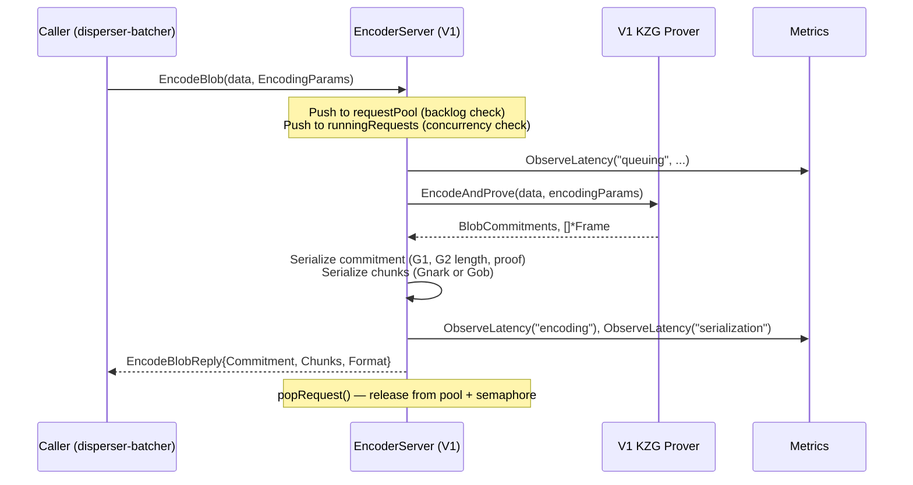
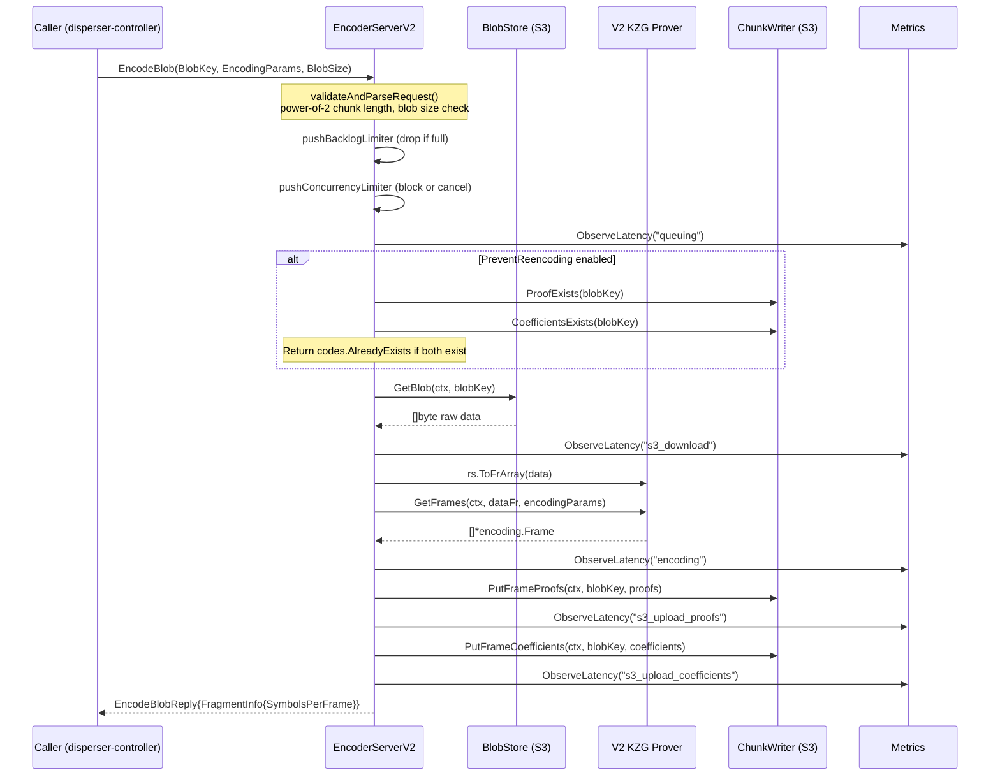
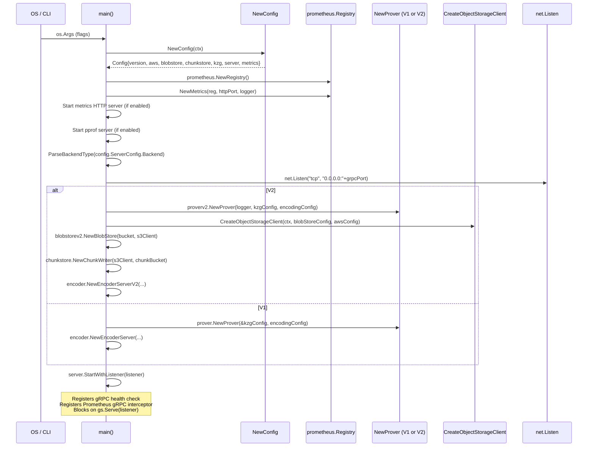

# disperser-encoder Analysis

**Analyzed by**: code-analyzer-disperser-encoder
**Timestamp**: 2026-04-10T00:00:00Z
**Application Type**: go-module
**Classification**: service
**Location**: disperser/cmd/encoder

## Architecture

The disperser-encoder is a standalone gRPC service in the EigenDA system that performs KZG polynomial encoding of raw blob data, producing cryptographic commitments and erasure-coded frame chunks for distribution to node operators. It is deployed as a binary (`disperser/cmd/encoder`) and relies on the `disperser/encoder` package for its server implementation.

The service supports two protocol generations: V1 and V2. In V1 mode, the caller supplies raw blob bytes in the gRPC request; the server performs KZG encoding locally and returns serialized commitments plus chunked frames inline in the response. In V2 mode the server fetches raw blob data from an object store (AWS S3 or Oracle OCI), performs encoding using the V2 prover, then writes KZG frame proofs and Reed-Solomon coefficients separately to a chunk store (also S3/OCI-backed) and returns lightweight `FragmentInfo` metadata in the response. V2 notably skips loading G2 points because KZG commitments are computed upstream on the API server.

Concurrency is managed by two independent mechanisms. In V1, a `requestPool` channel (bounded by `RequestPoolSize`) acts as a backlog limiter, and a `runningRequests` channel (bounded by `MaxConcurrentRequestsDangerous`) limits parallel execution. V2 refines this into a `backlogLimiter` (drops new work when full) and a `concurrencyLimiter` (blocks waiting callers until a slot opens or context is canceled), separating rejection from waiting semantics. For GPU-backed (Icicle) deployments the `MaxConcurrentRequestsDangerous` value also serves as the semaphore weight for CUDA memory safety.

Observability is built in through Prometheus metrics (request counters by state, latency summaries, queue depth gauges) exposed via an HTTP server, gRPC unary interceptors from `go-grpc-middleware/providers/prometheus`, gRPC health-check registration, and an optional pprof endpoint. The Icicle/GPU build path is isolated to a separate `icicle.Dockerfile` that uses `nvidia/cuda:12.2.2-devel-ubuntu22.04` as the builder base and the `icicle` Go build tag.

## Key Components

- **`main` / `RunEncoderServer`** (`disperser/cmd/encoder/main.go`): Binary entry point. Uses `urfave/cli` to parse flags, instantiates configuration, sets up logging, Prometheus registry, optional pprof profiler, then selects the V1 or V2 code path. Creates the appropriate prover, object-storage client, blob store, and chunk writer before instantiating the gRPC server and calling `StartWithListener`.

- **`EncoderServer` (V1)** (`disperser/encoder/server.go`): Implements the `encoder.v1.Encoder/EncodeBlob` gRPC method. Accepts raw blob bytes plus `EncodingParams` in the request. Uses a dual-channel flow-control mechanism (request pool + running-request semaphore). Calls `Prover.EncodeAndProve()` and serializes commitment fields (G1 commitment, G2 length commitment, length proof) and frame chunks in either Gnark or Gob format inline in the response. Binds at 300 MiB max gRPC receive message size.

- **`EncoderServerV2`** (`disperser/encoder/server_v2.go`): Implements `encoder.v2.Encoder/EncodeBlob`. Receives only a `BlobKey`, `EncodingParams`, and `BlobSize` — no raw bytes. Fetches blob data from `blobstore.BlobStore` (S3), converts to BN254 field elements via `rs.ToFrArray`, calls `prover.GetFrames()`, then writes proofs and coefficients to the `ChunkWriter` (also S3). Returns `FragmentInfo{SymbolsPerFrame}`. Validates request parameters strictly (chunk length must be power-of-2, blob size must fit encoding grid).

- **`Prover` interface** (`disperser/encoder/server.go`): Interface consumed by V1 `EncoderServer`. Declares `EncodeAndProve`, `GetFrames`, `GetMultiFrameProofs`, `GetCommitmentsForPaddedLength`, `Decode`, and `GetSRSOrder`. Satisfied by `encoding/v1/kzg/prover.Prover` (Gnark or Icicle backend).

- **`encoding/v2/kzg/prover.Prover`** (external package, `encoding/v2/kzg/prover/prover.go`): Used directly (not via interface) by `EncoderServerV2`. Exposes `GetFrames(ctx, dataFr []fr.Element, params EncodingParams) ([]*encoding.Frame, *ProvingParams, error)`. Created via `proverv2.NewProver(logger, kzgConfig, encodingConfig)`.

- **`Config`** (`disperser/cmd/encoder/config.go`): Top-level runtime configuration struct. Contains versioning (`EncoderVersion`), AWS credentials (`aws.ClientConfig`), blob store config (`blobstore.Config`), chunk store config (`chunkstore.Config`), KZG prover config (`kzg.KzgConfig`), logger config, `ServerConfig`, and `MetricsConfig`. Built from CLI flags via `NewConfig`.

- **`ServerConfig`** (`disperser/encoder/config.go`): Controls runtime behavior: `MaxConcurrentRequestsDangerous`, `RequestPoolSize`, `RequestQueueSize`, `EnableGnarkChunkEncoding`, `PreventReencoding`, `Backend`, `GPUEnable`, `PprofHttpPort`, `EnablePprof`.

- **`Metrics`** (`disperser/encoder/metrics.go`): Prometheus metrics collection. Tracks `NumEncodeBlobRequests` (counter by state: success/failed/ratelimited/canceled), `BlobSizeTotal` (bytes counter), `Latency` (summary by stage: queuing/encoding/serialization/s3_download/s3_upload_proofs/s3_upload_coefficients/total), `BlobSet` (gauge by size bucket), `QueueCapacity`, `QueueUtilization`. Serves `/metrics` HTTP endpoint.

- **`blobstore.BlobStore` (V2)** (`disperser/common/v2/blobstore/s3_blob_store.go`): Used by `EncoderServerV2` to fetch raw blob data from S3 by `BlobKey`. Wraps an `s3.S3Client` and a bucket name.

- **`chunkstore.ChunkWriter`** (`relay/chunkstore/chunk_writer.go`): Interface used by `EncoderServerV2` to write encoded KZG proofs (`PutFrameProofs`) and RS coefficients (`PutFrameCoefficients`) keyed by `BlobKey`. Also provides `ProofExists` and `CoefficientsExists` for idempotent re-encoding prevention. Backed by `s3.S3Client`.

- **`flags`** (`disperser/cmd/encoder/flags/flags.go`): Defines all CLI flags with env-var equivalents (`DISPERSER_ENCODER_*`). Includes KZG flags (from `encoding/kzgflags`), AWS client flags, and encoder-specific flags.

## Data Flows

### 1. V1 EncodeBlob — Inline Encoding and Response

**Flow Description**: Caller sends raw blob bytes; server encodes them KZG+RS, returns serialized commitments and chunks in the gRPC reply.



**Detailed Steps**:

1. **Request queuing** (Caller to EncoderServer): gRPC call hits `EncodeBlob`. Server attempts non-blocking send to `requestPool` channel; if full, immediately returns `"too many requests"` and increments `ratelimited` counter.

2. **Concurrency gate** (EncoderServer internal): Blocking send to `runningRequests` channel serializes concurrent execution. Checks `ctx.Err()` before proceeding to detect cancelled requests.

3. **KZG encoding** (EncoderServer to V1 Prover): Calls `EncodeAndProve(data, EncodingParams)`. Prover runs Reed-Solomon erasure coding followed by FK20 multi-proof generation. Returns `BlobCommitments` (G1, G2 length commitment, length proof) and a slice of `*encoding.Frame`.

4. **Serialization** (EncoderServer to response): Serializes commitment fields individually (`Serialize()` on G1/G2 points). Iterates frames, calls either `SerializeGnark()` or `SerializeGob()` depending on `EnableGnarkChunkEncoding`.

5. **Reply** (EncoderServer to Caller): Returns `EncodeBlobReply` containing `BlobCommitment`, `[][]byte` chunks, and `ChunkEncodingFormat` enum.

**Error Paths**:
- Request pool full: immediate `errors.New("too many requests")` with ratelimited metric increment
- Context canceled: `ctx.Err()` returned with canceled metric increment
- `EncodeAndProve` failure: error returned, failed metric increment
- Serialization failure: error returned

---

### 2. V2 EncodeBlob — Fetch-Encode-Store Pipeline

**Flow Description**: Caller sends a BlobKey reference; server fetches blob from S3, encodes it, writes chunks to object storage, returns fragment metadata.



**Detailed Steps**:

1. **Request validation** (EServerV2): `validateAndParseRequest` checks nil fields, chunk length > 0 and power-of-2, num chunks > 0, blob size validity against encoding grid, and calls `encoding.ValidateEncodingParams`.

2. **Backlog check** (non-blocking): `pushBacklogLimiter` tries to send on `backlogLimiter` channel. If full, returns gRPC `ResourceExhausted` immediately.

3. **Concurrency wait** (blocking with context): `pushConcurrencyLimiter` selects on `concurrencyLimiter` channel or `ctx.Done()`. Returns `Canceled` if context expires.

4. **Idempotency check** (optional): If `PreventReencoding` is set, calls `ProofExists` and `CoefficientsExists` via `ChunkWriter.HeadObject`. Returns `AlreadyExists` if both are present.

5. **Blob fetch from S3**: `blobStore.GetBlob(ctx, blobKey)` retrieves raw bytes from S3. Returns `NotFound` if missing.

6. **Field element conversion**: `rs.ToFrArray(data)` converts raw bytes to BN254 scalar field elements.

7. **V2 KZG encoding**: `prover.GetFrames(ctx, dataFr, encodingParams)` runs RS encoding and FK20 multi-proof generation. Returns `[]*encoding.Frame` containing proof + RS coefficients per frame.

8. **Extract and store proofs**: `extractProofsAndCoeffs` splits frames into `[]*encoding.Proof` and `[]rs.FrameCoeffs`. `PutFrameProofs` serializes and uploads proofs to S3 under `ScopedProofKey(blobKey)`.

9. **Store coefficients**: `PutFrameCoefficients` serializes and uploads RS coefficients to S3 under `ScopedChunkKey(blobKey)`. Returns `FragmentInfo{SymbolsPerFrame}`.

10. **Reply**: Returns lightweight `EncodeBlobReply{FragmentInfo}` to caller.

**Error Paths**:
- Blob not found in S3: `codes.NotFound`
- Field element conversion failure: `codes.Internal`
- `GetFrames` failure: `codes.Internal` with error logged
- S3 upload failure: `codes.Internal`

---

### 3. Server Startup

**Flow Description**: Binary initialization — configuration parsing, dependency wiring, gRPC listener setup.



---

### 4. Flow-Control and Back-pressure

**Flow Description**: How the server manages load and protects against OOM.

V1 uses two buffered Go channels:
- `requestPool` (size = `RequestPoolSize`): non-blocking enqueue; immediate rejection if full.
- `runningRequests` (size = `MaxConcurrentRequestsDangerous`): blocking dequeue; limits parallel CPU/GPU work.

V2 uses:
- `backlogLimiter` (size = `RequestQueueSize`): non-blocking; returns `ResourceExhausted` when full.
- `concurrencyLimiter` (size = `MaxConcurrentRequestsDangerous`): blocking with context cancellation; dequeues on completion via `defer popConcurrencyLimiter()`.

For GPU deployments (`Backend=icicle, GPUEnable=true`), `MaxConcurrentRequestsDangerous` additionally gates the GPU semaphore inside the Icicle prover. The flag documentation explicitly warns that exceeding VRAM capacity leaves the GPU in a bad state requiring device reboot.

## Dependencies

### External Libraries

- **github.com/urfave/cli** (v1.22.14) [cli]: Command-line application framework. Provides flag parsing, environment variable binding, and application lifecycle. Used in `main.go` and `flags/flags.go` to declare all CLI flags and wire the `RunEncoderServer` action.
  Imported in: `disperser/cmd/encoder/main.go`, `disperser/cmd/encoder/config.go`, `disperser/cmd/encoder/flags/flags.go`.

- **google.golang.org/grpc** (v1.72.2) [networking]: Core gRPC library. Used to create the gRPC server (`grpc.NewServer`), register service implementations, set max message size options, and provide `grpc.WithTransportCredentials` for client connections.
  Imported in: `disperser/encoder/server.go`, `disperser/encoder/server_v2.go`, `disperser/encoder/client.go`, `disperser/encoder/client_v2.go`.

- **github.com/grpc-ecosystem/go-grpc-middleware/providers/prometheus** (v1.0.1) [monitoring]: gRPC Prometheus server interceptors. Injects `grpcprom.ServerMetrics` as a unary interceptor into the gRPC server, tracking RPC latency and counts.
  Imported in: `disperser/cmd/encoder/main.go`, `disperser/encoder/server.go`, `disperser/encoder/server_v2.go`.

- **github.com/prometheus/client_golang** (v1.21.1) [monitoring]: Prometheus Go client library. Powers the `Metrics` struct — defines CounterVec, SummaryVec, GaugeVec metrics and serves an HTTP `/metrics` endpoint via `promhttp`.
  Imported in: `disperser/encoder/metrics.go`, `disperser/cmd/encoder/main.go`.

- **github.com/aws/aws-sdk-go-v2** (v1.26.1) [cloud-sdk]: AWS SDK core. Used transitively via `aws.NewAwsS3Client` and `aws.ReadClientConfig` for S3 and credential configuration.
  Imported in: `disperser/cmd/encoder/config.go` (via `common/aws`).

- **github.com/aws/aws-sdk-go-v2/service/s3** (v1.53.0) [cloud-sdk]: AWS S3 service client. Used by `blobstore.BlobStore` and `chunkstore.ChunkWriter` to `GetObject`, `PutObject`, and `HeadObject` on blob and chunk buckets.
  Imported in: `disperser/common/blobstore/client_factory.go`, `relay/chunkstore/chunk_writer.go` (transitively via `common/s3`).

- **github.com/oracle/oci-go-sdk/v65** (v65.78.0) [cloud-sdk]: Oracle Cloud Infrastructure object storage SDK. Alternative to AWS S3 when `ObjectStorageBackend=oci`. Wraps OCI Object Storage as an `s3.S3Client`-compatible interface.
  Imported in: `disperser/common/blobstore/client_factory.go`.

- **github.com/consensys/gnark-crypto** (v0.18.0) [crypto]: BN254 elliptic curve arithmetic and FFT primitives. Foundational to the KZG prover for field element operations, G1/G2 point serialization, and polynomial commitments.
  Imported transitively by `encoding/v1/kzg/prover` and `encoding/v2/kzg/prover`.

- **github.com/ingonyama-zk/icicle/v3** (v3.9.2) [other]: GPU-accelerated ZK cryptography library (CUDA/Metal). Used as the `IcicleBackend` for high-throughput proof generation when `Backend=icicle`. Installed via pre-built shared libraries in the Icicle Dockerfile.
  Imported via `encoding` build tag `icicle`.

- **github.com/Layr-Labs/eigensdk-go** (v0.2.0-beta.1.0.20250118004418-2a25f31b3b28) [other]: EigenLayer SDK. Provides `logging.Logger` interface used across all server components.
  Imported in: `disperser/encoder/server.go`, `disperser/encoder/server_v2.go`, `disperser/encoder/metrics.go`.

### Internal Libraries

- **encoding** (`encoding/`): Core cryptographic encoding library. Provides the `EncodingParams` type, `BlobCommitments`, `Frame`, `Proof`, `FragmentInfo`, `BackendType`, `Config`, `ParseBackendType`, and `ValidateEncodingParams`. The V1 prover interface in `server.go` is typed against encoding package types. The V2 server uses `rs.ToFrArray` (from `encoding/v2/rs`) to convert blob bytes to field elements before passing to the prover.

- **disperser** (`disperser/`): Parent package providing the `EncoderClient` (V1) and `EncoderClientV2` (V2) interfaces that the client-side implementations in this package satisfy. Also provides `disperser/common.BlobSizeBucket` used for metrics bucketing and `blobstore.Config`/`blobstore.CreateObjectStorageClient` used during startup.

- **relay** (`relay/chunkstore/`): Provides `ChunkWriter` interface and `chunkstore.Config`. The V2 server uses `ChunkWriter.PutFrameProofs`, `PutFrameCoefficients`, `ProofExists`, and `CoefficientsExists` to store encoded frame data in S3 in a format compatible with relay nodes.

- **common** (`common/`): Provides `common.NewLogger`, `aws.ClientConfig`, `aws.ReadClientConfig`, `common/pprof.NewPprofProfiler`, `common/healthcheck.RegisterHealthServer`, and `common/s3.S3Client` (the unified object-storage interface used by both blobstore and chunkstore).

## API Surface

### gRPC Endpoints

The service exposes a single gRPC service with one RPC method, in two protocol versions.

#### V1: `encoder.Encoder/EncodeBlob`
Full method name: `/encoder.Encoder/EncodeBlob`

**Request** (`EncodeBlobRequest`):
```protobuf
message EncodeBlobRequest {
  bytes data = 1;                      // Raw blob bytes (up to 300 MiB)
  EncodingParams encoding_params = 2;  // {chunk_length uint32, num_chunks uint32}
}
```

**Response** (`EncodeBlobReply`):
```protobuf
message EncodeBlobReply {
  BlobCommitment commitment = 1;           // {commitment, length_commitment, length_proof, length}
  repeated bytes chunks = 2;              // Serialized KZG+RS frames
  ChunkEncodingFormat chunk_encoding_format = 3;  // GNARK or GOB
}
```

**Description**: Accepts raw blob bytes and encoding parameters. Returns full KZG commitment data and all erasure-coded chunk frames serialized inline. Suitable for the legacy batcher pipeline where the batcher takes the chunks directly.

**Used by**: `disperser-batcher` (connects via `encoder.NewEncoderClient`)

---

#### V2: `encoder.v2.Encoder/EncodeBlob`
Full method name: `/encoder.v2.Encoder/EncodeBlob`

**Request** (`EncodeBlobRequest`):
```protobuf
message EncodeBlobRequest {
  bytes blob_key = 1;                   // 32-byte BlobKey identifying blob in blob store
  EncodingParams encoding_params = 2;   // {chunk_length uint64, num_chunks uint64}
  uint64 blob_size = 3;                 // Expected blob size in bytes
}
```

**Response** (`EncodeBlobReply`):
```protobuf
message EncodeBlobReply {
  FragmentInfo fragment_info = 1;  // {symbols_per_frame uint32}
}
```

**Description**: Accepts a blob key reference instead of raw data. Server fetches the blob from S3, encodes it, and writes proofs and coefficients to the chunk store. Returns only metadata about the stored fragments. The `codes.AlreadyExists` status is returned if `PreventReencoding=true` and artifacts already exist. Validation enforces `ChunkLength` as a power of 2.

**Used by**: `disperser-controller` (connects via `encoder.NewEncoderClientV2`)

---

### gRPC Health Check
Both V1 and V2 register the standard gRPC health check service (`grpc.health.v1.Health/Check`) via `commonpprof.RegisterHealthServer`, reporting `SERVING` status.

### Prometheus Metrics HTTP
Endpoint: `GET :<MetricsHTTPPort>/metrics` (default port 9100)
Exposes `eigenda_encoder_*` family of metrics (counters, summaries, gauges) for Prometheus scraping.

### Exported Go API (Client)
- `encoder.NewEncoderClient(addr string, timeout time.Duration) (disperser.EncoderClient, error)` — V1 gRPC client
- `encoder.NewEncoderClientV2(addr string) (disperser.EncoderClientV2, error)` — V2 gRPC client
- `encoder.NewEncoderServer(config, logger, prover, metrics, grpcMetrics) *EncoderServer` — V1 server constructor
- `encoder.NewEncoderServerV2(config, blobStore, chunkWriter, logger, prover, metrics, grpcMetrics) *EncoderServerV2` — V2 server constructor
- `encoder.NewMetrics(reg, httpPort, logger) *Metrics`

## Code Examples

### Example 1: V1 Server Startup and gRPC Registration

```go
// disperser/encoder/server.go lines 89-113
func (s *EncoderServer) StartWithListener(listener net.Listener) error {
	opt := grpc.MaxRecvMsgSize(1024 * 1024 * 300) // 300 MiB
	gs := grpc.NewServer(opt,
		grpc.UnaryInterceptor(
			s.grpcMetrics.UnaryServerInterceptor(),
		),
	)
	reflection.Register(gs)
	pb.RegisterEncoderServer(gs, s)
	s.grpcMetrics.InitializeMetrics(gs)

	name := pb.Encoder_ServiceDesc.ServiceName
	healthcheck.RegisterHealthServer(name, gs)

	s.close = func() {
		err := listener.Close()
		if err != nil {
			log.Printf("failed to close listener: %v", err)
		}
		gs.GracefulStop()
	}

	s.logger.Info("GRPC Listening", "address", listener.Addr().String())
	return gs.Serve(listener)
}
```

### Example 2: V2 Dual-Semaphore Flow Control

```go
// disperser/encoder/server_v2.go lines 192-231
func (s *EncoderServerV2) pushBacklogLimiter(blobSizeBytes int) error {
	select {
	case s.backlogLimiter <- struct{}{}:
		return nil
	default:
		s.metrics.IncrementRateLimitedBlobRequestNum(blobSizeBytes)
		return api.NewErrorResourceExhausted(fmt.Sprintf(
			"request queue is full, max queue size: %d", s.config.RequestQueueSize))
	}
}

func (s *EncoderServerV2) pushConcurrencyLimiter(ctx context.Context, blobSizeBytes int) error {
	select {
	case s.concurrencyLimiter <- struct{}{}:
		return nil
	case <-ctx.Done():
		s.metrics.IncrementCanceledBlobRequestNum(blobSizeBytes)
		return status.Error(codes.Canceled, "request was canceled")
	}
}
```

### Example 3: V2 Extract Proofs and Coefficients from Frames

```go
// disperser/encoder/server_v2.go lines 324-333
func extractProofsAndCoeffs(frames []*encoding.Frame) ([]*encoding.Proof, []rs.FrameCoeffs) {
	proofs := make([]*encoding.Proof, len(frames))
	coeffs := make([]rs.FrameCoeffs, len(frames))
	for i, frame := range frames {
		proofs[i] = &frame.Proof
		coeffs[i] = frame.Coeffs
	}
	return proofs, coeffs
}
```

### Example 4: V2 Idempotency Check (PreventReencoding)

```go
// disperser/encoder/server_v2.go lines 148-155
if s.config.PreventReencoding && s.chunkWriter.ProofExists(ctx, blobKey) {
	coefExist := s.chunkWriter.CoefficientsExists(ctx, blobKey)
	if coefExist {
		return nil, status.Error(codes.AlreadyExists,
			fmt.Sprintf("blob %s has already been encoded", blobKey.Hex()))
	}
}
```

### Example 5: V2 Encoding Backend Configuration

```go
// disperser/cmd/encoder/main.go lines 84-89
encodingConfig := &encoding.Config{
	BackendType:                           backendType,
	GPUEnable:                             config.ServerConfig.GPUEnable,
	GPUConcurrentFrameGenerationDangerous: int64(config.ServerConfig.MaxConcurrentRequestsDangerous),
	NumWorker:                             config.EncoderConfig.NumWorker,
}
```

## Files Analyzed

- `disperser/cmd/encoder/main.go` (164 lines) - Binary entry point, server instantiation
- `disperser/cmd/encoder/config.go` (77 lines) - Top-level Config struct and NewConfig
- `disperser/cmd/encoder/flags/flags.go` (175 lines) - All CLI flag definitions
- `disperser/cmd/encoder/icicle.Dockerfile` (66 lines) - GPU/CUDA build configuration
- `disperser/encoder/server.go` (243 lines) - V1 gRPC server implementation
- `disperser/encoder/server_v2.go` (340 lines) - V2 gRPC server implementation
- `disperser/encoder/config.go` (21 lines) - ServerConfig struct
- `disperser/encoder/metrics.go` (167 lines) - Prometheus metrics definition and HTTP server
- `disperser/encoder/client.go` (83 lines) - V1 gRPC client
- `disperser/encoder/client_v2.go` (65 lines) - V2 gRPC client
- `disperser/encoder/setup_test.go` (71 lines) - Test fixtures (BN254 commitment setup)
- `disperser/encoder/server_v2_test.go` (80 lines, partial) - V2 server integration test setup
- `api/grpc/encoder/encoder_grpc.pb.go` - V1 generated gRPC stubs
- `api/grpc/encoder/v2/encoder_v2_grpc.pb.go` - V2 generated gRPC stubs
- `relay/chunkstore/chunk_writer.go` (103 lines) - ChunkWriter interface and S3 implementation
- `disperser/common/blobstore/client_factory.go` - Object storage client factory (S3/OCI)
- `common/healthcheck/server.go` - gRPC health check registration
- `encoding/backend.go` - BackendType constants and Config
- `go.mod` - Module dependencies and versions

## Analysis Data

```json
{
  "summary": "disperser-encoder is a standalone gRPC service in EigenDA that performs KZG polynomial encoding of blob data. It supports two protocol generations: V1 accepts raw blob bytes inline and returns serialized KZG commitments and erasure-coded frame chunks; V2 fetches blobs from S3/OCI object storage by BlobKey, runs Reed-Solomon field element conversion and FK20 multi-proof generation, then writes frame proofs and RS coefficients to separate S3/OCI chunk storage, returning only fragment metadata. Both versions expose a single EncodeBlob RPC, enforce dual-channel flow control to bound concurrency and backlog, emit Prometheus metrics for all stages (queuing, encoding, S3 I/O, serialization), register gRPC health checks, and optionally expose a pprof endpoint. The Icicle/GPU backend is supported via CUDA build tags for high-throughput deployments.",
  "architecture_pattern": "grpc-service",
  "key_modules": [
    "disperser/cmd/encoder/main.go",
    "disperser/cmd/encoder/config.go",
    "disperser/cmd/encoder/flags/flags.go",
    "disperser/encoder/server.go",
    "disperser/encoder/server_v2.go",
    "disperser/encoder/config.go",
    "disperser/encoder/metrics.go",
    "disperser/encoder/client.go",
    "disperser/encoder/client_v2.go"
  ],
  "api_endpoints": [
    "/encoder.Encoder/EncodeBlob (V1 gRPC unary — inline blob bytes in/out)",
    "/encoder.v2.Encoder/EncodeBlob (V2 gRPC unary — BlobKey reference, S3 fetch+store)",
    "GET :<metrics_port>/metrics (Prometheus HTTP)",
    "grpc.health.v1.Health/Check (gRPC health)"
  ],
  "data_flows": [
    "V1 EncodeBlob: gRPC request with raw bytes → flow-control gate → KZG prover EncodeAndProve → serialize commitments and chunks → gRPC reply",
    "V2 EncodeBlob: gRPC request with BlobKey → validate → flow-control gate → optional idempotency check → S3 GetBlob → rs.ToFrArray → prover.GetFrames → PutFrameProofs (S3) → PutFrameCoefficients (S3) → FragmentInfo reply",
    "Server startup: CLI flags → Config → logger + prometheus + pprof → prover factory → object storage client → blobstore/chunkwriter → gRPC server → Serve",
    "Flow control (V1): requestPool channel (non-blocking reject) + runningRequests channel (blocking semaphore)",
    "Flow control (V2): backlogLimiter channel (non-blocking ResourceExhausted) + concurrencyLimiter channel (blocking with ctx.Done cancel)"
  ],
  "tech_stack": [
    "go",
    "grpc",
    "kzg",
    "reed-solomon",
    "prometheus",
    "aws-sdk-go-v2",
    "gnark-crypto",
    "icicle-gpu",
    "urfave-cli"
  ],
  "external_integrations": [
    "aws-s3 (blob store + chunk store)",
    "oracle-oci-object-storage (alternative to S3)",
    "prometheus (metrics scraping)"
  ],
  "component_interactions": [
    {
      "target": "disperser-batcher",
      "type": "called-by",
      "protocol": "grpc",
      "description": "V1: Batcher calls EncodeBlob with raw blob bytes; encoder returns KZG commitments and serialized frame chunks inline in the response"
    },
    {
      "target": "disperser-controller",
      "type": "called-by",
      "protocol": "grpc",
      "description": "V2: Controller calls EncodeBlob with a BlobKey reference; encoder fetches blob from S3, encodes it, stores results, and returns FragmentInfo"
    },
    {
      "target": "aws-s3 (blobstore bucket)",
      "type": "calls",
      "protocol": "https",
      "description": "V2: GetObject to fetch raw blob data by BlobKey during handleEncodingToChunkStore"
    },
    {
      "target": "aws-s3 (chunk store bucket)",
      "type": "calls",
      "protocol": "https",
      "description": "V2: PutObject to store serialized KZG frame proofs and RS coefficients; HeadObject to check existence for idempotency"
    },
    {
      "target": "oracle-oci-object-storage",
      "type": "calls",
      "protocol": "https",
      "description": "V2 alternative: Same blob fetch and chunk storage operations when ObjectStorageBackend=oci"
    }
  ]
}
```

## Citations

```json
[
  {
    "file_path": "disperser/cmd/encoder/main.go",
    "start_line": 32,
    "end_line": 47,
    "claim": "The binary uses urfave/cli for application lifecycle and flag parsing, with the main action delegated to RunEncoderServer",
    "section": "Architecture",
    "snippet": "app := cli.NewApp()\napp.Flags = flags.Flags\napp.Action = RunEncoderServer\nerr := app.Run(os.Args)"
  },
  {
    "file_path": "disperser/cmd/encoder/main.go",
    "start_line": 106,
    "end_line": 150,
    "claim": "V2 mode skips G2 point loading, instantiates a V2 prover, constructs blobstore and chunkwriter from object storage, then starts EncoderServerV2",
    "section": "Architecture",
    "snippet": "config.EncoderConfig.LoadG2Points = false\nprover, err := proverv2.NewProver(...)\nobjectStorageClient, err := blobstore.CreateObjectStorageClient(...)\nblobStore := blobstorev2.NewBlobStore(...)\nchunkWriter := chunkstore.NewChunkWriter(...)\nserver := encoder.NewEncoderServerV2(...)"
  },
  {
    "file_path": "disperser/cmd/encoder/main.go",
    "start_line": 152,
    "end_line": 163,
    "claim": "V1 mode loads G2 points and uses the V1 prover, instantiating EncoderServer without storage dependencies",
    "section": "Architecture",
    "snippet": "config.EncoderConfig.LoadG2Points = true\nprover, err := prover.NewProver(&config.EncoderConfig, encodingConfig)\nserver := encoder.NewEncoderServer(*config.ServerConfig, logger, prover, metrics, grpcMetrics)"
  },
  {
    "file_path": "disperser/encoder/server.go",
    "start_line": 47,
    "end_line": 62,
    "claim": "EncoderServer V1 uses two bounded channels for flow control: requestPool and runningRequests",
    "section": "Key Components",
    "snippet": "runningRequests chan struct{}\nrequestPool     chan blobRequest"
  },
  {
    "file_path": "disperser/encoder/server.go",
    "start_line": 89,
    "end_line": 113,
    "claim": "V1 server registers with 300 MiB max receive message size, Prometheus unary interceptor, gRPC reflection, and health check",
    "section": "Key Components",
    "snippet": "opt := grpc.MaxRecvMsgSize(1024 * 1024 * 300) // 300 MiB\ngs := grpc.NewServer(opt, grpc.UnaryInterceptor(s.grpcMetrics.UnaryServerInterceptor()))\nreflection.Register(gs)\npb.RegisterEncoderServer(gs, s)\nhealthcheck.RegisterHealthServer(name, gs)"
  },
  {
    "file_path": "disperser/encoder/server.go",
    "start_line": 116,
    "end_line": 151,
    "claim": "V1 EncodeBlob implements request backlog via non-blocking channel send, then blocks on runningRequests semaphore, checks ctx cancellation before encoding",
    "section": "Data Flows",
    "snippet": "select {\ncase s.requestPool <- blobRequest{blobSizeByte: blobSize}:\n  ...\ndefault:\n  return nil, errors.New(\"too many requests\")\n}\ns.runningRequests <- struct{}{}\nif ctx.Err() != nil { return nil, ctx.Err() }"
  },
  {
    "file_path": "disperser/encoder/server.go",
    "start_line": 178,
    "end_line": 236,
    "claim": "V1 handleEncoding calls EncodeAndProve and serializes commitments and chunks in Gnark or Gob format",
    "section": "Data Flows",
    "snippet": "commits, chunks, err := s.prover.EncodeAndProve(req.GetData(), encodingParams)\ncommitData, err := commits.Commitment.Serialize()\nif s.config.EnableGnarkChunkEncoding {\n  chunkSerialized, err = chunk.SerializeGnark()\n} else {\n  chunkSerialized, err = chunk.SerializeGob()\n}"
  },
  {
    "file_path": "disperser/encoder/server_v2.go",
    "start_line": 30,
    "end_line": 53,
    "claim": "EncoderServerV2 holds blobStore, chunkWriter, and two semaphore channels: concurrencyLimiter and backlogLimiter",
    "section": "Key Components",
    "snippet": "concurrencyLimiter chan struct{}\nbacklogLimiter chan struct{}"
  },
  {
    "file_path": "disperser/encoder/server_v2.go",
    "start_line": 107,
    "end_line": 143,
    "claim": "V2 EncodeBlob validates request, checks backlog, waits on concurrency semaphore, then delegates to handleEncodingToChunkStore",
    "section": "Data Flows",
    "snippet": "blobKey, encodingParams, err := s.validateAndParseRequest(req)\nerr = s.pushBacklogLimiter(blobSize)\nerr = s.pushConcurrencyLimiter(ctx, blobSize)\nreply, err := s.handleEncodingToChunkStore(ctx, blobKey, encodingParams)"
  },
  {
    "file_path": "disperser/encoder/server_v2.go",
    "start_line": 145,
    "end_line": 188,
    "claim": "V2 handleEncodingToChunkStore fetches blob from S3, converts to field elements, calls GetFrames, then processAndStoreResults",
    "section": "Data Flows",
    "snippet": "data, err := s.blobStore.GetBlob(ctx, blobKey)\ndataFr, err := rs.ToFrArray(data)\nframes, _, err := s.prover.GetFrames(ctx, dataFr, encodingParams)\nreturn s.processAndStoreResults(ctx, blobKey, frames)"
  },
  {
    "file_path": "disperser/encoder/server_v2.go",
    "start_line": 147,
    "end_line": 155,
    "claim": "V2 PreventReencoding flag uses HeadObject existence checks on both proofs and coefficients before encoding",
    "section": "Key Components",
    "snippet": "if s.config.PreventReencoding && s.chunkWriter.ProofExists(ctx, blobKey) {\n  coefExist := s.chunkWriter.CoefficientsExists(ctx, blobKey)\n  if coefExist {\n    return nil, status.Error(codes.AlreadyExists, ...)\n  }\n}"
  },
  {
    "file_path": "disperser/encoder/server_v2.go",
    "start_line": 294,
    "end_line": 322,
    "claim": "processAndStoreResults splits frames into proofs and coefficients then writes both to S3 via ChunkWriter",
    "section": "Data Flows",
    "snippet": "proofs, coeffs := extractProofsAndCoeffs(frames)\ns.chunkWriter.PutFrameProofs(ctx, blobKey, proofs)\nfragmentInfo, err := s.chunkWriter.PutFrameCoefficients(ctx, blobKey, coeffs)\nreturn &pb.EncodeBlobReply{FragmentInfo: &pb.FragmentInfo{SymbolsPerFrame: fragmentInfo.SymbolsPerFrame}}"
  },
  {
    "file_path": "disperser/encoder/server_v2.go",
    "start_line": 192,
    "end_line": 210,
    "claim": "V2 backlogLimiter uses non-blocking select to immediately reject with ResourceExhausted when queue is full",
    "section": "Key Components",
    "snippet": "select {\ncase s.backlogLimiter <- struct{}{}:\n  return nil\ndefault:\n  return api.NewErrorResourceExhausted(...)\n}"
  },
  {
    "file_path": "disperser/encoder/server_v2.go",
    "start_line": 223,
    "end_line": 231,
    "claim": "V2 concurrencyLimiter blocks with context cancellation support, returning Canceled status on ctx.Done()",
    "section": "Key Components",
    "snippet": "select {\ncase s.concurrencyLimiter <- struct{}{}:\n  return nil\ncase <-ctx.Done():\n  return status.Error(codes.Canceled, \"request was canceled\")\n}"
  },
  {
    "file_path": "disperser/encoder/server_v2.go",
    "start_line": 238,
    "end_line": 292,
    "claim": "validateAndParseRequest enforces chunk_length power-of-2, validates encoding params against SRS order, and converts BlobKey bytes",
    "section": "Key Components",
    "snippet": "if req.GetEncodingParams().GetChunkLength()&(req.GetEncodingParams().GetChunkLength()-1) != 0 {\n  return blobKey, params, errors.New(\"chunk length must be power of 2\")\n}\nerr = encoding.ValidateEncodingParams(params, encoding.SRSOrder)"
  },
  {
    "file_path": "disperser/encoder/server_v2.go",
    "start_line": 324,
    "end_line": 333,
    "claim": "extractProofsAndCoeffs separates Frame.Proof and Frame.Coeffs into dedicated slices for independent storage",
    "section": "Key Components",
    "snippet": "for i, frame := range frames {\n  proofs[i] = &frame.Proof\n  coeffs[i] = frame.Coeffs\n}"
  },
  {
    "file_path": "disperser/encoder/config.go",
    "start_line": 7,
    "end_line": 20,
    "claim": "ServerConfig documents MaxConcurrentRequestsDangerous as dangerous because it gates GPU memory allocation in Icicle backend",
    "section": "Key Components",
    "snippet": "// MaxConcurrentRequestsDangerous limits the number of concurrent encoding requests...\n// This is a dangerous setting because setting it too high may lead to out-of-memory panics on the GPU."
  },
  {
    "file_path": "disperser/encoder/metrics.go",
    "start_line": 21,
    "end_line": 32,
    "claim": "Metrics struct tracks NumEncodeBlobRequests (by state), BlobSizeTotal, Latency summary, BlobSet queue gauge, QueueCapacity and QueueUtilization gauges",
    "section": "Key Components",
    "snippet": "NumEncodeBlobRequests *prometheus.CounterVec\nBlobSizeTotal         *prometheus.CounterVec\nLatency               *prometheus.SummaryVec\nBlobSet               *prometheus.GaugeVec\nQueueCapacity         prometheus.Gauge\nQueueUtilization      prometheus.Gauge"
  },
  {
    "file_path": "disperser/encoder/metrics.go",
    "start_line": 57,
    "end_line": 65,
    "claim": "Latency summary tracks p50/p90/p95/p99 quantiles for stages: queuing, encoding, serialization, s3_download, s3_upload_proofs, s3_upload_coefficients, total",
    "section": "Key Components",
    "snippet": "Objectives: map[float64]float64{0.5: 0.05, 0.9: 0.01, 0.95: 0.01, 0.99: 0.001}"
  },
  {
    "file_path": "disperser/encoder/metrics.go",
    "start_line": 137,
    "end_line": 161,
    "claim": "Metrics HTTP server serves /metrics endpoint and listens on configurable port, started in goroutine with context-based graceful shutdown",
    "section": "Key Components",
    "snippet": "mux.Handle(\"/metrics\", promhttp.HandlerFor(m.registry, promhttp.HandlerOpts{}))\nserver := &http.Server{Addr: addr, Handler: mux}\nerrc <- server.ListenAndServe()"
  },
  {
    "file_path": "disperser/cmd/encoder/config.go",
    "start_line": 23,
    "end_line": 32,
    "claim": "Config struct covers all runtime configuration dimensions: version selection, AWS credentials, blob store, chunk store, KZG encoder, logging, server, and metrics",
    "section": "Key Components",
    "snippet": "type Config struct {\n  EncoderVersion   EncoderVersion\n  AwsClientConfig  aws.ClientConfig\n  BlobStoreConfig  blobstore.Config\n  ChunkStoreConfig chunkstore.Config\n  EncoderConfig    kzg.KzgConfig\n  ServerConfig     *encoder.ServerConfig\n  MetricsConfig    *encoder.MetricsConfig\n}"
  },
  {
    "file_path": "disperser/cmd/encoder/flags/flags.go",
    "start_line": 76,
    "end_line": 88,
    "claim": "MaxConcurrentRequestsFlag documents its dual role as both CPU/GPU concurrency limit and the GPU semaphore weight",
    "section": "Key Components",
    "snippet": "Usage: \"maximum number of concurrent requests. \" +\n  \"This also sets the weight of the GPU semaphore when using EigenDA V2 with GPU enabled \" +\n  \"WARNING: setting this value too high may lead to out-of-memory errors on the GPU.\""
  },
  {
    "file_path": "disperser/cmd/encoder/flags/flags.go",
    "start_line": 122,
    "end_line": 127,
    "claim": "PreventReencodingFlag defaults to true (BoolTFlag), making idempotency the safe default behavior",
    "section": "Key Components",
    "snippet": "PreventReencodingFlag = cli.BoolTFlag{\n  Name: common.PrefixFlag(FlagPrefix, \"prevent-reencoding\"),\n  Usage: \"if true, will prevent reencoding of chunks by checking if the chunk already exists in the chunk store\","
  },
  {
    "file_path": "disperser/cmd/encoder/flags/flags.go",
    "start_line": 115,
    "end_line": 121,
    "claim": "BackendFlag defaults to gnark (CPU), with icicle as the GPU alternative controlled by a build tag",
    "section": "Key Components",
    "snippet": "BackendFlag = cli.StringFlag{\n  Name:  common.PrefixFlag(FlagPrefix, \"backend\"),\n  Value: string(encoding.GnarkBackend),"
  },
  {
    "file_path": "disperser/cmd/encoder/icicle.Dockerfile",
    "start_line": 1,
    "end_line": 10,
    "claim": "Icicle/GPU build uses nvidia/cuda:12.2.2-devel-ubuntu22.04 builder with Go 1.24.4, specifically for CUDA acceleration",
    "section": "Architecture",
    "snippet": "FROM nvidia/cuda:12.2.2-devel-ubuntu22.04 AS builder\nENV GOLANG_VERSION=1.24.4"
  },
  {
    "file_path": "disperser/cmd/encoder/icicle.Dockerfile",
    "start_line": 55,
    "end_line": 56,
    "claim": "The Icicle binary is built with the icicle build tag: go build -tags=icicle ./cmd/encoder",
    "section": "Architecture",
    "snippet": "RUN go build -tags=icicle -o ./bin/server ./cmd/encoder"
  },
  {
    "file_path": "disperser/cmd/encoder/main.go",
    "start_line": 84,
    "end_line": 89,
    "claim": "encoding.Config maps MaxConcurrentRequestsDangerous to GPUConcurrentFrameGenerationDangerous in the encoding layer",
    "section": "Dependencies",
    "snippet": "encodingConfig := &encoding.Config{\n  BackendType: backendType,\n  GPUEnable: config.ServerConfig.GPUEnable,\n  GPUConcurrentFrameGenerationDangerous: int64(config.ServerConfig.MaxConcurrentRequestsDangerous),\n}"
  },
  {
    "file_path": "disperser/encoder/client_v2.go",
    "start_line": 20,
    "end_line": 65,
    "claim": "V2 client connects with insecure credentials and sends BlobKey+EncodingParams+BlobSize, returning FragmentInfo",
    "section": "API Surface",
    "snippet": "func NewEncoderClientV2(addr string) (disperser.EncoderClientV2, error)\nconn, err := grpc.NewClient(c.addr, grpc.WithTransportCredentials(insecure.NewCredentials()))\nreturn &encoding.FragmentInfo{SymbolsPerFrame: reply.GetFragmentInfo().GetSymbolsPerFrame()}"
  },
  {
    "file_path": "disperser/encoder/client.go",
    "start_line": 28,
    "end_line": 83,
    "claim": "V1 client sends raw blob data inline in request and deserializes G1/G2 commitments and chunk format from response",
    "section": "API Surface",
    "snippet": "func (c client) EncodeBlob(ctx, data []byte, encodingParams) (*BlobCommitments, *ChunksData, error)\nencoder.EncodeBlob(ctx, &pb.EncodeBlobRequest{Data: data, EncodingParams: ...})\ncommitment, err := new(encoding.G1Commitment).Deserialize(reply.GetCommitment().GetCommitment())"
  },
  {
    "file_path": "relay/chunkstore/chunk_writer.go",
    "start_line": 14,
    "end_line": 27,
    "claim": "ChunkWriter interface defines PutFrameProofs, PutFrameCoefficients, ProofExists, and CoefficientsExists used by EncoderServerV2",
    "section": "Internal Dependencies",
    "snippet": "type ChunkWriter interface {\n  PutFrameProofs(ctx, blobKey, proofs []*encoding.Proof) error\n  PutFrameCoefficients(ctx, blobKey, frames []rs.FrameCoeffs) (*encoding.FragmentInfo, error)\n  ProofExists(ctx, blobKey) bool\n  CoefficientsExists(ctx, blobKey) bool\n}"
  },
  {
    "file_path": "relay/chunkstore/chunk_writer.go",
    "start_line": 57,
    "end_line": 63,
    "claim": "PutFrameProofs serializes proofs then uploads to S3 under ScopedProofKey(blobKey)",
    "section": "Internal Dependencies",
    "snippet": "bytes, err := encoding.SerializeFrameProofs(proofs)\nerr = c.s3Client.UploadObject(ctx, c.bucketName, s3.ScopedProofKey(blobKey), bytes)"
  },
  {
    "file_path": "disperser/cmd/controller/main.go",
    "start_line": 187,
    "end_line": 187,
    "claim": "disperser-controller instantiates the V2 encoder client pointing at the encoder service address",
    "section": "Component Interactions",
    "snippet": "encoderClient, err := encoder.NewEncoderClientV2(config.Encoder.EncoderAddress)"
  },
  {
    "file_path": "disperser/cmd/batcher/main.go",
    "start_line": 219,
    "end_line": 219,
    "claim": "disperser-batcher instantiates the V1 encoder client pointing at the encoder socket address",
    "section": "Component Interactions",
    "snippet": "encoderClient, err := encoder.NewEncoderClient(config.BatcherConfig.EncoderSocket, config.TimeoutConfig.EncodingTimeout)"
  }
]
```

## Analysis Notes

### Security Considerations

1. **No Transport Security**: Both V1 and V2 gRPC servers start without TLS (`grpc.WithTransportCredentials(insecure.NewCredentials())`). All traffic between the controller/batcher and the encoder is sent in plaintext. In a multi-tenant or cloud-hosted deployment this should be replaced with mTLS.

2. **GPU OOM Risk**: The `MaxConcurrentRequestsDangerous` flag warning is genuine — exceeding VRAM capacity in the Icicle backend causes a GPU kernel panic that leaves the device in a bad state requiring hardware reboot. There is no automatic recovery or circuit-breaker; the operator must size this value conservatively against VRAM capacity.

3. **Unvalidated Backlog to Request Pool Interaction (V1)**: The V1 flow control uses `requestPool` as the backlog and `runningRequests` as the concurrency gate, but requests are admitted non-atomically. A burst could admit `RequestPoolSize` requests to the pool, all of which then immediately queue on `runningRequests`, leading to peak memory usage of `RequestPoolSize x max_blob_size`.

4. **No Authentication on gRPC Endpoints**: The encoder gRPC interface has no authentication layer; any process that can reach the encoder's TCP port can submit encoding requests. Operators should restrict network access via firewall rules or a service mesh.

5. **S3 Credential Exposure**: AWS credentials are read from environment variables or instance metadata (via `aws.ReadClientConfig`). No explicit secret rotation or encryption-at-rest validation is performed at the application level.

### Performance Characteristics

- **Encoding latency**: Dominated by FK20 multi-proof generation (O(n log n) in number of chunks). The Icicle GPU backend provides significant throughput improvement for large blobs at high `NumChunks` values.
- **S3 I/O in V2**: Each blob encoding makes at minimum 2 S3 PutObject calls (proofs + coefficients) plus 1 GetObject (blob fetch), contributing 10s to 100s of milliseconds of network latency per request depending on object size and region proximity.
- **Prometheus metrics**: Latency is tracked with p50/p90/p95/p99 quantiles for all major stages (queuing, encoding, s3_download, s3_upload_proofs, s3_upload_coefficients, total), enabling fine-grained performance analysis.
- **Queue depth**: `BlobSet` gauge reports queue depth per size bucket, enabling early detection of backlog growth before requests are dropped.

### Scalability Notes

- **Horizontal scaling**: The encoder is stateless between requests in V2 (no in-memory state is shared across requests other than the SRS tables loaded at startup). Multiple encoder instances can run in parallel behind a load balancer, each fetching blobs from the same S3 bucket and writing to the same chunk bucket. The `PreventReencoding` flag provides idempotency so duplicate encoding attempts do not corrupt storage.
- **GPU deployment**: Icicle GPU backend requires CUDA 12.2 and the specific Icicle v3.9.2 shared libraries. Scaling requires dedicated GPU nodes; CPU fallback is available by setting `Backend=gnark`.
- **KZG SRS load time**: The V1 prover loads G2 points at startup, which can be slow for large SRS tables. The V2 prover skips G2 points entirely (`LoadG2Points = false`), reducing startup time and memory.
- **Backlog sizing**: `RequestQueueSize` and `MaxConcurrentRequestsDangerous` need coordinated tuning: queue size should be larger than concurrency limit to buffer bursts; too-large queue size delays caller rejection and increases tail latency.
