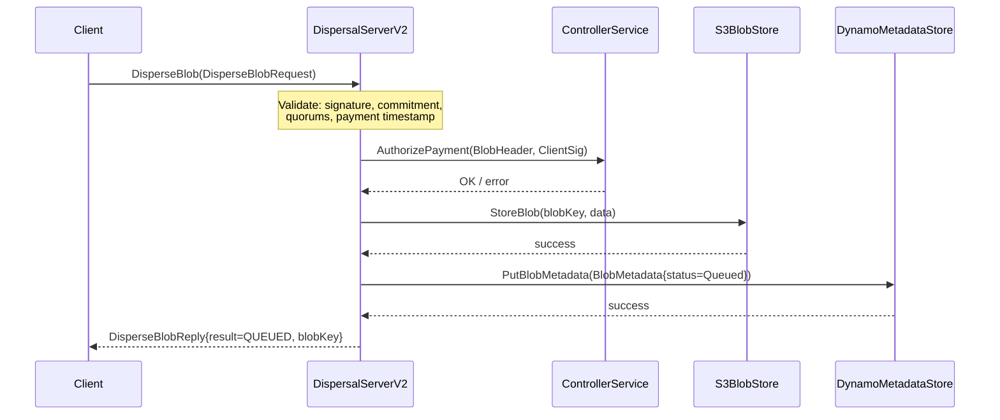
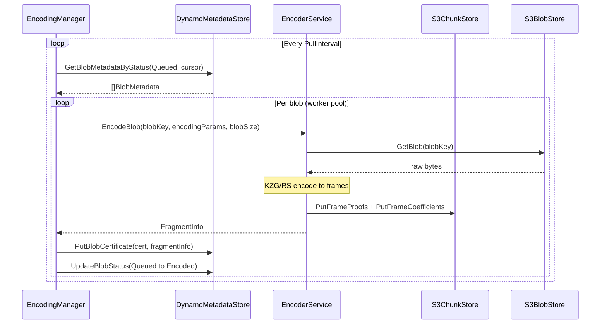
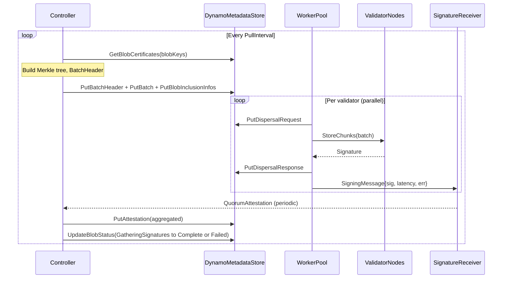
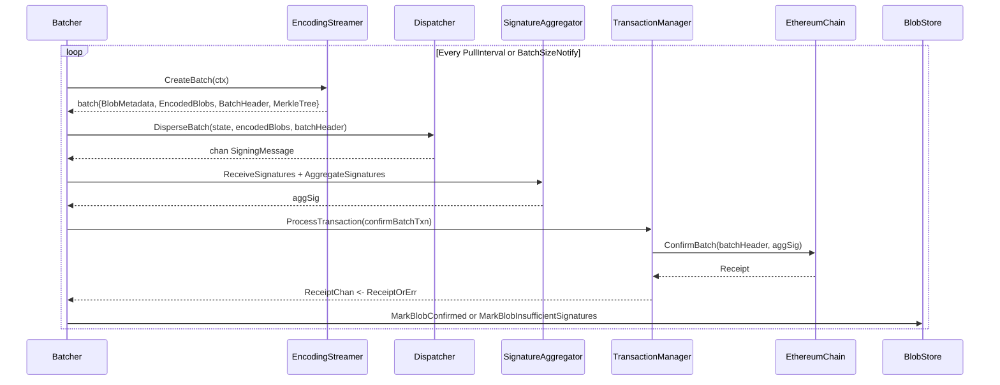
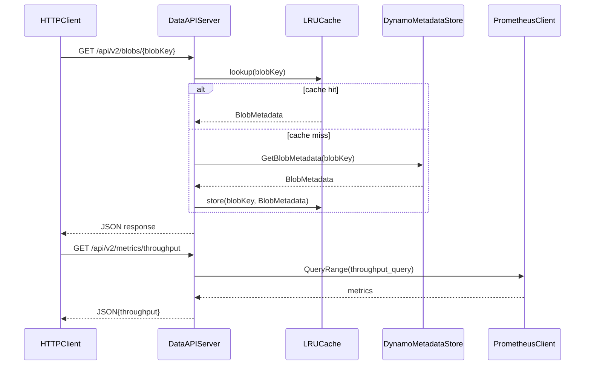

# disperser Analysis

**Analyzed by**: code-analyzer-disperser
**Timestamp**: 2026-04-10T00:00:00Z
**Application Type**: go-module
**Classification**: library
**Location**: disperser/

## Architecture

The disperser library is EigenDA's core data availability dispersal subsystem. It implements two distinct but parallel pipeline generations — a legacy "v1" batcher pipeline and a modern "v2" controller pipeline — that accept blob data from external clients and orchestrate the full lifecycle from ingest through confirmation or failure. The library is organized as a set of independently deployable processes (apiserver, encoder, controller, batcher, dataapi) that communicate through shared AWS infrastructure (S3 for raw blobs, DynamoDB for all metadata) and over internal gRPC interfaces.

The architectural pattern is a pipelined event-driven system with multiple workers polling shared state. In v2, the pipeline flows: DispersalServerV2 (HTTP/gRPC ingest) → S3 + DynamoDB (raw storage) → EncodingManager (pull encoded, call encoder gRPC) → Controller (build batches, send to validator nodes) → signature aggregation → DynamoDB attestation write. Each stage is decoupled: stages communicate by writing/reading blob status in DynamoDB using a state machine (`Queued → Encoded → GatheringSignatures → Complete/Failed`). The legacy v1 pipeline uses a similar state machine (`Processing → Dispersing → Confirmed/Finalized/Failed/InsufficientSignatures`) backed by the same pattern but different storage keys and a Ethereum-transaction-based confirmation flow.

External AWS services are fundamental to both pipelines. Raw blob bytes live in S3 and are accessed only by the encoder. All lifecycle metadata (blob status, batch headers, dispersal requests/responses, attestations, inclusion proofs, account records) are persisted in DynamoDB. This makes the disperser largely stateless in-process, tolerating restarts with a `RecoverState` sweep that resets in-flight blobs back to a safe starting state on startup.

The library exposes its core abstractions as Go interfaces (`BlobStore`, `BlobStoreV2`, `EncoderClient`, `EncoderClientV2`, `Dispatcher`, `MetadataStore`, `NodeClientManager`), which makes it highly testable and dependency-injectable. Prometheus metrics are wired throughout every subsystem. The DataAPI subpackage provides a separate read-only HTTP/REST surface (via Gin) backed by DynamoDB queries, with Swagger documentation auto-generated by swaggo.

## Key Components

- **disperser.BlobStore** (`disperser/disperser.go`): Core v1 interface defining all lifecycle mutation and query operations for blobs. Exposes methods to store blobs, transition them through `Processing/Dispersing/Confirmed/Finalized/Failed/InsufficientSignatures` states, retrieve blobs by status, and handle failure/retry logic. All v1 pipeline components depend on this interface.

- **disperser.BlobStatus / v2.BlobStatus** (`disperser/disperser.go`, `disperser/common/v2/blob.go`): Enums encoding the state machine for blob lifecycle. v1 has six states (`Processing`, `Confirmed`, `Failed`, `Finalized`, `InsufficientSignatures`, `Dispersing`); v2 has five (`Queued`, `Encoded`, `GatheringSignatures`, `Complete`, `Failed`). These values are persisted in DynamoDB and ordering of the iota values must never change for database compatibility.

- **DispersalServerV2** (`disperser/apiserver/server_v2.go`): gRPC server implementing the v2 disperser API (`DisperseBlob`, `GetBlobStatus`, `GetBlobCommitment`, `GetPaymentState`, `GetValidatorSigningRate`). Validates requests including anchor signatures, blob commitments, payment metadata, quorum membership, dispersal timestamp freshness; then stores blobs in S3 and DynamoDB. Communicates with the Controller over gRPC for payment authorization. Uses atomic.Pointer for lock-free onchain state refreshes.

- **EncodingManager** (`disperser/controller/encoding_manager.go`): v2 worker that polls DynamoDB for `Queued` blobs, calls the encoder gRPC service per-blob, creates `BlobCertificate` records, and transitions blobs to `Encoded`. Uses a worker pool for concurrency, a `ReplayGuardian` to prevent double-encoding across restarts, and exponential-backoff retry for encoding failures. Configured with `NumRelayAssignment` for assigning relay keys per blob.

- **Controller** (`disperser/controller/controller.go`): v2 coordinator that runs a polling loop assembling `Encoded` blobs into batches. For each batch it: builds a Merkle tree over blob certificates, stores a `BatchHeader` and `BlobInclusionInfo` records in DynamoDB, fans out `StoreChunks` gRPC calls to every validator node via `NodeClientManager`, collects `SigningMessage` responses through `ReceiveSignatures`, aggregates BLS signatures, and updates final blob statuses. Manages a `BlobDispersalQueue` backed by DynamoDB to acquire blobs.

- **Batcher** (`disperser/batcher/batcher.go`): v1 coordinator that runs a pull-interval loop, calls `EncodingStreamer.CreateBatch`, dispatches encoded blobs to node operators via `Dispatcher.DisperseBatch`, aggregates signatures, and submits on-chain `confirmBatch` transactions through `TransactionManager`. Handles state recovery on startup by scanning blobs in `Dispersing` state and resetting them. Parses `BatchConfirmed` events from Ethereum transaction receipts to retrieve batch IDs.

- **EncoderServerV2** (`disperser/encoder/server_v2.go`): gRPC server providing blob encoding as a service. Accepts `EncodeBlobRequest`, fetches raw blob bytes from S3, converts to field elements, computes KZG/RS frames via `prover.GetFrames`, then stores frame proofs and coefficients to the chunk store (also S3). Uses dual semaphore channels (`concurrencyLimiter` and `backlogLimiter`) for flow control. Returns `FragmentInfo` with symbols-per-frame metadata.

- **BlobMetadataStore** (`disperser/common/v2/blobstore/dynamo_metadata_store.go`): DynamoDB-backed implementation of `MetadataStore`. Maintains multiple DynamoDB secondary indices (StatusIndex, OperatorDispersalIndex, AccountBlobIndex, RequestedAtIndex, AttestedAtIndex) for efficient querying. Implements conditional writes with state-transition preconditions (`statusUpdatePrecondition` map) to prevent invalid state transitions. Stores blob metadata, certificates, batch headers, dispersal requests/responses, attestations, inclusion proofs, and accounts.

- **BlobStore (v2)** (`disperser/common/v2/blobstore/s3_blob_store.go`): Simple S3-backed blob storage for raw blob bytes. Wraps the common S3 client with blob-key scoping. Used by the apiserver to store incoming blobs and by the encoder to retrieve them for processing.

- **NodeClientManager** (`disperser/controller/node_client_manager.go`): LRU-cached manager of `clients.NodeClient` connections to validator nodes. Creates new connections lazily using parsed operator socket addresses. Each client is signed with a `DispersalRequestSigner` to authenticate the disperser. Connection eviction closes the underlying gRPC connection.

- **DataAPI Server (v2)** (`disperser/dataapi/v2/server_v2.go`): Read-only HTTP server (Gin framework) exposing a REST API for observability data: blob feed, batch feed, operator dispersal stats, signing info, throughput metrics, account data, and reservation data. Uses in-memory LRU caches (`hashicorp/golang-lru/v2`) and `expirable` caches to throttle DynamoDB load. Backed by DynamoDB metadata store and Prometheus for metrics.

- **TransactionManager** (`disperser/batcher/txn_manager.go`): v1 component that manages Ethereum transaction submission, monitoring, and gas-price bumping. Receives transaction requests from the Batcher, submits via `eigensdk-go/chainio/clients/wallet`, monitors for receipts, and re-submits with higher gas if a transaction isn't mined within a timeout. Returns results via `ReceiptChan()`.

- **Finalizer** (`disperser/batcher/finalizer.go`): v1 background worker that periodically queries confirmed blobs and checks whether their confirmation block has been finalized on Ethereum. Marks blobs as `Finalized` once finality is confirmed. Handles chain reorganization scenarios by marking blobs as `Failed` if finality is not achieved within retry limits.

## Data Flows

### 1. V2 Blob Dispersal (Ingest to Storage)

**Flow Description**: A client submits a blob via gRPC to the DispersalServerV2, which validates, stores, and queues it for later encoding and dispersal.



**Detailed Steps**:

1. **Request Validation** (Client → DispersalServerV2)
   - Method: `validateDispersalRequest(req, onchainState)`
   - Checks: 65-byte ECDSA signature, non-empty blob, size <= maxNumSymbolsPerBlob, valid quorum numbers, payment metadata, dispersal timestamp within [now-MaxDispersalAge, now+MaxFutureDispersalTime]
   - Verifies KZG commitment matches actual blob data via `committer.GetCommitmentsForPaddedLength`
   - Verifies anchor signature (disperser ID, chain ID, account ID match)

2. **Payment Authorization** (DispersalServerV2 → ControllerService)
   - gRPC call: `controllerClient.AuthorizePayment(ctx, authorizePaymentRequest)`
   - Delegates reservation/on-demand payment validation to the controller service

3. **Blob Storage** (DispersalServerV2 → S3 + DynamoDB)
   - Derives `blobKey` from `blobHeader.BlobKey()`
   - Stores raw bytes to S3 via `blobStore.StoreBlob(ctx, blobKey, data)`
   - Creates `BlobMetadata{BlobStatus: Queued, Expiry, BlobSize, RequestedAt}` in DynamoDB

**Error Paths**:
- Validation failure → `codes.InvalidArgument` gRPC status
- Duplicate blob → `codes.AlreadyExists` (idempotent, blob already queued)
- S3 write failure → `codes.Internal`
- Payment rejection → propagated gRPC status from controller

---

### 2. V2 Encoding Pipeline (Queued → Encoded)

**Flow Description**: EncodingManager polls for Queued blobs, sends them to the encoder gRPC service, and creates BlobCertificates.



**Detailed Steps**:

1. **Blob Pull** (EncodingManager → DynamoDB)
   - Paginated scan: `GetBlobMetadataByStatusPaginated(Queued, cursor, MaxNumBlobsPerIteration)`
   - ReplayGuardian filters out already-seen or stale/future blobs

2. **Encoding Request** (EncodingManager → EncoderService via gRPC)
   - Method: `encodingClient.EncodeBlob(ctx, blobKey, encodingParams, blobSize)`
   - EncoderService fetches blob from S3, computes frames, stores proofs and coefficients to S3/chunk store

3. **Certificate Creation** (EncodingManager → DynamoDB)
   - Creates `BlobCertificate` with relay assignments and fragment info
   - Transitions blob status from `Queued` to `Encoded`

---

### 3. V2 Batch Dispersal and Attestation (Encoded → Complete)

**Flow Description**: Controller assembles a batch, fans out StoreChunks to validators, aggregates BLS signatures, and finalizes blob statuses.



**Detailed Steps**:

1. **Batch Assembly** (Controller.NewBatch)
   - Pulls blobs from `BlobDispersalQueue` (backed by DynamoDB Encoded status index)
   - Fetches blob certificates, builds Merkle tree via `corev2.BuildMerkleTree`
   - Stores `BatchHeader` (with Merkle root), `Batch`, and `BlobInclusionInfo` for each blob

2. **Chunk Dispersal** (Controller.HandleBatch - parallel per validator)
   - `NodeClientManager.GetClient(host, port)` — LRU cached gRPC connection
   - `client.StoreChunks(ctx, batch)` — sends all blob chunks to validator
   - Writes `DispersalRequest` and `DispersalResponse` to DynamoDB

3. **Signature Aggregation** (ReceiveSignatures / HandleSignatures)
   - `ReceiveSignatures` accumulates BLS signatures with tick-based updates
   - `aggregator.AggregateSignatures` computes aggregate BLS sig + non-signer list
   - Writes `Attestation` to DynamoDB periodically

4. **Status Finalization**
   - Blobs passing all quorum thresholds: `UpdateBlobStatus → Complete`
   - Blobs failing any quorum: `UpdateBlobStatus → Failed`

---

### 4. V1 Batch Confirmation (Batcher)

**Flow Description**: The legacy Batcher encodes blobs, dispatches to operators, aggregates signatures, and submits an on-chain confirmBatch transaction.



---

### 5. DataAPI Read Path

**Flow Description**: External clients query the DataAPI HTTP server for observability data about blobs, batches, and operators.



## Dependencies

### External Libraries

- **github.com/aws/aws-sdk-go-v2/service/dynamodb** (v1.31.0) [cloud-sdk]: AWS DynamoDB client for the Go v2 SDK. Used extensively by `BlobMetadataStore` in `disperser/common/v2/blobstore/dynamo_metadata_store.go` to store and query all blob metadata, batch data, attestations, dispersal records, and account information. Also used in v1 blobstore.
  Imported in: `disperser/common/v2/blobstore/dynamo_metadata_store.go`, `disperser/common/blobstore/blob_metadata_store.go`, `disperser/controller/payment_authorization.go`.

- **github.com/aws/aws-sdk-go-v2/service/s3** (v1.53.0) [cloud-sdk]: AWS S3 client for blob storage. Used via `common/s3` wrapper to store raw blob bytes in `BlobStore` and to store/retrieve encoded frame proofs and coefficients in the encoder's chunk store.
  Imported in: `disperser/common/v2/blobstore/s3_blob_store.go`, `disperser/encoder/server_v2.go` (indirectly via relay/chunkstore).

- **github.com/aws/aws-sdk-go-v2/feature/dynamodb/attributevalue** (v1.13.12) [cloud-sdk]: DynamoDB attribute marshalling/unmarshalling for Go structs. Used in `dynamo_metadata_store.go` to serialize and deserialize all DynamoDB record types.
  Imported in: `disperser/common/v2/blobstore/dynamo_metadata_store.go`, `disperser/common/blobstore/blob_metadata_store.go`.

- **github.com/aws/aws-sdk-go-v2/feature/dynamodb/expression** (v1.7.12) [cloud-sdk]: DSL for building DynamoDB filter expressions, key conditions, and update expressions. Used heavily in the metadata store for conditional writes and paginated queries.
  Imported in: `disperser/common/v2/blobstore/dynamo_metadata_store.go`.

- **google.golang.org/grpc** (v1.72.2) [networking]: gRPC framework for all internal service communication. Used by the disperser API server (serving gRPC to clients), encoder client (calling encoder service), controller (calling validator nodes via NodeClient), and dispatcher. Also used for health checks via `grpc_health_v1`.
  Imported in: `disperser/apiserver/server_v2.go`, `disperser/encoder/server_v2.go`, `disperser/encoder/client_v2.go`, `disperser/batcher/grpc/dispatcher.go`, `disperser/controller/controller.go`.

- **github.com/prometheus/client_golang** (v1.21.1) [monitoring]: Prometheus metrics client. Every subpackage (batcher, controller, encoder, apiserver, dataapi) registers counters, gauges, histograms, and summaries for request rates, latency percentiles, blob sizes, attestation timing, and queue depths.
  Imported in: `disperser/metrics.go`, `disperser/batcher/metrics.go`, `disperser/controller/controller_metrics.go`, `disperser/apiserver/metrics_v2.go`, `disperser/encoder/metrics.go`.

- **github.com/grpc-ecosystem/go-grpc-middleware/providers/prometheus** (v1.0.1) [monitoring]: Prometheus interceptors for gRPC servers. Used to automatically record gRPC request counts and latency for the encoder server and dispersal API server.
  Imported in: `disperser/encoder/server_v2.go`, `disperser/apiserver/server_v2.go`.

- **github.com/gin-gonic/gin** (v1.9.1) [web-framework]: HTTP web framework used by the DataAPI servers (both v1 and v2) to expose REST endpoints for blobs, batches, operators, metrics, and signing info.
  Imported in: `disperser/dataapi/server.go`, `disperser/dataapi/v2/server_v2.go`.

- **github.com/gin-contrib/cors** (v1.4.0) [web-framework]: CORS middleware for the Gin-based DataAPI server, enabling cross-origin requests from browser-based explorers.
  Imported in: `disperser/dataapi/server.go`, `disperser/dataapi/v2/server_v2.go`.

- **github.com/swaggo/swag** (v1.16.2) [build-tool]: Swagger/OpenAPI documentation generator. DataAPI exposes auto-generated Swagger UI at `/swagger/*` using the embedded docs in `docs/v1/` and `docs/v2/`.
  Imported in: `disperser/dataapi/server.go`, `disperser/dataapi/v2/server_v2.go`.

- **github.com/hashicorp/golang-lru/v2** (v2.0.7) [other]: LRU cache used by `NodeClientManager` for caching gRPC connections to validator nodes, and by DataAPI v2 for caching blob/batch lookups and account data. Uses `expirable` variant for TTL-based cache expiry.
  Imported in: `disperser/controller/node_client_manager.go`, `disperser/dataapi/v2/server_v2.go`.

- **github.com/gammazero/workerpool** (v1.1.3) [other]: Worker pool for concurrent goroutine management. Used in the v1 Batcher's `EncodingStreamer` to bound the number of concurrent encoding requests.
  Imported in: `disperser/batcher/batcher.go`, `disperser/batcher/encoding_streamer.go`, `disperser/batcher/finalizer.go`.

- **github.com/wealdtech/go-merkletree/v2** (v2.6.0) [crypto]: Merkle tree implementation for generating blob inclusion proofs. Used in the v1 Batcher to build the batch Merkle tree from blob headers and generate per-blob inclusion proofs.
  Imported in: `disperser/batcher/batcher.go`, `disperser/batcher/encoding_streamer.go`.

- **github.com/hashicorp/go-multierror** (v1.1.1) [other]: Multi-error aggregation. Used in `Batcher.handleFailure` and `Controller.updateBatchStatus` to collect and return multiple concurrent errors from blob failure handling.
  Imported in: `disperser/batcher/batcher.go`, `disperser/controller/controller.go`.

- **github.com/ethereum/go-ethereum** (v1.15.3, via op-geth fork) [blockchain]: Ethereum client library. Used in the v1 Batcher for: transaction types (`types.Receipt`, `types.Transaction`), ABI parsing for `BatchConfirmed` event decoding, Ethereum client interface for fetching transaction receipts, and common address/hash types throughout.
  Imported in: `disperser/batcher/batcher.go`, `disperser/batcher/txn_manager.go`, `disperser/apiserver/server_v2.go`.

- **github.com/Layr-Labs/eigensdk-go** (v0.2.0-beta.1) [blockchain]: EigenLayer SDK providing logging interface (`logging.Logger`), wallet/transaction signing (`chainio/clients/wallet`), and chain interaction utilities. The `logging.Logger` interface is used everywhere.
  Imported in: virtually every file in the disperser package.

- **github.com/google/uuid** (v1.6.0) [other]: UUID generation for batch IDs in the v1 confirmation metadata.
  Imported in: `disperser/batcher/batcher.go`.

- **github.com/shurcooL/graphql** (v0.0.0-20230722043721) [networking]: GraphQL client used by DataAPI's `SubgraphClient` to query The Graph for operator data (non-signers, registrations, ejections).
  Imported in: `disperser/dataapi/subgraph_client.go`, `disperser/dataapi/subgraph/api.go`.

- **github.com/urfave/cli** (v1.22.14) [cli]: CLI flag parsing for the command-line entry points (`cmd/apiserver`, `cmd/batcher`, `cmd/controller`, `cmd/encoder`, `cmd/dataapi`).
  Imported in: `disperser/cmd/*/flags/flags.go`, `disperser/cmd/*/main.go`.

- **github.com/minio/minio-go/v7** (v7.0.85) [cloud-sdk]: MinIO/S3-compatible client used in testing infrastructure for local S3 emulation.
  Imported in: test files and `disperser/common/blobstore/shared_storage.go`.

- **github.com/stretchr/testify** (v1.11.1) [testing]: Test assertion library used throughout the test suite.
  Imported in: all `*_test.go` files.

- **github.com/avast/retry-go/v4** (v4.6.0) [other]: Retry helper with configurable backoff, used in encoding manager and other retry logic.
  Imported in: `disperser/controller/encoding_manager.go`.

### Internal Libraries

- **api** (`api/`): Provides gRPC protobuf-generated types and client/server interfaces for all disperser, encoder, node, and controller service protocols. Used by nearly every subpackage to define the communication contracts between disperser components and with external validators.

- **common** (`common/`): Provides shared infrastructure including `EthClient`, `WorkerPool`, `SequenceProbe`, AWS DynamoDB and S3 wrappers, healthcheck heartbeat utilities, and the `BatchConfirmedEventSigHash`/`ServiceManagerAbi` constants. Disperser depends on it for Ethereum interaction, worker pool abstractions, and AWS client factories.

- **core** (`core/`): Defines fundamental EigenDA domain types: `BlobHeader`, `BlobRequestHeader`, `Blob`, `BatchHeader`, `QuorumResult`, `SignatureAggregation`, `IndexedOperatorState`, `AssignmentCoordinator`, `SignatureAggregator`, `Writer` (on-chain transaction interface), `Reader` (on-chain query interface), and `PaymentMetadata`. The disperser's entire business logic is expressed in terms of these types.

- **core/v2** (`core/v2/`): v2 variants of core types: `BlobKey`, `BlobHeader`, `BlobCertificate`, `Batch`, `BatchHeader`, `Attestation`, `BlobInclusionInfo`, `DispersalRequest/Response`, `BlobVersionParameterMap`, and `BuildMerkleTree`. The v2 pipeline uses these types exclusively.

- **encoding** (`encoding/`): Provides `BlobCommitments`, `EncodingParams`, `FragmentInfo`, `Frame`, `BYTES_PER_SYMBOL`, `GetBlobLengthPowerOf2`, `ValidateEncodingParams`, and the v2 KZG prover (`encoding/v2/kzg/prover`). Used by the encoder server to produce cryptographic proofs and by the dispersal server to verify client-submitted commitments.

- **relay** (`relay/`): Provides the `chunkstore.ChunkWriter` interface used by the encoder server to store frame proofs and coefficients. This creates a storage coupling between the encoder (write path) and the relay (read path) for encoded chunk data.

- **operators** (`operators/`): Provides operator registration and state management utilities consumed transitively by the controller's chain state.

- **indexer** (`indexer/`): Provides indexed chain state (`IndexedChainState`) used by both v1 Batcher and v2 Controller to get current operator assignments and quorum state.

## API Surface

### gRPC Endpoints (DispersalServerV2 — `disperser/apiserver/server_v2.go`)

The v2 disperser exposes a gRPC API defined in `api/grpc/disperser/v2`. The server listens on a configurable port with keepalive settings and max receive message size of 300 MiB.

#### DisperseBlob

Accepts a blob for dispersal. Validates the blob, payment, and cryptographic commitments, then stores it in S3 and DynamoDB with `Queued` status.

Example Request:
```protobuf
DisperseBlobRequest {
  blob: <raw bytes, max ~300MiB>,
  blob_header: BlobHeader {
    commitment: BlobCommitment { ... KZG fields ... },
    payment_metadata: PaymentMetadata {
      account_id: "0xabcd...",
      timestamp: 1700000000000000000,  // nanoseconds
      cumulative_payment: <big.Int bytes>
    },
    quorum_numbers: [0, 1],
    version: 0
  },
  signature: <65-byte ECDSA sig>,
  anchor_signature: <65-byte ECDSA sig>,
  disperser_id: 1,
  chain_id: <bytes>
}
```

Example Response (OK):
```protobuf
DisperseBlobReply {
  result: QUEUED,
  blob_key: <32-byte key>
}
```

#### GetBlobStatus

Returns the current lifecycle status of a previously dispersed blob.

Example Request:
```protobuf
BlobStatusRequest { blob_key: <32-byte key> }
```

Example Response:
```protobuf
BlobStatusReply {
  status: COMPLETE,
  blob_verification_info: BlobVerificationInfo { ... }
}
```

#### GetBlobCommitment

Computes KZG commitments for a raw blob (deprecated, being removed).

#### GetPaymentState

Returns on-chain and off-chain payment state for an account (reservation windows, cumulative payments, global rate parameters).

#### GetValidatorSigningRate

Returns the signing rate for a specific validator within a time window.

### HTTP REST Endpoints (DataAPI v2 — `disperser/dataapi/v2/server_v2.go`)

The DataAPI exposes a Gin-based REST API with Swagger documentation at `/swagger/*any`.

- `GET /api/v2/blobs/:blob_key` — Blob metadata and attestation info
- `GET /api/v2/blobs` — Paginated blob feed (by time range)
- `GET /api/v2/batches/:batch_header_hash` — Batch header and attestation
- `GET /api/v2/batches` — Paginated batch feed
- `GET /api/v2/operators-nonsigning` — Operators that did not sign a batch
- `GET /api/v2/operators/:operator_id/dispersals` — Dispersal history for an operator
- `GET /api/v2/metrics/throughput` — Network throughput metrics
- `GET /api/v2/metrics/signing-rate` — Network signing rate over time
- `GET /api/v2/accounts/:account_id` — Account metadata
- `GET /api/v2/reservations/:account_id` — Active reservations for an account

### Exported Go Interfaces

The following interfaces are exported from the root `disperser` package and define the pluggable contract for the disperser subsystem:

```go
// BlobStore defines the v1 blob lifecycle interface
type BlobStore interface {
    StoreBlob(ctx context.Context, blob *core.Blob, requestedAt uint64) (BlobKey, error)
    GetBlobContent(ctx context.Context, blobHash BlobHash) ([]byte, error)
    MarkBlobConfirmed(...) (*BlobMetadata, error)
    MarkBlobDispersing(ctx context.Context, blobKey BlobKey) error
    // ...12 more methods for status transitions and queries
}

// Dispatcher defines the interface for sending encoded blobs to operators
type Dispatcher interface {
    DisperseBatch(context.Context, *core.IndexedOperatorState,
        []core.EncodedBlob, *core.BatchHeader) chan core.SigningMessage
}

// EncoderClient defines the v1 encoding interface
type EncoderClient interface {
    EncodeBlob(ctx context.Context, data []byte,
        encodingParams encoding.EncodingParams) (*encoding.BlobCommitments, *core.ChunksData, error)
}

// EncoderClientV2 defines the v2 encoding interface
type EncoderClientV2 interface {
    EncodeBlob(ctx context.Context, blobKey corev2.BlobKey,
        encodingParams encoding.EncodingParams, blobSize uint64) (*encoding.FragmentInfo, error)
}
```

The `blobstore.MetadataStore` interface (`disperser/common/v2/blobstore/metadata_store.go`) is the v2 central data access contract, with approximately 25 methods covering blob metadata CRUD, batch operations, dispersal records, attestations, inclusion info, and account management.

## Code Examples

### Example 1: Blob Status State Machine (v1)

```go
// disperser/disperser.go
type BlobStatus uint

const (
    Processing BlobStatus = iota // Intermediate: being processed
    Confirmed                     // Intermediate: confirmed onchain
    Failed                        // Terminal: permanent failure
    Finalized                     // Terminal: block finalized
    InsufficientSignatures        // Terminal: not enough signatures
    Dispersing                    // Intermediate: being dispersed
)
```

### Example 2: Controller Batch Assembly with Merkle Tree

```go
// disperser/controller/controller.go (lines 572-585)
batchHeader := &corev2.BatchHeader{
    BatchRoot:            [32]byte{},
    ReferenceBlockNumber: referenceBlockNumber,
}

tree, err := corev2.BuildMerkleTree(certs)
if err != nil {
    return nil, fmt.Errorf("failed to build merkle tree: %w", err)
}
copy(batchHeader.BatchRoot[:], tree.Root())
```

### Example 3: Dispersal Timestamp Validation

```go
// disperser/apiserver/disperse_blob_v2.go (lines 344-376)
func (s *DispersalServerV2) validateDispersalTimestamp(blobHeader *corev2.BlobHeader) error {
    dispersalTime := time.Unix(0, blobHeader.PaymentMetadata.Timestamp)
    dispersalAge := s.getNow().Sub(dispersalTime)

    if dispersalAge > s.MaxDispersalAge {
        return fmt.Errorf("potential clock drift detected: dispersal timestamp is too old. "+
            "age=%v, max_age=%v ...", dispersalAge, s.MaxDispersalAge)
    }
    if dispersalAge < -s.MaxFutureDispersalTime {
        return fmt.Errorf("potential clock drift detected: dispersal timestamp is too far in the future...")
    }
    return nil
}
```

### Example 4: DynamoDB Status Transition Preconditions

```go
// disperser/common/v2/blobstore/dynamo_metadata_store.go (lines 67-73)
var statusUpdatePrecondition = map[v2.BlobStatus][]v2.BlobStatus{
    v2.Queued:              {},
    v2.Encoded:             {v2.Queued},
    v2.GatheringSignatures: {v2.Encoded},
    v2.Complete:            {v2.GatheringSignatures},
    v2.Failed:              {v2.Queued, v2.Encoded, v2.GatheringSignatures},
}
```

### Example 5: Dual Semaphore Flow Control in EncoderServerV2

```go
// disperser/encoder/server_v2.go (lines 107-143)
func (s *EncoderServerV2) EncodeBlob(ctx context.Context, req *pb.EncodeBlobRequest) (*pb.EncodeBlobReply, error) {
    // If we have too large of a backlog, refuse to accept new work.
    err = s.pushBacklogLimiter(blobSize)    // channel of capacity RequestQueueSize
    if err != nil {
        return nil, err  // ResourceExhausted immediately
    }
    defer s.popBacklogLimiter(blobSize)

    // Limit the number of concurrent requests.
    err = s.pushConcurrencyLimiter(ctx, blobSize)  // channel of capacity MaxConcurrentRequests
    if err != nil {
        return nil, err  // Canceled if ctx times out while waiting
    }
    defer s.popConcurrencyLimiter()
    // ...
}
```

### Example 6: BLS Signature Attestation Check in v1 Batcher

```go
// disperser/batcher/batcher.go (lines 753-763)
func isBlobAttested(signedQuorums map[core.QuorumID]*core.QuorumResult, header *core.BlobHeader) bool {
    for _, quorum := range header.QuorumInfos {
        if _, ok := signedQuorums[quorum.QuorumID]; !ok {
            return false
        }
        if signedQuorums[quorum.QuorumID].PercentSigned < quorum.ConfirmationThreshold {
            return false
        }
    }
    return true
}
```

## Files Analyzed

- `disperser/disperser.go` (247 lines) - Core v1 interfaces, BlobStatus enum, BlobMetadata, BlobStore interface
- `disperser/encoder_client.go` (12 lines) - v1 EncoderClient interface
- `disperser/encoder_client_v2.go` (12 lines) - v2 EncoderClientV2 interface
- `disperser/metrics.go` (288 lines) - Disperser-level Prometheus metrics
- `disperser/apiserver/server_v2.go` (526 lines) - v2 gRPC dispersal server
- `disperser/apiserver/disperse_blob_v2.go` (398 lines) - v2 DisperseBlob implementation
- `disperser/batcher/batcher.go` (775 lines) - v1 Batcher coordinator
- `disperser/batcher/encoding_streamer.go` (80 lines read) - v1 encoding streamer
- `disperser/batcher/txn_manager.go` (60 lines read) - v1 transaction manager
- `disperser/batcher/finalizer.go` (60 lines read) - v1 blob finalization
- `disperser/batcher/grpc/dispatcher.go` (60 lines) - v1 gRPC dispatcher
- `disperser/controller/controller.go` (832 lines) - v2 Controller
- `disperser/controller/encoding_manager.go` (200 lines read) - v2 EncodingManager
- `disperser/controller/node_client_manager.go` (60 lines) - Validator node LRU client cache
- `disperser/controller/signature_receiver.go` (80 lines read) - v2 signature collection
- `disperser/controller/recover_state.go` (47 lines) - v2 startup state recovery
- `disperser/controller/payment_authorization.go` (50 lines) - Payment authorization config
- `disperser/common/v2/blob.go` (89 lines) - v2 BlobStatus enum and BlobMetadata
- `disperser/common/v2/blobstore/metadata_store.go` (150 lines) - MetadataStore interface
- `disperser/common/v2/blobstore/dynamo_metadata_store.go` (80 lines read) - DynamoDB implementation
- `disperser/common/v2/blobstore/s3_blob_store.go` (53 lines) - S3 blob store
- `disperser/encoder/server_v2.go` (341 lines) - v2 encoder gRPC server
- `disperser/encoder/client_v2.go` (66 lines) - v2 encoder gRPC client
- `disperser/dataapi/server.go` (80 lines read) - v1 DataAPI HTTP server
- `disperser/dataapi/v2/server_v2.go` (80 lines read) - v2 DataAPI HTTP server
- `go.mod` (220+ lines) - Module dependencies

## Analysis Data

```json
{
  "summary": "The disperser library is EigenDA's core data availability dispersal subsystem, implementing two parallel pipeline generations (v1 batcher and v2 controller) that accept blob data from clients via gRPC and orchestrate the full lifecycle from ingest through encoding, dispersal to validator nodes, BLS signature aggregation, and final status confirmation. The library uses AWS S3 for raw blob storage and DynamoDB for all metadata with a strict state machine, and exposes gRPC and HTTP APIs for dispersal, status queries, and observability.",
  "architecture_pattern": "event-driven pipelined with shared AWS state (S3 + DynamoDB)",
  "key_modules": [
    "disperser (root) — core v1 interfaces: BlobStore, Dispatcher, EncoderClient, BlobStatus enum",
    "apiserver — DispersalServerV2 gRPC ingest server with payment authorization",
    "encoder — EncoderServerV2 gRPC service performing KZG/RS encoding",
    "batcher — v1 Batcher coordinator with on-chain transaction confirmation",
    "controller — v2 Controller for batching, validator dispersal, and BLS attestation",
    "common/v2/blobstore — BlobMetadataStore (DynamoDB) and BlobStore (S3) implementations",
    "dataapi/v2 — read-only HTTP REST observability API (Gin + Swagger)"
  ],
  "api_endpoints": [
    "gRPC DisperseBlob — accept and queue a new blob for dispersal",
    "gRPC GetBlobStatus — query lifecycle status by blob key",
    "gRPC GetBlobCommitment — compute KZG commitment for a blob (deprecated)",
    "gRPC GetPaymentState — query reservation and on-demand payment state for an account",
    "gRPC GetValidatorSigningRate — query signing rate for a validator over a time range",
    "HTTP GET /api/v2/blobs/:blob_key — blob metadata and attestation info",
    "HTTP GET /api/v2/blobs — paginated blob feed",
    "HTTP GET /api/v2/batches — paginated batch feed",
    "HTTP GET /api/v2/operators-nonsigning — non-signing operators for a batch",
    "HTTP GET /api/v2/metrics/throughput — network throughput",
    "HTTP GET /api/v2/metrics/signing-rate — network signing rate"
  ],
  "data_flows": [
    "V2 ingest: gRPC → validate+authenticate → S3 store blob → DynamoDB put Queued metadata",
    "V2 encoding: DynamoDB poll Queued → gRPC call encoder → KZG frames → S3 chunk store → DynamoDB put Encoded+Certificate",
    "V2 dispersal: DynamoDB poll Encoded → build Merkle tree → parallel StoreChunks to validators → BLS signature aggregation → DynamoDB put attestation → status Complete/Failed",
    "V1 batcher: EncodingStreamer → Dispatcher → SignatureAggregator → on-chain confirmBatch transaction → parse BatchConfirmed event → MarkBlobConfirmed",
    "DataAPI read: HTTP request → LRU cache lookup → DynamoDB query → JSON response"
  ],
  "tech_stack": [
    "go",
    "grpc",
    "aws-dynamodb",
    "aws-s3",
    "prometheus",
    "gin",
    "ethereum",
    "bls-crypto",
    "kzg-cryptography"
  ],
  "external_integrations": [
    "AWS DynamoDB — all blob and batch metadata persistence",
    "AWS S3 — raw blob bytes and encoded chunk storage",
    "Ethereum / op-geth — v1 on-chain batch confirmation and event parsing",
    "Prometheus — metrics scraping endpoint",
    "The Graph (GraphQL) — operator data queries in DataAPI",
    "EigenLayer contracts — quorum state, payment state, operator registration"
  ],
  "component_interactions": [
    "disperser/apiserver → disperser/controller (gRPC AuthorizePayment)",
    "disperser/controller/encoding_manager → disperser/encoder (gRPC EncodeBlob)",
    "disperser/controller → validator nodes (gRPC StoreChunks via api/clients/v2.NodeClient)",
    "disperser/batcher → disperser/batcher/grpc/dispatcher → operator nodes (gRPC StoreChunks v1)",
    "disperser/batcher → Ethereum (on-chain confirmBatch transactions)",
    "disperser/dataapi → disperser/common/v2/blobstore (DynamoDB queries)",
    "disperser/encoder → relay/chunkstore (S3 chunk write interface)"
  ]
}
```

## Citations

```json
[
  {
    "file_path": "disperser/disperser.go",
    "start_line": 30,
    "end_line": 57,
    "claim": "BlobStatus is a uint enum with six values; iota ordering must never change for database compatibility",
    "section": "Architecture",
    "snippet": "type BlobStatus uint\n\nconst (\n    Processing BlobStatus = iota\n    Confirmed\n    Failed\n    Finalized\n    InsufficientSignatures\n    Dispersing\n)"
  },
  {
    "file_path": "disperser/disperser.go",
    "start_line": 33,
    "end_line": 33,
    "claim": "WARNING comment in source code: enum values are part of persistent system state and ordering must not change",
    "section": "Architecture",
    "snippet": "// WARNING: THESE VALUES BECOME PART OF PERSISTENT SYSTEM STATE;"
  },
  {
    "file_path": "disperser/disperser.go",
    "start_line": 171,
    "end_line": 214,
    "claim": "BlobStore is the core v1 interface exposing all blob lifecycle mutation and query operations",
    "section": "Key Components",
    "snippet": "type BlobStore interface {\n    StoreBlob(ctx context.Context, blob *core.Blob, requestedAt uint64) (BlobKey, error)\n    // ...13 total methods for blob lifecycle\n}"
  },
  {
    "file_path": "disperser/disperser.go",
    "start_line": 216,
    "end_line": 218,
    "claim": "Dispatcher interface defines the contract for sending encoded blobs to operators",
    "section": "Key Components",
    "snippet": "type Dispatcher interface {\n    DisperseBatch(context.Context, *core.IndexedOperatorState, []core.EncodedBlob, *core.BatchHeader) chan core.SigningMessage\n}"
  },
  {
    "file_path": "disperser/common/v2/blob.go",
    "start_line": 10,
    "end_line": 18,
    "claim": "v2 BlobStatus has five states: Queued, Encoded, GatheringSignatures, Complete, Failed",
    "section": "Key Components",
    "snippet": "const (\n    Queued BlobStatus = iota\n    Encoded\n    GatheringSignatures\n    Complete\n    Failed\n)"
  },
  {
    "file_path": "disperser/common/v2/blobstore/dynamo_metadata_store.go",
    "start_line": 67,
    "end_line": 74,
    "claim": "DynamoDB metadata store enforces state machine preconditions via a map of valid predecessor states",
    "section": "Key Components",
    "snippet": "var statusUpdatePrecondition = map[v2.BlobStatus][]v2.BlobStatus{\n    v2.Queued: {},\n    v2.Encoded: {v2.Queued},\n    v2.GatheringSignatures: {v2.Encoded},\n    v2.Complete: {v2.GatheringSignatures},\n    v2.Failed: {v2.Queued, v2.Encoded, v2.GatheringSignatures},\n}"
  },
  {
    "file_path": "disperser/common/v2/blobstore/dynamo_metadata_store.go",
    "start_line": 28,
    "end_line": 50,
    "claim": "BlobMetadataStore maintains multiple DynamoDB secondary indices for efficient querying",
    "section": "Key Components",
    "snippet": "const (\n    StatusIndexName = \"StatusIndex\"\n    OperatorDispersalIndexName = \"OperatorDispersalIndex\"\n    RequestedAtIndexName = \"RequestedAtIndex\"\n    AttestedAtIndexName = \"AttestedAtAIndex\"\n    AccountBlobIndexName = \"AccountBlobIndex\"\n)"
  },
  {
    "file_path": "disperser/common/v2/blobstore/s3_blob_store.go",
    "start_line": 12,
    "end_line": 24,
    "claim": "BlobStore wraps an S3 client with a bucket name, logging, and blob-key scoping",
    "section": "Key Components",
    "snippet": "type BlobStore struct {\n    bucketName string\n    s3Client   s3common.S3Client\n    logger     logging.Logger\n}"
  },
  {
    "file_path": "disperser/apiserver/server_v2.go",
    "start_line": 48,
    "end_line": 106,
    "claim": "DispersalServerV2 holds atomic.Pointer for lock-free onchain state refreshes and connects to the controller via gRPC",
    "section": "Key Components",
    "snippet": "type DispersalServerV2 struct {\n    onchainState atomic.Pointer[OnchainState]\n    controllerConnection *grpc.ClientConn\n    controllerClient controller.ControllerServiceClient\n}"
  },
  {
    "file_path": "disperser/apiserver/server_v2.go",
    "start_line": 229,
    "end_line": 230,
    "claim": "gRPC server is configured with a 300 MiB max receive message size",
    "section": "API Surface",
    "snippet": "opt := grpc.MaxRecvMsgSize(1024 * 1024 * 300) // 300 MiB"
  },
  {
    "file_path": "disperser/apiserver/disperse_blob_v2.go",
    "start_line": 63,
    "end_line": 68,
    "claim": "DisperseBlob calls the controller gRPC service for payment authorization before storing the blob",
    "section": "Data Flows",
    "snippet": "authorizePaymentRequest := &controller.AuthorizePaymentRequest{\n    BlobHeader: req.GetBlobHeader(),\n    ClientSignature: req.GetSignature(),\n}\n_, err = s.controllerClient.AuthorizePayment(ctx, authorizePaymentRequest)"
  },
  {
    "file_path": "disperser/apiserver/disperse_blob_v2.go",
    "start_line": 85,
    "end_line": 110,
    "claim": "After authorization, DisperseBlob stores to S3 and DynamoDB and returns the blob key with QUEUED status",
    "section": "Data Flows",
    "snippet": "blobKey, st := s.StoreBlob(ctx, blob, blobHeader, req.GetSignature(), time.Now(), onchainState.TTL)\n// ...\nreturn &pb.DisperseBlobReply{\n    Result:  dispv2.Queued.ToProfobuf(),\n    BlobKey: blobKey[:],\n}, status.New(codes.OK, \"blob dispersal request accepted\")"
  },
  {
    "file_path": "disperser/apiserver/disperse_blob_v2.go",
    "start_line": 344,
    "end_line": 376,
    "claim": "Dispersal timestamp is validated against configurable MaxDispersalAge and MaxFutureDispersalTime bounds",
    "section": "Data Flows",
    "snippet": "if dispersalAge > s.MaxDispersalAge {\n    return fmt.Errorf(\"potential clock drift detected: dispersal timestamp is too old...\")\n}\nif dispersalAge < -s.MaxFutureDispersalTime {\n    return fmt.Errorf(\"potential clock drift detected: dispersal timestamp is too far in the future...\")\n}"
  },
  {
    "file_path": "disperser/controller/controller.go",
    "start_line": 572,
    "end_line": 584,
    "claim": "Controller builds a Merkle tree from blob certificates and sets the BatchHeader.BatchRoot",
    "section": "Data Flows",
    "snippet": "tree, err := corev2.BuildMerkleTree(certs)\nif err != nil {\n    return nil, fmt.Errorf(\"failed to build merkle tree: %w\", err)\n}\ncopy(batchHeader.BatchRoot[:], tree.Root())"
  },
  {
    "file_path": "disperser/controller/controller.go",
    "start_line": 183,
    "end_line": 213,
    "claim": "HandleBatch fans out StoreChunks gRPC calls to every validator node in parallel via a worker pool",
    "section": "Data Flows",
    "snippet": "for validatorId, validatorInfo := range batchData.OperatorState.IndexedOperators {\n    c.pool.Submit(func() {\n        signature, latency, err := c.sendChunksToValidator(...)\n        signingResponseChan <- core.SigningMessage{...}\n    })\n}"
  },
  {
    "file_path": "disperser/controller/controller.go",
    "start_line": 720,
    "end_line": 738,
    "claim": "sendChunks calls client.StoreChunks with an attestation timeout context",
    "section": "Data Flows",
    "snippet": "func (c *Controller) sendChunks(ctx context.Context, client clients.NodeClient, batch *corev2.Batch) (*core.Signature, error) {\n    ctxWithTimeout, cancel := context.WithTimeout(ctx, c.AttestationTimeout)\n    defer cancel()\n    sig, err := client.StoreChunks(ctxWithTimeout, batch)\n}"
  },
  {
    "file_path": "disperser/controller/controller.go",
    "start_line": 29,
    "end_line": 51,
    "claim": "Controller struct holds blobMetadataStore, pool, chainState, aggregator, nodeClientManager, signingRateTracker, and blobDispersalQueue",
    "section": "Key Components",
    "snippet": "type Controller struct {\n    blobMetadataStore blobstore.MetadataStore\n    pool              common.WorkerPool\n    chainState        core.IndexedChainState\n    aggregator        core.SignatureAggregator\n    nodeClientManager NodeClientManager\n    signingRateTracker signingrate.SigningRateTracker\n    blobDispersalQueue BlobDispersalQueue\n}"
  },
  {
    "file_path": "disperser/controller/recover_state.go",
    "start_line": 12,
    "end_line": 47,
    "claim": "RecoverState scans blobs in GatheringSignatures state on startup and marks them all as Failed",
    "section": "Architecture",
    "snippet": "func RecoverState(ctx context.Context, blobStore blobstore.MetadataStore, logger logging.Logger) error {\n    // ...get blobs in GatheringSignatures state and mark all as Failed\n}"
  },
  {
    "file_path": "disperser/batcher/batcher.go",
    "start_line": 164,
    "end_line": 194,
    "claim": "v1 Batcher.RecoverState resets Dispersing blobs: expired ones go to Failed, unexpired to Processing",
    "section": "Key Components",
    "snippet": "metas, _ := b.Queue.GetBlobMetadataByStatus(ctx, disperser.Dispersing)\nfor _, meta := range metas {\n    if meta.Expiry == 0 || meta.Expiry < uint64(time.Now().Unix()) {\n        b.Queue.MarkBlobFailed(ctx, meta.GetBlobKey())\n    } else {\n        b.Queue.MarkBlobProcessing(ctx, meta.GetBlobKey())\n    }\n}"
  },
  {
    "file_path": "disperser/batcher/batcher.go",
    "start_line": 753,
    "end_line": 763,
    "claim": "isBlobAttested checks that every quorum a blob participates in has met its ConfirmationThreshold signing percentage",
    "section": "Data Flows",
    "snippet": "func isBlobAttested(signedQuorums map[core.QuorumID]*core.QuorumResult, header *core.BlobHeader) bool {\n    for _, quorum := range header.QuorumInfos {\n        if signedQuorums[quorum.QuorumID].PercentSigned < quorum.ConfirmationThreshold {\n            return false\n        }\n    }\n    return true\n}"
  },
  {
    "file_path": "disperser/batcher/batcher.go",
    "start_line": 494,
    "end_line": 522,
    "claim": "HandleSingleBatch orchestrates v1 batch creation, dispersal, signature aggregation, and on-chain confirmation",
    "section": "Data Flows",
    "snippet": "batch, err := b.EncodingStreamer.CreateBatch(ctx)\nupdate := b.Dispatcher.DisperseBatch(attestationCtx, batch.State, batch.EncodedBlobs, batch.BatchHeader)\nquorumAttestation, err := b.Aggregator.ReceiveSignatures(ctx, attestationCtx, ...)\ntxn, err := b.Transactor.BuildConfirmBatchTxn(ctx, batch.BatchHeader, aggSig.QuorumResults, aggSig)\nb.TransactionManager.ProcessTransaction(ctx, NewTxnRequest(txn, ...))"
  },
  {
    "file_path": "disperser/encoder/server_v2.go",
    "start_line": 30,
    "end_line": 53,
    "claim": "EncoderServerV2 uses a dual-semaphore design: backlogLimiter (queue capacity) and concurrencyLimiter (parallel workers)",
    "section": "Key Components",
    "snippet": "concurrencyLimiter chan struct{} // limits parallel execution\nbacklogLimiter chan struct{}     // limits queue depth; reject immediately when full"
  },
  {
    "file_path": "disperser/encoder/server_v2.go",
    "start_line": 145,
    "end_line": 188,
    "claim": "EncoderServerV2.handleEncodingToChunkStore fetches blob from S3, converts to field elements, calls prover.GetFrames, then stores proofs and coefficients",
    "section": "Data Flows",
    "snippet": "data, err := s.blobStore.GetBlob(ctx, blobKey)\ndataFr, err := rs.ToFrArray(data)\nframes, _, err := s.prover.GetFrames(ctx, dataFr, encodingParams)\nreturn s.processAndStoreResults(ctx, blobKey, frames)"
  },
  {
    "file_path": "disperser/encoder/client_v2.go",
    "start_line": 20,
    "end_line": 65,
    "claim": "EncoderClientV2 dials the encoder gRPC service per-request (no persistent connection) and returns FragmentInfo",
    "section": "Key Components",
    "snippet": "conn, err := grpc.NewClient(c.addr, grpc.WithTransportCredentials(insecure.NewCredentials()))\ndefer core.CloseLogOnError(conn, ...)\nclient := pb.NewEncoderClient(conn)\nreply, err := client.EncodeBlob(ctx, req)\nreturn &encoding.FragmentInfo{SymbolsPerFrame: reply.GetFragmentInfo().GetSymbolsPerFrame()}, nil"
  },
  {
    "file_path": "disperser/controller/node_client_manager.go",
    "start_line": 11,
    "end_line": 13,
    "claim": "NodeClientManager interface defines GetClient(host, port) returning a clients.NodeClient",
    "section": "Key Components",
    "snippet": "type NodeClientManager interface {\n    GetClient(host, port string) (clients.NodeClient, error)\n}"
  },
  {
    "file_path": "disperser/controller/node_client_manager.go",
    "start_line": 15,
    "end_line": 21,
    "claim": "nodeClientManager uses an LRU cache keyed by socket address with connection closing on eviction",
    "section": "Key Components",
    "snippet": "type nodeClientManager struct {\n    nodeClients   *lru.Cache[string, clients.NodeClient]\n    requestSigner clients.DispersalRequestSigner\n    disperserID   uint32\n}"
  },
  {
    "file_path": "disperser/common/v2/blobstore/metadata_store.go",
    "start_line": 34,
    "end_line": 80,
    "claim": "MetadataStore interface has approximately 25 methods covering blob metadata CRUD, batch ops, dispersal records, attestations, inclusion info, and accounts",
    "section": "API Surface",
    "snippet": "type MetadataStore interface {\n    CheckBlobExists(...) (bool, error)\n    GetBlobMetadata(...) (*v2.BlobMetadata, error)\n    PutBlobMetadata(...) error\n    UpdateBlobStatus(...) error\n    // ... batch, dispersal, attestation, inclusion, account methods\n}"
  },
  {
    "file_path": "disperser/metrics.go",
    "start_line": 22,
    "end_line": 33,
    "claim": "Root Metrics struct exposes NumBlobRequests, NumRpcRequests, BlobSize, BlobLatency, and Latency summary vectors",
    "section": "Key Components",
    "snippet": "type Metrics struct {\n    NumBlobRequests *prometheus.CounterVec\n    NumRpcRequests  *prometheus.CounterVec\n    BlobSize        *prometheus.GaugeVec\n    BlobLatency     *prometheus.GaugeVec\n    Latency         *prometheus.SummaryVec\n}"
  },
  {
    "file_path": "disperser/batcher/txn_manager.go",
    "start_line": 29,
    "end_line": 37,
    "claim": "TxnManager interface handles Ethereum transaction submission, monitoring, and receipt delivery",
    "section": "Key Components",
    "snippet": "type TxnManager interface {\n    Start(ctx context.Context)\n    ProcessTransaction(ctx context.Context, req *TxnRequest) error\n    ReceiptChan() chan *ReceiptOrErr\n}"
  },
  {
    "file_path": "disperser/batcher/finalizer.go",
    "start_line": 24,
    "end_line": 27,
    "claim": "Finalizer interface provides Start and FinalizeBlobs methods for periodic finalization of confirmed blobs",
    "section": "Key Components",
    "snippet": "type Finalizer interface {\n    Start(ctx context.Context)\n    FinalizeBlobs(ctx context.Context) error\n}"
  },
  {
    "file_path": "disperser/controller/encoding_manager.go",
    "start_line": 131,
    "end_line": 155,
    "claim": "EncodingManager holds blobMetadataStore, pool, encodingClient, chainReader, and replayGuardian",
    "section": "Key Components",
    "snippet": "type EncodingManager struct {\n    blobMetadataStore blobstore.MetadataStore\n    pool              common.WorkerPool\n    encodingClient    disperser.EncoderClientV2\n    chainReader       core.Reader\n    replayGuardian    replay.ReplayGuardian\n}"
  },
  {
    "file_path": "go.mod",
    "start_line": 27,
    "end_line": 66,
    "claim": "Module requires AWS SDK v2 (DynamoDB, S3), gRPC, Prometheus, Gin, Ethereum, and eigensdk-go as primary dependencies",
    "section": "Dependencies",
    "snippet": "require (\n    github.com/aws/aws-sdk-go-v2 v1.26.1\n    github.com/prometheus/client_golang v1.21.1\n    google.golang.org/grpc v1.72.2\n    github.com/gin-gonic/gin v1.9.1\n    github.com/ethereum/go-ethereum v1.15.3\n)"
  }
]
```

## Analysis Notes

### Security Considerations

1. **Request Authentication**: All v2 dispersal requests require a 65-byte ECDSA signature from the account that owns the dispersal. Additionally, an optional `anchor_signature` ties the request to a specific disperser ID and chain ID, preventing replay across dispersers or chains. The `blobRequestAuthenticator.AuthenticateBlobRequest` call validates the account signature over the blob header.

2. **Payment Authorization**: On-demand and reservation-based payment validation is delegated to the Controller gRPC service, which independently validates payment state against on-chain data. The API server uses the result to gate dispersal, preventing unauthorized data availability usage.

3. **Commitment Verification**: The dispersal server re-computes KZG commitments for every incoming blob and verifies they match the client-submitted commitments. This prevents clients from submitting inconsistent commitments that could corrupt verification downstream.

4. **Dispersal Timestamp Bounds**: Timestamps are bounded to prevent clock-drift attacks and replay attacks. Blobs with timestamps too old (`MaxDispersalAge`) or too far in the future (`MaxFutureDispersalTime`) are rejected.

5. **State Transition Guards**: DynamoDB conditional writes enforce state machine transitions, preventing out-of-order or duplicate state updates even under concurrent writes or partial failures.

6. **Unencrypted Internal Transport**: The encoder client (`encoder/client_v2.go`) uses `insecure.NewCredentials()` for its gRPC connection. This is appropriate only when communication occurs over a secured internal network segment.

### Performance Characteristics

- **Concurrency**: v2 Controller uses a configurable `WorkerPool` for parallel validator dispersal (default 250 concurrent requests per `EncodingManagerConfig.NumConcurrentRequests`). The encoder server uses dual semaphores to separately bound queue depth and parallelism.
- **LRU Caches**: `NodeClientManager` caches gRPC connections to validators to avoid per-batch connection overhead. DataAPI v2 uses multiple LRU caches with configurable TTLs to reduce DynamoDB read costs.
- **Batching**: Both pipelines batch multiple blobs per cycle to amortize the fixed per-batch cost (Merkle tree construction, DynamoDB batch writes, Ethereum transaction overhead in v1).
- **Encoding Throughput**: The encoder's backlog limiter provides immediate rejection under load rather than unbounded queue growth, trading some request acceptance for predictable latency.

### Scalability Notes

- **Shared-Nothing Coordination via AWS**: Processes communicate only through DynamoDB and S3, making horizontal scaling of stateless workers feasible. However, the Controller's `BlobDispersalQueue` is expected to have a single consumer, so Controller scaling would require blob partitioning.
- **DynamoDB Capacity**: The metadata store relies heavily on DynamoDB secondary indices and conditional writes. The time-bucketed `RequestedAt` partitioning (1-hour buckets, ~360,000 blobs at 100 blobs/s) limits hot partition issues for feed queries.
- **v1 vs v2 Throughput**: The v1 pipeline has a hard dependency on Ethereum transaction confirmation latency (~12 seconds per block), whereas v2 decouples confirmation from Ethereum entirely, making it significantly more scalable for high-throughput use cases.
- **Relay Assignment**: The `NumRelayAssignment` parameter determines how many relays store each blob's encoded chunks. Increasing this improves data availability redundancy at the cost of additional encoding storage.
