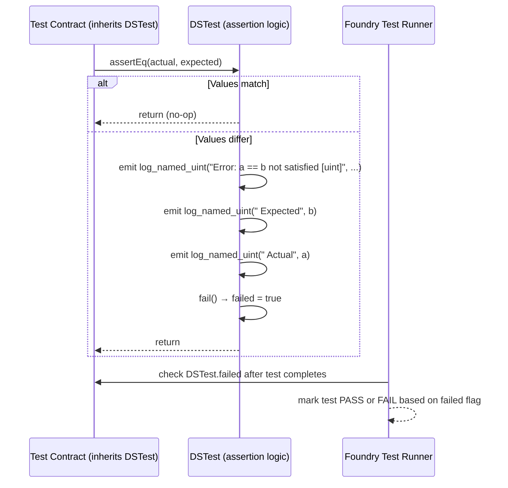
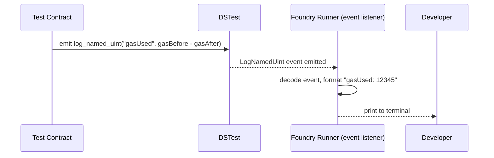

# ds-test Analysis

**Analyzed by**: code-library-analyzer
**Timestamp**: 2026-04-08T09:44:02Z
**Application Type**: javascript-package (Solidity library, npm-distributed)
**Classification**: library
**Location**: `contracts/lib/eigenlayer-middleware/lib/eigenlayer-contracts/lib/ds-test`

Additional copies reside at:
- `contracts/lib/eigenlayer-middleware/lib/eigenlayer-contracts/lib/forge-std/lib/ds-test`
- `contracts/lib/eigenlayer-middleware/lib/eigenlayer-contracts/lib/openzeppelin-contracts-upgradeable-v4.9.0/lib/forge-std/lib/ds-test`
- `contracts/lib/eigenlayer-middleware/lib/eigenlayer-contracts/lib/openzeppelin-contracts-v4.9.0/lib/forge-std/lib/ds-test`

## Architecture

ds-test is a minimalist Solidity testing library developed by DappSys (dapp.tools ecosystem). It is the historical predecessor to forge-std's assertion layer and provides the foundational `DSTest` contract that forge-std extends. The entire library is a single abstract contract (`src/test.sol`) containing approximately 200 lines of Solidity.

The design philosophy is radical minimalism: no external dependencies, no compiler magic beyond what Solidity provides natively, and a single file delivery. All test feedback is communicated through Solidity events (the `log_*` family of events), which Foundry's test runner captures and interprets to produce human-readable test output. Assertions internally emit these events when they fail and then call `fail()`, which sets a boolean flag that the test runner checks after execution completes.

The library predates Foundry and was originally designed for dapp.tools. Foundry maintains backward compatibility with ds-test conventions, which is why forge-std bundles a copy and `Test.sol` extends `DSTest`. In the EigenDA project, ds-test is not imported directly—all test contracts inherit from forge-std's `Test`, which transitively provides the ds-test layer.

## Key Components

- **`src/test.sol`**: The entire library. A single file containing the abstract contract `DSTest`. This is intentional—ds-test values simplicity over modularity.

- **`DSTest` (abstract contract)**: The base contract all test contracts inherit from. Contains:
  - The `failed` boolean state variable (tracks test failure state across calls)
  - All `log_*` event declarations for test output
  - `assertTrue`, `assertFalse`, `assertEq` family of assertion functions for all primitive types
  - Internal `fail()` function that sets `failed = true` and emits the `Fail` event
  - `emit_log_*` helper functions

- **Log Events**: A family of Solidity events that Foundry's runner intercepts to produce structured test output:
  - `event log(string)` — general string log
  - `event log_address(address)` — address value
  - `event log_bytes32(bytes32)` — fixed bytes value
  - `event log_int(int)` / `event log_uint(uint)` — integer values
  - `event log_bytes(bytes)` / `event log_string(string)` — dynamic types
  - `event log_named_address(string key, address val)` — keyed log entries
  - `event log_named_bytes32(string key, bytes32 val)`
  - `event log_named_decimal_int(string key, int val, uint decimals)`
  - `event log_named_decimal_uint(string key, uint val, uint decimals)`
  - `event log_named_int(string key, int val)`
  - `event log_named_uint(string key, uint val)`
  - `event log_named_bytes(string key, bytes val)`
  - `event log_named_string(string key, string val)`

- **Assertion Functions**: Typed assertion overloads for Solidity primitives:

  ```solidity
  // Boolean assertions
  function assertTrue(bool condition) internal
  function assertTrue(bool condition, string memory err) internal
  function assertFalse(bool condition) internal

  // Equality: overloaded for address, bytes32, int, uint, bytes memory, string memory
  function assertEq(T a, T b) internal
  function assertEq(T a, T b, string memory err) internal

  // Approximate equality for unsigned integers
  function assertEqDecimal(uint a, uint b, uint decimals) internal
  function assertLt(uint a, uint b) internal
  function assertLe(uint a, uint b) internal
  function assertGt(uint a, uint b) internal
  function assertGe(uint a, uint b) internal
  ```

## Data Flows

### 1. Test Assertion Flow



**Detailed Steps**:

1. **Assertion Invocation**: A test contract calls `assertEq(actual, expected)`. Both must be the same Solidity type; the function is overloaded for all primitives.
2. **Comparison**: DSTest compares the values. If they are equal, the function returns immediately with no side effects.
3. **Failure Recording**: If unequal, DSTest emits structured `log_named_*` events explaining the discrepancy, then calls `fail()`.
4. **`fail()` Semantics**: Sets `failed = true` (persistent storage) and emits the sentinel `Fail` event. Note that `fail()` does NOT revert—execution continues after a failed assertion. This allows tests to report multiple failures in a single run.
5. **Runner Polling**: After the test function returns (or reverts), Foundry checks `DSTest.failed`. If `true`, the test is marked failed.

### 2. Named Logging Flow



This is the mechanism behind EigenDA's gas measurement pattern:
```solidity
emit log_named_uint("gasUsed", gasBefore - gasAfter);
```

## Dependencies

### External Libraries

None. ds-test has zero external Solidity dependencies. It is a standalone single-file library that only requires a compatible Solidity compiler (>=0.4.x depending on version).

### Internal Libraries

None. This is a depth-0 library with no internal project dependencies.

## API Surface

### Exported Contract

**`DSTest`** (`src/test.sol`): Abstract contract. Import and inherit:

```solidity
import "ds-test/test.sol";

contract MyTest is DSTest {
    function testExample() public {
        assertEq(1 + 1, 2);
        assertTrue(block.number > 0);
        emit log_named_uint("block", block.number);
    }
}
```

### Complete Assertion API

```solidity
abstract contract DSTest {
    // Test lifecycle
    bool public failed;                    // Tracks cumulative failure state

    // Logging events (consumed by Foundry runner)
    event log                   (string);
    event log_address           (address);
    event log_bytes32           (bytes32);
    event log_int               (int);
    event log_uint              (uint);
    event log_bytes             (bytes);
    event log_string            (string);
    event log_named_address     (string key, address val);
    event log_named_bytes32     (string key, bytes32 val);
    event log_named_decimal_int (string key, int val, uint decimals);
    event log_named_decimal_uint(string key, uint val, uint decimals);
    event log_named_int         (string key, int val);
    event log_named_uint        (string key, uint val);
    event log_named_bytes       (string key, bytes val);
    event log_named_string      (string key, string val);

    // Boolean assertions
    function assertTrue(bool condition) internal;
    function assertTrue(bool condition, string memory err) internal;
    function assertFalse(bool condition) internal;
    function assertFalse(bool condition, string memory err) internal;

    // Equality assertions (overloaded for: address, bytes32, int, uint, bytes, string)
    function assertEq(address a, address b) internal;
    function assertEq(bytes32 a, bytes32 b) internal;
    function assertEq(int a, int b) internal;
    function assertEq(uint a, uint b) internal;
    function assertEq(bytes memory a, bytes memory b) internal;
    function assertEq(string memory a, string memory b) internal;
    // ...with optional error message overloads

    // Decimal-aware equality
    function assertEqDecimal(int a, int b, uint decimals) internal;
    function assertEqDecimal(uint a, uint b, uint decimals) internal;

    // Ordering assertions
    function assertGt(uint a, uint b) internal;
    function assertGt(int a, int b) internal;
    function assertGe(uint a, uint b) internal;
    function assertGe(int a, int b) internal;
    function assertLt(uint a, uint b) internal;
    function assertLt(int a, int b) internal;
    function assertLe(uint a, uint b) internal;
    function assertLe(int a, int b) internal;

    // Internal helpers
    function fail() internal;
    function fail(string memory err) internal;
}
```

## Files Analyzed

- `/tmp/eigenda/service_discovery/libraries.json` - Discovery metadata providing description, path, and dependency information
- `/tmp/eigenda/project/contracts/test/unit/EigenDAServiceManagerUnit.t.sol` - Shows usage of `assertEq`, `emit log_named_uint` (ds-test API via forge-std)
- `/tmp/eigenda/project/contracts/test/MockEigenDADeployer.sol` - Shows `emit log_named_uint("gasUsed", gasBefore - gasAfter)` pattern

## Analysis Notes

### Security Considerations

1. **No Production Risk**: ds-test assertions do not revert on failure—they set a flag and continue. This is by design for test environments but would be hazardous in production code. However, since `DSTest` is abstract and only used in test files, this is not a concern for deployed contracts.

2. **Mutable `failed` Flag**: The `failed` state variable is `public`, which means external contracts can read it during a test run. This is intentional for Foundry's runner to check test results, but test authors should be aware that `fail()` does not halt execution.

### Performance Characteristics

- **Negligible Overhead**: The entire library is about 200 lines of Solidity with no storage reads in the success path. Assertions that pass have essentially zero gas cost in test environments since Foundry's EVM runs without gas metering by default.
- **Event-Driven Output**: Using Solidity events for logging is an elegant solution: events are cheap (one LOG opcode) and Foundry can intercept them before they would normally be discarded.

### Scalability Notes

- **Superseded by forge-std**: In modern Foundry projects, developers inherit from `forge-std/Test.sol` which extends `DSTest` and adds significantly richer functionality. Direct inheritance from `DSTest` is retained only for backward compatibility. EigenDA correctly uses the forge-std layer.
- **Single File Design**: The entire library being one file makes it trivially embeddable and version-pinnable as a git submodule. This simplicity is a deliberate design choice that has proven durable.
