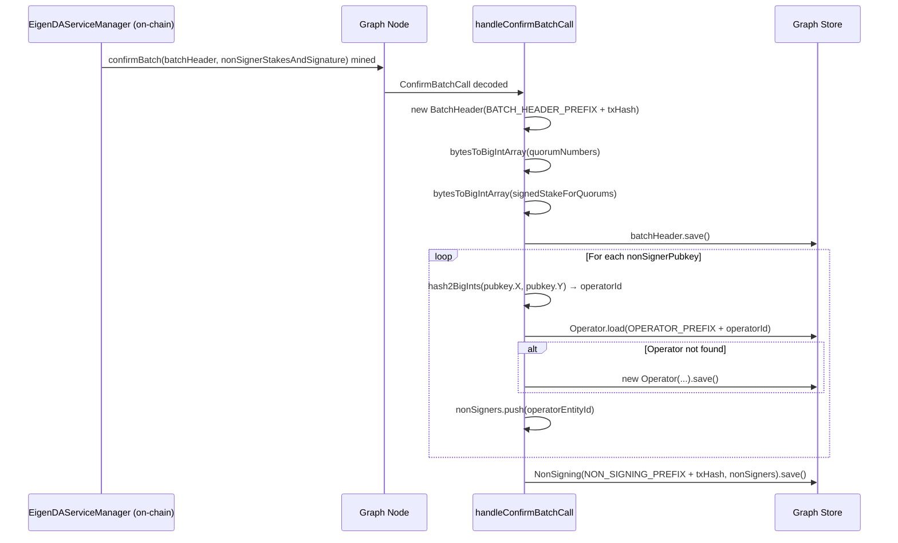
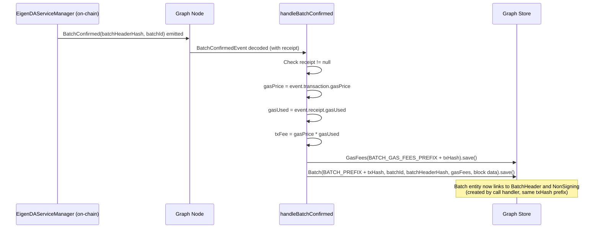
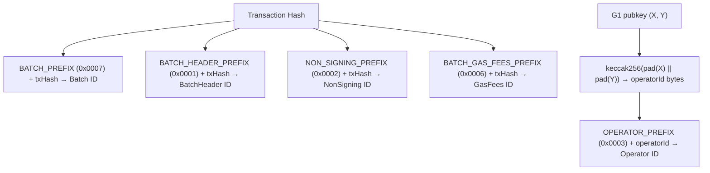

# eigenda-batch-metadata Analysis

**Analyzed by**: code-analyzer-agent
**Timestamp**: 2026-04-10T00:00:00Z
**Application Type**: typescript-package
**Classification**: library (The Graph Protocol subgraph)
**Location**: subgraphs/eigenda-batch-metadata

## Architecture

eigenda-batch-metadata is a The Graph Protocol subgraph that indexes on-chain events and calls from the EigenDA `EigenDAServiceManager` smart contract. Rather than running as a traditional application server, it is deployed as a WebAssembly mapping module to a Graph Node (or The Graph hosted service), which calls the exported handler functions whenever the indexed contract emits the `BatchConfirmed` event or receives a `confirmBatch` call on the Ethereum blockchain.

The subgraph follows the standard Graph Protocol architecture: a `subgraph.yaml` manifest (generated from a Mustache template) declares the data sources, ABI bindings, and mapping handlers; the `schema.graphql` file defines the GraphQL entity model; and the AssemblyScript source file (`src/edasm.ts`) implements the event/call transformation logic. The Graph Node handles ingestion, decoding, and persistent storage; the subgraph developer provides only the mapping functions that transform decoded blockchain data into typed GraphQL entities.

The design uses two complementary handlers: a **call handler** (`handleConfirmBatchCall`) that processes the raw transaction input to extract the batch header and list of non-signing operators, and an **event handler** (`handleBatchConfirmed`) that processes the emitted event to capture batch identity and gas fees. Together these two handlers reconstruct the full batch lifecycle in a queryable GraphQL store. Entity IDs are deterministically derived from a prefix byte sequence concatenated with the transaction hash, enabling cross-referencing between the call-handler entities and the event-handler entities written in the same block.

Multi-network deployment is managed via Mustache-templated configuration files: separate JSON parameter files exist for `mainnet`, `sepolia`, `hoodi`, `preprod-hoodi`, `devnet`, and `anvil`, each providing the contract address and start block.

## Key Components

- **`src/edasm.ts`** — Core mapping module. Exports the two handler functions invoked by the Graph Node (`handleConfirmBatchCall` and `handleBatchConfirmed`) and two pure utility functions (`bytesToBigIntArray`, `hash2BigInts`). This is the only source file in the subgraph; it is compiled to WebAssembly.

- **`schema.graphql`** — GraphQL entity schema defining five types: `Batch`, `GasFees`, `BatchHeader`, `NonSigning`, and `Operator`. The `Batch` entity is the root aggregate; `BatchHeader` and `NonSigning` are related via `@derivedFrom` reverse lookups. `Operator` is the only mutable entity (`immutable: false`), allowing re-use across multiple batches.

- **`templates/subgraph.template.yaml`** — Mustache template that generates the `subgraph.yaml` manifest at prepare-time. Declares the `EigenDAServiceManager` data source with one `callHandler` and one `eventHandler`, referencing the ABI and setting `receipt: true` on the event handler to enable gas fee capture.

- **`abis/EigenDAServiceManager.json`** — ABI definition for the `EigenDAServiceManager` smart contract. Used by `graph codegen` to generate TypeScript/AssemblyScript type bindings in the `generated/` directory. Defines the `confirmBatch` function signature and `BatchConfirmed` event.

- **`templates/*.json`** — Network-specific deployment parameter files. Each provides a `network` name, a `EigenDAServiceManager_address`, and a `EigenDAServiceManager_startBlock`. Networks covered: `mainnet` (0x870679E1..., block 19592322), `sepolia` (0x3a5acf46..., block 8153008), `hoodi` (0x3FF2204A..., block 1106136), `preprod-hoodi` (0x9F3A67f1..., block 1274225), `devnet`, and `anvil`.

- **`handleConfirmBatchCall`** (`src/edasm.ts` line 19) — Call handler triggered by every `confirmBatch` transaction. Reads the decoded `batchHeader` struct and `nonSignerStakesAndSignature` struct from call inputs. Creates or loads `Operator` entities keyed by the keccak256 hash of each non-signer's G1 public key (X, Y coordinates). Creates a `BatchHeader` and a `NonSigning` entity linked by transaction hash.

- **`handleBatchConfirmed`** (`src/edasm.ts` line 52) — Event handler triggered by every `BatchConfirmed(bytes32 indexed batchHeaderHash, uint32 batchId)` log. Reads gas price from transaction and gas used from the receipt to compute the total `txFee`. Creates `GasFees` and `Batch` entities.

- **`bytesToBigIntArray`** (`src/edasm.ts` line 73) — Utility that converts a packed `Bytes` value into an array of per-byte `BigInt` values. Used to decode `quorumNumbers` and `signedStakeForQuorums` from the batch header.

- **`hash2BigInts`** (`src/edasm.ts` line 85) — Utility that computes `keccak256(padded(X) || padded(Y))` over a G1 elliptic curve point's coordinate pair. Used to derive a deterministic `operatorId` from BLS public keys, matching the on-chain operator ID scheme used in EigenLayer contracts.

- **`tests/edasm.test.ts`** — Matchstick unit tests covering both handler functions. Verifies entity counts, field values, and cross-entity relationships after calling the handlers with mock blockchain data.

- **`tests/edasm-utils.ts`** — Test fixture factories. Exports `createNewConfimBatchCall` and `createNewBatchConfirmedEvent` to construct typed mock objects for use in tests, populating all relevant tuple fields to match the ABI-generated structs.

## Data Flows

### 1. confirmBatch Call Indexing

**Flow Description**: When an on-chain `confirmBatch` transaction is mined, the Graph Node decodes the call inputs and invokes `handleConfirmBatchCall`, which creates `BatchHeader`, `NonSigning`, and `Operator` entities.



**Detailed Steps**:

1. **Call decoded** (Graph Node → Handler)
   - The Graph Node monitors the chain starting from `EigenDAServiceManager_startBlock`
   - When a matching `confirmBatch` call is found, it decodes the ABI-encoded inputs using the registered ABI
   - The decoded `ConfirmBatchCall` object is passed to `handleConfirmBatchCall`

2. **BatchHeader creation** (Handler → Store)
   - Entity ID: `BATCH_HEADER_PREFIX_BYTES (0x0001)` concatenated with the transaction hash
   - Fields populated from `confirmBatchCall.inputs.batchHeader`: `blobHeadersRoot`, `quorumNumbers` (decoded per-byte), `signedStakeForQuorums` (decoded per-byte), `referenceBlockNumber`
   - The `batch` foreign key is pre-set to `BATCH_PREFIX_BYTES + txHash`, establishing a cross-handler link

3. **NonSigner Operator creation** (Handler → Store)
   - For each `nonSignerPubkeys[i]`, the handler derives an `operatorId` via `hash2BigInts(X, Y)` (keccak256 of 64-byte concatenated coordinates)
   - `Operator` is loaded; only created if not already present (mutable entity allowing reuse)
   - The operator's byte ID is appended to the `nonSigners` array

4. **NonSigning creation** (Handler → Store)
   - Entity ID: `NON_SIGNING_PREFIX_BYTES (0x0002)` concatenated with transaction hash
   - Links to all non-signer operators and pre-sets `batch` to `BATCH_PREFIX_BYTES + txHash`

**Error Paths**:
- No explicit error handling in the call handler; errors in input decoding would surface at the Graph Node level

---

### 2. BatchConfirmed Event Indexing

**Flow Description**: After a `confirmBatch` transaction is included in a block, the `BatchConfirmed` event is emitted. The Graph Node delivers it to `handleBatchConfirmed`, which creates `GasFees` and `Batch` entities.



**Detailed Steps**:

1. **Event decoded** (Graph Node → Handler)
   - `receipt: true` in the subgraph manifest causes the Graph Node to also fetch the transaction receipt
   - The decoded `BatchConfirmedEvent` carries `batchHeaderHash` (indexed bytes32) and `batchId` (uint32)

2. **GasFees creation** (Handler → Store)
   - Entity ID: `BATCH_GAS_FEES_PREFIX_BYTES (0x0006)` + transaction hash
   - `txFee = gasPrice.times(gasUsed)` — total ETH cost in wei

3. **Batch root entity creation** (Handler → Store)
   - Entity ID: `BATCH_PREFIX_BYTES (0x0007)` + transaction hash
   - Holds `batchId`, `batchHeaderHash`, `blockNumber`, `blockTimestamp`, `txHash`, and a direct reference to `GasFees`
   - `BatchHeader` and `NonSigning` entities link back to `Batch` via `@derivedFrom` on the `batch` field they set during call handling

**Error Paths**:
- If `batchConfirmedEvent.receipt == null`, a `log.error` is emitted with the transaction hash and the handler returns without creating any entities

---

### 3. Entity ID Derivation Scheme

**Flow Description**: Deterministic entity ID construction using prefix bytes prevents collisions across entity types while enabling cross-handler cross-referencing within the same transaction.



**Key Technical Details**:
- All entity IDs are of type `Bytes` (not `String`), consistent with The Graph's recommended pattern for blockchain-derived entities
- The prefix byte scheme (0x0001–0x0007) namespaces entity IDs so that even if two entity types used the same transaction hash, their IDs would not collide
- `Operator` is the only entity created across multiple transactions; all other entities are transaction-scoped and immutable

## Dependencies

### External Libraries

- **@graphprotocol/graph-cli** (`^0.97.0`) [build-tool]: The Graph Protocol command-line toolchain. Provides the `graph codegen` command that generates AssemblyScript type bindings from the ABI and schema, the `graph build` command that compiles the mapping source to WebAssembly, the `graph test` runner, and the `graph deploy`/`graph create` deployment commands. Used via `devDependencies` and invoked through the npm scripts in `package.json`.
  Imported in: `package.json` (scripts only — CLI invocations, not imported in source files)

- **@graphprotocol/graph-ts** (`^0.38.0`) [blockchain]: The Graph Protocol AssemblyScript runtime library. Provides core types (`Address`, `BigInt`, `Bytes`, `ethereum`, `crypto`, `log`) used throughout the mapping source. The `crypto.keccak256` function is used in `hash2BigInts`; `log.error` is used in the null-receipt guard; all entity CRUD operations depend on the generated schema classes which themselves extend graph-ts base classes.
  Imported in: `src/edasm.ts` (lines 1–9), `tests/edasm-utils.ts` (line 2), `tests/edasm.test.ts` (line 11)

- **matchstick-as** (`^0.6.0`) [testing]: Matchstick is The Graph's unit testing framework for AssemblyScript mappings. Provides `assert`, `describe`, `test`, `clearStore`, `beforeAll`, `afterAll`, `newMockEvent`, `newMockCall`, and `createMockedFunction` utilities that allow handler functions to be tested in isolation against an in-memory store without a running Graph Node.
  Imported in: `tests/edasm.test.ts` (lines 2–10), `tests/edasm-utils.ts` (line 1)

- **mustache** (`^4.0.1`) [build-tool]: Logic-less Mustache template engine. Used to render the `subgraph.template.yaml` file with network-specific variables (contract address, start block, network name) to produce the final `subgraph.yaml`. Invoked via the `prepare:<network>` npm scripts (e.g., `mustache templates/mainnet.json templates/subgraph.template.yaml > subgraph.yaml`).
  Imported in: `package.json` (scripts only — CLI usage, not imported in source files)

### Internal Libraries

This component has no internal library dependencies within the codebase.

## API Surface

eigenda-batch-metadata is a The Graph Protocol subgraph. Its primary "API" is a GraphQL endpoint served by the Graph Node after deployment. Consumers query entity data using standard GraphQL queries against the five entity types.

### GraphQL Entity Schema

The subgraph exposes the following queryable GraphQL entities:

#### Batch
Root aggregate entity, immutable, one per confirmed batch transaction.

```graphql
type Batch @entity(immutable: true) {
  id: Bytes!
  batchId: BigInt!
  batchHeaderHash: Bytes!
  batchHeader: BatchHeader! @derivedFrom(field: "batch")
  nonSigning: NonSigning! @derivedFrom(field: "batch")
  gasFees: GasFees!
  blockNumber: BigInt!
  blockTimestamp: BigInt!
  txHash: Bytes!
}
```

#### GasFees
Gas cost details for a batch confirmation transaction, immutable.

```graphql
type GasFees @entity(immutable: true) {
  id: Bytes!
  gasUsed: BigInt!
  gasPrice: BigInt!
  txFee: BigInt!
}
```

#### BatchHeader
Parsed batch header struct from the `confirmBatch` call, immutable.

```graphql
type BatchHeader @entity(immutable: true) {
  id: Bytes!
  blobHeadersRoot: Bytes!
  quorumNumbers: [BigInt!]!
  signedStakeForQuorums: [BigInt!]!
  referenceBlockNumber: BigInt!
  batch: Batch!
}
```

#### NonSigning
Set of operators that did not sign a particular batch, immutable.

```graphql
type NonSigning @entity(immutable: true) {
  id: Bytes!
  nonSigners: [Operator!]!
  batch: Batch!
}
```

#### Operator
Represents an EigenDA operator identified by their on-chain operatorId (keccak256 of G1 pubkey). Mutable — shared across batches.

```graphql
type Operator @entity(immutable: false) {
  id: Bytes!
  operatorId: Bytes!
  nonSignings: [NonSigning!]! @derivedFrom(field: "nonSigners")
}
```

### Exported AssemblyScript Functions

The following functions are exported from `src/edasm.ts` and are part of the public API surface (used directly by the Graph Node runtime or by tests):

| Function | Signature | Description |
|---|---|---|
| `handleConfirmBatchCall` | `(call: ConfirmBatchCall): void` | Call handler invoked by Graph Node for each `confirmBatch` transaction |
| `handleBatchConfirmed` | `(event: BatchConfirmedEvent): void` | Event handler invoked by Graph Node for each `BatchConfirmed` log |
| `bytesToBigIntArray` | `(bytes: Bytes): BigInt[]` | Utility: converts packed bytes to per-byte BigInt array |
| `hash2BigInts` | `(x: BigInt, y: BigInt): Bytes` | Utility: derives operatorId from G1 public key coordinates |
| `BATCH_HEADER_PREFIX_BYTES` | `Bytes` constant | Entity ID namespace prefix `0x0001` |
| `NON_SIGNING_PREFIX_BYTES` | `Bytes` constant | Entity ID namespace prefix `0x0002` |
| `OPERATOR_PREFIX_BYTES` | `Bytes` constant | Entity ID namespace prefix `0x0003` |
| `G1_POINT_PREFIX_BYTES` | `Bytes` constant | Entity ID namespace prefix `0x0004` |
| `G2_POINT_PREFIX_BYTES` | `Bytes` constant | Entity ID namespace prefix `0x0005` |
| `BATCH_GAS_FEES_PREFIX_BYTES` | `Bytes` constant | Entity ID namespace prefix `0x0006` |
| `BATCH_PREFIX_BYTES` | `Bytes` constant | Entity ID namespace prefix `0x0007` |

### Deployment Targets

The subgraph can be deployed to six networks using the prepare scripts:

| Script | Network | Contract Address | Start Block |
|---|---|---|---|
| `prepare:mainnet` | mainnet | 0x870679E138bCdf293b7Ff14dD44b70FC97e12fc0 | 19592322 |
| `prepare:sepolia` | sepolia | 0x3a5acf46ba6890B8536420F4900AC9BC45Df4764 | 8153008 |
| `prepare:hoodi` | hoodi | 0x3FF2204A567C15dC3731140B95362ABb4b17d8ED | 1106136 |
| `prepare:preprod-hoodi` | hoodi | 0x9F3A67f1b56d0B21115A54356c02B2d77f39EA8a | 1274225 |
| `prepare:devnet` | devnet | 0x0000000000000000000000000000000000000000 | 0 |
| `prepare:anvil` | anvil | 0xc5a5C42992dECbae36851359345FE25997F5C42d | 0 |

## Code Examples

### Example 1: Operator ID Derivation from G1 Public Key

```typescript
// src/edasm.ts, lines 85-91
export function hash2BigInts(x: BigInt, y: BigInt): Bytes {
  // pad to 32 bytes
  let xBytes = x.toHex().substring(2).padStart(64, "0")
  let yBytes = y.toHex().substring(2).padStart(64, "0")
  let xy = Bytes.fromHexString(xBytes.concat(yBytes))
  return Bytes.fromByteArray(crypto.keccak256(xy))
}
```

This function replicates on-chain operator ID derivation: G1 pubkey coordinates X and Y are each padded to 32 bytes (64 hex chars), concatenated to form a 64-byte input, and keccak256-hashed to produce the canonical operatorId matching what EigenLayer contracts store.

### Example 2: Cross-Handler Entity Linking via Transaction Hash

```typescript
// src/edasm.ts, lines 25 and 48 (call handler)
batchHeader.batch = BATCH_PREFIX_BYTES.concat(confirmBatchCall.transaction.hash)
nonSignerStakesAndSignatures.batch = BATCH_PREFIX_BYTES.concat(confirmBatchCall.transaction.hash)

// src/edasm.ts, line 63 (event handler)
let batch = new Batch(BATCH_PREFIX_BYTES.concat(batchConfirmedEvent.transaction.hash))
```

The call handler and event handler are invoked separately for the same transaction. Both use the same `BATCH_PREFIX_BYTES + txHash` formula to set/create the `Batch` entity ID, ensuring that `BatchHeader` and `NonSigning` entities created by the call handler will be discoverable from the `Batch` entity created by the event handler via `@derivedFrom` reverse lookups.

### Example 3: Gas Fee Calculation

```typescript
// src/edasm.ts, lines 57-61
let batchGasFees = new GasFees(BATCH_GAS_FEES_PREFIX_BYTES.concat(batchConfirmedEvent.transaction.hash))
batchGasFees.gasPrice = batchConfirmedEvent.transaction.gasPrice
batchGasFees.gasUsed = batchConfirmedEvent.receipt!.gasUsed
batchGasFees.txFee = batchGasFees.gasPrice.times(batchGasFees.gasUsed)
batchGasFees.save()
```

Gas price is available from the transaction object (set by the submitter), while gas used requires the receipt (actual execution cost). The `receipt: true` directive in the subgraph manifest enables this. `txFee` is stored pre-computed as `gasPrice * gasUsed` for convenient querying.

### Example 4: Per-Byte Decoding of Packed Quorum Data

```typescript
// src/edasm.ts, lines 73-83
export function bytesToBigIntArray(bytes: Bytes): BigInt[] {
  let hex = bytes.toHex().substring(2);
  let result: BigInt[] = [];
  for (let i = 0; i < hex.length / 2; i++) {
    let byte = hex.substring(i * 2, (i+1) * 2 );
    let hexByteValue = Bytes.fromHexString(byte)
    let bigIntByte = BigInt.fromUnsignedBytes(hexByteValue)
    result.push(bigIntByte);
  }
  return result;
}
```

The EigenDA batch header packs `quorumNumbers` and `signedStakeForQuorums` as byte-packed arrays (one byte per quorum). This utility unpacks them into a `BigInt[]` for storage in the schema's `[BigInt!]!` array fields.

## Files Analyzed

- `subgraphs/eigenda-batch-metadata/src/edasm.ts` (91 lines) — Core mapping logic with both event/call handlers and utility functions
- `subgraphs/eigenda-batch-metadata/schema.graphql` (39 lines) — GraphQL entity schema defining all five entity types
- `subgraphs/eigenda-batch-metadata/templates/subgraph.template.yaml` (28 lines) — Mustache-templated subgraph manifest
- `subgraphs/eigenda-batch-metadata/package.json` (26 lines) — Package manifest with scripts and devDependencies
- `subgraphs/eigenda-batch-metadata/abis/EigenDAServiceManager.json` (900+ lines) — Contract ABI for type generation
- `subgraphs/eigenda-batch-metadata/templates/mainnet.json` (5 lines) — Mainnet deployment parameters
- `subgraphs/eigenda-batch-metadata/templates/sepolia.json` (5 lines) — Sepolia testnet deployment parameters
- `subgraphs/eigenda-batch-metadata/templates/hoodi.json` (5 lines) — Hoodi testnet deployment parameters
- `subgraphs/eigenda-batch-metadata/templates/preprod-hoodi.json` (5 lines) — Pre-production Hoodi deployment parameters
- `subgraphs/eigenda-batch-metadata/templates/devnet.json` (5 lines) — Local devnet deployment parameters
- `subgraphs/eigenda-batch-metadata/templates/anvil.json` (5 lines) — Anvil local testnet deployment parameters
- `subgraphs/eigenda-batch-metadata/tests/edasm.test.ts` (200 lines) — Matchstick unit tests
- `subgraphs/eigenda-batch-metadata/tests/edasm-utils.ts` (87 lines) — Test fixture factories

## Analysis Data

```json
{
  "summary": "eigenda-batch-metadata is a The Graph Protocol subgraph that indexes EigenDA batch confirmation data from the EigenDAServiceManager smart contract on Ethereum. It tracks two on-chain signals per batch: the confirmBatch call (to extract the batch header and list of non-signing operators) and the BatchConfirmed event (to capture batch identity and gas fees). The indexed data is queryable via a GraphQL API exposing five entity types: Batch, BatchHeader, GasFees, NonSigning, and Operator. Deployment is supported across mainnet, Sepolia, Hoodi, pre-production Hoodi, devnet, and Anvil via Mustache-templated configuration files.",
  "architecture_pattern": "event-driven",
  "key_modules": [
    "src/edasm.ts",
    "schema.graphql",
    "templates/subgraph.template.yaml",
    "abis/EigenDAServiceManager.json",
    "tests/edasm.test.ts",
    "tests/edasm-utils.ts"
  ],
  "api_endpoints": [
    "GraphQL query endpoint (served by Graph Node after deployment)"
  ],
  "data_flows": [
    "confirmBatch call → handleConfirmBatchCall → BatchHeader + NonSigning + Operator entities",
    "BatchConfirmed event → handleBatchConfirmed → GasFees + Batch entities",
    "Cross-handler linking: BATCH_PREFIX_BYTES + txHash used as Batch ID by both handlers"
  ],
  "tech_stack": [
    "typescript",
    "assemblyscript",
    "the-graph",
    "graphql",
    "webassembly",
    "ethereum",
    "mustache"
  ],
  "external_integrations": [
    "EigenDAServiceManager smart contract (Ethereum mainnet, Sepolia, Hoodi)"
  ],
  "component_interactions": []
}
```

## Citations

```json
[
  {
    "file_path": "subgraphs/eigenda-batch-metadata/src/edasm.ts",
    "start_line": 1,
    "end_line": 9,
    "claim": "The mapping module imports core types from @graphprotocol/graph-ts and generated ABI bindings from the EigenDAServiceManager contract",
    "section": "Architecture",
    "snippet": "import { Address, BigInt, Bytes, crypto, ethereum, log } from \"@graphprotocol/graph-ts\"\nimport { BatchConfirmed as BatchConfirmedEvent, ConfirmBatchCall } from \"../generated/EigenDAServiceManager/EigenDAServiceManager\""
  },
  {
    "file_path": "subgraphs/eigenda-batch-metadata/src/edasm.ts",
    "start_line": 11,
    "end_line": 17,
    "claim": "Entity IDs are derived using namespace prefix bytes (0x0001-0x0007) concatenated with transaction hashes to prevent cross-entity ID collisions",
    "section": "Architecture",
    "snippet": "export const BATCH_HEADER_PREFIX_BYTES = Bytes.fromHexString(\"0x0001\")\nexport const NON_SIGNING_PREFIX_BYTES = Bytes.fromHexString(\"0x0002\")\nexport const OPERATOR_PREFIX_BYTES = Bytes.fromHexString(\"0x0003\")\nexport const BATCH_PREFIX_BYTES = Bytes.fromHexString(\"0x0007\")"
  },
  {
    "file_path": "subgraphs/eigenda-batch-metadata/src/edasm.ts",
    "start_line": 19,
    "end_line": 26,
    "claim": "handleConfirmBatchCall creates a BatchHeader entity from the decoded call input, pre-linking it to the Batch entity via transaction hash",
    "section": "Key Components",
    "snippet": "export function handleConfirmBatchCall(confirmBatchCall: ConfirmBatchCall): void {\n  let batchHeader = new BatchHeader(BATCH_HEADER_PREFIX_BYTES.concat(confirmBatchCall.transaction.hash))\n  batchHeader.blobHeadersRoot = confirmBatchCall.inputs.batchHeader.blobHeadersRoot\n  batchHeader.batch = BATCH_PREFIX_BYTES.concat(confirmBatchCall.transaction.hash)"
  },
  {
    "file_path": "subgraphs/eigenda-batch-metadata/src/edasm.ts",
    "start_line": 22,
    "end_line": 23,
    "claim": "bytesToBigIntArray is applied to quorumNumbers and signedStakeForQuorums to unpack byte-packed arrays into per-byte BigInt arrays",
    "section": "Key Components",
    "snippet": "batchHeader.quorumNumbers = bytesToBigIntArray(confirmBatchCall.inputs.batchHeader.quorumNumbers)\nbatchHeader.signedStakeForQuorums = bytesToBigIntArray(confirmBatchCall.inputs.batchHeader.signedStakeForQuorums)"
  },
  {
    "file_path": "subgraphs/eigenda-batch-metadata/src/edasm.ts",
    "start_line": 31,
    "end_line": 44,
    "claim": "The call handler iterates over nonSignerPubkeys, creates or loads Operator entities keyed by keccak256 of G1 public key coordinates",
    "section": "Data Flows",
    "snippet": "for (let index = 0; index < confirmBatchCall.inputs.nonSignerStakesAndSignature.nonSignerPubkeys.length; index++) {\n  const pubkey = confirmBatchCall.inputs.nonSignerStakesAndSignature.nonSignerPubkeys[index];\n  let operatorId = hash2BigInts(pubkey.X, pubkey.Y)\n  let operator = Operator.load(operatorEntityId)\n  if (operator == null) { operator = new Operator(operatorEntityId); operator.save() }"
  },
  {
    "file_path": "subgraphs/eigenda-batch-metadata/src/edasm.ts",
    "start_line": 52,
    "end_line": 61,
    "claim": "handleBatchConfirmed creates GasFees entity with txFee = gasPrice * gasUsed, requiring the receipt for gasUsed",
    "section": "Key Components",
    "snippet": "export function handleBatchConfirmed(batchConfirmedEvent: BatchConfirmedEvent): void {\n  if (batchConfirmedEvent.receipt == null) { log.error(...); return }\n  batchGasFees.gasPrice = batchConfirmedEvent.transaction.gasPrice\n  batchGasFees.gasUsed = batchConfirmedEvent.receipt!.gasUsed\n  batchGasFees.txFee = batchGasFees.gasPrice.times(batchGasFees.gasUsed)"
  },
  {
    "file_path": "subgraphs/eigenda-batch-metadata/src/edasm.ts",
    "start_line": 53,
    "end_line": 55,
    "claim": "The event handler guards against null receipt with a log.error and early return, preventing GasFees and Batch entity creation",
    "section": "Data Flows",
    "snippet": "if (batchConfirmedEvent.receipt == null) {\n  log.error(\"handleBatchConfirmed: batchConfirmedEvent.receipt is null\", [batchConfirmedEvent.transaction.hash.toHex()])\n  return\n}"
  },
  {
    "file_path": "subgraphs/eigenda-batch-metadata/src/edasm.ts",
    "start_line": 73,
    "end_line": 83,
    "claim": "bytesToBigIntArray decodes a packed Bytes value into per-byte BigInt array by iterating hex string two characters at a time",
    "section": "Key Components",
    "snippet": "export function bytesToBigIntArray(bytes: Bytes): BigInt[] {\n  let hex = bytes.toHex().substring(2);\n  for (let i = 0; i < hex.length / 2; i++) {\n    let bigIntByte = BigInt.fromUnsignedBytes(Bytes.fromHexString(hex.substring(i*2, (i+1)*2)))\n    result.push(bigIntByte);\n  }\n}"
  },
  {
    "file_path": "subgraphs/eigenda-batch-metadata/src/edasm.ts",
    "start_line": 85,
    "end_line": 91,
    "claim": "hash2BigInts derives operatorId by keccak256-hashing 32-byte-padded G1 elliptic curve coordinates, matching the on-chain EigenLayer operator ID scheme",
    "section": "Key Components",
    "snippet": "export function hash2BigInts(x: BigInt, y: BigInt): Bytes {\n  let xBytes = x.toHex().substring(2).padStart(64, \"0\")\n  let yBytes = y.toHex().substring(2).padStart(64, \"0\")\n  let xy = Bytes.fromHexString(xBytes.concat(yBytes))\n  return Bytes.fromByteArray(crypto.keccak256(xy))\n}"
  },
  {
    "file_path": "subgraphs/eigenda-batch-metadata/schema.graphql",
    "start_line": 1,
    "end_line": 11,
    "claim": "The Batch entity is the root aggregate, immutable, and uses @derivedFrom to link BatchHeader and NonSigning via reverse lookups",
    "section": "API Surface",
    "snippet": "type Batch @entity(immutable: true) {\n  id: Bytes!\n  batchId: BigInt!\n  batchHeaderHash: Bytes!\n  batchHeader: BatchHeader! @derivedFrom(field: \"batch\")\n  nonSigning: NonSigning! @derivedFrom(field: \"batch\")\n}"
  },
  {
    "file_path": "subgraphs/eigenda-batch-metadata/schema.graphql",
    "start_line": 13,
    "end_line": 18,
    "claim": "GasFees entity stores gasUsed, gasPrice, and the pre-computed txFee for each batch confirmation",
    "section": "API Surface",
    "snippet": "type GasFees @entity(immutable: true) {\n  id: Bytes!\n  gasUsed: BigInt!\n  gasPrice: BigInt!\n  txFee: BigInt!\n}"
  },
  {
    "file_path": "subgraphs/eigenda-batch-metadata/schema.graphql",
    "start_line": 35,
    "end_line": 39,
    "claim": "Operator is the only mutable entity in the schema, allowing it to be shared and referenced across multiple batches",
    "section": "API Surface",
    "snippet": "type Operator @entity(immutable: false) {\n  id: Bytes!\n  operatorId: Bytes!\n  nonSignings: [NonSigning!]! @derivedFrom(field: \"nonSigners\")\n}"
  },
  {
    "file_path": "subgraphs/eigenda-batch-metadata/templates/subgraph.template.yaml",
    "start_line": 1,
    "end_line": 28,
    "claim": "The subgraph manifest uses specVersion 0.0.5, declares one data source (EigenDAServiceManager), one callHandler for confirmBatch, and one eventHandler for BatchConfirmed with receipt: true",
    "section": "Architecture",
    "snippet": "specVersion: 0.0.5\ndataSources:\n  - kind: ethereum\n    name: EigenDAServiceManager\n    callHandlers:\n      - function: confirmBatch(...)\n        handler: handleConfirmBatchCall\n    eventHandlers:\n      - event: BatchConfirmed(indexed bytes32,uint32)\n        handler: handleBatchConfirmed\n        receipt: true"
  },
  {
    "file_path": "subgraphs/eigenda-batch-metadata/templates/subgraph.template.yaml",
    "start_line": 7,
    "end_line": 11,
    "claim": "Network, contract address, and start block are Mustache template variables, resolved per network by the prepare scripts",
    "section": "Architecture",
    "snippet": "network: {{network}}\nsource:\n  address: \"{{EigenDAServiceManager_address}}\"\n  startBlock: {{EigenDAServiceManager_startBlock}}"
  },
  {
    "file_path": "subgraphs/eigenda-batch-metadata/templates/mainnet.json",
    "start_line": 1,
    "end_line": 5,
    "claim": "Mainnet deployment targets EigenDAServiceManager at 0x870679E138bCdf293b7Ff14dD44b70FC97e12fc0 starting from block 19592322",
    "section": "API Surface",
    "snippet": "{\n  \"network\": \"mainnet\",\n  \"EigenDAServiceManager_address\": \"0x870679E138bCdf293b7Ff14dD44b70FC97e12fc0\",\n  \"EigenDAServiceManager_startBlock\": 19592322\n}"
  },
  {
    "file_path": "subgraphs/eigenda-batch-metadata/templates/sepolia.json",
    "start_line": 1,
    "end_line": 5,
    "claim": "Sepolia testnet deployment targets EigenDAServiceManager at 0x3a5acf46ba6890B8536420F4900AC9BC45Df4764 starting from block 8153008",
    "section": "API Surface",
    "snippet": "{\n  \"network\": \"sepolia\",\n  \"EigenDAServiceManager_address\": \"0x3a5acf46ba6890B8536420F4900AC9BC45Df4764\",\n  \"EigenDAServiceManager_startBlock\": 8153008\n}"
  },
  {
    "file_path": "subgraphs/eigenda-batch-metadata/package.json",
    "start_line": 20,
    "end_line": 25,
    "claim": "All four devDependencies are: @graphprotocol/graph-cli ^0.97.0, @graphprotocol/graph-ts ^0.38.0, matchstick-as ^0.6.0, mustache ^4.0.1",
    "section": "Dependencies",
    "snippet": "\"devDependencies\": {\n  \"@graphprotocol/graph-cli\": \"^0.97.0\",\n  \"@graphprotocol/graph-ts\": \"^0.38.0\",\n  \"matchstick-as\": \"^0.6.0\",\n  \"mustache\": \"^4.0.1\"\n}"
  },
  {
    "file_path": "subgraphs/eigenda-batch-metadata/package.json",
    "start_line": 4,
    "end_line": 18,
    "claim": "The prepare scripts use mustache CLI to render subgraph.template.yaml with per-network JSON parameters; graph deploy targets the Layr-Labs/eigenda-batch-metadata slug on The Graph hosted service",
    "section": "Architecture",
    "snippet": "\"prepare:mainnet\": \"mustache templates/mainnet.json templates/subgraph.template.yaml > subgraph.yaml\",\n\"deploy\": \"graph deploy --node https://api.thegraph.com/deploy/ Layr-Labs/eigenda-batch-metadata\""
  },
  {
    "file_path": "subgraphs/eigenda-batch-metadata/abis/EigenDAServiceManager.json",
    "start_line": 855,
    "end_line": 872,
    "claim": "The BatchConfirmed event has two parameters: batchHeaderHash (indexed bytes32) and batchId (uint32)",
    "section": "Data Flows",
    "snippet": "\"name\": \"BatchConfirmed\",\n\"inputs\": [\n  {\"name\": \"batchHeaderHash\", \"type\": \"bytes32\", \"indexed\": true},\n  {\"name\": \"batchId\", \"type\": \"uint32\", \"indexed\": false}\n]"
  },
  {
    "file_path": "subgraphs/eigenda-batch-metadata/tests/edasm.test.ts",
    "start_line": 41,
    "end_line": 115,
    "claim": "The test suite verifies that handleConfirmBatchCall creates exactly one BatchHeader, one NonSigning, and two Operator entities with correct field values",
    "section": "Key Components",
    "snippet": "test(\"has batchheader, nonsigners, and operators created\", () => {\n  handleConfirmBatchCall(confirmBatchCall)\n  assert.entityCount(\"BatchHeader\", 1)\n  assert.entityCount(\"NonSigning\", 1)\n  assert.entityCount(\"Operator\", 2)\n})"
  },
  {
    "file_path": "subgraphs/eigenda-batch-metadata/tests/edasm.test.ts",
    "start_line": 117,
    "end_line": 193,
    "claim": "The test suite verifies that handleBatchConfirmed creates exactly one Batch and one GasFees entity with gasPrice, gasUsed, and txFee fields correctly populated",
    "section": "Key Components",
    "snippet": "test(\"has batch and gas fees created\", () => {\n  handleBatchConfirmed(batchConfirmedEvent)\n  assert.entityCount(\"Batch\", 1)\n  assert.entityCount(\"GasFees\", 1)\n})"
  },
  {
    "file_path": "subgraphs/eigenda-batch-metadata/tests/edasm-utils.ts",
    "start_line": 6,
    "end_line": 53,
    "claim": "createNewConfimBatchCall builds a typed mock ConfirmBatchCall with batchHeader and nonSignerStakesAndSignature tuples populated via ethereum.Value helpers",
    "section": "Key Components",
    "snippet": "export function createNewConfimBatchCall(...): ConfirmBatchCall {\n  let confirmBatchCall = changetype<ConfirmBatchCall>(newMockCall())\n  let batchHeader = new ConfirmBatchCallBatchHeaderStruct(4)\n  batchHeader[0] = ethereum.Value.fromBytes(blobHeadersRoot)\n}"
  }
]
```

## Analysis Notes

### Security Considerations

1. **Null receipt silent failure**: The `handleBatchConfirmed` handler guards against a null receipt with `log.error` and an early return rather than a hard failure. A misconfigured Graph Node that does not deliver receipts would silently produce `Batch` entities missing the `gasFees` link, which would cause GraphQL resolution errors on the non-null `gasFees` field.

2. **Immutable entities prevent data correction**: All entities except `Operator` are marked `immutable: true`. This is correct for append-only indexing but means any chain reorg or incorrect data will require a full reindex — there is no mechanism to update individual records.

3. **Operator entity unbounded growth**: The `Operator` entity is shared across all batches and its `nonSignings` reverse lookup could reference a very large number of records over time, which may cause slow or resource-intensive GraphQL queries without explicit pagination.

4. **Public unauthenticated GraphQL endpoint**: The Graph Protocol hosted service provides a public, unauthenticated GraphQL endpoint. All indexed data is publicly readable; there is no query complexity limiting or rate limiting at the subgraph level.

### Performance Characteristics

- **Indexing throughput**: The mapping runs inside the Graph Node's WASM sandbox. `handleConfirmBatchCall` has O(n) complexity where n is the number of non-signers per batch, involving one store `load` and potentially one store `save` per operator.
- **Gas fee computation**: `txFee` is pre-computed and stored rather than computed at query time, which is an appropriate optimization for a read-heavy GraphQL API.
- **Entity ID byte construction**: All entity IDs use `Bytes.concat`, which is O(len) and involves allocation. For large non-signer sets this is called in a loop but each ID is fixed-size (prefix + 32-byte hash), so the cost is bounded.

### Scalability Notes

- **Multi-network deployment**: The template-based configuration correctly separates network concerns, enabling independent deployments per environment with no code changes.
- **No pagination on array fields**: The `nonSigners` field on `NonSigning` is an unbounded inline array. For batches with many non-signers, this could grow large; The Graph recommends keeping arrays bounded or using pagination entities for large sets.
- **Single data source**: The subgraph indexes exactly one contract per deployment. Expanding to multiple EigenDA service manager contracts (e.g., for V2) would require adding additional data sources or deploying separate subgraphs.
