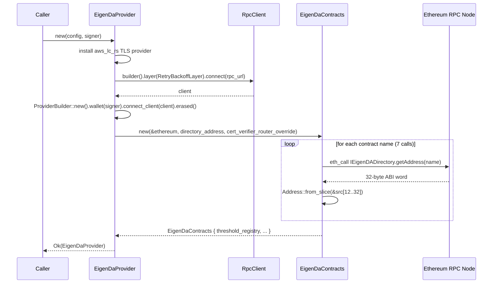
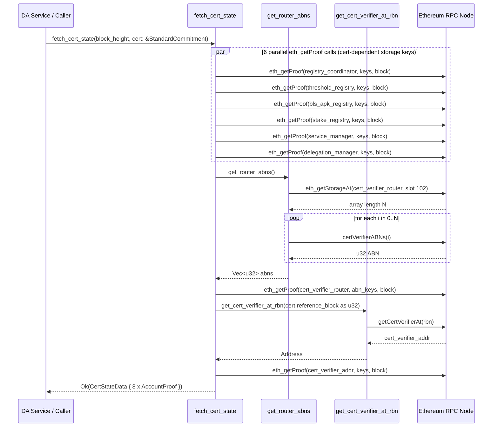
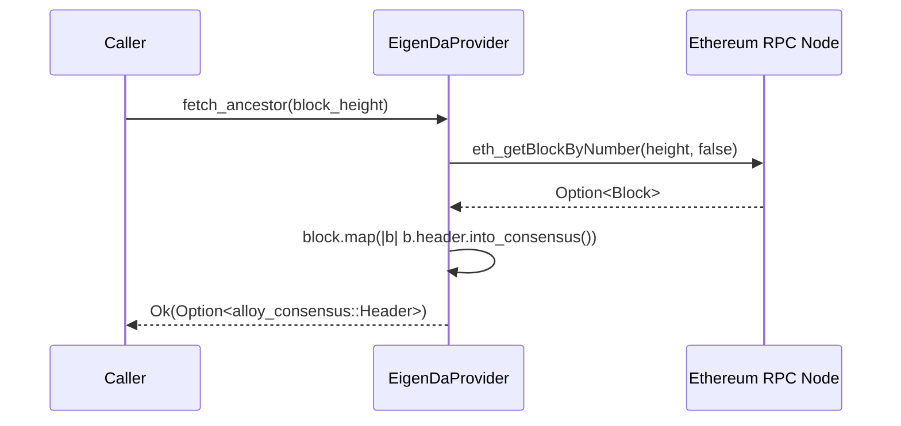

# eigenda-ethereum Analysis

**Analyzed by**: code-library-analyzer
**Timestamp**: 2026-04-10T00:00:00Z
**Application Type**: rust-crate
**Classification**: library
**Location**: rust/crates/eigenda-ethereum
**Version**: 0.1.0

## Architecture

`eigenda-ethereum` is a thin, focused Ethereum interaction library for the EigenDA verification pipeline. It occupies a single, well-defined layer: translating between Ethereum RPC calls (via the Alloy provider stack) and the domain types expected by `eigenda-verification`. It does not perform any cryptographic verification itself; instead, it collects and returns the raw on-chain evidence (`CertStateData`) that the verification crate needs.

The library is organized into three modules: `contracts` (Solidity bindings and hardcoded directory addresses), `provider` (the central `EigenDaProvider` struct with all async fetch logic), and `address` (a thin newtype wrapper needed for JSON Schema compatibility with the Sovereign SDK). This flat module structure keeps the library easy to navigate — there is no deep nesting or complex trait hierarchy.

Connectivity is achieved through Alloy's layered transport model. The provider is constructed once from `EigenDaProviderConfig` with a `RetryBackoffLayer` wrapping the underlying RPC client, enabling automatic retried calls with configurable back-off and compute-unit throttling. Contract addresses are resolved at startup by querying the on-chain `EigenDADirectory` contract, which means a single configuration field (the directory address, chosen by `Network` enum) drives the entire set of contract targets. An optional `cert_verifier_router_address` override is provided for operators who deploy their own `EigenDACertVerifierRouter` for trustless integration.

The most important function in the crate — `EigenDaProvider::fetch_cert_state` — fans out eight parallel `eth_getProof` calls concurrently using `try_join!`, collects the resulting Merkle proofs, and assembles them into a `CertStateData` struct. This struct is the boundary object exchanged with `eigenda-verification`. TLS for WebSocket connections is handled via `rustls` with the `aws-lc-rs` crypto backend, installed as the global default provider at construction time.

## Key Components

- **`EigenDaProvider`** (`src/provider.rs`, line 99): The central public struct. Wraps an Alloy `DynProvider` and a resolved `EigenDaContracts` value. Exposes all public async methods for fetching Ethereum state and sending transactions. Constructed via `EigenDaProvider::new` which resolves the TLS provider, builds the retry-layered RPC client, and queries the directory contract.

- **`EigenDaProviderConfig`** (`src/provider.rs`, line 67): Configuration type that implements `JsonSchema` (required by the Sovereign SDK DA service interface). Fields cover the target `Network`, the RPC endpoint URL, an optional custom cert verifier router address, and tunable retry/back-off/compute-unit parameters.

- **`Network`** (`src/provider.rs`, line 47): An enum with four variants — `Mainnet`, `Hoodi`, `Sepolia`, `Inabox` — that maps to hardcoded `EigenDADirectory` contract addresses for each environment. Serialized/deserialized with Serde and implements `JsonSchema`.

- **`EigenDaContracts`** (`src/contracts.rs`, line 35): A plain data struct holding the resolved `Address` values for all seven EigenDA/EigenLayer contracts needed during verification (threshold registry, registry coordinator, service manager, BLS APK registry, stake registry, cert verifier router, delegation manager). Populated by `EigenDaContracts::new` via sequential `getAddress` RPC calls to the directory contract.

- **`EigenDaContracts::new`** (`src/contracts.rs`, line 125): Async constructor that calls the `IEigenDADirectory.getAddress(name)` function once per contract name, returning all addresses. Accepts an optional override for the cert verifier router address to support custom deployments.

- **`get_address`** (`src/contracts.rs`, line 153): Private async helper. Encodes a `getAddress(name)` call using `alloy-sol-types`, dispatches it through `eth_call`, and slices the raw return bytes `[12..32]` to extract the 20-byte address from the 32-byte ABI word.

- **`fetch_cert_state`** (`src/provider.rs`, line 237): The library's primary data-fetching function. Given a block height and a `StandardCommitment`, it fans out eight concurrent `eth_getProof` calls — one per EigenDA/EigenLayer contract — and assembles their results into a `CertStateData`. Uses `try_join!` for maximum concurrency. Annotated with `#[instrument(skip_all)]` for tracing.

- **`get_router_abns`** (`src/provider.rs`, line 194): Private helper that reads the length of the `certVerifierABNs` dynamic array directly from storage via `eth_getStorageAt` using the constant `CERT_VERIFIER_ABNS_ARRAY_SLOT` (slot 102), then fires parallel RPC calls to retrieve each activation block number using the `EigenDACertVerifierRouter.certVerifierABNs(index)` view function.

- **`get_cert_verifier_at_rbn`** (`src/provider.rs`, line 217): Private helper that calls `EigenDACertVerifierRouter.getCertVerifierAt(referenceBlockNumber)` to discover which `EigenDACertVerifier` address was active at the certificate's reference block.

- **`EthereumAddress`** (`src/address.rs`, line 12): A newtype wrapping `alloy_primitives::Address`. Its only purpose is to implement `JsonSchema` with a hex-address regex pattern `^0x[a-fA-F0-9]{40}$`, satisfying the Sovereign SDK configuration contract that `EigenDaProviderConfig` must implement `JsonSchema`.

- **`AnvilNode` (test utilities)** (`src/provider.rs`, lines 408-446): A `testcontainers::Image` implementation that launches Foundry's Anvil local Ethereum node in Docker. Supports `Interval`, `EachTransaction`, and `Manual` mining modes. Used exclusively in integration tests within this crate and downstream crates.

## Data Flows

### 1. Provider Initialization

**Flow Description**: Starting from a configuration struct, this flow resolves TLS, builds the retry-wrapped RPC client, and resolves all EigenDA contract addresses from the on-chain directory.



**Detailed Steps**:

1. **TLS installation** — `CryptoProvider::install_default(aws_lc_rs::default_provider())` is called idempotently (return value discarded) to ensure TLS works for WebSocket transports.

2. **RPC client construction** — `RetryBackoffLayer::new(max_retries, backoff_ms, cu_per_second)` wraps the underlying transport, then `RpcClient::builder().layer(...).connect(url).await` establishes the connection.

3. **Directory address selection** — The `Network` variant selects one of four hardcoded `Address` constants (`EIGENDA_DIRECTORY_MAINNET`, `EIGENDA_DIRECTORY_HOODI`, `EIGENDA_DIRECTORY_SEPOLIA`, `EIGENDA_DIRECTORY_INABOX`).

4. **Contract address resolution** — `get_address` ABI-encodes `getAddress(name)`, calls `eth_call`, and slices bytes `[12..32]` to extract the 20-byte address from the 32-byte ABI-encoded word.

**Error Paths**:
- Any `eth_call` failure during directory lookup propagates as `RpcError<TransportErrorKind>` to the caller.

---

### 2. Certificate State Fetch (`fetch_cert_state`)

**Flow Description**: Given a block height and a parsed EigenDA certificate, fan out parallel `eth_getProof` calls against all eight relevant smart contracts and return the aggregated `CertStateData` ready for verification.



**Detailed Steps**:

1. **Storage key generation** — For each of the six registry contracts, `contract::<Name>::storage_keys(cert)` (from `eigenda-verification`) computes the exact EVM storage slots that need to be proved, based on certificate fields such as quorum numbers and operator bitmap indices.

2. **Parallel RPC dispatch** — All six futures are created before any are awaited, then collected with `try_join!` so the RPC node receives them concurrently.

3. **Router ABN prefetch** — `get_router_abns` reads the `certVerifierABNs` dynamic array length from raw storage (slot 102, the `CERT_VERIFIER_ABNS_ARRAY_SLOT` constant), then fires `try_join_all` for each element.

4. **Dynamic cert verifier proof** — The cert verifier contract address is not known at startup; it is discovered at runtime via `getCertVerifierAt(rbn)`, then its storage is proved separately.

5. **Assembly** — Each `EIP1186AccountProofResponse` is converted to `reth_trie_common::AccountProof` and placed in the corresponding field of `CertStateData`.

**Error Paths**:
- `get_router_abns` failure (storage read or contract call) returns `alloy_contract::Error`.
- Any `eth_getProof` transport error is wrapped in `alloy_contract::Error::TransportError`.
- `try_join!` short-circuits on first error.

---

### 3. Block Header Fetch

**Flow Description**: Upstream consumers use `fetch_ancestor` to retrieve an Ethereum block header as a state root anchor for `CertStateData::verify`.



**Used By**: Any rollup DA service integration needing the Ethereum block header to anchor `CertStateData::verify` against a known state root.

## Dependencies

### External Libraries

- **alloy-consensus** (1.0.32) [blockchain]: Provides the canonical `Header` type returned by `fetch_ancestor`. Features `serde`, `serde-bincode-compat`, and `k256` are enabled for serialization and key support. Imported in `src/provider.rs`.

- **alloy-contract** (1.1.1) [blockchain]: Provides the typed `EigenDACertVerifierRouter` contract binding generated by the `sol!` macro and supplies the `alloy_contract::Error` type used as the return error for `fetch_cert_state`. Imported in `src/provider.rs`.

- **alloy-primitives** (1.3.1) [blockchain]: Core Ethereum primitive types: `Address`, `U256`, `StorageKey`, `B256`. The `serde` feature is enabled. Imported in `src/address.rs`, `src/contracts.rs`, `src/provider.rs`.

- **alloy-provider** (1.0.32) [blockchain]: The main Ethereum provider abstraction. Features `anvil-api`, `default`, and `ws` are enabled. Provides `DynProvider`, `ProviderBuilder`, the `Provider` trait, and `PendingTransactionBuilder`. The `anvil-api` feature enables Anvil-specific RPC methods (e.g., `evm_mine`) used in test utilities. Imported extensively in `src/provider.rs`.

- **alloy-rpc-client** (1.0.32) [blockchain]: Low-level RPC client construction with `RpcClient::builder()` and the transport layer injection point used to attach `RetryBackoffLayer`. Imported in `src/provider.rs`.

- **alloy-rpc-types-eth** (1.0.32) [blockchain]: Provides `Block`, `BlockId`, `BlockNumberOrTag`, and `TransactionRequest` used by the block-fetch helpers and the `get_address` directory call. Imported in `src/contracts.rs` and `src/provider.rs`.

- **alloy-signer-local** (1.0.32) [crypto]: Provides `PrivateKeySigner`, accepted as a constructor argument to `EigenDaProvider::new` so the provider can sign transactions for broadcast. Imported in `src/provider.rs`.

- **alloy-sol-types** (1.3.1) [blockchain]: The `sol!` proc macro is used in `contracts.rs` (for `IEigenDADirectory`) and `provider.rs` (for `EigenDACertVerifierRouter`) to generate typed ABI-encode/decode logic. `SolCall` is used for manual ABI encoding of `getAddressCall`. Imported in `src/contracts.rs` and `src/provider.rs`.

- **alloy-transport** (1.0.32) [networking]: Supplies `RpcError`, `TransportErrorKind`, and `RetryBackoffLayer`. The retry layer wraps the RPC client to provide automatic retry with exponential back-off and compute-unit rate limiting. Imported in `src/contracts.rs` and `src/provider.rs`.

- **reth-trie-common** (git reth v1.7.0) [blockchain]: Provides `AccountProof`, the structured type that holds an EIP-1186 storage proof with a Merkle path. The `serde` and `eip1186` features are enabled. Used in `src/provider.rs` to convert Alloy's `EIP1186AccountProofResponse` into `AccountProof` values placed in `CertStateData`. Sourced from the paradigmxyz/reth GitHub repository at tag `v1.7.0`.

- **derive_more** (2.0.1) [other]: Used in `src/address.rs` for `#[derive(derive_more::Display)]` on `EthereumAddress`, delegating `{}` formatting to the inner `Address` type.

- **futures** (0.3.31) [async-runtime]: Provides `try_join_all` (for collecting parallel ABN futures in `get_router_abns`) and the `try_join!` macro (for the eight-way concurrent `eth_getProof` fan-out in `fetch_cert_state`). Also provides `TryFutureExt` for the `.map_err` combinator used on proof futures. Imported in `src/provider.rs`.

- **rustls** (0.23.34) [crypto]: Provides the TLS implementation for WebSocket (`wss://`) connections to Ethereum RPC nodes. The `aws-lc-rs` feature enables the AWS LibreSSL backend. Installed as the global default `CryptoProvider` during `EigenDaProvider::new`. Imported in `src/provider.rs`.

- **schemars** (0.8.21) [other]: The `JsonSchema` derive macro and manual trait implementation are used by `EthereumAddress`, `Network`, and `EigenDaProviderConfig`. Required because these types appear in Sovereign SDK configuration, which enforces a `JsonSchema` bound. Imported in `src/address.rs` and `src/provider.rs`.

- **serde** (1.0.219) [serialization]: `Serialize`/`Deserialize` derives on all public structs and enums (`EigenDaContracts`, `EigenDaProviderConfig`, `Network`, `EthereumAddress`). The `alloc` and `derive` features are enabled. Imported in `src/address.rs`, `src/contracts.rs`, `src/provider.rs`.

- **serde_json** (1.0.141) [serialization]: Used in `src/address.rs` inside `EthereumAddress::json_schema` to construct the JSON Schema description from a `serde_json::json!` literal. Imported in `src/address.rs`.

- **tracing** (0.1.41) [logging]: The `#[instrument(skip_all)]` attribute is applied to `fetch_cert_state` to emit structured tracing spans. Imported in `src/provider.rs`.

### Dev Dependencies

- **alloy-rpc-types** (1.0.32, `anvil` feature) [blockchain]: Provides `MineOptions` used by the test-only `mine_block` helper, which calls `evm_mine` on a running Anvil node.

- **anyhow** (1.0.99) [other]: Used as the error type in the test utility functions `start_ethereum_dev_node` and `mine_block`.

- **testcontainers** (0.26.0) [testing]: Drives the `AnvilNode` Docker container during integration tests. `AnvilNode` implements `testcontainers::Image` and is started with `AsyncRunner`.

### Internal Dependencies

- **eigenda-verification** (`rust/crates/eigenda-verification`) [blockchain]: The sole internal dependency. `eigenda-ethereum` imports three distinct items from it:
  1. `eigenda_verification::cert::StandardCommitment` — accepted as a parameter to `fetch_cert_state` and passed to all `contract::<Name>::storage_keys(cert)` calls to compute certificate-specific EVM storage slots.
  2. `eigenda_verification::extraction::extractor::CERT_VERIFIER_ABNS_ARRAY_SLOT` — the hardcoded EVM storage slot constant (102) used by `get_router_abns` to read the `certVerifierABNs` array length directly from storage.
  3. `eigenda_verification::extraction::{CertStateData, contract}` — `CertStateData` is the struct assembled and returned by `fetch_cert_state`; the `contract` module provides the eight `storage_keys` static functions (one per EigenDA/EigenLayer contract) that compute which EVM storage slots to prove.

## API Surface

`eigenda-ethereum` is a library crate. It exposes the following public API:

### `pub mod contracts`

- **`EIGENDA_DIRECTORY_MAINNET: Address`** — Hardcoded mainnet EigenDA directory address (`0x64AB2e9A86FA2E183CB6f01B2D4050c1c2dFAad4`).
- **`EIGENDA_DIRECTORY_HOODI: Address`** — Hoodi testnet directory address.
- **`EIGENDA_DIRECTORY_SEPOLIA: Address`** — Sepolia testnet directory address.
- **`EIGENDA_DIRECTORY_INABOX: Address`** — Local Inabox devnet directory address (may become stale if deployment scripts change).
- **`struct EigenDaContracts`** — Holds all seven resolved EigenDA/EigenLayer contract addresses. Implements `Debug`, `Clone`, `PartialEq`, `Serialize`, `Deserialize`.
- **`EigenDaContracts::new(ethereum: &DynProvider, directory_address: Address, cert_verifier_router_address: Option<Address>) -> Result<EigenDaContracts, RpcError<TransportErrorKind>>`** — Async constructor querying the on-chain directory contract for all seven addresses.

### `pub mod provider`

- **`enum Network`** — `Mainnet | Hoodi | Sepolia | Inabox`. Implements `JsonSchema`, `Serialize`, `Deserialize`, `Clone`, `Copy`, `Debug`, `PartialEq`.
- **`struct EigenDaProviderConfig`** — Configuration for constructing `EigenDaProvider`. Fields: `network: Network`, `rpc_url: String`, `cert_verifier_router_address: Option<EthereumAddress>`, `compute_units: Option<u64>`, `max_retry_times: Option<u32>`, `initial_backoff: Option<u64>`. Implements `JsonSchema`.
- **`struct EigenDaProvider`** — Main provider type with public field `ethereum: DynProvider`.
  - `async fn new(config: &EigenDaProviderConfig, signer: PrivateKeySigner) -> Result<Self, RpcError<TransportErrorKind>>`
  - `async fn send_transaction(&self, tx: TransactionRequest) -> Result<PendingTransactionBuilder<Ethereum>, RpcError<TransportErrorKind>>`
  - `async fn fetch_ancestor(&self, block_height: u64) -> Result<Option<Header>, RpcError<TransportErrorKind>>`
  - `async fn get_block_by_number(&self, number: BlockNumberOrTag) -> Result<Option<Block>, RpcError<TransportErrorKind>>`
  - `async fn get_block(&self, block: BlockId) -> Result<Option<Block>, RpcError<TransportErrorKind>>`
  - `async fn fetch_cert_state(&self, block_height: u64, cert: &StandardCommitment) -> Result<CertStateData, alloy_contract::Error>` — the primary data-collection entry point for the verification pipeline.
- **`pub mod tests`** — Public test utilities: `start_ethereum_dev_node`, `mine_block`, `AnvilNode`, `MiningKind`. Available to integration test crates.

### `pub mod address`

- **`struct EthereumAddress`** — Newtype for `alloy_primitives::Address` implementing `JsonSchema`. Implements `Debug`, `Display`, `Clone`, `Copy`, `PartialEq`, `Eq`, `Hash`, `Serialize`, `Deserialize`, `From<Address>`, `From<EthereumAddress> for Address`, `FromStr` (EIP-55 checksum-aware).

## Code Examples

### Example 1: Building and using EigenDaProvider

```rust
// src/provider.rs (lines 107-152)
let config = EigenDaProviderConfig {
    network: Network::Mainnet,
    rpc_url: "wss://mainnet.infura.io/ws/v3/...".to_string(),
    cert_verifier_router_address: None,
    compute_units: Some(330),
    max_retry_times: Some(5),
    initial_backoff: Some(500),
};
let signer = PrivateKeySigner::random();
let provider = EigenDaProvider::new(&config, signer).await?;
```

### Example 2: Fetching certificate state for verification

```rust
// src/provider.rs (lines 237-345)
// cert is a StandardCommitment parsed from a DA cert blob
let cert_state: CertStateData = provider
    .fetch_cert_state(block_height, &cert)
    .await?;

// cert_state now holds 8 AccountProof values ready for
// eigenda_verification::verify_and_extract_payload()
```

### Example 3: Directory contract ABI encoding

```rust
// src/contracts.rs (lines 153-168)
// Manually ABI-encodes IEigenDADirectory.getAddress("THRESHOLD_REGISTRY")
// and slices [12..32] from the 32-byte return word to extract the address.
let input = getAddressCall { name: "THRESHOLD_REGISTRY".to_string() };
let tx = TransactionRequest::default()
    .to(directory_address)
    .input(input.abi_encode().into());
let src = ethereum.call(tx).await?;
let addr = Address::from_slice(&src[12..32]);
```

### Example 4: sol! macro for EigenDACertVerifierRouter

```rust
// src/provider.rs (lines 28-35)
sol! {
    #[sol(rpc)]
    contract EigenDACertVerifierRouter {
        function getCertVerifierAt(uint32 referenceBlockNumber) external view returns (address);
        function certVerifierABNs(uint256 index) external view returns (uint32);
    }
}
```

### Example 5: EthereumAddress JSON Schema

```rust
// src/address.rs (lines 14-27)
impl JsonSchema for EthereumAddress {
    fn json_schema(_gen: &mut SchemaGenerator) -> Schema {
        serde_json::from_value(serde_json::json!({
            "type": "string",
            "pattern": "^0x[a-fA-F0-9]{40}$",
            "description": "An Ethereum address",
        })).expect("valid schema")
    }
}
```

## Files Analyzed

- `rust/crates/eigenda-ethereum/Cargo.toml` — Package manifest with all dependency declarations
- `rust/crates/eigenda-ethereum/src/lib.rs` (34 lines) — Crate root; re-exports `contracts`, `provider`, `address` modules and embeds SVG diagram in docs
- `rust/crates/eigenda-ethereum/src/contracts.rs` (169 lines) — `EigenDaContracts` struct, directory constants, `get_address` helper, `IEigenDADirectory` binding
- `rust/crates/eigenda-ethereum/src/provider.rs` (447 lines) — `EigenDaProvider`, `EigenDaProviderConfig`, `Network`, `EigenDACertVerifierRouter` binding, test utilities
- `rust/crates/eigenda-ethereum/src/address.rs` (73 lines) — `EthereumAddress` newtype with `JsonSchema` impl
- `rust/crates/eigenda-verification/src/extraction/mod.rs` — `CertStateData` definition (upstream context)
- `rust/crates/eigenda-verification/src/extraction/contract.rs` — `storage_keys` functions for all eight contracts (upstream context)
- `rust/Cargo.toml` — Workspace dependency version pinning

## Analysis Data

```json
{
  "summary": "eigenda-ethereum is a Rust library providing the Ethereum interaction layer for the EigenDA certificate verification pipeline. Its primary responsibility is to collect on-chain cryptographic evidence: it resolves all EigenDA and EigenLayer smart contract addresses from an on-chain EigenDADirectory, then fans out eight concurrent eth_getProof calls to gather the Merkle storage proofs that eigenda-verification needs to validate a certificate trustlessly. The library owns the network topology (Mainnet, Hoodi, Sepolia, Inabox), the Alloy provider lifecycle (retry back-off, TLS via rustls/aws-lc-rs), and a Sovereign-SDK-compatible configuration type.",
  "architecture_pattern": "layered — thin async I/O adapter bridging Ethereum RPC to eigenda-verification domain types",
  "key_modules": [
    "contracts — EigenDaContracts struct, hardcoded directory addresses, IEigenDADirectory sol! binding, get_address helper",
    "provider — EigenDaProvider, EigenDaProviderConfig, Network enum, EigenDACertVerifierRouter sol! binding, fetch_cert_state, test utilities",
    "address — EthereumAddress newtype with JsonSchema impl for Sovereign SDK compatibility"
  ],
  "api_endpoints": [],
  "data_flows": [
    "Provider initialization: EigenDaProviderConfig -> TLS install -> RetryBackoffLayer RPC client -> IEigenDADirectory.getAddress x7 -> EigenDaContracts",
    "fetch_cert_state: (block_height, StandardCommitment) -> 8x parallel eth_getProof -> CertStateData",
    "Block header fetch: block_height -> eth_getBlockByNumber -> Option<alloy_consensus::Header>"
  ],
  "tech_stack": ["rust", "alloy", "ethereum", "reth-trie-common", "rustls", "schemars", "futures", "testcontainers"],
  "external_integrations": ["ethereum-rpc (eth_getProof, eth_call, eth_getStorageAt, eth_getBlockByNumber, eth_sendTransaction)"],
  "component_interactions": [
    {
      "target": "eigenda-verification",
      "type": "library",
      "description": "Imports StandardCommitment (cert parsing), CERT_VERIFIER_ABNS_ARRAY_SLOT (storage slot constant 102), CertStateData (assembled and returned by fetch_cert_state), and contract::*::storage_keys functions that compute which EVM storage slots to prove for each of the eight EigenDA/EigenLayer contracts."
    }
  ]
}
```

## Citations

```json
[
  {
    "file_path": "rust/crates/eigenda-ethereum/src/lib.rs",
    "start_line": 26,
    "end_line": 33,
    "claim": "The crate exposes exactly three public modules: contracts, provider, and address.",
    "section": "Architecture",
    "snippet": "pub mod contracts;\npub mod provider;\npub mod address;"
  },
  {
    "file_path": "rust/crates/eigenda-ethereum/src/provider.rs",
    "start_line": 99,
    "end_line": 105,
    "claim": "EigenDaProvider is the central public struct wrapping a DynProvider and a private resolved EigenDaContracts.",
    "section": "Key Components",
    "snippet": "pub struct EigenDaProvider {\n    pub ethereum: DynProvider,\n    contracts: EigenDaContracts,\n}"
  },
  {
    "file_path": "rust/crates/eigenda-ethereum/src/provider.rs",
    "start_line": 112,
    "end_line": 113,
    "claim": "EigenDaProvider::new installs the aws-lc-rs rustls TLS provider as the global default at construction time.",
    "section": "Architecture",
    "snippet": "let _ = CryptoProvider::install_default(aws_lc_rs::default_provider());"
  },
  {
    "file_path": "rust/crates/eigenda-ethereum/src/provider.rs",
    "start_line": 120,
    "end_line": 127,
    "claim": "A RetryBackoffLayer is constructed from configurable parameters and injected into the RPC client builder.",
    "section": "Architecture",
    "snippet": "let retry_layer = RetryBackoffLayer::new(max_retry_times, backoff, compute_units_per_second);\nlet client = RpcClient::builder().layer(retry_layer).connect(&config.rpc_url).await?;"
  },
  {
    "file_path": "rust/crates/eigenda-ethereum/src/provider.rs",
    "start_line": 37,
    "end_line": 44,
    "claim": "Three defaults are defined: 10 max retries, 1000ms initial backoff, u64::MAX compute units.",
    "section": "Architecture",
    "snippet": "const DEFAULT_MAX_RETRY_TIMES: u32 = 10;\nconst DEFAULT_INITIAL_BACKOFF: u64 = 1000;\nconst DEFAULT_COMPUTE_UNITS: u64 = u64::MAX;"
  },
  {
    "file_path": "rust/crates/eigenda-ethereum/src/provider.rs",
    "start_line": 134,
    "end_line": 139,
    "claim": "Network enum drives directory address selection with four hardcoded variants.",
    "section": "Key Components",
    "snippet": "let directory_address = match config.network {\n    Network::Mainnet => EIGENDA_DIRECTORY_MAINNET,\n    Network::Hoodi => EIGENDA_DIRECTORY_HOODI,\n    Network::Sepolia => EIGENDA_DIRECTORY_SEPOLIA,\n    Network::Inabox => EIGENDA_DIRECTORY_INABOX,\n};"
  },
  {
    "file_path": "rust/crates/eigenda-ethereum/src/provider.rs",
    "start_line": 236,
    "end_line": 236,
    "claim": "fetch_cert_state uses #[instrument(skip_all)] for structured tracing span emission.",
    "section": "Key Components",
    "snippet": "#[instrument(skip_all)]"
  },
  {
    "file_path": "rust/crates/eigenda-ethereum/src/provider.rs",
    "start_line": 243,
    "end_line": 249,
    "claim": "Storage keys for the registry_coordinator proof are computed by calling contract::RegistryCoordinator::storage_keys(cert) imported from eigenda-verification.",
    "section": "Internal Dependencies",
    "snippet": "let keys = contract::RegistryCoordinator::storage_keys(cert);\nlet registry_coordinator_fut = self.ethereum.get_proof(self.contracts.registry_coordinator, keys).number(block_height)..."
  },
  {
    "file_path": "rust/crates/eigenda-ethereum/src/provider.rs",
    "start_line": 314,
    "end_line": 333,
    "claim": "try_join! collects all eight concurrent eth_getProof futures, short-circuiting on the first error.",
    "section": "Data Flows",
    "snippet": "let (\n    threshold_registry,\n    registry_coordinator,\n    service_manager,\n    bls_apk_registry,\n    stake_registry,\n    delegation_manager,\n    cert_verifier_router,\n    cert_verifier,\n) = try_join!(...)?;"
  },
  {
    "file_path": "rust/crates/eigenda-ethereum/src/provider.rs",
    "start_line": 301,
    "end_line": 312,
    "claim": "The cert verifier address is discovered at runtime via getCertVerifierAt(rbn) and its storage is proved separately.",
    "section": "Data Flows",
    "snippet": "let cert_verifier_fut = async {\n    let cert_verifier_addr = self.get_cert_verifier_at_rbn(cert.reference_block() as u32).await?;\n    let keys = contract::EigenDaCertVerifier::storage_keys();\n    self.ethereum.get_proof(cert_verifier_addr, keys).number(block_height).await\n};"
  },
  {
    "file_path": "rust/crates/eigenda-ethereum/src/provider.rs",
    "start_line": 194,
    "end_line": 213,
    "claim": "get_router_abns reads the certVerifierABNs array length from slot 102 via eth_getStorageAt then fetches each ABN in parallel via try_join_all.",
    "section": "Key Components",
    "snippet": "let num_abns = self.ethereum.get_storage_at(self.contracts.cert_verifier_router, U256::from(CERT_VERIFIER_ABNS_ARRAY_SLOT)).await?;\nlet abn_futs = (0..num_abns.to::<u64>()).map(|i| ...);\nlet abns: Vec<u32> = try_join_all(abn_futs).await?;"
  },
  {
    "file_path": "rust/crates/eigenda-ethereum/src/provider.rs",
    "start_line": 217,
    "end_line": 230,
    "claim": "get_cert_verifier_at_rbn calls getCertVerifierAt(referenceBlockNumber) on the EigenDACertVerifierRouter to resolve the active verifier address.",
    "section": "Key Components",
    "snippet": "let addr: Address = router.getCertVerifierAt(reference_block_number).call().await?;"
  },
  {
    "file_path": "rust/crates/eigenda-ethereum/src/provider.rs",
    "start_line": 335,
    "end_line": 345,
    "claim": "fetch_cert_state assembles the eight AccountProof values directly into CertStateData returned to the caller.",
    "section": "Data Flows",
    "snippet": "Ok(CertStateData {\n    threshold_registry: AccountProof::from(threshold_registry),\n    registry_coordinator: AccountProof::from(registry_coordinator),\n    service_manager: AccountProof::from(service_manager),\n    ..."
  },
  {
    "file_path": "rust/crates/eigenda-ethereum/src/provider.rs",
    "start_line": 11,
    "end_line": 14,
    "claim": "eigenda-ethereum imports StandardCommitment, CERT_VERIFIER_ABNS_ARRAY_SLOT, CertStateData, and the contract module from eigenda-verification.",
    "section": "Internal Dependencies",
    "snippet": "use eigenda_verification::cert::StandardCommitment;\nuse eigenda_verification::extraction::extractor::CERT_VERIFIER_ABNS_ARRAY_SLOT;\nuse eigenda_verification::extraction::{CertStateData, contract};"
  },
  {
    "file_path": "rust/crates/eigenda-ethereum/src/contracts.rs",
    "start_line": 18,
    "end_line": 30,
    "claim": "Four hardcoded EigenDADirectory contract addresses cover Mainnet, Hoodi, Sepolia, and Inabox environments.",
    "section": "Key Components",
    "snippet": "pub const EIGENDA_DIRECTORY_MAINNET: Address = address!(\"0x64AB2e9A86FA2E183CB6f01B2D4050c1c2dFAad4\");\npub const EIGENDA_DIRECTORY_HOODI: Address = address!(\"0x5a44e56e88abcf610c68340c6814ae7f5c4369fd\");\n..."
  },
  {
    "file_path": "rust/crates/eigenda-ethereum/src/contracts.rs",
    "start_line": 34,
    "end_line": 121,
    "claim": "EigenDaContracts holds the seven resolved EigenDA/EigenLayer contract addresses and is Serde-serializable.",
    "section": "Key Components",
    "snippet": "#[derive(Debug, Clone, PartialEq, Serialize, Deserialize)]\npub struct EigenDaContracts { pub threshold_registry: Address, pub registry_coordinator: Address, ... }"
  },
  {
    "file_path": "rust/crates/eigenda-ethereum/src/contracts.rs",
    "start_line": 136,
    "end_line": 144,
    "claim": "EigenDaContracts::new accepts an optional cert_verifier_router_address override; if None, the address is resolved from the directory.",
    "section": "Key Components",
    "snippet": "cert_verifier_router: match cert_verifier_router_address {\n    Some(addr) => addr,\n    None => get_address(ethereum, \"CERT_VERIFIER_ROUTER\", directory_address).await?,\n},"
  },
  {
    "file_path": "rust/crates/eigenda-ethereum/src/contracts.rs",
    "start_line": 153,
    "end_line": 168,
    "claim": "get_address manually ABI-encodes getAddress(name) via SolCall::abi_encode and slices bytes [12..32] from the 32-byte ABI word.",
    "section": "Key Components",
    "snippet": "let input = getAddressCall { name: name.to_string() };\nlet tx = TransactionRequest::default().to(directory_address).input(input.abi_encode().into());\nlet src = ethereum.call(tx).await?;\nOk(Address::from_slice(&src[12..32]))"
  },
  {
    "file_path": "rust/crates/eigenda-ethereum/src/contracts.rs",
    "start_line": 12,
    "end_line": 16,
    "claim": "IEigenDADirectory is defined via the sol! macro exposing a single getAddress(string) view function.",
    "section": "Key Components",
    "snippet": "sol! {\n    interface IEigenDADirectory {\n        function getAddress(string memory name) external view returns (address);\n    }\n}"
  },
  {
    "file_path": "rust/crates/eigenda-ethereum/src/provider.rs",
    "start_line": 28,
    "end_line": 35,
    "claim": "EigenDACertVerifierRouter ABI is generated by sol! with getCertVerifierAt and certVerifierABNs view functions.",
    "section": "Key Components",
    "snippet": "sol! {\n    #[sol(rpc)]\n    contract EigenDACertVerifierRouter {\n        function getCertVerifierAt(uint32 referenceBlockNumber) external view returns (address);\n        function certVerifierABNs(uint256 index) external view returns (uint32);\n    }\n}"
  },
  {
    "file_path": "rust/crates/eigenda-ethereum/src/provider.rs",
    "start_line": 59,
    "end_line": 67,
    "claim": "EigenDaProviderConfig implements JsonSchema because it appears in Sovereign SDK DA service configuration which enforces that bound.",
    "section": "API Surface",
    "snippet": "/// This type **must** implement [`JsonSchema`] because it's used\n/// in the Sovereign SDK's DA service configuration"
  },
  {
    "file_path": "rust/crates/eigenda-ethereum/src/provider.rs",
    "start_line": 47,
    "end_line": 57,
    "claim": "The Network enum covers four environments: Mainnet, Hoodi, Sepolia, and Inabox.",
    "section": "API Surface",
    "snippet": "pub enum Network {\n    Mainnet,\n    Hoodi,\n    Sepolia,\n    Inabox,\n}"
  },
  {
    "file_path": "rust/crates/eigenda-ethereum/src/address.rs",
    "start_line": 11,
    "end_line": 27,
    "claim": "EthereumAddress is a newtype over alloy_primitives::Address that manually implements JsonSchema with a hex-address regex pattern.",
    "section": "Key Components",
    "snippet": "#[derive(Debug, derive_more::Display, Clone, Copy, ...)]\npub struct EthereumAddress(Address);\nimpl JsonSchema for EthereumAddress { ... \"pattern\": \"^0x[a-fA-F0-9]{40}$\" ... }"
  },
  {
    "file_path": "rust/crates/eigenda-ethereum/src/address.rs",
    "start_line": 41,
    "end_line": 46,
    "claim": "EthereumAddress::from_str parses with EIP-55 checksum validation via Address::parse_checksummed.",
    "section": "Key Components",
    "snippet": "fn from_str(s: &str) -> Result<Self, Self::Err> {\n    Ok(EthereumAddress(Address::parse_checksummed(s, None)?))\n}"
  },
  {
    "file_path": "rust/crates/eigenda-ethereum/src/provider.rs",
    "start_line": 163,
    "end_line": 174,
    "claim": "fetch_ancestor returns Option<alloy_consensus::Header> by converting the block header into consensus form.",
    "section": "API Surface",
    "snippet": "let header = block.map(|block| block.header.into_consensus());\nOk(header)"
  },
  {
    "file_path": "rust/crates/eigenda-ethereum/src/provider.rs",
    "start_line": 372,
    "end_line": 375,
    "claim": "Test utilities use the ghcr.io/foundry-rs/foundry:stable Docker image on TCP port 8548, waiting for 'Listening on' stdout.",
    "section": "Key Components",
    "snippet": "const NAME: &str = \"ghcr.io/foundry-rs/foundry\";\nconst TAG: &str = \"stable\";\nconst READY_MSG: &str = \"Listening on\";\nconst PORT: ContainerPort = ContainerPort::Tcp(8548);"
  },
  {
    "file_path": "rust/Cargo.toml",
    "start_line": 49,
    "end_line": 49,
    "claim": "reth-trie-common is sourced from paradigmxyz/reth git repository at tag v1.7.0.",
    "section": "Dependencies",
    "snippet": "reth-trie-common = { git = \"https://github.com/paradigmxyz/reth.git\", tag = \"v1.7.0\", default-features = false }"
  },
  {
    "file_path": "rust/crates/eigenda-ethereum/Cargo.toml",
    "start_line": 17,
    "end_line": 18,
    "claim": "alloy-provider is declared with features anvil-api, default, and ws to support WebSocket connections and Anvil test node API.",
    "section": "Dependencies",
    "snippet": "alloy-provider = { workspace = true, features = [\"anvil-api\", \"default\", \"ws\"] }"
  },
  {
    "file_path": "rust/crates/eigenda-ethereum/Cargo.toml",
    "start_line": 23,
    "end_line": 24,
    "claim": "reth-trie-common is declared with serde and eip1186 features to handle EIP-1186 account proof deserialization.",
    "section": "Dependencies",
    "snippet": "reth-trie-common = { workspace = true, features = [\"serde\", \"eip1186\"] }"
  },
  {
    "file_path": "rust/crates/eigenda-ethereum/Cargo.toml",
    "start_line": 27,
    "end_line": 27,
    "claim": "rustls is declared with the aws-lc-rs feature to use the AWS LibreSSL TLS backend.",
    "section": "Dependencies",
    "snippet": "rustls = { workspace = true, features = [\"aws-lc-rs\"] }"
  }
]
```

## Analysis Notes

### Security Considerations

1. **TLS backend selection**: `rustls` with `aws-lc-rs` is installed as the global default `CryptoProvider`. Because `install_default` discards its return value, a second `EigenDaProvider::new` call in the same process silently fails the installation. This is safe (the first installation is still active) but callers cannot override the TLS backend after the first provider is constructed.

2. **Custom cert verifier router**: The `cert_verifier_router_address` override bypasses the EigenDA-maintained router. This is intentionally supported for trustless integrations, but a misconfigured override could cause the provider to prove the wrong verifier contract's storage. The crate delegates the trust model decision entirely to the caller with explicit documentation.

3. **Address slicing assumption**: `get_address` slices `src[12..32]` on the raw `eth_call` return without first checking that `src.len() >= 32`. If the directory contract returns malformed data, this panics at runtime.

4. **No input validation on RPC URL**: `EigenDaProviderConfig::rpc_url` is a plain `String` with no format validation before connection is attempted. Malformed URLs surface only when the RPC client tries to connect.

5. **Inabox directory address stability**: The crate comment explicitly warns that `EIGENDA_DIRECTORY_INABOX` "could get outdated if contract deployment script changes," meaning local devnet testing may silently use a stale address.

### Performance Characteristics

- **Parallel proof collection**: `fetch_cert_state` dispatches all eight `eth_getProof` futures concurrently via `try_join!`. Total latency is bounded by the slowest single RPC call, not the sum of all calls.
- **ABN array serialization**: `get_router_abns` requires two sequential round-trips (length read + element reads) before the cert verifier router proof can be requested. For large ABN arrays this adds latency.
- **Retry back-off**: Exponential back-off with configurable compute-unit rate limiting makes the provider safe for hosted RPC providers (Alchemy, Infura) that impose rate limits.

### Scalability Notes

- **Stateless per-certificate**: `fetch_cert_state` is stateless beyond the pre-resolved contract addresses cached in `EigenDaProvider`. It can be called concurrently for different certificates.
- **Contract address caching**: Addresses are resolved once at provider startup. If EigenDA contracts are upgraded (address change), the provider must be recreated.
- **Single RPC endpoint**: The provider wraps a single `DynProvider`. High-throughput applications may benefit from instantiating multiple `EigenDaProvider` instances pointed at different RPC endpoints for redundancy.
