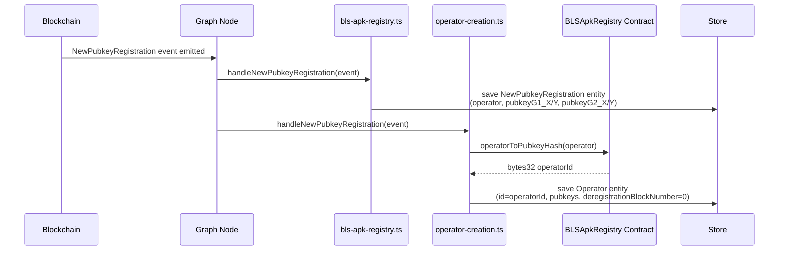
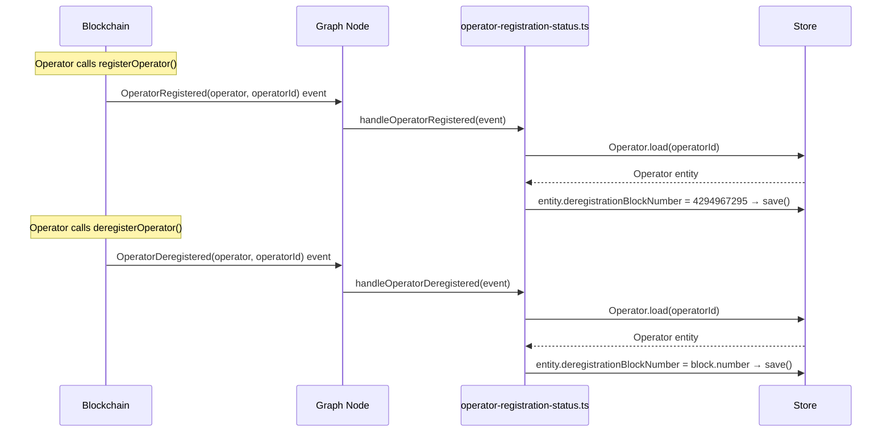
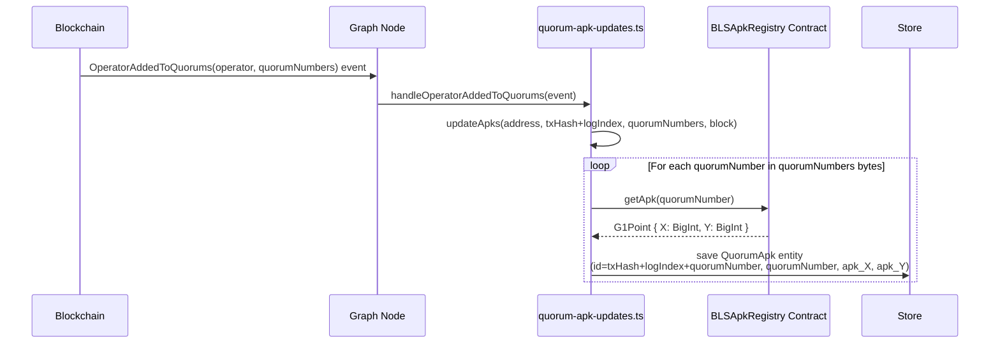
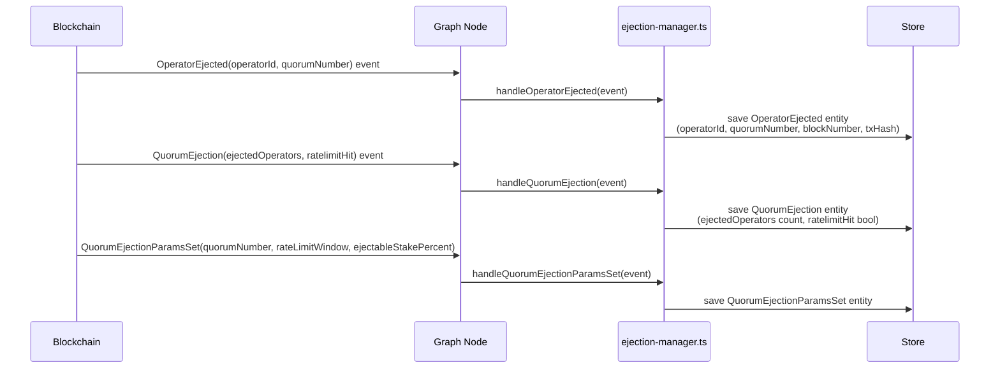

# eigenda-operator-state Analysis

**Analyzed by**: code-analyzer-eigenda-operator-state
**Timestamp**: 2026-04-10T00:00:00Z
**Application Type**: typescript-package
**Classification**: library (The Graph Protocol subgraph)
**Location**: subgraphs/eigenda-operator-state
**Version**: v0.7.0

## Architecture

The eigenda-operator-state component is a The Graph Protocol subgraph that indexes on-chain events emitted by EigenDA's smart contract infrastructure — specifically the `RegistryCoordinator`, `BLSApkRegistry`, and `EjectionManager` contracts. It is written in AssemblyScript (a TypeScript-like language that compiles to WebAssembly), which is The Graph's required mapping language for performance and sandboxing reasons.

The subgraph follows an event-driven indexing pattern. Rather than polling blockchain state, it listens to emitted Solidity events and converts each event into structured GraphQL entities persisted in The Graph's store. The architecture is entirely stateless from the handler's perspective — each event handler receives an immutable event object, creates or updates entity objects, and calls `entity.save()`. The Graph node runtime manages the underlying database writes.

The subgraph is split into six distinct data source mappings in `subgraph.template.yaml`, each targeting a specific contract address and event set. Three data sources use the `BLSApkRegistry` contract address but each writes to different entity types, allowing the same event to be handled by independent mapping modules without cross-file coupling. This pattern keeps handler concerns separated: raw event recording (audit log storage), operator lifecycle management, and aggregate quorum APK tracking are all handled by distinct files.

Deployment configuration is managed through Mustache templates. A set of environment-specific JSON files (`mainnet.json`, `sepolia.json`, `hoodi.json`, `anvil.json`, `devnet.json`, `preprod-hoodi.json`) are merged with `subgraph.template.yaml` at build time to produce the final `subgraph.yaml` manifest with concrete contract addresses and start blocks. This enables the same codebase to be deployed across multiple networks without source changes.

## Key Components

- **`src/registry-coordinator.ts`** (`subgraphs/eigenda-operator-state/src/registry-coordinator.ts`): Handles five events emitted by the `RegistryCoordinator` contract: `ChurnApproverUpdated`, `OperatorDeregistered`, `OperatorRegistered`, `OperatorSetParamsUpdated`, and `OperatorSocketUpdate`. Each handler creates a new immutable entity using a composite key of `transactionHash.concatI32(logIndex)` and persists it to the store. These entities form the raw audit log of coordinator activity.

- **`src/bls-apk-registry.ts`** (`subgraphs/eigenda-operator-state/src/bls-apk-registry.ts`): Handles three events from the `BLSApkRegistry` contract: `OperatorAddedToQuorums`, `OperatorRemovedFromQuorums`, and `NewPubkeyRegistration`. Stores each event as an immutable entity capturing operator address, quorum membership changes, and BLS public key coordinates (both G1 and G2 curve points as BigInt tuples).

- **`src/operator-creation.ts`** (`subgraphs/eigenda-operator-state/src/operator-creation.ts`): Creates mutable `Operator` entities when a `NewPubkeyRegistration` event is emitted from the `BLSApkRegistry_Operator` data source. This is notable because it makes a live contract call via `BLSApkRegistry.bind(event.address).operatorToPubkeyHash(event.params.operator)` to derive the operator's `bytes32` ID, which is used as the entity primary key. Sets `deregistrationBlockNumber` to `0` on creation, indicating the operator has not yet actively registered.

- **`src/operator-registration-status.ts`** (`subgraphs/eigenda-operator-state/src/operator-registration-status.ts`): Manages the registration lifecycle of the mutable `Operator` entity. `handleOperatorRegistered` sets `deregistrationBlockNumber` to `4294967295` (uint32 max, used as a sentinel for "currently active") and `handleOperatorDeregistered` sets it to the actual block number of deregistration. Both handlers use `Operator.load(operatorId)` and log an error if the entity is not found.

- **`src/quorum-apk-updates.ts`** (`subgraphs/eigenda-operator-state/src/quorum-apk-updates.ts`): Handles `OperatorAddedToQuorums` and `OperatorRemovedFromQuorums` events to maintain a history of the aggregate BLS public keys (APKs) per quorum. For each affected quorum number in the event's `quorumNumbers` bytes array, it calls `BLSApkRegistry.bind(address).getApk(quorumNumber)` on-chain to read the current aggregate key and stores a new immutable `QuorumApk` entity. This produces a time-series of quorum APK states keyed by `txHash + logIndex + quorumNumber`.

- **`src/ejection-manager.ts`** (`subgraphs/eigenda-operator-state/src/ejection-manager.ts`): Handles all events emitted by the `EjectionManager` contract: `EjectorUpdated`, `Initialized`, `OperatorEjected`, `OwnershipTransferred`, `QuorumEjection`, and `QuorumEjectionParamsSet`. Stores each as an immutable entity. The `QuorumEjection` entity captures `ejectedOperators` (count) and `ratelimitHit` (bool), while `QuorumEjectionParamsSet` records the per-quorum rate limiting configuration (`rateLimitWindow`, `ejectableStakePercent`).

- **`schema.graphql`** (`subgraphs/eigenda-operator-state/schema.graphql`): Defines the GraphQL schema consumed by downstream clients. Contains 15 entity types total: 13 immutable event-log entities and 2 mutable aggregate entities (`Operator` and `QuorumApk`). The `Operator` entity uses a `@derivedFrom` relationship to expose `socketUpdates` as a virtual field — all `OperatorSocketUpdate` entities whose `operatorId` field references the `Operator` ID are returned without storing the reverse link explicitly.

- **`templates/subgraph.template.yaml`** (`subgraphs/eigenda-operator-state/templates/subgraph.template.yaml`): The Mustache-templated subgraph manifest defining the six data sources and their event handler bindings. Uses `{{network}}`, `{{RegistryCoordinator_address}}`, `{{BLSApkRegistry_address}}`, `{{EjectionManager_address}}`, and corresponding `startBlock` placeholders that are filled per-environment.

- **`abis/`** (`subgraphs/eigenda-operator-state/abis/`): Contains three ABI JSON files (`RegistryCoordinator.json`, `BLSApkRegistry.json`, `EjectionManager.json`) that drive both The Graph's code generation (producing typed event classes and contract bindings in `generated/`) and the event decoding at index time.

## Data Flows

### 1. Operator Registration Flow

**Flow Description**: An EigenDA operator submits a BLS public key registration transaction on-chain; the subgraph captures it and builds the canonical `Operator` entity.



**Detailed Steps**:

1. **Event Emission** (Blockchain to Graph Node)
   - The `BLSApkRegistry` contract emits `NewPubkeyRegistration(operator, pubkeyG1, pubkeyG2)` when an operator registers their BLS key pair.
   - Both `BLSApkRegistry` and `BLSApkRegistry_Operator` data sources are subscribed to this event.

2. **Raw Event Storage** (`bls-apk-registry.ts`)
   - Creates a `NewPubkeyRegistration` entity with an ID of `txHash.concatI32(logIndex)`.
   - Stores G1 coordinates as two `BigInt` fields and G2 coordinates as two `[BigInt!]!` array fields.

3. **Operator Entity Creation** (`operator-creation.ts`)
   - Calls `BLSApkRegistry.bind(event.address).operatorToPubkeyHash(event.params.operator)` to resolve the deterministic `bytes32` operator ID.
   - Creates the mutable `Operator` entity keyed by this hash (not the operator address).
   - Sets `deregistrationBlockNumber = 0` as initial state.

**Error Paths**:
- If the contract call `operatorToPubkeyHash` reverts, The Graph node will retry block indexing. There is no explicit try-catch in this handler.

---

### 2. Operator Lifecycle State Transitions

**Flow Description**: After initial creation, an `Operator` entity's registration status changes on `OperatorRegistered` and `OperatorDeregistered` events from the `RegistryCoordinator`.



**Detailed Steps**:

1. **Registration** — `handleOperatorRegistered`
   - Loads the existing `Operator` entity by `operatorId` (bytes32).
   - If not found, logs an error and returns (soft failure, entity not created or updated).
   - Sets `deregistrationBlockNumber = BigInt.fromU32(4294967295)` — uint32 max acts as a sentinel meaning "currently registered/active".

2. **Deregistration** — `handleOperatorDeregistered`
   - Loads the existing `Operator` entity by `operatorId`.
   - If not found, logs an error and returns.
   - Sets `deregistrationBlockNumber = event.block.number` — records the exact block at which the operator left.

**Key Technical Details**:
- The sentinel value `4294967295` (0xFFFFFFFF) enables efficient range queries: clients can find all currently-active operators by filtering `deregistrationBlockNumber = 4294967295`, and find historical participants with `deregistrationBlockNumber < someBlock`.

---

### 3. Quorum APK Snapshot Flow

**Flow Description**: Each time an operator is added to or removed from quorums, the subgraph fetches the current aggregate BLS public key for each affected quorum and records it as a time-stamped snapshot.



**Detailed Steps**:

1. **Event Trigger** — Either `OperatorAddedToQuorums` or `OperatorRemovedFromQuorums` from `BLSApkRegistry`.
2. **Shared Logic** — Both handlers delegate to `updateApks(address, idPrefix, quorumNumbers, blockNumber, blockTimestamp)`.
3. **Iteration** — Iterates over the raw bytes in `quorumNumbers`; each byte is an 8-bit quorum identifier.
4. **Contract Read** — For each quorum, calls `BLSApkRegistry.getApk(quorumNumber)` which returns the current aggregate G1 point.
5. **Entity Persistence** — Each `QuorumApk` is immutable and gets a unique composite ID ensuring historical snapshots are never overwritten.

---

### 4. Ejection Event Indexing Flow

**Flow Description**: The `EjectionManager` contract governs rate-limited operator ejection; the subgraph captures all related events as queryable entities.



**Detailed Steps**:

1. Individual operator ejections are recorded with the operator's `bytes32` ID and quorum number.
2. Batch ejection summary (`QuorumEjection`) records the count of ejected operators and whether the rate limit was hit.
3. Rate limit configuration changes (`QuorumEjectionParamsSet`) record `rateLimitWindow` (uint32 seconds) and `ejectableStakePercent` (uint16 in basis points).

## Dependencies

### External Libraries

- **@graphprotocol/graph-cli** (^0.98.0) [build-tool]: The Graph Protocol's command-line tool used to codegen AssemblyScript types from the schema and ABIs, build the subgraph WASM bundle, and deploy to a Graph node. Consumed via `package.json` scripts (`graph codegen`, `graph build`, `graph deploy`, `graph test`) at build/deploy time. Not imported directly in source files.

- **@graphprotocol/graph-ts** (^0.38.0) [blockchain]: The Graph's AssemblyScript standard library providing core primitives for subgraph mappings. Provides `BigInt`, `Bytes`, `Address`, `log`, and `ethereum` namespaces used throughout all mapping files, as well as the generated contract binding base classes and the entity base class with `.save()` and `.load()` methods. Imported in `src/operator-creation.ts` (lines 1), `src/operator-registration-status.ts` (line 1), `src/quorum-apk-updates.ts` (line 1), and all test utility files.

- **matchstick-as** (^0.6.0) [testing]: The Graph's unit testing framework for AssemblyScript subgraph mappings. Provides `assert`, `describe`, `test`, `clearStore`, `beforeAll`, `afterAll`, `createMockedFunction`, and `newMockEvent` utilities for simulating events and mocking contract calls without connecting to a live blockchain node. Used exclusively in `tests/operator-state.test.ts` and `tests/quorum-apk.test.ts`.

- **mustache** (^4.0.1) [build-tool]: A logic-less Mustache template engine for JavaScript. Used by the `prepare:*` npm scripts to render `templates/subgraph.template.yaml` with environment-specific JSON data files (e.g., `mainnet.json`, `sepolia.json`) and output a concrete `subgraph.yaml` manifest. Invoked via `mustache <values.json> <template.yaml> > subgraph.yaml` at build time; not imported in source files.

- **assemblyscript** (^0.19.0) [build-tool]: The AssemblyScript compiler that transpiles the TypeScript-like mapping source files to WebAssembly modules executed by The Graph node. This is a transitive dependency required by `@graphprotocol/graph-cli`. Not imported directly in source — consumed by the graph-cli build pipeline.

### Internal Libraries

This component has no internal library dependencies within the EigenDA monorepo. It depends solely on EigenDA smart contracts via ABI JSON files in the `abis/` directory, and on external The Graph packages.

## API Surface

The eigenda-operator-state subgraph exposes a **GraphQL API** served by The Graph node after deployment. Downstream applications query this API to read indexed EigenDA operator state. The API is defined by `schema.graphql` and supports standard The Graph filtering, ordering, and pagination patterns.

### GraphQL Entity Types (Queryable)

#### Mutable Aggregate Entities

**Operator** — The primary mutable entity representing a registered EigenDA operator:
```graphql
type Operator @entity(immutable: false) {
  id: Bytes!                          # bytes32 pubkey hash (operator ID)
  operator: Bytes!                    # Ethereum address
  pubkeyG1_X: BigInt!
  pubkeyG1_Y: BigInt!
  pubkeyG2_X: [BigInt!]!
  pubkeyG2_Y: [BigInt!]!
  deregistrationBlockNumber: BigInt!  # 0=created, 4294967295=active, N=deregistered at block N
  socketUpdates: [OperatorSocketUpdate!]! @derivedFrom(field: "operatorId")
}
```

**QuorumApk** — Time-series snapshots of the aggregate BLS public key per quorum:
```graphql
type QuorumApk @entity(immutable: true) {
  id: Bytes!            # txHash + logIndex + quorumNumber (composite)
  quorumNumber: Int!
  apk_X: BigInt!
  apk_Y: BigInt!
  blockNumber: BigInt!
  blockTimestamp: BigInt!
}
```

#### Immutable Event Log Entities

All of the following entities are `@entity(immutable: true)` and form a queryable audit log:

- **ChurnApproverUpdated**: `prevChurnApprover`, `newChurnApprover`, block metadata
- **OperatorRegistered**: `operator` (address), `operatorId` (bytes32), block metadata
- **OperatorDeregistered**: `operator`, `operatorId`, block metadata
- **OperatorSetParamsUpdated**: `quorumNumber`, `operatorSetParams_maxOperatorCount`, `operatorSetParams_kickBIPsOfOperatorStake`, `operatorSetParams_kickBIPsOfTotalStake`, block metadata
- **OperatorSocketUpdate**: `operatorId` (reference to `Operator`), `socket` (string), block metadata
- **NewPubkeyRegistration**: `operator`, `pubkeyG1_X/Y`, `pubkeyG2_X/Y`, block metadata
- **OperatorAddedToQuorum / OperatorRemovedFromQuorum**: `operator`, `quorumNumbers` (bytes), block metadata
- **EjectorUpdated**: `ejector` (address), `status` (bool), block metadata
- **Initialized**: `version` (uint8), block metadata
- **OperatorEjected**: `operatorId` (bytes32), `quorumNumber` (uint8), block metadata
- **OwnershipTransferred**: `previousOwner`, `newOwner`, block metadata
- **QuorumEjection**: `ejectedOperators` (uint32 count), `ratelimitHit` (bool), block metadata
- **QuorumEjectionParamsSet**: `quorumNumber`, `rateLimitWindow` (uint32), `ejectableStakePercent` (uint16), block metadata

### Example GraphQL Queries

**Find all currently active operators:**
```graphql
{
  operators(where: { deregistrationBlockNumber: "4294967295" }) {
    id
    operator
    pubkeyG1_X
    pubkeyG1_Y
    socketUpdates {
      socket
      blockNumber
    }
  }
}
```

**Get latest APK snapshot for quorum 0:**
```graphql
{
  quorumApks(
    where: { quorumNumber: 0 }
    orderBy: blockNumber
    orderDirection: desc
    first: 1
  ) {
    apk_X
    apk_Y
    blockNumber
    blockTimestamp
  }
}
```

**Get operators ejected from quorum 0:**
```graphql
{
  operatorEjecteds(
    where: { quorumNumber: 0 }
    orderBy: blockNumber
    orderDirection: desc
  ) {
    operatorId
    quorumNumber
    blockNumber
    transactionHash
  }
}
```

## Code Examples

### Example 1: Entity ID Construction Pattern

All handlers use the same composite key for immutable event entities to guarantee uniqueness across all events in a transaction.

```typescript
// src/registry-coordinator.ts — lines 20-22
let entity = new ChurnApproverUpdated(
  event.transaction.hash.concatI32(event.logIndex.toI32())
)
```

This creates a deterministic 36-byte ID: 32 bytes of transaction hash concatenated with the 4-byte log index. This is idempotent if the same event is reprocessed (replay safety).

### Example 2: Live Contract Call During Indexing

The operator-creation handler makes a live call to the smart contract to resolve the operator ID hash.

```typescript
// src/operator-creation.ts — lines 9-12
let apkRegistry = BLSApkRegistry.bind(event.address)

let entity = new Operator(
  apkRegistry.operatorToPubkeyHash(event.params.operator) // this is the operator id
)
```

### Example 3: Registration Status Sentinel Pattern

The registration lifecycle uses uint32 max as a sentinel value to encode "currently active" without a separate boolean field.

```typescript
// src/operator-registration-status.ts — lines 22-31
export function handleOperatorRegistered(event: OperatorRegisteredEvent) : void {
  let entity = Operator.load(event.params.operatorId)
  if (entity == null) {
    log.error("Operator {} not found", [event.params.operatorId.toString()])
    return
  }

  entity.deregistrationBlockNumber = BigInt.fromU32(4294967295)

  entity.save()
}
```

### Example 4: Multi-Quorum APK Update Loop

The quorum APK handler iterates over all quorum numbers encoded as raw bytes, making a contract call for each.

```typescript
// src/quorum-apk-updates.ts — lines 23-41
function updateApks(blsApkRegistryAddress: Address, quorumApkIdPrefix: Bytes, quorumNumbers: Bytes, blockNumber: BigInt, blockTimestamp: BigInt): void {
    let blsApkRegistry = BLSApkRegistry.bind(blsApkRegistryAddress)
    for (let i = 0; i < quorumNumbers.length; i++) {
        let quorumNumber = quorumNumbers[i]
        let quorumApk = new QuorumApk(
            quorumApkIdPrefix.concatI32(quorumNumber)
        )
        quorumApk.quorumNumber = quorumNumber
        let apk = blsApkRegistry.getApk(quorumNumber)
        quorumApk.apk_X = apk.X
        quorumApk.apk_Y = apk.Y
        quorumApk.blockNumber = blockNumber
        quorumApk.blockTimestamp = blockTimestamp
        quorumApk.save()
    }
}
```

### Example 5: Matchstick Unit Test with Mocked Contract Call

```typescript
// tests/operator-state.test.ts — lines 39-44
createMockedFunction(
  newPubkeyRegistrationEvent.address,
  'operatorToPubkeyHash',
  'operatorToPubkeyHash(address):(bytes32)'
)
  .withArgs([ethereum.Value.fromAddress(operator)])
  .returns([ethereum.Value.fromBytes(pubkeyHash)])

handleNewPubkeyRegistration(newPubkeyRegistrationEvent)
```

Matchstick allows mocking the `operatorToPubkeyHash` contract call so tests run without a live blockchain node.

## Files Analyzed

- `subgraphs/eigenda-operator-state/package.json` (27 lines) - Package manifest with build scripts and devDependencies
- `subgraphs/eigenda-operator-state/schema.graphql` (161 lines) - GraphQL entity schema defining 15 entity types
- `subgraphs/eigenda-operator-state/templates/subgraph.template.yaml` (164 lines) - Mustache template for subgraph manifest with 6 data sources
- `subgraphs/eigenda-operator-state/src/registry-coordinator.ts` (98 lines) - RegistryCoordinator event handlers
- `subgraphs/eigenda-operator-state/src/bls-apk-registry.ts` (65 lines) - BLSApkRegistry event handlers for pubkey and quorum membership events
- `subgraphs/eigenda-operator-state/src/operator-creation.ts` (23 lines) - Operator entity creation with live contract call
- `subgraphs/eigenda-operator-state/src/operator-registration-status.ts` (33 lines) - Operator registration lifecycle management
- `subgraphs/eigenda-operator-state/src/quorum-apk-updates.ts` (42 lines) - Quorum aggregate BLS public key snapshot handler
- `subgraphs/eigenda-operator-state/src/ejection-manager.ts` (105 lines) - EjectionManager event handlers
- `subgraphs/eigenda-operator-state/tests/operator-state.test.ts` (167 lines) - Matchstick unit tests for operator lifecycle
- `subgraphs/eigenda-operator-state/tests/operator-state-utils.ts` (125 lines) - Test event factory functions
- `subgraphs/eigenda-operator-state/tests/quorum-apk.test.ts` (121 lines) - Matchstick unit tests for quorum APK updates
- `subgraphs/eigenda-operator-state/tests/quorum-apk-utils.ts` (49 lines) - Test event factory functions for quorum tests
- `subgraphs/eigenda-operator-state/templates/mainnet.json` (9 lines) - Mainnet contract addresses and start blocks
- `subgraphs/eigenda-operator-state/templates/sepolia.json` (9 lines) - Sepolia testnet contract addresses
- `subgraphs/eigenda-operator-state/templates/hoodi.json` (9 lines) - Hoodi testnet contract addresses
- `subgraphs/eigenda-operator-state/templates/anvil.json` (9 lines) - Local Anvil dev environment (zero addresses)
- `subgraphs/eigenda-operator-state/.matchstickrc.yaml` (5 lines) - Matchstick test runner configuration
- `subgraphs/eigenda-operator-state/VERSION` (1 line) - Version string v0.7.0
- `subgraphs/eigenda-operator-state/abis/RegistryCoordinator.json` - Contract ABI for RegistryCoordinator
- `subgraphs/eigenda-operator-state/abis/BLSApkRegistry.json` - Contract ABI for BLSApkRegistry
- `subgraphs/eigenda-operator-state/abis/EjectionManager.json` - Contract ABI for EjectionManager

## Analysis Data

```json
{
  "summary": "eigenda-operator-state is a The Graph Protocol subgraph (v0.7.0) written in AssemblyScript that indexes EigenDA operator state events from three EigenLayer smart contracts — RegistryCoordinator, BLSApkRegistry, and EjectionManager — across multiple Ethereum networks (mainnet, Sepolia, Hoodi, and local Anvil). It exposes 15 GraphQL entity types covering operator BLS public key registration, quorum membership changes, registration and deregistration lifecycle with a sentinel-value pattern (uint32 max = active), aggregate quorum APK time-series snapshots obtained via live contract calls, and ejection governance events. The subgraph uses Mustache template rendering for multi-network deployment configuration and six separate data source mappings to cleanly separate handler concerns.",
  "architecture_pattern": "event-driven",
  "key_modules": [
    "src/registry-coordinator.ts",
    "src/bls-apk-registry.ts",
    "src/operator-creation.ts",
    "src/operator-registration-status.ts",
    "src/quorum-apk-updates.ts",
    "src/ejection-manager.ts",
    "schema.graphql",
    "templates/subgraph.template.yaml"
  ],
  "api_endpoints": [
    "GraphQL: Operator entity (mutable, keyed by bytes32 pubkey hash)",
    "GraphQL: QuorumApk entity (immutable time-series, per quorum per event)",
    "GraphQL: OperatorRegistered entity",
    "GraphQL: OperatorDeregistered entity",
    "GraphQL: NewPubkeyRegistration entity",
    "GraphQL: OperatorAddedToQuorum entity",
    "GraphQL: OperatorRemovedFromQuorum entity",
    "GraphQL: OperatorSocketUpdate entity",
    "GraphQL: OperatorSetParamsUpdated entity",
    "GraphQL: ChurnApproverUpdated entity",
    "GraphQL: OperatorEjected entity",
    "GraphQL: QuorumEjection entity",
    "GraphQL: QuorumEjectionParamsSet entity",
    "GraphQL: EjectorUpdated entity",
    "GraphQL: Initialized entity",
    "GraphQL: OwnershipTransferred entity"
  ],
  "data_flows": [
    "NewPubkeyRegistration event -> bls-apk-registry.ts (immutable log entity) + operator-creation.ts (mutable Operator entity via operatorToPubkeyHash contract call)",
    "OperatorRegistered event -> operator-registration-status.ts (sets Operator.deregistrationBlockNumber=4294967295)",
    "OperatorDeregistered event -> operator-registration-status.ts (sets Operator.deregistrationBlockNumber=block.number)",
    "OperatorAddedToQuorums or OperatorRemovedFromQuorums -> quorum-apk-updates.ts (BLSApkRegistry.getApk() per quorum -> immutable QuorumApk snapshot entity)",
    "OperatorEjected/QuorumEjection/QuorumEjectionParamsSet -> ejection-manager.ts (immutable event log entities)"
  ],
  "tech_stack": [
    "assemblyscript",
    "the-graph",
    "graphql",
    "mustache",
    "matchstick-as",
    "ethereum",
    "eigenlayer"
  ],
  "external_integrations": [
    "The Graph Protocol node (hosted service or self-hosted graph-node)",
    "RegistryCoordinator smart contract (EigenLayer/EigenDA)",
    "BLSApkRegistry smart contract (EigenLayer/EigenDA)",
    "EjectionManager smart contract (EigenDA)"
  ],
  "component_interactions": []
}
```

## Citations

```json
[
  {
    "file_path": "subgraphs/eigenda-operator-state/package.json",
    "start_line": 20,
    "end_line": 26,
    "claim": "Component devDependencies include @graphprotocol/graph-cli ^0.98.0, @graphprotocol/graph-ts ^0.38.0, matchstick-as ^0.6.0, mustache ^4.0.1, and assemblyscript ^0.19.0",
    "section": "Dependencies",
    "snippet": "\"devDependencies\": {\n    \"@graphprotocol/graph-cli\": \"^0.98.0\",\n    \"@graphprotocol/graph-ts\": \"^0.38.0\",\n    \"matchstick-as\": \"^0.6.0\",\n    \"mustache\": \"^4.0.1\",\n    \"assemblyscript\": \"^0.19.0\"\n  }"
  },
  {
    "file_path": "subgraphs/eigenda-operator-state/package.json",
    "start_line": 4,
    "end_line": 18,
    "claim": "Multi-network deployment uses mustache template prepare scripts (prepare:mainnet, prepare:sepolia, prepare:hoodi, etc.) and deploys to Layr-Labs/eigenda-operator-state on The Graph hosted service",
    "section": "Architecture",
    "snippet": "\"prepare:mainnet\": \"mustache templates/mainnet.json templates/subgraph.template.yaml > subgraph.yaml\",\n\"deploy\": \"graph deploy --node https://api.thegraph.com/deploy/ Layr-Labs/eigenda-operator-state\""
  },
  {
    "file_path": "subgraphs/eigenda-operator-state/schema.graphql",
    "start_line": 142,
    "end_line": 151,
    "claim": "The Operator entity is mutable (immutable: false) and uses deregistrationBlockNumber as a lifecycle sentinel, with a @derivedFrom virtual field for socketUpdates",
    "section": "Key Components",
    "snippet": "type Operator @entity(immutable: false) {\n  id: Bytes!\n  operator: Bytes!\n  pubkeyG1_X: BigInt!\n  pubkeyG1_Y: BigInt!\n  pubkeyG2_X: [BigInt!]!\n  pubkeyG2_Y: [BigInt!]!\n  deregistrationBlockNumber: BigInt!\n  socketUpdates: [OperatorSocketUpdate!]! @derivedFrom(field: \"operatorId\")\n}"
  },
  {
    "file_path": "subgraphs/eigenda-operator-state/schema.graphql",
    "start_line": 153,
    "end_line": 160,
    "claim": "QuorumApk is an immutable entity storing per-quorum aggregate BLS public key snapshots with a composite id and block-level timestamps",
    "section": "Key Components",
    "snippet": "type QuorumApk @entity(immutable: true) {\n  id: Bytes!\n  quorumNumber: Int!\n  apk_X: BigInt!\n  apk_Y: BigInt!\n  blockNumber: BigInt!\n  blockTimestamp: BigInt!\n}"
  },
  {
    "file_path": "subgraphs/eigenda-operator-state/templates/subgraph.template.yaml",
    "start_line": 1,
    "end_line": 10,
    "claim": "The subgraph uses specVersion 0.0.5 and the RegistryCoordinator is the first data source with network and address filled by Mustache templates",
    "section": "Architecture",
    "snippet": "specVersion: 0.0.5\nschema:\n  file: ./schema.graphql\ndataSources:\n  - kind: ethereum\n    name: RegistryCoordinator\n    network: {{network}}\n    source:\n      address: \"{{RegistryCoordinator_address}}\""
  },
  {
    "file_path": "subgraphs/eigenda-operator-state/templates/subgraph.template.yaml",
    "start_line": 63,
    "end_line": 82,
    "claim": "BLSApkRegistry_Operator is a separate data source targeting the same BLSApkRegistry address but routing NewPubkeyRegistration to operator-creation.ts for mutable Operator entity creation",
    "section": "Architecture",
    "snippet": "  - kind: ethereum\n    name: BLSApkRegistry_Operator\n    network: {{network}}\n    source:\n      address: \"{{BLSApkRegistry_address}}\"\n    ...\n      file: ./src/operator-creation.ts"
  },
  {
    "file_path": "subgraphs/eigenda-operator-state/templates/subgraph.template.yaml",
    "start_line": 107,
    "end_line": 128,
    "claim": "BLSApkRegistry_QuorumApkUpdates is a third data source on the same BLSApkRegistry address, routing OperatorAddedToQuorums and OperatorRemovedFromQuorums to quorum-apk-updates.ts",
    "section": "Architecture",
    "snippet": "  - kind: ethereum\n    name: BLSApkRegistry_QuorumApkUpdates\n    ...\n      file: ./src/quorum-apk-updates.ts"
  },
  {
    "file_path": "subgraphs/eigenda-operator-state/src/registry-coordinator.ts",
    "start_line": 20,
    "end_line": 22,
    "claim": "All immutable event entities use event.transaction.hash.concatI32(event.logIndex.toI32()) as a composite unique key for replay-safe idempotent storage",
    "section": "Key Components",
    "snippet": "let entity = new ChurnApproverUpdated(\n    event.transaction.hash.concatI32(event.logIndex.toI32())\n  )"
  },
  {
    "file_path": "subgraphs/eigenda-operator-state/src/registry-coordinator.ts",
    "start_line": 84,
    "end_line": 97,
    "claim": "handleOperatorSocketUpdate stores the OperatorSocketUpdate entity with operatorId linking back to the Operator entity, enabling the @derivedFrom virtual field relationship",
    "section": "Key Components",
    "snippet": "let entity = new OperatorSocketUpdate(\n    event.transaction.hash.concatI32(event.logIndex.toI32())\n  )\n  entity.operatorId = event.params.operatorId\n  entity.socket = event.params.socket"
  },
  {
    "file_path": "subgraphs/eigenda-operator-state/src/operator-creation.ts",
    "start_line": 9,
    "end_line": 12,
    "claim": "operator-creation.ts makes a live eth_call to BLSApkRegistry.operatorToPubkeyHash() to resolve the bytes32 operator ID used as the Operator entity primary key",
    "section": "Key Components",
    "snippet": "let apkRegistry = BLSApkRegistry.bind(event.address)\n\nlet entity = new Operator(\n    apkRegistry.operatorToPubkeyHash(event.params.operator)"
  },
  {
    "file_path": "subgraphs/eigenda-operator-state/src/operator-creation.ts",
    "start_line": 20,
    "end_line": 21,
    "claim": "The Operator entity is initialized with deregistrationBlockNumber=0 when first created from a NewPubkeyRegistration event",
    "section": "Data Flows",
    "snippet": "entity.deregistrationBlockNumber = BigInt.fromI32(0)"
  },
  {
    "file_path": "subgraphs/eigenda-operator-state/src/operator-registration-status.ts",
    "start_line": 22,
    "end_line": 32,
    "claim": "handleOperatorRegistered sets deregistrationBlockNumber to 4294967295 (uint32 max) as a sentinel meaning currently-active operator; soft fails with log.error if operator not found",
    "section": "Data Flows",
    "snippet": "let entity = Operator.load(event.params.operatorId)\n  if (entity == null) {\n    log.error(\"Operator {} not found\", [event.params.operatorId.toString()])\n    return\n  }\n  entity.deregistrationBlockNumber = BigInt.fromU32(4294967295)"
  },
  {
    "file_path": "subgraphs/eigenda-operator-state/src/operator-registration-status.ts",
    "start_line": 10,
    "end_line": 19,
    "claim": "handleOperatorDeregistered records the exact block number when the operator left as deregistrationBlockNumber; soft fails with log.error if operator entity not found",
    "section": "Data Flows",
    "snippet": "let entity = Operator.load(event.params.operatorId)\n  if (entity == null) {\n    log.error(\"Operator {} not found\", [event.params.operatorId.toString()])\n    return\n  }\n  entity.deregistrationBlockNumber = event.block.number"
  },
  {
    "file_path": "subgraphs/eigenda-operator-state/src/quorum-apk-updates.ts",
    "start_line": 23,
    "end_line": 41,
    "claim": "updateApks iterates over quorumNumbers bytes and for each quorum calls BLSApkRegistry.getApk() on-chain, creating an immutable QuorumApk entity with a composite id (txHash+logIndex+quorumNumber)",
    "section": "Data Flows",
    "snippet": "let blsApkRegistry = BLSApkRegistry.bind(blsApkRegistryAddress)\n    for (let i = 0; i < quorumNumbers.length; i++) {\n        let quorumNumber = quorumNumbers[i]\n        let quorumApk = new QuorumApk(quorumApkIdPrefix.concatI32(quorumNumber))\n        let apk = blsApkRegistry.getApk(quorumNumber)\n        quorumApk.apk_X = apk.X\n        quorumApk.apk_Y = apk.Y"
  },
  {
    "file_path": "subgraphs/eigenda-operator-state/src/ejection-manager.ts",
    "start_line": 75,
    "end_line": 87,
    "claim": "handleQuorumEjection records the count of ejected operators and whether the rate limit was triggered in an immutable QuorumEjection entity",
    "section": "Key Components",
    "snippet": "entity.ejectedOperators = event.params.ejectedOperators\n  entity.ratelimitHit = event.params.ratelimitHit"
  },
  {
    "file_path": "subgraphs/eigenda-operator-state/src/ejection-manager.ts",
    "start_line": 89,
    "end_line": 103,
    "claim": "handleQuorumEjectionParamsSet captures per-quorum governance parameters rateLimitWindow and ejectableStakePercent",
    "section": "Key Components",
    "snippet": "entity.quorumNumber = event.params.quorumNumber\n  entity.rateLimitWindow = event.params.rateLimitWindow\n  entity.ejectableStakePercent = event.params.ejectableStakePercent"
  },
  {
    "file_path": "subgraphs/eigenda-operator-state/templates/mainnet.json",
    "start_line": 1,
    "end_line": 9,
    "claim": "Mainnet deployment targets RegistryCoordinator at 0x0BAAc79acD45A023E19345c352d8a7a83C4e5656 (startBlock 19592322) and EjectionManager at 0x130d8EA0052B45554e4C99079B84df292149Bd5E (startBlock 19839949)",
    "section": "Architecture",
    "snippet": "{\n  \"network\": \"mainnet\",\n  \"RegistryCoordinator_address\": \"0x0BAAc79acD45A023E19345c352d8a7a83C4e5656\",\n  \"RegistryCoordinator_startBlock\": 19592322,\n  \"EjectionManager_address\": \"0x130d8EA0052B45554e4C99079B84df292149Bd5E\",\n  \"EjectionManager_startBlock\": 19839949\n}"
  },
  {
    "file_path": "subgraphs/eigenda-operator-state/tests/operator-state.test.ts",
    "start_line": 39,
    "end_line": 44,
    "claim": "Tests use Matchstick's createMockedFunction to stub the operatorToPubkeyHash contract call so tests run without a live blockchain node",
    "section": "Dependencies",
    "snippet": "createMockedFunction(newPubkeyRegistrationEvent.address, 'operatorToPubkeyHash', 'operatorToPubkeyHash(address):(bytes32)')\n      .withArgs([ethereum.Value.fromAddress(operator)])\n      .returns([ethereum.Value.fromBytes(pubkeyHash)])"
  },
  {
    "file_path": "subgraphs/eigenda-operator-state/tests/operator-state.test.ts",
    "start_line": 83,
    "end_line": 118,
    "claim": "Test verifies the full lifecycle: after handleOperatorRegistered deregistrationBlockNumber = 4294967295; after handleOperatorDeregistered it equals event.block.number",
    "section": "Data Flows",
    "snippet": "handleOperatorRegistered(operatorRegisteredEvent)\nassert.fieldEquals(\"Operator\", pubkeyHash.toHexString(), \"deregistrationBlockNumber\", \"4294967295\")\nhandleOperatorDeregistered(operatorDeregisteredEvent)\nassert.fieldEquals(\"Operator\", pubkeyHash.toHexString(), \"deregistrationBlockNumber\", operatorDeregisteredEvent.block.number.toString())"
  },
  {
    "file_path": "subgraphs/eigenda-operator-state/src/bls-apk-registry.ts",
    "start_line": 48,
    "end_line": 64,
    "claim": "handleNewPubkeyRegistration in bls-apk-registry.ts stores both G1 (X,Y as separate BigInt) and G2 (X,Y as BigInt arrays) BLS public key coordinates",
    "section": "Key Components",
    "snippet": "entity.pubkeyG1_X = event.params.pubkeyG1.X\n  entity.pubkeyG1_Y = event.params.pubkeyG1.Y\n  entity.pubkeyG2_X = event.params.pubkeyG2.X\n  entity.pubkeyG2_Y = event.params.pubkeyG2.Y"
  },
  {
    "file_path": "subgraphs/eigenda-operator-state/.matchstickrc.yaml",
    "start_line": 1,
    "end_line": 5,
    "claim": "Matchstick test runner looks for tests in tests/ folder, libs in node_modules, and the manifest at subgraph.yaml",
    "section": "Dependencies",
    "snippet": "testsFolder: tests\nlibsFolder: node_modules\nmanifestPath: subgraph.yaml\nmatchstick_version: 0.6.0"
  },
  {
    "file_path": "subgraphs/eigenda-operator-state/schema.graphql",
    "start_line": 41,
    "end_line": 48,
    "claim": "OperatorSocketUpdate references Operator by the operatorId field (typed as Operator! not Bytes!), establishing the entity relationship that supports @derivedFrom",
    "section": "API Surface",
    "snippet": "type OperatorSocketUpdate @entity(immutable: true) {\n  id: Bytes!\n  operatorId: Operator! # bytes32\n  socket: String! # string\n  blockNumber: BigInt!\n  blockTimestamp: BigInt!\n  transactionHash: Bytes!\n}"
  },
  {
    "file_path": "subgraphs/eigenda-operator-state/templates/subgraph.template.yaml",
    "start_line": 129,
    "end_line": 163,
    "claim": "The EjectionManager data source handles 6 event types: EjectorUpdated, Initialized, OperatorEjected, OwnershipTransferred, QuorumEjection, and QuorumEjectionParamsSet",
    "section": "Key Components",
    "snippet": "  - kind: ethereum\n    name: EjectionManager\n    ...\n      eventHandlers:\n        - event: EjectorUpdated(address,bool)\n        - event: Initialized(uint8)\n        - event: OperatorEjected(bytes32,uint8)\n        - event: OwnershipTransferred(indexed address,indexed address)\n        - event: QuorumEjection(uint32,bool)\n        - event: QuorumEjectionParamsSet(uint8,uint32,uint16)"
  }
]
```

## Analysis Notes

### Security Considerations

1. **No Input Validation in Handlers**: All handler functions trust event parameters emitted by the smart contracts without additional validation. This is standard subgraph practice — only consensus-verified on-chain events are delivered by The Graph node. If a contract emits malformed events due to a bug, the subgraph would store incorrect data.

2. **Soft Failure on Missing Operator Entity**: Both `handleOperatorRegistered` and `handleOperatorDeregistered` in `operator-registration-status.ts` call `log.error` and return early if the `Operator` entity is not found. This guards against out-of-order event processing during initial sync (if a `RegistryCoordinator` event precedes `BLSApkRegistry_Operator` reaching the same block) but silently produces missing state updates. Downstream clients must be aware that `Operator` entities can miss registration status updates in degenerate sync scenarios.

3. **Live Contract Calls**: `operator-creation.ts` and `quorum-apk-updates.ts` both make `eth_call` requests to smart contracts during indexing. These calls read state at the exact block being processed (deterministic), but introduce a dependency on node RPC availability. If the contract's `operatorToPubkeyHash` or `getApk` returns incorrect data at a given block, the indexed state will be wrong with no recovery mechanism.

4. **ABI Version Lock**: The three ABI JSON files define the exact interface compiled against. If contracts upgrade their ABI (new events, changed parameter types), the subgraph must be redeployed from the new start block or migrated. There is no graceful degradation for unknown event signatures.

### Performance Characteristics

- **Write-heavy during initial sync**: Syncing from `startBlock` to chain head processes every historical event. The `quorum-apk-updates.ts` handler makes one `eth_call` per quorum per qualifying event — for networks with many quorums and frequent operator changes, this generates significant RPC load on the archive node.
- **Immutable entities dominate**: 13 of 15 entity types are immutable. The Graph node can optimize storage for immutable entities since they are never updated after creation.
- **Derived fields are query-time only**: The `socketUpdates` derived field on `Operator` adds no write overhead — it is resolved at query time from `OperatorSocketUpdate` entities.

### Scalability Notes

- **Multi-network via templates**: The Mustache template approach cleanly supports deployment to any EVM-compatible network by adding a new JSON config file. Currently supports mainnet, Sepolia, Hoodi, preprod-Hoodi, Anvil, and devnet.
- **The Graph horizontal scaling**: After indexing, the subgraph is a read-only GraphQL API that scales through The Graph's decentralized network indexers or by running additional replicated graph-node instances.
- **Quorum count growth**: `quorum-apk-updates.ts` loops over quorum numbers bytes linearly, making one contract call per quorum per `OperatorAddedToQuorums` event. As EigenDA adds more quorums, sync time grows proportionally — this is the primary scalability concern for the indexer.
