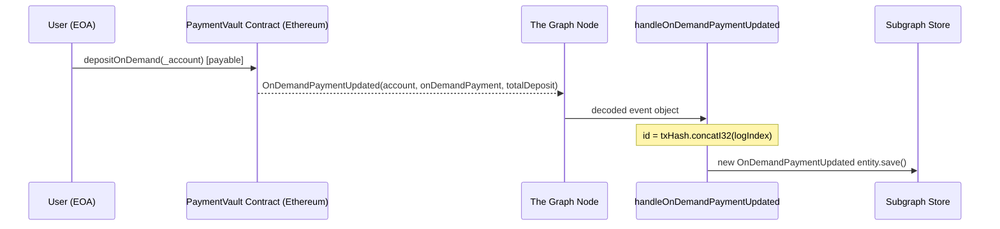
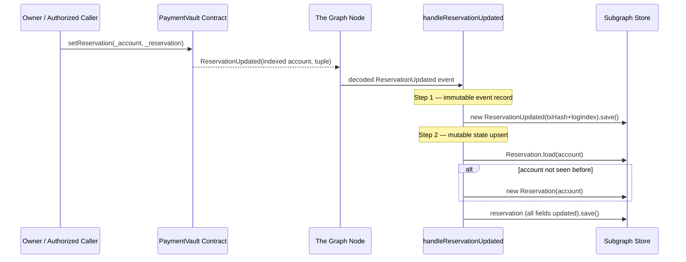
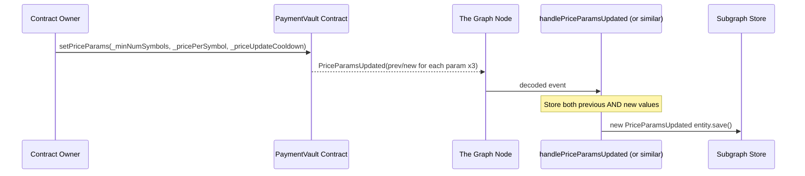
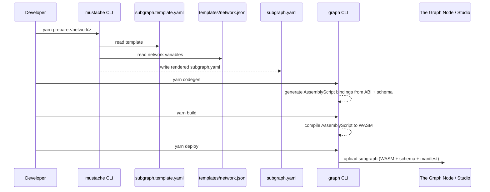

# eigenda-payments Analysis

**Analyzed by**: code-analyzer-eigenda-payments
**Timestamp**: 2026-04-10T00:00:00Z
**Application Type**: typescript-package
**Classification**: library (The Graph Protocol subgraph)
**Location**: subgraphs/eigenda-payments

## Architecture

The `eigenda-payments` subgraph is a The Graph Protocol indexing project written in AssemblyScript (compiled to WebAssembly) that listens to on-chain events emitted by the EigenDA `PaymentVault` smart contract and persists them as queryable GraphQL entities. It follows the standard subgraph architecture mandated by The Graph: a schema-first, event-driven pipeline where Ethereum event logs are decoded against a contract ABI and mapped to typed entities stored in the subgraph's embedded database.

The architecture has two distinct layers of indexed data. The first layer is a direct, immutable mirror of on-chain events: every event the `PaymentVault` contract ever emitted is stored as a permanent, append-only record keyed by `transactionHash + logIndex`. The second layer is mutable, derived state: the `Reservation` entity represents the current (latest) reservation for a given account address, and is updated in-place whenever a new `ReservationUpdated` event arrives. This two-layer pattern lets consumers query both the full event history and the live snapshot of each account's reservation.

Deployment is template-driven via Mustache: a single `subgraph.template.yaml` holds the subgraph manifest with `{{network}}`, `{{PaymentVault_address}}`, and `{{PaymentVault_startBlock}}` placeholders. Pre-populated JSON files in `templates/` (devnet, preprod-hoodi, hoodi, sepolia, mainnet) are rendered through Mustache to produce a concrete `subgraph.yaml` before deploying to any given network. This pattern makes multi-network deployment reproducible and diff-friendly.

The compiled mapping runs in a deterministic WebAssembly sandbox provided by The Graph Node. There is no server, no REST API, and no persistent process: the subgraph is a pure data transformation layer whose query interface is a GraphQL API automatically generated and hosted by The Graph Node from the `schema.graphql` definition.

## Key Components

- **`schema.graphql`** (`subgraphs/eigenda-payments/schema.graphql`): Defines the entire public data model of the subgraph. Contains eight immutable event-mirror types (`GlobalRatePeriodIntervalUpdated`, `GlobalSymbolsPerPeriodUpdated`, `Initialized`, `OnDemandPaymentUpdated`, `OwnershipTransferred`, `PriceParamsUpdated`, `ReservationPeriodIntervalUpdated`, `ReservationUpdated`) and one mutable state-tracking type (`Reservation`). All types are annotated with `@entity`; immutable event records carry `immutable: true` while the `Reservation` entity is mutable (`immutable: false`) to allow in-place updates.

- **`src/payment-vault.ts`** (`subgraphs/eigenda-payments/src/payment-vault.ts`): The sole mapping module. Exports eight handler functions — one per tracked event — that are invoked by The Graph Node whenever a matching event is found in an Ethereum block. Six handlers create and save immutable event records keyed by `txHash.concatI32(logIndex)`. The `handleReservationUpdated` handler additionally upserts the mutable `Reservation` entity keyed by the account address using a `Reservation.load()` / create-if-null pattern.

- **`abis/PaymentVault.json`** (`subgraphs/eigenda-payments/abis/PaymentVault.json`): The Ethereum ABI for the `PaymentVault` contract. Declares all contract functions (e.g., `depositOnDemand`, `setReservation`, `setPriceParams`, `withdraw`) and all events tracked by this subgraph. The Graph's `codegen` step reads this ABI to generate AssemblyScript bindings in `generated/PaymentVault/PaymentVault.ts` that provide type-safe access to decoded event parameters inside the handler functions.

- **`templates/subgraph.template.yaml`** (`subgraphs/eigenda-payments/templates/subgraph.template.yaml`): Mustache template for the subgraph manifest. Declares the data source kind (`ethereum`), maps each event signature to its corresponding handler function, and lists all entity types managed by the mapping. Parameterized for network name, contract address, and start block. Uses `specVersion: 1.2.0` and `prune: auto` indexer hint.

- **`templates/*.json`** (`subgraphs/eigenda-payments/templates/`): Network-specific configuration files for devnet, preprod-hoodi, hoodi, sepolia, and mainnet. Each file provides the three Mustache template variables: `network`, `PaymentVault_address`, and `PaymentVault_startBlock`. The mainnet contract is at `0xb2e7ef419a2A399472ae22ef5cFcCb8bE97A4B05` from block `22276885`.

- **`tests/payment-vault-utils.ts`** (`subgraphs/eigenda-payments/tests/payment-vault-utils.ts`): Test helper module that exports factory functions for constructing mock Ethereum event objects using `matchstick-as`. Provides typed constructors for all eight event types. The `createReservationUpdatedEvent` factory builds a properly structured `ethereum.Tuple` encoding the nested `Reservation` struct that matches the on-chain ABI.

- **`tests/payment-vault.test.ts`** (`subgraphs/eigenda-payments/tests/payment-vault.test.ts`): Unit test suite using the matchstick-as framework. Tests the `GlobalRatePeriodIntervalUpdated` handler for correct entity creation, and the `ReservationUpdated` handler for both upsert semantics (a second event for the same account updates rather than duplicates the entity) and per-account isolation (multiple accounts each have independent reservation records).

## Data Flows

### 1. On-Demand Payment Deposit Indexing

**Flow Description**: A user calls `depositOnDemand` on the `PaymentVault` contract; the emitted event is captured and persisted as an immutable record.



**Detailed Steps**:

1. **User sends ETH** (User → PaymentVault Contract)
   - Method: `depositOnDemand(address _account)` payable
   - Input: Ethereum address of beneficiary account and ETH value

2. **Contract emits event** (PaymentVault → Ethereum log)
   - Event: `OnDemandPaymentUpdated(indexed address account, uint80 onDemandPayment, uint80 totalDeposit)`
   - Carries the new on-demand payment balance and cumulative deposit total

3. **Graph Node delivers event** (Ethereum log → Handler)
   - Node decodes the log against the ABI and constructs a typed event object
   - Calls `handleOnDemandPaymentUpdated(event)`

4. **Handler persists record** (Handler → Store)
   - Entity ID: `event.transaction.hash.concatI32(event.logIndex.toI32())`
   - Fields saved: `account`, `onDemandPayment`, `totalDeposit`, `blockNumber`, `blockTimestamp`, `transactionHash`

**Error Paths**:
- If the contract call reverts, no event is emitted and no entity is created.
- The Graph Node retries block processing on transient failures; handler logic is fully deterministic.

---

### 2. Reservation Create / Update (Dual-Write)

**Flow Description**: An authorized party calls `setReservation`; `handleReservationUpdated` writes an immutable event log AND upserts the mutable `Reservation` state entity for that account.



**Detailed Steps**:

1. **Owner calls setReservation** → sets `symbolsPerSecond`, `startTimestamp`, `endTimestamp`, `quorumNumbers`, `quorumSplits` for an account

2. **Immutable event record created** — entity ID uniquely encodes the specific transaction and log position; mirrors on-chain parameters exactly

3. **Mutable Reservation upserted** — `Reservation.load(event.params.account)` uses account address as entity ID; creates on first reservation for that account, updates otherwise; captures `lastUpdatedBlock`, `lastUpdatedTimestamp`, `lastUpdatedTransactionHash` as audit metadata

**Key Technical Details**:
- Entity IDs for mutable `Reservation` records are raw account `Bytes` (Ethereum address), enabling O(1) lookup.
- Both writes are atomic within The Graph's WASM execution context for a single event invocation.

---

### 3. Protocol Parameter Change Indexing

**Flow Description**: The contract owner updates a pricing or rate parameter; the subgraph captures before/after values for complete audit history.



**Detailed Steps**:
1. Owner calls `setPriceParams` / `setGlobalRatePeriodInterval` / `setGlobalSymbolsPerPeriod` / `setReservationPeriodInterval`
2. Contract emits event carrying both `previous*` and `new*` values (or `previousValue`/`newValue`)
3. Handler stores the full before/after record as an immutable entity — the same pattern applies to all four parameter-change event types

---

### 4. Multi-Network Deployment Flow

**Flow Description**: A developer prepares and deploys the subgraph to a target network using Mustache template rendering.



## Dependencies

### External Libraries (Runtime)

- **@graphprotocol/graph-cli** (0.97.1) [blockchain]: The Graph Protocol's command-line toolchain for subgraph development. Provides `graph codegen` (generates AssemblyScript type bindings from schema and ABI), `graph build` (compiles AssemblyScript to WASM), `graph deploy` (publishes to The Graph Studio or a local node), `graph test` (runs matchstick-as tests), and `graph create`/`graph remove` for local node management. Used exclusively via npm scripts; not imported in source files.
  Imported in: used via npm `scripts` in `package.json`.

- **@graphprotocol/graph-ts** (0.37.0) [blockchain]: The Graph Protocol's AssemblyScript standard library for subgraph mappings. Provides core types used throughout the mapping and tests: `BigInt`, `Address`, `Bytes`, `ethereum.Event`, `ethereum.EventParam`, `ethereum.Value`, `ethereum.Tuple`, and the `Entity` base class. Also provides the host API bindings (`store.get`, `store.set`) that are called by the generated entity `.load()` and `.save()` methods. The `tsconfig.json` extends `@graphprotocol/graph-ts/types/tsconfig.base.json`.
  Imported in: `tests/payment-vault-utils.ts` (explicit: `BigInt`, `Address`, `Bytes`, `ethereum`), `tests/payment-vault.test.ts` (explicit: `BigInt`, `Address`, `Bytes`), and transitively through generated bindings in `src/payment-vault.ts`.

### External Libraries (Dev / Test)

- **matchstick-as** (0.6.0) [testing]: Unit testing framework for The Graph subgraph mappings, running in a mock WASM environment. Provides `newMockEvent()` (constructs a mock `ethereum.Event` with a fake block/transaction context), `assert.entityCount()`, `assert.fieldEquals()`, `clearStore()`, `describe()`, `test()`, `beforeAll()`, and `afterAll()`.
  Imported in: `tests/payment-vault-utils.ts` (`newMockEvent`), `tests/payment-vault.test.ts` (`assert`, `describe`, `test`, `clearStore`, `beforeAll`, `afterAll`).

- **mustache** (^4.0.1) [build-tool]: Logic-less template engine used to render `templates/subgraph.template.yaml` into a concrete `subgraph.yaml` for a given deployment target. Used only via `prepare:*` npm scripts (e.g., `mustache templates/hoodi.json templates/subgraph.template.yaml > subgraph.yaml`). Not imported in any source file.
  Imported in: used via npm `scripts` in `package.json`.

## API Surface

The `eigenda-payments` subgraph exposes a GraphQL API automatically generated by The Graph Node from `schema.graphql`. Consumers query it using standard GraphQL over HTTP. The Graph Node derives collection and single-entity query fields for every `@entity` type.

### GraphQL Entities (Queryable Types)

#### `GlobalRatePeriodIntervalUpdated` (immutable)
Records each change to the global rate period interval.
Fields: `id: Bytes!`, `previousValue: BigInt!`, `newValue: BigInt!`, `blockNumber: BigInt!`, `blockTimestamp: BigInt!`, `transactionHash: Bytes!`

#### `GlobalSymbolsPerPeriodUpdated` (immutable)
Records each change to the global symbols-per-period protocol parameter.
Fields: `id: Bytes!`, `previousValue: BigInt!`, `newValue: BigInt!`, `blockNumber: BigInt!`, `blockTimestamp: BigInt!`, `transactionHash: Bytes!`

#### `Initialized` (immutable)
Records the contract's OpenZeppelin `Initialized(uint8)` event at deployment/upgrade.
Fields: `id: Bytes!`, `version: Int!`, `blockNumber: BigInt!`, `blockTimestamp: BigInt!`, `transactionHash: Bytes!`

#### `OnDemandPaymentUpdated` (immutable)
Records each on-demand deposit event. Carries the account address, the deposit amount applied, and the running total.
Fields: `id: Bytes!`, `account: Bytes!`, `onDemandPayment: BigInt!`, `totalDeposit: BigInt!`, `blockNumber: BigInt!`, `blockTimestamp: BigInt!`, `transactionHash: Bytes!`

Example:
```graphql
query OnDemandHistory($account: Bytes!) {
  onDemandPaymentUpdateds(where: { account: $account }, orderBy: blockNumber, orderDirection: asc) {
    totalDeposit
    onDemandPayment
    blockTimestamp
    transactionHash
  }
}
```

#### `OwnershipTransferred` (immutable)
Records each OpenZeppelin ownership transfer.
Fields: `id: Bytes!`, `previousOwner: Bytes!`, `newOwner: Bytes!`, `blockNumber: BigInt!`, `blockTimestamp: BigInt!`, `transactionHash: Bytes!`

#### `PriceParamsUpdated` (immutable)
Records changes to three price parameters simultaneously: `minNumSymbols`, `pricePerSymbol`, `priceUpdateCooldown`.
Fields: `id: Bytes!`, `previousMinNumSymbols: BigInt!`, `newMinNumSymbols: BigInt!`, `previousPricePerSymbol: BigInt!`, `newPricePerSymbol: BigInt!`, `previousPriceUpdateCooldown: BigInt!`, `newPriceUpdateCooldown: BigInt!`, `blockNumber: BigInt!`, `blockTimestamp: BigInt!`, `transactionHash: Bytes!`

#### `ReservationPeriodIntervalUpdated` (immutable)
Records changes to the reservation period interval.
Fields: `id: Bytes!`, `previousValue: BigInt!`, `newValue: BigInt!`, `blockNumber: BigInt!`, `blockTimestamp: BigInt!`, `transactionHash: Bytes!`

#### `ReservationUpdated` (immutable)
Records each individual `ReservationUpdated` event log with reservation fields flattened using the `reservation_` prefix convention.
Fields: `id: Bytes!`, `account: Bytes!`, `reservation_symbolsPerSecond: BigInt!`, `reservation_startTimestamp: BigInt!`, `reservation_endTimestamp: BigInt!`, `reservation_quorumNumbers: Bytes!`, `reservation_quorumSplits: Bytes!`, `blockNumber: BigInt!`, `blockTimestamp: BigInt!`, `transactionHash: Bytes!`

Example (all updates for one account):
```graphql
query ReservationUpdatesForAccount($account: Bytes!) {
  reservationUpdateds(where: { account: $account }) {
    transactionHash
    blockNumber
    reservation_startTimestamp
    reservation_endTimestamp
    reservation_symbolsPerSecond
    reservation_quorumNumbers
    reservation_quorumSplits
  }
}
```

#### `Reservation` (mutable — most commonly queried)
Represents the **current** reservation for each account. Updated in-place on every `ReservationUpdated` event. Entity ID is the account Ethereum address. Supports timestamp-based filtering.
Fields: `id: Bytes!`, `account: Bytes!`, `symbolsPerSecond: BigInt!`, `startTimestamp: BigInt!`, `endTimestamp: BigInt!`, `quorumNumbers: Bytes!`, `quorumSplits: Bytes!`, `lastUpdatedBlock: BigInt!`, `lastUpdatedTimestamp: BigInt!`, `lastUpdatedTransactionHash: Bytes!`

Example queries:
```graphql
# Active reservations
query ActiveReservations($currentTime: BigInt!) {
  reservations(where: { startTimestamp_lte: $currentTime, endTimestamp_gt: $currentTime }) {
    account
    symbolsPerSecond
    startTimestamp
    endTimestamp
    quorumNumbers
    quorumSplits
  }
}

# Look up one account
query AccountReservation($account: Bytes!) {
  reservation(id: $account) {
    symbolsPerSecond
    startTimestamp
    endTimestamp
    quorumNumbers
    quorumSplits
    lastUpdatedBlock
    lastUpdatedTimestamp
  }
}

# Pending reservations
query PendingReservations($currentTime: BigInt!) {
  reservations(where: { startTimestamp_gt: $currentTime }) {
    account
    startTimestamp
    endTimestamp
    symbolsPerSecond
  }
}
```

### Supported Networks

| Network | Contract Address | Start Block |
|---|---|---|
| mainnet | `0xb2e7ef419a2A399472ae22ef5cFcCb8bE97A4B05` | 22276885 |
| sepolia | `0x2E1BDB221E7D6bD9B7b2365208d41A5FD70b24Ed` | 8207849 |
| hoodi | `0xc043730ec3069171961aB995801f230d70B2bFb2` | 1106138 |
| preprod-hoodi | `0x6E8772AE295BA1d3Cc89296ccDE017f91335594d` | 1274227 |
| devnet | `0x0000000000000000000000000000000000000000` | 0 |

## Code Examples

### Example 1: Dual-Write Pattern in handleReservationUpdated

```typescript
// subgraphs/eigenda-payments/src/payment-vault.ts (lines 135-170)
export function handleReservationUpdated(event: ReservationUpdatedEvent): void {
  // First write: immutable event record keyed by tx hash + log index
  let entity = new ReservationUpdated(
    event.transaction.hash.concatI32(event.logIndex.toI32())
  )
  entity.account = event.params.account
  entity.reservation_symbolsPerSecond = event.params.reservation.symbolsPerSecond
  // ... remaining fields ...
  entity.save()

  // Second write: mutable state entity keyed by account address (upsert)
  let reservation = Reservation.load(event.params.account)
  if (reservation == null) {
    reservation = new Reservation(event.params.account)
  }
  reservation.symbolsPerSecond = event.params.reservation.symbolsPerSecond
  reservation.lastUpdatedBlock  = event.block.number
  reservation.lastUpdatedTimestamp = event.block.timestamp
  reservation.lastUpdatedTransactionHash = event.transaction.hash
  reservation.save()
}
```

### Example 2: Entity ID Construction for Immutable Events

```typescript
// subgraphs/eigenda-payments/src/payment-vault.ts (lines 26-27)
let entity = new GlobalRatePeriodIntervalUpdated(
  event.transaction.hash.concatI32(event.logIndex.toI32())
)
```

### Example 3: Mustache Network Configuration

```json
// subgraphs/eigenda-payments/templates/mainnet.json
{
  "network": "mainnet",
  "PaymentVault_address": "0xb2e7ef419a2A399472ae22ef5cFcCb8bE97A4B05",
  "PaymentVault_startBlock": 22276885
}
```

```yaml
# subgraphs/eigenda-payments/templates/subgraph.template.yaml (excerpt)
    network: {{network}}
    source:
      address: "{{PaymentVault_address}}"
      startBlock: {{PaymentVault_startBlock}}
```

### Example 4: Matchstick Test — Upsert Semantics

```typescript
// subgraphs/eigenda-payments/tests/payment-vault.test.ts (lines 98-116)
handleReservationUpdated(event2)
assert.entityCount("Reservation", 1)   // still 1 — updated, not duplicated
assert.fieldEquals("Reservation", accountId, "symbolsPerSecond", "2000")
assert.fieldEquals("Reservation", accountId, "endTimestamp", "3000000")
```

### Example 5: Mock Tuple Construction for Nested Struct

```typescript
// subgraphs/eigenda-payments/tests/payment-vault-utils.ts (lines 219-235)
let reservationTuple = new ethereum.Tuple()
reservationTuple.push(ethereum.Value.fromUnsignedBigInt(symbolsPerSecond))
reservationTuple.push(ethereum.Value.fromUnsignedBigInt(startTimestamp))
reservationTuple.push(ethereum.Value.fromUnsignedBigInt(endTimestamp))
reservationTuple.push(ethereum.Value.fromBytes(quorumNumbers))
reservationTuple.push(ethereum.Value.fromBytes(quorumSplits))

reservationUpdatedEvent.parameters.push(
  new ethereum.EventParam("reservation", ethereum.Value.fromTuple(reservationTuple))
)
```

## Files Analyzed

- `subgraphs/eigenda-payments/package.json` (27 lines) - npm manifest with scripts and dependencies
- `subgraphs/eigenda-payments/schema.graphql` (96 lines) - GraphQL entity schema defining the public data model
- `subgraphs/eigenda-payments/src/payment-vault.ts` (171 lines) - AssemblyScript event handler mappings (sole runtime source file)
- `subgraphs/eigenda-payments/abis/PaymentVault.json` (724 lines) - Ethereum ABI for the PaymentVault contract
- `subgraphs/eigenda-payments/templates/subgraph.template.yaml` (49 lines) - Mustache subgraph manifest template
- `subgraphs/eigenda-payments/templates/mainnet.json` (5 lines) - Mainnet deployment configuration
- `subgraphs/eigenda-payments/templates/sepolia.json` (5 lines) - Sepolia testnet configuration
- `subgraphs/eigenda-payments/templates/hoodi.json` (5 lines) - Hoodi testnet configuration
- `subgraphs/eigenda-payments/templates/preprod-hoodi.json` (5 lines) - Preprod-Hoodi configuration
- `subgraphs/eigenda-payments/templates/devnet.json` (5 lines) - Devnet configuration
- `subgraphs/eigenda-payments/tests/payment-vault.test.ts` (179 lines) - matchstick-as unit tests
- `subgraphs/eigenda-payments/tests/payment-vault-utils.ts` (239 lines) - Test event factory helpers
- `subgraphs/eigenda-payments/tsconfig.json` (4 lines) - TypeScript compiler configuration
- `subgraphs/eigenda-payments/QUERY_EXAMPLES.md` (118 lines) - Consumer query documentation

## Analysis Data

```json
{
  "summary": "eigenda-payments is a The Graph Protocol subgraph that indexes on-chain events from the EigenDA PaymentVault smart contract, deployed across mainnet, sepolia, hoodi, preprod-hoodi, and devnet. Written in AssemblyScript compiled to WebAssembly, it listens for eight event types covering on-demand payment deposits, bandwidth reservations, and protocol parameter changes. It persists two categories of data: immutable append-only event records (one entity per event log, keyed by txHash+logIndex) and a mutable Reservation entity per account that tracks each account's current reservation state. Deployment to each network is automated via Mustache-templated YAML manifests. Consumers query the indexed data via a GraphQL API automatically generated and hosted by The Graph Node.",
  "architecture_pattern": "event-driven",
  "key_modules": [
    "src/payment-vault.ts — AssemblyScript mapping with 8 exported event handler functions",
    "schema.graphql — GraphQL entity schema: 8 immutable event-mirror types + 1 mutable Reservation type",
    "abis/PaymentVault.json — Ethereum ABI for type-safe event decoding via graph codegen",
    "templates/subgraph.template.yaml — Mustache manifest template parameterized by network",
    "templates/*.json — Per-network deployment configuration (contract address + start block)",
    "tests/payment-vault.test.ts — matchstick-as unit tests for handler and upsert logic",
    "tests/payment-vault-utils.ts — Mock event factory helpers for testing"
  ],
  "api_endpoints": [
    "GraphQL: globalRatePeriodIntervalUpdated(id) / globalRatePeriodIntervalUpdateds(where, orderBy, ...)",
    "GraphQL: globalSymbolsPerPeriodUpdated(id) / globalSymbolsPerPeriodUpdateds(...)",
    "GraphQL: initialized(id) / initializeds(...)",
    "GraphQL: onDemandPaymentUpdated(id) / onDemandPaymentUpdateds(where: {account}, ...)",
    "GraphQL: ownershipTransferred(id) / ownershipTransferreds(...)",
    "GraphQL: priceParamsUpdated(id) / priceParamsUpdateds(...)",
    "GraphQL: reservationPeriodIntervalUpdated(id) / reservationPeriodIntervalUpdateds(...)",
    "GraphQL: reservationUpdated(id) / reservationUpdateds(where: {account}, ...)",
    "GraphQL: reservation(id: <account_address>) / reservations(where: {startTimestamp_lte, endTimestamp_gt}, ...)"
  ],
  "data_flows": [
    "On-demand deposit: depositOnDemand() call -> OnDemandPaymentUpdated event -> handleOnDemandPaymentUpdated -> immutable OnDemandPaymentUpdated entity stored",
    "Reservation upsert: setReservation() call -> ReservationUpdated event -> handleReservationUpdated -> immutable ReservationUpdated log + mutable Reservation entity upserted by account address",
    "Protocol param change: setPriceParams/setGlobalRatePeriodInterval/etc -> event -> handler -> immutable before/after record stored",
    "Multi-network deploy: yarn prepare:<network> (Mustache render) -> yarn codegen (ABI bindings) -> yarn build (WASM compile) -> yarn deploy (push to Graph Node)"
  ],
  "tech_stack": [
    "typescript",
    "assemblyscript",
    "the-graph",
    "graphql",
    "ethereum",
    "webassembly",
    "mustache"
  ],
  "external_integrations": [
    {
      "name": "The Graph Protocol",
      "type": "blockchain",
      "description": "Decentralized indexing protocol. The Graph Node executes the compiled WASM mapping and hosts the resulting GraphQL API.",
      "integration_method": "@graphprotocol/graph-cli (build/deploy toolchain) and @graphprotocol/graph-ts (AssemblyScript runtime library)"
    },
    {
      "name": "EigenDA PaymentVault Smart Contract",
      "type": "blockchain",
      "description": "On-chain source of truth. The subgraph tracks all events emitted by this contract across multiple Ethereum networks (mainnet at 0xb2e7ef419a2A399472ae22ef5cFcCb8bE97A4B05).",
      "integration_method": "ABI-based event decoding via abis/PaymentVault.json and graph codegen-generated bindings"
    }
  ],
  "component_interactions": []
}
```

## Citations

```json
[
  {
    "file_path": "subgraphs/eigenda-payments/package.json",
    "start_line": 19,
    "end_line": 26,
    "claim": "Runtime dependencies are @graphprotocol/graph-cli 0.97.1 and @graphprotocol/graph-ts 0.37.0; devDependencies are matchstick-as 0.6.0 and mustache ^4.0.1.",
    "section": "Dependencies",
    "snippet": "\"dependencies\": { \"@graphprotocol/graph-cli\": \"0.97.1\", \"@graphprotocol/graph-ts\": \"0.37.0\" }, \"devDependencies\": { \"matchstick-as\": \"0.6.0\", \"mustache\": \"^4.0.1\" }"
  },
  {
    "file_path": "subgraphs/eigenda-payments/package.json",
    "start_line": 7,
    "end_line": 12,
    "claim": "Multi-network deployment uses Mustache to render subgraph.template.yaml with per-network variables for devnet, preprod-hoodi, hoodi, sepolia, and mainnet.",
    "section": "Architecture",
    "snippet": "\"prepare:devnet\": \"mustache templates/devnet.json templates/subgraph.template.yaml > subgraph.yaml\""
  },
  {
    "file_path": "subgraphs/eigenda-payments/schema.graphql",
    "start_line": 1,
    "end_line": 8,
    "claim": "GlobalRatePeriodIntervalUpdated is declared as an immutable entity storing previousValue, newValue, block metadata, and transaction hash.",
    "section": "API Surface",
    "snippet": "type GlobalRatePeriodIntervalUpdated @entity(immutable: true) { id: Bytes! previousValue: BigInt! newValue: BigInt! blockNumber: BigInt! blockTimestamp: BigInt! transactionHash: Bytes! }"
  },
  {
    "file_path": "subgraphs/eigenda-payments/schema.graphql",
    "start_line": 27,
    "end_line": 35,
    "claim": "OnDemandPaymentUpdated entity tracks account address, per-event payment amount (uint80), and running total deposit (uint80).",
    "section": "API Surface",
    "snippet": "type OnDemandPaymentUpdated @entity(immutable: true) { account: Bytes! # address onDemandPayment: BigInt! # uint80 totalDeposit: BigInt! # uint80 }"
  },
  {
    "file_path": "subgraphs/eigenda-payments/schema.graphql",
    "start_line": 46,
    "end_line": 57,
    "claim": "PriceParamsUpdated stores six fields (three previous/new pairs) for minNumSymbols, pricePerSymbol, and priceUpdateCooldown.",
    "section": "API Surface",
    "snippet": "type PriceParamsUpdated @entity(immutable: true) { previousMinNumSymbols: BigInt! newMinNumSymbols: BigInt! previousPricePerSymbol: BigInt! newPricePerSymbol: BigInt! previousPriceUpdateCooldown: BigInt! newPriceUpdateCooldown: BigInt! }"
  },
  {
    "file_path": "subgraphs/eigenda-payments/schema.graphql",
    "start_line": 68,
    "end_line": 79,
    "claim": "ReservationUpdated event entity flattens the nested Reservation struct using 'reservation_' prefix convention for all five struct fields.",
    "section": "API Surface",
    "snippet": "type ReservationUpdated @entity(immutable: true) { reservation_symbolsPerSecond: BigInt! reservation_startTimestamp: BigInt! reservation_endTimestamp: BigInt! reservation_quorumNumbers: Bytes! reservation_quorumSplits: Bytes! }"
  },
  {
    "file_path": "subgraphs/eigenda-payments/schema.graphql",
    "start_line": 81,
    "end_line": 83,
    "claim": "The schema comment explicitly marks the boundary between immutable event records and mutable derived state.",
    "section": "Architecture",
    "snippet": "# Everything above here maps 1:1 to onchain events\n# ============== EVENT-DERIVED STATE BELOW =============="
  },
  {
    "file_path": "subgraphs/eigenda-payments/schema.graphql",
    "start_line": 84,
    "end_line": 95,
    "claim": "The Reservation entity is mutable (immutable: false), uses the account address as its ID, and captures lastUpdatedBlock/Timestamp/TransactionHash as audit metadata.",
    "section": "Key Components",
    "snippet": "type Reservation @entity(immutable: false) { id: Bytes! # account address lastUpdatedBlock: BigInt! lastUpdatedTimestamp: BigInt! lastUpdatedTransactionHash: Bytes! }"
  },
  {
    "file_path": "subgraphs/eigenda-payments/src/payment-vault.ts",
    "start_line": 1,
    "end_line": 21,
    "claim": "The mapping module imports 8 event types from ABI-generated PaymentVault bindings and 9 entity types from schema-generated store bindings.",
    "section": "Key Components",
    "snippet": "import { GlobalRatePeriodIntervalUpdated as GlobalRatePeriodIntervalUpdatedEvent, ... } from \"../generated/PaymentVault/PaymentVault\"\nimport { ..., Reservation } from \"../generated/schema\""
  },
  {
    "file_path": "subgraphs/eigenda-payments/src/payment-vault.ts",
    "start_line": 26,
    "end_line": 27,
    "claim": "All immutable event handlers construct the entity ID by concatenating the transaction hash bytes with the log index as int32, ensuring global uniqueness.",
    "section": "Key Components",
    "snippet": "let entity = new GlobalRatePeriodIntervalUpdated(\n    event.transaction.hash.concatI32(event.logIndex.toI32())\n  )"
  },
  {
    "file_path": "subgraphs/eigenda-payments/src/payment-vault.ts",
    "start_line": 135,
    "end_line": 170,
    "claim": "handleReservationUpdated performs a dual write: saves an immutable ReservationUpdated event record, then upserts the mutable Reservation entity keyed by account address.",
    "section": "Data Flows",
    "snippet": "entity.save()\n\n  // Create or update the Reservation entity for this account\n  let reservation = Reservation.load(event.params.account)\n  if (reservation == null) {\n    reservation = new Reservation(event.params.account)\n  }"
  },
  {
    "file_path": "subgraphs/eigenda-payments/src/payment-vault.ts",
    "start_line": 154,
    "end_line": 158,
    "claim": "The mutable Reservation entity is keyed by the raw account Bytes (Ethereum address), enabling O(1) lookup in The Graph store.",
    "section": "Architecture",
    "snippet": "let reservation = Reservation.load(event.params.account)\n  if (reservation == null) {\n    reservation = new Reservation(event.params.account)\n  }"
  },
  {
    "file_path": "subgraphs/eigenda-payments/src/payment-vault.ts",
    "start_line": 101,
    "end_line": 117,
    "claim": "handlePriceParamsUpdated stores all six price parameter values (three previous/new pairs) from the PriceParamsUpdated event.",
    "section": "Key Components",
    "snippet": "entity.previousMinNumSymbols = event.params.previousMinNumSymbols\n  entity.newMinNumSymbols = event.params.newMinNumSymbols\n  entity.previousPricePerSymbol = event.params.previousPricePerSymbol\n  entity.newPricePerSymbol = event.params.newPricePerSymbol"
  },
  {
    "file_path": "subgraphs/eigenda-payments/templates/subgraph.template.yaml",
    "start_line": 1,
    "end_line": 10,
    "claim": "The subgraph manifest uses specVersion 1.2.0, prune: auto indexer hint, and Mustache placeholders for network, address, and start block.",
    "section": "Architecture",
    "snippet": "specVersion: 1.2.0\nindexerHints:\n  prune: auto\n    network: {{network}}\n      address: \"{{PaymentVault_address}}\"\n      startBlock: {{PaymentVault_startBlock}}"
  },
  {
    "file_path": "subgraphs/eigenda-payments/templates/subgraph.template.yaml",
    "start_line": 31,
    "end_line": 48,
    "claim": "The manifest maps all 8 event signatures to their handlers, including the complex ReservationUpdated event with an indexed address and nested tuple.",
    "section": "Key Components",
    "snippet": "- event: ReservationUpdated(indexed address,(uint64,uint64,uint64,bytes,bytes))\n          handler: handleReservationUpdated"
  },
  {
    "file_path": "subgraphs/eigenda-payments/templates/mainnet.json",
    "start_line": 1,
    "end_line": 5,
    "claim": "Mainnet PaymentVault is at 0xb2e7ef419a2A399472ae22ef5cFcCb8bE97A4B05 starting from block 22276885.",
    "section": "API Surface",
    "snippet": "{ \"network\": \"mainnet\", \"PaymentVault_address\": \"0xb2e7ef419a2A399472ae22ef5cFcCb8bE97A4B05\", \"PaymentVault_startBlock\": 22276885 }"
  },
  {
    "file_path": "subgraphs/eigenda-payments/templates/sepolia.json",
    "start_line": 1,
    "end_line": 5,
    "claim": "Sepolia testnet deployment uses contract address 0x2E1BDB221E7D6bD9B7b2365208d41A5FD70b24Ed starting from block 8207849.",
    "section": "API Surface",
    "snippet": "{ \"network\": \"sepolia\", \"PaymentVault_address\": \"0x2E1BDB221E7D6bD9B7b2365208d41A5FD70b24Ed\", \"PaymentVault_startBlock\": 8207849 }"
  },
  {
    "file_path": "subgraphs/eigenda-payments/templates/hoodi.json",
    "start_line": 1,
    "end_line": 5,
    "claim": "Hoodi testnet uses 0xc043730ec3069171961aB995801f230d70B2bFb2 from block 1106138.",
    "section": "API Surface",
    "snippet": "{ \"network\": \"hoodi\", \"PaymentVault_address\": \"0xc043730ec3069171961aB995801f230d70B2bFb2\", \"PaymentVault_startBlock\": 1106138 }"
  },
  {
    "file_path": "subgraphs/eigenda-payments/abis/PaymentVault.json",
    "start_line": 573,
    "end_line": 596,
    "claim": "The OnDemandPaymentUpdated event has account as indexed address and onDemandPayment/totalDeposit as non-indexed uint80 values.",
    "section": "Key Components",
    "snippet": "{ \"name\": \"OnDemandPaymentUpdated\", \"inputs\": [ { \"name\": \"account\", \"type\": \"address\", \"indexed\": true }, { \"name\": \"onDemandPayment\", \"type\": \"uint80\", \"indexed\": false }, { \"name\": \"totalDeposit\", \"type\": \"uint80\", \"indexed\": false } ] }"
  },
  {
    "file_path": "subgraphs/eigenda-payments/abis/PaymentVault.json",
    "start_line": 679,
    "end_line": 723,
    "claim": "The ReservationUpdated event emits account as indexed address and a non-indexed Reservation struct tuple (symbolsPerSecond, startTimestamp, endTimestamp, quorumNumbers, quorumSplits).",
    "section": "Key Components",
    "snippet": "{ \"name\": \"ReservationUpdated\", \"inputs\": [ { \"name\": \"account\", \"indexed\": true, \"type\": \"address\" }, { \"name\": \"reservation\", \"indexed\": false, \"type\": \"tuple\", \"components\": [...] } ] }"
  },
  {
    "file_path": "subgraphs/eigenda-payments/tests/payment-vault.test.ts",
    "start_line": 65,
    "end_line": 117,
    "claim": "Tests confirm handleReservationUpdated has upsert semantics: second event for same account updates in-place, entityCount stays at 1.",
    "section": "Key Components",
    "snippet": "handleReservationUpdated(event2)\n    assert.entityCount(\"Reservation\", 1)\n    assert.fieldEquals(\"Reservation\", accountId, \"symbolsPerSecond\", \"2000\")"
  },
  {
    "file_path": "subgraphs/eigenda-payments/tests/payment-vault.test.ts",
    "start_line": 119,
    "end_line": 177,
    "claim": "Tests confirm that multiple accounts each get independent Reservation entities with separate field values.",
    "section": "Data Flows",
    "snippet": "assert.entityCount(\"Reservation\", 3)\n    assert.fieldEquals(\"Reservation\", accounts[0].toHexString(), \"symbolsPerSecond\", \"1000\")\n    assert.fieldEquals(\"Reservation\", accounts[1].toHexString(), \"symbolsPerSecond\", \"2000\")"
  },
  {
    "file_path": "subgraphs/eigenda-payments/tests/payment-vault-utils.ts",
    "start_line": 1,
    "end_line": 12,
    "claim": "Test helpers import BigInt, Address, Bytes, ethereum from @graphprotocol/graph-ts and newMockEvent from matchstick-as.",
    "section": "Dependencies",
    "snippet": "import { newMockEvent } from \"matchstick-as\"\nimport { ethereum, BigInt, Address, Bytes } from \"@graphprotocol/graph-ts\""
  },
  {
    "file_path": "subgraphs/eigenda-payments/tests/payment-vault-utils.ts",
    "start_line": 219,
    "end_line": 235,
    "claim": "The ReservationUpdated mock event factory manually constructs an ethereum.Tuple to encode the nested Reservation struct, matching the on-chain ABI.",
    "section": "Key Components",
    "snippet": "let reservationTuple = new ethereum.Tuple()\n  reservationTuple.push(ethereum.Value.fromUnsignedBigInt(symbolsPerSecond))\n  ...\n  new ethereum.EventParam(\"reservation\", ethereum.Value.fromTuple(reservationTuple))"
  },
  {
    "file_path": "subgraphs/eigenda-payments/tsconfig.json",
    "start_line": 1,
    "end_line": 4,
    "claim": "tsconfig extends @graphprotocol/graph-ts base config and includes both src and tests directories.",
    "section": "Architecture",
    "snippet": "{ \"extends\": \"@graphprotocol/graph-ts/types/tsconfig.base.json\", \"include\": [\"src\", \"tests\"] }"
  },
  {
    "file_path": "subgraphs/eigenda-payments/QUERY_EXAMPLES.md",
    "start_line": 39,
    "end_line": 54,
    "claim": "Recommended pattern for active reservations is timestamp-based filtering using startTimestamp_lte and endTimestamp_gt on the mutable Reservation entity.",
    "section": "API Surface",
    "snippet": "reservations(where: { startTimestamp_lte: $currentTime, endTimestamp_gt: $currentTime })"
  }
]
```

## Analysis Notes

### Security Considerations

1. **Immutable append-only event records**: All event log entities use `@entity(immutable: true)`, preventing any retrospective modification of indexed payment and reservation history. The audit trail cannot be silently altered.

2. **Entity ID collision resistance**: Event entity IDs concatenate the 32-byte transaction hash with the log index as a 4-byte integer (`txHash.concatI32(logIndex)`), guaranteeing uniqueness even for multiple events in the same transaction.

3. **No access control in mapping code**: The WASM mapping is a pure data transformation layer with no authentication. Access control for the GraphQL API is delegated entirely to The Graph Node / Studio hosting infrastructure.

4. **Devnet placeholder address**: The devnet config uses `0x0000000000000000000000000000000000000000` as the contract address, meaning no real events will ever be indexed on devnet unless this is updated to a real deployment.

5. **No input validation in handlers**: Handlers trust decoded event parameters from The Graph Node. This is correct for a subgraph — ABI-level data integrity is the responsibility of the smart contract and the Node's decoding layer.

### Performance Characteristics

- **Selective event subscription**: Only 8 specific event signatures are tracked, minimizing block processing overhead.
- **`prune: auto` indexer hint**: Allows The Graph Node to prune historical block data it no longer needs for reorg handling, reducing disk usage.
- **O(1) Reservation lookup**: Using account address as the entity ID means live reservation state is fetched in constant time.
- **Timestamp-based filtering**: Active/pending/expired reservation queries use numeric range comparisons efficiently supported by The Graph's entity store indexes.

### Scalability Notes

- **Append-only event tables scale linearly**: The eight immutable event types grow by one record per on-chain event. Query performance degrades linearly with total event count unless paginated with `first`/`skip` or filtered by indexed fields.
- **`Reservation` table is bounded by unique accounts**: Each account has at most one `Reservation` entity, so the mutable state table size is bounded by distinct accounts — highly scalable for read queries.
- **Sync time proportional to block range**: Sepolia starts at block 8207849 (much earlier history than Hoodi at 1106138), resulting in significantly longer initial sync times on Sepolia.
- **Single contract, single data source**: The subgraph tracks one contract instance per network. Supporting multiple instances would require additional `dataSources` entries or a dynamic data source template pattern not currently implemented.
