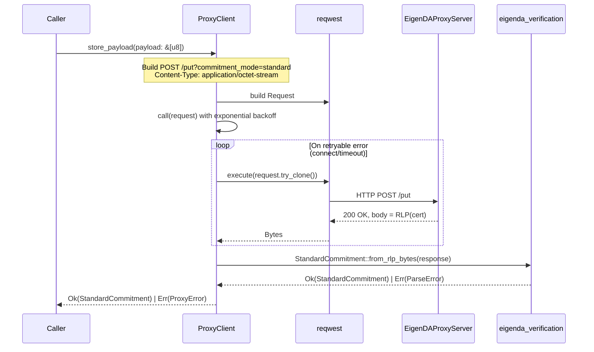
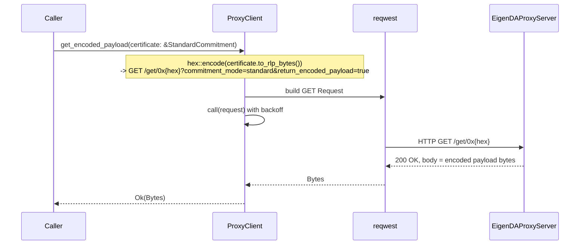
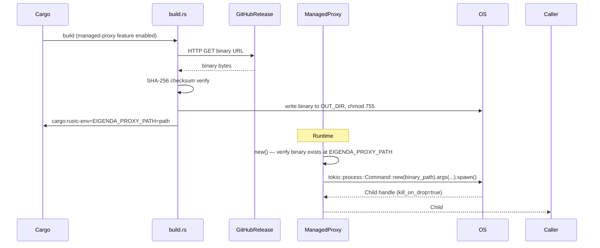
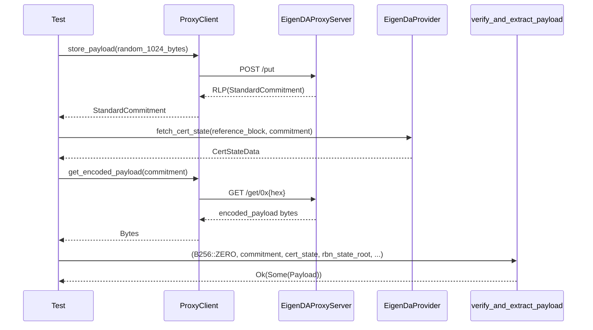

# eigenda-proxy Analysis

**Analyzed by**: code-analyzer-eigenda-proxy
**Timestamp**: 2026-04-10T00:00:00Z
**Application Type**: rust-crate
**Classification**: library
**Location**: rust/crates/eigenda-proxy

## Architecture

`eigenda-proxy` is a small, focused Rust client library organized around two complementary concerns: HTTP communication with a running EigenDA proxy server (`client` module) and optional lifecycle management of the proxy binary itself (`managed_proxy` module, gated behind the `managed-proxy` feature flag).

The library follows a clean two-tier design. The `client` module encapsulates all network I/O through `reqwest` and enforces a retry policy using exponential backoff from the `backon` crate. It surfaces a high-level async API — `store_payload` and `get_encoded_payload` — that abstracts RLP-encoded certificate handling and HTTP semantics from the caller. The `managed_proxy` module operates at the process level: it relies on a `build.rs` build script that downloads a platform-appropriate `eigenda-proxy` Go binary at compile time (with SHA-256 integrity verification) and exposes a thin `ManagedProxy` wrapper that spawns and supervises the binary as a subprocess via `tokio::process::Command`.

Feature flags (`managed-proxy`) keep the subprocess-management code entirely opt-in. Teams that run the proxy as a sidecar or separate service only compile the `client` module, while those who want an embedded, zero-infrastructure solution enable `managed-proxy`. The public surface re-exported from `lib.rs` reflects this split: `ProxyClient`, `EigenDaProxyConfig`, and `ProxyError` are always available; `ManagedProxy` is conditionally compiled.

The library depends on `eigenda-verification` for the `StandardCommitment` type, ensuring that certificates produced and consumed by `ProxyClient` are the same strongly-typed, RLP-serialized representations used by the broader verification pipeline.

## Key Components

- **`EigenDaProxyConfig`** (`src/client.rs`, lines 32-43): Configuration struct (serde + JsonSchema derived) that captures the proxy URL and three optional retry tuning parameters (`min_retry_delay`, `max_retry_delay`, `max_retry_times`). Serializable, making it embeddable in larger application configs.

- **`ProxyClient`** (`src/client.rs`, lines 51-188): Core HTTP client wrapping `reqwest::Client`. Holds a parsed `Url` and an `Option<ExponentialBuilder>` for retry behavior. The two public async methods `store_payload` and `get_encoded_payload` form the entire user-facing API. Not publicly constructible except via `new(config)`. `Clone + Debug`.

- **`ProxyClient::store_payload`** (`src/client.rs`, lines 112-139): Posts raw bytes to `POST /put?commitment_mode=standard` with `Content-Type: application/octet-stream`. On success, parses the response body as an RLP-encoded `StandardCommitment` from `eigenda-verification`. Returns `ProxyError::StandardCommitmentParseError` if the response body is not a valid commitment.

- **`ProxyClient::get_encoded_payload`** (`src/client.rs`, lines 97-108): Fetches data from `GET /get/0x{hex_cert}?commitment_mode=standard&return_encoded_payload=true`. The certificate is hex-encoded from its RLP bytes to form the URL path segment.

- **`ProxyClient::call` / `call_inner`** (`src/client.rs`, lines 143-188): Private retry orchestration layer. `call` checks for a backoff policy and uses `backon::Retryable` with a per-error `is_retryable()` predicate (only connection and timeout errors are retried). `call_inner` executes the request and maps non-2xx responses to `ProxyError::HttpError`.

- **`ProxyError`** (`src/client.rs`, lines 192-226): `thiserror`-derived enum with four variants: `UrlParse`, `Http`, `HttpError` (structured HTTP failure with status code, URL, and body text), and `StandardCommitmentParseError`. The `is_retryable()` method constrains automatic retries to transient network conditions only.

- **`ManagedProxy`** (`src/managed_proxy.rs`, lines 15-55): Minimal subprocess manager. Reads the `EIGENDA_PROXY_PATH` environment variable (injected at compile time by `build.rs`) to locate the downloaded binary and spawns it with `tokio::process::Command`. The child process runs with `stdout`/`stderr` redirected to null and `kill_on_drop(true)` enabled, so the proxy is automatically terminated when the `Child` handle is dropped.

- **`build.rs`** (`build.rs`, lines 9-116): Build-time binary provisioner activated only when `managed-proxy` feature is set. Downloads a platform-specific release binary (`macos/aarch64` or `linux/x86_64`) from GitHub, verifies its SHA-256 checksum, writes it to `OUT_DIR`, sets the executable bit on Unix, and injects `EIGENDA_PROXY_PATH` as a `rustc-env` variable for use at compile time. Uses blocking `reqwest` and `sha2` (both listed as optional build-dependencies).

## Data Flows

### 1. Payload Store Flow

**Flow Description**: A caller sends raw bytes to the EigenDA network via the proxy and receives back a `StandardCommitment` certificate that can be used later to retrieve the data.



**Detailed Steps**:

1. **Build HTTP request** (`ProxyClient::store_payload`, line 113-120)
   - Method: `POST /put?commitment_mode=standard`
   - Header: `Content-Type: application/octet-stream`
   - Body: raw payload bytes copied into a `Vec<u8>`

2. **Execute with retry** (`ProxyClient::call`, lines 146-166)
   - Clones the request for each attempt via `try_clone()` (safe because body is not a stream)
   - Only retries when `err.is_connect() || err.is_timeout()`
   - Logs each retry via `tracing::trace`

3. **Parse certificate** (`StandardCommitment::from_rlp_bytes`, line 126)
   - Response body interpreted as RLP-encoded `StandardCommitment`
   - On failure: logs parse error and raw response text, returns `ProxyError::StandardCommitmentParseError`

**Error Paths**:
- Network timeout/connection failure → retried up to `max_retry_times` times with exponential backoff
- HTTP non-2xx → `ProxyError::HttpError { status, message, url }` — not retried
- Invalid RLP in response → `ProxyError::StandardCommitmentParseError`

---

### 2. Encoded Payload Retrieval Flow

**Flow Description**: A caller retrieves the encoded payload for a known certificate from the proxy, typically to obtain raw bytes for local verification against on-chain state.



**Detailed Steps**:

1. **Encode certificate to URL** (lines 101-103)
   - `certificate.to_rlp_bytes()` from `eigenda-verification`
   - `hex::encode` those bytes → append as `/get/0x{hex}`
   - Query string: `commitment_mode=standard&return_encoded_payload=true`

2. **HTTP GET with retry** — same `call` machinery as `store_payload`

3. **Return raw bytes** — no certificate parsing; caller is responsible for using `eigenda-verification`'s `verify_and_extract_payload` to process the response.

---

### 3. Managed Proxy Lifecycle Flow

**Flow Description**: At build time the eigenda-proxy binary is downloaded and checksummed; at runtime `ManagedProxy` spawns it as a child process. Used in testing and by teams embedding the proxy.



**Error Paths**:
- Build-time download failure → compile error with network hint message
- SHA-256 mismatch → compile error with expected vs. computed hash
- Binary missing at runtime → `std::io::Error::new(NotFound, ...)`
- Spawn failure → `std::io::Error` from `Command::spawn`

---

### 4. Integration: Store, Retrieve, and Verify (End-to-End)

**Flow Description**: The full end-to-end flow used in integration tests combining `eigenda-proxy` with `eigenda-verification`.



## Dependencies

### External Libraries

- **backon** (1.5.2) [other]: Retry policy builder for async operations. Provides `ExponentialBuilder` and the `Retryable` extension trait used in `ProxyClient::call` to implement configurable exponential backoff with per-error retry predicates. Imported in: `src/client.rs`.

- **bytes** (1.10.1) [other]: Zero-copy byte buffer type. Used as the return type for `get_encoded_payload` and as the internal response buffer in `call_inner`. Imported in: `src/client.rs`.

- **hex** (0.4.3) [other]: Hex encoding/decoding. Used to convert `StandardCommitment`'s RLP bytes into a hex string for the `/get/0x{hex}` URL path. Imported in: `src/client.rs`.

- **reqwest** (0.12.22, features: `json`) [networking]: Async HTTP client. Provides `Client`, `Request`, `Url`, and `StatusCode` used throughout `ProxyClient`. Also used as a blocking build-dependency (feature: `blocking`) in `build.rs` to download the proxy binary at compile time. Imported in: `src/client.rs`, `build.rs`.

- **serde** (1.0.219, features: `alloc`, `derive`) [serialization]: Serialization framework. Derives `Serialize`/`Deserialize` on `EigenDaProxyConfig`, enabling it to be embedded in JSON/TOML application configs. Imported in: `src/client.rs`.

- **thiserror** (2.0.12) [other]: Derive macro for structured error types. Used on `ProxyError` to auto-generate `Display` and `From` implementations for each variant. Imported in: `src/client.rs`.

- **tokio** (1.47.1, features: `sync`, `process`, `rt`, `macros`) [async-runtime]: Async runtime and process management. The `process` feature provides `tokio::process::Command` and `Child` used by `ManagedProxy`; `rt` and `macros` power `#[tokio::test]` in unit tests. Imported in: `src/managed_proxy.rs`.

- **tracing** (0.1.41) [logging]: Structured, async-aware instrumentation. `#[instrument]` decorates `store_payload`, `get_encoded_payload`, and `call` with automatic span creation. `trace!` and `error!` macros log retry events and certificate parse failures. Imported in: `src/client.rs`.

- **url** (2.5.4) [networking]: URL parsing and manipulation. Used to parse the proxy URL from config, join path segments (`/get/0x{hex}`, `/put`), and set query strings. `url::ParseError` is one of the `ProxyError` variants. Imported in: `src/client.rs`.

- **schemars** (0.8.21, features: `derive`) [other]: JSON Schema generation. Derives `JsonSchema` on `EigenDaProxyConfig`, enabling downstream frameworks to auto-generate schema documents for configuration validation. Imported in: `src/client.rs`.

**Build-only (managed-proxy feature):**

- **sha2** (0.10) [crypto]: SHA-256 hashing used exclusively in `build.rs` to verify the integrity of the downloaded proxy binary before writing it to disk. Only compiled when `managed-proxy` feature is active.

**Dev dependencies (testing only):**

- **wiremock** (0.6.0) [testing]: HTTP mock server used in `src/client.rs` unit tests to simulate proxy server responses without network access. Matchers cover method, path, query params, and headers.

- **testcontainers** (0.26.0) [testing]: Docker container management in tests. Used in `eigenda-tests` integration tests to spin up a real `ghcr.io/layr-labs/eigenda-proxy:2.4.1` container.

- **rand** (0.8) [testing]: Random number generation. Used in integration tests to create random 1024-byte payloads for end-to-end dispersal tests.

- **alloy-consensus**, **alloy-provider**, **alloy-rpc-types** [testing]: Alloy Ethereum client libraries used in integration tests to interact with on-chain EigenDA contracts when verifying stored blobs.

- **bincode**, **jsonschema**, **reltester**, **risc0-zkvm**, **test-strategy** [testing]: Additional dev-only dependencies for schema validation, property-based testing, and ZK VM integration test scenarios.

### Internal Libraries

- **eigenda-verification** (`rust/crates/eigenda-verification`): Provides `StandardCommitment` and `StandardCommitmentParseError`. `ProxyClient` uses `StandardCommitment` as both the input type for `get_encoded_payload` (calling `.to_rlp_bytes()` to build the URL) and the output type of `store_payload` (calling `StandardCommitment::from_rlp_bytes()` to parse the response body). `StandardCommitmentParseError` is wrapped as a `ProxyError` variant via `#[from]`. This dependency ensures the client and verification pipeline share the same certificate representation.

## API Surface

### Exported Types

#### `EigenDaProxyConfig`

```rust
#[derive(Debug, Clone, JsonSchema, PartialEq, Serialize, Deserialize)]
pub struct EigenDaProxyConfig {
    pub url: String,
    pub min_retry_delay: Option<u64>,   // milliseconds; default 1000
    pub max_retry_delay: Option<u64>,   // milliseconds; default 10000
    pub max_retry_times: Option<u64>,   // default 10
}
```

Serializable configuration struct. All retry fields are optional; defaults apply when `None`.

#### `ProxyClient`

```rust
pub struct ProxyClient { /* private fields */ }

impl ProxyClient {
    pub fn new(config: &EigenDaProxyConfig) -> Result<Self, ProxyError>;

    pub async fn get_encoded_payload(
        &self,
        certificate: &StandardCommitment,
    ) -> Result<Bytes, ProxyError>;

    pub async fn store_payload(
        &self,
        payload: &[u8],
    ) -> Result<StandardCommitment, ProxyError>;
}
```

Main entry point for callers. `Clone + Debug`. Thread-safe — `reqwest::Client` is `Send + Sync`.

#### `ProxyError`

```rust
#[derive(Debug, Error)]
pub enum ProxyError {
    #[error("Url parse error: {0}")]
    UrlParse(#[from] url::ParseError),

    #[error("HTTP error: {0}")]
    Http(#[from] reqwest::Error),

    #[error("HTTP error (status {status}) at {url}: {message}")]
    HttpError { status: StatusCode, message: String, url: Url },

    #[error("StandardCommitmentParseError: {0}")]
    StandardCommitmentParseError(#[from] StandardCommitmentParseError),
}

impl ProxyError {
    pub fn is_retryable(&self) -> bool;
}
```

#### `ManagedProxy` (feature = `managed-proxy`)

```rust
pub struct ManagedProxy { /* private */ }

impl ManagedProxy {
    pub fn new() -> Result<Self, std::io::Error>;
    pub async fn start(&self, args: &[&str]) -> Result<tokio::process::Child, std::io::Error>;
}
```

### HTTP Endpoints Consumed

This library acts as a client, not a server. It communicates with the EigenDA Proxy HTTP server at two endpoints:

**POST /put?commitment_mode=standard**

Example Request:
```http
POST /put?commitment_mode=standard HTTP/1.1
Host: localhost:3100
Content-Type: application/octet-stream

<raw blob bytes>
```

Example Response (200 OK):
```
<RLP-encoded StandardCommitment bytes>
```

**GET /get/0x{hex_cert}?commitment_mode=standard&return_encoded_payload=true**

Example Request:
```http
GET /get/0x02f90389e5a0...?commitment_mode=standard&return_encoded_payload=true HTTP/1.1
Host: localhost:3100
```

Example Response (200 OK):
```
<encoded payload bytes>
```

## Code Examples

### Example 1: Basic Client Usage

```rust
// src/client.rs usage pattern (from integration tests)
let config = EigenDaProxyConfig {
    url: "http://localhost:3100".to_string(),
    min_retry_delay: None,  // uses 1s default
    max_retry_delay: None,  // uses 10s default
    max_retry_times: None,  // uses 10 default
};
let client = ProxyClient::new(&config).unwrap();

// Disperse a blob
let cert: StandardCommitment = client.store_payload(b"hello world").await?;

// Retrieve encoded payload using the certificate
let encoded: Bytes = client.get_encoded_payload(&cert).await?;
```

### Example 2: Retry Configuration and Error Handling

```rust
let config = EigenDaProxyConfig {
    url: "http://localhost:3100".to_string(),
    min_retry_delay: Some(500),   // start at 500ms
    max_retry_delay: Some(5000),  // cap at 5s
    max_retry_times: Some(5),     // max 5 attempts
};
let client = ProxyClient::new(&config)?;

match client.store_payload(data).await {
    Ok(cert) => println!("stored: {:?}", cert),
    Err(ProxyError::HttpError { status, message, url }) =>
        eprintln!("proxy error {status} at {url}: {message}"),
    Err(ProxyError::StandardCommitmentParseError(e)) =>
        eprintln!("cert parse failed: {e}"),
    Err(e) => eprintln!("other error: {e}"),
}
```

### Example 3: Managed Proxy (feature = "managed-proxy")

```rust
// Binary downloaded at compile time by build.rs
let managed = ManagedProxy::new()?;

let mut child = managed.start(&[
    "--memstore.enabled",
    "--apis.enabled=standard",
    "--eigenda.g1-path=./resources/srs/g1.point",
]).await?;

// child has kill_on_drop=true — dropping it terminates the process
// Now use ProxyClient against http://localhost:3100
```

### Example 4: URL Construction for get_encoded_payload

```rust
// From src/client.rs lines 101-103
let hex = encode(certificate.to_rlp_bytes());         // hex::encode of RLP bytes
let mut url = self.url.join(&format!("/get/0x{hex}"))?;
url.set_query(Some("commitment_mode=standard&return_encoded_payload=true"));
```

### Example 5: Retry Predicate (is_retryable)

```rust
// From src/client.rs lines 220-225
pub fn is_retryable(&self) -> bool {
    match self {
        // Only network-level transient errors are retried
        ProxyError::Http(err) => err.is_connect() || err.is_timeout(),
        _ => false,
    }
}
```

## Files Analyzed

- `rust/crates/eigenda-proxy/Cargo.toml` (43 lines) - Package manifest, feature flags, dependency declarations
- `rust/crates/eigenda-proxy/src/lib.rs` (13 lines) - Crate entry point and public re-exports
- `rust/crates/eigenda-proxy/src/client.rs` (344 lines) - HTTP client, config, error types, unit tests
- `rust/crates/eigenda-proxy/src/managed_proxy.rs` (99 lines) - Subprocess management and lifecycle tests
- `rust/crates/eigenda-proxy/build.rs` (117 lines) - Build-time binary download and integrity verification
- `rust/crates/eigenda-tests/tests/integration.rs` (124 lines) - End-to-end integration tests using this library
- `rust/crates/eigenda-tests/tests/common/proxy.rs` (113 lines) - Testcontainers helper for Docker-based proxy setup
- `rust/Cargo.toml` (80 lines) - Workspace dependency versions

## Analysis Data

```json
{
  "summary": "eigenda-proxy is a Rust client library for communicating with the EigenDA proxy HTTP server. It provides two public async methods — store_payload (POST /put) and get_encoded_payload (GET /get/0x{cert}) — wrapped in a ProxyClient struct with configurable exponential-backoff retry logic. An optional managed-proxy feature flag enables a ManagedProxy type that downloads the eigenda-proxy binary at compile time (with SHA-256 verification) and spawns it as a subprocess at runtime. The library depends on eigenda-verification for the StandardCommitment certificate type used in both operations.",
  "architecture_pattern": "layered",
  "key_modules": [
    "client — HTTP proxy client with retry logic (ProxyClient, EigenDaProxyConfig, ProxyError)",
    "managed_proxy — subprocess lifecycle manager (ManagedProxy), feature-gated",
    "build.rs — compile-time binary downloader with SHA-256 integrity check"
  ],
  "api_endpoints": [
    "POST /put?commitment_mode=standard — store blob, returns RLP-encoded StandardCommitment",
    "GET /get/0x{hex_cert}?commitment_mode=standard&return_encoded_payload=true — retrieve encoded payload"
  ],
  "data_flows": [
    "store_payload: raw bytes -> POST /put -> RLP response -> StandardCommitment::from_rlp_bytes -> Ok(StandardCommitment)",
    "get_encoded_payload: StandardCommitment -> to_rlp_bytes -> hex -> GET /get/0x{hex} -> Ok(Bytes)",
    "managed proxy build: Cargo build.rs -> download binary -> SHA-256 verify -> chmod 755 -> EIGENDA_PROXY_PATH env var",
    "managed proxy runtime: ManagedProxy::new() -> verify binary exists -> start(&args) -> tokio::process::Child"
  ],
  "tech_stack": [
    "rust",
    "reqwest",
    "tokio",
    "backon",
    "bytes",
    "serde",
    "thiserror",
    "tracing",
    "url",
    "schemars",
    "sha2",
    "hex"
  ],
  "external_integrations": [
    "eigenda-proxy-server (ghcr.io/layr-labs/eigenda-proxy HTTP REST API)"
  ],
  "component_interactions": [
    {
      "target": "eigenda-verification",
      "type": "library",
      "description": "Imports StandardCommitment for certificate serialization/deserialization in store_payload and get_encoded_payload; imports StandardCommitmentParseError as a ProxyError variant"
    }
  ]
}
```

## Citations

```json
[
  {
    "file_path": "rust/crates/eigenda-proxy/src/lib.rs",
    "start_line": 6,
    "end_line": 12,
    "claim": "The crate unconditionally exports ProxyClient, EigenDaProxyConfig, ProxyError and conditionally exports ManagedProxy behind the managed-proxy feature flag",
    "section": "Architecture",
    "snippet": "pub mod client;\npub use client::{EigenDaProxyConfig, ProxyClient, ProxyError};\n\n#[cfg(feature = \"managed-proxy\")]\npub mod managed_proxy;\n#[cfg(feature = \"managed-proxy\")]\npub use managed_proxy::ManagedProxy;"
  },
  {
    "file_path": "rust/crates/eigenda-proxy/Cargo.toml",
    "start_line": 6,
    "end_line": 11,
    "claim": "The managed-proxy feature is optional and only pulls in reqwest and sha2 build dependencies when enabled",
    "section": "Architecture",
    "snippet": "[features]\nmanaged-proxy = [\"reqwest\", \"sha2\"]"
  },
  {
    "file_path": "rust/crates/eigenda-proxy/Cargo.toml",
    "start_line": 16,
    "end_line": 16,
    "claim": "eigenda-verification is an internal path dependency providing StandardCommitment",
    "section": "Dependencies",
    "snippet": "eigenda-verification = { path = \"../eigenda-verification\" }"
  },
  {
    "file_path": "rust/crates/eigenda-proxy/src/client.rs",
    "start_line": 32,
    "end_line": 43,
    "claim": "EigenDaProxyConfig is a serde/JsonSchema-derived configuration struct with optional retry parameters",
    "section": "Key Components",
    "snippet": "pub struct EigenDaProxyConfig {\n    pub url: String,\n    pub min_retry_delay: Option<u64>,\n    pub max_retry_delay: Option<u64>,\n    pub max_retry_times: Option<u64>,\n}"
  },
  {
    "file_path": "rust/crates/eigenda-proxy/src/client.rs",
    "start_line": 51,
    "end_line": 56,
    "claim": "ProxyClient holds a parsed Url, a reqwest::Client, and an optional ExponentialBuilder for backoff",
    "section": "Key Components",
    "snippet": "pub struct ProxyClient {\n    url: Url,\n    inner: reqwest::Client,\n    backoff: Option<ExponentialBuilder>,\n}"
  },
  {
    "file_path": "rust/crates/eigenda-proxy/src/client.rs",
    "start_line": 83,
    "end_line": 92,
    "claim": "ProxyClient::new builds an ExponentialBuilder with configurable min/max delay and max retry count",
    "section": "Key Components",
    "snippet": "let backoff = ExponentialBuilder::default()\n    .with_min_delay(min_retry_delay)\n    .with_max_delay(max_retry_delay)\n    .with_max_times(max_retry_times as usize);"
  },
  {
    "file_path": "rust/crates/eigenda-proxy/src/client.rs",
    "start_line": 97,
    "end_line": 108,
    "claim": "get_encoded_payload encodes the certificate as hex RLP bytes, appends query parameters, and issues a GET request",
    "section": "API Surface",
    "snippet": "let hex = encode(certificate.to_rlp_bytes());\nlet mut url = self.url.join(&format!(\"/get/0x{hex}\"))?;\nurl.set_query(Some(\"commitment_mode=standard&return_encoded_payload=true\"));"
  },
  {
    "file_path": "rust/crates/eigenda-proxy/src/client.rs",
    "start_line": 112,
    "end_line": 139,
    "claim": "store_payload posts raw bytes to /put with octet-stream content type and parses the response as RLP-encoded StandardCommitment",
    "section": "Data Flows",
    "snippet": "pub async fn store_payload(&self, payload: &[u8]) -> Result<StandardCommitment, ProxyError> {\n    let mut url = self.url.join(\"/put\")?;\n    url.set_query(Some(\"commitment_mode=standard\"));\n    ...\n    match StandardCommitment::from_rlp_bytes(response.as_ref()) {"
  },
  {
    "file_path": "rust/crates/eigenda-proxy/src/client.rs",
    "start_line": 115,
    "end_line": 121,
    "claim": "store_payload sends Content-Type: application/octet-stream with the raw payload as the request body",
    "section": "API Surface",
    "snippet": "let request = self\n    .inner\n    .post(url)\n    .header(CONTENT_TYPE, \"application/octet-stream\")\n    .body(payload.to_vec())\n    .build()?;"
  },
  {
    "file_path": "rust/crates/eigenda-proxy/src/client.rs",
    "start_line": 143,
    "end_line": 167,
    "claim": "call() wraps call_inner with optional exponential-backoff retry predicated on is_retryable()",
    "section": "Data Flows",
    "snippet": "if let Some(backoff) = self.backoff.as_ref() {\n    let operation = || async {\n        let request = request.try_clone().expect(...);\n        self.call_inner(request).await\n    };\n    operation\n        .retry(backoff)\n        .when(|err| err.is_retryable())\n        .notify(notify)\n        .await"
  },
  {
    "file_path": "rust/crates/eigenda-proxy/src/client.rs",
    "start_line": 169,
    "end_line": 188,
    "claim": "call_inner executes the HTTP request and maps non-2xx responses to ProxyError::HttpError with status, url, and body message",
    "section": "Key Components",
    "snippet": "let status = response.status();\nif !status.is_success() {\n    return Err(ProxyError::HttpError { status, message, url });\n}"
  },
  {
    "file_path": "rust/crates/eigenda-proxy/src/client.rs",
    "start_line": 192,
    "end_line": 216,
    "claim": "ProxyError has four variants: UrlParse, Http, HttpError (structured), and StandardCommitmentParseError",
    "section": "API Surface",
    "snippet": "pub enum ProxyError {\n    UrlParse(#[from] url::ParseError),\n    Http(#[from] reqwest::Error),\n    HttpError { status, message, url },\n    StandardCommitmentParseError(#[from] StandardCommitmentParseError),\n}"
  },
  {
    "file_path": "rust/crates/eigenda-proxy/src/client.rs",
    "start_line": 218,
    "end_line": 226,
    "claim": "is_retryable() returns true only for reqwest connection and timeout errors, not HTTP 5xx or other errors",
    "section": "Analysis Notes",
    "snippet": "ProxyError::Http(err) => err.is_connect() || err.is_timeout(),\n_ => false,"
  },
  {
    "file_path": "rust/crates/eigenda-proxy/src/client.rs",
    "start_line": 141,
    "end_line": 142,
    "claim": "Code comments note the proxy URL is logged in traces under the assumption it contains no sensitive data",
    "section": "Analysis Notes",
    "snippet": "// Note: proxy is meant to be run locally or in a trusted environment, so we assume that the URL\n// does not contain sensitive info that needs to be redacted from logs."
  },
  {
    "file_path": "rust/crates/eigenda-proxy/src/managed_proxy.rs",
    "start_line": 11,
    "end_line": 17,
    "claim": "ManagedProxy reads the binary path from an env var injected at compile time by build.rs via env!()",
    "section": "Key Components",
    "snippet": "const EIGENDA_PROXY_PATH: &str = env!(\"EIGENDA_PROXY_PATH\");\n\npub struct ManagedProxy {\n    binary_path: PathBuf,\n}"
  },
  {
    "file_path": "rust/crates/eigenda-proxy/src/managed_proxy.rs",
    "start_line": 40,
    "end_line": 54,
    "claim": "ManagedProxy::start spawns the binary with stdout/stderr suppressed and kill_on_drop=true for automatic cleanup",
    "section": "Key Components",
    "snippet": "let child = Command::new(&binary_path)\n    .args(args)\n    .stdout(Stdio::null())\n    .stderr(Stdio::null())\n    .kill_on_drop(true)\n    .spawn()?;"
  },
  {
    "file_path": "rust/crates/eigenda-proxy/build.rs",
    "start_line": 37,
    "end_line": 49,
    "claim": "build.rs selects the download URL and expected SHA-256 checksum based on target OS and CPU architecture",
    "section": "Key Components",
    "snippet": "let (download_url, sha256checksum) = match (os, arch) {\n    (\"macos\", \"aarch64\") => (...),\n    (\"linux\", \"x86_64\") => (...),\n    _ => panic!(\"Unsupported platform: {os}-{arch}.\"),\n};"
  },
  {
    "file_path": "rust/crates/eigenda-proxy/build.rs",
    "start_line": 68,
    "end_line": 80,
    "claim": "build.rs verifies the downloaded binary's SHA-256 hash and panics with a detailed message on mismatch",
    "section": "Analysis Notes",
    "snippet": "let mut hasher = Sha256::new();\nhasher.update(&bytes);\nlet computed_hash = format!(\"{:x}\", hasher.finalize());\nif computed_hash != sha256checksum {\n    panic!(\"SHA-256 checksum mismatch for eigenda-proxy binary!...\");\n}"
  },
  {
    "file_path": "rust/crates/eigenda-proxy/build.rs",
    "start_line": 107,
    "end_line": 111,
    "claim": "build.rs injects EIGENDA_PROXY_PATH as a rustc-env compile-time variable pointing to the downloaded binary",
    "section": "Key Components",
    "snippet": "println!(\n    \"cargo:rustc-env=EIGENDA_PROXY_PATH={}\",\n    binary_path.display()\n);"
  },
  {
    "file_path": "rust/crates/eigenda-proxy/src/client.rs",
    "start_line": 12,
    "end_line": 12,
    "claim": "eigenda-verification's StandardCommitment and StandardCommitmentParseError are directly imported",
    "section": "Dependencies",
    "snippet": "use eigenda_verification::cert::{StandardCommitment, StandardCommitmentParseError};"
  },
  {
    "file_path": "rust/crates/eigenda-tests/tests/integration.rs",
    "start_line": 14,
    "end_line": 16,
    "claim": "Integration tests import ProxyClient and EigenDaProxyConfig alongside eigenda-verification's verify_and_extract_payload",
    "section": "Data Flows",
    "snippet": "use eigenda_proxy::{EigenDaProxyConfig, ProxyClient};\nuse eigenda_verification::verification::verify_and_extract_payload;"
  },
  {
    "file_path": "rust/crates/eigenda-tests/tests/integration.rs",
    "start_line": 55,
    "end_line": 61,
    "claim": "Integration test instantiates ProxyClient with all retry fields as None, relying on default values",
    "section": "Data Flows",
    "snippet": "let proxy_client = ProxyClient::new(&EigenDaProxyConfig {\n    url,\n    min_retry_delay: None,\n    max_retry_delay: None,\n    max_retry_times: None,\n}).unwrap();"
  },
  {
    "file_path": "rust/crates/eigenda-tests/tests/integration.rs",
    "start_line": 69,
    "end_line": 69,
    "claim": "Integration test stores a random 1024-byte payload via store_payload",
    "section": "Data Flows",
    "snippet": "let std_commitment = proxy_client.store_payload(&payload).await.unwrap();"
  },
  {
    "file_path": "rust/crates/eigenda-tests/tests/integration.rs",
    "start_line": 107,
    "end_line": 110,
    "claim": "Integration test retrieves encoded payload via get_encoded_payload for subsequent on-chain verification",
    "section": "Data Flows",
    "snippet": "let encoded_payload = proxy_client\n    .get_encoded_payload(&std_commitment)\n    .await\n    .unwrap();"
  },
  {
    "file_path": "rust/crates/eigenda-tests/tests/common/proxy.rs",
    "start_line": 9,
    "end_line": 11,
    "claim": "Integration tests use the official ghcr.io/layr-labs/eigenda-proxy:2.4.1 Docker image via testcontainers",
    "section": "Dependencies",
    "snippet": "const NAME: &str = \"ghcr.io/layr-labs/eigenda-proxy\";\nconst TAG: &str = \"2.4.1\";"
  },
  {
    "file_path": "rust/crates/eigenda-proxy/src/client.rs",
    "start_line": 22,
    "end_line": 28,
    "claim": "Default retry parameters are 10 attempts starting at 1 second delay and capped at 10 seconds",
    "section": "Key Components",
    "snippet": "const DEFAULT_MAX_RETRY_TIMES: u64 = 10;\nconst DEFAULT_MIN_RETRY_DELAY: Duration = Duration::from_millis(1000);\nconst DEFAULT_MAX_RETRY_DELAY: Duration = Duration::from_secs(10);"
  }
]
```

## Analysis Notes

### Security Considerations

1. **Binary integrity verification**: The `build.rs` script validates a SHA-256 checksum before writing the downloaded binary to disk. This prevents supply-chain attacks from serving tampered binaries. The checksum is hardcoded in source, requiring a reviewed code change to update it.

2. **Trusted proxy assumption**: A comment in `client.rs` (lines 141-142) explicitly notes the proxy URL is assumed to not contain sensitive information and is safe to log in traces. This is correct for local/sidecar deployments but would require review if URLs ever encoded credentials.

3. **No TLS verification override**: `reqwest::Client::builder().build()` uses default TLS settings. There is no `danger_accept_invalid_certs` or similar bypass.

4. **Conservative retry predicate**: `is_retryable()` only retries on `is_connect()` or `is_timeout()`. HTTP 5xx errors are deliberately NOT retried, preventing accidental amplification of server-side errors.

5. **kill_on_drop for subprocess safety**: The `ManagedProxy` child uses `kill_on_drop(true)`, ensuring the subprocess is cleaned up on panic or early return. However, stdout/stderr are suppressed, which means subprocess errors are silently swallowed.

### Performance Characteristics

- **Clone-on-retry**: Each retry calls `request.try_clone()`, which copies the payload `Vec<u8>`. For large blobs, callers should tune `max_retry_times` conservatively to limit amplification.
- **reqwest connection pooling**: `reqwest::Client` maintains an internal connection pool. Because `ProxyClient` holds `reqwest::Client` by value, cloning `ProxyClient` creates a new pool. Callers should maintain a single `ProxyClient` per proxy URL.
- **Blocking build-time download**: The binary download uses blocking `reqwest` in `build.rs`, which is appropriate for a build script context but means cold builds on slow connections will stall Cargo.

### Scalability Notes

- **Stateless client**: `ProxyClient` holds no mutable state and is `Clone + Debug`. It can safely be shared across tasks via `Arc<ProxyClient>`.
- **Feature-flag modularity**: The `managed-proxy` feature keeps subprocess management out of the default build, reducing binary size and compile time for the common deployment case.
- **Single-binary version coupling**: `build.rs` hardcodes a specific proxy binary release URL. Upgrading the proxy version requires a code change and rebuild, which is intentional for reproducibility but limits runtime flexibility.
