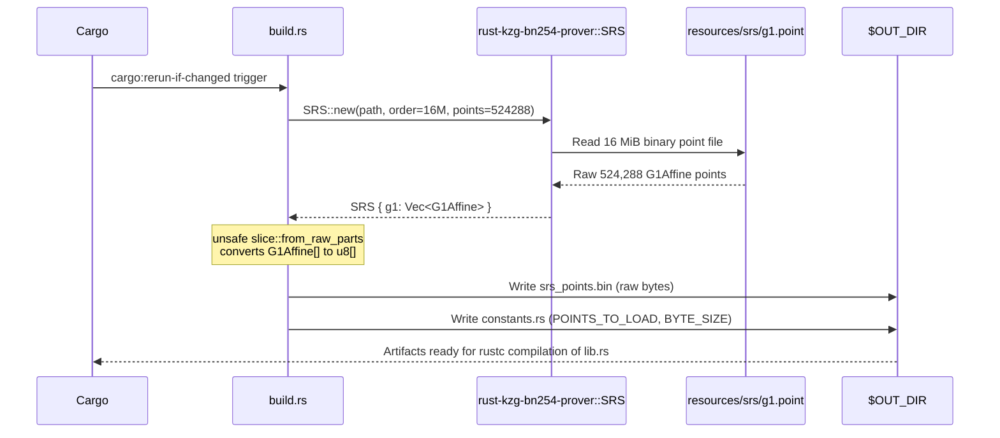
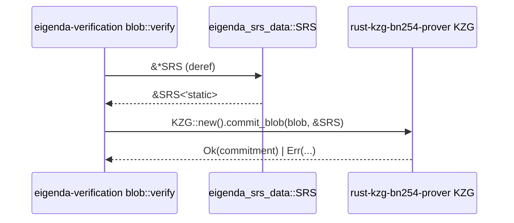

# eigenda-srs-data Analysis

**Analyzed by**: code-analyzer
**Timestamp**: 2026-04-10T00:00:00Z
**Application Type**: rust-crate
**Classification**: library
**Location**: rust/crates/eigenda-srs-data

## Architecture

`eigenda-srs-data` is a minimal, single-purpose Rust library whose entire responsibility is to make precomputed BN254 elliptic-curve G1 points (the Structured Reference String used for KZG polynomial commitments) available as a global, zero-copy static in any binary that depends on it. The design is deliberately constrained: there is no runtime I/O, no configuration surface, and no business logic. All heavy work happens at compile time through a Cargo build script (`build.rs`).

The build script reads the raw `g1.point` binary file from `resources/srs/` (located three directory levels above the crate root), loads 524,288 G1Affine points via the `rust-kzg-bn254-prover` SRS loader, and writes two artifacts into Cargo's `$OUT_DIR`: `srs_points.bin` (the raw byte image of the point array, ~16 MiB) and `constants.rs` (two `pub const` definitions — `POINTS_TO_LOAD` and `BYTE_SIZE`). At compile time, `src/lib.rs` pulls these artifacts in via `include!` and `include_bytes!` macros, physically embedding the 16 MiB SRS data into the compiled binary's read-only data segment.

At runtime, the public API is a single `pub static SRS: LazyLock<SRS<'static>>`. The first dereference triggers an `unsafe` `core::mem::transmute` that reinterprets the embedded byte array as a typed `[G1Affine; POINTS_TO_LOAD]` reference — no heap allocation, no deserialization, no file I/O. The `LazyLock` wrapper ensures thread-safe, at-most-once initialization. The `unsafe` transmute is sound by construction: `BYTE_SIZE` is computed at build time as `POINTS_TO_LOAD * size_of::<G1Affine>()`, so the array sizes are guaranteed to match, and the byte content was produced by serializing the identical `G1Affine` in-memory representation in `build.rs`.

The overall architectural pattern is **compile-time data embedding with lazy initialization**. The crate is a dependency leaf with no internal workspace dependencies and exposes exactly one item to consumers.

## Key Components

- **`build.rs`** (`rust/crates/eigenda-srs-data/build.rs`): Cargo build script that runs at compile time. Opens `../../../resources/srs/g1.point`, calls `rust-kzg-bn254-prover::srs::SRS::new()` to parse 524,288 G1Affine BN254 curve points, reinterprets the in-memory `G1Affine` slice as raw bytes using `unsafe std::slice::from_raw_parts`, writes those bytes to `$OUT_DIR/srs_points.bin`, and generates `$OUT_DIR/constants.rs` with `POINTS_TO_LOAD` and `BYTE_SIZE` constants. Registers a `cargo:rerun-if-changed` directive so the script only re-runs when the source point file changes.

- **`POINTS_TO_LOAD` constant** (`$OUT_DIR/constants.rs`, build-generated): `usize = 524288` (= `16 * 1024 * 1024 / 32`). Represents the number of G1 points embedded in the binary and therefore the maximum polynomial degree the SRS can commit to, corresponding to a 16 MiB maximum blob size in EigenDA.

- **`BYTE_SIZE` constant** (`$OUT_DIR/constants.rs`, build-generated): `usize = POINTS_TO_LOAD * size_of::<G1Affine>()`. Used to parameterize the `transmute` in `SRS_POINTS` so that the compiler enforces an exact byte-array length match at compile time.

- **`SRS_POINTS` private static** (`rust/crates/eigenda-srs-data/src/lib.rs`, line 20): A `&'static [G1Affine; POINTS_TO_LOAD]` backed by `include_bytes!("srs_points.bin")`. Uses a single `core::mem::transmute` to reinterpret the embedded `[u8; BYTE_SIZE]` as a typed G1Affine array. Zero-copy: the data lives in the binary's read-only segment.

- **`SRS` public static** (`rust/crates/eigenda-srs-data/src/lib.rs`, line 32): The only public export. A `LazyLock<SRS<'static>>` that on first access constructs an `SRS` struct by wrapping `SRS_POINTS` as `Cow::Borrowed` and setting `order = POINTS_TO_LOAD * 32 = 16_777_216`. Thread-safe single initialization.

- **`g1.point` resource file** (`resources/srs/g1.point`): External 16 MiB binary file containing BN254 G1 generator points from the KZG trusted setup ceremony. 524,288 points at 32 bytes each. Integrity checksums are provided in `resources/srs/srs-files-16777216.sha256`.

## Data Flows

### 1. Compile-Time SRS Embedding

**Flow Description**: During `cargo build`, the build script reads the SRS point file from disk, processes it into a binary blob and a constants file, both baked into the crate binary at compile time.



**Detailed Steps**:

1. **Trigger** (Cargo → build.rs): Cargo runs `build.rs` on a fresh build or when `resources/g1.point` changes.
2. **SRS Loading** (build.rs → rust-kzg-bn254-prover): `SRS::new("../../../resources/srs/g1.point", 16_777_216, 524288)` parses the binary G1 point file; `assert_eq!(srs.g1.len(), POINTS_TO_LOAD)` validates the result.
3. **Byte Serialization** (build.rs): `unsafe std::slice::from_raw_parts` casts `&[G1Affine]` to `&[u8]`; bytes written to `$OUT_DIR/srs_points.bin`.
4. **Constants Generation** (build.rs): `constants.rs` written with `pub const POINTS_TO_LOAD: usize` and `pub const BYTE_SIZE: usize`.

**Error Paths**:
- Missing `g1.point` → `SRS::new()` fails → `.expect("Failed to create SRS")` aborts build.
- Point count mismatch → `assert_eq!` panics at compile time.
- Write failure → `.expect("Failed to write G1 points")` aborts build.

---

### 2. Runtime SRS Initialization

**Flow Description**: On first dereference of the `SRS` static, embedded bytes are transmuted to typed G1Affine points and wrapped in the public SRS struct.

```mermaid
sequenceDiagram
    participant Consumer as eigenda-verification
    participant SRS_Static as eigenda_srs_data::SRS (LazyLock)
    participant SRS_Points as SRS_POINTS (&[G1Affine; N])
    participant BinaryData as .rodata segment

    Consumer->>SRS_Static: &*SRS (first access)
    SRS_Static->>SRS_Static: LazyLock runs closure once
    BinaryData-->>SRS_Points: include_bytes! (compile-time embedded)
    Note over SRS_Points: unsafe transmute [u8; BYTE_SIZE]<br/>to [G1Affine; POINTS_TO_LOAD]
    SRS_Points-->>SRS_Static: Cow::Borrowed(&SRS_POINTS)
    SRS_Static-->>Consumer: &SRS<'static> { g1, order: 16_777_216 }
```

**Detailed Steps**:

1. **First Access**: Consumer calls `&*SRS`; `LazyLock` calls initialization closure exactly once.
2. **Transmute**: `include_bytes!` embeds `srs_points.bin` as `[u8; BYTE_SIZE]` in `.rodata`; `core::mem::transmute` reinterprets it as `[G1Affine; POINTS_TO_LOAD]` — zero copy, O(1).
3. **SRS Construction**: `SRS { g1: Cow::Borrowed(SRS_POINTS), order: (POINTS_TO_LOAD * 32) as u32 }` — no heap allocation.
4. **Subsequent Accesses**: `LazyLock` returns the cached reference immediately.

---

### 3. KZG Blob Verification (Consumer Flow)

**Flow Description**: `eigenda-verification` passes `&SRS` to the KZG library to compute and verify polynomial commitments over blob data.



**Used By**: `eigenda-verification` — `src/verification/blob/mod.rs` (line 162) and `benches/blob_verification.rs` (line 10).

## Dependencies

### External Libraries

- **ark-bn254** (0.5.0) [crypto]: Provides the `G1Affine` type — the affine representation of points on the BN254 (alt-BN128) elliptic curve used in Ethereum's bn128 precompile and in EigenDA's KZG commitment scheme. Used in both `build.rs` (to type the deserialized point array) and `src/lib.rs` (as the target type of the `transmute`). The `curve` feature is enabled in `[dependencies]` to expose elliptic-curve operations at runtime; `[build-dependencies]` uses the default feature set (sufficient for size calculations during code generation). `default-features = false` in the workspace declaration minimizes compile time.
  Imported in: `rust/crates/eigenda-srs-data/build.rs`, `rust/crates/eigenda-srs-data/src/lib.rs`.

- **rust-kzg-bn254-prover** (git `https://github.com/Layr-Labs/rust-kzg-bn254.git`, rev `60b2bdb`, `default-features = false`) [crypto]: Layr-Labs' KZG-on-BN254 prover library. Provides the `SRS` struct used as the public export type in `src/lib.rs`, and `SRS::new()` used in `build.rs` to parse the raw `g1.point` file into a `Vec<G1Affine>`. Pinned to a specific git commit for cryptographic reproducibility; a version change could silently change the binary representation of `G1Affine` and break the unsafe transmute.
  Imported in: `rust/crates/eigenda-srs-data/build.rs`, `rust/crates/eigenda-srs-data/src/lib.rs`.

### Internal Libraries

This crate has no internal library dependencies within the workspace. It is a dependency leaf.

## API Surface

The crate exposes exactly one public item:

### `pub static SRS: LazyLock<SRS<'static>>`

The globally accessible Structured Reference String containing 524,288 precomputed BN254 G1 curve points for KZG polynomial commitment operations.

- **Type**: `std::sync::LazyLock<rust_kzg_bn254_prover::srs::SRS<'static>>`
- **Thread safety**: `LazyLock` guarantees at-most-once initialization; safe for concurrent access from multiple threads.
- **Memory**: ~16 MiB embedded in the binary's `.rodata` segment; `Cow::Borrowed` means no heap allocation.
- **Initialization cost**: Transmute is O(1). First access in debug builds takes ~40 s on Apple M2 due to page-fault cost for the 16 MiB region; release builds take ~3 s.

**Usage (from `eigenda-verification`):**
```rust
use eigenda_srs_data::SRS;
use rust_kzg_bn254_prover::kzg::KZG;

let computed_commitment = KZG::new().commit_blob(blob, &SRS)?;
```

**Pre-warming (from benchmark):**
```rust
use std::sync::LazyLock;
use eigenda_srs_data::SRS;

// Force initialization before the measured section
LazyLock::force(&SRS);
```

### Generated Constants (crate-private)

`POINTS_TO_LOAD: usize = 524288` and `BYTE_SIZE: usize` are included from `$OUT_DIR/constants.rs` and are visible inside the crate but not re-exported to dependents.

## Code Examples

### Example 1: Build Script — Loading and Serializing G1 Points

```rust
// rust/crates/eigenda-srs-data/build.rs (lines 12-37)
const POINTS_TO_LOAD: u32 = 16 * 1024 * 1024 / 32; // 524,288

fn main() {
    println!("cargo:rerun-if-changed=resources/g1.point");
    let path = "../../../resources/srs/g1.point";
    let order = POINTS_TO_LOAD * 32;
    let srs = SRS::new(path, order, POINTS_TO_LOAD).expect("Failed to create SRS");
    assert_eq!(srs.g1.len(), POINTS_TO_LOAD as usize);

    let g1_slice = &srs.g1[..];
    // SAFETY: G1Affine has stable layout; size_of_val bounds the slice.
    let g1_bytes = unsafe {
        std::slice::from_raw_parts(g1_slice.as_ptr() as *const u8, size_of_val(g1_slice))
    };
    fs::write(out_path.join("srs_points.bin"), g1_bytes)
        .expect("Failed to write G1 points");
}
```

### Example 2: Runtime — Zero-Copy Transmute of Embedded Binary

```rust
// rust/crates/eigenda-srs-data/src/lib.rs (lines 20-25)

// SAFETY: BYTE_SIZE = POINTS_TO_LOAD * size_of::<G1Affine>(); same layout, same version.
static SRS_POINTS: &[G1Affine; POINTS_TO_LOAD] = unsafe {
    &core::mem::transmute::<[u8; BYTE_SIZE], [G1Affine; POINTS_TO_LOAD]>(
        *include_bytes!(concat!(env!("OUT_DIR"), "/srs_points.bin"))
    )
};
```

### Example 3: Lazy Public SRS Construction

```rust
// rust/crates/eigenda-srs-data/src/lib.rs (lines 32-35)

pub static SRS: LazyLock<SRS<'static>> = LazyLock::new(|| SRS {
    g1: Cow::Borrowed(SRS_POINTS),
    order: (POINTS_TO_LOAD * 32) as u32,
});
```

### Example 4: Constants Generation Macro in build.rs

```rust
// rust/crates/eigenda-srs-data/build.rs (lines 41-57)
macro_rules! generate_constants {
    ($points:expr, $byte_size:expr) => {
        format!(
            r#"// Auto-generated constants - DO NOT EDIT
pub const POINTS_TO_LOAD: usize = {};
pub const BYTE_SIZE: usize = {};
"#,
            $points, $byte_size
        )
    };
}
```

### Example 5: Consumer Pre-Warming in Benchmark

```rust
// rust/crates/eigenda-verification/benches/blob_verification.rs (lines 6-14)
use eigenda_srs_data::SRS;

fn blob_verification_bench(c: &mut Criterion) {
    // Initialize once outside the timed loop
    LazyLock::force(&SRS);

    let (blob_commitment, encoded_payload) = blob::success_inputs(&[123; 1_048_600]);
    blob::verify(&blob_commitment, &encoded_payload)
        .expect("Blob verification should succeed with test data (warm-up)");
    // ... benchmark loop
}
```

## Files Analyzed

- `rust/crates/eigenda-srs-data/Cargo.toml` (13 lines) — Package manifest; dependency declarations
- `rust/crates/eigenda-srs-data/build.rs` (62 lines) — Compile-time SRS loading and artifact generation
- `rust/crates/eigenda-srs-data/src/lib.rs` (35 lines) — Public API; embedded data and SRS static
- `rust/Cargo.toml` (partial) — Workspace dependency version declarations
- `rust/deny.toml` (50 lines) — License clarification for eigenda-srs-data (MIT)
- `resources/srs/README.md` — SRS file provenance documentation
- `resources/srs/srs-files-16777216.sha256` — SHA-256 checksums for SRS files
- `rust/crates/eigenda-verification/src/verification/blob/mod.rs` (partial) — Primary consumer of `SRS` static
- `rust/crates/eigenda-verification/benches/blob_verification.rs` (35 lines) — Benchmark using `LazyLock::force(&SRS)`
- `rust/crates/eigenda-verification/Cargo.toml` (partial) — Confirms path dependency on eigenda-srs-data

## Analysis Data

```json
{
  "summary": "eigenda-srs-data is a compile-time data-embedding Rust crate that bakes 524,288 BN254 G1 elliptic-curve points (the Structured Reference String for KZG polynomial commitments) directly into the binary at build time. Its build script reads the raw 16 MiB g1.point file, serializes the deserialized G1Affine array to a binary blob, and generates size constants; at runtime the crate exposes a single pub static SRS: LazyLock<SRS<'static>> backed by a zero-copy transmute of the embedded bytes. Consumers such as eigenda-verification use this static to commit to blobs and verify KZG proofs without any runtime file I/O.",
  "architecture_pattern": "compile-time data embedding with lazy initialization",
  "key_modules": [
    {
      "name": "build.rs",
      "path": "rust/crates/eigenda-srs-data/build.rs",
      "description": "Cargo build script: loads g1.point via rust-kzg-bn254-prover, serializes G1Affine array to srs_points.bin, generates constants.rs"
    },
    {
      "name": "lib.rs",
      "path": "rust/crates/eigenda-srs-data/src/lib.rs",
      "description": "Crate root: embeds binary SRS data via include_bytes!, transmutes to G1Affine[], exposes pub static SRS"
    },
    {
      "name": "SRS static",
      "path": "rust/crates/eigenda-srs-data/src/lib.rs",
      "description": "LazyLock<SRS<'static>> — the single public export; thread-safe, zero-copy access to KZG parameters"
    },
    {
      "name": "SRS_POINTS static",
      "path": "rust/crates/eigenda-srs-data/src/lib.rs",
      "description": "Private &[G1Affine; 524288] backed by compile-time embedded binary data via unsafe transmute"
    },
    {
      "name": "constants.rs (generated)",
      "path": "$OUT_DIR/constants.rs",
      "description": "Auto-generated at compile time: POINTS_TO_LOAD=524288 and BYTE_SIZE used to parameterize the transmute"
    },
    {
      "name": "g1.point resource",
      "path": "resources/srs/g1.point",
      "description": "External 16 MiB binary file of BN254 G1 generator points from the KZG trusted setup ceremony"
    }
  ],
  "api_endpoints": [],
  "data_flows": [
    "Compile-time: build.rs reads g1.point -> SRS::new() deserializes 524,288 G1Affine points -> unsafe cast to raw bytes -> srs_points.bin written to OUT_DIR -> constants.rs generated",
    "Runtime: consumer dereferences SRS static -> LazyLock initializes once -> include_bytes! + transmute maps embedded binary to G1Affine array -> Cow::Borrowed wraps it in SRS struct -> returned to caller without heap allocation"
  ],
  "tech_stack": ["rust", "ark-bn254", "rust-kzg-bn254-prover", "KZG polynomial commitments", "BN254 elliptic curve"],
  "external_integrations": [],
  "component_interactions": [
    {
      "target": "eigenda-verification",
      "type": "library_dependency",
      "description": "eigenda-verification imports eigenda_srs_data::SRS and passes it to KZG::commit_blob for blob commitment computation and verification; also used in benchmarks via LazyLock::force"
    }
  ]
}
```

## Citations

```json
[
  {
    "file_path": "rust/crates/eigenda-srs-data/src/lib.rs",
    "start_line": 1,
    "end_line": 4,
    "claim": "The crate's purpose is compile-time embedding of SRS data as raw bytes transmuted into a G1Affine array for EigenDA blob verification",
    "section": "Architecture",
    "snippet": "//! Generated SRS data for EigenDA blob verification\n//!\n//! This crate contains compile-time embedded Structured Reference String (SRS) data\n//! as raw bytes that are transmuted into a G1Affine array."
  },
  {
    "file_path": "rust/crates/eigenda-srs-data/src/lib.rs",
    "start_line": 12,
    "end_line": 12,
    "claim": "Generated constants.rs is included from OUT_DIR via the include! macro at compile time",
    "section": "Key Components",
    "snippet": "include!(concat!(env!(\"OUT_DIR\"), \"/constants.rs\"));"
  },
  {
    "file_path": "rust/crates/eigenda-srs-data/src/lib.rs",
    "start_line": 14,
    "end_line": 25,
    "claim": "SRS_POINTS is produced by unsafe transmutation of compile-time embedded srs_points.bin bytes to a typed G1Affine array in the binary's .rodata segment",
    "section": "Key Components",
    "snippet": "static SRS_POINTS: &[G1Affine; POINTS_TO_LOAD] = unsafe {\n    &core::mem::transmute::<[u8; BYTE_SIZE], [G1Affine; POINTS_TO_LOAD]>(*include_bytes!(concat!(\n        env!(\"OUT_DIR\"),\n        \"/srs_points.bin\"\n    )))\n};"
  },
  {
    "file_path": "rust/crates/eigenda-srs-data/src/lib.rs",
    "start_line": 20,
    "end_line": 25,
    "claim": "Zero-copy embedding: transmute reinterprets the include_bytes! literal directly, no heap allocation occurs",
    "section": "Architecture"
  },
  {
    "file_path": "rust/crates/eigenda-srs-data/src/lib.rs",
    "start_line": 27,
    "end_line": 35,
    "claim": "pub static SRS is a LazyLock<SRS<'static>> — the single public export — wrapping SRS_POINTS in Cow::Borrowed with order = POINTS_TO_LOAD * 32",
    "section": "API Surface",
    "snippet": "pub static SRS: LazyLock<SRS<'static>> = LazyLock::new(|| SRS {\n    g1: Cow::Borrowed(SRS_POINTS),\n    order: (POINTS_TO_LOAD * 32) as u32,\n});"
  },
  {
    "file_path": "rust/crates/eigenda-srs-data/build.rs",
    "start_line": 1,
    "end_line": 5,
    "claim": "build.rs is a Cargo build script that generates compile-time Rust code for the SRS by reading the g1.point file",
    "section": "Architecture"
  },
  {
    "file_path": "rust/crates/eigenda-srs-data/build.rs",
    "start_line": 12,
    "end_line": 12,
    "claim": "POINTS_TO_LOAD is 524,288 (= 16*1024*1024/32), representing max G1 points for a 16 MiB blob",
    "section": "Key Components",
    "snippet": "const POINTS_TO_LOAD: u32 = 16 * 1024 * 1024 / 32;"
  },
  {
    "file_path": "rust/crates/eigenda-srs-data/build.rs",
    "start_line": 15,
    "end_line": 15,
    "claim": "Build script registers rerun-if-changed for g1.point so Cargo only rebuilds when SRS data changes",
    "section": "Data Flows",
    "snippet": "println!(\"cargo:rerun-if-changed=resources/g1.point\");"
  },
  {
    "file_path": "rust/crates/eigenda-srs-data/build.rs",
    "start_line": 17,
    "end_line": 17,
    "claim": "The SRS g1.point file is read from resources/srs/ three directory levels above the crate root",
    "section": "Key Components",
    "snippet": "let path = \"../../../resources/srs/g1.point\";"
  },
  {
    "file_path": "rust/crates/eigenda-srs-data/build.rs",
    "start_line": 19,
    "end_line": 21,
    "claim": "SRS::new loads 524,288 G1Affine points and an assertion validates the loaded count before serialization",
    "section": "Data Flows",
    "snippet": "let order = POINTS_TO_LOAD * 32;\nlet srs = SRS::new(path, order, POINTS_TO_LOAD).expect(\"Failed to create SRS\");\nassert_eq!(srs.g1.len(), POINTS_TO_LOAD as usize);"
  },
  {
    "file_path": "rust/crates/eigenda-srs-data/build.rs",
    "start_line": 32,
    "end_line": 34,
    "claim": "Build script uses unsafe slice::from_raw_parts to cast G1Affine slice to raw bytes for binary serialization",
    "section": "Data Flows",
    "snippet": "let g1_bytes = unsafe {\n    std::slice::from_raw_parts(g1_slice.as_ptr() as *const u8, size_of_val(g1_slice))\n};"
  },
  {
    "file_path": "rust/crates/eigenda-srs-data/build.rs",
    "start_line": 36,
    "end_line": 37,
    "claim": "Raw G1 bytes are written to srs_points.bin in OUT_DIR for compile-time inclusion in the binary",
    "section": "Data Flows",
    "snippet": "let g1_path = out_path.join(\"srs_points.bin\");\nfs::write(&g1_path, g1_bytes).expect(\"Failed to write G1 points\");"
  },
  {
    "file_path": "rust/crates/eigenda-srs-data/build.rs",
    "start_line": 39,
    "end_line": 39,
    "claim": "BYTE_SIZE is computed as POINTS_TO_LOAD * size_of::<G1Affine>() ensuring safe transmutation",
    "section": "Key Components",
    "snippet": "let byte_size = POINTS_TO_LOAD as usize * mem::size_of::<G1Affine>();"
  },
  {
    "file_path": "rust/crates/eigenda-srs-data/build.rs",
    "start_line": 41,
    "end_line": 61,
    "claim": "A macro generates constants.rs with POINTS_TO_LOAD and BYTE_SIZE as pub consts for use in lib.rs",
    "section": "Key Components"
  },
  {
    "file_path": "rust/crates/eigenda-srs-data/Cargo.toml",
    "start_line": 7,
    "end_line": 8,
    "claim": "Runtime dependencies are ark-bn254 (with curve feature) and rust-kzg-bn254-prover",
    "section": "Dependencies",
    "snippet": "ark-bn254 = { workspace = true, features = [\"curve\"] }\nrust-kzg-bn254-prover = { workspace = true }"
  },
  {
    "file_path": "rust/crates/eigenda-srs-data/Cargo.toml",
    "start_line": 10,
    "end_line": 13,
    "claim": "Both ark-bn254 and rust-kzg-bn254-prover are also listed as build-dependencies for build.rs",
    "section": "Dependencies",
    "snippet": "[build-dependencies]\nark-bn254 = { workspace = true }\nrust-kzg-bn254-prover = { workspace = true }"
  },
  {
    "file_path": "rust/Cargo.toml",
    "start_line": 29,
    "end_line": 29,
    "claim": "ark-bn254 workspace version is 0.5.0 with default-features = false",
    "section": "Dependencies",
    "snippet": "ark-bn254 = { version = \"0.5.0\", default-features = false }"
  },
  {
    "file_path": "rust/Cargo.toml",
    "start_line": 51,
    "end_line": 51,
    "claim": "rust-kzg-bn254-prover is a git dependency pinned to commit 60b2bdb from Layr-Labs/rust-kzg-bn254 for cryptographic reproducibility",
    "section": "Dependencies",
    "snippet": "rust-kzg-bn254-prover = { git = \"https://github.com/Layr-Labs/rust-kzg-bn254.git\", rev = \"60b2bdbcd08aa4e4aa309b408a595f1e7bbe41a6\", default-features = false }"
  },
  {
    "file_path": "rust/crates/eigenda-verification/src/verification/blob/mod.rs",
    "start_line": 56,
    "end_line": 56,
    "claim": "eigenda-verification is the primary consumer importing eigenda_srs_data::SRS",
    "section": "Data Flows",
    "snippet": "use eigenda_srs_data::SRS;"
  },
  {
    "file_path": "rust/crates/eigenda-verification/src/verification/blob/mod.rs",
    "start_line": 162,
    "end_line": 162,
    "claim": "eigenda-verification passes &SRS to KZG::new().commit_blob() to compute KZG commitments from blob data",
    "section": "Data Flows",
    "snippet": "let computed_commitment = KZG::new().commit_blob(blob, &SRS)?;"
  },
  {
    "file_path": "rust/crates/eigenda-verification/src/verification/blob/mod.rs",
    "start_line": 160,
    "end_line": 160,
    "claim": "First SRS access is slow (~40s debug, ~3s release on M2) due to the 16 MiB embedded data initialization cost",
    "section": "Analysis Notes",
    "snippet": "// for a large number of SRS points this is slow: ~40s in debug (~3s in release) on an M2 due to the 16MiB SRS one-time deserialization"
  },
  {
    "file_path": "rust/crates/eigenda-verification/benches/blob_verification.rs",
    "start_line": 6,
    "end_line": 10,
    "claim": "Benchmarks call LazyLock::force to pre-initialize SRS before measuring blob verification latency",
    "section": "API Surface",
    "snippet": "use eigenda_srs_data::SRS;\n\nfn blob_verification_bench(c: &mut Criterion) {\n    LazyLock::force(&SRS);"
  },
  {
    "file_path": "rust/crates/eigenda-verification/Cargo.toml",
    "start_line": 8,
    "end_line": 8,
    "claim": "eigenda-verification declares eigenda-srs-data as a path dependency, confirming it is the only known consumer",
    "section": "API Surface",
    "snippet": "eigenda-srs-data = { path = \"../eigenda-srs-data\" }"
  },
  {
    "file_path": "rust/deny.toml",
    "start_line": 28,
    "end_line": 29,
    "claim": "eigenda-srs-data is licensed MIT as clarified in the cargo-deny audit configuration",
    "section": "Architecture",
    "snippet": "crate = \"eigenda-srs-data\"\nexpression = \"MIT\""
  }
]
```

## Analysis Notes

### Security Considerations

1. **Unsafe transmutation of embedded binary**: The core of this crate relies on `core::mem::transmute` to reinterpret embedded bytes as `G1Affine` points. The safety argument depends on the byte data being produced by the same version of `ark-bn254` used at runtime. `G1Affine`'s internal representation is stable within a given version, but if `ark-bn254` changes its layout across a version bump, a stale binary would silently use malformed curve points — producing incorrect KZG proofs rather than a compile or runtime error. The workspace Cargo.lock pins `ark-bn254` to `0.5.0`, mitigating this risk for the current state of the codebase.

2. **No build-time integrity check on `g1.point`**: The build script reads `resources/srs/g1.point` but does not verify its SHA-256 checksum (the `.sha256` file exists in the same directory but is not consulted in `build.rs`). A corrupted or substituted `g1.point` would silently produce incorrect SRS data baked into the binary, causing all subsequent KZG commitments to be wrong without any runtime error. Adding a checksum verification step in `build.rs` would close this gap.

3. **Trusted setup provenance**: KZG polynomial commitments rely on the security of the trusted setup ceremony that produced `g1.point`. All blob commitments verified by `eigenda-verification` are only as secure as that ceremony. The provided SHA-256 hashes allow manual verification, but there is no automated check in CI or the build script.

4. **Git-pinned cryptographic dependency**: `rust-kzg-bn254-prover` is specified by git commit hash rather than a semver range, which prevents silent supply-chain updates to the KZG implementation. This is appropriate for cryptographic code.

### Performance Characteristics

- **Zero runtime I/O**: All disk access occurs at compile time. The embedded data is part of the process image from program load.
- **First-access cost**: The `LazyLock` closure itself (transmute + `Cow::Borrowed` construction) is O(1). The observed ~40 s debug / ~3 s release latency on Apple M2 noted in `eigenda-verification` source comments is likely dominated by OS page-fault resolution when the 16 MiB `.rodata` region is first accessed.
- **Subsequent accesses**: A single atomic load from `LazyLock` — effectively free.
- **Binary size**: Embedding 524,288 G1 affine points adds approximately 16 MiB to the compiled binary. This is the deliberate trade-off for zero-configuration deployment.
- **No heap allocation**: `Cow::Borrowed` prevents any copy of the 16 MiB point array during SRS construction.

### Scalability Notes

- **Fixed capacity**: The maximum polynomial degree and blob size are hard-coded at compile time (`POINTS_TO_LOAD = 524288`, 16 MiB). Supporting larger blobs requires recompilation with a different constant and a larger `g1.point` file.
- **Single global instance**: `LazyLock<SRS>` provides exactly one SRS per process, suitable since KZG parameters are universal. Multiple concurrent consumers share the same instance without additional synchronization after initialization.
- **No runtime configurability**: SRS size and data source cannot be changed without recompilation. This simplifies deployment and eliminates misconfiguration risk but prevents runtime flexibility.
