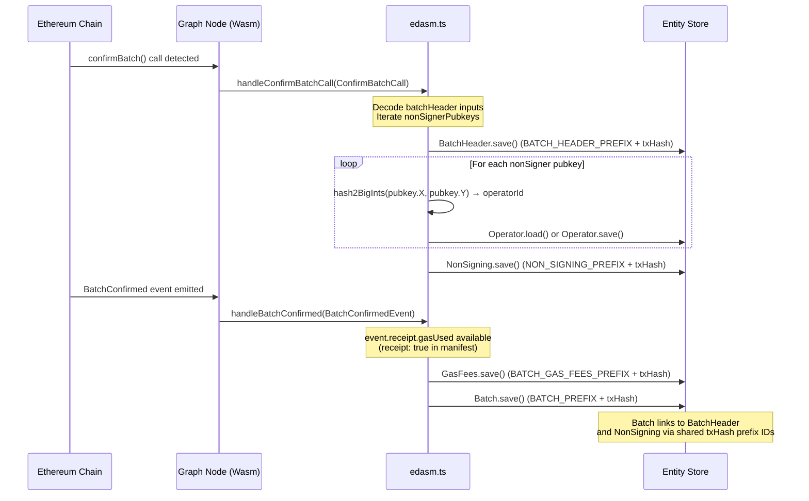
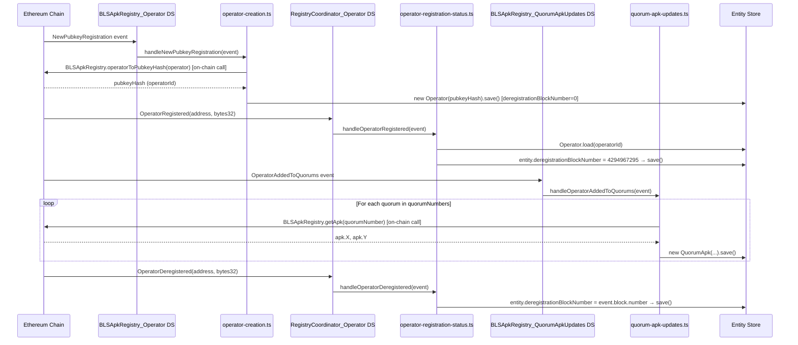
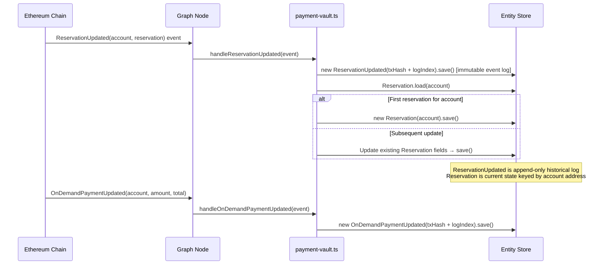
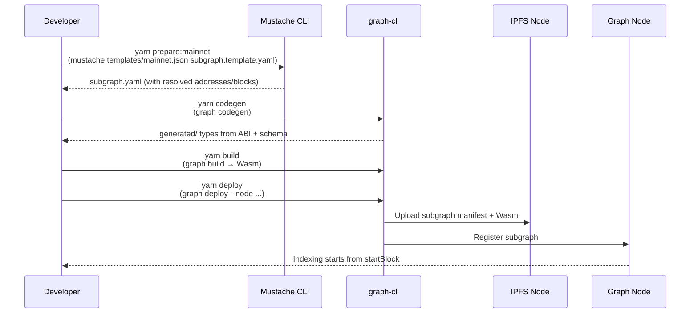

# eigenda-subgraphs Analysis

**Analyzed by**: code-analyzer-agent
**Timestamp**: 2026-04-10T00:00:00Z
**Application Type**: typescript-package
**Classification**: library
**Location**: subgraphs

## Architecture

The eigenda-subgraphs workspace is a monorepo of three independent The Graph Protocol subgraph packages that index EigenDA smart contract events on Ethereum into queryable GraphQL stores. Each subgraph is an AssemblyScript mapping compiled to WebAssembly, deployed to a Graph Node (either hosted on The Graph Network or via Goldsky), and continuously updated as new blocks are indexed on-chain.

The workspace uses a template-based deployment pattern: a Mustache template file (`subgraph.template.yaml`) is rendered with a network-specific JSON parameters file to produce the final `subgraph.yaml` manifest for a given environment (mainnet, sepolia, hoodi, preprod-hoodi, devnet, anvil). This avoids duplicating deployment configuration across environments while keeping contract addresses and start blocks externalized.

The three subgraphs are architecturally decoupled — each targets different EigenDA contracts and maintains its own GraphQL schema, ABIs, and event handler modules:
- **eigenda-batch-metadata**: Indexes batch confirmation events from `EigenDAServiceManager`, recording DA batch headers, non-signer operator lists, and gas cost telemetry.
- **eigenda-operator-state**: Indexes operator lifecycle events from `RegistryCoordinator`, `BLSApkRegistry`, and `EjectionManager`, maintaining a canonical operator set with BLS public keys, quorum memberships, and ejection records.
- **eigenda-payments**: Indexes payment events from `PaymentVault`, recording both event-log history and a materialized current-state view of per-account reservations.

All mapping code is written as AssemblyScript (a TypeScript subset that compiles to Wasm). Each handler function receives a decoded Ethereum event or call object from `@graphprotocol/graph-ts` and writes entities to The Graph's entity store using the generated schema types.

## Key Components

- **`subgraphs/constants.ts`**: Exports shared address constants (`ZERO_ADDRESS`, `ZERO_ADDRESS_BYTES`, `ZERO_ADDRESS_HEX_STRING`) using `@graphprotocol/graph-ts` primitives. Provided for use by any subgraph mapping that needs sentinel address comparisons.

- **`eigenda-batch-metadata/src/edasm.ts`**: Core mapping module for the EigenDAServiceManager subgraph. Exports `handleConfirmBatchCall` (a call handler), `handleBatchConfirmed` (an event handler), and two utility functions (`bytesToBigIntArray`, `hash2BigInts`). Uses prefixed byte-string IDs for all entities to avoid cross-entity ID collisions within a single transaction.

- **`eigenda-batch-metadata/schema.graphql`**: Defines five entity types: `Batch`, `BatchHeader`, `GasFees`, `NonSigning` (all immutable), and a mutable `Operator`. Relationship between `Batch` and its header/non-signing info is modeled via `@derivedFrom` reverse lookups on a shared transaction-hash key.

- **`eigenda-operator-state/src/registry-coordinator.ts`**: Handles five RegistryCoordinator events (`ChurnApproverUpdated`, `OperatorDeregistered`, `OperatorRegistered`, `OperatorSetParamsUpdated`, `OperatorSocketUpdate`). Each handler creates an immutable event-log entity keyed by `txHash.concatI32(logIndex)`.

- **`eigenda-operator-state/src/bls-apk-registry.ts`**: Handles three BLSApkRegistry events. The `NewPubkeyRegistration` handler stores BLS G1/G2 public key coordinates as separate `BigInt` fields (no struct nesting allowed in AssemblyScript GraphQL entities).

- **`eigenda-operator-state/src/operator-creation.ts`**: Dedicated handler for `NewPubkeyRegistration` that creates and persists the mutable `Operator` entity. Uses a contract binding (`BLSApkRegistry.bind(event.address)`) to call `operatorToPubkeyHash()` on-chain to derive the canonical operator ID.

- **`eigenda-operator-state/src/operator-registration-status.ts`**: Handles `OperatorRegistered` and `OperatorDeregistered` events to maintain the `deregistrationBlockNumber` field on the `Operator` entity. Sets it to `4294967295` (uint32 max sentinel) on registration and to the actual block number on deregistration.

- **`eigenda-operator-state/src/quorum-apk-updates.ts`**: Handles `OperatorAddedToQuorums` and `OperatorRemovedFromQuorums` by calling `BLSApkRegistry.getApk(quorumNumber)` on-chain for each affected quorum. Creates an immutable `QuorumApk` snapshot entity per quorum per event.

- **`eigenda-operator-state/src/ejection-manager.ts`**: Handles six EjectionManager events (`EjectorUpdated`, `Initialized`, `OperatorEjected`, `OwnershipTransferred`, `QuorumEjection`, `QuorumEjectionParamsSet`). All produce immutable event-log entities.

- **`eigenda-payments/src/payment-vault.ts`**: Handles eight PaymentVault events. The `handleReservationUpdated` handler does a dual-write: it creates an immutable `ReservationUpdated` event-log entity AND upserts a mutable `Reservation` entity keyed by the account address, representing current reservation state.

- **`eigenda-payments/schema.graphql`**: The only schema mixing raw event-log types (immutable) with a materialized state view (`Reservation`, mutable). A commented demarcation line ("EVENT-DERIVED STATE BELOW") separates the two categories.

## Data Flows

### 1. Batch Confirmation Indexing (eigenda-batch-metadata)

**Flow Description**: When a DA batch is confirmed on-chain, both the call data and the emitted event are captured to reconstruct the full batch record including non-signer information and gas costs.



**Detailed Steps**:

1. **Call Handler — Decode inputs** (`handleConfirmBatchCall`)
   - Triggered by the `confirmBatch(...)` call
   - Reads `batchHeader.blobHeadersRoot`, `batchHeader.quorumNumbers`, `batchHeader.signedStakeForQuorums`, `batchHeader.referenceBlockNumber` from call inputs
   - Converts `quorumNumbers` and `signedStakeForQuorums` from raw bytes to `BigInt[]` arrays via `bytesToBigIntArray()`
   - Iterates `nonSignerStakesAndSignature.nonSignerPubkeys`, derives each operator ID via keccak256 of (padded X, padded Y), and upserts `Operator` entities

2. **Event Handler — Capture gas and batch ID** (`handleBatchConfirmed`)
   - Triggered by the `BatchConfirmed(indexed bytes32, uint32)` event
   - Requires `receipt: true` in the manifest to access `gasUsed`
   - Computes `txFee = gasPrice * gasUsed` in AssemblyScript BigInt arithmetic
   - Creates the root `Batch` entity linking to the `GasFees` ID

**Error Paths**:
- Missing receipt (`event.receipt == null`) is guarded with `log.error(...)` and early return to prevent null dereference in the Wasm runtime.

---

### 2. Operator Lifecycle Indexing (eigenda-operator-state)

**Flow Description**: An operator joining or leaving the EigenDA operator set triggers events across multiple contracts; the subgraph coordinates multiple data sources in the same manifest to maintain a consistent Operator entity.



**Detailed Steps**:

1. **Operator Creation** — `operator-creation.ts:handleNewPubkeyRegistration`
   - Called from the `BLSApkRegistry_Operator` data source
   - Uses a live contract binding to call `operatorToPubkeyHash(address)` on the same block to derive the canonical bytes32 operator ID
   - Stores G1 and G2 BLS public key coordinates (X and Y separately as `BigInt`)
   - Sets `deregistrationBlockNumber = 0` as initial state

2. **Registration Status Updates** — `operator-registration-status.ts`
   - On `OperatorRegistered`: loads the entity and sets `deregistrationBlockNumber = 4294967295` (uint32 sentinel = never deregistered)
   - On `OperatorDeregistered`: loads and sets `deregistrationBlockNumber = event.block.number`

3. **Quorum APK Snapshots** — `quorum-apk-updates.ts`
   - Each operator quorum add/remove triggers a snapshot of the current aggregate public key (APK) for affected quorums
   - APK is fetched via live `BLSApkRegistry.getApk(quorumNumber)` call, not from event data

---

### 3. Payment Reservation Tracking (eigenda-payments)

**Flow Description**: PaymentVault contract events are indexed to provide both an append-only event log and a mutable current-state view of each account's active reservation.



**Error Paths**:
- Reservation entity uses `load()` + conditional `new` for upsert — no explicit error handling needed since account is always available from event params.

---

### 4. Subgraph Build and Deployment Flow

**Flow Description**: How a subgraph is built and deployed to a network environment using the Mustache template system.



## Dependencies

### External Libraries

All three subgraph packages share the same core dependency set, with slightly different pinned versions. The workspace root `package.json` pins older versions for workspace-level use.

- **@graphprotocol/graph-cli** (workspace root: `0.51.0`; eigenda-batch-metadata: `^0.97.0`; eigenda-operator-state: `^0.98.0`; eigenda-payments: `0.97.1`) [build-tool]: The Graph Protocol command-line tool providing the `graph codegen`, `graph build`, `graph deploy`, `graph test`, `graph create`, and `graph remove` commands. Used in all three subgraph `package.json` scripts to compile AssemblyScript mappings to WebAssembly, generate TypeScript type bindings from ABIs and GraphQL schemas, and deploy subgraph manifests to Graph nodes.
  Imported in: `eigenda-batch-metadata/package.json`, `eigenda-operator-state/package.json`, `eigenda-payments/package.json` (all scripts sections).

- **@graphprotocol/graph-ts** (workspace root: `0.32.0`; eigenda-batch-metadata: `^0.38.0`; eigenda-operator-state: `^0.38.0`; eigenda-payments: `0.37.0`) [blockchain]: The Graph Protocol TypeScript/AssemblyScript standard library for subgraph mappings. Provides core types (`Address`, `Bytes`, `BigInt`), Ethereum interaction APIs (`ethereum.Event`, `ethereum.Call`, contract bindings), cryptographic functions (`crypto.keccak256`), and the `log` utility.
  Imported in: `subgraphs/constants.ts`, `eigenda-batch-metadata/src/edasm.ts`, all `eigenda-operator-state/src/*.ts` files, `eigenda-payments/src/payment-vault.ts`, and all test files.

- **matchstick-as** (workspace root: `0.5.0`; eigenda-batch-metadata: `^0.6.0`; eigenda-operator-state: `^0.6.0`; eigenda-payments: `0.6.0`) [testing]: The Matchstick unit testing framework for Graph Protocol subgraphs. Provides mock event/call constructors (`newMockEvent`, `newMockCall`), store assertions (`assert.entityCount`, `assert.fieldEquals`), lifecycle hooks (`beforeAll`, `afterAll`, `clearStore`), and mocked contract calls (`createMockedFunction`). Tests run via `graph test`.
  Imported in: `eigenda-batch-metadata/tests/edasm.test.ts`, `eigenda-batch-metadata/tests/edasm-utils.ts`, `eigenda-operator-state/tests/*.test.ts`, `eigenda-payments/tests/payment-vault.test.ts`.

- **mustache** (eigenda-batch-metadata: `^4.0.1`; eigenda-operator-state: `^4.0.1`; eigenda-payments: `^4.0.1`) [build-tool]: Logic-less template engine used to render `subgraph.template.yaml` with network-specific values from JSON parameter files (e.g., `mainnet.json`, `sepolia.json`). Invoked in all `prepare:<network>` scripts in every subgraph's `package.json`.
  Imported in: all `prepare:*` scripts in `eigenda-batch-metadata/package.json`, `eigenda-operator-state/package.json`, `eigenda-payments/package.json`.

- **assemblyscript** (eigenda-operator-state only: `^0.19.0`) [build-tool]: The AssemblyScript compiler toolchain. Provides the `asc` compiler that graph-cli internally delegates to when compiling mapping `.ts` files to WebAssembly `.wasm` modules.
  Imported in: `eigenda-operator-state/package.json` devDependencies.

### Internal Libraries

This component has no internal library dependencies within the EigenDA codebase. The three subgraph packages within this workspace each stand alone and do not import from each other at the AssemblyScript level. The workspace-root `constants.ts` is a shared module available via the root tsconfig but is not currently imported by any subgraph mapping handler.

## API Surface

This library does not export conventional TypeScript functions or classes for use by other application packages. Its API surface is the set of GraphQL schemas deployed to The Graph Protocol indexers, consumed via GraphQL queries by external analytics tools, dashboards, and the EigenDA operator/client infrastructure.

### GraphQL Query API — eigenda-batch-metadata

Deployed to `Layr-Labs/eigenda-batch-metadata` on The Graph hosted service.

**Entity types available for querying:**

- `batch(id: Bytes!)` / `batches(...)` — Root batch entity with `batchId`, `batchHeaderHash`, block metadata, gas fees reference, header reference, and non-signers reference.
- `batchHeader(id: Bytes!)` / `batchHeaders(...)` — Decoded batch header with `blobHeadersRoot`, `quorumNumbers[]`, `signedStakeForQuorums[]`, `referenceBlockNumber`.
- `gasFees(id: Bytes!)` / `gasFees(...)` — Gas cost breakdown with `gasUsed`, `gasPrice`, `txFee`.
- `nonSigning(id: Bytes!)` / `nonSignings(...)` — Non-signer record linking to a list of `Operator` entities.
- `operator(id: Bytes!)` / `operators(...)` — Operator entity (mutable) with `operatorId`.

### GraphQL Query API — eigenda-operator-state

Deployed to `Layr-Labs/eigenda-operator-state`.

**Entity types available for querying:**

- `operator(id: Bytes!)` / `operators(...)` — Canonical mutable operator entity with BLS G1/G2 public key coordinates, `deregistrationBlockNumber` (4294967295 = active), and linked `socketUpdates`.
- `operatorRegistered(...)` / `operatorDeregistered(...)` — Immutable event logs of registration state changes.
- `newPubkeyRegistration(...)` — Immutable log of BLS key registrations.
- `operatorAddedToQuorum(...)` / `operatorRemovedFromQuorum(...)` — Quorum membership change events.
- `operatorSocketUpdate(...)` — Operator network endpoint change history.
- `quorumApk(...)` — Immutable snapshots of per-quorum aggregate public key at each operator membership change.
- `churnApproverUpdated(...)`, `operatorSetParamsUpdated(...)` — RegistryCoordinator governance events.
- `ejectorUpdated(...)`, `operatorEjected(...)`, `quorumEjection(...)`, `quorumEjectionParamsSet(...)` — EjectionManager lifecycle events.

### GraphQL Query API — eigenda-payments

Deployed to `eigenda-payments` on The Graph Studio.

**Entity types available for querying:**

- `reservation(id: Bytes!)` / `reservations(...)` — Mutable current-state entity per account with `symbolsPerSecond`, `startTimestamp`, `endTimestamp`, `quorumNumbers`, `quorumSplits`, and last-updated metadata. Supports timestamp-based filtering for active/pending/expired status queries.
- `reservationUpdated(...)` — Immutable event log of every reservation state change.
- `onDemandPaymentUpdated(...)` — Immutable event log of on-demand payment deposits.
- `globalRatePeriodIntervalUpdated(...)`, `globalSymbolsPerPeriodUpdated(...)` — Global rate parameter change history.
- `priceParamsUpdated(...)` — Price configuration change events.
- `reservationPeriodIntervalUpdated(...)` — Period interval configuration changes.
- `initialized(...)`, `ownershipTransferred(...)` — Contract lifecycle events.

### Example GraphQL Queries

```graphql
# Get active reservations (eigenda-payments)
query ActiveReservations($currentTime: BigInt!) {
  reservations(
    where: {
      startTimestamp_lte: $currentTime,
      endTimestamp_gt: $currentTime
    }
  ) {
    account
    symbolsPerSecond
    startTimestamp
    endTimestamp
    quorumNumbers
    quorumSplits
  }
}
```

```graphql
# Get batches with non-signers (eigenda-batch-metadata)
query BatchesWithNonSigners($first: Int!) {
  batches(first: $first, orderBy: blockNumber, orderDirection: desc) {
    batchId
    batchHeaderHash
    txHash
    blockTimestamp
    gasFees {
      gasUsed
      txFee
    }
    nonSigning {
      nonSigners {
        operatorId
      }
    }
    batchHeader {
      quorumNumbers
      signedStakeForQuorums
      referenceBlockNumber
    }
  }
}
```

```graphql
# Get active operators with their BLS keys (eigenda-operator-state)
query ActiveOperators {
  operators(
    where: { deregistrationBlockNumber: "4294967295" }
  ) {
    id
    operator
    pubkeyG1_X
    pubkeyG1_Y
    socketUpdates(first: 1, orderBy: blockNumber, orderDirection: desc) {
      socket
    }
  }
}
```

## Code Examples

### Example 1: Prefixed Entity ID Scheme (eigenda-batch-metadata)

```typescript
// subgraphs/eigenda-batch-metadata/src/edasm.ts
export const BATCH_HEADER_PREFIX_BYTES   = Bytes.fromHexString("0x0001")
export const NON_SIGNING_PREFIX_BYTES    = Bytes.fromHexString("0x0002")
export const OPERATOR_PREFIX_BYTES       = Bytes.fromHexString("0x0003")
export const BATCH_GAS_FEES_PREFIX_BYTES = Bytes.fromHexString("0x0006")
export const BATCH_PREFIX_BYTES          = Bytes.fromHexString("0x0007")

// Entity IDs are formed by concatenating the type prefix with the tx hash.
// All entities belonging to the same transaction share a consistent suffix.
let batchHeader = new BatchHeader(BATCH_HEADER_PREFIX_BYTES.concat(confirmBatchCall.transaction.hash))
let batch       = new Batch(BATCH_PREFIX_BYTES.concat(batchConfirmedEvent.transaction.hash))
```

### Example 2: Operator ID Derivation via keccak256 (eigenda-batch-metadata)

```typescript
// subgraphs/eigenda-batch-metadata/src/edasm.ts
export function hash2BigInts(x: BigInt, y: BigInt): Bytes {
  // Pad each coordinate to 32 bytes (64 hex chars) before hashing,
  // mirroring the operatorId derivation used in the EigenDA contracts.
  let xBytes = x.toHex().substring(2).padStart(64, "0")
  let yBytes = y.toHex().substring(2).padStart(64, "0")
  let xy = Bytes.fromHexString(xBytes.concat(yBytes))
  return Bytes.fromByteArray(crypto.keccak256(xy))
}
```

### Example 3: Live Contract Binding for On-Chain Reads (eigenda-operator-state)

```typescript
// subgraphs/eigenda-operator-state/src/operator-creation.ts
export function handleNewPubkeyRegistration(event: NewPubkeyRegistrationEvent): void {
  // Bind to the contract at the event's source address at the current block height
  let apkRegistry = BLSApkRegistry.bind(event.address)
  // Read operatorToPubkeyHash from on-chain state to obtain the canonical operator ID
  let entity = new Operator(
    apkRegistry.operatorToPubkeyHash(event.params.operator)
  )
  entity.deregistrationBlockNumber = BigInt.fromI32(0)
  entity.save()
}
```

### Example 4: Mutable State Entity Upsert Pattern (eigenda-payments)

```typescript
// subgraphs/eigenda-payments/src/payment-vault.ts
export function handleReservationUpdated(event: ReservationUpdatedEvent): void {
  // 1. Immutable event log (append-only, keyed by tx+logIndex)
  let entity = new ReservationUpdated(event.transaction.hash.concatI32(event.logIndex.toI32()))
  entity.account = event.params.account
  entity.save()

  // 2. Mutable current-state entity (upsert, keyed by account address)
  let reservation = Reservation.load(event.params.account)
  if (reservation == null) {
    reservation = new Reservation(event.params.account)
  }
  reservation.symbolsPerSecond = event.params.reservation.symbolsPerSecond
  reservation.endTimestamp = event.params.reservation.endTimestamp
  reservation.save()
}
```

### Example 5: Mustache Template for Multi-Network Deployment

```yaml
# subgraphs/eigenda-batch-metadata/templates/subgraph.template.yaml (excerpt)
dataSources:
  - kind: ethereum
    name: EigenDAServiceManager
    network: {{network}}
    source:
      address: "{{EigenDAServiceManager_address}}"
      startBlock: {{EigenDAServiceManager_startBlock}}
```

```json
// subgraphs/eigenda-batch-metadata/templates/mainnet.json
{
  "network": "mainnet",
  "EigenDAServiceManager_address": "0x870679E138bCdf293b7Ff14dD44b70FC97e12fc0",
  "EigenDAServiceManager_startBlock": 19592322
}
```

## Files Analyzed

- `subgraphs/package.json` (9 lines) - Workspace root package with pinned dependency versions
- `subgraphs/tsconfig.json` (4 lines) - TypeScript config extending graph-ts base, includes all subgraph src dirs
- `subgraphs/constants.ts` (5 lines) - Shared zero-address constants
- `subgraphs/README.md` (31 lines) - Build and deployment documentation
- `subgraphs/eigenda-batch-metadata/package.json` (27 lines) - Subgraph package scripts and dev dependencies
- `subgraphs/eigenda-batch-metadata/schema.graphql` (40 lines) - Batch metadata entity schema
- `subgraphs/eigenda-batch-metadata/src/edasm.ts` (90 lines) - Core batch confirmation mapping handlers and utilities
- `subgraphs/eigenda-batch-metadata/tests/edasm.test.ts` (197 lines) - Matchstick unit tests for batch handlers
- `subgraphs/eigenda-batch-metadata/tests/edasm-utils.ts` (87 lines) - Test helper factories for mock events/calls
- `subgraphs/eigenda-batch-metadata/templates/subgraph.template.yaml` (29 lines) - Mustache subgraph manifest template
- `subgraphs/eigenda-batch-metadata/templates/mainnet.json` (5 lines) - Mainnet deployment parameters
- `subgraphs/eigenda-operator-state/package.json` (28 lines) - Subgraph package scripts and dev dependencies
- `subgraphs/eigenda-operator-state/schema.graphql` (161 lines) - Operator state entity schema
- `subgraphs/eigenda-operator-state/src/registry-coordinator.ts` (97 lines) - RegistryCoordinator event handlers
- `subgraphs/eigenda-operator-state/src/bls-apk-registry.ts` (64 lines) - BLSApkRegistry event handlers
- `subgraphs/eigenda-operator-state/src/operator-creation.ts` (23 lines) - Operator entity creation handler
- `subgraphs/eigenda-operator-state/src/operator-registration-status.ts` (33 lines) - Operator deregistration block tracking
- `subgraphs/eigenda-operator-state/src/quorum-apk-updates.ts` (41 lines) - Per-quorum APK snapshot handler
- `subgraphs/eigenda-operator-state/src/ejection-manager.ts` (104 lines) - EjectionManager event handlers
- `subgraphs/eigenda-operator-state/tests/operator-state.test.ts` (167 lines) - Unit tests for operator lifecycle
- `subgraphs/eigenda-operator-state/templates/subgraph.template.yaml` (164 lines) - Multi-datasource subgraph manifest template
- `subgraphs/eigenda-operator-state/templates/mainnet.json` (9 lines) - Mainnet contract addresses and start blocks
- `subgraphs/eigenda-operator-state/templates/sepolia.json` (9 lines) - Sepolia testnet parameters
- `subgraphs/eigenda-payments/package.json` (27 lines) - Subgraph package scripts and dependencies
- `subgraphs/eigenda-payments/schema.graphql` (96 lines) - Payments entity schema with event-log and state entities
- `subgraphs/eigenda-payments/src/payment-vault.ts` (170 lines) - PaymentVault event handlers with dual-write pattern
- `subgraphs/eigenda-payments/tests/payment-vault.test.ts` (179 lines) - Unit tests covering upsert behavior and multi-account reservations
- `subgraphs/eigenda-payments/templates/subgraph.template.yaml` (49 lines) - Payments subgraph manifest (specVersion 1.2.0)
- `subgraphs/eigenda-payments/templates/mainnet.json` (5 lines) - Mainnet PaymentVault address and start block
- `subgraphs/eigenda-payments/QUERY_EXAMPLES.md` (118 lines) - GraphQL query examples for active/pending/expired reservations

## Analysis Data

```json
{
  "summary": "eigenda-subgraphs is a monorepo of three The Graph Protocol subgraph packages (eigenda-batch-metadata, eigenda-operator-state, eigenda-payments) that index EigenDA Ethereum smart contract events into queryable GraphQL stores. Written in AssemblyScript and compiled to WebAssembly, each subgraph maps events and calls from specific EigenDA contracts (EigenDAServiceManager, RegistryCoordinator, BLSApkRegistry, EjectionManager, PaymentVault) into structured entity stores exposed as GraphQL APIs, enabling off-chain analytics and operator tooling to efficiently query on-chain EigenDA state without direct RPC calls.",
  "architecture_pattern": "event-driven",
  "key_modules": [
    "eigenda-batch-metadata/src/edasm.ts",
    "eigenda-operator-state/src/registry-coordinator.ts",
    "eigenda-operator-state/src/bls-apk-registry.ts",
    "eigenda-operator-state/src/operator-creation.ts",
    "eigenda-operator-state/src/operator-registration-status.ts",
    "eigenda-operator-state/src/quorum-apk-updates.ts",
    "eigenda-operator-state/src/ejection-manager.ts",
    "eigenda-payments/src/payment-vault.ts",
    "subgraphs/constants.ts"
  ],
  "api_endpoints": [
    "GraphQL: eigenda-batch-metadata — Batch, BatchHeader, GasFees, NonSigning, Operator",
    "GraphQL: eigenda-operator-state — Operator, OperatorRegistered, OperatorDeregistered, NewPubkeyRegistration, OperatorAddedToQuorum, OperatorRemovedFromQuorum, OperatorSocketUpdate, QuorumApk, OperatorEjected, QuorumEjection",
    "GraphQL: eigenda-payments — Reservation (mutable), ReservationUpdated, OnDemandPaymentUpdated, PriceParamsUpdated, GlobalRatePeriodIntervalUpdated, GlobalSymbolsPerPeriodUpdated"
  ],
  "data_flows": [
    "Batch confirmation: EigenDAServiceManager.confirmBatch() call + BatchConfirmed event → BatchHeader + NonSigning + Operator + GasFees + Batch entities",
    "Operator registration: BLSApkRegistry.NewPubkeyRegistration + on-chain operatorToPubkeyHash() call → Operator entity created with BLS keys; RegistryCoordinator.OperatorRegistered/Deregistered → deregistrationBlockNumber updated",
    "Quorum APK snapshots: BLSApkRegistry.OperatorAddedToQuorums/RemovedFromQuorums + on-chain getApk() → QuorumApk immutable snapshot per quorum",
    "Payment reservation: PaymentVault.ReservationUpdated → immutable ReservationUpdated event log + mutable Reservation upsert by account address"
  ],
  "tech_stack": [
    "typescript",
    "assemblyscript",
    "the-graph",
    "graphql",
    "webassembly",
    "ethereum",
    "mustache"
  ],
  "external_integrations": [
    "The Graph Protocol hosted service / Graph Studio (subgraph deployment target)",
    "Goldsky subgraph service (referenced in README)",
    "Ethereum mainnet (EigenDAServiceManager at 0x870679E138bCdf293b7Ff14dD44b70FC97e12fc0, startBlock 19592322)",
    "Ethereum Sepolia testnet (RegistryCoordinator at 0xAF21d3811B5d23D5466AC83BA7a9c34c261A8D81)",
    "Ethereum Hoodi testnet",
    "IPFS (subgraph manifest upload during deployment)"
  ],
  "component_interactions": []
}
```

## Citations

```json
[
  {
    "file_path": "subgraphs/package.json",
    "start_line": 1,
    "end_line": 9,
    "claim": "Root workspace declares @graphprotocol/graph-cli 0.51.0 and @graphprotocol/graph-ts 0.32.0 as runtime deps, matchstick-as 0.5.0 as devDep",
    "section": "Dependencies",
    "snippet": "\"@graphprotocol/graph-cli\": \"0.51.0\",\n\"@graphprotocol/graph-ts\": \"0.32.0\"\n\"matchstick-as\": \"0.5.0\""
  },
  {
    "file_path": "subgraphs/constants.ts",
    "start_line": 1,
    "end_line": 5,
    "claim": "Workspace-level constants module exports ZERO_ADDRESS variants using Address and Bytes from graph-ts",
    "section": "Key Components",
    "snippet": "import { Address, Bytes } from \"@graphprotocol/graph-ts\";\nexport const ZERO_ADDRESS = Address.fromHexString(\"0x0000...\")"
  },
  {
    "file_path": "subgraphs/eigenda-batch-metadata/src/edasm.ts",
    "start_line": 11,
    "end_line": 17,
    "claim": "Entity IDs use 2-byte type prefix bytes concatenated with transaction hash to namespace different entity types sharing a transaction",
    "section": "Architecture",
    "snippet": "export const BATCH_HEADER_PREFIX_BYTES = Bytes.fromHexString(\"0x0001\")\nexport const BATCH_PREFIX_BYTES = Bytes.fromHexString(\"0x0007\")"
  },
  {
    "file_path": "subgraphs/eigenda-batch-metadata/src/edasm.ts",
    "start_line": 19,
    "end_line": 50,
    "claim": "handleConfirmBatchCall decodes batch header inputs and iterates nonSignerPubkeys to derive operator IDs via keccak256(X||Y) and upsert Operator entities",
    "section": "Data Flows",
    "snippet": "for (let index = 0; index < confirmBatchCall.inputs.nonSignerStakesAndSignature.nonSignerPubkeys.length; index++) {\n  let operatorId = hash2BigInts(pubkey.X, pubkey.Y)"
  },
  {
    "file_path": "subgraphs/eigenda-batch-metadata/src/edasm.ts",
    "start_line": 52,
    "end_line": 71,
    "claim": "handleBatchConfirmed guards against null receipt, computes txFee = gasPrice * gasUsed, and saves GasFees and Batch entities",
    "section": "Data Flows",
    "snippet": "if (batchConfirmedEvent.receipt == null) { log.error(...); return }\nbatchGasFees.txFee = batchGasFees.gasPrice.times(batchGasFees.gasUsed)"
  },
  {
    "file_path": "subgraphs/eigenda-batch-metadata/src/edasm.ts",
    "start_line": 85,
    "end_line": 91,
    "claim": "hash2BigInts computes keccak256(padded_X_32bytes || padded_Y_32bytes) to derive the EigenDA operator ID from BLS G1 pubkey coordinates",
    "section": "Key Components",
    "snippet": "let xBytes = x.toHex().substring(2).padStart(64, \"0\")\nlet yBytes = y.toHex().substring(2).padStart(64, \"0\")\nreturn Bytes.fromByteArray(crypto.keccak256(xy))"
  },
  {
    "file_path": "subgraphs/eigenda-operator-state/src/operator-creation.ts",
    "start_line": 9,
    "end_line": 23,
    "claim": "operator-creation.ts uses a live BLSApkRegistry contract binding to call operatorToPubkeyHash() on-chain to derive the canonical operator ID at indexing time",
    "section": "Data Flows",
    "snippet": "let apkRegistry = BLSApkRegistry.bind(event.address)\nlet entity = new Operator(apkRegistry.operatorToPubkeyHash(event.params.operator))"
  },
  {
    "file_path": "subgraphs/eigenda-operator-state/src/operator-registration-status.ts",
    "start_line": 22,
    "end_line": 32,
    "claim": "handleOperatorRegistered sets deregistrationBlockNumber to uint32 max (4294967295) as a sentinel value indicating the operator is currently active",
    "section": "Key Components",
    "snippet": "entity.deregistrationBlockNumber = BigInt.fromU32(4294967295)"
  },
  {
    "file_path": "subgraphs/eigenda-operator-state/src/operator-registration-status.ts",
    "start_line": 10,
    "end_line": 19,
    "claim": "handleOperatorDeregistered sets deregistrationBlockNumber to the actual block number when the operator left the set",
    "section": "Key Components",
    "snippet": "entity.deregistrationBlockNumber = event.block.number\nentity.save()"
  },
  {
    "file_path": "subgraphs/eigenda-operator-state/src/quorum-apk-updates.ts",
    "start_line": 23,
    "end_line": 41,
    "claim": "updateApks() makes live on-chain calls to BLSApkRegistry.getApk(quorumNumber) for each quorum and stores an immutable QuorumApk snapshot entity",
    "section": "Data Flows",
    "snippet": "let blsApkRegistry = BLSApkRegistry.bind(blsApkRegistryAddress)\nlet apk = blsApkRegistry.getApk(quorumNumber)\nquorumApk.apk_X = apk.X"
  },
  {
    "file_path": "subgraphs/eigenda-payments/src/payment-vault.ts",
    "start_line": 135,
    "end_line": 169,
    "claim": "handleReservationUpdated performs dual-write: one immutable ReservationUpdated event-log entity and one mutable Reservation upsert keyed by account address",
    "section": "Data Flows",
    "snippet": "let entity = new ReservationUpdated(event.transaction.hash.concatI32(...))\nentity.save()\nlet reservation = Reservation.load(event.params.account)\nif (reservation == null) { reservation = new Reservation(event.params.account) }\nreservation.save()"
  },
  {
    "file_path": "subgraphs/eigenda-payments/schema.graphql",
    "start_line": 81,
    "end_line": 95,
    "claim": "The payments schema contains a comment demarcating event-log types (immutable) from event-derived state types (mutable), with Reservation as the only mutable entity",
    "section": "Architecture",
    "snippet": "# Everything above here maps 1:1 to onchain events\n# ============== EVENT-DERIVED STATE BELOW ==============\ntype Reservation @entity(immutable: false) {"
  },
  {
    "file_path": "subgraphs/eigenda-batch-metadata/schema.graphql",
    "start_line": 1,
    "end_line": 11,
    "claim": "Batch entity is immutable and links to BatchHeader and NonSigning via @derivedFrom reverse lookups sharing the same batch field",
    "section": "API Surface",
    "snippet": "type Batch @entity(immutable: true) {\n  batchHeader: BatchHeader! @derivedFrom(field: \"batch\")\n  nonSigning: NonSigning! @derivedFrom(field: \"batch\")\n  gasFees: GasFees!"
  },
  {
    "file_path": "subgraphs/eigenda-operator-state/schema.graphql",
    "start_line": 142,
    "end_line": 161,
    "claim": "Operator entity is mutable (immutable: false) with BLS G1/G2 public key coordinates as separate BigInt fields and deregistrationBlockNumber for active-status filtering",
    "section": "API Surface",
    "snippet": "type Operator @entity(immutable: false) {\n  pubkeyG1_X: BigInt!\n  deregistrationBlockNumber: BigInt!\n  socketUpdates: [OperatorSocketUpdate!]! @derivedFrom(field: \"operatorId\")"
  },
  {
    "file_path": "subgraphs/eigenda-batch-metadata/templates/subgraph.template.yaml",
    "start_line": 22,
    "end_line": 28,
    "claim": "The batch-metadata subgraph uses both a callHandler (confirmBatch call data) and an eventHandler with receipt: true (BatchConfirmed gas data)",
    "section": "Architecture",
    "snippet": "callHandlers:\n  - function: confirmBatch(...)\n    handler: handleConfirmBatchCall\neventHandlers:\n  - event: BatchConfirmed(indexed bytes32,uint32)\n    handler: handleBatchConfirmed\n    receipt: true"
  },
  {
    "file_path": "subgraphs/eigenda-operator-state/templates/subgraph.template.yaml",
    "start_line": 1,
    "end_line": 10,
    "claim": "The operator-state manifest defines 5 separate data sources for the same and different contracts, each with dedicated handler files to separate concerns",
    "section": "Architecture",
    "snippet": "dataSources:\n  - name: RegistryCoordinator\n  - name: BLSApkRegistry\n  - name: BLSApkRegistry_Operator\n  - name: RegistryCoordinator_Operator\n  - name: BLSApkRegistry_QuorumApkUpdates\n  - name: EjectionManager"
  },
  {
    "file_path": "subgraphs/eigenda-payments/templates/subgraph.template.yaml",
    "start_line": 1,
    "end_line": 4,
    "claim": "The payments subgraph uses specVersion 1.2.0 with indexerHints: prune: auto, while the other two subgraphs use specVersion 0.0.5",
    "section": "Architecture",
    "snippet": "specVersion: 1.2.0\nindexerHints:\n  prune: auto"
  },
  {
    "file_path": "subgraphs/eigenda-batch-metadata/package.json",
    "start_line": 6,
    "end_line": 14,
    "claim": "Subgraph supports deployment to 7 network environments via prepare scripts using Mustache templating",
    "section": "Architecture",
    "snippet": "\"prepare:preprod-hoodi\": \"mustache templates/preprod-hoodi.json ...\",\n\"prepare:hoodi\": \"mustache templates/hoodi.json ...\",\n\"prepare:mainnet\": \"mustache templates/mainnet.json ...\""
  },
  {
    "file_path": "subgraphs/eigenda-batch-metadata/templates/mainnet.json",
    "start_line": 1,
    "end_line": 5,
    "claim": "EigenDAServiceManager is deployed at 0x870679E138bCdf293b7Ff14dD44b70FC97e12fc0 on Ethereum mainnet with indexing starting from block 19592322",
    "section": "Architecture",
    "snippet": "{\"network\": \"mainnet\", \"EigenDAServiceManager_address\": \"0x870679E138bCdf293b7Ff14dD44b70FC97e12fc0\", \"EigenDAServiceManager_startBlock\": 19592322}"
  },
  {
    "file_path": "subgraphs/eigenda-operator-state/templates/mainnet.json",
    "start_line": 1,
    "end_line": 9,
    "claim": "Operator state subgraph tracks RegistryCoordinator, BLSApkRegistry, and EjectionManager on mainnet with distinct start blocks",
    "section": "Architecture",
    "snippet": "\"RegistryCoordinator_address\": \"0x0BAAc79acD45A023E19345c352d8a7a83C4e5656\",\n\"BLSApkRegistry_address\": \"0x00A5Fd09F6CeE6AE9C8b0E5e33287F7c82880505\",\n\"EjectionManager_startBlock\": 19839949"
  },
  {
    "file_path": "subgraphs/eigenda-payments/templates/mainnet.json",
    "start_line": 1,
    "end_line": 5,
    "claim": "PaymentVault is deployed at 0xb2e7ef419a2A399472ae22ef5cFcCb8bE97A4B05 on mainnet with indexing from block 22276885",
    "section": "Architecture",
    "snippet": "{\"PaymentVault_address\": \"0xb2e7ef419a2A399472ae22ef5cFcCb8bE97A4B05\", \"PaymentVault_startBlock\": 22276885}"
  },
  {
    "file_path": "subgraphs/eigenda-operator-state/src/bls-apk-registry.ts",
    "start_line": 48,
    "end_line": 64,
    "claim": "NewPubkeyRegistration handler stores BLS G1 and G2 key coordinates as flat BigInt fields since AssemblyScript GraphQL entities cannot use nested struct types",
    "section": "Key Components",
    "snippet": "entity.pubkeyG1_X = event.params.pubkeyG1.X\nentity.pubkeyG1_Y = event.params.pubkeyG1.Y\nentity.pubkeyG2_X = event.params.pubkeyG2.X\nentity.pubkeyG2_Y = event.params.pubkeyG2.Y"
  },
  {
    "file_path": "subgraphs/eigenda-payments/QUERY_EXAMPLES.md",
    "start_line": 37,
    "end_line": 54,
    "claim": "Active reservations are queried using startTimestamp_lte and endTimestamp_gt filters on the mutable Reservation entity",
    "section": "API Surface",
    "snippet": "reservations(where: { startTimestamp_lte: $currentTime, endTimestamp_gt: $currentTime })"
  },
  {
    "file_path": "subgraphs/eigenda-operator-state/tests/operator-state.test.ts",
    "start_line": 39,
    "end_line": 44,
    "claim": "Matchstick tests mock the on-chain BLSApkRegistry.operatorToPubkeyHash() call to unit test operator creation without a live node",
    "section": "Key Components",
    "snippet": "createMockedFunction(event.address, 'operatorToPubkeyHash', 'operatorToPubkeyHash(address):(bytes32)')\n  .withArgs([ethereum.Value.fromAddress(operator)])\n  .returns([ethereum.Value.fromBytes(pubkeyHash)])"
  },
  {
    "file_path": "subgraphs/eigenda-batch-metadata/src/edasm.ts",
    "start_line": 73,
    "end_line": 83,
    "claim": "bytesToBigIntArray converts raw bytes to a BigInt array by processing each byte individually as a 2-character hex substring",
    "section": "Key Components",
    "snippet": "for (let i = 0; i < hex.length / 2; i++) {\n  let byte = hex.substring(i * 2, (i+1) * 2)\n  result.push(BigInt.fromUnsignedBytes(...))"
  },
  {
    "file_path": "subgraphs/tsconfig.json",
    "start_line": 1,
    "end_line": 4,
    "claim": "Workspace tsconfig extends @graphprotocol/graph-ts base config and includes all subgraph src directories via glob pattern",
    "section": "Architecture",
    "snippet": "{ \"extends\": \"@graphprotocol/graph-ts/types/tsconfig.base.json\", \"include\": [\"./*/src\"] }"
  },
  {
    "file_path": "subgraphs/eigenda-operator-state/package.json",
    "start_line": 22,
    "end_line": 27,
    "claim": "eigenda-operator-state additionally depends on assemblyscript ^0.19.0, which the other two subgraphs do not declare explicitly",
    "section": "Dependencies",
    "snippet": "\"assemblyscript\": \"^0.19.0\""
  }
]
```

## Analysis Notes

### Security Considerations

1. **Null Receipt Guard**: The `handleBatchConfirmed` handler in `edasm.ts` guards against a null `event.receipt` before accessing `gasUsed`. This is necessary because receipt availability depends on Graph Node configuration; missing this check would cause a runtime panic in the Wasm sandbox. The guard uses `log.error()` plus early return.

2. **Immutable vs Mutable Entity Design**: The schemas correctly mark nearly all event-log entities as `immutable: true`, which prevents accidental mutation of historical records. Only `Operator` (in both batch-metadata and operator-state subgraphs) and `Reservation` are mutable, reflecting entities where current state must be maintained. A bug in update logic could permanently corrupt the mutable entity for that ID.

3. **On-Chain Call Trust Boundary**: Handlers in `operator-creation.ts` and `quorum-apk-updates.ts` make live contract calls via `BLSApkRegistry.bind()`. These calls are executed at the block height of the triggering event. The Graph handles reorgs by re-executing affected handlers, but the correctness of derived state depends on the on-chain data being consistent at that block.

4. **No Authentication / Access Control**: Subgraph data is publicly queryable with no access restrictions. All indexed EigenDA contract data (operator BLS public keys, payment amounts, non-signer lists) is exposed. This is expected for public blockchain data but should be considered in client application design.

5. **Manual Prefix Registry**: The 2-byte type prefix scheme in `eigenda-batch-metadata` (0x0001 through 0x0007) is manually maintained with no automated collision detection. Adding new entity types requires careful selection of non-conflicting prefix values.

### Performance Characteristics

- **Stateless Event Handlers**: Each handler processes a single event in isolation, enabling parallel processing by the Graph Node. The only shared state is the entity store, accessed via explicit `load()` calls.
- **On-Chain Calls in Hot Paths**: `quorum-apk-updates.ts` makes one on-chain RPC call per quorum per operator add/remove event. During high-throughput operator join periods, this can slow indexing. Similarly, `operator-creation.ts` requires one call per new operator registration.
- **No Complex Aggregation**: All entities are flat key-value records derived directly from event fields or single contract reads. There is no complex aggregation logic, keeping individual handler execution fast.
- **payments specVersion 1.2.0 with `prune: auto`**: The eigenda-payments subgraph uses the newer spec version with automatic pruning of historical entity data, reducing storage requirements at the cost of reduced historical query depth.

### Scalability Notes

- **Independent Subgraph Scaling**: Each subgraph is deployed and indexed independently on The Graph Network, allowing each to scale based on its own event volume and query load without affecting the others.
- **Multi-Network Support**: The template-based manifest system supports deployment to 6+ networks without code changes, only requiring new JSON parameter files for new network deployments.
- **Pagination Required for Large Datasets**: The `operators` and `batches` entity collections grow without bound as EigenDA operates. Production consumers must use GraphQL `first`/`skip` pagination or cursor-based pagination.
- **The Graph Hosted Service Migration**: The `eigenda-batch-metadata` and `eigenda-operator-state` subgraphs still reference the deprecated `api.thegraph.com/deploy/` endpoint in their deploy scripts. The newer `eigenda-payments` correctly uses The Graph Studio endpoint. Migration to Studio or Goldsky is needed for long-term operation of the older subgraphs.
