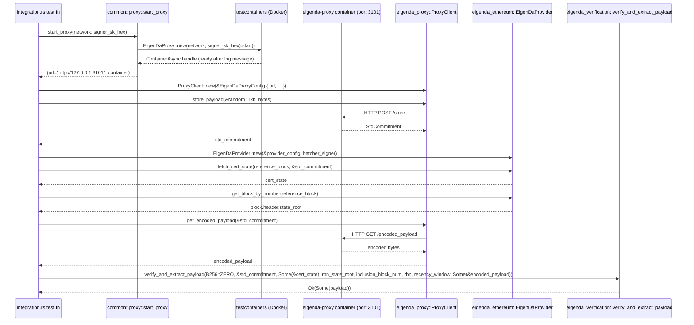
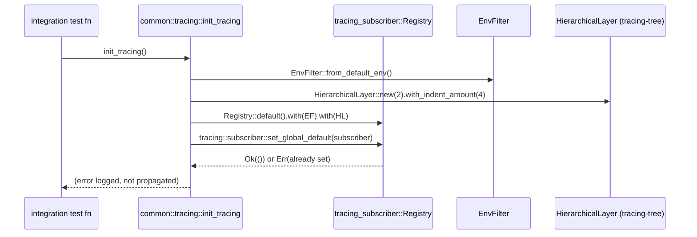
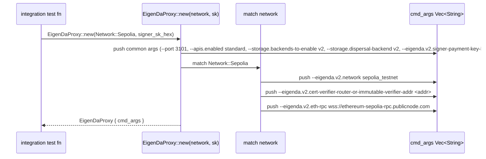

# eigenda-tests Analysis

**Analyzed by**: code-analyzer-library
**Timestamp**: 2026-04-10T00:00:00Z
**Application Type**: rust-crate
**Classification**: library (dev-only integration testing utilities)
**Location**: rust/crates/eigenda-tests

## Architecture

`eigenda-tests` is a developer-only Rust crate (`publish = false`) that serves as the integration and end-to-end test harness for the EigenDA Rust ecosystem. Its sole purpose is to wire together the three sibling crates — `eigenda-proxy`, `eigenda-ethereum`, and `eigenda-verification` — in a realistic scenario and verify that they interoperate correctly. Because all of its dependencies are `[dev-dependencies]`, the crate compiles no production binary or library object; it exists exclusively to house integration test binaries produced by Cargo's test runner.

The architectural design is deliberately minimal. `src/lib.rs` contains only a doc comment that describes the crate's role, and all substantive logic lives in the `tests/` tree, which Cargo treats as separate integration test binaries. A `tests/common` module (re-exported via `tests/common/mod.rs`) provides two shared helpers — a tracing initialiser and a Docker-based proxy launcher — that are consumed by every test file. Currently there is one integration test file (`tests/integration.rs`) that contains two `#[tokio::test]` cases, both marked `#[ignore]` because they require live external infrastructure.

The proxy bootstrapping layer uses the `testcontainers` crate to pull and run the official `ghcr.io/layr-labs/eigenda-proxy` Docker image at a pinned version (`2.4.1`). This design keeps the tests hermetic with respect to the Rust source code (no need to compile and run `eigenda-proxy` as a process) while still exercising real HTTP communication paths against a genuine EigenDA proxy. Environment-specific configuration (network endpoints, smart-contract addresses) is baked into the `EigenDaProxy` image wrapper and selected at runtime via a `Network` enum passed to `start_proxy`.

## Key Components

- **`EigenDaProxy` image wrapper** (`rust/crates/eigenda-tests/tests/common/proxy.rs`): Implements the `testcontainers::Image` trait for the `ghcr.io/layr-labs/eigenda-proxy:2.4.1` Docker image. Constructs the command-line arguments for the container based on the target `Network` (Sepolia or Inabox), exposes TCP port 3101, and waits for the log line `"Started EigenDA Proxy REST ALT DA server"` before returning. This is the primary infrastructure abstraction in the crate.

- **`start_proxy` function** (`rust/crates/eigenda-tests/tests/common/proxy.rs`): An `async` helper that instantiates `EigenDaProxy`, sets a 30-second startup timeout, attaches the container to the host network (required because EigenDA relay URLs are registered against `localhost`), starts the container, and returns the base URL along with the `ContainerAsync` handle (which keeps the container alive for the duration of the test).

- **`init_tracing` function** (`rust/crates/eigenda-tests/tests/common/tracing.rs`): A one-function module that wires up `tracing-subscriber` with an `EnvFilter` (honours `RUST_LOG`) and a `tracing-tree` `HierarchicalLayer` for human-readable, indented output. Tests call this at the top of each test body to get structured log output during local development. Errors from `set_global_default` (e.g. subscriber already registered) are logged and ignored.

- **`post_payload_and_verify_returned_cert` helper** (`rust/crates/eigenda-tests/tests/integration.rs`): A shared async function that encapsulates the full round-trip: disperse a random 1 KB payload through the proxy, fetch the returned standard commitment, query Ethereum for the certificate state and block state root, then call `verify_and_extract_payload` from `eigenda-verification`. Two public test entry points drive this function — one against Sepolia testnet and one against a local Inabox dev network — both tagged `#[ignore]` so they do not run in ordinary CI.

- **`post_payload_and_verify_returned_cert_sepolia` test** (`rust/crates/eigenda-tests/tests/integration.rs`): An `#[ignore]` async test targeting the Ethereum Sepolia testnet. Reads `SEPOLIA_EIGENDA_SIGNER_PRIVATE_KEY_HEX` from environment (or `.env` file via `dotenvy`) and calls the shared test helper with `Network::Sepolia` and the Sepolia WebSocket RPC endpoint.

- **`post_payload_and_verify_returned_cert_inabox` test** (`rust/crates/eigenda-tests/tests/integration.rs`): An `#[ignore]` async test targeting a local Inabox EigenDA development environment. Uses a well-known local dev private key (safe only for local development) and calls the shared test helper with `Network::Inabox` pointing to `localhost:8545` and `localhost:32005`.

- **`tests/common/mod.rs`** (`rust/crates/eigenda-tests/tests/common/mod.rs`): Thin module file that re-exports the `proxy` and `tracing` sub-modules so integration test files can reference them as `common::proxy` and `common::tracing`.

## Data Flows

### 1. End-to-End Integration Test Flow

**Flow Description**: A random payload is dispersed to EigenDA through a containerised proxy, and the resulting certificate is verified against Ethereum state, exercising all three sibling crates end-to-end.



**Detailed Steps**:

1. **Container bootstrap** (Test → `start_proxy`)
   - `EigenDaProxy::new(network, signer_sk_hex)` builds the Docker command-line for the selected network.
   - `testcontainers` pulls `ghcr.io/layr-labs/eigenda-proxy:2.4.1` and starts it on the host network.
   - Startup is confirmed by waiting for the log line `"Started EigenDA Proxy REST ALT DA server"` (up to 30 s).

2. **Payload dispersal** (Test → ProxyClient → Proxy container)
   - 1 024 random bytes are generated with `rand::thread_rng().fill_bytes`.
   - `ProxyClient::store_payload` sends them to the proxy's standard HTTP API.
   - The proxy disperses the blob to EigenDA and returns a `StdCommitment` encoding the reference block number and blob commitment.

3. **Ethereum certificate query** (Test → EigenDaProvider)
   - An `EigenDaProvider` is constructed with a near-zero dummy private key (only the constructor requires a signer; here it is used read-only).
   - `fetch_cert_state` queries the on-chain `CertVerifier` contract.
   - `get_block_by_number` retrieves the Ethereum block at the reference block number to extract its state root.

4. **Encoded payload retrieval** (Test → ProxyClient → Proxy container)
   - `get_encoded_payload` fetches the KZG-encoded form of the blob back from the proxy.

5. **Verification** (Test → `verify_and_extract_payload`)
   - The verifier checks the commitment against the cert state, state root, inclusion window, and encoded payload.
   - A successful `Ok(Some(payload))` confirms full round-trip correctness across all three sibling crates.

**Error Paths**:
- Container startup failure → `anyhow::Error` propagated from `testcontainers`.
- Missing env var for Sepolia → `std::env::var` panics with a descriptive message.
- Proxy HTTP errors → propagated as `anyhow::Error` through `ProxyClient` calls.
- Verification failure → `verify_and_extract_payload` returns `Err` or `Ok(None)`, causing the test to fail.

---

### 2. Tracing Initialisation Flow

**Flow Description**: Tests call `init_tracing()` once at startup to install a structured log subscriber.



**Error Paths**:
- If `set_global_default` fails (subscriber already set from a previous test), the error is logged via `tracing::error!` and silently ignored, preventing test panics.

---

### 3. Docker Container Configuration Flow

**Flow Description**: Network-specific command-line arguments are assembled for the proxy Docker container at construction time.



## Dependencies

### External Libraries (all are dev-dependencies)

- **testcontainers** (0.26.0) [testing]: Provides the `Image` trait and `AsyncRunner` for running Docker containers from Rust test code. Used in `tests/common/proxy.rs` to launch the `ghcr.io/layr-labs/eigenda-proxy` Docker image, wait for its readiness log line, and manage its lifecycle tied to the test's `ContainerAsync` handle. Imported in: `tests/common/proxy.rs`.

- **tokio** (1.47.1, features: full, test-util) [async-runtime]: Async runtime providing `#[tokio::test]` for async test functions and all underlying I/O and timer primitives. The `test-util` feature enables time-control utilities. Used in `tests/integration.rs` to annotate and drive all async test functions. Imported in: `tests/integration.rs` (via `#[tokio::test]` attribute).

- **anyhow** (1.0.99) [other]: Ergonomic error handling library providing `anyhow::Error` as a catch-all `Result` error type. Used as the return type of `start_proxy` and propagated through test helper functions. Imported in: `tests/common/proxy.rs`.

- **bytes** (1.10.1) [other]: Zero-copy byte buffer abstraction. `Bytes::from(payload)` is used in `tests/integration.rs` to wrap the random payload before passing it to `ProxyClient::store_payload`. Imported in: `tests/integration.rs`.

- **rand** (0.8) [other]: Pseudo-random number generation. `rand::thread_rng().fill_bytes` fills a 1 024-byte vector with random data to produce a realistic test payload. Imported in: `tests/integration.rs`.

- **tracing** (0.1.41) [logging]: Structured diagnostic logging framework. `tracing::info!` is used in `tests/integration.rs` to log the proxy URL after startup; `tracing::error!` is used in `init_tracing` to log subscriber registration failures. Imported in: `tests/integration.rs`, `tests/common/tracing.rs`.

- **tracing-subscriber** (0.3.20, features: env-filter, local-time) [logging]: Composable `tracing` subscriber implementations. Used in `tests/common/tracing.rs` to build the `Registry` with an `EnvFilter` (reads `RUST_LOG`) and the hierarchical tree layer. Imported in: `tests/common/tracing.rs`.

- **tracing-tree** (0.4) [logging]: Provides `HierarchicalLayer`, a `tracing-subscriber` layer that formats spans as an indented tree for readable local test output. Used in `init_tracing` with 2-space nesting and indent amount of 4. Imported in: `tests/common/tracing.rs`.

- **alloy-signer-local** (1.0.32) [blockchain]: Alloy crate providing `LocalSigner`, a software Ethereum key-pair signer. Used in `tests/integration.rs` to construct a signer from a hex-encoded private key, required by `EigenDaProvider::new`. Imported in: `tests/integration.rs`.

- **alloy-primitives** (1.3.1) [blockchain]: Fundamental Ethereum primitive types. `B256` (a 32-byte hash type) is used in `tests/integration.rs` as the `rollup_id` argument to `verify_and_extract_payload` (passed as `B256::ZERO`). Imported in: `tests/integration.rs`.

- **dotenvy** (0.15.7) [other]: Loads environment variables from a `.env` file at runtime. `dotenv().ok()` is called at the top of each test to allow developers to store the Sepolia private key in `.env` rather than exporting it manually. Imported in: `tests/integration.rs`.

### Internal (sibling-crate) Dev-Dependencies

- **eigenda-proxy** (`rust/crates/eigenda-proxy`): Provides `EigenDaProxyConfig` (proxy configuration struct) and `ProxyClient` (HTTP client for the proxy REST API). Used to store payloads and retrieve encoded blobs via the running Docker container.

- **eigenda-ethereum** (`rust/crates/eigenda-ethereum`): Provides `EigenDaProvider`, `EigenDaProviderConfig`, and the `Network` enum. Used to query on-chain certificate state and block state roots from Ethereum nodes (Sepolia WebSocket RPC or local Inabox HTTP RPC), and to select per-network Docker container configuration.

- **eigenda-verification** (`rust/crates/eigenda-verification`): Provides `verify_and_extract_payload`, the core verification function that checks a blob commitment against on-chain state. This is the primary function under test.

## API Surface

`eigenda-tests` is a `publish = false` dev-only crate with an empty `src/lib.rs`. It exposes no production public API — no exported structs, functions, or traits. Its "interface" is exclusively the set of integration test binaries that Cargo compiles and runs:

- **`tests/integration::post_payload_and_verify_returned_cert_sepolia`** — `#[tokio::test] #[ignore]`
  Requires: `SEPOLIA_EIGENDA_SIGNER_PRIVATE_KEY_HEX` env var (or `.env` file); Docker available; internet access to Sepolia WebSocket RPC.
  Run with: `cargo test -p eigenda-tests -- --ignored post_payload_and_verify_returned_cert_sepolia`

- **`tests/integration::post_payload_and_verify_returned_cert_inabox`** — `#[tokio::test] #[ignore]`
  Requires: Local Inabox EigenDA dev environment running on `localhost:32005` and Ethereum node on `localhost:8545`; Docker available.
  Run with: `cargo test -p eigenda-tests -- --ignored post_payload_and_verify_returned_cert_inabox`

The `tests/common` module is also technically internal test-binary API but is not consumable outside of the `tests/` directory.

## Code Examples

### Example 1: EigenDaProxy testcontainers Image Implementation

```rust
// rust/crates/eigenda-tests/tests/common/proxy.rs
const NAME: &str = "ghcr.io/layr-labs/eigenda-proxy";
const TAG: &str  = "2.4.1";
const PORT: ContainerPort = ContainerPort::Tcp(3101);
const READY_MSG: &str = "Started EigenDA Proxy REST ALT DA server";

impl Image for EigenDaProxy {
    fn name(&self) -> &str { NAME }
    fn tag(&self)  -> &str { TAG }
    fn ready_conditions(&self) -> Vec<WaitFor> {
        vec![WaitFor::message_on_stdout(READY_MSG)]
    }
    fn cmd(&self) -> impl IntoIterator<Item = impl Into<Cow<'_, str>>> {
        &self.cmd_args
    }
    fn expose_ports(&self) -> &[ContainerPort] { &[PORT] }
}
```

### Example 2: Hierarchical Tracing Setup for Tests

```rust
// rust/crates/eigenda-tests/tests/common/tracing.rs
pub fn init_tracing() {
    let subscriber = Registry::default()
        .with(EnvFilter::from_default_env())
        .with(HierarchicalLayer::new(2).with_indent_amount(4));
    if let Err(err) = tracing::subscriber::set_global_default(subscriber) {
        // Silent: subscriber may already be set by a prior test in the same process
        error!("{err}");
    }
}
```

### Example 3: End-to-End Integration Test Core

```rust
// rust/crates/eigenda-tests/tests/integration.rs
async fn post_payload_and_verify_returned_cert(
    network: Network,
    signer_sk_hex: &str,
    rpc_url: String,
) {
    let (url, _container) = start_proxy(network, signer_sk_hex).await.unwrap();

    let proxy_client = ProxyClient::new(&EigenDaProxyConfig {
        url, min_retry_delay: None, max_retry_delay: None, max_retry_times: None,
    }).unwrap();

    // Disperse a random 1 KB payload
    let payload = {
        let mut payload = vec![0u8; 1024];
        rand::thread_rng().fill_bytes(&mut payload);
        Bytes::from(payload)
    };
    let std_commitment = proxy_client.store_payload(&payload).await.unwrap();

    // Query Ethereum for cert and state root
    let provider = EigenDaProvider::new(&provider_config, batcher_signer).await.unwrap();
    let cert_state = provider.fetch_cert_state(std_commitment.reference_block(), &std_commitment).await.unwrap();
    let rbn_state_root = provider.get_block_by_number(rbn.into()).await.unwrap().unwrap().header.state_root;

    // Verify
    let encoded_payload = proxy_client.get_encoded_payload(&std_commitment).await.unwrap();
    let _payload = verify_and_extract_payload(
        B256::ZERO, &std_commitment, Some(&cert_state),
        rbn_state_root, inclusion_block_num, rbn, recency_window, Some(&encoded_payload),
    ).unwrap().unwrap();
}
```

### Example 4: Network-Specific Docker Command Construction

```rust
// rust/crates/eigenda-tests/tests/common/proxy.rs
impl EigenDaProxy {
    pub fn new(network: Network, signer_sk_hex: &str) -> Self {
        let mut cmd_args = vec![
            "--port".to_string(), PORT.as_u16().to_string(),
            "--apis.enabled".to_string(), "standard".to_string(),
            "--storage.backends-to-enable".to_string(), "v2".to_string(),
            "--storage.dispersal-backend".to_string(), "v2".to_string(),
            "--eigenda.v2.signer-payment-key-hex".to_string(), signer_sk_hex.to_string(),
        ];
        match network {
            Network::Sepolia => {
                cmd_args.push("--eigenda.v2.network".to_string());
                cmd_args.push("sepolia_testnet".to_string());
                // cert verifier and eth-rpc args ...
            }
            Network::Inabox => {
                cmd_args.push("--eigenda.v2.eigenda-directory".to_string());
                cmd_args.push("0x1613beB3B2C4f22Ee086B2b38C1476A3cE7f78E8".to_string());
                // disperser-rpc, disable-tls, cert-verifier, eth-rpc args ...
            }
            Network::Mainnet | Network::Hoodi => panic!("not implemented"),
        }
        Self { cmd_args }
    }
}
```

## Files Analyzed

- `rust/crates/eigenda-tests/Cargo.toml` (26 lines) - Package manifest declaring all dev-dependencies
- `rust/crates/eigenda-tests/src/lib.rs` (2 lines) - Crate root with doc-comment only
- `rust/crates/eigenda-tests/tests/integration.rs` (124 lines) - Integration test file with two ignored test cases
- `rust/crates/eigenda-tests/tests/common/mod.rs` (2 lines) - Common module re-exports
- `rust/crates/eigenda-tests/tests/common/proxy.rs` (112 lines) - testcontainers Docker image wrapper
- `rust/crates/eigenda-tests/tests/common/tracing.rs` (13 lines) - Tracing subscriber initialisation
- `rust/crates/eigenda-tests/.env.example` (3 lines) - Environment variable documentation

## Analysis Data

```json
{
  "summary": "eigenda-tests is a developer-only Rust crate (publish = false) providing integration and end-to-end test infrastructure for the EigenDA Rust ecosystem. It wires together eigenda-proxy, eigenda-ethereum, and eigenda-verification to verify full round-trip correctness: dispersing a random payload via a Docker-managed eigenda-proxy container, querying Ethereum for certificate state, and confirming verification succeeds. All tests are marked #[ignore] and require live infrastructure (Sepolia testnet or local Inabox dev network). The crate has no production public API.",
  "architecture_pattern": "testing-utilities",
  "key_modules": [
    "tests/common/proxy.rs — EigenDaProxy testcontainers Image implementation and start_proxy helper",
    "tests/common/tracing.rs — init_tracing structured log subscriber setup",
    "tests/integration.rs — end-to-end integration test cases (Sepolia and Inabox)"
  ],
  "api_endpoints": [],
  "data_flows": [
    "Container bootstrap via testcontainers -> payload dispersal via ProxyClient HTTP -> StdCommitment returned -> Ethereum cert state query via EigenDaProvider -> block state root query -> encoded payload retrieval -> verify_and_extract_payload verification"
  ],
  "tech_stack": ["rust", "tokio", "testcontainers", "docker", "alloy", "tracing", "tracing-subscriber", "tracing-tree"],
  "external_integrations": [
    "ghcr.io/layr-labs/eigenda-proxy Docker image (version 2.4.1) via testcontainers",
    "Ethereum Sepolia WebSocket RPC (wss://ethereum-sepolia-rpc.publicnode.com)",
    "Local Inabox Ethereum HTTP RPC (http://localhost:8545)",
    "Local Inabox EigenDA disperser gRPC (localhost:32005)"
  ],
  "component_interactions": [
    {
      "target": "eigenda-proxy",
      "type": "http_api",
      "description": "ProxyClient calls POST /store to disperse payloads and GET /encoded_payload to retrieve KZG-encoded blobs via the Docker-managed proxy container at http://127.0.0.1:3101"
    },
    {
      "target": "eigenda-ethereum",
      "type": "library",
      "description": "EigenDaProvider is constructed and used to fetch on-chain cert state and Ethereum block state roots; Network enum drives per-network Docker container configuration"
    },
    {
      "target": "eigenda-verification",
      "type": "library",
      "description": "verify_and_extract_payload is the primary function under test, called with data collected from eigenda-proxy and eigenda-ethereum to confirm full round-trip correctness"
    }
  ]
}
```

## Citations

```json
[
  {
    "file_path": "rust/crates/eigenda-tests/src/lib.rs",
    "start_line": 1,
    "end_line": 2,
    "claim": "eigenda-tests is documented as a devel-only crate for integration and e2e tests of eigenda-related crates",
    "section": "Architecture",
    "snippet": "//! eigenda-tests is a devel-only crate for integration and e2e tests of eigenda-related crates."
  },
  {
    "file_path": "rust/crates/eigenda-tests/Cargo.toml",
    "start_line": 1,
    "end_line": 6,
    "claim": "The crate is marked publish = false making it a private development-only crate with no production library output",
    "section": "Architecture",
    "snippet": "[package]\nname = \"eigenda-tests\"\nversion = \"0.1.0\"\nedition = \"2024\"\npublish = false"
  },
  {
    "file_path": "rust/crates/eigenda-tests/Cargo.toml",
    "start_line": 7,
    "end_line": 25,
    "claim": "All dependencies are declared under [dev-dependencies], confirming no production library is produced",
    "section": "Architecture",
    "snippet": "[dev-dependencies]\neighenda-proxy = { path = \"../eigenda-proxy\" }\neighenda-ethereum = { path = \"../eigenda-ethereum\" }\neighenda-verification = { path = \"../eigenda-verification\" }"
  },
  {
    "file_path": "rust/crates/eigenda-tests/tests/common/proxy.rs",
    "start_line": 9,
    "end_line": 13,
    "claim": "The Docker image is pinned to ghcr.io/layr-labs/eigenda-proxy:2.4.1 and uses TCP port 3101, waiting for a specific log line before considering the container ready",
    "section": "Key Components",
    "snippet": "const NAME: &str = \"ghcr.io/layr-labs/eigenda-proxy\";\nconst TAG: &str = \"2.4.1\";\nconst PORT: ContainerPort = ContainerPort::Tcp(3101);\nconst READY_MSG: &str = \"Started EigenDA Proxy REST ALT DA server\";"
  },
  {
    "file_path": "rust/crates/eigenda-tests/tests/common/proxy.rs",
    "start_line": 16,
    "end_line": 30,
    "claim": "start_proxy launches the Docker container on the host network with a 30-second startup timeout and returns the URL and ContainerAsync handle",
    "section": "Key Components",
    "snippet": "pub async fn start_proxy(\n    network: Network,\n    signer_sk_hex: &str,\n) -> Result<(String, ContainerAsync<EigenDaProxy>), anyhow::Error> {\n    let container = EigenDaProxy::new(network, signer_sk_hex)\n        .with_startup_timeout(Duration::from_secs(30))\n        .with_network(\"host\")\n        .start()\n        .await?;\n    let url = format!(\"http://127.0.0.1:{}\", PORT.as_u16());\n    Ok((url, container))\n}"
  },
  {
    "file_path": "rust/crates/eigenda-tests/tests/common/proxy.rs",
    "start_line": 22,
    "end_line": 24,
    "claim": "Host network mode is required because EigenDA relay URLs are registered with localhost hostname",
    "section": "Key Components",
    "snippet": "// relay URLs are registered with localhost hostname, so we need to be on host network to access them.\n.with_network(\"host\")"
  },
  {
    "file_path": "rust/crates/eigenda-tests/tests/common/proxy.rs",
    "start_line": 92,
    "end_line": 112,
    "claim": "EigenDaProxy implements the testcontainers Image trait providing name, tag, ready conditions, cmd args, and exposed ports",
    "section": "Key Components",
    "snippet": "impl Image for EigenDaProxy {\n    fn name(&self) -> &str { NAME }\n    fn tag(&self) -> &str { TAG }\n    fn ready_conditions(&self) -> Vec<WaitFor> {\n        vec![WaitFor::message_on_stdout(READY_MSG)]\n    }\n}"
  },
  {
    "file_path": "rust/crates/eigenda-tests/tests/common/proxy.rs",
    "start_line": 53,
    "end_line": 86,
    "claim": "EigenDaProxy::new constructs different command-line arg sets for Sepolia vs Inabox networks and panics for Mainnet and Hoodi",
    "section": "Key Components",
    "snippet": "match network {\n    Network::Sepolia => { /* sepolia_testnet args */ }\n    Network::Inabox => { /* inabox localhost args */ }\n    Network::Mainnet => { panic!(\"Mainnet network support not implemented\"); }\n    Network::Hoodi => { panic!(\"Hoodi network support not implemented\"); }\n}"
  },
  {
    "file_path": "rust/crates/eigenda-tests/tests/common/tracing.rs",
    "start_line": 6,
    "end_line": 13,
    "claim": "init_tracing installs a tracing-subscriber Registry with EnvFilter and tracing-tree HierarchicalLayer, silently ignoring errors if a subscriber is already set",
    "section": "Key Components",
    "snippet": "pub fn init_tracing() {\n    let subscriber = Registry::default()\n        .with(EnvFilter::from_default_env())\n        .with(HierarchicalLayer::new(2).with_indent_amount(4));\n    if let Err(err) = tracing::subscriber::set_global_default(subscriber) {\n        error!(\"{err}\");\n    }\n}"
  },
  {
    "file_path": "rust/crates/eigenda-tests/tests/integration.rs",
    "start_line": 18,
    "end_line": 30,
    "claim": "The Sepolia integration test is marked #[ignore] and reads SEPOLIA_EIGENDA_SIGNER_PRIVATE_KEY_HEX from the environment",
    "section": "API Surface",
    "snippet": "#[tokio::test]\n#[ignore = \"Test that runs against sepolia network\"]\nasync fn post_payload_and_verify_returned_cert_sepolia() {\n    dotenv().ok();\n    let signer_sk_hex = std::env::var(\"SEPOLIA_EIGENDA_SIGNER_PRIVATE_KEY_HEX\").expect(...);\n}"
  },
  {
    "file_path": "rust/crates/eigenda-tests/tests/integration.rs",
    "start_line": 32,
    "end_line": 45,
    "claim": "The Inabox integration test is marked #[ignore] and uses a hardcoded well-known local dev private key targeting localhost",
    "section": "API Surface",
    "snippet": "#[tokio::test]\n#[ignore = \"Test that runs against inabox\"]\nasync fn post_payload_and_verify_returned_cert_inabox() {\n    let signer_sk_hex = \"0123456789abcdef...\".to_string();\n    let rpc_url = \"http://localhost:8545\".to_string();\n    post_payload_and_verify_returned_cert(Network::Inabox, &signer_sk_hex, rpc_url).await;\n}"
  },
  {
    "file_path": "rust/crates/eigenda-tests/tests/integration.rs",
    "start_line": 63,
    "end_line": 68,
    "claim": "A 1024-byte random payload is generated with rand::thread_rng().fill_bytes and wrapped in Bytes for dispersal",
    "section": "Data Flows",
    "snippet": "let payload = {\n    let mut payload = vec![0u8; 1024];\n    rand::thread_rng().fill_bytes(&mut payload);\n    Bytes::from(payload)\n};"
  },
  {
    "file_path": "rust/crates/eigenda-tests/tests/integration.rs",
    "start_line": 69,
    "end_line": 70,
    "claim": "ProxyClient::store_payload disperses the payload and returns a StdCommitment",
    "section": "Data Flows",
    "snippet": "let std_commitment = proxy_client.store_payload(&payload).await.unwrap();"
  },
  {
    "file_path": "rust/crates/eigenda-tests/tests/integration.rs",
    "start_line": 74,
    "end_line": 76,
    "claim": "A near-zero dummy batcher signer is used for EigenDaProvider construction since only read-only Ethereum access is needed",
    "section": "Data Flows",
    "snippet": "let batcher_signer =\n    LocalSigner::from_str(\"0x0000000000000000000000000000000000000000000000000000000000000001\")\n        .unwrap();"
  },
  {
    "file_path": "rust/crates/eigenda-tests/tests/integration.rs",
    "start_line": 94,
    "end_line": 104,
    "claim": "The test fetches both cert_state and the Ethereum state root at the reference block number for use in verification",
    "section": "Data Flows",
    "snippet": "let cert_state = provider.fetch_cert_state(std_commitment.reference_block(), &std_commitment).await.unwrap();\nlet rbn_state_root = provider.get_block_by_number(rbn.into()).await.unwrap().unwrap().header.state_root;"
  },
  {
    "file_path": "rust/crates/eigenda-tests/tests/integration.rs",
    "start_line": 107,
    "end_line": 110,
    "claim": "The encoded payload is retrieved from the proxy for use by the verifier, with a TODO noting this ideally should be computed locally",
    "section": "Data Flows",
    "snippet": "// TODO(samlaf): should just encode it locally rather than needing to go through the proxy\nlet encoded_payload = proxy_client.get_encoded_payload(&std_commitment).await.unwrap();"
  },
  {
    "file_path": "rust/crates/eigenda-tests/tests/integration.rs",
    "start_line": 112,
    "end_line": 123,
    "claim": "verify_and_extract_payload is called with B256::ZERO as rollup_id, cert_state, state_root, inclusion_block_num, rbn, recency_window, and encoded_payload to confirm round-trip correctness",
    "section": "Data Flows",
    "snippet": "let _payload = verify_and_extract_payload(\n    B256::ZERO,\n    &std_commitment,\n    Some(&cert_state),\n    rbn_state_root,\n    inclusion_block_num,\n    rbn,\n    recency_window,\n    Some(&encoded_payload),\n)\n.unwrap()\n.unwrap();"
  },
  {
    "file_path": "rust/crates/eigenda-tests/.env.example",
    "start_line": 1,
    "end_line": 3,
    "claim": "The only required operator-supplied secret is SEPOLIA_EIGENDA_SIGNER_PRIVATE_KEY_HEX, loaded via dotenvy at test startup",
    "section": "Dependencies",
    "snippet": "# Private Key used by EigenDA Proxy for dispersing data blobs\n# Must have a reservation or on-demand deposits in the PaymentVault contract\nSEPOLIA_EIGENDA_SIGNER_PRIVATE_KEY_HEX="
  },
  {
    "file_path": "rust/crates/eigenda-tests/Cargo.toml",
    "start_line": 12,
    "end_line": 13,
    "claim": "testcontainers 0.26.0 and tokio with features full and test-util are workspace-pinned dev dependencies",
    "section": "Dependencies",
    "snippet": "testcontainers = { workspace = true }\ntokio = { workspace = true, features = [\"full\", \"test-util\"] }"
  },
  {
    "file_path": "rust/crates/eigenda-tests/Cargo.toml",
    "start_line": 25,
    "end_line": 25,
    "claim": "dotenvy 0.15.7 is the only dependency with a direct version pin rather than inheriting from the workspace",
    "section": "Dependencies",
    "snippet": "dotenvy = \"0.15.7\""
  },
  {
    "file_path": "rust/crates/eigenda-tests/tests/integration.rs",
    "start_line": 1,
    "end_line": 3,
    "claim": "Integration tests module imports common sub-modules for shared proxy and tracing utilities",
    "section": "Architecture",
    "snippet": "//! Integration tests combining all other eigenda-related crates.\n\nmod common;"
  },
  {
    "file_path": "rust/crates/eigenda-tests/tests/common/mod.rs",
    "start_line": 1,
    "end_line": 2,
    "claim": "The common module re-exports proxy and tracing sub-modules for use by all integration test files",
    "section": "Key Components",
    "snippet": "pub mod proxy;\npub mod tracing;"
  }
]
```

## Analysis Notes

### Security Considerations

1. **Hardcoded local dev private key**: The Inabox test hard-codes the well-known EigenDA dev key `0123456789abcdef...` with a comment explicitly warning it is safe only for local development. Any copy-paste into a non-local context would represent a critical secret exposure. The warning comment should remain prominent.

2. **Sepolia private key via environment**: The Sepolia test correctly reads the private key from an environment variable rather than hardcoding it. `dotenvy::dotenv().ok()` gracefully ignores a missing `.env` file. Developers must ensure `.env` is listed in `.gitignore`.

3. **Docker socket exposure**: `testcontainers` requires access to the Docker socket. In CI environments this can broaden the attack surface if Docker-in-Docker is used without proper isolation.

4. **Dummy batcher signer in test**: The test uses a near-zero private key (`0x...0001`) for `EigenDaProvider` construction. A code comment acknowledges this is suboptimal and suggests separating the `eigenda-ethereum` crate into separate reader and writer interfaces.

### Performance Characteristics

- **Test duration**: Both tests are expected to take tens of seconds because they involve Docker container startup (up to 30 s), real Ethereum RPC calls (variable latency), and EigenDA dispersal confirmation times. They are appropriately marked `#[ignore]` and excluded from ordinary CI runs.
- **No container reuse**: Each test function starts its own container and drops it when `_container` goes out of scope via RAII. There is no container pooling; back-to-back runs incur full startup cost each time.

### Scalability Notes

- **Single test file**: As more integration scenarios are needed (e.g., mainnet, error path testing, load testing), additional `#[ignore]` test functions or new test files can be added to `tests/` without any structural change to the crate.
- **Incomplete network coverage**: Mainnet and Hoodi networks are defined in the upstream `Network` enum but `panic!` in the `EigenDaProxy` builder, indicating planned-but-unimplemented test coverage for those environments.
- **TODO for local encoding**: A code comment in the integration test notes that fetching the encoded payload through the proxy is suboptimal; local KZG encoding would remove a round-trip and make the test more self-contained.
