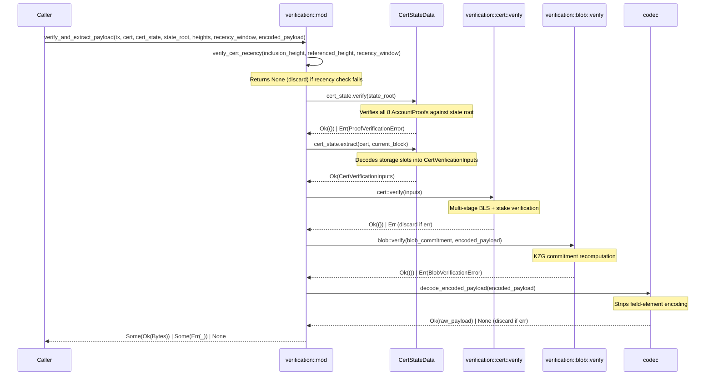
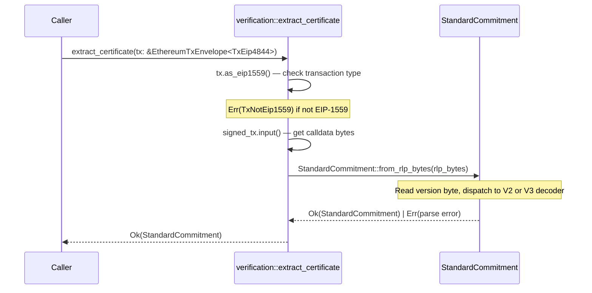
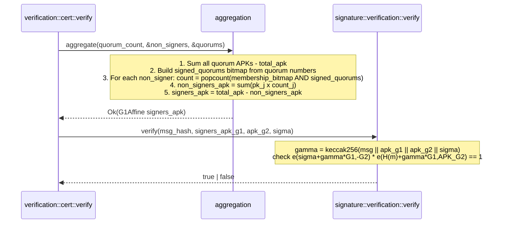
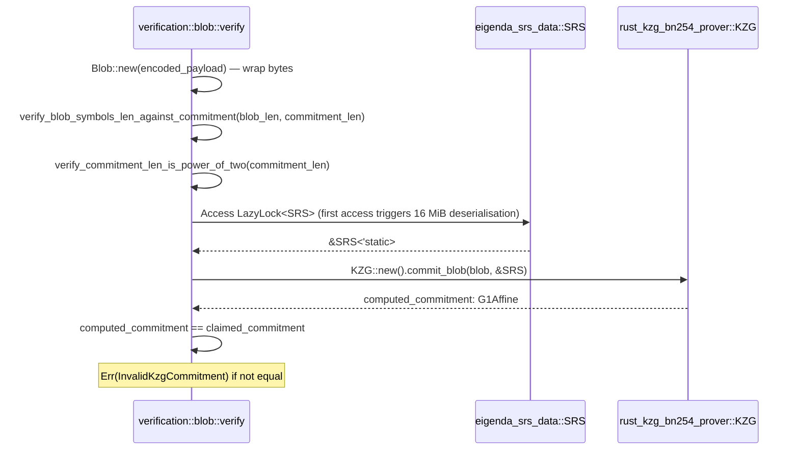
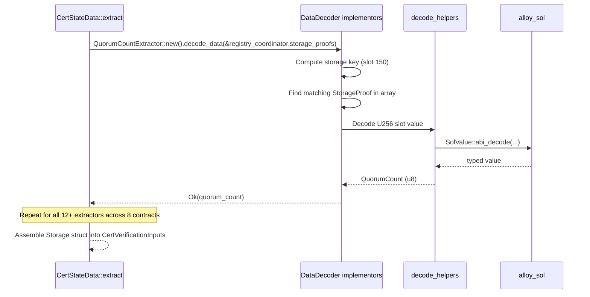

# eigenda-verification Analysis

**Analyzed by**: code-analyzer-eigenda-verification
**Timestamp**: 2026-04-10T00:00:00Z
**Application Type**: rust-crate
**Classification**: library
**Location**: rust/crates/eigenda-verification

## Architecture

`eigenda-verification` is a pure verification library implementing the EigenDA protocol's cryptographic validation logic in Rust. It is organized into four top-level modules — `cert` (data types), `error` (unified errors), `extraction` (Ethereum contract state decoding), and `verification` (cryptographic algorithms) — following a layered architecture where data types are defined independently of the cryptographic operations that consume them.

The library's central design decision is a clean separation between *state extraction* (decoding Ethereum storage proofs into typed Rust structures) and *cryptographic verification* (BLS aggregate signatures, KZG polynomial commitments). This mirrors the on-chain `EigenDACertVerifier.checkDACert` pattern and makes the Rust implementation auditable against its Solidity reference. The high-level `verification::mod` module exposes four principal entry points — `extract_certificate`, `verify_and_extract_payload`, `verify_cert_recency`, and `verify_blob` — that compose the lower-level primitives for typical rollup integration workflows.

Cryptographic operations rely on the `arkworks` ecosystem for BN254 elliptic curve arithmetic. The BLS verification uses a randomised-challenge pairing check `e(σ + γG₁, -G₂) · e(H(m) + γG₁, APK_G₂) = 1` with a Fiat-Shamir challenge `γ` to prevent rogue public-key attacks. KZG commitment verification recomputes commitments from blob data using the precomputed SRS provided by the sibling `eigenda-srs-data` crate. All async-adjacent concerns (lazy SRS initialisation) are handled via `std::sync::LazyLock`.

The library is synchronous, has no async runtime dependency, and is designed to be embedded into rollup derivation pipelines (e.g., op-reth or Risc0 ZK-VMs). The `test-utils` feature flag exposes additional helpers (such as `success_inputs`) for benchmarking and property-based testing without contaminating production builds.

## Key Components

- **`StandardCommitment`** (`rust/crates/eigenda-verification/src/cert/mod.rs`): Version-agnostic wrapper for EigenDA certificates. Parses RLP-encoded transaction input via `from_rlp_bytes`, dispatching to `EigenDACertV2` or `EigenDACertV3` based on the leading version byte (`0x01` = V2, `0x02` = V3). Exposes accessors for reference block, quorum numbers, non-signer public keys, and inclusion info, normalising API differences between the two cert versions.

- **`EigenDACertV2` / `EigenDACertV3`** (`rust/crates/eigenda-verification/src/cert/mod.rs`): Concrete certificate structs deriving `RlpEncodable`/`RlpDecodable` through `alloy-rlp`. Both carry `BatchHeaderV2`, `BlobInclusionInfo`, `NonSignerStakesAndSignature`, and `signed_quorum_numbers`. V3 differs only in field ordering (batch header precedes blob inclusion info), reflecting a protocol-level change.

- **`cert::solidity`** (`rust/crates/eigenda-verification/src/cert/solidity.rs`): Solidity ABI type definitions generated by the `alloy_sol_types::sol!` macro. Defines `BatchHeaderV2`, `G1Point`, `G2Point`, `BlobCommitment`, `VersionedBlobParams`, `SecurityThresholds`, `QuorumBitmapUpdate`, `ApkUpdate`, and `StakeUpdate`. These types serve as the bridge between Rust structs and Ethereum ABI encoding for hashing operations that must match on-chain logic.

- **`CertStateData`** (`rust/crates/eigenda-verification/src/extraction/mod.rs`): Carrier struct holding eight `AccountProof` values (one per EigenDA/EigenLayer contract: `threshold_registry`, `registry_coordinator`, `service_manager`, `bls_apk_registry`, `stake_registry`, `delegation_manager`, `cert_verifier_router`, `cert_verifier`). Its `verify(state_root)` method validates all proofs against an Ethereum block's state root. Its `extract(cert, current_block)` method decodes all storage slots into a `CertVerificationInputs` bundle.

- **`DataDecoder` / `StorageKeyProvider` traits** (`rust/crates/eigenda-verification/src/extraction/extractor.rs`): Core abstraction traits for the extractor pattern. `StorageKeyProvider` generates the storage keys an extractor requires; `DataDecoder` decodes `StorageProof` arrays into typed output. Implementors include `QuorumCountExtractor`, `OperatorBitmapHistoryExtractor`, `TotalStakeHistoryExtractor`, `ApkHistoryExtractor`, `VersionedBlobParamsExtractor`, `NextBlobVersionExtractor`, `StaleStakesForbiddenExtractor`, `SecurityThresholdsV2Extractor`, `QuorumNumbersRequiredV2Extractor`, `CertVerifierABNsExtractor`, and `CertVerifiersExtractor`.

- **`contract` module** (`rust/crates/eigenda-verification/src/extraction/contract.rs`): High-level per-contract facades (`RegistryCoordinator`, `StakeRegistry`, `BlsApkRegistry`, etc.) that aggregate storage key requests from multiple extractors into single `Vec<StorageKey>` calls. Consumers use these to construct the storage proof requests submitted to an Ethereum node.

- **`verification::cert::verify`** (`rust/crates/eigenda-verification/src/verification/cert/mod.rs`): Main multi-stage certificate verification function. Executes: (1) Merkle blob inclusion check, (2) blob version validation, (3) security assumption checks, (4) input array length validation, (5) reference block ordering check, (6) non-signer bitmap reconstruction and hash-sorted ordering, (7) per-quorum stake calculation and confirmation threshold validation, (8) APK aggregation and BLS pairing check, (9) security threshold enforcement across blob and required quorums.

- **`signature::aggregation::aggregate`** (`rust/crates/eigenda-verification/src/verification/cert/signature/aggregation.rs`): Computes the aggregate public key of operators who actually signed by summing quorum APKs then subtracting non-signer keys weighted by how many quorums they failed to sign. The algorithm uses `∑Q_i - ∑(c_j × PK_j)` where `c_j` is derived from the AND of a non-signer's quorum membership bitmap with the signed-quorums bitmap.

- **`signature::verification::verify`** (`rust/crates/eigenda-verification/src/verification/cert/signature/verification.rs`): BLS pairing-based signature check. Computes Fiat-Shamir challenge `γ = keccak256(msg || apk_g1 || apk_g2 || sigma)`, then verifies `e(σ + γG₁, -G₂) · e(H(m) + γG₁, APK_G₂) = 1` using arkworks' `Bn254::multi_miller_loop` + `final_exponentiation`.

- **`verification::blob::verify`** (`rust/crates/eigenda-verification/src/verification/blob/mod.rs`): KZG blob verification pipeline. Validates blob length ≤ committed length, ensures commitment length is a power of two, then calls `KZG::new().commit_blob(blob, &SRS)` (consuming `eigenda-srs-data::SRS`) and compares the computed G1 commitment against the claimed one.

- **`codec::decode_encoded_payload`** (`rust/crates/eigenda-verification/src/verification/blob/codec.rs`): Decodes the EigenDA field-element encoding: verifies the 32-byte header (`[0x00, version, len_u32_be, 0x00*26]`), strips guard bytes from 32-byte symbols to recover 31-byte payload chunks, validates zero-padding, and extracts the raw payload.

- **`History<T>`** (`rust/crates/eigenda-verification/src/verification/cert/types/history.rs`): Generic temporal data structure mapping array indices to `Update<T>` values with `[left_inclusive, right_exclusive)` block intervals. Used to represent operator stake history, APK history, and quorum bitmap history extracted from Ethereum contract storage.

- **`Bitmap`** (`rust/crates/eigenda-verification/src/verification/cert/bitmap.rs`): Type alias for `BitArray<[usize; 4]>` — 256-bit quorum membership tracker. `bit_indices_to_bitmap` converts a sorted, unique list of quorum indices into this bitmap representation, enforcing ordering constraints required by the BLS aggregation algorithm.

## Data Flows

### 1. Full Certificate and Blob Verification Flow

**Flow Description**: End-to-end derivation pipeline entry point — verifies recency, contract state proofs, certificate cryptography, and blob KZG commitment, then decodes and returns the payload.



**Detailed Steps**:

1. **Recency check** (`verify_cert_recency`): Computes `recency_height = referenced_height + window`; if `inclusion_height > recency_height` returns `None` (safe discard).
2. **Proof verification** (`CertStateData::verify`): Calls `AccountProof::verify(state_root)` on each of the eight contract proofs in sequence.
3. **State extraction** (`CertStateData::extract`): Iterates over each extractor, locating matching `StorageProof` entries by key and decoding them via `alloy_sol_types`.
4. **Certificate verification** (`cert::verify`): Full multi-stage check described in the Key Components section.
5. **Blob verification** (`blob::verify`): Constructs a `Blob`, validates lengths and encoding, recomputes KZG commitment using the SRS.
6. **Payload decoding** (`decode_encoded_payload`): Strips the 32-byte header and per-symbol guard bytes to recover the raw payload.

**Error Paths**:
- Recency failure → `None` (pipeline discards the cert as stale)
- Missing `cert_state` or `encoded_payload` → `Some(Err(MissingCertState(tx)))` / `Some(Err(MissingBlob(tx)))` — pipeline error
- Proof verification failure → `Some(Err(ProofVerificationError(_)))` — pipeline error
- Cert verification failure → `None` (invalid cert, safe to discard)
- Blob verification failure → `Some(Err(BlobVerificationError(_)))`
- Codec decode failure → `None` (malformed encoding, safe to discard)

---

### 2. Certificate Parsing from EIP-4844 Transaction

**Flow Description**: Extracts an EigenDA `StandardCommitment` from EIP-1559/EIP-4844 transaction input data.



---

### 3. BLS Aggregate Public Key Computation

**Flow Description**: Derives the aggregate public key of actual signers given quorum APKs and non-signer list.



---

### 4. KZG Blob Commitment Verification

**Flow Description**: Verifies that received blob data matches the claimed KZG commitment using the precomputed SRS.



---

### 5. Contract State Extraction

**Flow Description**: Decodes Ethereum storage proofs for a specific contract variable into typed Rust data.



## Dependencies

### External Libraries

- **alloy-consensus** (1.0.32) [blockchain]: Ethereum consensus types from the alloy ecosystem. Provides `EthereumTxEnvelope<TxEip4844>` and `TxEip1559` for transaction parsing in `verification::extract_certificate`. Enabled with `serde` and `serde-bincode-compat` features for serialisation of `CertStateData`. Imported in: `src/verification/mod.rs`.

- **alloy-primitives** (1.3.1) [blockchain]: Core Ethereum primitives — `B256`, `Bytes`, `U256`, `U96`, `FixedBytes`, `StorageKey`, `Address`, `keccak256`. Pervasive throughout the codebase; used in certificate types, error types, storage key generation, and hashing. Imported in: `src/cert/mod.rs`, `src/error.rs`, `src/extraction/mod.rs`, `src/extraction/extractor.rs`, `src/verification/cert/mod.rs`, `src/verification/cert/hash.rs`, `src/verification/cert/convert.rs`.

- **alloy-rlp** (0.3.12) [serialization]: RLP encoding/decoding for Ethereum data structures. Used to derive `RlpEncodable`/`RlpDecodable` on all certificate structs (`EigenDACertV2`, `EigenDACertV3`, `BatchHeaderV2`, `BlobInclusionInfo`, `BlobCertificate`, `BlobHeaderV2`, `BlobCommitment`, `G1Point`, `G2Point`, `NonSignerStakesAndSignature`). The `from_rlp_bytes`/`to_rlp_bytes` on `StandardCommitment` drive the serialisation. Imported in: `src/cert/mod.rs`.

- **alloy-sol-types** (1.3.1) [blockchain]: Solidity ABI type generation via the `sol!` macro and `SolValue` trait. The entire `src/cert/solidity.rs` module is generated with this macro. ABI encoding is used in `hash.rs` to produce Solidity-compatible hashes (`abi_encode_sequence`, `abi_encode`). Imported in: `src/cert/solidity.rs`, `src/verification/cert/hash.rs`, `src/verification/cert/check.rs`, `src/extraction/extractor.rs`.

- **ark-bn254** (0.5.0) [crypto]: BN254 (alt-bn128) pairing-friendly elliptic curve implementation from arkworks. Provides `G1Affine`, `G2Affine`, `G1Projective`, `Bn254` pairing, `Fr` scalar field, `Fq`/`Fq2` base fields. Central to all cryptographic operations. Imported in: `src/verification/cert/mod.rs`, `src/verification/cert/signature/aggregation.rs`, `src/verification/cert/signature/verification.rs`, `src/verification/cert/convert.rs`, `src/verification/cert/types/conversions.rs`, `src/verification/blob/mod.rs`.

- **ark-ec** (0.5.0) [crypto]: Arkworks elliptic curve abstractions. Provides `AffineRepr`, `CurveGroup`, `PrimeGroup`, `Pairing`, `PairingOutput`, `G2Prepared`, and `pairing` operations. Used in `signature/verification.rs` for the multi-Miller loop and final exponentiation pairing check. Imported in: `src/verification/cert/signature/aggregation.rs`, `src/verification/cert/signature/verification.rs`, `src/verification/cert/types/conversions.rs`.

- **ark-ff** (0.5.0) [crypto]: Arkworks finite field arithmetic. Provides `PrimeField`, `Field`, `MontFp!`, `BigInt`, `BigInteger`, `AdditiveGroup`. Used in `convert.rs` for hash-to-curve (try-and-increment), coordinate byte conversion, and the Fiat-Shamir challenge scalar derivation in `signature/verification.rs`. Imported in: `src/verification/cert/convert.rs`, `src/verification/cert/signature/aggregation.rs`, `src/verification/cert/signature/verification.rs`, `src/verification/cert/types/conversions.rs`.

- **bitvec** (1.0.1) [other]: Bit-vector library. `BitArray<[usize; 4]>` is the `Bitmap` type used throughout certificate verification for quorum membership tracking. The AND and popcount operations on bitmaps (`missing_signatures.count_ones()`) drive the non-signer APK subtraction logic. Imported in: `src/verification/cert/bitmap.rs`, `src/verification/cert/signature/aggregation.rs`.

- **bytes** (1.10.1) [other]: Tokio `Bytes` type for zero-copy byte buffer handling. Used in certificate structs for variable-length fields (`signature`, `inclusion_proof`, `quorum_numbers`) and as the return type of `verify_and_extract_payload`. Imported in: `src/cert/mod.rs`, `src/verification/mod.rs`.

- **derive_more** (2.0.1) [other]: Derive macros for common traits. Used on `TruncHash` to derive `Deref`, `DerefMut`, `AsRef`, `AsMut`, `From`, `Into` without boilerplate. Imported in: `src/verification/cert/hash.rs`.

- **hashbrown** (0.15.4) [other]: High-performance `HashMap` implementation. Used instead of `std::collections::HashMap` throughout the `Storage` struct and extraction code for quorum-keyed maps (`HashMap<B256, History<Bitmap>>`, `HashMap<QuorumNumber, History<Stake>>`, etc.). Imported in: `src/verification/cert/mod.rs`, `src/verification/cert/types/mod.rs`, `src/verification/cert/types/history.rs`, `src/extraction/extractor.rs`.

- **hex** (0.4.3) [other]: Hex encoding/decoding. Used in tests and debug output (e.g., `hex::decode` in test vectors, `hex::encode` in `TruncHash::Display`). Imported in: `src/verification/cert/hash.rs`, `src/verification/cert/convert.rs`, tests throughout.

- **proptest** (1.7.0) [testing]: Property-based testing framework. Listed as a runtime dependency (required by the `test-utils` feature path), but used primarily in tests for generating arbitrary inputs. Imported conditionally in tests.

- **reth-trie-common** (git, reth v1.7.0) [blockchain]: Reth's Merkle-Patricia Trie types. Provides `AccountProof`, `StorageProof`, and `ProofVerificationError` used in `CertStateData` to carry and verify Ethereum state proofs. Also supplies streaming keccak256 utilities. Imported in: `src/extraction/mod.rs`, `src/extraction/extractor.rs`, `src/error.rs`.

- **rust-kzg-bn254-primitives** (git rev 60b2bdb) [crypto]: KZG primitive types from the EigenDA-specific fork of rust-kzg-bn254. Provides `Blob`, `KzgError` used in blob verification. Imported in: `src/verification/blob/mod.rs`, `src/verification/blob/error.rs`.

- **rust-kzg-bn254-prover** (git rev 60b2bdb) [crypto]: KZG prover from EigenDA's rust-kzg-bn254 fork. Provides `KZG::new().commit_blob(blob, &SRS)` used to recompute KZG commitments for verification. Imported in: `src/verification/blob/mod.rs`.

- **serde** (1.0.219) [serialization]: Standard Rust serialization framework. `Serialize`/`Deserialize` derived on all certificate structs and `CertStateData` to support external storage and wire protocols. Imported throughout `src/cert/mod.rs`, `src/extraction/mod.rs`.

- **thiserror** (2.0.12) [other]: Error derive macro. All error enums (`EigenDaVerificationError`, `CertVerificationError`, `BlobVerificationError`, `CertExtractionError`, `StandardCommitmentParseError`, `BitmapError`, `HistoryError`, `EncodedPayloadDecodingError`) use `#[derive(Error)]`. Imported in every error module.

- **tracing** (0.1.41) [logging]: Structured logging/tracing framework. `#[instrument]` applied to `verify_and_extract_payload`, `verify_cert_recency`, `verify_blob`, `cert::verify`, and various extraction functions for observability in production rollup nodes. Imported in: `src/verification/mod.rs`, `src/verification/cert/mod.rs`, `src/extraction/mod.rs`, `src/extraction/extractor.rs`.

### Dev Dependencies

- **bincode** (workspace) [serialization]: Binary serialisation for test fixtures in integration tests and benchmarks.
- **criterion** (workspace) [testing]: Benchmarking framework. Used in `benches/cert_verification.rs` and `benches/blob_verification.rs` (require `test-utils` feature).
- **jsonschema** (workspace) [testing]: JSON schema validation, used in integration tests.
- **rand** (workspace) [testing]: Random number generation for property-based tests.
- **reltester** (workspace) [testing]: Relational property tester.
- **risc0-zkvm** (workspace) [other]: Risc0 zkVM integration tests for verifying the library works inside a ZK proving environment.
- **test-strategy** (workspace) [testing]: Proptest strategy derives.
- **testcontainers** (workspace) [testing]: Docker container management for integration tests.
- **wiremock** (workspace) [testing]: HTTP mock server for integration tests.

### Internal Dependencies

- **eigenda-srs-data** (`rust/crates/eigenda-srs-data`): Provides the single `pub static SRS: LazyLock<SRS<'static>>` — 524,288 BN254 G1Affine points compiled into the binary. Consumed in `verification::blob::mod` via `eigenda_srs_data::SRS`. The `verify_kzg_commitment` function accesses the `LazyLock` on first call: `KZG::new().commit_blob(blob, &SRS)`. This is the only internal dependency. Imported in: `src/verification/blob/mod.rs`.

## API Surface

### Exported Modules and Their Publicly Accessible Items

#### `cert` module (`src/cert/mod.rs`)

Exports the complete certificate type hierarchy:

- `StandardCommitment` — main entry point for certificate handling
  - `from_rlp_bytes(bytes: &[u8]) -> Result<Self, StandardCommitmentParseError>`
  - `to_rlp_bytes(&self) -> Bytes`
  - `reference_block(&self) -> u64`
  - `version(&self) -> u16`
  - `non_signers_pk_hashes(&self) -> Vec<B256>`
  - `non_signer_quorum_bitmap_indices(&self) -> &[u32]`
  - `signed_quorum_numbers(&self) -> &Bytes`
  - `quorum_apk_indices(&self) -> &[u32]`
  - `non_signer_total_stake_indices(&self) -> &[u32]`
  - `non_signer_stake_indices(&self) -> &[Vec<u32>]`
  - `batch_header_v2(&self) -> &BatchHeaderV2`
  - `blob_inclusion_info(&self) -> &BlobInclusionInfo`
  - `nonsigner_stake_and_signature(&self) -> &NonSignerStakesAndSignature`
- `EigenDAVersionedCert` enum (`V2`, `V3`)
- `EigenDACertV2`, `EigenDACertV3` structs (public fields, RLP-serialisable)
- `BatchHeaderV2` struct + `to_sol() -> solidity::BatchHeaderV2`
- `BlobInclusionInfo`, `BlobCertificate`, `BlobHeaderV2`, `BlobCommitment` structs
- `G1Point`, `G2Point` structs with `From<&G1Point> for solidity::G1Point` and `From<&G2Point> for solidity::G2Point`
- `NonSignerStakesAndSignature` struct
- `StandardCommitmentParseError` error enum

#### `cert::solidity` sub-module

All types generated by `alloy_sol_types::sol!`: `BatchHeaderV2`, `G1Point`, `G2Point`, `BlobCommitment`, `VersionedBlobParams`, `SecurityThresholds`, `QuorumBitmapUpdate`, `ApkUpdate`, `StakeUpdate`.

#### `error` module (`src/error.rs`)

- `EigenDaVerificationError` — top-level error enum covering all failure modes

#### `extraction` module (`src/extraction/mod.rs`, `contract.rs`, `extractor.rs`)

- `CertStateData` struct — storage proof carrier and extraction entrypoint
  - `verify(&self, state_root: B256) -> Result<(), ProofVerificationError>`
  - `extract(&self, cert: &StandardCommitment, current_block: u32) -> Result<CertVerificationInputs, CertExtractionError>`
- `CertExtractionError` error enum
- `contract::RegistryCoordinator`, `StakeRegistry`, `BlsApkRegistry`, `ServiceManager`, `DelegationManager`, `CertVerifierRouter`, `CertVerifier` — each with `storage_keys(cert) -> Vec<StorageKey>` for building proof requests
- `extractor::StorageKeyProvider`, `extractor::DataDecoder` traits
- All concrete extractor types (for callers who need fine-grained control)

#### `verification` module (`src/verification/mod.rs`)

High-level API:

```rust
pub fn extract_certificate(
    tx: &EthereumTxEnvelope<TxEip4844>,
) -> Result<StandardCommitment, EigenDaVerificationError>

pub fn verify_and_extract_payload(
    tx: B256,
    cert: &StandardCommitment,
    cert_state: Option<&CertStateData>,
    state_root: B256,
    inclusion_height: u64,
    referenced_height: u64,
    cert_recency_window: u64,
    encoded_payload: Option<&[u8]>,
) -> Option<Result<Bytes, EigenDaVerificationError>>

pub fn verify_cert_recency(
    inclusion_height: u64,
    referenced_height: u64,
    cert_recency_window: u64,
) -> Result<(), EigenDaVerificationError>

pub fn verify_blob(
    cert: &StandardCommitment,
    encoded_payload: &[u8],
) -> Result<(), BlobVerificationError>
```

#### `verification::cert` sub-module

- `CertVerificationInputs` struct (public)
- `Cert` struct (public)
- `verify(inputs: CertVerificationInputs) -> Result<(), CertVerificationError>`
- `bitmap::bit_indices_to_bitmap`, `bitmap::Bitmap` type
- `convert::point_to_hash`, etc.
- `error::CertVerificationError`
- `hash::TruncHash`, `hash::HashExt`, `hash::streaming_keccak256`
- `types::Storage`, `types::Staleness`, type aliases `QuorumNumber`, `Stake`, `BlockNumber`, `RelayKey`, `Version`
- `types::history::History`, `types::history::Update`

#### `verification::blob` sub-module

- `verify(blob_commitment: &BlobCommitment, encoded_payload: &[u8]) -> Result<(), BlobVerificationError>`
- `codec::BYTES_PER_SYMBOL`, `codec::BYTES_PER_CHUNK`, `codec::HEADER_BYTES_LEN`
- `codec::decode_encoded_payload`
- `error::BlobVerificationError`, `error::EncodedPayloadDecodingError`
- `success_inputs(raw_payload: &[u8]) -> (BlobCommitment, Vec<u8>)` (behind `test-utils` feature)

## Code Examples

### Example 1: Full Payload Verification (Typical Rollup Use)

```rust
// src/verification/mod.rs lines 127-173
use eigenda_verification::cert::StandardCommitment;
use eigenda_verification::extraction::CertStateData;
use eigenda_verification::verification::verify_and_extract_payload;

// Returns Some(Ok(payload)) on success, None to discard, Some(Err(_)) on pipeline error
let result = verify_and_extract_payload(
    tx_hash,
    &cert,
    Some(&cert_state),
    state_root,
    inclusion_height,
    referenced_height,
    recency_window,
    Some(encoded_payload),
);
```

### Example 2: RLP Certificate Parsing

```rust
// src/cert/mod.rs lines 64-88
let cert = StandardCommitment::from_rlp_bytes(tx_input)?;
let reference_block = cert.reference_block();
let signed_quorums = cert.signed_quorum_numbers();
```

### Example 3: BLS Signature Verification with Fiat-Shamir Challenge

```rust
// src/verification/cert/signature/verification.rs lines 58-75
// gamma = keccak256(msg || apk_g1 || apk_g2 || sigma)
// Verifies e(sigma+gamma*G1, -G2) * e(H(m)+gamma*G1, APK_G2) = 1
let is_valid = verify(msg_hash, apk_g1, apk_g2, sigma);
```

### Example 4: KZG Commitment Recomputation

```rust
// src/verification/blob/mod.rs lines 154-168
use eigenda_srs_data::SRS;
use rust_kzg_bn254_prover::kzg::KZG;

let computed_commitment = KZG::new().commit_blob(blob, &SRS)?;
let claimed: G1Affine = claimed_commitment.into();
if computed_commitment != claimed { return Err(InvalidKzgCommitment); }
```

### Example 5: Non-Signer APK Aggregation

```rust
// src/verification/cert/signature/aggregation.rs lines 53-82
// signers_apk = sum(quorum_apks) - sum(pk_j * popcount(membership_bitmap AND signed_quorums))
let signers_apk: G1Affine = aggregate(quorum_count, &non_signers, &quorums)?;
```

### Example 6: Contract Storage Key Generation

```rust
// src/extraction/contract.rs
use eigenda_verification::extraction::contract::RegistryCoordinator;

let keys = RegistryCoordinator::storage_keys(&cert);
// keys contains storage slots for quorum_count, operator_bitmap_history,
// and quorum_update_block_number — submit these to eth_getProof
```

## Files Analyzed

- `rust/crates/eigenda-verification/Cargo.toml` — manifest and dependency declarations
- `rust/crates/eigenda-verification/README.md` — architecture overview and process documentation
- `rust/crates/eigenda-verification/src/lib.rs` — crate root with module declarations
- `rust/crates/eigenda-verification/src/error.rs` — top-level error enum
- `rust/crates/eigenda-verification/src/cert/mod.rs` (~692 lines) — all certificate types
- `rust/crates/eigenda-verification/src/cert/solidity.rs` (~173 lines) — Solidity ABI types
- `rust/crates/eigenda-verification/src/extraction/mod.rs` (~258 lines) — CertStateData
- `rust/crates/eigenda-verification/src/extraction/extractor.rs` (first 80 lines) — extractor traits and storage slot constants
- `rust/crates/eigenda-verification/src/extraction/contract.rs` (first 60 lines) — per-contract facades
- `rust/crates/eigenda-verification/src/verification/mod.rs` (~295 lines) — high-level API
- `rust/crates/eigenda-verification/src/verification/cert/mod.rs` (~250 lines viewed) — cert::verify orchestration
- `rust/crates/eigenda-verification/src/verification/cert/check.rs` (first 80 lines) — validation helpers
- `rust/crates/eigenda-verification/src/verification/cert/signature/mod.rs` (~126 lines) — BLS module wiring
- `rust/crates/eigenda-verification/src/verification/cert/signature/aggregation.rs` (~319 lines) — APK aggregation
- `rust/crates/eigenda-verification/src/verification/cert/signature/verification.rs` (~187 lines) — bilinear pairing check
- `rust/crates/eigenda-verification/src/verification/cert/convert.rs` (~174 lines) — hash-to-curve, field conversions
- `rust/crates/eigenda-verification/src/verification/cert/hash.rs` (~183 lines) — HashExt, TruncHash
- `rust/crates/eigenda-verification/src/verification/cert/bitmap.rs` (~237 lines) — Bitmap, bit_indices_to_bitmap
- `rust/crates/eigenda-verification/src/verification/cert/error.rs` (~132 lines) — CertVerificationError
- `rust/crates/eigenda-verification/src/verification/cert/types/mod.rs` (~116 lines) — Storage, Staleness, Quorum, NonSigner
- `rust/crates/eigenda-verification/src/verification/cert/types/history.rs` (~316 lines) — History, Update, Interval
- `rust/crates/eigenda-verification/src/verification/cert/types/conversions.rs` (~305 lines) — G1/G2 type conversions
- `rust/crates/eigenda-verification/src/verification/blob/mod.rs` (~243 lines) — blob::verify, KZG recomputation
- `rust/crates/eigenda-verification/src/verification/blob/codec.rs` (first 80 lines) — payload encoding constants
- `rust/crates/eigenda-verification/src/verification/blob/error.rs` (~90 lines) — BlobVerificationError

## Analysis Data

```json
{
  "summary": "eigenda-verification is a pure Rust library implementing the cryptographic verification logic for the EigenDA data-availability protocol. It provides four principal operations: parsing EigenDA certificates from EIP-4844 transaction calldata (versioned RLP format), verifying Ethereum contract storage proofs against block state roots, performing multi-stage BLS aggregate signature and stake-threshold certificate verification, and validating blob data against KZG polynomial commitments using a precomputed BN254 SRS. The library is designed for embedding in rollup derivation pipelines (including ZK-VMs) and faithfully mirrors the on-chain EigenDACertVerifier Solidity logic.",
  "architecture_pattern": "layered",
  "key_modules": [
    {"name": "cert", "path": "rust/crates/eigenda-verification/src/cert/mod.rs", "description": "Certificate data types for both V2 and V3 protocols — StandardCommitment, EigenDACertV2/V3, BatchHeaderV2, BlobInclusionInfo, BlobCommitment, G1Point, G2Point, NonSignerStakesAndSignature — with RLP serialisation derives and Solidity-compatible accessors."},
    {"name": "cert::solidity", "path": "rust/crates/eigenda-verification/src/cert/solidity.rs", "description": "Solidity ABI type definitions generated via alloy_sol_types::sol!, used for Ethereum-compatible keccak256 hashing of certificate components."},
    {"name": "error", "path": "rust/crates/eigenda-verification/src/error.rs", "description": "Top-level EigenDaVerificationError enum unifying all error variants from parsing, extraction, proof verification, cert verification, and blob verification layers."},
    {"name": "extraction", "path": "rust/crates/eigenda-verification/src/extraction/mod.rs", "description": "CertStateData struct carrying AccountProofs for eight EigenDA/EigenLayer contracts, with verify() for proof validation and extract() for typed contract state decoding into CertVerificationInputs."},
    {"name": "extraction::extractor", "path": "rust/crates/eigenda-verification/src/extraction/extractor.rs", "description": "StorageKeyProvider and DataDecoder traits plus ~12 concrete extractor implementations that know the storage slot layout of each EigenDA contract variable."},
    {"name": "extraction::contract", "path": "rust/crates/eigenda-verification/src/extraction/contract.rs", "description": "Per-contract facades (RegistryCoordinator, StakeRegistry, etc.) aggregating storage key requests for external eth_getProof calls."},
    {"name": "verification::mod", "path": "rust/crates/eigenda-verification/src/verification/mod.rs", "description": "High-level public API: extract_certificate, verify_and_extract_payload, verify_cert_recency, verify_blob — composing lower-level primitives into the full EigenDA derivation pipeline."},
    {"name": "verification::cert", "path": "rust/crates/eigenda-verification/src/verification/cert/mod.rs", "description": "Multi-stage certificate verification orchestrator implementing seven sequential checks: blob Merkle inclusion, version validity, security assumptions, input consistency, non-signer processing, stake-weighted quorum validation, and BLS signature verification."},
    {"name": "verification::cert::signature", "path": "rust/crates/eigenda-verification/src/verification/cert/signature/", "description": "BLS signature aggregation (non-signer APK subtraction via bitmap AND) and pairing-based verification with Fiat-Shamir challenge to prevent rogue public-key attacks."},
    {"name": "verification::cert::types", "path": "rust/crates/eigenda-verification/src/verification/cert/types/mod.rs", "description": "Storage, Staleness, Quorum, NonSigner structs and type aliases (QuorumNumber, Stake, BlockNumber, Version) used throughout certificate verification."},
    {"name": "verification::cert::types::history", "path": "rust/crates/eigenda-verification/src/verification/cert/types/history.rs", "description": "Generic History<T> temporal data structure mapping indices to Update<T> values with block-number validity intervals, modelling Ethereum contract storage arrays."},
    {"name": "verification::blob", "path": "rust/crates/eigenda-verification/src/verification/blob/mod.rs", "description": "KZG blob verification: length checks, power-of-two commitment validation, and recomputed KZG commitment comparison against the SRS from eigenda-srs-data."},
    {"name": "verification::blob::codec", "path": "rust/crates/eigenda-verification/src/verification/blob/codec.rs", "description": "EigenDA field-element payload encoding/decoding: 32-byte header, 31-byte payload chunks with guard bytes, zero-padding validation."}
  ],
  "api_endpoints": [],
  "data_flows": [
    {
      "name": "Full Certificate and Blob Verification",
      "steps": [
        "verify_cert_recency: inclusion_height <= referenced_height + window",
        "CertStateData::verify: validate 8 AccountProofs against Ethereum state_root",
        "CertStateData::extract: decode storage slots into CertVerificationInputs (quorum_count, bitmap/apk/stake histories, versioned blob params, security thresholds)",
        "cert::verify: blob Merkle inclusion -> version check -> security assumptions -> array consistency -> reference block ordering -> non-signer bitmap reconstruction -> stake-weighted quorum checks -> APK aggregation -> BLS pairing verification -> threshold enforcement",
        "blob::verify: blob length <= commitment_len -> commitment_len is power of 2 -> KZG::commit_blob(SRS) == claimed commitment",
        "codec::decode_encoded_payload: strip header + guard bytes -> return raw payload"
      ]
    },
    {
      "name": "BLS Aggregate Signature Verification",
      "steps": [
        "aggregate(quorum_count, non_signers, quorums): sum quorum APKs, subtract non-signer keys weighted by popcount(membership AND signed_quorums)",
        "hash_to_point(batch_header_hash): deterministic hash-to-curve via try-and-increment on BN254",
        "compute_gamma: keccak256(msg || apk_g1 || apk_g2 || sigma) as Fiat-Shamir challenge",
        "multi_miller_loop + final_exponentiation: check e(sigma+gamma*G1,-G2)*e(H(m)+gamma*G1,APK_G2) == 1"
      ]
    },
    {
      "name": "Certificate Parsing from Transaction",
      "steps": [
        "EthereumTxEnvelope::as_eip1559(): extract calldata bytes",
        "StandardCommitment::from_rlp_bytes: read version byte (0x01=V2, 0x02=V3)",
        "alloy_rlp::Decodable::decode: RLP-decode into EigenDACertV2 or EigenDACertV3"
      ]
    }
  ],
  "tech_stack": ["rust", "bn254", "kzg", "bls-signatures", "ethereum", "rlp", "alloy", "arkworks"],
  "external_integrations": [],
  "component_interactions": [
    {
      "target": "eigenda-srs-data",
      "type": "library",
      "description": "Consumes the pub static SRS: LazyLock<SRS<'static>> from eigenda-srs-data in verification::blob::verify_kzg_commitment to provide the BN254 G1 structured reference string for KZG commitment recomputation."
    }
  ]
}
```

## Citations

```json
[
  {
    "file_path": "rust/crates/eigenda-verification/src/lib.rs",
    "start_line": 1,
    "end_line": 21,
    "claim": "The crate exposes four top-level public modules: cert, error, extraction, and verification.",
    "section": "Architecture"
  },
  {
    "file_path": "rust/crates/eigenda-verification/src/cert/mod.rs",
    "start_line": 30,
    "end_line": 34,
    "claim": "Version bytes 0x01 and 0x02 are used to distinguish V2 and V3 certificates during RLP parsing.",
    "section": "Key Components",
    "snippet": "const VERSION_2: u8 = 1;\nconst VERSION_3: u8 = 2;"
  },
  {
    "file_path": "rust/crates/eigenda-verification/src/cert/mod.rs",
    "start_line": 64,
    "end_line": 88,
    "claim": "StandardCommitment::from_rlp_bytes reads the leading version byte and dispatches to the correct RLP decoder.",
    "section": "Key Components",
    "snippet": "let (cert_version, mut cert_bytes) = bytes.split_first().ok_or(StandardCommitmentParseError::EmptyCommitment)?;"
  },
  {
    "file_path": "rust/crates/eigenda-verification/src/cert/mod.rs",
    "start_line": 307,
    "end_line": 333,
    "claim": "EigenDACertV2 and EigenDACertV3 differ only in field ordering (V3 puts batch_header before blob_inclusion_info).",
    "section": "Key Components"
  },
  {
    "file_path": "rust/crates/eigenda-verification/src/cert/solidity.rs",
    "start_line": 1,
    "end_line": 10,
    "claim": "The solidity module uses alloy_sol_types::sol! macro to generate Solidity-compatible ABI types for on-chain hash matching.",
    "section": "Key Components",
    "snippet": "use alloy_sol_types::sol;\n\nsol! {"
  },
  {
    "file_path": "rust/crates/eigenda-verification/src/extraction/mod.rs",
    "start_line": 99,
    "end_line": 116,
    "claim": "CertStateData holds eight AccountProof values, one per EigenDA/EigenLayer contract involved in verification.",
    "section": "Key Components"
  },
  {
    "file_path": "rust/crates/eigenda-verification/src/extraction/mod.rs",
    "start_line": 120,
    "end_line": 133,
    "claim": "CertStateData::verify validates all eight account proofs against the provided Ethereum state root.",
    "section": "Data Flows"
  },
  {
    "file_path": "rust/crates/eigenda-verification/src/extraction/mod.rs",
    "start_line": 157,
    "end_line": 256,
    "claim": "CertStateData::extract decodes storage slots from all eight contract proofs into a CertVerificationInputs bundle using twelve specialized extractor types.",
    "section": "Data Flows"
  },
  {
    "file_path": "rust/crates/eigenda-verification/src/extraction/extractor.rs",
    "start_line": 24,
    "end_line": 54,
    "claim": "Storage slot constants for all EigenDA/EigenLayer contract variables are hardcoded and must be kept in sync with deployed contract layouts.",
    "section": "Key Components",
    "snippet": "const QUORUM_COUNT_VARIABLE_SLOT: u64 = 150;\nconst OPERATOR_BITMAP_HISTORY_MAPPING_SLOT: u64 = 152;\nconst APK_HISTORY_MAPPING_SLOT: u64 = 4;"
  },
  {
    "file_path": "rust/crates/eigenda-verification/src/extraction/extractor.rs",
    "start_line": 60,
    "end_line": 80,
    "claim": "StorageKeyProvider and DataDecoder are the two core trait abstractions defining the extractor pattern.",
    "section": "Key Components"
  },
  {
    "file_path": "rust/crates/eigenda-verification/src/verification/mod.rs",
    "start_line": 77,
    "end_line": 86,
    "claim": "extract_certificate parses the StandardCommitment from the EIP-1559 transaction input calldata.",
    "section": "Data Flows",
    "snippet": "let signed_tx = tx.as_eip1559().ok_or_else(|| TxNotEip1559(*tx.hash()))?;\nlet rlp_bytes = signed_tx.input();\nlet cert = StandardCommitment::from_rlp_bytes(rlp_bytes)?;"
  },
  {
    "file_path": "rust/crates/eigenda-verification/src/verification/mod.rs",
    "start_line": 127,
    "end_line": 173,
    "claim": "verify_and_extract_payload implements the full EigenDA derivation process: recency check, proof verification, state extraction, cert verification, blob verification, and payload decoding.",
    "section": "Data Flows"
  },
  {
    "file_path": "rust/crates/eigenda-verification/src/verification/mod.rs",
    "start_line": 139,
    "end_line": 141,
    "claim": "Recency check failure results in None (safe discard), not an error — this is a deliberate signal to the derivation pipeline.",
    "section": "Data Flows",
    "snippet": "verify_cert_recency(inclusion_height, referenced_height, cert_recency_window).ok()?;"
  },
  {
    "file_path": "rust/crates/eigenda-verification/src/verification/mod.rs",
    "start_line": 196,
    "end_line": 208,
    "claim": "verify_cert_recency ensures referenced_height + recency_window >= inclusion_height to prevent stale certificate attacks.",
    "section": "Key Components",
    "snippet": "let recency_height = referenced_height + cert_recency_window;\nif inclusion_height > recency_height {\n    return Err(RecencyWindowMissed(inclusion_height, recency_height));\n}"
  },
  {
    "file_path": "rust/crates/eigenda-verification/src/verification/cert/mod.rs",
    "start_line": 77,
    "end_line": 95,
    "claim": "CertVerificationInputs bundles all extracted state (Storage) with the certificate data (Cert) as the input to cert::verify.",
    "section": "Key Components"
  },
  {
    "file_path": "rust/crates/eigenda-verification/src/verification/cert/mod.rs",
    "start_line": 188,
    "end_line": 248,
    "claim": "cert::verify unpacks inputs, then sequentially calls check functions: blob_inclusion, blob_version, security_assumptions_are_met, not_empty, equal_lengths.",
    "section": "Data Flows"
  },
  {
    "file_path": "rust/crates/eigenda-verification/src/verification/cert/signature/aggregation.rs",
    "start_line": 53,
    "end_line": 83,
    "claim": "The APK aggregation formula is signers_apk = sum(quorum_apks) minus sum(pk_j times popcount(membership_bitmap AND signed_quorums)).",
    "section": "Data Flows",
    "snippet": "let non_signers_apk = non_signers.iter().map(|non_signer| {\n    let missing_signatures = non_signer.quorum_bitmap_history & signed_quorums;\n    let missing_signatures = missing_signatures.count_ones();\n    let missing_signatures = Fr::from(missing_signatures as u64);\n    non_signer.pk * missing_signatures\n}).sum::<G1Projective>();\nlet signers_apk = total_apk - non_signers_apk;"
  },
  {
    "file_path": "rust/crates/eigenda-verification/src/verification/cert/signature/verification.rs",
    "start_line": 36,
    "end_line": 37,
    "claim": "The negated G2 generator is precomputed using LazyLock to avoid repeated computation in BLS pairing checks.",
    "section": "Architecture",
    "snippet": "static PRECOMPUTED_NEG_G2: LazyLock<G2Prepared<ark_bn254::Config>> =\n    LazyLock::new(|| G2Prepared::from(-G2Affine::generator()));"
  },
  {
    "file_path": "rust/crates/eigenda-verification/src/verification/cert/signature/verification.rs",
    "start_line": 58,
    "end_line": 75,
    "claim": "BLS verification uses multi_miller_loop + final_exponentiation and checks the result equals PairingOutput::ZERO (which represents value 1 in the target field).",
    "section": "Data Flows",
    "snippet": "let miller_result = Bn254::multi_miller_loop([a1, b1], [a2, b2]);\nlet pairing_result = Bn254::final_exponentiation(miller_result);\npairing_result == Some(PairingOutput::ZERO)"
  },
  {
    "file_path": "rust/crates/eigenda-verification/src/verification/cert/signature/verification.rs",
    "start_line": 91,
    "end_line": 115,
    "claim": "The Fiat-Shamir challenge gamma is computed as keccak256(msg_hash || apk_g1 coords || apk_g2 coords || sigma coords) to prevent rogue public-key attacks.",
    "section": "Data Flows"
  },
  {
    "file_path": "rust/crates/eigenda-verification/src/verification/blob/mod.rs",
    "start_line": 55,
    "end_line": 58,
    "claim": "The blob verification module imports eigenda_srs_data::SRS and uses rust_kzg_bn254_prover::kzg::KZG for commitment recomputation.",
    "section": "Dependencies",
    "snippet": "use eigenda_srs_data::SRS;\nuse rust_kzg_bn254_primitives::blob::Blob;\nuse rust_kzg_bn254_prover::kzg::KZG;"
  },
  {
    "file_path": "rust/crates/eigenda-verification/src/verification/blob/mod.rs",
    "start_line": 154,
    "end_line": 169,
    "claim": "KZG commitment verification recomputes the commitment from blob data using the SRS and compares it to the claimed G1 point from the certificate.",
    "section": "Data Flows",
    "snippet": "let computed_commitment = KZG::new().commit_blob(blob, &SRS)?;\nlet claimed_commitment: G1Affine = claimed_commitment.into();\n(computed_commitment == claimed_commitment)\n    .then_some(())\n    .ok_or(InvalidKzgCommitment)"
  },
  {
    "file_path": "rust/crates/eigenda-verification/src/verification/blob/mod.rs",
    "start_line": 159,
    "end_line": 161,
    "claim": "The SRS LazyLock is first materialised on KZG commitment verification, causing a one-time ~3s (release) cost due to 16 MiB deserialisation.",
    "section": "Analysis Notes",
    "snippet": "// for a large number of SRS points this is slow: ~40s in debug (~3s in release) on an M2 due to the 16MiB SRS one-time deserialization"
  },
  {
    "file_path": "rust/crates/eigenda-verification/src/verification/blob/codec.rs",
    "start_line": 47,
    "end_line": 73,
    "claim": "The EigenDA blob encoding format uses 32-byte symbols with a guard byte prefix, and a 32-byte header containing version and payload length.",
    "section": "Key Components"
  },
  {
    "file_path": "rust/crates/eigenda-verification/src/verification/cert/convert.rs",
    "start_line": 48,
    "end_line": 65,
    "claim": "hash_to_point uses a deterministic try-and-increment method to map a 32-byte hash to a BN254 G1 curve point.",
    "section": "Key Components"
  },
  {
    "file_path": "rust/crates/eigenda-verification/src/verification/cert/hash.rs",
    "start_line": 20,
    "end_line": 30,
    "claim": "TruncHash is a 24-byte truncated hash used to identify aggregate public keys in EigenDA contract storage.",
    "section": "Key Components",
    "snippet": "#[repr(transparent)]\npub struct TruncHash(pub [u8; 24]);"
  },
  {
    "file_path": "rust/crates/eigenda-verification/src/verification/cert/hash.rs",
    "start_line": 41,
    "end_line": 70,
    "claim": "HashExt trait provides EigenDA-compatible keccak256 hashing for BlobCertificate, BlobHeaderV2, and BatchHeaderV2, matching on-chain Solidity hashing conventions.",
    "section": "Key Components"
  },
  {
    "file_path": "rust/crates/eigenda-verification/src/verification/cert/bitmap.rs",
    "start_line": 29,
    "end_line": 33,
    "claim": "Bitmap is a 256-bit type alias for BitArray<[usize; 4]>, supporting up to 256 quorums.",
    "section": "Key Components",
    "snippet": "pub type Bitmap = BitArray<[usize; 4]>;"
  },
  {
    "file_path": "rust/crates/eigenda-verification/src/verification/cert/types/mod.rs",
    "start_line": 45,
    "end_line": 70,
    "claim": "Storage aggregates all historical on-chain state needed for certificate verification, including quorum bitmap history, APK history, and stake histories keyed by operator ID or quorum number.",
    "section": "Key Components"
  },
  {
    "file_path": "rust/crates/eigenda-verification/src/verification/cert/types/history.rs",
    "start_line": 48,
    "end_line": 70,
    "claim": "History<T> maps u32 indices to Update<T> values with block-number validity intervals, modelling Ethereum contract storage arrays for historical operator state.",
    "section": "Key Components"
  },
  {
    "file_path": "rust/crates/eigenda-verification/src/verification/cert/types/conversions.rs",
    "start_line": 77,
    "end_line": 92,
    "claim": "G2Point to G2Affine conversion reverses the [imaginary, real] vs [real, imaginary] field element ordering difference between EigenDA and arkworks representations.",
    "section": "Key Components",
    "snippet": "x: vec![convert::fq_to_uint(x.c1), convert::fq_to_uint(x.c0)],"
  },
  {
    "file_path": "rust/crates/eigenda-verification/src/error.rs",
    "start_line": 12,
    "end_line": 48,
    "claim": "EigenDaVerificationError unifies all error variants from parsing, extraction, proof verification, cert verification, and blob verification into one top-level enum using #[from] conversions.",
    "section": "Architecture"
  },
  {
    "file_path": "rust/crates/eigenda-verification/src/verification/cert/check.rs",
    "start_line": 16,
    "end_line": 16,
    "claim": "Security threshold calculations use THRESHOLD_DENOMINATOR = 100, matching Solidity's percent-based threshold model.",
    "section": "Key Components",
    "snippet": "const THRESHOLD_DENOMINATOR: u128 = 100; // uint256 in sol"
  }
]
```

## Analysis Notes

### Security Considerations

1. **Rogue Public-Key Attack Prevention**: The BLS verification uses a Fiat-Shamir challenge `γ = keccak256(msg || apk_g1 || apk_g2 || sigma)` derived from all public parameters. This prevents an attacker from crafting a malicious aggregate public key that makes a forged signature verify correctly. The challenge derivation aborts if any input point is at the curve identity (infinity), preventing zero-point attacks.

2. **Recency Window Enforcement**: Certificates older than `cert_recency_window` blocks are silently discarded (`None` return) rather than errored. This prevents replay attacks using old certificates that were valid against a different historical operator set. Callers must carefully distinguish `None` (discard) from `Some(Err(_))` (pipeline error).

3. **Storage Slot Hardcoding**: The extractor module hardcodes contract storage slot constants (e.g., `QUORUM_COUNT_VARIABLE_SLOT = 150`). These must remain in sync with the deployed EigenDA contract versions. A divergence would cause silent incorrect extraction — the comment in `extractor.rs` explicitly calls this out as a maintenance risk requiring CI automation.

4. **Unchecked G1/G2 Point Construction**: `G1Affine::new_unchecked` and `G2Affine::new_unchecked` are used in type conversions (`conversions.rs`) under the assumption that data arriving from verified certificate proofs is already a valid curve point. This is safe in context but would be dangerous if used with unvalidated external input.

5. **Non-Sorting Enforcement**: The `cert::verify` function validates that non-signer public keys are strictly sorted by their keccak256 hash (matching the on-chain ordering requirement). This is a correctness requirement for the APK subtraction algorithm — out-of-order signers would produce an incorrect aggregate key.

### Performance Characteristics

- **SRS Initialisation Cost**: The first call to `verify_kzg_commitment` triggers the `LazyLock<SRS>` initialisation — deserialising 524,288 BN254 G1Affine points (16 MiB). This takes ~40s in debug builds and ~3s in release builds on an M2 Mac. All subsequent calls are free. Rollup nodes should expect a one-time cold-start latency on the first blob verification.
- **Pairing Operations**: Each certificate verification performs one `Bn254::multi_miller_loop` over two pairs plus `final_exponentiation`. This is the most expensive per-call operation. Benchmarks are provided (`benches/cert_verification.rs`) but require the `test-utils` feature.
- **Hash-to-Curve**: The try-and-increment `hash_to_point` terminates in a small expected number of iterations (fewer than 3 in 90% of cases), making it practically O(1) in most calls.

### Scalability Notes

- **Stateless Design**: The library is entirely stateless — all required state is passed in as function arguments (`CertStateData`, `state_root`, etc.). This makes it trivially embeddable in concurrent or parallelised derivation pipelines without shared mutable state.
- **ZK-VM Compatibility**: The library is designed for use inside Risc0 zkVM (listed as a dev dependency). The absence of I/O, async code, or OS threads in the core verification path makes it suitable for proving environments with restricted capabilities.
- **No Rate Limiting**: The library itself imposes no rate limiting or caching. Consumers running many verifications in parallel benefit from the `LazyLock` SRS being shared across all threads after the first access.
