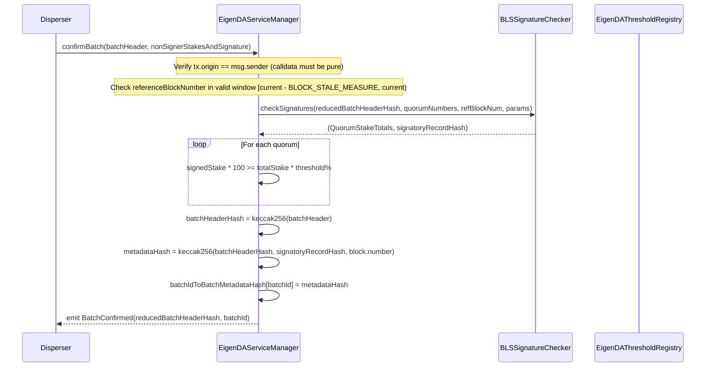
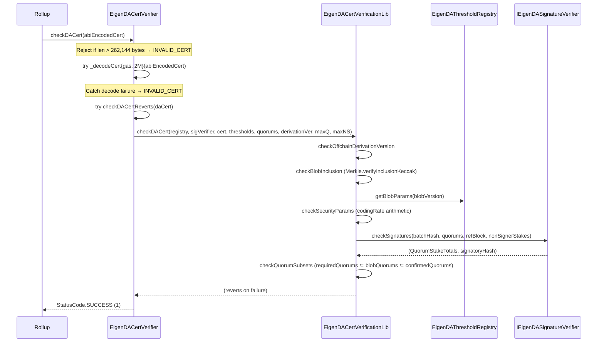
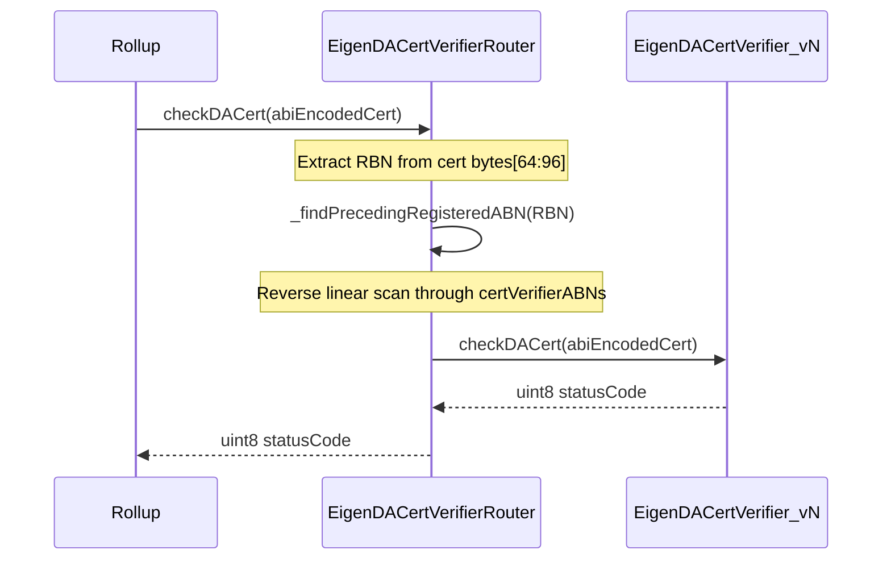
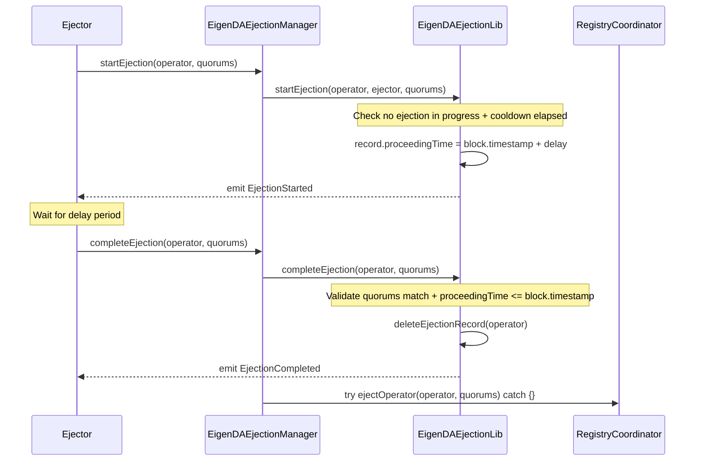
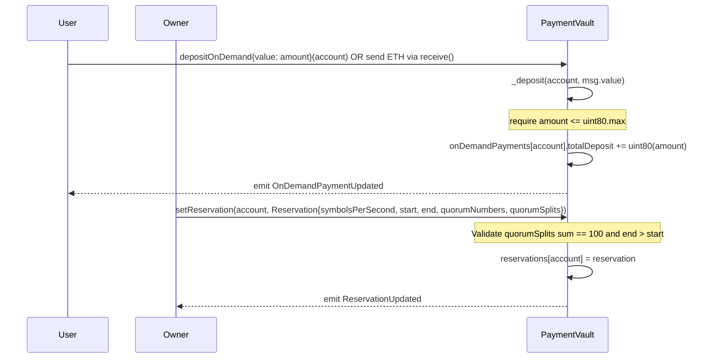

# eigenlayer-contracts Analysis

**Analyzed by**: code-analyzer-eigenlayer-contracts
**Timestamp**: 2026-04-08T00:00:00Z
**Application Type**: solidity-smart-contracts
**Classification**: library
**Location**: contracts/lib/eigenlayer-middleware/lib/eigenlayer-contracts (submodule reference), with primary source at contracts/

## Architecture

The eigenlayer-contracts component is the EigenDA smart contracts library — a Solidity-based on-chain system that implements EigenDA's data availability protocol. The project is built with Foundry (Solidity 0.8.29 / 0.8.9 mixed), uses OpenZeppelin for upgradability and access control patterns, and is compiled into Go language bindings via `abigen` for use in the broader EigenDA Go codebase.

The architecture is organized into three major layers: **core protocol contracts** (registry coordination, payment, service management), **integration contracts** (certificate verification for rollup consumers), and **periphery contracts** (ejection management). The core layer implements upgradeable proxy patterns using OpenZeppelin's `OwnableUpgradeable`, while integration contracts are deployed without proxies for immutability. A custom namespaced storage pattern (analogous to EIP-7201) is used in newer v3 contracts — `AddressDirectoryStorage`, `ConfigRegistryStorage`, and `EigenDAEjectionStorage` — avoiding storage slot conflicts typical in upgradeable contracts.

The contract system implements a versioned certificate verification scheme across multiple protocol generations: V1 (batch-based with on-chain confirmation), V2 (off-chain dispersal with Merkle blob inclusion proofs), and the current V3/V4 certificate types that combine V2 blob commitments with extended attestation data. Certificate versions are routed through the `EigenDACertVerifierRouter`, which maps Activation Block Numbers (ABNs) to specific verifier implementations, enabling seamless protocol upgrades without breaking rollup integrations.

Access control is centralized through `EigenDAAccessControl`, a role-based contract derived from OpenZeppelin's `AccessControlEnumerable`. Roles include `OWNER_ROLE`, `EJECTOR_ROLE`, and per-quorum `QUORUM_OWNER_ROLE` values. The contracts depend heavily on the `eigenlayer-middleware` library (itself a submodule) for operator registry coordination, BLS signature checking, stake tracking, and the `BN254` elliptic curve library for cryptographic operations.

## Key Components

- **EigenDAServiceManager** (`contracts/src/core/EigenDAServiceManager.sol`): The primary V1 protocol entrypoint. Inherits `ServiceManagerBase` (EigenLayer AVS interface), `BLSSignatureChecker`, and `Pausable`. Exposes `confirmBatch(BatchHeader, NonSignerStakesAndSignature)`, which verifies BLS aggregate signatures from quorum operators, enforces stake-weighted threshold checks, and records batch metadata hashes on-chain. Also proxies threshold registry queries.

- **EigenDAServiceManagerStorage** (`contracts/src/core/EigenDAServiceManagerStorage.sol`): Abstract storage base for `EigenDAServiceManager`. Defines immutable references to `eigenDAThresholdRegistry`, `eigenDARelayRegistry`, `paymentVault`, and `eigenDADisperserRegistry`. Maintains state for `batchId`, `batchIdToBatchMetadataHash`, `isBatchConfirmer`, and constants `STORE_DURATION_BLOCKS = 2 weeks / 12` and `BLOCK_STALE_MEASURE = 300`.

- **EigenDAThresholdRegistry** (`contracts/src/core/EigenDAThresholdRegistry.sol`): Upgradeable registry storing per-quorum adversary and confirmation threshold percentages, and versioned blob parameters (`VersionedBlobParams`: maxNumOperators, numChunks, codingRate). Exposes `getBlobParams(uint16 version)` and per-quorum threshold getters. Used by all certificate verifiers to enforce security assumptions.

- **EigenDARelayRegistry** (`contracts/src/core/EigenDARelayRegistry.sol`): Upgradeable registry mapping `uint32` relay keys to `RelayInfo` structs (relay address + URL). Exposes `relayKeyToAddress(key)` and `relayKeyToUrl(key)`. Provides discoverability for V2 blob relay infrastructure.

- **EigenDADisperserRegistry** (`contracts/src/core/EigenDADisperserRegistry.sol`): Upgradeable registry mapping `uint32` disperser keys to `DisperserInfo` structs (disperser address). Used to authenticate disperser identity in the V2 protocol flow.

- **PaymentVault** (`contracts/src/core/PaymentVault.sol`): Upgradeable contract that handles two payment models: time-windowed reservations (per-account, per-quorum `Reservation` structs with `symbolsPerSecond`, start/end timestamps, quorum split) and on-demand ETH deposits (tracked as `uint80 totalDeposit` in `OnDemandPayment`). Only the owner can set reservations; any address can deposit ETH. Supports ERC-20 withdrawal by owner.

- **EigenDADirectory** (`contracts/src/core/EigenDADirectory.sol`): V3 contract combining an `AddressDirectory` (name → address mapping using keccak keys with namespaced EVM storage) and a `ConfigRegistry` (name → checkpointed bytes values indexed by block number or timestamp). Implements `IEigenDAAddressDirectory` and `IEigenDAConfigRegistry`. Serves as the central on-chain service discovery mechanism for EigenDA v3 infrastructure.

- **EigenDAAccessControl** (`contracts/src/core/EigenDAAccessControl.sol`): Thin wrapper around OpenZeppelin's `AccessControlEnumerable`. Grants `DEFAULT_ADMIN_ROLE` and `OWNER_ROLE` to the deployer. Acts as the centralized trust anchor for all V3 contracts (`EigenDADirectory`, `EigenDAEjectionManager`).

- **EigenDARegistryCoordinator** (`contracts/src/core/EigenDARegistryCoordinator.sol`): EigenDA's extension of `RegistryCoordinator` from eigenlayer-middleware. Tracks up to 192 quorums, per-operator quorum bitmap history, and operator churn. Stores `directory` (an `IEigenDAAddressDirectory`) as an immutable parameter, allowing address discovery without hardcoded upgradeable proxy patterns. Maintains ejection cooldown state.

- **EigenDACertVerifier** (`contracts/src/integrations/cert/EigenDACertVerifier.sol`): Immutable V4 certificate verifier. Implements `checkDACert(bytes abiEncodedCert) → uint8` using try/catch to classify results as SUCCESS (200), INVALID_CERT (400), or INTERNAL_ERROR (500). Enforces size limits (MAX_CALLDATA_BYTES_LENGTH = 262,144 bytes), ABI-decode gas bounds, quorum count limits (MAX_QUORUM_COUNT = 5), and non-signer count limits (MAX_NONSIGNER_COUNT_ALL_QUORUM = 415). Stores immutable threshold registry, signature verifier, security thresholds, required quorum numbers, and offchain derivation version.

- **EigenDACertVerificationLib** (`contracts/src/integrations/cert/libraries/EigenDACertVerificationLib.sol`): Core library implementing the V4 cert verification pipeline: `checkOffchainDerivationVersion` → `checkBlobInclusion` (Merkle proof via `Merkle.verifyInclusionKeccak`) → `checkSecurityParams` (coding-rate/threshold arithmetic) → `checkSignaturesAndBuildConfirmedQuorums` → `checkQuorumSubsets`. Uses `BN254`, `BitmapUtils`, `Merkle`, and `OperatorStateRetriever` from eigenlayer-middleware.

- **EigenDACertVerifierRouter** (`contracts/src/integrations/cert/router/EigenDACertVerifierRouter.sol`): Upgradeable routing contract that maps ABNs to cert verifier addresses. On `checkDACert`, extracts the RBN from bytes position 64:96 of the ABI-encoded cert, finds the preceding registered ABN via reverse linear scan, and delegates to the appropriate verifier. New verifiers must have future ABNs to prevent same-block races.

- **CertVerifierRouterFactory** (`contracts/src/integrations/cert/router/CertVerifierRouterFactory.sol`): Factory contract for rollups to atomically deploy and initialize an immutable `EigenDACertVerifierRouter`, preventing initialization front-running attacks.

- **EigenDACertVerificationV2Lib** (`contracts/src/integrations/cert/legacy/v2/EigenDACertVerificationV2Lib.sol`): Legacy V2 cert verification library with a different status code model (enum-based return values rather than try/catch). Implements the same pipeline but returns `(StatusCode err, bytes errParams)` pairs instead of reverting. Supports `verifyDACertV2FromSignedBatch` for direct `SignedBatch` input.

- **EigenDAEjectionManager** (`contracts/src/periphery/ejection/EigenDAEjectionManager.sol`): V3 ejection lifecycle contract. Implements a three-phase ejection flow: `startEjection` (initiated by ejector) → delay period → `completeEjection` (ejector completes, triggers `registryCoordinator.ejectOperator`). Operators can cancel via direct call or BLS-signed cancel authorization. Enforces cooldown between ejection cycles. Uses namespaced storage (`EigenDAEjectionStorage`) with hardcoded immutable contract references in bytecode.

- **EigenDATypesV1 / EigenDATypesV2** (`contracts/src/core/libraries/v{1,2}/`): Pure type definition libraries. V1 defines `BatchHeader`, `BlobHeader`, `BlobVerificationProof`, `NonSignerStakesAndSignature`, and `SecurityThresholds`. V2 defines `BlobHeaderV2`, `BlobCertificate`, `BlobInclusionInfo`, `BatchHeaderV2`, `SignedBatch`, and `Attestation`. Both use `BN254.G1Point` and `BN254.G2Point` from eigenlayer-middleware.

- **EigenDACertTypes** (`contracts/src/integrations/cert/EigenDACertTypes.sol`): Defines the versioned ABI-encoded certificate envelope types. `EigenDACertV3` and `EigenDACertV4` combine a V2 `BatchHeaderV2`, `BlobInclusionInfo`, a V1 `NonSignerStakesAndSignature`, and `signedQuorumNumbers`. V4 adds `offchainDerivationVersion uint16` for versioning the off-chain derivation pipeline.

- **Go Bindings** (`contracts/bindings/`): 28 auto-generated Go binding packages produced by `abigen v1` and `abigen v2` from Foundry-compiled ABI artifacts. Used throughout the EigenDA Go codebase (core/eth/reader.go, core/payments/, inabox/deploy/, tools/) to interact with deployed contracts.

## Data Flows

### 1. V1 Batch Confirmation Flow

**Flow Description**: The disperser confirms a V1 data batch on-chain by submitting BLS aggregate signatures from quorum operators.



**Detailed Steps**:

1. **Input Validation** (Disperser → EigenDAServiceManager)
   - Method: `confirmBatch(BatchHeader calldata, NonSignerStakesAndSignature memory)`
   - Requires: `tx.origin == msg.sender` (EOA only, prevents proxy calls hiding calldata)
   - Requires: `referenceBlockNumber < block.number` and `referenceBlockNumber + BLOCK_STALE_MEASURE >= block.number`
   - Requires: `quorumNumbers.length == signedStakeForQuorums.length`

2. **BLS Signature Verification** (EigenDAServiceManager → BLSSignatureChecker)
   - Computes `reducedBatchHeaderHash = keccak256(abi.encode(ReducedBatchHeader{blobHeadersRoot, referenceBlockNumber}))`
   - Calls `checkSignatures(hash, quorumNumbers, referenceBlockNumber, nonSignerStakesAndSignature)`
   - Returns per-quorum `signedStakeForQuorum[]` and `totalStakeForQuorum[]` arrays

3. **Threshold Enforcement**
   - For each quorum: `signedStakeForQuorum[i] * 100 >= totalStakeForQuorum[i] * signedStakeForQuorums[i]`

4. **State Write**
   - Stores `keccak256(batchHeaderHash || signatoryRecordHash || confirmationBlockNumber)` in `batchIdToBatchMetadataHash[batchId]`
   - Increments `batchId`

**Error Paths**:
- Paused (bit 0 set): reverts with `Paused(0)` via `onlyWhenNotPaused`
- Not a batch confirmer: reverts with empty reason via `onlyBatchConfirmer`
- Stale reference block: `require` reverts
- Threshold not met: `require("signatories do not own threshold percentage of a quorum")`

---

### 2. V4 Certificate Verification Flow

**Flow Description**: A rollup contract verifies an EigenDA V4 data availability certificate, returning a status code classifying the result.



**Detailed Steps**:

1. **Size Guard**: If `abiEncodedCert.length > 262_144`, return `INVALID_CERT` immediately.

2. **Decode**: `try this._decodeCert{gas: 2_097_152}(abiEncodedCert)` — catching Panic from malformed input as `INVALID_CERT`.

3. **Offchain Derivation Version Check**: `cert.offchainDerivationVersion == _offchainDerivationVersion`; revert with `InvalidOffchainDerivationVersion` if mismatch.

4. **Blob Inclusion**: `Merkle.verifyInclusionKeccak(inclusionProof, batchRoot, keccak256(blobCertHash), blobIndex)` — revert with `InvalidInclusionProof` if false.

5. **Security Parameters**: Fetches `VersionedBlobParams` for the blob version; validates the inequality `codingRate * (numChunks - maxNumOperators) * (confirmationThreshold - adversaryThreshold) >= 100 * numChunks`; revert with `SecurityAssumptionsNotMet` if false.

6. **Signature Verification**: Delegates to `IEigenDASignatureVerifier.checkSignatures`, gets per-quorum stake totals; builds `confirmedQuorumsBitmap`.

7. **Quorum Subset Checks**: Validates `blobQuorums ⊆ confirmedQuorums` and `requiredQuorums ⊆ blobQuorums` using bitmap arithmetic via `BitmapUtils`.

8. **Status Classification** (try/catch wrapping the above):
   - `require(string)` failure → `INVALID_CERT`
   - `Panic` → `INTERNAL_ERROR`
   - Low-level revert (len == 0) → `INTERNAL_ERROR`
   - Custom error → `INVALID_CERT`

---

### 3. Certificate Router Dispatch Flow

**Flow Description**: A rollup calls the router which selects the appropriate verifier based on the certificate's reference block number.



**Key Technical Details**:
- RBN is at bytes offset 64:96 in the ABI-encoded `EigenDACertV3/V4` struct because: [0:32] = pointer to bytes array, [32:64] = `batchHeader.batchRoot` (bytes32), [64:96] = `batchHeader.referenceBlockNumber` (padded uint32).
- Router maintains monotonically increasing ABN list; new entries must have `activationBlockNumber > block.number`.
- Reverse iteration finds the most recent applicable verifier efficiently for the common case of recent RBNs.

---

### 4. Ejection Lifecycle Flow

**Flow Description**: An ejector initiates, and later completes, an operator ejection from EigenDA quorums.



**Error Paths**:
- Ejection already in progress: `require(ejectee.record.proceedingTime == 0)`
- Cooldown not elapsed: `require(lastProceedingInitiated + cooldown <= block.timestamp)`
- Quorum mismatch: `require(quorumsEqual(record.quorums, quorums))`
- Delay not elapsed: `require(block.timestamp >= record.proceedingTime)`
- `ejectOperator` failure is silently swallowed via try/catch

---

### 5. Payment Registration Flow

**Flow Description**: Users deposit ETH for on-demand DA service or have reservations set by the protocol owner.



## Dependencies

### External Libraries

- **@openzeppelin/contracts** (4.7.0) [access-control, utils]: OpenZeppelin Contracts v4 for non-upgradeable contracts. Used for `AccessControlEnumerable` (role-based access control in `EigenDAAccessControl`), `IERC20` (ERC-20 token interface in `PaymentVault.withdrawERC20`), and `IAccessControl` (checked in `EigenDADirectory` and `EigenDAEjectionManager`). Installed via NPM.
  Imported in: `contracts/src/core/EigenDAAccessControl.sol`, `contracts/src/core/PaymentVault.sol`, `contracts/src/core/EigenDADirectory.sol`, `contracts/src/periphery/ejection/EigenDAEjectionManager.sol`.

- **@openzeppelin/contracts-upgradeable** (4.7.0) [upgradability]: OpenZeppelin Contracts Upgradeable v4. Used for `OwnableUpgradeable` (owner-only function guards and two-step initialization) in all upgradeable core registry contracts. Installed via NPM.
  Imported in: `contracts/src/core/EigenDAThresholdRegistry.sol`, `contracts/src/core/EigenDARelayRegistry.sol`, `contracts/src/core/EigenDADisperserRegistry.sol`, `contracts/src/core/PaymentVault.sol`, `contracts/src/integrations/cert/router/EigenDACertVerifierRouter.sol`.

- **eigenlayer-middleware** (git submodule, unpopulated) [blockchain, avs-framework]: EigenLayer's AVS middleware library. Provides the foundational operator registry infrastructure: `BLSSignatureChecker` (BLS aggregate signature validation), `BN254` (bn254 elliptic curve arithmetic for G1/G2 points), `BitmapUtils` (quorum bitmap manipulation), `Merkle` (Keccak-based Merkle proof verification), `OperatorStateRetriever` (off-chain indexing of operator state), `ServiceManagerBase` (AVS service manager interface), `IRegistryCoordinator`, `IStakeRegistry`, `IBLSApkRegistry`, and `IServiceManager`. Effectively provides all cryptographic verification primitives and EigenLayer protocol interface compliance.
  Imported in: `contracts/src/core/EigenDAServiceManager.sol`, `contracts/src/core/EigenDARegistryCoordinator.sol`, `contracts/src/integrations/cert/libraries/EigenDACertVerificationLib.sol`, `contracts/src/integrations/cert/legacy/v2/EigenDACertVerificationV2Lib.sol`, `contracts/src/periphery/ejection/EigenDAEjectionManager.sol`, and others.

- **forge-std** (git submodule) [testing]: Foundry's standard library for testing. Used exclusively in test contracts. Provides cheatcodes, assertion helpers, and test utilities.
  Imported in: `contracts/test/**/*.sol` (test files only).

### Build and Code Generation Tools

- **abigen** (go-ethereum tool) [build-tool]: Ethereum ABI-to-Go binding generator. Invoked by `generate-bindings.sh` against Foundry ABI artifacts to produce 28 Go binding packages under `contracts/bindings/`. Uses both v1 and v2 ABI binding formats, with `EigenDACertVerifier` and `PaymentVault` also having v2 bindings.

- **Foundry/forge** [build-tool]: Solidity build, test, and deployment framework. Configured in `contracts/foundry.toml` with Solidity 0.8.29, optimizer enabled with 200 runs, deny_warnings, and sparse compilation mode.

- **yarn** [build-tool]: Node.js package manager used to install the `@openzeppelin/contracts` and `@openzeppelin/contracts-upgradeable` NPM packages before Foundry compilation.

## API Surface

The eigenlayer-contracts library exposes its public interface through two mechanisms: (1) compiled Solidity ABI interfaces for on-chain interaction, and (2) auto-generated Go binding packages for off-chain use in the EigenDA Go monorepo.

### Core Contract Interfaces

**EigenDAServiceManager**
- `confirmBatch(BatchHeader calldata batchHeader, NonSignerStakesAndSignature memory nonSignerStakesAndSignature) external` — Submit V1 data availability proof
- `batchIdToBatchMetadataHash(uint32 batchId) external view returns (bytes32)` — Retrieve confirmed batch metadata hash
- `taskNumber() external view returns (uint32)` — Current batch ID
- `latestServeUntilBlock(uint32 referenceBlockNumber) external pure returns (uint32)` — Storage obligation deadline
- `quorumAdversaryThresholdPercentages() / quorumConfirmationThresholdPercentages() / quorumNumbersRequired()` — Threshold queries
- Events: `BatchConfirmed(bytes32 indexed batchHeaderHash, uint32 batchId)`, `BatchConfirmerStatusChanged(address, bool)`

**EigenDAThresholdRegistry**
- `getQuorumAdversaryThresholdPercentage(uint8 quorumNumber) external view returns (uint8)`
- `getQuorumConfirmationThresholdPercentage(uint8 quorumNumber) external view returns (uint8)`
- `getIsQuorumRequired(uint8 quorumNumber) external view returns (bool)`
- `nextBlobVersion() external view returns (uint16)`
- `getBlobParams(uint16 version) external view returns (VersionedBlobParams memory)`
- `addVersionedBlobParams(VersionedBlobParams memory) external onlyOwner returns (uint16)`
- Events: `VersionedBlobParamsAdded(uint16 indexed version, VersionedBlobParams)`

**EigenDARelayRegistry**
- `addRelayInfo(RelayInfo memory relayInfo) external onlyOwner returns (uint32)`
- `relayKeyToAddress(uint32 key) external view returns (address)`
- `relayKeyToUrl(uint32 key) external view returns (string memory)`
- Events: `RelayAdded(address relayAddress, uint32 relayKey, string relayURL)`

**EigenDADisperserRegistry**
- `setDisperserInfo(uint32 _disperserKey, DisperserInfo memory _disperserInfo) external onlyOwner`
- `disperserKeyToAddress(uint32 _key) external view returns (address)`
- Events: `DisperserAdded(uint32 disperserKey, address disperserAddress)`

**PaymentVault**
- `setReservation(address _account, Reservation memory _reservation) external onlyOwner`
- `depositOnDemand(address _account) external payable`
- `getReservation(address _account) external view returns (Reservation memory)`
- `getReservations(address[] memory _accounts) external view returns (Reservation[] memory)`
- `getOnDemandTotalDeposit(address _account) external view returns (uint80)`
- `getOnDemandTotalDeposits(address[] memory _accounts) external view returns (uint80[] memory)`
- `setPriceParams(uint64, uint64, uint64) external onlyOwner`
- `setGlobalSymbolsPerPeriod(uint64) / setReservationPeriodInterval(uint64) / setGlobalRatePeriodInterval(uint64) external onlyOwner`
- `withdraw(uint256) / withdrawERC20(IERC20, uint256) external onlyOwner`
- Payable: `receive() / fallback()` — ETH deposit to `msg.sender`

**EigenDADirectory (V3)**
- `addAddress(string name, address value) / replaceAddress / removeAddress external onlyOwner`
- `getAddress(string name) / getAddress(bytes32 key) external view returns (address)`
- `getName(bytes32 key) / getAllNames() external view`
- `addConfigBlockNumber(string name, uint256 abn, bytes value) / addConfigTimeStamp(...) external onlyOwner`
- `getNumCheckpointsBlockNumber/TimeStamp(bytes32 nameDigest) external view returns (uint256)`
- `getConfigBlockNumber/TimeStamp(bytes32 nameDigest, uint256 index) external view returns (bytes memory)`
- `getActiveAndFutureBlockNumberConfigs/TimestampConfigs(string name, uint256 ref) external view returns (BlockNumberCheckpoint[]/TimeStampCheckpoint[])`
- `semver() external pure returns (uint8 major, uint8 minor, uint8 patch)` — Returns (2, 0, 0)

**EigenDACertVerifier (V4)**
- `checkDACert(bytes calldata abiEncodedCert) external view returns (uint8)` — Returns StatusCode: 1=SUCCESS, 6=INVALID_CERT, 7=INTERNAL_ERROR
- `checkDACertReverts(EigenDACertV4 calldata daCert) external view` — Reverts on any invalid cert
- `eigenDAThresholdRegistry() / eigenDASignatureVerifier() external view` — Component getters
- `securityThresholds() external view returns (SecurityThresholds memory)`
- `quorumNumbersRequired() external view returns (bytes memory)`
- `offchainDerivationVersion() external view returns (uint16)`
- `certVersion() external pure returns (uint8)` — Returns 4
- `semver() external pure returns (uint8, uint8, uint8)` — Returns (4, 0, 0)

**EigenDACertVerifierRouter**
- `checkDACert(bytes calldata abiEncodedCert) external view returns (uint8)` — Delegates to appropriate verifier
- `getCertVerifierAt(uint32 referenceBlockNumber) public view returns (address)`
- `addCertVerifier(uint32 activationBlockNumber, address certVerifier) external onlyOwner`
- `certVerifiers(uint32) public view returns (address)`
- `certVerifierABNs(uint256) public view returns (uint32)`
- Events: `CertVerifierAdded(uint32 indexed activationBlockNumber, address indexed certVerifier)`

**EigenDAEjectionManager (V3)**
- `startEjection(address operator, bytes memory quorums) external onlyEjector`
- `cancelEjectionByEjector(address operator) external onlyEjector`
- `completeEjection(address operator, bytes memory quorums) external onlyEjector`
- `cancelEjection() external` — Called by the operator being ejected
- `cancelEjectionWithSig(address operator, BN254.G2Point memory apkG2, BN254.G1Point memory sigma, address recipient) external`
- `setDelay(uint64 delay) / setCooldown(uint64 cooldown) external onlyOwner`
- `getEjector(address) / ejectionTime(address) / lastEjectionInitiated(address) / ejectionQuorums(address) / ejectionDelay() / ejectionCooldown() external view`
- `semver() external pure returns (uint8, uint8, uint8)` — Returns (3, 0, 0)

### Key Solidity Types Exported

```solidity
// EigenDATypesV1
struct VersionedBlobParams { uint32 maxNumOperators; uint32 numChunks; uint8 codingRate; }
struct SecurityThresholds { uint8 confirmationThreshold; uint8 adversaryThreshold; }
struct BatchHeader { bytes32 blobHeadersRoot; bytes quorumNumbers; bytes signedStakeForQuorums; uint32 referenceBlockNumber; }
struct BatchMetadata { BatchHeader batchHeader; bytes32 signatoryRecordHash; uint32 confirmationBlockNumber; }
struct BlobVerificationProof { uint32 batchId; uint32 blobIndex; BatchMetadata batchMetadata; bytes inclusionProof; bytes quorumIndices; }
struct NonSignerStakesAndSignature { uint32[] nonSignerQuorumBitmapIndices; BN254.G1Point[] nonSignerPubkeys; BN254.G1Point[] quorumApks; BN254.G2Point apkG2; BN254.G1Point sigma; uint32[] quorumApkIndices; uint32[] totalStakeIndices; uint32[][] nonSignerStakeIndices; }

// EigenDATypesV2
struct BlobHeaderV2 { uint16 version; bytes quorumNumbers; BlobCommitment commitment; bytes32 paymentHeaderHash; }
struct BlobCommitment { BN254.G1Point commitment; BN254.G2Point lengthCommitment; BN254.G2Point lengthProof; uint32 length; }
struct BlobCertificate { BlobHeaderV2 blobHeader; bytes signature; uint32[] relayKeys; }
struct BatchHeaderV2 { bytes32 batchRoot; uint32 referenceBlockNumber; }
struct Attestation { BN254.G1Point[] nonSignerPubkeys; BN254.G1Point[] quorumApks; BN254.G1Point sigma; BN254.G2Point apkG2; uint32[] quorumNumbers; }

// EigenDACertTypes
struct EigenDACertV4 { BatchHeaderV2 batchHeader; BlobInclusionInfo blobInclusionInfo; NonSignerStakesAndSignature nonSignerStakesAndSignature; bytes signedQuorumNumbers; uint16 offchainDerivationVersion; }

// IPaymentVault
struct Reservation { uint64 symbolsPerSecond; uint64 startTimestamp; uint64 endTimestamp; bytes quorumNumbers; bytes quorumSplits; }
struct OnDemandPayment { uint80 totalDeposit; }
```

### Go Binding Packages (contracts/bindings/)

Key packages consumed by the EigenDA Go monorepo:

- `github.com/Layr-Labs/eigenda/contracts/bindings/EigenDAServiceManager` — Core service manager client
- `github.com/Layr-Labs/eigenda/contracts/bindings/EigenDAThresholdRegistry` — Threshold/blob-version query client
- `github.com/Layr-Labs/eigenda/contracts/bindings/EigenDARelayRegistry` / `EigenDADisperserRegistry` — Registry clients
- `github.com/Layr-Labs/eigenda/contracts/bindings/v2/PaymentVault` — Payment vault client (abigen v2)
- `github.com/Layr-Labs/eigenda/contracts/bindings/PaymentVault` — Payment vault client (abigen v1, legacy)
- `github.com/Layr-Labs/eigenda/contracts/bindings/EigenDACertVerifier` — Cert verifier client
- `github.com/Layr-Labs/eigenda/contracts/bindings/EigenDACertVerifierRouter` — Router client
- `github.com/Layr-Labs/eigenda/contracts/bindings/IEigenDADirectory` — Directory client (V3)
- `github.com/Layr-Labs/eigenda/contracts/bindings/StakeRegistry` / `BLSApkRegistry` / `OperatorStateRetriever` — Operator state clients
- `github.com/Layr-Labs/eigenda/contracts/bindings/AVSDirectory` / `DelegationManager` — EigenLayer core protocol clients
- `github.com/Layr-Labs/eigenda/contracts/bindings/IEigenDAEjectionManager` — Ejection manager client

## Code Examples

### Example 1: Certificate Status Code Classification in checkDACert

```solidity
// contracts/src/integrations/cert/EigenDACertVerifier.sol
function checkDACert(bytes calldata abiEncodedCert) external view returns (uint8) {
    if (abiEncodedCert.length > MAX_CALLDATA_BYTES_LENGTH) {
        return uint8(StatusCode.INVALID_CERT);
    }

    CT.EigenDACertV4 memory daCert;
    try this._decodeCert{gas: MAX_ABI_DECODE_GAS}(abiEncodedCert) returns (CT.EigenDACertV4 memory _daCert) {
        daCert = _daCert;
    } catch {
        return uint8(StatusCode.INVALID_CERT);
    }

    try this.checkDACertReverts(daCert) {
        return uint8(StatusCode.SUCCESS);
    } catch Error(string memory) {
        return uint8(StatusCode.INVALID_CERT);      // require(string) from eigenlayer-middleware
    } catch Panic(uint256) {
        return uint8(StatusCode.INTERNAL_ERROR);    // arithmetic overflow, etc.
    } catch (bytes memory reason) {
        if (reason.length == 0) {
            return uint8(StatusCode.INTERNAL_ERROR); // out-of-gas, stack underflow
        } else if (reason.length < 4) {
            return uint8(StatusCode.INTERNAL_ERROR);
        }
        return uint8(StatusCode.INVALID_CERT);      // custom errors from cert lib
    }
}
```

### Example 2: Security Parameter Validation Arithmetic

```solidity
// contracts/src/integrations/cert/libraries/EigenDACertVerificationLib.sol
// This implements: codingRate * (numChunks - maxNumOperators) * gamma >= 100 * numChunks
// where gamma = confirmationThreshold - adversaryThreshold
function checkSecurityParams(
    IEigenDAThresholdRegistry eigenDAThresholdRegistry,
    uint16 blobVersion,
    DATypesV1.SecurityThresholds memory securityThresholds
) internal view {
    uint16 nextBlobVersion = eigenDAThresholdRegistry.nextBlobVersion();
    if (blobVersion >= nextBlobVersion) {
        revert InvalidBlobVersion(blobVersion, nextBlobVersion);
    }
    DATypesV1.VersionedBlobParams memory blobParams = eigenDAThresholdRegistry.getBlobParams(blobVersion);

    if (
        blobParams.maxNumOperators > blobParams.numChunks
            || securityThresholds.confirmationThreshold < securityThresholds.adversaryThreshold
    ) {
        revert SecurityAssumptionsNotMet(...);
    }

    uint256 lhs = blobParams.codingRate * (blobParams.numChunks - blobParams.maxNumOperators)
        * (securityThresholds.confirmationThreshold - securityThresholds.adversaryThreshold);
    uint256 rhs = 100 * blobParams.numChunks;

    if (!(lhs >= rhs)) {
        revert SecurityAssumptionsNotMet(...);
    }
}
```

### Example 3: Namespaced Storage Pattern (EIP-7201 style)

```solidity
// contracts/src/core/libraries/v3/address-directory/AddressDirectoryStorage.sol (inferred)
// contracts/src/core/libraries/v3/address-directory/AddressDirectoryLib.sol

library AddressDirectoryLib {
    // Storage layout uses keccak-derived slot for namespace isolation
    function getKey(string memory name) internal pure returns (bytes32) {
        return keccak256(abi.encodePacked(name));
    }

    function getAddress(bytes32 key) internal view returns (address) {
        return AddressDirectoryStorage.layout().addresses[key];
    }

    function setAddress(bytes32 key, address value) internal {
        AddressDirectoryStorage.layout().addresses[key] = value;
        emit AddressSet(key, value);
    }
    // Names are also stored for reverse lookup (key → string)
    // and enumeration (string[] nameList)
}
```

### Example 4: EigenDACertVerifierRouter ABN Lookup

```solidity
// contracts/src/integrations/cert/router/EigenDACertVerifierRouter.sol

// Extracts reference block number from ABI-encoded certificate bytes
function _getRBN(bytes calldata certBytes) internal pure returns (uint32) {
    // Layout: [0:32] = pointer, [32:64] = batchRoot, [64:96] = referenceBlockNumber
    if (certBytes.length < 96) {
        revert InvalidCertLength();
    }
    return abi.decode(certBytes[64:96], (uint32));
}

// Reverse scan to find the most recently active verifier for a given RBN
function _findPrecedingRegisteredABN(uint32 referenceBlockNumber)
    internal view returns (uint32 activationBlockNumber)
{
    if (referenceBlockNumber > block.number) {
        revert RBNInFuture(referenceBlockNumber);
    }
    uint256 abnMaxIndex = certVerifierABNs.length - 1;
    for (uint256 i; i < certVerifierABNs.length; i++) {
        activationBlockNumber = certVerifierABNs[abnMaxIndex - i];
        if (activationBlockNumber <= referenceBlockNumber) {
            return activationBlockNumber;
        }
    }
}
```

### Example 5: Go Bindings Usage in core/eth/reader.go

```go
// core/eth/reader.go (illustrative of binding usage pattern)
import (
    eigendasrvmg "github.com/Layr-Labs/eigenda/contracts/bindings/EigenDAServiceManager"
    paymentvault  "github.com/Layr-Labs/eigenda/contracts/bindings/PaymentVault"
)

contractEigenDAServiceManager, err := eigendasrvmg.NewContractEigenDAServiceManager(eigenDAServiceManagerAddr, t.ethClient)
// ...
avsDirectoryAddr, err := contractEigenDAServiceManager.AvsDirectory(&bind.CallOpts{})
registryCoordinatorAddr, err := contractEigenDAServiceManager.RegistryCoordinator(&bind.CallOpts{})
relayRegistryAddress, err := contractEigenDAServiceManager.EigenDARelayRegistry(&bind.CallOpts{})
thresholdRegistryAddr, err := contractEigenDAServiceManager.EigenDAThresholdRegistry(&bind.CallOpts{})
paymentVaultAddr, err := contractEigenDAServiceManager.PaymentVault(&bind.CallOpts{})
contractPaymentVault, err = paymentvault.NewContractPaymentVault(paymentVaultAddr, t.ethClient)
```

### Example 6: Ejection Cooldown State Design

```solidity
// contracts/src/periphery/ejection/libraries/EigenDAEjectionLib.sol
// The lastProceedingInitiated field is deliberately NOT cleared on cancellation
// to ensure cooldown enforcement even after cancelled ejections.

function cancelEjection(address operator) internal {
    EigenDAEjectionTypes.EjecteeState storage ejectee = getEjectee(operator);
    require(ejectee.record.proceedingTime > 0, "No ejection in progress");
    deleteEjectionRecord(operator);  // Clears ejector, quorums, proceedingTime
    emit EjectionCancelled(operator);
    // lastProceedingInitiated is intentionally preserved
}

function deleteEjectionRecord(address operator) internal {
    EigenDAEjectionTypes.EjecteeState storage ejectee = s().ejectees[operator];
    ejectee.record.ejector = address(0);
    ejectee.record.quorums = hex"";
    ejectee.record.proceedingTime = 0;
    // ejectee.lastProceedingInitiated is NOT reset
}
```

## Files Analyzed

- `contracts/src/core/EigenDAServiceManager.sol` (193 lines) — Primary V1 service manager implementation
- `contracts/src/core/EigenDAServiceManagerStorage.sol` (67 lines) — Storage layout and constants
- `contracts/src/core/EigenDAThresholdRegistry.sol` (89 lines) — Quorum threshold and blob params registry
- `contracts/src/core/EigenDARelayRegistry.sol` (33 lines) — Relay key registry
- `contracts/src/core/EigenDADisperserRegistry.sol` (31 lines) — Disperser key registry
- `contracts/src/core/PaymentVault.sol` (147 lines) — Payment and reservation management
- `contracts/src/core/EigenDADirectory.sol` (230 lines) — V3 address directory and config registry
- `contracts/src/core/EigenDAAccessControl.sol` (16 lines) — Centralized access control contract
- `contracts/src/core/EigenDARegistryCoordinatorStorage.sol` (65 lines) — Registry coordinator storage
- `contracts/src/core/interfaces/IEigenDAServiceManager.sol` (42 lines) — Service manager interface
- `contracts/src/core/interfaces/IEigenDAThresholdRegistry.sol` (52 lines) — Threshold registry interface
- `contracts/src/core/interfaces/IEigenDASignatureVerifier.sol` (13 lines) — Signature verifier interface
- `contracts/src/core/interfaces/IPaymentVault.sol` (57 lines) — Payment vault interface
- `contracts/src/core/interfaces/IEigenDADirectory.sol` (160 lines) — Directory and config registry interfaces
- `contracts/src/core/interfaces/IEigenDABatchMetadataStorage.sol` (6 lines) — Batch metadata interface
- `contracts/src/core/interfaces/IEigenDASemVer.sol` (7 lines) — Semantic versioning interface
- `contracts/src/core/libraries/v1/EigenDATypesV1.sol` (79 lines) — V1 type definitions
- `contracts/src/core/libraries/v2/EigenDATypesV2.sol` (59 lines) — V2 type definitions
- `contracts/src/core/libraries/v3/access-control/AccessControlConstants.sol` (19 lines) — Access control role constants
- `contracts/src/core/libraries/v3/address-directory/AddressDirectoryLib.sol` (53 lines) — Namespaced address directory library
- `contracts/src/core/libraries/v3/config-registry/ConfigRegistryLib.sol` (330 lines) — Checkpointed configuration registry library
- `contracts/src/integrations/cert/EigenDACertTypes.sol` (30 lines) — V3/V4 cert envelope types
- `contracts/src/integrations/cert/EigenDACertVerifier.sol` (222 lines) — V4 immutable cert verifier
- `contracts/src/integrations/cert/libraries/EigenDACertVerificationLib.sol` (353 lines) — V4 cert verification library
- `contracts/src/integrations/cert/interfaces/IEigenDACertVerifier.sol` (29 lines) — Cert verifier getter interface
- `contracts/src/integrations/cert/router/EigenDACertVerifierRouter.sol` (118 lines) — ABN-based cert verifier router
- `contracts/src/integrations/cert/router/CertVerifierRouterFactory.sol` (17 lines) — Router factory for rollups
- `contracts/src/integrations/cert/legacy/v2/EigenDACertVerificationV2Lib.sol` (382 lines) — Legacy V2 cert verification library
- `contracts/src/periphery/ejection/EigenDAEjectionManager.sol` (202 lines) — V3 ejection lifecycle manager
- `contracts/src/periphery/ejection/libraries/EigenDAEjectionLib.sol` (113 lines) — Ejection lifecycle library
- `contracts/src/periphery/ejection/libraries/EigenDAEjectionTypes.sol` (26 lines) — Ejection state types
- `contracts/src/core/libraries/v3/initializable/InitializableLib.sol` (35 lines) — Custom initializer library
- `contracts/src/Imports.sol` (8 lines) — Aggregated imports for Go binding generation
- `contracts/foundry.toml` (170 lines) — Foundry build configuration
- `contracts/package.json` (31 lines) — NPM dependencies
- `contracts/Makefile` (19 lines) — Build targets
- `contracts/generate-bindings.sh` (124 lines) — Go binding generation script
- `contracts/README.md` (35 lines) — Project documentation

## Analysis Notes

### Security Considerations

1. **tx.origin Restriction in confirmBatch**: `EigenDAServiceManager.confirmBatch` requires `tx.origin == msg.sender`, which prevents smart contract callers. This is intentional — it ensures that all BLS signature data is submitted as calldata (auditable on-chain) rather than via a contract that might compute it. While this limits composability, the security tradeoff is reasonable for a system requiring honest data availability proofs.

2. **try/catch Gas Boundary Risks**: The `_decodeCert` call is bounded by `MAX_ABI_DECODE_GAS = 2,097,152`. If gas costs of ABI decoding change across EVM upgrades (e.g., EIP-7623 calldata cost changes), a previously valid cert could hit this limit and return INTERNAL_ERROR instead of being verifiable. The comment acknowledges this gap: a `maxGas` parameter for `checkDACertReverts` is noted as a TODO.

3. **EigenDACertVerifierRouter Front-Running Guards**: New verifiers must have `activationBlockNumber > block.number`. This prevents a race condition where a verifier is activated at the current block and a cert is verified in the same block using the new verifier's rules. The recommendation to add additional delays (timelock, multisig) is documented in the contract code.

4. **Ejection try/catch Swallowing**: `_tryEjectOperator` silently catches all failures from `registryCoordinator.ejectOperator`. If the registry coordinator is broken, ejections will appear to succeed on-chain (emitting `EjectionCompleted`) but operators won't actually be removed. This is a latent risk that could allow a misbehaving operator to avoid ejection.

5. **PaymentVault Deposit Overflow Guard**: `require(_amount <= type(uint80).max)` before casting. The `uint80` cap means the maximum on-demand deposit per account is ~1.2M ETH, which is practically unreachable but correctly validated.

6. **Namespaced Storage Isolation**: V3 contracts (`EigenDADirectory`, `EigenDAEjectionManager`) use custom namespaced storage derived via keccak256 slot computation (similar to EIP-7201). This avoids storage collisions in the absence of OpenZeppelin's `Initializable`. The `InitializableLib.setInitializedVersion(1)` call in the constructor prevents re-initialization of the implementation contract.

7. **ABN Ordering Invariant**: The `EigenDACertVerifierRouter` maintains a strictly ascending `certVerifierABNs` list. The _findPrecedingRegisteredABN function iterates in reverse without binary search, which is O(n) in the number of registered verifiers. For expected protocol lifetimes with infrequent upgrades this is acceptable, but is a scalability consideration.

### Performance Characteristics

- **Batch Confirmation Gas Cost**: The `confirmBatch` function's dominant cost is `checkSignatures` in the BLS verifier, which involves BN254 pairing operations. Gas scales with the number of non-signers and quorums. At the configured `MAX_NONSIGNER_COUNT_ALL_QUORUM = 415`, gas costs could approach block limits.
- **Certificate Verification Calldata**: Maximum cert size is 262,144 bytes. ABI decoding is bounded to 2M gas. Merkle proof verification is O(depth * 300 gas), at most ~80K gas for depth-256 trees.
- **ConfigRegistry Lookup**: `getActiveAndFutureBlockNumberConfigs` iterates checkpoints in reverse. For configurations with many historical checkpoints, this could become expensive, but EigenDA operational usage patterns suggest few checkpoints per config name.
- **Router ABN Lookup**: Linear reverse scan through `certVerifierABNs`. Expected to be very small (< 10 entries over the protocol's lifetime).

### Scalability Notes

- **Quorum Count Limit**: The system supports up to 192 quorums (uint8 MAX_QUORUM_COUNT in `EigenDARegistryCoordinatorStorage`), and the cert verifier limits cert processing to 5 quorums (MAX_QUORUM_COUNT in EigenDACertVerifier). The 5-quorum limit in the verifier prevents unbounded gas costs during cert verification.
- **Versioned Blob Params**: The `uint16 nextBlobVersion` counter allows up to 65,535 distinct blob encoding configurations to be registered over the protocol's lifetime.
- **Multi-Protocol Version Support**: The router pattern (ABN-indexed verifiers) allows the protocol to support multiple generations of certificate formats indefinitely without requiring rollup contract upgrades. Rollups deploy one router and call `checkDACert`; the router handles version selection transparently.
- **Go Binding Dual-Format**: Both abigen v1 and v2 bindings are generated for key contracts. This enables gradual migration of the Go codebase to the more type-safe v2 API without a single large breaking change.
