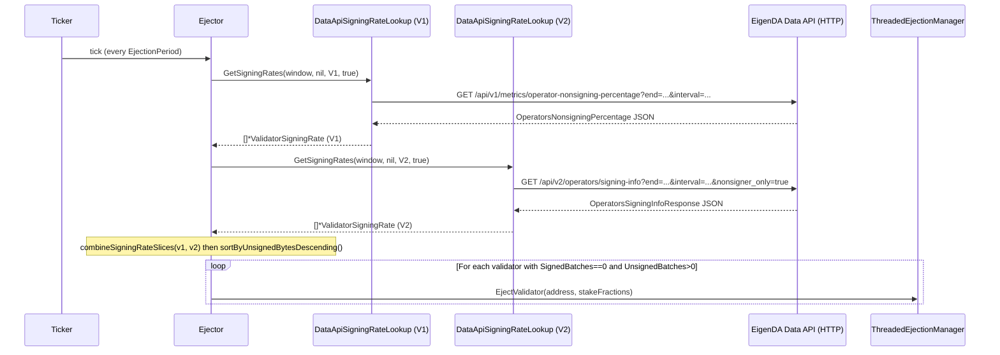
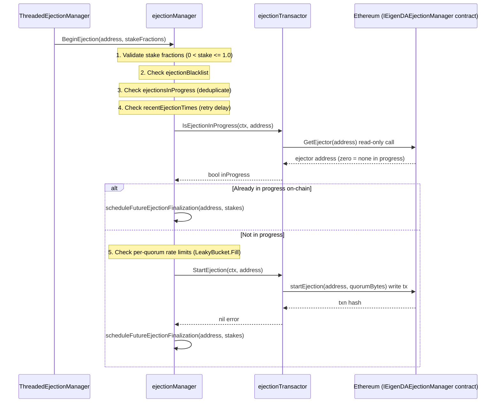
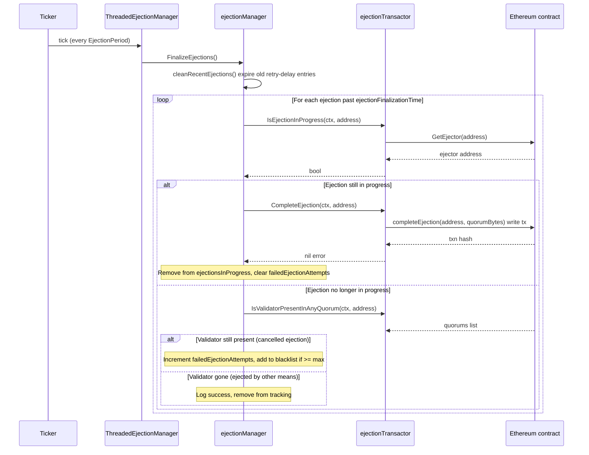
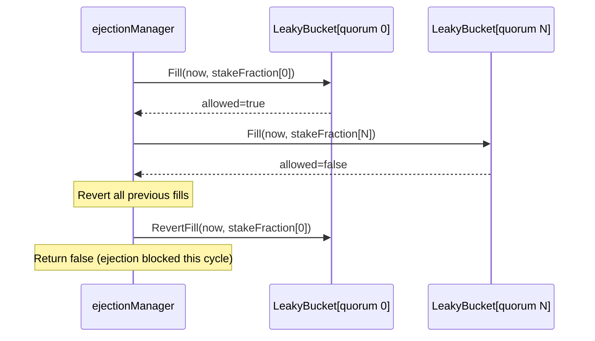

# ejector Analysis

**Analyzed by**: code-analyzer-ejector
**Timestamp**: 2026-04-10T00:00:00Z
**Application Type**: go-module
**Classification**: library (with embedded binary entry point in `ejector/main/`)
**Location**: ejector/

---

## Architecture

The ejector is a Go library that implements automated on-chain ejection of non-performing EigenDA data-availability (DA) node operators. It monitors validator signing rates across EigenDA protocol versions V1 and V2, and initiates and finalizes two-phase blockchain transactions to remove validators that have signed zero batches within a configurable time window.

The library follows a clear layered architecture:

1. **Evaluation layer** (`ejector.go` — `Ejector`): A background goroutine polls signing rate data on a configured cadence (`EjectionPeriod`). It pulls data from both V1 and V2 sources, merges them, and forwards ejection requests for any validator that has zero signed batches.

2. **Lifecycle management layer** (`ejection_manager.go` + `threaded_ejection_manager.go`): An `ejectionManager` maintains in-memory state for in-progress ejections, rate-limiting per quorum, a blacklist of do-not-eject validators, and a retry/failure counter. A thread-safe `ThreadedEjectionManager` wraps it with a channel-based actor pattern so that all state mutations happen on a single goroutine.

3. **Blockchain interaction layer** (`ejection_transactor.go`): An `ejectionTransactor` binds to the on-chain `IEigenDAEjectionManager` smart contract to call `StartEjection` and `CompleteEjection`, and also queries the registry coordinator for quorum membership and stake.

4. **Signing data sources** (`data_api_signing_rate_lookup.go`, `controller_signing_rate_lookup.go`): A `SigningRateLookup` interface abstracts where signing rate data comes from. The production implementation polls the EigenDA Data API over HTTP (both v1 and v2 REST endpoints). A stub controller-based lookup exists for future use.

Key design patterns used:
- **Interface-driven design**: `EjectionManager`, `EjectionTransactor`, and `SigningRateLookup` are all interfaces, enabling clean unit testing via mocks.
- **Actor model / single-writer**: `ThreadedEjectionManager` serialises all writes through a single goroutine and a channel, avoiding race conditions.
- **Leaky bucket rate limiting**: Per-quorum stake ejection is throttled using `common/ratelimit.LeakyBucket` to prevent mass ejections within a time window.
- **Two-phase commit on-chain**: Ejections are started (`StartEjection` tx), then finalised after a configurable delay (`CompleteEjection` tx), allowing validators to cancel.
- **Configurable blacklist and retry limits**: Validators that repeatedly cancel ejection are added to a permanent in-memory blacklist.

---

## Key Components

- **`Ejector`** (`ejector/ejector.go`): Top-level struct that owns the main evaluation loop. Launched via `NewEjector()`, it spawns a background goroutine that ticks every `EjectionPeriod`. On each tick it calls `evaluateValidators()`, which fetches V1 and V2 signing rates, merges them with `combineSigningRateSlices()`, sorts by unsigned bytes descending, and calls `evaluateValidator()` for each. A validator is considered ejectable only if `SignedBatches == 0 && UnsignedBatches > 0`. Converts validator IDs to Ethereum addresses via `ValidatorIDToAddressConverter` and looks up per-quorum stake fractions via `ValidatorStakeLookup` before delegating to `ThreadedEjectionManager.EjectValidator()`.

- **`EjectionManager` interface / `ejectionManager`** (`ejector/ejection_manager.go`): Core ejection lifecycle state machine. Maintains four in-memory maps keyed by `geth.Address`: in-progress ejections, recent ejection timestamps, failed attempt counts, and a blacklist. Rate-limits ejections per quorum with per-quorum `ratelimit.LeakyBucket` instances. `BeginEjection()` walks through five guard checks (stake validity, blacklist, in-progress, on-chain status, rate limit) before calling `EjectionTransactor.StartEjection()`. `FinalizeEjections()` iterates ejections whose delay has elapsed and calls `EjectionTransactor.CompleteEjection()`.

- **`ThreadedEjectionManager`** (`ejector/threaded_ejection_manager.go`): Thread-safe wrapper around `EjectionManager`. Exposes `EjectValidator()` which sends a `startEjectionRequest` onto an unbuffered channel. The single background goroutine (`mainLoop`) processes channel messages and periodic `FinalizeEjections` ticks, ensuring all state mutations are serialised to one goroutine.

- **`EjectionTransactor` interface / `ejectionTransactor`** (`ejector/ejection_transactor.go`): Abstracts all Ethereum contract interactions. Wraps `ContractIEigenDAEjectionManagerCaller` (read-only calls) and `ContractIEigenDAEjectionManagerTransactor` (write calls) generated from the `IEigenDAEjectionManager` ABI binding. Implements `StartEjection`, `CompleteEjection`, `IsEjectionInProgress`, and `IsValidatorPresentInAnyQuorum`. Uses `eth.ReferenceBlockProvider` for safe block number selection and internally caches quorum lookups and ID-to-address conversions.

- **`SigningRateLookup` interface** (`ejector/signing_rate_lookup.go`): Single-method interface `GetSigningRates(timeSpan, quorums, version, omitPerfectSigners)` returning `[]*validator.ValidatorSigningRate`. Decouples signing data retrieval from ejection decision logic. Two implementations exist: `dataApiSigningRateLookup` (production) and `controllerSigningRateLookup` (future placeholder).

- **`dataApiSigningRateLookup`** (`ejector/data_api_signing_rate_lookup.go`): HTTP client that queries the EigenDA Data API. For V1 it calls `GET /api/v1/metrics/operator-nonsigning-percentage` with `end` and `interval` query params. For V2 it calls `GET /api/v2/operators/signing-info` with an optional `nonsigner_only=true` flag. Translates responses into `validator.ValidatorSigningRate` protobuf messages. Merges per-quorum data for the same validator using `combineSigningRates()`.

- **`controllerSigningRateLookup`** (`ejector/controller_signing_rate_lookup.go`): Stub/placeholder for a future signing rate source that queries the EigenDA controller directly. Only supports V2. Currently returns `nil, nil` and is not wired into production.

- **`EjectorConfig` / `RootEjectorConfig` / `EjectorSecretConfig`** (`ejector/ejector_config.go`): Rich configuration structs with validation logic. `RootEjectorConfig` implements `config.DocumentedConfig` and is bootstrapped via `common/config.Bootstrap`. Separates non-secret config (periods, thresholds, throttle parameters) from secrets (Ethereum RPC URLs, private key). `DefaultEjectorConfig()` provides safe production defaults (1 min ejection period, 5% throttle per 24h, 64-block reference offset).

- **Utility functions** (`ejector/utils.go`): Three package-level functions: `combineSigningRates()` (sums batch/byte counts, weighted-average latency), `combineSigningRateSlices()` (merges V1 and V2 slices by validator ID), and `sortByUnsignedBytesDescending()` (sorts validators so worst offenders are processed first).

- **`mockEjectionTransactor`** (`ejector/mock_ejection_transactor.go`): Test double implementing `EjectionTransactor`. Maintains in-memory maps to simulate ejection state, configurable per-address errors, and correct post-ejection quorum presence semantics. Used extensively by `ejection_manager_test.go`.

- **`main` binary** (`ejector/main/main.go`): Entry point that wires all components together: bootstraps config, creates `geth.MultiHomingClient`, resolves contract addresses from `ContractDirectory`, instantiates `EjectionTransactor`, `EjectionManager`, `ThreadedEjectionManager`, `DataApiSigningRateLookup`, and all `core/eth` lookup helpers (with LRU caching), then calls `NewEjector()` and blocks until context is cancelled.

---

## Data Flows

### 1. Periodic Validator Evaluation (Core ejection trigger)

**Flow Description**: Every `EjectionPeriod`, the Ejector fetches signing rates for all validators from both V1 and V2 data sources, merges results, and issues ejection requests for validators with zero signed batches.



**Detailed Steps**:

1. **Tick** — `mainLoop()` receives from `ticker.C` and calls `evaluateValidators()`.
2. **V1 Signing Rate Fetch** — `GetSigningRates` routes to `getV1SigningRates()`, which makes an HTTP GET with `end` (RFC3339 now) and `interval` (seconds). Response deserialized to `dataapi.OperatorsNonsigningPercentage`.
3. **V2 Signing Rate Fetch** — `getV2SigningRates()` makes an HTTP GET with an additional `nonsigner_only=true` parameter. Response deserialized to `dataapiv2.OperatorsSigningInfoResponse`.
4. **Merge and sort** — `combineSigningRateSlices()` de-dupes by validator ID, summing batch and byte counts. `sortByUnsignedBytesDescending()` orders worst offenders first.
5. **Ejection dispatch** — For each validator with `SignedBatches==0 && UnsignedBatches>0`, resolves Ethereum address via `ValidatorIDToAddressConverter`, computes per-quorum stake fractions via `ValidatorStakeLookup` and `ValidatorQuorumLookup`, then calls `ThreadedEjectionManager.EjectValidator()`.

**Error Paths**:
- HTTP errors or non-200 responses from Data API are returned as errors; the evaluation cycle is skipped.
- Address resolution failures are logged per validator; other validators continue.
- `EjectValidator` errors (e.g. context closed) are logged, evaluation continues for remaining validators.

---

### 2. Begin Ejection Flow (StartEjection transaction)

**Flow Description**: `ejectionManager.BeginEjection()` runs five guard checks before issuing the `StartEjection` on-chain transaction.



**Detailed Steps**:

1. **Stake validation** — All stake fractions must be in `(0.0, 1.0]`.
2. **Blacklist check** — `ejectionBlacklist` map lookup; validators can be pre-configured or added after `MaxConsecutiveFailedEjectionAttempts` failures.
3. **In-progress deduplication** — `ejectionsInProgress` map lookup prevents double-ejection.
4. **Retry delay** — `recentEjectionTimes` map prevents rapid re-ejection attempts.
5. **On-chain status check** — `IsEjectionInProgress` calls `GetEjector(address)` on the contract; a non-zero ejector address means ejection is already running.
6. **Rate limiting** — Per-quorum `LeakyBucket.Fill(now, stakeFraction)` atomically checks and debits capacity. On any quorum rejection, all previous fills are reverted.
7. **Start transaction** — `StartEjection` builds and submits an Ethereum transaction signed with the ejector's private key. Uses `maxGasOverride` if configured.
8. **Schedule finalization** — Sets `ejectionFinalizationTime = now + EjectionFinalizationDelay`, adds to `ejectionsInProgress`.

---

### 3. Finalize Ejection Flow (CompleteEjection transaction)

**Flow Description**: Periodically, `FinalizeEjections()` iterates in-progress ejections whose delay has elapsed and attempts to complete the on-chain ejection.



---

### 4. Rate Limit Check (Leaky Bucket per Quorum)

**Flow Description**: The rate limiter ensures that at most `EjectionThrottle` fraction of stake per quorum can be ejected during any `EjectionThrottleTimePeriod`.



---

## Dependencies

### External Libraries

- **github.com/ethereum/go-ethereum** (v1.15.3, replaced by `github.com/ethereum-optimism/op-geth v1.101511.1`) [blockchain]: Provides the full Ethereum client library. The ejector uses `accounts/abi/bind` (contract bindings and signing opts), `common` (the `Address` type), and `crypto` (ECDSA key loading and address derivation from public key). Imported in `ejector/ejection_transactor.go`, `ejector/ejection_manager.go`, `ejector/threaded_ejection_manager.go`, `ejector/mock_ejection_transactor.go`, `ejector/main/main.go`.

- **github.com/Layr-Labs/eigensdk-go** (v0.2.0-beta.1.0.20250118004418-2a25f31b3b28) [other]: EigenLayer SDK for Go. The ejector uses only its `logging.Logger` interface for structured logging throughout all components. Imported in `ejector/ejector.go`, `ejector/ejection_manager.go`, `ejector/threaded_ejection_manager.go`, `ejector/ejection_transactor.go`, `ejector/data_api_signing_rate_lookup.go`.

- **github.com/stretchr/testify** (v1.11.1) [testing]: Provides `require` assertions used in test files (`ejection_manager_test.go`, `signing_rate_lookup_test.go`). Not imported in production code.

### Internal Libraries

- **`github.com/Layr-Labs/eigenda/api/grpc/validator`** (`api/grpc/validator/`): Provides the `ValidatorSigningRate` protobuf message struct, used as the canonical data type for signing rate information across the entire ejector package. All `SigningRateLookup` implementations produce `[]*validator.ValidatorSigningRate`. Imported in `ejector/ejector.go`, `ejector/signing_rate_lookup.go`, `ejector/controller_signing_rate_lookup.go`, `ejector/data_api_signing_rate_lookup.go`, `ejector/utils.go`.

- **`github.com/Layr-Labs/eigenda/core`** (`core/`): Provides fundamental EigenDA types: `core.OperatorID` (32-byte validator ID), `core.QuorumID` (uint8 quorum identifier), and `core.OperatorIDFromHex()` for parsing hex IDs. Imported in `ejector/ejector.go`, `ejector/ejection_manager.go`, `ejector/signing_rate_lookup.go`, `ejector/data_api_signing_rate_lookup.go`, and others.

- **`github.com/Layr-Labs/eigenda/core/eth`** (`core/eth/`): Provides five interfaces used by the ejector: `ValidatorIDToAddressConverter` (converts operator IDs to Ethereum addresses and vice versa), `ValidatorQuorumLookup` (gets quorum membership at a reference block), `ValidatorStakeLookup` (gets per-quorum stake fractions), `ReferenceBlockProvider` (provides safe historical block numbers), and helper `QuorumListToBytes()`. Caching wrappers (`NewCachedValidatorQuorumLookup`, etc.) are used in both `ejection_transactor.go` and `main/main.go`. Imported in `ejector/ejector.go`, `ejector/ejection_transactor.go`, `ejector/main/main.go`.

- **`github.com/Layr-Labs/eigenda/common`** (`common/`): Provides structured logging setup (`common.NewLogger`, `common.TestLogger`), `common.LogFormat` enum, and `common.DefaultLoggerConfig()`. Imported in `ejector/ejector_config.go` (for `common.JSONLogFormat`), `ejector/main/main.go`.

- **`github.com/Layr-Labs/eigenda/common/config`** (`common/config/`): Provides `config.Bootstrap()` for loading configuration from environment variables/files, and the `config.DocumentedConfig` and `config.VerifiableConfig` interfaces that `EjectorConfig` implements. Imported in `ejector/ejector_config.go`, `ejector/main/main.go`.

- **`github.com/Layr-Labs/eigenda/common/enforce`** (`common/enforce/`): Provides `enforce.NilError()`, a panic-on-error helper used to assert invariants that should be logically impossible (used in leaky bucket operations in `ejection_manager.go`). Imported in `ejector/ejection_manager.go`.

- **`github.com/Layr-Labs/eigenda/common/ratelimit`** (`common/ratelimit/`): Provides `ratelimit.LeakyBucket` — a token-bucket-style rate limiter with `Fill()`, `RevertFill()`, and `NewLeakyBucket()` functions. Used by `ejectionManager` to implement per-quorum stake ejection throttling. Imported in `ejector/ejection_manager.go`.

- **`github.com/Layr-Labs/eigenda/common/geth`** (`common/geth/`): Provides `geth.NewMultiHomingClient()` and `geth.EthClientConfig` for creating a retrying, multi-endpoint Ethereum client. Used in `ejector/main/main.go` only.

- **`github.com/Layr-Labs/eigenda/disperser/dataapi`** (`disperser/dataapi/`): The ejector depends on the Data API's exported types: `dataapi.OperatorsNonsigningPercentage`, `dataapi.OperatorNonsigningPercentageMetrics`, and `dataapi.ErrorResponse`. These are the JSON response types for the V1 Data API endpoint. Imported in `ejector/data_api_signing_rate_lookup.go`.

- **`github.com/Layr-Labs/eigenda/disperser/dataapi/v2`** (`disperser/dataapi/v2/`): Provides `dataapiv2.OperatorsSigningInfoResponse` and `dataapiv2.OperatorSigningInfo` — the V2 Data API response types. Imported in `ejector/data_api_signing_rate_lookup.go` as `dataapiv2`.

- **`github.com/Layr-Labs/eigenda/contracts/bindings/IEigenDAEjectionManager`** (`contracts/bindings/IEigenDAEjectionManager/`): Auto-generated Go ABI binding for the `IEigenDAEjectionManager` Solidity interface. Provides `ContractIEigenDAEjectionManagerCaller` and `ContractIEigenDAEjectionManagerTransactor`. Used exclusively in `ejector/ejection_transactor.go`.

---

## API Surface

The ejector package exports the following public types and constructors for consumption by the `main` binary and potentially other internal tooling:

### Public Interfaces

| Interface | Methods | Purpose |
|---|---|---|
| `EjectionManager` | `BeginEjection(address, stakeFractions)`, `FinalizeEjections()` | Ejection lifecycle operations |
| `EjectionTransactor` | `StartEjection`, `CompleteEjection`, `IsEjectionInProgress`, `IsValidatorPresentInAnyQuorum` | On-chain contract interactions |
| `SigningRateLookup` | `GetSigningRates(timeSpan, quorums, version, omitPerfectSigners)` | Pluggable signing rate data source |

### Public Constructor Functions

| Function | Returns | Purpose |
|---|---|---|
| `NewEjector(ctx, logger, *EjectorConfig, *ThreadedEjectionManager, SigningRateLookup V1, SigningRateLookup V2, ...)` | `*Ejector` | Creates and starts the top-level evaluation loop |
| `NewEjectionManager(ctx, logger, *EjectorConfig, timeSource func() time.Time, EjectionTransactor)` | `(EjectionManager, error)` | Creates the ejection lifecycle manager |
| `NewThreadedEjectionManager(ctx, logger, EjectionManager, *EjectorConfig)` | `*ThreadedEjectionManager` | Wraps EjectionManager for thread-safe access |
| `NewEjectionTransactor(logger, client, ejectionAddr, registryAddr, selfAddr, privateKey, chainID, ...)` | `(EjectionTransactor, error)` | Creates the Ethereum transaction executor |
| `NewDataApiSigningRateLookup(logger, url string, timeout time.Duration)` | `*dataApiSigningRateLookup` | Creates the HTTP-based signing rate source |
| `DefaultRootEjectorConfig()` | `*RootEjectorConfig` | Returns default root configuration |
| `DefaultEjectorConfig()` | `*EjectorConfig` | Returns default ejector configuration |

### Public Types

- **`ProtocolVersion`** (int): Constants `ProtocolVersionV1 = 1` and `ProtocolVersionV2 = 2`.
- **`RootEjectorConfig`**: Implements `config.DocumentedConfig`. Wraps `*EjectorConfig` and `*EjectorSecretConfig`.
- **`EjectorConfig`**: Implements `config.VerifiableConfig`. All ejection timing, throttle, and chain parameters.
- **`EjectorSecretConfig`**: Implements `config.VerifiableConfig`. Holds `EthRpcUrls []string` and `PrivateKey string`.

---

## Code Examples

### Example 1: Ejection Guard Logic in BeginEjection

```go
// ejector/ejection_manager.go, lines 127-193
func (em *ejectionManager) BeginEjection(
    validatorAddress geth.Address,
    stakeFractions map[core.QuorumID]float64,
) {
    // 1. Validate stake fractions
    if !em.areStakeFractionsValid(validatorAddress, stakeFractions) {
        return
    }
    // 2. Blacklist check
    if _, blacklisted := em.ejectionBlacklist[validatorAddress]; blacklisted {
        return
    }
    // 3. Deduplicate in-progress
    if _, ejectionAlreadyBeingTracked := em.ejectionsInProgress[validatorAddress]; ejectionAlreadyBeingTracked {
        return
    }
    // 4. Retry delay
    if _, recentlyEjected := em.recentEjectionTimes[validatorAddress]; recentlyEjected {
        return
    }
    // 5. On-chain status + rate limiting + start tx
    ejectionStartedOnchain, err := em.transactor.IsEjectionInProgress(em.ctx, validatorAddress)
    // ...
}
```

### Example 2: Leaky Bucket Rate Limiting with Atomic Revert

```go
// ejector/ejection_manager.go, lines 252-285
func (em *ejectionManager) checkRateLimits(
    validatorAddress geth.Address,
    stakeFractions map[core.QuorumID]float64,
) bool {
    now := em.timeSource()
    permittedQuorums := make([]core.QuorumID, 0, len(stakeFractions))
    for qid, stake := range stakeFractions {
        leakyBucket := em.getLeakyBucketForQuorum(now, qid)
        allowed, err := leakyBucket.Fill(now, stake)
        enforce.NilError(err, "should be impossible")
        if !allowed {
            // Revert all previous fills before bailing
            for _, quorumID := range permittedQuorums {
                stakeToUndo := stakeFractions[quorumID]
                leakyBucketToUndo := em.getLeakyBucketForQuorum(now, quorumID)
                err = leakyBucketToUndo.RevertFill(now, stakeToUndo)
                enforce.NilError(err, "should be impossible")
            }
            return false
        }
        permittedQuorums = append(permittedQuorums, qid)
    }
    return true
}
```

### Example 3: Two-phase Ejection Finalization with Aborted Ejection Handling

```go
// ejector/ejection_manager.go, lines 384-412
func (em *ejectionManager) handleAbortedEjection(address geth.Address) {
    isPresent, err := em.transactor.IsValidatorPresentInAnyQuorum(em.ctx, address)
    if err != nil { /* log and return */ }

    if isPresent {
        // Validator cancelled the ejection
        em.failedEjectionAttempts[address]++
        if em.failedEjectionAttempts[address] >= em.config.MaxConsecutiveFailedEjectionAttempts {
            // Add to permanent blacklist
            em.ejectionBlacklist[address] = struct{}{}
            delete(em.failedEjectionAttempts, address)
        }
    } else {
        // Ejected by another means
        em.logger.Infof("validator %s no longer present in any quorum, ejection complete", address.Hex())
    }
    delete(em.ejectionsInProgress, address)
}
```

### Example 4: V2 Signing Rate Fetch with omitPerfectSigners

```go
// ejector/data_api_signing_rate_lookup.go, lines 183-201
path := "api/v2/operators/signing-info"
q.Set("end", now.UTC().Format(time.RFC3339))
q.Set("interval", strconv.Itoa(int(timeSpan.Seconds())))
if omitPerfectSigners {
    q.Set("nonsigner_only", "true")
}
// ... HTTP GET, JSON unmarshal into dataapiv2.OperatorsSigningInfoResponse ...
// ... translate each OperatorSigningInfo to ValidatorSigningRate proto ...
```

---

## Files Analyzed

- `ejector/ejector.go` (221 lines) - Top-level Ejector struct and evaluation loop
- `ejector/ejector_config.go` (231 lines) - Configuration structs and validation
- `ejector/ejection_manager.go` (413 lines) - Core ejection lifecycle state machine
- `ejector/threaded_ejection_manager.go` (93 lines) - Actor-pattern thread-safe wrapper
- `ejector/ejection_transactor.go` (304 lines) - Ethereum contract transaction execution
- `ejector/signing_rate_lookup.go` (37 lines) - SigningRateLookup interface definition
- `ejector/data_api_signing_rate_lookup.go` (320 lines) - HTTP-based signing rate implementation
- `ejector/controller_signing_rate_lookup.go` (31 lines) - Future controller-based stub
- `ejector/utils.go` (101 lines) - Signing rate combination and sort utilities
- `ejector/mock_ejection_transactor.go` (116 lines) - Test double for EjectionTransactor
- `ejector/main/main.go` (196 lines) - Binary entry point wiring all components
- `ejector/ejection_manager_test.go` (>400 lines) - Comprehensive lifecycle tests
- `ejector/signing_rate_lookup_test.go` (38 lines) - Integration test for Data API lookup
- `ejector/Makefile` (7 lines) - Build targets

---

## Analysis Data

```json
{
  "summary": "The ejector is an EigenDA library (with an embedded binary) that automates the removal of non-performing DA node operators from quorums. It periodically queries signing rate data from the EigenDA Data API for both protocol versions V1 and V2, identifies validators that have signed zero batches in a configurable time window, and executes two-phase Ethereum smart contract transactions (StartEjection / CompleteEjection) against the IEigenDAEjectionManager contract. Rate limiting via per-quorum leaky buckets prevents mass ejections, and validators that repeatedly cancel ejections are permanently blacklisted. All state mutations in the ejection lifecycle are serialised through a channel-based actor pattern (ThreadedEjectionManager) to avoid race conditions.",
  "architecture_pattern": "layered with actor-pattern concurrency",
  "key_modules": [
    "ejector.Ejector — periodic evaluation loop, merges V1+V2 signing rates, dispatches ejection requests",
    "ejector.ejectionManager — ejection lifecycle state machine with blacklist, rate limiter, retry tracking",
    "ejector.ThreadedEjectionManager — channel-based actor wrapper for thread-safe state access",
    "ejector.ejectionTransactor — Ethereum ABI binding executor for StartEjection/CompleteEjection txns",
    "ejector.SigningRateLookup — interface for pluggable signing rate data sources",
    "ejector.dataApiSigningRateLookup — HTTP client for EigenDA Data API v1 and v2",
    "ejector.controllerSigningRateLookup — future placeholder for controller-sourced rates",
    "ejector.EjectorConfig — rich config struct with validation and documented defaults",
    "ejector utils — combineSigningRates, combineSigningRateSlices, sortByUnsignedBytesDescending"
  ],
  "api_endpoints": [],
  "data_flows": [
    "Periodic evaluation: ticker → Ejector.evaluateValidators → DataApiLookup (V1+V2 HTTP GET) → combine+sort → ThreadedEjectionManager.EjectValidator per eligible validator",
    "Begin ejection: ThreadedEjectionManager channel → ejectionManager.BeginEjection (5 guards) → ejectionTransactor.StartEjection (Ethereum tx)",
    "Finalize ejection: periodic ticker → ejectionManager.FinalizeEjections → ejectionTransactor.CompleteEjection (Ethereum tx) or handleAbortedEjection",
    "Rate limit check: per-quorum LeakyBucket.Fill with atomic revert on any quorum rejection"
  ],
  "tech_stack": ["go", "ethereum/go-ethereum", "eigensdk-go"],
  "external_integrations": [
    {
      "name": "EigenDA Data API",
      "type": "other",
      "description": "HTTP REST API providing operator signing rate metrics. V1 endpoint: GET /api/v1/metrics/operator-nonsigning-percentage. V2 endpoint: GET /api/v2/operators/signing-info.",
      "integration_method": "Standard Go net/http client in data_api_signing_rate_lookup.go"
    },
    {
      "name": "Ethereum IEigenDAEjectionManager contract",
      "type": "blockchain",
      "description": "On-chain ejection management contract. Exposes StartEjection, CompleteEjection, and GetEjector read calls. Targeted via ABI-generated Go bindings.",
      "integration_method": "go-ethereum ABI binding (contracts/bindings/IEigenDAEjectionManager) in ejection_transactor.go"
    },
    {
      "name": "Ethereum RegistryCoordinator and StakeRegistry contracts",
      "type": "blockchain",
      "description": "On-chain validator registry contracts. Used for quorum membership lookups and stake fraction calculations via core/eth helpers.",
      "integration_method": "core/eth ValidatorQuorumLookup, ValidatorIDToAddressConverter, ValidatorStakeLookup in ejector.go and ejection_transactor.go"
    }
  ],
  "component_interactions": [
    {
      "target": "disperser/dataapi",
      "type": "http_api",
      "description": "dataApiSigningRateLookup calls the Data API REST endpoints to retrieve per-operator signing rate metrics for both V1 and V2 protocol versions"
    },
    {
      "target": "core/eth",
      "type": "library",
      "description": "Uses ValidatorIDToAddressConverter, ValidatorQuorumLookup, ValidatorStakeLookup, ReferenceBlockProvider interfaces and their cached implementations"
    },
    {
      "target": "contracts/bindings/IEigenDAEjectionManager",
      "type": "library",
      "description": "Uses ABI-generated caller and transactor to read ejection status and submit StartEjection / CompleteEjection transactions"
    },
    {
      "target": "common/ratelimit",
      "type": "library",
      "description": "Uses LeakyBucket for per-quorum stake ejection rate limiting within ejectionManager"
    },
    {
      "target": "api/grpc/validator",
      "type": "library",
      "description": "ValidatorSigningRate protobuf message is the canonical data type flowing between SigningRateLookup implementations and the Ejector"
    }
  ]
}
```

---

## Citations

```json
[
  {
    "file_path": "ejector/ejector.go",
    "start_line": 16,
    "end_line": 47,
    "claim": "Ejector struct composes all major dependencies including two SigningRateLookup instances for V1 and V2",
    "section": "Key Components",
    "snippet": "type Ejector struct {\n\tctx    context.Context\n\tlogger logging.Logger\n\tejectionManager *ThreadedEjectionManager\n\tsigningRateLookupV1 SigningRateLookup\n\tsigningRateLookupV2 SigningRateLookup\n\tperiod time.Duration\n\tejectionCriteriaTimeWindow time.Duration\n}"
  },
  {
    "file_path": "ejector/ejector.go",
    "start_line": 76,
    "end_line": 79,
    "claim": "Ejector spawns a background goroutine at construction time to run the periodic evaluation loop",
    "section": "Architecture",
    "snippet": "go e.mainLoop()"
  },
  {
    "file_path": "ejector/ejector.go",
    "start_line": 82,
    "end_line": 100,
    "claim": "mainLoop uses a time.Ticker for periodic evaluation and respects context cancellation for shutdown",
    "section": "Data Flows",
    "snippet": "ticker := time.NewTicker(e.period)\ndefer ticker.Stop()\nfor {\n\tselect {\n\tcase <-e.ctx.Done():\n\t\treturn\n\tcase <-ticker.C:\n\t\terr := e.evaluateValidators()\n\t}\n}"
  },
  {
    "file_path": "ejector/ejector.go",
    "start_line": 145,
    "end_line": 148,
    "claim": "A validator is ejectable only if it signed zero batches and had at least one unsigned batch in the evaluation window",
    "section": "Data Flows",
    "snippet": "isEjectable := signingRate.GetSignedBatches() == 0 && signingRate.GetUnsignedBatches() > 0"
  },
  {
    "file_path": "ejector/ejector.go",
    "start_line": 103,
    "end_line": 142,
    "claim": "evaluateValidators fetches both V1 and V2 signing rates, combines them, sorts by unsigned bytes descending, then evaluates each validator",
    "section": "Data Flows",
    "snippet": "v1SigningRates, err := e.signingRateLookupV1.GetSigningRates(...)\nv2SigningRates, err := e.signingRateLookupV2.GetSigningRates(...)\nsigningRates, err := combineSigningRateSlices(v1SigningRates, v2SigningRates)\nsortByUnsignedBytesDescending(signingRates)"
  },
  {
    "file_path": "ejector/ejection_manager.go",
    "start_line": 18,
    "end_line": 29,
    "claim": "EjectionManager is a public interface with BeginEjection and FinalizeEjections methods",
    "section": "API Surface",
    "snippet": "type EjectionManager interface {\n\tBeginEjection(\n\t\tvalidatorAddress geth.Address,\n\t\tstakeFractions map[core.QuorumID]float64,\n\t)\n\tFinalizeEjections()\n}"
  },
  {
    "file_path": "ejector/ejection_manager.go",
    "start_line": 44,
    "end_line": 81,
    "claim": "ejectionManager maintains four in-memory maps for blacklist, recent ejections, in-progress ejections, and failed attempt counts, plus per-quorum leaky buckets",
    "section": "Key Components",
    "snippet": "type ejectionManager struct {\n\tejectionBlacklist map[geth.Address]struct{}\n\trecentEjectionTimes map[geth.Address]time.Time\n\tejectionsInProgress map[geth.Address]*inProgressEjection\n\tfailedEjectionAttempts map[geth.Address]uint32\n\tquorumRateLimits map[core.QuorumID]*ratelimit.LeakyBucket\n}"
  },
  {
    "file_path": "ejector/ejection_manager.go",
    "start_line": 127,
    "end_line": 193,
    "claim": "BeginEjection implements five sequential guard checks before issuing the StartEjection transaction",
    "section": "Data Flows",
    "snippet": "// checks: stake fractions valid, blacklist, in-progress, recent ejection, on-chain status, rate limit"
  },
  {
    "file_path": "ejector/ejection_manager.go",
    "start_line": 252,
    "end_line": 285,
    "claim": "Rate limit check uses atomic fill-and-revert semantics across all quorums to prevent partial rate limit debits",
    "section": "Data Flows",
    "snippet": "if !allowed {\n\tfor _, quorumID := range permittedQuorums {\n\t\terr = leakyBucketToUndo.RevertFill(now, stakeToUndo)\n\t\tenforce.NilError(err, \"should be impossible\")\n\t}\n\treturn false\n}"
  },
  {
    "file_path": "ejector/ejection_manager.go",
    "start_line": 384,
    "end_line": 412,
    "claim": "handleAbortedEjection distinguishes between validator-cancelled ejections (increments failure counter, possibly blacklists) and ejections completed by other means",
    "section": "Data Flows",
    "snippet": "if isPresent {\n\tem.failedEjectionAttempts[address]++\n\tif em.failedEjectionAttempts[address] >= em.config.MaxConsecutiveFailedEjectionAttempts {\n\t\tem.ejectionBlacklist[address] = struct{}{}\n\t}\n}"
  },
  {
    "file_path": "ejector/threaded_ejection_manager.go",
    "start_line": 14,
    "end_line": 26,
    "claim": "ThreadedEjectionManager uses an unbuffered channel to serialise all ejection requests to a single goroutine",
    "section": "Architecture",
    "snippet": "type ThreadedEjectionManager struct {\n\tejectionManager EjectionManager\n\tejectionRequestChan chan *startEjectionRequest\n\tperiod time.Duration\n}"
  },
  {
    "file_path": "ejector/threaded_ejection_manager.go",
    "start_line": 77,
    "end_line": 92,
    "claim": "ThreadedEjectionManager.mainLoop processes both ejection request channel messages and periodic finalization ticks on a single goroutine",
    "section": "Architecture",
    "snippet": "for {\n\tselect {\n\tcase <-tem.ctx.Done():\n\t\treturn\n\tcase request := <-tem.ejectionRequestChan:\n\t\ttem.ejectionManager.BeginEjection(request.validatorAddress, request.stakeFractions)\n\tcase <-ticker.C:\n\t\ttem.ejectionManager.FinalizeEjections()\n\t}\n}"
  },
  {
    "file_path": "ejector/ejection_transactor.go",
    "start_line": 20,
    "end_line": 33,
    "claim": "EjectionTransactor is a public interface abstracting the four on-chain operations needed for the ejection lifecycle",
    "section": "API Surface",
    "snippet": "type EjectionTransactor interface {\n\tStartEjection(ctx context.Context, addressToEject gethcommon.Address) error\n\tIsEjectionInProgress(ctx context.Context, addressToCheck gethcommon.Address) (bool, error)\n\tIsValidatorPresentInAnyQuorum(ctx context.Context, addressToCheck gethcommon.Address) (bool, error)\n\tCompleteEjection(ctx context.Context, addressToEject gethcommon.Address) error\n}"
  },
  {
    "file_path": "ejector/ejection_transactor.go",
    "start_line": 41,
    "end_line": 67,
    "claim": "ejectionTransactor wraps both a read-only caller and a write transactor from the ABI binding plus caching lookups",
    "section": "Key Components",
    "snippet": "type ejectionTransactor struct {\n\tcaller *contractEigenDAEjectionManager.ContractIEigenDAEjectionManagerCaller\n\ttransactor *contractEigenDAEjectionManager.ContractIEigenDAEjectionManagerTransactor\n\tsigner bind.SignerFn\n\treferenceBlockProvider eth.ReferenceBlockProvider\n\tvalidatorQuorumLookup eth.ValidatorQuorumLookup\n\tvalidatorIDToAddressConverter eth.ValidatorIDToAddressConverter\n}"
  },
  {
    "file_path": "ejector/ejection_transactor.go",
    "start_line": 212,
    "end_line": 233,
    "claim": "IsEjectionInProgress reads the GetEjector contract function; a non-zero return address indicates an in-progress ejection",
    "section": "Data Flows",
    "snippet": "ejector, err := e.caller.GetEjector(opts, addressToCheck)\nvar zeroAddress gethcommon.Address\nif ejector != zeroAddress {\n\treturn true, nil\n}\nreturn false, nil"
  },
  {
    "file_path": "ejector/ejection_transactor.go",
    "start_line": 159,
    "end_line": 210,
    "claim": "CompleteEjection looks up quorum membership at reference block number before building and submitting the transaction",
    "section": "Data Flows",
    "snippet": "rbn, _ := e.referenceBlockProvider.GetReferenceBlockNumber(ctx)\nidToEject, _ := e.validatorIDToAddressConverter.ValidatorAddressToID(ctx, addressToEject)\nquorums, _ := e.validatorQuorumLookup.GetQuorumsForValidator(ctx, idToEject, rbn)\nquorumBytes := eth.QuorumListToBytes(quorums)\ntxn, err := e.transactor.CompleteEjection(opts, addressToEject, quorumBytes)"
  },
  {
    "file_path": "ejector/signing_rate_lookup.go",
    "start_line": 19,
    "end_line": 36,
    "claim": "SigningRateLookup is the core interface allowing pluggable signing rate data sources",
    "section": "API Surface",
    "snippet": "type SigningRateLookup interface {\n\tGetSigningRates(\n\t\ttimeSpan time.Duration,\n\t\tquorums []core.QuorumID,\n\t\tversion ProtocolVersion,\n\t\tomitPerfectSigners bool,\n\t) ([]*validator.ValidatorSigningRate, error)\n}"
  },
  {
    "file_path": "ejector/data_api_signing_rate_lookup.go",
    "start_line": 79,
    "end_line": 93,
    "claim": "V1 signing rate lookup calls /api/v1/metrics/operator-nonsigning-percentage with end and interval query params",
    "section": "Data Flows",
    "snippet": "path := \"api/v1/metrics/operator-nonsigning-percentage\"\nq.Set(\"end\", now.UTC().Format(time.RFC3339))\nq.Set(\"interval\", strconv.Itoa(int(timeSpan.Seconds())))"
  },
  {
    "file_path": "ejector/data_api_signing_rate_lookup.go",
    "start_line": 183,
    "end_line": 201,
    "claim": "V2 signing rate lookup calls /api/v2/operators/signing-info and supports nonsigner_only=true filter",
    "section": "Data Flows",
    "snippet": "path := \"api/v2/operators/signing-info\"\nif omitPerfectSigners {\n\tq.Set(\"nonsigner_only\", \"true\")\n}"
  },
  {
    "file_path": "ejector/data_api_signing_rate_lookup.go",
    "start_line": 278,
    "end_line": 297,
    "claim": "translateV1ToProto converts DataAPI V1 response fields to ValidatorSigningRate protobuf; byte fields are approximated as batch counts due to missing data",
    "section": "Key Components",
    "snippet": "signedBatches := data.TotalBatches - data.TotalUnsignedBatches\nsigningRate := &validator.ValidatorSigningRate{\n\tSignedBytes:   uint64(signedBatches),   // Not accurate\n\tUnsignedBytes: uint64(unsignedBatches), // Not accurate\n}"
  },
  {
    "file_path": "ejector/utils.go",
    "start_line": 53,
    "end_line": 68,
    "claim": "sortByUnsignedBytesDescending uses three-level comparison: unsigned bytes desc, unsigned batches desc, then validator ID lexicographic for determinism",
    "section": "Key Components",
    "snippet": "sort.Slice(rates, func(i, j int) bool {\n\tif rates[i].GetUnsignedBytes() != rates[j].GetUnsignedBytes() {\n\t\treturn rates[i].GetUnsignedBytes() > rates[j].GetUnsignedBytes()\n\t}\n\tif rates[i].GetUnsignedBatches() != rates[j].GetUnsignedBatches() {\n\t\treturn rates[i].GetUnsignedBatches() > rates[j].GetUnsignedBatches()\n\t}\n})"
  },
  {
    "file_path": "ejector/ejector_config.go",
    "start_line": 152,
    "end_line": 173,
    "claim": "Default configuration sets 5% throttle per 24h, 1-minute evaluation period, 1-hour finalization delay, and 64-block reference offset",
    "section": "Key Components",
    "snippet": "EjectionPeriod: time.Minute,\nEjectionCriteriaTimeWindow: 10 * time.Minute,\nEjectionFinalizationDelay: time.Hour,\nEjectionThrottle: 0.05,\nEjectionThrottleTimePeriod: 24 * time.Hour,\nReferenceBlockNumberOffset: 64,"
  },
  {
    "file_path": "ejector/ejector_config.go",
    "start_line": 13,
    "end_line": 19,
    "claim": "RootEjectorConfig separates public config from secrets as a safety mechanism to prevent accidental logging of private keys",
    "section": "Key Components",
    "snippet": "// The root configuration for the ejector service. This config should be discarded after parsing\n// and only the sub-configs should be used. This is a safety mechanism to make it harder to\n// accidentally print/log the secret config."
  },
  {
    "file_path": "ejector/ejector_config.go",
    "start_line": 132,
    "end_line": 139,
    "claim": "EjectorSecretConfig holds Ethereum RPC URLs and private key, both marked as required",
    "section": "Key Components",
    "snippet": "type EjectorSecretConfig struct {\n\tEthRpcUrls []string `docs:\"required\"`\n\tPrivateKey string `docs:\"required\"`\n}"
  },
  {
    "file_path": "ejector/controller_signing_rate_lookup.go",
    "start_line": 14,
    "end_line": 30,
    "claim": "controllerSigningRateLookup is a placeholder stub that returns nil and is not yet implemented",
    "section": "Key Components",
    "snippet": "type controllerSigningRateLookup struct {\n\t// This is a placeholder.\n}\nfunc (srl *controllerSigningRateLookup) GetSigningRates(...) ([]*validator.ValidatorSigningRate, error) {\n\t// TODO placeholder\n\treturn nil, nil\n}"
  },
  {
    "file_path": "ejector/main/main.go",
    "start_line": 78,
    "end_line": 95,
    "claim": "The main binary resolves ejection contract and registry coordinator addresses dynamically via ContractDirectory",
    "section": "Key Components",
    "snippet": "ejectionContractAddress, _ := contractDirectory.GetContractAddress(ctx, directory.EigenDAEjectionManager)\nregistryCoordinatorAddress, _ := contractDirectory.GetContractAddress(ctx, directory.RegistryCoordinator)"
  },
  {
    "file_path": "ejector/main/main.go",
    "start_line": 182,
    "end_line": 194,
    "claim": "In the main binary both V1 and V2 signing rate lookups are wired to the same DataApiSigningRateLookup instance",
    "section": "Key Components",
    "snippet": "_ = ejector.NewEjector(\n\tctx, logger, ejectorConfig, threadedEjectionManager,\n\tdataApiSigningRateLookup, // v1\n\tdataApiSigningRateLookup, // v2\n\t...)"
  },
  {
    "file_path": "ejector/ejection_manager.go",
    "start_line": 107,
    "end_line": 110,
    "claim": "Pre-configured do-not-eject validators are loaded into the blacklist at construction time",
    "section": "Key Components",
    "snippet": "for _, addr := range config.DoNotEjectTheseValidators {\n\tem.ejectionBlacklist[geth.HexToAddress(addr)] = struct{}{}\n}"
  },
  {
    "file_path": "ejector/ejection_manager.go",
    "start_line": 196,
    "end_line": 205,
    "claim": "scheduleFutureEjectionFinalization records the ejection start time and sets the finalization deadline based on EjectionFinalizationDelay",
    "section": "Data Flows",
    "snippet": "em.recentEjectionTimes[validatorAddress] = em.timeSource()\nem.ejectionsInProgress[validatorAddress] = &inProgressEjection{\n\tejectionFinalizationTime: em.timeSource().Add(em.config.EjectionFinalizationDelay),\n\tstakeFraction: stakeFractions,\n}"
  },
  {
    "file_path": "ejector/ejection_transactor.go",
    "start_line": 116,
    "end_line": 157,
    "claim": "NewEjectionTransactor wires up cached ValidatorQuorumLookup and ValidatorIDToAddressConverter, plus both a periodic and non-periodic ReferenceBlockProvider",
    "section": "Key Components",
    "snippet": "referenceBlockProvider = eth.NewReferenceBlockProvider(...)\nreferenceBlockProvider, _ = eth.NewPeriodicReferenceBlockProvider(...)\nvalidatorQuorumLookup, _ = eth.NewCachedValidatorQuorumLookup(validatorQuorumLookup, ethCacheSize)\nvalidatorIDToAddressConverter, _ = eth.NewCachedValidatorIDToAddressConverter(..., ethCacheSize)"
  },
  {
    "file_path": "ejector/ejection_transactor.go",
    "start_line": 258,
    "end_line": 303,
    "claim": "StartEjection resolves quorum list at reference block number and submits the on-chain StartEjection transaction with quorum bytes",
    "section": "Data Flows",
    "snippet": "rbn, _ := e.referenceBlockProvider.GetReferenceBlockNumber(ctx)\nidToEject, _ := e.validatorIDToAddressConverter.ValidatorAddressToID(ctx, addressToEject)\nquorums, _ := e.validatorQuorumLookup.GetQuorumsForValidator(ctx, idToEject, rbn)\nquorumBytes := eth.QuorumListToBytes(quorums)\ntxn, err := e.transactor.StartEjection(opts, addressToEject, quorumBytes)"
  }
]
```

## Analysis Notes

### Security Considerations

1. **Private key handling**: The ejector holds an ECDSA private key in memory for signing Ethereum transactions. The `EjectorSecretConfig.PrivateKey` is a plain hex string loaded into `ecdsa.PrivateKey` memory and passed through multiple constructors. The `RootEjectorConfig` separation makes accidental logging harder, but the private key remains in process memory. A more secure alternative would be HSM or an external signer service.

2. **No authentication on Data API calls**: `dataApiSigningRateLookup` makes unauthenticated HTTP GET requests to the Data API. A compromised or spoofed Data API endpoint could inject false signing data and trigger ejections of legitimate validators. Consider mTLS or request signing for this call path.

3. **Permanent blacklist is in-memory only**: The ejection blacklist resets on process restart. A validator that has been blacklisted after repeated cancellations will be re-evaluated after each restart, potentially allowing it to exhaust ejection budget by alternating restarts with on-chain cancellations.

4. **No finality confirmation for ejection transactions**: `EthBlockConfirmations` defaults to 0. The ejection flow does not wait for transactions to be included with confirmed finality before considering the operation complete. Under chain reorg conditions, an ejection might appear complete but be later reverted.

5. **Gas limit override**: `MaxGasOverride` defaults to 10 million. This bypasses per-transaction gas estimation and could cause transactions to overpay or fail unexpectedly with EIP-1559 fee market dynamics.

### Performance Characteristics

- **O(n) ejection finalization**: `FinalizeEjections()` and `cleanRecentEjections()` iterate the full in-memory maps on each tick. With up to ~2,000 validators this is acceptable (acknowledged in code comments), but a priority queue would improve performance at larger scale.
- **Caching**: `ValidatorQuorumLookup`, `ValidatorIDToAddressConverter`, and `ValidatorStakeLookup` are all wrapped with LRU caches (size configurable via `ChainDataCacheSize`), reducing redundant on-chain RPC calls within an evaluation cycle.
- **HTTP timeout**: Data API calls default to a 60-second timeout, which is generous but could cause evaluation cycles to extend beyond the 1-minute period if the API is slow.

### Scalability Notes

- **Single-writer actor**: All ejection state lives in a single `ejectionManager` accessed by one goroutine. This avoids locking complexity and is sufficient given the network-bound bottleneck on Ethereum RPC calls, not CPU.
- **Multi-homing Ethereum client**: `geth.NewMultiHomingClient` accepts multiple RPC URLs, providing automatic failover if one endpoint is unavailable.
- **No persistent state**: All in-progress ejection state is ephemeral. A restart loses in-progress tracking and resets rate limits. The `StartEjectionThrottleFull` configuration controls whether rate limits begin full (permissive) or empty (conservative) after restart.
