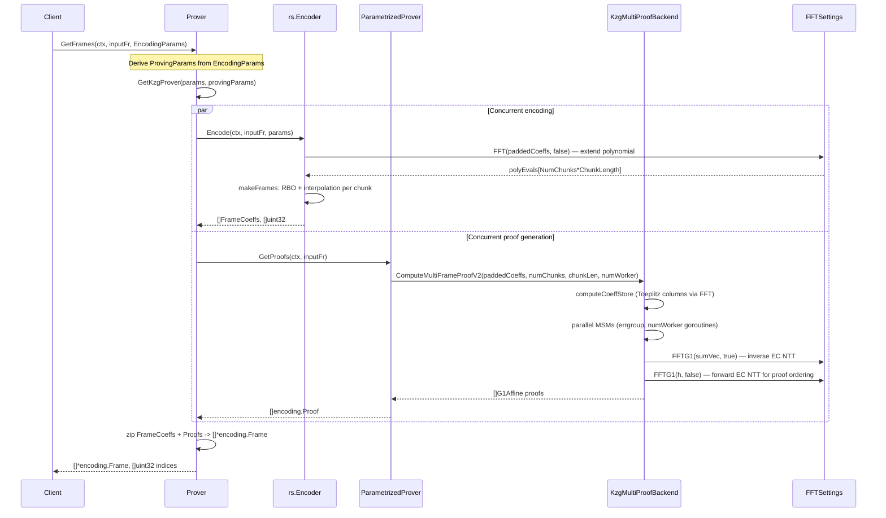
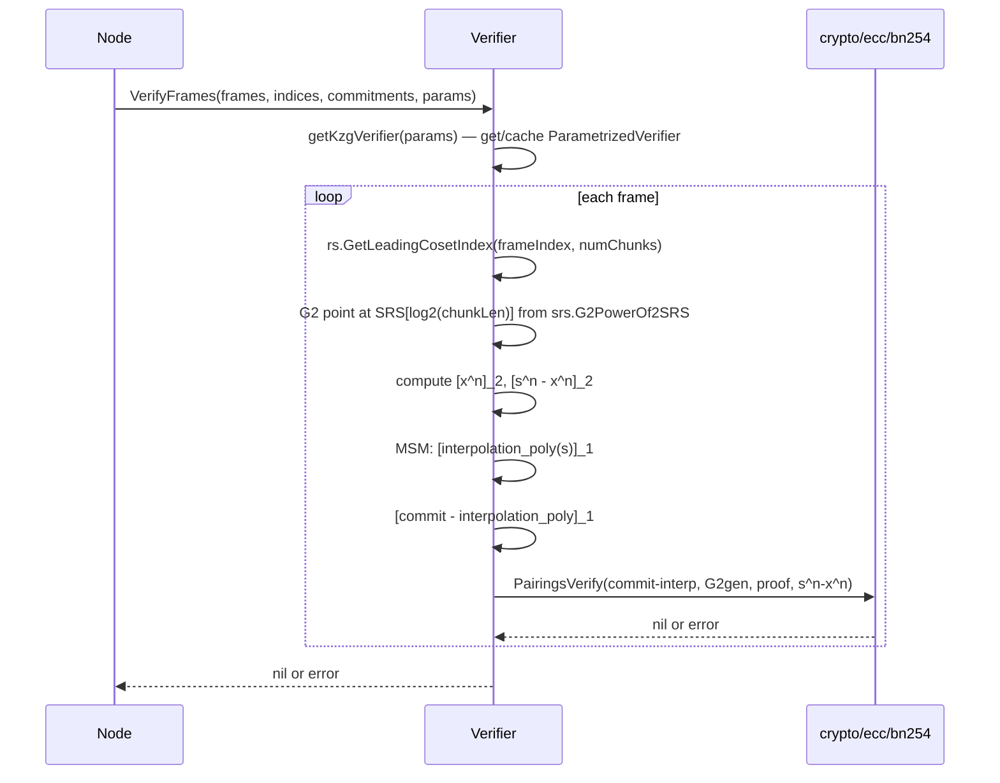
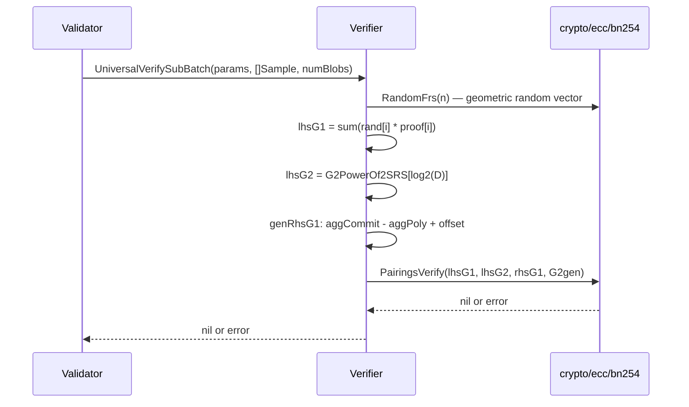
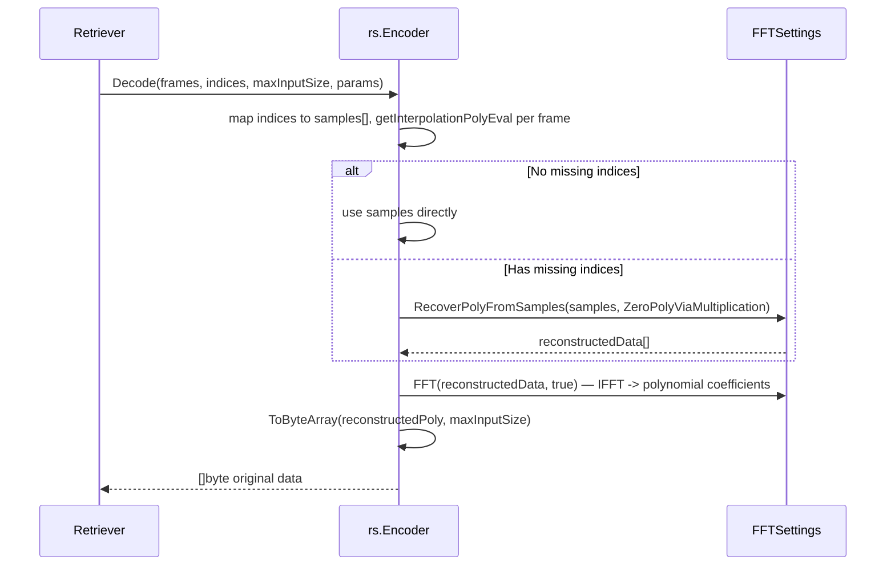

# encoding Analysis

**Analyzed by**: code-analyzer-encoding
**Timestamp**: 2026-04-10T00:00:00Z
**Application Type**: go-module
**Classification**: library
**Location**: encoding

## Architecture

The `encoding` library is a sophisticated cryptographic data-availability encoding library that underpins EigenDA's blob dispersal and verification protocol. It implements the full pipeline from raw blob bytes to dispersed, verifiable chunks using Reed-Solomon erasure coding and KZG polynomial commitments on the BN254 elliptic curve.

The library is organized in a layered architecture. At the base (`encoding/`) are the core domain types — `BlobCommitments`, `Frame`, `EncodingParams`, `Config`, and cryptographic constants — along with the `codec` subpackage that handles the field-element padding format required by BN254. Above this foundation sit two distinct versioned implementations: `v1` (legacy, kept for backwards compatibility) and `v2` (current production). Both versions share the same overall structure but v2 tightens the design: blobs must be power-of-two in length, the committer is split into its own subpackage, and the backend interface is cleaner.

Within each version the library decomposes into three main sub-systems: (1) `fft/` — a BN254-scalar-field FFT engine derived from protolambda/go-kzg, used for Reed-Solomon extension and polynomial interpolation; (2) `rs/` — Reed-Solomon encoding and decoding, using the FFT engine and exposing a pluggable backend interface; (3) `kzg/` — KZG polynomial commitment machinery split into `committer/` (G1+G2 commitments and the low-degree length proof), `prover/` (amortized FK20 multi-reveal proof generation), and `verifier/` (single-frame and universal batch verification via pairing equations).

A key architectural concern is compute-backend pluggability. The library supports two backends selectable at runtime via `encoding.Config.BackendType`:
- **GnarkBackend**: pure CPU, always available, uses gnark-crypto for MSMs and the built-in FFT engine.
- **IcicleBackend**: GPU-accelerated (CUDA or Metal) via the `ingonyama-zk/icicle` library, enabled by the `icicle` build tag.

Both backends implement the `RSEncoderBackend` and `KzgMultiProofsBackendV2` interfaces, so upper-layer code is backend-agnostic. The `DefaultConfig()` function auto-selects the icicle backend if the build tag is present, and falls back to gnark otherwise.

SRS (Structured Reference String) data — a trusted-setup file containing G1 and G2 BN254 curve points — is read from disk at startup. The library supports up to SRSOrder = 2^28 points. Precomputed SRS sub-tables (Toeplitz matrices for FK20) are written to and read from a configurable cache directory to amortize the expensive O(n log n) setup across restarts.

## Key Components

- **`encoding.BlobCommitments`** (`encoding/data.go`): Central data structure holding a blob's KZG commitment on G1, a length commitment on G2, and a G2 length proof. Implements `ToProtobuf()`/`BlobCommitmentsFromProtobuf()` for gRPC transport and `Equal()` for equivalence checking.

- **`encoding.Frame`** (`encoding/data.go`): A single chunk of erasure-coded data. Contains a G1 KZG multi-reveal `Proof` and the `Coeffs` (polynomial coefficients) for the chunk. Supports both gob and gnark binary serialization formats.

- **`encoding.EncodingParams`** (`encoding/params.go`): Describes the encoding configuration as `(ChunkLength, NumChunks)`, both required to be powers of two. Provides `NumEvaluations()`, `Validate()`, and helper constructors `ParamsFromMins`/`ParamsFromSysPar`.

- **`encoding.Config` / `DefaultConfig()`** (`encoding/backend.go`): Top-level runtime configuration. Selects backend type (gnark/icicle), worker count, GPU enable flag, and concurrent GPU frame generation limit. `DefaultConfig()` auto-detects icicle availability.

- **`fft.FFTSettings`** (`encoding/v2/fft/fft.go`, `fft_fr.go`): Precomputes roots of unity for a given scale (log2 of max width) using the BN254 scalar field. Provides `FFT()`, `InplaceFFT()`, `FFTG1()` (elliptic curve NTT), `ShiftPoly()/UnshiftPoly()`, and `RecoverPolyFromSamples()` for erasure recovery.

- **`rs.Encoder`** (`encoding/v2/rs/encoder.go`): Caches `ParametrizedEncoder` instances keyed by `EncodingParams`. Public methods: `Encode(ctx, inputFr, params)` → `([]FrameCoeffs, []uint32, error)` and `Decode(frames, indices, maxInputSize, params)` → `([]byte, error)`. Dispatches to the pluggable `RSEncoderBackend`.

- **`committer.Committer`** (`encoding/v2/kzg/committer/committer.go`): Holds G1, G2, and G2-trailing SRS arrays. Computes all three components of `BlobCommitments` via multi-scalar multiplication (MSM): G1 commitment, G2 length commitment, and G2 length proof via shifted G2 secret.

- **`prover.Prover`** (`encoding/v2/kzg/prover/prover.go`): Top-level prover. Holds the G1 SRS and a map of `ParametrizedProver` instances keyed by `ProvingParams`. `GetFrames(ctx, inputFr, params)` orchestrates concurrent RS encoding and KZG proof generation and returns `[]*encoding.Frame`.

- **`prover.ParametrizedProver`** (`encoding/v2/kzg/prover/parametrized_prover.go`): Holds pre-computed Toeplitz FFT SRS points for a specific `(ChunkLength, BlobLength)` pair. `GetProofs(ctx, inputFr)` pads the polynomial to a power of two and delegates to `KzgMultiProofsBackendV2.ComputeMultiFrameProofV2`.

- **`gnark.KzgMultiProofBackend`** (`encoding/v2/kzg/prover/backend/gnark/multiframe_proof.go`): Implements FK20 amortized multi-proof computation (CPU). Steps: (1) compute Toeplitz coefficient FFT columns, (2) parallel MSMs via errgroup, (3) inverse FFTG1, (4) forward FFTG1 for erasure-coded proof ordering.

- **`verifier.Verifier`** (`encoding/v2/kzg/verifier/verifier.go`): Verifies single frames via `VerifyFrames()` and batches via `UniversalVerifySubBatch()`. The `universalVerify()` implements the Ethereum Research universal batch verification equation using random linear combinations and a single pairing check.

- **`committer.VerifyLengthProof` / `VerifyCommitEquivalenceBatch`** (`encoding/v2/kzg/committer/verify_length_proof.go`): Two-step length proof verification: first checks `e([tau^shift]_G1, lengthCommit_G2) = e(G1, lengthProof_G2)`, then checks G1/G2 commitment equivalence via a random-linear-combination batch pairing check.

- **`kzg.ReadG1Points` / `ReadG2Points`** (`encoding/v2/kzg/pointsIO.go`): Parallel file readers for compressed BN254 SRS points. Spawn `numWorker` goroutines dispatching into `DeserializePointsInRange` for concurrent gnark deserialization.

- **`codec`** (`encoding/codec/codec.go`): Blob field-element padding layer. `PadPayload()` inserts a 0x00 MSB per 31-byte chunk to guarantee each 32-byte symbol stays within the BN254 scalar field. Inverse: `CheckAndRemoveInternalFieldElementPadding()`.

- **`kzgflags.CLIFlags`** (`encoding/kzgflags/cli.go`): Exposes all KZG/SRS configuration as `urfave/cli` flags (G1Path, G2Path, CacheDir, SRSOrder, etc.) for integration into node binaries.

- **`reverseBits`** (`encoding/utils/reverseBits/reverseBits.go`): Bit-reversal permutation utilities needed for FFT butterfly ordering. `ReverseBitsLimited`, `ReverseBitOrderFr`, used extensively in frame assembly.

## Data Flows

### 1. Blob Encoding (Disperser Path)

**Flow Description**: Transforms raw blob bytes into RS-encoded frames with KZG multi-reveal proofs for distribution to operator nodes.



**Detailed Steps**:

1. **Derive ProvingParams** (`prover.go:45-54`)
   - `blobLength = nextPowOf2(len(inputFr))`
   - `ProvingParams{ChunkLength, BlobLength}` checked against SRSOrder

2. **Concurrent RS Encoding** (`encoder.go:63-110`)
   - `padPolyEval` zero-pads `inputFr` to `NumChunks * ChunkLength` elements
   - `ExtendPolyEvalV2` performs forward FFT producing evaluations at all 2N roots of unity
   - `makeFrames` applies reverse-bit-order permutation, then for each chunk computes IFFT to interpolation polynomial coefficients

3. **Concurrent KZG Proof Generation** (`parametrized_prover.go:27-40`)
   - Input padded to power-of-two blob length
   - FK20 algorithm: Toeplitz matrix-vector product via FFT, parallel MSMs, two elliptic curve NTTs

4. **Frame Assembly** (`prover.go:208-218`)
   - Each `encoding.Frame` pairs the chunk's coefficient slice with its proof indexed by bit-reversed position

**Error Paths**:
- Blob length > SRSOrder returns `ValidateProvingParams` error
- RS encode and proof generation run concurrently; errors from both are joined with `errors.Join`
- Frame/proof count mismatch returns explicit error

---

### 2. Blob Commitment (Client/Disperser Path)

**Flow Description**: Computes `BlobCommitments` (G1 commitment + G2 length commitment + G2 length proof) from field elements.

```mermaid
sequenceDiagram
    participant Client
    participant Committer
    participant gnarkCrypto as gnark-crypto MSM

    Client->>Committer: GetCommitmentsForPaddedLength(data []byte)
    Committer->>Committer: rs.ToFrArray(data) -> []fr.Element
    Committer->>Committer: GetCommitmentsFromFieldElements(symbols)
    Committer->>Committer: computeCommitmentV2 -> G1 MSM over g1SRS[:len]
    Committer->>gnarkCrypto: G1Affine.MultiExp(g1SRS, coeffs)
    gnarkCrypto-->>Committer: G1Affine commitment
    Committer->>Committer: computeLengthCommitmentV2 -> G2 MSM over g2SRS[:len]
    Committer->>gnarkCrypto: G2Affine.MultiExp(g2SRS, coeffs)
    gnarkCrypto-->>Committer: G2Affine length commitment
    Committer->>Committer: computeLengthProofV2 -> G2 MSM over shifted g2TrailingSRS
    Note over Committer: shift = SRSOrder - blobLen; uses trailing SRS points
    Committer->>gnarkCrypto: G2Affine.MultiExp(shiftedSecret, coeffs)
    gnarkCrypto-->>Committer: G2Affine length proof
    Committer-->>Client: encoding.BlobCommitments{Commitment, LengthCommitment, LengthProof, Length}
```

**Detailed Steps**:

1. **G1 Commitment** (`committer.go:179-186`): `commitment = sum(coeffs[i] * g1SRS[i])` — standard KZG polynomial commitment.
2. **G2 Length Commitment** (`committer.go:188-195`): Same polynomial on G2: `lengthCommitment = sum(coeffs[i] * g2SRS[i])`.
3. **G2 Length Proof** (`committer.go:197-213`): Shifted secret `lengthProof = sum(coeffs[i] * g2SRS[SRSOrder - blobLen + i])`, proving polynomial degree <= blobLen-1.

---

### 3. Single Frame Verification

**Flow Description**: Verifies a received `Frame` correctly opens the blob commitment at a specific coset evaluation point.



---

### 4. Universal Batch Verification

**Flow Description**: Verifies a batch of chunks (potentially from multiple blobs) in a single pairing check using random linear combinations.



---

### 5. Erasure Recovery (Decode Path)

**Flow Description**: Reconstructs the original blob from a subset of received frames.



## Dependencies

### External Libraries

- **github.com/consensys/gnark-crypto** (v0.18.0) [crypto]: Core BN254 elliptic curve cryptography library. Provides `bn254.G1Affine`, `bn254.G2Affine`, `fr.Element`, multi-scalar multiplication (`MultiExp`), point serialization/deserialization, and `ecc.MultiExpConfig`. Used pervasively across almost all files in `encoding/v1/`, `encoding/v2/`, and `encoding/*.go`. Imported in: `encoding/data.go`, `encoding/serialization.go`, `encoding/constants.go`, `encoding/v2/fft/*.go`, `encoding/v2/kzg/**/*.go`, `encoding/v2/rs/**/*.go`.

- **github.com/ingonyama-zk/icicle/v3** (v3.9.2) [crypto]: GPU-accelerated cryptographic operations (NTT and MSM on BN254) via CUDA/Metal. Used only when built with the `icicle` build tag. Wraps device lifecycle (`runtime`), NTT configuration (`core.NTTConfig`), MSM configuration (`core.MSMConfig`), and BN254 affine point types. Imported in: `encoding/icicle/device_setup.go`, `encoding/icicle/ntt_setup.go`, `encoding/icicle/msm_setup.go`, `encoding/v2/kzg/prover/backend/icicle/multiframe_proof.go`, `encoding/v2/rs/backend/icicle/extend_poly.go`.

- **github.com/Layr-Labs/eigensdk-go** (v0.2.0-beta.1) [logging]: Provides the `logging.Logger` interface used throughout the prover, RS encoder, and SRS table components for structured telemetry (timing breakdowns, worker counts). Imported in: `encoding/v2/kzg/prover/prover.go`, `encoding/v2/kzg/prover/precompute.go`, `encoding/v2/rs/encoder.go`, `encoding/icicle/device_setup.go`.

- **go.uber.org/automaxprocs** (v1.5.2) [other]: Automatically sets `GOMAXPROCS` based on container CPU quotas. Imported as a blank side-effect import to ensure correct parallelism in containerized deployments. Imported in: `encoding/backend.go`, `encoding/v2/kzg/prover/prover.go`, `encoding/v2/kzg/verifier/verifier.go`, `encoding/v2/rs/encoder.go`.

- **golang.org/x/exp** (v0.0.0-20241009) [other]: Provides the `constraints.Integer` type constraint used in `encoding/params.go`'s `ParamsFromMins[T]` generic function. Imported in: `encoding/params.go`.

- **golang.org/x/sync** (v0.16.0) [other]: Provides `errgroup.Group` for structured concurrent goroutine management with error propagation. Used in FK20 proof computation to parallelize MSM and Toeplitz column computation with bounded concurrency. Imported in: `encoding/v2/kzg/prover/backend/gnark/multiframe_proof.go`.

- **github.com/urfave/cli** (v1.22.14) [cli]: CLI flag parsing framework. Used by `kzgflags/cli.go` to expose SRS configuration flags to parent node CLI programs. Imported in: `encoding/kzgflags/cli.go`, `encoding/v2/kzg/prover/config.go`.

- **github.com/stretchr/testify** (v1.11.1) [testing]: Assertion and test suite library used in all test files. Imported in: `encoding/serialization_test.go`, `encoding/v2/fft/*_test.go`, `encoding/v2/kzg/**/*_test.go`, `encoding/v2/rs/*_test.go`.

### Internal Libraries

- **github.com/Layr-Labs/eigenda/crypto/ecc/bn254** (`crypto/ecc/bn254`): Used in the verifier for `eigenbn254.PairingsVerify(a1, a2, b1, b2)` — the core BN254 pairing check for all KZG verification equations — and `eigenbn254.RandomFrs(n)` for geometric random vectors in batch verification and commitment equivalence checks. Imported in `encoding/v2/kzg/verifier/verifier.go`, `encoding/v2/kzg/verifier/parametrized_verifier.go`, and `encoding/v2/kzg/committer/verify_length_proof.go`.

- **github.com/Layr-Labs/eigenda/common/math** (`common/math`): Provides `math.IsPowerOfTwo`, `math.NextPowOf2u64`, `math.NextPowOf2u32`, and `math.RoundUpDivide`. Used throughout `encoding/params.go`, `encoding/utils.go`, `encoding/v2/fft/fft_fr.go`, and `encoding/v2/kzg/committer/committer.go` for power-of-two constraint validation and blob size arithmetic.

- **github.com/Layr-Labs/eigenda/api/grpc/common** (`api/grpc/common`): Provides the `pbcommon.BlobCommitment` protobuf type. Used in `encoding/data.go` for `BlobCommitments.ToProtobuf()` and `BlobCommitmentsFromProtobuf()` to convert between the domain type and the wire format used in gRPC calls.

- **github.com/Layr-Labs/eigenda/resources/srs** (`resources/srs`): Provides embedded G2 and G1 SRS data: `srs.G2PowerOf2SRS` (28 precomputed G2 points at powers of 2, embedded in the binary) and `srs.G1ReversePowerOf2SRS` (28 G1 points for length proof verification). Used in `encoding/v2/kzg/verifier/parametrized_verifier.go` and `encoding/v2/kzg/committer/verify_length_proof.go` to avoid requiring a full G2 SRS file for verification.

## API Surface

### Exported Types (package `encoding`)

```go
// Cryptographic group elements
type G1Commitment bn254.G1Affine
type G2Commitment bn254.G2Affine
type LengthProof = G2Commitment
type Proof = bn254.G1Affine
type Symbol = fr.Element

// Core blob metadata
type BlobCommitments struct {
    Commitment       *G1Commitment
    Length           uint32
    LengthCommitment *G2Commitment
    LengthProof      *LengthProof
}

// A single dispersal chunk
type Frame struct {
    Proof  Proof
    Coeffs []Symbol
}

// Encoding configuration (parameters per blob)
type EncodingParams struct {
    ChunkLength uint64
    NumChunks   uint64
}

// Runtime backend configuration
type Config struct {
    NumWorker                             uint64
    BackendType                           BackendType
    GPUEnable                             bool
    GPUConcurrentFrameGenerationDangerous int64
}

// Batch verification inputs
type Sample struct {
    Commitment      *G1Commitment
    Chunk           *Frame
    AssignmentIndex ChunkNumber
    BlobIndex       int
}
```

### Key Exported Functions (package `encoding`)

```go
func ParamsFromMins[T constraints.Integer](minChunkLength, minNumChunks T) EncodingParams
func ParamsFromSysPar(numSys, numPar, dataSize uint64) EncodingParams
func ValidateEncodingParams(params EncodingParams, SRSOrder uint64) error
func ValidateEncodingParamsAndBlobLength(params EncodingParams, blobLength, SRSOrder uint64) error
func GetBlobLength(blobSize uint32) uint32
func GetBlobLengthPowerOf2(blobSize uint32) uint32
func GetBlobSize(blobLength uint32) uint32
func GetEncodedBlobLength(blobLength uint32, quorumThreshold, advThreshold uint8) uint32
func (c *BlobCommitments) ToProtobuf() (*pbcommon.BlobCommitment, error)
func BlobCommitmentsFromProtobuf(c *pbcommon.BlobCommitment) (*BlobCommitments, error)
func (c *BlobCommitments) Equal(c1 *BlobCommitments) error
func (f *Frame) SerializeGnark() ([]byte, error)
func (f *Frame) DeserializeGnark(data []byte) (*Frame, error)
func SerializeFrameProofs(proofs []*Proof) ([]byte, error)
func DeserializeFrameProofs(bytes []byte) ([]*Proof, error)
func DefaultConfig() *Config
func ParseBackendType(backend string) (BackendType, error)

const BYTES_PER_SYMBOL = 32
const SRSOrder = 1 << 28
var Scale2RootOfUnity []fr.Element
```

### Exported Types (package `encoding/v2/kzg/committer`)

```go
type Committer struct { /* unexported SRS fields */ }
func New(g1SRS []bn254.G1Affine, g2SRS []bn254.G2Affine, g2TrailingSRS []bn254.G2Affine) (*Committer, error)
func NewFromConfig(config Config) (*Committer, error)
func (c *Committer) GetCommitmentsForPaddedLength(data []byte) (encoding.BlobCommitments, error)
func (c *Committer) GetCommitmentsFromFieldElements(symbols []fr.Element) (encoding.BlobCommitments, error)
func (c *Committer) GetCommitments(inputFr []fr.Element) (*bn254.G1Affine, *bn254.G2Affine, *bn254.G2Affine, error)
func VerifyLengthProof(commitments encoding.BlobCommitments) error
func VerifyCommitEquivalenceBatch(commitments []encoding.BlobCommitments) error
```

### Exported Types (package `encoding/v2/kzg/prover`)

```go
type Prover struct {
    KzgConfig           *KzgConfig
    G1SRS               []bn254.G1Affine
    Config              *encoding.Config
    ParametrizedProvers map[ProvingParams]*ParametrizedProver
    SRSTables           map[ProvingParams][][]bn254.G1Affine
}
func NewProver(logger logging.Logger, kzgConfig *KzgConfig, encoderConfig *encoding.Config) (*Prover, error)
func (e *Prover) GetFrames(ctx context.Context, inputFr []fr.Element, params encoding.EncodingParams) ([]*encoding.Frame, []uint32, error)

type KzgConfig struct {
    SRSNumberToLoad uint64
    G1Path          string
    PreloadEncoder  bool
    CacheDir        string
    NumWorker       uint64
}
func KzgConfigFromV1Config(v1 *kzgv1.KzgConfig) *KzgConfig
func ReadCLIConfig(ctx *cli.Context) KzgConfig
```

### Exported Types (package `encoding/v2/kzg/verifier`)

```go
type Verifier struct {
    G1SRS                 []bn254.G1Affine
    ParametrizedVerifiers map[encoding.EncodingParams]*ParametrizedVerifier
}
func NewVerifier(config *Config) (*Verifier, error)
func NewVerifierWithSRS(g1SRS []bn254.G1Affine) *Verifier
func (v *Verifier) VerifyFrames(frames []*encoding.Frame, indices []encoding.ChunkNumber, commitments encoding.BlobCommitments, params encoding.EncodingParams) error
func (v *Verifier) UniversalVerifySubBatch(params encoding.EncodingParams, samplesCore []encoding.Sample, numBlobs int) error
```

### Exported Types (package `encoding/v2/rs`)

```go
type Encoder struct { /* unexported fields */ }
func NewEncoder(logger logging.Logger, config *encoding.Config) (*Encoder, error)
func (g *Encoder) Encode(ctx context.Context, inputFr []fr.Element, params encoding.EncodingParams) ([]FrameCoeffs, []uint32, error)
func (g *Encoder) EncodeBytes(ctx context.Context, inputBytes []byte, params encoding.EncodingParams) ([]FrameCoeffs, []uint32, error)
func (g *Encoder) Decode(frames []FrameCoeffs, indices []encoding.ChunkNumber, maxInputSize uint64, params encoding.EncodingParams) ([]byte, error)

type FrameCoeffs []fr.Element
func SerializeFrameCoeffsSlice(coeffs []FrameCoeffs) ([]byte, error)
func DeserializeFrameCoeffsSlice(serializedData []byte) ([]FrameCoeffs, error)
func ToFrArray(inputData []byte) ([]fr.Element, error)
func ToByteArray(dataFr []fr.Element, maxDataSize uint64) []byte
func GetLeadingCosetIndex(i encoding.ChunkNumber, numChunks encoding.ChunkNumber) (uint32, error)
```

### Exported Types (package `encoding/codec`)

```go
func PadPayload(inputData []byte) []byte
func CheckAndRemoveInternalFieldElementPadding(paddedData []byte) ([]byte, error)
func ConvertByPaddingEmptyByte(data []byte) []byte
func RemoveEmptyByteFromPaddedBytes(data []byte) []byte
func PayloadSizeToBlobSize(payloadSize uint32) uint32
func FindLegalBlobSizes(minBlobSize uint32, maxBlobSize uint32) ([]uint32, error)
func BlobSymbolsToMaxPayloadSize(blobLengthSymbols uint32) (uint32, error)
func BlobSizeToMaxPayloadSize(blobLengthBytes uint32) (uint32, error)
func BlobSizeToMinPayloadSize(blobSize uint32) (uint32, error)
```

## Code Examples

### Example 1: Encoding a Blob and Generating Frames

```go
// encoding/v2/kzg/prover/prover.go
prover, _ := prover.NewProver(logger, &prover.KzgConfig{
    G1Path:          "/path/to/g1.point",
    SRSNumberToLoad: 1 << 20,
    CacheDir:        "/path/to/cache",
    NumWorker:       8,
}, encoding.DefaultConfig())

params := encoding.EncodingParams{NumChunks: 64, ChunkLength: 32}
frames, indices, err := prover.GetFrames(ctx, inputFr, params)
// frames[i].Coeffs = chunk polynomial coefficients; frames[i].Proof = KZG multi-reveal proof
```

### Example 2: Computing BlobCommitments

```go
// encoding/v2/kzg/committer/committer.go
c, _ := committer.NewFromConfig(committer.Config{
    G1SRSPath:       "/path/to/g1.point",
    G2SRSPath:       "/path/to/g2.point",
    SRSNumberToLoad: 1 << 20,
})
// paddedData: blob bytes with 0x00 prepended to each 31-byte chunk
commitments, _ := c.GetCommitmentsForPaddedLength(paddedData)
// commitments.Commitment  -> 48-byte compressed G1 KZG commitment
// commitments.LengthCommitment -> G2 length commitment
// commitments.LengthProof -> G2 low-degree proof
```

### Example 3: Universal Batch Verification

```go
// encoding/v2/kzg/verifier/verifier.go
v, _ := verifier.NewVerifier(&verifier.Config{
    G1Path:          "/path/to/g1.point",
    SRSNumberToLoad: 1 << 20,
    NumWorker:       8,
})
samples := []encoding.Sample{
    {Commitment: commitments.Commitment, Chunk: frame, AssignmentIndex: 3, BlobIndex: 0},
}
err := v.UniversalVerifySubBatch(params, samples, numBlobs)
```

### Example 4: FK20 Amortized Proof Algorithm (CPU Backend)

```go
// encoding/v2/kzg/prover/backend/gnark/multiframe_proof.go
// ComputeMultiFrameProofV2 implements FK20:
// 1. computeCoeffStore: Toeplitz column DFT (O(n log n) per column)
// 2. parallel MSMs: errgroup with numWorker goroutines
// 3. inverse FFTG1 on sumVec: evaluation -> coefficient domain
// 4. forward FFTG1 on h: erasure-codes proof for all chunks
proofs, err := backend.ComputeMultiFrameProofV2(ctx, paddedCoeffs, numChunks, chunkLen, numWorker)
```

### Example 5: BN254 Field Element Padding

```go
// encoding/codec/codec.go
// PadPayload guarantees bn254 field element validity:
// Input:  [b0..b30, b31..b61, ...]  (31-byte chunks)
// Output: [0x00, b0..b30, 0x00, b31..b61, ...]  (32-byte symbols)
padded := codec.PadPayload(rawPayload)
unpadded, err := codec.CheckAndRemoveInternalFieldElementPadding(padded)
```

### Example 6: Erasure Recovery via Zero Polynomial Method

```go
// encoding/v2/fft/recover_from_samples.go
// RecoverPolyFromSamples recovers a polynomial from partial evaluations:
// 1. Build zero polynomial over missing indices
// 2. Multiply available evaluations by zero polynomial
// 3. Shift, FFT, divide in evaluation domain, IFFT, unshift
reconstructed, err := fs.RecoverPolyFromSamples(samples, fs.ZeroPolyViaMultiplication)
```

## Files Analyzed

- `encoding/data.go` (185 lines) - Core domain types: BlobCommitments, Frame, Sample, SubBatch
- `encoding/params.go` (97 lines) - EncodingParams and validation helpers
- `encoding/backend.go` (97 lines) - Config, BackendType, DefaultConfig
- `encoding/constants.go` (69 lines) - BYTES_PER_SYMBOL, SRSOrder, Scale2RootOfUnity initialization
- `encoding/serialization.go` (221 lines) - Frame/Commitment binary serialization
- `encoding/utils.go` (26 lines) - Blob size arithmetic utilities
- `encoding/codec/codec.go` (329 lines) - Field element padding for BN254 validity
- `encoding/kzgflags/cli.go` (99 lines) - CLI flags for KZG configuration
- `encoding/icicle/device_setup.go` (139 lines) - IcicleDevice initialization
- `encoding/utils/reverseBits/reverseBits.go` (133 lines) - Bit-reversal permutation utilities
- `encoding/v2/fft/fft.go` (90 lines) - FFTSettings struct and NewFFTSettings
- `encoding/v2/fft/fft_fr.go` (189 lines) - Scalar field FFT implementation
- `encoding/v2/fft/recover_from_samples.go` (155 lines) - Erasure recovery via zero polynomial
- `encoding/v2/kzg/constants.go` (41 lines) - GenG1, GenG2, ZeroG1, ZeroG2 initialization
- `encoding/v2/kzg/pointsIO.go` (239 lines) - Parallel G1/G2 SRS file I/O
- `encoding/v2/kzg/committer/committer.go` (215 lines) - BlobCommitments computation
- `encoding/v2/kzg/committer/verify_length_proof.go` (123 lines) - Length proof verification
- `encoding/v2/kzg/prover/config.go` (57 lines) - KzgConfig and CLI config reader
- `encoding/v2/kzg/prover/prover.go` (385 lines) - Top-level prover with SRS table management
- `encoding/v2/kzg/prover/parametrized_prover.go` (41 lines) - Per-(ChunkLength,BlobLength) prover
- `encoding/v2/kzg/prover/precompute.go` (344 lines) - SRS table precomputation and cache management
- `encoding/v2/kzg/prover/backend/proof_backend.go` (31 lines) - KzgMultiProofsBackendV2 interface
- `encoding/v2/kzg/prover/backend/gnark/multiframe_proof.go` (204 lines) - FK20 CPU backend
- `encoding/v2/kzg/verifier/verifier.go` (358 lines) - Universal batch verifier
- `encoding/v2/kzg/verifier/parametrized_verifier.go` (91 lines) - Single frame verifier
- `encoding/v2/rs/backend/rs_backend.go` (21 lines) - RSEncoderBackend interface
- `encoding/v2/rs/backend/gnark/extend_poly.go` (30 lines) - Gnark RS extension via FFT
- `encoding/v2/rs/encoder.go` (270 lines) - RS Encoder with concurrent Encode/Decode
- `encoding/v2/rs/parametrized_encoder.go` (207 lines) - Per-EncodingParams encoder
- `encoding/v2/rs/frame_coeffs.go` (131 lines) - FrameCoeffs type and binary serialization
- `encoding/v2/rs/utils.go` (104 lines) - ToFrArray, ToByteArray, GetLeadingCosetIndex

## Analysis Data

```json
{
  "summary": "The encoding library is EigenDA's core blob encoding and data-availability sampling engine. It implements Reed-Solomon erasure coding and KZG polynomial commitments on the BN254 elliptic curve, following the FK20 amortized multi-proof algorithm for O(n log n) proof generation. The library has two versioned implementations (v1 legacy, v2 current), a pluggable compute backend (gnark CPU / icicle GPU), and exposes domain types (BlobCommitments, Frame, EncodingParams) used throughout the EigenDA system. Key capabilities: blob commitment generation, RS encoding/decoding, KZG multi-reveal proof generation, single-frame verification, and universal batch verification for data-availability sampling.",
  "architecture_pattern": "layered library with pluggable strategy pattern for compute backends",
  "key_modules": [
    "encoding (root) — domain types, constants, config, codec",
    "encoding/v2/fft — BN254 scalar field and G1 FFT engine",
    "encoding/v2/rs — Reed-Solomon encoder/decoder with backend interface",
    "encoding/v2/kzg/committer — KZG commitment and length proof generation",
    "encoding/v2/kzg/prover — FK20 amortized multi-proof generation",
    "encoding/v2/kzg/verifier — single-frame and universal batch verification",
    "encoding/icicle — GPU device setup (icicle build tag)",
    "encoding/utils/reverseBits — bit-reversal permutation utilities",
    "encoding/codec — field-element padding for BN254 validity",
    "encoding/kzgflags — CLI flags for KZG/SRS configuration"
  ],
  "api_endpoints": [],
  "data_flows": [
    "Blob encoding: inputFr -> RS extension (FFT) -> FrameCoeffs per chunk",
    "Proof generation: inputFr -> FK20 (Toeplitz FFT + MSM + EC NTT) -> Proof per chunk",
    "Frame assembly: FrameCoeffs + Proofs -> []*encoding.Frame",
    "Commitment computation: []fr.Element -> MSM on G1/G2 SRS -> BlobCommitments",
    "Single frame verification: Frame + Commitment -> KZG pairing equation check",
    "Universal batch verification: []Sample -> random aggregation -> single pairing check",
    "Erasure recovery: partial FrameCoeffs + indices -> zero polynomial recovery -> IFFT -> []byte"
  ],
  "tech_stack": [
    "go",
    "bn254",
    "kzg",
    "fk20",
    "reed-solomon",
    "gnark-crypto",
    "icicle-gpu",
    "ntt",
    "msm"
  ],
  "external_integrations": [],
  "component_interactions": [
    {
      "target": "crypto/ecc/bn254",
      "type": "library_usage",
      "description": "Uses PairingsVerify() for KZG pairing equation verification (both single-frame and universal batch), and RandomFrs() for random linear combination vectors in batch verification and commitment equivalence checks"
    },
    {
      "target": "common/math",
      "type": "library_usage",
      "description": "Uses IsPowerOfTwo, NextPowOf2u64/u32, RoundUpDivide for power-of-two constraint validation and blob size arithmetic throughout params, fft, and committer"
    },
    {
      "target": "api/grpc/common",
      "type": "library_usage",
      "description": "Uses pbcommon.BlobCommitment protobuf type for ToProtobuf() and BlobCommitmentsFromProtobuf() serialization in encoding/data.go"
    },
    {
      "target": "resources/srs",
      "type": "library_usage",
      "description": "Uses embedded G2PowerOf2SRS (28 precomputed G2 points) and G1ReversePowerOf2SRS (28 G1 points) for single-frame and length proof verification without loading the full SRS file"
    }
  ]
}
```

## Citations

```json
[
  {
    "file_path": "encoding/data.go",
    "start_line": 13,
    "end_line": 25,
    "claim": "G1Commitment and G2Commitment are type aliases over bn254.G1Affine and G2Affine; Proof is a type alias for bn254.G1Affine; Symbol is fr.Element",
    "section": "Key Components",
    "snippet": "type G1Commitment bn254.G1Affine\ntype G2Commitment bn254.G2Affine\ntype LengthProof = G2Commitment\ntype Proof = bn254.G1Affine\ntype Symbol = fr.Element"
  },
  {
    "file_path": "encoding/data.go",
    "start_line": 29,
    "end_line": 47,
    "claim": "BlobCommitments holds G1 commitment, length (power-of-2 in symbols), G2 length commitment, and G2 length proof to prove the low-degree constraint",
    "section": "Key Components",
    "snippet": "type BlobCommitments struct {\n\tCommitment *G1Commitment\n\tLength uint32\n\tLengthCommitment *G2Commitment\n\tLengthProof *LengthProof\n}"
  },
  {
    "file_path": "encoding/data.go",
    "start_line": 147,
    "end_line": 153,
    "claim": "Frame is a single erasure-coded chunk consisting of a KZG multi-reveal Proof and polynomial Coefficients",
    "section": "Key Components",
    "snippet": "type Frame struct {\n\tProof Proof\n\tCoeffs []Symbol\n}"
  },
  {
    "file_path": "encoding/backend.go",
    "start_line": 12,
    "end_line": 20,
    "claim": "The library supports two compute backends: GnarkBackend (CPU-only, default) and IcicleBackend (GPU-accelerated)",
    "section": "Architecture",
    "snippet": "const (\n\tGnarkBackend BackendType = \"gnark\"\n\tIcicleBackend BackendType = \"icicle\"\n)"
  },
  {
    "file_path": "encoding/backend.go",
    "start_line": 69,
    "end_line": 84,
    "claim": "DefaultConfig() auto-selects IcicleBackend if the icicle build tag is present, falling back to GnarkBackend",
    "section": "Architecture",
    "snippet": "func DefaultConfig() *Config {\n\tif icicle.IsAvailable {\n\t\treturn &Config{...BackendType: IcicleBackend, GPUEnable: true...}\n\t}\n\treturn &Config{...BackendType: GnarkBackend...}\n}"
  },
  {
    "file_path": "encoding/constants.go",
    "start_line": 11,
    "end_line": 13,
    "claim": "BYTES_PER_SYMBOL is 32 (BN254 field element size); SRSOrder is 2^28, the maximum supported blob length in field elements",
    "section": "Key Components",
    "snippet": "const (\n\tBYTES_PER_SYMBOL = 32\n\tSRSOrder = 1 << 28\n)"
  },
  {
    "file_path": "encoding/params.go",
    "start_line": 12,
    "end_line": 30,
    "claim": "EncodingParams requires both NumChunks and ChunkLength to be powers of two, validated by Validate()",
    "section": "Key Components",
    "snippet": "type EncodingParams struct {\n\tChunkLength uint64\n\tNumChunks uint64\n}\nfunc (p EncodingParams) Validate() error {\n\tif !math.IsPowerOfTwo(p.NumChunks) {...}\n\tif !math.IsPowerOfTwo(p.ChunkLength) {...}\n}"
  },
  {
    "file_path": "encoding/v2/fft/fft.go",
    "start_line": 36,
    "end_line": 68,
    "claim": "FFTSettings precomputes forward and reverse roots of unity for a given scale using the BN254 scalar field's Scale2RootOfUnity table",
    "section": "Key Components",
    "snippet": "type FFTSettings struct {\n\tMaxWidth uint64\n\tRootOfUnity *fr.Element\n\tExpandedRootsOfUnity []fr.Element\n\tReverseRootsOfUnity []fr.Element\n}"
  },
  {
    "file_path": "encoding/v2/rs/encoder.go",
    "start_line": 63,
    "end_line": 110,
    "claim": "Encoder.Encode() pads the polynomial, calls ExtendPolyEvalV2 (FFT), then makeFrames to produce per-chunk interpolation polynomial coefficients",
    "section": "Data Flows",
    "snippet": "pdCoeffs, err := encoder.padPolyEval(inputFr)\npolyEvals, err := encoder.rsEncoderBackend.ExtendPolyEvalV2(ctx, pdCoeffs)\nframes, indices, err := encoder.makeFrames(polyEvals)"
  },
  {
    "file_path": "encoding/v2/rs/encoder.go",
    "start_line": 234,
    "end_line": 258,
    "claim": "The RS encoder dispatches to the gnark or icicle backend based on Config.BackendType, both implementing the RSEncoderBackend interface",
    "section": "Architecture",
    "snippet": "switch e.Config.BackendType {\ncase encoding.GnarkBackend:\n\trsEncoderBackend = gnark.NewRSBackend(fs)\ncase encoding.IcicleBackend:\n\trsEncoderBackend, err = icicle.BuildRSBackend(...)\n}"
  },
  {
    "file_path": "encoding/v2/rs/backend/gnark/extend_poly.go",
    "start_line": 22,
    "end_line": 29,
    "claim": "The gnark RS backend extends the polynomial by a single forward FFT over the full NumEvaluations domain",
    "section": "Data Flows",
    "snippet": "func (g *RSBackend) ExtendPolyEvalV2(ctx context.Context, coeffs []fr.Element) ([]fr.Element, error) {\n\tevals, err := g.Fs.FFT(coeffs, false)\n\treturn evals, err\n}"
  },
  {
    "file_path": "encoding/v2/kzg/committer/committer.go",
    "start_line": 179,
    "end_line": 213,
    "claim": "BlobCommitments are computed via three sequential MSMs: G1 MSM (commitment), G2 MSM (length commitment), G2 MSM over shifted trailing SRS (length proof)",
    "section": "Data Flows",
    "snippet": "commitment.MultiExp(c.g1SRS[:len(coeffs)], coeffs, ecc.MultiExpConfig{})\nlengthCommitment.MultiExp(c.g2SRS[:len(coeffs)], coeffs, ecc.MultiExpConfig{})\nlengthProof.MultiExp(shiftedSecret, coeffs, ecc.MultiExpConfig{})"
  },
  {
    "file_path": "encoding/v2/kzg/committer/committer.go",
    "start_line": 197,
    "end_line": 213,
    "claim": "The length proof uses trailing G2 SRS points starting at SRSOrder-blobLen, proving polynomial degree is at most blobLen-1",
    "section": "Data Flows",
    "snippet": "blobLen := math.NextPowOf2u32(uint32(len(coeffs)))\nstart := uint32(len(c.g2TrailingSRS)) - blobLen\nshiftedSecret := c.g2TrailingSRS[start : start+uint32(len(coeffs))]"
  },
  {
    "file_path": "encoding/v2/kzg/prover/prover.go",
    "start_line": 152,
    "end_line": 218,
    "claim": "GetFrames launches RS encoding and KZG proof generation concurrently in separate goroutines, then zips results into []*encoding.Frame",
    "section": "Data Flows",
    "snippet": "go func() {\n\tframes, indices, err := e.encoder.Encode(ctx, inputFr, params)\n\tencodeChan <- ...\n}()\nproofs, err := prover.GetProofs(ctx, inputFr)\nencodeResult := <-encodeChan"
  },
  {
    "file_path": "encoding/v2/kzg/prover/prover.go",
    "start_line": 266,
    "end_line": 291,
    "claim": "Prover.newProver() dispatches to gnark or icicle KzgMultiProofsBackendV2 based on Config.BackendType",
    "section": "Architecture",
    "snippet": "switch p.Config.BackendType {\ncase encoding.GnarkBackend:\n\tmultiproofsBackend = gnark.NewMultiProofBackend(...)\ncase encoding.IcicleBackend:\n\tmultiproofsBackend, err = icicle.NewMultiProofBackend(...)\n}"
  },
  {
    "file_path": "encoding/v2/kzg/prover/backend/gnark/multiframe_proof.go",
    "start_line": 52,
    "end_line": 132,
    "claim": "ComputeMultiFrameProofV2 implements FK20 amortized proof: Toeplitz DFT, parallel MSMs via errgroup, inverse EC NTT, then forward EC NTT for per-chunk proofs",
    "section": "Data Flows",
    "snippet": "coeffStore, err := p.computeCoeffStore(polyFr, numWorker, l, toeplitzMatrixLen)\n_, err := sumVec[i].MultiExp(p.FFTPointsT[i], coeffStore[i], ecc.MultiExpConfig{})\nsumVecInv, err := p.Fs.FFTG1(sumVec, true)\nproofs, err := p.Fs.FFTG1(h, false)"
  },
  {
    "file_path": "encoding/v2/kzg/prover/backend/proof_backend.go",
    "start_line": 15,
    "end_line": 20,
    "claim": "KzgMultiProofsBackendV2 is the interface both gnark and icicle backends implement, requiring ComputeMultiFrameProofV2",
    "section": "Architecture",
    "snippet": "type KzgMultiProofsBackendV2 interface {\n\tComputeMultiFrameProofV2(\n\t\tctx context.Context, blobFr []fr.Element, numChunks, chunkLen, numWorker uint64,\n\t) ([]bn254.G1Affine, error)\n}"
  },
  {
    "file_path": "encoding/v2/kzg/verifier/verifier.go",
    "start_line": 285,
    "end_line": 357,
    "claim": "universalVerify implements the Ethereum Research universal batch verification equation using random linear combinations and a single pairing check",
    "section": "Data Flows",
    "snippet": "randomsFr, err := eigenbn254.RandomFrs(n)\n_, err = lhsG1.MultiExp(proofs, randomsFr, ecc.MultiExpConfig{})\nG2atD := srs.G2PowerOf2SRS[exponent]\nerr = eigenbn254.PairingsVerify(&lhsG1, lhsG2, rhsG1, rhsG2)"
  },
  {
    "file_path": "encoding/v2/kzg/verifier/parametrized_verifier.go",
    "start_line": 44,
    "end_line": 90,
    "claim": "Single-frame verification checks the KZG opening equation e(commit-interpoly, G2) = e(proof, [s^n - x^n]_2) via PairingsVerify",
    "section": "Data Flows",
    "snippet": "xnMinusYn.Sub(g2Atn, &xn2)\n_, err := is1.MultiExp(g1SRS[:len(frame.Coeffs)], frame.Coeffs, config)\ncommitMinusInterpolation.Sub(commitment, &is1)\nerr = eigenbn254.PairingsVerify(&commitMinusInterpolation, &kzg.GenG2, &frame.Proof, &xnMinusYn)"
  },
  {
    "file_path": "encoding/v2/kzg/committer/verify_length_proof.go",
    "start_line": 29,
    "end_line": 63,
    "claim": "Length proof verification checks e([tau^shift]_G1, lengthCommit_G2) = e(G1, lengthProof_G2) using G1ReversePowerOf2SRS embedded points",
    "section": "Data Flows",
    "snippet": "g1Challenge := srs.G1ReversePowerOf2SRS[commitmentLengthLog]\nerr := eigenbn254.PairingsVerify(&g1Challenge, lengthCommit, &kzg.GenG1, lengthProof)"
  },
  {
    "file_path": "encoding/v2/kzg/committer/verify_length_proof.go",
    "start_line": 87,
    "end_line": 122,
    "claim": "VerifyCommitEquivalenceBatch uses random MSMs and a pairing check to batch-verify G1 and G2 commitments represent the same polynomial",
    "section": "Data Flows",
    "snippet": "randomsFr, err := eigenbn254.RandomFrs(len(g1commits))\n_, err = lhsG1.MultiExp(g1commits, randomsFr, ...)\n_, err = rhsG2.MultiExp(g2commits, randomsFr, ...)\nerr = eigenbn254.PairingsVerify(&lhsG1, lhsG2, rhsG1, &rhsG2)"
  },
  {
    "file_path": "encoding/v2/rs/encoder.go",
    "start_line": 129,
    "end_line": 205,
    "claim": "Decode recovers original data by placing available evaluations in a sample array, calling RecoverPolyFromSamples for missing indices, then IFFT",
    "section": "Data Flows",
    "snippet": "reconstructedData, err = g.Fs.RecoverPolyFromSamples(\n\tsamples,\n\tg.Fs.ZeroPolyViaMultiplication,\n)\nreconstructedPoly, err := g.Fs.FFT(reconstructedData, true)"
  },
  {
    "file_path": "encoding/v2/fft/recover_from_samples.go",
    "start_line": 79,
    "end_line": 154,
    "claim": "RecoverPolyFromSamples implements the zero-polynomial FFT recovery method: multiply by zero poly, shift, FFT, divide, IFFT, unshift",
    "section": "Data Flows",
    "snippet": "polyEvaluationsWithZero[i].Mul(s, &zeroEval[i])\npolyWithZero, err := fs.FFT(polyEvaluationsWithZero, true)\nfs.ShiftPoly(polyWithZero)\nevalShiftedReconstructedPoly[i].Div(&evalShiftedPolyWithZero[i], &evalShiftedZeroPoly[i])\nfs.UnshiftPoly(shiftedReconstructedPoly)"
  },
  {
    "file_path": "encoding/v2/kzg/pointsIO.go",
    "start_line": 120,
    "end_line": 182,
    "claim": "SRS file I/O uses parallel goroutines (readPointSection with numWorker) to deserialize compressed BN254 points from binary files",
    "section": "Key Components",
    "snippet": "for workerIndex := uint64(0); workerIndex < numWorker; workerIndex++ {\n\tgo DeserializePointsInRange(buf, points, startPoint, endPoint, pointSizeBytes, results)\n}"
  },
  {
    "file_path": "encoding/v2/kzg/prover/precompute.go",
    "start_line": 38,
    "end_line": 82,
    "claim": "SRSTable.GetSubTables generates Toeplitz FFT sub-tables on cache miss (writes to disk) and reads from disk on cache hit",
    "section": "Key Components",
    "snippet": "if table, ok := p.Tables[param]; !ok {\n\tfftPoints := p.precompute(dim, dimE, cosetSize, m, dstFilePath, p.NumWorker)\n} else {\n\tfftPoints, err := p.TableReaderThreads(table.FilePath, dimE, cosetSize, p.NumWorker)\n}"
  },
  {
    "file_path": "encoding/codec/codec.go",
    "start_line": 95,
    "end_line": 121,
    "claim": "PadPayload prepends a 0x00 byte to each 31-byte chunk guaranteeing every 32-byte symbol is a valid BN254 scalar field element",
    "section": "Key Components",
    "snippet": "paddedOutput[zeroByteIndex] = 0x00\ncopy(paddedOutput[destIndex:destIndex+bytesPerChunk], prePaddedPayload[srcIndex:srcIndex+bytesPerChunk])"
  },
  {
    "file_path": "encoding/v2/rs/parametrized_encoder.go",
    "start_line": 40,
    "end_line": 93,
    "claim": "makeFrames applies reverse-bit-order permutation to extended evaluations then spawns worker goroutines to compute chunk interpolation polynomial coefficients via IFFT",
    "section": "Data Flows",
    "snippet": "err := rb.ReverseBitOrderFr(polyEvals)\nfor w := uint64(0); w < numWorker; w++ {\n\tgo g.interpolyWorker(polyEvals, jobChan, results, frames)\n}"
  },
  {
    "file_path": "encoding/kzgflags/cli.go",
    "start_line": 28,
    "end_line": 98,
    "claim": "CLIFlags exposes G1Path, G2Path, G2TrailingPath, CacheDir, SRSOrder, SRSLoad, NumWorkers as urfave/cli flags with environment variable overrides",
    "section": "API Surface",
    "snippet": "func CLIFlags(envPrefix string) []cli.Flag {\n\treturn []cli.Flag{\n\t\tcli.StringFlag{Name: G1PathFlagName, Required: true},\n\t\tcli.Uint64Flag{Name: SRSOrderFlagName, Required: true},\n\t\t...\n\t}\n}"
  },
  {
    "file_path": "encoding/icicle/device_setup.go",
    "start_line": 44,
    "end_line": 101,
    "claim": "NewIcicleDevice initializes GPU or CPU device via icicle runtime, sets up NTT and optionally MSM configuration in a goroutine pinned to the device",
    "section": "Architecture",
    "snippet": "runtime.RunOnDevice(&device, func(args ...any) {\n\tnttCfg, icicleErr = SetupNTT(config.NTTSize)\n\tflatFftPointsT, srsG1Icicle, msmCfg, icicleErr = SetupMsmG1(...)\n})"
  },
  {
    "file_path": "encoding/v2/kzg/prover/config.go",
    "start_line": 9,
    "end_line": 31,
    "claim": "KzgConfig holds SRSNumberToLoad, G1Path, CacheDir, PreloadEncoder, and NumWorker for prover initialization",
    "section": "API Surface",
    "snippet": "type KzgConfig struct {\n\tSRSNumberToLoad uint64\n\tG1Path          string\n\tPreloadEncoder  bool\n\tCacheDir        string\n\tNumWorker       uint64\n}"
  },
  {
    "file_path": "encoding/v2/rs/utils.go",
    "start_line": 19,
    "end_line": 35,
    "claim": "ToFrArray converts byte slices to fr.Element slices using SetBytesCanonical, which validates each 32-byte chunk is within the BN254 scalar field",
    "section": "Key Components",
    "snippet": "err := outputElements[i].SetBytesCanonical(bytes[destinationStartIndex:destinationEndIndex])\nif err != nil {\n\treturn nil, fmt.Errorf(\"fr set bytes canonical: %w\", err)\n}"
  },
  {
    "file_path": "encoding/v2/kzg/verifier/verifier.go",
    "start_line": 14,
    "end_line": 17,
    "claim": "The v2 verifier imports eigenbn254.PairingsVerify from the internal crypto/ecc/bn254 library for all pairing-based verification",
    "section": "Internal Dependencies",
    "snippet": "eigenbn254 \"github.com/Layr-Labs/eigenda/crypto/ecc/bn254\""
  }
]
```

## Analysis Notes

### Security Considerations

1. **Trusted Setup (SRS) Integrity**: All security guarantees depend on the G1 and G2 SRS points being generated in a trusted ceremony. If the toxic waste from the SRS generation is known, all KZG commitments are forgeable. The library reads these from files at runtime; there is no runtime verification of SRS provenance beyond gnark's subgroup checks during deserialization.

2. **Field Element Validity**: `ToFrArray` uses `SetBytesCanonical` which enforces canonical representation and rejects values >= the BN254 field modulus. However, the codec's `PadPayload` function is the only mechanism ensuring raw payload bytes become valid field elements. Code paths that bypass codec padding and pass raw bytes directly through `ToFrArray` will fail with an error rather than silently wrap.

3. **Length Proof Two-Step Requirement**: `VerifyLengthProof` alone is not sufficient to establish the blob length — it must be paired with `VerifyCommitEquivalenceBatch` to prevent a prover from providing a valid-length-proof for a different polynomial than the G1 commitment. This is documented in code comments but requires callers to correctly invoke both.

4. **GPU Out-of-Memory Risk**: `GPUConcurrentFrameGenerationDangerous` is explicitly marked dangerous. Setting it too high can leave the CUDA device in an unrecoverable state requiring a reboot. The semaphore is coarse-grained (frame count, not memory bytes), making it sensitive to future changes in per-frame GPU memory usage.

5. **Proof Subgroup Check Inconsistency**: `Frame.DeserializeGob` explicitly calls `c.Proof.IsInSubGroup()` to prevent small-subgroup attacks. However, `DeserializeGnark` does not perform this check explicitly, relying on gnark's `Unmarshal` behavior which may vary by library version.

### Performance Characteristics

- **FK20 Proof Generation**: The dominant cost is the multi-scalar multiplication (MSM) step. Icicle GPU backend achieves order-of-magnitude speedups over gnark CPU for large blobs.
- **Parallel Encoding and Proving**: `Prover.GetFrames` runs RS encoding and KZG proof generation concurrently, hiding part of the latency of the slower operation.
- **SRS Table Precomputation**: Toeplitz FFT tables are precomputed once per `(ChunkLength, BlobLength)` configuration and cached to disk. Startup with `PreloadEncoder=true` reads these in parallel using configurable worker counts.
- **SRS Loading**: Practical deployments use a limited `SRSNumberToLoad` (e.g., 2^20, ~32 MiB) rather than the full 2^28 SRS order (~8.5 GiB for G1), since operators only need to serve blobs up to a certain size.

### Scalability Notes

- **Horizontal Scaling**: The `Prover` struct caches `ParametrizedProver`s in a mutex-protected map, allowing multiple goroutines to call `GetFrames` concurrently with minimal lock contention once prover instances are warmed up.
- **GPU Memory Bottleneck**: With the icicle backend, GPU memory is the hard scaling limit. The `GPUConcurrentFrameGenerationDangerous` semaphore is the only backpressure mechanism; tuning requires empirical measurement on the specific GPU model.
- **Parameter Flexibility**: The library supports arbitrary power-of-two `(NumChunks, ChunkLength)` combinations subject to SRSOrder constraints, allowing flexible data-availability tradeoffs without recompilation.
