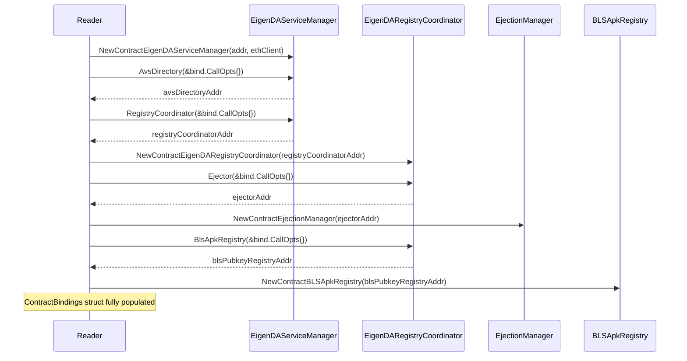
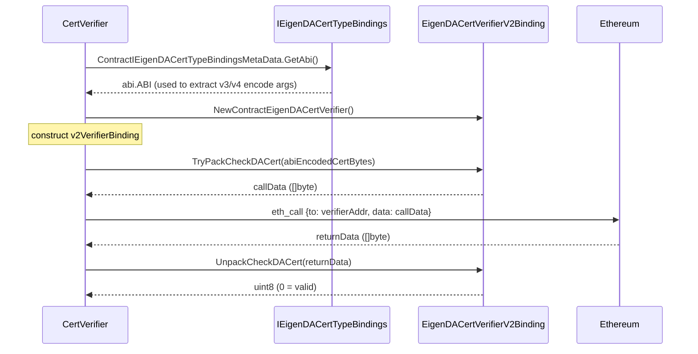
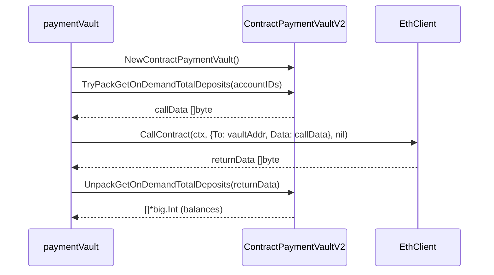
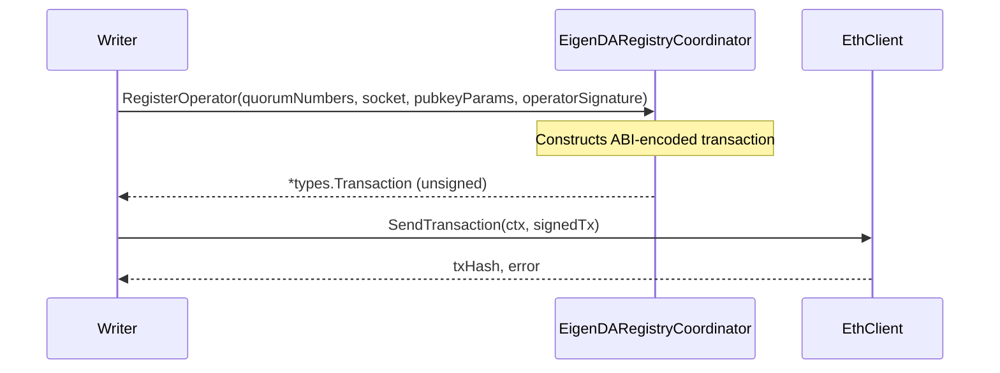
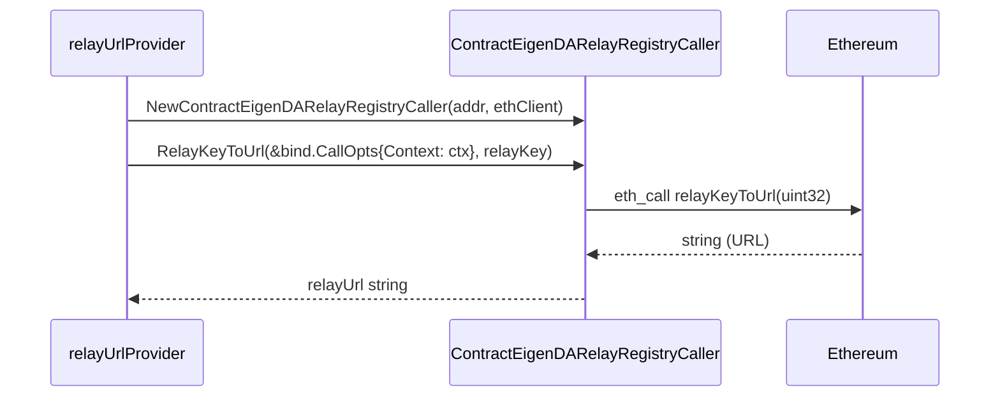

# ffi Analysis

**Analyzed by**: code-library-analyzer
**Timestamp**: 2026-04-08T00:00:00Z
**Package Type**: go-module
**Classification**: library
**Location**: contracts/bindings (generated from contracts/lib/eigenlayer-middleware Solidity sources)
**Version**: N/A (generated code, version tracked via parent module github.com/Layr-Labs/eigenda)

## Architecture

The `ffi` library, described as "EigenLayer middleware FFI bindings," is implemented as a collection of auto-generated Go packages that bridge the EigenDA Go codebase to deployed Ethereum smart contracts. It is located under `contracts/bindings/` within the repository root and is part of the parent `github.com/Layr-Labs/eigenda` Go module (no separate `go.mod` within the submodule directory itself).

The bindings are produced by `contracts/generate-bindings.sh`, a shell script that compiles Solidity source files with Foundry (`forge build`) and then runs `abigen` (the official go-ethereum ABI binding generator) against the compiled ABI artifacts. Two generations of `abigen` are in use simultaneously: the original v1 API (using `github.com/ethereum/go-ethereum/accounts/abi/bind`) and the newer v2 API (using `github.com/ethereum/go-ethereum/accounts/abi/bind/v2`). V2 bindings reside in the `bindings/v2/` subdirectory and are used for recently migrated contracts (currently `EigenDACertVerifier` and `PaymentVault`).

Each generated package exports a canonical set of Go types that mirror the Solidity contract's structs, events, and errors, plus a contract wrapper that exposes Caller (read-only), Transactor (write-only), and Filterer (log-scanning) sub-objects. The ABI string is embedded directly in each file as a string constant inside a `bind.MetaData` variable, making the binding packages self-contained with no dependency on external artifact files at runtime.

The generation pipeline ensures that stale generated files are removed before regeneration, and the script separates v1 and v2 outputs via directory layout, enabling gradual migration without a big-bang breaking change across all consumers.

## Key Components

- **`bindings/AVSDirectory`** (`contracts/bindings/AVSDirectory/binding.go`, 1771 lines): Binding for the EigenLayer `AVSDirectory` contract, which tracks operator registrations across actively validated services. Exposes `registerOperatorToAVS`, `deregisterOperatorFromAVS`, and delegation-related read calls. Used by `core/eth/reader.go` to look up operator AVS registration state.

- **`bindings/BLSApkRegistry`** (`contracts/bindings/BLSApkRegistry/binding.go`, 1325 lines): Binding for the BLS aggregate public-key registry. Exposes operator registration params (`IBLSApkRegistryPubkeyRegistrationParams`), and methods to retrieve per-quorum aggregate keys. Used by `core/eth/reader.go` to fetch BLS public keys for signature verification.

- **`bindings/BN254`** (`contracts/bindings/BN254/binding.go`, 181 lines): Minimal binding for the BN254 elliptic curve utility library. Contains no callable functions; its primary purpose is to make the `BN254G1Point` and `BN254G2Point` Go struct types available so they can be reused in other bindings.

- **`bindings/DelegationManager`** (`contracts/bindings/DelegationManager/binding.go`, 4127 lines): Binding for the EigenLayer `DelegationManager`, the largest file in the library. Tracks staker delegations to operators, withdrawal queuing, and slashing. Used indirectly via the `AVSDirectory` binding, and directly in tests.

- **`bindings/EigenDACertVerifier`** (`contracts/bindings/EigenDACertVerifier/binding.go`, 583 lines, abigen v1): V1 binding for the versioned DA certificate verifier contract. Exposes `checkDACert(bytes)`, `checkDACertReverts(EigenDACertV4)`, `certVersion()`, `quorumNumbersRequired()`, `securityThresholds()`, and `offchainDerivationVersion()`. Consumed by `api/clients/v2/verification/cert_verifier.go` to perform on-chain cert validation.

- **`bindings/v2/EigenDACertVerifier`** (`contracts/bindings/v2/EigenDACertVerifier/binding.go`, 773 lines, abigen v2): The same contract exposed through the newer abigen v2 API. Used directly in `api/clients/v2/verification/cert_verifier.go` as the primary path for ABI-encoding certificate data before calling `eth_call`.

- **`bindings/EigenDACertVerifierRouter`** (`contracts/bindings/EigenDACertVerifierRouter/binding.go`, 860 lines): Binding for the router contract that proxies `checkDACert` calls to the appropriate versioned verifier based on the reference block number. Exposes `getCertVerifierAt`, `addCertVerifier`, and `checkDACert`. Used by `api/clients/v2/verification/router_cert_verifier_address_provider.go`.

- **`bindings/EigenDACertVerifierV1`** / **`EigenDACertVerifierV2`** (`contracts/bindings/EigenDACertVerifierV1/binding.go`, 570 lines; `EigenDACertVerifierV2/binding.go`, 582 lines): Legacy versioned cert verifier bindings (V1 for RLP-encoded certs, V2 for early ABI-encoded certs). Used by `api/clients/v2/coretypes/conversion_utils.go` to convert proto messages into the binding struct types.

- **`bindings/IEigenDACertTypeBindings`** (`contracts/bindings/IEigenDACertTypeBindings/binding.go`, 384 lines): A pure-interface binding containing no deployed logic, only ABI definitions for `dummyVerifyDACertV1/V3/V4` functions. Consumed by `api/clients/v2/coretypes/eigenda_cert.go` at `init()` time to obtain `abi.Arguments` objects used for encoding/decoding V3 and V4 certificate structs.

- **`bindings/EigenDARegistryCoordinator`** (`contracts/bindings/EigenDARegistryCoordinator/binding.go`, 3301 lines): Binding for the central operator registry coordinator. Exposes `registerOperator`, `registerOperatorWithChurn`, `deregisterOperator`, `ejectOperator`, quorum bitmap history queries, and operator set parameter management. Heavily used by `core/eth/reader.go` and `core/eth/writer.go` for operator lifecycle operations.

- **`bindings/EigenDARelayRegistry`** (`contracts/bindings/EigenDARelayRegistry/binding.go`, 881 lines): Binding for the relay registry that maps relay keys to URLs. Used by `api/clients/v2/relay/relay_url_provider.go` to look up relay endpoint URLs at runtime.

- **`bindings/EigenDAServiceManager`** (`contracts/bindings/EigenDAServiceManager/binding.go`, 3673 lines): Binding for the top-level EigenDA service manager contract, the bootstrapping entry point from which all other contract addresses are discovered. Exposes `confirmBatch`, `registryCoordinator()`, `avsDirectory()`, rewards submission, and treasury management. The root binding used to bootstrap `ContractBindings` in `core/eth/reader.go`.

- **`bindings/EigenDAThresholdRegistry`** (`contracts/bindings/EigenDAThresholdRegistry/binding.go`, 1579 lines): Binding for the registry storing security thresholds (adversary/confirmation percentages) and versioned blob parameters per blob version. Used by `core/eth/reader.go` to retrieve quorum thresholds for validation.

- **`bindings/EigenDADisperserRegistry`** (`contracts/bindings/EigenDADisperserRegistry/binding.go`, 803 lines): Binding for the registry that tracks authorized EigenDA disperser operators. Used by `core/eth/reader.go` and `core/eth/writer.go` to query or register disperser addresses.

- **`bindings/EjectionManager`** (`contracts/bindings/EjectionManager/binding.go`, 1386 lines): Binding for the ejection manager contract used to remove misbehaving operators. Used by `core/eth/reader.go` to initialize the `ContractEjectionManager` instance, and by `ejector/ejection_transactor.go` to execute on-chain ejection transactions.

- **`bindings/IEigenDAEjectionManager`** (`contracts/bindings/IEigenDAEjectionManager/binding.go`, 526 lines): Interface-level binding for the ejection manager. Used directly by `ejector/ejection_transactor.go` which holds a `ContractIEigenDAEjectionManagerCaller` and `ContractIEigenDAEjectionManagerTransactor` to separate read and write concerns.

- **`bindings/PaymentVault`** (`contracts/bindings/PaymentVault/binding.go`, 2048 lines, abigen v1): Legacy v1 binding for the payment vault contract. Exposes `depositOnDemand`, `setReservation`, `getReservation`, `getOnDemandTotalDeposit`, and pricing setters.

- **`bindings/v2/PaymentVault`** (`contracts/bindings/v2/PaymentVault/binding.go`, 1147 lines, abigen v2): V2 binding for the payment vault. Used directly by `core/payments/vault/payment_vault.go` via `TryPackGetOnDemandTotalDeposits`, `UnpackGetOnDemandTotalDeposits`, etc., which follow the abigen v2 pack/unpack pattern rather than the v1 method-call pattern.

- **`bindings/OperatorStateRetriever`** (`contracts/bindings/OperatorStateRetriever/binding.go`, 478 lines): Binding for the read-optimized utility contract that batches operator state lookups. Exposes `getOperatorState`, `getCheckSignaturesIndices`, `getBatchOperatorId`, and `getOperatorStateWithSocket`. Used by `core/eth/reader.go` for quorum stake lookups during signature verification.

- **`bindings/StakeRegistry`** (`contracts/bindings/StakeRegistry/binding.go`, 1960 lines): Binding for the stake registry storing per-quorum operator stake histories. Used by `core/eth/reader.go` for historical stake lookups.

- **`bindings/SocketRegistry`** (`contracts/bindings/SocketRegistry/binding.go`, 295 lines): Binding for the socket registry that stores operator network endpoint strings. Used by `core/eth/reader.go` to look up operator socket addresses.

- **`bindings/IIndexRegistry`** (`contracts/bindings/IIndexRegistry/binding.go`, 619 lines): Interface binding for the index registry which maintains per-quorum operator index lists. Used by `core/eth/reader.go`.

- **`bindings/IEigenDADirectory`** (`contracts/bindings/IEigenDADirectory/binding.go`, 1318 lines): Binding for the EigenDA address directory contract that centralizes all contract address lookups. Used by `core/eth/directory/contract_directory.go`.

- **`bindings/IEigenDARelayRegistry`** / **`IEigenDAServiceManager`** / **`IEigenDACertVerifierLegacy`** / **`IEigenDAEjectionManager`**: Interface bindings providing caller and filterer capabilities for their respective contract interfaces. These support decoupled testing and allow reading contract state without requiring the full implementation ABI.

## Data Flows

### 1. Contract Bootstrap from ServiceManager Address

**Flow Description**: When the `core/eth` Reader is initialized, it bootstraps the full suite of `ContractBindings` by starting with a single known service manager address and following on-chain address pointers.



**Detailed Steps**:

1. **Instantiate ServiceManager** (Reader → EigenDAServiceManager binding) - `eigendasrvmg.NewContractEigenDAServiceManager(addr, ethClient)` creates the root binding; all subsequent addresses are discovered by calling view functions on it.
2. **Discover AVSDirectory** - `contractEigenDAServiceManager.AvsDirectory(&bind.CallOpts{})` returns the address; `avsdir.NewContractAVSDirectory(addr, ethClient)` wraps it.
3. **Discover RegistryCoordinator** - `contractEigenDAServiceManager.RegistryCoordinator(&bind.CallOpts{})` returns the address for `regcoordinator.NewContractEigenDARegistryCoordinator`.
4. **Chain-resolve EjectionManager and BLSApkRegistry** - Additional addresses are read from the RegistryCoordinator (`.Ejector`, `.BlsApkRegistry`).

---

### 2. Certificate Verification via EigenDACertVerifier

**Flow Description**: When a DA client wants to verify an EigenDA certificate on-chain, it ABI-encodes the cert using the `IEigenDACertTypeBindings` ABI and calls `checkDACert` on the appropriate verifier.



**Detailed Steps**:

1. **ABI Loading at init()** (`api/clients/v2/coretypes/eigenda_cert.go`) - `certTypesBinding.ContractIEigenDACertTypeBindingsMetaData.GetAbi()` parses the embedded ABI string to extract `abi.Arguments` for V3 and V4 cert types.
2. **Binding instantiation** - `certVerifierV2Binding.NewContractEigenDACertVerifier()` creates a stateless binding instance holding the parsed ABI.
3. **Pack call data** - `v2VerifierBinding.TryPackCheckDACert(certBytes)` uses the parsed ABI to ABI-encode the `checkDACert(bytes)` call.
4. **eth_call** - The encoded call data is sent to the Ethereum node via `ethClient.CallContract`.
5. **Unpack result** - `UnpackCheckDACert(returnData)` decodes the `uint8` return value.

---

### 3. Payment Vault On-Demand Deposit Query (abigen v2 pattern)

**Flow Description**: The payment system checks user deposit balances by ABI-packing calls via the v2 binding, invoking `eth_call`, then unpacking results manually—bypassing the v1 session/caller pattern.



**Key Technical Details**:
- The v2 abigen API exposes explicit `TryPack*` and `Unpack*` methods for each contract function, replacing the v1 session-based call pattern.
- The abigen v2 `ContractPaymentVault.Instance(backend, addr)` method returns a `*bind.BoundContract` for transactional use; purely read paths use the pack/unpack approach above.

---

### 4. Operator Registration (Write Path)

**Flow Description**: The `core/eth/Writer` executes an operator registration transaction on-chain using the RegistryCoordinator binding.



---

### 5. Relay URL Discovery

**Flow Description**: The relay client resolves a relay key (uint32) to a URL string by calling the EigenDARelayRegistry binding.



## Dependencies

### External Libraries

- **github.com/ethereum/go-ethereum** (v1.15.3, aliased to github.com/ethereum-optimism/op-geth v1.101511.1) [blockchain]: The go-ethereum Ethereum client library. Every generated binding imports packages from it:
  - `github.com/ethereum/go-ethereum/accounts/abi` — ABI parsing and type-conversion (`abi.ABI`, `abi.ConvertType`).
  - `github.com/ethereum/go-ethereum/accounts/abi/bind` — v1 binding infrastructure (`bind.BoundContract`, `bind.CallOpts`, `bind.TransactOpts`, `bind.MetaData`).
  - `github.com/ethereum/go-ethereum/accounts/abi/bind/v2` — v2 binding infrastructure (`bind.MetaData` with ID field, `bind.ContractBackend`) used in `bindings/v2/` packages.
  - `github.com/ethereum/go-ethereum/common` — `common.Address`, `common.Big1`.
  - `github.com/ethereum/go-ethereum/core/types` — `types.BloomLookup`, `types.Transaction`, `types.Log`.
  - `github.com/ethereum/go-ethereum/event` — `event.NewSubscription`, `event.Subscription` used by Filterer types.
  Imported in: all 28 `binding.go` files under `contracts/bindings/`.

### Internal Libraries

This library has no internal library dependencies. It depends only on `go-ethereum` and the Go standard library (`errors`, `math/big`, `strings`, `bytes`).

## API Surface

The `ffi` library exposes a distinct Go package per Solidity contract. Each package follows a consistent pattern with the following public types and constructors:

### Per-Binding Package Pattern (abigen v1)

```go
// Composite wrapper (read + write + filter)
type Contract<Name> struct {
    Contract<Name>Caller
    Contract<Name>Transactor
    Contract<Name>Filterer
}

// Constructor: wraps an already-deployed contract at addr
func NewContract<Name>(address common.Address, backend bind.ContractBackend) (*Contract<Name>, error)

// Read-only constructor
func NewContract<Name>Caller(address common.Address, caller bind.ContractCaller) (*Contract<Name>Caller, error)

// Write-only constructor
func NewContract<Name>Transactor(address common.Address, transactor bind.ContractTransactor) (*Contract<Name>Transactor, error)

// Log-filter constructor
func NewContract<Name>Filterer(address common.Address, filterer bind.ContractFilterer) (*Contract<Name>Filterer, error)

// Session types (pre-bind call/transact options)
type Contract<Name>Session struct { ... }
type Contract<Name>CallerSession struct { ... }
type Contract<Name>TransactorSession struct { ... }

// Embedded ABI metadata
var Contract<Name>MetaData = &bind.MetaData{ ABI: "..." }
```

### Per-Binding Package Pattern (abigen v2, in `bindings/v2/`)

```go
// Wrapper holding the parsed ABI (stateless, not address-bound)
type Contract<Name> struct { abi abi.ABI }

// Constructor: parses embedded ABI string, panics on invalid ABI
func NewContract<Name>() *Contract<Name>

// Creates an address-bound BoundContract for transactional use
func (c *Contract<Name>) Instance(backend bind.ContractBackend, addr common.Address) *bind.BoundContract

// ABI-encoding helpers (per contract function):
func (c *Contract<Name>) TryPack<FunctionName>(args...) ([]byte, error)
func (c *Contract<Name>) Unpack<FunctionName>(data []byte) (returnTypes, error)

// Embedded ABI metadata (includes an ID field for v2)
var Contract<Name>MetaData = bind.MetaData{ ABI: "...", ID: "Contract<Name>" }
```

### Key Exported Go Struct Types (Representative Selection)

These types are defined within binding packages and used across the broader codebase:

```go
// BN254 curve points (defined in multiple packages)
type BN254G1Point struct { X, Y *big.Int }
type BN254G2Point struct { X, Y [2]*big.Int }

// Certificate structures (EigenDACertVerifier, IEigenDACertTypeBindings)
type EigenDACertTypesEigenDACertV4 struct {
    BatchHeader                 EigenDATypesV2BatchHeaderV2
    BlobInclusionInfo           EigenDATypesV2BlobInclusionInfo
    NonSignerStakesAndSignature EigenDATypesV1NonSignerStakesAndSignature
    SignedQuorumNumbers         []byte
    OffchainDerivationVersion   uint16
}

// Quorum/signature verification (EigenDAServiceManager, OperatorStateRetriever)
type IBLSSignatureCheckerNonSignerStakesAndSignature struct {
    NonSignerQuorumBitmapIndices []uint32
    NonSignerPubkeys             []BN254G1Point
    QuorumApks                   []BN254G1Point
    ApkG2                        BN254G2Point
    Sigma                        BN254G1Point
    QuorumApkIndices             []uint32
    TotalStakeIndices            []uint32
    NonSignerStakeIndices        [][]uint32
}

// Operator registry (EigenDARegistryCoordinator)
type IRegistryCoordinatorOperatorInfo struct {
    OperatorId [32]byte
    Status     uint8
}
type IRegistryCoordinatorOperatorSetParam struct {
    MaxOperatorCount        uint32
    KickBIPsOfOperatorStake uint16
    KickBIPsOfTotalStake    uint16
}

// Payment (PaymentVault)
type IPaymentVaultReservation struct {
    SymbolsPerSecond uint64
    StartTimestamp   uint64
    EndTimestamp     uint64
    QuorumNumbers    []byte
    QuorumSplits     []byte
}

// OperatorStateRetriever
type OperatorStateRetrieverOperator struct {
    Operator   common.Address
    OperatorId [32]byte
    Stake      *big.Int
}
```

### Contracts Covered and Their Go Package Names

| Contract | Go Package | abigen Version | Key Methods Exposed |
|---|---|---|---|
| `AVSDirectory` | `contractAVSDirectory` | v1 | `RegisterOperatorToAVS`, `DeregisterOperatorFromAVS` |
| `BLSApkRegistry` | `contractBLSApkRegistry` | v1 | `GetApk`, `RegisterBLSPublicKey` |
| `BN254` | `contractBN254` | v1 | (no methods, types only) |
| `DelegationManager` | `contractDelegationManager` | v1 | `DelegateTo`, `Undelegate`, `QueueWithdrawals` |
| `EigenDACertVerifier` | `contractEigenDACertVerifier` | v1 | `CheckDACert`, `CertVersion`, `SecurityThresholds` |
| `EigenDACertVerifier` (v2) | `contractEigenDACertVerifier` | v2 | `TryPackCheckDACert`, `UnpackCheckDACert` |
| `EigenDACertVerifierRouter` | `contractEigenDACertVerifierRouter` | v1 | `CheckDACert`, `GetCertVerifierAt`, `AddCertVerifier` |
| `EigenDACertVerifierV1` | `contractEigenDACertVerifierV1` | v1 | `VerifyBlobV1` (legacy) |
| `EigenDACertVerifierV2` | `contractEigenDACertVerifierV2` | v1 | `VerifyBlobV2` (legacy) |
| `EigenDADisperserRegistry` | `contractEigenDADisperserRegistry` | v1 | `SetDisperserInfo`, `GetDisperserInfo` |
| `EigenDARegistryCoordinator` | `contractEigenDARegistryCoordinator` | v1 | `RegisterOperator`, `DeregisterOperator`, `EjectOperator` |
| `EigenDARelayRegistry` | `contractEigenDARelayRegistry` | v1 | `AddRelayInfo`, `RelayKeyToUrl` |
| `EigenDAServiceManager` | `contractEigenDAServiceManager` | v1 | `ConfirmBatch`, `RegistryCoordinator`, `AvsDirectory` |
| `EigenDAThresholdRegistry` | `contractEigenDAThresholdRegistry` | v1 | `GetBlobParams`, `GetQuorumAdversaryThresholdPercentage` |
| `EjectionManager` | `contractEjectionManager` | v1 | `EjectOperators` |
| `IEigenDACertTypeBindings` | `contractIEigenDACertTypeBindings` | v1 | ABI type definitions only (`dummyVerifyDACertV3/V4`) |
| `IEigenDACertVerifierLegacy` | `contractIEigenDACertVerifierLegacy` | v1 | Legacy cert verification interface |
| `IEigenDADirectory` | `contractIEigenDADirectory` | v1 | `GetAddress`, address directory lookups |
| `IEigenDAEjectionManager` | `contractIEigenDAEjectionManager` | v1 | `EjectOperators`, cooldown queries |
| `IEigenDARelayRegistry` | `contractIEigenDARelayRegistry` | v1 | Relay registry interface |
| `IEigenDAServiceManager` | `contractIEigenDAServiceManager` | v1 | Service manager interface |
| `IIndexRegistry` | `contractIIndexRegistry` | v1 | Operator index lookups per quorum |
| `OperatorStateRetriever` | `contractOperatorStateRetriever` | v1 | `GetOperatorState`, `GetCheckSignaturesIndices` |
| `PaymentVault` | `contractPaymentVault` | v1 | `DepositOnDemand`, `SetReservation`, `GetReservation` |
| `PaymentVault` (v2) | `contractPaymentVault` | v2 | `TryPackGetOnDemandTotalDeposits`, `UnpackGetOnDemandTotalDeposits` |
| `SocketRegistry` | `contractSocketRegistry` | v1 | `UpdateSocket`, socket lookups |
| `StakeRegistry` | `contractStakeRegistry` | v1 | `GetStakeHistoryLength`, stake history queries |

## Code Examples

### Example 1: Bootstrapping a Contract Binding from a Known Address

```go
// core/eth/reader.go
import (
    eigendasrvmg "github.com/Layr-Labs/eigenda/contracts/bindings/EigenDAServiceManager"
    regcoordinator "github.com/Layr-Labs/eigenda/contracts/bindings/EigenDARegistryCoordinator"
    "github.com/ethereum/go-ethereum/accounts/abi/bind"
)

// Step 1: create the root ServiceManager binding
contractEigenDAServiceManager, err := eigendasrvmg.NewContractEigenDAServiceManager(
    eigenDAServiceManagerAddr,
    t.ethClient,
)

// Step 2: discover the RegistryCoordinator address via a view call
registryCoordinatorAddr, err := contractEigenDAServiceManager.RegistryCoordinator(&bind.CallOpts{})

// Step 3: instantiate the coordinator binding
contractIRegistryCoordinator, err := regcoordinator.NewContractEigenDARegistryCoordinator(
    registryCoordinatorAddr,
    t.ethClient,
)
```

### Example 2: ABI-encoding a Certificate for On-Chain Verification (abigen v2)

```go
// api/clients/v2/verification/cert_verifier.go
import (
    certVerifierV2Binding "github.com/Layr-Labs/eigenda/contracts/bindings/v2/EigenDACertVerifier"
    "github.com/ethereum/go-ethereum"
)

// Instantiate the stateless v2 binding (holds parsed ABI, no address)
v2VerifierBinding := certVerifierV2Binding.NewContractEigenDACertVerifier()

// ABI-encode the checkDACert(bytes) call
callData, err := v2VerifierBinding.TryPackCheckDACert(certBytes)

// Execute as eth_call (no transaction, no gas)
returnData, err := ethClient.CallContract(ctx, ethereum.CallMsg{
    To:   &verifierAddr,
    Data: callData,
}, nil)

// Decode return value
result, err := v2VerifierBinding.UnpackCheckDACert(returnData)
```

### Example 3: Using IEigenDACertTypeBindings ABI for Struct Encoding

```go
// api/clients/v2/coretypes/eigenda_cert.go
import certTypesBinding "github.com/Layr-Labs/eigenda/contracts/bindings/IEigenDACertTypeBindings"

func init() {
    // Parse ABI from the interface-only binding (no deployed contract needed)
    certTypesABI, err := certTypesBinding.ContractIEigenDACertTypeBindingsMetaData.GetAbi()
    if err != nil {
        panic(err)
    }

    // Extract ABI method parameter types for V4 certs
    v4Method, ok := certTypesABI.Methods["dummyVerifyDACertV4"]
    if !ok {
        panic("dummyVerifyDACertV4 not found in IEigenDACertTypes ABI")
    }
    // v4Method.Inputs is used later to ABI-encode cert structs
    v4CertTypeEncodeArgs = v4Method.Inputs
}
```

### Example 4: v1 Caller Pattern for Read-Only Access

```go
// api/clients/v2/relay/relay_url_provider.go
import relayRegistryBindings "github.com/Layr-Labs/eigenda/contracts/bindings/EigenDARelayRegistry"

// Only the Caller sub-struct is instantiated — no write access needed
relayRegistryContractCaller, err := relayRegistryBindings.NewContractEigenDARelayRegistryCaller(
    relayRegistryAddress, ethClient)

// Direct method call on the Caller — maps to eth_call
relayUrl, err := relayRegistryContractCaller.RelayKeyToUrl(
    &bind.CallOpts{Context: ctx},
    relayKey,
)
```

### Example 5: Accessing the ContractBindings Aggregate

```go
// core/eth/reader.go
// ContractBindings aggregates all initialized binding objects for a given deployment
type ContractBindings struct {
    RegCoordinatorAddr    gethcommon.Address
    ServiceManagerAddr    gethcommon.Address
    RelayRegistryAddress  gethcommon.Address
    OpStateRetriever      *opstateretriever.ContractOperatorStateRetriever
    BLSApkRegistry        *blsapkreg.ContractBLSApkRegistry
    IndexRegistry         *indexreg.ContractIIndexRegistry
    RegistryCoordinator   *regcoordinator.ContractEigenDARegistryCoordinator
    StakeRegistry         *stakereg.ContractStakeRegistry
    EigenDAServiceManager *eigendasrvmg.ContractEigenDAServiceManager
    EjectionManager       *ejectionmg.ContractEjectionManager
    AVSDirectory          *avsdir.ContractAVSDirectory
    SocketRegistry        *socketreg.ContractSocketRegistry
    PaymentVault          *paymentvault.ContractPaymentVault
    RelayRegistry         *relayreg.ContractEigenDARelayRegistry
    ThresholdRegistry     *thresholdreg.ContractEigenDAThresholdRegistry
    DisperserRegistry     *disperserreg.ContractEigenDADisperserRegistry
    EigenDADirectory      *eigendadirectory.ContractIEigenDADirectory
}
```

### Example 6: Binding Generation Script (generate-bindings.sh)

```bash
# contracts/generate-bindings.sh (excerpt)
create_golang_abi_binding() {
  local contract="$1"
  local abigen_version="$2"

  # Extract ABI from foundry artifact
  local solc_abi
  solc_abi="$(jq -r '.abi' < "out/${contract}.sol/${contract}.json")"
  echo "${solc_abi}" > data/tmp.abi

  local out_dir
  if [[ "${abigen_version}" == "v2" ]]; then
    out_dir="./bindings/v2/${contract}"
  else
    out_dir="./bindings/${contract}"
  fi

  local pkg="contract${contract}"
  local args=( --abi=data/tmp.abi --pkg="${pkg}" --out="${out_dir}/binding.go" )
  if [[ "${abigen_version}" == "v2" ]]; then
    args=( --v2 "${args[@]}" )
  fi

  abigen "${args[@]}"
}
```

## Files Analyzed

- `contracts/generate-bindings.sh` (124 lines) - Shell script defining the binding generation pipeline, contract lists, and abigen version selection
- `contracts/foundry.toml` (170 lines) - Foundry project configuration including Solidity compiler version (0.8.29), optimizer settings, and `ffi = false`
- `contracts/bindings/BN254/binding.go` (181 lines) - Minimal binding for BN254 curve library; types only
- `contracts/bindings/EigenDAServiceManager/binding.go` (3673 lines) - Root service manager binding
- `contracts/bindings/EigenDACertVerifier/binding.go` (583 lines) - V1 cert verifier binding
- `contracts/bindings/EigenDACertVerifierRouter/binding.go` (860 lines) - Cert verifier router binding
- `contracts/bindings/IEigenDACertTypeBindings/binding.go` (384 lines) - Interface ABI binding used for cert struct encoding
- `contracts/bindings/EigenDARegistryCoordinator/binding.go` (3301 lines) - Central operator registry coordinator
- `contracts/bindings/PaymentVault/binding.go` (2048 lines) - V1 payment vault binding
- `contracts/bindings/OperatorStateRetriever/binding.go` (478 lines) - Batch operator state read utility
- `contracts/bindings/EigenDAThresholdRegistry/binding.go` (1579 lines) - Security threshold registry
- `contracts/bindings/EigenDARelayRegistry/binding.go` (881 lines) - Relay URL registry
- `contracts/bindings/EjectionManager/binding.go` (1386 lines) - Operator ejection manager
- `contracts/bindings/IEigenDAEjectionManager/binding.go` (526 lines) - Ejection manager interface binding
- `contracts/bindings/v2/EigenDACertVerifier/binding.go` (773 lines) - abigen v2 cert verifier binding
- `contracts/bindings/v2/PaymentVault/binding.go` (1147 lines) - abigen v2 payment vault binding
- `contracts/bindings/StakeRegistry/binding.go` (1960 lines) - Per-quorum stake history registry
- `contracts/bindings/BLSApkRegistry/binding.go` (1325 lines) - BLS aggregate public key registry
- `contracts/bindings/AVSDirectory/binding.go` (1771 lines) - AVS operator registration directory
- `contracts/bindings/DelegationManager/binding.go` (4127 lines) - EigenLayer delegation manager
- `core/eth/reader.go` (partial) - Primary consumer; shows ContractBindings aggregate struct and bootstrap pattern
- `core/eth/writer.go` (partial) - Shows write-path usage (RegisterOperator, etc.)
- `api/clients/v2/verification/cert_verifier.go` (partial) - Shows cert verifier binding usage pattern
- `api/clients/v2/coretypes/eigenda_cert.go` (partial) - Shows IEigenDACertTypeBindings ABI loading at init()
- `api/clients/v2/coretypes/conversion_utils.go` (partial) - Shows proto-to-binding type conversion
- `api/clients/v2/relay/relay_url_provider.go` (partial) - Shows Caller-only relay registry usage
- `core/payments/vault/payment_vault.go` (partial) - Shows abigen v2 pack/unpack pattern
- `ejector/ejection_transactor.go` (partial) - Shows ejection manager binding split into Caller/Transactor

## Analysis Notes

### Security Considerations

1. **Generated Code, No Manual Edits**: All binding files carry a `// Code generated - DO NOT EDIT.` header. The security posture of the library is entirely determined by the correctness of the upstream Solidity ABI and the `abigen` tool. Any vulnerability in how ABIs are encoded or decoded would affect all consumers uniformly.

2. **ABI String Integrity**: The ABI JSON strings embedded in each `*MetaData` variable are the single source of truth for encoding/decoding. If a binding is compiled against a stale or incorrect ABI (e.g., due to a forgotten `forge build` step), Go code will silently communicate with a different contract ABI than what is deployed on-chain, potentially leading to failed transactions or incorrect return value decoding.

3. **No Authentication in the Binding Layer**: The bindings themselves perform no authentication or authorization; they are pure codec/transport wrappers. Authorization (e.g., restricting who can call `ejectOperator` or `setReservation`) is enforced entirely by the on-chain Solidity contracts. Callers in Go must supply appropriately signed transactions via `bind.TransactOpts`.

4. **go-ethereum Replace Directive**: The project replaces `github.com/ethereum/go-ethereum` with `github.com/ethereum-optimism/op-geth v1.101511.1`. This patched fork is used by all binding packages. Any security patches to upstream go-ethereum must be separately tracked against the fork; there is no automatic inheritance.

5. **Dual abigen Versions**: Maintaining both v1 and v2 abigen patterns increases surface area during the migration period. A developer could inadvertently call a v1 binding's session method (which performs ABI encoding and eth_call internally) and not notice if the v2 pack/unpack path for the same contract has subtly different argument handling.

### Performance Characteristics

- **No Runtime ABI Parsing Overhead (v1)**: V1 bindings embed the ABI string and parse it lazily via `bind.MetaData.GetAbi()`; the parsed ABI is cached internally by go-ethereum. This means the first call per binding type pays a small JSON parse cost; subsequent calls use the cached form.
- **Explicit Pack/Unpack (v2)**: V2 bindings parse the ABI once in `NewContract<Name>()` (which panics on error). Subsequent `TryPack*` and `Unpack*` calls operate on the cached `abi.ABI` struct with no additional parsing overhead.
- **Network-Bound**: All meaningful work is network I/O (Ethereum RPC calls). The Go binding layer adds negligible CPU overhead relative to the RPC round-trip time.

### Scalability Notes

- **Stateless Binding Objects**: The v2 binding objects (e.g., `ContractPaymentVault`, `ContractEigenDACertVerifier`) are entirely stateless and safe for concurrent use across goroutines. Multiple goroutines can call `TryPack*` on the same instance simultaneously without contention.
- **Caller vs. Full Binding**: Using `NewContract<Name>Caller` (v1) or only calling read methods via the v2 pack/unpack path avoids instantiating write-path ABI encoders, which is a minor memory efficiency in high-throughput reader scenarios.
- **Contract Address Discovery**: The `Reader.updateContractBindings` bootstrap requires several sequential `eth_call` invocations. In production, this runs once at startup; it is not a hot path and is not a scalability concern.
- **Generated Code Volume**: The library totals approximately 35,000 lines across 28 binding files. This is compile-time overhead only; the resulting binary includes only the bindings that are actually imported.
