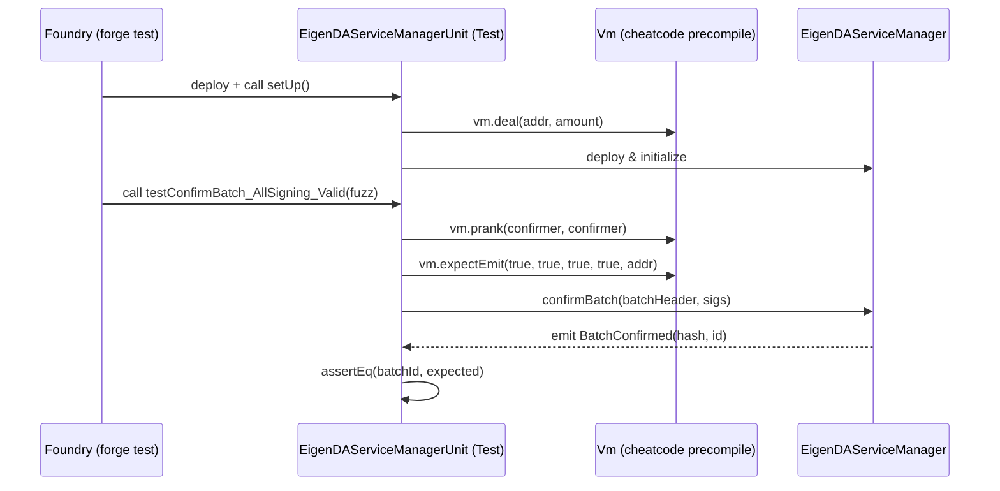
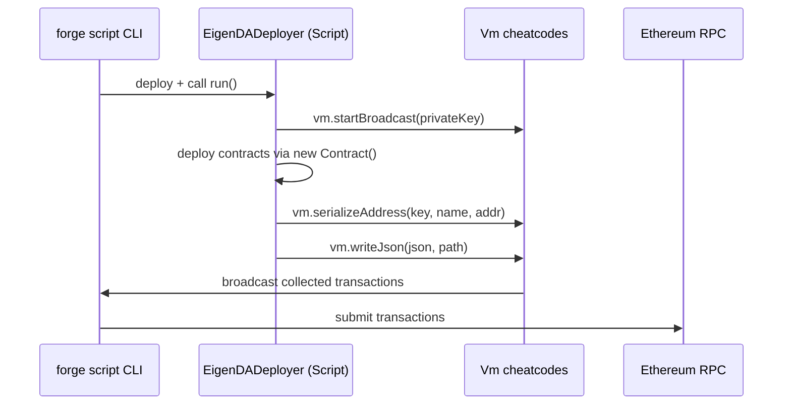
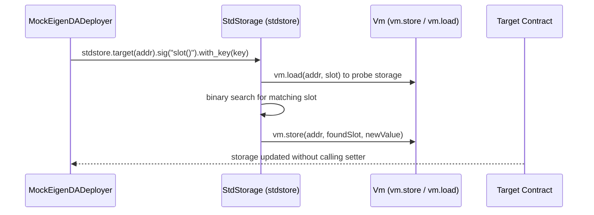

# forge-std Analysis

**Analyzed by**: code-library-analyzer
**Timestamp**: 2026-04-08T09:44:02Z
**Application Type**: javascript-package (Solidity library, npm-distributed)
**Classification**: library
**Location**: `contracts/lib/eigenlayer-middleware/lib/eigenlayer-contracts/lib/forge-std`

Multiple copies also reside at:
- `contracts/lib/eigenlayer-middleware/lib/forge-std`
- `contracts/lib/eigenlayer-middleware/lib/eigenlayer-contracts/lib/openzeppelin-contracts-upgradeable-v4.9.0/lib/forge-std`
- `contracts/lib/eigenlayer-middleware/lib/eigenlayer-contracts/lib/openzeppelin-contracts-v4.9.0/lib/forge-std`
- `contracts/lib/eigenlayer-middleware/lib/eigenlayer-contracts/lib/zeus-templates/lib/forge-std`
- `contracts/lib/forge-std`

The primary copy used by EigenDA contracts directly is `contracts/lib/forge-std` (referenced as `lib/forge-std/src/Test.sol` in test files).

## Architecture

Forge Standard Library (forge-std) is a collection of Solidity utilities purpose-built for the Foundry smart contract development framework. It provides the testing, scripting, and utility infrastructure that Foundry's `forge test` and `forge script` commands rely on. It is not a Solidity protocol library in the traditional sense—rather it is the Solidity-side complement to Foundry's Rust-based test runner, exposing cheatcode interfaces and common testing patterns.

The library is organized into three functional pillars: the test infrastructure (`Test.sol`, `Vm.sol`), the scripting infrastructure (`Script.sol`), and the utility contracts (`StdAssertions`, `StdCheats`, `StdMath`, `StdStorage`, `StdJson`, `StdToml`, `console.sol`). These pillars are assembled into two top-level facade contracts—`Test` and `Script`—that consumers simply inherit from.

The central mechanism is `Vm.sol`, which defines the `Vm` interface. This interface exposes hundreds of EVM-level cheatcodes provided by Foundry's backend: state manipulation (`vm.deal`, `vm.store`, `vm.load`), execution control (`vm.prank`, `vm.startPrank`, `vm.expectRevert`, `vm.expectEmit`), environment access (`vm.envString`, `vm.envUint`), and fork management (`vm.createFork`, `vm.selectFork`). The cheatcode contract is accessed at the magic address `0x7109709ECfa91a80626fF3989D68f67F5b1DD12d`, which Foundry's EVM interprets specially at runtime.

The library is distributed via npm for version pinning and via git submodule for Foundry projects. Within this EigenDA project it is consumed purely as a Foundry git submodule vendored dependency—no JavaScript tooling is involved at runtime.

## Key Components

- **`src/Test.sol`**: The primary test base contract. Combines `Vm` cheatcodes, `StdAssertions`, `StdCheats`, `StdUtils`, `StdStorage`, and `console` into a single inheritance target. Every EigenDA Foundry test ultimately inherits from this contract. Provides `makeAddr(string)`, `deal()`, `hoax()`, and similar convenience helpers.

- **`src/Vm.sol`**: The cheatcode interface definition. Declares the full `Vm` interface and the `VmSafe` sub-interface (a subset of cheatcodes safe for use in production scripts). Generated programmatically from Foundry's cheatcode spec. Contains roughly 400+ function signatures. Used implicitly through the `vm` state variable injected by `Test.sol`.

- **`src/Script.sol`**: Base contract for deployment and operational scripts run via `forge script`. Inherits from `ScriptBase`, adds `StdChains` (chain registry with RPC URL helpers), and provides `setUp()` lifecycle hooks. Used in EigenDA scripts like `EigenDADeployer.s.sol`, `DeployEigenDA.s.sol`, and all other `*.s.sol` files.

- **`src/StdAssertions.sol`**: Extended assertion library beyond Solidity's built-in `assert`. Provides `assertEq` overloads for all primitive types, arrays, and structs, plus `assertApproxEqAbs`, `assertApproxEqRel` for approximate comparisons. Extends `DSTest` assertions. Used extensively in EigenDA unit tests.

- **`src/StdCheats.sol`**: Higher-level wrappers around raw Vm cheatcodes. Provides `deal()` (set ETH balance), `hoax()` (prank + deal), `startHoax()`, `deployCode()` (dynamic contract deployment from bytecode), and `makeAddr()` / `makePersistentAccount()`. Also provides mock contract helpers.

- **`src/StdStorage.sol`**: Slot-finding storage manipulation library. Implements `stdstore` which can locate and overwrite arbitrary storage slots on a target contract without knowing their position. Uses a fluent builder API: `stdstore.target(addr).sig("balanceOf(address)").with_key(user).checked_write(amount)`. Used in `MockEigenDADeployer.sol` via `using stdStorage for StdStorage`.

- **`src/StdJson.sol`**: JSON parsing and serialization library. Wraps `vm.parseJson` and `vm.serializeJson` cheatcodes into convenient typed functions. Used in EigenDA deployment scripts (`StdJson` import in `EigenDADeployer.s.sol`) for reading and writing deployment configuration JSON files.

- **`src/StdToml.sol`**: TOML file parsing library. Wraps `vm.parseToml` cheatcode. Used for reading Foundry-config-style TOML config files in scripts.

- **`src/console.sol` / `src/console2.sol`**: Solidity `console.log` equivalents. Call into the Foundry console precompile at `0x000000000000000000636F6e736F6c652e6c6f67`. `console2.sol` is a stricter version that only works under Foundry (not compatible with Hardhat). Used for debug logging in EigenDA test infrastructure.

- **`src/StdMath.sol`**: Pure math utilities not available in Solidity's standard library. Provides `abs()`, `delta()` (absolute difference), `percentDelta()`, and `log2()`. Used internally by `StdAssertions` for approximate equality checks.

- **`src/StdUtils.sol`**: Address and value utility functions. Provides `bound(uint256 x, uint256 min, uint256 max)` for constraining fuzz inputs within valid ranges, `bytesToUint()`, and address set manipulation.

- **`lib/ds-test/`**: Embedded copy of DappSys test library. Forge-std extends and wraps ds-test, providing backward compatibility while adding richer functionality.

## Data Flows

### 1. Test Execution Flow



**Detailed Steps**:

1. **Test Initialization** (Foundry → Test contract)
   - `forge test` deploys the test contract into a fresh EVM fork
   - `setUp()` is called before each test function
   - Inherited `Test.makeAddr()` creates deterministic addresses for `confirmer`, `notConfirmer`

2. **State Manipulation via Cheatcodes** (Test → Vm precompile)
   - `vm.prank(addr)` sets the `msg.sender` for the next call
   - `vm.deal(addr, amount)` sets the ETH balance of an address
   - `vm.expectEmit(...)` registers an event expectation validated on the next external call

3. **Assertion** (Test → StdAssertions)
   - `assertEq(actual, expected)` compares values, logs diff on failure

### 2. Script Deployment Flow



**Detailed Steps**:

1. `forge script` deploys the script contract, `run()` is invoked
2. `vm.startBroadcast()` enables transaction collection mode
3. All `new Contract()` calls are recorded as deployment transactions
4. `StdJson.serializeAddress` / `vm.writeJson` writes addresses to a deployment JSON artifact
5. Foundry submits all collected transactions to the RPC endpoint

### 3. Storage Slot Manipulation Flow



## Dependencies

### External Libraries

- **ds-test** (embedded, no version pin) [testing]: DappSys test framework providing the base `DSTest` contract with `assertTrue`, `assertEq` primitives and event-based logging. Forge-std wraps and extends this library. Bundled inside `lib/ds-test/` within the forge-std submodule itself.

### Internal Libraries

None. Forge-std is a depth-0 library with no internal project dependencies. It depends only on the Foundry EVM backend at runtime (not a Solidity import dependency).

## API Surface

Forge-std is consumed by inheritance. The complete public API surface is:

### Contracts Exported for Inheritance

- **`Test`** (`src/Test.sol`): Combines all test utilities. Import as `import {Test} from "lib/forge-std/src/Test.sol"`. Provides `vm` instance, all assertions, all cheats, `console` access.
- **`Script`** (`src/Script.sol`): Base for deployment scripts. Import as `import {Script} from "forge-std/Script.sol"`. Provides `vm`, chain helpers, broadcast utilities.

### Key Inherited State Variables

```solidity
// Available inside any contract inheriting Test or Script:
Vm internal constant vm = Vm(address(uint160(uint256(keccak256("hevm cheat code")))));
// Resolves to: 0x7109709ECfa91a80626fF3989D68f67F5b1DD12d
```

### Commonly Used Cheatcode Methods (via `vm`)

```solidity
// Identity / Access control
vm.prank(address sender)
vm.startPrank(address sender)
vm.stopPrank()

// State manipulation
vm.deal(address who, uint256 newBalance)
vm.store(address target, bytes32 slot, bytes32 value)
vm.load(address target, bytes32 slot) returns (bytes32)
vm.warp(uint256 timestamp)
vm.roll(uint256 blockNumber)

// Expect-style assertions
vm.expectRevert(bytes calldata revertData)
vm.expectEmit(bool checkTopic1, bool checkTopic2, bool checkTopic3, bool checkData, address emitter)

// Script / broadcast
vm.startBroadcast(uint256 privateKey)
vm.stopBroadcast()

// Environment
vm.envString(string name) returns (string)
vm.envUint(string name) returns (uint256)

// File I/O
vm.readFile(string path) returns (string)
vm.writeFile(string path, string data)
vm.parseJson(string json) returns (bytes)
vm.serializeAddress(string objectKey, string valueKey, address value) returns (string)
vm.writeJson(string json, string path)
```

### Utility Functions (via inheritance)

```solidity
// From StdUtils (inherited by Test)
function bound(uint256 x, uint256 min, uint256 max) internal pure returns (uint256)

// From StdCheats (inherited by Test)
function makeAddr(string memory name) internal returns (address addr)
function deal(address to, uint256 give) internal
function hoax(address who) internal
function hoax(address who, uint256 give) internal

// From StdAssertions (inherited by Test)
function assertEq(uint256 a, uint256 b) internal
function assertApproxEqAbs(uint256 a, uint256 b, uint256 maxDelta) internal
function assertApproxEqRel(uint256 a, uint256 b, uint256 maxPercentDelta) internal
```

### StdStorage (via `using stdStorage for StdStorage`)

```solidity
// Fluent API for storage slot manipulation
stdstore
    .target(address targetContract)
    .sig(string memory funcSig)       // or .sig(bytes4 selector)
    .with_key(address key)            // for mappings
    .with_key(uint256 key)
    .depth(uint256 elementDepth)      // for nested structs
    .checked_write(uint256 value)     // write and verify
    .find() returns (uint256 slot)    // just find the slot
    .read_bool() returns (bool)       // read current value
    .read_uint() returns (uint256)
```

## Files Analyzed

- `/tmp/eigenda/project/contracts/test/unit/EigenDADirectory.t.sol` - Shows `import {Test} from "lib/forge-std/src/Test.sol"` and `Test` inheritance
- `/tmp/eigenda/project/contracts/test/unit/ConfigRegistryUnit.t.sol` - Minimal `Test` inheritance pattern
- `/tmp/eigenda/project/contracts/test/MockEigenDADeployer.sol` - Shows `StdStorage` usage and `forge-std/StdStorage.sol` import
- `/tmp/eigenda/project/contracts/script/EigenDADeployer.s.sol` - Shows `forge-std/Test.sol`, `forge-std/Script.sol`, `forge-std/StdJson.sol` imports
- `/tmp/eigenda/project/contracts/foundry.toml` - Project configuration showing forge-std integration
- `/tmp/eigenda/service_discovery/libraries.json` - Discovery metadata confirming library paths

## Analysis Notes

### Security Considerations

1. **Cheatcode Scope Isolation**: Forge-std's cheatcodes only work under Foundry's test EVM. The `Vm` interface address resolves to a no-op precompile on public networks, so test-only imports of forge-std cannot accidentally grant production cheatcode access. However, contracts must never import forge-std modules in production source files—only in `test/` and `script/` directories.

2. **FFI Disabled**: The EigenDA foundry.toml explicitly sets `ffi = false`, disabling the `vm.ffi()` cheatcode that allows arbitrary shell command execution from Solidity tests. This is the correct security posture; FFI is a significant security risk when enabled.

3. **Script vs Test Contracts**: The `Script` base provides `VmSafe` (a read-only subset of cheatcodes) without requiring the full `Vm` interface. EigenDA deployment scripts use `vm.startBroadcast()` and JSON I/O correctly through the `Script` base.

### Performance Characteristics

- **Zero Production Overhead**: Forge-std produces no deployed bytecode in production. All inheritance is stripped by the compiler since test and script contracts are never deployed on mainnet.
- **Test Compilation Cost**: Large test suites inheriting `Test.sol` incur higher compilation overhead due to the large interface of `Vm.sol`. The EigenDA `sparse_mode = true` setting in foundry.toml mitigates this by only compiling files relevant to changed tests.

### Scalability Notes

- **Fuzz Testing Integration**: `StdUtils.bound()` is critical for property-based fuzz testing. EigenDA tests use fuzz parameters (e.g., `uint256 pseudoRandomNumber`) that are constrained via `bound()` to prevent trivially invalid inputs from dominating the fuzzing corpus.
- **Multiple Copies**: The presence of six copies of forge-std as nested submodules is a consequence of Foundry's git submodule dependency model. Each library vendored by eigenlayer-middleware and eigenlayer-contracts brings its own forge-std copy. This is expected and does not cause runtime conflicts since these are compile-time-only inclusions.
