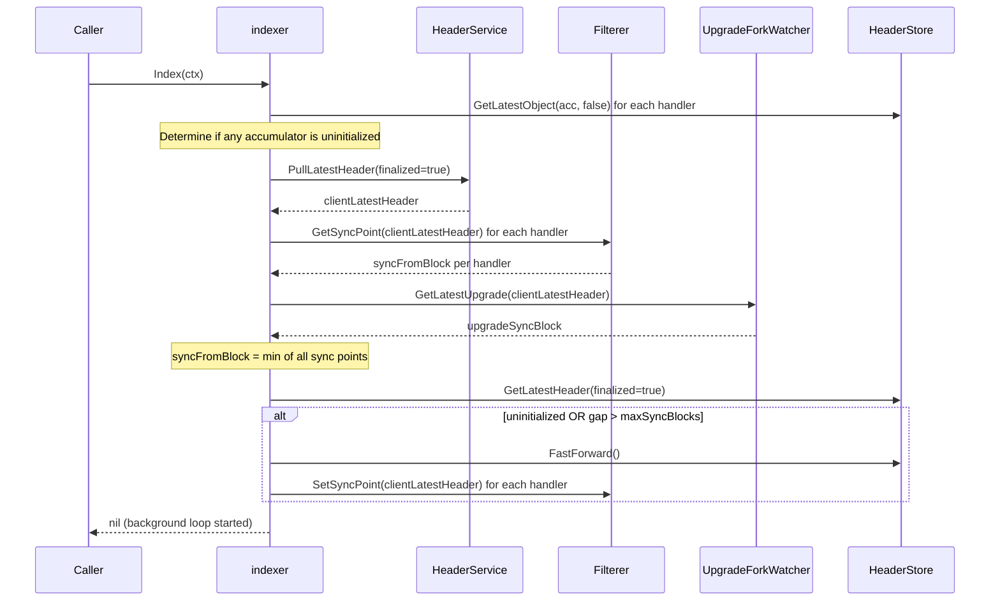
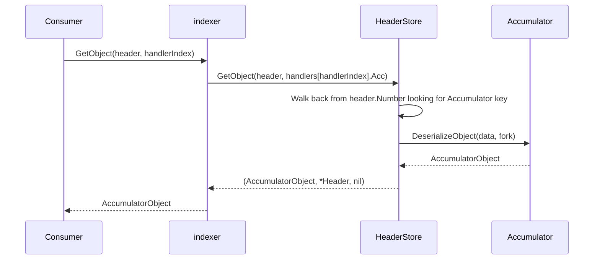

# indexer Analysis

**Analyzed by**: code-analyzer-indexer
**Timestamp**: 2026-04-10T00:00:00Z
**Application Type**: go-module
**Classification**: library
**Location**: indexer

## Architecture

The `indexer` package is a reusable Go library for tracking Ethereum smart contract state by consuming on-chain events in a chain-reorganization-aware manner. It is organized around three first-class abstractions: `HeaderService` (Ethereum RPC client adapter), `HeaderStore` (persistent chain of block headers), and a plugin-style `Accumulator`/`Filterer` pair that allows callers to define arbitrary accumulated state driven by on-chain events.

The library follows a pipeline pattern: raw block headers flow from the Ethereum RPC node through a `HeaderService`, are stored and reorg-reconciled in a `HeaderStore`, and are then dispatched to one or more `AccumulatorHandler` instances. Each handler pairs a `Filterer` (which queries contract logs for relevant events over a range of headers) with an `Accumulator` (which folds those events into a domain-specific state object). This design allows multiple independent state machines to share a single header stream without duplicating Ethereum RPC calls.

Two concrete `HeaderStore` implementations are provided: an in-memory store (`inmem`) for testing and lightweight use-cases, and a LevelDB-backed store (`leveldb`) for production durability. Both stores handle chain reorganizations by detecting the fork point among incoming headers and re-attaching accumulator objects from the divergence point forward. Serialization for persisted objects uses Go's `encoding/gob` package, with per-fork deserialization dispatch enabling forward-compatible state schema upgrades.

The `indexer.Index()` method launches a background goroutine that continuously polls for new headers, respects context cancellation, and has a "fast-forward" bootstrap mechanism that skips reprocessing historical headers when state can be reconstructed directly from the current on-chain state.

## Key Components

- **`Indexer` interface** (`indexer/indexer.go`): Top-level public interface exposing `Index(ctx)`, `HandleAccumulator(acc, f, headers)`, `GetLatestHeader(finalized)`, and `GetObject(header, handlerIndex)`. All consumer code depends on this interface, not the concrete `indexer` struct.

- **`indexer` struct** (`indexer/indexer.go`): Concrete implementation of `Indexer`. Holds a slice of `AccumulatorHandler` registrations, a `HeaderService`, a `HeaderStore`, an `UpgradeForkWatcher`, and the pull interval. Its `Index()` method is the library's main event loop: it bootstraps via fast-forward if needed, then enters a polling loop dispatching headers to each registered handler.

- **`Header` / `Headers`** (`indexer/header.go`): Core data types. `Header` carries `BlockHash`, `PrevBlockHash`, `Number`, `Finalized`, `CurrentFork`, and `IsUpgrade`. The `Headers` slice type provides helper methods (`IsOrdered`, `GetHeaderByNumber`, `First`, `Last`) that the rest of the library uses to validate chains and locate headers by block number.

- **`Accumulator` interface** (`indexer/accumulator.go`): Plugin interface for domain-specific state. Callers implement `InitializeObject(header)`, `UpdateObject(object, header, event)`, `SerializeObject(object, fork)`, and `DeserializeObject(data, fork)`. The fork parameter enables schema versioning across protocol upgrades.

- **`Filterer` interface** (`indexer/filterer.go`): Plugin interface pairing with `Accumulator`. Callers implement `FilterHeaders(headers)` (fetches logs for a header range), `GetSyncPoint`, `SetSyncPoint`, and `FilterFastMode`. The fast-mode mechanism allows the filterer to skip historical replay and bootstrap directly from current chain state.

- **`HeaderService` interface** (`indexer/header_service.go`): Abstracts the Ethereum RPC node. Provides `PullNewHeaders(lastHeader)` (batch-fetches headers since the last seen one) and `PullLatestHeader(finalized)`.

- **`HeaderStore` interface** (`indexer/header_store.go`): Manages the canonical chain of stored headers and the accumulator objects attached to them. Key operations: `AddHeaders` (reorg-aware ingestion), `GetLatestHeader`, `AttachObject`, `GetObject`, `GetLatestObject`, and `FastForward` (wipe and restart from a finalized point).

- **`eth.HeaderService`** (`indexer/eth/header_service.go`): Production implementation of `HeaderService` using `common.RPCEthClient`. Uses JSON-RPC batch calls (`eth_getBlockByNumber`) to fetch ranges of headers efficiently. Finalization is determined by a configurable distance from HEAD (default 100 blocks).

- **`inmem.HeaderStore`** (`indexer/inmem/header_store.go`): In-memory `HeaderStore` backed by a slice. Carries a per-header `Payloads` map keyed by `Accumulator` for attaching serialized objects. Handles reorgs by truncating the chain at the divergence index.

- **`leveldb.HeaderStore`** (`indexer/leveldb/header_store.go`): Persistent `HeaderStore` backed by LevelDB. Uses a snapshot-based transaction model for atomic writes. Keys are prefixed (`h-` for headers, `a-<TypeName>-` for accumulator entries) with block numbers encoded in reverse order so the most recent entry sorts first during iteration.

- **`UpgradeForkWatcher` interface** (`indexer/upgrades.go`): Plugin for protocol-upgrade detection. Callers implement `DetectUpgrade(headers)` (stamps `CurrentFork` and `IsUpgrade` on headers) and `GetLatestUpgrade(header)` (returns the block from which the indexer must re-sync on an upgrade).

- **`mock.MockIndexer`** (`indexer/mock/indexer.go`): Testify-based mock of the `Indexer` interface for use by consumers in their own unit tests.

## Data Flows

### 1. Startup / Fast-Forward Bootstrap

**Flow Description**: On the first call to `Index()`, or when the stored chain has fallen too far behind the chain head, the indexer fast-forwards to the current sync point so it does not replay unbounded history.



**Detailed Steps**:

1. **Initialization check** (`indexer` → `HeaderStore`): `GetLatestObject` is called for every registered accumulator handler; if any returns an error the store is considered uninitialized.
2. **Sync point computation** (`indexer` → `Filterer`, `UpgradeForkWatcher`): Each filterer's `GetSyncPoint` returns the earliest block from which it requires full event history. The upgrade watcher also contributes a block. The minimum across all is selected.
3. **Fast-forward decision** (`indexer` → `HeaderStore`): If uninitialized, or the gap from stored head to sync point exceeds `maxSyncBlocks` (10), the store is wiped via `FastForward()` and each filterer is placed in fast mode via `SetSyncPoint`.

---

### 2. Steady-State Header Polling and Accumulator Dispatch

**Flow Description**: The background goroutine launched by `Index()` continuously polls for new headers and updates each registered accumulator.

```mermaid
sequenceDiagram
    participant Loop as Background Goroutine
    participant HeaderStore
    participant HeaderService
    participant UpgradeForkWatcher
    participant indexer
    participant Filterer
    participant Accumulator

    loop until ctx.Done()
        Loop->>HeaderStore: GetLatestHeader(finalized=true)
        HeaderStore-->>Loop: latestFinalizedHeader (or block 0 if empty)
        Loop->>HeaderService: PullNewHeaders(latestFinalizedHeader)
        HeaderService-->>Loop: headers, isHead
        alt len(headers) > 0
            Loop->>UpgradeForkWatcher: DetectUpgrade(headers)
            UpgradeForkWatcher-->>Loop: headers with CurrentFork/IsUpgrade set
            Loop->>HeaderStore: AddHeaders(headers)
            HeaderStore-->>Loop: newHeaders (post-reorg dedup)
            Loop->>indexer: HandleAccumulator(acc, filterer, newHeaders)
            indexer->>Filterer: FilterFastMode(headers)
            Filterer-->>indexer: initHeader, remainingHeaders
            alt initHeader != nil
                indexer->>Accumulator: InitializeObject(*initHeader)
                Accumulator-->>indexer: initialObject
                indexer->>HeaderStore: AttachObject(initialObject, initHeader, acc)
            end
            indexer->>Filterer: FilterHeaders(remainingHeaders)
            Filterer-->>indexer: []HeaderAndEvents
            loop for each HeaderAndEvents
                loop for each Event
                    indexer->>Accumulator: UpdateObject(object, header, event)
                    Accumulator-->>indexer: updatedObject
                end
                indexer->>HeaderStore: AttachObject(updatedObject, header, acc)
            end
        end
        alt isHead
            Loop->>Loop: sleep(PullInterval)
        end
    end
```

**Detailed Steps**:

1. **Header fetch**: `HeaderService.PullNewHeaders` uses JSON-RPC batch calls to retrieve all blocks since the last stored finalized header. Returns `isHead=true` when no new blocks exist.
2. **Upgrade detection**: `UpgradeForkWatcher.DetectUpgrade` stamps each header's `CurrentFork` and `IsUpgrade` fields before they are persisted.
3. **Reorg reconciliation**: `HeaderStore.AddHeaders` finds the last common ancestor with the current chain and returns only the genuinely new headers post-fork.
4. **Fast mode initialization**: If the filterer is in fast-mode (`FilterFastMode` returns a non-nil `initHeader`), `Accumulator.InitializeObject` is called to reconstruct full state from the current chain snapshot and the result is attached to that header.
5. **Incremental update**: `FilterHeaders` fetches contract logs for the remaining headers; each event is applied to the running accumulator object via `UpdateObject`, and the updated object is persisted after every header.

---

### 3. State Retrieval Query

**Flow Description**: Consumers retrieve the accumulated state at any block height via `GetObject` or the latest state via `GetLatestHeader` + `GetObject`.



**Error Paths**:
- `handlerIndex` out of bounds → `errors.New("handler index out of bounds")`
- No persisted object for the accumulator at or before the requested header → `ErrNotFound` (leveldb) or `ErrObjectNotFound` (inmem)

---

### 4. LevelDB Transactional Header Write

**Flow Description**: The LevelDB store writes headers atomically using a snapshot+batch transaction to prevent partial writes during reorgs.

```mermaid
sequenceDiagram
    participant HeaderStore as leveldb.HeaderStore
    participant transaction
    participant levelDB

    HeaderStore->>levelDB: Tx() → snapshot + batch
    levelDB-->>HeaderStore: transaction
    HeaderStore->>transaction: PutHeaderEntries(headers)
    Note over transaction: putFinalizedHeaderEntry: find last finalized header, write to "latest-finalized-header" key
    Note over transaction: filterNew: check if last header already stored; find divergence point
    loop for each new header
        transaction->>transaction: Get existing headerEntry (for old accumulator keys)
        transaction->>transaction: Delete old accumulator keys
        transaction->>transaction: Put new headerEntry
    end
    HeaderStore->>transaction: Commit()
    transaction->>levelDB: db.Write(batch)
    alt error
        HeaderStore->>transaction: Discard()
    end
```

## Dependencies

### External Libraries

- **github.com/Layr-Labs/eigensdk-go** (v0.2.0-beta.1.0.20250118004418-2a25f31b3b28) [logging]: Provides the `logging.Logger` interface used throughout the indexer for structured, leveled log output. The `indexer` struct and `eth.HeaderService` both accept a `logging.Logger` at construction time.
  Imported in: `indexer/indexer.go`, `indexer/eth/header_service.go`.

- **github.com/ethereum/go-ethereum** (v1.15.3, pinned via replace to `github.com/ethereum-optimism/op-geth v1.101511.1`) [blockchain]: Core Ethereum Go client library. The `eth` sub-package uses `go-ethereum/rpc` for batch JSON-RPC calls, `go-ethereum/core/types` for `types.Header`, and `go-ethereum/common/hexutil` for block number encoding. Test infrastructure additionally uses `go-ethereum/accounts/abi/bind`, `go-ethereum/ethclient/simulated`, and `go-ethereum/crypto`.
  Imported in: `indexer/eth/header_service.go`, `indexer/test/mock/simulated_backend.go`, `indexer/test/mock/contract_simulator.go`, `indexer/test/filterer.go`, `indexer/test/contracts/Weth.go`, `indexer/test/accumulator/filterer.go`, `indexer/test/accumulator/bindings/binding.go`.

- **github.com/syndtr/goleveldb** (v1.0.1-0.20220614013038-64ee5596c38a) [database]: Pure-Go LevelDB implementation providing key-value storage, Bloom filter indexing, snapshot reads, and batch writes. The `leveldb` sub-package wraps these primitives into a typed, transactional `HeaderStore`.
  Imported in: `indexer/leveldb/leveldb.go`, `indexer/leveldb/header_store.go`, `indexer/leveldb/header_store_test.go`.

- **github.com/urfave/cli** (v1.22.14) [cli]: CLI flag parsing framework. Used in `indexer/cli.go` to define and read the `--indexer-pull-interval` flag, allowing operators to configure the polling interval via environment variable or command-line argument.
  Imported in: `indexer/cli.go`.

- **github.com/stretchr/testify** (v1.11.1) [testing]: Test assertion and mock generation library. `testify/assert` and `testify/require` are used in all test files. `testify/mock` powers the `mock.MockIndexer` type.
  Imported in: `indexer/mock/indexer.go`, `indexer/inmem/header_store_test.go`, `indexer/leveldb/header_store_test.go`, `indexer/eth/header_service_test.go`, `indexer/test/mock/contract_simulator_test.go`, `indexer/test/indexer_test.go`.

### Internal Libraries

- **github.com/Layr-Labs/eigenda/common** (`common/`): Used in `indexer/cli.go` for `common.PrefixEnvVar` to build environment variable names with a caller-supplied prefix (e.g., `NODE_INDEXER_PULL_INTERVAL`). In `indexer/eth/header_service.go` the `common.RPCEthClient` interface is accepted as the RPC transport, allowing callers to inject a real or mock Ethereum JSON-RPC client.
  Imported in: `indexer/cli.go`, `indexer/eth/header_service.go`.

## API Surface

The `indexer` package is consumed as a Go library. Its public API consists of interfaces (to be implemented by callers or depended upon), a concrete constructor, and CLI helpers.

### Public Interfaces

**`Indexer`** (`indexer/indexer.go:24`): Top-level interface for running the indexer.
```go
type Indexer interface {
    Index(ctx context.Context) error
    HandleAccumulator(acc Accumulator, f Filterer, headers Headers) error
    GetLatestHeader(finalized bool) (*Header, error)
    GetObject(header *Header, handlerIndex int) (AccumulatorObject, error)
}
```

**`Accumulator`** (`indexer/accumulator.go:6`): State-machine plugin interface to be implemented by callers.
```go
type Accumulator interface {
    InitializeObject(header Header) (AccumulatorObject, error)
    UpdateObject(object AccumulatorObject, header *Header, event Event) (AccumulatorObject, error)
    SerializeObject(object AccumulatorObject, fork UpgradeFork) ([]byte, error)
    DeserializeObject(data []byte, fork UpgradeFork) (AccumulatorObject, error)
}
```

**`Filterer`** (`indexer/filterer.go:13`): Contract log query plugin to be implemented by callers.
```go
type Filterer interface {
    FilterHeaders(headers Headers) ([]HeaderAndEvents, error)
    GetSyncPoint(latestHeader *Header) (uint64, error)
    SetSyncPoint(latestHeader *Header) error
    FilterFastMode(headers Headers) (*Header, Headers, error)
}
```

**`HeaderService`** (`indexer/header_service.go:4`): Ethereum RPC adapter.
```go
type HeaderService interface {
    PullNewHeaders(lastHeader *Header) (Headers, bool, error)
    PullLatestHeader(finalized bool) (*Header, error)
}
```

**`HeaderStore`** (`indexer/header_store.go:10`): Persistent chain-of-headers store.
```go
type HeaderStore interface {
    AddHeaders(headers Headers) (Headers, error)
    GetLatestHeader(finalized bool) (*Header, error)
    AttachObject(object AccumulatorObject, header *Header, acc Accumulator) error
    GetObject(header *Header, acc Accumulator) (AccumulatorObject, *Header, error)
    GetLatestObject(acc Accumulator, finalized bool) (AccumulatorObject, *Header, error)
    FastForward() error
}
```

**`UpgradeForkWatcher`** (`indexer/upgrades.go:6`): Protocol-upgrade detector plugin.
```go
type UpgradeForkWatcher interface {
    DetectUpgrade(headers Headers) Headers
    GetLatestUpgrade(header *Header) uint64
}
```

### Public Constructor

**`indexer.New`** (`indexer/indexer.go:50`):
```go
func New(
    config *Config,
    handlers []AccumulatorHandler,
    headerSrvc HeaderService,
    headerStore HeaderStore,
    upgradeForkWatcher UpgradeForkWatcher,
    logger logging.Logger,
) *indexer
```

### Concrete Implementations Provided

| Type | Package | Description |
|---|---|---|
| `HeaderService` | `indexer/eth` | Production Ethereum JSON-RPC implementation |
| `HeaderStore` | `indexer/inmem` | In-memory implementation for testing |
| `HeaderStore` | `indexer/leveldb` | Durable LevelDB-backed implementation |
| `MockIndexer` | `indexer/mock` | Testify mock of the `Indexer` interface |

### CLI Helpers

**`CLIFlags(envPrefix string) []cli.Flag`** (`indexer/cli.go:14`): Returns the `--indexer-pull-interval` CLI flag definition with automatic env var binding.

**`ReadIndexerConfig(ctx *cli.Context) Config`** (`indexer/cli.go:26`): Reads the pull interval from CLI context into a `Config` struct.

### Configuration

**`Config`** (`indexer/config.go`):
```go
type Config struct {
    PullInterval time.Duration  // default: 1s
}
```

**`DefaultIndexerConfig() Config`** returns `PullInterval: 1 * time.Second`.

## Code Examples

### Example 1: Constructing and Starting the Indexer

```go
// indexer/test/indexer_test.go (illustrative wiring pattern)
config := indexer.Config{PullInterval: 100 * time.Millisecond}
headerSrvc := eth.NewHeaderService(logger, rpcClient)
headerStore := inmem.NewHeaderStore()

handlers := []indexer.AccumulatorHandler{
    {
        Acc:      myAccumulator,
        Filterer: myFilterer,
        Status:   indexer.Good,
    },
}

idx := indexer.New(&config, handlers, headerSrvc, headerStore, upgradeForkWatcher, logger)
if err := idx.Index(ctx); err != nil {
    log.Fatal(err)
}
```

### Example 2: Implementing a Custom Accumulator (WETH Deposit Tracking)

```go
// indexer/test/accumulator/accumulator.go
type Accumulator struct{}

type AccountBalanceV1 struct{ Balance uint64 }

func (a *Accumulator) InitializeObject(header indexer.Header) (indexer.AccumulatorObject, error) {
    return AccountBalanceV1{Balance: 0}, nil
}

func (a *Accumulator) UpdateObject(object indexer.AccumulatorObject, header *indexer.Header, event indexer.Event) (indexer.AccumulatorObject, error) {
    deposit := event.Payload.(weth.WethDeposit)
    obj := object.(AccountBalanceV1)
    obj.Balance += deposit.Wad.Uint64()
    return obj, nil
}

func (a *Accumulator) SerializeObject(object indexer.AccumulatorObject, fork indexer.UpgradeFork) ([]byte, error) {
    // Fork-aware serialization
    switch fork {
    case "genesis":
        var buf bytes.Buffer
        gob.NewEncoder(&buf).Encode(object.(*AccountBalanceV1))
        return buf.Bytes(), nil
    }
    return nil, ErrUnrecognizedFork
}
```

### Example 3: LevelDB Key Schema (Reverse-Order Encoding for Latest-First Iteration)

```go
// indexer/leveldb/schema.go
var headerKeyPrefix = []byte("h-")

// Block numbers are stored as (MaxUint64 - blockNumber) in hex so that
// iterating forward through keys yields headers in descending block order.
func newHeaderKeySuffix(v uint64) []byte {
    return []byte(strconv.FormatUint(math.MaxUint64-v, 16))
}

// Accumulator keys are prefixed by the Go type name of the accumulator,
// enabling O(1) prefix-scan per accumulator type.
func newAccumulatorKeyPrefix(acc indexer.Accumulator) []byte {
    accTyp := reflect.TypeOf(acc)
    if accTyp.Kind() == reflect.Pointer { accTyp = accTyp.Elem() }
    return []byte("a-" + accTyp.Name() + "-")
}
```

### Example 4: Ethereum RPC Batch Header Fetch

```go
// indexer/eth/header_service.go
func (h *HeaderService) headersByRange(ctx context.Context, startHeight uint64, count int) ([]*types.Header, error) {
    batchElems := make([]rpc.BatchElem, count)
    for i := 0; i < count; i++ {
        batchElems[i] = rpc.BatchElem{
            Method: "eth_getBlockByNumber",
            Args:   []interface{}{toBlockNumArg(new(big.Int).SetUint64(startHeight + uint64(i))), false},
            Result: new(types.Header),
        }
    }
    if err := h.rpcEthClient.BatchCallContext(ctx, batchElems); err != nil {
        return nil, err
    }
    // ... unpack results
}
```

## Files Analyzed

- `indexer/indexer.go` (265 lines) - Core `Indexer` interface, `indexer` struct, `Index()` event loop, `HandleAccumulator()`
- `indexer/header.go` (82 lines) - `Header` and `Headers` types with chain validation helpers
- `indexer/accumulator.go` (17 lines) - `Accumulator` and `AccumulatorObject` interfaces
- `indexer/filterer.go` (27 lines) - `Filterer` interface and `HeaderAndEvents`/`Event` types
- `indexer/header_service.go` (12 lines) - `HeaderService` interface
- `indexer/header_store.go` (30 lines) - `HeaderStore` interface with `ErrNoHeaders`
- `indexer/upgrades.go` (13 lines) - `UpgradeForkWatcher` interface and `UpgradeFork` type
- `indexer/config.go` (27 lines) - `Config` struct, defaults, and validation
- `indexer/cli.go` (31 lines) - `CLIFlags` and `ReadIndexerConfig` for urfave/cli integration
- `indexer/eth/header_service.go` (154 lines) - Production Ethereum RPC `HeaderService`
- `indexer/eth/header_service_test.go` (294 lines) - Unit tests for `eth.HeaderService`
- `indexer/inmem/header_store.go` (229 lines) - In-memory `HeaderStore` implementation
- `indexer/inmem/encoding.go` (21 lines) - gob encode/decode helpers for inmem
- `indexer/leveldb/header_store.go` (338 lines) - LevelDB `HeaderStore` implementation
- `indexer/leveldb/leveldb.go` (217 lines) - LevelDB wrapper with snapshot transactions
- `indexer/leveldb/schema.go` (60 lines) - Key schema and entry type definitions
- `indexer/leveldb/encoding.go` (21 lines) - gob encode/decode helpers for leveldb
- `indexer/leveldb/header_store_test.go` (455 lines) - Comprehensive table-driven tests
- `indexer/mock/indexer.go` (35 lines) - Testify mock of `Indexer` interface
- `indexer/test/indexer_test.go` (105 lines) - Integration test using WETH contract simulator
- `indexer/test/mock/contract_simulator.go` (207 lines) - Simulated Ethereum backend for integration tests
- `indexer/test/mock/simulated_backend.go` (107 lines) - Adapter implementing `RPCEthClient` over `simulated.Backend`
- `indexer/test/filterer.go` (100 lines) - Test `Filterer` implementation for WETH contract
- `indexer/test/accumulator/accumulator.go` (91 lines) - Test `Accumulator` for WETH deposit balance tracking
- `indexer/test/accumulator/filterer.go` (95 lines) - Alternative test `Filterer` implementation

## Analysis Data

```json
{
  "summary": "The indexer package is a Go library for tracking Ethereum smart contract state by consuming on-chain events in a chain-reorganization-aware manner. It exposes a plugin architecture built around the Accumulator and Filterer interfaces, allowing callers to define arbitrary domain-specific state machines driven by contract logs, while the core library handles header polling, reorg detection, finalization tracking, and persistent state storage via interchangeable in-memory or LevelDB backends.",
  "architecture_pattern": "pipeline with plugin interfaces",
  "key_modules": [
    "indexer (core) — Indexer interface, event loop, AccumulatorHandler dispatch",
    "indexer/eth — Production Ethereum RPC HeaderService using batch JSON-RPC",
    "indexer/inmem — In-memory HeaderStore for testing",
    "indexer/leveldb — Durable LevelDB-backed HeaderStore with transactional writes",
    "indexer/mock — Testify mock of Indexer interface for consumer unit tests",
    "indexer/test — Integration test fixtures: WETH Accumulator, Filterer, ContractSimulator"
  ],
  "api_endpoints": [],
  "data_flows": [
    "Startup fast-forward bootstrap: determine sync point, wipe stale state, set filterers to fast mode",
    "Steady-state polling: fetch headers via batch RPC, detect upgrades, reconcile reorgs, dispatch to Accumulator handlers",
    "Accumulator fast mode: skip historical replay, reconstruct full state from current chain, then switch to incremental",
    "State retrieval: walk back from requested header through HeaderStore to find most recent persisted AccumulatorObject",
    "LevelDB transactional write: snapshot + batch commit for atomic header and accumulator entry updates"
  ],
  "tech_stack": [
    "go",
    "ethereum",
    "leveldb",
    "gob-encoding"
  ],
  "external_integrations": [
    "ethereum-json-rpc"
  ],
  "component_interactions": [
    {
      "target": "common",
      "type": "library",
      "description": "Uses common.RPCEthClient interface as the transport for eth.HeaderService, and common.PrefixEnvVar for CLI flag environment variable naming"
    }
  ]
}
```

## Citations

```json
[
  {
    "file_path": "indexer/indexer.go",
    "start_line": 24,
    "end_line": 29,
    "claim": "Indexer is the top-level public interface exposing Index, HandleAccumulator, GetLatestHeader, and GetObject",
    "section": "Key Components",
    "snippet": "type Indexer interface {\n\tIndex(ctx context.Context) error\n\tHandleAccumulator(acc Accumulator, f Filterer, headers Headers) error\n\tGetLatestHeader(finalized bool) (*Header, error)\n\tGetObject(header *Header, handlerIndex int) (AccumulatorObject, error)\n}"
  },
  {
    "file_path": "indexer/indexer.go",
    "start_line": 37,
    "end_line": 48,
    "claim": "The concrete indexer struct holds AccumulatorHandlers, HeaderService, HeaderStore, UpgradeForkWatcher, and PullInterval",
    "section": "Architecture",
    "snippet": "type indexer struct {\n\tLogger logging.Logger\n\tHandlers []AccumulatorHandler\n\tHeaderService HeaderService\n\tHeaderStore HeaderStore\n\tUpgradeForkWatcher UpgradeForkWatcher\n\tPullInterval time.Duration\n}"
  },
  {
    "file_path": "indexer/indexer.go",
    "start_line": 73,
    "end_line": 128,
    "claim": "Index() performs the fast-forward bootstrap by comparing sync points and wiping stale state when the gap exceeds maxSyncBlocks",
    "section": "Data Flows",
    "snippet": "if err == nil || !initialized || syncFromBlock-myLatestHeader.Number > maxSyncBlocks {\n\tffErr := i.HeaderStore.FastForward()\n\tfor _, h := range i.Handlers {\n\t\th.Filterer.SetSyncPoint(clientLatestHeader)\n\t}\n}"
  },
  {
    "file_path": "indexer/indexer.go",
    "start_line": 19,
    "end_line": 22,
    "claim": "maxSyncBlocks is hardcoded to 10; this is the maximum gap before a fast-forward is triggered",
    "section": "Architecture",
    "snippet": "const (\n\tmaxUint       uint64 = math.MaxUint64\n\tmaxSyncBlocks        = 10\n)"
  },
  {
    "file_path": "indexer/indexer.go",
    "start_line": 131,
    "end_line": 188,
    "claim": "Index() launches a background goroutine that polls for new headers, detects upgrades, and dispatches to AccumulatorHandlers in a context-cancellable loop",
    "section": "Data Flows",
    "snippet": "go func() {\nloop:\n\tfor {\n\t\tselect {\n\t\tcase <-ctx.Done():\n\t\t\tbreak loop\n\t\tdefault:\n\t\t\t// poll and dispatch\n\t\t}\n\t}\n}()"
  },
  {
    "file_path": "indexer/indexer.go",
    "start_line": 190,
    "end_line": 248,
    "claim": "HandleAccumulator implements the two-phase fast-mode initialization followed by incremental event-based update for each header",
    "section": "Data Flows",
    "snippet": "func (i *indexer) HandleAccumulator(acc Accumulator, f Filterer, headers Headers) error {\n\tinitHeader, remainingHeaders, err := f.FilterFastMode(headers)\n\t// initialize if fast mode...\n\theadersAndEvents, err := f.FilterHeaders(headers)\n\tfor _, item := range headersAndEvents {\n\t\tfor _, event := range item.Events {\n\t\t\tobject, err = acc.UpdateObject(object, item.Header, event)\n\t\t}\n\t\ti.HeaderStore.AttachObject(object, item.Header, acc)\n\t}\n}"
  },
  {
    "file_path": "indexer/header.go",
    "start_line": 13,
    "end_line": 20,
    "claim": "Header carries BlockHash, PrevBlockHash, Number, Finalized, CurrentFork, and IsUpgrade fields",
    "section": "Key Components",
    "snippet": "type Header struct {\n\tBlockHash     [32]byte\n\tPrevBlockHash [32]byte\n\tNumber        uint64\n\tFinalized     bool\n\tCurrentFork   string\n\tIsUpgrade     bool\n}"
  },
  {
    "file_path": "indexer/header.go",
    "start_line": 63,
    "end_line": 70,
    "claim": "Headers.IsOrdered() validates the chain by checking that each header's PrevBlockHash matches the previous header's BlockHash",
    "section": "Key Components",
    "snippet": "func (hh Headers) IsOrdered() bool {\n\tfor ind := 1; ind < len(hh); ind++ {\n\t\tif hh[ind].PrevBlockHash != hh[ind-1].BlockHash {\n\t\t\treturn false\n\t\t}\n\t}\n\treturn true\n}"
  },
  {
    "file_path": "indexer/accumulator.go",
    "start_line": 6,
    "end_line": 16,
    "claim": "Accumulator interface requires InitializeObject, UpdateObject, SerializeObject, and DeserializeObject with fork-aware (de)serialization",
    "section": "Key Components",
    "snippet": "type Accumulator interface {\n\tInitializeObject(header Header) (AccumulatorObject, error)\n\tUpdateObject(object AccumulatorObject, header *Header, event Event) (AccumulatorObject, error)\n\tSerializeObject(object AccumulatorObject, fork UpgradeFork) ([]byte, error)\n\tDeserializeObject(data []byte, fork UpgradeFork) (AccumulatorObject, error)\n}"
  },
  {
    "file_path": "indexer/filterer.go",
    "start_line": 13,
    "end_line": 26,
    "claim": "Filterer interface encapsulates contract log queries (FilterHeaders), sync-point computation, and fast-mode bootstrapping",
    "section": "Key Components",
    "snippet": "type Filterer interface {\n\tFilterHeaders(headers Headers) ([]HeaderAndEvents, error)\n\tGetSyncPoint(latestHeader *Header) (uint64, error)\n\tSetSyncPoint(latestHeader *Header) error\n\tFilterFastMode(headers Headers) (*Header, Headers, error)\n}"
  },
  {
    "file_path": "indexer/header_store.go",
    "start_line": 10,
    "end_line": 29,
    "claim": "HeaderStore interface is the persistence layer for headers and accumulator objects, with reorg-aware AddHeaders and AttachObject/GetObject operations",
    "section": "Key Components",
    "snippet": "type HeaderStore interface {\n\tAddHeaders(headers Headers) (Headers, error)\n\tGetLatestHeader(finalized bool) (*Header, error)\n\tAttachObject(object AccumulatorObject, header *Header, acc Accumulator) error\n\tGetObject(header *Header, acc Accumulator) (AccumulatorObject, *Header, error)\n\tGetLatestObject(acc Accumulator, finalized bool) (AccumulatorObject, *Header, error)\n\tFastForward() error\n}"
  },
  {
    "file_path": "indexer/eth/header_service.go",
    "start_line": 15,
    "end_line": 17,
    "claim": "Finalization is determined by a 100-block distance from HEAD (DistanceFromHead constant)",
    "section": "Key Components",
    "snippet": "// block is finalized if its distance from HEAD is greater than some configurable number.\nconst DistanceFromHead = 100"
  },
  {
    "file_path": "indexer/eth/header_service.go",
    "start_line": 106,
    "end_line": 134,
    "claim": "HeaderService.headersByRange uses JSON-RPC batch calls (eth_getBlockByNumber) to fetch multiple headers in a single round trip",
    "section": "Key Components",
    "snippet": "batchElems[i] = rpc.BatchElem{\n\tMethod: \"eth_getBlockByNumber\",\n\tArgs:   []interface{}{toBlockNumArg(new(big.Int).SetUint64(height + uint64(i))), false},\n\tResult: new(types.Header),\n}\nif err := h.rpcEthClient.BatchCallContext(ctx, batchElems); err != nil { return nil, err }"
  },
  {
    "file_path": "indexer/eth/header_service.go",
    "start_line": 51,
    "end_line": 66,
    "claim": "PullNewHeaders sets the Finalized flag on headers based on their distance from the latest block number",
    "section": "Data Flows",
    "snippet": "finalized := latestHeaderNum-headerNum > DistanceFromHead\nheaders = append(headers, &head.Header{\n\tBlockHash: header.Hash(),\n\tPrevBlockHash: header.ParentHash,\n\tNumber: headerNum,\n\tFinalized: finalized,\n})"
  },
  {
    "file_path": "indexer/inmem/header_store.go",
    "start_line": 42,
    "end_line": 56,
    "claim": "inmem.HeaderStore stores a slice of extended Header structs with per-header Payloads maps keyed by Accumulator",
    "section": "Key Components",
    "snippet": "type HeaderStore struct {\n\tChain          []*Header\n\tIndOffset      int\n\tFinalizedIndex int\n}"
  },
  {
    "file_path": "indexer/inmem/header_store.go",
    "start_line": 119,
    "end_line": 141,
    "claim": "inmem.AddHeaders handles reorgs by finding the last common ancestor and truncating the chain from the divergence point forward",
    "section": "Data Flows",
    "snippet": "for ind := len(headers) - 1; ind >= 0; ind-- {\n\tmyHeader, myInd, found := h.getHeaderByNumber(headers[ind].Number - 1)\n\tif found && myHeader.BlockHash == headers[ind].PrevBlockHash {\n\t\treturn ind, myInd, nil\n\t}\n}\nreturn 0, 0, ErrPrevBlockHashNotFound"
  },
  {
    "file_path": "indexer/inmem/header_store.go",
    "start_line": 225,
    "end_line": 228,
    "claim": "inmem.FastForward wipes the entire chain slice to reset state",
    "section": "Data Flows",
    "snippet": "func (h *HeaderStore) FastForward() error {\n\th.Chain = make([]*Header, 0)\n\treturn nil\n}"
  },
  {
    "file_path": "indexer/leveldb/schema.go",
    "start_line": 11,
    "end_line": 22,
    "claim": "LevelDB header keys are prefixed with 'h-' and use reverse block-number encoding so the most recent header sorts first in iteration",
    "section": "Key Components",
    "snippet": "var (\n\theaderKeyPrefix    = []byte(\"h-\")\n\tfinalizedHeaderKey = []byte(\"latest-finalized-header\")\n)\nfunc newHeaderKeySuffix(v uint64) []byte {\n\treturn []byte(strconv.FormatUint(math.MaxUint64-v, 16))\n}"
  },
  {
    "file_path": "indexer/leveldb/schema.go",
    "start_line": 26,
    "end_line": 33,
    "claim": "Accumulator keys are prefixed by 'a-<TypeName>-' using reflection on the accumulator's Go type name, enabling per-accumulator key-space isolation",
    "section": "Key Components",
    "snippet": "func newAccumulatorKeyPrefix(acc indexer.Accumulator) []byte {\n\taccTyp := reflect.TypeOf(acc)\n\tif accTyp.Kind() == reflect.Pointer { accTyp = accTyp.Elem() }\n\treturn []byte(\"a-\" + accTyp.Name() + \"-\")\n}"
  },
  {
    "file_path": "indexer/leveldb/leveldb.go",
    "start_line": 45,
    "end_line": 55,
    "claim": "LevelDB is opened with a Bloom filter of 10 bits per key to speed up negative lookups",
    "section": "Key Components",
    "snippet": "ldb, err = leveldb.OpenFile(path, &opt.Options{Filter: filter.NewBloomFilter(10)})"
  },
  {
    "file_path": "indexer/leveldb/leveldb.go",
    "start_line": 137,
    "end_line": 162,
    "claim": "Transactions use a LevelDB snapshot for consistent reads and a Batch for write buffering, committing atomically via db.Write",
    "section": "Data Flows",
    "snippet": "tx := &transaction{\n\tkeyValueReader: keyValueReader{getFn: func(key []byte) ([]byte, error) { return sn.Get(key, nil) }},\n\tkeyValueWriter: keyValueWriter{putFn: func(key, value []byte) error { b.Put(key, value); return nil }},\n\tb: b, sn: sn, db: l.db,\n}"
  },
  {
    "file_path": "indexer/leveldb/header_store.go",
    "start_line": 273,
    "end_line": 304,
    "claim": "leveldb.FastForward reads the latest finalized header, deletes the entire database directory, and re-opens a fresh store seeded with just that header",
    "section": "Data Flows",
    "snippet": "path := s.db.Path\ns.Close()\nos.RemoveAll(path)\ndb, err := newLevelDB(path, s.opener...)\ns.AddHeaders(headers) // seed with finalized header"
  },
  {
    "file_path": "indexer/leveldb/header_store.go",
    "start_line": 57,
    "end_line": 79,
    "claim": "PutHeaderEntries first writes the finalized header entry, then filters to find only genuinely new headers before writing individual header entries",
    "section": "Data Flows"
  },
  {
    "file_path": "indexer/leveldb/encoding.go",
    "start_line": 1,
    "end_line": 21,
    "claim": "Both inmem and leveldb sub-packages use Go's encoding/gob for serializing header entries and accumulator objects",
    "section": "Architecture",
    "snippet": "func encode(v any) ([]byte, error) {\n\tbuf := new(bytes.Buffer)\n\tenc := gob.NewEncoder(buf)\n\tenc.Encode(v)\n\treturn buf.Bytes(), nil\n}"
  },
  {
    "file_path": "indexer/upgrades.go",
    "start_line": 1,
    "end_line": 12,
    "claim": "UpgradeForkWatcher interface provides DetectUpgrade (stamps CurrentFork on headers) and GetLatestUpgrade (returns the re-sync block for an upgrade)",
    "section": "Key Components",
    "snippet": "type UpgradeForkWatcher interface {\n\tDetectUpgrade(headers Headers) Headers\n\tGetLatestUpgrade(header *Header) uint64\n}"
  },
  {
    "file_path": "indexer/config.go",
    "start_line": 8,
    "end_line": 26,
    "claim": "Config has a single field PullInterval defaulting to 1 second, validated to be positive",
    "section": "API Surface",
    "snippet": "type Config struct { PullInterval time.Duration }\nfunc DefaultIndexerConfig() Config { return Config{PullInterval: 1 * time.Second} }"
  },
  {
    "file_path": "indexer/cli.go",
    "start_line": 14,
    "end_line": 30,
    "claim": "CLIFlags exposes --indexer-pull-interval bound to an env var using common.PrefixEnvVar",
    "section": "API Surface",
    "snippet": "cli.DurationFlag{\n\tName:   PullIntervalFlagName,\n\tEnvVar: common.PrefixEnvVar(envPrefix, \"INDEXER_PULL_INTERVAL\"),\n\tValue:  1 * time.Second,\n}"
  },
  {
    "file_path": "indexer/mock/indexer.go",
    "start_line": 10,
    "end_line": 14,
    "claim": "MockIndexer implements the Indexer interface using testify/mock for consumer unit testing",
    "section": "API Surface",
    "snippet": "type MockIndexer struct { mock.Mock }\nvar _ indexer.Indexer = (*MockIndexer)(nil)"
  },
  {
    "file_path": "indexer/test/accumulator/accumulator.go",
    "start_line": 42,
    "end_line": 66,
    "claim": "The fork-aware SerializeObject pattern uses a switch on the UpgradeFork string to dispatch different encoding logic per protocol version",
    "section": "Architecture",
    "snippet": "func (a *Accumulator) SerializeObject(object indexer.AccumulatorObject, fork indexer.UpgradeFork) ([]byte, error) {\n\tswitch fork {\n\tcase \"genesis\":\n\t\t// gob-encode AccountBalanceV1\n\t}\n\treturn nil, ErrUnrecognizedFork\n}"
  },
  {
    "file_path": "indexer/test/mock/contract_simulator.go",
    "start_line": 43,
    "end_line": 56,
    "claim": "Integration tests use a fully simulated Ethereum backend (go-ethereum simulated.Backend) with a deployed WETH9 contract",
    "section": "Dependencies",
    "snippet": "func MustNewContractSimulator() *ContractSimulator {\n\tsb, deployerAddr, deployerPK := mustNewSimulatedBackend()\n\twethAddress, err := mustDeployWethContract(sb, deployerPK)\n\treturn &ContractSimulator{Client: sb, WethAddr: wethAddress, ...}\n}"
  },
  {
    "file_path": "indexer/test/indexer_test.go",
    "start_line": 38,
    "end_line": 41,
    "claim": "The integration test is currently skipped due to a simulated backend upgrade breaking it",
    "section": "Analysis Notes",
    "snippet": "t.Skip(\"Skipping this test after the simulated backend upgrade broke this test. Enable it after fixing the issue.\")"
  }
]
```

## Analysis Notes

### Security Considerations

1. **No authentication on HeaderService**: The `eth.HeaderService` accepts a pre-configured `RPCEthClient` with no authentication layer. Callers are responsible for ensuring the RPC endpoint is trusted. If the endpoint is compromised or a reorg is injected, the accumulator state will silently reflect the attacker's chain.

2. **Reflection-based accumulator key naming**: `newAccumulatorKeyPrefix` uses `reflect.TypeOf(acc).Name()` to generate LevelDB key prefixes. If two accumulator implementations have the same Go type name (e.g., in different packages), their key spaces will collide in LevelDB. This is a latent correctness issue for codebases with multiple accumulator types sharing names.

3. **FastForward deletes the entire database**: `leveldb.FastForward()` calls `os.RemoveAll` on the database path. If the process is killed during this operation, the database is unrecoverable without a re-sync from genesis. There is no write-ahead log or backup strategy guarding this path.

4. **Accumulator Status degradation is permanent**: Once a handler's `Status` is set to `Broken` (on any error from `HandleAccumulator`), it is never reset. There is no recovery or retry mechanism; the indexer must be restarted to resume processing that handler.

### Performance Characteristics

- **Batch RPC fetching**: `eth.HeaderService.headersByRange` issues a single `BatchCallContext` call for all headers in a range, minimizing round-trips to the Ethereum node.
- **LevelDB Bloom filters**: The leveldb store opens with `filter.NewBloomFilter(10)`, which reduces disk reads for negative key lookups at the cost of approximately 10 bits per key of in-memory overhead.
- **Polling interval**: The default 1-second `PullInterval` means the indexer lags at most 1 second behind the chain head under normal conditions, but can temporarily lag more if header batches are large.
- **In-memory store O(n) object lookup**: `inmem.GetObject` performs a linear backward scan from the requested block number to find the most recent attached object. For long chains with sparse object attachments this is O(n) in chain length.

### Scalability Notes

- **Multiple accumulators on one header stream**: The design allows registering N `AccumulatorHandler` instances that all share a single header fetch, avoiding duplicate RPC calls. However, each handler's `FilterHeaders` may issue its own contract log queries, so log-heavy contracts may still produce multiple round-trips per block range.
- **LevelDB single-process constraint**: LevelDB allows only one writer process. Scaling the indexer to multiple processes would require switching to a network-accessible store (e.g., PostgreSQL).
- **Stateless interface design enables horizontal fan-out**: Because `Indexer`, `HeaderStore`, and `Accumulator` are all interfaces, callers can swap in distributed implementations without changing library code.
