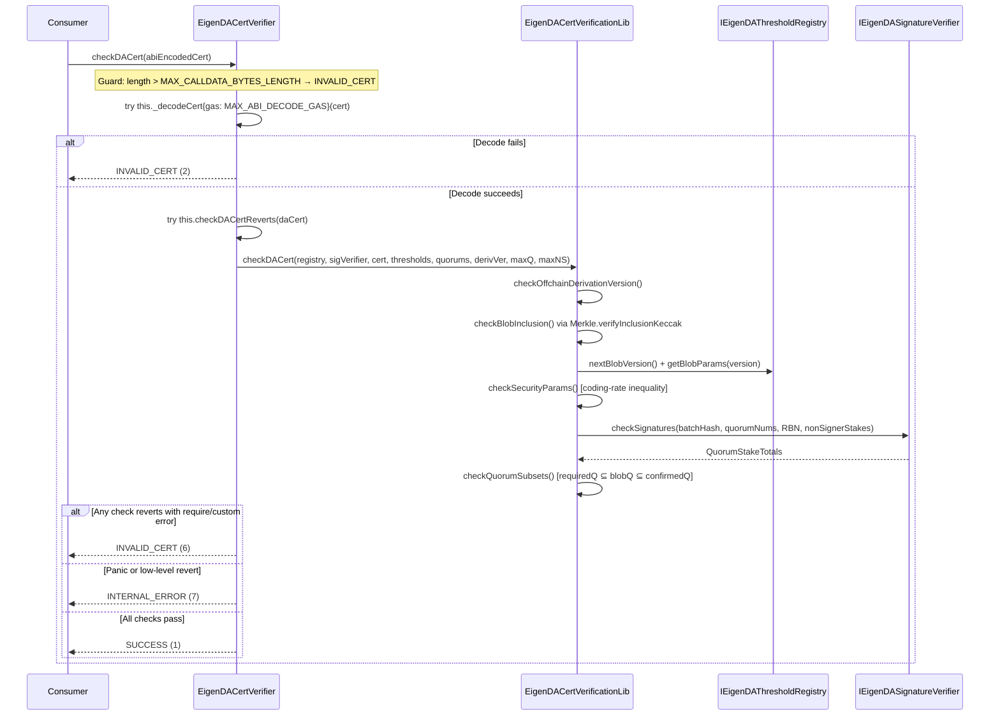
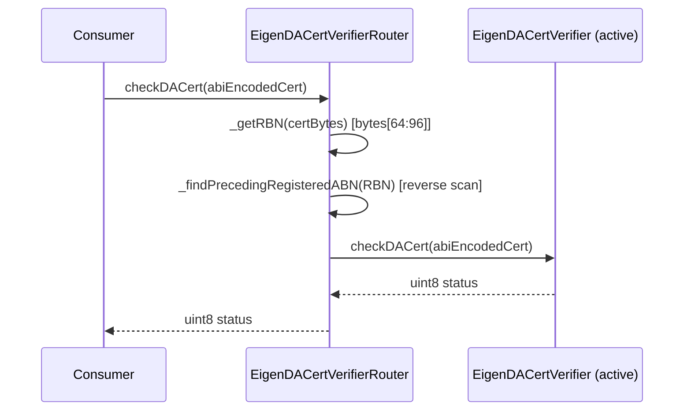
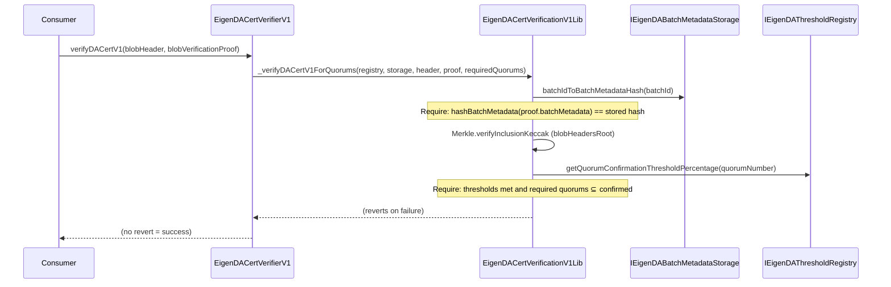
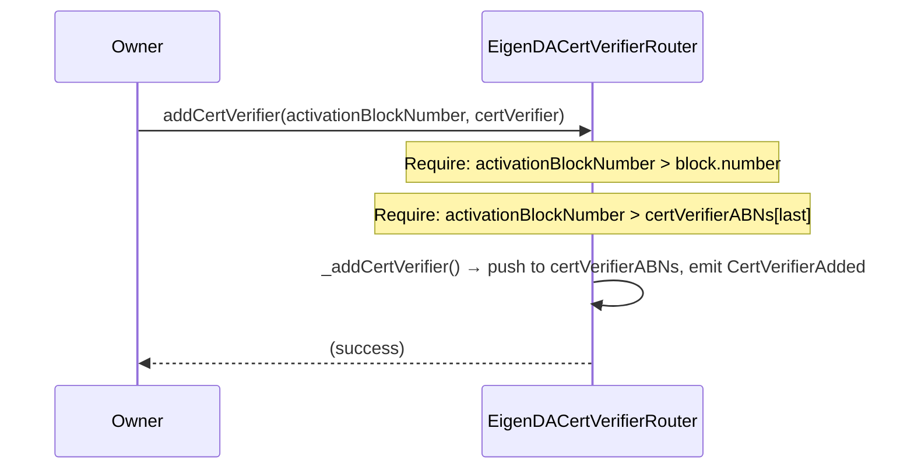

# integrations Analysis

**Analyzed by**: code-analyzer-integrations
**Timestamp**: 2026-04-10T00:00:00Z
**Application Type**: solidity-contract
**Classification**: contract
**Location**: contracts/src/integrations

## Architecture

The integrations component is a layered Solidity contract library that provides the public-facing certificate verification surface for the EigenDA protocol. All files live under `contracts/src/integrations/cert/` and are structured into four logical tiers: interface declarations, type definitions, concrete verifier contracts, and supporting libraries.

The design follows a versioned-adapter pattern. Three generations of verifier contracts exist side by side — V1 (legacy batch-hash approach), V2 (BLS-signature-based with explicit `SignedBatch`), and V4 (current, ABI-encoded cert blob). Each generation delegates all heavy lifting to a dedicated verification library (`EigenDACertVerificationV1Lib`, `EigenDACertVerificationV2Lib`, `EigenDACertVerificationLib`), keeping contract surface small and upgrade paths clean. New cert formats are introduced by deploying a new immutable verifier pointing at updated on-chain registries, not by upgrading in place.

The router tier (`EigenDACertVerifierRouter`) sits above individual verifiers and dispatches `checkDACert` calls to whichever verifier was active at the certificate's Reference Block Number (RBN). The router itself is `OwnableUpgradeable` with an OpenZeppelin proxy pattern; the underlying verifiers are all fully immutable. A `CertVerifierRouterFactory` contract provides an atomic deploy-and-initialize primitive to prevent frontrun initialization attacks.

The system is designed for composability with ZK proof systems. `checkDACert` (on both V4 verifier and router) deliberately never reverts on bad input; instead it classifies results into three HTTP-analogous status codes (SUCCESS=1, INVALID_CERT=400-equivalent, INTERNAL_ERROR=500-equivalent) so that Risc0 Steel and optimistic rollup one-step-prover contracts can consume the result without needing revert-proof capabilities.

## Key Components

- **EigenDACertTypes** (`contracts/src/integrations/cert/EigenDACertTypes.sol`): Type library defining the ABI-stable certificate structs shared across the integration layer. Declares `EigenDACertV3` and `EigenDACertV4`; both embed `BatchHeaderV2`, `BlobInclusionInfo`, and `NonSignerStakesAndSignature` from core. V4 adds a `uint16 offchainDerivationVersion` field that controls which offchain derivation pipeline (e.g. recency window, blob decode algorithm) was used to produce the cert.

- **EigenDACertVerifier** (`contracts/src/integrations/cert/EigenDACertVerifier.sol`): Current-generation (V4) immutable certificate verifier. Constructor accepts and locks `IEigenDAThresholdRegistry`, `IEigenDASignatureVerifier`, security thresholds, required quorum bytes, and an `offchainDerivationVersion`. Exposes `checkDACert(bytes calldata)` which classifies certs into SUCCESS / INVALID_CERT / INTERNAL_ERROR using a two-level try/catch that separately handles `Error(string)`, `Panic(uint256)`, and raw bytes reverts. An auxiliary `_decodeCert` is exposed as `external pure` specifically to enable a gas-capped try/catch around ABI decode.

- **EigenDACertVerificationLib** (`contracts/src/integrations/cert/libraries/EigenDACertVerificationLib.sol`): V4 verification library. The `checkDACert` function chains four checks: `checkOffchainDerivationVersion`, `checkBlobInclusion` (Merkle path against `batchRoot`), `checkSecurityParams` (coding-rate inequality against threshold registry), and `checkSignaturesAndBuildConfirmedQuorums` + `checkQuorumSubsets`. All checks revert on failure using typed custom errors. Also provides `getNonSignerStakesAndSignature` as a helper for off-chain callers constructing certs from `SignedBatch` data.

- **EigenDACertVerifierRouter** (`contracts/src/integrations/cert/router/EigenDACertVerifierRouter.sol`): Upgradeable (OwnableUpgradeable proxy) router that maps Activation Block Numbers (ABNs) to concrete cert verifier addresses. Dispatches `checkDACert` by extracting the RBN from bytes offset 64:96 of the ABI-encoded cert and performing a reverse-linear scan of registered ABNs. Only the owner may add future verifiers; ABNs must be strictly increasing and must be in the future at time of addition.

- **CertVerifierRouterFactory** (`contracts/src/integrations/cert/router/CertVerifierRouterFactory.sol`): Thin factory that atomically deploys and initializes an `EigenDACertVerifierRouter` in a single transaction, preventing frontrun initialization by untrusted parties when the router is deployed without a proxy.

- **EigenDACertVerifierV1** (`contracts/src/integrations/cert/legacy/v1/EigenDACertVerifierV1.sol`): Legacy V1 verifier that relies on an on-chain `IEigenDABatchMetadataStorage` hash map to confirm batches. Exposes `verifyDACertV1` and `verifyDACertsV1` (reverts on failure, no status code). Delegates to `EigenDACertVerificationV1Lib`.

- **EigenDACertVerificationV1Lib** (`contracts/src/integrations/cert/legacy/v1/EigenDACertVerificationV1Lib.sol`): V1 verification library. Verifies batch metadata hash via `batchIdToBatchMetadataHash`, Merkle inclusion of the blob header, quorum number consistency, threshold satisfaction per quorum, and that required quorums are a subset of confirmed quorums. Uses `require` with string error messages (pre-custom-errors style, kept for compatibility).

- **EigenDACertVerifierV2** (`contracts/src/integrations/cert/legacy/v2/EigenDACertVerifierV2.sol`): V2 verifier that introduces BLS signature verification via `IEigenDASignatureVerifier`. Adds `verifyDACertV2`, `verifyDACertV2FromSignedBatch`, `verifyDACertV2ForZKProof` (returns bool instead of reverting), and `getNonSignerStakesAndSignature`. All virtual internal accessors allow derived contracts to override injected dependencies.

- **EigenDACertVerificationV2Lib** (`contracts/src/integrations/cert/legacy/v2/EigenDACertVerificationV2Lib.sol`): V2 verification library. Mirrors V4 logic but uses a `StatusCode` enum with five granular variants plus a `revertOnError` dispatcher. Security parameter formula differs from V4: `n = (10000 - (1000000/gamma)/codingRate) * numChunks` vs V4's linearized inequality.

- **IEigenDACertVerifierBase** (`contracts/src/integrations/cert/interfaces/IEigenDACertVerifierBase.sol`): Minimal interface exposing only `checkDACert(bytes calldata) returns (uint8)`. This is the interface that rollup derivation pipelines and ZK proof systems depend on — deliberately narrow so it can be implemented by any verifier version.

- **IEigenDACertVerifier** (`contracts/src/integrations/cert/interfaces/IEigenDACertVerifier.sol`): Extends `IEigenDACertVerifierBase` with five getter functions (`eigenDAThresholdRegistry`, `eigenDASignatureVerifier`, `securityThresholds`, `quorumNumbersRequired`, `offchainDerivationVersion`) that allow off-chain tooling to reconstruct the exact parameters needed to construct a valid V4 cert.

- **IEigenDACertVerifierRouter** (`contracts/src/integrations/cert/interfaces/IEigenDACertVerifierRouter.sol`): Extends `IEigenDACertVerifierBase` with `getCertVerifierAt(uint32 referenceBlockNumber)` for off-chain lookups of which verifier is active at a given block.

- **IVersionedEigenDACertVerifier** (`contracts/src/integrations/cert/interfaces/IVersionedEigenDACertVerifier.sol`): Single-function interface returning `certVersion() uint8`, used by off-chain indexers to determine how to encode a cert for a specific verifier deployment.

- **IEigenDACertTypeBindings** (`contracts/src/integrations/cert/interfaces/IEigenDACertTypeBindings.sol`): Compiler workaround interface. Solidity does not emit ABI entries for structs unless they appear in function signatures. This interface declares `dummyVerifyDACertV1`, `dummyVerifyDACertV3`, and `dummyVerifyDACertV4` solely to force the compiler to include `BlobHeader`, `EigenDACertV3`, and `EigenDACertV4` ABI fragments in the output for use by Go/TypeScript ABIgen tooling.

- **IEigenDACertVerifierLegacy** (`contracts/src/integrations/cert/legacy/IEigenDACertVerifierLegacy.sol`): Combined V1+V2 legacy interface extending `IEigenDAThresholdRegistry`. Declared for backwards-compatible consumers that need to call old verifier methods through a single interface type.

## Data Flows

### 1. V4 Certificate Verification (Current Path)

**Flow Description**: A rollup or consumer contract calls `checkDACert` with an ABI-encoded `EigenDACertV4` and receives a `uint8` status without any risk of revert.



**Detailed Steps**:

1. **Input size guard** (Consumer → EigenDACertVerifier)
   - Method: `checkDACert(bytes calldata abiEncodedCert)`
   - Guard: `abiEncodedCert.length > MAX_CALLDATA_BYTES_LENGTH (262144)` → returns `INVALID_CERT` immediately
   - Purpose: prevents out-of-gas attacks on the subsequent ABI decode

2. **Gas-capped ABI decode** (EigenDACertVerifier → self)
   - Method: `this._decodeCert{gas: MAX_ABI_DECODE_GAS}(abiEncodedCert)` with 2,097,152 gas cap
   - Decode failure (Panic) → returns `INVALID_CERT`

3. **Offchain derivation version check** (EigenDACertVerificationLib)
   - `cert.offchainDerivationVersion` must equal the constructor-stored `_offchainDerivationVersion`
   - Custom error: `InvalidOffchainDerivationVersion`

4. **Merkle inclusion** (EigenDACertVerificationLib)
   - Hash: `keccak256(abi.encode(batchHeader))` → match `blobInclusionInfo.inclusionProof` against `batchHeader.batchRoot`
   - Custom error: `InvalidInclusionProof`

5. **Security parameter check** (EigenDACertVerificationLib → IEigenDAThresholdRegistry)
   - Fetches `VersionedBlobParams` from registry; validates `codingRate * (numChunks - maxNumOperators) * (confirmThresh - adversaryThresh) >= 100 * numChunks`
   - Custom error: `SecurityAssumptionsNotMet`

6. **BLS signature check** (EigenDACertVerificationLib → IEigenDASignatureVerifier)
   - Calls `signatureVerifier.checkSignatures(batchHash, signedQuorumNumbers, RBN, nonSignerStakesAndSignature)`
   - Builds `confirmedQuorumsBitmap` from quorums meeting `confirmationThreshold`

7. **Quorum subset validation** (EigenDACertVerificationLib)
   - Enforces: `requiredQuorums ⊆ blobQuorums ⊆ confirmedQuorums`
   - Custom errors: `BlobQuorumsNotSubset`, `RequiredQuorumsNotSubset`

**Error Paths**:
- `Error(string memory)` catch → `INVALID_CERT` (string-message require from eigenlayer-middleware BLSSignatureChecker)
- `Panic(uint256)` catch → `INTERNAL_ERROR` (arithmetic overflow, array out of bounds = bug)
- `bytes memory reason` with `length == 0` → `INTERNAL_ERROR` (EVM out-of-gas / stack underflow)
- `bytes memory reason` with `length >= 4` → `INVALID_CERT` (custom error from a require)

---

### 2. Router-Dispatched Verification

**Flow Description**: A consumer that holds a `IEigenDACertVerifierRouter` address calls `checkDACert`; the router extracts the RBN from the cert bytes, finds the active verifier, and delegates.



**Detailed Steps**:

1. **RBN extraction**: reads bytes `[64:96]` of the ABI-encoded cert (offset 0:32 = pointer, 32:64 = batch header root, 64:96 = RBN); reverts `InvalidCertLength` if `cert.length < 96`.
2. **ABN lookup**: `_findPrecedingRegisteredABN` iterates `certVerifierABNs` in reverse (newest first) to find the highest ABN ≤ RBN.
3. **Delegation**: forwards the full calldata to `certVerifiers[ABN].checkDACert(abiEncodedCert)`.

---

### 3. V1 Legacy Certificate Verification

**Flow Description**: A consumer using the V1 API passes a `BlobHeader` + `BlobVerificationProof`; the verifier confirms the batch exists in on-chain metadata storage and validates Merkle inclusion + threshold.



---

### 4. Router Admin: Adding a New Verifier

**Flow Description**: The owner registers a new cert verifier at a future activation block number.



## Dependencies

### External Libraries

- **@openzeppelin/contracts** (4.7.0) [access-control]: OpenZeppelin standard contracts. Used in `EigenDACertVerifierRouter` via `OwnableUpgradeable` for ownership management of the ABN registry. The `initializer` modifier from `OwnableUpgradeable` prevents re-initialization. Imported in: `contracts/src/integrations/cert/router/EigenDACertVerifierRouter.sol`.

- **@openzeppelin/contracts-upgradeable** (4.7.0) [upgrade-framework]: Upgradeable variants of OpenZeppelin contracts. Provides `OwnableUpgradeable` with storage-gap-safe layout for use behind a proxy. Imported in: `contracts/src/integrations/cert/router/EigenDACertVerifierRouter.sol`.

- **eigenlayer-middleware** (forge submodule) [avs-framework]: EigenLayer middleware library. Provides: `BN254` (BN254 elliptic curve operations, G1 hashing), `BitmapUtils` (bitmap set operations for quorum bitmaps), `Merkle` (Keccak Merkle inclusion proofs), `OperatorStateRetriever` (on-chain operator state index retrieval), `IRegistryCoordinator` (quorum membership interface). Imported in: `EigenDACertVerificationLib.sol`, `EigenDACertVerificationV1Lib.sol`, `EigenDACertVerificationV2Lib.sol`, `EigenDACertVerifierV2.sol`.

- **forge-std** (forge submodule) [testing]: Foundry standard library. Used in test files only; not imported in integration contracts.

### Internal Dependencies (core)

- **IEigenDAThresholdRegistry** (`contracts/src/core/interfaces/IEigenDAThresholdRegistry.sol`): Called in all three verification generations. V1Lib calls `getQuorumConfirmationThresholdPercentage` per-quorum and `quorumConfirmationThresholdPercentages`. V4Lib calls `nextBlobVersion()` to validate blob version bounds and `getBlobParams(version)` to retrieve `VersionedBlobParams` (numChunks, maxNumOperators, codingRate) for the security inequality. Imported in: `EigenDACertVerificationLib.sol`, `EigenDACertVerificationV1Lib.sol`, `EigenDACertVerificationV2Lib.sol`, `EigenDACertVerifier.sol`, `EigenDACertVerifierV1.sol`, `EigenDACertVerifierV2.sol`.

- **IEigenDASignatureVerifier** (`contracts/src/core/interfaces/IEigenDASignatureVerifier.sol`): BLS signature verification. V4Lib and V2Lib call `signatureVerifier.checkSignatures(batchHash, signedQuorumNumbers, RBN, nonSignerStakesAndSignature)` which returns `QuorumStakeTotals`. The totals are used to compute `confirmedQuorumsBitmap`. Imported in: `EigenDACertVerificationLib.sol`, `EigenDACertVerificationV2Lib.sol`, `EigenDACertVerifier.sol`, `EigenDACertVerifierV2.sol`.

- **IEigenDABatchMetadataStorage** (`contracts/src/core/interfaces/IEigenDABatchMetadataStorage.sol`): V1-only dependency. `batchIdToBatchMetadataHash(batchId)` is called by V1Lib to confirm that the batch header hash has been recorded on-chain by the `EigenDAServiceManager`. Imported in: `EigenDACertVerificationV1Lib.sol`, `EigenDACertVerifierV1.sol`.

- **EigenDATypesV1** (`contracts/src/core/libraries/v1/EigenDATypesV1.sol`): Core V1 type definitions used pervasively. Key types: `SecurityThresholds`, `NonSignerStakesAndSignature`, `QuorumStakeTotals`, `VersionedBlobParams`, `BlobHeader`, `BlobVerificationProof`, `BatchMetadata`. Imported in all verifier contracts and libraries.

- **EigenDATypesV2** (`contracts/src/core/libraries/v2/EigenDATypesV2.sol`): V2 type definitions. Key types: `BatchHeaderV2`, `BlobInclusionInfo`, `BlobCertificate`, `BlobHeaderV2`, `SignedBatch`. Used by V4 (via `EigenDACertTypes`) and V2 verifiers. Imported in: `EigenDACertTypes.sol`, `EigenDACertVerificationLib.sol`, `EigenDACertVerificationV2Lib.sol`, `EigenDACertVerifierV2.sol`.

- **IEigenDASemVer** (`contracts/src/core/interfaces/IEigenDASemVer.sol`): Semantic versioning interface returning `(major, minor, patch)`. Implemented by `EigenDACertVerifier` which declares `MAJOR_VERSION=4, MINOR_VERSION=0, PATCH_VERSION=0`. Imported in: `EigenDACertVerifier.sol`.

- **EigenDARegistryCoordinator** (`contracts/src/core/EigenDARegistryCoordinator.sol`): `EigenDACertVerifierV2` imports `IRegistryCoordinator` from the core EigenDARegistryCoordinator re-export (rather than directly from eigenlayer-middleware). Used for passing to `operatorStateRetriever.getCheckSignaturesIndices`.

## API Surface

### Stable Integration Interface

All rollup consumers and third-party integrators should program against `IEigenDACertVerifierBase`:

```solidity
interface IEigenDACertVerifierBase {
    function checkDACert(bytes calldata abiEncodedCert) external view returns (uint8 status);
}
```

Status codes:
- `1` = SUCCESS
- `6` = INVALID_CERT (invalid cert data, bad Merkle proof, threshold not met, wrong quorums)
- `7` = INTERNAL_ERROR (contract bug, out-of-gas, Solidity Panic)

### EigenDACertVerifier (V4) — Current

```solidity
// Verification
function checkDACert(bytes calldata abiEncodedCert) external view returns (uint8);
function checkDACertReverts(EigenDACertV4 calldata daCert) external view;  // internal tool

// Configuration getters (for off-chain cert construction)
function eigenDAThresholdRegistry() external view returns (IEigenDAThresholdRegistry);
function eigenDASignatureVerifier() external view returns (IEigenDASignatureVerifier);
function securityThresholds() external view returns (DATypesV1.SecurityThresholds memory);
function quorumNumbersRequired() external view returns (bytes memory);
function offchainDerivationVersion() external view returns (uint16);

// Version discovery
function certVersion() external pure returns (uint8);   // returns 4
function semver() external pure returns (uint8 major, uint8 minor, uint8 patch);  // 4.0.0
```

### EigenDACertVerifierRouter

```solidity
// Verification (delegates to active verifier per RBN)
function checkDACert(bytes calldata abiEncodedCert) external view returns (uint8);
function getCertVerifierAt(uint32 referenceBlockNumber) external view returns (address);

// Admin (onlyOwner)
function addCertVerifier(uint32 activationBlockNumber, address certVerifier) external;

// Initialization (via proxy / factory)
function initialize(address initialOwner, uint32[] memory initABNs, address[] memory initCertVerifiers) external;

// State inspection
mapping(uint32 => address) public certVerifiers;
uint32[] public certVerifierABNs;
```

### CertVerifierRouterFactory

```solidity
function deploy(
    address initialOwner,
    uint32[] memory initABNs,
    address[] memory initialCertVerifiers
) external returns (EigenDACertVerifierRouter);
```

### EigenDACertVerifierV2 (Legacy)

```solidity
function verifyDACertV2(BatchHeaderV2, BlobInclusionInfo, NonSignerStakesAndSignature, bytes) external view;
function verifyDACertV2FromSignedBatch(SignedBatch, BlobInclusionInfo) external view;
function verifyDACertV2ForZKProof(BatchHeaderV2, BlobInclusionInfo, NonSignerStakesAndSignature, bytes) external view returns (bool);
function getNonSignerStakesAndSignature(SignedBatch) external view returns (NonSignerStakesAndSignature memory);
```

### EigenDACertVerifierV1 (Legacy)

```solidity
function verifyDACertV1(BlobHeader, BlobVerificationProof) external view;
function verifyDACertsV1(BlobHeader[], BlobVerificationProof[]) external view;
function quorumAdversaryThresholdPercentages() external view returns (bytes memory);
function quorumConfirmationThresholdPercentages() external view returns (bytes memory);
function quorumNumbersRequired() public view returns (bytes memory);
function getBlobParams(uint16 version) public view returns (VersionedBlobParams memory);
```

## Security Constraints

### Immutability as Security Model

V4 (`EigenDACertVerifier`) and V1/V2 legacy verifiers are fully immutable — all constructor parameters (`_eigenDAThresholdRegistry`, `_eigenDASignatureVerifier`, `_securityThresholds`, `_quorumNumbersRequired`, `_offchainDerivationVersion`) are stored as `immutable` or `internal` and cannot be changed post-deployment. Security policy changes require deploying a new verifier and registering it in the router with a future ABN.

### Constructor-Level Threshold Invariant

Both V4 (`EigenDACertVerifier.sol:86-90`) and V2 (`EigenDACertVerifierV2.sol:50-52`) enforce `confirmationThreshold > adversaryThreshold` in the constructor, reverting with `InvalidSecurityThresholds`. This prevents deployment of a verifier with provably insecure parameters.

### Calldata Size Cap

`checkDACert` gates on `abiEncodedCert.length > MAX_CALLDATA_BYTES_LENGTH` (262,144 bytes) before any processing. This prevents a griefing attack where a malicious relayer submits an oversized cert that causes out-of-gas during ABI decode, making honest honest-party invocations underprovable.

### Gas-Capped ABI Decode

The inner `_decodeCert` call is gas-capped at `MAX_ABI_DECODE_GAS` (2,097,152) via `this._decodeCert{gas: ...}`, isolating any decode-triggered Panic from the outer try/catch. Without this isolation, a Panic from malformed calldata would be mis-classified as INTERNAL_ERROR when it should be INVALID_CERT.

### Router ABN Monotonicity

`addCertVerifier` enforces that new ABNs are strictly greater than both `block.number` (must be in the future) and the last registered ABN (monotonically increasing). This ensures the reverse-scan lookup in `_findPrecedingRegisteredABN` is always correct and no cert can be retroactively re-classified by a malicious owner inserting a backdated verifier.

### Quorum Subset Hierarchy

All verification generations enforce the invariant `requiredQuorums ⊆ blobQuorums ⊆ confirmedQuorums`. V4 and V2 further enforce via bitmap operations (`BitmapUtils.isSubsetOf`), ensuring a cert cannot claim availability on quorums not actually signed or not present in the blob header.

### No Storage in Verifier, Proxy Only in Router

Concrete verifier contracts hold no mutable state. Only the `EigenDACertVerifierRouter` uses an upgradeable proxy pattern and `OwnableUpgradeable`. This limits the attack surface for storage collision or proxy-hijack vulnerabilities to a single well-audited contract.

## Code Examples

### Example 1: V4 Two-Level Try/Catch Classification

```solidity
// contracts/src/integrations/cert/EigenDACertVerifier.sol:115-168
function checkDACert(bytes calldata abiEncodedCert) external view returns (uint8) {
    if (abiEncodedCert.length > MAX_CALLDATA_BYTES_LENGTH) {
        return uint8(StatusCode.INVALID_CERT);
    }

    CT.EigenDACertV4 memory daCert;
    try this._decodeCert{gas: MAX_ABI_DECODE_GAS}(abiEncodedCert) returns (CT.EigenDACertV4 memory _daCert) {
        daCert = _daCert;
    } catch {
        return uint8(StatusCode.INVALID_CERT);
    }

    try this.checkDACertReverts(daCert) {
        return uint8(StatusCode.SUCCESS);
    } catch Error(string memory) {
        return uint8(StatusCode.INVALID_CERT);    // string-message require (BLSSignatureChecker compatibility)
    } catch Panic(uint256) {
        return uint8(StatusCode.INTERNAL_ERROR);  // arithmetic overflow, array OOB = bug
    } catch (bytes memory reason) {
        if (reason.length == 0) {
            return uint8(StatusCode.INTERNAL_ERROR); // EVM out-of-gas / stack underflow
        }
        return uint8(StatusCode.INVALID_CERT);    // custom error = invalid cert
    }
}
```

### Example 2: Security Parameter Inequality (V4)

```solidity
// contracts/src/integrations/cert/libraries/EigenDACertVerificationLib.sol:181-193
uint256 lhs = blobParams.codingRate * (blobParams.numChunks - blobParams.maxNumOperators)
    * (securityThresholds.confirmationThreshold - securityThresholds.adversaryThreshold);
uint256 rhs = 100 * blobParams.numChunks;

if (!(lhs >= rhs)) {
    revert SecurityAssumptionsNotMet(
        securityThresholds.confirmationThreshold,
        securityThresholds.adversaryThreshold,
        blobParams.codingRate,
        blobParams.numChunks,
        blobParams.maxNumOperators
    );
}
```

### Example 3: ABN Monotonicity Enforcement in Router

```solidity
// contracts/src/integrations/cert/router/EigenDACertVerifierRouter.sol:67-77
function addCertVerifier(uint32 activationBlockNumber, address certVerifier) external onlyOwner {
    if (activationBlockNumber <= block.number) {
        revert ABNNotInFuture(activationBlockNumber);
    }
    if (activationBlockNumber <= certVerifierABNs[certVerifierABNs.length - 1]) {
        revert ABNNotGreaterThanLast(activationBlockNumber);
    }
    _addCertVerifier(activationBlockNumber, certVerifier);
}
```

### Example 4: RBN Extraction from ABI-Encoded Cert

```solidity
// contracts/src/integrations/cert/router/EigenDACertVerifierRouter.sol:87-95
function _getRBN(bytes calldata certBytes) internal pure returns (uint32) {
    // 0:32 is the pointer to the start of the byte array.
    // 32:64 is the batch header root
    // 64:96 is the RBN
    if (certBytes.length < 96) {
        revert InvalidCertLength();
    }
    return abi.decode(certBytes[64:96], (uint32));
}
```

### Example 5: EigenDACertV4 Type Layout (with offchainDerivationVersion)

```solidity
// contracts/src/integrations/cert/EigenDACertTypes.sol:19-29
struct EigenDACertV4 {
    DATypesV2.BatchHeaderV2 batchHeader;
    DATypesV2.BlobInclusionInfo blobInclusionInfo;
    DATypesV1.NonSignerStakesAndSignature nonSignerStakesAndSignature;
    bytes signedQuorumNumbers;
    // Versions the offchain logic (recency_window, blob decoding algorithm, etc.)
    uint16 offchainDerivationVersion;
}
```

## Files Analyzed

- `contracts/src/integrations/cert/EigenDACertTypes.sol` (30 lines) — V3/V4 cert struct definitions
- `contracts/src/integrations/cert/EigenDACertVerifier.sol` (222 lines) — Current V4 immutable verifier contract
- `contracts/src/integrations/cert/interfaces/IEigenDACertVerifier.sol` (29 lines) — V4 configuration getter interface
- `contracts/src/integrations/cert/interfaces/IEigenDACertVerifierBase.sol` (12 lines) — Minimal checkDACert interface
- `contracts/src/integrations/cert/interfaces/IEigenDACertVerifierRouter.sol` (10 lines) — Router interface
- `contracts/src/integrations/cert/interfaces/IVersionedEigenDACertVerifier.sol` (8 lines) — certVersion interface
- `contracts/src/integrations/cert/interfaces/IEigenDACertTypeBindings.sol` (20 lines) — ABI generation workaround
- `contracts/src/integrations/cert/libraries/EigenDACertVerificationLib.sol` (353 lines) — V4 verification logic library
- `contracts/src/integrations/cert/router/EigenDACertVerifierRouter.sol` (118 lines) — ABN-based cert verifier router
- `contracts/src/integrations/cert/router/CertVerifierRouterFactory.sol` (17 lines) — Atomic deploy+init factory
- `contracts/src/integrations/cert/legacy/IEigenDACertVerifierLegacy.sol` (81 lines) — V1+V2 combined legacy interface
- `contracts/src/integrations/cert/legacy/v1/EigenDACertVerifierV1.sol` (100 lines) — Legacy V1 verifier
- `contracts/src/integrations/cert/legacy/v1/EigenDACertVerificationV1Lib.sol` (244 lines) — V1 verification logic
- `contracts/src/integrations/cert/legacy/v2/EigenDACertVerifierV2.sol` (184 lines) — Legacy V2 verifier
- `contracts/src/integrations/cert/legacy/v2/EigenDACertVerificationV2Lib.sol` (382 lines) — V2 verification logic
- `contracts/package.json` (31 lines) — NPM package manifest; declares @openzeppelin/contracts 4.7.0
- `contracts/foundry.toml` (partial) — Foundry project config; solc 0.8.29, optimizer 200 runs

## Analysis Data

```json
{
  "summary": "The integrations component provides the public-facing EigenDA certificate verification surface for rollup and third-party consumers. It contains three generations of immutable cert verifier contracts (V1 legacy batch-hash, V2 BLS-signature, V4 current ABI-encoded cert), an upgradeable ABN-based router that dispatches to the correct verifier by reference block number, and a factory for safe atomic deployment. All verification is read-only and delegates into library contracts. The V4 checkDACert never reverts, classifying results as SUCCESS/INVALID_CERT/INTERNAL_ERROR for compatibility with ZK proof systems (Risc0 Steel) and optimistic rollup one-step provers.",
  "architecture_pattern": "versioned-adapter-with-immutable-verifiers",
  "key_modules": [
    "EigenDACertVerifier (V4 immutable verifier)",
    "EigenDACertVerificationLib (V4 verification library)",
    "EigenDACertVerifierRouter (ABN-based upgrade router)",
    "CertVerifierRouterFactory (atomic deploy factory)",
    "EigenDACertTypes (cert struct definitions)",
    "EigenDACertVerifierV1 (legacy V1)",
    "EigenDACertVerificationV1Lib (V1 library)",
    "EigenDACertVerifierV2 (legacy V2)",
    "EigenDACertVerificationV2Lib (V2 library)",
    "IEigenDACertVerifierBase (stable integration interface)",
    "IEigenDACertTypeBindings (ABI generation workaround)"
  ],
  "api_endpoints": [
    "IEigenDACertVerifierBase.checkDACert(bytes) returns (uint8)",
    "IEigenDACertVerifierRouter.getCertVerifierAt(uint32) returns (address)",
    "EigenDACertVerifierRouter.addCertVerifier(uint32, address)",
    "EigenDACertVerifierRouter.initialize(address, uint32[], address[])",
    "CertVerifierRouterFactory.deploy(address, uint32[], address[]) returns (EigenDACertVerifierRouter)",
    "EigenDACertVerifierV2.verifyDACertV2FromSignedBatch(SignedBatch, BlobInclusionInfo)",
    "EigenDACertVerifierV2.verifyDACertV2ForZKProof(...) returns (bool)",
    "EigenDACertVerifierV1.verifyDACertV1(BlobHeader, BlobVerificationProof)",
    "EigenDACertVerifierV1.verifyDACertsV1(BlobHeader[], BlobVerificationProof[])"
  ],
  "data_flows": [
    "V4 cert verification: Consumer → EigenDACertVerifier.checkDACert → gas-capped _decodeCert → checkDACertReverts → EigenDACertVerificationLib (offchain version check, Merkle inclusion, security params via ThresholdRegistry, BLS signatures via SignatureVerifier, quorum subset checks) → uint8 status",
    "Router dispatch: Consumer → EigenDACertVerifierRouter.checkDACert → RBN extract [bytes 64:96] → reverse ABN scan → active EigenDACertVerifier.checkDACert → uint8 status",
    "V1 legacy: Consumer → EigenDACertVerifierV1.verifyDACertV1 → EigenDACertVerificationV1Lib → BatchMetadataStorage hash check + Merkle inclusion + quorum threshold checks → revert or success",
    "V2 legacy ZK: Consumer → EigenDACertVerifierV2.verifyDACertV2ForZKProof → EigenDACertVerificationV2Lib.checkDACertV2 → (StatusCode, errParams) → bool return",
    "Router admin: Owner → EigenDACertVerifierRouter.addCertVerifier(futureABN, newVerifier) → ABN monotonicity check → append to certVerifierABNs"
  ],
  "tech_stack": [
    "solidity 0.8.29",
    "foundry/forge",
    "openzeppelin-contracts-upgradeable 4.7.0",
    "eigenlayer-middleware (BN254, BitmapUtils, Merkle, OperatorStateRetriever)"
  ],
  "external_integrations": [
    "ethereum",
    "risc0-steel (zk proof compatibility via non-reverting checkDACert)",
    "optimistic-rollup one-step provers (status code classification)"
  ],
  "component_interactions": [
    {
      "target": "core-IEigenDAThresholdRegistry",
      "type": "integrates_with",
      "protocol": "solidity-interface-call",
      "description": "All verifier generations call nextBlobVersion() and getBlobParams() to validate blob version bounds and retrieve coding parameters for the security parameter inequality check"
    },
    {
      "target": "core-IEigenDASignatureVerifier",
      "type": "integrates_with",
      "protocol": "solidity-interface-call",
      "description": "V4 and V2 verifiers call checkSignatures() to perform BLS quorum signature verification and receive QuorumStakeTotals for threshold comparison"
    },
    {
      "target": "core-IEigenDABatchMetadataStorage",
      "type": "integrates_with",
      "protocol": "solidity-interface-call",
      "description": "V1 verifier calls batchIdToBatchMetadataHash() to confirm batch existence recorded by EigenDAServiceManager before verifying Merkle inclusion"
    },
    {
      "target": "eigenlayer-middleware-BLSSignatureChecker",
      "type": "integrates_with",
      "protocol": "solidity-library-call",
      "description": "Indirect dependency: IEigenDASignatureVerifier wraps BLSSignatureChecker; string-message require compatibility in the V4 catch Error(string) block explicitly handles BLSSignatureChecker's pre-custom-error require messages"
    }
  ]
}
```

## Citations

```json
[
  {
    "file_path": "contracts/src/integrations/cert/EigenDACertTypes.sol",
    "start_line": 11,
    "end_line": 30,
    "claim": "EigenDACertV3 and EigenDACertV4 are the integration layer's primary cert struct definitions; V4 extends V3 by adding offchainDerivationVersion",
    "section": "Key Components",
    "snippet": "struct EigenDACertV4 { ... uint16 offchainDerivationVersion; }"
  },
  {
    "file_path": "contracts/src/integrations/cert/EigenDACertVerifier.sol",
    "start_line": 27,
    "end_line": 37,
    "claim": "EigenDACertVerifier V4 has four hard-coded limits: MAX_CALLDATA_BYTES_LENGTH=262144, MAX_ABI_DECODE_GAS=2097152, MAX_QUORUM_COUNT=5, MAX_NONSIGNER_COUNT_ALL_QUORUM=415",
    "section": "Key Components",
    "snippet": "uint256 internal constant MAX_CALLDATA_BYTES_LENGTH = 262_144;\nuint256 internal constant MAX_ABI_DECODE_GAS = 2_097_152;\nuint256 internal constant MAX_QUORUM_COUNT = 5;\nuint256 internal constant MAX_NONSIGNER_COUNT_ALL_QUORUM = 415;"
  },
  {
    "file_path": "contracts/src/integrations/cert/EigenDACertVerifier.sol",
    "start_line": 65,
    "end_line": 77,
    "claim": "StatusCode enum classifies results into NULL_ERROR, SUCCESS, four backward-compat unused variants, INVALID_CERT, and INTERNAL_ERROR",
    "section": "Key Components",
    "snippet": "enum StatusCode { NULL_ERROR, SUCCESS, ... INVALID_CERT, INTERNAL_ERROR }"
  },
  {
    "file_path": "contracts/src/integrations/cert/EigenDACertVerifier.sol",
    "start_line": 86,
    "end_line": 97,
    "claim": "Constructor enforces confirmationThreshold > adversaryThreshold and 0 < quorumNumbersRequired.length <= 256",
    "section": "Security Constraints",
    "snippet": "if (initSecurityThresholds.confirmationThreshold <= initSecurityThresholds.adversaryThreshold) { revert InvalidSecurityThresholds(); }\nif (initQuorumNumbersRequired.length == 0 || initQuorumNumbersRequired.length > 256) { revert InvalidQuorumNumbersRequired(...); }"
  },
  {
    "file_path": "contracts/src/integrations/cert/EigenDACertVerifier.sol",
    "start_line": 115,
    "end_line": 168,
    "claim": "checkDACert uses two-level try/catch: outer catches decode Panic, inner classifies Error(string) as INVALID_CERT, Panic as INTERNAL_ERROR, empty bytes as INTERNAL_ERROR, and non-empty custom error bytes as INVALID_CERT",
    "section": "Data Flows",
    "snippet": "try this._decodeCert{gas: MAX_ABI_DECODE_GAS}(abiEncodedCert) ... catch { return uint8(StatusCode.INVALID_CERT); }\ntry this.checkDACertReverts(daCert) { ... } catch Error(string memory) { return uint8(StatusCode.INVALID_CERT); } catch Panic(uint256) { return uint8(StatusCode.INTERNAL_ERROR); }"
  },
  {
    "file_path": "contracts/src/integrations/cert/EigenDACertVerifier.sol",
    "start_line": 103,
    "end_line": 105,
    "claim": "_decodeCert is exposed as external pure specifically to enable a gas-capped try/catch around ABI decode and should not be treated as part of the public API",
    "section": "Key Components",
    "snippet": "/// @dev This function is external for the purpose of try/catch'ing it inside checkDACert,\n/// and should be considered an implementation detail."
  },
  {
    "file_path": "contracts/src/integrations/cert/libraries/EigenDACertVerificationLib.sol",
    "start_line": 82,
    "end_line": 122,
    "claim": "V4 checkDACert chains: checkOffchainDerivationVersion, checkBlobInclusion, checkSecurityParams, checkSignaturesAndBuildConfirmedQuorums, checkQuorumSubsets",
    "section": "Data Flows",
    "snippet": "checkOffchainDerivationVersion(...); checkBlobInclusion(...); checkSecurityParams(...); uint256 confirmedQuorumsBitmap = checkSignaturesAndBuildConfirmedQuorums(...); checkQuorumSubsets(...);"
  },
  {
    "file_path": "contracts/src/integrations/cert/libraries/EigenDACertVerificationLib.sol",
    "start_line": 135,
    "end_line": 142,
    "claim": "checkBlobInclusion uses Merkle.verifyInclusionKeccak against batchHeader.batchRoot with the hash of the blob certificate",
    "section": "Data Flows",
    "snippet": "bool isValid = Merkle.verifyInclusionKeccak(\n    blobInclusionInfo.inclusionProof, rootHash, encodedBlobHash, blobInclusionInfo.blobIndex\n);"
  },
  {
    "file_path": "contracts/src/integrations/cert/libraries/EigenDACertVerificationLib.sol",
    "start_line": 159,
    "end_line": 163,
    "claim": "checkSecurityParams validates blobVersion < nextBlobVersion before fetching params to prevent divide-by-zero from zero codingRate",
    "section": "Security Constraints",
    "snippet": "uint16 nextBlobVersion = eigenDAThresholdRegistry.nextBlobVersion();\nif (blobVersion >= nextBlobVersion) { revert InvalidBlobVersion(blobVersion, nextBlobVersion); }"
  },
  {
    "file_path": "contracts/src/integrations/cert/libraries/EigenDACertVerificationLib.sol",
    "start_line": 181,
    "end_line": 193,
    "claim": "V4 security inequality: codingRate*(numChunks-maxNumOperators)*(confirmThresh-adversaryThresh) >= 100*numChunks",
    "section": "Data Flows",
    "snippet": "uint256 lhs = blobParams.codingRate * (blobParams.numChunks - blobParams.maxNumOperators) * (securityThresholds.confirmationThreshold - securityThresholds.adversaryThreshold);\nuint256 rhs = 100 * blobParams.numChunks;\nif (!(lhs >= rhs)) { revert SecurityAssumptionsNotMet(...); }"
  },
  {
    "file_path": "contracts/src/integrations/cert/libraries/EigenDACertVerificationLib.sol",
    "start_line": 255,
    "end_line": 268,
    "claim": "checkQuorumSubsets enforces requiredQuorums ⊆ blobQuorums ⊆ confirmedQuorums using BitmapUtils.isSubsetOf",
    "section": "Security Constraints",
    "snippet": "uint256 blobQuorumsBitmap = BitmapUtils.orderedBytesArrayToBitmap(blobQuorumNumbers);\nif (!BitmapUtils.isSubsetOf(blobQuorumsBitmap, confirmedQuorumsBitmap)) { revert BlobQuorumsNotSubset(...); }\nif (!BitmapUtils.isSubsetOf(requiredQuorumsBitmap, blobQuorumsBitmap)) { revert RequiredQuorumsNotSubset(...); }"
  },
  {
    "file_path": "contracts/src/integrations/cert/router/EigenDACertVerifierRouter.sol",
    "start_line": 8,
    "end_line": 16,
    "claim": "EigenDACertVerifierRouter is OwnableUpgradeable and maintains a mapping of ABN→verifier address plus an ordered ABN array",
    "section": "Key Components",
    "snippet": "contract EigenDACertVerifierRouter is IEigenDACertVerifierRouter, OwnableUpgradeable {\n    mapping(uint32 => address) public certVerifiers;\n    uint32[] public certVerifierABNs;"
  },
  {
    "file_path": "contracts/src/integrations/cert/router/EigenDACertVerifierRouter.sol",
    "start_line": 28,
    "end_line": 30,
    "claim": "Router's checkDACert extracts RBN then delegates to the verifier active at that block",
    "section": "Data Flows",
    "snippet": "function checkDACert(bytes calldata abiEncodedCert) external view returns (uint8) {\n    return IEigenDACertVerifierBase(getCertVerifierAt(_getRBN(abiEncodedCert))).checkDACert(abiEncodedCert);\n}"
  },
  {
    "file_path": "contracts/src/integrations/cert/router/EigenDACertVerifierRouter.sol",
    "start_line": 67,
    "end_line": 77,
    "claim": "addCertVerifier enforces ABN must be in the future and strictly greater than the last registered ABN",
    "section": "Security Constraints",
    "snippet": "if (activationBlockNumber <= block.number) { revert ABNNotInFuture(activationBlockNumber); }\nif (activationBlockNumber <= certVerifierABNs[certVerifierABNs.length - 1]) { revert ABNNotGreaterThanLast(activationBlockNumber); }"
  },
  {
    "file_path": "contracts/src/integrations/cert/router/EigenDACertVerifierRouter.sol",
    "start_line": 87,
    "end_line": 95,
    "claim": "RBN is extracted from bytes[64:96] of the ABI-encoded cert (offset 0:32=pointer, 32:64=batchRoot, 64:96=RBN); reverts if cert shorter than 96 bytes",
    "section": "Data Flows",
    "snippet": "if (certBytes.length < 96) { revert InvalidCertLength(); }\nreturn abi.decode(certBytes[64:96], (uint32));"
  },
  {
    "file_path": "contracts/src/integrations/cert/router/EigenDACertVerifierRouter.sol",
    "start_line": 101,
    "end_line": 117,
    "claim": "_findPrecedingRegisteredABN iterates the ABN list in reverse (newest first) to find the highest ABN <= referenceBlockNumber",
    "section": "Data Flows",
    "snippet": "uint256 abnMaxIndex = certVerifierABNs.length - 1;\nfor (uint256 i; i < certVerifierABNs.length; i++) {\n    activationBlockNumber = certVerifierABNs[abnMaxIndex - i];\n    if (activationBlockNumber <= referenceBlockNumber) { return activationBlockNumber; }\n}"
  },
  {
    "file_path": "contracts/src/integrations/cert/router/CertVerifierRouterFactory.sol",
    "start_line": 7,
    "end_line": 17,
    "claim": "CertVerifierRouterFactory deploys and initializes the router atomically to prevent frontrun initialization attacks",
    "section": "Key Components",
    "snippet": "/// @notice For use by rollups to atomically deploy + initialize an immutable CertVerifierRouter (deployed without a proxy).\n/// When deployed without a proxy, using this contract is necessary to prevent malicious parties from frontrunning the initialize() transaction"
  },
  {
    "file_path": "contracts/src/integrations/cert/interfaces/IEigenDACertVerifierBase.sol",
    "start_line": 4,
    "end_line": 12,
    "claim": "IEigenDACertVerifierBase is the minimal interface (checkDACert only) that all verifier versions implement; designed for ZK systems that cannot handle reverts",
    "section": "API Surface",
    "snippet": "interface IEigenDACertVerifierBase {\n    /// @dev This function should never revert on invalid certs, and should instead return an error status code.\n    function checkDACert(bytes calldata abiEncodedCert) external view returns (uint8 status);\n}"
  },
  {
    "file_path": "contracts/src/integrations/cert/interfaces/IEigenDACertTypeBindings.sol",
    "start_line": 7,
    "end_line": 20,
    "claim": "IEigenDACertTypeBindings is a compiler workaround to force ABI generation for cert struct types that would otherwise be absent from the compiler output",
    "section": "Key Components",
    "snippet": "/// @dev The EigenDA team requires ABIs for EigenDA certificate types.\n///      However, ABIs for types are not generated by the solidity compiler without a function defined.\n///      This interface is simply a workaround for this limitation."
  },
  {
    "file_path": "contracts/src/integrations/cert/legacy/v1/EigenDACertVerifierV1.sol",
    "start_line": 13,
    "end_line": 27,
    "claim": "EigenDACertVerifierV1 is an immutable contract storing IEigenDAThresholdRegistry and IEigenDABatchMetadataStorage as immutable public fields",
    "section": "Key Components",
    "snippet": "contract EigenDACertVerifierV1 {\n    IEigenDAThresholdRegistry public immutable eigenDAThresholdRegistryV1;\n    IEigenDABatchMetadataStorage public immutable eigenDABatchMetadataStorageV1;"
  },
  {
    "file_path": "contracts/src/integrations/cert/legacy/v1/EigenDACertVerificationV1Lib.sol",
    "start_line": 22,
    "end_line": 27,
    "claim": "V1 verification requires the batch metadata hash stored on-chain to match the hash computed from the provided batchMetadata struct",
    "section": "Data Flows",
    "snippet": "require(\n    hashBatchMetadata(blobVerificationProof.batchMetadata)\n        == IEigenDABatchMetadataStorage(batchMetadataStorage)\n            .batchIdToBatchMetadataHash(blobVerificationProof.batchId),\n    \"EigenDACertVerificationV1Lib._verifyDACertForQuorums: batchMetadata does not match stored metadata\"\n);"
  },
  {
    "file_path": "contracts/src/integrations/cert/legacy/v2/EigenDACertVerifierV2.sol",
    "start_line": 50,
    "end_line": 52,
    "claim": "EigenDACertVerifierV2 constructor also enforces confirmationThreshold > adversaryThreshold",
    "section": "Security Constraints",
    "snippet": "if (_securityThresholdsV2.confirmationThreshold <= _securityThresholdsV2.adversaryThreshold) {\n    revert InvalidSecurityThresholds();\n}"
  },
  {
    "file_path": "contracts/src/integrations/cert/legacy/v2/EigenDACertVerifierV2.sol",
    "start_line": 110,
    "end_line": 131,
    "claim": "verifyDACertV2ForZKProof wraps V2 verification in a non-reverting bool return, an early design for ZK compatibility before the V4 status-code approach",
    "section": "Key Components",
    "snippet": "(CertV2Lib.StatusCode status,) = CertV2Lib.checkDACertV2(...);\nif (status == CertV2Lib.StatusCode.SUCCESS) { return true; } else { return false; }"
  },
  {
    "file_path": "contracts/src/integrations/cert/legacy/v2/EigenDACertVerificationV2Lib.sol",
    "start_line": 47,
    "end_line": 53,
    "claim": "V2 StatusCode has five variants: SUCCESS, INVALID_INCLUSION_PROOF, SECURITY_ASSUMPTIONS_NOT_MET, BLOB_QUORUMS_NOT_SUBSET, REQUIRED_QUORUMS_NOT_SUBSET — more granular than V4's three-way classification",
    "section": "Key Components",
    "snippet": "enum StatusCode {\n    SUCCESS,\n    INVALID_INCLUSION_PROOF,\n    SECURITY_ASSUMPTIONS_NOT_MET,\n    BLOB_QUORUMS_NOT_SUBSET,\n    REQUIRED_QUORUMS_NOT_SUBSET\n}"
  },
  {
    "file_path": "contracts/src/integrations/cert/legacy/v2/EigenDACertVerificationV2Lib.sol",
    "start_line": 196,
    "end_line": 205,
    "claim": "V2 security parameter formula uses a different calculation than V4: gamma = confirmThresh - adversaryThresh; n = (10000 - (1000000/gamma)/codingRate) * numChunks; checks n >= maxNumOperators * 10000",
    "section": "Key Components",
    "snippet": "uint256 gamma = securityThresholds.confirmationThreshold - securityThresholds.adversaryThreshold;\nuint256 n = (10_000 - ((1_000_000 / gamma) / uint256(blobParams.codingRate))) * uint256(blobParams.numChunks);\nuint256 minRequired = blobParams.maxNumOperators * 10_000;"
  },
  {
    "file_path": "contracts/src/integrations/cert/EigenDACertVerifier.sol",
    "start_line": 57,
    "end_line": 62,
    "claim": "EigenDACertVerifier is declared as version 4.0.0 with certVersion constant = 4",
    "section": "API Surface",
    "snippet": "uint8 internal constant CERT_VERSION = 4;\nuint8 internal constant MAJOR_VERSION = 4;\nuint8 internal constant MINOR_VERSION = 0;\nuint8 internal constant PATCH_VERSION = 0;"
  },
  {
    "file_path": "contracts/src/integrations/cert/libraries/EigenDACertVerificationLib.sol",
    "start_line": 232,
    "end_line": 248,
    "claim": "checkSignaturesAndBuildConfirmedQuorums builds confirmedQuorumsBitmap by checking each quorum's signedStake meets confirmationThreshold percent of totalStake",
    "section": "Data Flows",
    "snippet": "for (uint256 i = 0; i < signedQuorumNumbers.length; i++) {\n    if (quorumStakeTotals.signedStakeForQuorum[i] * THRESHOLD_DENOMINATOR\n            >= quorumStakeTotals.totalStakeForQuorum[i] * securityThresholds.confirmationThreshold) {\n        confirmedQuorumsBitmap = BitmapUtils.setBit(confirmedQuorumsBitmap, uint8(signedQuorumNumbers[i]));\n    }\n}"
  },
  {
    "file_path": "contracts/package.json",
    "start_line": 26,
    "end_line": 30,
    "claim": "Contracts package declares @openzeppelin/contracts and @openzeppelin/contracts-upgradeable at version 4.7.0",
    "section": "Dependencies",
    "snippet": "\"dependencies\": {\n  \"@openzeppelin/contracts\": \"4.7.0\",\n  \"@openzeppelin/contracts-upgradeable\": \"4.7.0\"\n}"
  }
]
```
