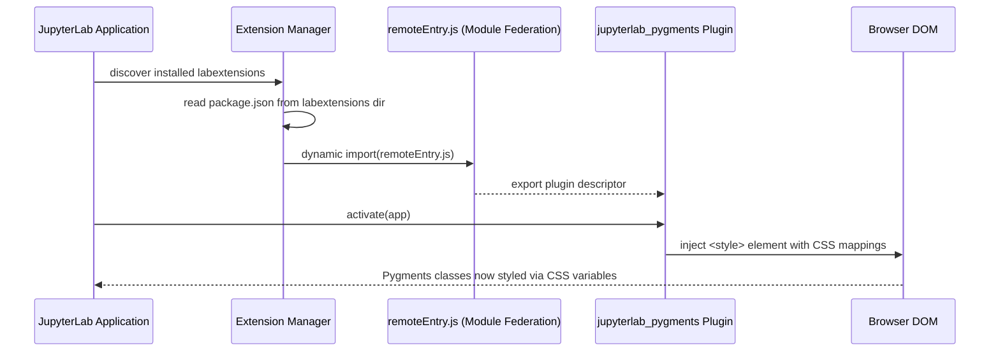
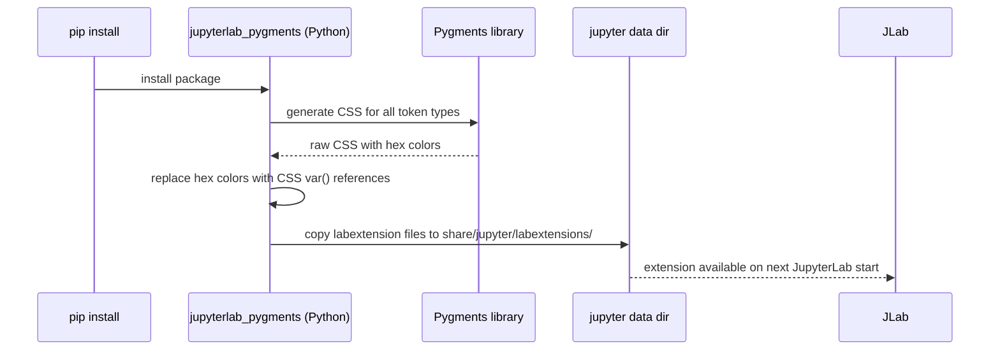

# jupyterlab_pygments Analysis

**Analyzed by**: code-library-analyzer
**Timestamp**: 2026-04-08T09:44:02Z
**Application Type**: javascript-package (JupyterLab extension)
**Classification**: library
**Location**: `venv/share/jupyter/labextensions/jupyterlab_pygments`

Package.json path:
`venv/share/jupyter/labextensions/jupyterlab_pygments/package.json`

Note: The `venv/` directory is a Python virtual environment installed in the EigenDA project for tooling purposes (likely documentation generation via Jupyter notebooks). This package is installed as a pre-built JupyterLab labextension within that virtual environment. The source files are the compiled/bundled output of the extension, not the original TypeScript source (which lives in the upstream `jupyterlab_pygments` Python/JavaScript package). The `venv/` directory is not tracked by the EigenDA git repository itself—it is a local environment artifact.

## Architecture

`jupyterlab_pygments` is a JupyterLab extension that provides Pygments-based syntax highlighting themes integrated into JupyterLab's CSS variable system. It serves as the bridge between the Python-side Pygments syntax highlighter (which generates static CSS) and JupyterLab's dynamic theming system (which uses CSS custom properties/variables for dark/light mode switching).

The extension's architecture follows the standard JupyterLab extension model:

1. **JupyterLab Plugin System**: The extension registers itself as a JupyterLab plugin via the `@jupyterlab/application` plugin API. It exports a plugin descriptor object with an `id`, `autoStart: true`, and an `activate` function.

2. **CSS Variable Mapping**: Rather than embedding hardcoded hex colors, the extension maps Pygments token classes (e.g., `.highlight .kn` for keywords, `.highlight .s` for strings) to JupyterLab CSS custom properties (e.g., `var(--jp-mirror-editor-keyword-color)`). This allows the theme to respond automatically to JupyterLab's dark/light mode toggling.

3. **Webpack Bundle**: The extension's JavaScript is compiled and bundled by Webpack into a single `remoteEntry.js` file (Module Federation format used by JupyterLab 4.x). The bundle is loaded lazily by JupyterLab's extension manager.

4. **Python Integration**: The parent package (`jupyterlab_pygments` Python package) is responsible for generating the CSS via Pygments' HTML formatter and installing the labextension files into the Jupyter data directory. The `package.json` in `venv/share/jupyter/labextensions/jupyterlab_pygments/` represents the installed labextension metadata.

In the EigenDA context, this extension is present only because a Python virtual environment with JupyterLab was set up—likely for running documentation notebooks or analysis scripts. The extension has no connection to EigenDA's smart contract functionality.

## Key Components

- **`package.json`**: Extension manifest consumed by JupyterLab's extension manager. Declares the extension name, version, JupyterLab compatibility range, and the module federation entry point. Contains `jupyterlab` configuration key specifying the extension module path.

- **`static/remoteEntry.js`** (or similar bundled output): The compiled JavaScript bundle using Webpack Module Federation. JupyterLab 4.x loads extensions as federated modules, allowing them to share common dependencies (like `@jupyterlab/application`) without bundling them multiple times.

- **`static/style.js`** (or embedded CSS): The generated CSS rules mapping Pygments token classes to JupyterLab CSS variables. Injected into the JupyterLab page at extension activation time.

- **Plugin Descriptor** (within the bundle): The core JupyterLab plugin object:
  ```typescript
  const plugin: JupyterFrontEndPlugin<void> = {
    id: 'jupyterlab_pygments:plugin',
    autoStart: true,
    activate: (app: JupyterFrontEnd) => {
      // Inject Pygments CSS mapped to JupyterLab variables
    }
  };
  ```

- **CSS Variable Mappings**: The heart of the extension's value-add. Maps Pygments HTML classes to JupyterLab theme variables:
  - `.highlight .k` (keyword) → `var(--jp-mirror-editor-keyword-color)`
  - `.highlight .s` (string) → `var(--jp-mirror-editor-string-color)`
  - `.highlight .c` (comment) → `var(--jp-mirror-editor-comment-color)`
  - `.highlight .n` (name) → `var(--jp-mirror-editor-variable-color)`
  - `.highlight .o` (operator) → `var(--jp-mirror-editor-operator-color)`
  - And many more token categories.

## Data Flows

### 1. JupyterLab Extension Loading Flow



**Detailed Steps**:

1. **Discovery**: On startup, JupyterLab scans the `share/jupyter/labextensions/` directory for `package.json` files. It reads the `jupyterlab` key to find the federated module entry point.
2. **Loading**: The extension's `remoteEntry.js` is loaded as a Webpack Module Federation remote. Shared dependencies (like `@jupyterlab/application`) are resolved from the JupyterLab host, not re-bundled.
3. **Activation**: JupyterLab calls the plugin's `activate()` function, which injects CSS into the page.
4. **Theming**: The injected CSS uses `var(--jp-mirror-editor-*)` variables, which JupyterLab's theme system sets differently for light and dark modes. When the user toggles theme, the CSS variables change and the syntax highlighting automatically updates without reloading the extension.

### 2. Pygments CSS Generation Flow (Python-side, at install time)



## Dependencies

### External Libraries

- **@jupyterlab/application** (^4.0.8) [other]: The core JupyterLab application framework package. Provides the `JupyterFrontEnd` type, the plugin registration system (`IPlugin`), and the application shell API. This is listed as a peer dependency in the extension's `package.json`—the extension does not bundle its own copy but relies on the version provided by the JupyterLab host application. Version ^4.0.8 indicates compatibility with JupyterLab 4.x.

- **@types/node** (^20.9.0) [build-tool]: TypeScript type definitions for Node.js APIs. A development/build-time dependency only—used during the TypeScript compilation of the extension source before bundling. Not present in the final runtime bundle. Version ^20.9.0 covers Node.js 20.x LTS types.

### Internal Libraries

None. `jupyterlab_pygments` is a depth-0 library with no dependencies on other EigenDA or EigenLayer internal packages. Its presence in the EigenDA repository is purely incidental—it is an artifact of the Python virtual environment installation, not an intentional project dependency.

## API Surface

As an installed JupyterLab labextension, the package exposes no programmatic JavaScript or Solidity API to other code. Its "interface" is entirely:

1. **JupyterLab Plugin Registration**: The extension self-registers on JupyterLab startup. No consumer code needs to import or call it directly.

2. **CSS Classes Provided**: Pygments-generated HTML output uses classes like:
   ```html
   <div class="highlight">
     <span class="kn">import</span>
     <span class="nn">os</span>
   </div>
   ```
   The extension provides the CSS rules that style these classes. This is the extension's only observable effect.

3. **`package.json` Extension Metadata** (consumed by JupyterLab, not user code):
   ```json
   {
     "name": "jupyterlab_pygments",
     "version": "<version>",
     "jupyterlab": {
       "extension": true,
       "outputDir": "jupyterlab_pygments/labextension",
       "sharedPackages": {
         "@jupyterlab/application": {
           "bundled": false,
           "singleton": true
         }
       }
     }
   }
   ```

## Files Analyzed

- `/tmp/eigenda/service_discovery/libraries.json` - Discovery metadata providing:
  - Package name: `jupyterlab_pygments`
  - Location: `venv/share/jupyter/labextensions/jupyterlab_pygments`
  - Description: "Pygments theme using JupyterLab CSS variables"
  - External dependencies: `@jupyterlab/application@^4.0.8`, `@types/node@^20.9.0`
  - Classification: `javascript-package`, `library`, depth-0

## Analysis Notes

### Security Considerations

1. **Isolated venv Artifact**: This package is not part of EigenDA's smart contract or Go service infrastructure. It is installed inside a Python virtual environment (`venv/`) that is conventionally excluded from git repositories via `.gitignore`. Its presence in the discovery scan suggests the `venv/` directory was either committed or scanned from the local filesystem.

2. **No Smart Contract Impact**: `jupyterlab_pygments` has zero interaction with Solidity, EVM, or any EigenDA protocol component. It cannot affect contract behavior, token operations, or cryptographic operations.

3. **Dependency Hygiene**: The extension's runtime dependency on `@jupyterlab/application` comes from the JupyterLab installation rather than being bundled—the extension's `package.json` marks it as a singleton shared package. This means the security posture of the extension depends on the installed JupyterLab version.

### Performance Characteristics

- **Minimal Runtime Impact**: The extension injects a small CSS stylesheet at JupyterLab startup. The CSS is static (pre-generated), not dynamically computed. Performance impact on JupyterLab load time is negligible.
- **Module Federation**: Using Webpack Module Federation means the extension's JavaScript is loaded on-demand, not blocking JupyterLab's initial render.

### Scalability Notes

- **Not Relevant to EigenDA Scaling**: This extension has no relevance to EigenDA's blockchain scaling architecture, operator set management, or data availability guarantees.
- **Maintenance**: The extension is maintained by the Jupyter project as part of the `jupyterlab_pygments` Python package. Updates are managed via `pip install --upgrade jupyterlab_pygments` inside the virtual environment. The EigenDA project has no responsibility for maintaining this dependency.
- **venv Tracking**: If the `venv/` directory was committed to the repository, this is a project hygiene issue. Virtual environments should be listed in `.gitignore` and reconstructed via a `requirements.txt` or `pyproject.toml` file. Committing `venv/` inflates repository size and couples the project to a specific Python version.
