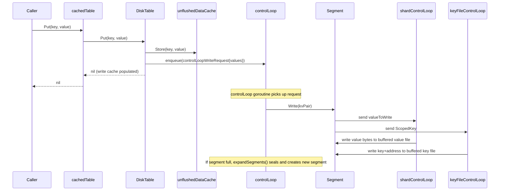
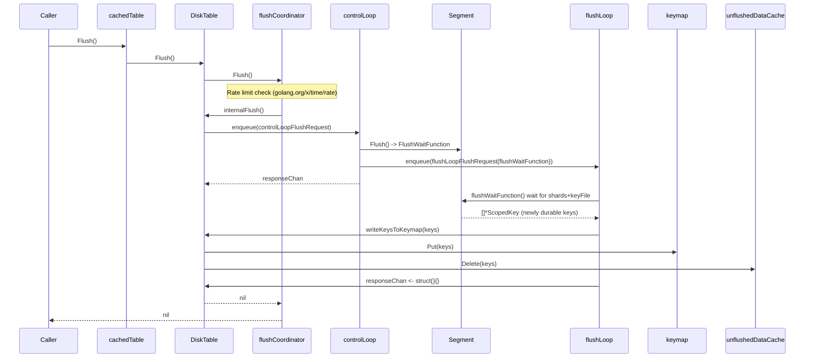
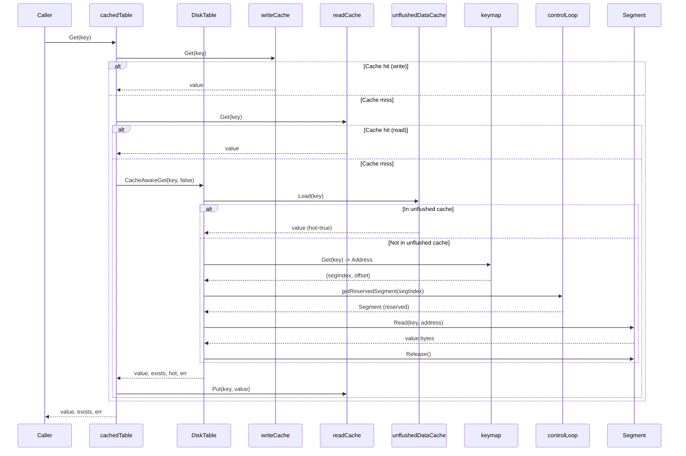
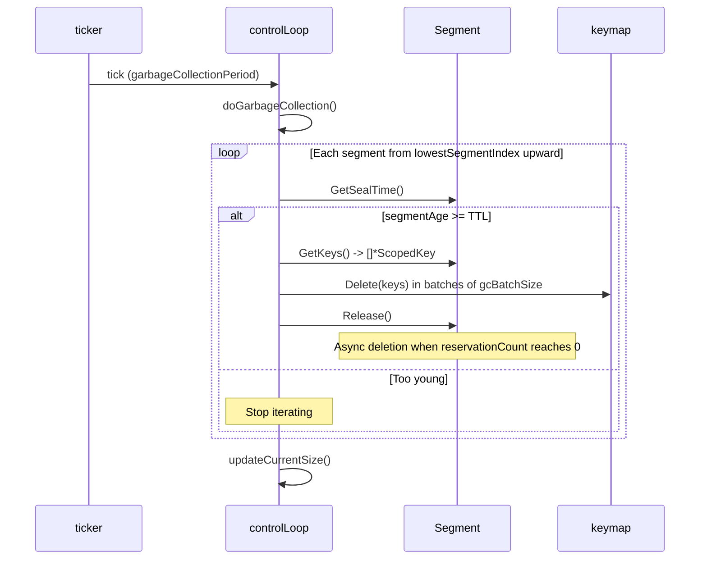
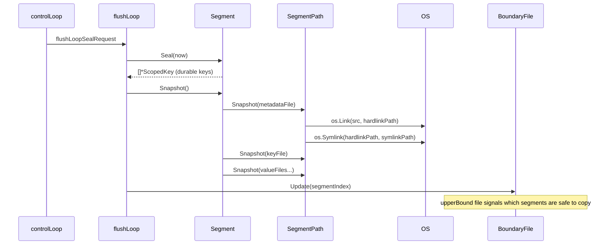

# litt Analysis

**Analyzed by**: code-library-analyzer
**Timestamp**: 2026-04-10T00:00:00Z
**Application Type**: go-module
**Classification**: library
**Location**: litt

## Architecture

LittDB (litt = "lightweight in-memory/tiered table") is EigenDA's custom-built, low-latency blob storage library implemented as a pure Go key-value store. It is purpose-built for write-once, read-many workloads where values are large (kilobyte+ blobs), TTL-based expiry is required, and performance predictability matters more than feature completeness. The library intentionally trades away mutability, multi-key atomicity, and transactions in exchange for exceptional write and read throughput.

The storage engine is organized around nine progressive design decisions documented in `litt/docs/architecture.md`: append-only file writes, a write cache, an index (keymap), an unflushed-data map, segment files, per-segment metadata files, key files separate from value files, horizontal sharding across physical drives, and finally multi-table support. These iterations cumulate in the actual LittDB implementation, which combines all of these ideas.

Architecturally, LittDB is built on three tiers. The top tier is the `DB` interface (`litt/db.go`), a thin namespace that manages a map of named `Table` instances. The middle tier is the `DiskTable` (`litt/disktable/disk_table.go`), which handles durable on-disk storage; it spawns a `controlLoop` goroutine as the serialization point for all mutations and a separate `flushLoop` goroutine for blocking on flush completions. The bottom tier is the `Segment` layer (`litt/disktable/segment/segment.go`), where each segment owns one key file and N sharded value files, each managed by its own dedicated goroutine. On top of `DiskTable` sits `cachedTable` (`litt/cache/cached_table.go`), a transparent write-cache and read-cache decorator. For testing, `memTable` (`litt/memtable/mem_table.go`) provides a fully in-memory drop-in. Keys are indexed by a `Keymap` abstraction (`litt/disktable/keymap/keymap.go`) with two implementations: an in-memory map (`memKeymap`) and LevelDB (`LevelDBKeymap`).

Concurrency control is achieved without global locks. Writes go through a channel-based `controlLoop`, which serially processes write, flush, GC, and segment-seal events. Readers that miss the unflushed-data cache (`sync.Map`) use a reference-counting reservation system on segments, preventing a segment from being deleted while a concurrent read is in flight. The `flushCoordinator` optionally rate-limits flush calls by batching rapid flush requests, improving throughput under high-frequency flush scenarios. An `ErrorMonitor` utility provides a non-Go-panic escalation path for background goroutine errors: it stores the first fatal error, cancels a context (unblocking all `Await`/`Send` calls), and optionally invokes a caller-provided `FatalErrorCallback`.

## Key Components

- **`DB` interface** (`litt/db.go`): Top-level public interface for the database. Exposes `GetTable(name string) (Table, error)`, `DropTable(name string) error`, `Size() uint64`, `KeyCount() uint64`, `Close() error`, and `Destroy() error`. Intentionally minimal; the design philosophy is to expose only what is strictly necessary.

- **`Table` / `ManagedTable` interfaces** (`litt/table.go`): `Table` is the public read/write surface per namespace — `Put`, `PutBatch`, `Get`, `CacheAwareGet`, `Exists`, `Flush`, `SetTTL`, `SetShardingFactor`, `SetWriteCacheSize`, `SetReadCacheSize`. `ManagedTable` extends `Table` with lifecycle methods (`Close`, `Destroy`, `RunGC`) used internally by the DB.

- **`Config`** (`litt/littdb_config.go`): Rich configuration struct covering storage paths, keymap type (`MemKeymapType` or `LevelDBKeymapType`), TTL, sharding factor (default 8), segment size targets, GC period (default 5 min), optional Prometheus metrics export, fsync mode, double-write protection, snapshot directory, and flush rate limiting. Provides `DefaultConfig`, `SanitizePaths`, and `SanityCheck` helpers.

- **`db` (concrete DB implementation)** (`litt/littbuilder/db_impl.go`): Implements `litt.DB`. Holds a `map[string]litt.ManagedTable`, a `sync.Mutex`, and a `TableBuilderFunc` closure. `GetTable` lazily creates tables; `gatherMetrics` runs as a periodic goroutine when metrics are enabled.

- **`DiskTable`** (`litt/disktable/disk_table.go`): Core disk-backed table. On `Put`/`PutBatch`, stores data into the `unflushedDataCache` (`sync.Map`) and enqueues a write request to the `controlLoop`. `Get` checks the cache first, then falls back to the keymap and segment read. On `Flush`, delegates through a `flushCoordinator` → `controlLoop` → segment flush chain. Maintains atomic counters for key count and size.

- **`controlLoop`** (`litt/disktable/control_loop.go`): A goroutine that serializes all mutations to a `DiskTable`. Handles write requests by calling `Segment.Write`; when a segment is full (exceeds `targetFileSize`, `maxKeyCount`, or `targetKeyFileSize`), it triggers `expandSegments` to seal the current segment and create a new one. Also drives GC on a `garbageCollectionPeriod` ticker; GC deletes expired sealed segments in batches via the keymap.

- **`Segment`** (`litt/disktable/segment/segment.go`): An append-only chunk of storage. Contains a `metadataFile`, a `keyFile`, and N `valueFile` shards. Each shard runs its own `shardControlLoop` goroutine for serialized writes; the key file has its own `keyFileControlLoop`. Segments are reference-counted; `Release()` on the last holder schedules asynchronous deletion. Supports `Seal`, `Flush`, `Snapshot`, and `GetKeys`.

- **`Keymap` interface and implementations** (`litt/disktable/keymap/`): `Keymap` maps `[]byte` keys to `types.Address` (segment index + byte offset). `LevelDBKeymap` persists the index using `syndtr/goleveldb`, using batched writes with optional sync. `memKeymap` stores the map in Go memory with an `RWMutex`. The type of keymap used is recorded on disk in a `keymap-type.txt` file to support migration.

- **`cachedTable`** (`litt/cache/cached_table.go`): Decorator over `ManagedTable` that adds an LRU/FIFO write cache and read cache (both from the `common/cache` library). On `Put`, adds to the write cache after the base table write. On `Get`, checks write cache, then read cache, then the base table (and populates read cache on miss). Cache sizes are configurable at runtime via `SetWriteCacheSize`/`SetReadCacheSize`.

- **`memTable`** (`litt/memtable/mem_table.go`): In-memory `ManagedTable` for unit tests. Uses `map[string][]byte` plus a `structures.Queue` for expiration-order tracking. `RunGC` walks the expiration queue and removes expired keys.

- **`ErrorMonitor`** (`litt/util/error_monitor.go`): Provides graceful fatal-error handling for background goroutines. Stores the first fatal error atomically, cancels a `context.Context` to unblock all `Await`/`Send` calls, and invokes an optional `FatalErrorCallback`. All DiskTable goroutines check `errorMonitor.IsOk()` before processing requests.

- **`flushCoordinator`** (`litt/disktable/flush_coordinator.go`): Batches rapid flush calls. Uses `golang.org/x/time/rate` to enforce a minimum flush interval. Multiple concurrent `Flush()` calls within the rate-limit window are all satisfied by a single underlying flush.

- **`LittDBMetrics`** (`litt/metrics/littdb_metrics.go`): Prometheus metrics covering table size, key count, bytes read/written, cache hit/miss counts, read/write latency, flush latency, segment flush latency, keymap flush latency, and GC latency. All metrics are per-table labeled.

- **`SSHSession`** (`litt/util/ssh.go`): Utility for SSH-based remote operations (file discovery, directory creation, rsync). Used by the CLI's `sync`/`push` commands for remote backup of LittDB segments.

## Data Flows

### 1. Write Path (Put / PutBatch)

**Flow Description**: A caller writes a key-value pair; LittDB stores it in an in-memory unflushed cache and asynchronously persists it to the active segment's sharded value files.



**Detailed Steps**:

1. **Cache population** (`cachedTable` → `DiskTable`): `cachedTable.Put` calls the base `DiskTable.Put` and, on success, stores the key-value pair in the write cache.
2. **Unflushed cache store** (`DiskTable`): `DiskTable.PutBatch` immediately stores all key-value pairs into `unflushedDataCache` (a `sync.Map`), making them available for concurrent reads without disk I/O.
3. **Async write enqueue** (`DiskTable` → `controlLoop`): A `controlLoopWriteRequest` is sent on the control channel; `Put` returns to the caller without waiting for disk write.
4. **Shard write** (`controlLoop` → `Segment` → `shardControlLoop`): The control loop calls `Segment.Write`, which computes the shard (`HashKey(key, salt) % shardingFactor`), enqueues a `valueToWrite` to the per-shard goroutine, and enqueues a `ScopedKey` to the key file goroutine.
5. **Segment expansion** (`controlLoop`): If the mutable segment exceeds `TargetSegmentFileSize`, `MaxSegmentKeyCount`, or `TargetSegmentKeyFileSize`, `expandSegments()` is called to seal the segment and create a new one.

**Error Paths**:
- Key or value exceeds `math.MaxUint32` bytes → immediate error returned to caller.
- `errorMonitor.IsOk()` returns false → returns wrapped error; no data written.

---

### 2. Flush Path

**Flow Description**: A caller calls `Flush()` to guarantee that previously written data is crash-durable on disk.



**Detailed Steps**:

1. **Rate limiting** (`flushCoordinator`): If `MinimumFlushInterval > 0`, the coordinator may batch multiple concurrent `Flush()` calls into one underlying flush.
2. **Control loop flush** (`DiskTable` → `controlLoop`): The control loop enqueues a flush operation inside the segment's key and shard queues, which serializes the flush relative to any in-progress writes.
3. **Shard and key file flush** (`Segment`): Each `shardControlLoop` flushes its buffered writer and optionally fsyncs. The `keyFileControlLoop` flushes its buffered writer and returns the newly durable `ScopedKey` list.
4. **Keymap update** (`flushLoop` → `keymap`): Newly durable keys are written to LevelDB (or memKeymap), then removed from `unflushedDataCache`.

---

### 3. Read Path (Get / CacheAwareGet)

**Flow Description**: A caller retrieves a value by key; LittDB checks multiple cache layers before performing disk I/O.



**Detailed Steps**:

1. **Write cache check** (`cachedTable`): Recently written values are served directly from the FIFO write cache without any disk I/O.
2. **Read cache check** (`cachedTable`): Recently read values (from disk) are served from the read cache.
3. **Unflushed data cache** (`DiskTable`): Values written but not yet flushed to disk are available in the `unflushedDataCache` sync.Map; this enables read-your-writes consistency.
4. **Keymap lookup** (`DiskTable` → `keymap`): The `Address` (segment index + offset) is retrieved from LevelDB or the in-memory map.
5. **Segment reservation + read** (`DiskTable` → `Segment`): The segment is reserved (reference count incremented), preventing GC deletion; the value is read from the appropriate shard's value file via a byte offset seek.

---

### 4. Garbage Collection (TTL-based expiry)

**Flow Description**: The control loop periodically runs GC, deleting segments whose seal time has exceeded the table's TTL.



**Detailed Steps**:

1. **Seal time check**: GC compares `clock() - segment.GetSealTime()` against the table's TTL metadata.
2. **Batch key deletion**: Keys are deleted from the keymap in batches of `GCBatchSize` (default 10,000) to avoid blocking.
3. **Reference-counted deletion**: `seg.Release()` decrements the reservation count. When it hits zero (no concurrent readers), the segment goroutine calls `delete()` which removes all files (key file, value files, metadata file).
4. **Chain integrity**: Each segment holds a reservation on the next segment; deletion releases that next-segment reservation, ensuring in-order deletion (segment N cannot be deleted before segment N-1).

---

### 5. Snapshot Flow

**Flow Description**: When a snapshot directory is configured, LittDB publishes rolling read-only views of immutable segments via hard links and symlinks.



**Detailed Steps**:

1. When a segment is sealed, `Snapshot()` is called on each file, which creates a hard link in `$TABLE/$segment/snapshot/` and a symlink in the configured snapshot directory.
2. A `BoundaryFile` (upper bound) is updated to signal which segments are fully snapshotted and safe for external copy.
3. External processes can copy the symlinked files and then update a lower-bound file to signal they are done, allowing LittDB to clean up the hard links.

## Dependencies

### External Libraries

- **github.com/syndtr/goleveldb** (v1.0.1-0.20220614013038-64ee5596c38a) [database]: LevelDB key-value store used as the default `Keymap` implementation (`LevelDBKeymap`). Provides persistent, ordered, disk-backed key-to-address index. Used in `litt/disktable/keymap/level_db_keymap.go` via `leveldb.OpenFile`, `leveldb.Batch`, and `opt.WriteOptions{Sync: true}`.

- **github.com/dchest/siphash** (v1.2.3) [other]: SipHash implementation used in the primary (non-legacy) key hashing function for shard assignment. `util.HashKey` in `litt/util/hashing.go` calls `siphash.Hash(leftSalt, rightSalt, key)` to compute a keyed hash, preventing attackers from crafting hot-shard keys.

- **github.com/docker/go-units** (v0.5.0) [other]: Human-readable byte size formatting. Used in `litt/littdb_config.go` via `units.MiB` to express the default `TargetSegmentKeyFileSize` (2 MiB).

- **github.com/prometheus/client_golang** (v1.21.1) [monitoring]: Prometheus metrics SDK. Used extensively in `litt/metrics/littdb_metrics.go` via `promauto.With(registry).NewGaugeVec`, `NewCounterVec`, and `NewSummaryVec` to expose per-table I/O metrics. Also used in `litt/littbuilder/build_utils.go` via `promhttp.HandlerFor` to serve the `/metrics` HTTP endpoint.

- **golang.org/x/time** (v0.10.0) [other]: Provides `rate.Limiter` used in `litt/disktable/flush_coordinator.go` to enforce a minimum interval between flush operations (`rate.Every(flushPeriod)`). Also used in `litt/benchmark/benchmark_engine.go`.

- **golang.org/x/crypto** (v0.x) [crypto]: SSH client library used in `litt/util/ssh.go` via `golang.org/x/crypto/ssh` and `knownhosts` for remote backup operations (the CLI's push/sync commands). Not used in the core storage engine.

- **github.com/Layr-Labs/eigensdk-go** (v0.2.0-beta.1.0.20250118004418-2a25f31b3b28) [logging]: Provides the `logging.Logger` interface used throughout litt for structured logging. All major components (`db`, `DiskTable`, `Segment`, `controlLoop`, `flushLoop`, keymap implementations, utilities) accept a `logging.Logger` parameter.

### Internal Libraries

- **common** (`common/`): The `litt` library depends on `common` in several ways. `litt/littdb_config.go` imports `common` for `common.LoggerConfig` and `common.DefaultLoggerConfig()`. `litt/littbuilder/build_utils.go` calls `common.NewLogger` and `common.PrettyPrintBytes`. `litt/metrics/littdb_metrics.go` uses `common.ToMilliseconds` for unit conversion in Prometheus observations.

- **core** (`core/`): `litt/util/file_utils.go` uses `core.CloseLogOnError` when copying files (`CopyRegularFile`). This is a minor utility dependency on the core package.

- **common/cache** (`common/cache/`): `litt/cache/cached_table.go` uses `cache.Cache[string, []byte]` and `litt/littbuilder/build_utils.go` creates caches via `cache.NewFIFOCache` and `cache.NewThreadSafeCache`. `litt/metrics/littdb_metrics.go` uses `cache.NewCacheMetrics` and `cache.CacheMetrics` for instrumenting cache behavior.

- **common/structures** (`common/structures/`): `litt/memtable/mem_table.go` uses `structures.Queue[*expirationRecord]` for TTL-ordered expiration tracking. `litt/disktable/flush_coordinator.go` uses `structures.NewQueue[flushCoordinatorRequest]` for batching pending flush requests.

## API Surface

### Public Go Interfaces and Types

#### `litt.DB` (package `litt`, file `litt/db.go`)

Top-level handle to the entire database.

```go
type DB interface {
    GetTable(name string) (Table, error)
    DropTable(name string) error
    Size() uint64
    KeyCount() uint64
    Close() error
    Destroy() error
}
```

#### `litt.Table` (package `litt`, file `litt/table.go`)

Per-namespace key-value table.

```go
type Table interface {
    Name() string
    Put(key []byte, value []byte) error
    PutBatch(batch []*types.KVPair) error
    Get(key []byte) (value []byte, exists bool, err error)
    CacheAwareGet(key []byte, onlyReadFromCache bool) (value []byte, exists bool, hot bool, err error)
    Exists(key []byte) (exists bool, err error)
    Flush() error
    Size() uint64
    KeyCount() uint64
    SetTTL(ttl time.Duration) error
    SetShardingFactor(shardingFactor uint32) error
    SetWriteCacheSize(size uint64) error
    SetReadCacheSize(size uint64) error
}
```

#### `litt.Config` (package `litt`, file `litt/littdb_config.go`)

Full configuration structure. Key fields:

| Field | Type | Default | Description |
|-------|------|---------|-------------|
| `Paths` | `[]string` | (required) | Storage directories, possibly multiple physical volumes |
| `KeymapType` | `keymap.KeymapType` | `LevelDBKeymapType` | Keymap backend |
| `TTL` | `time.Duration` | 0 (no expiry) | Default TTL for all tables |
| `ShardingFactor` | `uint32` | 8 | Number of value-file shards per segment |
| `GCPeriod` | `time.Duration` | 5 minutes | GC run interval |
| `TargetSegmentFileSize` | `uint32` | `math.MaxUint32` | Segment file target size |
| `Fsync` | `bool` | `true` | Whether to call fsync on flush |
| `MetricsEnabled` | `bool` | `false` | Export Prometheus metrics |
| `SnapshotDirectory` | `string` | "" (disabled) | Rolling snapshot output directory |
| `FatalErrorCallback` | `func(error)` | nil | Called on unrecoverable DB errors |
| `MinimumFlushInterval` | `time.Duration` | 0 | Minimum time between flushes for batching |

#### `littbuilder.NewDB` (package `littbuilder`, file `litt/littbuilder/db_impl.go`)

The primary constructor. Validates config, creates storage directories, acquires file locks, and returns a `litt.DB` backed by `DiskTable` instances wrapped with caches.

```go
func NewDB(config *litt.Config) (litt.DB, error)
```

#### `littbuilder.NewDBUnsafe` (package `littbuilder`, file `litt/littbuilder/db_impl.go`)

Test-facing constructor accepting a custom `TableBuilderFunc`.

```go
func NewDBUnsafe(config *litt.Config, tableBuilder TableBuilderFunc) (litt.DB, error)
```

#### `litt.ManagedTable` (package `litt`, file `litt/table.go`)

Internal interface that adds lifecycle management to `Table`. Not intended for direct client use.

```go
type ManagedTable interface {
    Table
    Close() error
    Destroy() error
    RunGC() error
}
```

#### `keymap.Keymap` (package `keymap`, file `litt/disktable/keymap/keymap.go`)

Internal interface for key-to-address index backends.

```go
type Keymap interface {
    Put(pairs []*types.ScopedKey) error
    Get(key []byte) (types.Address, bool, error)
    Delete(keys []*types.ScopedKey) error
    Stop() error
    Destroy() error
}
```

#### Core Types (package `types`, files `litt/types/`)

```go
// Address encodes segment index (upper 32 bits) and byte offset (lower 32 bits)
type Address uint64

// KVPair is the unit of a batch write
type KVPair struct {
    Key   []byte
    Value []byte
}

// ScopedKey associates a key with its disk address and value size
type ScopedKey struct {
    Key       []byte
    Address   Address
    ValueSize uint32
}
```

#### `util.SSHSession` (package `util`, file `litt/util/ssh.go`)

SSH utility for the CLI backup commands. Provides `FindFiles`, `Mkdirs`, `Rsync`, and `Exec` over a public-key SSH connection.

#### `memtable.NewMemTable` (package `memtable`, file `litt/memtable/mem_table.go`)

Convenience constructor for in-memory tables, useful in tests.

```go
func NewMemTable(config *litt.Config, name string) litt.ManagedTable
```

#### `cache.NewCachedTable` (package `cache`, file `litt/cache/cached_table.go`)

Creates a caching decorator over any `ManagedTable`.

```go
func NewCachedTable(base litt.ManagedTable, writeCache cache.Cache[string, []byte], readCache cache.Cache[string, []byte], metrics *metrics.LittDBMetrics) litt.ManagedTable
```

## Code Examples

### Example 1: Opening a LittDB instance and writing blobs

```go
// litt/littbuilder/db_impl.go — production-style usage
config, err := litt.DefaultConfig("/data/litt/vol0", "/data/litt/vol1")
if err != nil {
    log.Fatal(err)
}
config.TTL = 14 * 24 * time.Hour          // 14-day TTL
config.MetricsEnabled = true
config.SnapshotDirectory = "/snapshots/litt"

db, err := littbuilder.NewDB(config)
if err != nil {
    log.Fatal(err)
}
defer db.Close()

table, err := db.GetTable("blobs")
if err != nil {
    log.Fatal(err)
}
table.SetTTL(14 * 24 * time.Hour)
table.SetWriteCacheSize(512 * 1024 * 1024)  // 512 MB write cache
table.SetShardingFactor(16)

err = table.Put(blobKey, blobData)    // returns before disk write
err = table.Flush()                    // ensures crash durability
```

### Example 2: Segment write path — key is hashed to a shard

```go
// litt/disktable/segment/segment.go
func (s *Segment) GetShard(key []byte) uint32 {
    if s.metadata.shardingFactor == 1 {
        return 0
    }
    if s.metadata.segmentVersion == OldHashFunctionSegmentVersion {
        return util.LegacyHashKey(key, s.metadata.legacySalt) % s.metadata.shardingFactor
    }
    hash := util.HashKey(key, s.metadata.salt)
    return hash % s.metadata.shardingFactor
}
```

### Example 3: LevelDB keymap batch write with sync

```go
// litt/disktable/keymap/level_db_keymap.go
func (l *LevelDBKeymap) Put(keys []*types.ScopedKey) error {
    batch := new(leveldb.Batch)
    for _, k := range keys {
        batch.Put(k.Key, k.Address.Serialize())
    }
    writeOptions := &opt.WriteOptions{Sync: l.syncWrites}
    return l.db.Write(batch, writeOptions)
}
```

### Example 4: Reference-counted segment reservation for concurrent reads

```go
// litt/disktable/segment/segment.go
func (s *Segment) Reserve() bool {
    for {
        reservations := s.reservationCount.Load()
        if reservations <= 0 {
            return false
        }
        if s.reservationCount.CompareAndSwap(reservations, reservations+1) {
            return true
        }
    }
}

func (s *Segment) Release() {
    reservations := s.reservationCount.Add(-1)
    if reservations > 0 {
        return
    }
    go func() {
        err := s.delete()
        if err != nil {
            s.errorMonitor.Panic(fmt.Errorf("failed to delete segment: %w", err))
        }
    }()
}
```

### Example 5: ErrorMonitor — controlled panic for background goroutines

```go
// litt/util/error_monitor.go
func (h *ErrorMonitor) Panic(err error) {
    stackTrace := string(debug.Stack())
    h.logger.Errorf("monitor encountered an unrecoverable error: %v\n%s", err, stackTrace)
    firstError := h.error.CompareAndSwap(nil, &err)
    h.cancel()
    if firstError && h.callback != nil {
        h.callback(err)
    }
}
```

### Example 6: Flush coordinator rate limiting

```go
// litt/disktable/flush_coordinator.go
func newFlushCoordinator(
    errorMonitor *util.ErrorMonitor,
    internalFlush func() error,
    flushPeriod time.Duration,
) *flushCoordinator {
    fc := &flushCoordinator{
        errorMonitor:  errorMonitor,
        internalFlush: internalFlush,
        requestChan:   make(chan any, requestChanBufferSize),
    }
    if flushPeriod > 0 {
        fc.rateLimiter = rate.NewLimiter(rate.Every(flushPeriod), 1)
        go fc.controlLoop()
    }
    return fc
}
```

## Files Analyzed

- `litt/db.go` (59 lines) - Public `DB` interface definition
- `litt/table.go` (143 lines) - Public `Table` and `ManagedTable` interface definitions
- `litt/littdb_config.go` (279 lines) - `Config` struct, `DefaultConfig`, `SanitizePaths`, `SanityCheck`
- `litt/littbuilder/db_impl.go` (320 lines) - `db` struct (concrete DB impl), `NewDB`, `NewDBUnsafe`
- `litt/littbuilder/build_utils.go` (289 lines) - `buildTable`, `buildKeymap`, `buildMetrics`, `buildLogger`
- `litt/disktable/disk_table.go` (919 lines) - `DiskTable` struct — core disk-backed table
- `litt/disktable/control_loop.go` (438 lines) - `controlLoop` goroutine: write/flush/GC/expand
- `litt/disktable/flush_coordinator.go` (144 lines) - `flushCoordinator` rate-limiting flush batcher
- `litt/disktable/segment/segment.go` (881 lines) - `Segment` struct: sharded value + key files
- `litt/disktable/segment/value_file.go` (342 lines) - `valueFile`: buffered append-only value storage
- `litt/disktable/segment/segment_path.go` (151 lines) - `SegmentPath` and snapshot symlink logic
- `litt/disktable/keymap/keymap.go` (54 lines) - `Keymap` interface
- `litt/disktable/keymap/level_db_keymap.go` (178 lines) - `LevelDBKeymap` implementation
- `litt/disktable/keymap/mem_keymap.go` (91 lines) - In-memory keymap implementation
- `litt/cache/cached_table.go` (214 lines) - `cachedTable` write/read cache decorator
- `litt/memtable/mem_table.go` (214 lines) - `memTable` in-memory test implementation
- `litt/metrics/littdb_metrics.go` (387 lines) - `LittDBMetrics` Prometheus instrumentation
- `litt/types/address.go` (46 lines) - `Address` type: (segmentIndex << 32 | offset)
- `litt/types/kv_pair.go` (9 lines) - `KVPair` struct
- `litt/types/scoped_key.go` (12 lines) - `ScopedKey` struct
- `litt/util/error_monitor.go` (120 lines) - `ErrorMonitor`: controlled fatal error escalation
- `litt/util/file_lock.go` (226 lines) - `FileLock`: PID-aware file-based mutual exclusion
- `litt/util/file_utils.go` (457 lines) - File I/O utilities: atomic write, deep delete, directory ops
- `litt/util/hashing.go` (73 lines) - `HashKey` (SipHash), `LegacyHashKey` (Perm64)
- `litt/util/ssh.go` (233 lines) - `SSHSession` for remote backup operations
- `litt/util/unsafe_string.go` (12 lines) - Zero-copy `UnsafeBytesToString`
- `litt/docs/architecture.md` (220 lines) - Design document: 9 iteration walkthrough

## Analysis Data

```json
{
  "summary": "LittDB (litt) is EigenDA's custom low-latency blob storage library — a write-once, append-only key-value store optimized for large binary values with TTL-based expiry. It provides a namespaced DB/Table API backed by sharded, segmented disk files with a LevelDB key index, an in-memory unflushed-data cache for read-your-writes consistency, optional FIFO read/write caches, and a reference-counted segment GC system. The architecture separates concerns across a control loop goroutine (serializes mutations), a flush loop goroutine (manages durability), and per-shard goroutines inside each segment. It supports multi-volume sharding, rolling snapshots via symlinks, and Prometheus metrics.",
  "architecture_pattern": "Tiered storage engine with append-only segmented files, pluggable keymap index, FIFO cache decorator, and goroutine-per-shard I/O pipeline",
  "key_modules": [
    "litt (root) — DB and Table interfaces, Config",
    "litt/littbuilder — NewDB constructor, table/cache/metrics factory functions",
    "litt/disktable — DiskTable, controlLoop, flushLoop, flushCoordinator",
    "litt/disktable/segment — Segment, valueFile, keyFile, metadataFile, SegmentPath",
    "litt/disktable/keymap — Keymap interface, LevelDBKeymap, memKeymap",
    "litt/cache — cachedTable (write+read cache decorator)",
    "litt/memtable — memTable (in-memory test implementation)",
    "litt/metrics — LittDBMetrics Prometheus instrumentation",
    "litt/types — Address, KVPair, ScopedKey",
    "litt/util — ErrorMonitor, FileLock, file utilities, hashing, SSHSession"
  ],
  "api_endpoints": [],
  "data_flows": [
    "Write: Caller → cachedTable.Put → DiskTable.PutBatch (unflushedDataCache + controlLoop enqueue) → controlLoop → Segment.Write → shardControlLoop (value file) + keyFileControlLoop (key file)",
    "Flush: Caller → flushCoordinator (rate limit) → DiskTable.flushInternal → controlLoop (enqueue flush) → flushLoop (await segment flush, write keys to keymap, remove from unflushedDataCache)",
    "Read: Caller → cachedTable (writeCache → readCache → DiskTable) → DiskTable (unflushedDataCache → keymap → reserved Segment.Read)",
    "GC: controlLoop ticker → doGarbageCollection() → for each expired segment: keymap.Delete(keys) in batches → Segment.Release() → async file deletion",
    "Snapshot: Segment.Seal → Snapshot() → SegmentPath.Snapshot() (hard link + symlink) → BoundaryFile.Update()"
  ],
  "tech_stack": ["go", "leveldb", "prometheus", "siphash", "ssh"],
  "external_integrations": [],
  "component_interactions": [
    "Uses common/LoggerConfig and common/NewLogger for structured logging setup",
    "Uses common/cache for FIFO write and read cache implementations",
    "Uses common/structures/Queue for expiration queue (memtable) and flush coordinator batching",
    "Uses common/PrettyPrintBytes and common/ToMilliseconds for formatting",
    "Uses core/CloseLogOnError in file utility functions"
  ]
}
```

## Citations

```json
[
  {
    "file_path": "litt/db.go",
    "start_line": 3,
    "end_line": 58,
    "claim": "DB is intentionally feature-poor: supports write, read, TTL, tables, thread safety, multi-drive, and incremental backups, but not mutation, multi-entity atomicity, explicit delete, or transactions.",
    "section": "Architecture",
    "snippet": "// Litt: adjective, slang, a synonym for \"cool\" or \"awesome\"."
  },
  {
    "file_path": "litt/db.go",
    "start_line": 25,
    "end_line": 58,
    "claim": "DB interface exposes exactly 6 methods: GetTable, DropTable, Size, KeyCount, Close, Destroy.",
    "section": "API Surface"
  },
  {
    "file_path": "litt/table.go",
    "start_line": 17,
    "end_line": 121,
    "claim": "Table interface exposes 11 methods including CacheAwareGet for cache-hit discrimination.",
    "section": "API Surface",
    "snippet": "CacheAwareGet(key []byte, onlyReadFromCache bool) (value []byte, exists bool, hot bool, err error)"
  },
  {
    "file_path": "litt/littdb_config.go",
    "start_line": 78,
    "end_line": 84,
    "claim": "ShardingFactor defaults to 8; must be at least 1; controls how many value files exist per segment.",
    "section": "Architecture",
    "snippet": "ShardingFactor uint32"
  },
  {
    "file_path": "litt/littdb_config.go",
    "start_line": 183,
    "end_line": 211,
    "claim": "Default config: LevelDBKeymapType, GCPeriod 5 min, ShardingFactor 8, TargetSegmentFileSize MaxUint32, TargetSegmentKeyFileSize 2 MiB, Fsync true.",
    "section": "Key Components",
    "snippet": "KeymapType: keymap.LevelDBKeymapType,\nTargetSegmentKeyFileSize: 2 * units.MiB,"
  },
  {
    "file_path": "litt/littbuilder/db_impl.go",
    "start_line": 19,
    "end_line": 65,
    "claim": "db struct implements litt.DB; holds a map of ManagedTable instances protected by sync.Mutex and an atomic stopped flag.",
    "section": "Key Components",
    "snippet": "var _ litt.DB = &db{}"
  },
  {
    "file_path": "litt/littbuilder/db_impl.go",
    "start_line": 68,
    "end_line": 102,
    "claim": "NewDB is the primary constructor; validates config, sanitizes paths, acquires file locks, and builds a db instance.",
    "section": "API Surface"
  },
  {
    "file_path": "litt/disktable/disk_table.go",
    "start_line": 31,
    "end_line": 96,
    "claim": "DiskTable owns a controlLoop, flushLoop, flushCoordinator, keymap, and unflushedDataCache. It tracks size and keyCount atomically.",
    "section": "Key Components"
  },
  {
    "file_path": "litt/disktable/disk_table.go",
    "start_line": 742,
    "end_line": 788,
    "claim": "PutBatch stores values in the unflushedDataCache immediately for read-your-writes consistency, then enqueues a controlLoopWriteRequest.",
    "section": "Data Flows",
    "snippet": "d.unflushedDataCache.Store(util.UnsafeBytesToString(kv.Key), kv.Value)"
  },
  {
    "file_path": "litt/disktable/disk_table.go",
    "start_line": 648,
    "end_line": 684,
    "claim": "Get checks unflushedDataCache first, then keymap for address, then reserves the segment for disk read.",
    "section": "Data Flows",
    "snippet": "if value, ok := d.unflushedDataCache.Load(util.UnsafeBytesToString(key)); ok {"
  },
  {
    "file_path": "litt/disktable/disk_table.go",
    "start_line": 805,
    "end_line": 844,
    "claim": "Flush delegates through flushCoordinator, then sends a controlLoopFlushRequest and awaits a response channel.",
    "section": "Data Flows"
  },
  {
    "file_path": "litt/disktable/disk_table.go",
    "start_line": 891,
    "end_line": 918,
    "claim": "writeKeysToKeymap flushes newly durable keys to the keymap and then removes them from the unflushedDataCache.",
    "section": "Data Flows",
    "snippet": "err := d.keymap.Put(keys)\n// ...\nfor _, ka := range keys {\n    d.unflushedDataCache.Delete(util.UnsafeBytesToString(ka.Key))\n}"
  },
  {
    "file_path": "litt/disktable/control_loop.go",
    "start_line": 122,
    "end_line": 152,
    "claim": "controlLoop.run() is a single goroutine that serializes all writes, flushes, GC, sharding factor changes, and shutdowns via a channel.",
    "section": "Architecture"
  },
  {
    "file_path": "litt/disktable/control_loop.go",
    "start_line": 155,
    "end_line": 222,
    "claim": "GC iterates segments from lowest to highest; if a sealed segment's age exceeds the TTL, all its keys are deleted from the keymap in gcBatchSize batches, then the segment is released.",
    "section": "Data Flows"
  },
  {
    "file_path": "litt/disktable/control_loop.go",
    "start_line": 264,
    "end_line": 288,
    "claim": "handleWriteRequest calls Segment.Write for each kv pair and calls expandSegments when the segment is full.",
    "section": "Data Flows",
    "snippet": "if shardSize > uint64(c.targetFileSize) || keyCount >= c.maxKeyCount || keyFileSize >= c.targetKeyFileSize {"
  },
  {
    "file_path": "litt/disktable/segment/segment.go",
    "start_line": 27,
    "end_line": 95,
    "claim": "Segment holds a metadataFile, keyFile, sharded valueFiles, per-shard channels, and an atomic reservationCount for safe concurrent deletion.",
    "section": "Key Components"
  },
  {
    "file_path": "litt/disktable/segment/segment.go",
    "start_line": 377,
    "end_line": 447,
    "claim": "Segment.Write hashes the key to determine the shard, updates size accounting, and enqueues writes to shard and key file goroutines asynchronously.",
    "section": "Data Flows",
    "snippet": "shard := s.GetShard(data.Key)"
  },
  {
    "file_path": "litt/disktable/segment/segment.go",
    "start_line": 617,
    "end_line": 652,
    "claim": "Reserve/Release implement reference counting; when the count reaches zero, the segment schedules async file deletion.",
    "section": "Architecture",
    "snippet": "func (s *Segment) Release() {\n    reservations := s.reservationCount.Add(-1)\n    if reservations > 0 { return }\n    go func() { err := s.delete() ... }()\n}"
  },
  {
    "file_path": "litt/disktable/segment/segment.go",
    "start_line": 379,
    "end_line": 392,
    "claim": "Key hashing for shard assignment uses SipHash (new segments) or Perm64 (legacy segments).",
    "section": "Architecture",
    "snippet": "if s.metadata.segmentVersion == OldHashFunctionSegmentVersion {\n    return util.LegacyHashKey(...)\n}\nhash := util.HashKey(key, s.metadata.salt)"
  },
  {
    "file_path": "litt/disktable/keymap/keymap.go",
    "start_line": 21,
    "end_line": 53,
    "claim": "Keymap interface: Put (batch), Get (single), Delete (batch), Stop, Destroy. BatchPut provides atomicity per key-address pair, not per batch.",
    "section": "Key Components"
  },
  {
    "file_path": "litt/disktable/keymap/level_db_keymap.go",
    "start_line": 90,
    "end_line": 118,
    "claim": "LevelDBKeymap.Put uses a leveldb.Batch and opt.WriteOptions{Sync: syncWrites} for durable writes.",
    "section": "Dependencies",
    "snippet": "batch := new(leveldb.Batch)\nbatch.Put(k.Key, k.Address.Serialize())\nl.db.Write(batch, writeOptions)"
  },
  {
    "file_path": "litt/disktable/keymap/level_db_keymap.go",
    "start_line": 73,
    "end_line": 88,
    "claim": "LevelDBKeymap opens a LevelDB file at startup; if the directory does not exist, it creates one and sets requiresReload=true.",
    "section": "Key Components",
    "snippet": "db, err := leveldb.OpenFile(keymapPath, nil)"
  },
  {
    "file_path": "litt/cache/cached_table.go",
    "start_line": 14,
    "end_line": 41,
    "claim": "cachedTable wraps a ManagedTable with a write cache and read cache; both are Cache[string, []byte] implementations from common/cache.",
    "section": "Key Components"
  },
  {
    "file_path": "litt/cache/cached_table.go",
    "start_line": 117,
    "end_line": 157,
    "claim": "CacheAwareGet checks write cache, then read cache, then base table; populates read cache on disk hit.",
    "section": "Data Flows"
  },
  {
    "file_path": "litt/metrics/littdb_metrics.go",
    "start_line": 27,
    "end_line": 82,
    "claim": "LittDBMetrics tracks 14 Prometheus metrics covering size, key count, read/write bytes and latency, cache hit/miss, flush and GC latency.",
    "section": "Key Components"
  },
  {
    "file_path": "litt/util/error_monitor.go",
    "start_line": 21,
    "end_line": 49,
    "claim": "ErrorMonitor provides controlled panic without Go's built-in panic; stores first error atomically and cancels a context to unblock goroutines.",
    "section": "Architecture"
  },
  {
    "file_path": "litt/util/error_monitor.go",
    "start_line": 103,
    "end_line": 119,
    "claim": "ErrorMonitor.Panic logs the stack trace, atomically stores the error, cancels the context, and calls the FatalErrorCallback once.",
    "section": "Key Components",
    "snippet": "h.error.CompareAndSwap(nil, &err)\nh.cancel()\nif firstError && h.callback != nil { h.callback(err) }"
  },
  {
    "file_path": "litt/disktable/flush_coordinator.go",
    "start_line": 20,
    "end_line": 60,
    "claim": "flushCoordinator uses golang.org/x/time/rate.Limiter to enforce a minimum flush interval, batching concurrent Flush() calls.",
    "section": "Key Components",
    "snippet": "fc.rateLimiter = rate.NewLimiter(rate.Every(flushPeriod), 1)"
  },
  {
    "file_path": "litt/util/hashing.go",
    "start_line": 67,
    "end_line": 72,
    "claim": "HashKey uses siphash.Hash with a 16-byte random salt to prevent adversarial shard hotspot attacks.",
    "section": "Architecture",
    "snippet": "func HashKey(key []byte, salt [16]byte) uint32 {\n    hash := siphash.Hash(leftSalt, rightSalt, key)\n    return uint32(hash)\n}"
  },
  {
    "file_path": "litt/util/ssh.go",
    "start_line": 32,
    "end_line": 92,
    "claim": "SSHSession establishes an SSH connection using golang.org/x/crypto/ssh with public-key auth and optional known-hosts verification.",
    "section": "Dependencies"
  },
  {
    "file_path": "litt/disktable/segment/segment.go",
    "start_line": 540,
    "end_line": 562,
    "claim": "Snapshot creates hard links and symlinks for each segment file, enabling external processes to copy consistent DB views.",
    "section": "Data Flows"
  },
  {
    "file_path": "litt/disktable/segment/segment_path.go",
    "start_line": 127,
    "end_line": 150,
    "claim": "SegmentPath.Snapshot creates os.Link (hard link) then os.Symlink pointing to the hard link, giving external readers stable references.",
    "section": "Data Flows",
    "snippet": "err := os.Link(sourcePath, hardlinkPath)\nerr = os.Symlink(hardlinkPath, symlinkPath)"
  },
  {
    "file_path": "litt/littbuilder/build_utils.go",
    "start_line": 25,
    "end_line": 29,
    "claim": "Three keymap types are supported: MemKeymapType (in-memory), LevelDBKeymapType (durable), UnsafeLevelDBKeymapType (no sync writes, for tests).",
    "section": "Key Components",
    "snippet": "var keymapBuilders = map[keymap.KeymapType]keymap.BuildKeymap{\n    keymap.MemKeymapType:           keymap.NewMemKeymap,\n    keymap.LevelDBKeymapType:       keymap.NewLevelDBKeymap,\n    keymap.UnsafeLevelDBKeymapType: keymap.NewUnsafeLevelDBKeymap,\n}"
  },
  {
    "file_path": "litt/littbuilder/build_utils.go",
    "start_line": 226,
    "end_line": 237,
    "claim": "buildTable wraps DiskTable with a FIFO write cache and a FIFO read cache (both thread-safe) via cachedTable.",
    "section": "Architecture",
    "snippet": "writeCache := cache.NewFIFOCache[string, []byte](config.WriteCacheSize, cacheWeight, ...)\ncachedTable := tablecache.NewCachedTable(table, writeCache, readCache, metrics)"
  },
  {
    "file_path": "litt/util/file_utils.go",
    "start_line": 103,
    "end_line": 138,
    "claim": "AtomicWrite uses a swap file and AtomicRename to ensure file writes are crash-safe.",
    "section": "Architecture",
    "snippet": "swapPath := destination + SwapFileExtension\n// ...\nerr = AtomicRename(swapPath, destination, fsync)"
  },
  {
    "file_path": "litt/types/address.go",
    "start_line": 9,
    "end_line": 43,
    "claim": "Address encodes segment index in upper 32 bits and byte offset in lower 32 bits, allowing O(1) value location without scanning.",
    "section": "Key Components",
    "snippet": "type Address uint64\nfunc NewAddress(index uint32, offset uint32) Address {\n    return Address(uint64(index)<<32 | uint64(offset))\n}"
  },
  {
    "file_path": "litt/memtable/mem_table.go",
    "start_line": 25,
    "end_line": 77,
    "claim": "memTable is a simple in-memory ManagedTable backed by map[string][]byte with a Queue for TTL ordering; intended for unit tests.",
    "section": "Key Components"
  },
  {
    "file_path": "litt/util/file_lock.go",
    "start_line": 79,
    "end_line": 168,
    "claim": "FileLock creates an exclusive lock file containing the PID; detects and removes stale locks from dead processes.",
    "section": "Architecture",
    "snippet": "file, err := os.OpenFile(path, os.O_CREATE|os.O_EXCL|os.O_WRONLY, 0644)"
  }
]
```

## Analysis Notes

### Security Considerations

1. **Salted shard hashing**: LittDB uses SipHash with a random 16-byte salt per segment to prevent adversarial key crafting from creating shard hotspots (denial-of-service via hot shard). The salt is stored in the segment metadata file and is different per-segment.

2. **File lock protection**: `FileLock` uses `O_EXCL` file creation for mutual exclusion, preventing two LittDB instances from concurrently opening the same data directory (which would almost certainly cause data corruption). The lock file stores the PID and timestamp for debugging; stale locks from dead processes are automatically cleaned.

3. **SSH known-hosts verification**: `SSHSession` supports strict host key verification via `knownhosts.New` when a known-hosts path is provided; if omitted, `ssh.InsecureIgnoreHostKey()` is used, which is noted as a risk for production remote backup use.

4. **Double-write protection**: Optionally enabled via `DoubleWriteProtection = true` in config; this causes a pre-check before every write to verify the key does not already exist, guarding against accidental overwrites (which are illegal and can corrupt data).

### Performance Characteristics

- **Write latency**: `Put` returns immediately after the unflushed-data cache store; actual disk I/O is asynchronous. For acknowledged durability, `Flush` is required (which blocks until segment files and keymap are fsynced).
- **Read latency**: Reads hitting the write or read cache are O(1) in-memory map lookups. Reads from disk require a LevelDB `Get` + file seek + buffered read; the design note suggests this is the bottleneck for cache-miss workloads.
- **GC non-blocking**: Segment deletion is reference-counted and async; GC never holds a lock that blocks readers or writers. Keymap deletion is done in configurable batches (default 10,000 keys) to limit pause times.
- **Flush batching**: The `flushCoordinator` can batch many rapid `Flush()` calls into one disk operation, which is critical for workloads that flush after every write (e.g., unit tests). Benchmark data from August 2025 shows this makes an order-of-magnitude difference in test performance.

### Scalability Notes

- **Multi-volume sharding**: Data can be spread across multiple physical volumes by providing multiple `Paths` in config. Shards are assigned round-robin across segment paths. The number of paths should not exceed the sharding factor.
- **Per-table configuration**: TTL, sharding factor, and cache sizes can be set independently per table after creation, allowing different retention and performance profiles for different blob categories.
- **Segment size bounds**: Segments are bounded by `TargetSegmentFileSize` (default MaxUint32 ~= 4 GB), `MaxSegmentKeyCount` (default 50,000), and `TargetSegmentKeyFileSize` (default 2 MB). For small-value workloads, the key-count and key-file limits prevent segments from accumulating pathologically many keys.
- **Snapshot scalability**: The rolling snapshot mechanism uses symlinks into hard-linked files, avoiding costly copies. External backup processes must clean up their hard links or disk space will leak.
