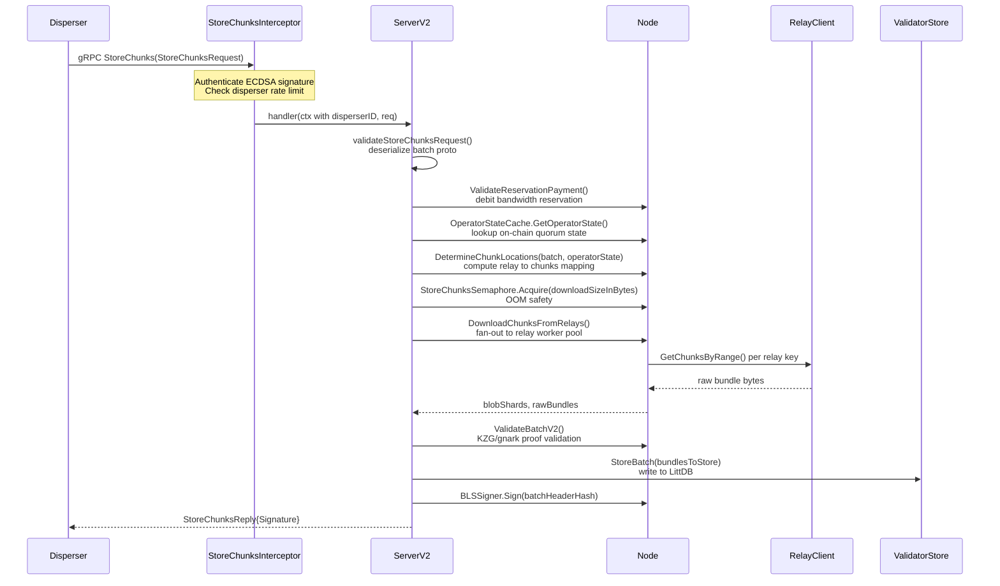
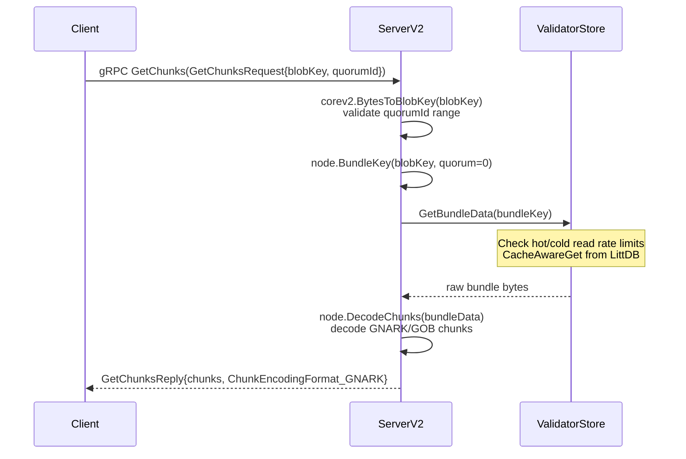
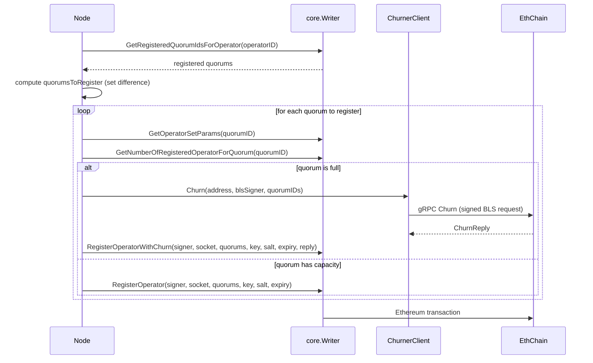
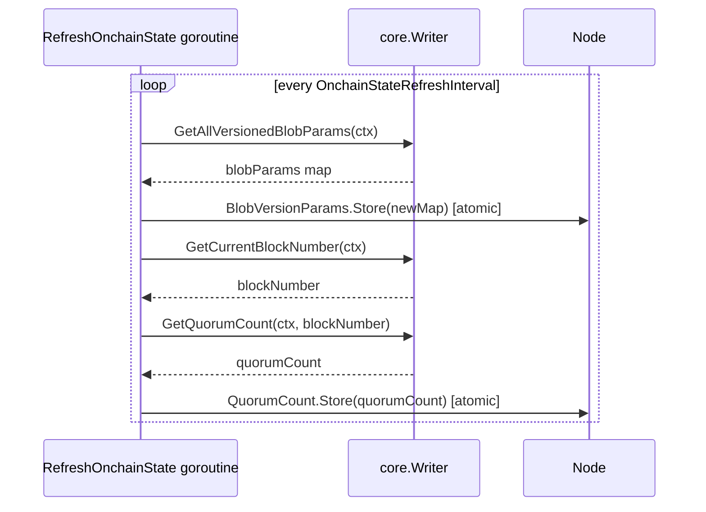
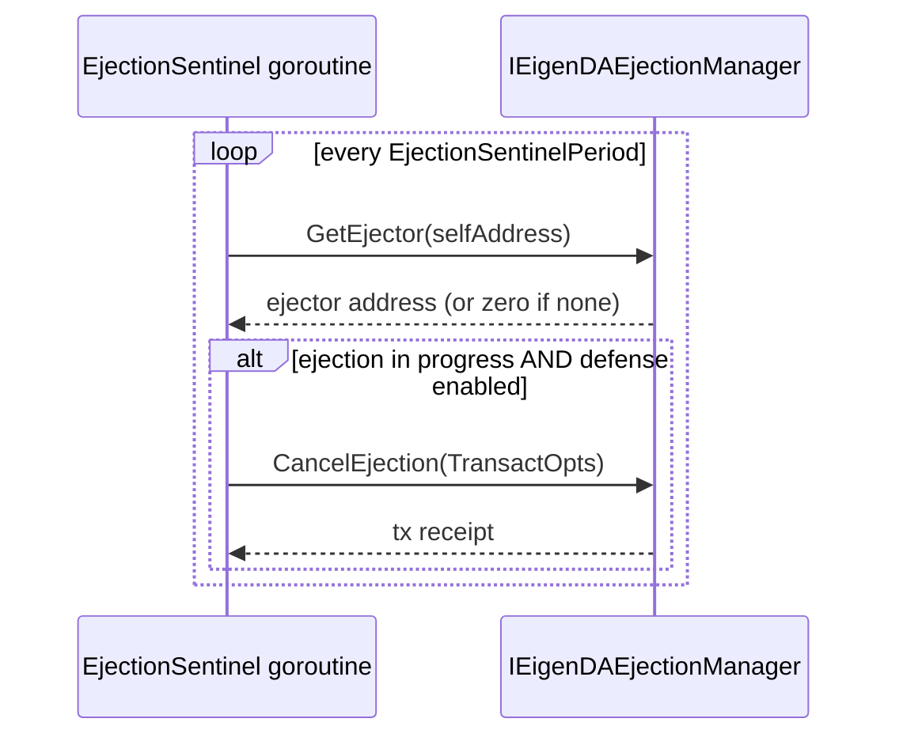

# node Analysis

**Analyzed by**: code-library-analyzer
**Timestamp**: 2026-04-10T00:00:00Z
**Application Type**: go-module
**Classification**: library
**Location**: node/

## Architecture

The `node` package implements the core DA (Data Availability) node operator logic for the EigenDA network. It is structured as a layered library that composes several major concerns: configuration, storage, networking (gRPC), on-chain interactions, payment metering, and operator lifecycle management.

At the top level, the `Node` struct acts as the central coordinator, holding references to all major subsystems. Initialization in `NewNode()` follows a strict dependency-injection pattern: each subsystem is constructed individually and wired into the `Node` struct, with no global state. The node starts background goroutines for on-chain state refresh, IP updates, reachability checks, metrics, and an ejection sentinel all within `NewNode()`.

The gRPC serving layer lives in `node/grpc/` and provides two separate gRPC servers sharing the same `ServerV2` handler: one for blob **dispersal** (receiving chunks from a disperser) and one for **retrieval** (serving chunks to clients). Both servers are guarded by a per-disperser authentication and rate-limiting interceptor implemented in `node/grpc/middleware/`. The dispersal pathway is the hottest path: it validates, downloads chunks from relay nodes via a worker pool, validates the batch cryptographically (using KZG/gnark proofs), and stores the chunks in a local LittDB key-value store.

Storage is encapsulated behind the `ValidatorStore` interface backed by LittDB (the internal `litt` package). The store implements per-table TTL expiry, separate hot and cold read rate limiters, duplicate-write protection using a hash-based index lock, and configurable write and read cache sizes all derived from available system memory.

Payment enforcement uses two subsystems: a `ReservationPaymentValidator` for pre-paid bandwidth reservations (debited per blob) and an `OnDemandMeterer` for pay-as-you-go dispersals. Both subsystems interface with an on-chain `PaymentVault` contract.

The `EjectionSentinel` runs a polling goroutine that monitors the on-chain ejection contract and, if configured, can submit a cancellation transaction to resist improper ejection. Operator registration and deregistration logic (including churner interactions when quorums are full) lives in `operator.go`.

## Key Components

- **Node** (`node/node.go`): Central coordinator struct holding all subsystem references. Constructed by `NewNode()`, which wires together the Ethereum client, BLS signer, chain state, validator store, relay client, worker pools, payment systems, metrics, and gRPC servers. Exposes methods `DetermineChunkLocations`, `DownloadChunksFromRelays`, `ValidateBatchV2`, `MeterOnDemandDispersal`, `CancelOnDemandDispersal`, `ValidateReservationPayment`, `RefreshOnchainState`, and `SignMessage`.

- **Config** (`node/config.go`): Comprehensive configuration struct parsed from CLI flags (via `urfave/cli`). Contains over 60 fields covering network ports, LittDB storage paths and cache sizes, Ethereum credentials, BLS signer config, payment metering intervals, dispersal rate limits, GC safety buffer sizes, and ejection defense settings. `NewConfig()` validates and assembles all configuration from CLI context.

- **ValidatorStore / validatorStore** (`node/validator_store.go`): Storage interface and its LittDB-backed implementation for persisting raw chunk bundles keyed by `(blobKey || quorumID)`. `StoreBatch()` writes bundles concurrently with per-blob deduplication locks, flushes to disk, and reports byte counts. `GetBundleData()` retrieves bundles with hot/cold read rate limiting using `golang.org/x/time/rate`.

- **ServerV2** (`node/grpc/server_v2.go`): gRPC handler implementing `DispersalServer` and `RetrievalServer`. `StoreChunks()` orchestrates the full dispersal path: authentication, replay prevention, payment validation, operator state lookup, chunk location determination, semaphore-controlled download, batch validation, storage, and BLS signature generation. `GetChunks()` retrieves stored chunks for retrieval clients. `GetNodeInfo()` reports software version and system resources.

- **RequestAuthenticator** (`node/auth/authenticator.go`): Interface and LRU-cached implementation for authenticating disperser-signed `StoreChunksRequest` messages. Caches disperser ECDSA public keys fetched from chain state, with a configurable TTL. Also enforces which dispersers are authorized for on-demand payments.

- **StoreChunksDisperserAuthAndRateLimitInterceptor** (`node/grpc/middleware/storechunks_interceptor.go`): gRPC unary interceptor that runs before the `StoreChunks` handler. Authenticates the request, checks per-disperser rate limits (token bucket via `DisperserRateLimiter`), and injects the authenticated disperser ID into the request context.

- **DisperserRateLimiter** (`node/grpc/middleware/disperser_ratelimiter.go`): Per-disperser token-bucket rate limiter backed by `golang.org/x/time/rate`. Creates per-disperser `rate.Limiter` instances on demand, guarded by a mutex.

- **Operator / RegisterOperator / DeregisterOperator** (`node/operator.go`): Utility functions for registering and deregistering the operator on-chain. Handles quorum capacity checks via the churner service when quorums are full. `getQuorumIdsToRegister()` filters quorums that are not yet registered.

- **ChurnerClient** (`node/churner_client.go`): gRPC client interface for the churner service. When a quorum is at capacity, the node requests churn approval, signing the request with its BLS key. Supports both secure and insecure gRPC.

- **EjectionSentinel** (`node/ejection/ejection_sentinel.go`): Background goroutine that polls the on-chain `IEigenDAEjectionManager` contract to detect pending ejections against this validator. If ejection defense is enabled and the validator has a valid private key, it submits a cancellation transaction.

- **MetricsV2** (`node/grpc/metrics_v2.go`): Prometheus metrics for the v2 gRPC server. Tracks `StoreChunks` request size and per-stage latency (using a `StageTimer`), `GetChunks` latency and data size, and standard gRPC server metrics via `go-grpc-middleware/providers/prometheus`.

- **store.go / store_utils.go** (`node/store.go`, `node/store_utils.go`): Chunk encoding and storage key utilities. `EncodeChunks`/`DecodeChunks` flatten/unflatten byte arrays with length-prefixed framing supporting GOB and Gnark (BN254-based compressed G1 point) encoding formats. `store_utils.go` provides binary-encoded key construction for legacy v1 LevelDB storage (batch/blob/expiration prefixes).

## Data Flows

### 1. StoreChunks (Dispersal) Flow

**Flow Description**: A disperser sends chunk data to the validator node for storage. The node authenticates, validates payment, downloads chunks from relay nodes, validates the batch cryptographically, stores it, and returns a BLS signature.



**Detailed Steps**:

1. **Authentication and Rate Limiting** (Interceptor)
   - `AuthenticateStoreChunksRequest`: recover ECDSA signer from request signature, compare against cached disperser key from chain
   - `DisperserRateLimiter.Allow`: token bucket check per disperser ID
   - Inject authenticated disperser ID into context

2. **Request Validation** (ServerV2)
   - `validateStoreChunksRequest`: deserialize batch from proto, check signature length
   - Replay guardian check: hash blob headers+timestamps, verify not seen within time window
   - Payment metering: `MeterOnDemandDispersal` reserves global throughput for on-demand blobs

3. **Operator State Lookup** (Node)
   - `OperatorStateCache.GetOperatorState` with reference block number from batch header

4. **Chunk Location Planning** (Node)
   - `DetermineChunkLocations`: iterate blob certificates, pick random relay key from cert, compute chunk assignment indices, collapse indices into contiguous range requests

5. **Download from Relays** (Node)
   - Fan-out via `DownloadPool` goroutine pool; each goroutine calls `relayClient.GetChunksByRange` with a timeout
   - Responses collected via buffered channel; bundles deserialized into `BlobShard` structs

6. **Batch Validation** (Node)
   - `ValidateBatchV2`: validate batch header, then validate all blob shards via KZG/gnark verifier using `ValidationPool` goroutines

7. **Storage** (ValidatorStore)
   - Construct `BundleToStore` items with `BundleKey(blobKey, quorumID)` as key
   - `StoreBatch`: concurrent goroutines write bundles to LittDB with deduplication locks, flush to disk

8. **Signature** (Node)
   - `BLSSigner.Sign(batchHeaderHash)`: return signature to disperser

**Error Paths**:
- Authentication failure: `InvalidArgument` gRPC error
- Rate limit exceeded: `ResourceExhausted` gRPC error
- Download failure from any relay: `Internal` error (currently fails entire batch)
- Validation failure: `Internal` error with batch hash in message
- Storage failure: `Internal` error

---

### 2. GetChunks (Retrieval) Flow

**Flow Description**: A client requests stored chunk data for a specific blob and quorum from the validator node.



**Error Paths**:
- Invalid blob key format: `InvalidArgument`
- Bundle not found in store: `Internal`
- Read rate limit exhausted: `Internal`

---

### 3. Operator Registration Flow

**Flow Description**: On startup (if `RegisterNodeAtStart=true`), the node registers itself on-chain into configured quorums, potentially using the churner service.



---

### 4. Onchain State Refresh Flow

**Flow Description**: Background goroutine periodically refreshes blob version parameters and quorum count from the chain.



---

### 5. Ejection Defense Flow

**Flow Description**: The EjectionSentinel polls the on-chain ejection manager contract and optionally contests ejection.



## Dependencies

### External Libraries

- **github.com/gammazero/workerpool** (v1.x) [other]: Thread-pool implementation for bounded goroutine concurrency. Used in `node/node.go` for both `DownloadPool` (parallel chunk downloads from relays) and `ValidationPool` (parallel batch validation). Also used in `node/utils.go` for `GetBlobMessages` worker pool.
  Imported in: `node/node.go`, `node/utils.go`.

- **github.com/hashicorp/golang-lru/v2** (v2.x) [other]: Generic LRU cache. Used in `node/auth/authenticator.go` to cache disperser ECDSA public keys (keyed by `uint32` disperser ID) with timeout-based eviction.
  Imported in: `node/auth/authenticator.go`.

- **github.com/consensys/gnark-crypto** (v0.18.0) [crypto]: BN254 elliptic curve and field arithmetic library. Used in `node/store.go` to compute chunk size from compressed G1 affine point size (`bn254.SizeOfG1AffineCompressed`), and in `node/utils.go` for commitment subgroup validation on BN254 G1 and G2 points.
  Imported in: `node/store.go`, `node/utils.go`.

- **github.com/shirou/gopsutil** (v3.x) [monitoring]: OS-level system metrics. Used in `node/grpc/server_v2.go` (`mem.VirtualMemory()`) to report total RAM in `GetNodeInfo` responses.
  Imported in: `node/grpc/server_v2.go`.

- **github.com/grpc-ecosystem/go-grpc-middleware/providers/prometheus** (v1.0.1) [monitoring]: gRPC server metrics middleware for Prometheus. Used in `node/grpc/metrics_v2.go` to create `grpcprom.NewServerMetrics()` and expose a `UnaryServerInterceptor` that auto-instruments all gRPC handlers.
  Imported in: `node/grpc/metrics_v2.go`.

- **github.com/prometheus/client_golang** (v1.21.1) [monitoring]: Official Prometheus Go client. Used pervasively for defining GaugeVec, CounterVec, SummaryVec metrics and configuring the Prometheus registry.
  Imported in: `node/node.go`, `node/metrics.go`, `node/grpc/server_v2.go`, `node/grpc/metrics_v2.go`, `node/validator_store.go`.

- **golang.org/x/time/rate** (v0.10.0) [networking]: Token-bucket rate limiter from the Go extended library. Used in `node/validator_store.go` for hot/cold chunk read rate limiting and in `node/grpc/middleware/disperser_ratelimiter.go` for per-disperser gRPC request rate limiting.
  Imported in: `node/validator_store.go`, `node/grpc/middleware/disperser_ratelimiter.go`.

- **golang.org/x/sync/semaphore** (v0.16.0) [other]: Weighted semaphore for limiting concurrent memory usage. Used in `node/node.go` for `StoreChunksSemaphore` to cap the total bytes being buffered during concurrent `StoreChunks` requests.
  Imported in: `node/node.go`.

- **github.com/docker/go-units** (v0.5.0) [other]: Human-readable size conversion utilities (GiB, MiB). Used in `node/config.go` and `node/validator_store.go` to convert floating-point GB/MB values from CLI flags to byte counts.
  Imported in: `node/config.go`, `node/validator_store.go`, `node/flags/flags.go`.

- **github.com/urfave/cli** (v1.22.14) [cli]: CLI framework for parsing command-line flags and environment variables. Used in `node/config.go` (`NewConfig`) to read all node configuration from CLI context, and in `node/flags/flags.go` to declare all flags.
  Imported in: `node/config.go`, `node/flags/flags.go`, `node/cmd/main.go`.

- **github.com/ethereum/go-ethereum** (v1.15.3) [blockchain]: Ethereum client library. Used in `node/node.go` for `ChainID()` and ECDSA key operations. Used in `node/auth/request_signing.go` for ECDSA signing/verification (`crypto.Sign`, `crypto.SigToPub`). Used in `node/ejection/ejection_sentinel.go` for transaction signing (`bind.NewKeyedTransactorWithChainID`).
  Imported in: `node/node.go`, `node/config.go`, `node/auth/request_signing.go`, `node/auth/authenticator.go`, `node/churner_client.go`, `node/ejection/ejection_sentinel.go`.

- **google.golang.org/grpc** (v1.72.2) [networking]: gRPC framework. Used in `node/grpc/run.go` to create `grpc.Server` instances with interceptors and serve dispersal/retrieval listeners. Used in `node/churner_client.go` to create gRPC client connections to the churner.
  Imported in: `node/grpc/run.go`, `node/grpc/server_v2.go`, `node/grpc/middleware/storechunks_interceptor.go`, `node/churner_client.go`.

### Internal Libraries

- **github.com/Layr-Labs/eigenda/api** (`api/`): Provides gRPC protobuf bindings (`api/grpc/validator`, `api/grpc/churner`, `api/grpc/node`), the `api/hashing` package for request hash computation, and structured error types (`api.NewErrorInvalidArg`, `api.NewErrorInternal`, etc.). The node's gRPC servers implement the `validator.DispersalServer` and `validator.RetrievalServer` interfaces from this package.

- **github.com/Layr-Labs/eigenda/common** (`common/`): Shared utilities including `logging.Logger`, `EthClient`, `RateLimiter`, `pubip.Provider`, `pprof.PprofProfiler`, `memory.GetMaximumAvailableMemory`, `SequenceProbe` (stage timing), `version.Semver`, and `replay.ReplayGuardian`. The node uses `common.GlobalRateParams` / `ratelimit.NewRateLimiter` for the outer request rate limiter and `memory` utilities for computing memory pool sizes.

- **github.com/Layr-Labs/eigenda/core** (`core/`): Core domain types and interfaces. `Node` uses `core.Reader` / `core.Writer` chain state interfaces, `core.KeyPair`, `core.Bundle`, `core.BlobMessage`, `core.OperatorID`, `core.QuorumID`, `core.ChainState`, and bundle encoding format constants. The `core/eth` sub-package provides the concrete Ethereum writer/reader. `core/meterer` provides `OnDemandMeterer`. `core/payments` provides `ReservationPaymentValidator` and `PaymentVault`.

- **github.com/Layr-Labs/eigenda/core/v2** (`core/v2/`): v2 protocol types and logic. `Node` uses `corev2.Batch`, `corev2.BlobCertificate`, `corev2.BlobShard`, `corev2.ShardValidator`, `corev2.BlobVersionParameterMap`, `corev2.GetAssignmentForBlob`, `corev2.BatchFromProtobuf`, and `corev2.BlobRequestAuthenticator`. This is the primary protocol version supported by the node.

- **github.com/Layr-Labs/eigenda/encoding** (`encoding/`): KZG encoding types and v2 verifier. `Node` uses `encoding/v1/kzg.KzgConfig` for encoder config, `encoding/v2/kzg/verifier` to construct a verifier for batch validation, and `encoding.Frame`/`encoding.G1Commitment`/`encoding.G2Commitment` for chunk representation.

- **github.com/Layr-Labs/eigenda/litt** (`litt/`): The internal LittDB key-value store. `ValidatorStore` is entirely backed by LittDB: it uses `litt.DB`, `litt.Table`, `litt.DefaultConfig`, and `littbuilder.NewDB` for database construction. LittDB provides TTL-based expiry, read/write caching, flush control, snapshot directories, and sharding across multiple storage paths.

- **github.com/Layr-Labs/eigenda/operators** (`operators/`): Used in `node/metrics.go` for on-chain operator metrics (quorum rank and stake share reporting).

- **github.com/Layr-Labs/eigensdk-go** (external SDK): Provides `logging.Logger`, `nodeapi.NodeApi` (EigenLayer node API server), `metrics.EigenMetrics`, `blssigner.Signer` (local and remote BLS signing via Cerberus), and `blssigner.NewSigner` factory.

## API Surface

The `node` package exposes the following public API to other components (primarily `node/grpc` and `node/cmd`):

### Core Types

**Node** (`node/node.go`):
```go
type Node struct {
    CTX            context.Context
    Config         *Config
    Logger         logging.Logger
    KeyPair        *core.KeyPair
    Metrics        *Metrics
    NodeApi        *nodeapi.NodeApi
    ValidatorStore ValidatorStore
    ChainState     core.ChainState
    ValidatorV2    corev2.ShardValidator
    Transactor     core.Writer
    BLSSigner      blssigner.Signer
    RelayClient    atomic.Value
    DownloadPool   *workerpool.WorkerPool
    ValidationPool *workerpool.WorkerPool
    BlobVersionParams atomic.Pointer[corev2.BlobVersionParameterMap]
    QuorumCount    atomic.Uint32
    StoreChunksSemaphore *semaphore.Weighted
    OperatorStateCache   operatorstate.OperatorStateCache
}

func NewNode(ctx context.Context, reg *prometheus.Registry, config *Config,
    contractDirectory *directory.ContractDirectory, pubIPProvider pubip.Provider,
    client *geth.InstrumentedEthClient, logger logging.Logger,
    softwareVersion *version.Semver) (*Node, error)

func (n *Node) DetermineChunkLocations(batch *corev2.Batch,
    operatorState *core.OperatorState,
    probe *common.SequenceProbe) (downloadSizeInBytes uint64,
    relayRequests map[corev2.RelayKey]*RelayRequest, err error)

func (n *Node) DownloadChunksFromRelays(ctx context.Context, batch *corev2.Batch,
    relayRequests map[corev2.RelayKey]*RelayRequest,
    probe *common.SequenceProbe) (blobShards []*corev2.BlobShard, rawBundles []*RawBundle, err error)

func (n *Node) ValidateBatchV2(ctx context.Context, batch *corev2.Batch,
    blobShards []*corev2.BlobShard, operatorState *core.OperatorState) error

func (n *Node) ValidateReservationPayment(ctx context.Context,
    batch *corev2.Batch, probe *common.SequenceProbe) error

func (n *Node) MeterOnDemandDispersal(symbolCount uint32) (*meterer.OnDemandReservation, error)
func (n *Node) CancelOnDemandDispersal(reservation *meterer.OnDemandReservation)
func (n *Node) RefreshOnchainState() error
func (n *Node) SignMessage(ctx context.Context, data [32]byte) (*core.Signature, error)
```

**Config** (`node/config.go`):
```go
type Config struct { /* 60+ fields */ }
func NewConfig(ctx *cli.Context) (*Config, error)
```

**ValidatorStore** (`node/validator_store.go`):
```go
type ValidatorStore interface {
    StoreBatch(batchData []*BundleToStore) (uint64, error)
    GetBundleData(bundleKey []byte) ([]byte, error)
    Stop() error
}
type BundleToStore struct {
    BundleKey   []byte
    BundleBytes []byte
}
func NewValidatorStore(logger logging.Logger, config *Config,
    timeSource func() time.Time, ttl time.Duration,
    registry *prometheus.Registry) (ValidatorStore, error)
func BundleKey(blobKey corev2.BlobKey, quorumID core.QuorumID) ([]byte, error)
```

**Operator Management** (`node/operator.go`):
```go
type Operator struct {
    Address             string
    Socket              string
    Timeout             time.Duration
    PrivKey             *ecdsa.PrivateKey
    Signer              blssigner.Signer
    OperatorId          core.OperatorID
    QuorumIDs           []core.QuorumID
    RegisterNodeAtStart bool
}
func RegisterOperator(ctx context.Context, operator *Operator,
    transactor core.Writer, churnerClient ChurnerClient, logger logging.Logger) error
func DeregisterOperator(ctx context.Context, operator *Operator,
    pubKeyG1 *core.G1Point, transactor core.Writer) error
func UpdateOperatorSocket(ctx context.Context, transactor core.Writer, socket string) error
```

**ChurnerClient** (`node/churner_client.go`):
```go
type ChurnerClient interface {
    Churn(ctx context.Context, operatorAddress string,
        blssigner blssigner.Signer, quorumIDs []core.QuorumID) (*churnerpb.ChurnReply, error)
}
func NewChurnerClient(churnerURL string, useSecureGrpc bool,
    timeout time.Duration, logger logging.Logger) ChurnerClient
```

**Chunk Encoding Utilities** (`node/store.go`):
```go
func EncodeChunks(chunks [][]byte) ([]byte, error)
func DecodeChunks(data []byte) ([][]byte, node.ChunkEncodingFormat, error)
func DecodeGobChunks(data []byte) ([][]byte, error)
func DecodeGnarkChunks(data []byte) ([][]byte, error)
```

**Storage Key Utilities** (`node/store_utils.go`):
```go
func EncodeBlobKey(batchHeaderHash [32]byte, blobIndex int, quorumID core.QuorumID) ([]byte, error)
func EncodeBlobHeaderKey(batchHeaderHash [32]byte, blobIndex int) ([]byte, error)
func EncodeBatchHeaderKey(batchHeaderHash [32]byte) []byte
func EncodeBatchExpirationKey(expirationTime int64) []byte
func EncodeBlobExpirationKey(expirationTime int64, blobHeaderHash [32]byte) []byte
func DecodeBatchExpirationKey(key []byte) (int64, error)
func DecodeBlobExpirationKey(key []byte) (int64, error)
```

**gRPC Server** (`node/grpc/`):
```go
type ServerV2 struct { /* implements validator.DispersalServer + validator.RetrievalServer */ }
func NewServerV2(ctx context.Context, config *node.Config, node *node.Node,
    logger logging.Logger, ratelimiter common.RateLimiter,
    registry *prometheus.Registry, reader core.Reader,
    softwareVersion *version.Semver,
    dispersalListener net.Listener,
    retrievalListener net.Listener) (*ServerV2, error)

type Listeners struct {
    Dispersal net.Listener
    Retrieval net.Listener
}
func CreateListeners(dispersalPort, retrievalPort string) (Listeners, error)
func RunServers(serverV2 *ServerV2, config *node.Config, logger logging.Logger) error
```

**Auth** (`node/auth/`):
```go
type RequestAuthenticator interface {
    AuthenticateStoreChunksRequest(ctx context.Context,
        request *grpc.StoreChunksRequest, now time.Time) ([]byte, error)
    IsDisperserAuthorized(disperserID uint32, batch *corev2.Batch) bool
}
func NewRequestAuthenticator(ctx context.Context, chainReader core.Reader,
    logger logging.Logger, keyCacheSize int, keyTimeoutDuration time.Duration,
    authorizedOnDemandDispersers []uint32, now time.Time) (RequestAuthenticator, error)
func SignStoreChunksRequest(key *ecdsa.PrivateKey, request *grpc.StoreChunksRequest) ([]byte, error)
func VerifyStoreChunksRequest(key gethcommon.Address, request *grpc.StoreChunksRequest) ([]byte, error)
```

**EjectionSentinel** (`node/ejection/`):
```go
func NewEjectionSentinel(ctx context.Context, logger logging.Logger,
    ejectionContractAddress gethcommon.Address, ethClient common.EthClient,
    privateKey *ecdsa.PrivateKey, selfAddress gethcommon.Address,
    period time.Duration, ejectionDefenseEnabled bool,
    ignoreVersion bool) (*EjectionSentinel, error)
```

**Utility Functions** (`node/utils.go`):
```go
func GetBlobMessages(pbBlobs []*pb.Blob, numWorkers int) ([]*core.BlobMessage, error)
func ValidatePointsFromBlobHeader(h *pb.BlobHeader) error
func SocketAddress(ctx context.Context, provider pubip.Provider,
    dispersalPort, retrievalPort, v2DispersalPort, v2RetrievalPort string) (string, error)
func GetBundleEncodingFormat(blob *pb.Blob) core.BundleEncodingFormat
```

## Code Examples

### Example 1: StoreChunks Authentication Interceptor

```go
// node/grpc/middleware/storechunks_interceptor.go
func StoreChunksDisperserAuthAndRateLimitInterceptor(
    rateLimiter *DisperserRateLimiter,
    requestAuthenticator auth.RequestAuthenticator,
) grpc.UnaryServerInterceptor {
    return func(ctx context.Context, req interface{},
        info *grpc.UnaryServerInfo, handler grpc.UnaryHandler) (interface{}, error) {
        if info == nil || info.FullMethod != validatorpb.Dispersal_StoreChunks_FullMethodName {
            return handler(ctx, req)
        }
        storeReq := req.(*validatorpb.StoreChunksRequest)
        now := time.Now()
        // Authenticate first: identity must be proven before rate limiting
        _, err := requestAuthenticator.AuthenticateStoreChunksRequest(ctx, storeReq, now)
        if err != nil {
            return nil, status.Errorf(codes.InvalidArgument, "failed to authenticate: %v", err)
        }
        disperserID := storeReq.GetDisperserID()
        if rateLimiter != nil && !rateLimiter.Allow(disperserID, now) {
            return nil, status.Error(codes.ResourceExhausted,
                fmt.Sprintf("disperser %d is rate limited", disperserID))
        }
        ctx = context.WithValue(ctx, ctxKeyAuthenticatedDisperserID, disperserID)
        return handler(ctx, req)
    }
}
```

### Example 2: Chunk Range Request Generation

```go
// node/node_v2.go - convertIndicesToRangeRequests collapses sorted indices into ranges
func convertIndicesToRangeRequests(blobKey corev2.BlobKey, indices []uint32) []*relay.ChunkRequestByRange {
    requests := make([]*relay.ChunkRequestByRange, 0)
    startIndex := indices[0]
    for i := 1; i < len(indices); i++ {
        if indices[i] != indices[i-1]+1 {
            // Gap detected: emit the current range as [startIndex, indices[i-1]+1) exclusive
            requests = append(requests, &relay.ChunkRequestByRange{
                BlobKey: blobKey, Start: startIndex, End: indices[i-1] + 1,
            })
            startIndex = indices[i]
        }
    }
    // Emit the last range
    requests = append(requests, &relay.ChunkRequestByRange{
        BlobKey: blobKey, Start: startIndex, End: indices[len(indices)-1] + 1,
    })
    return requests
}
```

### Example 3: ValidatorStore Concurrent Write with Deduplication

```go
// node/validator_store.go - StoreBatch with concurrent writes and deduplication locks
func (s *validatorStore) StoreBatch(batchData []*BundleToStore) (uint64, error) {
    writeCompleteChan := make(chan error, len(batchData))
    for _, batchDatum := range batchData {
        bundleKeyBytes := batchDatum.BundleKey
        bundleData := batchDatum.BundleBytes
        go func() {
            // Hash-based shard lock prevents duplicate concurrent writes of same blob
            hash := util.HashKey(bundleKeyBytes[:], s.duplicateRequestSalt)
            s.duplicateRequestLock.Lock(uint64(hash))
            defer s.duplicateRequestLock.Unlock(uint64(hash))

            exists, _ := s.chunkTable.Exists(bundleKeyBytes[:])
            if exists {
                writeCompleteChan <- nil
                return
            }
            writeCompleteChan <- s.chunkTable.Put(bundleKeyBytes, bundleData)
        }()
    }
    // Collect results then flush to disk
    for i := 0; i < len(batchData); i++ {
        if err := <-writeCompleteChan; err != nil {
            return 0, fmt.Errorf("failed to write data")
        }
    }
    return size, s.chunkTable.Flush()
}
```

### Example 4: Memory Pool Configuration

```go
// node/node.go - configureMemoryLimits allocates memory pools relative to system RAM
func configureMemoryLimits(logger logging.Logger, config *Config) error {
    maxMemory, _ := memory.GetMaximumAvailableMemory()
    totalAllocated := uint64(0)

    // GC safety buffer is reserved first
    config.GCSafetyBufferSizeBytes, _ = computeMemoryPoolSize(
        logger, "GC Safety Buffer",
        config.GCSafetyBufferSizeBytes, config.GCSafetyBufferSizeFraction, maxMemory)
    memory.SetGCMemorySafetyBuffer(config.GCSafetyBufferSizeBytes)
    totalAllocated += config.GCSafetyBufferSizeBytes

    // LittDB caches and StoreChunks buffer get configurable fractions of remaining memory
    config.LittDBReadCacheSizeBytes, _ = computeMemoryPoolSize(...)
    config.LittDBWriteCacheSizeBytes, _ = computeMemoryPoolSize(...)
    config.StoreChunksBufferSizeBytes, _ = computeMemoryPoolSize(...)

    if totalAllocated > maxMemory {
        return fmt.Errorf("total memory allocated exceeds maximum available")
    }
    return nil
}
```

## Files Analyzed

- `node/node.go` (~850 lines) - Central Node struct, NewNode constructor, background goroutines
- `node/node_v2.go` (265 lines) - V2 chunk location and relay download methods
- `node/config.go` (469 lines) - Config struct and CLI parsing
- `node/validator_store.go` (307 lines) - LittDB-backed chunk storage
- `node/store.go` (124 lines) - Chunk encoding/decoding (GOB and Gnark formats)
- `node/store_utils.go` (197 lines) - Legacy v1 storage key encoding utilities
- `node/operator.go` (138 lines) - On-chain operator registration/deregistration
- `node/churner_client.go` (152 lines) - Churner gRPC client
- `node/utils.go` (173 lines) - Blob message construction and format detection utilities
- `node/metrics.go` (80+ lines) - Prometheus metrics definitions
- `node/version.go` (44 lines) - Build-time version management
- `node/v1_deprecation.go` (40 lines) - V1 data deletion utility
- `node/errors.go` (9 lines) - Error sentinel values
- `node/grpc/server_v2.go` (547 lines) - gRPC dispersal/retrieval server implementation
- `node/grpc/run.go` (77 lines) - gRPC server startup
- `node/grpc/listeners.go` (47 lines) - TCP listener creation
- `node/grpc/metrics_v2.go` (80 lines) - gRPC-level metrics
- `node/grpc/middleware/storechunks_interceptor.go` (78 lines) - Auth+rate-limit interceptor
- `node/grpc/middleware/disperser_ratelimiter.go` (56 lines) - Per-disperser token bucket
- `node/auth/authenticator.go` (154 lines) - Disperser key caching and request authentication
- `node/auth/request_signing.go` (49 lines) - ECDSA signing/verification for StoreChunks
- `node/ejection/ejection_sentinel.go` (190 lines) - Ejection monitor and defense
- `node/flags/flags.go` (80+ lines) - CLI flag declarations
- `node/cmd/main.go` (180 lines) - Binary entry point wiring

## Analysis Data

```json
{
  "summary": "The node package implements the EigenDA Data Availability validator node operator. It provides a self-contained library that composes blob storage (via LittDB), gRPC dispersal and retrieval servers, on-chain operator registration, payment metering (reservations and on-demand), cryptographic batch validation (KZG/gnark), relay-based chunk downloading, Prometheus metrics, and an ejection defense sentinel. The Node struct acts as the central dependency-injection root, with NewNode() constructing and wiring all subsystems.",
  "architecture_pattern": "layered with dependency injection",
  "key_modules": [
    "node.Node (central coordinator)",
    "node.Config (CLI-parsed configuration)",
    "node.ValidatorStore / validatorStore (LittDB chunk storage)",
    "node/grpc.ServerV2 (gRPC dispersal+retrieval handler)",
    "node/grpc/middleware (auth+rate-limit interceptor)",
    "node/auth.RequestAuthenticator (disperser key caching and ECDSA verification)",
    "node.Operator + RegisterOperator (on-chain operator lifecycle)",
    "node.ChurnerClient (churner gRPC client)",
    "node/ejection.EjectionSentinel (ejection defense)",
    "node.Metrics / node/grpc.MetricsV2 (Prometheus instrumentation)"
  ],
  "api_endpoints": [
    "gRPC validator.Dispersal/StoreChunks",
    "gRPC validator.Retrieval/GetChunks",
    "gRPC validator.Dispersal/GetNodeInfo",
    "gRPC validator.Retrieval/GetNodeInfo"
  ],
  "data_flows": [
    "StoreChunks dispersal: authenticate -> validate payment -> get operator state -> plan relay downloads -> download chunks -> KZG validate -> store in LittDB -> BLS sign -> reply",
    "GetChunks retrieval: validate blob key -> compute bundle key -> LittDB lookup with rate limiting -> decode chunks -> reply",
    "Operator registration: query registered quorums -> check quorum capacity -> optional churner call -> on-chain transaction",
    "Onchain state refresh: periodic fetch of blob version params and quorum count -> atomic store in Node struct",
    "Ejection defense: poll ejection contract -> optionally submit cancellation transaction"
  ],
  "tech_stack": [
    "go",
    "grpc",
    "prometheus",
    "ethereum",
    "bn254-kzg",
    "litt-db"
  ],
  "external_integrations": [
    "Ethereum RPC (chain state reads/writes via go-ethereum)",
    "EigenDA Relay nodes (gRPC chunk download via relay client)",
    "EigenDA Churner service (gRPC churn approval for full quorums)",
    "EigenLayer on-chain contracts (RegistryCoordinator, ServiceManager, PaymentVault, IEigenDAEjectionManager)",
    "Cerberus BLS remote signer (optional, via eigensdk-go/signer)"
  ],
  "component_interactions": [
    "api: uses api/grpc/validator protobuf definitions and api/hashing for request signing",
    "common: uses logging, memory management, pubip, replay guardian, pprof, version",
    "core: uses chain state interfaces, bundle types, operator types, payment metering",
    "encoding: uses KZG config and v2 verifier for batch validation",
    "litt: uses LittDB for all v2 chunk persistence",
    "operators: uses for on-chain operator metrics collection"
  ]
}
```

## Citations

```json
[
  {
    "file_path": "node/node.go",
    "start_line": 69,
    "end_line": 120,
    "claim": "Node struct is the central coordinator holding all major subsystem references including config, logger, BLS signer, relay client, worker pools, semaphore, and payment systems",
    "section": "Key Components",
    "snippet": "type Node struct {\n    CTX context.Context\n    Config *Config\n    Logger logging.Logger\n    ValidatorStore ValidatorStore\n    ValidatorV2 corev2.ShardValidator\n    DownloadPool *workerpool.WorkerPool\n    ValidationPool *workerpool.WorkerPool\n    BlobVersionParams atomic.Pointer[corev2.BlobVersionParameterMap]\n    StoreChunksSemaphore *semaphore.Weighted\n}"
  },
  {
    "file_path": "node/node.go",
    "start_line": 122,
    "end_line": 132,
    "claim": "NewNode constructor follows dependency-injection pattern taking prometheus registry, contract directory, pubip provider, eth client, and logger as external dependencies",
    "section": "Architecture",
    "snippet": "func NewNode(\n    ctx context.Context,\n    reg *prometheus.Registry,\n    config *Config,\n    contractDirectory *directory.ContractDirectory,\n    pubIPProvider pubip.Provider,\n    client *geth.InstrumentedEthClient,\n    logger logging.Logger,\n    softwareVersion *version.Semver,\n) (*Node, error)"
  },
  {
    "file_path": "node/node.go",
    "start_line": 250,
    "end_line": 265,
    "claim": "Worker pools for chunk downloads and batch validation are created with configurable pool sizes",
    "section": "Architecture",
    "snippet": "downloadPool := workerpool.New(downloadPoolSize)\nvalidationPool := workerpool.New(validationPoolSize)"
  },
  {
    "file_path": "node/node.go",
    "start_line": 398,
    "end_line": 424,
    "claim": "NewNode starts background goroutines for pprof, metrics, node API, v2 state refresh, registration check, ejection sentinel, and IP updater",
    "section": "Architecture",
    "snippet": "n.startPprof()\nn.startMetrics()\nn.startNodeAPI()\nn.startV2()\n...\nerr = n.startEjectionSentinel()\nn.startNodeIPUpdater()"
  },
  {
    "file_path": "node/node_v2.go",
    "start_line": 41,
    "end_line": 116,
    "claim": "DetermineChunkLocations iterates blob certificates, picks a random relay key from each cert, computes chunk assignment, and builds batched range requests per relay key",
    "section": "Data Flows",
    "snippet": "func (n *Node) DetermineChunkLocations(\n    batch *corev2.Batch,\n    operatorState *core.OperatorState,\n    probe *common.SequenceProbe,\n) (downloadSizeInBytes uint64, relayRequests map[corev2.RelayKey]*RelayRequest, err error)"
  },
  {
    "file_path": "node/node_v2.go",
    "start_line": 128,
    "end_line": 157,
    "claim": "convertIndicesToRangeRequests collapses mostly-sorted chunk indices into contiguous range requests, creating a new range on any gap in the sequence",
    "section": "Data Flows",
    "snippet": "for i := 1; i < len(indices); i++ {\n    if indices[i] != indices[i-1]+1 {\n        request := &relay.ChunkRequestByRange{\n            BlobKey: blobKey, Start: startIndex, End: indices[i-1] + 1,\n        }\n        requests = append(requests, request)\n        startIndex = indices[i]\n    }\n}"
  },
  {
    "file_path": "node/node_v2.go",
    "start_line": 162,
    "end_line": 210,
    "claim": "DownloadChunksFromRelays fans out download requests to the relay worker pool via a buffered channel, each goroutine calling GetChunksByRange with a timeout",
    "section": "Data Flows",
    "snippet": "bundleChan := make(chan response, len(relayRequests))\nfor relayKey := range relayRequests {\n    req := relayRequests[relayKey]\n    n.DownloadPool.Submit(func() {\n        ctxTimeout, cancel := context.WithTimeout(ctx, n.Config.ChunkDownloadTimeout)\n        defer cancel()\n        bundles, err := relayClient.GetChunksByRange(ctxTimeout, relayKey, req.ChunkRequests)\n        ..."
  },
  {
    "file_path": "node/node_v2.go",
    "start_line": 244,
    "end_line": 265,
    "claim": "ValidateBatchV2 validates the batch header first then validates all blob shards via the KZG verifier using a separate validation worker pool",
    "section": "Data Flows",
    "snippet": "if err := n.ValidatorV2.ValidateBatchHeader(ctx, batch.BatchHeader, batch.BlobCertificates); err != nil { ... }\nerr := n.ValidatorV2.ValidateBlobs(ctx, blobShards, blobVersionParams, n.ValidationPool, operatorState)"
  },
  {
    "file_path": "node/validator_store.go",
    "start_line": 38,
    "end_line": 50,
    "claim": "ValidatorStore interface defines the public storage contract with StoreBatch, GetBundleData, and Stop methods",
    "section": "API Surface",
    "snippet": "type ValidatorStore interface {\n    StoreBatch(batchData []*BundleToStore) (uint64, error)\n    GetBundleData(bundleKey []byte) ([]byte, error)\n    Stop() error\n}"
  },
  {
    "file_path": "node/validator_store.go",
    "start_line": 109,
    "end_line": 125,
    "claim": "LittDB is configured with sharding factor equal to number of storage paths, metrics enabled, configurable write cache, read cache, TTL, and snapshot directory",
    "section": "Key Components",
    "snippet": "littConfig.ShardingFactor = uint32(len(config.LittDBStoragePaths))\nlittConfig.MetricsEnabled = true\nlittConfig.MetricsRegistry = registry\nlittConfig.MetricsNamespace = littDBMetricsPrefix"
  },
  {
    "file_path": "node/validator_store.go",
    "start_line": 176,
    "end_line": 237,
    "claim": "StoreBatch uses concurrent goroutines with hash-based index locks to prevent duplicate writes, then flushes to disk after all writes complete",
    "section": "Key Components",
    "snippet": "go func() {\n    hash := util.HashKey(bundleKeyBytes[:], s.duplicateRequestSalt)\n    s.duplicateRequestLock.Lock(uint64(hash))\n    defer s.duplicateRequestLock.Unlock(uint64(hash))\n    exists, _ := s.chunkTable.Exists(bundleKeyBytes[:])\n    if exists { writeCompleteChan <- nil; return }\n    writeCompleteChan <- s.chunkTable.Put(bundleKeyBytes, bundleData)\n}()"
  },
  {
    "file_path": "node/validator_store.go",
    "start_line": 254,
    "end_line": 286,
    "claim": "getChunksLittDB enforces hot and cold read rate limits; if hot reads are exhausted cold reads are also blocked; if only cold reads are exhausted cache misses are blocked but cache hits are still allowed",
    "section": "Key Components",
    "snippet": "hotReadsExhausted := s.hotReadRateLimiter.Tokens() <= 0\nif hotReadsExhausted {\n    return nil, false, fmt.Errorf(\"read rate limit exhausted\")\n}\ncoldReadsExhausted := s.coldReadRateLimiter.Tokens() <= 0\nbundle, exists, hot, err := s.chunkTable.CacheAwareGet(bundleKey, coldReadsExhausted)"
  },
  {
    "file_path": "node/grpc/server_v2.go",
    "start_line": 32,
    "end_line": 54,
    "claim": "ServerV2 embeds both UnimplementedDispersalServer and UnimplementedRetrievalServer, implementing the complete v2 validator gRPC interface",
    "section": "Key Components",
    "snippet": "type ServerV2 struct {\n    pb.UnimplementedDispersalServer\n    pb.UnimplementedRetrievalServer\n    config *node.Config\n    node *node.Node\n    chunkAuthenticator auth.RequestAuthenticator\n    replayGuardian replay.ReplayGuardian\n    rateLimiter *middleware.DisperserRateLimiter\n}"
  },
  {
    "file_path": "node/grpc/server_v2.go",
    "start_line": 169,
    "end_line": 265,
    "claim": "StoreChunks performs authentication, replay protection, on-demand metering, reservation payment validation, operator state lookup, chunk location determination, semaphore acquisition, download, validate+store, and BLS signing in sequence",
    "section": "Data Flows",
    "snippet": "func (s *ServerV2) StoreChunks(ctx context.Context, in *pb.StoreChunksRequest) (*pb.StoreChunksReply, error)"
  },
  {
    "file_path": "node/grpc/server_v2.go",
    "start_line": 313,
    "end_line": 351,
    "claim": "After acquiring the StoreChunksSemaphore, chunks are downloaded from relays, then validated and stored, and finally the BLS signature over the batch header hash is returned",
    "section": "Data Flows",
    "snippet": "err = s.node.StoreChunksSemaphore.Acquire(semaphoreCtx, int64(downloadSizeInBytes))\n...\nblobShards, rawBundles, err := s.node.DownloadChunksFromRelays(...)\nerr = s.validateAndStoreChunks(...)\nsig, err := s.node.BLSSigner.Sign(ctx, batchHeaderHash[:])\nreturn &pb.StoreChunksReply{Signature: sig}, nil"
  },
  {
    "file_path": "node/grpc/server_v2.go",
    "start_line": 443,
    "end_line": 487,
    "claim": "GetChunks validates the blob key, always uses quorum 0 for the bundle key regardless of requested quorum, retrieves from ValidatorStore, and decodes chunks",
    "section": "Data Flows",
    "snippet": "// The current sampling scheme will store the same chunks for all quorums, so we always use quorum 0\nquorumID := core.QuorumID(0)\nbundleKey, err := node.BundleKey(blobKey, quorumID)\nbundleData, err := s.node.ValidatorStore.GetBundleData(bundleKey)"
  },
  {
    "file_path": "node/grpc/middleware/storechunks_interceptor.go",
    "start_line": 35,
    "end_line": 77,
    "claim": "StoreChunksDisperserAuthAndRateLimitInterceptor authenticates before rate limiting to prevent spoofed IDs from rate-limiting honest dispersers",
    "section": "Key Components",
    "snippet": "// IMPORTANT: rate limiting is only enforced after request authentication.\n// This prevents an attacker from spoofing a disperser ID and causing an honest disperser to be rate limited."
  },
  {
    "file_path": "node/grpc/run.go",
    "start_line": 15,
    "end_line": 76,
    "claim": "RunServers starts two separate gRPC servers in goroutines: one for dispersal (StoreChunks) and one for retrieval (GetChunks), both using the same ServerV2 handler with the auth+metrics interceptor chain",
    "section": "Architecture",
    "snippet": "go func() { ... validator.RegisterDispersalServer(gs, serverV2) ... }()\ngo func() { ... validator.RegisterRetrievalServer(gs, serverV2) ... }()"
  },
  {
    "file_path": "node/auth/authenticator.go",
    "start_line": 41,
    "end_line": 58,
    "claim": "requestAuthenticator caches disperser ECDSA public keys in an LRU cache keyed by disperser ID (uint32), with per-key expiration timestamps for TTL-based refresh",
    "section": "Key Components",
    "snippet": "type requestAuthenticator struct {\n    chainReader core.Reader\n    keyCache *lru.Cache[uint32, *keyWithTimeout]\n    keyTimeoutDuration time.Duration\n    authorizedOnDemandDispersers map[uint32]struct{}\n}"
  },
  {
    "file_path": "node/auth/request_signing.go",
    "start_line": 29,
    "end_line": 48,
    "claim": "VerifyStoreChunksRequest recovers the ECDSA public key from the request signature and compares the derived Ethereum address against the expected disperser address",
    "section": "Key Components",
    "snippet": "signingPublicKey, err := crypto.SigToPub(requestHash, request.GetSignature())\nsigningAddress := crypto.PubkeyToAddress(*signingPublicKey)\nif key.Cmp(signingAddress) != 0 {\n    return nil, fmt.Errorf(\"signature doesn't match with provided public key\")\n}"
  },
  {
    "file_path": "node/operator.go",
    "start_line": 53,
    "end_line": 97,
    "claim": "RegisterOperator checks quorum capacity and calls the churner service when a quorum is full; otherwise calls RegisterOperator directly on-chain",
    "section": "Data Flows",
    "snippet": "if operatorSetParams.MaxOperatorCount == numberOfRegisteredOperators {\n    shouldCallChurner = true\n}\n...\nif shouldCallChurner {\n    churnReply, err := churnerClient.Churn(ctx, ...)\n    return transactor.RegisterOperatorWithChurn(..., churnReply)\n} else {\n    return transactor.RegisterOperator(...)\n}"
  },
  {
    "file_path": "node/ejection/ejection_sentinel.go",
    "start_line": 19,
    "end_line": 47,
    "claim": "EjectionSentinel polls the IEigenDAEjectionManager contract and optionally submits cancellation transactions to defend against improper ejection",
    "section": "Key Components",
    "snippet": "type EjectionSentinel struct {\n    period time.Duration\n    caller *contractEigenDAEjectionManager.ContractIEigenDAEjectionManagerCaller\n    transactor *contractEigenDAEjectionManager.ContractIEigenDAEjectionManagerTransactor\n    selfAddress gethcommon.Address\n    ejectionDefenseEnabled bool\n}"
  },
  {
    "file_path": "node/ejection/ejection_sentinel.go",
    "start_line": 144,
    "end_line": 188,
    "claim": "checkEjectionStatus calls GetEjector on-chain; if ejection is in progress and defense is enabled, submits CancelEjection transaction with the validator's ECDSA key",
    "section": "Data Flows",
    "snippet": "ejector, err := s.caller.GetEjector(&bind.CallOpts{Context: s.ctx}, s.selfAddress)\n...\ntxn, err := s.transactor.CancelEjection(&bind.TransactOpts{\n    From: s.selfAddress, Context: s.ctx, Signer: s.signer,\n})"
  },
  {
    "file_path": "node/config.go",
    "start_line": 36,
    "end_line": 216,
    "claim": "Config struct contains 60+ fields covering all node settings including LittDB storage configuration, payment metering, ejection defense, and memory management",
    "section": "Key Components",
    "snippet": "type Config struct {\n    LittDBStoragePaths []string\n    LittRespectLocks bool\n    EjectionSentinelPeriod time.Duration\n    EjectionDefenseEnabled bool\n    StoreChunksBufferSizeFraction float64\n    GCSafetyBufferSizeFraction float64\n    ...}"
  },
  {
    "file_path": "node/store.go",
    "start_line": 26,
    "end_line": 40,
    "claim": "EncodeChunks flattens an array of byte slices into a single byte array using 8-byte little-endian length-prefixed framing",
    "section": "Key Components",
    "snippet": "func EncodeChunks(chunks [][]byte) ([]byte, error) {\n    totalSize := 0\n    for _, chunk := range chunks {\n        totalSize += len(chunk) + 8  // 8 bytes for uint64 length prefix\n    }\n}"
  },
  {
    "file_path": "node/store.go",
    "start_line": 100,
    "end_line": 123,
    "claim": "DecodeGnarkChunks computes fixed chunk size as BN254 compressed G1 point size plus encoding bytes per symbol multiplied by chunk length from the header",
    "section": "Key Components",
    "snippet": "chunkSize := bn254.SizeOfG1AffineCompressed + encoding.BYTES_PER_SYMBOL*int(chunkLen)"
  },
  {
    "file_path": "node/node.go",
    "start_line": 453,
    "end_line": 471,
    "claim": "MeterOnDemandDispersal reserves global on-demand throughput capacity; CancelOnDemandDispersal returns it if the dispersal fails downstream",
    "section": "API Surface",
    "snippet": "func (n *Node) MeterOnDemandDispersal(symbolCount uint32) (*meterer.OnDemandReservation, error) {\n    reservation, err := n.onDemandMeterer.MeterDispersal(symbolCount)\n    ...\n}\nfunc (n *Node) CancelOnDemandDispersal(reservation *meterer.OnDemandReservation) {\n    n.onDemandMeterer.CancelDispersal(reservation)\n}"
  },
  {
    "file_path": "node/node.go",
    "start_line": 488,
    "end_line": 517,
    "claim": "ValidateReservationPayment debits bandwidth reservations for each blob in a batch; on-demand blobs are skipped as the disperser is authoritative for on-demand payment",
    "section": "Data Flows",
    "snippet": "for _, blobCert := range batch.BlobCertificates {\n    if blobCert.BlobHeader.PaymentMetadata.IsOnDemand() {\n        continue  // Validators don't check on-demand; disperser is source of truth\n    }\n    success, err := n.reservationPaymentValidator.Debit(...)\n}"
  },
  {
    "file_path": "node/node.go",
    "start_line": 700,
    "end_line": 770,
    "claim": "configureMemoryLimits computes all memory pool sizes from available system memory and validates the total allocation does not exceed the maximum",
    "section": "Architecture",
    "snippet": "func configureMemoryLimits(logger logging.Logger, config *Config) error {\n    maxMemory, _ := memory.GetMaximumAvailableMemory()\n    ...\n    if totalAllocated > maxMemory {\n        return fmt.Errorf(\"total memory allocated (%d bytes) exceeds maximum available memory (%d bytes)\")\n    }\n}"
  },
  {
    "file_path": "node/node.go",
    "start_line": 799,
    "end_line": 838,
    "claim": "RefreshOnchainState runs a ticker loop that atomically updates BlobVersionParams and QuorumCount from the chain at the configured interval",
    "section": "Data Flows",
    "snippet": "ticker := time.NewTicker(n.Config.OnchainStateRefreshInterval)\nfor {\n    select {\n    case <-ticker.C:\n        blobParams, err := n.Transactor.GetAllVersionedBlobParams(n.CTX)\n        if err == nil { n.BlobVersionParams.Store(corev2.NewBlobVersionParameterMap(blobParams)) }\n        ...\n        n.QuorumCount.Store(uint32(quorumCount))\n    }\n}"
  },
  {
    "file_path": "node/validator_store.go",
    "start_line": 288,
    "end_line": 295,
    "claim": "BundleKey creates a compound key by concatenating the 32-byte blob key with the quorum ID in little-endian binary encoding",
    "section": "API Surface",
    "snippet": "func BundleKey(blobKey corev2.BlobKey, quorumID core.QuorumID) ([]byte, error) {\n    buf := bytes.NewBuffer(blobKey[:])\n    err := binary.Write(buf, binary.LittleEndian, quorumID)\n    return buf.Bytes(), err\n}"
  },
  {
    "file_path": "node/grpc/metrics_v2.go",
    "start_line": 33,
    "end_line": 80,
    "claim": "MetricsV2 uses go-grpc-middleware/providers/prometheus for standard gRPC server metrics and defines custom gauges for StoreChunks request size, GetChunks latency, and a StageTimer for per-stage StoreChunks timing",
    "section": "Key Components",
    "snippet": "grpcMetrics := grpcprom.NewServerMetrics()\nregistry.MustRegister(grpcMetrics)\ngrpcUnaryInterceptor := grpcMetrics.UnaryServerInterceptor()\nstoreChunksStageTimer := common.NewStageTimer(registry, namespace, \"store_chunks\", false)"
  }
]
```

## Analysis Notes

### Security Considerations

1. **Authentication before Rate Limiting**: The `StoreChunksDisperserAuthAndRateLimitInterceptor` explicitly authenticates the disperser's ECDSA signature before applying rate limits. This prevents an attacker from spoofing a legitimate disperser's ID to cause that disperser to be rate-limited. The interceptor comment at line 36-38 of `storechunks_interceptor.go` explicitly documents this design decision.

2. **Replay Protection**: A `ReplayGuardian` checks blob header hashes and timestamps against configurable time windows (`StoreChunksRequestMaxPastAge` / `StoreChunksRequestMaxFutureAge`). This prevents replaying valid `StoreChunks` requests to re-consume bandwidth reservations or trigger redundant storage operations.

3. **Payment Metering Point-of-No-Return**: The code explicitly documents (server_v2.go lines ~270-280) that payment debits are intentionally not rolled back on subsequent failures. This keeps all validator payment states in sync across the network; the replay guardian guarantees each request is processed exactly once.

4. **Ejection Defense ECDSA Key Requirement**: The ejection defense feature requires the node's ECDSA private key at runtime to sign on-chain transactions. This is a heightened security surface compared to nodes that only need BLS keys. The key is loaded from keystore file via `keystore.DecryptKey` at startup.

5. **Duplicate Write Salt**: The deduplication lock in `StoreBatch` uses a randomly generated 16-byte salt (`duplicateRequestSalt`) at startup to prevent hash collision attacks against the index-based shard lock. This avoids a scenario where an attacker could craft keys that always map to the same lock shard.

### Performance Characteristics

- **Parallel Downloads**: `DownloadPool` allows configurable parallel chunk downloads from multiple relays. The fan-out via buffered channel dispatches all relay requests concurrently and collects responses without ordering constraints.
- **Parallel Validation**: `ValidationPool` parallelizes KZG proof verification work across all blobs in a batch.
- **Memory-Bounded Buffering**: `StoreChunksSemaphore` limits total in-flight download bytes to prevent OOM conditions when many large batches arrive concurrently, with a configurable timeout for acquiring capacity.
- **Rate-Limited Reads**: The hot/cold rate limiters in `ValidatorStore` bound the bytes-per-second that retrieval clients can read, with separate limits for cache hits (hot) and cache misses (cold).
- **LittDB Sharding**: Setting `ShardingFactor = len(LittDBStoragePaths)` spreads data across multiple disks for higher aggregate I/O throughput.

### Scalability Notes

- **Stateful Payment Validation**: Reservation payment validation is stateful per-validator (each validator maintains its own ledger cache). On-demand metering uses a global rate limiter refreshed from on-chain `PaymentVault` parameters.
- **Operator State Cache**: `OperatorStateCacheSize` controls the LRU cache for operator states by block number, reducing chain RPC pressure during batch-heavy periods.
- **Single Process Architecture**: The node is designed as a single process with all logic co-located. Horizontal scaling is achieved by running multiple independent validator nodes, not by scaling components within one node.
- **Atomic State Updates**: `BlobVersionParams` and `QuorumCount` use `atomic.Pointer` and `atomic.Uint32` respectively, allowing background refresh goroutines to update state without locking the hot dispersal path.
