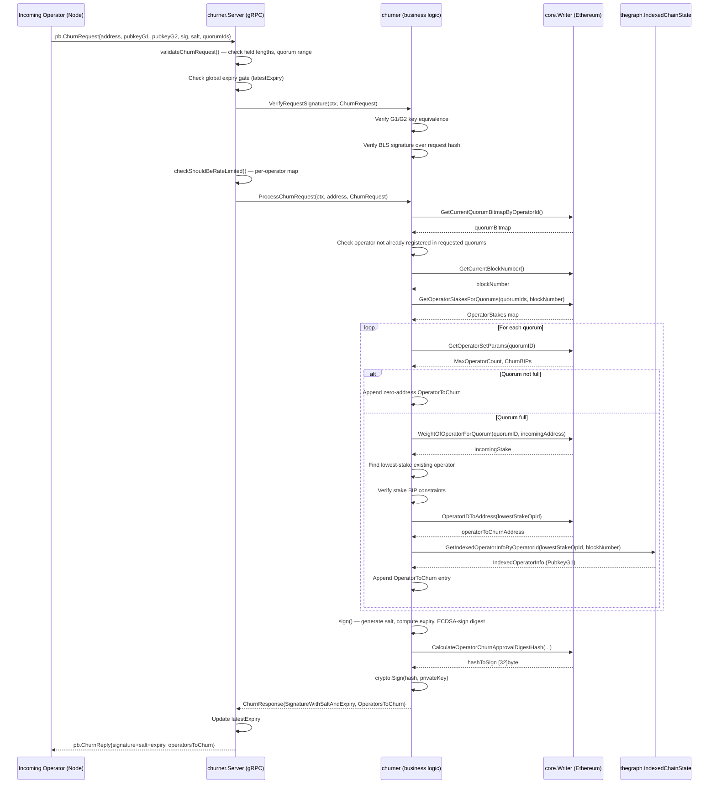
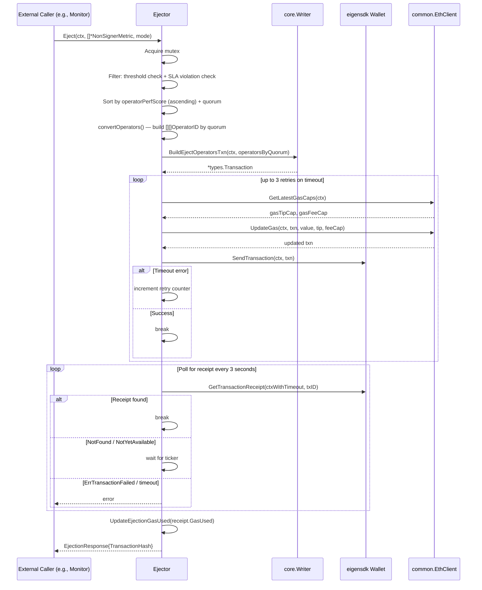
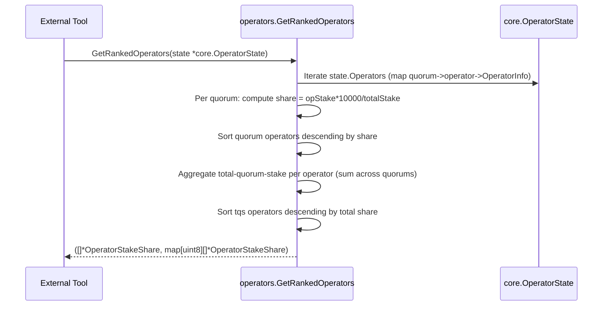

# operators Analysis

**Analyzed by**: code-analyzer-operators
**Timestamp**: 2026-04-10T00:00:00Z
**Application Type**: go-module
**Classification**: library
**Location**: operators/

## Architecture

The `operators` library provides two distinct subsystems for managing the lifecycle of DA (Data Availability) node operators in the EigenDA network: the **Churner** (handles new-operator registration arbitration) and the **Ejector** (handles forced removal of underperforming operators). These subsystems are organized as two sub-packages under a thin root package that provides shared utility functions.

The root package (`operators`) is minimal — it exports a single utility function `GetRankedOperators` that computes stake-share rankings from a `core.OperatorState` snapshot. This function is designed to be consumed by external tooling (e.g., dashboards, monitoring scripts) that needs to reason about relative operator standing.

The `churner` sub-package implements a **gRPC service** backed by an ECDSA-signed approval flow. When the EigenDA network reaches its maximum operator count for a quorum, new operators must obtain a "churn approval" from the Churner before they can displace an existing operator via the smart contract's `RegisterOperatorWithChurn` call. The Churner enforces two stake ratio constraints (BIPs-based) before authorizing churn, and rate-limits requests both globally (one approval active at a time) and per-operator (configurable interval, default 24 h). The design is deliberately centralized — there is exactly one Churner, and its ECDSA private key signs approvals on-chain.

The `ejector` sub-package implements a **programmatic ejection engine** that consumes pre-computed non-signer metrics and submits `EjectOperators` transactions to the on-chain `EjectionManager` contract. It is stateless between calls: callers supply a slice of `NonSignerMetric` structs (operator ID, quorum, signing percentage, stake percentage), and the Ejector filters, ranks, and submits the ejection transaction. Two ejection modes exist — `PeriodicMode` (regular SLA-window driven) and `UrgentMode` (triggered by network health degradation) — each with separate Prometheus counters to distinguish the source of ejections in observability dashboards.

Both sub-packages follow the same structural pattern: a core business-logic struct (`churner`/`Ejector`) is separated from an RPC/transport layer (`Server`/caller-provided HTTP handler), with a dedicated `Metrics` struct for Prometheus instrumentation and a `Config` struct parsed from `urfave/cli` flags.

## Key Components

- **`OperatorStakeShare` + `GetRankedOperators`** (`operators/utils.go`): Defines the `OperatorStakeShare` type (operator ID, stake share as float64, raw stake as `big.Float`) and the `GetRankedOperators` function. Given a `core.OperatorState`, it computes each operator's percentage share of each quorum's total stake, aggregates cross-quorum totals, and returns two sorted slices: a global total-quorum-stake ranking and per-quorum rankings. Used externally by monitoring tools and operator dashboards.

- **`churner` struct** (`operators/churner/churner.go`): Core Churner logic. Holds an `ecdsa.PrivateKey` (loaded from hex config), a `thegraph.IndexedChainState` indexer, and a `core.Writer` transactor. Exposes `VerifyRequestSignature`, `ProcessChurnRequest`, and `UpdateQuorumCount`. The BIP-based stake checks in `getOperatorsToChurn` implement the on-chain operator-set policy: the incoming operator must have `churnBIPsOfOperatorStake/10000` times the lowest-stake operator's stake, and the lowest-stake operator must hold less than `churnBIPsOfTotalStake/10000` of the quorum's total stake.

- **`Server` struct** (`operators/churner/server.go`): gRPC server that implements the `pb.ChurnerServer` interface. Wraps the `churner` business object and adds two layers of rate limiting: a global expiry gate (`latestExpiry`) that prevents concurrent approvals, and a per-operator gate (`lastRequestTimeByOperatorID` map) configurable via `PerPublicKeyRateLimit`. Translates between protobuf types and internal domain types.

- **`Config` + `NewConfig`** (`operators/churner/config.go`): Configuration struct populated from `urfave/cli` context. Holds Ethereum client settings, gRPC port, rate-limit durations (`PerPublicKeyRateLimit`, `ChurnApprovalInterval`), contract addresses, and Prometheus metrics config.

- **Churner `Metrics`** (`operators/churner/metrics.go`): Prometheus instrumentation for the Churner service. Exports a `CounterVec` for request counts (labels: `status`, `reason`, `method`) and a `SummaryVec` for latency with p50/p90/p95/p99 quantiles. Defines `FailReason` string constants that map to gRPC status codes (`InvalidArgument`, `ResourceExhausted`, `Internal`). Serves metrics on an HTTP endpoint (`/metrics`).

- **`flags` package** (`operators/churner/flags/flags.go`): Defines all CLI flags for the Churner binary, including required flags (`hostname`, `grpc-port`, `enable-metrics`) and optional flags with sensible defaults (`per-public-key-rate-limit` = 24 h, `churn-approval-interval` = 15 min, `metrics-http-port` = 9100). Aggregates flags from `geth`, `common`, `indexer`, and `thegraph` sub-packages.

- **Churner `cmd/main`** (`operators/churner/cmd/main.go`): Binary entry point. Wires together the Ethereum client, `core/eth.Writer` transactor, `thegraph.IndexedChainState` indexer, Churner business object, gRPC server, and health check endpoint. Registers the `ChurnerServer` with gRPC reflection for `grpcurl` discoverability.

- **`Ejector` struct** (`operators/ejector/ejector.go`): Core ejection engine. Accepts `NonSignerMetric` slices from callers, filters by SLA violation (using `stakeShareToSLA` step-function), ranks survivors by `operatorPerfScore` (a monotone function of non-signing rate vs. SLA tolerance), builds and submits an `EjectOperators` transaction via `core.Writer.BuildEjectOperatorsTxn`, and polls for receipt with retry logic (max 3 send retries on timeout). Mutex-protected to serialize concurrent ejection requests.

- **Ejector `Metrics`** (`operators/ejector/metrics.go`): Prometheus metrics for ejection. Separate `CounterVec`s for `PeriodicEjectionRequests` and `UrgentEjectionRequests` (both labeled by `status`), a per-quorum `CounterVec` for `OperatorsToEject`, a per-quorum `GaugeVec` for `StakeShareToEject`, and a `Gauge` for `EjectionGasUsed`.

- **`stakeShareToSLA` + `operatorPerfScore`** (`operators/ejector/ejector.go`): Pure business-logic functions. `stakeShareToSLA` is a step function: stake share > 15% → SLA 99.5%; > 10% → 98%; > 5% → 95%; default → 90%. `operatorPerfScore` converts (stake share, non-signing rate) into a [0,1] performance score: `(1 - SLA) / nonsigningRate / (1 + (1-SLA)/nonsigningRate)`. Lower scores trigger priority ejection.

## Data Flows

### 1. Churner: New Operator Registration (Churn Approval)

**Flow Description**: A new operator wanting to join a full quorum calls the Churner gRPC endpoint to obtain a cryptographically-signed approval that they can present on-chain.



**Detailed Steps**:

1. **Validation** (Server) — Validates field lengths (signature 64 bytes, G1 64 bytes, G2 128 bytes, salt 32 bytes) and quorum ID range against the current on-chain quorum count.
2. **Global rate gate** (Server) — Rejects if `now.Unix() < latestExpiry`; prevents two concurrent churn windows.
3. **Signature verification** (churner) — Verifies BLS key equivalence between G1 and G2, then verifies the operator's BLS signature over `Keccak256("ChurnRequest" || address || G1 || G2 || salt)`.
4. **Per-operator rate gate** (Server) — Rejects if the operator's last request was within `PerPublicKeyRateLimit`.
5. **Churn decision** (churner) — For each quorum: if not full, emits a zero-address placeholder. If full, finds the lowest-stake operator and verifies two BIP constraints. Fetches the lowest-stake operator's address and pubkey.
6. **Approval signing** (churner) — Derives a random salt from `Keccak256("churn" || now || operatorId || privateKeyBytes)`, sets expiry to `now + ChurnApprovalInterval`, computes the EigenLayer on-chain digest, signs with ECDSA, adjusts `v` byte to 27/28 range.

**Error Paths**:
- Stake BIP constraint violations → `api.NewErrorInvalidArg` with detailed percentage explanation
- Already registered in quorum → `api.NewErrorInvalidArg`
- Rate limit exceeded → `api.NewErrorResourceExhausted`
- Previous approval not expired → `api.NewErrorResourceExhausted`
- Invalid signature → `api.NewErrorInvalidArg`

---

### 2. Ejector: SLA-Violation Based Operator Ejection

**Flow Description**: An external caller (e.g., a monitoring service) supplies non-signer metrics and the Ejector submits a blockchain transaction to remove violating operators.



**Detailed Steps**:

1. **Filtering** — Drops operators below `nonsigningRateThreshold` (if configured in range 10-100%) and operators whose `Percentage/100.0 <= 1 - stakeShareToSLA(StakePercentage/100.0)` (i.e., within SLA).
2. **Ranking** — Sorts by quorum first, then ascending `operatorPerfScore` (worst performers ejected first if contract rate-limits the number of ejections per call).
3. **Transaction building** — Converts `NonSignerMetric` list into `[][]core.OperatorID` indexed by quorum ID, then calls `core.Writer.BuildEjectOperatorsTxn`.
4. **Gas management** — Fetches EIP-1559 gas caps and applies them to the transaction; retries up to 3 times on network timeout.
5. **Receipt polling** — Polls every 3 seconds within a `txnTimeout`-bounded context until the transaction is mined.
6. **Metrics update** — Records gas used and increments mode-specific ejection counters.

---

### 3. Stake Share Ranking (Utility)

**Flow Description**: Given a snapshot of operator state, compute ranked lists of operators for monitoring and decision tools.



## Dependencies

### External Libraries

- **github.com/ethereum/go-ethereum** (v1.15.3, pinned to `op-geth v1.101511.1`) [blockchain]: Ethereum client library. Used in the `churner` package for `gethcommon.Address`, `crypto.HexToECDSA`, `crypto.Sign`, `crypto.Keccak256`, `crypto.FromECDSA`; in the `ejector` package for `ethereum.NotFound` sentinel error and `core/types.Receipt`/`types.Transaction`. Imported in: `churner/churner.go`, `churner/server.go`, `ejector/ejector.go`.

- **github.com/Layr-Labs/eigensdk-go** (v0.2.0-beta.1.0.20250118004418-2a25f31b3b28) [blockchain]: EigenLayer SDK providing logging, wallet management, and BLS signing utilities. The `ejector` uses `chainio/clients/wallet.Wallet` for transaction submission and receipt retrieval; both packages use `logging.Logger` for structured logging. Imported in: `ejector/ejector.go`, `ejector/metrics.go`, `churner/churner.go`, `churner/server.go`, `churner/metrics.go`.

- **github.com/Layr-Labs/eigensdk-go/signer** (v0.0.0-20250118004418-2a25f31b3b28) [blockchain]: BLS signer utilities from EigenLayer SDK. Used in integration tests for `blssigner.NewSigner` and `blssignerTypes.SignerConfig`. Imported in: `churner/tests/churner_test.go`.

- **github.com/prometheus/client_golang** (v1.21.1) [monitoring]: Prometheus Go client library. Both `churner/metrics.go` and `ejector/metrics.go` use `prometheus.NewRegistry`, `promauto.With`, `CounterVec`, `SummaryVec`, `Gauge`, `GaugeVec`, `collectors.NewProcessCollector`, `collectors.NewGoCollector`, and `promhttp.HandlerFor` to expose metrics. Imported in: `churner/metrics.go`, `churner/server.go`, `ejector/metrics.go`.

- **google.golang.org/grpc** (v1.72.2) [networking]: gRPC framework. Used by the Churner service for server creation (`grpc.NewServer`), unary interceptor chaining, `grpc.MaxRecvMsgSize`, gRPC reflection, and status error construction. In ejector, `codes` package is used to label Prometheus metrics with gRPC status codes. Imported in: `churner/server.go`, `churner/metrics.go`, `churner/cmd/main.go`, `ejector/ejector.go`, `ejector/metrics.go`.

- **github.com/urfave/cli** (v1.22.14) [cli]: CLI flag parsing. Used in `churner/flags/flags.go` and `churner/config.go` to define and read all Churner binary configuration flags. Imported in: `churner/flags/flags.go`, `churner/config.go`.

- **github.com/stretchr/testify** (v1.11.1) [testing]: Test assertion library. Used in unit and integration tests for `assert`/`require` style assertions and mock support. Imported in: `churner/churner_test.go`, `churner/server_test.go`, `churner/tests/churner_test.go`.

### Internal Libraries

- **github.com/Layr-Labs/eigenda/core** (`core/`): Central domain library. Provides `OperatorState`, `OperatorID`, `QuorumID`, `OperatorToChurn`, `OperatorSetParam`, `OperatorStakes`, `G1Point`, `G2Point`, `Signature`, `Writer` (transactor interface), and `ChainState`. The `operators` library wraps these types — `churner` uses `core.Writer` for all on-chain reads and `operators/utils.go` accepts `core.OperatorState` directly. Imported in: `operators/utils.go`, `churner/churner.go`, `churner/server.go`, `ejector/ejector.go`.

- **github.com/Layr-Labs/eigenda/core/eth** (`core/eth/`): Ethereum implementations of `core.Writer` and `core.ChainState`. The Churner binary (`cmd/main.go`) instantiates `coreeth.NewWriter` and `coreeth.NewChainState` and passes them to the Churner business object. Imported in: `churner/cmd/main.go`.

- **github.com/Layr-Labs/eigenda/core/thegraph** (`core/thegraph/`): Subgraph-backed `IndexedChainState` for fetching indexed operator info (BLS public keys from TheGraph). The `churner` uses `thegraph.IndexedChainState` to retrieve the churned-out operator's G1 public key by operator ID, required to build the on-chain `OperatorToChurn` struct. Imported in: `churner/churner.go`, `churner/config.go`, `churner/flags/flags.go`, `churner/cmd/main.go`.

- **github.com/Layr-Labs/eigenda/api** (`api/`): Internal error type package and gRPC-generated code. `churner` imports `api.NewErrorInvalidArg`, `api.NewErrorResourceExhausted`, `api.NewErrorInternal` for canonical gRPC error wrapping, and uses the generated `api/grpc/churner` protobuf types. Imported in: `churner/churner.go`, `churner/server.go`, `churner/cmd/main.go`.

- **github.com/Layr-Labs/eigenda/common** (`common/`): Shared utilities — `LoggerConfig`, `EthClient` interface, `geth.EthClientConfig`, `geth.NewMultiHomingClient`, `healthcheck.RegisterHealthServer`. The `ejector` depends on `common.EthClient` for gas cap fetching and transaction gas update. Imported in: `ejector/ejector.go`, `churner/config.go`, `churner/flags/flags.go`, `churner/cmd/main.go`.

- **github.com/Layr-Labs/eigenda/indexer** (`indexer/`): Provides `CLIFlags` helper used in `churner/flags/flags.go` to include indexer-related CLI flags in the Churner binary. Imported in: `churner/flags/flags.go`.

- **github.com/Layr-Labs/eigenda/node** (`node/`): Used only in the integration test via `node/plugin.GetECDSAPrivateKey` for loading ECDSA key files. Imported in: `churner/tests/churner_test.go`.

## API Surface

### `operators` root package

**`GetRankedOperators(state *core.OperatorState) ([]*OperatorStakeShare, map[uint8][]*OperatorStakeShare)`**

Returns two rankings derived from the given operator state snapshot:
1. A globally-sorted slice of `OperatorStakeShare` ordered by total quorum stake share (descending, tie-broken by operator ID hex).
2. A map from quorum ID to quorum-local stake share ranking.

**`OperatorStakeShare` struct**:
```go
type OperatorStakeShare struct {
    OperatorId  core.OperatorID  // [32]byte operator ID
    StakeShare  float64          // percentage * 100 (e.g. 1500 = 15.00%)
    StakeAmount big.Float        // raw stake amount
}
```

### `churner` package (gRPC service)

**`NewChurner(config *Config, indexer thegraph.IndexedChainState, transactor core.Writer, logger logging.Logger, metrics *Metrics) (*churner, error)`**

Constructs the core Churner business object. Decodes the ECDSA private key from `config.EthClientConfig.PrivateKeyString`.

**`NewServer(config *Config, churner *churner, logger logging.Logger, metrics *Metrics) *Server`**

Constructs a gRPC `Server` that implements `pb.ChurnerServer`. Ready to be registered with a gRPC server via `pb.RegisterChurnerServer`.

**`Server.Churn(ctx context.Context, req *pb.ChurnRequest) (*pb.ChurnReply, error)`** (gRPC handler)

The sole gRPC RPC. Validates, rate-limits, verifies, and processes churn requests, returning a signed approval with the list of operators to churn out.

**`Server.Start(metricsConfig MetricsConfig) error`**

Starts the Prometheus HTTP metrics server if enabled.

**`CalculateRequestHash(churnRequest *ChurnRequest) [32]byte`**

Exported pure function that computes `Keccak256("ChurnRequest" || address || G1 || G2 || salt)`. Used by clients to construct the message to be signed.

**`NewConfig(ctx *cli.Context) (*Config, error)`**

Parses CLI context into a `Config` struct. Used by the Churner binary.

**`NewMetrics(httpPort string, logger logging.Logger) *Metrics`**

Creates and registers Prometheus metrics for the Churner. Namespace: `eigenda_churner`.

**Key types**:
```go
type ChurnRequest struct {
    OperatorAddress            gethcommon.Address
    OperatorToRegisterPubkeyG1 *core.G1Point
    OperatorToRegisterPubkeyG2 *core.G2Point
    OperatorRequestSignature   *core.Signature
    Salt                       [32]byte
    QuorumIDs                  []core.QuorumID
}

type ChurnResponse struct {
    SignatureWithSaltAndExpiry *SignatureWithSaltAndExpiry
    OperatorsToChurn           []core.OperatorToChurn
}

type SignatureWithSaltAndExpiry struct {
    Signature []byte
    Salt      [32]byte
    Expiry    *big.Int
}
```

### `ejector` package

**`NewEjector(wallet walletsdk.Wallet, ethClient common.EthClient, logger logging.Logger, tx core.Writer, metrics *Metrics, txnTimeout time.Duration, nonsigningRateThreshold int) *Ejector`**

Constructs an `Ejector`. `nonsigningRateThreshold` in [10, 100] acts as a hard filter before SLA evaluation; 0 disables the threshold filter.

**`Ejector.Eject(ctx context.Context, nonsignerMetrics []*NonSignerMetric, mode Mode) (*EjectionResponse, error)`**

Main ejection entry point. Filters, ranks, submits, and awaits confirmation of the ejection transaction. Returns an `EjectionResponse` with the transaction hash (empty string if no operators needed ejection).

**`NewMetrics(reg *prometheus.Registry, logger logging.Logger) *Metrics`**

Creates Prometheus metrics for the Ejector. Namespace: `eigenda_ejector`.

**Key types**:
```go
type NonSignerMetric struct {
    OperatorId           string  `json:"operator_id"`
    OperatorAddress      string  `json:"operator_address"`
    QuorumId             uint8   `json:"quorum_id"`
    TotalUnsignedBatches int     `json:"total_unsigned_batches"`
    Percentage           float64 `json:"percentage"` // non-signing rate as percent
    StakePercentage      float64 `json:"stake_percentage"`
}

type EjectionResponse struct {
    TransactionHash string `json:"transaction_hash"`
}

type Mode string // "periodic" | "urgent"
```

## Code Examples

### Example 1: BIP-based churn stake validation logic

```go
// operators/churner/churner.go:222-258
// Make sure that: lowestStake * churnBIPsOfOperatorStake < operatorToRegisterStake * bipMultiplier
// The registering operator needs to have > churnBIPsOfOperatorStake/10000 times the
// stake of the lowest-stake operator.
if new(big.Int).Mul(lowestStake, churnBIPsOfOperatorStake).Cmp(
    new(big.Int).Mul(operatorToRegisterStake, bipMultiplier)) >= 0 {
    return nil, api.NewErrorInvalidArg(fmt.Sprintf(msg, ...))
}

// Make sure that: lowestStake * bipMultiplier < totalStake * churnBIPsOfTotalStake
// The lowest-stake operator must hold less than churnBIPsOfTotalStake/10000 of total stake.
if new(big.Int).Mul(lowestStake, bipMultiplier).Cmp(
    new(big.Int).Mul(totalStake, churnBIPsOfTotalStake)) >= 0 {
    return nil, api.NewErrorInvalidArg(fmt.Sprintf(msg, ...))
}
```

### Example 2: SLA step-function and performance score computation

```go
// operators/ejector/ejector.go:52-73
func stakeShareToSLA(stakeShare float64) float64 {
    switch {
    case stakeShare > 0.15:
        return 0.995
    case stakeShare > 0.1:
        return 0.98
    case stakeShare > 0.05:
        return 0.95
    default:
        return 0.9
    }
}

func operatorPerfScore(stakeShare float64, nonsigningRate float64) float64 {
    if nonsigningRate == 0 {
        return 1.0
    }
    sla := stakeShareToSLA(stakeShare / 100.0)
    perf := (1 - sla) / nonsigningRate
    return perf / (1.0 + perf)
}
```

### Example 3: Churn approval signature generation

```go
// operators/churner/churner.go:283-311
func (c *churner) sign(ctx context.Context, ...) (*SignatureWithSaltAndExpiry, error) {
    now := time.Now()
    privateKeyBytes := crypto.FromECDSA(c.privateKey)
    saltKeccak256 := crypto.Keccak256(
        []byte("churn"), []byte(now.String()), operatorToRegisterId[:], privateKeyBytes)

    var salt [32]byte
    copy(salt[:], saltKeccak256)
    expiry := big.NewInt(now.Add(c.churnApprovalInterval).Unix())

    hashToSign, err := c.Transactor.CalculateOperatorChurnApprovalDigestHash(
        ctx, operatorToRegisterAddress, operatorToRegisterId, operatorsToChurn, salt, expiry)
    signature, err := crypto.Sign(hashToSign[:], c.privateKey)
    if signature[64] != 27 && signature[64] != 28 {
        signature[64] += 27 // Ethereum v-value normalization
    }
    return &SignatureWithSaltAndExpiry{Signature: signature, Salt: salt, Expiry: expiry}, nil
}
```

### Example 4: Ejector transaction retry loop

```go
// operators/ejector/ejector.go:157-187
retryFromFailure := 0
for retryFromFailure < maxSendTransactionRetry { // maxSendTransactionRetry = 3
    gasTipCap, gasFeeCap, err := e.ethClient.GetLatestGasCaps(ctx)
    txn, err = e.ethClient.UpdateGas(ctx, txn, big.NewInt(0), gasTipCap, gasFeeCap)
    txID, err = e.wallet.SendTransaction(ctx, txn)
    var urlErr *url.Error
    didTimeout := false
    if errors.As(err, &urlErr) {
        didTimeout = urlErr.Timeout()
    }
    if didTimeout || errors.Is(err, context.DeadlineExceeded) {
        retryFromFailure++
        continue
    } else if err != nil {
        return nil, fmt.Errorf("failed to send txn %s: %w", txn.Hash().Hex(), err)
    } else {
        break
    }
}
```

### Example 5: Stake share ranking in GetRankedOperators

```go
// operators/utils.go:18-60
func GetRankedOperators(state *core.OperatorState) ([]*OperatorStakeShare, map[uint8][]*OperatorStakeShare) {
    tqs := make(map[core.OperatorID]*OperatorStakeShare)
    for q, operators := range state.Operators {
        totalStake := new(big.Float).SetInt(state.Totals[q].Stake)
        for opId, opInfo := range operators {
            opStake := new(big.Float).SetInt(opInfo.Stake)
            share, _ := new(big.Float).Quo(
                new(big.Float).Mul(opStake, big.NewFloat(10000)),
                totalStake).Float64()
            // share is expressed as basis points * 100 (e.g., 1500 = 15%)
        }
    }
}
```

## Files Analyzed

- `operators/utils.go` (60 lines) - Root package utility: stake share ranking
- `operators/churner/churner.go` (325 lines) - Core churn business logic
- `operators/churner/server.go` (229 lines) - gRPC server and rate limiting
- `operators/churner/config.go` (49 lines) - Configuration struct and CLI parsing
- `operators/churner/metrics.go` (133 lines) - Prometheus metrics for Churner
- `operators/churner/flags/flags.go` (109 lines) - CLI flag definitions
- `operators/churner/cmd/main.go` (113 lines) - Binary entry point and wiring
- `operators/churner/churner_test.go` (85 lines) - Unit tests for churn logic
- `operators/churner/server_test.go` (195 lines) - Unit tests for server
- `operators/churner/tests/churner_test.go` (362 lines) - Integration tests with testcontainers
- `operators/ejector/ejector.go` (261 lines) - Core ejection engine
- `operators/ejector/metrics.go` (107 lines) - Prometheus metrics for Ejector
- `api/proto/churner/churner.proto` (83 lines) - gRPC service definition

## Analysis Data

```json
{
  "summary": "The operators library provides two operator lifecycle management subsystems for the EigenDA network: the Churner (a gRPC service that arbitrates new-operator registration when quorums are full, using BIP-based stake constraints and ECDSA-signed approvals) and the Ejector (an engine that submits on-chain EjectOperators transactions for operators violating SLA thresholds based on non-signing rates and stake share). A thin root package exposes GetRankedOperators for stake-share ranking across quorums.",
  "architecture_pattern": "layered — business-logic structs (churner/Ejector) separated from transport/config layers, with dedicated Prometheus metrics structs per subsystem",
  "key_modules": [
    "operators (root) — GetRankedOperators stake share utility",
    "operators/churner — churner struct: churn approval business logic",
    "operators/churner — Server struct: gRPC transport with rate limiting",
    "operators/churner — Config: CLI flag wiring",
    "operators/churner — Metrics: Prometheus request/latency counters",
    "operators/churner/flags — CLI flag definitions",
    "operators/churner/cmd — binary entry point",
    "operators/ejector — Ejector struct: ejection engine with retry and SLA scoring",
    "operators/ejector — Metrics: Prometheus ejection counters and gas gauge"
  ],
  "api_endpoints": [
    {
      "type": "grpc",
      "service": "Churner",
      "method": "Churn",
      "request": "ChurnRequest",
      "response": "ChurnReply",
      "description": "Single gRPC RPC that validates, rate-limits, and produces a signed churn approval for a new operator seeking to displace a low-stake incumbent"
    }
  ],
  "data_flows": [
    "Churn approval: gRPC request -> signature verification -> BIP stake checks -> ECDSA-signed ChurnReply",
    "Operator ejection: NonSignerMetric[] -> SLA filtering -> perf score ranking -> EjectOperators txn -> receipt polling",
    "Stake ranking: OperatorState snapshot -> per-quorum share computation -> dual ranked lists"
  ],
  "tech_stack": ["go", "grpc", "prometheus", "ethereum", "eigenlayer-sdk"],
  "external_integrations": [
    {
      "name": "EigenDA on-chain contracts",
      "type": "blockchain",
      "description": "RegistryCoordinator and EjectionManager contracts on Ethereum; Churner signs approvals for RegisterOperatorWithChurn; Ejector submits BuildEjectOperatorsTxn"
    },
    {
      "name": "TheGraph (subgraph indexer)",
      "type": "other",
      "description": "Queried via thegraph.IndexedChainState to look up the G1 public key of the operator being churned out"
    }
  ],
  "component_interactions": [
    {
      "target": "core",
      "type": "library",
      "description": "Uses core.Writer interface for all on-chain reads and transaction building; uses core domain types (OperatorState, OperatorID, G1Point, etc.)"
    },
    {
      "target": "core/thegraph",
      "type": "library",
      "description": "Uses IndexedChainState.GetIndexedOperatorInfoByOperatorId to fetch churned-out operator's BLS pubkey from TheGraph"
    },
    {
      "target": "api",
      "type": "library",
      "description": "Uses api error constructors (NewErrorInvalidArg, NewErrorResourceExhausted, NewErrorInternal) and api/grpc/churner generated protobuf types"
    },
    {
      "target": "common",
      "type": "library",
      "description": "Uses common.EthClient for gas cap fetching and transaction gas updates in Ejector; uses common.LoggerConfig and geth helpers"
    },
    {
      "target": "indexer",
      "type": "library",
      "description": "Imports indexer.CLIFlags to include indexer flags in Churner binary's flag set"
    },
    {
      "target": "node",
      "type": "library",
      "description": "Used only in integration tests via node/plugin.GetECDSAPrivateKey for loading ECDSA keys"
    }
  ]
}
```

## Citations

```json
[
  {
    "file_path": "operators/utils.go",
    "start_line": 10,
    "end_line": 14,
    "claim": "OperatorStakeShare is the core type exported by the root operators package, wrapping an operator ID, float64 share, and big.Float stake amount",
    "section": "Key Components",
    "snippet": "type OperatorStakeShare struct {\n\tOperatorId  core.OperatorID\n\tStakeShare  float64\n\tStakeAmount big.Float\n}"
  },
  {
    "file_path": "operators/utils.go",
    "start_line": 18,
    "end_line": 60,
    "claim": "GetRankedOperators computes per-quorum and total-quorum-stake ranked lists of operators sorted descending by stake share",
    "section": "Key Components",
    "snippet": "func GetRankedOperators(state *core.OperatorState) ([]*OperatorStakeShare, map[uint8][]*OperatorStakeShare) {"
  },
  {
    "file_path": "operators/utils.go",
    "start_line": 27,
    "end_line": 30,
    "claim": "Stake shares are computed as (opStake * 10000) / totalStake to yield basis-points values as float64",
    "section": "Data Flows",
    "snippet": "share, _ := new(big.Float).Quo(\n\tnew(big.Float).Mul(opStake, big.NewFloat(10000)),\n\ttotalStake).Float64()"
  },
  {
    "file_path": "operators/churner/churner.go",
    "start_line": 46,
    "end_line": 56,
    "claim": "The churner struct holds an ECDSA private key, thegraph indexer, core.Writer transactor, mutex, and rate config",
    "section": "Key Components",
    "snippet": "type churner struct {\n\tmu          sync.Mutex\n\tIndexer     thegraph.IndexedChainState\n\tTransactor  core.Writer\n\tQuorumCount uint8\n\tprivateKey  *ecdsa.PrivateKey\n}"
  },
  {
    "file_path": "operators/churner/churner.go",
    "start_line": 65,
    "end_line": 66,
    "claim": "NewChurner loads the ECDSA private key from hex string in the config",
    "section": "Key Components",
    "snippet": "privateKey, err := crypto.HexToECDSA(config.EthClientConfig.PrivateKeyString)"
  },
  {
    "file_path": "operators/churner/churner.go",
    "start_line": 84,
    "end_line": 99,
    "claim": "VerifyRequestSignature checks G1/G2 key equivalence then verifies the BLS signature over the request hash",
    "section": "Data Flows",
    "snippet": "isEqual, err := churnRequest.OperatorToRegisterPubkeyG1.VerifyEquivalence(churnRequest.OperatorToRegisterPubkeyG2)\nok := churnRequest.OperatorRequestSignature.Verify(churnRequest.OperatorToRegisterPubkeyG2, requestHash)"
  },
  {
    "file_path": "operators/churner/churner.go",
    "start_line": 230,
    "end_line": 242,
    "claim": "First BIP constraint: incoming operator's stake must be greater than churnBIPsOfOperatorStake/10000 times the lowest-stake operator",
    "section": "Data Flows",
    "snippet": "if new(big.Int).Mul(lowestStake, churnBIPsOfOperatorStake).Cmp(new(big.Int).Mul(operatorToRegisterStake, bipMultiplier)) >= 0 {"
  },
  {
    "file_path": "operators/churner/churner.go",
    "start_line": 247,
    "end_line": 258,
    "claim": "Second BIP constraint: the lowest-stake operator must hold less than churnBIPsOfTotalStake/10000 of the quorum's total stake",
    "section": "Data Flows",
    "snippet": "if new(big.Int).Mul(lowestStake, bipMultiplier).Cmp(new(big.Int).Mul(totalStake, churnBIPsOfTotalStake)) >= 0 {"
  },
  {
    "file_path": "operators/churner/churner.go",
    "start_line": 285,
    "end_line": 287,
    "claim": "Churn approval salt is derived from Keccak256 of churn prefix, current time, operatorId, and private key bytes",
    "section": "Data Flows",
    "snippet": "saltKeccak256 := crypto.Keccak256([]byte(\"churn\"), []byte(now.String()), operatorToRegisterId[:], privateKeyBytes)"
  },
  {
    "file_path": "operators/churner/churner.go",
    "start_line": 292,
    "end_line": 292,
    "claim": "Churn approval expiry is set to now + ChurnApprovalInterval (default 15 minutes)",
    "section": "Data Flows",
    "snippet": "expiry := big.NewInt(now.Add(c.churnApprovalInterval).Unix())"
  },
  {
    "file_path": "operators/churner/churner.go",
    "start_line": 299,
    "end_line": 305,
    "claim": "The Ethereum v-byte of the ECDSA signature is adjusted to use 27/28 convention required by Ethereum smart contracts",
    "section": "Architecture",
    "snippet": "signature, err := crypto.Sign(hashToSign[:], c.privateKey)\nif signature[64] != 27 && signature[64] != 28 {\n\tsignature[64] += 27\n}"
  },
  {
    "file_path": "operators/churner/churner.go",
    "start_line": 313,
    "end_line": 324,
    "claim": "CalculateRequestHash is an exported function that computes the Keccak256 hash clients must sign for a churn request",
    "section": "API Surface",
    "snippet": "func CalculateRequestHash(churnRequest *ChurnRequest) [32]byte {\n\trequestHashBytes := crypto.Keccak256(\n\t\t[]byte(\"ChurnRequest\"), []byte(churnRequest.OperatorAddress.Hex()),\n\t\tchurnRequest.OperatorToRegisterPubkeyG1.Serialize(),\n\t\tchurnRequest.OperatorToRegisterPubkeyG2.Serialize(),\n\t\tchurnRequest.Salt[:])"
  },
  {
    "file_path": "operators/churner/server.go",
    "start_line": 18,
    "end_line": 29,
    "claim": "Server embeds pb.UnimplementedChurnerServer and tracks per-operator last request times for rate limiting",
    "section": "Key Components",
    "snippet": "type Server struct {\n\tpb.UnimplementedChurnerServer\n\tlatestExpiry int64\n\tlastRequestTimeByOperatorID map[core.OperatorID]time.Time\n}"
  },
  {
    "file_path": "operators/churner/server.go",
    "start_line": 70,
    "end_line": 76,
    "claim": "Global rate limiting: if now.Unix() < latestExpiry the request is rejected with ResourceExhausted",
    "section": "Data Flows",
    "snippet": "if now.Unix() < s.latestExpiry {\n\ts.metrics.IncrementFailedRequestNum(\"Churn\", FailReasonPrevApprovalNotExpired)\n\treturn nil, api.NewErrorResourceExhausted(...)\n}"
  },
  {
    "file_path": "operators/churner/server.go",
    "start_line": 121,
    "end_line": 128,
    "claim": "Per-operator rate limiting uses a map of OperatorID to last request time, gated by PerPublicKeyRateLimit duration",
    "section": "Key Components",
    "snippet": "lastRequestTimestamp := s.lastRequestTimeByOperatorID[operatorToRegisterId]\nif now.Unix() < lastRequestTimestamp.Add(s.config.PerPublicKeyRateLimit).Unix() {\n\treturn fmt.Errorf(\"operatorID Rate Limit Exceeded: %d\", operatorToRegisterId)\n}"
  },
  {
    "file_path": "operators/churner/server.go",
    "start_line": 131,
    "end_line": 145,
    "claim": "validateChurnRequest enforces exact byte lengths for all fields: signature=64, G1=64, G2=128, salt=32",
    "section": "Architecture",
    "snippet": "if len(req.GetOperatorRequestSignature()) != 64 { return errors.New(\"invalid signature length\") }\nif len(req.GetOperatorToRegisterPubkeyG1()) != 64 {...}\nif len(req.GetOperatorToRegisterPubkeyG2()) != 128 {...}"
  },
  {
    "file_path": "operators/churner/metrics.go",
    "start_line": 19,
    "end_line": 40,
    "claim": "Eight FailReason constants map directly to gRPC status codes for Prometheus labeling of failed requests",
    "section": "Key Components",
    "snippet": "FailReasonRateLimitExceeded FailReason = \"rate_limit_exceeded\"\nFailReasonInvalidSignature  FailReason = \"invalid_signature\"\n..."
  },
  {
    "file_path": "operators/churner/metrics.go",
    "start_line": 64,
    "end_line": 84,
    "claim": "Churner metrics include a CounterVec for requests with status/reason/method labels and a SummaryVec for latency at p50/p90/p95/p99",
    "section": "Key Components",
    "snippet": "NumRequests: promauto.With(reg).NewCounterVec(..., []string{\"status\", \"reason\", \"method\"})\nLatency: promauto.With(reg).NewSummaryVec(..., Objectives: {0.5:0.05, 0.9:0.01, 0.95:0.01, 0.99:0.001})"
  },
  {
    "file_path": "operators/churner/flags/flags.go",
    "start_line": 54,
    "end_line": 81,
    "claim": "Default PerPublicKeyRateLimit is 24h and default ChurnApprovalInterval is 15 minutes",
    "section": "Key Components",
    "snippet": "PerPublicKeyRateLimit: cli.DurationFlag{..., Value: 24 * time.Hour}\nChurnApprovalInterval: cli.DurationFlag{..., Value: 15 * time.Minute}"
  },
  {
    "file_path": "operators/churner/cmd/main.go",
    "start_line": 87,
    "end_line": 113,
    "claim": "The Churner binary wires thegraph.MakeIndexedChainState, coreeth.NewWriter, churner.NewChurner, churner.NewServer, and registers with gRPC reflection",
    "section": "Architecture",
    "snippet": "indexer := thegraph.MakeIndexedChainState(config.ChainStateConfig, cs, logger)\npb.RegisterChurnerServer(gs, churnerServer)\nreflection.Register(gs)"
  },
  {
    "file_path": "operators/ejector/ejector.go",
    "start_line": 52,
    "end_line": 63,
    "claim": "stakeShareToSLA is a step function: >15% stake -> 99.5% SLA, >10% -> 98%, >5% -> 95%, else 90%",
    "section": "Key Components",
    "snippet": "case stakeShare > 0.15: return 0.995\ncase stakeShare > 0.1: return 0.98\ncase stakeShare > 0.05: return 0.95\ndefault: return 0.9"
  },
  {
    "file_path": "operators/ejector/ejector.go",
    "start_line": 66,
    "end_line": 74,
    "claim": "operatorPerfScore maps (stakeShare, nonsigningRate) to [0,1]; lower score means worse performance and higher ejection priority",
    "section": "Key Components",
    "snippet": "sla := stakeShareToSLA(stakeShare / 100.0)\nperf := (1 - sla) / nonsigningRate\nreturn perf / (1.0 + perf)"
  },
  {
    "file_path": "operators/ejector/ejector.go",
    "start_line": 80,
    "end_line": 91,
    "claim": "Ejector struct holds a wallet, ethClient, transactor, mutex, txnTimeout, and nonsigningRateThreshold",
    "section": "Key Components",
    "snippet": "type Ejector struct {\n\twallet walletsdk.Wallet\n\tethClient common.EthClient\n\ttransactor core.Writer\n\tmu sync.Mutex\n\ttxnTimeout time.Duration\n\tnonsigningRateThreshold int\n}"
  },
  {
    "file_path": "operators/ejector/ejector.go",
    "start_line": 108,
    "end_line": 128,
    "claim": "Eject filters nonsigners by optional rate threshold and SLA violation before processing, returning early if no operators need ejection",
    "section": "Data Flows",
    "snippet": "if e.nonsigningRateThreshold >= 10 && ... && metric.Percentage < float64(e.nonsigningRateThreshold) { continue }\nif metric.Percentage/100.0 > 1-stakeShareToSLA(...) { nonsigners = append(...) }"
  },
  {
    "file_path": "operators/ejector/ejector.go",
    "start_line": 131,
    "end_line": 141,
    "claim": "Nonsigners are sorted ascending by operatorPerfScore within each quorum so worst performers are ejected first",
    "section": "Data Flows",
    "snippet": "sort.Slice(nonsigners, func(i, j int) bool {\n\tif nonsigners[i].QuorumId == nonsigners[j].QuorumId {\n\t\treturn computePerfScore(nonsigners[i]) < computePerfScore(nonsigners[j])\n\t}\n\treturn nonsigners[i].QuorumId < nonsigners[j].QuorumId\n})"
  },
  {
    "file_path": "operators/ejector/ejector.go",
    "start_line": 156,
    "end_line": 187,
    "claim": "Ejector retries sending the ejection transaction up to 3 times on network timeout/deadline exceeded errors",
    "section": "Data Flows",
    "snippet": "retryFromFailure := 0\nfor retryFromFailure < maxSendTransactionRetry {\n\tif didTimeout || errors.Is(err, context.DeadlineExceeded) { retryFromFailure++ }\n}"
  },
  {
    "file_path": "operators/ejector/ejector.go",
    "start_line": 189,
    "end_line": 221,
    "claim": "After sending, Ejector polls for transaction receipt every 3 seconds within txnTimeout context",
    "section": "Data Flows",
    "snippet": "queryTicker := time.NewTicker(queryTickerDuration) // 3s\nctxWithTimeout, cancelCtx := context.WithTimeout(ctx, e.txnTimeout)\nreceipt, err = e.wallet.GetTransactionReceipt(ctxWithTimeout, txID)"
  },
  {
    "file_path": "operators/ejector/metrics.go",
    "start_line": 26,
    "end_line": 73,
    "claim": "Ejector metrics distinguish PeriodicEjectionRequests from UrgentEjectionRequests with separate counters, plus per-quorum OperatorsToEject and StakeShareToEject gauges and EjectionGasUsed gauge",
    "section": "Key Components",
    "snippet": "PeriodicEjectionRequests: ...\"periodic_ejection_requests_total\"\nUrgentEjectionRequests: ...\"urgent_ejection_requests_total\"\nEjectionGasUsed: ...\"ejection_gas_used\""
  },
  {
    "file_path": "api/proto/churner/churner.proto",
    "start_line": 16,
    "end_line": 18,
    "claim": "The Churner exposes a single gRPC service method: Churn(ChurnRequest) returns ChurnReply",
    "section": "API Surface",
    "snippet": "service Churner {\n  rpc Churn(ChurnRequest) returns (ChurnReply) {}\n}"
  },
  {
    "file_path": "api/proto/churner/churner.proto",
    "start_line": 20,
    "end_line": 42,
    "claim": "ChurnRequest carries the operator address, G1/G2 pubkeys, BLS request signature, salt, and list of quorum IDs to register for",
    "section": "API Surface",
    "snippet": "message ChurnRequest {\n  string operator_address = 1;\n  bytes operator_to_register_pubkey_g1 = 2;\n  bytes operator_to_register_pubkey_g2 = 3;\n  bytes operator_request_signature = 4;\n  bytes salt = 5;\n  repeated uint32 quorum_ids = 6;\n}"
  },
  {
    "file_path": "api/proto/churner/churner.proto",
    "start_line": 44,
    "end_line": 62,
    "claim": "ChurnReply contains a SignatureWithSaltAndExpiry and a list of OperatorToChurn entries covering all requested quorums including non-full quorums with zero-address placeholders",
    "section": "API Surface",
    "snippet": "message ChurnReply {\n  SignatureWithSaltAndExpiry signature_with_salt_and_expiry = 1;\n  repeated OperatorToChurn operators_to_churn = 2;\n}"
  },
  {
    "file_path": "operators/churner/churner.go",
    "start_line": 265,
    "end_line": 278,
    "claim": "For full quorums, the churned-out operator's G1 pubkey is fetched from the TheGraph indexer and included in OperatorToChurn for on-chain verification",
    "section": "Data Flows",
    "snippet": "operatorToChurnIndexedInfo, err := c.Indexer.GetIndexedOperatorInfoByOperatorId(ctx, lowestStakeOperatorId, currentBlockNumber)\noperatorsToChurn = append(operatorsToChurn, core.OperatorToChurn{\n\tPubkey: operatorToChurnIndexedInfo.PubkeyG1,\n})"
  }
]
```

## Analysis Notes

### Security Considerations

1. **Single ECDSA private key is the trust anchor**: The Churner's security model depends entirely on protecting `config.EthClientConfig.PrivateKeyString`. If this key is compromised, an attacker can produce unlimited valid churn approvals. The key is loaded from a hex string at startup via `crypto.HexToECDSA` with no additional KMS wrapping in the library itself (though deployment infrastructure may add this).

2. **Rate limiting is in-memory only**: Both the global expiry gate (`latestExpiry`) and the per-operator map (`lastRequestTimeByOperatorID`) are stored in the `Server` struct's memory. A process restart clears all rate limits, potentially allowing an operator to spam churn requests immediately after a restart within the previous approval's expiry window.

3. **No authentication on the gRPC endpoint**: The Churner gRPC service has no TLS or mTLS in the binary wiring (`cmd/main.go` uses plain `grpc.NewServer`). The sole authentication is the operator's BLS signature verification. Anyone on the network can call `Churn` and will be rate-limited but not blocked from attempting.

4. **Ejector mutex only serializes within process**: The `sync.Mutex` in `Ejector` prevents concurrent ejections within one process instance, but running multiple Ejector instances would allow concurrent on-chain ejection transactions. The on-chain contract's EjectionManager is assumed to handle this atomically.

### Performance Characteristics

- **Churner throughput is inherently serial**: The global `latestExpiry` gate means only one churn approval can be active at a time (default 15-minute window). This is a deliberate protocol constraint, not a performance bottleneck in software.
- **Ejector polling interval**: Receipt polling at 3-second intervals (`queryTickerDuration`) is appropriate for Ethereum block times (~12s mainnet) but may be adjusted for faster testnets.
- **GetRankedOperators complexity**: O(N log N) where N = max operators per quorum. Uses `sort.Slice` on all operators twice (per-quorum and global).

### Scalability Notes

- **Churner is a singleton by design**: A single instance is architecturally required because the on-chain approval mechanism depends on a single ECDSA private key. Horizontal scaling would require a distributed key management solution or a different protocol design.
- **Ejector is externally driven**: It has no internal scheduling and is designed to be called by external orchestration (e.g., a monitoring cron job). Scaling ejection throughput requires the on-chain EjectionManager's rate limiting to be relaxed, not changes to the Ejector library.
- **In-memory rate-limit state**: The per-operator rate-limit map in the Churner Server grows with unique operators. For networks with many operators over time this map is unbounded, though operator counts are expected to be modest (hundreds, not millions).
