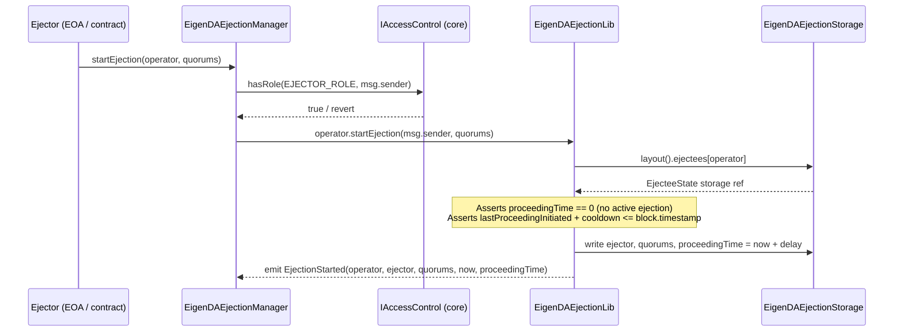
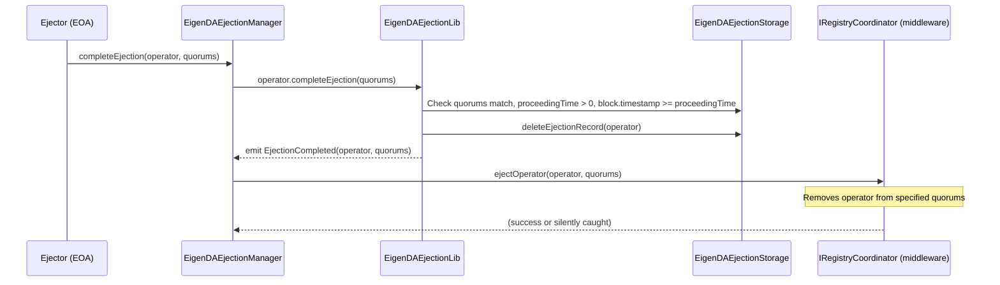
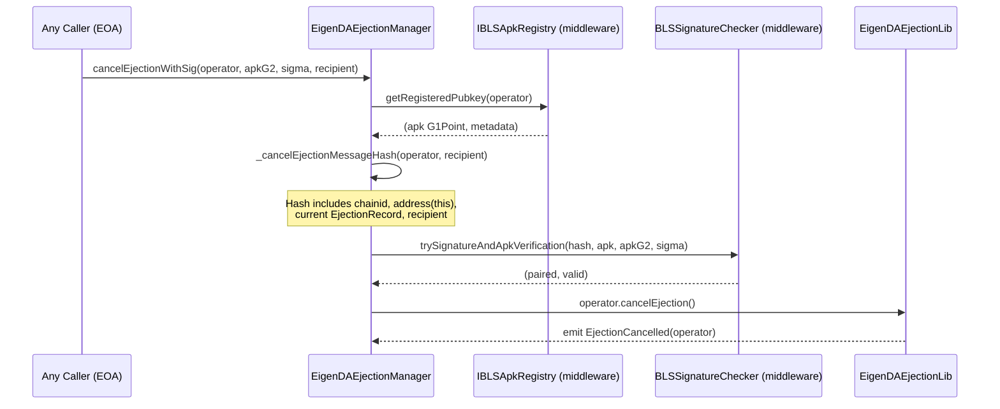
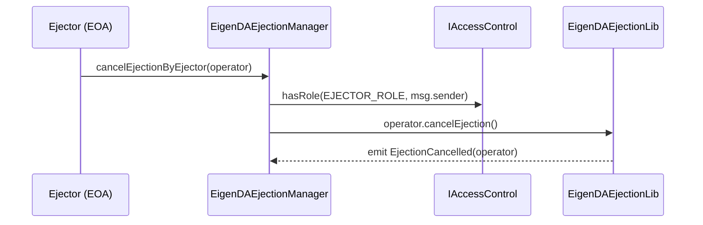

# periphery Analysis

**Analyzed by**: code-analyzer-periphery
**Timestamp**: 2026-04-10T00:00:00Z
**Application Type**: solidity-contract
**Classification**: contract
**Location**: contracts/src/periphery

## Architecture

The periphery component is a focused Solidity module providing operator ejection management for the EigenDA AVS system. It consists of a single deployable contract (`EigenDAEjectionManager`), one public interface (`IEigenDAEjectionManager`), one abstract storage base (`ImmutableEigenDAEjectionsStorage`), and two supporting libraries (`EigenDAEjectionLib`, `EigenDAEjectionStorage`, `EigenDAEjectionTypes`).

The design follows the Diamond-style namespaced storage pattern also used in the V3 core contracts. State is isolated in a deterministic storage slot derived via `keccak256` of a storage ID string minus one (EIP-7201-style), accessed through `EigenDAEjectionStorage.layout()`. This makes the contract upgrade-safe via a transparent proxy without relying on OpenZeppelin's `Initializable` mixin — instead using the custom `InitializableLib` from core to track initialization version.

Immutable constructor-injected dependencies (access control, BLS APK registry, signature checker, registry coordinator) are stored as `immutable` state variables in the abstract base `ImmutableEigenDAEjectionsStorage`. This pattern bakes callee addresses directly into the deployed implementation bytecode, eliminating storage reads for critical dependency lookups and hardening the contract against storage-slot collision attacks.

The ejection lifecycle is a three-phase optimistic challenge protocol: `startEjection` initiates with a delay window, `cancelEjection` (by operator or ejector) cancels during the delay, and `completeEjection` finalises after the delay. Cooldown enforcement prevents spam from a single ejector against the same operator. BLS signature verification via `BLSSignatureChecker` is used for operator self-cancellation without requiring an on-chain transaction by the ejector.

## Key Components

- **`EigenDAEjectionManager`** (`contracts/src/periphery/ejection/EigenDAEjectionManager.sol`): The single deployable contract that implements the full ejection lifecycle. Inherits from `ImmutableEigenDAEjectionsStorage` for immutable dependency storage and implements `IEigenDASemVer` to expose `semver() → (3, 0, 0)`. Exposes role-gated write functions (`onlyOwner`, `onlyEjector` modifiers backed by `IAccessControl.hasRole`) and a permissionless operator self-cancel function. Uses `using AddressDirectoryLib for string` and `using EigenDAEjectionLib for address` syntax to extend functionality on primitive types.

- **`IEigenDAEjectionManager`** (`contracts/src/periphery/ejection/IEigenDAEjectionManager.sol`): The public Solidity interface defining the full API surface of the ejection manager — six write functions and six view functions. Imported by `BN254` for G1/G2 type use in `cancelEjectionWithSig`. This is the integration point for any external contract or off-chain tooling interacting with the ejection system.

- **`ImmutableEigenDAEjectionsStorage`** (`contracts/src/periphery/ejection/libraries/EigenDAEjectionStorage.sol`): An abstract contract that holds four `immutable` callee dependency fields: `accessControl`, `blsApkKeyRegistry`, `signatureChecker`, `registryCoordinator`. Prevents runtime storage reads for these addresses. Implements `IEigenDAEjectionManager` so the `EigenDAEjectionManager` inheriting it satisfies the interface automatically.

- **`EigenDAEjectionStorage`** (`contracts/src/periphery/ejection/libraries/EigenDAEjectionStorage.sol`): A library that defines and provides access to the namespaced storage layout. The storage slot is computed as `keccak256(keccak256("eigen.da.ejection") - 1) & ~0xff`, following the EIP-7201 storage location convention. The `Layout` struct holds a `mapping(address => EjecteeState)` and protocol parameters `delay` and `cooldown` (both `uint64`).

- **`EigenDAEjectionLib`** (`contracts/src/periphery/ejection/libraries/EigenDAEjectionLib.sol`): The core logic library containing all state mutation and validation logic for the ejection lifecycle — `startEjection`, `cancelEjection`, `completeEjection`, `deleteEjectionRecord`, plus parameter setters and view helpers. Emits five events: `EjectionStarted`, `EjectionCancelled`, `EjectionCompleted`, `DelaySet`, `CooldownSet`. Enforces three invariants: no concurrent ejection per operator, cooldown between consecutive ejections per operator, and delay before completion is allowed.

- **`EigenDAEjectionTypes`** (`contracts/src/periphery/ejection/libraries/EigenDAEjectionTypes.sol`): Pure type definitions library with two structs: `EjectionRecord` (ejector address, `proceedingTime` uint64, `quorums` bytes) and `EjecteeState` (the record plus `lastProceedingInitiated` uint64). The separation of the record from `lastProceedingInitiated` is intentional — `deleteEjectionRecord` clears only the record so the cooldown timestamp survives across ejection cycles to prevent spam.

## Data Flows

### 1. Ejection Start Flow

**Flow Description**: An ejector role-holder initiates a time-locked ejection proceeding against a target operator.



**Detailed Steps**:

1. **Role check** (Ejector → EjectionManager → AccessControl)
   - `_onlyEjector(msg.sender)` calls `accessControl.hasRole(AccessControlConstants.EJECTOR_ROLE, sender)`
   - Reverts with `"EigenDAEjectionManager: Caller is not an ejector"` on failure

2. **Invariant checks** (EjectionLib)
   - `ejectee.record.proceedingTime == 0` — no concurrent ejection
   - `ejectee.lastProceedingInitiated + s().cooldown <= block.timestamp` — cooldown respected

3. **State write** (EjectionLib → Storage)
   - Records `ejector`, `quorums`, `proceedingTime = uint64(block.timestamp) + delay`
   - Sets `lastProceedingInitiated = uint64(block.timestamp)`

**Error Paths**:
- Caller lacks `EJECTOR_ROLE` → reverts `"EigenDAEjectionManager: Caller is not an ejector"`
- Active ejection already in progress → reverts `"Ejection already in progress"`
- Cooldown not elapsed → reverts `"Ejection cooldown not met"`

---

### 2. Ejection Completion Flow

**Flow Description**: After the delay window elapses, an ejector role-holder completes the ejection, triggering removal from EigenLayer's RegistryCoordinator.



**Detailed Steps**:

1. **Role check** — `onlyEjector(msg.sender)` enforced
2. **Quorum match** — `quorumsEqual(stored, provided)` via keccak256 comparison
3. **Delay check** — `block.timestamp >= ejectee.record.proceedingTime`
4. **Record deletion** — ejector address, quorums, and proceedingTime are zeroed; `lastProceedingInitiated` retained for cooldown tracking
5. **Operator ejection** — `registryCoordinator.ejectOperator(operator, quorums)` called inside `try/catch`; failure is silently swallowed so the ejection record state always clears

**Error Paths**:
- Quorums do not match → reverts `"Quorums do not match"`
- No proceeding in progress → reverts `"No proceeding in progress"`
- Delay not elapsed → reverts `"Proceeding not yet due"`

---

### 3. Operator Self-Cancellation with BLS Signature

**Flow Description**: An operator can cancel their own ejection by presenting a valid BLS signature, allowing cancellation without requiring the ejector to act.



**Key Security Detail**: The message hash binds `block.chainid`, `address(this)`, the current `EjectionRecord` (including specific quorums and proceedingTime), and `recipient`. This prevents replay of a valid signature across chains, contracts, or different ejection proceedings against the same operator.

**Error Paths**:
- BLS pairing fails → reverts `"EigenDAEjectionManager: Pairing failed"`
- Signature invalid → reverts `"EigenDAEjectionManager: Invalid signature"`
- No ejection in progress → reverts `"No ejection in progress"` (from EjectionLib)

---

### 4. Ejector-Initiated Cancellation

**Flow Description**: Any ejector can cancel an in-progress ejection for an operator.



Note: Any ejector can cancel any ejection, not just the one they initiated. This allows protocol-level remediation if the original ejector becomes unavailable.

## External Dependencies

- **OpenZeppelin Contracts** (4.7.0) [access-control]: Provides `IAccessControl` interface used to gate owner and ejector functions via `hasRole`. Imported via `@openzeppelin/contracts/access/IAccessControl.sol`. Remapped from `node_modules/@openzeppelin/`.
  Imported in: `EigenDAEjectionStorage.sol`, `EigenDAEjectionManager.sol`.

- **OpenZeppelin Contracts Upgradeable** (4.7.0) [upgrade-pattern]: Listed as a project dependency but not directly imported by periphery source. Used in test scaffolding (`TransparentUpgradeableProxy`) for proxy deployment of the ejection manager.
  Imported in: `MockEigenDADeployer.sol` (test).

- **eigenlayer-middleware** (forge lib, git submodule) [avs-middleware]: Provides `IBLSApkRegistry`, `IRegistryCoordinator`, `BLSSignatureChecker`, and `BN254` library. The periphery contracts call `getRegisteredPubkey`, `trySignatureAndApkVerification`, and `ejectOperator` on these contracts at runtime.
  Imported in: `EigenDAEjectionManager.sol`, `EigenDAEjectionStorage.sol`, `IEigenDAEjectionManager.sol`.

- **forge-std** (forge lib) [testing]: Foundry standard library for test infrastructure. Used in test and script files.
  Imported in: `EigenDAEjectionManager.t.sol` (via `MockEigenDADeployer`), `EjectionManagerDeployer.s.sol`.

## Internal Dependencies (Usage of core)

- **`AccessControlConstants`** (`src/core/libraries/v3/access-control/AccessControlConstants.sol`): Provides `OWNER_ROLE = keccak256("OWNER")` and `EJECTOR_ROLE = keccak256("EJECTOR")` constants. Both are used directly in `_onlyOwner` and `_onlyEjector` modifiers in `EigenDAEjectionManager.sol` to gate state-modifying calls.

- **`AddressDirectoryLib`** (`src/core/libraries/v3/address-directory/AddressDirectoryLib.sol`): Imported and declared as `using AddressDirectoryLib for string` in `EigenDAEjectionManager`. Not actively called in any method body visible in the source — the `using` declaration may be a pattern import for potential future use or was retained from a refactor.

- **`AddressDirectoryConstants`** (`src/core/libraries/v3/address-directory/AddressDirectoryConstants.sol`): Imported in `EigenDAEjectionManager` alongside `AddressDirectoryLib`. Similarly not directly invoked in visible function bodies.

- **`InitializableLib`** (`src/core/libraries/v3/initializable/InitializableLib.sol`): Used to implement custom proxy initialization without OpenZeppelin's `Initializable`. The constructor calls `InitializableLib.setInitializedVersion(1)` to prevent re-initialization of the implementation contract, and the `initialize` function uses the `initializer` modifier backed by `InitializableLib.initialize()`.

- **`IEigenDASemVer`** (`src/core/interfaces/IEigenDASemVer.sol`): Implemented by `EigenDAEjectionManager` to expose `semver() → (3, 0, 0)`, signalling this is a V3 contract.

## Security Constraints

1. **Role-Based Access Control**: All state-modifying owner functions (`setDelay`, `setCooldown`) check `OWNER_ROLE` via `IAccessControl`. All ejector functions (`startEjection`, `cancelEjectionByEjector`, `completeEjection`) check `EJECTOR_ROLE`. The `IAccessControl` contract address is injected at construction and stored immutably, making it impossible to replace post-deployment.

2. **No Re-entrancy Surface**: The contract holds no ETH and performs no ETH transfers. External calls are limited to: `accessControl.hasRole` (view), `blsApkKeyRegistry.getRegisteredPubkey` (view), `signatureChecker.trySignatureAndApkVerification` (view), and `registryCoordinator.ejectOperator` (state-mutating, called after all state changes are complete). The `ejectOperator` call is wrapped in `try/catch` so any re-entrant revert from it cannot block record clearing.

3. **Replay-Resistant BLS Signature**: The cancel-by-signature message hash (`CANCEL_EJECTION_MESSAGE_IDENTIFIER`) incorporates `block.chainid`, `address(this)`, the full `EjectionRecord` (including `proceedingTime` and `quorums`), and `recipient`. This prevents cross-chain, cross-contract, and cross-ejection-epoch replay of operator signatures.

4. **Cooldown Spam Protection**: The `lastProceedingInitiated` timestamp is preserved across ejection cancellations (only the `EjectionRecord` fields are zeroed, not `lastProceedingInitiated`). This prevents an ejector from immediately re-initiating ejection after a cancellation, protecting operators from harassment.

5. **Implementation Initialization Lock**: The constructor explicitly calls `InitializableLib.setInitializedVersion(1)` on the implementation contract. This prevents the implementation being initialized independently (the proxy's storage is separate), following the same security pattern as `_disableInitializers()` in OpenZeppelin's `Initializable`.

6. **Eject-Operator Failure Isolation**: `_tryEjectOperator` wraps the `registryCoordinator.ejectOperator` call in `try {} catch {}`. This means a bug or revert in the registry coordinator cannot leave the ejection record in a stuck state. The ejection record is always cleared from periphery storage before the external call, so the EigenDA-level state is consistent even if the middleware ejection fails.

7. **Namespaced Storage Collision Prevention**: The storage slot uses the EIP-7201 pattern: `keccak256(keccak256("eigen.da.ejection") - 1) & ~0xff`. The `& ~0xff` mask ensures the slot cannot overlap with struct sub-slots. This protects against storage layout conflicts if the contract is used behind a proxy alongside other contracts.

## API Surface

### Write Functions (State-Mutating)

| Function | Access | Description |
|---|---|---|
| `initialize(uint64 delay_, uint64 cooldown_)` | Once (proxy init) | Sets initial delay and cooldown parameters |
| `setDelay(uint64 delay)` | `OWNER_ROLE` | Updates the ejection delay window |
| `setCooldown(uint64 cooldown)` | `OWNER_ROLE` | Updates the inter-ejection cooldown |
| `startEjection(address operator, bytes quorums)` | `EJECTOR_ROLE` | Begins a time-locked ejection proceeding |
| `cancelEjectionByEjector(address operator)` | `EJECTOR_ROLE` | Cancels an in-progress ejection |
| `completeEjection(address operator, bytes quorums)` | `EJECTOR_ROLE` | Finalises ejection after delay and calls `ejectOperator` |
| `cancelEjectionWithSig(address, BN254.G2Point, BN254.G1Point, address)` | Any (sig verified) | Operator self-cancels via BLS signature |
| `cancelEjection()` | Any (`msg.sender` is operator) | Operator self-cancels directly |

### View Functions

| Function | Returns | Description |
|---|---|---|
| `getEjector(address operator)` | `address` | Returns ejector address (zero = no active ejection) |
| `ejectionTime(address operator)` | `uint64` | Returns `proceedingTime` for active ejection |
| `lastEjectionInitiated(address operator)` | `uint64` | Returns timestamp of last started ejection |
| `ejectionQuorums(address operator)` | `bytes` | Returns quorums for active ejection |
| `ejectionDelay()` | `uint64` | Returns current delay parameter |
| `ejectionCooldown()` | `uint64` | Returns current cooldown parameter |
| `semver()` | `(uint8, uint8, uint8)` | Returns `(3, 0, 0)` |

### Events (from EigenDAEjectionLib)

| Event | Arguments | Trigger |
|---|---|---|
| `EjectionStarted` | `operator, ejector, quorums, timestampStarted, ejectionTime` | `startEjection` |
| `EjectionCancelled` | `operator` | Any cancellation path |
| `EjectionCompleted` | `operator, quorums` | `completeEjection` |
| `DelaySet` | `delay` | `setDelay` |
| `CooldownSet` | `cooldown` | `setCooldown` |

## Code Examples

### Example 1: Namespaced Storage Slot Derivation

```solidity
// contracts/src/periphery/ejection/libraries/EigenDAEjectionStorage.sol
library EigenDAEjectionStorage {
    string internal constant STORAGE_ID = "eigen.da.ejection";
    bytes32 internal constant STORAGE_POSITION =
        keccak256(abi.encode(uint256(keccak256(abi.encodePacked(STORAGE_ID))) - 1)) & ~bytes32(uint256(0xff));

    struct Layout {
        mapping(address => EigenDAEjectionTypes.EjecteeState) ejectees;
        uint64 delay;
        uint64 cooldown;
    }

    function layout() internal pure returns (Layout storage s) {
        bytes32 position = STORAGE_POSITION;
        assembly {
            s.slot := position
        }
    }
}
```

### Example 2: Immutable Dependency Injection

```solidity
// contracts/src/periphery/ejection/libraries/EigenDAEjectionStorage.sol
abstract contract ImmutableEigenDAEjectionsStorage is IEigenDAEjectionManager {
    IAccessControl public immutable accessControl;
    IBLSApkRegistry public immutable blsApkKeyRegistry;
    BLSSignatureChecker public immutable signatureChecker;
    IRegistryCoordinator public immutable registryCoordinator;

    constructor(
        IAccessControl accessControl_,
        IBLSApkRegistry blsApkKeyRegistry_,
        BLSSignatureChecker signatureChecker_,
        IRegistryCoordinator registryCoordinator_
    ) {
        accessControl = accessControl_;
        blsApkKeyRegistry = blsApkKeyRegistry_;
        signatureChecker = signatureChecker_;
        registryCoordinator = registryCoordinator_;
    }
}
```

### Example 3: Replay-Resistant Cancel-by-Signature Hash

```solidity
// contracts/src/periphery/ejection/EigenDAEjectionManager.sol
bytes32 internal constant CANCEL_EJECTION_MESSAGE_IDENTIFIER = keccak256(
    "CancelEjection(address operator,uint64 proceedingTime,uint64 lastProceedingInitiated,bytes quorums,address recipient)"
);

function _cancelEjectionMessageHash(address operator, address recipient) internal view returns (bytes32) {
    return keccak256(
        abi.encode(
            CANCEL_EJECTION_MESSAGE_IDENTIFIER,
            block.chainid,
            address(this),
            EigenDAEjectionLib.getEjectionRecord(operator),
            recipient
        )
    );
}
```

### Example 4: Cooldown-Preserving Record Deletion

```solidity
// contracts/src/periphery/ejection/libraries/EigenDAEjectionLib.sol
function deleteEjectionRecord(address operator) internal {
    EigenDAEjectionTypes.EjecteeState storage ejectee = s().ejectees[operator];
    ejectee.record.ejector = address(0);
    ejectee.record.quorums = hex"";
    ejectee.record.proceedingTime = 0;
    // NOTE: lastProceedingInitiated is intentionally NOT cleared
    // so cooldown enforcement persists across ejection cancellations
}
```

### Example 5: Fault-Isolated Operator Ejection

```solidity
// contracts/src/periphery/ejection/EigenDAEjectionManager.sol
function _tryEjectOperator(address operator, bytes memory quorums) internal {
    try registryCoordinator.ejectOperator(operator, quorums) {} catch {}
}
```

## Files Analyzed

- `contracts/src/periphery/ejection/EigenDAEjectionManager.sol` (202 lines) - Main deployable contract implementing the ejection lifecycle
- `contracts/src/periphery/ejection/IEigenDAEjectionManager.sol` (61 lines) - Public interface definition
- `contracts/src/periphery/ejection/libraries/EigenDAEjectionLib.sol` (113 lines) - Core ejection logic library
- `contracts/src/periphery/ejection/libraries/EigenDAEjectionStorage.sol` (51 lines) - Namespaced storage layout and immutable abstract base
- `contracts/src/periphery/ejection/libraries/EigenDAEjectionTypes.sol` (26 lines) - Struct type definitions
- `contracts/src/core/libraries/v3/access-control/AccessControlConstants.sol` (19 lines) - Role constant definitions
- `contracts/src/core/libraries/v3/initializable/InitializableLib.sol` (35 lines) - Custom initialization guard
- `contracts/src/core/libraries/v3/address-directory/AddressDirectoryLib.sol` (53 lines) - Address directory library (imported but passively used)
- `contracts/src/core/interfaces/IEigenDASemVer.sol` (7 lines) - Semantic version interface
- `contracts/test/unit/EigenDAEjectionManager.t.sol` (164 lines) - Unit tests covering all ejection lifecycle paths
- `contracts/test/MockEigenDADeployer.sol` (316 lines) - Test deployer showing proxy deployment pattern
- `contracts/script/EjectionManagerDeployer.s.sol` (134 lines) - Mainnet deployment script (legacy eigenlayer-middleware variant)
- `contracts/package.json` (31 lines) - NPM manifest with OpenZeppelin dependency versions
- `contracts/foundry.toml` (170 lines) - Foundry configuration, solc 0.8.29, optimizer 200 runs

## Analysis Data

```json
{
  "summary": "The periphery component implements a time-locked, challenge-cancellable operator ejection management system for EigenDA. It consists of one upgradeable contract (EigenDAEjectionManager, V3 semver), one interface, one abstract immutable-dependency base, and two logic/storage libraries. The ejection lifecycle is a three-phase optimistic process — start, challenge window (cancellable by ejector or operator via BLS signature), complete — with cooldown enforcement between initiations. Immutable constructor-injected dependencies bind the contract to specific EigenLayer middleware contracts (BLSApkRegistry, RegistryCoordinator, BLSSignatureChecker). Core dependency usage is limited to access control role constants, a custom initializer guard, and the IEigenDASemVer versioning interface.",
  "architecture_pattern": "utility-contracts",
  "key_modules": [
    "EigenDAEjectionManager",
    "IEigenDAEjectionManager",
    "ImmutableEigenDAEjectionsStorage",
    "EigenDAEjectionLib",
    "EigenDAEjectionStorage",
    "EigenDAEjectionTypes"
  ],
  "api_endpoints": [
    "startEjection(address,bytes)",
    "cancelEjectionByEjector(address)",
    "completeEjection(address,bytes)",
    "cancelEjectionWithSig(address,BN254.G2Point,BN254.G1Point,address)",
    "cancelEjection()",
    "setDelay(uint64)",
    "setCooldown(uint64)",
    "initialize(uint64,uint64)",
    "getEjector(address)",
    "ejectionTime(address)",
    "lastEjectionInitiated(address)",
    "ejectionQuorums(address)",
    "ejectionDelay()",
    "ejectionCooldown()",
    "semver()"
  ],
  "data_flows": [
    "Ejection start: ejector calls startEjection → role check via AccessControl → EjectionLib validates cooldown and no active ejection → writes EjectionRecord to namespaced storage",
    "Ejection completion: ejector calls completeEjection after delay → quorum match check → record cleared → registryCoordinator.ejectOperator called in try/catch",
    "Operator self-cancel with BLS: any caller provides operator BLS signature → APK fetched from IBLSApkRegistry → hash constructed with chainid+address+record+recipient → signature verified via BLSSignatureChecker → ejection record cleared",
    "Ejector cancel: ejector calls cancelEjectionByEjector → role check → EjectionLib.cancelEjection clears record but preserves lastProceedingInitiated"
  ],
  "tech_stack": [
    "solidity ^0.8.9",
    "foundry",
    "openzeppelin-contracts 4.7.0",
    "eigenlayer-middleware (forge lib)",
    "BN254 elliptic curve",
    "EIP-7201 namespaced storage"
  ],
  "external_integrations": [
    "ethereum",
    "eigenlayer-middleware (BLSApkRegistry, RegistryCoordinator, BLSSignatureChecker)"
  ],
  "component_interactions": [
    {
      "target": "core-contracts",
      "type": "integrates_with",
      "protocol": "solidity-import",
      "description": "Uses AccessControlConstants.OWNER_ROLE and EJECTOR_ROLE for role-based access control checks via IAccessControl.hasRole. Uses InitializableLib for proxy initialization guard. Uses IEigenDASemVer interface to expose versioning. Imports AddressDirectoryLib and AddressDirectoryConstants (currently passive)."
    },
    {
      "target": "eigenlayer-middleware",
      "type": "calls_at_runtime",
      "protocol": "solidity-interface",
      "description": "Calls IBLSApkRegistry.getRegisteredPubkey for BLS public key retrieval during signature-based cancellation. Calls BLSSignatureChecker.trySignatureAndApkVerification for BN254 pairing-based signature verification. Calls IRegistryCoordinator.ejectOperator to remove an operator from quorums upon ejection completion."
    },
    {
      "target": "openzeppelin-access-control",
      "type": "integrates_with",
      "protocol": "solidity-interface",
      "description": "IAccessControl (OpenZeppelin 4.7.0) is injected as an immutable dependency. Its hasRole function gates all owner and ejector write operations."
    }
  ]
}
```

## Citations

```json
[
  {
    "file_path": "contracts/src/periphery/ejection/EigenDAEjectionManager.sol",
    "start_line": 23,
    "end_line": 23,
    "claim": "EigenDAEjectionManager inherits ImmutableEigenDAEjectionsStorage (for immutable deps) and implements IEigenDASemVer (for versioning)",
    "section": "Architecture",
    "snippet": "contract EigenDAEjectionManager is ImmutableEigenDAEjectionsStorage, IEigenDASemVer {"
  },
  {
    "file_path": "contracts/src/periphery/ejection/EigenDAEjectionManager.sol",
    "start_line": 42,
    "end_line": 53,
    "claim": "Constructor injects four callee dependencies as immutables and locks the implementation from re-initialization via InitializableLib.setInitializedVersion(1)",
    "section": "Architecture",
    "snippet": "constructor(\n    IAccessControl accessControl_,\n    IBLSApkRegistry blsApkKeyRegistry_,\n    BLSSignatureChecker serviceManager_,\n    IRegistryCoordinator registryCoordinator_\n) ImmutableEigenDAEjectionsStorage(...) {\n    InitializableLib.setInitializedVersion(1);\n}"
  },
  {
    "file_path": "contracts/src/periphery/ejection/EigenDAEjectionManager.sol",
    "start_line": 31,
    "end_line": 34,
    "claim": "Custom initializer modifier uses InitializableLib.initialize() rather than OpenZeppelin's Initializable to avoid storage representation conflicts",
    "section": "Architecture",
    "snippet": "modifier initializer() {\n    InitializableLib.initialize();\n    _;\n}"
  },
  {
    "file_path": "contracts/src/periphery/ejection/libraries/EigenDAEjectionStorage.sol",
    "start_line": 32,
    "end_line": 34,
    "claim": "Storage slot uses EIP-7201 namespaced pattern: keccak256(keccak256(id) - 1) & ~0xff to avoid collisions",
    "section": "Architecture",
    "snippet": "bytes32 internal constant STORAGE_POSITION =\n    keccak256(abi.encode(uint256(keccak256(abi.encodePacked(STORAGE_ID))) - 1)) & ~bytes32(uint256(0xff));"
  },
  {
    "file_path": "contracts/src/periphery/ejection/libraries/EigenDAEjectionStorage.sol",
    "start_line": 11,
    "end_line": 17,
    "claim": "ImmutableEigenDAEjectionsStorage declares four immutable dependency fields for access control, BLS APK registry, signature checker, and registry coordinator",
    "section": "Key Components",
    "snippet": "abstract contract ImmutableEigenDAEjectionsStorage is IEigenDAEjectionManager {\n    IAccessControl public immutable accessControl;\n    IBLSApkRegistry public immutable blsApkKeyRegistry;\n    BLSSignatureChecker public immutable signatureChecker;\n    IRegistryCoordinator public immutable registryCoordinator;"
  },
  {
    "file_path": "contracts/src/periphery/ejection/libraries/EigenDAEjectionStorage.sol",
    "start_line": 36,
    "end_line": 43,
    "claim": "EigenDAEjectionStorage.Layout holds a per-operator ejectees mapping and uint64 protocol parameters for delay and cooldown",
    "section": "Key Components",
    "snippet": "struct Layout {\n    mapping(address => EigenDAEjectionTypes.EjecteeState) ejectees;\n    uint64 delay;\n    uint64 cooldown;\n}"
  },
  {
    "file_path": "contracts/src/periphery/ejection/libraries/EigenDAEjectionTypes.sol",
    "start_line": 9,
    "end_line": 25,
    "claim": "EjecteeState separates EjectionRecord (clearable) from lastProceedingInitiated (retained after cancellation) to enforce cooldowns across ejection cycles",
    "section": "Key Components",
    "snippet": "struct EjectionRecord {\n    address ejector;\n    uint64 proceedingTime;\n    bytes quorums;\n}\nstruct EjecteeState {\n    EjectionRecord record;\n    uint64 lastProceedingInitiated;\n}"
  },
  {
    "file_path": "contracts/src/periphery/ejection/libraries/EigenDAEjectionLib.sol",
    "start_line": 33,
    "end_line": 43,
    "claim": "startEjection enforces no-concurrent-ejection and cooldown invariants, then writes ejector, quorums, and proceedingTime = now + delay",
    "section": "Data Flows",
    "snippet": "require(ejectee.record.proceedingTime == 0, \"Ejection already in progress\");\nrequire(ejectee.lastProceedingInitiated + s().cooldown <= block.timestamp, \"Ejection cooldown not met\");\nejectee.record.ejector = ejector;\nejectee.record.quorums = quorums;\nejectee.record.proceedingTime = uint64(block.timestamp) + s().delay;"
  },
  {
    "file_path": "contracts/src/periphery/ejection/libraries/EigenDAEjectionLib.sol",
    "start_line": 56,
    "end_line": 65,
    "claim": "completeEjection enforces quorum match, checks proceedingTime is in the past, clears the record, and emits EjectionCompleted",
    "section": "Data Flows",
    "snippet": "require(quorumsEqual(s().ejectees[operator].record.quorums, quorums), \"Quorums do not match\");\nrequire(ejectee.record.proceedingTime > 0, \"No proceeding in progress\");\nrequire(block.timestamp >= ejectee.record.proceedingTime, \"Proceeding not yet due\");\ndeleteEjectionRecord(operator);\nemit EjectionCompleted(operator, quorums);"
  },
  {
    "file_path": "contracts/src/periphery/ejection/libraries/EigenDAEjectionLib.sol",
    "start_line": 69,
    "end_line": 74,
    "claim": "deleteEjectionRecord intentionally preserves lastProceedingInitiated so cooldown is enforced across ejection cancellations",
    "section": "Data Flows",
    "snippet": "ejectee.record.ejector = address(0);\nejectee.record.quorums = hex\"\";\nejectee.record.proceedingTime = 0;\n// lastProceedingInitiated NOT cleared"
  },
  {
    "file_path": "contracts/src/periphery/ejection/EigenDAEjectionManager.sol",
    "start_line": 160,
    "end_line": 163,
    "claim": "_tryEjectOperator wraps registryCoordinator.ejectOperator in try/catch to prevent a middleware revert from blocking ejection record clearance",
    "section": "Data Flows",
    "snippet": "function _tryEjectOperator(address operator, bytes memory quorums) internal {\n    try registryCoordinator.ejectOperator(operator, quorums) {} catch {}\n}"
  },
  {
    "file_path": "contracts/src/periphery/ejection/EigenDAEjectionManager.sol",
    "start_line": 104,
    "end_line": 113,
    "claim": "cancelEjectionWithSig fetches operator APK from BLSApkRegistry then verifies BLS signature before cancelling ejection",
    "section": "Data Flows",
    "snippet": "function cancelEjectionWithSig(\n    address operator,\n    BN254.G2Point memory apkG2,\n    BN254.G1Point memory sigma,\n    address recipient\n) external {\n    (BN254.G1Point memory apk,) = blsApkKeyRegistry.getRegisteredPubkey(operator);\n    _verifySig(_cancelEjectionMessageHash(operator, recipient), apk, apkG2, sigma);\n    operator.cancelEjection();\n}"
  },
  {
    "file_path": "contracts/src/periphery/ejection/EigenDAEjectionManager.sol",
    "start_line": 27,
    "end_line": 29,
    "claim": "CancelEjection message identifier encodes all fields needed to bind the signature to a specific operator, ejection record, and recipient",
    "section": "Security Constraints",
    "snippet": "bytes32 internal constant CANCEL_EJECTION_MESSAGE_IDENTIFIER = keccak256(\n    \"CancelEjection(address operator,uint64 proceedingTime,uint64 lastProceedingInitiated,bytes quorums,address recipient)\"\n);"
  },
  {
    "file_path": "contracts/src/periphery/ejection/EigenDAEjectionManager.sol",
    "start_line": 166,
    "end_line": 176,
    "claim": "Message hash binds chainid, contract address, full EjectionRecord, and recipient to prevent cross-chain, cross-contract, and cross-epoch replay",
    "section": "Security Constraints",
    "snippet": "return keccak256(\n    abi.encode(\n        CANCEL_EJECTION_MESSAGE_IDENTIFIER,\n        block.chainid,\n        address(this),\n        EigenDAEjectionLib.getEjectionRecord(operator),\n        recipient\n    )\n);"
  },
  {
    "file_path": "contracts/src/periphery/ejection/EigenDAEjectionManager.sol",
    "start_line": 189,
    "end_line": 194,
    "claim": "_onlyOwner checks OWNER_ROLE via IAccessControl.hasRole; _onlyEjector checks EJECTOR_ROLE similarly",
    "section": "Security Constraints",
    "snippet": "require(\n    accessControl.hasRole(AccessControlConstants.OWNER_ROLE, sender),\n    \"EigenDAEjectionManager: Caller is not the owner\"\n);"
  },
  {
    "file_path": "contracts/src/core/libraries/v3/access-control/AccessControlConstants.sol",
    "start_line": 7,
    "end_line": 18,
    "claim": "OWNER_ROLE and EJECTOR_ROLE constants from core are used directly in periphery access control checks",
    "section": "Internal Dependencies (Usage of core)",
    "snippet": "bytes32 internal constant OWNER_ROLE = keccak256(\"OWNER\");\nbytes32 internal constant EJECTOR_ROLE = keccak256(\"EJECTOR\");"
  },
  {
    "file_path": "contracts/src/core/libraries/v3/initializable/InitializableLib.sol",
    "start_line": 15,
    "end_line": 17,
    "claim": "InitializableLib.initialize() used in periphery's initializer modifier to set version to 1 and emit Initialized event",
    "section": "Internal Dependencies (Usage of core)",
    "snippet": "function initialize() internal {\n    setInitializedVersion(1);\n}"
  },
  {
    "file_path": "contracts/src/core/interfaces/IEigenDASemVer.sol",
    "start_line": 4,
    "end_line": 7,
    "claim": "IEigenDASemVer defines the semver() function implemented by EigenDAEjectionManager to return (3, 0, 0)",
    "section": "Internal Dependencies (Usage of core)",
    "snippet": "interface IEigenDASemVer {\n    function semver() external view returns (uint8 major, uint8 minor, uint8 patch);\n}"
  },
  {
    "file_path": "contracts/src/periphery/ejection/EigenDAEjectionManager.sol",
    "start_line": 154,
    "end_line": 156,
    "claim": "EigenDAEjectionManager implements IEigenDASemVer and reports version (3, 0, 0), placing it in the V3 contract family",
    "section": "Key Components",
    "snippet": "function semver() external pure returns (uint8 major, uint8 minor, uint8 patch) {\n    return (3, 0, 0);\n}"
  },
  {
    "file_path": "contracts/src/periphery/ejection/EigenDAEjectionManager.sol",
    "start_line": 96,
    "end_line": 99,
    "claim": "completeEjection calls EjectionLib.completeEjection first (state cleared) then _tryEjectOperator (external call), preserving checks-effects-interactions order",
    "section": "Security Constraints",
    "snippet": "function completeEjection(address operator, bytes memory quorums) external onlyEjector(msg.sender) {\n    operator.completeEjection(quorums);\n    _tryEjectOperator(operator, quorums);\n}"
  },
  {
    "file_path": "contracts/src/periphery/ejection/EigenDAEjectionManager.sol",
    "start_line": 178,
    "end_line": 187,
    "claim": "BLS signature verification via BLSSignatureChecker.trySignatureAndApkVerification checks both pairing and signature validity",
    "section": "Security Constraints",
    "snippet": "function _verifySig(\n    bytes32 messageHash,\n    BN254.G1Point memory apk,\n    BN254.G2Point memory apkG2,\n    BN254.G1Point memory sigma\n) internal view {\n    (bool paired, bool valid) = signatureChecker.trySignatureAndApkVerification(messageHash, apk, apkG2, sigma);\n    require(paired, \"EigenDAEjectionManager: Pairing failed\");\n    require(valid, \"EigenDAEjectionManager: Invalid signature\");\n}"
  },
  {
    "file_path": "contracts/test/MockEigenDADeployer.sol",
    "start_line": 191,
    "end_line": 208,
    "claim": "EigenDAEjectionManager is deployed behind a TransparentUpgradeableProxy with initial delay=0 and cooldown=0 in tests",
    "section": "Architecture",
    "snippet": "eigenDAEjectionManagerImplementation = new EigenDAEjectionManager(\n    IAccessControl(address(eigenDAAccessControl)), blsApkRegistry, eigenDAServiceManager, registryCoordinator\n);\neigenDAEjectionManager = EigenDAEjectionManager(\n    address(\n        new TransparentUpgradeableProxy(\n            address(eigenDAEjectionManagerImplementation),\n            address(proxyAdmin),\n            abi.encodeWithSelector(EigenDAEjectionManager.initialize.selector, 0, 0)\n        )\n    )\n);"
  },
  {
    "file_path": "contracts/package.json",
    "start_line": 26,
    "end_line": 29,
    "claim": "OpenZeppelin contracts version 4.7.0 (both base and upgradeable) are the pinned NPM dependencies for this contracts package",
    "section": "External Dependencies",
    "snippet": "\"dependencies\": {\n  \"@openzeppelin/contracts\": \"4.7.0\",\n  \"@openzeppelin/contracts-upgradeable\": \"4.7.0\"\n}"
  },
  {
    "file_path": "contracts/foundry.toml",
    "start_line": 22,
    "end_line": 23,
    "claim": "Solidity compiler version is 0.8.29 with optimizer enabled at 200 runs",
    "section": "External Dependencies",
    "snippet": "solc_version = '0.8.29'\ndeniy_warnings = true"
  },
  {
    "file_path": "contracts/src/periphery/ejection/libraries/EigenDAEjectionLib.sol",
    "start_line": 8,
    "end_line": 18,
    "claim": "EigenDAEjectionLib defines five events covering the full ejection lifecycle: start, cancel, complete, and parameter changes",
    "section": "API Surface",
    "snippet": "event EjectionStarted(address indexed operator, address indexed ejector, bytes quorums, uint64 timestampStarted, uint64 ejectionTime);\nevent EjectionCancelled(address operator);\nevent EjectionCompleted(address operator, bytes quorums);\nevent DelaySet(uint64 delay);\nevent CooldownSet(uint64 cooldown);"
  },
  {
    "file_path": "contracts/src/periphery/ejection/IEigenDAEjectionManager.sol",
    "start_line": 6,
    "end_line": 61,
    "claim": "IEigenDAEjectionManager exposes 6 write functions and 6 view functions as the full public API surface of the ejection system",
    "section": "API Surface",
    "snippet": "interface IEigenDAEjectionManager { ... }"
  }
]
```

## Analysis Notes

### Security Considerations

1. **Try/Catch Isolation of External Ejection Call**: The `_tryEjectOperator` wraps `registryCoordinator.ejectOperator` in a bare `try/catch`, silently absorbing all failures. While this prevents liveness issues from middleware bugs, it means a failed registry ejection is invisible to on-chain observers. Consider emitting an event on catch to enable off-chain monitoring of silent ejection failures.

2. **Any Ejector Can Cancel Any Ejection**: The `cancelEjectionByEjector` function requires only `EJECTOR_ROLE` — not that the caller is the same ejector who initiated the proceeding. While this provides operational flexibility, it creates a potential griefing vector where a competing ejector cancels a legitimate ejection. The deposit-return comment in the interface suggests a deposit mechanism was planned but is not implemented in the current code.

3. **BLS Signature Replay Resistance is Tight but Depends on Record State**: The message hash binds the full `EjectionRecord` including `proceedingTime`. If an operator's ejection is cancelled and re-started with the same delay, a previously captured signature would be invalid (different proceedingTime). This is correct but subtle — operators should be aware their signatures are epoch-specific.

4. **No Access Control on `cancelEjection()`**: Operators self-cancel by calling `cancelEjection()` as `msg.sender`. There is no validation that the caller is actually the named `operator` in the storage — the library call is `msg.sender.cancelEjection()`. This is intentional and correct, but means any address (not just the registered operator EOA) that calls `cancelEjection()` will cancel its own ejection record. Since ejection records are keyed by operator address, this is only exploitable if a non-operator address has an ejection record initiated against it, which would require an ejector to have started one.

### Performance Characteristics

- **Gas Efficiency via Immutables**: All four dependency addresses are stored as `immutable` variables, avoiding `SLOAD` opcodes on every access. This is a meaningful optimisation for the frequently-called `onlyOwner` and `onlyEjector` modifiers.
- **Namespaced Storage**: Single `SLOAD` for layout access via inline assembly (`s.slot := position`) is efficient.
- **BLS Signature Verification**: `trySignatureAndApkVerification` involves elliptic curve pairing operations which are computationally expensive (~100k+ gas). This cost is appropriate for the security value provided and only occurs on the optional `cancelEjectionWithSig` path.

### Scalability Notes

- **Per-Operator Storage**: Each operator has its own `EjecteeState` storage slot. There is no global list of active ejections, which means there is no gas scaling issue with the number of concurrent ejections.
- **Single Contract Scope**: The periphery is a single contract with no cross-shard or multi-contract ejection coordination. It is limited to the quorum and operator set managed by its bound `IRegistryCoordinator` instance.
- **Cooldown as Anti-Spam**: The cooldown parameter (`uint64`, set by owner) is the primary scalability guard against ejection-driven state churn. Setting it appropriately is a governance concern outside the contract itself.
