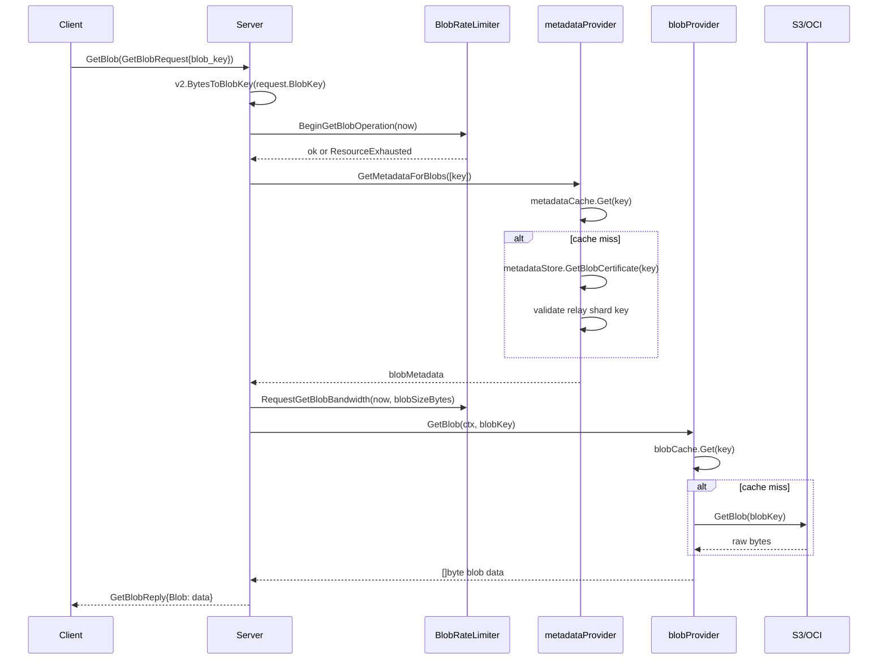
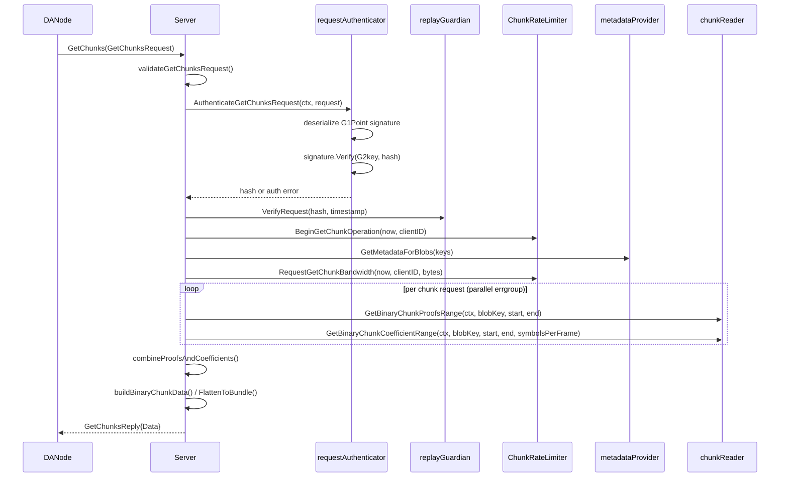
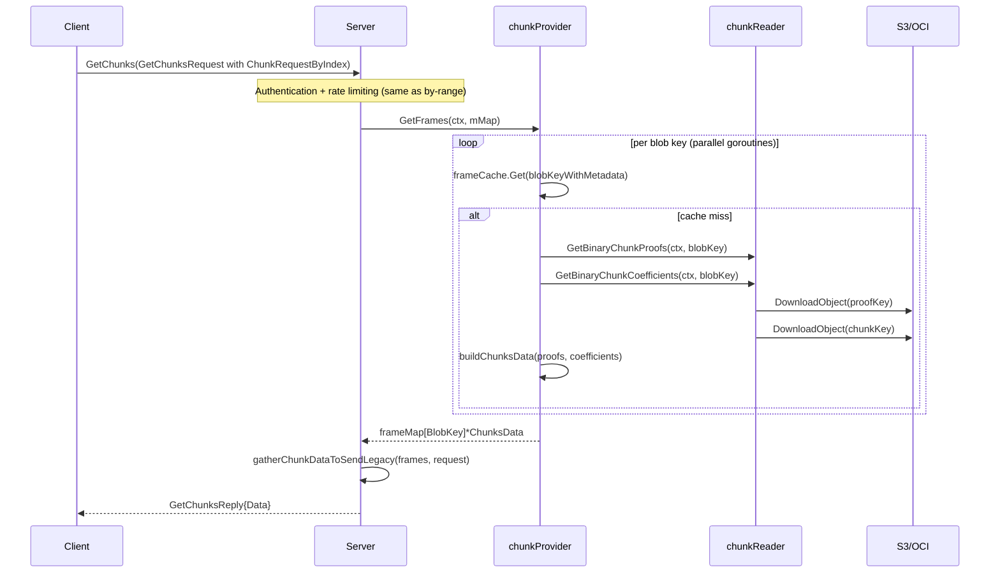

# relay Analysis

**Analyzed by**: code-analyzer-relay
**Timestamp**: 2026-04-10T00:00:00Z
**Application Type**: go-module
**Classification**: library
**Location**: relay/

---

## Architecture

The relay package implements a gRPC server that acts as a caching, rate-limiting intermediary between EigenDA's persistent storage layer (DynamoDB metadata + S3/OCI object storage) and DA nodes that need to download encoded blob data for dispersal. The library is structured as a **layered, provider-based architecture** with three vertically independent provider layers — metadata, blob, and chunk — each sitting atop a shared FIFO-cache abstraction that prevents duplicate concurrent I/O for the same key. The gRPC `Server` struct at the top of the stack composes these providers and applies request authentication and two-tier rate limiting before forwarding work to the providers.

The execution model is **synchronous gRPC handlers backed by goroutine fan-out**. Within a single `GetChunks` or `GetBlob` call the server spawns parallel goroutines for each blob key, collects results over channels (or `errgroup`), and returns an aggregated reply. The FIFO cache layer underneath serialises concurrent cache-miss fetches to the same key — a second goroutine requesting the same uncached key will wait on a weighted semaphore until the first goroutine finishes the actual S3/DynamoDB fetch, preventing thundering-herd effects.

Authentication uses BLS signatures over the `GetChunksRequest` protobuf hash. Operator public keys are looked up from an `IndexedChainState` interface (backed by The Graph) and cached in an LRU structure. A `ReplayGuardian` enforces timestamp windows to prevent request replay. On-chain blob version parameters are refreshed in a background goroutine on a configurable interval.

The `chunkstore` sub-package exposes `ChunkReader` and `ChunkWriter` interfaces, with implementations backed by `common/s3`. These provide range-aware partial-object downloads for the efficient "by-range" chunk query pattern as well as full-object downloads for the legacy "by-index" pattern. The `limiter` sub-package implements two-level (global + per-client) token-bucket rate limiting for both operations-per-second and bandwidth (bytes-per-second).

---

## Key Components

- **`Server`** (`relay/server.go`): Top-level gRPC server implementing `pb.RelayServer`. Composes all providers and enforces the full request pipeline: parameter validation → authentication → replay guard → rate limiting → metadata fetch → data fetch → reply serialisation. Exposes `Start()`, `Stop()`, and `RefreshOnchainState()` lifecycle methods.

- **`metadataProvider`** (`relay/metadata_provider.go`): Fetches blob metadata (`blobSizeBytes`, `chunkSizeBytes`, `symbolsPerFrame`) from the DynamoDB-backed `blobstore.MetadataStore`, with an atomic FIFO LRU cache. Checks that requested blobs belong to the relay's assigned shard keys. Supports atomic hot-reloading of `BlobVersionParameterMap` via `atomic.Pointer`.

- **`blobProvider`** (`relay/blob_provider.go`): Fetches raw blob bytes from the S3/OCI-backed `blobstore.BlobStore`, wrapping it with a byte-weighted FIFO cache and concurrency limits. Cache weight function is `len([]byte)` so cache fills by actual blob bytes.

- **`chunkProvider`** (`relay/chunk_provider.go`): Fetches and assembles encoding frames for the legacy "by-index" pattern. Fetches chunk proofs and coefficients concurrently from `ChunkReader` via parallel goroutines and merges them into `core.ChunksData` structs. Cache weight is computed via `frames.Size()`.

- **`CacheAccessor[K,V]`** (`relay/cache/cache_accessor.go`): Generic thread-safe cache wrapper that deduplicates in-flight requests. Uses a `map[K]*accessResult` of weighted semaphores to coalesce concurrent cache misses onto a single fetch goroutine. Supports configurable concurrency limiting via a channel-based semaphore.

- **`ChunkReader` / `ChunkWriter`** (`relay/chunkstore/chunk_reader.go`, `relay/chunkstore/chunk_writer.go`): Interfaces for persisting and retrieving serialised KZG proofs and RS coefficient frames in S3. The reader supports both full-object and range-query (`DownloadPartialObject`) downloads, computing byte offsets from fixed proof lengths and `symbolsPerFrame`.

- **`BlobRateLimiter`** (`relay/limiter/blob_rate_limiter.go`): Global rate limiter for `GetBlob` operations. Enforces ops/sec (token bucket), bandwidth bytes/sec, and max-concurrent-ops limits. Implemented with `golang.org/x/time/rate.Limiter`.

- **`ChunkRateLimiter`** (`relay/limiter/chunk_rate_limiter.go`): Two-level rate limiter for `GetChunks`: global limits (ops/sec, bandwidth, concurrency) and per-client limits keyed by operator ID string. Per-client limiters are lazily initialised on first request.

- **`requestAuthenticator`** (`relay/auth/authenticator.go`): Verifies BLS signatures on `GetChunksRequest` by fetching operator G2 public keys from `IndexedChainState`. Caches keys in an `lru.Cache[core.OperatorID, *core.G2Point]`. Preloads the cache at startup by calling `GetIndexedOperators`.

- **`RelayMetrics`** (`relay/metrics/metrics.go`): Prometheus metrics registry wrapper. Registers per-operation latency summaries (`SummaryVec`) and counters for GetBlob / GetChunks — including authentication, metadata, and data latency phases, rate-limiting events, and bandwidth usage. Starts a standalone HTTP `/metrics` endpoint and instruments the gRPC server via `go-grpc-middleware/providers/prometheus`.

- **`CacheAccessorMetrics`** (`relay/cache/cache_accessor_metrics.go`): Prometheus counters and summaries for cache hit / near-miss / miss rates and latencies. Registered under the `eigenda_relay` namespace, parameterised by cache name (`metadata`, `chunk`, `blob`).

- **`Config` / `TimeoutConfig`** (`relay/config.go`, `relay/timeout_config.go`): Pure configuration structs for the server, covering gRPC parameters, cache sizes, concurrency limits, rate limit parameters, authentication toggle, replay-attack window durations, metrics/pprof ports, and gRPC keepalive settings.

---

## Data Flows

### 1. GetBlob Request Flow

**Flow Description**: A client requests raw blob bytes by key; the relay enforces rate limiting, fetches metadata to validate shard ownership and size, then fetches blob bytes from S3 with caching.



**Detailed Steps**:

1. **Request validation** (`Server.GetBlob`, server.go:203-217): Decodes `BlobKey` bytes; returns `InvalidArg` on parse failure. Applies `GetBlobTimeout` context deadline if configured.

2. **Rate limit check** (`BlobRateLimiter.BeginGetBlobOperation`, limiter/blob_rate_limiter.go:55-83): Checks global concurrency cap and token-bucket op rate before allowing the request.

3. **Metadata fetch** (`metadataProvider.GetMetadataForBlobs`, metadata_provider.go:96-156): Goroutines per key fan out to the FIFO cache; on miss, calls `metadataStore.GetBlobCertificate`. Validates that the cert's relay keys overlap the server's assigned shard set.

4. **Bandwidth rate limit** (`BlobRateLimiter.RequestGetBlobBandwidth`, limiter/blob_rate_limiter.go:102-124): Consumes `blobSizeBytes` tokens from the bandwidth limiter.

5. **Blob fetch** (`blobProvider.GetBlob`, blob_provider.go:69-77): Delegates to FIFO cache; on miss calls `blobStore.GetBlob` which issues a `DownloadObject` against S3.

**Error Paths**:
- Metadata not found → `api.NewErrorNotFound`
- Rate limit exceeded → `api.NewErrorResourceExhausted`
- Blob not found in S3 → `api.NewErrorNotFound`
- Internal storage error → `api.NewErrorInternal`

---

### 2. GetChunks Request Flow (By-Range, New Path)

**Flow Description**: A DA node requests specific chunk ranges for one or more blobs; the relay authenticates the request, applies per-client and global rate limits, fetches metadata, then downloads proofs and coefficients in parallel from S3.



**Detailed Steps**:

1. **Validation** (`validateGetChunksRequest`, server.go:271-290): Checks non-empty requests and max key count.
2. **Authentication** (`requestAuthenticator.AuthenticateGetChunksRequest`, auth/authenticator.go:72-105): Hashes proto bytes, deserialises the G1 BLS signature, looks up G2 operator key, calls `signature.Verify(key, hash)`.
3. **Replay guard** (`replayGuardian.VerifyRequest`, server.go:322-327): Ensures timestamp is within configured past/future windows.
4. **Rate limiting** (`ChunkRateLimiter.BeginGetChunkOperation`, limiter/chunk_rate_limiter.go:75-136): Checks four limits — global concurrency, global ops/sec, per-client concurrency, per-client ops/sec.
5. **Parallel download** (`downloadDataFromRelays`, server.go:487-557): Uses `errgroup.WithContext` to fan out proofs and coefficient range downloads concurrently.
6. **Assembly** (`combineProofsAndCoefficients` + `buildBinaryChunkData`, server.go:559-630): Merges parallel results, groups multi-range requests for the same blob into a single `ChunksData`, then calls `FlattenToBundle()`.

**Error Paths**:
- Invalid operator ID / bad signature → `api.NewErrorInvalidArg` + `ReportChunkAuthFailure`
- Replay detected → `api.NewErrorInvalidArg`
- Rate limit → `api.NewErrorResourceExhausted`
- Chunk not found in S3 → `api.NewErrorNotFound`

---

### 3. GetChunks Legacy Flow (By-Index)

**Flow Description**: Older clients use non-contiguous chunk index requests; the relay uses `chunkProvider` which fetches all frames for a blob then filters by index.



**Detailed Steps**:
1. `chunkProvider.GetFrames` fans out goroutines per blob key, each hitting the FIFO frame cache.
2. On cache miss `fetchFrames` runs proofs and coefficients downloads **concurrently** using a WaitGroup, then calls `buildChunksData` which interleaves proof and coefficient bytes per frame.
3. `gatherChunkDataToSendLegacy` iterates requests, selecting specific frame indices from the full `ChunksData` and combining multiple range requests for the same blob.

---

### 4. Cache Miss Resolution (FIFO CacheAccessor)

**Flow Description**: Generic flow showing how duplicate concurrent requests for an uncached key are collapsed into a single fetch.

```mermaid
sequenceDiagram
    participant G1 as Goroutine1
    participant G2 as Goroutine2
    participant CacheAccessor
    participant Backend

    G1->>CacheAccessor: Get(ctx, key)
    CacheAccessor->>CacheAccessor: cache.Get(key) - miss
    CacheAccessor->>CacheAccessor: lookupsInProgress[key] = newAccessResult (sem locked)
    CacheAccessor->>Backend: accessor(key) in background goroutine
    G2->>CacheAccessor: Get(ctx, key)
    CacheAccessor->>CacheAccessor: alreadyLoading=true
    G2->>CacheAccessor: waitForResult (sem.Acquire blocks)
    Backend-->>CacheAccessor: value
    CacheAccessor->>CacheAccessor: cache.Put(key, value); sem.Release(1)
    CacheAccessor-->>G1: value
    CacheAccessor-->>G2: value
```

---

### 5. On-chain State Refresh

**Flow Description**: Background goroutine periodically refreshes `BlobVersionParameterMap` from the chain reader so the metadata provider uses current encoding parameters without a restart.

- `Server.Start()` (server.go:869-873) spawns a goroutine calling `RefreshOnchainState`.
- `RefreshOnchainState` (server.go:884-901) ticks on `OnchainStateRefreshInterval`, calls `chainReader.GetAllVersionedBlobParams`, and atomically stores the new map via `metadataProvider.UpdateBlobVersionParameters` (which calls `blobParamsMap.Store`).
- This is lock-free thanks to `atomic.Pointer[v2.BlobVersionParameterMap]`.

---

## Dependencies

### External Libraries

- **github.com/hashicorp/golang-lru/v2** (v2.x) [other]: LRU cache for operator public key caching in the request authenticator. Specifically `lru.Cache[core.OperatorID, *core.G2Point]` in `relay/auth/authenticator.go`.
  Imported in: `relay/auth/authenticator.go`.

- **golang.org/x/sync** (v0.16.0) [async-runtime]: Provides `errgroup.WithContext` for structured parallel goroutine fan-out (used in `downloadDataFromRelays`), and `semaphore.Weighted` for cache request coalescing in `CacheAccessor`.
  Imported in: `relay/server.go`, `relay/cache/cache_accessor.go`.

- **golang.org/x/time** (v0.10.0) [other]: `rate.Limiter` (token-bucket) used by both `BlobRateLimiter` and `ChunkRateLimiter` to enforce ops/sec and bytes/sec limits.
  Imported in: `relay/limiter/blob_rate_limiter.go`, `relay/limiter/chunk_rate_limiter.go`.

- **google.golang.org/grpc** (v1.72.2) [networking]: gRPC server framework; provides `grpc.NewServer`, `keepalive.ServerParameters`, `reflection.Register`, `grpc.peer` context extraction, status/codes for error responses, and `grpc.UnaryInterceptor` for metrics middleware.
  Imported in: `relay/server.go`, `relay/metrics/metrics.go`.

- **github.com/prometheus/client_golang** (v1.21.1) [monitoring]: Prometheus metrics collection; `prometheus.Registry`, `promauto`, `prometheus.CounterVec`, `prometheus.SummaryVec`, `prometheus.GaugeVec`, and HTTP handler. Used extensively in `relay/metrics/metrics.go` and `relay/cache/cache_accessor_metrics.go`.
  Imported in: `relay/metrics/metrics.go`, `relay/cache/cache_accessor_metrics.go`.

- **github.com/grpc-ecosystem/go-grpc-middleware/providers/prometheus** (v1.0.1) [monitoring]: `grpcprom.NewServerMetrics()` automatically instruments all gRPC RPCs with request count, duration, and message size metrics.
  Imported in: `relay/metrics/metrics.go`.

- **github.com/Layr-Labs/eigensdk-go** (v0.2.0-beta.1.x) [other]: `logging.Logger` interface used everywhere for structured logging throughout the relay package.
  Imported in: most relay source files.

- **github.com/urfave/cli** (v1.22.14) [cli]: CLI flag definitions and context parsing for the relay's command-line entry point.
  Imported in: `relay/cmd/flags/flags.go`, `relay/cmd/lib/config.go`, `relay/cmd/lib/relay.go`.

- **github.com/docker/go-units** (v0.5.0) [other]: `units.MiB` constant for default gRPC message size and cache size CLI flag defaults.
  Imported in: `relay/cmd/flags/flags.go`.

- **github.com/stretchr/testify** (v1.11.1) [testing]: `require` and `mock` packages for test assertions and mocking in test files.
  Imported in: `relay/relay_test_utils.go`, various `_test.go` files.

### Internal Libraries

- **api** (`api/`): Provides `api.NewErrorInvalidArg`, `api.NewErrorNotFound`, `api.NewErrorInternal`, `api.NewErrorResourceExhausted` — structured gRPC error constructors used throughout `server.go`. Also provides `api/grpc/relay` protobuf types (`pb.GetBlobRequest`, `pb.GetChunksRequest`, etc.) and `api/hashing` for request hashing.
  Imported in: `relay/server.go`, `relay/auth/authenticator.go`, `relay/auth/request_signing.go`.

- **common** (`common/`): Provides `common.Logger` factory, `common/cache.FIFOCache`, `common/cache.Cache` interface, `common/aws/dynamodb`, `common/geth`, `common/s3`, `common/healthcheck`, `common/replay.ReplayGuardian`, `common/pprof`. Pervasively imported across the relay package.
  Imported in: most relay source files.

- **core** (`core/`, `core/v2`): Provides `core.IndexedChainState`, `core.Reader`, `core.G1Point`, `core.G2Point`, `core.Signature`, `core.KeyPair`, `core.OperatorID`, `core.ChunksData`, `core.GnarkChunkEncodingFormat`, `v2.BlobKey`, `v2.RelayKey`, `v2.BlobVersionParameterMap`.
  Imported in: `relay/server.go`, `relay/metadata_provider.go`, `relay/chunk_provider.go`, `relay/auth/authenticator.go`.

- **disperser** (`disperser/common/v2/blobstore`): Provides `blobstore.MetadataStore`, `blobstore.BlobStore`, `blobstore.BlobMetadataStore`, `blobstore.ErrMetadataNotFound`, `blobstore.ErrBlobNotFound`. These types form the persistence interfaces that the relay reads from.
  Imported in: `relay/server.go`, `relay/metadata_provider.go`, `relay/blob_provider.go`, `relay/cmd/lib/relay.go`.

- **encoding** (`encoding/`, `encoding/v2/rs`): Provides `encoding.BYTES_PER_SYMBOL`, `encoding.Proof`, `encoding.FragmentInfo`, `encoding.SerializedProofLength`, `encoding.SplitSerializedFrameProofs`, `encoding.SerializeFrameProofs`, `rs.FrameCoeffs`, `rs.SplitSerializedFrameCoeffs`.
  Imported in: `relay/chunkstore/chunk_reader.go`, `relay/chunkstore/chunk_writer.go`, `relay/metadata_provider.go`.

- **crypto** (`crypto/ecc/bn254`): Indirectly used via `core.G1Point`, `core.G2Point`, and `core.Signature.Verify()` (which calls into the BN254 crypto layer). The `requestAuthenticator` calls `signature.Verify(key, hash)` which uses pairing-based BLS verification.

---

## API Surface

### gRPC Service: `relay.Relay`

Defined in `api/proto/relay/relay.proto`, registered at `server.go:193` via `pb.RegisterRelayServer`.

#### GetBlob

**Summary**: Retrieve raw blob bytes by blob key. Intended for clients that want the full encoded blob. Not authenticated — subject only to global rate limiting.

Example Request:
```http
POST /relay.Relay/GetBlob HTTP/2
Content-Type: application/grpc

{
  "blob_key": "<32-byte blob key>"
}
```

Example Response (200 OK):
```json
{
  "blob": "<raw bytes of the encoded blob>"
}
```

Error Responses:
- `INVALID_ARGUMENT`: unparseable blob key
- `NOT_FOUND`: blob does not exist or is not assigned to this relay's shard
- `RESOURCE_EXHAUSTED`: rate limit (ops/sec or bandwidth) exceeded
- `INTERNAL`: storage layer error

---

#### GetChunks

**Summary**: Retrieve encoded frame chunks for one or more blobs. Used by DA nodes during dispersal. Requires BLS authentication. Supports both chunk-index ("by-index", legacy) and chunk-range ("by-range", preferred) selection modes.

Example Request (by-range):
```http
POST /relay.Relay/GetChunks HTTP/2
Content-Type: application/grpc

{
  "chunk_requests": [
    {
      "by_range": {
        "blob_key": "<32 bytes>",
        "start_index": 0,
        "end_index": 4
      }
    }
  ],
  "operator_id": "<32-byte operator ID>",
  "operator_signature": "<serialized G1 BLS signature>",
  "timestamp": 1712345678
}
```

Example Response (200 OK):
```json
{
  "data": [
    "<binary bundle of chunks for first request>"
  ]
}
```

Error Responses:
- `INVALID_ARGUMENT`: missing requests, invalid keys, failed authentication, failed replay check
- `NOT_FOUND`: blob not found in this relay's shard
- `RESOURCE_EXHAUSTED`: global or per-client rate/bandwidth/concurrency limit exceeded
- `INTERNAL`: storage layer error

---

#### GetValidatorChunks

**Summary**: Future endpoint to retrieve chunks allocated to a validator deterministically. Currently returns `UNIMPLEMENTED`. Intended to eventually replace `GetChunks`.

---

### Go Library Exports

The relay package exports the following for consumers (see `relay/server.go`):

- **`relay.Server`** / **`relay.NewServer(...)`**: gRPC server constructor and struct.
- **`relay.Config`**: Server configuration struct.
- **`relay.TimeoutConfig`**: Timeout configuration struct.
- **`relay/chunkstore.ChunkReader`**: Interface for reading serialised KZG proofs and RS coefficients from object storage.
- **`relay/chunkstore.ChunkWriter`**: Interface for writing proofs/coefficients.
- **`relay/chunkstore.NewChunkReader(s3Client, bucket)`**: Constructor.
- **`relay/chunkstore.NewChunkWriter(s3Client, bucket)`**: Constructor.
- **`relay/auth.RequestAuthenticator`**: Interface for authenticating `GetChunksRequest`.
- **`relay/auth.NewRequestAuthenticator(ctx, ics, cacheSize)`**: Constructor.
- **`relay/auth.SignGetChunksRequest(keys, request)`**: Client-side helper to sign a `GetChunksRequest`.
- **`relay/limiter.BlobRateLimiter`** / **`relay/limiter.ChunkRateLimiter`**: Rate limiter structs.
- **`relay/limiter.Config`**: Rate limiting configuration struct.
- **`relay/cache.CacheAccessor[K,V]`**: Generic cache accessor interface.
- **`relay/cache.NewCacheAccessor(...)`**: Generic constructor.
- **`relay/metrics.RelayMetrics`** / **`relay/metrics.NewRelayMetrics(...)`**: Prometheus metrics.

---

## Code Examples

### Example 1: Server Construction and Startup

```go
// relay/cmd/lib/relay.go
server, err := relay.NewServer(
    ctx,
    metricsRegistry,
    logger,
    &config.RelayConfig,
    metadataStore,   // disperser/common/v2/blobstore.MetadataStore
    blobStore,       // disperser/common/v2/blobstore.BlobStore
    chunkReader,     // relay/chunkstore.ChunkReader
    tx,              // core.Reader (eth.Writer implements both)
    ics,             // core.IndexedChainState (TheGraph-backed)
    listener,
)
go server.Start(ctx) // blocks on grpcServer.Serve(listener)
```

### Example 2: Cache Accessor Deduplication Pattern

```go
// relay/cache/cache_accessor.go lines 104-144
func (c *cacheAccessor[K, V]) Get(ctx context.Context, key K) (V, error) {
    c.cacheLock.Lock()
    v, ok := c.cache.Get(key)   // check FIFO cache
    if ok { c.cacheLock.Unlock(); return v, nil }

    result, alreadyLoading := c.lookupsInProgress[key]
    if !alreadyLoading {
        result = newAccessResult[V]()        // semaphore locked
        c.lookupsInProgress[key] = result
    }
    c.cacheLock.Unlock()

    if alreadyLoading {
        return c.waitForResult(ctx, result)  // sem.Acquire waits for first goroutine
    }
    return c.fetchResult(ctx, key, result)   // this goroutine does the actual fetch
}
```

### Example 3: Parallel Chunk Download with errgroup

```go
// relay/server.go lines 499-541 (simplified)
runner, ctx := errgroup.WithContext(ctx)
for i, chunkRequest := range request.GetChunkRequests() {
    runner.Go(func() error {
        data, found, err := s.chunkReader.GetBinaryChunkProofsRange(
            ctx, blobKey, start, end)
        proofs[i] = data
        return err
    })
    runner.Go(func() error {
        data, found, err := s.chunkReader.GetBinaryChunkCoefficientRange(
            ctx, blobKey, start, end, metadata.symbolsPerFrame)
        coefficients[i] = data
        return err
    })
}
if err := runner.Wait(); err != nil { return nil, nil, false, err }
```

### Example 4: BLS Request Signing (client-side helper)

```go
// relay/auth/request_signing.go
func SignGetChunksRequest(keys *core.KeyPair, request *pb.GetChunksRequest) ([]byte, error) {
    hash, err := hashing.HashGetChunksRequest(request)
    if err != nil { return nil, err }
    signature := keys.SignMessage(([32]byte)(hash))
    return signature.Serialize(), nil
}
```

### Example 5: Byte-Range Chunk Coefficient Download

```go
// relay/chunkstore/chunk_reader.go lines 152-197
bytesPerFrame := encoding.BYTES_PER_SYMBOL * symbolsPerFrame
firstByteIndex := 4 + startIndex*bytesPerFrame   // 4-byte header for element count
size := (endIndex - startIndex) * bytesPerFrame

data, found, err := r.client.DownloadPartialObject(
    ctx, r.bucket, s3.ScopedChunkKey(blobKey),
    int64(firstByteIndex), int64(firstByteIndex+size))
```

---

## Files Analyzed

- `relay/server.go` (~920 lines) - Main gRPC server, GetBlob/GetChunks handlers, lifecycle
- `relay/config.go` (89 lines) - Server configuration struct
- `relay/timeout_config.go` (27 lines) - Timeout configuration
- `relay/metadata_provider.go` (205 lines) - Metadata cache and fetch logic
- `relay/blob_provider.go` (91 lines) - Blob cache and fetch logic
- `relay/chunk_provider.go` (210 lines) - Frame cache and legacy fetch logic
- `relay/auth/authenticator.go` (132 lines) - BLS request authentication
- `relay/auth/request_signing.go` (20 lines) - Client-side signing helper
- `relay/cache/cache_accessor.go` (225 lines) - Generic concurrent cache accessor
- `relay/cache/cache_accessor_metrics.go` (131 lines) - Prometheus cache metrics
- `relay/chunkstore/chunk_reader.go` (198 lines) - S3-backed chunk reader
- `relay/chunkstore/chunk_writer.go` (104 lines) - S3-backed chunk writer
- `relay/chunkstore/config.go` (6 lines) - Chunkstore configuration
- `relay/limiter/blob_rate_limiter.go` (125 lines) - GetBlob rate limiter
- `relay/limiter/chunk_rate_limiter.go` (195 lines) - GetChunks rate limiter (global + per-client)
- `relay/limiter/config.go` (66 lines) - Rate limiter configuration
- `relay/metrics/metrics.go` (330 lines) - Prometheus relay metrics
- `relay/cmd/lib/relay.go` (146 lines) - Entry point: wiring and lifecycle management
- `relay/cmd/lib/config.go` (131 lines) - CLI config loading
- `relay/cmd/flags/flags.go` (partial, 80 lines reviewed) - CLI flag definitions
- `relay/relay_test_utils.go` (60 lines reviewed) - Test setup utilities

---

## Analysis Data

```json
{
  "summary": "The relay package is a gRPC library and server that acts as a caching, rate-limiting intermediary serving EigenDA blob data and encoded chunk frames to DA nodes. It exposes GetBlob and GetChunks RPCs, backed by a DynamoDB metadata store and an S3/OCI object store. It uses a layered provider architecture (metadataProvider, blobProvider, chunkProvider) each with FIFO byte-weighted LRU caches and configurable concurrency limits, a two-level (global + per-client) token-bucket rate limiter, BLS-signature-based request authentication against on-chain operator state, and replay-attack protection. Chunk data is stored as separate KZG proof and RS coefficient files in S3 and assembled on retrieval, with support for efficient partial-range downloads.",
  "architecture_pattern": "layered provider-based with generic caching middleware and gRPC transport",
  "key_modules": [
    "relay/server.go — gRPC Server composing all providers",
    "relay/metadata_provider.go — DynamoDB-backed metadata with FIFO cache",
    "relay/blob_provider.go — S3-backed blob data with byte-weighted FIFO cache",
    "relay/chunk_provider.go — S3-backed encoding frames with FIFO cache (legacy path)",
    "relay/cache/cache_accessor.go — Generic concurrent-safe cache wrapper with request coalescing",
    "relay/chunkstore/chunk_reader.go — Range-aware S3 partial download for proofs and coefficients",
    "relay/chunkstore/chunk_writer.go — S3 upload for proofs and coefficients",
    "relay/auth/authenticator.go — BLS signature verifier with operator key LRU cache",
    "relay/limiter/blob_rate_limiter.go — Global ops/sec and bandwidth rate limiting for GetBlob",
    "relay/limiter/chunk_rate_limiter.go — Global+per-client rate limiting for GetChunks",
    "relay/metrics/metrics.go — Prometheus metrics registry for all relay operations"
  ],
  "api_endpoints": [
    "grpc relay.Relay/GetBlob — returns raw blob bytes for a given blob key",
    "grpc relay.Relay/GetChunks — returns encoded chunk frames (by-index or by-range) for one or more blobs",
    "grpc relay.Relay/GetValidatorChunks — stub (unimplemented), future deterministic chunk allocation endpoint",
    "http GET /metrics — Prometheus metrics scrape endpoint"
  ],
  "data_flows": [
    "GetBlob: validate key -> rate-limit ops -> fetch metadata from DynamoDB (cached) -> rate-limit bandwidth -> fetch blob bytes from S3 (cached) -> return",
    "GetChunks (by-range): validate -> BLS auth -> replay guard -> rate-limit -> fetch metadata (cached) -> parallel S3 range downloads of proofs+coefficients -> assemble bundles -> return",
    "GetChunks (by-index legacy): same auth/rate-limit path -> full S3 download of all frames per blob (chunkProvider cache) -> filter by requested indices -> return",
    "Cache miss resolution: concurrent requests for same key coalesce onto single fetch goroutine via semaphore; all waiters receive result when fetch completes",
    "On-chain state refresh: background goroutine periodically calls chainReader.GetAllVersionedBlobParams and atomically updates BlobVersionParameterMap"
  ],
  "tech_stack": [
    "go",
    "grpc",
    "prometheus",
    "aws-s3",
    "aws-dynamodb",
    "bls-bn254",
    "token-bucket-rate-limiting",
    "fifo-lru-cache"
  ],
  "external_integrations": [
    "AWS DynamoDB via disperser/common/v2/blobstore.MetadataStore — blob certificate and fragment metadata",
    "AWS S3 / OCI Object Storage via disperser/common/v2/blobstore.BlobStore and common/s3 — raw blob bytes and chunk proof/coefficient files",
    "Ethereum RPC + TheGraph indexed chain state — operator public key lookups for authentication"
  ],
  "component_interactions": [
    "api — imports gRPC proto types (pb.RelayServer, GetBlobRequest, GetChunksRequest) and error constructors",
    "common — imports FIFO cache, S3 client, DynamoDB client, replay guardian, logger, healthcheck, pprof",
    "core/v2 — imports BlobKey, RelayKey, BlobVersionParameterMap, IndexedChainState, G1/G2 points, Signature, ChunksData",
    "disperser — imports MetadataStore, BlobStore, blobstore error sentinels",
    "encoding — imports BYTES_PER_SYMBOL, Proof, FragmentInfo, proof/coefficient serialization utilities"
  ]
}
```

---

## Citations

```json
[
  {
    "file_path": "relay/server.go",
    "start_line": 38,
    "end_line": 82,
    "claim": "Server struct composes metadataProvider, blobProvider, legacyChunkProvider, rate limiters, authenticator, replayGuardian, and chainReader into a single gRPC server",
    "section": "Key Components",
    "snippet": "type Server struct {\n\tpb.UnimplementedRelayServer\n\tconfig *Config\n\tmetadataProvider *metadataProvider\n\tblobProvider *blobProvider\n\tlegacyChunkProvider *chunkProvider\n\tchunkReader chunkstore.ChunkReader\n\tblobRateLimiter *limiter.BlobRateLimiter\n\tchunkRateLimiter *limiter.ChunkRateLimiter\n\tauthenticator auth.RequestAuthenticator\n\treplayGuardian replay.ReplayGuardian\n}"
  },
  {
    "file_path": "relay/server.go",
    "start_line": 183,
    "end_line": 199,
    "claim": "gRPC server is initialised with max message size, keepalive parameters, prometheus interceptor, reflection, and health check registration",
    "section": "Architecture",
    "snippet": "server.grpcServer = grpc.NewServer(opt, relayMetrics.GetGRPCServerOption(), keepAliveConfig)\nreflection.Register(server.grpcServer)\npb.RegisterRelayServer(server.grpcServer, server)\nhealthcheck.RegisterHealthServer(name, server.grpcServer)"
  },
  {
    "file_path": "relay/server.go",
    "start_line": 203,
    "end_line": 270,
    "claim": "GetBlob handler enforces rate limits, fetches metadata to validate shard ownership and compute blob size, then fetches blob bytes with bandwidth throttling",
    "section": "Data Flows",
    "snippet": "err = s.blobRateLimiter.BeginGetBlobOperation(time.Now())\n...\nmMap, err := s.metadataProvider.GetMetadataForBlobs(ctx, keys)\n...\nerr = s.blobRateLimiter.RequestGetBlobBandwidth(time.Now(), metadata.blobSizeBytes)"
  },
  {
    "file_path": "relay/server.go",
    "start_line": 293,
    "end_line": 420,
    "claim": "GetChunks handler applies full pipeline: validation, BLS auth, replay guard, per-client rate limit, metadata fetch, bandwidth check, legacy or range-based data fetch",
    "section": "Data Flows",
    "snippet": "err := s.validateGetChunksRequest(request)\nhash, err := s.authenticator.AuthenticateGetChunksRequest(ctx, request)\nerr = s.replayGuardian.VerifyRequest(hash, timestamp)\nerr = s.chunkRateLimiter.BeginGetChunkOperation(time.Now(), clientID)"
  },
  {
    "file_path": "relay/server.go",
    "start_line": 487,
    "end_line": 557,
    "claim": "downloadDataFromRelays uses errgroup for structured parallel fan-out, downloading proofs and coefficients concurrently for each chunk request",
    "section": "Data Flows",
    "snippet": "runner, ctx := errgroup.WithContext(ctx)\nfor i, chunkRequest := range request.GetChunkRequests() {\n    runner.Go(func() error { /* download proofs */ })\n    runner.Go(func() error { /* download coefficients */ })\n}\nif err := runner.Wait(); err != nil { ... }"
  },
  {
    "file_path": "relay/server.go",
    "start_line": 380,
    "end_line": 413,
    "claim": "Relay selects legacy chunkProvider path when any request uses by-index pattern, otherwise uses the new range-based download path",
    "section": "Data Flows",
    "snippet": "useLegacyChunkProvider := false\nfor _, chunkRequest := range request.GetChunkRequests() {\n    if chunkRequest.GetByIndex() != nil {\n        useLegacyChunkProvider = true; break\n    }\n}"
  },
  {
    "file_path": "relay/server.go",
    "start_line": 855,
    "end_line": 882,
    "claim": "Server.Start() starts optional metrics and pprof servers, launches on-chain state refresh goroutine, then blocks on grpcServer.Serve",
    "section": "Key Components",
    "snippet": "if s.config.EnableMetrics { s.metrics.Start() }\nif s.config.EnablePprof { go pprofProfiler.Start() }\ngo func() { _ = s.RefreshOnchainState(ctx) }()\nreturn s.grpcServer.Serve(s.listener)"
  },
  {
    "file_path": "relay/server.go",
    "start_line": 884,
    "end_line": 901,
    "claim": "RefreshOnchainState periodically fetches BlobVersionParameterMap from chain and atomically updates the metadataProvider",
    "section": "Data Flows",
    "snippet": "ticker := time.NewTicker(s.config.OnchainStateRefreshInterval)\nfor {\n    select {\n    case <-ticker.C:\n        blobParams, err := s.chainReader.GetAllVersionedBlobParams(ctx)\n        s.metadataProvider.UpdateBlobVersionParameters(v2.NewBlobVersionParameterMap(blobParams))\n    }\n}"
  },
  {
    "file_path": "relay/server.go",
    "start_line": 845,
    "end_line": 851,
    "claim": "GetValidatorChunks is stubbed as UNIMPLEMENTED — intended to replace GetChunks in a future PR",
    "section": "API Surface",
    "snippet": "func (s *Server) GetValidatorChunks(ctx context.Context, request *pb.GetValidatorChunksRequest) (*pb.GetChunksReply, error) {\n    return nil, status.Errorf(codes.Unimplemented, \"method GetValidatorChunks not implemented\")\n}"
  },
  {
    "file_path": "relay/metadata_provider.go",
    "start_line": 29,
    "end_line": 50,
    "claim": "metadataProvider uses atomic.Pointer for lock-free hot-reload of BlobVersionParameterMap and wraps DynamoDB access with a FIFO LRU cache",
    "section": "Key Components",
    "snippet": "type metadataProvider struct {\n\tmetadataStore blobstore.MetadataStore\n\tmetadataCache cache.CacheAccessor[v2.BlobKey, *blobMetadata]\n\trelayKeySet map[v2.RelayKey]struct{}\n\tblobParamsMap atomic.Pointer[v2.BlobVersionParameterMap]\n}"
  },
  {
    "file_path": "relay/metadata_provider.go",
    "start_line": 163,
    "end_line": 204,
    "claim": "fetchMetadata validates shard assignment by checking that at least one of the blob certificate's relay keys is in the server's relayKeySet",
    "section": "Key Components",
    "snippet": "if len(m.relayKeySet) > 0 {\n    validShard := false\n    for _, shard := range cert.RelayKeys {\n        if _, ok := m.relayKeySet[shard]; ok { validShard = true; break }\n    }\n    if !validShard { return nil, fmt.Errorf(\"blob %s is not assigned to this relay\", key.Hex()) }\n}"
  },
  {
    "file_path": "relay/metadata_provider.go",
    "start_line": 96,
    "end_line": 156,
    "claim": "GetMetadataForBlobs fans out parallel goroutines per key, using an atomic bool to short-circuit on first error and a channel for result collection",
    "section": "Data Flows",
    "snippet": "completionChannel := make(chan *blobMetadataResult, len(keys))\nhadError := atomic.Bool{}\nfor key := range mMap {\n    go func() {\n        metadata, err := m.metadataCache.Get(ctx, boundKey)\n        completionChannel <- &blobMetadataResult{...}\n    }()\n}"
  },
  {
    "file_path": "relay/blob_provider.go",
    "start_line": 17,
    "end_line": 29,
    "claim": "blobProvider wraps BlobStore with a byte-weighted FIFO cache where cache weight equals the actual blob size in bytes",
    "section": "Key Components",
    "snippet": "type blobProvider struct {\n\tblobStore *blobstore.BlobStore\n\tblobCache cache.CacheAccessor[v2.BlobKey, []byte]\n\tfetchTimeout time.Duration\n}"
  },
  {
    "file_path": "relay/blob_provider.go",
    "start_line": 64,
    "end_line": 66,
    "claim": "Cache weight for blobs is the actual byte length of the blob data",
    "section": "Key Components",
    "snippet": "func computeBlobCacheWeight(_ v2.BlobKey, value []byte) uint64 {\n    return uint64(len(value))\n}"
  },
  {
    "file_path": "relay/chunk_provider.go",
    "start_line": 144,
    "end_line": 182,
    "claim": "fetchFrames downloads proofs and coefficients concurrently using a WaitGroup, then assembles them into ChunksData",
    "section": "Data Flows",
    "snippet": "wg := sync.WaitGroup{}\nwg.Add(1)\ngo func() {\n    proofs, proofsErr = s.chunkReader.GetBinaryChunkProofs(ctx, key.blobKey)\n    wg.Done()\n}()\nelementCount, coefficients, err := s.chunkReader.GetBinaryChunkCoefficients(ctx, key.blobKey)\nwg.Wait()"
  },
  {
    "file_path": "relay/chunk_provider.go",
    "start_line": 184,
    "end_line": 209,
    "claim": "buildChunksData interleaves proof and coefficient bytes per frame into binary chunks using GnarkChunkEncodingFormat",
    "section": "Data Flows",
    "snippet": "binaryFrame := make([]byte, len(proofs[i])+len(coefficients[i]))\ncopy(binaryFrame, proofs[i])\ncopy(binaryFrame[len(proofs[i]):], coefficients[i])\nreturn &core.ChunksData{\n    Chunks: binaryChunks,\n    Format: core.GnarkChunkEncodingFormat,\n    ChunkLen: chunkLen,\n}"
  },
  {
    "file_path": "relay/cache/cache_accessor.go",
    "start_line": 14,
    "end_line": 19,
    "claim": "CacheAccessor is a generic interface that prevents multiple concurrent cache misses for the same key",
    "section": "Key Components",
    "snippet": "type CacheAccessor[K comparable, V any] interface {\n    Get(ctx context.Context, key K) (V, error)\n}"
  },
  {
    "file_path": "relay/cache/cache_accessor.go",
    "start_line": 104,
    "end_line": 144,
    "claim": "CacheAccessor.Get coalesces concurrent requests for an uncached key: first goroutine fetches, others wait on a semaphore",
    "section": "Architecture",
    "snippet": "result, alreadyLoading := c.lookupsInProgress[key]\nif !alreadyLoading {\n    result = newAccessResult[V]()\n    c.lookupsInProgress[key] = result\n}\nif alreadyLoading {\n    return c.waitForResult(ctx, result)\n} else {\n    return c.fetchResult(ctx, key, result)\n}"
  },
  {
    "file_path": "relay/cache/cache_accessor.go",
    "start_line": 162,
    "end_line": 224,
    "claim": "fetchResult runs the accessor in a background goroutine so context cancellation does not disrupt other waiters; result is written to shared accessResult and semaphore released",
    "section": "Architecture",
    "snippet": "go func() {\n    value, err := c.accessor(key)\n    result.err = err; result.value = value\n    result.sem.Release(1)\n    delete(c.lookupsInProgress, key)\n}()\nselect {\ncase <-ctx.Done(): return zeroValue, ctx.Err()\ncase <-waitChan: return result.value, result.err\n}"
  },
  {
    "file_path": "relay/chunkstore/chunk_reader.go",
    "start_line": 14,
    "end_line": 50,
    "claim": "ChunkReader interface provides both full-object and range-query methods for proofs and coefficients",
    "section": "Key Components",
    "snippet": "type ChunkReader interface {\n    GetBinaryChunkProofs(ctx, blobKey) ([][]byte, error)\n    GetBinaryChunkCoefficients(ctx, blobKey) (uint32, [][]byte, error)\n    GetBinaryChunkProofsRange(ctx, blobKey, startIndex, endIndex uint32) ([][]byte, bool, error)\n    GetBinaryChunkCoefficientRange(ctx, blobKey, startIndex, endIndex, symbolsPerFrame uint32) ([][]byte, bool, error)\n}"
  },
  {
    "file_path": "relay/chunkstore/chunk_reader.go",
    "start_line": 152,
    "end_line": 197,
    "claim": "GetBinaryChunkCoefficientRange computes exact S3 byte offsets from symbolsPerFrame and index range for efficient partial downloads",
    "section": "Data Flows",
    "snippet": "bytesPerFrame := encoding.BYTES_PER_SYMBOL * symbolsPerFrame\nfirstByteIndex := 4 + startIndex*bytesPerFrame\nsize := (endIndex - startIndex) * bytesPerFrame\ndata, found, err := r.client.DownloadPartialObject(ctx, r.bucket, s3Key, int64(firstByteIndex), int64(firstByteIndex+size))"
  },
  {
    "file_path": "relay/chunkstore/chunk_writer.go",
    "start_line": 14,
    "end_line": 27,
    "claim": "ChunkWriter interface exposes PutFrameProofs, PutFrameCoefficients, ProofExists, and CoefficientsExists",
    "section": "API Surface",
    "snippet": "type ChunkWriter interface {\n    PutFrameProofs(ctx, blobKey, proofs []*encoding.Proof) error\n    PutFrameCoefficients(ctx, blobKey, frames []rs.FrameCoeffs) (*encoding.FragmentInfo, error)\n    ProofExists(ctx, blobKey) bool\n    CoefficientsExists(ctx, blobKey) bool\n}"
  },
  {
    "file_path": "relay/auth/authenticator.go",
    "start_line": 16,
    "end_line": 19,
    "claim": "RequestAuthenticator is a thread-safe interface with a single method to authenticate GetChunksRequest and return the request hash",
    "section": "API Surface",
    "snippet": "type RequestAuthenticator interface {\n    AuthenticateGetChunksRequest(ctx context.Context, request *pb.GetChunksRequest) ([]byte, error)\n}"
  },
  {
    "file_path": "relay/auth/authenticator.go",
    "start_line": 72,
    "end_line": 105,
    "claim": "Authentication deserialises a G1 BLS signature, hashes the proto request, looks up the G2 operator key, and calls Signature.Verify",
    "section": "Data Flows",
    "snippet": "g1Point, err := (&core.G1Point{}).Deserialize(request.GetOperatorSignature())\nsignature := core.Signature{G1Point: g1Point}\nhash, err := hashing.HashGetChunksRequest(request)\nisValid := signature.Verify(key, ([32]byte)(hash))"
  },
  {
    "file_path": "relay/auth/authenticator.go",
    "start_line": 55,
    "end_line": 70,
    "claim": "preloadCache is called at startup to populate the LRU with all current operator public keys from IndexedChainState",
    "section": "Key Components",
    "snippet": "operators, err := a.ics.GetIndexedOperators(ctx, blockNumber)\nfor operatorID, operator := range operators {\n    a.keyCache.Add(operatorID, operator.PubkeyG2)\n}"
  },
  {
    "file_path": "relay/auth/request_signing.go",
    "start_line": 13,
    "end_line": 20,
    "claim": "SignGetChunksRequest is a client-side helper that signs the hashed request with a KeyPair and returns serialized G1 signature bytes",
    "section": "API Surface",
    "snippet": "func SignGetChunksRequest(keys *core.KeyPair, request *pb.GetChunksRequest) ([]byte, error) {\n    hash, err := hashing.HashGetChunksRequest(request)\n    signature := keys.SignMessage(([32]byte)(hash))\n    return signature.Serialize(), nil\n}"
  },
  {
    "file_path": "relay/limiter/blob_rate_limiter.go",
    "start_line": 55,
    "end_line": 83,
    "claim": "BeginGetBlobOperation checks both max-concurrent-ops and token-bucket op rate before allowing the request to proceed",
    "section": "Key Components",
    "snippet": "if l.operationsInFlight >= l.config.MaxConcurrentGetBlobOps { return fmt.Errorf(...) }\nif l.opLimiter.TokensAt(now) < 1 { return fmt.Errorf(...) }\nl.operationsInFlight++\nl.opLimiter.AllowN(now, 1)"
  },
  {
    "file_path": "relay/limiter/chunk_rate_limiter.go",
    "start_line": 75,
    "end_line": 136,
    "claim": "ChunkRateLimiter enforces four limits: global concurrency, global ops/sec, per-client concurrency, per-client ops/sec",
    "section": "Key Components",
    "snippet": "if l.globalOperationsInFlight >= l.config.MaxConcurrentGetChunkOps { return ... }\nif l.globalOpLimiter.TokensAt(now) < 1 { return ... }\nif l.perClientOperationsInFlight[requesterID] >= l.config.MaxConcurrentGetChunkOpsClient { return ... }\nif l.perClientOpLimiter[requesterID].TokensAt(now) < 1 { return ... }"
  },
  {
    "file_path": "relay/limiter/chunk_rate_limiter.go",
    "start_line": 86,
    "end_line": 98,
    "claim": "Per-client chunk limiters are lazily initialised on first request using the operator ID string as key",
    "section": "Key Components",
    "snippet": "_, ok := l.perClientOperationsInFlight[requesterID]\nif !ok {\n    l.perClientOperationsInFlight[requesterID] = 0\n    l.perClientOpLimiter[requesterID] = rate.NewLimiter(...)\n    l.perClientBandwidthLimiter[requesterID] = rate.NewLimiter(...)\n}"
  },
  {
    "file_path": "relay/metrics/metrics.go",
    "start_line": 22,
    "end_line": 50,
    "claim": "RelayMetrics tracks separate Prometheus summaries and counters for authentication, metadata, and data phases of both GetBlob and GetChunks",
    "section": "Key Components",
    "snippet": "type RelayMetrics struct {\n    MetadataCacheMetrics *cache.CacheAccessorMetrics\n    getChunksAuthenticationLatency *prometheus.SummaryVec\n    getChunksMetadataLatency *prometheus.SummaryVec\n    getChunksDataLatency *prometheus.SummaryVec\n    getBlobMetadataLatency *prometheus.SummaryVec\n    getBlobDataLatency *prometheus.SummaryVec\n}"
  },
  {
    "file_path": "relay/metrics/metrics.go",
    "start_line": 72,
    "end_line": 76,
    "claim": "gRPC metrics are implemented via a UnaryInterceptor from go-grpc-middleware/providers/prometheus",
    "section": "Dependencies",
    "snippet": "grpcMetrics := grpcprom.NewServerMetrics()\nregistry.MustRegister(grpcMetrics)\ngrpcServerOption := grpc.UnaryInterceptor(grpcMetrics.UnaryServerInterceptor())"
  },
  {
    "file_path": "relay/config.go",
    "start_line": 10,
    "end_line": 89,
    "claim": "Config struct covers gRPC port, cache sizes, concurrency limits, rate limit config, authentication toggle, replay time windows, and keepalive settings",
    "section": "Key Components",
    "snippet": "type Config struct {\n    RelayKeys []v2.RelayKey\n    GRPCPort int\n    BlobCacheBytes uint64\n    ChunkCacheBytes uint64\n    RateLimits limiter.Config\n    AuthenticationDisabled bool\n    GetChunksRequestMaxPastAge time.Duration\n    MaxConnectionAge time.Duration\n}"
  },
  {
    "file_path": "relay/cmd/lib/relay.go",
    "start_line": 54,
    "end_line": 66,
    "claim": "RunRelay supports both AWS S3 and OCI Object Storage backends via a factory pattern using blobstorefactory.CreateObjectStorageClient",
    "section": "Architecture",
    "snippet": "blobStoreConfig := blobstorefactory.Config{\n    BucketName: config.BucketName,\n    Backend: blobstorefactory.ObjectStorageBackend(config.ObjectStorageBackend),\n    OCIRegion: config.OCIRegion,\n}\nobjectStorageClient, err := blobstorefactory.CreateObjectStorageClient(ctx, blobStoreConfig, config.AWS, logger)"
  }
]
```

---

## Analysis Notes

### Security Considerations

1. **BLS Authentication on GetChunks only**: `GetChunks` requires a valid G1 BLS signature from a registered operator. `GetBlob`, however, has no authentication — any client can fetch full blobs subject only to global rate limiting. This asymmetry is intentional (blobs are public data) but requires the rate limiter to be the sole defence against GetBlob abuse.

2. **Replay Attack Protection**: The `ReplayGuardian` validates that each `GetChunksRequest` timestamp falls within configured past/future windows and the request hash has not been seen before. This prevents request replay. The future-age window (`GetChunksRequestMaxFutureAge`) guards against timestamp manipulation.

3. **Shard Key Validation**: The relay validates that requested blobs are assigned to one of its configured `RelayKeys`. Blobs belonging to other relay shards are rejected before any storage is accessed, preventing cross-shard data exfiltration.

4. **Log Suppression for Metadata Not Found**: Error log messages for metadata-not-found are intentionally at `Debug` level (`metadata_provider.go:129`) to prevent log spam from malicious requests — a deliberate defence against log flooding.

5. **Per-client Rate Limiting for GetChunks**: Unlike `GetBlob` (global only), `GetChunks` adds per-client limits keyed by operator ID, providing isolation so a single misbehaving operator cannot exhaust the global rate budget.

### Performance Characteristics

- **Cache Coalescing**: The `CacheAccessor` prevents thundering herd on cache misses — multiple concurrent requests for the same uncached key generate only a single S3/DynamoDB fetch, critical under bursty DA node traffic.
- **Range Downloads**: The by-range path uses `DownloadPartialObject` which maps to S3 range GETs, avoiding full file downloads. The fixed `encoding.SerializedProofLength` and `BYTES_PER_SYMBOL * symbolsPerFrame` formulas allow exact byte range computation.
- **Parallel Fan-Out**: Both `GetMetadataForBlobs` and `downloadDataFromRelays` parallelise over per-blob-key goroutines, keeping multi-blob requests low-latency.
- **Token Bucket Burstiness**: Both rate limiters use configurable burst windows to absorb short traffic spikes without false positives.

### Scalability Notes

- **Horizontal Scaling via Sharding**: Multiple relay instances are assigned disjoint sets of `RelayKeys`; blobs are allocated to shards at dispersal time. This allows horizontal scaling by adding relay instances without coordination.
- **Stateless Authentication**: Operator keys are cached from chain state locally. No shared session state across replicas.
- **Caches Are In-Process Only**: FIFO caches (metadata, blob, chunk) are local to each relay instance. Under heavy load, multiple replicas may duplicate S3/DynamoDB fetches for the same key; a shared distributed cache would reduce backend pressure.
- **GetValidatorChunks Not Yet Implemented**: The stub indicates a planned migration from explicit index requests to deterministic chunk allocation, which will change the serving model once implemented.
