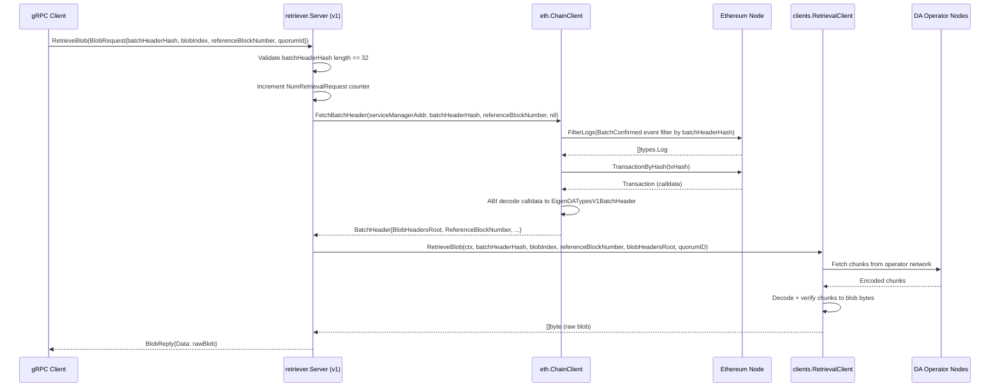
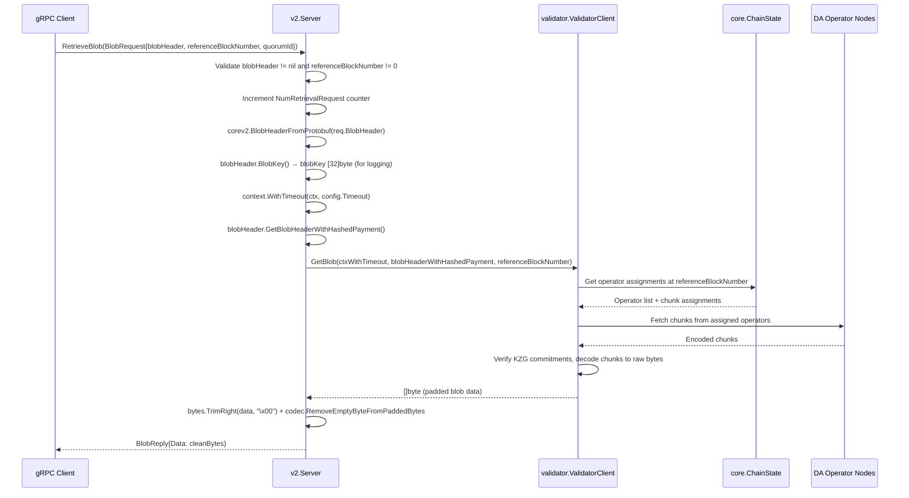
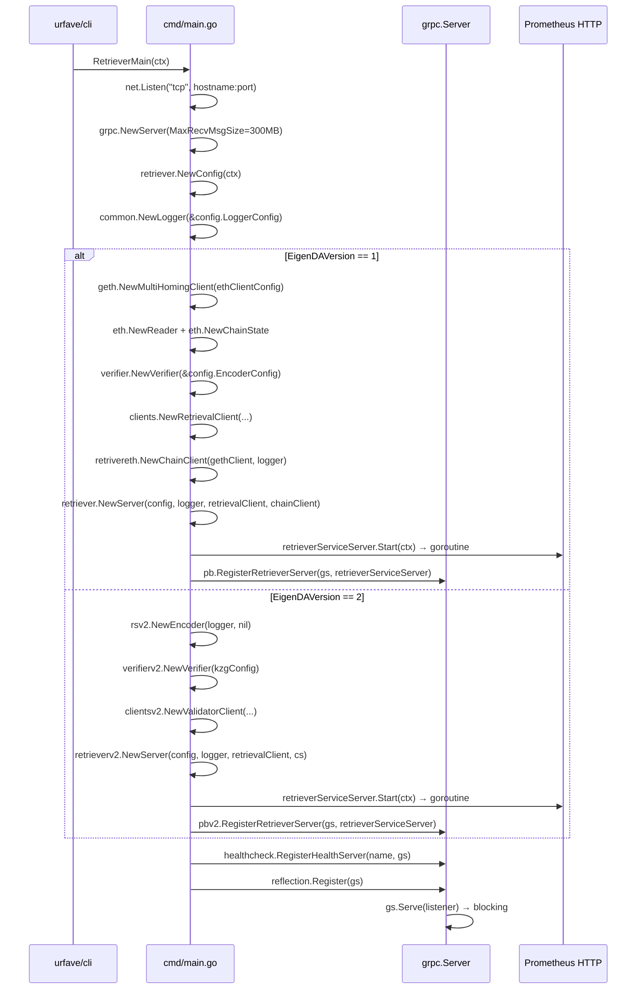

# retriever Analysis

**Analyzed by**: code-analyzer-retriever
**Timestamp**: 2026-04-10T00:00:00Z
**Application Type**: go-module
**Classification**: library (with embedded binary entry point)
**Location**: retriever/

## Architecture

The `retriever` package is a dual-version EigenDA blob retrieval library that exposes a gRPC service for retrieving dispersed data blobs from the EigenDA operator network. It supports both EigenDA protocol v1 and v2, with the two versions implemented as separate sub-packages (`retriever` for v1, `retriever/v2` for v2) sharing a common configuration and metrics layer.

The architectural pattern is a thin gRPC facade over a lower-level retrieval client abstraction. The `Server` struct (in both v1 and v2 forms) implements the generated `RetrieverServer` gRPC interface and delegates actual blob fetching to the `clients.RetrievalClient` (v1) or `validator.ValidatorClient` (v2) interfaces from the `api` package. This separates transport (gRPC) from retrieval protocol logic (handled in `api/clients`).

A secondary concern is on-chain coordination. For v1, the server queries an Ethereum contract (via the `eth.ChainClient` sub-package) to fetch a `BatchHeader` before retrieving blobs. For v2, the chain state is accessed through `core.ChainState`, and blob headers are parsed directly from the gRPC request payload. Metrics are collected via a Prometheus counter exposed on a configurable HTTP port, shared between v1 and v2 servers.

The binary entry point (`cmd/main.go`) selects between v1 and v2 at startup time based on the `--retriever.eigenda-version` CLI flag, wires dependencies, and starts both the gRPC server and the Prometheus metrics HTTP server.

## Key Components

- **Server (v1)** (`retriever/server.go`): Implements the `pb.RetrieverServer` gRPC interface for EigenDA v1. Handles `RetrieveBlob` RPC calls by (1) fetching the on-chain `BatchHeader` via `ChainClient`, (2) delegating blob data retrieval to `clients.RetrievalClient`, and (3) returning raw blob bytes. Initializes and owns the `Metrics` instance.

- **Server (v2)** (`retriever/v2/server.go`): Implements the `pbv2.RetrieverServer` gRPC interface for EigenDA v2. Parses the `BlobHeader` protobuf from the gRPC request, resolves the `BlobKey`, calls `validator.ValidatorClient.GetBlob`, and strips padding bytes from the returned data using `codec.RemoveEmptyByteFromPaddedBytes`. Applies a `context.WithTimeout` per the configured `Timeout` value.

- **Config** (`retriever/config.go`): Unified configuration struct shared between v1 and v2 servers. Embeds `kzg.KzgConfig` (KZG SRS parameters), `geth.EthClientConfig` (Ethereum RPC connection), `common.LoggerConfig`, and `MetricsConfig`. Parses all flags via `urfave/cli` in `NewConfig`. Controls the `EigenDAVersion` to select runtime protocol branch.

- **flags** (`retriever/flags/flags.go`): Declares and registers all CLI flags for the retriever binary using `urfave/cli`. Includes required flags (`hostname`, `grpc-port`, `timeout`), optional flags (`num-connections`, `metrics-http-port`, `eigenda-version`), and deprecated contract address flags. Aggregates KZG, Ethereum client, and logger flags from upstream packages.

- **Metrics** (`retriever/metrics.go`): Creates and manages a Prometheus registry with a single `NumRetrievalRequest` counter (`eigenda_retriever_request`). Starts an HTTP server exposing `/metrics` in a background goroutine. Shared between v1 and v2 servers via `retriever.NewMetrics`.

- **eth.ChainClient** (`retriever/eth/chain_client.go`): Ethereum-specific sub-package for v1 batch header resolution. The `ChainClient` interface defines `FetchBatchHeader`, which filters Ethereum event logs for `BatchConfirmed` events matching the provided batch header hash, retrieves the corresponding transaction, decodes calldata via ABI unpacking, and returns the typed `EigenDATypesV1BatchHeader`. Used exclusively in the v1 retrieval path.

- **mock.MockChainClient** (`retriever/mock/chain_client.go`): Test double for `eth.ChainClient`. Implements the interface using `testify/mock`, enabling unit tests to stub `FetchBatchHeader` responses without Ethereum connectivity.

- **cmd/main.go** (`retriever/cmd/main.go`): Binary entry point. Sets up the TCP listener, gRPC server (300 MB max receive size), selects v1 or v2 wiring, constructs all dependencies, registers the appropriate gRPC service, and registers a health-check service. Does not block on the main goroutine after calling `gs.Serve`.

## Data Flows

### 1. V1 Blob Retrieval (gRPC `RetrieveBlob`)

**Flow Description**: A gRPC client submits a `BlobRequest` with a batch header hash, blob index, reference block number, and quorum ID; the server fetches the batch header from Ethereum, then retrieves and returns the blob data.



**Detailed Steps**:

1. **Request Validation** (gRPC Client to Server)
   - Method: `RetrieveBlob(ctx context.Context, req *pb.BlobRequest) (*pb.BlobReply, error)`
   - Validates `len(req.GetBatchHeaderHash()) == 32`; returns error if invalid
   - Converts `[]byte` to `[32]byte` via `copy`

2. **On-Chain Batch Header Lookup** (Server to ChainClient to Ethereum)
   - Method: `FetchBatchHeader(ctx, serviceManagerAddress, batchHeaderHash, fromBlock, toBlock)`
   - Queries Ethereum event logs for `BatchConfirmed(bytes32,uint32)` events
   - Retrieves and ABI-decodes the `confirmBatch` transaction calldata
   - Returns `*binding.EigenDATypesV1BatchHeader` containing `BlobHeadersRoot` and `ReferenceBlockNumber`

3. **Blob Retrieval from DA Network** (Server to RetrievalClient to DA Nodes)
   - Method: `RetrieveBlob(ctx, batchHeaderHash, blobIndex, referenceBlockNumber, blobHeadersRoot, quorumID)`
   - The `api/clients.RetrievalClient` contacts operator nodes, downloads chunks, and reassembles the blob
   - Returns raw blob bytes

**Error Paths**:
- Invalid `batchHeaderHash` length → immediate `errors.New("got invalid batch header hash")`
- No `BatchConfirmed` event found on-chain → error from `FetchBatchHeader`
- Transaction pending → error from `FetchBatchHeader`
- Chunk download or decoding failure → error from `RetrieveBlob`

---

### 2. V2 Blob Retrieval (gRPC `RetrieveBlob`)

**Flow Description**: A gRPC client submits a `BlobRequest` with a structured `BlobHeader` protobuf; the v2 server parses it, calls the validator client to reconstruct the blob, strips codec padding, and returns clean data.



**Detailed Steps**:

1. **Request Parsing and Validation** (gRPC to v2.Server)
   - Validates `req.GetBlobHeader() != nil` and `req.GetReferenceBlockNumber() != 0`
   - Deserializes `BlobHeader` from protobuf using `corev2.BlobHeaderFromProtobuf`
   - Derives `BlobKey` for logging

2. **Timeout-Scoped Retrieval** (v2.Server to ValidatorClient)
   - Wraps context with `config.Timeout` to prevent indefinite blocking
   - Calls `ValidatorClient.GetBlob` with the `BlobHeaderWithHashedPayment` struct

3. **Codec Stripping** (v2.Server)
   - `bytes.TrimRight(data, "\x00")` removes trailing null bytes
   - `codec.RemoveEmptyByteFromPaddedBytes` reverses the EigenDA field-element padding scheme

**Error Paths**:
- `nil` BlobHeader → `errors.New("blob header is nil")`
- Zero `referenceBlockNumber` → `errors.New("reference block number is 0")`
- Protobuf deserialization failure → error from `BlobHeaderFromProtobuf`
- Context deadline exceeded → propagated from `ValidatorClient.GetBlob`

---

### 3. Server Initialization and Startup

**Flow Description**: The binary entry point wires all dependencies and starts the gRPC and metrics servers based on the configured EigenDA version.



## Dependencies

### External Libraries

- **github.com/prometheus/client_golang** (v1.21.1) [monitoring]: Prometheus Go client library for exposing metrics.
  The retriever uses it in `metrics.go` to create a `prometheus.Registry`, register process and Go runtime collectors, define a `Counter` for request tracking (`eigenda_retriever_request`), and serve the `/metrics` endpoint via `promhttp.HandlerFor`.
  Imported in: `retriever/metrics.go`.

- **github.com/urfave/cli** (v1.22.14) [cli]: CLI framework for defining and parsing command-line flags.
  Used throughout `retriever/flags/flags.go` to define typed flag structs (`cli.StringFlag`, `cli.IntFlag`, `cli.DurationFlag`) and in `retriever/config.go` to read parsed values in `NewConfig`. The binary entry point in `cmd/main.go` uses it to set up the application.
  Imported in: `retriever/config.go`, `retriever/flags/flags.go`, `retriever/cmd/main.go`.

- **github.com/ethereum/go-ethereum** (v1.15.3, replaced by op-geth v1.101511.1) [networking]: Ethereum client library providing log filtering, transaction lookup, ABI decoding, and common address/hash types.
  Used in `retriever/eth/chain_client.go` for log filtering (`ethereum.FilterQuery`), ABI decoding (`accounts/abi`), and address types. Also used in server and test files for Ethereum address conversions.
  Imported in: `retriever/eth/chain_client.go`, `retriever/eth/chain_client_test.go`, `retriever/mock/chain_client.go`, `retriever/server.go`, `retriever/cmd/main.go`, `retriever/v2/server_test.go`.

- **github.com/Layr-Labs/eigensdk-go** (v0.2.0-beta.1.0.20250118004418-2a25f31b3b28) [other]: EigenLayer SDK providing the `logging.Logger` interface for structured log output.
  Used pervasively with component labels such as `"RetrieverServer"`, `"RetrieverMetrics"`, and `"ChainClient"` passed via `logger.With("component", ...)`.
  Imported in: `retriever/server.go`, `retriever/v2/server.go`, `retriever/metrics.go`, `retriever/eth/chain_client.go`, `retriever/v2/server_test.go`.

- **google.golang.org/grpc** (v1.72.2) [networking]: gRPC framework for Go.
  Used exclusively in `cmd/main.go` to create the `grpc.Server` with a 300 MB max receive message size, register services, enable server reflection, and serve on the TCP listener.
  Imported in: `retriever/cmd/main.go`.

- **github.com/stretchr/testify** (v1.11.1) [testing]: Assertion and mocking library for Go tests.
  `mock.Mock` is embedded in `MockChainClient`; `assert` and `require` packages verify test expectations across all test files.
  Imported in: `retriever/server_test.go`, `retriever/v2/server_test.go`, `retriever/eth/chain_client_test.go`, `retriever/mock/chain_client.go`.

- **github.com/consensys/gnark-crypto** (v0.18.0) [crypto]: Zero-knowledge cryptography library for the BN254 elliptic curve.
  Used only in `v2/server_test.go` to construct `bn254.G2Affine` and `fp.Element` values for building a mock `encoding.BlobCommitments` in the v2 test.
  Imported in: `retriever/v2/server_test.go`.

### Internal Libraries

- **api** (`api/`): The primary retrieval protocol dependency. The v1 server uses `api/clients.RetrievalClient` and `api/clients.NodeClient` to fetch blobs from the DA network. The v2 server uses `api/clients/v2/validator.ValidatorClient` for the same purpose. The gRPC protobuf types for both server versions (`api/grpc/retriever` and `api/grpc/retriever/v2`) define the `RetrieverServer` interface that both `Server` structs implement.

- **common** (`common/`): Provides the `common.EthClient` interface, logger configuration (`common.LoggerConfig`, `common.NewLogger`), the `common.ServiceManagerAbi` ABI bytes, the `common.BatchConfirmedEventSigHash` constant, the `geth.NewMultiHomingClient` Ethereum client factory, `common/healthcheck` for gRPC health-check registration, and CLI flag helpers used in `flags/flags.go`.

- **core** (`core/`): Supplies fundamental EigenDA types. `core.QuorumID` (alias for `uint8`) is passed when calling `RetrievalClient.RetrieveBlob`. `core.ChainState` is used by the v2 server to look up operator assignments. `core.StdAssignmentCoordinator` is instantiated in the v1 startup path. `core/eth.NewReader` and `eth.NewChainState` build the on-chain state reader.

- **encoding** (`encoding/`): The v1 KZG configuration type (`encoding/v1/kzg.KzgConfig`) is embedded in `Config` and passed to `verifier.NewVerifier`. The v2 encoder (`encoding/v2/rs.NewEncoder`) and verifier (`encoding/v2/kzg/verifier.NewVerifier`) are wired in the v2 startup path. `encoding/codec.RemoveEmptyByteFromPaddedBytes` handles the EigenDA field-element padding scheme in the v2 server response processing. The `encoding/kzgflags` package contributes KZG SRS CLI flags to the flag aggregation.

## API Surface

### gRPC Service — v1 (`/retriever.Retriever/RetrieveBlob`)

The v1 retriever implements the `retriever.Retriever` gRPC service, defined in the `api/grpc/retriever` protobuf package.

**RetrieveBlob (Unary RPC)**

Request message `BlobRequest`:
- `batch_header_hash` (bytes, required): 32-byte hash of the confirmed batch header
- `blob_index` (uint32, required): Index of the blob within the batch
- `reference_block_number` (uint32, required): Ethereum block number at which operators were assigned
- `quorum_id` (uint32, required): DA quorum from which to retrieve chunks

Response message `BlobReply`:
- `data` (bytes): Raw reconstructed blob data

```
// Full method: /retriever.Retriever/RetrieveBlob
rpc RetrieveBlob(BlobRequest) returns (BlobReply)
```

Example Request:
```http
grpcurl -plaintext -d '{
  "batch_header_hash": "<32-byte-hash-as-base64>",
  "blob_index": 0,
  "reference_block_number": 1234567,
  "quorum_id": 0
}' localhost:32011 retriever.Retriever/RetrieveBlob
```

Example Response:
```json
{
  "data": "<base64-encoded-blob-bytes>"
}
```

### gRPC Service — v2 (`/retriever.v2.Retriever/RetrieveBlob`)

The v2 retriever implements the `retriever.v2.Retriever` gRPC service, defined in `api/grpc/retriever/v2`.

**RetrieveBlob (Unary RPC)**

Request message `BlobRequest`:
- `blob_header` (common.v2.BlobHeader, required): Structured blob header including version, quorum numbers, KZG commitment, and payment header
- `reference_block_number` (uint32, required): Ethereum block number for operator lookup
- `quorum_id` (uint32): Target quorum for retrieval

Response message `BlobReply`:
- `data` (bytes): Decoded blob data with field-element padding removed

```
// Full method: /retriever.v2.Retriever/RetrieveBlob
rpc RetrieveBlob(BlobRequest) returns (BlobReply)
```

### Prometheus Metrics HTTP

- **Endpoint**: `GET /metrics` on port `9100` (default, configurable via `--retriever.metrics-http-port`)
- **Metric**: `eigenda_retriever_request` (counter) — total number of `RetrieveBlob` gRPC calls received

### Exported Go Package API

The `retriever` package exports:

- `Config` struct with `NewConfig(*cli.Context) (*Config, error)` factory
- `Server` struct (v1) with constructor `NewServer(config, logger, retrievalClient, chainClient) *Server` and methods `Start(ctx context.Context)`, `RetrieveBlob(ctx, req) (*pb.BlobReply, error)`
- `Metrics` struct with constructor `NewMetrics(httpPort string, logger logging.Logger) *Metrics` and methods `Start(ctx context.Context)`, `IncrementRetrievalRequestCounter()`
- `MetricsConfig` struct

The `retriever/v2` sub-package exports:

- `type Config = retriever.Config` (type alias, no separate config struct)
- `Server` struct with constructor `NewServer(config, logger, retrievalClient, chainState) *Server` and methods `Start(ctx context.Context)`, `RetrieveBlob(ctx, req) (*pbv2.BlobReply, error)`

The `retriever/eth` sub-package exports:

- `ChainClient` interface: `FetchBatchHeader(ctx, serviceManagerAddress, batchHeaderHash, fromBlock, toBlock) (*binding.EigenDATypesV1BatchHeader, error)`
- `NewChainClient(ethClient common.EthClient, logger logging.Logger) ChainClient`

The `retriever/mock` sub-package exports:

- `MockChainClient` struct implementing `eth.ChainClient` via `testify/mock`
- `NewMockChainClient() *MockChainClient`

The `retriever/flags` sub-package exports:

- `Flags []cli.Flag` — package-level aggregated flag list
- `RetrieverFlags(envPrefix string) []cli.Flag` — returns flags for a given env prefix

## Code Examples

### Example 1: V1 Server — RetrieveBlob Handler

```go
// retriever/server.go
func (s *Server) RetrieveBlob(ctx context.Context, req *pb.BlobRequest) (*pb.BlobReply, error) {
    s.logger.Info("Received request: ", "BatchHeaderHash", req.GetBatchHeaderHash(), "BlobIndex", req.GetBlobIndex())
    s.metrics.IncrementRetrievalRequestCounter()
    if len(req.GetBatchHeaderHash()) != 32 {
        return nil, errors.New("got invalid batch header hash")
    }
    var batchHeaderHash [32]byte
    copy(batchHeaderHash[:], req.GetBatchHeaderHash())

    batchHeader, err := s.chainClient.FetchBatchHeader(ctx,
        gcommon.HexToAddress(s.config.EigenDAServiceManagerAddr),
        req.GetBatchHeaderHash(),
        big.NewInt(int64(req.GetReferenceBlockNumber())), nil)
    if err != nil {
        return nil, err
    }

    data, err := s.retrievalClient.RetrieveBlob(
        ctx,
        batchHeaderHash,
        req.GetBlobIndex(),
        uint(batchHeader.ReferenceBlockNumber),
        batchHeader.BlobHeadersRoot,
        core.QuorumID(req.GetQuorumId()))
    if err != nil {
        return nil, err
    }
    return &pb.BlobReply{Data: data}, nil
}
```

### Example 2: Ethereum Log Filtering for Batch Header Resolution

```go
// retriever/eth/chain_client.go
func (c *chainClient) FetchBatchHeader(ctx context.Context, serviceManagerAddress gcommon.Address, batchHeaderHash []byte, fromBlock *big.Int, toBlock *big.Int) (*binding.EigenDATypesV1BatchHeader, error) {
    logs, err := c.ethClient.FilterLogs(ctx, ethereum.FilterQuery{
        FromBlock: fromBlock,
        ToBlock:   toBlock,
        Addresses: []gcommon.Address{serviceManagerAddress},
        Topics: [][]gcommon.Hash{
            {common.BatchConfirmedEventSigHash},
            {gcommon.BytesToHash(batchHeaderHash)},
        },
    })
    // fetch tx by hash, ABI decode calldata, return typed batch header struct
}
```

### Example 3: V2 Server — Padding Removal After Retrieval

```go
// retriever/v2/server.go
data, err := s.retrievalClient.GetBlob(
    ctxWithTimeout,
    blobHeaderWithHashedPayment,
    uint64(req.GetReferenceBlockNumber()))
if err != nil {
    return nil, err
}
restored := bytes.TrimRight(data, "\x00")
restored = codec.RemoveEmptyByteFromPaddedBytes(restored)
return &pb.BlobReply{Data: restored}, nil
```

### Example 4: Prometheus Metrics Initialization

```go
// retriever/metrics.go
func NewMetrics(httpPort string, logger logging.Logger) *Metrics {
    reg := prometheus.NewRegistry()
    reg.MustRegister(collectors.NewProcessCollector(collectors.ProcessCollectorOpts{}))
    reg.MustRegister(collectors.NewGoCollector())

    metrics := &Metrics{
        registry: reg,
        NumRetrievalRequest: promauto.With(reg).NewCounter(
            prometheus.CounterOpts{
                Namespace: Namespace,  // "eigenda_retriever"
                Name:      "request",
                Help:      "the number of retrieval requests",
            },
        ),
        httpPort: httpPort,
        logger:   logger.With("component", "RetrieverMetrics"),
    }
    return metrics
}
```

### Example 5: V1/V2 Branch Selection at Startup

```go
// retriever/cmd/main.go
if config.EigenDAVersion == 1 {
    config.EncoderConfig.LoadG2Points = true
    verifier, _ := verifier.NewVerifier(&config.EncoderConfig, nil)
    agn := &core.StdAssignmentCoordinator{}
    retrievalClient, _ := clients.NewRetrievalClient(logger, cs, agn, nodeClient, verifier, config.NumConnections)
    chainClient := retrivereth.NewChainClient(gethClient, logger)
    retrieverServiceServer := retriever.NewServer(config, logger, retrievalClient, chainClient)
    retrieverServiceServer.Start(context.Background())
    pb.RegisterRetrieverServer(gs, retrieverServiceServer)
    return gs.Serve(listener)
}

if config.EigenDAVersion == 2 {
    encoder, _ := rsv2.NewEncoder(logger, nil)
    kzgConfig := verifierv2.ConfigFromV1KzgConfig(&config.EncoderConfig)
    verifier, _ := verifierv2.NewVerifier(kzgConfig)
    clientConfig := clientsv2.DefaultClientConfig()
    clientConfig.ConnectionPoolSize = config.NumConnections
    retrievalClient := clientsv2.NewValidatorClient(logger, tx, cs, encoder, verifier, clientConfig, nil)
    retrieverServiceServer := retrieverv2.NewServer(config, logger, retrievalClient, cs)
    retrieverServiceServer.Start(context.Background())
    pbv2.RegisterRetrieverServer(gs, retrieverServiceServer)
    return gs.Serve(listener)
}
```

## Files Analyzed

- `retriever/server.go` (74 lines) - V1 gRPC server implementation with `RetrieveBlob` handler
- `retriever/config.go` (53 lines) - Unified configuration struct and CLI-based constructor
- `retriever/metrics.go` (71 lines) - Prometheus metrics registry, counter, and HTTP server
- `retriever/flags/flags.go` (102 lines) - CLI flag definitions for all retriever configuration options
- `retriever/eth/chain_client.go` (91 lines) - Ethereum log/transaction parsing for batch header resolution
- `retriever/eth/chain_client_test.go` (86 lines) - Unit test for `FetchBatchHeader` with mock Ethereum client
- `retriever/mock/chain_client.go` (26 lines) - Testify-based mock for `ChainClient` interface
- `retriever/server_test.go` (103 lines) - Unit test for v1 server using mock retrieval and chain clients
- `retriever/v2/server.go` (93 lines) - V2 gRPC server with `RetrieveBlob`, blob header parsing, and codec stripping
- `retriever/v2/server_test.go` (141 lines) - Unit test for v2 server with mock validator client and KZG commitments
- `retriever/cmd/main.go` (163 lines) - Binary entry point, dependency wiring, gRPC + health server startup
- `retriever/Makefile` (20 lines) - Build and run targets with example configuration

## Analysis Data

```json
{
  "summary": "The retriever package is a dual-version (v1/v2) EigenDA blob retrieval library that wraps a gRPC server facade over protocol-specific blob retrieval clients. The v1 server queries the Ethereum chain to resolve batch headers before delegating to api/clients.RetrievalClient to fetch and reconstruct blobs from DA operator nodes. The v2 server parses structured BlobHeader protobufs from requests and delegates to api/clients/v2/validator.ValidatorClient with context-scoped timeouts, then strips EigenDA codec padding from returned data. Both versions share a common Config struct, Prometheus metrics counter, and CLI flag definitions. The binary entry point in cmd/main.go selects the active version at startup based on a CLI flag.",
  "architecture_pattern": "layered (gRPC transport facade over retrieval client abstraction over DA network and Ethereum chain)",
  "key_modules": [
    "retriever.Server (v1 gRPC server)",
    "retriever/v2.Server (v2 gRPC server)",
    "retriever.Config (shared configuration)",
    "retriever.Metrics (Prometheus metrics and HTTP server)",
    "retriever/eth.ChainClient (Ethereum batch header resolver)",
    "retriever/mock.MockChainClient (test double)",
    "retriever/flags (CLI flag definitions)",
    "retriever/cmd/main.go (binary entry point)"
  ],
  "api_endpoints": [
    "/retriever.Retriever/RetrieveBlob (v1 gRPC unary)",
    "/retriever.v2.Retriever/RetrieveBlob (v2 gRPC unary)",
    "/metrics (Prometheus HTTP, default port 9100)"
  ],
  "data_flows": [
    "V1 RetrieveBlob: gRPC request → validate hash → FetchBatchHeader (Ethereum logs + TX ABI decode) → RetrievalClient.RetrieveBlob (DA nodes) → return raw bytes",
    "V2 RetrieveBlob: gRPC request → parse BlobHeader proto → ValidatorClient.GetBlob (DA nodes with timeout) → strip padding → return clean bytes",
    "Startup: CLI parse → version branch select → wire Ethereum + encoding + retrieval clients → start gRPC + metrics servers"
  ],
  "tech_stack": [
    "go",
    "grpc",
    "protobuf",
    "prometheus",
    "ethereum",
    "kzg"
  ],
  "external_integrations": [
    "Ethereum RPC node (via go-ethereum FilterLogs and TransactionByHash in v1 path)",
    "EigenDA operator nodes (via api/clients.RetrievalClient or validator.ValidatorClient)"
  ],
  "component_interactions": [
    {"component": "api", "interaction": "Uses RetrievalClient (v1) and ValidatorClient (v2) interfaces for blob fetching; implements generated RetrieverServer gRPC interfaces from api/grpc/retriever and api/grpc/retriever/v2"},
    {"component": "common", "interaction": "Uses EthClient interface, LoggerConfig, NewLogger, geth.NewMultiHomingClient, ServiceManagerAbi, BatchConfirmedEventSigHash constant, healthcheck.RegisterHealthServer"},
    {"component": "core", "interaction": "Uses QuorumID type, ChainState interface, StdAssignmentCoordinator, core/eth.NewReader, eth.NewChainState"},
    {"component": "encoding", "interaction": "Embeds kzg.KzgConfig for v1 verifier setup, uses rs.NewEncoder and kzg/verifier for v2, calls codec.RemoveEmptyByteFromPaddedBytes in v2 response processing, imports kzgflags for CLI flag registration"}
  ]
}
```

## Citations

```json
[
  {
    "file_path": "retriever/server.go",
    "start_line": 16,
    "end_line": 24,
    "claim": "V1 Server struct embeds pb.UnimplementedRetrieverServer and holds config, retrievalClient, chainClient, logger, and metrics fields",
    "section": "Key Components",
    "snippet": "type Server struct {\n\tpb.UnimplementedRetrieverServer\n\tconfig          *Config\n\tretrievalClient clients.RetrievalClient\n\tchainClient     eth.ChainClient\n\tlogger          logging.Logger\n\tmetrics         *Metrics\n}"
  },
  {
    "file_path": "retriever/server.go",
    "start_line": 47,
    "end_line": 74,
    "claim": "V1 RetrieveBlob validates the 32-byte batch header hash, fetches the BatchHeader from chain, then calls RetrievalClient.RetrieveBlob with the resolved blobHeadersRoot",
    "section": "Data Flows",
    "snippet": "func (s *Server) RetrieveBlob(ctx context.Context, req *pb.BlobRequest) (*pb.BlobReply, error) {"
  },
  {
    "file_path": "retriever/server.go",
    "start_line": 50,
    "end_line": 52,
    "claim": "V1 server validates batch header hash must be exactly 32 bytes, returning an error for invalid input",
    "section": "Data Flows",
    "snippet": "if len(req.GetBatchHeaderHash()) != 32 {\n\treturn nil, errors.New(\"got invalid batch header hash\")\n}"
  },
  {
    "file_path": "retriever/server.go",
    "start_line": 56,
    "end_line": 59,
    "claim": "V1 server calls FetchBatchHeader using the EigenDAServiceManagerAddr from config and the referenceBlockNumber from the request as the fromBlock parameter",
    "section": "Data Flows",
    "snippet": "batchHeader, err := s.chainClient.FetchBatchHeader(ctx, gcommon.HexToAddress(s.config.EigenDAServiceManagerAddr), req.GetBatchHeaderHash(), big.NewInt(int64(req.GetReferenceBlockNumber())), nil)"
  },
  {
    "file_path": "retriever/v2/server.go",
    "start_line": 18,
    "end_line": 18,
    "claim": "V2 sub-package defines Config as a type alias for retriever.Config, sharing the same configuration struct across both server versions",
    "section": "Architecture",
    "snippet": "type Config = retriever.Config"
  },
  {
    "file_path": "retriever/v2/server.go",
    "start_line": 20,
    "end_line": 28,
    "claim": "V2 Server uses validator.ValidatorClient and core.ChainState instead of ChainClient, and shares Metrics from the v1 retriever package",
    "section": "Key Components",
    "snippet": "type Server struct {\n\tpb.UnimplementedRetrieverServer\n\tconfig          *Config\n\tretrievalClient validator.ValidatorClient\n\tchainState      core.ChainState\n\tlogger          logging.Logger\n\tmetrics         *retriever.Metrics\n}"
  },
  {
    "file_path": "retriever/v2/server.go",
    "start_line": 51,
    "end_line": 53,
    "claim": "V2 server validates that blobHeader is non-nil and referenceBlockNumber is non-zero before processing",
    "section": "Data Flows",
    "snippet": "if req.GetBlobHeader() == nil {\n\treturn nil, errors.New(\"blob header is nil\")\n}\nif req.GetReferenceBlockNumber() == 0 {\n\treturn nil, errors.New(\"reference block number is 0\")\n}"
  },
  {
    "file_path": "retriever/v2/server.go",
    "start_line": 72,
    "end_line": 73,
    "claim": "V2 server applies a configurable timeout to the GetBlob call using context.WithTimeout to prevent indefinite blocking",
    "section": "Data Flows",
    "snippet": "ctxWithTimeout, cancel := context.WithTimeout(ctx, s.config.Timeout)\ndefer cancel()"
  },
  {
    "file_path": "retriever/v2/server.go",
    "start_line": 86,
    "end_line": 92,
    "claim": "V2 server strips trailing null bytes and EigenDA field-element padding from retrieved blob data before returning",
    "section": "Data Flows",
    "snippet": "restored := bytes.TrimRight(data, \"\\x00\")\nrestored = codec.RemoveEmptyByteFromPaddedBytes(restored)\nreturn &pb.BlobReply{\n\tData: restored,\n}, nil"
  },
  {
    "file_path": "retriever/config.go",
    "start_line": 14,
    "end_line": 27,
    "claim": "Config embeds KzgConfig, EthClientConfig, LoggerConfig, MetricsConfig, Timeout, NumConnections, contract addresses, and EigenDAVersion",
    "section": "Key Components",
    "snippet": "type Config struct {\n\tEncoderConfig   kzg.KzgConfig\n\tEthClientConfig geth.EthClientConfig\n\tLoggerConfig    common.LoggerConfig\n\tMetricsConfig   MetricsConfig\n\tTimeout time.Duration\n\tNumConnections int\n\tEigenDAVersion int\n}"
  },
  {
    "file_path": "retriever/config.go",
    "start_line": 30,
    "end_line": 33,
    "claim": "NewConfig validates that EigenDAVersion must be 1 or 2, returning an error for any other value",
    "section": "Key Components",
    "snippet": "if version != 1 && version != 2 {\n\treturn nil, errors.New(\"invalid EigenDA version\")\n}"
  },
  {
    "file_path": "retriever/metrics.go",
    "start_line": 23,
    "end_line": 30,
    "claim": "Metrics struct holds a Prometheus registry, a single NumRetrievalRequest counter, the HTTP port, and a logger",
    "section": "Key Components",
    "snippet": "type Metrics struct {\n\tregistry *prometheus.Registry\n\tNumRetrievalRequest prometheus.Counter\n\thttpPort string\n\tlogger   logging.Logger\n}"
  },
  {
    "file_path": "retriever/metrics.go",
    "start_line": 38,
    "end_line": 47,
    "claim": "The retrieval request counter uses the namespace 'eigenda_retriever' and metric name 'request'",
    "section": "API Surface",
    "snippet": "NumRetrievalRequest: promauto.With(reg).NewCounter(\n\tprometheus.CounterOpts{\n\t\tNamespace: Namespace,\n\t\tName:      \"request\",\n\t\tHelp:      \"the number of retrieval requests\",\n\t},\n),"
  },
  {
    "file_path": "retriever/metrics.go",
    "start_line": 59,
    "end_line": 71,
    "claim": "Metrics.Start launches a background HTTP goroutine serving the /metrics Prometheus endpoint",
    "section": "Key Components",
    "snippet": "go func() {\n\thttp.Handle(\"/metrics\", promhttp.HandlerFor(g.registry, promhttp.HandlerOpts{}))\n\terr := http.ListenAndServe(addr, nil)\n\tlog.Error(\"Prometheus server failed\", \"err\", err)\n}()"
  },
  {
    "file_path": "retriever/eth/chain_client.go",
    "start_line": 17,
    "end_line": 19,
    "claim": "ChainClient interface defines a single method FetchBatchHeader returning the typed EigenDATypesV1BatchHeader from on-chain data",
    "section": "Key Components",
    "snippet": "type ChainClient interface {\n\tFetchBatchHeader(ctx context.Context, serviceManagerAddress gcommon.Address, batchHeaderHash []byte, fromBlock *big.Int, toBlock *big.Int) (*binding.EigenDATypesV1BatchHeader, error)\n}"
  },
  {
    "file_path": "retriever/eth/chain_client.go",
    "start_line": 38,
    "end_line": 47,
    "claim": "FetchBatchHeader filters Ethereum event logs by BatchConfirmed event signature hash and the batch header hash as a second topic",
    "section": "Data Flows",
    "snippet": "logs, err := c.ethClient.FilterLogs(ctx, ethereum.FilterQuery{\n\tFromBlock: fromBlock,\n\tToBlock:   toBlock,\n\tAddresses: []gcommon.Address{serviceManagerAddress},\n\tTopics: [][]gcommon.Hash{\n\t\t{common.BatchConfirmedEventSigHash},\n\t\t{gcommon.BytesToHash(batchHeaderHash)},\n\t},\n})"
  },
  {
    "file_path": "retriever/eth/chain_client.go",
    "start_line": 68,
    "end_line": 79,
    "claim": "FetchBatchHeader decodes the confirmBatch calldata using ABI JSON parsing to extract the typed EigenDATypesV1BatchHeader from the transaction input",
    "section": "Data Flows",
    "snippet": "smAbi, err := abi.JSON(bytes.NewReader(common.ServiceManagerAbi))\nmethodSig := calldata[:4]\nmethod, err := smAbi.MethodById(methodSig)\ninputs, err := method.Inputs.Unpack(calldata[4:])"
  },
  {
    "file_path": "retriever/eth/chain_client.go",
    "start_line": 83,
    "end_line": 90,
    "claim": "The ABI-decoded batch header input is type-asserted to a concrete anonymous struct matching the EigenDATypesV1BatchHeader ABI layout",
    "section": "Data Flows",
    "snippet": "batchHeaderInput := inputs[0].(struct {\n\tBlobHeadersRoot       [32]byte ...\n\tQuorumNumbers         []byte   ...\n\tSignedStakeForQuorums []byte   ...\n\tReferenceBlockNumber  uint32   ...\n})"
  },
  {
    "file_path": "retriever/mock/chain_client.go",
    "start_line": 13,
    "end_line": 17,
    "claim": "MockChainClient uses testify/mock and has a compile-time interface assertion to ensure it satisfies eth.ChainClient",
    "section": "Key Components",
    "snippet": "type MockChainClient struct {\n\tmock.Mock\n}\nvar _ eth.ChainClient = (*MockChainClient)(nil)"
  },
  {
    "file_path": "retriever/flags/flags.go",
    "start_line": 57,
    "end_line": 63,
    "claim": "The NumConnections flag defaults to 20 connections to DA nodes and is configurable via RETRIEVER_NUM_CONNECTIONS env var",
    "section": "Key Components",
    "snippet": "NumConnectionsFlag = cli.IntFlag{\n\tName:     common.PrefixFlag(FlagPrefix, \"num-connections\"),\n\tUsage:    \"maximum number of connections to DA nodes (defaults to 20)\",\n\tRequired: false,\n\tValue:    20,\n}"
  },
  {
    "file_path": "retriever/flags/flags.go",
    "start_line": 64,
    "end_line": 70,
    "claim": "The MetricsHTTPPort flag defaults to port 9100 for the Prometheus metrics server",
    "section": "API Surface",
    "snippet": "MetricsHTTPPortFlag = cli.StringFlag{\n\tName:     common.PrefixFlag(FlagPrefix, \"metrics-http-port\"),\n\tValue:    \"9100\",\n}"
  },
  {
    "file_path": "retriever/flags/flags.go",
    "start_line": 71,
    "end_line": 78,
    "claim": "The EigenDAVersionFlag defaults to version 1 and controls which server implementation and dependency wiring is selected at startup",
    "section": "Architecture",
    "snippet": "EigenDAVersionFlag = cli.IntFlag{\n\tName:     common.PrefixFlag(FlagPrefix, \"eigenda-version\"),\n\tUsage:    \"EigenDA version: currently supports 1 and 2\",\n\tRequired: false,\n\tValue:    1,\n}"
  },
  {
    "file_path": "retriever/cmd/main.go",
    "start_line": 64,
    "end_line": 65,
    "claim": "The gRPC server is configured with a 300 MB maximum receive message size to accommodate large blob responses",
    "section": "Architecture",
    "snippet": "opt := grpc.MaxRecvMsgSize(1024 * 1024 * 300)\ngs := grpc.NewServer(opt, ...)"
  },
  {
    "file_path": "retriever/cmd/main.go",
    "start_line": 100,
    "end_line": 129,
    "claim": "V1 startup path forces LoadG2Points=true on EncoderConfig, then initializes KZG verifier, StdAssignmentCoordinator, RetrievalClient, and a retriever-specific eth.ChainClient",
    "section": "Data Flows",
    "snippet": "if config.EigenDAVersion == 1 {\n\tconfig.EncoderConfig.LoadG2Points = true\n\tverifier, err := verifier.NewVerifier(&config.EncoderConfig, nil)\n\tagn := &core.StdAssignmentCoordinator{}\n\tretrievalClient, err := clients.NewRetrievalClient(logger, cs, agn, nodeClient, verifier, config.NumConnections)\n\tchainClient := retrivereth.NewChainClient(gethClient, logger)\n}"
  },
  {
    "file_path": "retriever/cmd/main.go",
    "start_line": 131,
    "end_line": 160,
    "claim": "V2 startup path initializes the rs.Encoder, v2 KZG verifier, and ValidatorClient using config derived from the v1 KZG config via ConfigFromV1KzgConfig",
    "section": "Data Flows",
    "snippet": "if config.EigenDAVersion == 2 {\n\tencoder, err := rsv2.NewEncoder(logger, nil)\n\tkzgConfig := verifierv2.ConfigFromV1KzgConfig(&config.EncoderConfig)\n\tverifier, err := verifierv2.NewVerifier(kzgConfig)\n\tretrievalClient := clientsv2.NewValidatorClient(logger, tx, cs, encoder, verifier, clientConfig, nil)\n}"
  },
  {
    "file_path": "retriever/cmd/main.go",
    "start_line": 117,
    "end_line": 126,
    "claim": "gRPC server reflection is enabled to support grpcurl tooling, and the gRPC health-check service is registered under the retriever service name",
    "section": "API Surface",
    "snippet": "reflection.Register(gs)\npb.RegisterRetrieverServer(gs, retrieverServiceServer)\nname := pb.Retriever_ServiceDesc.ServiceName\nhealthcheck.RegisterHealthServer(name, gs)"
  },
  {
    "file_path": "retriever/server_test.go",
    "start_line": 78,
    "end_line": 81,
    "claim": "V1 server tests use a testify MockRetrievalClient and MockChainClient to stub both network layers",
    "section": "Key Components",
    "snippet": "retrievalClient = &clientsmock.MockRetrievalClient{}\nchainClient = mock.NewMockChainClient()\nreturn retriever.NewServer(config, logger, retrievalClient, chainClient)"
  },
  {
    "file_path": "retriever/server_test.go",
    "start_line": 83,
    "end_line": 103,
    "claim": "TestRetrieveBlob verifies the full v1 retrieval pipeline returns the raw padded blob bytes without modification",
    "section": "Data Flows",
    "snippet": "chainClient.On(\"FetchBatchHeader\").Return(&binding.EigenDATypesV1BatchHeader{...}, nil)\nretrievalClient.On(\"RetrieveBlob\").Return(gettysburgAddressBytes, nil)\nassert.Equal(t, gettysburgAddressBytes, retrievalReply.GetData())"
  },
  {
    "file_path": "retriever/v2/server_test.go",
    "start_line": 81,
    "end_line": 141,
    "claim": "V2 TestRetrieveBlob builds a full BlobHeader with BN254 G2 affine KZG commitments and verifies the server correctly strips codec padding from the returned data",
    "section": "Data Flows",
    "snippet": "data := codec.ConvertByPaddingEmptyByte(gettysburgAddressBytes)\nretrievalClient.On(\"GetBlob\", ...).Return(data, nil)\nrequire.Equal(t, gettysburgAddressBytes, retrievalReply.GetData())"
  },
  {
    "file_path": "retriever/eth/chain_client_test.go",
    "start_line": 19,
    "end_line": 86,
    "claim": "TestFetchBatchHeader verifies that FetchBatchHeader correctly filters logs, fetches the transaction, and ABI-decodes calldata to extract typed batch header fields including ReferenceBlockNumber",
    "section": "Key Components",
    "snippet": "chainClient := eth.NewChainClient(ethClient, logger)\nethClient.On(\"FilterLogs\", ...).Return([]types.Log{...}, nil)\nethClient.On(\"TransactionByHash\", txHash).Return(types.NewTx(...), false, nil)\nbatchHeader, err := chainClient.FetchBatchHeader(...)\nassert.Equal(t, batchHeader.ReferenceBlockNumber, expectedHeader.ReferenceBlockNumber)"
  }
]
```

## Analysis Notes

### Security Considerations

1. **No Authentication on gRPC Endpoint**: The gRPC server in `cmd/main.go` is created without TLS or authentication interceptors. The TODO comments in the server setup indicate planned interceptors were never implemented. Any client with network access to the configured port can submit `RetrieveBlob` requests.

2. **Input Validation Limited to Hash Length (V1)**: The only input validation on the v1 request is verifying the batch header hash is exactly 32 bytes. The actual integrity of the retrieved data depends on the `api/clients.RetrievalClient` layer performing cryptographic verification of chunk commitments against the batch header.

3. **Codec Padding Removal (V2)**: The `bytes.TrimRight(data, "\x00")` operation in the v2 server is applied before `RemoveEmptyByteFromPaddedBytes`. Legitimate blobs containing trailing null bytes would be silently truncated; this is a protocol-level constraint that callers should be aware of.

4. **Ethereum RPC Trust**: The v1 chain client depends on an Ethereum RPC node to resolve batch headers. A compromised or unavailable RPC node could prevent all v1 blob retrieval or return incorrect batch header data. No additional RPC response validation beyond ABI decoding is performed.

### Performance Characteristics

- **V2 Timeout Enforcement**: The v2 server wraps the `GetBlob` call in `context.WithTimeout` using the configured `Timeout` duration. The v1 server does not apply an explicit retrieval timeout beyond any deadline propagated from the gRPC client context.
- **Connection Pooling**: The `NumConnections` flag (default 20) controls the connection pool size for both `clients.NewRetrievalClient` (v1) and `clientsv2.DefaultClientConfig` (v2), bounding concurrent connections to DA operator nodes.
- **gRPC Message Size**: The 300 MB `MaxRecvMsgSize` on the gRPC server accommodates large blobs, but a single malformed or adversarial large request could cause significant server memory allocation.

### Scalability Notes

- **Stateless Request Handling**: Both v1 and v2 servers are stateless per request; there is no session or in-memory caching of blob data or batch headers. Horizontal scaling by running multiple retriever instances behind a load balancer is straightforward.
- **Single Metrics Counter**: The Prometheus metrics layer exposes only a single request counter without per-quorum, per-version, or latency histogram breakdowns, limiting operational observability under load.
- **Single gRPC Method Per Version**: Each server version exposes exactly one gRPC method. There is no streaming support; large blobs must fit within the 300 MB message size limit in a single response.
