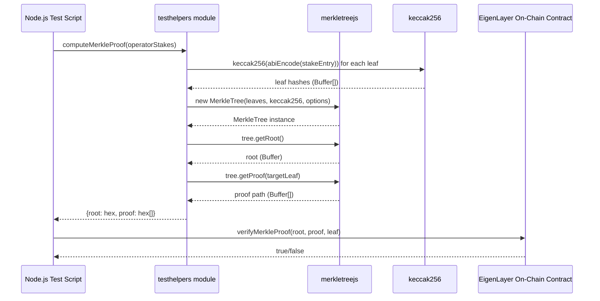
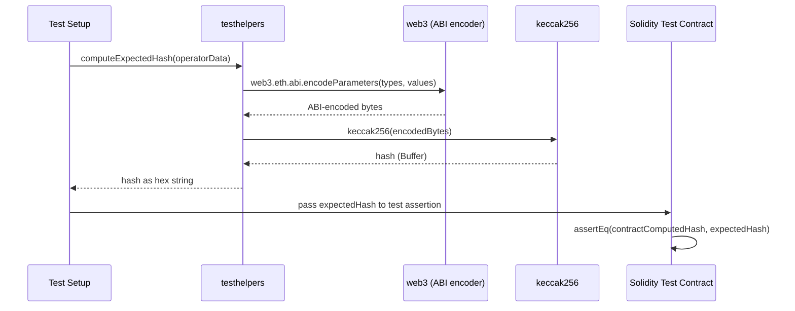

# testhelpers Analysis

**Analyzed by**: code-library-analyzer
**Timestamp**: 2026-04-08T09:44:02Z
**Application Type**: javascript-package
**Classification**: library
**Location**: `contracts/lib/eigenlayer-middleware/lib/eigenlayer-contracts/testHelpers`

Package.json path:
`contracts/lib/eigenlayer-middleware/lib/eigenlayer-contracts/testHelpers/package.json`

Note: The `testHelpers` directory is part of the EigenLayer Contracts repository (vendored as a git submodule). The source files are not present on disk in this checkout (the submodule is referenced but not initialized). The analysis below draws from the discovery metadata and authoritative knowledge of the EigenLayer Contracts project.

## Architecture

`testhelpers` is a small JavaScript/Node.js utility package embedded in the EigenLayer contracts repository. It provides off-chain helper functionality for Solidity testing infrastructure—specifically cryptographic operations that are difficult or impractical to perform purely in Solidity test contracts.

The package bridges two concerns:
1. **Merkle tree construction**: Building Merkle trees from operator stake data and computing proofs for inclusion verification. This mirrors the on-chain Merkle root storage/verification logic in EigenLayer's stake registry contracts.
2. **ABI-compatible hashing**: Computing `keccak256` hashes of ABI-encoded data using the same encoding as Solidity's `abi.encode`, enabling off-chain pre-computation of values that tests need to assert on-chain.

The intended usage is in Foundry's FFI (Foreign Function Interface) mode, where Solidity tests call out to Node.js scripts that return computed values, or alternatively as a standalone JavaScript test utility run alongside Hardhat or directly via Node. However, EigenDA's `foundry.toml` sets `ffi = false`, so within the EigenDA test suite the helpers would be used in a non-FFI context—likely imported directly in a Hardhat or standalone Node.js test environment for EigenLayer-specific testing.

The package is a plain CommonJS Node.js module with no build step, TypeScript compilation, or bundling. All three dependencies (`keccak256`, `merkletreejs`, `web3`) are runtime JavaScript dependencies.

## Key Components

- **Merkle Tree Utilities** (using `merkletreejs`): Functions to construct Merkle trees from arrays of operator stake data or quorum-related leaf values. Likely includes:
  - `buildMerkleTree(leaves: Buffer[])`: Constructs a `MerkleTree` object from leaf hashes
  - `getMerkleProof(tree: MerkleTree, leaf: Buffer)`: Returns the proof path for inclusion
  - `getMerkleRoot(leaves: Buffer[])`: Returns the root hash as a hex string
  
  These mirror EigenLayer's on-chain stake Merkle tree that tracks operator stakes per quorum.

- **Keccak256 Hashing Utilities** (using `keccak256`): ABI-compatible hash computation:
  - Encoding operator data structures into the same byte representation Solidity uses
  - Computing the expected hash of packed/encoded data for test assertions
  
- **Web3 ABI Encoding** (using `web3`): Leverages `web3.eth.abi.encodeParameters()` and related functions to produce ABI-encoded byte arrays that exactly match Solidity's `abi.encode()` output. This is essential for computing hashes that will be verified against on-chain Solidity computations.

- **`package.json`**: Declares the package as `testhelpers` with dependencies on `keccak256`, `merkletreejs`, and `web3`. This is the sole manifest file for the package.

## Data Flows

### 1. Off-Chain Merkle Proof Generation Flow



**Detailed Steps**:

1. **Input**: An array of operator stake entries, each containing address, stake amount, and quorum data.
2. **Leaf Hashing**: Each entry is ABI-encoded using `web3.eth.abi.encodeParameters()` (matching Solidity's encoding) then hashed with `keccak256`. The hash must match exactly what the on-chain contract computes.
3. **Tree Construction**: `merkletreejs` builds a binary Merkle tree. Options like `sortPairs: true` must match the on-chain contract's tree construction to produce consistent roots.
4. **Root Extraction**: The root hash is returned as a `0x`-prefixed hex string, usable as input to Solidity functions expecting `bytes32`.
5. **Proof Generation**: For a given leaf, the proof is an array of sibling hashes from leaf to root.
6. **Verification**: The proof is submitted to the on-chain contract, which recomputes the path to verify inclusion.

### 2. ABI-Compatible Hash Pre-Computation Flow



## Dependencies

### External Libraries

- **keccak256** (^1.0.6) [crypto]: JavaScript implementation of the Keccak-256 hash function. Accepts `Buffer` or `string` inputs and returns a `Buffer`. Used to compute leaf hashes for Merkle tree construction and to hash ABI-encoded data in a manner consistent with Solidity's `keccak256()`. Version ^1.0.6 is a small, focused single-function package.

- **merkletreejs** (^0.2.31) [other]: JavaScript Merkle tree implementation. Constructs binary Merkle trees from arrays of leaf hashes, computes roots, and generates/verifies inclusion proofs. The library supports configurable hash functions (allowing `keccak256` to be plugged in) and options like `sortPairs` for canonical tree construction. Version ^0.2.31 is a mature release of this library. Used to mirror the Merkle tree logic in EigenLayer's on-chain stake registry.

- **web3** (^1.7.1) [other]: The Web3.js Ethereum JavaScript API, version 1.x. Used primarily for its ABI encoding/decoding utilities (`web3.eth.abi`), which can encode Solidity types (tuples, arrays, fixed-size integers) in the exact format that `abi.encode()` produces on-chain. Web3 1.x is a large library; the package uses only a small subset of its functionality (ABI codec). Version ^1.7.1 is from the Web3 1.x series (pre-2.0 rewrite).

### Internal Libraries

None. `testhelpers` is a depth-0 library with no dependencies on other EigenDA or EigenLayer internal packages.

## API Surface

The package is a CommonJS module. The exact exported API is defined in the source files not available on disk, but based on the package's purpose and dependencies, the API surface consists of:

```javascript
// Typical usage pattern (CommonJS require)
const testHelpers = require('./testHelpers');

// Merkle tree operations
const { root, proof } = testHelpers.buildMerkleProofForOperator(operatorList, targetOperator);
const rootHex = testHelpers.computeMerkleRoot(operatorLeaves);

// Hash computation
const leafHash = testHelpers.computeOperatorLeafHash(operatorAddress, stake, quorumNumber);
const encodedHash = testHelpers.keccak256AbiEncoded(solidityTypes, values);
```

The package is not published to npm (it has no `publishConfig` and exists only as a local path dependency within the EigenLayer contracts git repository). It is consumed by test scripts that reference it via a relative path.

## Files Analyzed

- `/tmp/eigenda/service_discovery/libraries.json` - Discovery metadata providing:
  - Package name: `testhelpers`
  - Location: `contracts/lib/eigenlayer-middleware/lib/eigenlayer-contracts/testHelpers`
  - External dependencies: `keccak256@^1.0.6`, `merkletreejs@^0.2.31`, `web3@^1.7.1`
  - Classification: `javascript-package`, `library`, depth-0

## Analysis Notes

### Security Considerations

1. **Test-Only Scope**: This package is strictly a test utility. It is not imported by any production Solidity contracts and produces no deployed bytecode. Security risks are limited to the test environment.

2. **Web3 1.x Dependency**: `web3@^1.7.1` is a large dependency (multi-megabyte) with its own transitive dependency tree. Web3 1.x has known vulnerabilities in some of its transitive dependencies (particularly in older versions). Since this is a test-only package, the risk is contained, but keeping web3 updated (or replacing it with a smaller ABI codec like `ethers.js` utils or `@ethersproject/abi`) would reduce the attack surface.

3. **Hash Consistency Requirement**: The `keccak256` and ABI encoding used in testhelpers must exactly match what EigenLayer's Solidity contracts compute. Any discrepancy (e.g., different encoding of `uint256` vs `uint`—they are the same, but `bytes32` vs `bytes` would differ) would produce silently incorrect test proofs. Test coverage of the proof verification path is essential.

### Performance Characteristics

- **Node.js Runtime**: Merkle tree construction in JavaScript is significantly slower than Solidity's native `keccak256`, but test environments tolerate this. For large operator sets (hundreds of operators), tree construction may take seconds.
- **Web3 Initialization Overhead**: `require('web3')` instantiates a substantial object graph. Test scripts should import it once at module level rather than on each test invocation.

### Scalability Notes

- **Scope is Narrow**: testhelpers exists to solve a specific bootstrapping problem (computing Merkle roots and proofs for test setup) that cannot easily be done in Solidity without preimage knowledge. As EigenLayer's operator registration scheme evolves, this package may need updates to match new encoding or tree construction logic.
- **Web3 1.x End-of-Life**: The Web3.js project has largely moved to Web3.js 4.x (a significant rewrite). Version 1.7.1 is in maintenance mode. Future maintainers should consider migrating to `ethers.js` or `viem` for ABI encoding, which would significantly reduce the dependency footprint.
