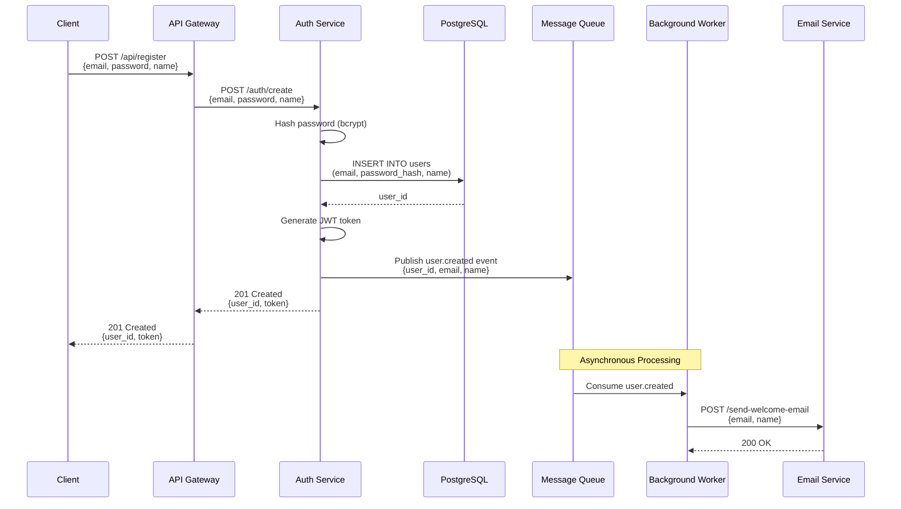

<output_format_comprehensive>

# System Architecture Documentation

_Generated on {timestamp}_

## Table of Contents
1. System Overview
2. Component Catalog (Applications + Libraries)
3. Dependency Relationships (Both Graphs)
4. Architectural Patterns
5. Technology Stack
6. Major Data Flows
7. Development Guide
8. Recommendations
9. Appendix

---

## 1. System Overview

### Purpose
{What does this system do? Business problems solved?}

### Organization
{Monorepo? Microservices? Structure?}

### Architecture Style
{Microservices, SOA, Event-driven, etc.}

### Scale
- Applications: {N}
- Libraries: {M}
- Languages: {list}
- Estimated LOC: {approx}

---

## 2. Component Catalog

### 2.1 Applications

#### API/Gateway Applications
{For each: Name, Purpose, Libraries Used, App Interactions, Tech, Patterns}

#### Background Workers
{Same format}

#### CLI Applications
{Same format}

#### Services
{Same format}

### 2.2 Libraries

#### Foundation Libraries
{For each: Name, Purpose, Exports, Dependencies, Used By, Tech, Patterns}

#### Data Models
{Same format}

#### Business Logic
{Same format}

#### Infrastructure
{Same format}

---

## 3. Dependency Relationships

### 3.1 Library Dependency Graph
{ASCII visualization + insights}

### 3.2 Application Interaction Graph
{ASCII visualization + interaction details + insights}

### 3.3 Third-Party Integrations
{External services by category}

### 3.4 Application-Library Usage Matrix
{Table showing which apps use which libraries}

---

## 4. Architectural Patterns

### 4.1 Library Patterns
{Layering, design patterns, API design, reusability}

### 4.2 Application Patterns
{Layered architecture, design patterns, error handling, async}

### 4.3 Communication Patterns
{Synchronous, asynchronous, data sharing, gateway, orchestration}

---

## 5. Technology Stack

{Languages, frameworks, databases, ORMs, serialization, testing, build tools}

---

## 6. Major Data Flows

### 6.1 Application-Level Flows

Document 3-5 major end-to-end **inter-application** flows. For EACH flow, provide:

1. **Flow Name & Description**: Brief overview of what this flow accomplishes
2. **Mermaid Sequence Diagram**: Visual representation of the flow
3. **Detailed Steps**: Step-by-step breakdown with technical details
4. **Error Paths**: How errors are handled at each step
5. **Key Technical Details**: Data formats, protocols, transformations
6. **Key Parameters**: Key system params used to guard and faciliate safety flows wrt to distributed systems and blockchain consensus theory 

#### Example Flow Format:

**User Registration Flow**

High-level description: New user creates an account, triggering authentication, database storage, and async notification.

**Detailed Steps:**

1. **Client Request** (Client → API Gateway)
   - Method: `POST /api/register`
   - Body: `{"email": "user@example.com", "password": "...", "name": "John Doe"}`
   - Headers: `Content-Type: application/json`

2. **Gateway Forwards** (API Gateway → Auth Service)
   - Method: `POST /auth/create`
   - Adds correlation ID header for tracing
   - Validates basic request format

3. **Password Hashing** (Auth Service)
   - Uses bcrypt with salt rounds = 10
   - Generates secure password hash

4. **Database Insert** (Auth Service → PostgreSQL)
   - SQL: `INSERT INTO users (email, password_hash, name, created_at) VALUES (?, ?, ?, NOW())`
   - Returns: `user_id` (UUID)
   - Constraint: `UNIQUE(email)` prevents duplicates

5. **Token Generation** (Auth Service)
   - Creates JWT with payload: `{user_id, email, iat, exp}`
   - Expiration: 24 hours
   - Signed with HS256 algorithm

6. **Event Publishing** (Auth Service → Message Queue)
   - Exchange: `user-events`
   - Routing Key: `user.created`
   - Payload: `{"user_id": "...", "email": "...", "name": "...", "timestamp": "..."}`

7. **Response to Client** (Auth Service → API Gateway → Client)
   - Status: `201 Created`
   - Body: `{"user_id": "...", "token": "..."}`
   - Headers: `Location: /api/users/{user_id}`

8. **Async Email** (Background Worker)
   - Consumes `user.created` event from queue
   - Calls Email Service API
   - Sends welcome email with account confirmation link

**Error Paths:**

- **Invalid Email Format** → Auth Service validates, returns `400 Bad Request: Invalid email format`
- **Duplicate Email** → PostgreSQL UNIQUE constraint violation, returns `409 Conflict: Email already registered`
- **Database Connection Error** → Auth Service catches, returns `500 Internal Server Error`, logs error with correlation ID
- **Message Queue Unavailable** → Auth Service logs warning but continues (email is non-critical), returns success to client
- **Email Service Failed** → Background Worker retries 3 times with exponential backoff, then moves to dead letter queue

**Key Technical Details:**

- **Data Format**: JSON for all API communication
- **Protocol**: HTTP/1.1 with REST semantics
- **Authentication**: JWT tokens in `Authorization: Bearer {token}` header
- **Message Queue**: RabbitMQ with durable queues
- **Database Transaction**: Auth Service uses transaction for user insert + audit log
- **Idempotency**: Client can retry with `Idempotency-Key` header to prevent duplicate registrations

---

{Repeat similar format for other major flows}

### 6.2 Library Usage Patterns
{How apps use libraries}

---

## 7. Development Guide

{Prerequisites, repo structure, building, testing, understanding deps, patterns, where to start}

---

## 8. Recommendations

{Strengths, improvements, doc gaps, testing, complexity hotspots}

---

## 9. Appendix

{Service summary table, statistics, glossary}

</output_format_comprehensive>